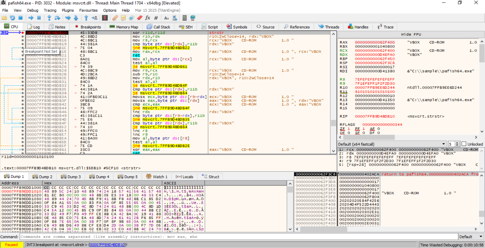
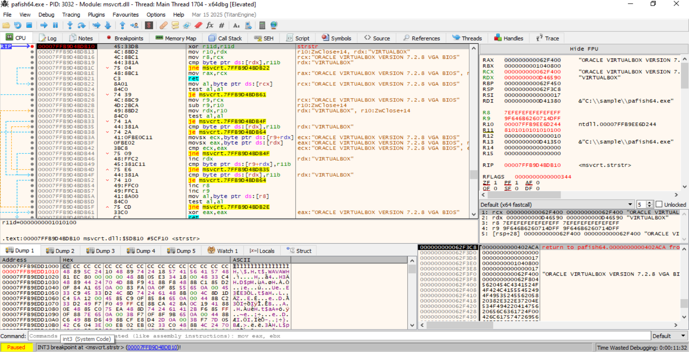

Por cada técnica rellenamos la plantilla:
```bash
# Técnica: [nombre]

## Categoría
Evasión / Anti-debug / Anti-VM / Anti-sandbox / Anti-análisis

## Objetivo de la técnica
¿Qué intenta averiguar el malware?

## Funcionamiento
Explicación breve de cómo lo hace.

## Artefactos o indicadores buscados
- Archivos:
- Registro:
- Procesos:
- APIs:
- Strings:
- Instrucciones:
- Objetos del sistema:

## Detección en análisis estático
¿Qué buscaría en Ghidra?
¿Qué imports serían sospechosos?
¿Qué strings podrían aparecer?
¿Qué constantes o rutas serían relevantes?

## Detección en análisis dinámico
¿Qué vería en Procmon, Process Explorer, x32dbg, Wireshark o Regshot?

## Herramientas útiles
- Ghidra:
- x32dbg/x64dbg:
- Procmon:
- Regshot:
- Wireshark:
- FakeNet-NG:

## Contramedidas defensivas
¿Cómo puede preparar el analista el laboratorio para reducir esta evasión?

## Aplicación al TFM
¿Cómo puedo usar esta técnica en mi investigación?

## Nivel de prioridad
Alta / Media / Baja
```





