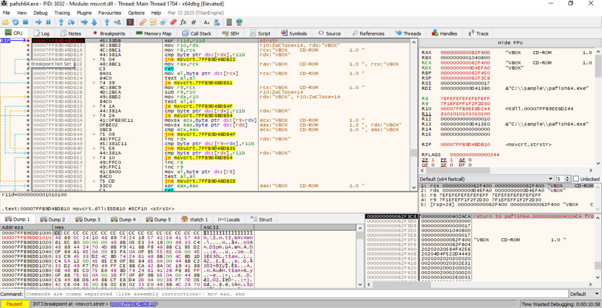
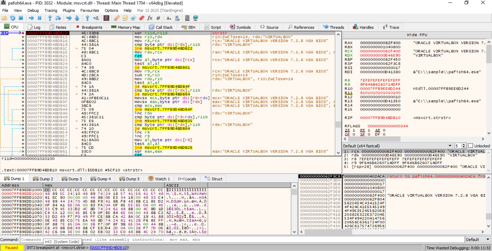

Durante la depuración de `pafish64.exe` se observaron llamadas a `msvcrt.strstr` en las que la herramienta comparaba cadenas del sistema con indicadores asociados a VirtualBox.

En una de las capturas se observa la comparación:

```text
strstr("VBOX CD-ROM 1.0", "VBOX")
```

En otra captura se observa:



```bash
strstr("ORACLE VIRTUALBOX VERSION 7.2.8 VGA BIOS", "VIRTUALBOX")
```


| Evidencia observada                                                | ¿Filesystem? | Técnica/categoría más adecuada | Motivo                                                                                                                      |
| ------------------------------------------------------------------ | -----------: | ------------------------------ | --------------------------------------------------------------------------------------------------------------------------- |
| `strstr("VBOX CD-ROM 1.0", "VBOX")`                                |           No | `hardware.md`                  | Está buscando una cadena de dispositivo virtual, probablemente asociada a CD-ROM/SCSI/almacenamiento virtual de VirtualBox. |
| `strstr("ORACLE VIRTUALBOX VERSION 7.2.8 VGA BIOS", "VIRTUALBOX")` |           No | `hardware.md` / firmware-BIOS  | Está buscando una cadena de BIOS/VGA BIOS propia de VirtualBox.                                                             |
| `VBoxVBoxVBox` vía `CPUID`                                         |           No | `cpu.md`                       | Eso sí corresponde a detección por CPU/hypervisor vendor.                                                                   |
| `VBoxGuest.sys`, `VBoxMouse.sys`, `vboxservice.exe`                |           Sí | `filesystem.md`                | Son archivos concretos del sistema.                                                                                         |
| `C:\Program Files\Oracle\VirtualBox Guest Additions\`              |           Sí | `filesystem.md`                | Es un directorio concreto.                                                                                                  |
# 8. La técnica Hardware

## 8.1. Descripción de la técnica Hardware

La técnica **Hardware** comprende el conjunto de comprobaciones mediante las cuales un programa obtiene y analiza información sobre los componentes físicos —o aparentemente físicos— del sistema en el que se ejecuta. En el contexto del análisis de malware, estas comprobaciones se utilizan principalmente para determinar si el código se encuentra en un equipo real o dentro de una **máquina virtual**, una **sandbox automatizada** o un laboratorio de análisis.

Los entornos virtualizados deben emular distintos dispositivos, como discos, procesadores, adaptadores gráficos, interfaces de red, controladores de audio y firmware. Esta emulación puede dejar artefactos reconocibles en los nombres de los dispositivos, identificadores de fabricante, controladores instalados, valores devueltos por el firmware o características de los recursos disponibles. El malware puede consultar estos datos y compararlos con valores asociados a plataformas como VMware, VirtualBox, QEMU o Microsoft Hyper-V.

El funcionamiento general de la técnica puede resumirse en las siguientes fases:

1. **Recopilación de información:** el programa consulta las propiedades de uno o varios componentes del sistema.
2. **Normalización de los datos:** transforma o prepara los valores obtenidos para facilitar su comparación.
3. **Búsqueda de indicadores:** comprueba si aparecen cadenas, identificadores o configuraciones relacionadas con entornos virtualizados.
4. **Evaluación del entorno:** combina uno o varios resultados para estimar si el sistema es real o pertenece a un laboratorio.
5. **Modificación del comportamiento:** si detecta indicios de análisis, puede finalizar, permanecer inactivo, retrasar su ejecución, mostrar un comportamiento benigno o evitar desplegar su carga maliciosa.

Estas verificaciones no siempre buscan una marca explícita de virtualización. Algunas se basan en **heurísticas**, como una cantidad anormalmente baja de memoria RAM, un disco de poca capacidad, un único procesador lógico o la ausencia de dispositivos habituales. Por tanto, una comprobación aislada no demuestra necesariamente que el programa esté aplicando una técnica de evasión. La detección resulta más fiable cuando se correlacionan varias consultas de hardware con decisiones posteriores en el flujo de ejecución.

## 8.2. Categoría y clasificación

La técnica Hardware pertenece a la categoría general de **anti-análisis**, ya que su finalidad es dificultar que el comportamiento real del malware sea observado, registrado o comprendido por un analista. Dentro de esta categoría puede clasificarse de la siguiente forma:

| Nivel de clasificación | Clasificación |
|---|---|
| Categoría principal | Anti-análisis |
| Subcategoría | Evasión del entorno de análisis |
| Familia funcional | Detección de máquinas virtuales y sandboxes |
| Fuente de información | Hardware, firmware y dispositivos emulados |
| Objetivo | Distinguir un equipo físico de un entorno virtualizado o automatizado |
| Resultado habitual | Ejecución condicional, terminación, retraso o ocultación de la carga maliciosa |

Desde una perspectiva funcional, las comprobaciones basadas en hardware pueden dividirse en dos grupos:

### Detecciones directas

Buscan artefactos que identifican de forma relativamente explícita una tecnología de virtualización. Algunos ejemplos son:

- nombres de disco que contienen `VBOX`, `VMware`, `QEMU` o `VIRTUAL HD`;
- identificadores de fabricante asociados a dispositivos virtuales;
- descripciones de adaptadores gráficos como `VMware SVGA 3D`;
- fabricantes del sistema o de la BIOS relacionados con un hipervisor;
- direcciones MAC cuyos prefijos pertenecen a proveedores de virtualización.

Estas comprobaciones suelen ofrecer una señal más específica, aunque pueden ser neutralizadas modificando los valores expuestos por la máquina virtual.

### Detecciones heurísticas

Evalúan si la configuración del equipo es poco habitual para un sistema utilizado por una persona. Entre los indicadores más comunes se encuentran:

- memoria RAM reducida;
- pocos procesadores o núcleos;
- disco de baja capacidad;
- ausencia de dispositivo de audio;
- ausencia de sensores o información térmica;
- resolución de pantalla limitada;
- escasez de dispositivos conectados;
- configuraciones de hardware excesivamente homogéneas.

Las heurísticas son menos específicas y pueden generar falsos positivos en equipos reales con pocos recursos, servidores, sistemas embebidos o instalaciones mínimas.

También puede establecerse una clasificación según el componente consultado:

| Clase | Elementos examinados |
|---|---|
| Procesador | Fabricante, número de núcleos, instrucciones, hipervisor y topología |
| Memoria | Memoria física instalada y memoria disponible |
| Almacenamiento | Modelo, fabricante, número de serie, capacidad y geometría del disco |
| Firmware | BIOS, UEFI, SMBIOS y fabricante del sistema |
| Gráficos | Adaptador, controlador, identificadores PCI y capacidades DirectX |
| Red | Fabricante del adaptador y prefijo de la dirección MAC |
| Periféricos | Audio, USB, cámara, impresoras y dispositivos de entrada |
| Sensores | Temperatura, batería y otros datos normalmente presentes en equipos físicos |

## 8.3. Técnicas de detección basadas en Hardware

Las técnicas de detección basadas en hardware consultan propiedades de componentes físicos o emulados y buscan inconsistencias o indicadores relacionados con la virtualización. A continuación se describen las comprobaciones más representativas.

### 8.3.1. Comprobación del nombre y modelo del disco

Los hipervisores suelen presentar unidades de almacenamiento con nombres o descripciones características. El malware puede enumerar los discos instalados y analizar su nombre descriptivo, modelo o identificador de fabricante.

En Windows, esta información puede obtenerse mediante funciones de la API de instalación de dispositivos, entre ellas:

- `SetupDiGetClassDevs`;
- `SetupDiEnumDeviceInfo`;
- `SetupDiGetDeviceRegistryProperty`.

También puede consultarse directamente la información del dispositivo mediante `DeviceIoControl` y el código de control `IOCTL_STORAGE_QUERY_PROPERTY`.

Entre los valores que pueden actuar como indicadores se encuentran:

| Plataforma | Posibles cadenas identificativas |
|---|---|
| QEMU | `QEMU` |
| VirtualBox | `VBOX` |
| Virtual PC | `VIRTUAL HD` |
| VMware | `VMware` |

El análisis no debe limitarse a una coincidencia exacta, ya que las cadenas pueden aparecer con variaciones de mayúsculas, espacios o sufijos. Desde el punto de vista defensivo, la enumeración de dispositivos seguida de comparaciones con estos términos constituye un indicador relevante, especialmente si condiciona el flujo de ejecución.

### 8.3.2. Comprobación de la capacidad del almacenamiento

Muchas sandboxes utilizan discos virtuales pequeños para reducir el consumo de recursos. Por este motivo, algunos programas consultan la capacidad total de las unidades y consideran sospechoso que el almacenamiento disponible se encuentre por debajo de un umbral determinado.

Esta técnica es heurística y presenta una fiabilidad limitada. Un equipo físico antiguo, un sistema embebido o una máquina destinada a tareas concretas también puede disponer de poca capacidad. Su valor aumenta cuando se combina con otros indicadores, como poca memoria RAM o un único procesador lógico.

### 8.3.3. Comprobación del procesador

El procesador puede proporcionar información útil para identificar un hipervisor. Las comprobaciones más frecuentes incluyen:

- número de procesadores lógicos;
- número de núcleos físicos;
- fabricante y modelo de la CPU;
- topología del procesador;
- presencia de características asociadas a la virtualización;
- consulta de información mediante la instrucción `CPUID`.

En Windows, el número y la topología de los procesadores pueden obtenerse mediante funciones como `GetSystemInfo`, `GetNativeSystemInfo` o `GetLogicalProcessorInformationEx`.

La presencia de uno o dos procesadores lógicos no demuestra por sí sola que exista virtualización. Sin embargo, una configuración mínima puede resultar sospechosa cuando aparece junto con otros recursos reducidos o dispositivos genéricos.

### 8.3.4. Comprobación de la memoria RAM

Las sandboxes y máquinas virtuales de análisis suelen configurarse con una cantidad limitada de memoria para permitir la ejecución simultánea de múltiples instancias. El malware puede consultar la memoria física instalada mediante funciones como `GlobalMemoryStatusEx` y comparar el resultado con un umbral predefinido.

Esta comprobación se considera una detección heurística. Su principal inconveniente es la posibilidad de falsos positivos, ya que existen equipos físicos con poca memoria y entornos virtualizados configurados con recursos abundantes.

### 8.3.5. Comprobación de la BIOS, SMBIOS y fabricante del sistema

La BIOS, el firmware UEFI y las estructuras SMBIOS pueden contener información sobre el fabricante, el modelo del equipo, la placa base y otros componentes. En entornos virtuales es habitual encontrar referencias al proveedor del hipervisor.

El malware puede obtener estos datos a través de WMI, el Registro de Windows o funciones que permiten acceder a las tablas de firmware. Algunas clases WMI relevantes son:

- `Win32_BIOS`;
- `Win32_ComputerSystem`;
- `Win32_BaseBoard`;
- `Win32_SystemEnclosure`.

Entre los campos examinados suelen encontrarse `Manufacturer`, `Model`, `SerialNumber` y `Product`. Las coincidencias con nombres de fabricantes de virtualización constituyen una señal directa, aunque estos valores pueden ser modificados por el administrador del entorno.

### 8.3.6. Comprobación del adaptador gráfico

Los adaptadores gráficos virtuales pueden exponer identificadores, controladores y descripciones específicas. Una técnica consiste en crear una interfaz Direct3D y consultar la información del adaptador mediante:

- `Direct3DCreate9`;
- `IDirect3D9::GetAdapterIdentifier`.

La estructura `D3DADAPTER_IDENTIFIER9` proporciona campos como:

- `VendorId`;
- `DeviceId`;
- `Driver`;
- `Description`.

En una máquina VMware, por ejemplo, pueden aparecer valores como el identificador de fabricante `0x15AD`, controladores cuyo nombre contiene `vm3dum` o la descripción `VMware SVGA 3D`. El malware puede comparar estos campos con una lista de indicadores conocidos y modificar su ejecución cuando encuentra una coincidencia.

La tarjeta gráfica es un indicador útil porque muchas sandboxes utilizan adaptadores genéricos. No obstante, la aceleración gráfica, el *passthrough* de GPU y la personalización de los controladores pueden reducir la eficacia de esta comprobación.

### 8.3.7. Comprobación de dispositivos de audio

Algunos entornos automatizados carecen de tarjeta o dispositivo de audio. El malware puede intentar crear o enumerar filtros y dispositivos de reproducción para determinar si existe una configuración multimedia funcional.

En Windows, estas comprobaciones pueden apoyarse en COM y DirectShow mediante objetos como `CLSID_FilterGraph` y `CLSID_AudioRender`. La ausencia del dispositivo, un error inesperado durante su inicialización o una configuración excesivamente básica puede considerarse un indicio de sandbox.

La ausencia de audio es una señal débil cuando se analiza de forma aislada, ya que determinados servidores y máquinas físicas tampoco disponen de este tipo de dispositivo.

### 8.3.8. Comprobación de sensores y temperatura

Los equipos físicos pueden proporcionar información térmica mediante ACPI, WMI o herramientas del fabricante. Algunos entornos virtuales no implementan estos sensores o devuelven valores vacíos.

Una posible consulta en sistemas Windows consiste en acceder a la clase WMI `MSAcpi_ThermalZoneTemperature`. Si la información de temperatura no está disponible, el malware puede interpretarlo como un indicio de virtualización.

Esta comprobación presenta limitaciones importantes: numerosos equipos físicos tampoco exponen correctamente estos datos a través de WMI. Por ello, debe considerarse una heurística complementaria y no una prueba concluyente.

### 8.3.9. Comprobación de adaptadores de red

Los adaptadores de red virtuales pueden identificarse mediante el nombre del dispositivo, el fabricante, el controlador o el prefijo de la dirección MAC. Los primeros bytes de una dirección MAC forman el identificador organizativo del fabricante y pueden asociarse a proveedores concretos.

El malware puede enumerar las interfaces de red y comparar sus propiedades con listas de prefijos conocidos. Esta técnica puede resultar efectiva frente a configuraciones predeterminadas, pero pierde fiabilidad cuando la dirección MAC se modifica o se utiliza una interfaz física mediante mecanismos de asignación directa.

### 8.3.10. Comprobación de periféricos y diversidad del hardware

Las sandboxes suelen disponer de pocos dispositivos conectados y de configuraciones muy homogéneas. Por ello, algunos programas enumeran dispositivos USB, cámaras, impresoras, baterías, pantallas o dispositivos de entrada.

La inexistencia de periféricos no constituye una prueba suficiente. El objetivo habitual es construir una puntuación de sospecha combinando varios factores, por ejemplo:

- ausencia de audio;
- ausencia de batería;
- un único monitor;
- ningún dispositivo USB;
- adaptador gráfico genérico;
- disco y memoria de poca capacidad.

Esta combinación reduce la dependencia de un único indicador y dificulta la preparación de un entorno de análisis que reproduzca de forma convincente un equipo utilizado por una persona.

### 8.3.11. Interpretación y detección defensiva

Desde el punto de vista defensivo, las consultas de hardware son operaciones legítimas que también realizan aplicaciones de inventario, controladores, videojuegos y herramientas de diagnóstico. Por tanto, no deben considerarse maliciosas únicamente por las funciones utilizadas.

La detección debe centrarse en la secuencia completa de comportamiento:

1. enumeración de varios componentes;
2. extracción de nombres, fabricantes o identificadores;
3. comparación con cadenas asociadas a hipervisores;
4. acumulación de resultados o cálculo de una puntuación;
5. salto condicional, terminación o modificación de la ejecución.

El análisis dinámico puede apoyarse en la monitorización de llamadas a las API utilizadas para consultar hardware, mientras que el análisis estático puede buscar cadenas de fabricantes, identificadores PCI, clases WMI y rutinas de comparación. La correlación entre estas evidencias permite distinguir una comprobación legítima de una técnica de evasión.

### Resumen

Las técnicas Hardware aprovechan las diferencias existentes entre los dispositivos físicos y los componentes emulados por una plataforma de virtualización. Su eficacia depende de la especificidad de los indicadores y de la cantidad de comprobaciones combinadas. Las detecciones directas pueden identificar marcas concretas del hipervisor, mientras que las heurísticas evalúan si los recursos y periféricos del sistema resultan compatibles con un equipo real. Debido a la posibilidad de falsos positivos, la conclusión debe basarse en múltiples evidencias y en la relación de estas consultas con el comportamiento posterior del programa.