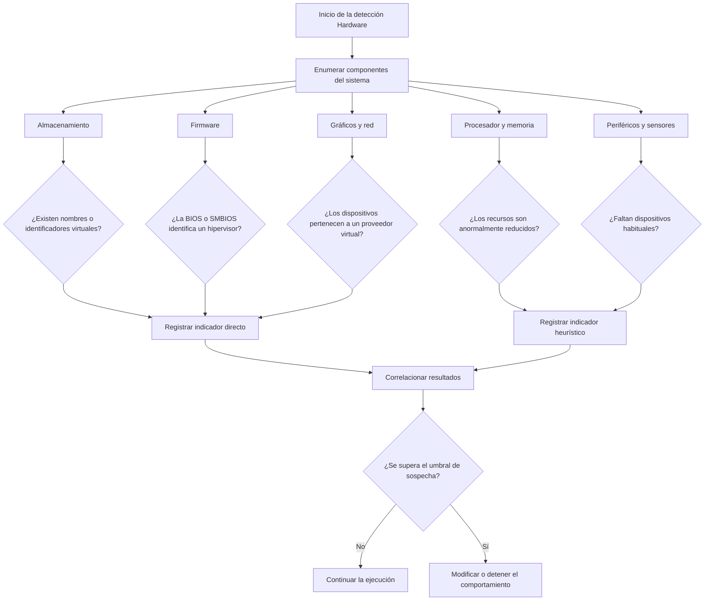

- [8. La técnica Hardware](#8-la-técnica-hardware)
  - [8.1. Descripción de la técnica Hardware](#81-descripción-de-la-técnica-hardware)
  - [8.2. Categoría y clasificación](#82-categoría-y-clasificación)
    - [Detecciones directas](#detecciones-directas)
    - [Detecciones heurísticas](#detecciones-heurísticas)
  - [8.3. Técnicas de detección basadas en Hardware](#83-técnicas-de-detección-basadas-en-hardware)
    - [8.3.1. Comprobación del nombre y modelo del disco](#831-comprobación-del-nombre-y-modelo-del-disco)
    - [8.3.2. Comprobación de la capacidad del almacenamiento](#832-comprobación-de-la-capacidad-del-almacenamiento)
    - [8.3.3. Comprobación del procesador](#833-comprobación-del-procesador)
    - [8.3.4. Comprobación de la memoria RAM](#834-comprobación-de-la-memoria-ram)
    - [8.3.5. Comprobación de la BIOS, SMBIOS y fabricante del sistema](#835-comprobación-de-la-bios-smbios-y-fabricante-del-sistema)
    - [8.3.6. Comprobación del adaptador gráfico](#836-comprobación-del-adaptador-gráfico)
    - [8.3.7. Comprobación de dispositivos de audio](#837-comprobación-de-dispositivos-de-audio)
    - [8.3.8. Comprobación de sensores y temperatura](#838-comprobación-de-sensores-y-temperatura)
    - [8.3.9. Comprobación de adaptadores de red](#839-comprobación-de-adaptadores-de-red)
    - [8.3.10. Comprobación de periféricos y diversidad del hardware](#8310-comprobación-de-periféricos-y-diversidad-del-hardware)
    - [8.3.11. Interpretación y detección defensiva](#8311-interpretación-y-detección-defensiva)
  - [8.4. Resumen visual de las técnicas Hardware](#84-resumen-visual-de-las-técnicas-hardware)
    - [Tabla resumen](#tabla-resumen)
    - [Clasificación visual](#clasificación-visual)
    - [Lectura del resumen](#lectura-del-resumen)
  - [8.5. Contramedidas ofensivas](#85-contramedidas-ofensivas)
    - [Combinación de múltiples comprobaciones Hardware](#combinación-de-múltiples-comprobaciones-hardware)
    - [Sistema de puntuación y umbrales](#sistema-de-puntuación-y-umbrales)
    - [Ejecución condicional de la carga](#ejecución-condicional-de-la-carga)
    - [Distribución de las comprobaciones](#distribución-de-las-comprobaciones)
    - [Ocultación de las rutinas de detección](#ocultación-de-las-rutinas-de-detección)
    - [Consulta indirecta de la información](#consulta-indirecta-de-la-información)
    - [Comprobación de coherencia entre fuentes](#comprobación-de-coherencia-entre-fuentes)
    - [Uso de requisitos Hardware específicos](#uso-de-requisitos-hardware-específicos)
    - [Respuesta gradual ante la detección](#respuesta-gradual-ante-la-detección)
    - [Limitaciones de las contramedidas ofensivas](#limitaciones-de-las-contramedidas-ofensivas)
  - [8.6. Contramedidas defensivas](#86-contramedidas-defensivas)
    - [Construcción de entornos realistas](#construcción-de-entornos-realistas)
    - [Monitorización de las consultas de hardware](#monitorización-de-las-consultas-de-hardware)
    - [Interceptación y normalización de respuestas](#interceptación-y-normalización-de-respuestas)
    - [Correlación de indicadores](#correlación-de-indicadores)
    - [Análisis de ramas no ejecutadas](#análisis-de-ramas-no-ejecutadas)
    - [Uso de múltiples perfiles de análisis](#uso-de-múltiples-perfiles-de-análisis)
    - [Reglas y firmas de comportamiento](#reglas-y-firmas-de-comportamiento)
    - [Reducción de falsos positivos](#reducción-de-falsos-positivos)
  - [8.7. Conclusiones](#87-conclusiones)

# 8. La técnica Hardware

## 8.1. Descripción de la técnica Hardware

La técnica **Hardware** comprende el conjunto de comprobaciones mediante las cuales un programa obtiene y analiza información sobre los componentes físicos —o aparentemente físicos— del sistema en el que se ejecuta. En el contexto del análisis de malware, estas comprobaciones se utilizan principalmente para determinar si el código se encuentra en un equipo real o dentro de una **máquina virtual**, una **sandbox automatizada** o un laboratorio de análisis.

Los entornos virtualizados deben emular distintos dispositivos, como discos, procesadores, adaptadores gráficos, interfaces de red, controladores de audio y firmware. Esta emulación puede dejar artefactos reconocibles en los nombres de los dispositivos, identificadores de fabricante, controladores instalados, valores devueltos por el firmware o características de los recursos disponibles. El malware puede consultar estos datos y compararlos con valores asociados a plataformas como VMware, VirtualBox, QEMU o Microsoft Hyper-V.

El funcionamiento general de la técnica puede resumirse en las siguientes fases:

1. **Recopilación de información:** el programa consulta las propiedades de uno o varios componentes del sistema.
2. **Normalización de los datos:** transforma o prepara los valores obtenidos para facilitar su comparación.
3. **Búsqueda de indicadores:** comprueba si aparecen cadenas, identificadores o configuraciones relacionadas con entornos virtualizados.
4. **Evaluación del entorno:** combina uno o varios resultados para estimar si el sistema es real o pertenece a un laboratorio.
5. **Modificación del comportamiento:** si detecta indicios de análisis, puede finalizar, permanecer inactivo, retrasar su ejecución, mostrar un comportamiento benigno o evitar desplegar su carga maliciosa.

Estas verificaciones no siempre buscan una marca explícita de virtualización. Algunas se basan en **heurísticas**, como una cantidad anormalmente baja de memoria RAM, un disco de poca capacidad, un único procesador lógico o la ausencia de dispositivos habituales. Por tanto, una comprobación aislada no demuestra necesariamente que el programa esté aplicando una técnica de evasión. La detección resulta más fiable cuando se correlacionan varias consultas de hardware con decisiones posteriores en el flujo de ejecución.

## 8.2. Categoría y clasificación

La técnica Hardware pertenece a la categoría general de **anti-análisis**, ya que su finalidad es dificultar que el comportamiento real del malware sea observado, registrado o comprendido por un analista. Dentro de esta categoría puede clasificarse de la siguiente forma:

| Nivel de clasificación | Clasificación |
|---|---|
| Categoría principal | Anti-análisis |
| Subcategoría | Evasión del entorno de análisis |
| Familia funcional | Detección de máquinas virtuales y sandboxes |
| Fuente de información | Hardware, firmware y dispositivos emulados |
| Objetivo | Distinguir un equipo físico de un entorno virtualizado o automatizado |
| Resultado habitual | Ejecución condicional, terminación, retraso o ocultación de la carga maliciosa |

Desde una perspectiva funcional, las comprobaciones basadas en hardware pueden dividirse en dos grupos:

### Detecciones directas

Buscan artefactos que identifican de forma relativamente explícita una tecnología de virtualización. Algunos ejemplos son:

- nombres de disco que contienen `VBOX`, `VMware`, `QEMU` o `VIRTUAL HD`;
- identificadores de fabricante asociados a dispositivos virtuales;
- descripciones de adaptadores gráficos como `VMware SVGA 3D`;
- fabricantes del sistema o de la BIOS relacionados con un hipervisor;
- direcciones MAC cuyos prefijos pertenecen a proveedores de virtualización.

Estas comprobaciones suelen ofrecer una señal más específica, aunque pueden ser neutralizadas modificando los valores expuestos por la máquina virtual.

### Detecciones heurísticas

Evalúan si la configuración del equipo es poco habitual para un sistema utilizado por una persona. Entre los indicadores más comunes se encuentran:

- memoria RAM reducida;
- pocos procesadores o núcleos;
- disco de baja capacidad;
- ausencia de dispositivo de audio;
- ausencia de sensores o información térmica;
- resolución de pantalla limitada;
- escasez de dispositivos conectados;
- configuraciones de hardware excesivamente homogéneas.

Las heurísticas son menos específicas y pueden generar falsos positivos en equipos reales con pocos recursos, servidores, sistemas embebidos o instalaciones mínimas.

También puede establecerse una clasificación según el componente consultado:

| Clase | Elementos examinados |
|---|---|
| Procesador | Fabricante, número de núcleos, instrucciones, hipervisor y topología |
| Memoria | Memoria física instalada y memoria disponible |
| Almacenamiento | Modelo, fabricante, número de serie, capacidad y geometría del disco |
| Firmware | BIOS, UEFI, SMBIOS y fabricante del sistema |
| Gráficos | Adaptador, controlador, identificadores PCI y capacidades DirectX |
| Red | Fabricante del adaptador y prefijo de la dirección MAC |
| Periféricos | Audio, USB, cámara, impresoras y dispositivos de entrada |
| Sensores | Temperatura, batería y otros datos normalmente presentes en equipos físicos |

## 8.3. Técnicas de detección basadas en Hardware

Las técnicas de detección basadas en hardware consultan propiedades de componentes físicos o emulados y buscan inconsistencias o indicadores relacionados con la virtualización. A continuación se describen las comprobaciones más representativas.

### 8.3.1. Comprobación del nombre y modelo del disco

Los hipervisores suelen presentar unidades de almacenamiento con nombres o descripciones características. El malware puede enumerar los discos instalados y analizar su nombre descriptivo, modelo o identificador de fabricante.

En Windows, esta información puede obtenerse mediante funciones de la API de instalación de dispositivos, entre ellas:

- `SetupDiGetClassDevs`;
- `SetupDiEnumDeviceInfo`;
- `SetupDiGetDeviceRegistryProperty`.

También puede consultarse directamente la información del dispositivo mediante `DeviceIoControl` y el código de control `IOCTL_STORAGE_QUERY_PROPERTY`.

Entre los valores que pueden actuar como indicadores se encuentran:

| Plataforma | Posibles cadenas identificativas |
|---|---|
| QEMU | `QEMU` |
| VirtualBox | `VBOX` |
| Virtual PC | `VIRTUAL HD` |
| VMware | `VMware` |

El análisis no debe limitarse a una coincidencia exacta, ya que las cadenas pueden aparecer con variaciones de mayúsculas, espacios o sufijos. Desde el punto de vista defensivo, la enumeración de dispositivos seguida de comparaciones con estos términos constituye un indicador relevante, especialmente si condiciona el flujo de ejecución.

### 8.3.2. Comprobación de la capacidad del almacenamiento

Muchas sandboxes utilizan discos virtuales pequeños para reducir el consumo de recursos. Por este motivo, algunos programas consultan la capacidad total de las unidades y consideran sospechoso que el almacenamiento disponible se encuentre por debajo de un umbral determinado.

Esta técnica es heurística y presenta una fiabilidad limitada. Un equipo físico antiguo, un sistema embebido o una máquina destinada a tareas concretas también puede disponer de poca capacidad. Su valor aumenta cuando se combina con otros indicadores, como poca memoria RAM o un único procesador lógico.

### 8.3.3. Comprobación del procesador

El procesador puede proporcionar información útil para identificar un hipervisor. Las comprobaciones más frecuentes incluyen:

- número de procesadores lógicos;
- número de núcleos físicos;
- fabricante y modelo de la CPU;
- topología del procesador;
- presencia de características asociadas a la virtualización;
- consulta de información mediante la instrucción `CPUID`.

En Windows, el número y la topología de los procesadores pueden obtenerse mediante funciones como `GetSystemInfo`, `GetNativeSystemInfo` o `GetLogicalProcessorInformationEx`.

La presencia de uno o dos procesadores lógicos no demuestra por sí sola que exista virtualización. Sin embargo, una configuración mínima puede resultar sospechosa cuando aparece junto con otros recursos reducidos o dispositivos genéricos.

### 8.3.4. Comprobación de la memoria RAM

Las sandboxes y máquinas virtuales de análisis suelen configurarse con una cantidad limitada de memoria para permitir la ejecución simultánea de múltiples instancias. El malware puede consultar la memoria física instalada mediante funciones como `GlobalMemoryStatusEx` y comparar el resultado con un umbral predefinido.

Esta comprobación se considera una detección heurística. Su principal inconveniente es la posibilidad de falsos positivos, ya que existen equipos físicos con poca memoria y entornos virtualizados configurados con recursos abundantes.

### 8.3.5. Comprobación de la BIOS, SMBIOS y fabricante del sistema

La BIOS, el firmware UEFI y las estructuras SMBIOS pueden contener información sobre el fabricante, el modelo del equipo, la placa base y otros componentes. En entornos virtuales es habitual encontrar referencias al proveedor del hipervisor.

El malware puede obtener estos datos a través de WMI, el Registro de Windows o funciones que permiten acceder a las tablas de firmware. Algunas clases WMI relevantes son:

- `Win32_BIOS`;
- `Win32_ComputerSystem`;
- `Win32_BaseBoard`;
- `Win32_SystemEnclosure`.

Entre los campos examinados suelen encontrarse `Manufacturer`, `Model`, `SerialNumber` y `Product`. Las coincidencias con nombres de fabricantes de virtualización constituyen una señal directa, aunque estos valores pueden ser modificados por el administrador del entorno.

### 8.3.6. Comprobación del adaptador gráfico

Los adaptadores gráficos virtuales pueden exponer identificadores, controladores y descripciones específicas. Una técnica consiste en crear una interfaz Direct3D y consultar la información del adaptador mediante:

- `Direct3DCreate9`;
- `IDirect3D9::GetAdapterIdentifier`.

La estructura `D3DADAPTER_IDENTIFIER9` proporciona campos como:

- `VendorId`;
- `DeviceId`;
- `Driver`;
- `Description`.

En una máquina VMware, por ejemplo, pueden aparecer valores como el identificador de fabricante `0x15AD`, controladores cuyo nombre contiene `vm3dum` o la descripción `VMware SVGA 3D`. El malware puede comparar estos campos con una lista de indicadores conocidos y modificar su ejecución cuando encuentra una coincidencia.

La tarjeta gráfica es un indicador útil porque muchas sandboxes utilizan adaptadores genéricos. No obstante, la aceleración gráfica, el *passthrough* de GPU y la personalización de los controladores pueden reducir la eficacia de esta comprobación.

### 8.3.7. Comprobación de dispositivos de audio

Algunos entornos automatizados carecen de tarjeta o dispositivo de audio. El malware puede intentar crear o enumerar filtros y dispositivos de reproducción para determinar si existe una configuración multimedia funcional.

En Windows, estas comprobaciones pueden apoyarse en COM y DirectShow mediante objetos como `CLSID_FilterGraph` y `CLSID_AudioRender`. La ausencia del dispositivo, un error inesperado durante su inicialización o una configuración excesivamente básica puede considerarse un indicio de sandbox.

La ausencia de audio es una señal débil cuando se analiza de forma aislada, ya que determinados servidores y máquinas físicas tampoco disponen de este tipo de dispositivo.

### 8.3.8. Comprobación de sensores y temperatura

Los equipos físicos pueden proporcionar información térmica mediante ACPI, WMI o herramientas del fabricante. Algunos entornos virtuales no implementan estos sensores o devuelven valores vacíos.

Una posible consulta en sistemas Windows consiste en acceder a la clase WMI `MSAcpi_ThermalZoneTemperature`. Si la información de temperatura no está disponible, el malware puede interpretarlo como un indicio de virtualización.

Esta comprobación presenta limitaciones importantes: numerosos equipos físicos tampoco exponen correctamente estos datos a través de WMI. Por ello, debe considerarse una heurística complementaria y no una prueba concluyente.

### 8.3.9. Comprobación de adaptadores de red

Los adaptadores de red virtuales pueden identificarse mediante el nombre del dispositivo, el fabricante, el controlador o el prefijo de la dirección MAC. Los primeros bytes de una dirección MAC forman el identificador organizativo del fabricante y pueden asociarse a proveedores concretos.

El malware puede enumerar las interfaces de red y comparar sus propiedades con listas de prefijos conocidos. Esta técnica puede resultar efectiva frente a configuraciones predeterminadas, pero pierde fiabilidad cuando la dirección MAC se modifica o se utiliza una interfaz física mediante mecanismos de asignación directa.

### 8.3.10. Comprobación de periféricos y diversidad del hardware

Las sandboxes suelen disponer de pocos dispositivos conectados y de configuraciones muy homogéneas. Por ello, algunos programas enumeran dispositivos USB, cámaras, impresoras, baterías, pantallas o dispositivos de entrada.

La inexistencia de periféricos no constituye una prueba suficiente. El objetivo habitual es construir una puntuación de sospecha combinando varios factores, por ejemplo:

- ausencia de audio;
- ausencia de batería;
- un único monitor;
- ningún dispositivo USB;
- adaptador gráfico genérico;
- disco y memoria de poca capacidad.

Esta combinación reduce la dependencia de un único indicador y dificulta la preparación de un entorno de análisis que reproduzca de forma convincente un equipo utilizado por una persona.

### 8.3.11. Interpretación y detección defensiva

Desde el punto de vista defensivo, las consultas de hardware son operaciones legítimas que también realizan aplicaciones de inventario, controladores, videojuegos y herramientas de diagnóstico. Por tanto, no deben considerarse maliciosas únicamente por las funciones utilizadas.

La detección debe centrarse en la secuencia completa de comportamiento:

1. enumeración de varios componentes;
2. extracción de nombres, fabricantes o identificadores;
3. comparación con cadenas asociadas a hipervisores;
4. acumulación de resultados o cálculo de una puntuación;
5. salto condicional, terminación o modificación de la ejecución.

El análisis dinámico puede apoyarse en la monitorización de llamadas a las API utilizadas para consultar hardware, mientras que el análisis estático puede buscar cadenas de fabricantes, identificadores PCI, clases WMI y rutinas de comparación. La correlación entre estas evidencias permite distinguir una comprobación legítima de una técnica de evasión.

## 8.4. Resumen visual de las técnicas Hardware

Las técnicas Hardware analizan las características de los componentes físicos o emulados del sistema para determinar si el malware se está ejecutando en un equipo real, una máquina virtual o una sandbox. Estas comprobaciones pueden buscar **artefactos directos**, como nombres de fabricantes asociados a hipervisores, o utilizar **indicadores heurísticos**, como una cantidad reducida de memoria, almacenamiento o periféricos.

> **Criterio de clasificación:** esta tabla agrupa las técnicas según el componente de hardware examinado. El mecanismo utilizado para obtener la información puede coincidir con otras categorías, como CPU, WMI, Registro o consultas genéricas del sistema operativo.

### Tabla resumen

| Componente analizado | Técnica de detección | Indicador observado | Tipo de detección | Fiabilidad aproximada |
|---|---|---|---|---|
| Disco duro | Comprobación del nombre o modelo del disco | Cadenas como `VBOX`, `VMware`, `QEMU` o `VIRTUAL HD` | Directa | Media-alta |
| Disco duro | Comprobación del fabricante o `Vendor ID` | Identificadores relacionados con dispositivos virtuales | Directa | Alta cuando el valor está expuesto |
| Almacenamiento | Comprobación de la capacidad del disco | Disco de tamaño muy reducido | Heurística | Baja de forma aislada |
| Memoria RAM | Comprobación de la memoria física instalada | Cantidad de RAM inferior a un umbral | Heurística | Baja de forma aislada |
| Procesador | Comprobación del número de procesadores o núcleos | Uno o pocos procesadores lógicos | Heurística | Baja-media |
| Procesador | Análisis del modelo, fabricante o topología | Valores genéricos, simplificados o incoherentes | Directa o heurística | Media |
| BIOS, UEFI y SMBIOS | Comprobación del fabricante y modelo del sistema | Referencias a VMware, VirtualBox, QEMU u otros hipervisores | Directa | Alta |
| Adaptador gráfico | Comprobación del fabricante, controlador o descripción | Identificadores PCI, controladores o descripciones virtuales | Directa | Media-alta |
| Dispositivo de audio | Comprobación de su presencia y funcionamiento | Ausencia de dispositivo o configuración multimedia mínima | Heurística | Baja |
| Sensores | Comprobación de temperatura, batería u otros sensores | Información inexistente, vacía o no disponible | Heurística | Baja |
| Adaptador de red | Comprobación del fabricante o prefijo MAC | Prefijo asociado a un proveedor de virtualización | Directa | Media |
| Periféricos | Enumeración de USB, cámara, impresoras o monitores | Ausencia o escasa diversidad de dispositivos | Heurística | Media cuando se combina |
| Conjunto del sistema | Correlación de múltiples indicadores | Varios componentes presentan artefactos o recursos anómalos | Compuesta | Alta cuando las evidencias son coherentes |

### Clasificación visual

```mermaid
flowchart TD
    A[Inicio de la detección Hardware] --> B[Enumerar componentes del sistema]

    B --> C[Almacenamiento]
    B --> D[Procesador y memoria]
    B --> E[Firmware]
    B --> F[Gráficos y red]
    B --> G[Periféricos y sensores]

    C --> H{¿Existen nombres o identificadores virtuales?}
    D --> I{¿Los recursos son anormalmente reducidos?}
    E --> J{¿La BIOS o SMBIOS identifica un hipervisor?}
    F --> K{¿Los dispositivos pertenecen a un proveedor virtual?}
    G --> L{¿Faltan dispositivos habituales?}

    H --> M[Registrar indicador directo]
    J --> M
    K --> M

    I --> N[Registrar indicador heurístico]
    L --> N

    M --> O[Correlacionar resultados]
    N --> O

    O --> P{¿Se supera el umbral de sospecha?}
    P -- No --> Q[Continuar la ejecución]
    P -- Sí --> R[Modificar o detener el comportamiento]
```

### Lectura del resumen

Las técnicas Hardware pueden organizarse en tres grupos principales:

1. **Identificación directa de componentes virtuales.**  
   Busca nombres, fabricantes, modelos, controladores o identificadores asociados a VMware, VirtualBox, QEMU, Hyper-V u otras plataformas.

2. **Evaluación heurística de recursos.**  
   Comprueba si el equipo dispone de poca memoria, pocos procesadores, un disco pequeño o una configuración excesivamente limitada.

3. **Análisis de presencia y diversidad de dispositivos.**  
   Examina si existen elementos habituales en un equipo real, como audio, sensores, monitores, dispositivos USB, cámara o batería.

Los indicadores directos suelen ser más específicos, pero pueden ocultarse o modificarse. Los indicadores heurísticos son más difíciles de eliminar por completo, aunque generan más falsos positivos. Por este motivo, las muestras más avanzadas combinan varias comprobaciones y toman la decisión final a partir de una puntuación o conjunto de evidencias.
## 8.5. Contramedidas ofensivas

En este contexto, las **contramedidas ofensivas** son las medidas incorporadas deliberadamente por el creador del malware para dificultar el trabajo del analista. Su finalidad es reconocer los entornos virtualizados empleados durante el análisis y evitar que la muestra revele en ellos su comportamiento real.

Estas contramedidas no consisten en mejorar o camuflar la máquina virtual del laboratorio. Esa tarea corresponde a las medidas defensivas. Desde la perspectiva ofensiva, el malware intenta **detectar, evaluar y aprovechar las diferencias del entorno de análisis** para decidir si debe ejecutar, retrasar u ocultar su carga maliciosa.

### Combinación de múltiples comprobaciones Hardware

El creador del malware puede incorporar consultas sobre varios componentes, como el disco, la memoria, el procesador, la BIOS, el adaptador gráfico, la red o los dispositivos de audio. El uso conjunto de diferentes indicadores reduce la dependencia de una única comprobación y dificulta que el analista neutralice la técnica modificando solamente un valor.

Por ejemplo, la muestra puede considerar sospechoso un sistema que presente simultáneamente:

- un disco con un modelo relacionado con un hipervisor;
- poca memoria RAM;
- un número reducido de procesadores;
- una BIOS con referencias a virtualización;
- ausencia de audio o periféricos;
- un adaptador gráfico virtual.

### Sistema de puntuación y umbrales

En lugar de finalizar ante la primera señal, el malware puede asignar una puntuación a cada indicador detectado. Los artefactos directos, como una cadena de fabricante virtual, pueden recibir mayor peso que las heurísticas basadas en recursos.

Cuando la puntuación acumulada supera un umbral, la muestra concluye que probablemente se encuentra en un entorno de análisis. Este método resulta más resistente a falsos positivos y complica la identificación de la comprobación concreta que provoca el cambio de comportamiento.

### Ejecución condicional de la carga

Una de las principales medidas ofensivas consiste en condicionar la ejecución del comportamiento malicioso al resultado de las comprobaciones Hardware. Si el entorno se considera sospechoso, la muestra puede:

- finalizar sin mostrar actividad relevante;
- permanecer inactiva;
- ejecutar únicamente funciones benignas;
- omitir la descarga o descifrado de la carga;
- evitar establecer comunicaciones;
- retrasar la ejecución de determinadas funciones;
- seguir una rama alternativa del programa.

De este modo, el analista puede observar una ejecución aparentemente inocua aunque la muestra tenga capacidades maliciosas ocultas.

### Distribución de las comprobaciones

Las rutinas de detección pueden situarse en distintos puntos del programa y no únicamente al inicio. El creador puede repetirlas antes de ejecutar funciones sensibles, después de desempaquetar el código o antes de iniciar una comunicación.

Esta distribución dificulta el análisis porque superar una primera comprobación no garantiza que la muestra no vuelva a examinar el entorno en una fase posterior.

### Ocultación de las rutinas de detección

Para impedir que el analista identifique fácilmente las comprobaciones, el malware puede ocultar su lógica mediante técnicas de anti-análisis estático. Entre las estrategias generales se encuentran:

- ofuscación de cadenas relacionadas con fabricantes y dispositivos;
- cifrado o construcción dinámica de los indicadores;
- resolución dinámica de las API utilizadas;
- división de una comprobación entre varias funciones;
- inserción de código irrelevante;
- empaquetado u ocultación del flujo de control.

La combinación de técnicas Hardware con ofuscación o packing obliga al analista a desempaquetar y reconstruir primero la lógica antes de poder neutralizarla.

### Consulta indirecta de la información

El creador puede obtener un mismo dato por diferentes mecanismos. Por ejemplo, la información de un dispositivo puede consultarse mediante API del sistema, WMI, Registro o instrucciones del procesador.

Esta variedad evita que el analista pueda controlar la técnica interceptando una única función y permite comparar los resultados obtenidos desde distintas fuentes.

### Comprobación de coherencia entre fuentes

Una muestra avanzada puede contrastar la información ofrecida por diferentes capas del sistema. Si la máquina virtual ha sido modificada para ocultar determinados indicadores, pueden aparecer inconsistencias entre:

- la BIOS y el modelo del equipo;
- el número de procesadores informado por distintas API;
- el fabricante del dispositivo y su controlador;
- la dirección MAC y el nombre del adaptador;
- la información del procesador obtenida mediante API y mediante instrucciones directas.

La detección de estas contradicciones permite al malware identificar entornos preparados específicamente para engañar sus comprobaciones.

### Uso de requisitos Hardware específicos

El malware también puede exigir la presencia de determinadas capacidades o dispositivos antes de activar su comportamiento. En lugar de buscar directamente una máquina virtual, comprueba si el entorno reproduce adecuadamente las características esperadas de un equipo real.

Entre los elementos que puede exigir se encuentran:

- varios núcleos o procesadores;
- una cantidad mínima de memoria;
- suficiente capacidad de almacenamiento;
- adaptador gráfico funcional;
- dispositivo de audio;
- sensores, batería o periféricos;
- diversidad de dispositivos conectados.

La ausencia de estos elementos puede provocar que la muestra no continúe con su ejecución real.

### Respuesta gradual ante la detección

El creador del malware no siempre utiliza una respuesta evidente, como finalizar el proceso. Una terminación inmediata puede revelar al analista la existencia de una comprobación anti-VM. Por ello, la muestra puede adoptar respuestas menos visibles:

- introducir retrasos;
- generar errores aparentemente normales;
- ejecutar una funcionalidad incompleta;
- devolver datos falsos;
- alterar únicamente una parte de su comportamiento;
- esperar a una ejecución posterior.

Estas respuestas dificultan determinar si la muestra ha fallado realmente o si está ocultando deliberadamente sus capacidades.

### Limitaciones de las contramedidas ofensivas

Las comprobaciones Hardware no ofrecen una certeza absoluta. Los equipos físicos pueden presentar configuraciones mínimas y las máquinas virtuales pueden configurarse con recursos y dispositivos realistas. Además, la utilización de demasiadas comprobaciones incrementa la complejidad del malware y puede facilitar su detección mediante firmas de comportamiento.

Por esta razón, las contramedidas ofensivas más eficaces suelen basarse en la combinación de múltiples indicadores, la ocultación de las rutinas y la modificación discreta del comportamiento, en lugar de depender de una única característica del sistema.
## 8.6. Contramedidas defensivas

Las contramedidas defensivas son las medidas empleadas por analistas, sandboxes y soluciones de seguridad para detectar, observar o neutralizar las comprobaciones de hardware sin perder visibilidad sobre el comportamiento de la muestra.

### Construcción de entornos realistas

La primera medida consiste en evitar configuraciones excesivamente simples. Un entorno de análisis debería disponer de:

- varios núcleos o procesadores lógicos;
- memoria y almacenamiento suficientes;
- resolución de pantalla habitual;
- dispositivos de audio y red;
- adaptador gráfico funcional;
- historial de uso, archivos y aplicaciones comunes;
- periféricos o dispositivos simulados cuando sean necesarios.

El entorno no tiene que reproducir un equipo concreto, pero sí debe presentar una configuración coherente y plausible.

### Monitorización de las consultas de hardware

Las soluciones defensivas pueden registrar las funciones y mecanismos utilizados para recopilar información del sistema. Deben vigilarse especialmente:

- ejecución de `CPUID`;
- llamadas a `GetSystemInfo` y `GetNativeSystemInfo`;
- uso de `GetLogicalProcessorInformationEx`;
- consultas WMI sobre CPU, BIOS, discos o placa base;
- llamadas a `DeviceIoControl`;
- enumeración de dispositivos mediante las API SetupAPI;
- consultas a Direct3D y adaptadores gráficos;
- lectura de claves del Registro relacionadas con hardware.

Una consulta aislada no es suficiente para clasificar una muestra. La señal adquiere valor cuando se observan varias comprobaciones seguidas de una decisión de control.

### Interceptación y normalización de respuestas

En una sandbox puede instrumentarse la capa de API para devolver valores controlados. La normalización debe mantener la coherencia entre todas las fuentes observables.

Por ejemplo, si se presentan cuatro procesadores lógicos, la topología ofrecida por WMI, `CPUID` y las API de Windows debe reflejar el mismo número. Del mismo modo, el fabricante de la BIOS, el modelo del equipo y los dispositivos asociados deben formar una configuración compatible.

### Correlación de indicadores

La defensa debe asignar mayor relevancia a las secuencias de comportamiento que a los indicadores individuales. Un patrón especialmente significativo es:

1. recopilación de información sobre varios componentes;
2. comparación con cadenas o identificadores de virtualización;
3. acumulación de resultados;
4. salto condicional;
5. finalización o cambio del comportamiento.

La correlación permite diferenciar una herramienta legítima de inventario de una rutina anti-VM.

### Análisis de ramas no ejecutadas

Cuando una muestra evita desplegar su carga maliciosa, el analista puede examinar las ramas alternativas mediante:

- depuración;
- modificación temporal de saltos condicionales;
- parcheado de valores de retorno;
- ejecución con distintas configuraciones;
- análisis simbólico o emulación;
- comparación de trazas entre un equipo físico y una máquina virtual.

Estas técnicas permiten localizar el punto exacto en el que la muestra decide abandonar o modificar su ejecución.

### Uso de múltiples perfiles de análisis

Una única configuración puede ser reconocida con facilidad. Resulta útil ejecutar la muestra en varios perfiles:

- máquina virtual estándar;
- máquina virtual reforzada;
- sistema con recursos elevados;
- entorno con dispositivos adicionales;
- equipo físico controlado, cuando sea viable y seguro.

La comparación de resultados permite determinar qué propiedad activa la evasión y reduce la dependencia de un único laboratorio.

### Reglas y firmas de comportamiento

Las reglas defensivas pueden centrarse en combinaciones de elementos como:

- cadenas asociadas a VMware, VirtualBox, QEMU, Xen o Hyper-V;
- consultas repetidas a información del procesador;
- enumeración de discos, BIOS, GPU y adaptadores de red;
- comparación de identificadores de fabricante;
- terminación inmediata después de una consulta;
- retrasos o bucles condicionados por los resultados.

Las firmas puramente textuales son fáciles de evadir. Por ello, deben complementarse con telemetría de comportamiento y análisis del flujo de control.

### Reducción de falsos positivos

Las consultas de hardware son habituales en software legítimo. Para reducir falsos positivos, deben considerarse:

- el número de componentes consultados;
- la presencia de listas de indicadores de virtualización;
- la proximidad temporal entre las consultas;
- el uso de los resultados en comparaciones;
- el cambio posterior de comportamiento;
- la combinación con otras técnicas anti-análisis.

La clasificación final debe basarse en la intención observable y no únicamente en la presencia de una API concreta.

## 8.7. Conclusiones

Las técnicas Hardware aprovechan las diferencias existentes entre los dispositivos físicos y los componentes emulados por una plataforma de virtualización. Su eficacia depende de la especificidad de los indicadores y de la cantidad de comprobaciones combinadas. Las detecciones directas pueden identificar marcas concretas del hipervisor, mientras que las heurísticas evalúan si los recursos y periféricos del sistema resultan compatibles con un equipo real.

Las comprobaciones Hardware pueden centrarse en el almacenamiento, la memoria, el procesador, el firmware, los adaptadores gráficos y de red, los sensores o los periféricos. Sin embargo, ninguna técnica aislada ofrece una certeza absoluta. La conclusión debe basarse en múltiples evidencias y en la relación de estas consultas con el comportamiento posterior del programa.

Desde la perspectiva ofensiva, el creador del malware incorpora y oculta estas comprobaciones para detectar el laboratorio, condicionar la ejecución y dificultar que el analista observe la carga real. Desde la perspectiva defensiva, la estrategia más eficaz combina entornos realistas, instrumentación, correlación de eventos y análisis de las ramas que la muestra intenta ocultar.