- [13. Hook](#13-hook)
  - [13.1. Descripción de la técnica `Hook`](#131-descripción-de-la-técnica-hook)
  - [13.2. Categoría](#132-categoría)
  - [13.3. Técnicas principales](#133-técnicas-principales)
    - [13.3.1. Detección de `inline hooks`](#1331-detección-de-inline-hooks)
    - [13.3.2. Detección de hooks en la `Import Address Table` —IAT—](#1332-detección-de-hooks-en-la-import-address-table-iat)
    - [13.3.3. Detección de hooks en la `Export Address Table` —EAT—](#1333-detección-de-hooks-en-la-export-address-table-eat)
    - [13.3.4. Detección de trampolines y redirecciones de ejecución](#1334-detección-de-trampolines-y-redirecciones-de-ejecución)
    - [13.3.5. Verificación de `ntdll.dll` y de los `syscall stubs`](#1335-verificación-de-ntdlldll-y-de-los-syscall-stubs)
    - [13.3.6. Validación de rangos de memoria y módulos](#1336-validación-de-rangos-de-memoria-y-módulos)
    - [13.3.7. Comparación con una copia limpia o referencia conocida](#1337-comparación-con-una-copia-limpia-o-referencia-conocida)
  - [13.4. Resumen visual de las técnicas que aparecen en `Hook`](#134-resumen-visual-de-las-técnicas-que-aparecen-en-hook)
  - [13.5. Contramedidas ofensivas](#135-contramedidas-ofensivas)
  - [13.6. Contramedidas defensivas](#136-contramedidas-defensivas)
  - [13.7. Checklist rápido del laboratorio](#137-checklist-rápido-del-laboratorio)
    - [Preparación del entorno](#preparación-del-entorno)
    - [Análisis estático previo](#análisis-estático-previo)
    - [Inspección de `inline hooks`](#inspección-de-inline-hooks)
    - [Inspección de la IAT](#inspección-de-la-iat)
    - [Inspección de la EAT](#inspección-de-la-eat)
    - [Análisis de trampolines](#análisis-de-trampolines)
    - [Verificación de `ntdll.dll`](#verificación-de-ntdlldll)
    - [Validación de rangos de memoria](#validación-de-rangos-de-memoria)
    - [Comparación con una referencia limpia](#comparación-con-una-referencia-limpia)
    - [Pruebas con `x32dbg` o `x64dbg`](#pruebas-con-x32dbg-o-x64dbg)
    - [Interpretación de los resultados](#interpretación-de-los-resultados)
    - [Evidencias que deben documentarse](#evidencias-que-deben-documentarse)
    - [Conclusión del checklist](#conclusión-del-checklist)
  - [13.8 Análisis dinámico](#138-análisis-dinámico)
- [13.8.1. Demostración dinámica de `inline hooks`](#1381-demostración-dinámica-de-inline-hooks)
  - [Objetivo de la demostración](#objetivo-de-la-demostración)
  - [Entorno utilizado](#entorno-utilizado)
  - [Funcionamiento de la herramienta](#funcionamiento-de-la-herramienta)
- [Demostración negativa: función sin hook](#demostración-negativa-función-sin-hook)
  - [Ejecución de referencia](#ejecución-de-referencia)
    - [Criterio para considerar negativa la prueba](#criterio-para-considerar-negativa-la-prueba)
- [Demostración positiva: instalación del `inline hook`](#demostración-positiva-instalación-del-inline-hook)
  - [Interceptación de la modificación con `x64dbg`](#interceptación-de-la-modificación-con-x64dbg)
  - [Inspección de los bytes modificados](#inspección-de-los-bytes-modificados)
  - [Verificación del destino del hook](#verificación-del-destino-del-hook)
    - [Criterio para considerar positiva la prueba](#criterio-para-considerar-positiva-la-prueba)
- [Demostración negativa tras la restauración](#demostración-negativa-tras-la-restauración)
  - [Restauración de los bytes originales](#restauración-de-los-bytes-originales)
- [Comparación entre la detección negativa y positiva](#comparación-entre-la-detección-negativa-y-positiva)
- [Evidencias obtenidas](#evidencias-obtenidas)
- [Relación con la detección de entornos de análisis](#relación-con-la-detección-de-entornos-de-análisis)
- [Limitaciones de la demostración](#limitaciones-de-la-demostración)
- [Conclusión](#conclusión)
    - [13.8.2. Demostración dinámica de **IAT hooks**](#1382-demostración-dinámica-de-iat-hooks)
      - [Entorno utilizado](#entorno-utilizado-1)
      - [Funcionamiento de la herramienta](#funcionamiento-de-la-herramienta-1)
      - [Demostración funcional completa](#demostración-funcional-completa)
      - [Demostración negativa dinámica](#demostración-negativa-dinámica)
        - [Localización del slot IAT](#localización-del-slot-iat)
        - [Estado negativo de la entrada IAT](#estado-negativo-de-la-entrada-iat)
        - [Criterio de detección negativa](#criterio-de-detección-negativa)
      - [Demostración positiva dinámica](#demostración-positiva-dinámica)
        - [Modificación del mismo slot IAT](#modificación-del-mismo-slot-iat)
        - [Verificación del destino del hook](#verificación-del-destino-del-hook-1)
        - [Criterio de detección positiva](#criterio-de-detección-positiva)
      - [Restauración de la entrada IAT](#restauración-de-la-entrada-iat)
      - [Limitación de la captura de restauración](#limitación-de-la-captura-de-restauración)
      - [Comparación entre prueba negativa y positiva](#comparación-entre-prueba-negativa-y-positiva)
      - [Diferencia respecto a un `inline hook`](#diferencia-respecto-a-un-inline-hook)
      - [Relación con la detección de entornos de análisis](#relación-con-la-detección-de-entornos-de-análisis-1)
      - [Evidencias obtenidas](#evidencias-obtenidas-1)
      - [Limitaciones](#limitaciones)
      - [Conclusión](#conclusión-1)
    - [13.8.3. Demostración dinámica de **EAT hooks**](#1383-demostración-dinámica-de-eat-hooks)
      - [Entorno de laboratorio](#entorno-de-laboratorio)
      - [Ejecución funcional de referencia](#ejecución-funcional-de-referencia)
      - [Breakpoints utilizados en `x64dbg`](#breakpoints-utilizados-en-x64dbg)
      - [Demostración negativa: estado previo al hook](#demostración-negativa-estado-previo-al-hook)
        - [A) Marker anterior a la modificación](#a-marker-anterior-a-la-modificación)
        - [B) Inspección del slot de `AddressOfFunctions`](#b-inspección-del-slot-de-addressoffunctions)
      - [Resolución negativa mediante `GetProcAddress`](#resolución-negativa-mediante-getprocaddress)
      - [Interceptación de la modificación de la EAT](#interceptación-de-la-modificación-de-la-eat)
      - [Demostración positiva: RVA modificado](#demostración-positiva-rva-modificado)
      - [Consulta positiva con `GetProcAddress`](#consulta-positiva-con-getprocaddress)
      - [Resultado positivo de `GetProcAddress`](#resultado-positivo-de-getprocaddress)
      - [Verificación del código de `eat_demo_handler`](#verificación-del-código-de-eat_demo_handler)
      - [Comprobación de que no existe un `inline hook`](#comprobación-de-que-no-existe-un-inline-hook)
      - [Restauración](#restauración)
      - [Comparación negativa y positiva](#comparación-negativa-y-positiva)
      - [Evidencias obtenidas](#evidencias-obtenidas-2)
      - [Relación con la detección de entornos de análisis](#relación-con-la-detección-de-entornos-de-análisis-2)
      - [Limitaciones](#limitaciones-1)
      - [Conclusión](#conclusión-2)
    - [13.8.4 Rangos de memoria](#1384-rangos-de-memoria)

-----


# 13. Hook

## 13.1. Descripción de la técnica `Hook`

La técnica `Hook` dentro de la detección de entornos virtualizados consiste en comprobar si determinadas funciones, estructuras o rutas de ejecución del sistema han sido **interceptadas, redirigidas o modificadas mediante hooks**. Este tipo de alteraciones es frecuente en sandboxes, herramientas de instrumentación, soluciones de monitorización, EDR, antivirus y entornos de análisis dinámico, ya que permiten observar o modificar las llamadas realizadas por un proceso.

Un *hook* introduce un punto de interceptación entre el código que realiza una llamada y la implementación que debería ejecutarse originalmente. Dependiendo de la técnica utilizada, la modificación puede aparecer directamente en los primeros bytes de una función, en una tabla de punteros como la `Import Address Table` —IAT— o la `Export Address Table` —EAT—, en una estructura interna del sistema o mediante una redirección hacia una región de memoria distinta de la esperada.

En un entorno de análisis, una API como `CreateFileW`, `RegOpenKeyExW`, `CreateProcessW`, `VirtualAlloc`, `Sleep`, `GetTickCount64` o determinadas funciones de `ntdll.dll` puede ser interceptada para registrar argumentos, modificar resultados o controlar el comportamiento de la muestra. El malware puede comprobar la integridad de estas funciones y utilizar cualquier modificación anómala como indicio de que está siendo observado.

Una secuencia conceptual de detección puede representarse de la siguiente forma:

```text
Localizar una función sensible
        ↓
Obtener su dirección real
        ↓
Inspeccionar código, punteros o tablas
        ↓
Comparar con el estado esperado
        ↓
Detectar una posible redirección
        ↓
Modificar el flujo de ejecución
```

Entre los indicadores que pueden resultar sospechosos se encuentran:

- Un salto `JMP` o `CALL` insertado al comienzo de una API.
- Una dirección de la IAT que apunta fuera del módulo esperado.
- Una entrada de la EAT modificada.
- Un *trampoline* situado en memoria privada o ejecutable.
- Diferencias entre el código cargado en memoria y una copia de referencia.
- Cambios en los *syscall stubs* de `ntdll.dll`.
- Páginas de código con protecciones de memoria inesperadas.
- Redirecciones hacia DLL asociadas a instrumentación o monitorización.

Si se identifica una alteración compatible con un hook, la muestra puede interpretar que se encuentra bajo una sandbox, un depurador o una herramienta de monitorización. Como respuesta, puede finalizar su ejecución, retrasar determinadas acciones, ocultar funcionalidad, omitir el comportamiento principal o ejecutar una rama alternativa.

No obstante, la presencia de hooks **no demuestra por sí sola la existencia de una máquina virtual o una sandbox**. Aplicaciones legítimas, herramientas de accesibilidad, antivirus, EDR, sistemas de seguridad, software de captura, superposiciones gráficas y otros componentes pueden interceptar funciones por motivos legítimos. Por ello, la detección de hooks debe considerarse una **heurística de anti-análisis** y correlacionarse con otras evidencias del entorno.

----

## 13.2. Categoría

La técnica `Hook` se clasifica dentro de las técnicas de **evasión y anti-análisis**, especialmente en las categorías **anti-sandbox**, **anti-instrumentación** y **anti-debug**. Dentro de la detección de entornos virtualizados, su finalidad es identificar modificaciones introducidas por herramientas que monitorizan o alteran la ejecución de una muestra.

Dentro de una taxonomía de evasión puede representarse de la siguiente forma:

| Campo | Clasificación |
|---|---|
| Categoría | Evasión / Anti-análisis |
| Subcategoría | Anti-sandbox / Anti-instrumentación / Anti-debug |
| Tipo de artefacto | Código modificado, punteros, tablas de importación/exportación y redirecciones |
| Sistema principal | Windows |
| Prioridad para el TFM | Alta |

La fuente de información utilizada no es un artefacto único, sino la **integridad del código y de las estructuras de resolución de funciones**. Una muestra puede comprobar si las direcciones y bytes cargados en memoria coinciden con los que espera encontrar en un sistema no instrumentado.

Desde el punto de vista de la detección de virtualización, el razonamiento general sería:

```text
API o estructura del sistema
        ↓
Comprobación de integridad
        ↓
¿Existe una redirección inesperada?
        │
        ├── No → continuar
        │
        └── Sí → posible instrumentación
                        ↓
              respuesta de evasión
```

Esta técnica presenta una particularidad importante: **el artefacto detectado pertenece normalmente al entorno de análisis y no al hipervisor en sí**. Por tanto, resulta más adecuado clasificarla como detección de instrumentación o sandbox que como una comprobación anti-VM pura.

----

## 13.3. Técnicas principales

La detección de hooks puede implementarse mediante varios mecanismos. Aunque todos persiguen identificar una alteración en el flujo normal de una función, cada variante inspecciona una zona diferente del proceso o del sistema.

**Entre las técnicas principales se encuentran:**

- Detectar *inline hooks* en el prólogo de una función.
- Revisar modificaciones en la `Import Address Table` —IAT—.
- Revisar alteraciones en la `Export Address Table` —EAT—.
- Identificar trampolines y redirecciones hacia regiones de memoria inesperadas.
- Verificar la integridad de funciones sensibles de `ntdll.dll` y de los *syscall stubs*.
- Validar que los punteros de funciones permanezcan dentro del módulo esperado.
- Comparar el código cargado en memoria con una copia limpia o con una referencia conocida.

Estas comprobaciones pueden realizarse sobre una única API o sobre un conjunto de funciones especialmente sensibles. En malware orientado a evasión, las funciones relacionadas con procesos, memoria, archivos, Registro, red, tiempo o depuración suelen tener especial interés, ya que son objetivos habituales de herramientas de monitorización.

Una secuencia general puede representarse así:

```text
Seleccionar API o estructura
        ↓
Obtener dirección o bytes actuales
        ↓
Validar integridad y destino
        ↓
Comparar con referencia
        ↓
Clasificar la diferencia
        ↓
Condicionar el flujo de ejecución
```

Desde el punto de vista del análisis de malware, la evidencia resulta más sólida cuando la muestra no se limita a leer una función, sino que **compara el estado observado con un valor esperado y toma una decisión posterior**.

----

### 13.3.1. Detección de `inline hooks`

Un `inline hook` modifica directamente las primeras instrucciones de una función para redirigir la ejecución hacia otro bloque de código. La técnica suele sustituir parte del prólogo original por una instrucción de salto o por una pequeña secuencia que transfiere el control a un *handler* de monitorización.

Conceptualmente:

```text
Función original
        ↓
Primeras instrucciones
        ↓
Modificación
        ↓
JMP / CALL hacia código externo
        ↓
Rutina de instrumentación
        ↓
Retorno al flujo original
```

En arquitecturas x86 pueden aparecer saltos relativos de cinco bytes, mientras que en x64 pueden utilizarse secuencias más amplias, saltos indirectos u otras construcciones equivalentes. Por ello, una comprobación basada exclusivamente en un único opcode puede resultar insuficiente.

Una muestra puede inspeccionar los primeros bytes de una función y buscar patrones compatibles con redirecciones, por ejemplo:

```asm
jmp ...
call ...
```

También puede comparar el prólogo en memoria con una versión conocida de la función. Si los bytes no coinciden o si la primera instrucción conduce hacia una dirección ajena al módulo original, puede considerar que existe instrumentación.

Las APIs especialmente relevantes dependen del comportamiento analizado. Entre las funciones que suelen ser interesantes desde el punto de vista de monitorización se encuentran:

```text
CreateFileW
ReadFile
WriteFile
RegOpenKeyExW
RegSetValueExW
CreateProcessW
VirtualAlloc
VirtualProtect
WriteProcessMemory
CreateRemoteThread
Sleep
GetTickCount64
QueryPerformanceCounter
```

También pueden revisarse funciones de `ntdll.dll`, ya que muchas herramientas de análisis interceptan APIs nativas para observar llamadas cercanas a la interfaz de sistema.

Durante el análisis estático y dinámico conviene documentar:

- Función inspeccionada.
- Dirección base del módulo.
- Bytes originales esperados.
- Bytes observados en memoria.
- Instrucción de redirección encontrada.
- Dirección de destino.
- Módulo o región de memoria a la que apunta.
- Comparación o salto condicional posterior.

La presencia de un prólogo diferente no implica necesariamente una modificación maliciosa o una sandbox. Algunas funciones contienen *thunks*, saltos legítimos, *hotpatching* o implementaciones que varían entre versiones de Windows. Por ello, la comparación debe realizarse contra una referencia compatible con la misma versión y arquitectura.

----

### 13.3.2. Detección de hooks en la `Import Address Table` —IAT—

La `Import Address Table` contiene las direcciones resueltas de las funciones externas utilizadas por un módulo PE. Cuando el cargador de Windows resuelve una importación, la entrada correspondiente pasa a contener la dirección de la función que será invocada durante la ejecución.

Un hook de IAT modifica uno de estos punteros para que la llamada no llegue directamente a la función original, sino a una rutina de interceptación.

La secuencia conceptual es:

```text
Aplicación
        ↓
Entrada IAT
        ↓
Dirección esperada de la API
```

Tras una modificación:

```text
Aplicación
        ↓
Entrada IAT modificada
        ↓
Rutina de instrumentación
        ↓
API original
```

Una muestra puede detectar este comportamiento comprobando:

- Si el puntero almacenado en la IAT pertenece al módulo que debería exportar la función.
- Si la dirección coincide con la obtenida mediante mecanismos de resolución independientes.
- Si el destino se encuentra en memoria privada o en una DLL inesperada.
- Si varias importaciones sensibles han sido redirigidas de forma similar.

Por ejemplo, una importación de `CreateFileW` debería resolver normalmente hacia una implementación situada en el módulo correspondiente del sistema. Si la entrada de la IAT apunta a una región `MEM_PRIVATE` o a una DLL ajena al sistema, la muestra puede considerar que existe un hook.

Desde el punto de vista del análisis estático y dinámico deben revisarse:

- Directorio de importaciones del PE.
- Nombre de la DLL importada.
- Nombre o ordinal de la función.
- Dirección almacenada en la IAT.
- Módulo que contiene realmente esa dirección.
- Protección y tipo de la región de memoria.
- Código situado en el destino.

La principal limitación es que la resolución de APIs en Windows puede incluir redirecciones legítimas, *forwarders* y diferencias entre `kernel32.dll`, `KernelBase.dll`, `ntdll.dll` y otras bibliotecas. Por tanto, la comprobación debe tener en cuenta la arquitectura real de la versión del sistema operativo analizada.

----

### 13.3.3. Detección de hooks en la `Export Address Table` —EAT—

La `Export Address Table` permite que un módulo publique funciones para que otros componentes puedan resolverlas dinámicamente. Una modificación de la EAT puede alterar la dirección asociada a una exportación y redirigir las resoluciones posteriores.

El flujo normal puede representarse así:

```text
GetProcAddress
        ↓
Tabla de exportaciones
        ↓
RVA de la función
        ↓
Código original
```

Una alteración puede producir:

```text
GetProcAddress
        ↓
EAT modificada
        ↓
RVA diferente
        ↓
Código de instrumentación
```

Una muestra puede inspeccionar el directorio de exportaciones de un módulo y comprobar:

- Que los RVA se encuentren dentro del rango esperado.
- Que la dirección final pertenezca al módulo correcto.
- Que no apunte a una sección anómala.
- Que la exportación coincida con una referencia limpia.
- Que un *forwarder* sea coherente con la configuración legítima del sistema.

Esta técnica resulta especialmente relevante cuando el entorno de análisis modifica la resolución dinámica de funciones. Una muestra que utilice `LoadLibrary` y `GetProcAddress` puede comprobar la tabla antes de utilizar la API obtenida.

Durante el laboratorio conviene documentar:

- Módulo analizado.
- Nombre de la exportación.
- RVA registrado en la EAT.
- Dirección absoluta calculada.
- Sección del módulo donde se encuentra.
- Existencia de *forwarders*.
- Diferencias respecto a una copia de referencia.

La EAT puede contener *forwarded exports* legítimos. Por ello, una dirección que no apunte directamente a código ejecutable no debe clasificarse automáticamente como hook.

----

### 13.3.4. Detección de trampolines y redirecciones de ejecución

Un *trampoline* es un bloque intermedio utilizado para transferir la ejecución desde la función interceptada hacia una rutina de instrumentación y, posteriormente, devolver el control al código original.

Un patrón simplificado es:

```text
API
 ↓
JMP
 ↓
Trampoline
 ↓
Código de monitorización
 ↓
Instrucciones originales desplazadas
 ↓
Retorno a la API
```

La detección puede basarse en la observación del destino de una redirección. Si la función comienza con un salto, la muestra puede calcular la dirección de destino y comprobar:

- Si pertenece al mismo módulo.
- Si se encuentra dentro de una sección ejecutable legítima.
- Si apunta a memoria privada.
- Si forma parte de una DLL añadida posteriormente.
- Si existe una cadena de saltos sucesivos antes de alcanzar el código real.

Las regiones con combinación de permisos de escritura y ejecución pueden resultar especialmente interesantes durante el análisis, aunque por sí solas tampoco constituyen una prueba de hooking.

En herramientas como `x64dbg`, `Process Hacker`, `Process Explorer` o analizadores de memoria puede revisarse:

- Tipo de región: imagen, mapeada o privada.
- Protección de memoria.
- Módulo asociado.
- Dirección del salto.
- Cadena completa de redirecciones.
- Código situado en el trampoline.

Una evidencia fuerte consiste en documentar que una función perteneciente a una DLL del sistema salta inmediatamente a una región privada o a un módulo de instrumentación y que después recupera el flujo original.

----

### 13.3.5. Verificación de `ntdll.dll` y de los `syscall stubs`

`ntdll.dll` contiene numerosas funciones nativas que actúan como interfaz entre aplicaciones en modo usuario y los servicios del sistema. En Windows modernos, funciones como `NtCreateFile`, `NtAllocateVirtualMemory`, `NtProtectVirtualMemory` o `NtQueryInformationProcess` terminan ejecutando secuencias asociadas a una llamada al sistema.

Debido a esta posición, `ntdll.dll` es un objetivo frecuente de instrumentación en modo usuario. Una sandbox, un EDR o una herramienta de análisis puede modificar determinadas funciones para observar argumentos o registrar operaciones.

Una muestra puede comprobar:

- Los primeros bytes de funciones `Nt*` o `Zw*`.
- La presencia de saltos no esperados.
- Diferencias entre el código en memoria y una copia conocida.
- Alteraciones en la secuencia previa a la instrucción de llamada al sistema.
- Cambios en las protecciones de las páginas de código.

Conceptualmente:

```text
ntdll!NtXxx
        ↓
Stub esperado
        ↓
Transición al kernel
```

Frente a:

```text
ntdll!NtXxx
        ↓
JMP hacia instrumentación
        ↓
Monitorización
        ↓
Flujo original
```

Desde el punto de vista forense, debe evitarse asumir que todos los *stubs* son idénticos entre versiones de Windows. Los bytes, offsets y números de servicio pueden variar según la compilación del sistema. Por ello, una comparación fiable requiere una referencia correspondiente a la misma versión.

Esta técnica es relevante porque permite detectar instrumentación aun cuando las APIs de nivel superior no presenten modificaciones visibles.

----

### 13.3.6. Validación de rangos de memoria y módulos

Otra variante consiste en comprobar que un puntero de función permanezca dentro del módulo que debería contener su implementación.

El procedimiento conceptual es:

```text
Obtener dirección de la función
        ↓
Identificar módulo esperado
        ↓
Obtener base y tamaño del módulo
        ↓
Comprobar:
base <= dirección < base + tamaño
        ↓
Clasificar el resultado
```

Si una función de `ntdll.dll` resuelve hacia una dirección situada fuera del rango de `ntdll.dll`, o si una importación que debería pertenecer a un módulo del sistema termina en memoria privada, puede existir una redirección.

Esta técnica puede complementarse con información de memoria:

- `MEM_IMAGE`.
- `MEM_MAPPED`.
- `MEM_PRIVATE`.
- Protecciones `PAGE_EXECUTE*`.
- Nombre del módulo que contiene la dirección.
- Sección PE a la que pertenece.

No obstante, la validación de rango debe contemplar los *forwarders*, *thunks* y redirecciones legítimas del propio sistema operativo. En algunas APIs, la entrada visible en una DLL puede transferir el control a otra DLL del sistema sin que exista hooking.

Por ello, la evidencia debe centrarse en destinos realmente anómalos, como memoria privada ejecutable o módulos ajenos al conjunto esperado.

----

### 13.3.7. Comparación con una copia limpia o referencia conocida

Una técnica más robusta consiste en comparar el código cargado en memoria con una referencia considerada limpia. La referencia puede proceder de una copia del mismo módulo correspondiente a la misma versión del sistema o de otra fuente controlada del laboratorio.

El procedimiento conceptual es:

```text
Módulo cargado en memoria
            │
            ├── Extraer bytes de una función
            │
            └── Comparar
                    ↑
Referencia limpia del mismo módulo
```

La comparación puede centrarse en:

- Prólogo de funciones.
- Secciones ejecutables.
- Entradas concretas de la IAT.
- Entradas de la EAT.
- Funciones nativas de `ntdll.dll`.
- Hashes de fragmentos de código.

Si aparecen diferencias, deben interpretarse teniendo en cuenta relocaciones, *hotpatching*, variaciones de versión y otros cambios legítimos. Comparar un módulo de una compilación distinta puede producir numerosos falsos positivos.

Desde el punto de vista de laboratorio, resulta recomendable registrar:

- Versión exacta del archivo.
- Arquitectura.
- Hash de la referencia.
- Dirección virtual del fragmento.
- Offset dentro del archivo o sección.
- Bytes de memoria.
- Bytes de referencia.
- Diferencia observada.
- Interpretación.

La comparación con una referencia limpia es especialmente útil para confirmar una sospecha obtenida mediante otros mecanismos, como una redirección encontrada en el prólogo o una dirección de IAT anómala.

----

## 13.4. Resumen visual de las técnicas que aparecen en `Hook`

El objetivo general consiste en identificar **alteraciones en el flujo de ejecución o en las estructuras utilizadas para resolver funciones**.

Los principales indicadores son:

- Código inicial de una función modificado.
- Punteros redirigidos.
- Destinos situados fuera del módulo esperado.
- Trampolines en memoria privada o módulos adicionales.
- Diferencias entre código en memoria y una copia limpia.
- Alteraciones en funciones nativas de `ntdll.dll`.

A continuación se muestra un resumen visual:

```text
Hook
│
├── 1. Inline hooks
│   │
│   ├── Modificación del prólogo
│   ├── JMP
│   ├── CALL
│   └── Redirección inmediata
│
├── 2. IAT hooks
│   │
│   ├── Import Address Table
│   ├── Punteros modificados
│   └── Destino fuera del módulo esperado
│
├── 3. EAT hooks
│   │
│   ├── Export Address Table
│   ├── RVA alterado
│   └── Resolución dinámica modificada
│
├── 4. Trampolines
│   │
│   ├── Memoria privada ejecutable
│   ├── DLL de instrumentación
│   └── Cadena de saltos
│
├── 5. Integridad de ntdll
│   │
│   ├── Funciones Nt*
│   ├── Syscall stubs
│   └── Código modificado
│
├── 6. Validación de rangos
│   │
│   ├── Dirección de la función
│   ├── Base del módulo
│   ├── Tamaño del módulo
│   └── Tipo/protección de memoria
│
└── 7. Comparación con referencia
    │
    ├── Copia limpia
    ├── Bytes de función
    ├── Sección ejecutable
    └── Diferencias de integridad
```

La siguiente tabla resume la finalidad de cada variante:

| Técnica | Qué inspecciona | Indicador observado | Posible interpretación |
|---|---|---|---|
| `Inline hook` | Primeras instrucciones de una función | `JMP`, `CALL` o bytes diferentes | Posible interceptación directa |
| Hook de IAT | Punteros de importación | Dirección fuera del módulo esperado | Redirección de llamadas importadas |
| Hook de EAT | Tabla de exportaciones | RVA o destino modificado | Resolución dinámica alterada |
| Trampoline | Destino del salto | Memoria privada o módulo inesperado | Rutina de instrumentación |
| Integridad de `ntdll` | Funciones nativas y stubs | Código distinto de la referencia | Posible monitorización de llamadas nativas |
| Validación de rango | Dirección efectiva de una API | Destino fuera de límites esperados | Redirección o thunk no esperado |
| Comparación limpia | Código en memoria frente a referencia | Diferencias reproducibles | Posible parcheo o hook |

La secuencia analítica que ofrece mayor valor probatorio es:

```text
Función sensible
        ↓
Modificación observable
        ↓
Redirección identificada
        ↓
Destino analizado
        ↓
Comparación con referencia
        ↓
Cambio de flujo de la muestra
```

La detección de un hook debe considerarse un **indicador de instrumentación**. Para asociarlo de forma más sólida a una sandbox o entorno virtualizado deben aparecer otras evidencias, como procesos de análisis, servicios del hipervisor, artefactos de hardware, consultas WMI, anomalías temporales o módulos de monitorización.

----

## 13.5. Contramedidas ofensivas

Desde una perspectiva ofensiva y de estudio de evasión, las contramedidas asociadas a la técnica `Hook` buscan aumentar la capacidad de una muestra para identificar modificaciones introducidas por herramientas de instrumentación. En un TFM de análisis de malware, estas estrategias deben entenderse como **mecanismos observables que el analista debe reconocer**, no como una recomendación para desplegarlos en software real.

Una primera estrategia consiste en **combinar varias comprobaciones de integridad**. En lugar de inspeccionar únicamente los primeros bytes de una función, una muestra puede correlacionar:

- Prólogo de la API.
- Dirección de la IAT.
- Dirección obtenida mediante resolución dinámica.
- Módulo que contiene el destino.
- Protección de la página.
- Comparación con una referencia.

La correlación reduce la dependencia de una única señal y dificulta que una modificación pase inadvertida.

Otra estrategia consiste en **analizar varias capas de la pila de llamadas**. Una API de alto nivel puede no estar modificada mientras que una función de nivel inferior sí lo está. Por ejemplo, una muestra puede comprobar tanto funciones Win32 como funciones nativas de `ntdll.dll`.

También puede aparecer una **selección dinámica de funciones sensibles**. La muestra no necesita revisar todas las APIs del proceso. Puede centrarse en aquellas relacionadas con la actividad que pretende realizar:

```text
Archivos
Registro
Procesos
Memoria
Red
Temporización
Depuración
```

Otra contramedida ofensiva consiste en **validar el destino de los saltos**. Si una función comienza con una redirección, el programa puede seguir el flujo y clasificar el destino según:

- Módulo de pertenencia.
- Tipo de memoria.
- Protección.
- Distancia respecto al módulo original.
- Existencia de nuevas redirecciones.

La muestra también puede comparar **múltiples copias o representaciones de una función**, por ejemplo el código presente en memoria frente a una referencia correspondiente a la misma compilación. Esto permite identificar modificaciones que no son evidentes únicamente mediante el análisis de punteros.

Otra estrategia consiste en **distribuir las comprobaciones a lo largo de la ejecución**. En lugar de realizar una única verificación al inicio, las comprobaciones pueden aparecer antes de operaciones sensibles. Desde el punto de vista del analista, esto obliga a revisar el flujo completo y no solo las rutinas iniciales.

También puede existir **ofuscación de las propias comprobaciones**, por ejemplo mediante resolución dinámica de APIs, ausencia de cadenas evidentes o cálculos indirectos de direcciones. El indicador relevante no es el nombre de la función, sino la secuencia de lectura, comparación y decisión.

Finalmente, algunas muestras pueden **correlacionar la detección de hooks con otras técnicas anti-análisis**, como:

- Comprobación de procesos y servicios.
- Análisis del Registro.
- Detección de drivers.
- Consultas WMI.
- Técnicas `timing`.
- Anti-debug.
- Comprobaciones de CPU y hardware.

La combinación de señales aumenta la confianza de la muestra al decidir si modifica su comportamiento.

----

## 13.6. Contramedidas defensivas

Desde una perspectiva defensiva, las contramedidas frente a la detección de hooks buscan impedir que una muestra pueda identificar fácilmente la instrumentación o, cuando ello no sea posible, permitir que el analista continúe la investigación sin depender de mecanismos fácilmente detectables.

Una primera medida consiste en **reducir el uso de hooks visibles en funciones sensibles**. Cuando una herramienta de análisis modifica directamente el prólogo de una API, deja un artefacto fácilmente observable. Siempre que el laboratorio lo permita, pueden preferirse mecanismos de observación menos intrusivos.

Otra contramedida consiste en **mantener coherencia entre las distintas rutas de resolución**. Si una herramienta modifica la IAT de un proceso pero `GetProcAddress` devuelve otra dirección, la inconsistencia puede resultar detectable. Del mismo modo, una API parcheada en memoria puede diferir de una copia limpia del mismo módulo.

También resulta importante **evitar redirecciones hacia regiones claramente anómalas**, como memoria privada con permisos simultáneos de escritura y ejecución, cuando la herramienta de instrumentación permita una alternativa menos visible.

Desde el punto de vista del analista, una estrategia especialmente útil es **identificar y neutralizar la decisión posterior a la detección**, en lugar de intentar ocultar todas las modificaciones del entorno. Si la muestra ejecuta:

```text
Comprobación de integridad
        ↓
Resultado: posible hook
        ↓
CMP / TEST
        ↓
Jcc
        ↓
Finalización o rama alternativa
```

el análisis puede centrarse en documentar la comprobación, registrar el resultado y estudiar qué rama se activa. En un laboratorio educativo, esto permite demostrar la técnica sin necesidad de reproducir un entorno completamente transparente.

Otra medida consiste en **comparar la ejecución con y sin determinadas herramientas activas**. Por ejemplo:

```text
Ejecución A:
VM limpia

Ejecución B:
VM + herramienta de instrumentación

Ejecución C:
VM + depurador
```

Si la comprobación solo se activa cuando una herramienta concreta está presente, puede relacionarse con mayor precisión con la instrumentación y no con la virtualización general.

También conviene monitorizar los patrones típicos de detección de hooks:

| Patrón observado | Posible interpretación |
|---|---|
| Lectura de los primeros bytes de una API | Comprobación de `inline hook` |
| Recorrido de la IAT seguido de validación de direcciones | Detección de hook de importación |
| Análisis del directorio de exportaciones | Detección de EAT o resolución manipulada |
| Consulta de regiones de memoria alrededor de una API | Validación de destino/trampoline |
| Comparación de `ntdll.dll` con una referencia | Detección de instrumentación en funciones nativas |
| Hash de secciones ejecutables | Comprobación de integridad |
| Comparación seguida de salida del proceso | Posible mecanismo anti-análisis |

Otra contramedida defensiva es **utilizar varias perspectivas de observación**. Un depurador puede mostrar el flujo exacto; una herramienta de memoria puede identificar regiones y módulos; un desensamblador permite reconstruir la lógica estática; y herramientas de monitorización del sistema pueden confirmar el comportamiento final.

Herramientas útiles incluyen:

```text
x32dbg / x64dbg
Ghidra / IDA / Cutter
Process Explorer
Process Hacker
PE-bear / CFF Explorer
WinDbg
Volatility, cuando se trabaja con una captura de memoria
```

Finalmente, las conclusiones deben distinguir entre:

- **Hook detectado:** existe una modificación o redirección verificable.
- **Instrumentación probable:** el hook apunta a una herramienta o módulo de monitorización.
- **Entorno de análisis probable:** la instrumentación aparece junto con otros indicadores.
- **Virtualización confirmada:** requiere evidencias adicionales específicas del hipervisor.

Esta diferenciación evita atribuir automáticamente cualquier hook a una máquina virtual.

----

## 13.7. Checklist rápido del laboratorio

El siguiente checklist resume los pasos principales para analizar y demostrar la técnica `Hook` en un entorno controlado. El objetivo es determinar si una herramienta o muestra comprueba la integridad de funciones, tablas o punteros para detectar instrumentación.

### Preparación del entorno

- [ ] Ejecutar las pruebas únicamente en una máquina virtual o laboratorio controlado.
- [ ] Crear un `snapshot` limpio antes de comenzar.
- [ ] Documentar el hipervisor utilizado.
- [ ] Registrar sistema operativo, compilación, arquitectura y nivel de actualización.
- [ ] Anotar las herramientas de análisis activas.
- [ ] Registrar si existen antivirus, EDR u otras soluciones que puedan aplicar hooks legítimos.
- [ ] Mantener una ejecución de referencia con el menor número posible de herramientas adicionales.
- [ ] Preparar una segunda ejecución con instrumentación o depuración para comparar resultados.
- [ ] Conservar copia y hash de los módulos del sistema utilizados como referencia.
- [ ] Documentar si ASLR se encuentra activo.
- [ ] Registrar la arquitectura del ejecutable analizado: x86 o x64.

### Análisis estático previo

- [ ] Revisar importaciones relacionadas con resolución de módulos y funciones:

```text
GetModuleHandleA
GetModuleHandleW
LoadLibraryA
LoadLibraryW
GetProcAddress
```

- [ ] Revisar APIs relacionadas con memoria:

```text
VirtualQuery
VirtualQueryEx
VirtualProtect
VirtualProtectEx
ReadProcessMemory
```

- [ ] Revisar funciones relacionadas con módulos y procesos:

```text
EnumProcessModules
GetModuleInformation
CreateToolhelp32Snapshot
Module32First
Module32Next
```

- [ ] Buscar acceso manual a estructuras PE:

```text
IMAGE_DOS_HEADER
IMAGE_NT_HEADERS
IMAGE_IMPORT_DESCRIPTOR
IMAGE_EXPORT_DIRECTORY
```

- [ ] Localizar referencias a:
  - [ ] IAT.
  - [ ] EAT.
  - [ ] secciones `.text`.
  - [ ] `ntdll.dll`.
  - [ ] funciones `Nt*`.
  - [ ] funciones `Zw*`.

- [ ] Buscar bucles que comparen bytes.
- [ ] Buscar instrucciones de comparación seguidas de saltos condicionales.
- [ ] Identificar hashes o checksums aplicados a regiones de código.
- [ ] Revisar si se resuelven APIs dinámicamente.
- [ ] Revisar si los nombres de las funciones están ofuscados.
- [ ] Determinar si la comprobación se ejecuta antes del comportamiento principal.

### Inspección de `inline hooks`

- [ ] Seleccionar las APIs sensibles utilizadas por la muestra.
- [ ] Obtener la dirección de cada función en memoria.
- [ ] Inspeccionar las primeras instrucciones.
- [ ] Buscar saltos o llamadas inmediatas.
- [ ] Seguir cualquier redirección encontrada.
- [ ] Identificar el módulo o región del destino.
- [ ] Registrar los primeros bytes de la función.
- [ ] Comparar los bytes con una referencia compatible.
- [ ] Revisar si la función comienza con un *thunk* legítimo.
- [ ] Documentar la versión exacta del módulo antes de concluir que existe una modificación.
- [ ] Identificar la lógica que evalúa el resultado.
- [ ] Registrar el salto condicional posterior.

### Inspección de la IAT

- [ ] Localizar el directorio de importaciones del ejecutable.
- [ ] Identificar las funciones sensibles importadas.
- [ ] Registrar la dirección almacenada en cada entrada IAT.
- [ ] Identificar qué módulo contiene cada dirección.
- [ ] Comprobar si el destino pertenece al módulo esperado.
- [ ] Revisar si alguna entrada apunta a:
  - [ ] Memoria privada.
  - [ ] DLL inesperada.
  - [ ] Región ejecutable recién creada.
  - [ ] Módulo de instrumentación.

- [ ] Comparar la dirección IAT con la resolución obtenida por otros mecanismos.
- [ ] Tener en cuenta `forwarders` y redirecciones legítimas de Windows.
- [ ] Documentar cualquier discrepancia reproducible.

### Inspección de la EAT

- [ ] Localizar el directorio de exportaciones del módulo analizado.
- [ ] Identificar las funciones que la muestra comprueba.
- [ ] Registrar el RVA de cada exportación.
- [ ] Calcular la dirección virtual resultante.
- [ ] Verificar que el destino se encuentre en una sección coherente.
- [ ] Comprobar si la entrada es un `forwarded export`.
- [ ] Comparar la EAT cargada con una referencia de la misma versión.
- [ ] Documentar cualquier RVA alterado.
- [ ] Revisar la lógica de decisión posterior.

### Análisis de trampolines

- [ ] Seguir cada `JMP` o `CALL` sospechoso desde la API.
- [ ] Registrar todas las direcciones intermedias.
- [ ] Identificar el módulo asociado a cada destino.
- [ ] Utilizar información de memoria para clasificar la región.
- [ ] Comprobar si la región es:
  - [ ] `MEM_IMAGE`.
  - [ ] `MEM_MAPPED`.
  - [ ] `MEM_PRIVATE`.

- [ ] Registrar las protecciones de memoria.
- [ ] Prestar especial atención a regiones privadas ejecutables.
- [ ] Comprobar si el trampoline conserva instrucciones originales.
- [ ] Identificar el retorno al flujo legítimo.
- [ ] Documentar la cadena completa de redirecciones.

### Verificación de `ntdll.dll`

- [ ] Localizar `ntdll.dll` en el proceso.
- [ ] Registrar su base y tamaño.
- [ ] Seleccionar funciones nativas relevantes.
- [ ] Inspeccionar los primeros bytes de cada función.
- [ ] Buscar saltos hacia módulos o regiones externas.
- [ ] Comparar el código con una referencia de la misma compilación.
- [ ] Documentar cualquier diferencia.
- [ ] Evitar utilizar números de syscall de otra versión de Windows como referencia.
- [ ] Revisar si la muestra emplea varias funciones `Nt*` para validar coherencia.
- [ ] Registrar si existe una rama específica cuando se detecta una modificación.

### Validación de rangos de memoria

- [ ] Obtener la dirección efectiva de cada función analizada.
- [ ] Obtener la base del módulo esperado.
- [ ] Obtener el tamaño de la imagen.
- [ ] Comprobar si:

```text
base <= direccion_funcion < base + tamaño
```

- [ ] Identificar excepciones legítimas.
- [ ] Consultar el tipo de memoria mediante herramientas o APIs apropiadas.
- [ ] Registrar protección y estado de la página.
- [ ] Comprobar si el destino se encuentra en memoria privada ejecutable.
- [ ] Correlacionar el resultado con otros indicadores antes de clasificarlo como hook.

### Comparación con una referencia limpia

- [ ] Obtener una referencia correspondiente a la misma versión del módulo.
- [ ] Calcular y registrar el hash de la referencia.
- [ ] Verificar arquitectura y versión.
- [ ] Comparar únicamente regiones equivalentes.
- [ ] Tener en cuenta relocaciones y diferencias legítimas.
- [ ] Comparar:
  - [ ] Prólogos de funciones.
  - [ ] Fragmentos de `.text`.
  - [ ] Entradas IAT.
  - [ ] Entradas EAT.
  - [ ] Funciones de `ntdll.dll`.

- [ ] Registrar bytes esperados y observados.
- [ ] Documentar offsets y direcciones.
- [ ] Repetir la comparación en una ejecución de referencia.
- [ ] Confirmar que la diferencia sea reproducible.

### Pruebas con `x32dbg` o `x64dbg`

- [ ] Ejecutar inicialmente la muestra sin intervenir la comprobación.
- [ ] Localizar la función que realiza la validación.
- [ ] Colocar un breakpoint antes de la inspección.
- [ ] Registrar la API o estructura analizada.
- [ ] Seguir el flujo hasta la comparación.
- [ ] Identificar:
  - [ ] Valor observado.
  - [ ] Valor esperado.
  - [ ] Instrucción `CMP` o `TEST`.
  - [ ] Salto condicional.
  - [ ] Rama tomada.

- [ ] Documentar si el programa:
  - [ ] Continúa.
  - [ ] Finaliza.
  - [ ] Omite funcionalidad.
  - [ ] Retrasa la ejecución.
  - [ ] Ejecuta una rama alternativa.

- [ ] Repetir la prueba con la herramienta de instrumentación desactivada.
- [ ] Comparar ambas ejecuciones.

### Interpretación de los resultados

- [ ] Distinguir entre una comprobación de integridad y una detección positiva.
- [ ] Considerar demostrada la técnica cuando exista:
  - [ ] Selección de una función o estructura.
  - [ ] Lectura de bytes o punteros.
  - [ ] Comparación con un valor esperado.
  - [ ] Decisión basada en el resultado.

- [ ] Considerar un hook confirmado solo cuando exista una redirección o modificación verificable.
- [ ] No asumir que cualquier `JMP` inicial representa hooking.
- [ ] Comprobar posibles `thunks` legítimos.
- [ ] Comprobar `forwarded exports`.
- [ ] Tener en cuenta diferencias entre versiones de Windows.
- [ ] Correlacionar el resultado con otras evidencias anti-análisis.
- [ ] Utilizar términos como:
  - [ ] `posible hook`.
  - [ ] `redirección compatible con instrumentación`.
  - [ ] `modificación de integridad`.
  - [ ] `instrumentación probable`.

- [ ] Reservar afirmaciones concluyentes para casos reproducibles y documentados.

### Evidencias que deben documentarse

- [ ] Nombre de la herramienta o muestra.
- [ ] Hash del ejecutable.
- [ ] Fecha y hora de la prueba.
- [ ] Sistema operativo y compilación.
- [ ] Arquitectura.
- [ ] Hipervisor.
- [ ] Herramientas de análisis activas.
- [ ] Módulo inspeccionado.
- [ ] Versión y hash del módulo.
- [ ] API o función comprobada.
- [ ] Dirección de la función.
- [ ] Dirección base del módulo.
- [ ] Bytes originales o de referencia.
- [ ] Bytes observados.
- [ ] Dirección del salto o redirección.
- [ ] Módulo de destino.
- [ ] Tipo de memoria del destino.
- [ ] Protección de la página.
- [ ] Entrada IAT o EAT, cuando corresponda.
- [ ] Comparación realizada.
- [ ] Salto condicional posterior.
- [ ] Rama tomada.
- [ ] Comportamiento posterior de la muestra.
- [ ] Capturas de `x64dbg` o herramienta equivalente.
- [ ] Capturas del mapa de memoria.
- [ ] Comparación con una ejecución limpia.
- [ ] Conclusión final.

### Conclusión del checklist

Puede considerarse que una herramienta o muestra utiliza la técnica `Hook` como mecanismo anti-análisis cuando inspecciona código, punteros o tablas de resolución y utiliza el resultado para determinar si una función ha sido interceptada o redirigida.

La evidencia será especialmente sólida cuando se observe una secuencia como:

```text
Localización de una API sensible
        ↓
Lectura de prólogo, IAT, EAT o dirección efectiva
        ↓
Comparación con una referencia
        ↓
Detección de una diferencia
        ↓
Identificación de un destino anómalo
        ↓
Comparación o salto condicional
        ↓
Modificación del comportamiento
```

No obstante, la presencia de hooks debe interpretarse con cautela. Un antivirus, EDR, software de accesibilidad, monitorización legítima u otros componentes pueden modificar funciones sin que exista una sandbox o máquina virtual.

Por ello, la técnica `Hook` debe considerarse una **heurística de detección de instrumentación**. La atribución a un entorno virtualizado debe apoyarse en evidencias adicionales, como artefactos de hardware, procesos, servicios, Registro, WMI, técnicas `timing`, anti-debug u otros indicadores presentes en el módulo de evasión.


-----


## 13.8 Análisis dinámico

# 13.8.1. Demostración dinámica de `inline hooks`

## Objetivo de la demostración

El objetivo de esta práctica es demostrar dinámicamente la sub­técnica de detección de `inline hooks` mediante la herramienta educativa `inline_hook_lab.exe`.

La demostración permite observar tres estados diferentes de una misma función de prueba:

1. **Estado negativo o limpio**, en el que la función conserva sus bytes originales y no se detecta ninguna modificación.
2. **Estado positivo**, en el que el prólogo de la función es sustituido por un salto indirecto hacia una rutina `handler`.
3. **Estado negativo tras restauración**, en el que los bytes originales se recuperan y la detección vuelve a ser negativa.

La secuencia general es:

```text
Función original
        ↓
Comprobación de integridad
        ↓
Resultado negativo
        ↓
Instalación del inline hook
        ↓
Modificación del prólogo
        ↓
Redirección hacia handler
        ↓
Resultado positivo
        ↓
Restauración de bytes
        ↓
Resultado negativo
```

La herramienta está diseñada exclusivamente como laboratorio educativo autocontenido. La modificación se realiza sobre una función sintética creada dentro del propio proceso y no se intervienen procesos externos.

---

## Entorno utilizado

La demostración se realizó sobre:

- Windows 10 x64.
- `inline_hook_lab.exe` compilado para arquitectura x64.
- `x64dbg` ejecutado con privilegios elevados.
- PowerShell para la ejecución de referencia.
- Archivo CSV para conservar la evidencia generada por la herramienta.

La ejecución utilizada para generar la evidencia fue:

```powershell
.\inline_hook_lab.exe --csv inline_hook_resultados.csv
```

---

## Funcionamiento de la herramienta

La función de prueba original está formada por:

```asm
mov eax, 42
ret
```

En hexadecimal:

```text
B8 2A 00 00 00 C3
```

Por tanto, en condiciones normales devuelve:

```text
42
```

La rutina `handler` utilizada para demostrar la redirección contiene:

```asm
mov eax, 99
ret
```

En hexadecimal:

```text
B8 63 00 00 00 C3
```

Cuando se instala el `inline hook`, los primeros 14 bytes de la función `target` se sustituyen por el patrón:

```text
FF 25 00 00 00 00 <dirección absoluta de 64 bits>
```

Los primeros seis bytes representan:

```asm
jmp qword ptr [rip+0]
```

Los ocho bytes siguientes contienen la dirección absoluta del `handler`.

El detector compara los bytes actuales de la función con una copia de referencia y, además, intenta reconocer el patrón de salto utilizado por el laboratorio.

---

# Demostración negativa: función sin hook

## Ejecución de referencia

La primera fase consiste en ejecutar la herramienta sin intervenir manualmente el proceso.

```powershell
.\inline_hook_lab.exe --csv inline_hook_resultados.csv
```

La herramienta muestra inicialmente:

```text
[BASELINE]

valor devuelto       : 42
modificacion         : NO
salto reconocido     : NO
patron                : none
evaluacion            : SIN MODIFICACIONES
```

Los bytes observados son:

```text
B8 2A 00 00 00 C3 90 90 90 90 90 90 90 90
```

Estos bytes coinciden con la referencia almacenada por la herramienta.


> **Figura 13.8.1.1. Ejecución de referencia y ciclo completo del laboratorio.** En la fase `BASELINE`, la función `target` devuelve `42`, los bytes actuales coinciden con la referencia y la evaluación es `SIN MODIFICACIONES`. La misma ejecución muestra posteriormente la detección positiva y la restauración final.

La fase negativa puede representarse como:

```text
target
        ↓
B8 2A 00 00 00
        ↓
mov eax, 42
        ↓
C3
        ↓
ret
        ↓
resultado = 42
        ↓
comparación con referencia
        ↓
sin diferencias
        ↓
SIN MODIFICACIONES
```

### Criterio para considerar negativa la prueba

La detección se considera negativa cuando se cumplen simultáneamente:

- Los bytes actuales coinciden con los bytes de referencia.
- No se identifica un salto compatible con el patrón de hook.
- La función conserva el valor de retorno esperado.
- La herramienta muestra `SIN MODIFICACIONES`.

En la ejecución documentada:

| Campo | Resultado |
|---|---|
| Valor devuelto | `42` |
| Modificación | `NO` |
| Salto reconocido | `NO` |
| Patrón | `none` |
| Evaluación | `SIN MODIFICACIONES` |

---

# Demostración positiva: instalación del `inline hook`

## Interceptación de la modificación con `x64dbg`

Para observar dinámicamente cuándo se modifica el código se establece un breakpoint en:

```text
kernel32!FlushInstructionCache
```

En sistemas donde la llamada se resuelva a través de `KernelBase`, también puede utilizarse:

```text
kernelbase!FlushInstructionCache
```

En Windows x64, los tres argumentos relevantes se reciben mediante:

```text
RCX = handle del proceso
RDX = dirección de la región modificada
R8  = tamaño de la región
```

Durante la inicialización aparecen llamadas asociadas a regiones de 64 bytes. La llamada relevante para el hook es aquella en la que:

```text
R8 = 0xE
```

El valor hexadecimal `0xE` equivale a:

```text
14 bytes
```

que es exactamente el tamaño del parche utilizado por la herramienta en x64.

En la ejecución analizada se observó:

```text
RCX = FFFFFFFFFFFFFFFF
RDX = 000001AA0DFC0000
R8  = 000000000000000E
```

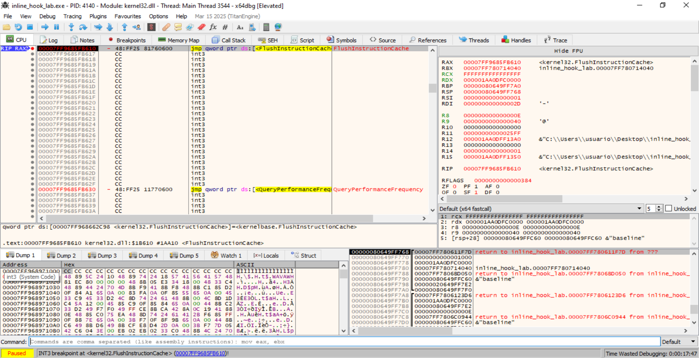

> **Figura 13.8.1.2. Modificación de 14 bytes observada en `FlushInstructionCache`.** El registro `RDX` contiene la dirección `0x000001AA0DFC0000`, correspondiente a la función `target`, mientras que `R8 = 0xE` indica que se han modificado 14 bytes.

El valor:

```text
RCX = FFFFFFFFFFFFFFFF
```

corresponde al pseudo-handle del proceso actual.

Por tanto, la llamada documenta que el programa acaba de modificar código dentro de su propio proceso y sincroniza la caché de instrucciones antes de continuar.

---

## Inspección de los bytes modificados

Siguiendo en el volcado de memoria la dirección almacenada en:

```text
RDX = 0x000001AA0DFC0000
```

se observan los siguientes 14 bytes:

```text
FF 25 00 00 00 00 00 00 FD 0D AA 01 00 00
```

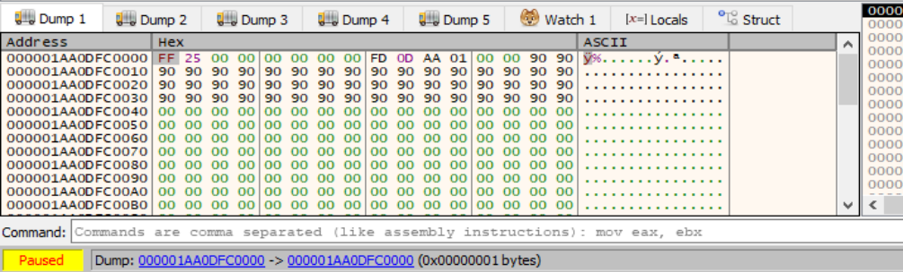

> **Figura 13.8.1.3. Bytes del `inline hook` instalados sobre la función `target`.** Los seis primeros bytes forman un salto indirecto `FF 25 00 00 00 00`, mientras que los ocho siguientes contienen la dirección absoluta del `handler`.

Los primeros seis bytes:

```text
FF 25 00 00 00 00
```

corresponden a:

```asm
jmp qword ptr [rip+0]
```

Los ocho bytes siguientes son:

```text
00 00 FD 0D AA 01 00 00
```

Al encontrarse almacenados en formato *little endian*, se reconstruyen como:

```text
0x000001AA0DFD0000
```

Por tanto, la redirección es:

```text
target
0x000001AA0DFC0000
        │
        │ FF 25 00 00 00 00
        │
        └───────────────► 0x000001AA0DFD0000
```

Esta evidencia confirma que el prólogo original ha sido sustituido por una instrucción que modifica el flujo de ejecución.

---

## Verificación del destino del hook

A continuación se sigue en el desensamblador la dirección:

```text
0x000001AA0DFD0000
```

En ella se observa:

```asm
000001AA0DFD0000  B8 63000000    mov eax,63
000001AA0DFD0005  C3             ret
```

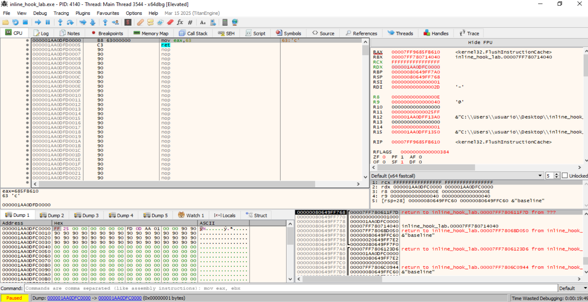

> **Figura 13.8.1.4. Código situado en el destino del `inline hook`.** La dirección `0x000001AA0DFD0000` contiene `mov eax, 0x63; ret`. El valor `0x63` equivale a `99` en decimal.

La conversión es:

```text
0x63 = 99
```

Por tanto, la secuencia completa es:

```text
target
0x000001AA0DFC0000
        │
        │ jmp
        ▼
handler
0x000001AA0DFD0000
        │
        │ mov eax, 99
        │ ret
        ▼
resultado = 99
```

Esto coincide con la salida de la herramienta:

```text
[HOOK INSTALADO]

valor devuelto       : 99
modificacion         : SI
salto reconocido     : SI
patron                : x64: jmp qword ptr [rip+0] + abs64
evaluacion            : POSIBLE INLINE HOOK
```

### Criterio para considerar positiva la prueba

La detección se considera positiva cuando aparecen simultáneamente:

- Los bytes actuales son distintos de la referencia.
- Se reconoce el patrón de salto utilizado por el hook.
- Se reconstruye una dirección de destino válida.
- El flujo llega al `handler`.
- El comportamiento de la función cambia.
- La herramienta clasifica el resultado como `POSIBLE INLINE HOOK`.

En la ejecución documentada:

| Campo | Resultado |
|---|---|
| Dirección `target` | `0x000001AA0DFC0000` |
| Tamaño modificado | `0xE` = 14 bytes |
| Bytes iniciales | `FF 25 00 00 00 00` |
| Patrón | `jmp qword ptr [rip+0]` |
| Dirección `handler` | `0x000001AA0DFD0000` |
| Código del handler | `mov eax, 0x63; ret` |
| Valor devuelto | `99` |
| Modificación | `SI` |
| Salto reconocido | `SI` |
| Evaluación | `POSIBLE INLINE HOOK` |

---

# Demostración negativa tras la restauración

## Restauración de los bytes originales

Después de demostrar la detección positiva, la herramienta restaura los 14 bytes originales de la función.

La ejecución vuelve a detenerse en:

```text
kernel32!FlushInstructionCache
```

con:

```text
RDX = 000001AA0DFC0000
R8  = 000000000000000E
```

La dirección es la misma utilizada durante la instalación del hook y el tamaño continúa siendo de 14 bytes.

Sin embargo, el volcado de memoria muestra ahora:

```text
B8 2A 00 00 00 C3 90 90 90 90 90 90 90 90
```

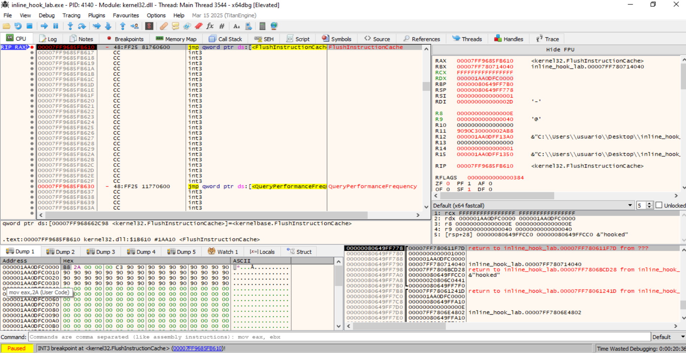

> **Figura 13.8.1.5. Restauración de los bytes originales de `target`.** Tras eliminar el hook, la función vuelve a comenzar con `B8 2A 00 00 00 C3`, correspondiente a `mov eax, 0x2A; ret`.

Las instrucciones recuperadas son:

```asm
mov eax, 0x2A
ret
```

y:

```text
0x2A = 42
```

Por tanto, el flujo vuelve a ser:

```text
target
        ↓
mov eax, 42
        ↓
ret
        ↓
resultado = 42
```

La herramienta muestra:

```text
[RESTAURADO]

valor devuelto       : 42
modificacion         : NO
salto reconocido     : NO
patron                : none
evaluacion            : SIN MODIFICACIONES
```

Esta fase constituye una segunda demostración negativa y confirma que el detector no permanece en estado positivo una vez desaparece la modificación.

---

# Comparación entre la detección negativa y positiva

| Característica | Negativa: baseline | Positiva: hook activo | Negativa: restaurado |
|---|---|---|---|
| Bytes iniciales | `B8 2A 00 00 00 C3` | `FF 25 00 00 00 00` | `B8 2A 00 00 00 C3` |
| Función inicial | `mov eax,42` | `jmp qword ptr [rip+0]` | `mov eax,42` |
| Redirección | No | Sí | No |
| Destino externo al `target` | No | `0x000001AA0DFD0000` | No |
| Valor devuelto | `42` | `99` | `42` |
| Bytes distintos de referencia | No | Sí | No |
| Salto reconocido | No | Sí | No |
| Resultado | `SIN MODIFICACIONES` | `POSIBLE INLINE HOOK` | `SIN MODIFICACIONES` |

La transición observada es:

```text
NEGATIVO
B8 2A 00 00 00 C3
        │
        ▼
retorna 42
        │
        ▼
SIN MODIFICACIONES

        ↓ instalación

POSITIVO
FF 25 00 00 00 00 <handler>
        │
        ▼
handler
        │
        ▼
retorna 99
        │
        ▼
POSIBLE INLINE HOOK

        ↓ restauración

NEGATIVO
B8 2A 00 00 00 C3
        │
        ▼
retorna 42
        │
        ▼
SIN MODIFICACIONES
```

---

# Evidencias obtenidas

La práctica permite documentar los siguientes elementos:

- Dirección de la función `target`.
- Dirección del `handler`.
- Bytes originales de la función.
- Bytes instalados por el hook.
- Tamaño exacto de la modificación.
- Instrucción utilizada para redirigir el flujo.
- Dirección codificada en el salto.
- Código ejecutado en el destino.
- Cambio observable del valor de retorno.
- Restauración posterior del código original.
- Clasificación positiva y negativa realizada por la herramienta.
- Exportación de los resultados a CSV.

La evidencia es especialmente sólida porque el resultado positivo no depende únicamente de que los bytes sean diferentes. Se demuestra también:

```text
Modificación del prólogo
        ↓
Reconocimiento del salto
        ↓
Reconstrucción del destino
        ↓
Inspección del código del handler
        ↓
Cambio efectivo del comportamiento
```

---

# Relación con la detección de entornos de análisis

En una muestra real, una comprobación equivalente podría aplicarse sobre APIs o funciones sensibles para identificar modificaciones introducidas por:

- Sandboxes.
- Herramientas de instrumentación.
- EDR.
- Antivirus.
- Sistemas de monitorización.
- Depuradores o frameworks de análisis dinámico.

Por ejemplo, una muestra podría inspeccionar los primeros bytes de una API y comprobar si existe una redirección hacia código ajeno a la implementación esperada.

Sin embargo, la presencia de un `inline hook` **no demuestra por sí sola la existencia de una máquina virtual**. Los hooks también pueden ser utilizados por software legítimo. Por este motivo, la técnica debe considerarse una heurística de detección de instrumentación y correlacionarse con otras evidencias anti-análisis.

---

# Limitaciones de la demostración

- La función `target` es sintética y ha sido creada específicamente para el laboratorio.
- El patrón de hook utilizado es conocido y deliberadamente sencillo.
- Las direcciones de memoria cambian entre ejecuciones.
- La detección de un `JMP` inicial no constituye por sí sola una prueba universal de hooking.
- Funciones reales de Windows pueden comenzar con *thunks* o redirecciones legítimas.
- Una implementación real puede utilizar patrones de salto distintos.
- Las soluciones de seguridad pueden aplicar hooks legítimos.
- La técnica identifica una modificación compatible con instrumentación, no una tecnología de virtualización concreta.
- La comparación con una referencia debe tener en cuenta la versión y arquitectura del código analizado.

---

# Conclusión

La práctica permite demostrar de forma controlada tanto un **resultado negativo** como un **resultado positivo** de detección de `inline hooks`.

En el estado inicial, la función contiene:

```asm
mov eax, 42
ret
```

y la herramienta confirma que los bytes coinciden con la referencia.

Posteriormente, los primeros 14 bytes se sustituyen por:

```asm
jmp qword ptr [rip+0]
```

seguido de la dirección:

```text
0x000001AA0DFD0000
```

El destino contiene:

```asm
mov eax, 99
ret
```

por lo que el comportamiento cambia de `42` a `99`. La herramienta identifica simultáneamente la modificación del código y el patrón de redirección, clasificando el estado como:

```text
POSIBLE INLINE HOOK
```

Finalmente, los bytes originales son restaurados:

```text
B8 2A 00 00 00 C3
```

y la detección vuelve a:

```text
SIN MODIFICACIONES
```

La secuencia completa queda demostrada como:

```text
Código limpio
        ↓
detección negativa
        ↓
instalación del inline hook
        ↓
detección positiva
        ↓
redirección hacia handler
        ↓
cambio de comportamiento
        ↓
restauración
        ↓
detección negativa
```

Por tanto, `inline_hook_lab` permite reproducir de forma íntegra y documentada el mecanismo fundamental de detección de `inline hooks`, incluyendo la comparación negativa, la detección positiva y la recuperación posterior del estado original.


----


### 13.8.2. Demostración dinámica de **IAT hooks**


El objetivo de esta práctica es demostrar dinámicamente la sub­técnica **IAT hooking** mediante la herramienta educativa `iat_hook_lab.exe`.

La demostración utiliza una entrada real de la `Import Address Table` —IAT— del propio ejecutable, correspondiente a la función:

```text
GetCurrentProcessId
```

La herramienta reproduce tres estados:

1. **Estado negativo o limpio**, en el que la entrada IAT apunta a la implementación legítima de `GetCurrentProcessId`.
2. **Estado positivo**, en el que la misma entrada es modificada para apuntar a una rutina local denominada `iat_demo_handler`.
3. **Estado restaurado**, en el que la entrada IAT recupera la dirección legítima original.

La secuencia general es:

```text
IAT legítima
        ↓
GetCurrentProcessId
        ↓
PID real
        ↓
SIN MODIFICACIONES

        ↓ instalación del hook

IAT modificada
        ↓
iat_demo_handler
        ↓
0x0BADF00D
        ↓
POSIBLE IAT HOOK

        ↓ restauración

IAT legítima
        ↓
GetCurrentProcessId
        ↓
PID real
        ↓
SIN MODIFICACIONES
```

La herramienta está deliberadamente limitada al **propio proceso**. No modifica procesos externos, no recibe PID arbitrarios y no realiza inyección de código.

---

#### Entorno utilizado

La demostración se realizó sobre:

- Windows 10 x64.
- `iat_hook_lab.exe` compilado para arquitectura x64.
- `x64dbg` ejecutado con privilegios elevados.
- PowerShell para la ejecución de referencia.
- Exportación a CSV mediante `iat_hook_resultados.csv`.

La herramienta se ejecutó mediante:

```powershell
.\iat_hook_lab.exe --csv iat_hook_resultados.csv
```

---

#### Funcionamiento de la herramienta

La herramienta localiza dinámicamente la entrada de la IAT asociada a:

```text
KERNEL32.dll!GetCurrentProcessId
```

A continuación obtiene:

- Dirección del slot IAT.
- Dirección actualmente almacenada.
- Dirección legítima esperada.
- Región de memoria a la que pertenece el destino.
- Módulo asociado.
- Valor devuelto por la llamada.

La detección se basa conceptualmente en:

```text
Localizar IAT[GetCurrentProcessId]
        ↓
Leer puntero actual
        ↓
Resolver dirección legítima
        ↓
Comparar ambas direcciones
        ↓
¿Coinciden?
   │
   ├── Sí → SIN MODIFICACIONES
   │
   └── No → POSIBLE IAT HOOK
```

La rutina utilizada para reproducir el hook devuelve deliberadamente:

```text
0x0BADF00D
```

de forma que el cambio de comportamiento resulta fácilmente observable.

---

#### Demostración funcional completa

La ejecución normal de `iat_hook_lab.exe` muestra las tres fases del laboratorio.

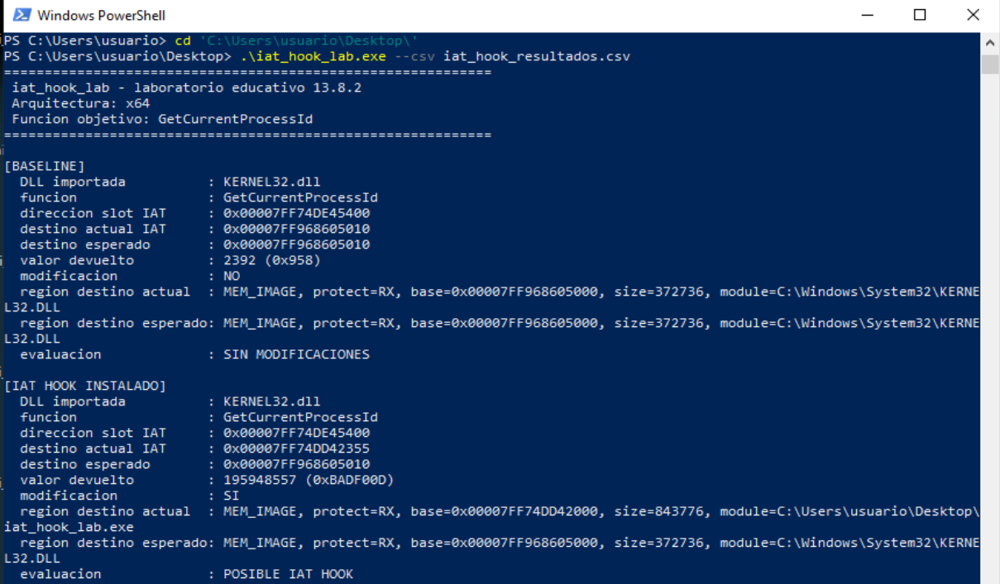

> **Figura 13.8.2.1. Ejecución de referencia y activación del IAT hook.** En la fase `BASELINE`, la entrada IAT de `GetCurrentProcessId` apunta a `KERNEL32.dll` y la evaluación es `SIN MODIFICACIONES`. Posteriormente, la misma entrada es redirigida hacia una dirección perteneciente a `iat_hook_lab.exe`, la llamada devuelve `0x0BADF00D` y la herramienta clasifica el estado como `POSIBLE IAT HOOK`.

En la ejecución documentada se obtuvieron:

```text
Slot IAT:
0x00007FF74DE45400
```

En la fase limpia:

```text
Destino actual:
0x00007FF968605010

Destino esperado:
0x00007FF968605010

Valor devuelto:
2392 (0x958)

Modificación:
NO

Evaluación:
SIN MODIFICACIONES
```

En la fase positiva:

```text
Destino actual:
0x00007FF74DD42355

Destino esperado:
0x00007FF968605010

Valor devuelto:
195948557 (0x0BADF00D)

Modificación:
SI

Evaluación:
POSIBLE IAT HOOK
```

La dirección modificada pertenece a:

```text
iat_hook_lab.exe
```

mientras que la dirección legítima pertenece a:

```text
C:\Windows\System32\KERNEL32.DLL
```

La segunda parte de la salida muestra la restauración:

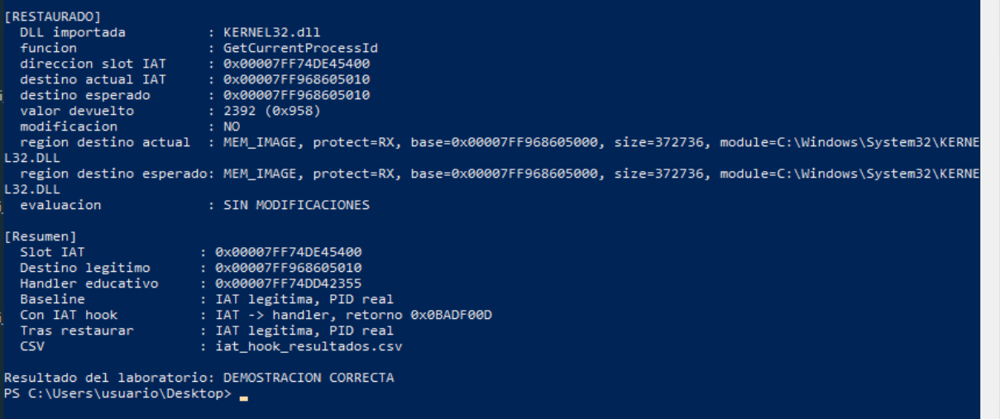

> **Figura 13.8.2.2. Restauración funcional de la IAT.** Tras retirar el hook, el destino actual vuelve a coincidir con la dirección legítima de `GetCurrentProcessId`, la función devuelve nuevamente el PID real y la evaluación final es `SIN MODIFICACIONES`.

Después de la restauración:

```text
Destino actual:
0x00007FF968605010

Destino esperado:
0x00007FF968605010

Valor devuelto:
2392 (0x958)

Modificación:
NO

Evaluación:
SIN MODIFICACIONES
```

La secuencia funcional completa queda demostrada como:

```text
BASELINE
IAT → KERNEL32!GetCurrentProcessId
        ↓
PID real = 2392

HOOK ACTIVO
IAT → iat_demo_handler
        ↓
0x0BADF00D

RESTAURADO
IAT → KERNEL32!GetCurrentProcessId
        ↓
PID real = 2392
```

---

#### Demostración negativa dinámica

##### Localización del slot IAT

Para observar dinámicamente la modificación se estableció un breakpoint en:

```text
kernel32!VirtualProtect
```

con la condición:

```text
RDX == 8 && R8 == 4
```

En Windows x64, los argumentos relevantes son:

```text
RCX = dirección cuya protección se modifica
RDX = tamaño
R8  = nueva protección
R9  = puntero donde almacenar la protección anterior
```

La herramienta modifica un único puntero de 64 bits. Por ello:

```text
RDX = 8
```

representa el tamaño de una entrada IAT en arquitectura x64.

El valor:

```text
R8 = 4
```

corresponde a:

```text
PAGE_READWRITE
```

La configuración del breakpoint se muestra a continuación:

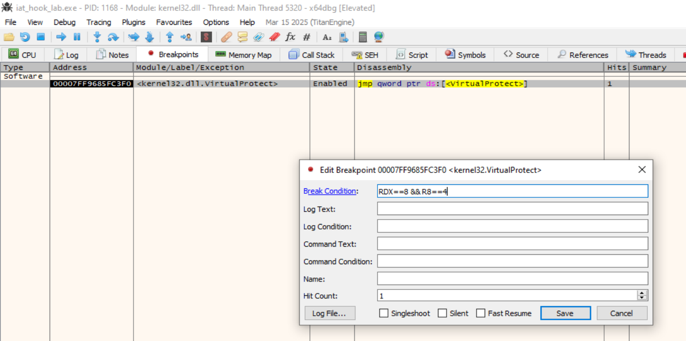

> **Figura 13.8.2.3. Breakpoint condicional en `VirtualProtect`.** La condición `RDX == 8 && R8 == 4` permite localizar las operaciones en las que la herramienta habilita escritura sobre un puntero de ocho bytes.

Durante la ejecución, el registro `RCX` permitió identificar el slot:

```text
RCX = 0x00007FF74DE45400
```

que `x64dbg` etiqueta como la entrada correspondiente a:

```text
iat_hook_lab.GetCurrentProcessId
```

---

##### Estado negativo de la entrada IAT

Antes de instalar el hook, el contenido del slot:

```text
0x00007FF74DE45400
```

es:

```text
10 50 60 68 F9 7F 00 00
```

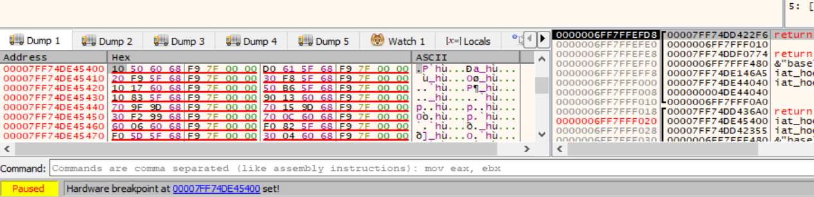

> **Figura 13.8.2.4. Estado negativo de la entrada IAT.** El slot IAT de `GetCurrentProcessId` contiene inicialmente los bytes `10 50 60 68 F9 7F 00 00`.

Al tratarse de arquitectura x64, el puntero se almacena en formato *little endian*. Por tanto:

```text
10 50 60 68 F9 7F 00 00
```

se reconstruye como:

```text
0x00007FF968605010
```

La dirección coincide con la resolución legítima observada durante la ejecución normal:

```text
KERNEL32!GetCurrentProcessId
```

Por tanto, la evidencia negativa es:

```text
Slot IAT
0x00007FF74DE45400
        │
        │ 10 50 60 68 F9 7F 00 00
        ▼
0x00007FF968605010
        │
        ▼
KERNEL32!GetCurrentProcessId
```

##### Criterio de detección negativa

La prueba se considera negativa porque:

- El slot IAT existe y corresponde a `GetCurrentProcessId`.
- El puntero almacenado coincide con la dirección legítima.
- El destino pertenece a `KERNEL32.dll`.
- La llamada devuelve el PID real.
- La herramienta muestra `SIN MODIFICACIONES`.

---

#### Demostración positiva dinámica

##### Modificación del mismo slot IAT

Después de instalar el hook, el mismo slot:

```text
0x00007FF74DE45400
```

pasa a contener:

```text
55 23 D4 4D F7 7F 00 00
```

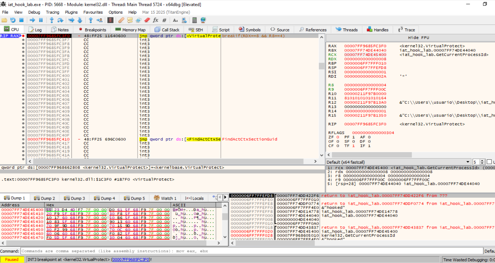

> **Figura 13.8.2.5. Estado positivo de la entrada IAT.** El mismo slot IAT utilizado en el estado negativo contiene ahora un puntero diferente. La dirección almacenada ya no pertenece a `KERNEL32.dll`, sino al módulo `iat_hook_lab.exe`.

En *little endian*:

```text
55 23 D4 4D F7 7F 00 00
```

se convierte en:

```text
0x00007FF74DD42355
```

La comparación entre ambos estados es:

```text
ANTES

Slot:
0x00007FF74DE45400

Contenido:
10 50 60 68 F9 7F 00 00

Destino:
0x00007FF968605010

Módulo:
KERNEL32.dll
```

frente a:

```text
DESPUÉS

Mismo slot:
0x00007FF74DE45400

Contenido:
55 23 D4 4D F7 7F 00 00

Destino:
0x00007FF74DD42355

Módulo:
iat_hook_lab.exe
```

La dirección del **slot no cambia**. Lo que se modifica es el puntero almacenado dentro de la IAT.

Este comportamiento constituye precisamente el fundamento de un IAT hook:

```text
IAT[GetCurrentProcessId]
        │
        ├── estado limpio → API legítima
        │
        └── estado hook   → handler alternativo
```

---

##### Verificación del destino del hook

Al seguir el puntero:

```text
0x00007FF74DD42355
```

en el desensamblador, se observa:

```asm
00007FF74DD42355  push rbp
00007FF74DD42356  mov rbp,rsp
00007FF74DD42359  mov eax,0BADF00D
00007FF74DD4235E  pop rbp
00007FF74DD4235F  ret
```

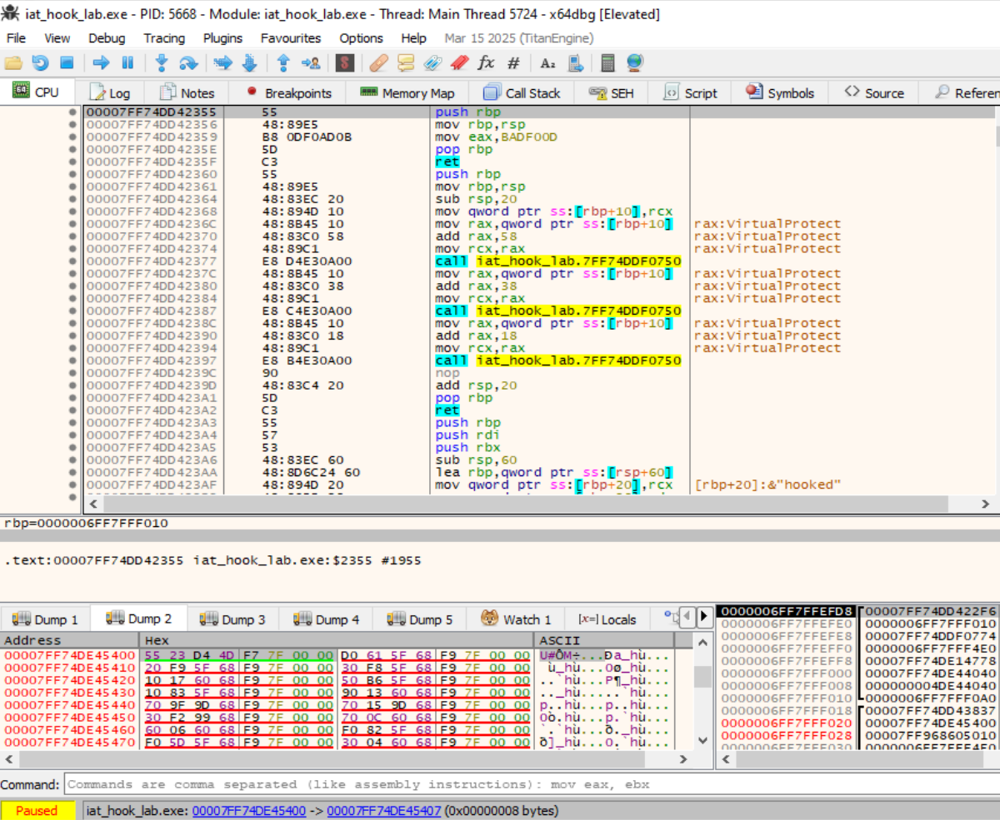

> **Figura 13.8.2.6. Verificación del destino de la entrada IAT modificada.** El puntero almacenado en la IAT conduce a una rutina dentro de `iat_hook_lab.exe` que carga `0x0BADF00D` en `EAX` y retorna.

El flujo queda demostrado de forma completa:

```text
IAT[GetCurrentProcessId]
0x00007FF74DE45400
        │
        │ contiene:
        │ 0x00007FF74DD42355
        ▼
iat_demo_handler
        │
        │ mov eax,0BADF00D
        │ ret
        ▼
resultado = 0x0BADF00D
```

Esto coincide con la salida de PowerShell:

```text
valor devuelto = 195948557 (0xBADF00D)
modificacion   = SI
evaluacion     = POSIBLE IAT HOOK
```

##### Criterio de detección positiva

La prueba se considera positiva porque:

- El mismo slot IAT contiene una dirección diferente.
- La nueva dirección no coincide con la dirección legítima esperada.
- El nuevo destino pertenece a `iat_hook_lab.exe`.
- El flujo alcanza `iat_demo_handler`.
- El handler devuelve `0x0BADF00D`.
- La herramienta muestra `POSIBLE IAT HOOK`.

---

#### Restauración de la entrada IAT

La herramienta restaura posteriormente el puntero legítimo.

La salida funcional demuestra que:

```text
destino actual IAT =
0x00007FF968605010

destino esperado =
0x00007FF968605010
```

y que:

```text
modificacion = NO
evaluacion   = SIN MODIFICACIONES
```

La función vuelve además a devolver el PID real:

```text
2392
```

Por tanto:

```text
IAT hook activo
        ↓
0x00007FF74DD42355
        ↓
iat_demo_handler
        ↓
0x0BADF00D

        ↓ restauración

IAT legítima
        ↓
0x00007FF968605010
        ↓
GetCurrentProcessId
        ↓
PID real
```

#### Limitación de la captura de restauración

Se intentó interceptar la escritura de restauración mediante un hardware breakpoint de escritura sobre:

```text
0x00007FF74DE45400
```

cubriendo los ocho bytes:

```text
0x00007FF74DE45400
        →
0x00007FF74DE45407
```

Sin embargo, en las ejecuciones realizadas el proceso finalizó sin que `x64dbg` detuviera nuevamente la ejecución sobre esa escritura.

Por este motivo, **no se presenta una captura de una escritura de restauración que no llegó a ser observada directamente**.

La restauración queda acreditada mediante:

- La salida final de la propia herramienta.
- La igualdad entre `destino actual IAT` y `destino esperado`.
- La desaparición de la condición de modificación.
- La recuperación del PID real.
- La evaluación final `SIN MODIFICACIONES`.

Esta limitación no afecta a la demostración positiva y negativa del IAT hook, ya que ambas sí fueron observadas directamente en memoria mediante `x64dbg`.

---

#### Comparación entre prueba negativa y positiva

| Característica | Estado negativo | Estado positivo | Restaurado |
|---|---|---|---|
| Slot IAT | `0x00007FF74DE45400` | `0x00007FF74DE45400` | mismo slot |
| Contenido | `10 50 60 68 F9 7F 00 00` | `55 23 D4 4D F7 7F 00 00` | vuelve al legítimo |
| Destino | `0x00007FF968605010` | `0x00007FF74DD42355` | `0x00007FF968605010` |
| Módulo destino | `KERNEL32.dll` | `iat_hook_lab.exe` | `KERNEL32.dll` |
| Función | `GetCurrentProcessId` | `iat_demo_handler` | `GetCurrentProcessId` |
| Valor devuelto | PID real `2392` | `0x0BADF00D` | PID real `2392` |
| Modificación | `NO` | `SI` | `NO` |
| Evaluación | `SIN MODIFICACIONES` | `POSIBLE IAT HOOK` | `SIN MODIFICACIONES` |

La diferencia esencial puede resumirse así:

```text
NEGATIVO

IAT slot
0x00007FF74DE45400
        ↓
KERNEL32!GetCurrentProcessId
        ↓
PID real


POSITIVO

MISMO IAT slot
0x00007FF74DE45400
        ↓
iat_demo_handler
        ↓
0x0BADF00D


RESTAURADO

MISMO IAT slot
        ↓
KERNEL32!GetCurrentProcessId
        ↓
PID real
```

---

#### Diferencia respecto a un `inline hook`

La práctica permite diferenciar claramente un IAT hook de la técnica estudiada en el apartado anterior.

En un `inline hook` se modifican las instrucciones de la propia función:

```text
API
        ↓
prólogo modificado
        ↓
JMP
```

En un IAT hook:

```text
Código de la API
        ↓
NO se modifica

Entrada IAT
        ↓
puntero sustituido
        ↓
handler
```

En esta demostración no se altera el código de `GetCurrentProcessId`. La modificación se realiza exclusivamente sobre:

```text
IAT[GetCurrentProcessId]
```

Por ello, la evidencia principal es el cambio del puntero almacenado en el mismo slot.

---

#### Relación con la detección de entornos de análisis

Una muestra puede aplicar una comprobación equivalente para detectar si sus importaciones han sido redirigidas por:

- Sandboxes.
- Herramientas de instrumentación.
- EDR.
- Antivirus.
- Frameworks de monitorización.
- Herramientas de análisis dinámico.

El razonamiento sería:

```text
Localizar entrada IAT
        ↓
Obtener dirección almacenada
        ↓
Determinar módulo de destino
        ↓
Comparar con destino esperado
        ↓
Dirección inesperada
        ↓
Posible instrumentación
```

Sin embargo, la existencia de una IAT modificada no demuestra por sí sola la presencia de una máquina virtual. La técnica debe interpretarse como una **heurística anti-instrumentación** y correlacionarse con otros indicadores.

---

#### Evidencias obtenidas

La práctica permite documentar:

- DLL importada.
- Nombre de la función.
- Dirección del slot IAT.
- Contenido del slot en estado limpio.
- Dirección legítima esperada.
- Módulo asociado al destino legítimo.
- Contenido del mismo slot tras instalar el hook.
- Dirección del handler.
- Módulo asociado al handler.
- Código ejecutado en el destino.
- Valor devuelto por el handler.
- Clasificación negativa.
- Clasificación positiva.
- Restauración funcional.
- Exportación de resultados a CSV.

La evidencia positiva es especialmente sólida porque permite reconstruir:

```text
Slot IAT
        ↓
puntero modificado
        ↓
iat_demo_handler
        ↓
mov eax,0BADF00D
        ↓
ret
        ↓
cambio observable del comportamiento
```

---

#### Limitaciones

- La herramienta modifica únicamente su propia IAT.
- La función elegida es `GetCurrentProcessId` por motivos educativos.
- Las direcciones cambian entre ejecuciones debido a ASLR.
- El `handler` utilizado es deliberadamente sencillo.
- Una diferencia en una entrada IAT no implica automáticamente actividad maliciosa.
- Algunas herramientas legítimas pueden aplicar redirecciones.
- Deben considerarse `forwarders` y particularidades de la resolución de APIs de Windows.
- La escritura de restauración no llegó a ser interceptada mediante el hardware breakpoint en las ejecuciones realizadas.
- La restauración final sí fue verificada mediante la propia herramienta y el comportamiento recuperado.

---

#### Conclusión

La demostración permite reproducir de forma controlada un **resultado negativo y un resultado positivo de IAT hooking**.

En el estado inicial, el slot:

```text
0x00007FF74DE45400
```

contiene:

```text
0x00007FF968605010
```

correspondiente a la implementación legítima de:

```text
KERNEL32!GetCurrentProcessId
```

La llamada devuelve el PID real y la herramienta clasifica el estado como:

```text
SIN MODIFICACIONES
```

Después de instalar el hook, el mismo slot pasa a contener:

```text
0x00007FF74DD42355
```

que pertenece a `iat_hook_lab.exe`.

Al seguir dicha dirección se observa:

```asm
mov eax,0BADF00D
ret
```

La llamada devuelve entonces:

```text
0x0BADF00D
```

y la herramienta clasifica el estado como:

```text
POSIBLE IAT HOOK
```

Finalmente, la aplicación restaura el puntero original, recupera el PID real y vuelve a mostrar:

```text
SIN MODIFICACIONES
```

Por tanto, la secuencia completa queda demostrada como:

```text
IAT legítima
        ↓
detección negativa
        ↓
sustitución del puntero
        ↓
redirección hacia handler
        ↓
detección positiva
        ↓
cambio observable del resultado
        ↓
restauración
        ↓
detección negativa
```

La práctica demuestra de forma íntegra el fundamento del **IAT hooking**: la función importada permanece intacta, mientras que su entrada en la `Import Address Table` es redirigida hacia una implementación alternativa.


----


### 13.8.3. Demostración dinámica de **EAT hooks**

El objetivo de esta práctica es demostrar dinámicamente la detección de un **EAT hook** mediante la herramienta educativa `eat_hook_lab.exe`.

La técnica se reproduce sobre la `Export Address Table` —EAT— del propio ejecutable. La exportación utilizada como objetivo es:

```text
eat_demo_target
```

En condiciones normales, dicha exportación devuelve:

```text
42
```

El laboratorio modifica únicamente el RVA almacenado en `AddressOfFunctions` para que la resolución dinámica de `eat_demo_target` apunte temporalmente a:

```text
eat_demo_handler
```

que devuelve:

```text
99
```

Posteriormente, el RVA original es restaurado.

La secuencia general es:

```text
EAT legítima
        ↓
eat_demo_target
        ↓
42
        ↓
SIN MODIFICACIONES

        ↓ modificación del RVA

EAT modificada
        ↓
eat_demo_handler
        ↓
99
        ↓
POSIBLE EAT HOOK

        ↓ restauración

EAT legítima
        ↓
eat_demo_target
        ↓
42
        ↓
SIN MODIFICACIONES
```

La herramienta está deliberadamente limitada al **propio proceso**. No modifica procesos externos, no recibe PID arbitrarios y no realiza inyección de código.

---

#### Entorno de laboratorio

La demostración se realizó con:

- Windows 10 x64.
- `eat_hook_lab.exe` compilado para arquitectura x64 con MinGW-w64.
- `x64dbg` ejecutado con privilegios elevados.
- PowerShell para la ejecución de referencia.
- Archivo `eat_hook_resultados.csv` para conservar los resultados.

La ejecución utilizada fue:

```powershell
.\eat_hook_lab.exe --csv eat_hook_resultados.csv
```

> **Nota sobre ASLR:** las direcciones absolutas pueden variar entre ejecuciones. Los valores relevantes para comparar el estado limpio y modificado son los RVA y la relación `base del módulo + RVA`.

---

#### Ejecución funcional de referencia

La ejecución normal de la herramienta permite comprobar las tres fases del laboratorio.

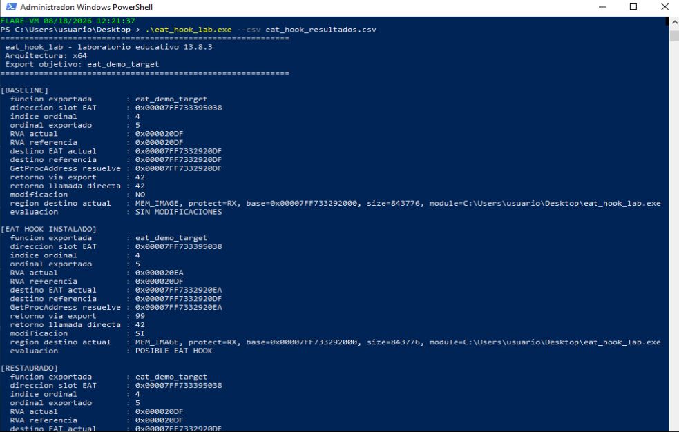

> **Figura 13.8.3.1. Ejecución funcional del estado limpio y del EAT hook.** En `BASELINE`, `eat_demo_target` presenta el RVA legítimo `0x20DF` y devuelve `42`. Tras instalar el hook, el RVA cambia a `0x20EA`, `GetProcAddress` resuelve hacia el handler y el retorno pasa a `99`.

Los resultados relevantes de la fase limpia fueron:

```text
[BASELINE]

funcion exportada       : eat_demo_target
RVA actual              : 0x000020DF
RVA referencia          : 0x000020DF
GetProcAddress resuelve : ...20DF
retorno via export      : 42
retorno llamada directa : 42
modificacion            : NO
evaluacion              : SIN MODIFICACIONES
```

En la fase positiva:

```text
[EAT HOOK INSTALADO]

funcion exportada       : eat_demo_target
RVA actual              : 0x000020EA
RVA referencia          : 0x000020DF
GetProcAddress resuelve : ...20EA
retorno via export      : 99
retorno llamada directa : 42
modificacion            : SI
evaluacion              : POSIBLE EAT HOOK
```

El resultado es especialmente relevante porque durante el hook se observa simultáneamente:

```text
GetProcAddress("eat_demo_target")
        ↓
99
```

mientras que:

```text
eat_demo_target()
        ↓
42
```

Esto demuestra que **el código original de `eat_demo_target` no ha sido modificado**. La alteración se encuentra en la resolución de la exportación mediante la EAT.

La herramienta también confirma la restauración:

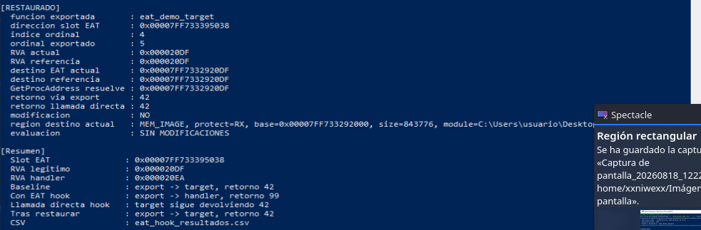

> **Figura 13.8.3.2. Restauración funcional de la EAT.** El RVA vuelve a `0x20DF`, la resolución dinámica apunta nuevamente a `eat_demo_target`, el retorno vuelve a `42` y la evaluación final es `SIN MODIFICACIONES`.

---

#### Breakpoints utilizados en `x64dbg`

Para delimitar las fases de la práctica se utilizaron los markers exportados por el propio laboratorio:

```text
eat_before_hook_marker
eat_after_hook_marker
eat_after_restore_marker
```

También se utilizaron:

```text
kernel32!VirtualProtect
kernel32!GetProcAddress
```

Para `VirtualProtect`, la condición de interés fue:

```text
RDX == 4 && R8 == 4
```

En Windows x64:

```text
RCX = dirección cuya protección se modifica
RDX = tamaño
R8  = nueva protección
R9  = dirección donde almacenar la protección anterior
```

En esta práctica:

```text
RDX = 4
```

indica que se trabaja sobre un RVA de **32 bits**, mientras que:

```text
R8 = 4
```

corresponde a:

```text
PAGE_READWRITE
```

Esto diferencia la EAT de la IAT estudiada anteriormente: en la EAT se modifica un **RVA de 4 bytes**, no un puntero absoluto de 8 bytes.

---

#### Demostración negativa: estado previo al hook

##### A) Marker anterior a la modificación

Tras reiniciar el programa, la ejecución se detiene en:

```text
eat_before_hook_marker
```

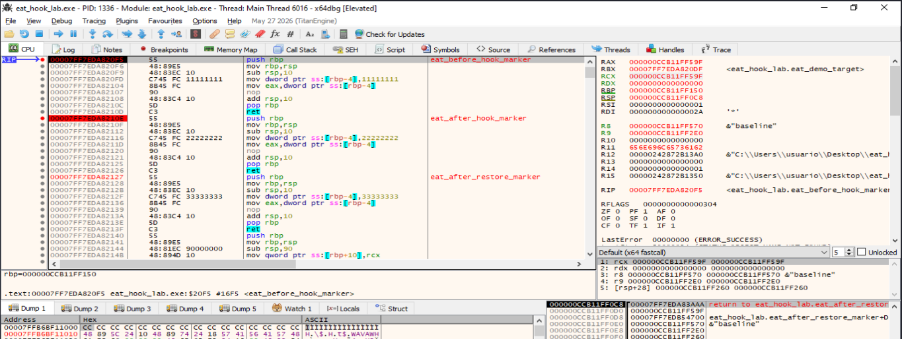

> **Figura 13.8.3.3. Estado inmediatamente anterior a la instalación del EAT hook.** La ejecución se encuentra en `eat_before_hook_marker`. `x64dbg` identifica `eat_demo_target` en una dirección cuyo RVA termina en `0x20DF`, correspondiente al valor legítimo de referencia.

En esta fase:

```text
RVA legítimo = 0x20DF
```

y la exportación continúa asociada a:

```text
eat_demo_target
```

---

##### B) Inspección del slot de `AddressOfFunctions`

El slot EAT localizado durante la ejecución contiene:

```text
DF 20 00 00
```

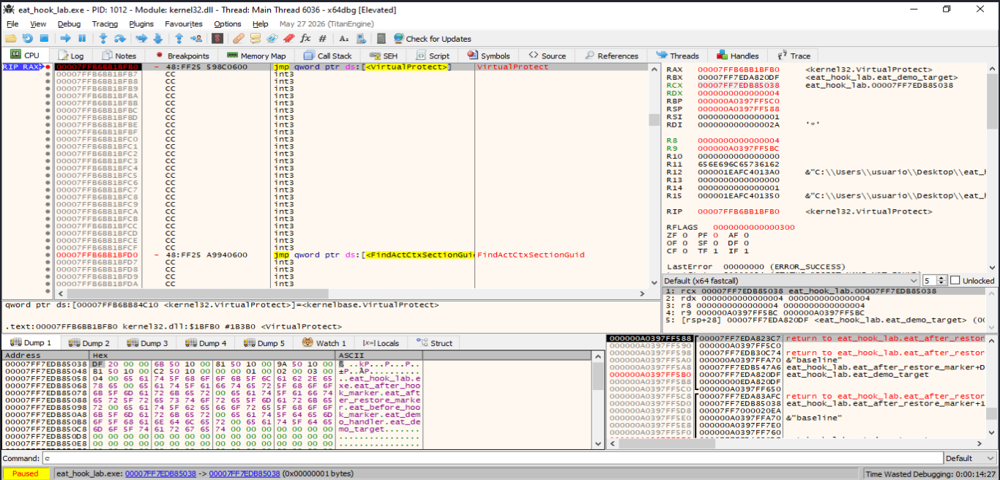

> **Figura 13.8.3.4. Estado negativo del slot EAT.** Los cuatro bytes `DF 20 00 00` representan, en formato little endian, el RVA legítimo `0x20DF`.

La conversión es:

```text
DF 20 00 00
        ↓ little endian
0x000020DF
```

Por tanto:

```text
AddressOfFunctions[eat_demo_target]
        ↓
RVA 0x20DF
        ↓
eat_demo_target
```

La prueba se considera negativa porque:

- El RVA observado coincide con la referencia.
- La exportación resuelve hacia `eat_demo_target`.
- La llamada dinámica devuelve `42`.
- La llamada directa devuelve `42`.
- La herramienta muestra `SIN MODIFICACIONES`.

---

#### Resolución negativa mediante `GetProcAddress`

En un estado sin hook, la llamada:

```text
GetProcAddress(self, "eat_demo_target")
```

devuelve la dirección legítima.

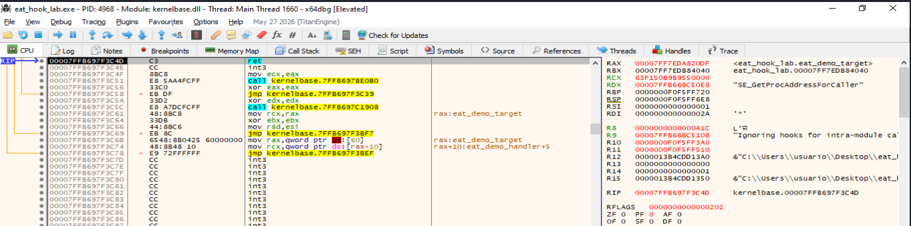

> **Figura 13.8.3.5. Resolución negativa de `eat_demo_target`.** Tras retornar de `GetProcAddress`, `RAX` contiene la dirección identificada por `x64dbg` como `eat_demo_target`.

En la ejecución capturada:

```text
RAX = 0x00007FF7EDA820DF
```

con base del módulo:

```text
0x00007FF7EDA80000
```

Por tanto:

```text
0x00007FF7EDA820DF
-
0x00007FF7EDA80000
=
0x000020DF
```

La resolución negativa queda representada como:

```text
GetProcAddress("eat_demo_target")
        ↓
RAX = base + 0x20DF
        ↓
eat_demo_target
        ↓
42
```

---

#### Interceptación de la modificación de la EAT

Para observar la escritura se configuró un **hardware breakpoint de escritura de cuatro bytes** sobre el slot de `AddressOfFunctions`.

Conceptualmente:

```text
Hardware breakpoint
Tipo   : Write
Tamaño : DWORD / 4 bytes
Destino: slot EAT de eat_demo_target
```

El breakpoint se activa cuando la herramienta escribe el nuevo RVA.

La transición esperada es:

```text
ANTES
DF 20 00 00
        ↓
RVA 0x20DF

DESPUÉS
EA 20 00 00
        ↓
RVA 0x20EA
```

---

#### Demostración positiva: RVA modificado

El hardware breakpoint se dispara después de modificar el slot EAT.

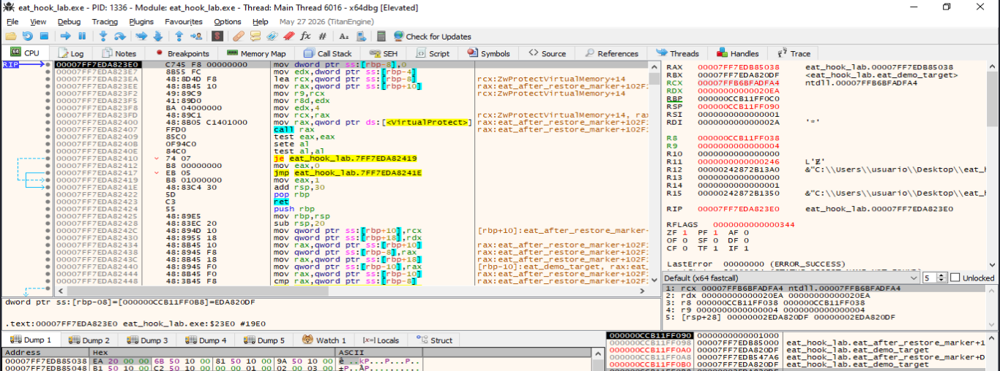

> **Figura 13.8.3.6. Modificación dinámica del slot de `AddressOfFunctions`.** El mismo slot que inicialmente contenía `DF 20 00 00` contiene ahora `EA 20 00 00`, correspondiente al RVA `0x20EA`.

La conversión es:

```text
EA 20 00 00
        ↓ little endian
0x000020EA
```

Por tanto:

```text
EAT["eat_demo_target"]
        ↓
RVA 0x20EA
        ↓
eat_demo_handler
```

La comparación directa entre ambos estados es:

| Estado | Bytes del slot EAT | RVA | Destino |
|---|---|---:|---|
| Negativo | `DF 20 00 00` | `0x20DF` | `eat_demo_target` |
| Positivo | `EA 20 00 00` | `0x20EA` | `eat_demo_handler` |

La dirección del slot permanece constante dentro de la misma ejecución. Lo que cambia es el RVA almacenado en `AddressOfFunctions`.

---

#### Consulta positiva con `GetProcAddress`

Con la EAT ya modificada se intercepta la siguiente llamada:

```text
GetProcAddress(self, "eat_demo_target")
```

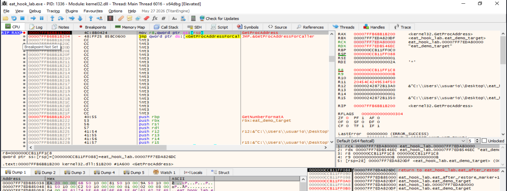

> **Figura 13.8.3.7. Consulta de `eat_demo_target` con la EAT modificada.** En la entrada de `GetProcAddress`, `RDX` apunta a la cadena `"eat_demo_target"` y `RCX` contiene la base del módulo del laboratorio.

La llamada observada es conceptualmente:

```c
GetProcAddress(
    self,
    "eat_demo_target"
);
```

Tras ejecutar hasta el retorno, el resultado se encuentra en `RAX`.

---

#### Resultado positivo de `GetProcAddress`

Después de retornar de `GetProcAddress`, `RAX` apunta al handler:

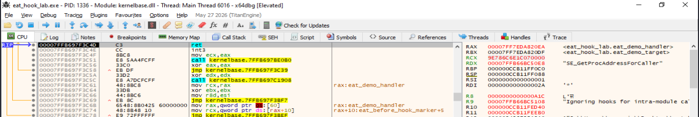

> **Figura 13.8.3.8. Resolución positiva tras modificar la EAT.** `RAX` contiene `0x00007FF7EDA820EA`, identificado por `x64dbg` como `eat_demo_handler`.

En la ejecución capturada:

```text
RAX = 0x00007FF7EDA820EA
```

Con base:

```text
0x00007FF7EDA80000
```

se obtiene:

```text
0x00007FF7EDA820EA
-
0x00007FF7EDA80000
=
0x000020EA
```

El valor coincide exactamente con el RVA previamente observado en el slot:

```text
EA 20 00 00
        ↓
0x20EA
```

Por tanto:

```text
GetProcAddress("eat_demo_target")
        ↓
consulta EAT
        ↓
RVA 0x20EA
        ↓
RAX = ...20EA
        ↓
eat_demo_handler
```

Esta evidencia demuestra que la modificación no es únicamente un cambio de bytes dentro de la tabla: **afecta efectivamente a la resolución dinámica de la exportación**.

---

#### Verificación del código de `eat_demo_handler`

Al seguir la dirección del handler en el desensamblador se observa una función equivalente a:

```asm
push rbp
mov rbp,rsp
mov eax,63h
pop rbp
ret
```

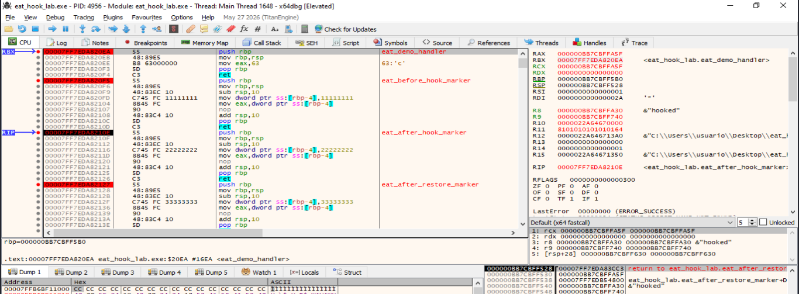

> **Figura 13.8.3.9. Código del destino del EAT hook.** `eat_demo_handler` carga `0x63` en `EAX` y retorna. `0x63` equivale a `99` en decimal.

La relación completa queda:

```text
EAT["eat_demo_target"]
        ↓
RVA 0x20EA
        ↓
eat_demo_handler
        ↓
mov eax, 0x63
        ↓
ret
        ↓
99
```

Esto coincide con la salida funcional:

```text
retorno via export : 99
```

---

#### Comprobación de que no existe un `inline hook`

Durante el estado positivo la herramienta muestra:

```text
retorno via export      : 99
retorno llamada directa : 42
```

La diferencia es fundamental.

Si el código de `eat_demo_target` hubiera sido modificado mediante un `inline hook`, la llamada directa también habría sido afectada.

Sin embargo:

```text
eat_demo_target()
        ↓
42
```

mientras:

```text
GetProcAddress("eat_demo_target")
        ↓
EAT modificada
        ↓
eat_demo_handler
        ↓
99
```

Por tanto, el experimento demuestra que la modificación se encuentra en la **Export Address Table** y no en el prólogo de la función.

---

#### Restauración

Después de la prueba positiva, el laboratorio restaura el valor original:

```text
0x20EA
        ↓
0x20DF
```

La salida de PowerShell confirma:

```text
[RESTAURADO]

RVA actual              : 0x000020DF
RVA referencia          : 0x000020DF
GetProcAddress resuelve : ...20DF
retorno via export      : 42
retorno llamada directa : 42
modificacion            : NO
evaluacion              : SIN MODIFICACIONES
```

La restauración queda representada como:

```text
POSITIVO

AddressOfFunctions
        ↓
0x20EA
        ↓
eat_demo_handler
        ↓
99

        ↓ restauración

NEGATIVO

AddressOfFunctions
        ↓
0x20DF
        ↓
eat_demo_target
        ↓
42
```

---

#### Comparación negativa y positiva

| Indicador | Estado negativo | Estado positivo | Restaurado |
|---|---|---|---|
| Exportación consultada | `eat_demo_target` | `eat_demo_target` | `eat_demo_target` |
| Bytes en `AddressOfFunctions` | `DF 20 00 00` | `EA 20 00 00` | `DF 20 00 00` |
| RVA | `0x20DF` | `0x20EA` | `0x20DF` |
| Destino dinámico | `eat_demo_target` | `eat_demo_handler` | `eat_demo_target` |
| `GetProcAddress` | `...20DF` | `...20EA` | `...20DF` |
| Retorno vía exportación | `42` | `99` | `42` |
| Retorno directo | `42` | `42` | `42` |
| Modificación | `NO` | `SI` | `NO` |
| Evaluación | `SIN MODIFICACIONES` | `POSIBLE EAT HOOK` | `SIN MODIFICACIONES` |

La secuencia completa es:

```text
NEGATIVO

EAT["eat_demo_target"]
        ↓
0x20DF
        ↓
eat_demo_target
        ↓
42

        ↓ modificación

POSITIVO

EAT["eat_demo_target"]
        ↓
0x20EA
        ↓
GetProcAddress
        ↓
eat_demo_handler
        ↓
99

        ↓ restauración

NEGATIVO

EAT["eat_demo_target"]
        ↓
0x20DF
        ↓
eat_demo_target
        ↓
42
```

---

#### Evidencias obtenidas

La práctica permite documentar:

- Nombre de la exportación analizada.
- Dirección del slot de `AddressOfFunctions`.
- RVA legítimo.
- RVA modificado.
- Bytes del slot en estado negativo.
- Bytes del slot en estado positivo.
- Hardware breakpoint de escritura sobre cuatro bytes.
- Resolución negativa de `GetProcAddress`.
- Consulta de `GetProcAddress("eat_demo_target")`.
- Resolución positiva hacia `eat_demo_handler`.
- Código del handler.
- Cambio de retorno de `42` a `99`.
- Permanencia del retorno directo en `42`.
- Restauración funcional del RVA legítimo.
- Clasificación negativa y positiva de la herramienta.

La evidencia positiva puede resumirse como:

```text
DF 20 00 00
        ↓
0x20DF
        ↓
eat_demo_target

        ↓ escritura

EA 20 00 00
        ↓
0x20EA
        ↓
GetProcAddress("eat_demo_target")
        ↓
eat_demo_handler
        ↓
99
```

---

#### Relación con la detección de entornos de análisis

Una muestra puede comprobar la integridad de la EAT para identificar alteraciones introducidas por mecanismos de instrumentación o monitorización.

Una estrategia conceptual sería:

```text
Localizar IMAGE_EXPORT_DIRECTORY
        ↓
Recorrer AddressOfNames
        ↓
Obtener ordinal
        ↓
Consultar AddressOfFunctions[ordinal]
        ↓
Validar RVA
        ↓
Comparar con referencia
        ↓
RVA inesperado
        ↓
posible hook / instrumentación
```

Sin embargo, la presencia de una EAT modificada no demuestra por sí sola la existencia de una máquina virtual. Debe considerarse una **heurística de anti-instrumentación** y correlacionarse con otras evidencias del entorno.

---

#### Limitaciones

- La modificación se realiza únicamente sobre la EAT del propio proceso.
- La exportación `eat_demo_target` fue creada específicamente para el laboratorio.
- El handler es deliberadamente sencillo.
- Las direcciones absolutas pueden cambiar entre ejecuciones debido a ASLR.
- Los RVA `0x20DF` y `0x20EA` corresponden a la compilación utilizada en esta práctica y pueden cambiar si se recompila el ejecutable.
- La presencia de un RVA diferente no debe clasificarse automáticamente como actividad maliciosa.
- Las exportaciones reenviadas —`forwarded exports`— deben tratarse de forma específica en herramientas reales.
- La demostración reproduce el mecanismo fundamental del EAT hooking, no todos los mecanismos posibles de alteración de exportaciones.

---

#### Conclusión

La práctica demuestra dinámicamente tanto un **resultado negativo** como un **resultado positivo** de detección de EAT hooks.

En el estado limpio, el slot de `AddressOfFunctions` correspondiente a:

```text
eat_demo_target
```

contiene:

```text
DF 20 00 00
```

que representa:

```text
RVA 0x20DF
```

y `GetProcAddress` resuelve correctamente hacia `eat_demo_target`, que devuelve:

```text
42
```

Tras instalar el hook, el mismo slot pasa a contener:

```text
EA 20 00 00
```

correspondiente a:

```text
RVA 0x20EA
```

La llamada:

```text
GetProcAddress("eat_demo_target")
```

resuelve entonces hacia:

```text
eat_demo_handler
```

que ejecuta:

```asm
mov eax, 0x63
ret
```

y devuelve:

```text
99
```

Al mismo tiempo, la llamada directa a `eat_demo_target` continúa devolviendo `42`, confirmando que el código original no ha sido modificado.

Finalmente, el RVA legítimo es restaurado y la resolución vuelve a:

```text
eat_demo_target → 42
```

Por tanto, la demostración reproduce de forma íntegra el fundamento de un **EAT hook**:

```text
modificación del RVA en AddressOfFunctions
        ↓
alteración de GetProcAddress
        ↓
redirección hacia una exportación alternativa
        ↓
cambio observable del comportamiento
        ↓
detección positiva
        ↓
restauración
        ↓
detección negativa
```


----


### 13.8.4 Rangos de memoria
