- [3. La técnica processes](#3-la-técnica-processes)
  - [3.1. Descripción de la técnica processes](#31-descripción-de-la-técnica-processes)
  - [3.2. Categoría](#32-categoría)
  - [3.3. Técnicas principales](#33-técnicas-principales)
    - [3.3.1. Enumerar procesos en ejecución](#331-enumerar-procesos-en-ejecución)
    - [3.3.2. Detectar procesos de VirtualBox](#332-detectar-procesos-de-virtualbox)
    - [3.3.3. Detectar procesos de VMware](#333-detectar-procesos-de-vmware)
    - [3.3.4.  Detectar herramientas de análisis y procesos de  `sandbox`](#334--detectar-herramientas-de-análisis-y-procesos-de--sandbox)
  - [3.4. Resumen visual de la técnica](#34-resumen-visual-de-la-técnica)
  - [3.5. Contramedidas ofensivas](#35-contramedidas-ofensivas)
  - [3.6. Contramedidas defensivas](#36-contramedidas-defensivas)
  - [3.7. Checklist rápido del laboratorio](#37-checklist-rápido-del-laboratorio)
    - [Preparación del entorno](#preparación-del-entorno)
    - [Análisis estático](#análisis-estático)
    - [Análisis dinámico](#análisis-dinámico)
    - [Validación de la técnica](#validación-de-la-técnica)
    - [Evidencias que deben conservarse](#evidencias-que-deben-conservarse)
  - [3.8. Casos prácticos asociados a la técnica *Processes*](#38-casos-prácticos-asociados-a-la-técnica-processes)
  - [3.9. Análisis dinámico de la técnica `Processes`](#39-análisis-dinámico-de-la-técnica-processes)
    - [3.9.1. Objetivos del análisis dinámico](#391-objetivos-del-análisis-dinámico)
    - [3.9.2. Preparación del laboratorio](#392-preparación-del-laboratorio)
    - [3.9.3. Herramientas recomendadas](#393-herramientas-recomendadas)
    - [3.9.4. Identificación de las APIs de enumeración](#394-identificación-de-las-apis-de-enumeración)
    - [3.9.5. Establecimiento de puntos de ruptura](#395-establecimiento-de-puntos-de-ruptura)
    - [3.9.6. Seguimiento de `CreateToolhelp32Snapshot`](#396-seguimiento-de-createtoolhelp32snapshot)
    - [3.9.7. Identificación de las comparaciones](#397-identificación-de-las-comparaciones)
    - [3.9.8. Detección mediante hashes](#398-detección-mediante-hashes)
    - [3.9.9. Observación de la respuesta del malware](#399-observación-de-la-respuesta-del-malware)
    - [3.9.10. Prueba con procesos de VirtualBox](#3910-prueba-con-procesos-de-virtualbox)
    - [3.9.11. Prueba con procesos de VMware](#3911-prueba-con-procesos-de-vmware)
    - [3.9.12. Prueba con herramientas de análisis y sandboxes](#3912-prueba-con-herramientas-de-análisis-y-sandboxes)
    - [3.9.13. Uso de procesos señuelo](#3913-uso-de-procesos-señuelo)
    - [3.9.14. Manipulación del valor de retorno](#3914-manipulación-del-valor-de-retorno)
    - [3.9.15. Neutralización temporal de la comprobación](#3915-neutralización-temporal-de-la-comprobación)
    - [3.9.16. Análisis de bibliotecas cargadas](#3916-análisis-de-bibliotecas-cargadas)
    - [3.9.17. Análisis de funciones exportadas](#3917-análisis-de-funciones-exportadas)
    - [3.9.18. Inspección de memoria del proceso](#3918-inspección-de-memoria-del-proceso)
    - [3.9.19. Correlación con `Process Monitor`](#3919-correlación-con-process-monitor)
    - [3.9.20. Comparación entre ejecuciones](#3920-comparación-entre-ejecuciones)
    - [3.9.21. Indicadores que deben documentarse](#3921-indicadores-que-deben-documentarse)
    - [3.9.22. Posibles falsos positivos](#3922-posibles-falsos-positivos)
    - [3.9.23. Posibles falsos negativos](#3923-posibles-falsos-negativos)
    - [3.9.24. Comprobaciones encadenadas](#3924-comprobaciones-encadenadas)
    - [3.9.26. Plantilla de documentación](#3926-plantilla-de-documentación)
    - [3.9.27. Conclusión del análisis dinámico](#3927-conclusión-del-análisis-dinámico)
  - [3.10 Uso de `Al-Khaser` para el análisis dinámico de `Processes`](#310-uso-de-al-khaser-para-el-análisis-dinámico-de-processes)
    - [3.10.1. Análisis dinámico de la técnica 3.3.1: Enumerar procesos en ejecución](#3101-análisis-dinámico-de-la-técnica-331-enumerar-procesos-en-ejecución)
    - [3.10.2 Análisis dinámico de la técnica 3.3.2: Detectar procesos de VirtualBox](#3102-análisis-dinámico-de-la-técnica-332-detectar-procesos-de-virtualbox)
    - [3.10.3 Análisis denámico de la técnica 3.3.3: Detectar procesos de VMware](#3103-análisis-denámico-de-la-técnica-333-detectar-procesos-de-vmware)
    - [3.10.4 Análisis dinámico de la técnica 3.3.4: Detectar herramientas de análisis y procesos de sandbox](#3104-análisis-dinámico-de-la-técnica-334-detectar-herramientas-de-análisis-y-procesos-de-sandbox)
  - [3.11. Aplicación al TFM](#311-aplicación-al-tfm)
  - [3.12. Conclusiones](#312-conclusiones)

----

# 3. La técnica processes

| **Campo**                 | **Clasificación**                                                  |
| ------------------------- | ------------------------------------------------------------------ |
| **Categoría**             | Evasión / Anti-análisis                                            |
| **Subcategoría**          | Anti-VM / Anti-sandbox                                             |
| **Tipo de artefacto**     | Procesos en ejecución, bibliotecas cargadas y funciones exportadas |
| **Sistema principal**     | Windows                                                            |
| **Prioridad para el TFM** | Alta                                                               |


La técnica `Processes` forma parte de los mecanismos de evasión utilizados por el malware para detectar la presencia de entornos virtualizados, sandboxes o herramientas de análisis. Su objetivo principal es determinar si el programa se está ejecutando en un sistema real o dentro de un entorno controlado por un analista.

Para ello, el malware examina los procesos activos y busca nombres asociados a plataformas de virtualización, servicios auxiliares, depuradores, herramientas de monitorización o soluciones de análisis automatizado. También puede comprobar la presencia de determinadas bibliotecas cargadas, funciones exportadas o artefactos específicos dentro del espacio de memoria de un proceso.


----

## 3.1. Descripción de la técnica processes
La técnica consiste principalmente en enumerar los procesos que se encuentran en ejecución y comparar sus nombres con una lista de procesos previamente definidos. En sistemas Windows, esta enumeración puede realizarse mediante funciones como `CreateToolhelp32Snapshot`, `Process32First`, `Process32Next` o `EnumProcesses`.

Entre los procesos que suelen buscarse se encuentran los asociados a `VMware`, `VirtualBox`, `QEMU`, `Parallels`, `Virtual PC`, `Xen` o determinadas herramientas de análisis. Algunos ejemplos son `vmtoolsd.exe`, `vboxservice.exe`, `vboxtray.exe`, `qemu-ga.exe` o `prl_tools.exe`.

Cuando el malware detecta alguno de estos procesos, puede asumir que se encuentra dentro de una máquina virtual o de una plataforma de análisis. Como respuesta, puede finalizar su ejecución, permanecer inactivo, retrasar la actividad maliciosa, ocultar determinadas funciones o ejecutar un comportamiento alternativo para evitar que sus capacidades reales sean observadas.

Esta técnica también puede extenderse a la detección de bibliotecas cargadas en memoria, como `sbiedll.dll`, relacionada con `Sandboxie`, o a la búsqueda de funciones específicas exportadas por determinadas bibliotecas. Por tanto, el análisis de procesos no se limita únicamente a los ejecutables activos, sino que puede incluir otros elementos del entorno de ejecución que permitan identificar sistemas de análisis o virtualización.


----

## 3.2. Categoría
Dentro de una taxonomía de técnicas de evasión, puede ubicarse en la siguiente categoría:
```bash
Evasión
└── Evasión ambiental
    └── Detección de entorno virtualizado o sandbox
        └── Inspección de procesos en ejecución y módulos cargados
```

La técnica `Processes` se clasifica dentro de la categoría `Evasión / Anti-análisis`, ya que su finalidad es identificar si el malware se está ejecutando en un entorno controlado y evitar que su comportamiento real sea observado.

Dentro de esta categoría, se encuadra específicamente en la subcategoría `Anti-VM / Anti-sandbox`. El malware enumera los procesos activos y busca ejecutables asociados a máquinas virtuales, entornos automatizados de análisis o herramientas de inspección. Algunos ejemplos son:
- `vmtoolsd.exe`: relacionado con `VMware`.
- `vboxservice.exe`: asociado a `VirtualBox`.
- `qemu-ga.exe`: utilizado por `QEMU`.

La detección también puede ampliarse a bibliotecas cargadas en memoria, funciones exportadas por determinados módulos y artefactos presentes en el espacio de direcciones del proceso. Estos indicadores permiten inferir la presencia de plataformas como `Sandboxie`, `Wine`, `VMware` o `VirtualBox`.

Cuando se identifica alguno de estos elementos, el malware puede finalizar su ejecución, permanecer inactivo, retrasar sus acciones o ejecutar una funcionalidad alternativa. Por tanto, esta técnica tiene una prioridad alta dentro del análisis de mecanismos de evasión, debido a su uso frecuente para dificultar el análisis dinámico y automatizado de muestras maliciosas.


----

## 3.3. Técnicas principales

La técnica `Processes` agrupa distintos procedimientos orientados a identificar entornos virtualizados, sandboxes y herramientas de análisis mediante la inspección de los procesos activos y de los componentes cargados en memoria.

**Las principales variantes son:**
- Enumeración de procesos en ejecución.
- Detección de bibliotecas cargadas en el espacio de memoria.
- Comprobación de funciones exportadas por bibliotecas específicas.
- Verificación de la carga de bibliotecas reales o ficticias.
- Búsqueda de artefactos característicos dentro del espacio de direcciones de un proceso.

Aunque todas estas variantes persiguen un objetivo común, la enumeración de procesos es una de las más utilizadas, ya que permite detectar de forma directa servicios y aplicaciones asociados a máquinas virtuales, sandboxes o herramientas de análisis.

----

### 3.3.1. Enumerar procesos en ejecución

Esta técnica consiste en obtener una lista de los procesos activos del sistema y comparar sus nombres con un conjunto de ejecutables previamente asociados a entornos de virtualización, análisis automatizado o monitorización.

**En Windows, el malware puede realizar esta enumeración mediante funciones como:**
```bash
CreateToolhelp32Snapshot
Process32First
Process32Next
EnumProcesses
```

Un procedimiento habitual consiste en crear una instantánea de los procesos del sistema mediante `CreateToolhelp32Snapshot` y recorrerla utilizando `Process32First` y `Process32Next`. Durante este recorrido, el nombre de cada ejecutable se compara con una lista de procesos considerados sospechosos por el malware.

**Entre los procesos que pueden utilizarse como indicadores se encuentran:**
| Entorno o herramienta    | Procesos asociados                                                      |
| ------------------------ | ----------------------------------------------------------------------- |
| VMware                   | `vmtoolsd.exe`, `vmwaretray.exe`, `vmwareuser.exe`, `vmwareservice.exe` |
| VirtualBox               | `vboxservice.exe`, `vboxtray.exe`                                       |
| QEMU                     | `qemu-ga.exe`                                                           |
| Virtual PC               | `vmsrvc.exe`, `vmusrvc.exe`                                             |
| Parallels                | `prl_cc.exe`, `prl_tools.exe`                                           |
| Xen                      | `xenservice.exe`, `xsvc_depriv.exe`                                     |
| Joe Sandbox              | `joeboxserver.exe`, `joeboxcontrol.exe`                                 |
| Herramientas de análisis | `WPE Pro.exe`, `ksdumperclient.exe`                                     |

La lógica general de esta comprobación puede representarse de la siguiente forma:
```bash
1. Obtener una lista de los procesos activos.
2. Recorrer los procesos enumerados.
3. Extraer el nombre de cada ejecutable.
4. Compararlo con una lista de procesos asociados a análisis o virtualización.
5. Si existe una coincidencia, considerar que el entorno puede estar controlado.
6. Modificar o detener la ejecución del malware.
```

**Cuando se detecta uno de estos procesos, la muestra puede adoptar distintas respuestas:**
- Finalizar inmediatamente su ejecución.
- Permanecer inactiva.
- Retrasar la ejecución de la carga maliciosa.
- Ejecutar una funcionalidad falsa o limitada.
- Omitir determinadas acciones para evitar generar indicadores.
- Continuar únicamente si el proceso sospechoso desaparece.

**Esta técnica presenta una limitación importante:** la presencia de un proceso concreto no demuestra por sí sola que el sistema sea una sandbox o una máquina virtual. Del mismo modo, un entorno de análisis puede ocultar, renombrar o detener estos procesos para evitar su detección. Por ello, el malware suele combinar la enumeración de procesos con otras comprobaciones, como la inspección del Registro, del hardware, del sistema de archivos o de los módulos cargados.

----

### 3.3.2. Detectar procesos de VirtualBox
La detección de procesos asociados a `VirtualBox` es una variante específica de la enumeración de procesos en ejecución. Su objetivo es determinar si la muestra se está ejecutando dentro de una máquina virtual gestionada por esta plataforma.

`VirtualBox` instala y ejecuta determinados servicios auxiliares cuando las `Guest Additions` están presentes. El malware puede utilizar estos procesos como indicadores del entorno virtualizado:
| Proceso           | Descripción                                                                                                                      |
| ----------------- | -------------------------------------------------------------------------------------------------------------------------------- |
| `vboxservice.exe` | Servicio de VirtualBox encargado de proporcionar funcionalidades de integración entre el sistema anfitrión y la máquina virtual. |
| `vboxtray.exe`    | Proceso asociado a la bandeja del sistema y a determinadas funciones de integración de las Guest Additions.                      |

La comprobación suele realizarse mediante la enumeración de los procesos activos del sistema. En Windows, el malware puede crear una instantánea de estos mediante `CreateToolhelp32Snapshot` y recorrerla con `Process32First` y `Process32Next`. También puede emplear `EnumProcesses` para obtener los identificadores de los procesos y consultar posteriormente sus nombres.

La lógica general de detección puede representarse de la siguiente forma:
```bash
1. Enumerar los procesos activos del sistema.
2. Obtener el nombre de cada ejecutable.
3. Comparar los nombres con:
   - vboxservice.exe
   - vboxtray.exe
4. Si se encuentra una coincidencia, considerar probable la presencia de VirtualBox.
5. Modificar, retrasar o finalizar la ejecución de la muestra.
```


----


### 3.3.3. Detectar procesos de VMware

Esta variante consiste en buscar procesos asociados a `VMware` durante la enumeración de los procesos activos del sistema. Los indicadores más habituales son componentes instalados junto con `VMware Tools`.


**Entre los procesos que pueden utilizarse como indicadores se encuentran los siguientes:**
| Proceso             | Descripción                                                                                                               |
| ------------------- | ------------------------------------------------------------------------------------------------------------------------- |
| `vmtoolsd.exe`      | Servicio principal de VMware Tools encargado de facilitar la integración entre el sistema anfitrión y la máquina virtual. |
| `vmacthlp.exe`      | Componente auxiliar asociado al funcionamiento de VMware Tools.                                                           |
| `vmwaretray.exe`    | Proceso relacionado con el icono y las funciones de VMware disponibles en la bandeja del sistema.                         |
| `vmwareuser.exe`    | Componente de usuario de VMware Tools que proporciona distintas funciones de integración con el sistema anfitrión.        |
| `vmwareservice.exe` | Servicio utilizado por determinadas versiones de VMware Tools.                                                            |
| `vmware.exe`        | Ejecutable relacionado con la aplicación principal de VMware.                                                             |
| `vmount2.exe`       | Componente asociado al montaje y acceso a discos virtuales de VMware.                                                     |

La presencia de uno o varios de estos procesos puede indicar que la muestra se ejecuta dentro de una máquina virtual `VMware`. En ese caso, el malware puede finalizarse, permanecer inactivo o evitar ejecutar su carga maliciosa.

La detección no es concluyente, ya que `VMware Tools` puede no estar instalado o sus procesos pueden haber sido ocultados o deshabilitados. Por ello, normalmente se combina con otras comprobaciones del Registro, el sistema de archivos o el hardware virtual.

----


### 3.3.4.  Detectar herramientas de análisis y procesos de  `sandbox`
Esta variante consiste en buscar procesos asociados tanto a herramientas utilizadas por analistas como a entornos automatizados de análisis de malware.

**Entre los procesos que pueden utilizarse como indicadores se encuentran los siguientes:**
| Proceso | Herramienta o entorno asociado |
|---|---|
| `WPE Pro.exe` | Herramienta de captura y modificación de tráfico de red. |
| `ksdumperclient.exe` | Herramienta de volcado de procesos en modo kernel. |
| `joeboxserver.exe` | Servicio asociado al entorno automatizado JoeBox. |
| `joeboxcontrol.exe` | Componente de control de JoeBox. |

La presencia de alguno de estos procesos puede indicar que la muestra está siendo monitorizada o ejecutada dentro de una `sandbox`. Como respuesta, el malware puede finalizarse, permanecer inactivo, reducir su actividad o evitar ejecutar su carga maliciosa.

Esta comprobación no es concluyente, ya que los procesos pueden estar detenidos, ocultos o renombrados. Por ello, suele combinarse con otros indicadores del sistema para aumentar la fiabilidad de la detección.


----


## 3.4. Resumen visual de la técnica

La técnica *Processes* puede resumirse mediante el siguiente flujo:

```bash
Inicio de la muestra
        │
        ▼
Enumeración de procesos activos
        │
        ▼
Comparación con una lista de indicadores
        │
        ├── VirtualBox
        │   ├── vboxservice.exe
        │   └── vboxtray.exe
        │
        ├── VMware
        │   ├── vmtoolsd.exe
        │   ├── vmwaretray.exe
        │   ├── vmwareuser.exe
        │   └── vmwareservice.exe
        │
        └── Herramientas de análisis o sandbox
            ├── joeboxserver.exe
            ├── joeboxcontrol.exe
            ├── WPE Pro.exe
            └── ksdumperclient.exe
        │
        ▼
¿Se detecta algún proceso sospechoso?
        │
        ├── No ──► Continuar con la ejecución normal
        │
        └── Sí
             │
             ▼
        Activar comportamiento evasivo
             ├── Finalizar la ejecución
             ├── Permanecer inactivo
             ├── Retrasar la carga maliciosa
             └── Ejecutar una funcionalidad limitada

```

| Elemento                   | Descripción                                                                      |
| -------------------------- | -------------------------------------------------------------------------------- |
| **Objetivo**               | Detectar máquinas virtuales, *sandboxes* o herramientas de análisis.             |
| **Fuente de información**  | Lista de procesos activos del sistema.                                           |
| **Método principal**       | Comparación de nombres de ejecutables con una lista de indicadores conocidos.    |
| **API habituales**         | `CreateToolhelp32Snapshot`, `Process32First`, `Process32Next` y `EnumProcesses`. |
| **Indicadores frecuentes** | Procesos asociados a VirtualBox, VMware, JoeBox, WPE Pro o KsDumper.             |
| **Respuesta del malware**  | Finalización, inactividad, retraso o modificación del comportamiento.            |
| **Limitación**             | Los procesos pueden estar ausentes, ocultos, detenidos o renombrados.            |


La eficacia de esta técnica depende de que los procesos buscados estén activos y mantengan sus nombres habituales. Por este motivo, suele combinarse con otras comprobaciones relacionadas con el sistema de archivos, el Registro, el hardware o las bibliotecas cargadas.

----


## 3.5. Contramedidas ofensivas

En este contexto, las contramedidas ofensivas son las acciones que puede aplicar el malware para reforzar la detección basada en procesos y dificultar que el entorno de análisis neutralice esta técnica.

| Contramedida                       | Descripción                                                                                                             |
| ---------------------------------- | ----------------------------------------------------------------------------------------------------------------------- |
| **Comprobar varios procesos**      | Buscar múltiples indicadores de una misma plataforma en lugar de depender de un único ejecutable.                       |
| **Combinar diferentes entornos**   | Incluir procesos asociados a `VMware`, `VirtualBox`, `sandboxes` y herramientas de análisis.                                |
| **Repetir las comprobaciones**     | Enumerar los procesos en distintos momentos de la ejecución para detectar herramientas iniciadas posteriormente.        |
| **Ocultar los indicadores**        | Ofuscar, cifrar o construir dinámicamente los nombres de los procesos buscados.                                         |
| **Utilizar varias APIs**           | Alternar entre distintos métodos de enumeración para dificultar la interceptación de las consultas.                     |
| **Ampliar la inspección**          | Complementar los procesos con la detección de bibliotecas cargadas, funciones exportadas y artefactos en memoria.       |
| **Aplicar respuestas adaptativas** | Finalizarse, retrasar la carga maliciosa o ejecutar una funcionalidad limitada cuando se detecta un entorno sospechoso. |


Una estrategia frecuente consiste en combinar varios indicadores antes de tomar una decisión. De esta forma, la muestra reduce los falsos positivos y evita depender exclusivamente de la presencia de un proceso concreto.

```bash
Enumerar procesos
        │
        ▼
Buscar varios indicadores
        │
        ▼
Combinar el resultado con otras comprobaciones
        │
        ▼
¿Existen evidencias suficientes de análisis?
        │
        ├── No ──► Continuar la ejecución
        │
        └── Sí ──► Activar el comportamiento evasivo
```


Estas medidas aumentan la resistencia de la técnica frente al renombrado, ocultación o finalización de los procesos utilizados como indicadores. No obstante, su eficacia sigue dependiendo de la cantidad y calidad de las evidencias recopiladas por la muestra

----

## 3.6. Contramedidas defensivas

Las contramedidas defensivas tienen como objetivo impedir que el malware identifique procesos, bibliotecas o artefactos asociados al entorno de análisis. Para ello, la `sandbox` o el analista deben reducir la visibilidad de estos indicadores y controlar las respuestas obtenidas durante la enumeración.

| Contramedida                              | Descripción                                                                                                                                       |
| ----------------------------------------- | ------------------------------------------------------------------------------------------------------------------------------------------------- |
| **Ocultar procesos sensibles**            | Excluir de los resultados de enumeración los procesos asociados a máquinas virtuales, *sandboxes* y herramientas de análisis.                     |
| **Detener procesos no esenciales**        | Finalizar temporalmente servicios como `vmtoolsd.exe`, `vboxservice.exe` o componentes propios de la plataforma de análisis.                      |
| **Renombrar herramientas**                | Cambiar el nombre de los ejecutables utilizados por el analista para evitar coincidencias con listas conocidas.                                   |
| **Interceptar las APIs de enumeración**   | Aplicar *hooks* sobre funciones como `CreateToolhelp32Snapshot`, `Process32First`, `Process32Next` o `EnumProcesses` para filtrar los resultados. |
| **Ocultar bibliotecas cargadas**          | Excluir módulos asociados a entornos de análisis de las listas internas del proceso, como las estructuras del PEB.                                |
| **Controlar la carga de bibliotecas**     | Simular respuestas coherentes cuando la muestra intenta cargar bibliotecas reales o ficticias para detectar una *sandbox*.                        |
| **Eliminar artefactos en memoria**        | Suprimir cadenas, firmas o regiones de memoria que puedan revelar la presencia de herramientas como Sandboxie.                                    |
| **Combinar análisis estático y dinámico** | Revisar el código antes de ejecutarlo para identificar las comprobaciones y preparar el entorno adecuadamente.                                    |


La ocultación debe aplicarse de manera coherente en todas las fuentes de información. Por ejemplo, no resulta suficiente ocultar un proceso si siguen siendo visibles sus servicios, bibliotecas, archivos, controladores o claves del Registro. Por ello, estas contramedidas suelen combinarse con técnicas de endurecimiento y personalización del entorno de análisis

----

## 3.7. Checklist rápido del laboratorio

El siguiente checklist permite verificar la técnica *Processes* en un entorno de laboratorio controlado.

### Preparación del entorno

- [ ] Utilizar una máquina virtual aislada.
- [ ] Crear una instantánea antes de ejecutar la muestra.
- [ ] Identificar los procesos de virtualización activos.
- [ ] Verificar la presencia de procesos como `vboxservice.exe`, `vboxtray.exe` o `vmtoolsd.exe`.
- [ ] Preparar herramientas para monitorizar procesos y llamadas a la API.

### Análisis estático

- [ ] Buscar cadenas relacionadas con VMware, VirtualBox, *sandboxes* o herramientas de análisis.
- [ ] Identificar referencias a `CreateToolhelp32Snapshot`, `Process32First`, `Process32Next` o `EnumProcesses`.
- [ ] Localizar las funciones encargadas de comparar los nombres de los procesos.
- [ ] Comprobar si los nombres están cifrados, ofuscados o construidos dinámicamente.
- [ ] Identificar la acción realizada cuando se detecta un proceso sospechoso.

### Análisis dinámico

- [ ] Ejecutar la muestra con los procesos de virtualización activos.
- [ ] Comprobar si enumera los procesos del sistema.
- [ ] Registrar los nombres de los procesos consultados.
- [ ] Observar si la muestra finaliza, permanece inactiva o modifica su comportamiento.
- [ ] Repetir la ejecución ocultando o deteniendo los procesos detectados.
- [ ] Comparar los resultados de ambas ejecuciones.

### Validación de la técnica

- [ ] Confirmar que el cambio de comportamiento depende de la presencia de determinados procesos.
- [ ] Verificar si la muestra utiliza uno o varios indicadores.
- [ ] Comprobar si combina esta técnica con consultas al Registro, archivos, servicios o hardware.
- [ ] Identificar posibles falsos positivos o falsos negativos.
- [ ] Documentar las limitaciones observadas.

### Evidencias que deben conservarse

- [ ] Lista de procesos activos durante la prueba.
- [ ] Nombres de los procesos buscados por la muestra.
- [ ] APIs utilizadas para realizar la enumeración.
- [ ] Direcciones o funciones responsables de la comprobación.
- [ ] Capturas del comportamiento antes y después de aplicar las contramedidas.
- [ ] Conclusión sobre la eficacia de la técnica.

La prueba se considera satisfactoria cuando se demuestra que la presencia o ausencia de determinados procesos modifica de forma reproducible el comportamiento de la muestra.


----

## 3.8. Casos prácticos asociados a la técnica *Processes*

En este apartado se recogen ejemplos prácticos relacionados con técnicas de evasión basadas en la inspección de procesos, módulos y artefactos presentes en memoria. Algunos casos corresponden a malware real documentado y otros proceden de proyectos de investigación que reproducen técnicas utilizadas para detectar máquinas virtuales, `sandboxes` y herramientas de análisis.

| Técnica | Malware / proyecto conocido | Detalle de la implementación | Nivel de evidencia | Uso recomendado |
|---|---|---|---|---|
| **3.3.1. Enumerar procesos en ejecución** | al-khaser | Reproduce la enumeración de procesos mediante APIs como `CreateToolhelp32Snapshot`, `Process32First` y `Process32Next`. Compara los nombres obtenidos con una lista de procesos asociados a VMware, VirtualBox, QEMU, JoeBox y otras herramientas. | Alto como prueba de concepto pública. | Adecuado para reproducir la técnica en el laboratorio y estudiar las llamadas a la API utilizadas durante la enumeración. |
| **3.3.2. Detectar procesos de VirtualBox** | al-khaser | Comprueba la presencia de procesos característicos de las Guest Additions, principalmente `vboxservice.exe` y `vboxtray.exe`. Su detección puede utilizarse como indicador de ejecución dentro de VirtualBox. | Alto como prueba de concepto; medio como indicador aislado. | Recomendado para comparar el comportamiento de una muestra con las Guest Additions activas y desactivadas. |
| **3.3.2. Detectar procesos de VirtualBox** | Pafish | Implementa la función `vbox_processes()`, que crea una instantánea de los procesos activos mediante `CreateToolhelp32Snapshot` y recorre sus entradas con `Process32First` y `Process32Next`. Durante la enumeración compara los nombres obtenidos con `vboxservice.exe` y `vboxtray.exe`. | Alto como prueba de concepto pública; medio como indicador aislado. | Caso recomendado para reproducir de forma sencilla la detección de VirtualBox y observar dinámicamente la enumeración y comparación de procesos. |
| **3.3.3. Detectar procesos de VMware** | al-khaser | Busca procesos relacionados con VMware Tools, como `vmtoolsd.exe`, `vmacthlp.exe`, `vmwaretray.exe`, `vmwareuser.exe`, `vmount2.exe` y `vmwareservice.exe`. | Alto como prueba de concepto; medio como indicador aislado. | Útil para comprobar si la muestra modifica su ejecución cuando VMware Tools está presente. |
| **3.3.4. Detectar herramientas de análisis y procesos de sandbox** | Styx Stealer | Se ha documentado la búsqueda de `ksdumperclient.exe`, proceso asociado a KsDumper, una herramienta utilizada para realizar volcados de procesos desde modo kernel. Esta comprobación se integra junto con otros indicadores de máquinas virtuales y análisis. | Medio-alto como caso de malware real documentado. | Caso real recomendado para mostrar que la enumeración no se limita a plataformas virtuales, sino que también puede identificar herramientas empleadas por analistas. |
| **Detección de JoeBox mediante procesos** | Técnica documentada en proyectos de evasión | Comprueba la presencia de `joeboxserver.exe` y `joeboxcontrol.exe`, procesos asociados al funcionamiento del entorno automatizado JoeBox. | Medio-alto. | Útil para representar la detección específica de una sandbox mediante procesos auxiliares identificables. |
| **Detección de bibliotecas cargadas** | al-khaser | Utiliza `GetModuleHandle` para buscar DLLs asociadas a entornos de análisis, como `sbiedll.dll`, `api_log.dll`, `dir_watch.dll`, `pstorec.dll`, `vmcheck.dll` o `wpespy.dll`. | Alto como prueba de concepto pública. | Recomendado para ampliar el laboratorio más allá de la enumeración de ejecutables y analizar módulos cargados en memoria. |
| **Detección de Wine mediante funciones exportadas** | al-khaser | Obtiene el manejador de `kernel32.dll` o `ntdll.dll` y utiliza `GetProcAddress` para buscar funciones como `wine_get_unix_file_name`, `wine_get_version` o `wine_get_host_version`. | Alto como prueba de concepto pública. | Adecuado para demostrar que un entorno puede detectarse mediante funciones específicas presentes en sus bibliotecas. |
| **Detección de artefactos de Sandboxie en memoria** | VMDE | Emplea `NtQueryVirtualMemory` para recorrer regiones del espacio de direcciones del proceso y localizar firmas o artefactos asociados a Sandboxie. | Alto como implementación pública de investigación. | Recomendado como caso avanzado para estudiar la detección de sandboxes mediante inspección directa de memoria. |

Los casos basados en `al-khaser` y `VMDE` son especialmente útiles para construir pruebas reproducibles, ya que proporcionan implementaciones públicas de las comprobaciones. El caso de `Styx Stealer` aporta una referencia de malware real que utiliza la detección de procesos de herramientas de análisis como parte de su estrategia de evasión.

Debe tenerse en cuenta que la presencia de un único proceso o módulo no demuestra de forma concluyente que exista un entorno de análisis. Por ello, estas comprobaciones suelen combinarse con indicadores del Registro, del sistema de archivos, del hardware y de los servicios instalados.


----

## 3.9. Análisis dinámico de la técnica `Processes`

El análisis dinámico de la técnica `Processes` tiene como objetivo determinar si una muestra enumera los procesos activos del sistema y utiliza la información obtenida para detectar máquinas virtuales, `sandboxes` o herramientas de análisis.

A diferencia del análisis estático, que permite localizar cadenas, `APIs` y rutinas potencialmente relacionadas con la enumeración de procesos, el análisis dinámico permite observar la técnica durante la ejecución y comprobar qué procesos busca realmente la muestra, cómo interpreta los resultados y qué comportamiento adopta cuando detecta un indicador asociado al entorno de análisis.

El procedimiento debe realizarse en un laboratorio aislado, con instantáneas disponibles y sin acceso a sistemas de producción. Siempre que sea posible, deben prepararse varias configuraciones del entorno para comparar el comportamiento de la muestra con los procesos de virtualización visibles, ocultos, detenidos o ausentes.

### 3.9.1. Objetivos del análisis dinámico

Los principales objetivos son los siguientes:
- Confirmar que la muestra enumera los procesos activos.
- Identificar las APIs utilizadas para realizar la enumeración.
- Determinar qué nombres de procesos busca.
- Localizar la función responsable de comparar los nombres.
- Identificar la decisión tomada tras encontrar una coincidencia.
- Comprobar si la detección modifica el flujo de ejecución.
- Comparar el comportamiento de la muestra en distintos entornos.
- Determinar si la técnica se combina con otras comprobaciones de evasión.
- Recopilar evidencias reproducibles para documentar el análisis.

El análisis no debe limitarse a comprobar si se llama a una `API` de enumeración. Es necesario seguir el flujo posterior para determinar si los resultados obtenidos se utilizan realmente con una finalidad `anti-VM` o `anti-sandbox`.

### 3.9.2. Preparación del laboratorio

Antes de ejecutar la muestra, debe documentarse el estado inicial del entorno. Esta información servirá como referencia para interpretar las comprobaciones realizadas por el malware.

**Se recomienda preparar al menos dos escenarios:**

| Escenario | Configuración |
|---|---|
| **Entorno visible** | Los procesos de virtualización y las herramientas de análisis permanecen activos y conservan sus nombres habituales. |
| **Entorno modificado** | Los procesos detectables se detienen, ocultan o renombran para comprobar si cambia el comportamiento de la muestra. |

**En el entorno visible pueden estar presentes procesos como:**
- `vboxservice.exe`
- `vboxtray.exe`
- `vmtoolsd.exe`
- `vmwaretray.exe`
- `vmwareuser.exe`
- `vmwareservice.exe`
- `qemu-ga.exe`
- `joeboxserver.exe`
- `joeboxcontrol.exe`
- `WPE Pro.exe`
- `ksdumperclient.exe`

**Antes de iniciar la prueba deben registrarse los siguientes elementos:**
- Sistema operativo y arquitectura.
- Plataforma de virtualización utilizada.
- Procesos activos relacionados con la virtualización.
- Herramientas de análisis abiertas.
- Servicios y componentes auxiliares instalados.
- Fecha y hora de la ejecución.
- Hash de la muestra.
- Argumentos utilizados para iniciarla.
- Conectividad de red disponible.
- Instantánea desde la que se parte.

### 3.9.3. Herramientas recomendadas

El análisis puede realizarse combinando herramientas de depuración, monitorización de procesos y observación de llamadas a la `API`.

| Herramienta | Finalidad |
|---|---|
| **x64dbg o x32dbg** | Establecer puntos de ruptura, seguir el flujo de ejecución e inspeccionar argumentos y valores de retorno. |
| **Process Explorer** | Visualizar los procesos activos, sus nombres, rutas, módulos y relaciones jerárquicas. |
| **Process Monitor** | Registrar actividad de procesos, sistema de archivos y Registro que pueda acompañar a la técnica. |
| **API Monitor** | Observar llamadas a APIs relacionadas con la enumeración y consulta de procesos. |
| **WinDbg** | Realizar depuración avanzada y analizar llamadas nativas o estructuras internas. |
| **PE-sieve o herramientas similares** | Comprobar modificaciones, inyecciones o regiones de memoria ejecutables durante el análisis. |
| **FakeNet-NG o INetSim** | Proporcionar una red simulada si la muestra necesita conectividad antes de ejecutar la comprobación. |
| **Regshot** | Comparar cambios en el Registro antes y después de la ejecución. |

No todas estas herramientas son necesarias en cada prueba. Una combinación habitual consiste en utilizar un depurador, Process Explorer y Process Monitor.

### 3.9.4. Identificación de las APIs de enumeración

En Windows, una muestra puede enumerar procesos mediante distintas familias de `APIs`. Las más habituales son:

- `CreateToolhelp32Snapshot`
- `Process32First`
- `Process32FirstW`
- `Process32Next`
- `Process32NextW`
- `EnumProcesses`
- `K32EnumProcesses`
- `NtQuerySystemInformation`
- `OpenProcess`
- `QueryFullProcessImageName`
- `GetModuleBaseName`
- `GetProcessImageFileName`

Una secuencia frecuente basada en `Tool Help` es la siguiente:

1. La muestra llama a `CreateToolhelp32Snapshot`.
2. Utiliza el indicador `TH32CS_SNAPPROCESS`.
3. Obtiene un identificador para la instantánea.
4. Inicializa una estructura `PROCESSENTRY32` o `PROCESSENTRY32W`.
5. Llama a `Process32First`.
6. Recorre el resto de entradas mediante `Process32Next`.
7. Compara el campo que contiene el nombre del ejecutable.
8. Activa una respuesta cuando encuentra una coincidencia.

Otra variante utiliza `EnumProcesses` para obtener una lista de identificadores de proceso. Posteriormente, la muestra puede llamar a `OpenProcess` y consultar el nombre de cada ejecutable mediante funciones de PSAPI o Kernel32.

También puede emplearse `NtQuerySystemInformation` con una clase de información relacionada con los procesos del sistema. Esta variante resulta especialmente relevante porque puede evitar algunos puntos de monitorización centrados únicamente en las APIs de alto nivel.

### 3.9.5. Establecimiento de puntos de ruptura

En el depurador deben establecerse puntos de ruptura sobre las funciones potencialmente utilizadas para enumerar procesos.

Un conjunto inicial puede incluir:

- `kernel32.CreateToolhelp32Snapshot`
- `kernel32.Process32FirstW`
- `kernel32.Process32NextW`
- `kernel32.K32EnumProcesses`
- `psapi.EnumProcesses`
- `ntdll.NtQuerySystemInformation`
- `kernel32.OpenProcess`
- `kernel32.QueryFullProcessImageNameW`
- `psapi.GetModuleBaseNameW`

Cuando se alcanza un punto de ruptura deben registrarse:

- Dirección de retorno.
- Módulo desde el que se realiza la llamada.
- Argumentos recibidos.
- Identificador del proceso consultado.
- Dirección de los búferes utilizados.
- Valor devuelto por la función.
- Código que procesa el resultado.
- Comparaciones realizadas inmediatamente después.

Es importante diferenciar entre una enumeración legítima y una comprobación anti-análisis. Muchas aplicaciones consultan procesos por motivos normales. La finalidad evasiva se confirma cuando la muestra compara los nombres obtenidos con indicadores asociados a máquinas virtuales, *sandboxes* o herramientas de análisis y modifica su comportamiento en función del resultado.

### 3.9.6. Seguimiento de `CreateToolhelp32Snapshot`

Cuando la muestra utiliza `CreateToolhelp32Snapshot`, debe comprobarse el valor del primer argumento. La presencia de `TH32CS_SNAPPROCESS` indica que se solicita una instantánea de los procesos del sistema.

Tras la llamada, debe verificarse si el identificador devuelto es válido. A continuación, el analista debe seguir las llamadas a `Process32First` y `Process32Next`.

La estructura `PROCESSENTRY32` contiene, entre otros datos:

- Identificador del proceso.
- Identificador del proceso padre.
- Número de hilos.
- Nombre del archivo ejecutable.
- Información adicional sobre la entrada enumerada.

El campo más relevante para esta técnica es el nombre del ejecutable. Durante la depuración, puede inspeccionarse la dirección de la estructura y observar cómo la muestra accede al campo que contiene el nombre del proceso.

**El patrón de ejecución suele adoptar una forma similar a la siguiente:**

```text
CreateToolhelp32Snapshot
        │
        ▼
Process32First
        │
        ▼
Leer nombre del ejecutable
        │
        ▼
Comparar con un indicador
        │
        ├── Coincidencia
        │      └── Activar evasión
        │
        └── Sin coincidencia
               └── Process32Next
```

Debe prestarse especial atención al bucle que recorre las entradas. La rutina de comparación puede encontrarse dentro del propio bucle o en una función auxiliar que recibe el nombre del proceso como argumento.


### 3.9.7. Identificación de las comparaciones

Una vez localizada la enumeración, el siguiente paso es identificar cómo se comparan los nombres obtenidos.

**Las funciones de comparación más habituales incluyen:**
```bash
strcmp
strncmp
stricmp
_stricmp
lstrcmpiA
lstrcmpiW
CompareStringA
CompareStringW
```

La muestra también puede utilizar una implementación propia para evitar importar funciones conocidas. En ese caso, el analista debe buscar:
- Bucles que comparan caracteres.
- Conversión de letras a mayúsculas o minúsculas.
- Cálculo de hashes sobre nombres de procesos.
- Cadenas construidas carácter a carácter.
- Datos descifrados inmediatamente antes de la comparación.
- Tablas internas de nombres o hashes.

Cuando se detenga la ejecución en una función de comparación, deben inspeccionarse ambos argumentos. Uno de ellos suele contener el nombre del proceso enumerado y el otro el indicador buscado.


Ejemplos de comparaciones relevantes serían:
```bash
vmtoolsd.exe  == proceso_actual
vboxservice.exe == proceso_actual
joeboxserver.exe == proceso_actual
ksdumperclient.exe == proceso_actual
```

**Si los nombres no aparecen como cadenas legibles, debe comprobarse si están:**
- Cifrados.
- Codificados.
- Divididos en varias partes.
- Almacenados en la pila.
- Generados dinámicamente.
- Sustituidos por valores hash.

### 3.9.8. Detección mediante hashes

Algunas muestras no almacenan directamente los nombres de los procesos. En su lugar, calculan un hash para cada nombre enumerado y lo comparan con una lista de valores predefinidos.

**El flujo puede ser el siguiente:**
- Enumerar un proceso.
- Convertir su nombre a un formato normalizado.
- Calcular un hash.
- Comparar el resultado con una tabla.
- Activar la evasión si existe coincidencia.

En este caso, el análisis dinámico debe centrarse en la función de hashing. Para identificar los procesos buscados pueden aplicarse dos estrategias:
- Seguir la entrada de la función y registrar el nombre antes de que sea transformado.
- Reproducir el algoritmo con una lista de nombres conocidos y comparar los resultados.

Durante la ejecución debe comprobarse si el nombre se transforma antes del cálculo, por ejemplo:
- Conversión a minúsculas.
- Eliminación de la extensión `.exe`.
- Uso de `Unicode` o `ASCII`.
- Inclusión de la ruta completa.
- Cálculo carácter a carácter.

La utilización de hashes dificulta el análisis estático basado en cadenas, pero no impide observar los nombres reales durante la ejecución.

### 3.9.9. Observación de la respuesta del malware

La detección de un proceso sospechoso puede provocar diferentes respuestas. El analista debe seguir el flujo de ejecución desde la comparación hasta la acción final.

**Entre las respuestas más comunes se encuentran:**
- Terminación inmediata del proceso.
- Retorno anticipado desde la función principal.
- Omisión de la carga maliciosa.
- Ejecución de una rutina falsa o limitada.
- Entrada en un bucle de espera.
- Uso de retardos prolongados.
- Eliminación del archivo ejecutable.
- Supresión de evidencias.
- Desactivación de funciones de red.
- Ejecución únicamente de comprobaciones benignas.
- Espera hasta que desaparezca la herramienta detectada.

Algunas muestras no terminan inmediatamente. Pueden continuar funcionando sin ejecutar la parte maliciosa, lo que puede hacer pensar erróneamente que la muestra está dañada o que no dispone de funcionalidad relevante.

Por ello, deben compararse los flujos de ejecución con y sin el proceso indicador presente.


### 3.9.10. Prueba con procesos de VirtualBox

Para analizar la detección de `VirtualBox` pueden utilizarse dos ejecuciones controladas.

**Primera ejecución: procesos visibles**

Se mantienen activos:
- vboxservice.exe.
- vboxtray.exe.

Durante la ejecución se observa:
- Si la muestra enumera los procesos.
- Si compara los nombres con indicadores de VirtualBox.
- Qué valor devuelve la rutina de detección.
- Qué rama del programa se ejecuta después.
- Si la carga maliciosa se activa o se omite.


**Segunda ejecución: procesos detenidos u ocultos**

Se detienen temporalmente los procesos detectables o se filtran sus nombres en el entorno de análisis.

Después se repite la ejecución desde una instantánea limpia y se comparan:
- Número de funciones ejecutadas.
- Actividad de red.
- Creación de archivos.
- Modificaciones del Registro.
- Creación de procesos secundarios.
- Persistencia.
- Inyección de código.
- Duración de la ejecución.

Si la muestra permanece inactiva con los procesos presentes y ejecuta su carga cuando dejan de ser visibles, se obtiene una evidencia sólida de detección de `VirtualBox` mediante procesos.

### 3.9.11. Prueba con procesos de VMware

El mismo procedimiento puede aplicarse a `VMware`. Los indicadores habituales incluyen:
- `vmtoolsd.exe`.
- `vmacthlp.exe`.
- `vmwaretray.exe`.
- `vmwareuser.exe`.
- `vmwareservice.exe`.
- `vmount2.exe`.

La presencia de `vmtoolsd.exe` suele ser especialmente relevante, ya que se trata de un componente habitual de `VMware Tools`.

Deben compararse al menos dos escenarios:
| Escenario                          | Resultado que debe observarse                                           |
| ---------------------------------- | ----------------------------------------------------------------------- |
| `VMware Tools` activo                | La muestra encuentra uno o varios procesos asociados a `VMware`.          |
| Procesos de `VMware Tools` detenidos | La comparación no produce coincidencias o cambia el flujo de ejecución. |


La ausencia de `VMware Tools` no descarta que la muestra se encuentre dentro de `VMware`. Solo demuestra que este indicador concreto no está disponible. Por ello, es posible que la muestra continúe con otras comprobaciones relacionadas con el hardware, el Registro, los controladores o el sistema de archivos.

### 3.9.12. Prueba con herramientas de análisis y sandboxes

La muestra puede buscar herramientas utilizadas durante el análisis, como:
- `WPE Pro.exe`.
- `ksdumperclient.exe`.

También puede buscar procesos propios de entornos automatizados, como:
- `joeboxserver.exe`.
- `joeboxcontrol.exe`.

Para validar esta variante puede iniciarse una herramienta antes de ejecutar la muestra y comprobar si su presencia altera el comportamiento.

La prueba debe realizarse con precaución, ya que abrir una herramienta puede introducir otros cambios en el entorno. Para reducir la ambigüedad se recomienda:
- Crear una instantánea limpia.
- Ejecutar la muestra sin la herramienta.
- Registrar el comportamiento.
- Restaurar la instantánea.
- Iniciar la herramienta o un proceso controlado con el nombre esperado.
- Ejecutar nuevamente la muestra.
- Comparar ambos resultados.

También puede crearse un proceso benigno de prueba cuyo ejecutable tenga el mismo nombre que el indicador buscado. Esta técnica permite comprobar si el malware valida únicamente el nombre o si además consulta la ruta, la firma, los módulos cargados o alguna otra propiedad.


### 3.9.13. Uso de procesos señuelo

Un proceso señuelo permite determinar el nivel de profundidad de la comprobación.

Por ejemplo, puede crearse un ejecutable benigno denominado:
```bash
vmtoolsd.exe
```

Si la muestra activa la evasión únicamente por la presencia de ese nombre, la detección se basa en una comparación superficial.

Si no reacciona, puede estar verificando información adicional, como:
- Ruta del ejecutable.
- Identificador del servicio.
- Firma digital.
- Proceso padre.
- Módulos cargados.
- Descripción del archivo.
- Propiedades de versión.
- Usuario propietario.
- Línea de comandos.
- Identificador de sesión.

Esta prueba permite clasificar la implementación como:
| Nivel          | Característica                                                             |
| -------------- | -------------------------------------------------------------------------- |
| **Básico**     | Solo compara el nombre del ejecutable.                                     |
| **Intermedio** | Comprueba nombre y ruta o propiedades adicionales.                         |
| **Avanzado**   | Combina procesos con servicios, módulos, controladores y otros artefactos. |


### 3.9.14. Manipulación del valor de retorno

Durante la depuración puede modificarse el resultado de una comparación para comprobar cómo afecta al flujo.

Por ejemplo, si una función devuelve:
```bash
1 = proceso detectado
0 = proceso no detectado
```

el analista puede invertir temporalmente el valor antes de que se evalúe la condición.

También puede modificarse:
- El indicador de cero.
- Un registro utilizado por una instrucción condicional.
- El valor almacenado en una variable local.
- El destino de un salto condicional.
- El contenido de la cadena comparada.

Este procedimiento permite confirmar que la rama identificada es responsable del comportamiento evasivo.

No obstante, la modificación debe utilizarse como técnica de validación y no como única evidencia. La conclusión debe apoyarse también en la observación de las `APIs`, las comparaciones y las diferencias entre ejecuciones.

### 3.9.15. Neutralización temporal de la comprobación

Una vez identificada la rutina, puede neutralizarse de forma temporal para continuar el análisis.

Algunas posibilidades son:
- Forzar que la función devuelva “no detectado”.
- Invertir un salto condicional.
- Sustituir una comparación por una condición falsa.
- Ocultar el proceso en los resultados de enumeración.
- Detener el proceso indicador.
- Renombrar temporalmente la herramienta.
- Interceptar la `API` y filtrar determinadas entradas.

La alternativa menos intrusiva suele ser modificar el entorno antes que parchear el binario. Esto permite observar el comportamiento original de la muestra sin alterar directamente su código.

Sin embargo, cuando la muestra utiliza múltiples técnicas encadenadas, puede ser necesario combinar varias medidas. Ocultar los procesos de `VMware` no será suficiente si también comprueba claves del Registro, controladores, direcciones MAC o dispositivos virtuales.

### 3.9.16. Análisis de bibliotecas cargadas

Aunque el núcleo de la técnica se centra en los procesos, algunas implementaciones amplían la comprobación a las bibliotecas cargadas en el espacio de memoria.

Puede establecerse un punto de ruptura sobre:
- `GetModuleHandleA`.
- `GetModuleHandleW`.
- `GetModuleHandleExA`.
- `GetModuleHandleExW`.
- `LoadLibraryA`.
- `LoadLibraryW`.
- `GetProcAddress`.

Durante la ejecución deben inspeccionarse los nombres de los módulos solicitados.

Algunos indicadores relevantes son:
- `sbiedll.dll`.
- `api_log.dll`.
- `dir_watch.dll`.
- `pstorec.dll`.
- `dbghelp.dll`.
- `vmcheck.dll`.
- `wpespy.dll`.


La presencia de estas bibliotecas puede utilizarse para detectar `Sandboxie`, `CWSandbox`, `ThreatExpert`, `Virtual PC` u otras herramientas.

Debe tenerse en cuenta que determinadas bibliotecas, como `dbghelp.dll`, también pueden aparecer en aplicaciones legítimas. Por ello, su detección aislada puede provocar falsos positivos.


### 3.9.17. Análisis de funciones exportadas

Otra variante consiste en buscar funciones específicas dentro de determinadas bibliotecas. Esta técnica puede utilizarse, por ejemplo, para detectar `Wine`.

El procedimiento habitual es:
- Obtener el manejador de una biblioteca mediante `GetModuleHandle`.
- Llamar a `GetProcAddress`.
- Buscar una función característica.
- Interpretar su presencia como un indicador del entorno.

Entre las funciones que pueden buscarse se encuentran:
- `wine_get_unix_file_name`.
- `wine_get_version`.
- `wine_get_host_version`.

Durante el análisis dinámico debe establecerse un punto de ruptura sobre `GetProcAddress` y comprobar el segundo argumento, que contiene el nombre de la función solicitada.

Si la llamada devuelve una dirección válida, la muestra puede considerar que se está ejecutando bajo `Wine` y activar una respuesta evasiva.


### 3.9.18. Inspección de memoria del proceso

Algunas implementaciones examinan directamente el espacio de memoria del proceso para localizar artefactos asociados a una `sandbox`.

Una `API` relevante es:
```bash
NtQueryVirtualMemory
```

La muestra puede recorrer regiones de memoria y comprobar:
- Estado de la región.
- Protección asignada.
- Tipo de memoria.
- Presencia de cadenas.
- Firmas internas.
- Regiones ejecutables y modificables.
- Artefactos inyectados por la plataforma de análisis.

Durante el análisis deben registrarse:
- Dirección inicial de cada región consultada.
- Tamaño.
- Protección.
- Contenido inspeccionado.
- Patrón buscado.
- Respuesta cuando aparece una coincidencia.

Esta variante es más compleja que la enumeración de procesos, ya que no depende necesariamente de nombres visibles. También puede indicar que la muestra intenta detectar componentes inyectados por una `sandbox`.

### 3.9.19. Correlación con `Process Monitor`

`Process Monitor` no muestra directamente todas las enumeraciones de procesos, pero puede aportar contexto adicional sobre lo que ocurre antes y después de la comprobación.

Debe observarse si, tras la detección, la muestra:
- Accede a archivos específicos.
- Consulta claves del Registro.
- Crea o elimina archivos temporales.
- Inicia procesos secundarios.
- Termina su propio proceso.
- Accede a servicios.
- Modifica mecanismos de persistencia.
- Cambia su actividad de red.

La correlación temporal es importante. Debe compararse el momento en que se detecta el proceso con el instante en que cambia la actividad de la muestra.


### 3.9.20. Comparación entre ejecuciones

El análisis debe incluir una comparación estructurada de los distintos escenarios.

| Elemento                     | Procesos visibles | Procesos ocultos o detenidos |
| ---------------------------- | ----------------- | ---------------------------- |
| Enumeración de procesos      | Sí                | Sí                           |
| Coincidencia con indicadores | Sí                | No o reducida                |
| Terminación prematura        | Posible           | Ausente                      |
| Actividad de red             | Limitada o nula   | Puede aumentar               |
| Creación de archivos         | Limitada o nula   | Puede aparecer               |
| Persistencia                 | No observada      | Puede activarse              |
| Procesos secundarios         | No creados        | Pueden crearse               |
| Carga maliciosa              | Omitida           | Ejecutada                    |


No todas las muestras mostrarán estas diferencias. La tabla debe adaptarse a las evidencias reales obtenidas durante el laboratorio.

Para considerar confirmada la técnica, la diferencia debe ser:
- Reproducible.
- Temporalmente relacionada con la comprobación.
- Independiente de otros cambios del entorno.
- Coherente con el flujo observado en el depurador.


### 3.9.21. Indicadores que deben documentarse
Durante el análisis deben recopilarse los siguientes indicadores:
| Tipo de evidencia            | Información                                                   |
| ---------------------------- | ------------------------------------------------------------- |
| **API**                      | Función utilizada para enumerar o consultar procesos.         |
| **Proceso buscado**          | Nombre exacto del ejecutable utilizado como indicador.        |
| **Dirección de código**      | Ubicación de la función de enumeración o comparación.         |
| **Método de comparación**    | Cadena directa, comparación sin distinguir mayúsculas o hash. |
| **Resultado**                | Coincidencia o ausencia de coincidencia.                      |
| **Respuesta**                | Terminación, inactividad, retraso o cambio de funcionalidad.  |
| **Entorno**                  | Plataforma y herramientas activas durante la prueba.          |
| **Contramedida**             | Acción aplicada para evitar la detección.                     |
| **Comportamiento posterior** | Actividad observada después de neutralizar la técnica.        |


También deben conservarse:
- Capturas del depurador.
- Registros de llamadas.
- Trazas de ejecución.
- Volcados de memoria relevantes.
- Listas de procesos.
- Capturas de Process Explorer.
- Registros de Process Monitor.
- Hashes de los binarios analizados.
- Notas sobre cada modificación realizada.


### 3.9.22. Posibles falsos positivos

La presencia de un proceso concreto no demuestra de forma concluyente que exista un entorno de análisis.

Pueden producirse falsos positivos cuando:
- El proceso pertenece a una instalación legítima.
- El usuario utiliza virtualización en su equipo habitual.
- Una biblioteca también es utilizada por software benigno.
- El nombre coincide con otro ejecutable no relacionado.
- La muestra utiliza una lista de indicadores desactualizada.
- El entorno contiene restos de herramientas que ya no se utilizan.

Por esta razón, algunas muestras exigen varias coincidencias antes de activar la evasión.

Un sistema de puntuación podría considerar:
```bash
Proceso VMware detectado      +1
Biblioteca de sandbox         +1
Clave del Registro virtual    +1
Dispositivo virtual           +1
Umbral de evasión             >= 2
```

Durante el análisis dinámico debe determinarse si una única coincidencia es suficiente o si la muestra combina varias evidencias.

### 3.9.23. Posibles falsos negativos

También pueden producirse falsos negativos cuando:
- `VMware Tools` o `Guest Additions` no están instaladas.
- Los procesos se encuentran detenidos.
- Los ejecutables han sido renombrados.
- La `sandbox` filtra los resultados.
- La herramienta se ejecuta con otro nombre.
- La muestra sólo reconoce versiones antiguas.
- La enumeración falla por falta de permisos.
- El malware no ejecuta la comprobación en todas las rutas.
- La técnica se activa únicamente después de un tiempo o evento concreto.

La ausencia de detección no significa que la muestra carezca de mecanismos `anti-VM`. Puede utilizar otras técnicas basadas en el Registro, sistema de archivos, CPU, hardware, `WMI` o temporización.


### 3.9.24. Comprobaciones encadenadas

Es habitual que la enumeración de procesos forme parte de una secuencia más amplia.

Un flujo posible es:
```bash

Comprobar procesos
        │
        ├── Indicador encontrado ──► Activar evasión
        │
        └── Sin indicadores
                │
                ▼
        Comprobar Registro
                │
                ▼
        Comprobar archivos y controladores
                │
                ▼
        Consultar hardware
                │
                ▼
        Evaluar puntuación total
```

El analista debe evitar concluir que la técnica ha sido neutralizada únicamente porque la muestra supera la comprobación de procesos. Es posible que el flujo se detenga en una comprobación posterior.

### 3.9.26. Plantilla de documentación
La siguiente plantilla puede utilizarse para registrar los resultados del laboratorio:

| Campo                               | Resultado |
| ----------------------------------- | --------- |
| **Muestra analizada**               |           |
| **Hash SHA-256**                    |           |
| **Sistema operativo**               |           |
| **Plataforma de virtualización**    |           |
| **API de enumeración**              |           |
| **Función responsable**             |           |
| **Procesos buscados**               |           |
| **Método de comparación**           |           |
| **Procesos detectados**             |           |
| **Respuesta del malware**           |           |
| **Contramedida aplicada**           |           |
| **Comportamiento posterior**        |           |
| **Técnicas adicionales observadas** |           |
| **Nivel de evidencia**              |           |
| **Conclusión**                      |           |


### 3.9.27. Conclusión del análisis dinámico

El análisis dinámico de la técnica `Processes` permite demostrar si una muestra utiliza la enumeración de procesos como mecanismo de evasión. El aspecto más importante no es únicamente identificar las llamadas a las `APIs`, sino establecer la relación entre los procesos encontrados y el cambio de comportamiento de la muestra.

Una validación sólida requiere comparar varias ejecuciones, controlar las modificaciones realizadas en el entorno y conservar evidencias del flujo de ejecución. Asimismo, debe considerarse que la técnica puede utilizar nombres directos, hashes, bibliotecas cargadas, funciones exportadas o artefactos presentes en memoria.

La enumeración de procesos suele ser una comprobación rápida y de bajo coste para el malware. Sin embargo, su fiabilidad es limitada cuando se utiliza de forma aislada. Por ello, normalmente aparece combinada con otras técnicas de detección ambiental para aumentar la probabilidad de identificar máquinas virtuales, sandboxes y herramientas de análisis.


----

## 3.10 Uso de `Al-Khaser` para el análisis dinámico de `Processes`
Para demostrar experimentalmente varias técnicas de la categoría `Processes` se utilizará el proyecto de código abierto [Al-Khaser](https://github.com/ayoubfaouzi/al-khaser). Esta herramienta implementa diferentes comprobaciones `anti-VM`, `anti-sandbox` y `anti-análisis` similares a las utilizadas por muestras de malware reales.

`Al-khaser` es un proyecto de código abierto y una prueba de concepto orientada a reproducir técnicas anti-análisis utilizadas por malware real. Aunque sus binarios pueden ser clasificados como maliciosos por diferentes motores de seguridad debido a las técnicas que implementan, no debe considerarse una familia de malware, sino una herramienta de investigación y validación de entornos de análisis.


El uso de `al-khaser` permite reproducir las técnicas de forma controlada, observar las APIs empleadas y analizar los resultados sin necesidad de ejecutar inicialmente una muestra maliciosa.

**Las técnicas seleccionadas para el laboratorio son:**

| Técnica | Indicadores analizados |
|---|---|
| Enumeración de procesos en ejecución | Uso de `CreateToolhelp32Snapshot`, `Process32First` y `Process32Next` |
| Detección de VirtualBox | `vboxservice.exe` y `vboxtray.exe` |
| Detección de VMware | `vmtoolsd.exe`, `vmwaretray.exe`, `vmwareuser.exe`, `vmwareservice.exe` y otros componentes |
| Detección de herramientas o entornos de análisis | Procesos asociados a JoeBox, WPE Pro y otras herramientas |
| Detección de bibliotecas cargadas | `sbiedll.dll`, `api_log.dll`, `dir_watch.dll`, `pstorec.dll`, `vmcheck.dll` y `wpespy.dll` |
| Detección de Wine | Funciones exportadas como `wine_get_version` o `wine_get_unix_file_name` |

Durante el análisis dinámico se observará cómo `al-khaser` enumera los procesos y módulos del sistema, qué indicadores identifica y qué resultado muestra cuando detecta componentes asociados a un entorno virtualizado o de análisis.

Los resultados obtenidos con `al-khaser` se utilizarán como prueba de concepto reproducible. Posteriormente, podrán compararse con implementaciones observadas en malware real para determinar las similitudes y diferencias entre ambos casos.


Descargamos la herramienta `al-khaser` en: https://github.com/ayoubfaouzi/al-khaser/releases. Extraemos la herramienta usando la contraseña: `yug69gG89T98HGUY8y`.


Aunque `al-khaser` es una prueba de concepto para evaluar técnicas anti-análisis, ejecuta comportamientos deliberadamente similares a los del malware y puede ser bloqueado por antivirus o `EDR`. El propio proyecto lo presenta como una aplicación `PoC` destinada a comprobar entornos antimalware y sandboxes. Por tanto, debemos mantenerlo exclusivamente dentro del laboratorio aislado.


### 3.10.1. Análisis dinámico de la técnica 3.3.1: Enumerar procesos en ejecución


La forma más clara de demostrar `3.3.1`: Enumerar procesos en ejecución con `al-khaser` es realizar un experimento controlado con un proceso señuelo. Así se evita depender de los procesos reales de `VirtualBox` o `VMware` y se demuestra que el resultado cambia únicamente cuando aparece un nombre concreto en la lista de procesos.

`al-khaser` implementa una función compartida denominada `GetProcessIdFromName()`. Esta crea una instantánea con `CreateToolhelp32Snapshot(TH32CS_SNAPPROCESS, 0)`, recorre las entradas mediante `Process32First` y `Process32Next`, y compara cada `szExeFile` con el nombre buscado utilizando `StrCmpI`.


Abrimos una consola de Windows en la carpeta donde hemos extraído `al-khaser` y comprobamos que el ejecutable admite la selección de categorías:
```bash
al-khaser_x64.exe -h
```

La versión actual permite ejecutar únicamente la categoría QEMU mediante --check QEMU. Esto evita mezclar la prueba con todas las demás técnicas incluidas en el proyecto.

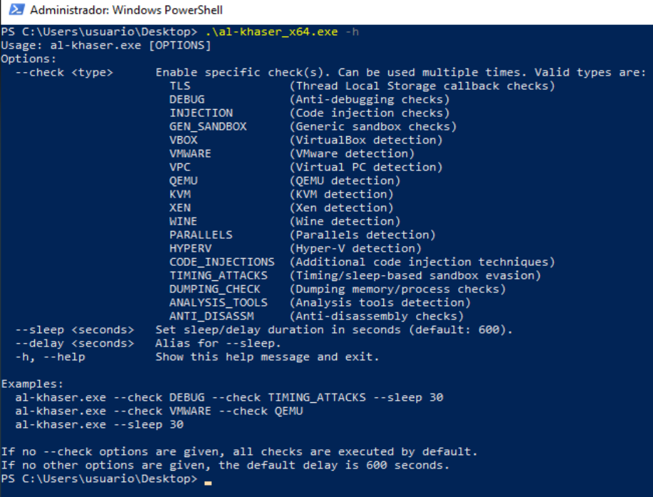

**Primera ejecución: sin el proceso señuelo.** Comprobamos inicialmente que los procesos buscados no se encuentran activos:
```bash
tasklist | findstr /i "qemu-ga.exe vdagent.exe vdservice.exe"
```

Como el comando no devuelve ninguna línea, ejecutamos `al-khaser`:
```bash
"C:\Users\Usuario\Desktop\al-khaser_x64.exe" --check QEMU > resultado_sin_proceso.txt
```

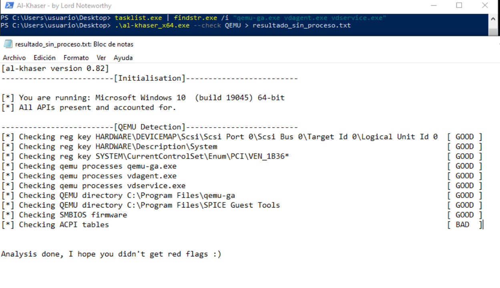


Buscamos en el resultado las comprobaciones relacionadas con procesos:

```bash
findstr /i "qemu processes" resultado_sin_proceso.txt
```

En esta primera ejecución, la comprobación correspondiente a `qemu-ga.exe` indica que el proceso no ha sido detectado:


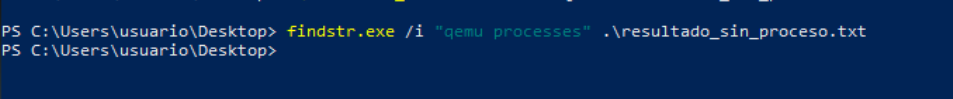

-----


**Creamos un proceso señuelo:**

Creamos una carpeta para la prueba:

```bash
mkdir C:\Lab\processes-demo
```

Copiamos un ejecutable legítimo de Windows y renómbralo como `qemu-ga.exe`:
```bash
copy C:\Windows\System32\cmd.exe C:\Lab\processes-demo\qemu-ga.exe
```

Ejecutamos el archivo renombrado y lo mantenemos abierto:

```bash
Start-Process `
  -FilePath "C:\Lab\processes-demo\qemu-ga.exe" `
  -ArgumentList "/k", "title QEMU-process-decoy"

```

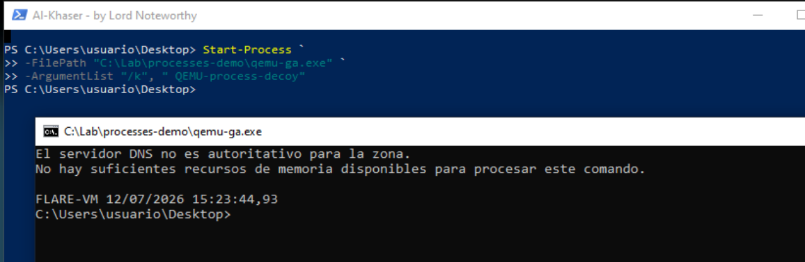


Comprobamos que Windows lo muestra con el nombre esperado:
```bash
tasklist /fi "IMAGENAME eq qemu-ga.exe"
```


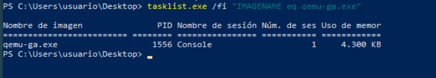

El resultado muestra la entrada:
```bash
qemu-ga.exe
```

Este ejecutable sigue siendo una copia legítima de `cmd.exe`. Únicamente se ha cambiado el nombre del archivo para comprobar si `al-khaser` se basa en el nombre del proceso.

------


**Segunda ejecución: con el proceso señuelo:**

Ejecutamos de nuevo la misma categoría:

```bash
al-khaser_x64.exe --check QEMU > resultado_con_proceso.txt
```

Extraemos las líneas relativas a los procesos:

```bash
findstr /i "qemu processes" resultado_con_proceso.txt
```

La comprobación de `qemu-ga.exe` pasa de un resultado negativo a uno positivo. Los demás indicadores de `QEMU` pueden seguir siendo negativos, ya que no se han introducido claves del Registro, archivos, firmware ni controladores asociados a esa plataforma.

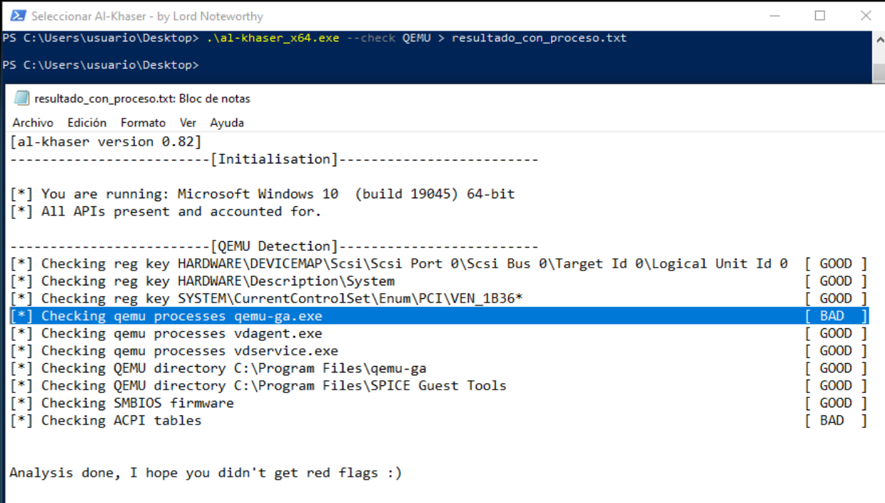

`al-khaser` consulta la lista de procesos activos y reacciona ante la aparición del nombre `qemu-ga.exe`.

-----


**Confirmación con `x64dbg`:**

La salida de `al-khaser` demuestra el cambio de resultado, pero para acreditar técnicamente el mecanismo vamos a observar las llamadas a la `API` con `x64dbg`.

Cargamos `al-khaser_x64.exe` en `x64dbg` y configuramos la línea de comandos: `File - Change Command Line`:
```bash
"C:\Users\Usuario\Desktop\al-khaser_x64.exe" --check QEMU
```

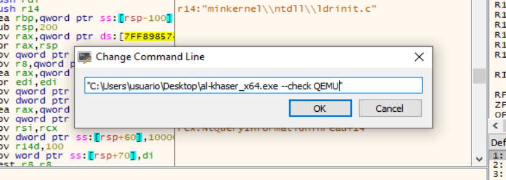

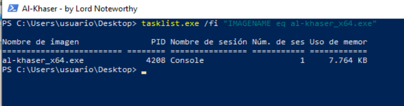

Establecemos puntos de ruptura sobre estas funciones:
```bash
CreateToolhelp32Snapshot
Process32FirstW
Process32NextW
StrCmpIW
```

----------


**Comprobamos `CreateToolhelp32Snapshot`:**

```bash
Cuando la ejecución se detenga en `CreateToolhelp32Snapshot`, inspeccionamos los argumentos:
RCX = dwFlags
RDX = th32ProcessID
```


Para demostrar la enumeración de procesos, debemos encontrar una llamada con:
```bash
RCX = 0x2
RDX = 0x0
```

Donde:
```bash
0x2 = TH32CS_SNAPPROCESS
```

La llamada esperada sería equivalente a:

```bash
CreateToolhelp32Snapshot(TH32CS_SNAPPROCESS, 0);
```

Pulsamos `F9` para continuar hasta una llamada a `CreateToolhelp32Snapshot` que cumpla con `RCX` y `RDX`:

En Windows x64, la función recibe:
```bash
HANDLE CreateToolhelp32Snapshot(
    DWORD dwFlags,       // RCX
    DWORD th32ProcessID  // RDX
);
```

Por tanto:
```bash
0x00000002 = TH32CS_SNAPPROCESS
0x00000000 = enumerar los procesos de todo el sistema
```

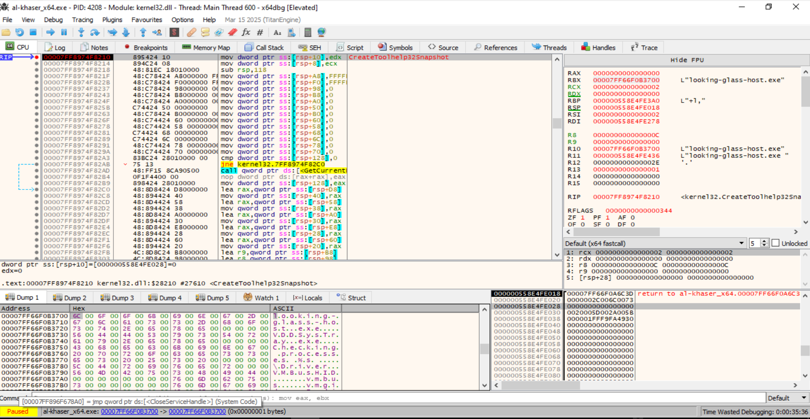


El registro `RBX` apunta a la cadena:

```bash
looking-glass-host.exe
```

Esto sugiere que, en esta iteración, `al-khaser` está enumerando los procesos para comprobar si se encuentra activo `looking-glass-host.exe`, asociado a entornos de virtualización y visualización de máquinas virtuales.

El proceso buscado no se pasa directamente a `CreateToolhelp32Snapshot`. La cadena se conserva en el código llamador para compararla posteriormente con cada nombre obtenido durante la enumeración.

------

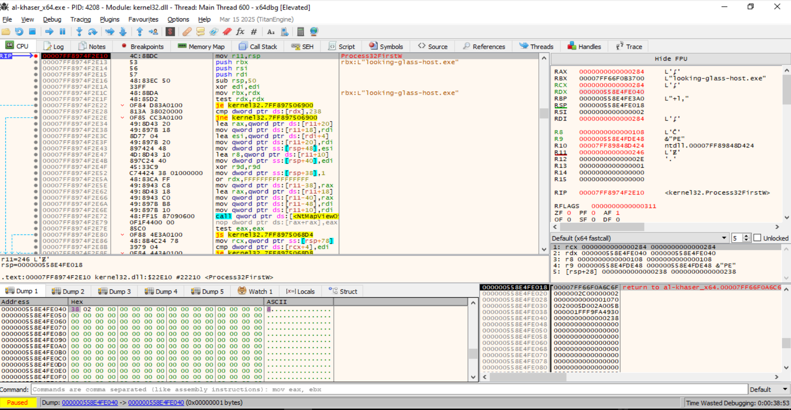


`al-khaser` ha llamado a `Process32FirstW` para recuperar la primera entrada de la instantánea de procesos. 

La función tiene esta firma:
```bash
BOOL Process32FirstW(
    HANDLE            hSnapshot,
    LPPROCESSENTRY32W lppe
);
```

En `Windows x64`, los argumentos aparecen en:
```bash
RCX = hSnapshot
RDX = puntero a PROCESSENTRY32W
```

En la captura:
```bash
RCX = 0x284
RDX = 0x000000558E4FE040
```

Por tanto:
- `RCX = 0x284` es el identificador devuelto anteriormente por `CreateToolhelp32Snapshot`.
- `RDX = 0x000000558E4FE040` apunta a la estructura `PROCESSENTRY32W` donde Windows escribirá los datos del primer proceso enumerado.

Además, `RBX` apunta a:

```bash
looking-glass-host.exe
```

Esto indica que `al-khaser` está recorriendo los procesos para comprobar si alguno coincide con ese nombre.

Debemos anotar la dirección `000000558E4FE040` antes de ejecutar la función ya que es el puntero a la estructura `PROCESSENTRY32W`.


-------

Pulsamos `Ctrl + F9` para ejecutar hasta el retorno de `Process32FirstW`. Al regresar al código de `al-khaser`, comprobamos `RAX`:
```bash
RAX != 0  → la función tuvo éxito
RAX = 0   → la enumeración falló
```

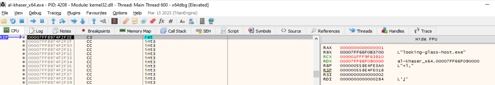

```bash
RAX = 1
```

El valor `1` indica que `Process32FirstW` se ejecutó correctamente y escribió la información del primer proceso en la estructura `PROCESSENTRY32W`.

```bash
RBX -> "looking-glass-host.exe"
```

`RBX` sigue conservando el nombre del proceso que `al-khaser` pretende localizar.

```bash
RDI = 0x284
```

Ese valor coincide con el `handle` de la instantánea de procesos creada mediante `CreateToolhelp32Snapshot`.

Comprobamos que ahora `RDX` ya no contiene el puntero a la estructura `PROCESSENTRY32W`. Ha cambiado. Por eso hemos tenido que anotarlo en el paso anterior:
```bash
000000558E4FE040
```


-----


El nombre del proceso se encuentra en el campo `szExeFile`, cuyo desplazamiento es `0x2C`:
```bash
000000558E4FE040 + 0x2C
= 000000558E4FE06C
```

Pulsamos `F8` para ejecutar la instrucción `ret` y volver al código de `al-khaser`.

En el panel `Dump`, pulsamos `Ctrl + G` e introducimos:
```bash
000000558E4FE06C
```

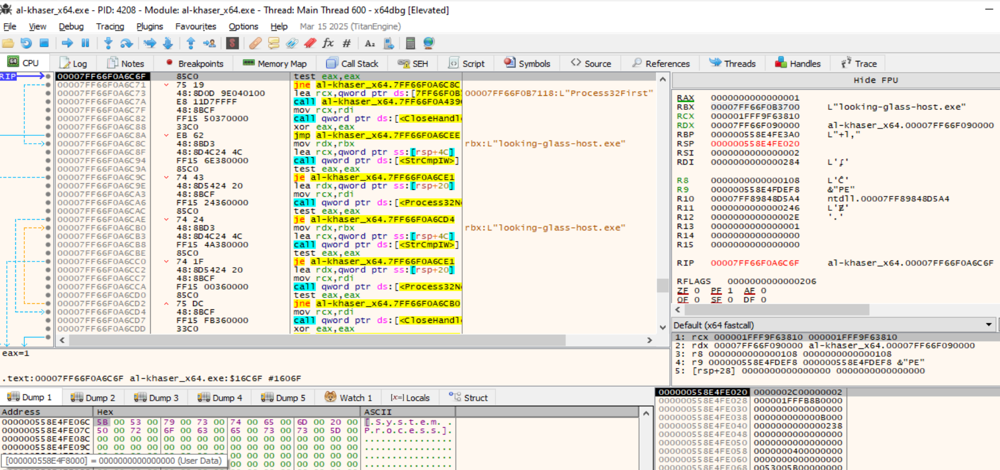


Vemos que la primera entrada recuperada por `Process32FirstW` corresponde a `[System Process]`.

-----


**Comparación del nombre del proceso:**

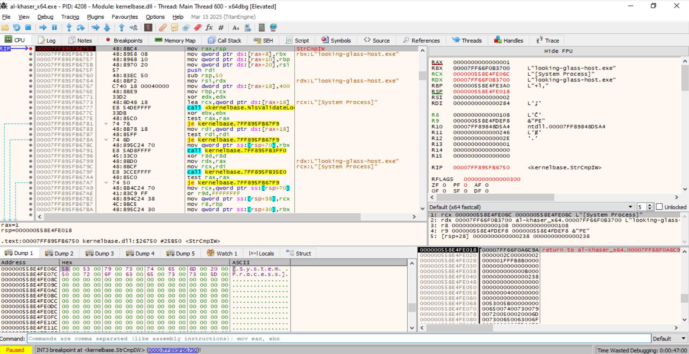

Los argumentos de `StrCmpIW` son:

```bash
RCX = nombre del proceso enumerado
RDX = nombre del proceso buscado
```

En esta ejecución:

```bash
RCX -> "[System Process]"
RDX -> "looking-glass-host.exe"
```

La comparación equivalente sería:

```bash
StrCmpIW(L"[System Process]", L"looking-glass-host.exe");
```

Como las cadenas no coinciden, `StrCmpIW` devolverá un valor distinto de cero. Después, el programa ejecutará:
```bash
lea rdx, [rsp+20]
mov rcx, rdi
call Process32NextW
```


Esta llamada sustituirá el contenido de la estructura por el siguiente proceso de la lista.

La lógica completa visible en la captura es:

```bash
Process32FirstW
        │
        ▼
Obtener szExeFile
        │
        ▼
StrCmpIW(proceso_actual, proceso_buscado)
        │
        ├── Coincidencia ──► Rama de proceso detectado
        │
        └── Sin coincidencia
                 │
                 ▼
          Process32NextW
                 │
                 └── Repetir comparación
```


------

Pulsamos `Ctrl + F9` para ejecuta `StrCmpIW` hasta su instrucción `ret`. Pulsamos `F8` para volver al código de `al-khaser`, justo después de la llamada. Comprobamos el valor de `RAX`. Para una comparación sin coincidencia debe ser:
```bash
EAX != 0
```

```bash
StrCmpIW("[System Process]", "looking-glass-host.exe")
                         │
                         ▼
                     EAX != 0
                         │
                         ▼
                 test eax, eax
                         │
                         ▼
                      ZF = 0
                         │
                         ▼
             No se toma el salto JE
                         │
                         ▼
              Continúa Process32NextW
```

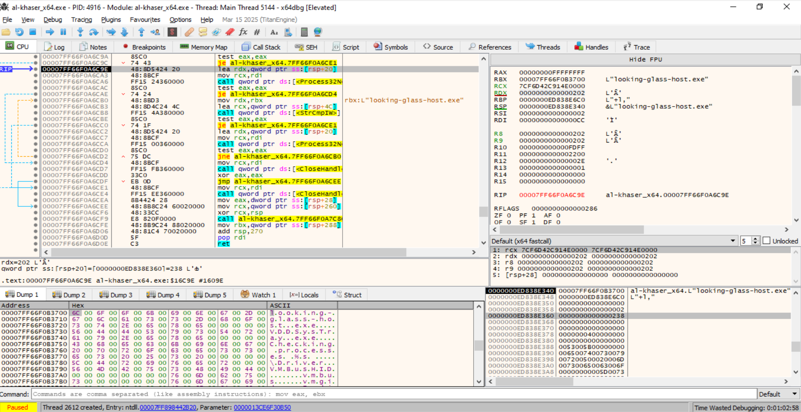

Vemos que `al-khaser` no ha encontrado el proceso buscado en esta comparación:
```bash
EAX = FFFFFFFF
ZF  = 0
```

Tras la llamada a `StrCmpIW`, el registro `EAX` contenía el valor `0xFFFFFFFF`, equivalente a `-1` como entero con signo. Este resultado distinto de cero indica que el nombre del proceso enumerado no coincidía con el indicador `looking-glass-host.exe`.

La instrucción `test eax, eax` estableció posteriormente el indicador `ZF` a cero. Por este motivo, no se tomó el salto condicional `je` correspondiente a la detección del proceso. La ejecución continuó con `Process32NextW` para obtener y comparar la siguiente entrada de la instantánea de procesos.

----

Tras una comparación sin coincidencia, `al-khaser` continúa el recorrido mediante `Process32NextW`:

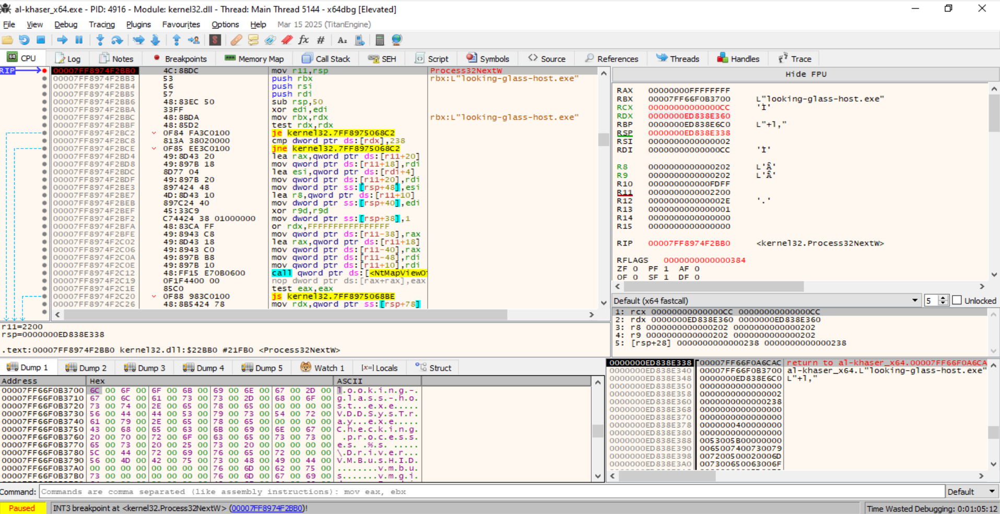


En la entrada de la función se observan:

```bash
RCX = 0xCC
RDX = 0x000000ED838E360
RBX -> "looking-glass-host.exe"
```

Su interpretación es:

```bash
Process32NextW(
    0xCC,                  // handle de la instantánea
    0x000000ED838E360      // estructura PROCESSENTRY32W
);
```

Dirección aparecerá el nuevo valor de `szExeFile`:
```bash
0x000000ED838E360 + 0x2C = 0x000000ED838E38C
```


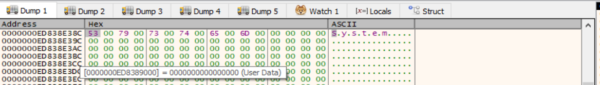

Vemos que tras llamar a `Process32NextW`, la estructura contiene:

```bash
System
```

El cambio de contenido demuestra que `Process32NextW` actualiza la estructura con cada nueva entrada y que `al-khaser` recorre secuencialmente los procesos activos del sistema.

Como conclusión, el análisis dinámico de la técnica **3.3.1. Enumerar procesos en ejecución** permitió verificar que `al-khaser` crea una instantánea de los procesos activos mediante `CreateToolhelp32Snapshot` con el indicador `TH32CS_SNAPPROCESS`, obtiene las entradas con `Process32FirstW` y continúa el recorrido con `Process32NextW`. Los nombres recuperados en el campo `szExeFile` se comparan mediante `StrCmpIW` con distintos indicadores asociados a entornos virtualizados o herramientas de análisis. Las evidencias observadas confirman que la herramienta recorre secuencialmente la lista de procesos y utiliza el resultado de las comparaciones como mecanismo de detección ambiental.

-----


### 3.10.2 Análisis dinámico de la técnica 3.3.2: Detectar procesos de VirtualBox
El código de `al-khaser` comprueba específicamente `vboxservice.exe` y `vboxtray.exe`. Para cada nombre llama a `GetProcessIdFromName()` y muestra un resultado positivo si obtiene un `PID`. La categoría puede ejecutarse de forma aislada mediante `--check VBOX`.

Comprobamos si los procesos ya están activos
```bash
Get-Process -Name "VBoxService", "VBoxTray" -ErrorAction SilentlyContinue
```

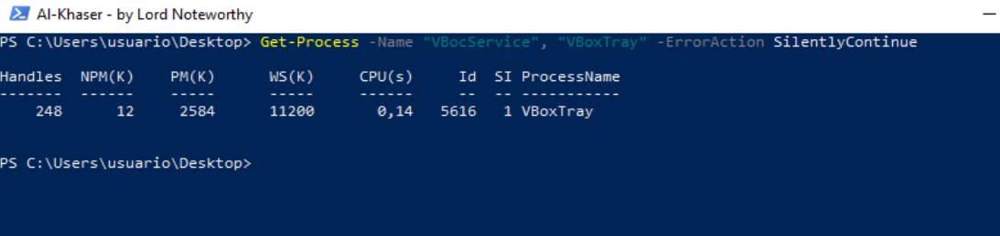

Comprobamos que tenemos un proceso real de VirtualBox activo:
```bash
Proceso: VBoxTray
PID: 5616
```

Volvemos a cargar `al-khaser_x64.exe` en `x64dbg` con la comprobación de VirtualBox:
```bash
--check VBOX
```

Mantemos estos puntos de ruptura:
```bash
kernel32.CreateToolhelp32Snapshot
kernel32.Process32FirstW
kernel32.Process32NextW
kernelbase.StrCmpIW
```

Para `CreateToolhelp32Snapshot`, vamos a utilizar la condición:
```bash
rcx == 2 && rdx == 0
```

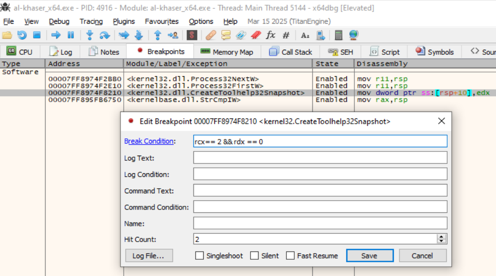

Esto hará que `x64dbg` se detenga únicamente cuando se cree una instantánea de los procesos activos.


-----


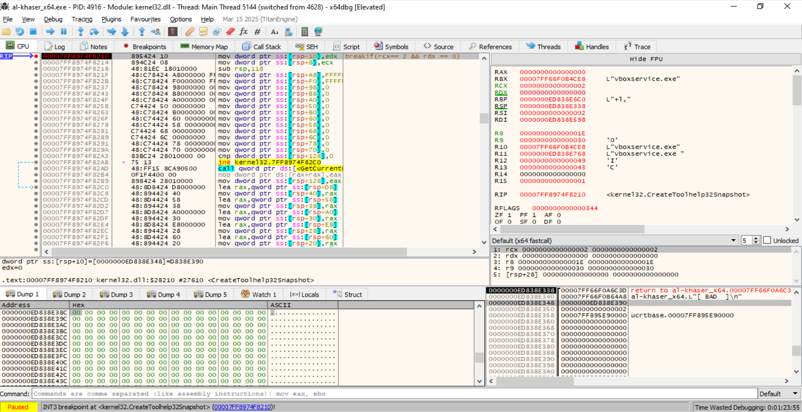

Se observan estos valores:

```bash
RBX -> L"vboxservice.exe"
RCX = 0x2
RDX = 0x0
```

Por tanto, `al-khaser` está buscando ahora el indicador `vboxservice.exe` y crea una nueva instantánea de los procesos mediante:

CreateToolhelp32Snapshot(TH32CS_SNAPPROCESS, 0);

El valor actual de `RAX = 0` no debe interpretarse todavía como el resultado de la detección, porque estamos en la entrada de `CreateToolhelp32Snapshot`.


Para no detenernos en cada proceso, deshabilitamos temporalmente los breakpoints:

```bash
CreateToolhelp32Snapshot
Process32FirstW
Process32NextW
```

y dejamos activo únicamente:

```bash
kernelbase.StrCmpIW
```

Después pulsamos `F9`.

En esta rutina concreta, la comparación esperada será:

```bash
RCX -> nombre del proceso enumerado
RDX -> L"vboxservice.exe"
```

Vermos comparaciones como:
```bash
StrCmpIW(L"[System Process]", L"vboxservice.exe")
StrCmpIW(L"System", L"vboxservice.exe")
StrCmpIW(L"smss.exe", L"vboxservice.exe")
```

Continúamos con `F9` hasta que observemos:

```bash
RCX -> L"VBoxService.exe"
RDX -> L"vboxservice.exe"
```

------

Vemos una comparación positiva potencial que buscábamos:
```bash
RCX -> L"VBoxService.exe"
RDX -> L"vboxservice.exe"
```

`StrCmpIW` no distingue entre mayúsculas y minúsculas, por lo que ambas cadenas se consideran iguales:

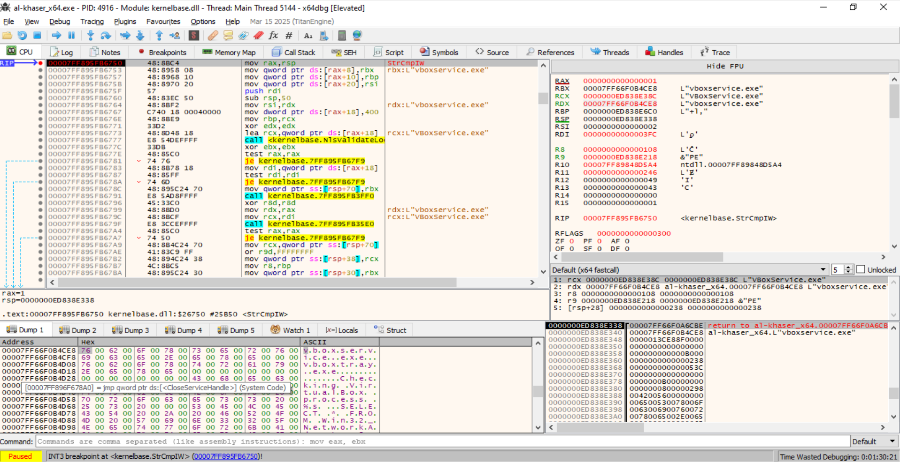


Pulsamos `Ctrl + F9` para ejecutar hasta la instrucción `ret` de `StrCmpIW`. Después pulsamos una vez `F8` para regresar al código de `al-khaser`, justo después de la llamada.

Comprobamos que
```bash
EAX = 00000000
```

El valor cero confirma que:
```bash
StrCmpIW(L"VBoxService.exe", L"vboxservice.exe") == 0

```

Avanzamos con `F8`:

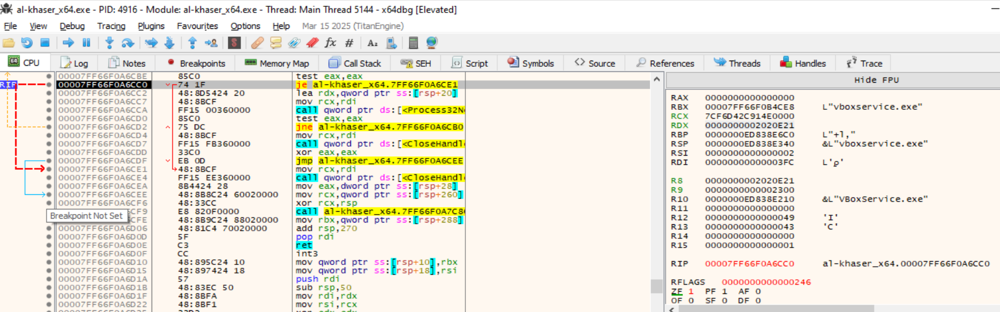

Los valores relevantes son:

```bash
RAX = 0
ZF  = 1
RBX -> L"vboxservice.exe"
R10 -> L"VBoxService.exe"
```

`StrCmpIW` ha devuelto `0`, lo que indica que `VBoxService.exe `y `vboxservice.exe` se consideran iguales. La diferencia entre mayúsculas y minúsculas no afecta porque la comparación es `case-insensitive`. Tras ejecutar `test eax, eax`, el indicador `ZF` queda establecido en `1`, por lo que el salto `je` se tomará hacia la rama de proceso encontrado.


Como conclusión, el análisis dinámico de la técnica **3.3.2. Detectar procesos de VirtualBox** permitió comprobar que `al-khaser` enumera los procesos activos y compara sus nombres con indicadores característicos de VirtualBox. Durante la prueba se localizó el proceso real `VBoxService.exe`, cuya comparación con `vboxservice.exe` devolvió un resultado positivo. El valor `EAX = 0`, junto con `ZF = 1` y la ejecución del salto condicional hacia la rama de detección, confirma que la herramienta identificó correctamente la presencia de un componente de VirtualBox en el entorno analizado.


----

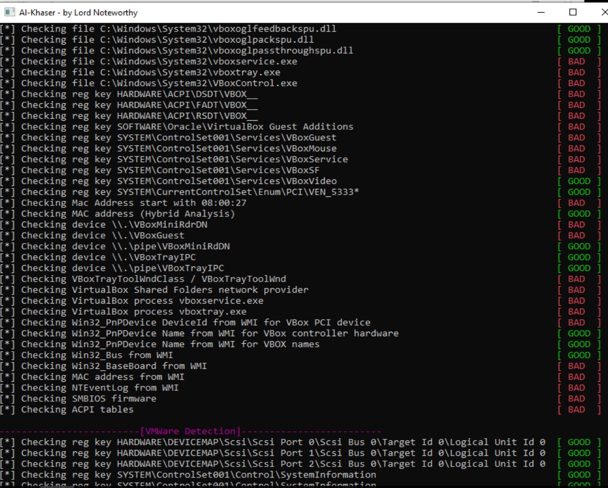


**Resultado de la prueba:**

El análisis dinámico permitió confirmar que `al-khaser` detecta procesos asociados a VirtualBox mediante la enumeración de los procesos activos del sistema. Durante la ejecución se localizó el proceso real `VBoxService.exe`, cuyo nombre fue comparado con el indicador `vboxservice.exe` mediante `StrCmpIW`.

La comparación devolvió `EAX = 0` y, después de la instrucción `test eax, eax`, el indicador `ZF` quedó establecido a `1`. Esto provocó que se tomara la rama correspondiente a la detección positiva. Finalmente, la consola de `al-khaser` mostró el resultado `[ BAD ]` para la comprobación de `vboxservice.exe`, confirmando la presencia de un proceso característico de VirtualBox.


### 3.10.3 Análisis denámico de la técnica 3.3.3: Detectar procesos de VMware


Ahora el objetivo será acreditar que al-khaser:
- Busca procesos asociados a VMware:
  - `vmtoolsd.exe`.
  - `vmacthlp.exe`.
  - `vmwaretray.exe`.
  - `vmwareuser.exe`.
  - `vmwareservice.exe`.
  - `vmware.exe`.
  - `vmount2.exe`.
- Enumera todos los procesos activos.
- Compara sus nombres con indicadores como `vmtoolsd.exe`.
- Al no encontrar ninguna coincidencia, muestra un resultado negativo de detección, normalmente `[ GOOD ]`.

-----

Crearemos un proceso señuelo llamado `vmtoolsd.exe` para simular el proceso `vmtoolsd.exe`.

Ejecutamos en PowerShell como administrador:
```bash
$Lab = "C:\Lab\vmware-process-demo"

New-Item -ItemType Directory -Path $Lab -Force | Out-Null

Copy-Item `
    -Path "$env:WINDIR\System32\cmd.exe" `
    -Destination "$Lab\vmtoolsd.exe" `
    -Force
```

Iniciamos el proceso señuelo:
```bash
$proc = Start-Process `
    -FilePath "$Lab\vmtoolsd.exe" `
    -ArgumentList "/k", "title VMware-process-decoy" `
    -PassThru
```

Lo dejamos abierto y verificamos que aparece con el nombre esperado:

```bash
tasklist /FI "IMAGENAME eq vmtoolsd.exe"
```

-----

Ejecutamos `al-khaser` en `x64dbg` aplicando el argumento en la línea de comandos de la aplicación:
```bash
"C:\Users\Usuario\Desktop\al-khaser_x64.exe" --check VMWARE
```

Establecemos los puntos de ruptura:
```bash
kernel32.CreateToolhelp32Snapshot
kernel32.Process32FirstW
kernel32.Process32NextW
kernelbase.StrCmpIW
```

En `CreateToolhelp32Snapshot`, podemos establecer la condición:
```bash
rcx == 2 && rdx == 0
```

Esto hará que el depurador se detenga únicamente cuando se solicite una instantánea de todos los procesos del sistema:
```bash
CreateToolhelp32Snapshot(TH32CS_SNAPPROCESS, 0);
```


Después verificamos el proceso con:
```bash
Get-CimInstance `
    -ClassName Win32_Process `
    -Filter "ProcessId = $($proc.Id)" |
    Select-Object Name, ProcessId, ExecutablePath, CommandLine
```

------

Una vez confirmado que `vmtoolsd.exe` está activo, el siguiente paso es comprobar si la compilación de `al-khaser` contiene realmente la cadena `vmtoolsd.exe`. Si no la contiene, el señuelo no podrá generar un resultado `[ BAD ]`.


Continúamos con `F9` hasta alcanzar una llamada a `CreateToolhelp32Snapshot` en la que alguno de los registros apunte a un indicador de `VMware`. Por ejemplo:
```bash
vmtoolsd.exe
```

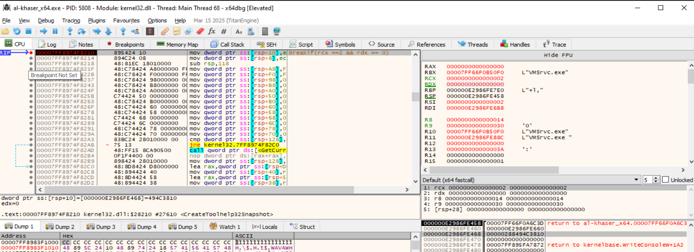

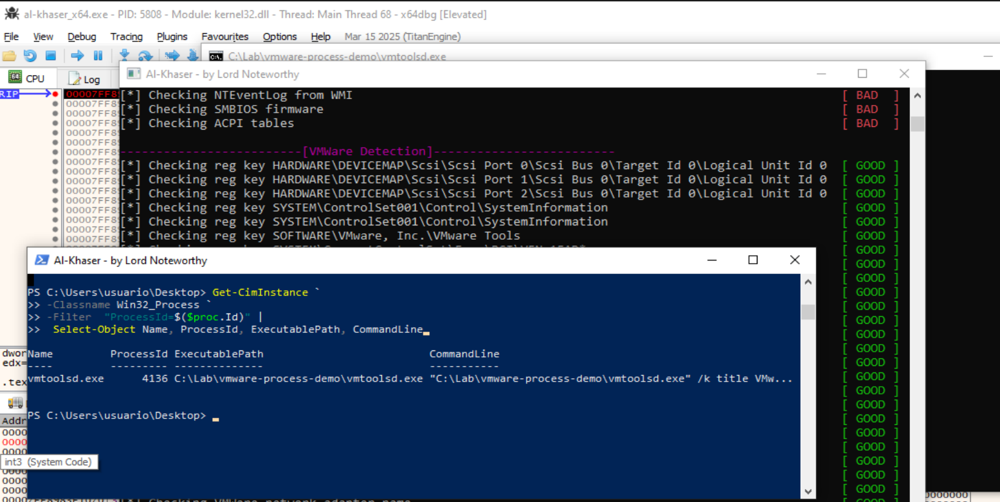


Durante la prueba se comprobó que la detección positiva de `VirtualBox` no impide la ejecución de la categoría `VMware`. Ambas categorías se encuentran
implementadas mediante bloques de control independientes.

No obstante, la compilación analizada no ejecutó la detección de procesos de `VMware`. Aunque el proyecto contiene una función `vmware_processes()`
que busca indicadores como `vmtoolsd.exe`, dicha función no se encuentra invocada desde el bloque principal de comprobaciones `VMware`.

Por este motivo, el proceso señuelo `vmtoolsd.exe` permaneció visible en el sistema, pero no fue enumerado durante la sección `VMWare Detection`.
La siguiente enumeración observada correspondió a `VMSrvc.exe`, indicador asociado a `Microsoft Virtual PC`. Por tanto, **la ausencia de detección se
debe a una omisión en el flujo de ejecución de la versión utilizada y no a la detección previa de `VirtualBox`.**


En conclusión, la demostración confirmó que la versión analizada de `al-khaser` contiene indicadores de procesos `VMware`, pero no ejecuta dicha comprobación en su flujo principal, por lo que el resultado negativo se debe a esta limitación de la implementación y no a la ausencia del proceso señuelo.

### 3.10.4 Análisis dinámico de la técnica 3.3.4: Detectar herramientas de análisis y procesos de sandbox

Mantenemos activos estos breakpoints:

```bash
kernel32.CreateToolhelp32Snapshot
kernel32.Process32FirstW
kernel32.Process32NextW
kernelbase.StrCmpIW
```

En `CreateToolhelp32Snapshot`, conservamos la condición:

```bash
rcx == 2 && rdx == 0
```


---

Vamos a demostrar la detección de `x64dbg.exe`.

Con `al-khaser` abierto en `x64dbg`, ejecutamos en otra consola de PowerShell:
```bash
Get-CimInstance Win32_Process `
    -Filter "Name = 'x64dbg.exe'" |
    Select-Object Name, ProcessId, ExecutablePath
```


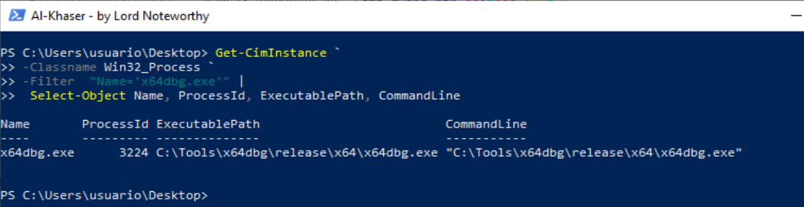

-----

Ejecutamos la categoría de herramientas de análisis:
```bash
"C:\Users\usuario\Desktop\al-khaser_x64.exe" --check ANALYSIS_TOOLS
```


----


Abrimos la pestaña `CPU`. Hacemos clic derecho sobre el desensamblado y seleccionamos:
```bash
Search for
└── Current Module
    └── String references
```
Se abre la pestaña `References`. Pulsamos `Ctrl + F` y buscamos:
```bash
x64dbg.exe
```

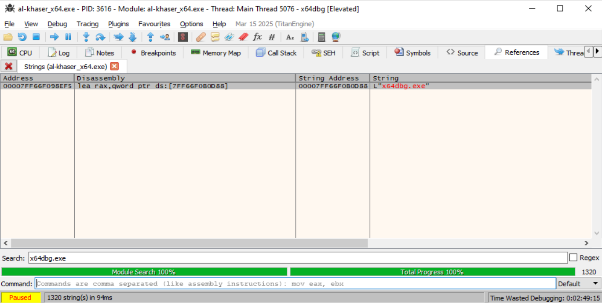


------


Hemos encontrado `x64dbg.exe`. La referencia localizada es:
```bash
Código:  00007FF66F093EF5
Cadena:  00007FF66F0B0D88 → L"x64dbg.exe"
```

Hacemos doble clic sobre la referencia para ir la zona de código donde se carga la dirección de la cadena y se llama a una función auxiliar de búsqueda de procesos. Colocamos un breakpoint en esa llamada:

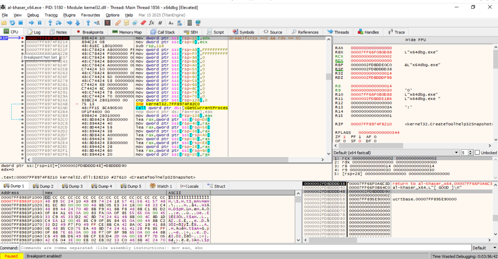

La captura muestra:

```bash
RCX = 0x2
RDX = 0x0
RBX -> L"x64dbg.exe"
R10 -> L"x64dbg.exe"
R11 -> L"x64dbg.exe"
```

Por tanto, `al-khaser` está ejecutando:

```bash
CreateToolhelp32Snapshot(TH32CS_SNAPPROCESS, 0);
```

para buscar específicamente el proceso `x64dbg.exe`.

-------


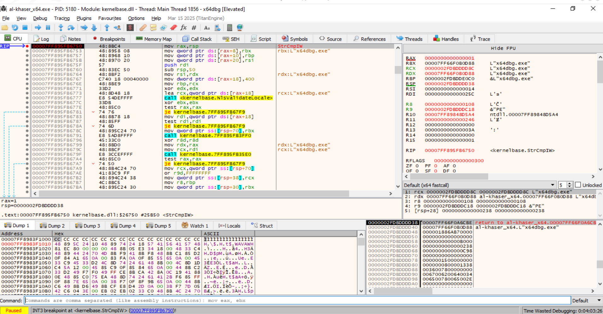

En la primera captura, vemos que `StrCmpIW` recibe dos argumentos equivalentes:
```bash
RCX -> L"x64dbg.exe"
RDX -> L"x64dbg.exe"
```

Esto demuestra que `al-khaser` ha recuperado `x64dbg.exe` de la lista de procesos activos y lo está comparando con el indicador incluido en su lista de herramientas de análisis.

------

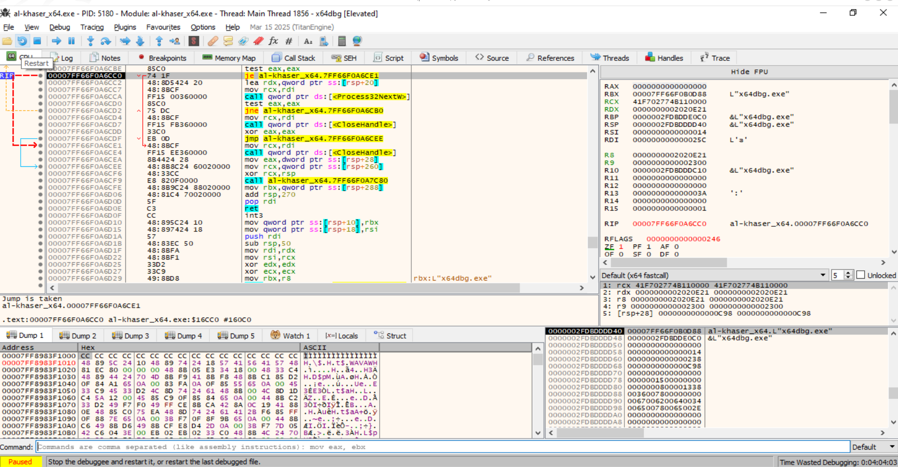

Durante la enumeración de los procesos activos, `al-khaser` localizó el proceso `x64dbg.exe`. El nombre recuperado del sistema y el indicador incluido en la herramienta fueron enviados como argumentos a `StrCmpIW`, observándose en ambos casos la cadena `x64dbg.exe`.

La función devolvió el valor `0` en `EAX`, lo que confirmó que las cadenas coincidían. Posteriormente, la instrucción `test eax, eax` estableció el indicador `ZF` a `1`, provocando que se tomara el salto condicional hacia la rama correspondiente a la detección positiva.

Esta secuencia demuestra que `al-khaser` identifica la presencia de `x64dbg` mediante la enumeración y comparación de los nombres de los procesos activos.


Como conclusión, el análisis dinámico de la técnica **3.3.4. Detectar herramientas de análisis y procesos de sandbox** confirmó que `al-khaser` incluye `x64dbg.exe` como indicador de análisis. La coincidencia observada en `StrCmpIW`, junto con `EAX = 0`, `ZF = 1` y la ejecución del salto hacia la rama de detección, demuestra que la herramienta reconoció correctamente la presencia del depurador en el entorno analizado.

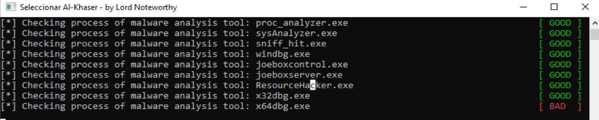


----

## 3.11. Aplicación al TFM

La técnica `Processes` se incorpora al TFM como parte del módulo de evasión ambiental, dentro de las comprobaciones orientadas a detectar máquinas virtuales, `sandboxes` y herramientas de análisis.

Para su validación se utilizó `al-khaser`, una prueba de concepto de código abierto que reproduce técnicas anti-análisis empleadas por malware real. Mediante x64dbg se observaron las APIs `CreateToolhelp32Snapshot`, `Process32FirstW` y `Process32NextW`, así como la comparación de los nombres enumerados mediante `StrCmpIW`.

Las pruebas permitieron demostrar:

- La enumeración secuencial de los procesos activos.
- La detección positiva de `VBoxService.exe` como indicador de VirtualBox.
- La búsqueda de procesos asociados a VMware, aunque la versión analizada no ejecutaba dicha comprobación en su flujo principal.
- La detección positiva de `x64dbg.exe` como herramienta de análisis.

Las evidencias recopiladas incluyen capturas de los argumentos de las APIs, estructuras `PROCESSENTRY32W`, comparaciones de cadenas, valores de retorno y saltos condicionales. Estas pruebas permiten documentar de forma reproducible cómo una muestra puede utilizar los procesos activos para modificar su comportamiento y dificultar el análisis dinámico.

Aunque la detección basada únicamente en nombres de procesos puede generar falsos positivos o ser neutralizada mediante ocultación y renombrado, continúa siendo una técnica relevante cuando se combina con indicadores del Registro, archivos, servicios, hardware y módulos cargados.


----


## 3.12. Conclusiones

La técnica `Processes` constituye un mecanismo de evasión ambiental ampliamente utilizado para identificar la presencia de máquinas virtuales, `sandboxes` y herramientas de análisis. Su funcionamiento se basa en obtener la lista de procesos activos del sistema y comparar los nombres recuperados con un conjunto de indicadores previamente definidos. Entre estos indicadores pueden encontrarse procesos asociados a `VirtualBox`, `VMware`, entornos automatizados de análisis o aplicaciones utilizadas por analistas de malware.

El estudio realizado permitió comprobar que esta técnica no requiere necesariamente mecanismos complejos. En muchos casos, la detección se basa en una enumeración convencional de procesos mediante `APIs` legítimas de Windows. Durante el análisis dinámico de `al-khaser` se observaron llamadas a `CreateToolhelp32Snapshot` con el indicador `TH32CS_SNAPPROCESS`, seguidas de `Process32FirstW` y `Process32NextW`. Esta secuencia permitió confirmar que la herramienta crea una instantánea de los procesos activos y recorre sus entradas de forma secuencial.

La información de cada proceso se almacenaba en una estructura `PROCESSENTRY32W`, cuyo campo `szExeFile` contenía el nombre del ejecutable enumerado. Posteriormente, `al-khaser` utilizaba `StrCmpIW` para comparar dicho nombre con los indicadores incluidos en sus comprobaciones. Al tratarse de una comparación que no distingue entre mayúsculas y minúsculas, nombres como `VBoxService.exe` y `vboxservice.exe` eran considerados equivalentes.

La primera prueba permitió demostrar de manera general la enumeración de procesos. Se observó la obtención de la primera entrada mediante `Process32FirstW`, la comparación de su nombre y la continuación del recorrido mediante `Process32NextW` cuando no se producía una coincidencia. La actualización sucesiva del campo `szExeFile` confirmó que la herramienta no examinaba una única entrada, sino que recorría la lista completa de procesos activos.

La detección de VirtualBox pudo validarse de forma positiva mediante el proceso real `VBoxService.exe`, presente en el sistema como parte de las Guest Additions. Durante la ejecución, el nombre recuperado se comparó con el indicador `vboxservice.exe`. La función `StrCmpIW` devolvió el valor `0` en `EAX`, lo que indicaba que ambas cadenas coincidían. A continuación, la instrucción `test eax, eax` estableció el indicador `ZF` a `1`, provocando que se tomara el salto hacia la rama de detección positiva. La consola de `al-khaser` confirmó el resultado mostrando la comprobación como `[ BAD ]`, valor que representa la detección de un artefacto sospechoso.

En el caso de VMware, se comprobó que el entorno de laboratorio no contenía procesos legítimos asociados a VMware Tools, ya que la máquina virtual utilizada estaba desplegada sobre VirtualBox. Se creó un proceso señuelo denominado `vmtoolsd.exe` para intentar reproducir una detección positiva. Sin embargo, la versión analizada de `al-khaser` no ejecutaba la función de comprobación de procesos VMware dentro de su flujo principal, aunque el binario contenía algunos de los indicadores correspondientes. Por tanto, la ausencia de detección no se debió a que el proceso señuelo no fuera visible, sino a una limitación concreta de la implementación utilizada.

Esta circunstancia resulta relevante desde el punto de vista metodológico, ya que demuestra la importancia de no asumir que la presencia de una cadena o de una función en un binario implica necesariamente que dicha funcionalidad se ejecute. El análisis dinámico debe confirmar que la rutina es alcanzable y que forma parte del flujo real de ejecución. De este modo, el laboratorio también permitió diferenciar entre capacidades presentes en el código y capacidades efectivamente utilizadas durante la ejecución.

La detección de herramientas de análisis se validó mediante el proceso real `x64dbg.exe`. En este caso, `al-khaser` incluía una tabla con numerosos indicadores asociados a herramientas como x64dbg, Fiddler, Cheat Engine, Frida, Ghidra, Radare2, Cutter y dnSpy. Durante la enumeración se localizó `x64dbg.exe`, y la comparación con el indicador correspondiente devolvió `EAX = 0`. Posteriormente, `ZF` quedó establecido a `1` y se tomó la rama de detección. Esta prueba confirmó que la propia herramienta utilizada para realizar el análisis podía ser identificada mediante una simple comparación del nombre del proceso.

Los resultados obtenidos muestran que la técnica `Processes` puede ser eficaz cuando el entorno de análisis mantiene visibles los nombres habituales de sus componentes. Sin embargo, también presenta limitaciones importantes. La presencia de un proceso concreto no demuestra por sí sola que el sistema sea una máquina virtual o una `sandbox`, ya que determinadas aplicaciones pueden ejecutarse en equipos legítimos. Del mismo modo, la ausencia de procesos conocidos no permite descartar la virtualización, puesto que las herramientas de integración pueden no estar instaladas, estar detenidas o haber sido ocultadas.

La técnica también puede ser neutralizada mediante el cierre o renombrado de procesos, la modificación de las listas devueltas por las APIs de enumeración o la interceptación de funciones como `CreateToolhelp32Snapshot`, `Process32FirstW` y `Process32NextW`. No obstante, estas contramedidas deben aplicarse de forma coherente, ya que ocultar únicamente un proceso puede resultar insuficiente si siguen presentes otros artefactos relacionados, como archivos, controladores, servicios, claves del Registro, módulos cargados o características del hardware virtual.

Por este motivo, el malware suele combinar la enumeración de procesos con otras técnicas de evasión ambiental. La correlación de múltiples indicadores permite aumentar la fiabilidad de la detección y reducir los falsos positivos. Una muestra puede, por ejemplo, comprobar simultáneamente procesos de `VirtualBox`, claves del Registro, archivos de las `Guest Additions`, direcciones `MAC` y dispositivos virtuales antes de decidir si debe ejecutar su carga maliciosa.

Desde la perspectiva del análisis defensivo, las pruebas realizadas demuestran la utilidad de combinar el análisis estático y dinámico. El análisis estático permite localizar cadenas, APIs y funciones potencialmente relacionadas con la técnica, mientras que el análisis dinámico permite confirmar qué comprobaciones se ejecutan realmente, qué datos procesan y cómo afectan al flujo de control. La observación de los argumentos, valores de retorno, indicadores del procesador y saltos condicionales proporciona una evidencia más sólida que la mera presencia de cadenas sospechosas.

En conjunto, el laboratorio permitió validar de forma reproducible la enumeración de procesos, la detección positiva de VirtualBox y la identificación de `x64dbg` como herramienta de análisis. También permitió documentar una limitación en la comprobación de procesos VMware de la versión analizada. Estas evidencias justifican la inclusión de la técnica `Processes` dentro del módulo de evasión del `TFM` y muestran cómo una implementación relativamente sencilla puede modificar el comportamiento de una muestra y dificultar su análisis dinámico.