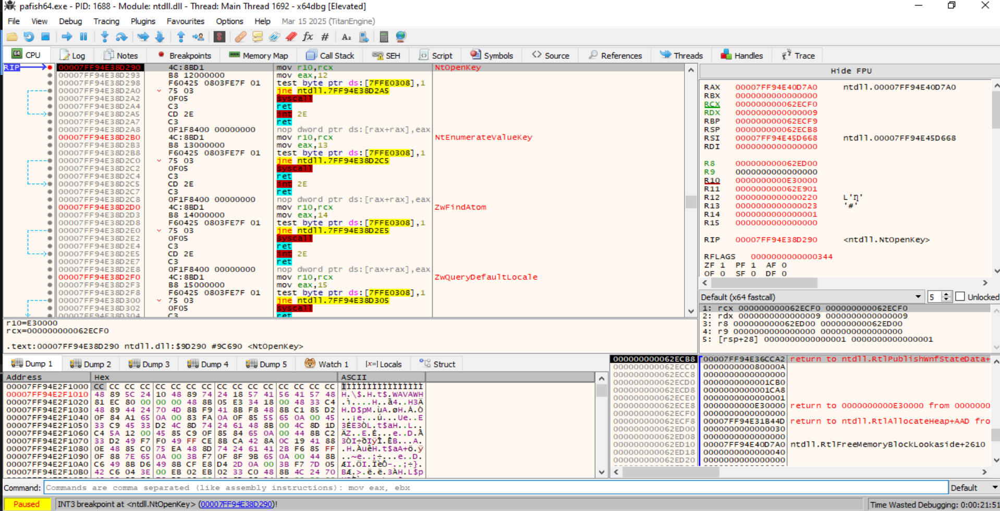
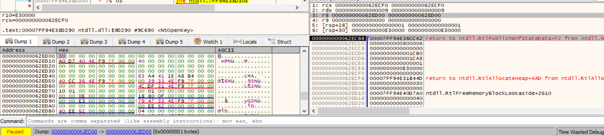
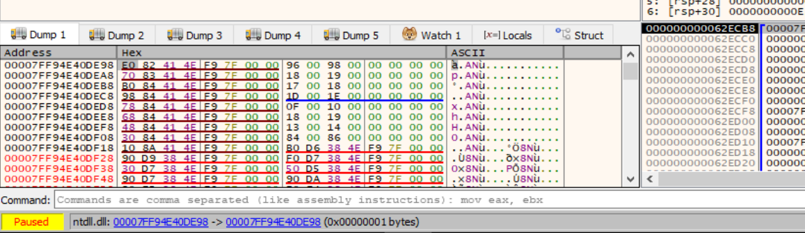
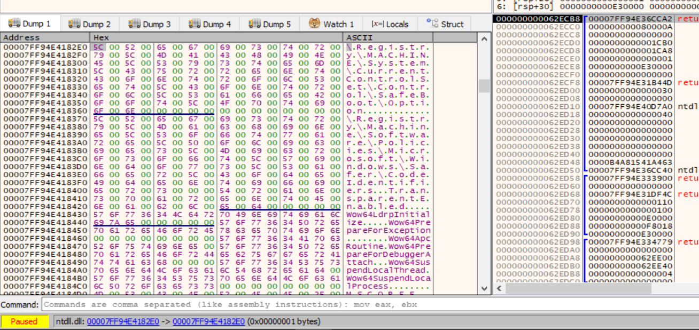

- [2. La técnica `registry`](#2-la-técnica-registry)
  - [2.1. Descripción de la técnica `registry`](#21-descripción-de-la-técnica-registry)
  - [2.2. Categoría](#22-categoría)
  - [2.3. Técnicas principales](#23-técnicas-principales)
    - [2.3.1. Comprobar claves de `VirtualBox`](#231-comprobar-claves-de-virtualbox)
    - [2.3.2. Comprobar claves de `VMware`](#232-comprobar-claves-de-vmware)
    - [2.3.3. Comprobar claves de servicios de VM](#233-comprobar-claves-de-servicios-de-vm)
    - [2.3.4. Comprobar claves ACPI/BIOS en el registro](#234-comprobar-claves-acpibios-en-el-registro)
    - [2.3.5. Comprobar claves asociadas a sandbox o herramientas de análisis](#235-comprobar-claves-asociadas-a-sandbox-o-herramientas-de-análisis)
  - [2.4. Resumen visual de las técnicas que aparecen en `registry`](#24-resumen-visual-de-las-técnicas-que-aparecen-en-registry)
  - [2.5. Contramedidas ofensivas](#25-contramedidas-ofensivas)
  - [2.6. Contramedidas defensivas](#26-contramedidas-defensivas)
  - [2.7. Checklist rápido del laboratorio](#27-checklist-rápido-del-laboratorio)
    - [Preparación del entorno](#preparación-del-entorno)
    - [Análisis estático previo](#análisis-estático-previo)
    - [Monitorización dinámica](#monitorización-dinámica)
    - [Indicadores de VirtualBox](#indicadores-de-virtualbox)
    - [Indicadores de VMware](#indicadores-de-vmware)
    - [Indicadores de Hyper-V, Xen, Wine y Sandboxie](#indicadores-de-hyper-v-xen-wine-y-sandboxie)
    - [Comprobaciones ACPI/BIOS](#comprobaciones-acpibios)
    - [Comprobaciones asociadas a sandbox](#comprobaciones-asociadas-a-sandbox)
    - [Interpretación del comportamiento](#interpretación-del-comportamiento)
    - [Evidencias que deben documentarse](#evidencias-que-deben-documentarse)
    - [Conclusión del checklist](#conclusión-del-checklist)
  - [2.8. Casos prácticos asociados a la técnica `registry`](#28-casos-prácticos-asociados-a-la-técnica-registry)
    - [Tabla resumen de casos prácticos por tipo de comprobación](#tabla-resumen-de-casos-prácticos-por-tipo-de-comprobación)
    - [Detalle de indicadores por caso](#detalle-de-indicadores-por-caso)
      - [Caso 1: `VirtualBox` mediante claves ACPI](#caso-1-virtualbox-mediante-claves-acpi)
      - [Caso 2: `VirtualBox Guest Additions`](#caso-2-virtualbox-guest-additions)
      - [Caso 3: `VMware Tools`](#caso-3-vmware-tools)
      - [Caso 4: identificadores de hardware virtualizado](#caso-4-identificadores-de-hardware-virtualizado)
      - [Caso 5: valores `BIOS` y descripción del sistema](#caso-5-valores-bios-y-descripción-del-sistema)
      - [Caso 6: `Hyper-V`](#caso-6-hyper-v)
      - [Caso 7: `Sandboxie`](#caso-7-sandboxie)
      - [Caso 8: `Wine`](#caso-8-wine)
      - [Caso 9: `ProductID` de sandbox](#caso-9-productid-de-sandbox)
      - [Caso 10: macros de `Office`](#caso-10-macros-de-office)
      - [Caso 11: enumeración de servicios](#caso-11-enumeración-de-servicios)
      - [Caso 12: comparación de comportamiento](#caso-12-comparación-de-comportamiento)
    - [Tabla resumen de ejemplos de malware asociados a la técnica `registry`](#tabla-resumen-de-ejemplos-de-malware-asociados-a-la-técnica-registry)
    - [Relación entre casos prácticos y familias documentadas](#relación-entre-casos-prácticos-y-familias-documentadas)
    - [Referencias](#referencias)
  - [2.9. Análisis dinámico de las técnicas `registry`](#29-análisis-dinámico-de-las-técnicas-registry)
    - [Objetivos del análisis dinámico](#objetivos-del-análisis-dinámico)
    - [Herramientas recomendadas](#herramientas-recomendadas)
    - [Análisis con `Process Monitor`](#análisis-con-process-monitor)
    - [Indicadores a observar en Process Monitor](#indicadores-a-observar-en-process-monitor)
    - [Análisis con RegShot](#análisis-con-regshot)
    - [Análisis con `API Monitor`](#análisis-con-api-monitor)
    - [Análisis con depurador](#análisis-con-depurador)
    - [Conclusión](#conclusión)
    - [Uso de `pafish` para el análisis dinámico de técnicas `registry`](#uso-de-pafish-para-el-análisis-dinámico-de-técnicas-registry)
    - [Conclusiones](#conclusiones)
  - [2.10. Aplicación al TFM](#210-aplicación-al-tfm)
  - [2.11 Conclusión del caso Pafish](#211-conclusión-del-caso-pafish)


# 2. La técnica `registry`

| Campo | Clasificación |
|---|---|
| Categoría | Evasión / Anti-análisis |
| Subcategoría | Anti-VM / Anti-sandbox |
| Tipo de artefacto | Sistema de archivos |
| Sistema principal | Windows |
| Prioridad para el TFM | Alta |


## 2.1. Descripción de la técnica `registry`

La técnica `registry` es una técnica de evasión anti-VM y anti-sandbox basada en la inspección del Registro de Windows con el objetivo de **identificar artefactos asociados a entornos virtualizados, sandboxes o plataformas de análisis automatizado.** Su finalidad es permitir que el malware determine si se está ejecutando en un sistema físico real o en un entorno controlado por analistas, modificando su comportamiento en función del resultado.

El principio general de esta técnica parte de una premisa sencilla: determinadas claves, valores o cadenas del Registro no suelen estar presentes en un equipo físico convencional, pero sí pueden aparecer en entornos como `VirtualBox`, `VMware`, `Hyper-V`, `Sandboxie`, `Wine`, `Xen`, `QEMU` o `Parallels`. Por tanto, **la presencia de estos artefactos puede actuar como indicador de virtualización o análisis.**

**En la práctica, el malware puede aplicar esta técnica de varias formas:**
* Comprobando si existen **rutas concretas del Registro** asociadas a productos de virtualización o sandboxing, como servicios, controladores o herramientas invitadas de `VMware`, `VirtualBox` o `Hyper-V`.
* Leyendo valores específicos del Registro y **buscando cadenas características** como `VBOX`, `VMWARE`, `QEMU`, `Xen`, `VirtualBox` o nombres relacionados con herramientas de análisis.
* **Enumerando subclaves** dentro de rutas amplias del sistema y **buscando patrones** asociados a entornos virtualizados, por ejemplo cadenas como `VBox` dentro de claves relacionadas con servicios del sistema.
* Comprobando **configuraciones específicas de aplicaciones**, como las opciones de seguridad de macros de `Microsoft Office`, mediante valores como `VBAWarnings`, para detectar configuraciones anómalas que puedan ser habituales en sandboxes automatizadas.

**Para llevar a cabo estas comprobaciones, el malware suele utilizar funciones de la API de Windows relacionadas con el Registro, entre ellas:**
* `RegOpenKey`
* `RegOpenKeyEx`
* `RegQueryValue`
* `RegQueryValueEx`
* `RegEnumKeyEx`
* `RegCloseKey`

**Estas funciones pueden estar apoyadas o sustituidas por llamadas de más bajo nivel exportadas por `ntdll.dll`, como:**
* `NtOpenKey`
* `NtQueryValueKey`
* `NtEnumerateKey`
* `NtClose`

Desde el punto de vista del análisis, la presencia de llamadas a estas funciones no implica por sí sola un comportamiento malicioso, ya que muchas aplicaciones legítimas consultan el Registro. Sin embargo, cuando dichas llamadas acceden a rutas o valores característicos de entornos virtualizados, pueden considerarse un indicio relevante de comportamiento evasivo.

En resumen, **la técnica `registry` permite al malware utilizar el Registro de Windows como fuente de información sobre el entorno de ejecución.** Si detecta huellas compatibles con una máquina virtual, sandbox o sistema de análisis, puede evitar ejecutar su carga maliciosa, retrasar su actividad, finalizar el proceso o alterar su comportamiento para dificultar su detección y estudio.


## 2.2. Categoría

La técnica `registry` se clasifica dentro de las técnicas de **evasión ambiental**, concretamente en el grupo de técnicas **anti-VM** y **anti-sandbox**. Su objetivo principal es identificar si el malware se está ejecutando en un entorno virtualizado, instrumentado o automatizado antes de desplegar su comportamiento malicioso.

Dentro de una taxonomía de técnicas de evasión, puede ubicarse en la siguiente categoría:

```text
Evasión
└── Evasión ambiental
    └── Detección de entorno virtualizado o sandbox
        └── Inspección del Registro de Windows
```

Esta técnica no se basa en ocultar directamente el código ni en dificultar el desensamblado, como ocurre con técnicas de ofuscación o empaquetado, sino en **interrogar el entorno de ejecución**. El malware busca indicadores externos que revelen la presencia de una máquina virtual, sandbox o sistema de análisis.

Por tanto, la técnica `registry` puede describirse mediante las siguientes etiquetas:
* **Tipo de técnica:** Evasión ambiental.
* **Subcategoría:** Anti-VM / anti-sandbox.
* **Fuente de información utilizada:** Registro de Windows.
* **Objetivo:** Detección de artefactos de virtualización o análisis.
* **Resultado esperado:** Modificar, retrasar o cancelar la ejecución maliciosa si se detecta un entorno no confiable para el malware.

Esta técnica pertenece al conjunto de técnicas que permiten al malware realizar una **toma de decisiones basada en el entorno**. Si el Registro contiene claves, valores o cadenas asociadas a herramientas de virtualización o análisis, el malware puede interpretar que está siendo observado y alterar su flujo de ejecución.


## 2.3. Técnicas principales

La técnica `registry` **puede implementarse de distintas formas dependiendo del tipo de artefacto que el malware quiera detectar en el sistema.** En general, estas comprobaciones se basan en consultar rutas, claves o valores del Registro de Windows que puedan revelar la presencia de una máquina virtual, una sandbox o una herramienta de análisis.

**Entre las técnicas principales se encuentran:**
* La comprobación de claves específicas asociadas a productos de virtualización.
* La lectura de valores del Registro para buscar cadenas identificativas.
* La enumeración de subclaves para localizar patrones relacionados con entornos virtualizados.
* La revisión de configuraciones concretas de aplicaciones, como las opciones de seguridad de macros en `Microsoft Office`.

Estas comprobaciones suelen realizarse mediante funciones de la API de Windows como `RegOpenKeyEx`, `RegQueryValueEx`, `RegEnumKeyEx` o mediante funciones nativas de menor nivel como `NtOpenKey`, `NtQueryValueKey` y `NtEnumerateKey`.

Desde el punto de vista del análisis de malware, estas acciones son relevantes porque permiten identificar una fase de reconocimiento del entorno. El malware no está interactuando todavía con su objetivo principal, sino evaluando si el sistema donde se ejecuta es confiable para desplegar su comportamiento malicioso.

### 2.3.1. Comprobar claves de `VirtualBox`

Una de las variantes más habituales de la técnica `registry` consiste en **comprobar la existencia de claves del Registro asociadas a `VirtualBox`.** Estas claves pueden estar relacionadas con componentes de hardware virtualizados, controladores, servicios o herramientas invitadas instaladas dentro de la máquina virtual.

El objetivo del malware es determinar si el sistema presenta **artefactos característicos de `VirtualBox`**. Si alguna de estas claves existe, el malware puede interpretar que se encuentra dentro de una máquina virtual y modificar su comportamiento para evitar ser analizado.

**Algunos ejemplos de rutas del Registro son:**

| Ruta del Registro                                 | Descripción                                                        |
| ------------------------------------------------- | ------------------------------------------------------------------ |
| `HKLM\HARDWARE\ACPI\DSDT\VBOX__`                  | Artefacto ACPI asociado a `VirtualBox`.                            |
| `HKLM\HARDWARE\ACPI\FADT\VBOX__`                  | Artefacto ACPI asociado a `VirtualBox`.                            |
| `HKLM\HARDWARE\ACPI\RSDT\VBOX__`                  | Artefacto ACPI asociado a `VirtualBox`.                            |
| `HKLM\SOFTWARE\Oracle\VirtualBox Guest Additions` | Indica la presencia de las `Guest Additions` de `VirtualBox`.      |
| `HKLM\SYSTEM\ControlSet001\Services\VBoxGuest`    | Servicio/controlador invitado de `VirtualBox`.                     |
| `HKLM\SYSTEM\ControlSet001\Services\VBoxMouse`    | Servicio relacionado con la integración del ratón en `VirtualBox`. |
| `HKLM\SYSTEM\ControlSet001\Services\VBoxService`  | Servicio principal de integración de `VirtualBox`.                 |
| `HKLM\SYSTEM\ControlSet001\Services\VBoxSF`       | Servicio relacionado con carpetas compartidas de `VirtualBox`.     |
| `HKLM\SYSTEM\ControlSet001\Services\VBoxVideo`    | Controlador de vídeo asociado a `VirtualBox`.                      |

La lógica de detección suele ser sencilla: el malware intenta abrir una clave concreta del Registro y comprueba si la operación devuelve un resultado satisfactorio. Si la clave existe, se considera que el sistema contiene un indicador de virtualización.

De forma simplificada, el flujo sería el siguiente:

```text
Intentar abrir una clave del Registro asociada a VirtualBox
        │
        ├── Si la clave existe:
        │       └── Posible entorno virtualizado detectado
        │
        └── Si la clave no existe:
                └── Continuar con otras comprobaciones
```

En Windows, esta comprobación puede realizarse mediante funciones como `RegOpenKeyEx` o, a más bajo nivel, mediante `NtOpenKey`. La presencia de estas llamadas no es maliciosa por sí misma, ya que muchas aplicaciones legítimas consultan el Registro. Sin embargo, cuando el malware accede específicamente a rutas como `VBOX__`, `VBoxGuest`, `VBoxService` o `VirtualBox Guest Additions`, el comportamiento puede interpretarse como un **indicio de evasión anti-VM.**

Además de comprobar claves concretas, algunas muestras pueden **enumerar subclaves** dentro de rutas más amplias, como:

```text
HKLM\SYSTEM\ControlSet001\Services\
```

Posteriormente, **buscan cadenas como `VBox`** en los nombres de los servicios. Esta variante permite **detectar componentes de `VirtualBox` sin depender de una ruta exacta**, aumentando la flexibilidad de la técnica.


### 2.3.2. Comprobar claves de `VMware`
Otra variante frecuente de la técnica `registry` consiste en **comprobar la existencia de claves del Registro asociadas a `VMware`.** Este tipo de comprobación permite al malware identificar si se está ejecutando dentro de una máquina virtual creada con productos de VMware, como `VMware Workstation`, `VMware Player` o infraestructuras basadas en este hipervisor.

Al igual que ocurre con `VirtualBox`, los entornos VMware dejan diferentes artefactos persistentes en el sistema operativo invitado. Estos artefactos pueden estar relacionados con controladores, servicios, dispositivos virtuales, herramientas invitadas o información del hardware virtualizado. La presencia de estos elementos en el Registro puede ser utilizada por el malware como indicador de virtualización.

**Algunas rutas del Registro asociadas a VMware son:**

| Ruta del Registro                                                            | Descripción                                                      |
| ---------------------------------------------------------------------------- | ---------------------------------------------------------------- |
| `HKLM\SYSTEM\CurrentControlSet\Enum\PCI\VEN_15AD*`                           | Identificador PCI asociado a dispositivos virtuales de VMware.   |
| `HKCU\SOFTWARE\VMware, Inc.\VMware Tools`                                    | Clave asociada a `VMware Tools` en el perfil del usuario actual. |
| `HKLM\SOFTWARE\VMware, Inc.\VMware Tools`                                    | Clave asociada a `VMware Tools` a nivel de máquina.              |
| `HKLM\SYSTEM\ControlSet001\Services\vmdebug`                                 | Servicio/controlador relacionado con VMware.                     |
| `HKLM\SYSTEM\ControlSet001\Services\vmmouse`                                 | Servicio/controlador del ratón virtual de VMware.                |
| `HKLM\SYSTEM\ControlSet001\Services\VMTools`                                 | Servicio asociado a `VMware Tools`.                              |
| `HKLM\SYSTEM\ControlSet001\Services\VMMEMCTL`                                | Servicio relacionado con la gestión de memoria en VMware.        |
| `HKLM\SYSTEM\ControlSet001\Services\vmware`                                  | Servicio general asociado a VMware.                              |
| `HKLM\SYSTEM\ControlSet001\Services\vmci`                                    | Servicio asociado a la interfaz de comunicación VMware VMCI.     |
| `HKLM\SYSTEM\ControlSet001\Services\vmx86`                                   | Servicio/controlador relacionado con VMware.                     |
| `HKLM\SYSTEM\CurrentControlSet\Enum\IDE\CdRomNECVMWar_VMware_IDE_CD*`        | Dispositivo de CD-ROM virtual IDE de VMware.                     |
| `HKLM\SYSTEM\CurrentControlSet\Enum\IDE\CdRomNECVMWar_VMware_SATA_CD*`       | Dispositivo de CD-ROM virtual SATA de VMware.                    |
| `HKLM\SYSTEM\CurrentControlSet\Enum\IDE\DiskVMware_Virtual_IDE_Hard_Drive*`  | Disco duro virtual IDE de VMware.                                |
| `HKLM\SYSTEM\CurrentControlSet\Enum\IDE\DiskVMware_Virtual_SATA_Hard_Drive*` | Disco duro virtual SATA de VMware.                               |

La lógica de detección se basa normalmente en intentar abrir una de estas claves mediante funciones como `RegOpenKeyEx` o `NtOpenKey`. Si la apertura de la clave se realiza correctamente, el malware puede interpretar que el sistema contiene artefactos compatibles con una máquina virtual VMware.

El flujo general de la comprobación puede representarse así:

```text id="l3wq8m"
Intentar abrir una clave del Registro asociada a VMware
        │
        ├── Si la clave existe:
        │       └── Posible entorno VMware detectado
        │
        └── Si la clave no existe:
                └── Continuar con otras comprobaciones
```

Además de comprobar la existencia de rutas concretas, algunas muestras pueden **leer valores específicos del Registro para buscar cadenas como `VMWARE`, `VMware` o `vmware tools`.** Estas cadenas pueden aparecer en descripciones de dispositivos, nombres de controladores, claves de desinstalación o información del hardware virtualizado.

Por ejemplo, el malware podría consultar rutas relacionadas con discos, controladores de vídeo o información del sistema para identificar valores como:

* `SystemBiosVersion`
* `VideoBiosVersion`
* `SystemProductName`
* `DeviceDesc`
* `FriendlyName`
* `DisplayName`
* `DriverDesc`
* `ProviderName`

Si alguno de estos valores contiene referencias a VMware, el malware puede considerar que se encuentra en un entorno virtualizado.

Desde el punto de vista del análisis, estas comprobaciones son relevantes porque permiten detectar una **fase previa de reconocimiento del entorno.** La muestra no está ejecutando todavía su funcionalidad principal, sino evaluando si el sistema es adecuado para desplegarla. Por ello, el acceso a claves como `VMware Tools`, `vmci`, `vmmouse`, `VMMEMCTL` o identificadores como `VEN_15AD` puede interpretarse como un **indicio de comportamiento anti-VM.**


### 2.3.3. Comprobar claves de servicios de VM

Otra forma de aplicar la técnica `registry` consiste en **comprobar la existencia de claves del Registro asociadas a servicios y controladores propios de máquinas virtuales.** Muchos entornos de virtualización instalan servicios en el sistema operativo invitado para permitir la integración entre la máquina virtual y el host físico. Estos servicios pueden gestionar funciones como el ratón, el vídeo, las carpetas compartidas, la sincronización temporal, la comunicación con el hipervisor o el apagado controlado de la máquina.

El malware puede aprovechar estos artefactos para detectar si se está ejecutando dentro de una máquina virtual. Para ello, **consulta rutas del Registro ubicadas normalmente bajo ramas como:**

```text
HKLM\SYSTEM\ControlSet001\Services\
HKLM\SYSTEM\CurrentControlSet\Services\
```

En estas rutas suelen registrarse servicios y controladores instalados en el sistema. Si aparecen nombres relacionados con tecnologías como `VirtualBox`, `VMware`, `Hyper-V`, `Xen`, `VirtualPC` o `Sandboxie`, el malware puede interpretar que el entorno no corresponde a un equipo físico convencional.

**Algunos ejemplos de claves de servicios asociadas a entornos virtualizados son:**

| Entorno detectado | Ruta del Registro                                  | Descripción                                                |
| ----------------- | -------------------------------------------------- | ---------------------------------------------------------- |
| `VirtualBox`      | `HKLM\SYSTEM\ControlSet001\Services\VBoxGuest`     | Servicio/controlador invitado de `VirtualBox`.             |
| `VirtualBox`      | `HKLM\SYSTEM\ControlSet001\Services\VBoxMouse`     | Servicio relacionado con la integración del ratón.         |
| `VirtualBox`      | `HKLM\SYSTEM\ControlSet001\Services\VBoxService`   | Servicio principal de integración de `VirtualBox`.         |
| `VirtualBox`      | `HKLM\SYSTEM\ControlSet001\Services\VBoxSF`        | Servicio relacionado con carpetas compartidas.             |
| `VirtualBox`      | `HKLM\SYSTEM\ControlSet001\Services\VBoxVideo`     | Controlador de vídeo de `VirtualBox`.                      |
| `VMware`          | `HKLM\SYSTEM\ControlSet001\Services\vmdebug`       | Servicio/controlador relacionado con VMware.               |
| `VMware`          | `HKLM\SYSTEM\ControlSet001\Services\vmmouse`       | Servicio del ratón virtual de VMware.                      |
| `VMware`          | `HKLM\SYSTEM\ControlSet001\Services\VMTools`       | Servicio asociado a `VMware Tools`.                        |
| `VMware`          | `HKLM\SYSTEM\ControlSet001\Services\VMMEMCTL`      | Servicio relacionado con la gestión de memoria en VMware.  |
| `VMware`          | `HKLM\SYSTEM\ControlSet001\Services\vmci`          | Servicio de comunicación VMware VMCI.                      |
| `Hyper-V`         | `HKLM\SYSTEM\ControlSet001\Services\vmicheartbeat` | Servicio de integración de Hyper-V para heartbeat.         |
| `Hyper-V`         | `HKLM\SYSTEM\ControlSet001\Services\vmicvss`       | Servicio de integración relacionado con copias de volumen. |
| `Hyper-V`         | `HKLM\SYSTEM\ControlSet001\Services\vmicshutdown`  | Servicio de apagado controlado de Hyper-V.                 |
| `Hyper-V`         | `HKLM\SYSTEM\ControlSet001\Services\vmicexchange`  | Servicio de intercambio de datos de Hyper-V.               |
| `Xen`             | `HKLM\SYSTEM\ControlSet001\Services\xenevtchn`     | Servicio asociado a Xen.                                   |
| `Xen`             | `HKLM\SYSTEM\ControlSet001\Services\xennet`        | Servicio/controlador de red de Xen.                        |
| `Xen`             | `HKLM\SYSTEM\ControlSet001\Services\xensvc`        | Servicio asociado a Xen.                                   |
| `Sandboxie`       | `HKLM\SYSTEM\CurrentControlSet\Services\SbieDrv`   | Controlador utilizado por `Sandboxie`.                     |


**La comprobación puede realizarse de dos formas principales:**
- La primera consiste en **intentar abrir una clave concreta mediante funciones como `RegOpenKeyEx` o `NtOpenKey`.** Si la clave existe, la llamada devuelve un resultado satisfactorio y el malware puede marcar el sistema como virtualizado o instrumentado.
- La segunda variante consiste en **enumerar las subclaves de una ruta amplia**, como `HKLM\SYSTEM\ControlSet001\Services\`. Después, el malware compara los nombres encontrados con cadenas características como `VBox`, `VMware`, `vmic`, `xen`, `vmmouse`, `VMTools` o `SbieDrv`. Esta aproximación es más flexible que consultar una única ruta fija, ya que permite detectar diferentes versiones o configuraciones de una misma plataforma de virtualización.

Desde el punto de vista del análisis, esta técnica resulta especialmente relevante porque los servicios de virtualización suelen ser artefactos persistentes y fáciles de consultar. Además, muchos de estos nombres son suficientemente específicos como para actuar como indicadores fiables de un entorno virtualizado. No obstante, también pueden producirse falsos positivos si el sistema físico tiene instaladas herramientas de virtualización, controladores invitados o software de sandboxing.


### 2.3.4. Comprobar claves ACPI/BIOS en el registro
Otra técnica habitual dentro de las comprobaciones basadas en `registry` consiste en **inspeccionar claves y valores del Registro relacionados con la información `ACPI` y `BIOS` del sistema.** Estos datos pueden revelar características del hardware virtualizado y permitir al malware identificar si se está ejecutando dentro de una máquina virtual.

`ACPI - Advanced Configuration and Power Interface`: Una especificación utilizada por el sistema operativo para obtener información sobre el hardware, la gestión de energía y determinados componentes de la plataforma. En entornos virtualizados, las tablas `ACPI` pueden contener identificadores propios del hipervisor o de la plataforma de virtualización utilizada.

**El malware puede consultar rutas del Registro como:**
```text
HKLM\HARDWARE\ACPI\DSDT\
HKLM\HARDWARE\ACPI\FADT\
HKLM\HARDWARE\ACPI\RSDT\
HKLM\HARDWARE\Description\System
HKLM\HARDWARE\Description\System\BIOS
```

En estas ubicaciones pueden aparecer cadenas asociadas a entornos como `VirtualBox`, `Xen`, `VMware`, `QEMU`, `BOCHS` o `Parallels`. Por ejemplo, algunas máquinas virtuales pueden dejar claves o valores con cadenas como `VBOX__`, `xen`, `VMWARE`, `QEMU` o `VIRTUALBOX`.

**Algunos ejemplos de comprobaciones sobre claves `ACPI` son:**

| Entorno detectado | Ruta del Registro                | Indicador                                          |
| ----------------- | -------------------------------- | -------------------------------------------------- |
| `VirtualBox`      | `HKLM\HARDWARE\ACPI\DSDT\VBOX__` | Presencia de tabla `DSDT` asociada a `VirtualBox`. |
| `VirtualBox`      | `HKLM\HARDWARE\ACPI\FADT\VBOX__` | Presencia de tabla `FADT` asociada a `VirtualBox`. |
| `VirtualBox`      | `HKLM\HARDWARE\ACPI\RSDT\VBOX__` | Presencia de tabla `RSDT` asociada a `VirtualBox`. |
| `Xen`             | `HKLM\HARDWARE\ACPI\DSDT\xen`    | Presencia de tabla `DSDT` asociada a `Xen`.        |
| `Xen`             | `HKLM\HARDWARE\ACPI\FADT\xen`    | Presencia de tabla `FADT` asociada a `Xen`.        |
| `Xen`             | `HKLM\HARDWARE\ACPI\RSDT\xen`    | Presencia de tabla `RSDT` asociada a `Xen`.        |


Además de comprobar la existencia de claves `ACPI`, el malware también puede **leer valores relacionados con la información del `BIOS` o del sistema.** Para ello, puede consultar rutas como:

```text
HKLM\HARDWARE\Description\System
HKLM\HARDWARE\Description\System\BIOS
HKLM\SYSTEM\CurrentControlSet\Control\SystemInformation
```

**Dentro de estas rutas, puede buscar valores como:**
* `SystemBiosVersion`
* `VideoBiosVersion`
* `SystemProductName`
* `SystemManufacturer`

Si alguno de estos valores contiene cadenas como `VBOX`, `VIRTUALBOX`, `VMWARE`, `QEMU`, `BOCHS`, `PARALLELS` o `Xen`, el malware puede considerar que el sistema presenta indicadores de virtualización.

El flujo general de esta técnica puede representarse de la siguiente forma:

```text
Consultar claves o valores ACPI/BIOS del Registro
        │
        ├── Si aparecen cadenas asociadas a virtualización:
        │       └── Posible entorno virtualizado detectado
        │
        └── Si no aparecen indicadores:
                └── Continuar con otras comprobaciones del entorno
```

Desde el punto de vista del análisis, esta técnica es relevante porque no se limita a buscar herramientas invitadas o servicios instalados, sino que **inspecciona información más próxima a la descripción del hardware del sistema.** Esto puede hacer que la detección sea efectiva incluso cuando no existen herramientas invitadas instaladas, siempre que el entorno virtualizado exponga identificadores reconocibles en las tablas `ACPI`, en el `BIOS` o en la descripción del sistema.

No obstante, estas comprobaciones también pueden **generar falsos positivos** en equipos físicos que tengan software de virtualización instalado o en sistemas híbridos donde existan artefactos residuales de máquinas virtuales. Por ello, en análisis defensivo conviene interpretar estas consultas junto con otros indicadores, como procesos, servicios, dispositivos, drivers, nombres de fabricante o comportamiento temporal.


### 2.3.5. Comprobar claves asociadas a sandbox o herramientas de análisis
Además de detectar hipervisores concretos como `VirtualBox`, `VMware` o `Hyper-V`, el malware también puede utilizar la técnica `registry` para **identificar sandboxes, herramientas de análisis automatizado o configuraciones artificiales del entorno.** En este caso, el objetivo no es únicamente saber si el sistema está virtualizado, sino determinar si **la muestra se está ejecutando en una infraestructura preparada para observar su comportamiento.**

Las sandboxes de análisis suelen dejar determinados artefactos en el sistema operativo. Estos pueden aparecer en forma de Claves del Registro, valores concretos, identificadores de producto, configuraciones de seguridad o rastros de herramientas instaladas. El malware puede consultar estos elementos antes de ejecutar su funcionalidad principal.


**Una comprobación básica consiste en verificar la existencia de rutas asociadas directamente a entornos de sandboxing:**
| Entorno detectado | Ruta del Registro                                                    | Descripción                                           |
| ----------------- | -------------------------------------------------------------------- | ----------------------------------------------------- |
| `[general]`       | `HKLM\Software\Classes\Folder\shell\sandbox`                         | Clave genérica asociada a un posible entorno sandbox. |
| `Sandboxie`       | `HKLM\SYSTEM\CurrentControlSet\Services\SbieDrv`                     | Controlador utilizado por `Sandboxie`.                |
| `Sandboxie`       | `HKLM\SOFTWARE\Microsoft\Windows\CurrentVersion\Uninstall\Sandboxie` | Clave de desinstalación asociada a `Sandboxie`.       |
| `Wine`            | `HKCU\SOFTWARE\Wine`                                                 | Clave asociada a la ejecución mediante `Wine`.        |
| `Wine`            | `HKLM\SOFTWARE\Wine`                                                 | Clave asociada a la ejecución mediante `Wine`.        |

En estos casos, el malware puede intentar abrir una clave concreta mediante funciones como `RegOpenKeyEx` o `NtOpenKey`. Si la clave existe, puede interpretar que el entorno no corresponde a una instalación convencional de Windows o que está siendo ejecutado bajo una capa de compatibilidad, sandbox o sistema instrumentado.


Otra variante consiste en **leer valores específicos del Registro y buscar cadenas o identificadores asociados a sandboxes conocidas.** En algunos entornos automatizados, determinados valores pueden contener identificadores de producto reutilizados o configuraciones características. Por ejemplo, el malware puede consultar claves relacionadas con la versión de Windows y comprobar si el valor `ProductID` coincide con identificadores históricamente asociados a plataformas de análisis como `Anubis`, `CwSandbox` o `JoeBox`.

**Algunos ejemplos de este tipo de comprobación son:**

| Entorno detectado | Ruta del Registro                                   | Valor consultado | Cadena buscada            |
| ----------------- | --------------------------------------------------- | ---------------- | ------------------------- |
| `Anubis`          | `HKLM\SOFTWARE\Microsoft\Windows\CurrentVersion`    | `ProductID`      | `76487-337-8429955-22614` |
| `Anubis`          | `HKLM\SOFTWARE\Microsoft\Windows NT\CurrentVersion` | `ProductID`      | `76487-337-8429955-22614` |
| `CwSandbox`       | `HKLM\SOFTWARE\Microsoft\Windows\CurrentVersion`    | `ProductID`      | `76487-644-3177037-23510` |
| `CwSandbox`       | `HKLM\SOFTWARE\Microsoft\Windows NT\CurrentVersion` | `ProductID`      | `76487-644-3177037-23510` |
| `JoeBox`          | `HKLM\SOFTWARE\Microsoft\Windows\CurrentVersion`    | `ProductID`      | `55274-640-2673064-23950` |
| `JoeBox`          | `HKLM\SOFTWARE\Microsoft\Windows NT\CurrentVersion` | `ProductID`      | `55274-640-2673064-23950` |

En este caso, la muestra no se limita a comprobar si una clave existe, sino que abre una ruta concreta del Registro y lee un valor mediante funciones como `RegQueryValueEx` o `NtQueryValueKey`. Posteriormente compara el contenido obtenido con una cadena esperada. Si existe coincidencia, puede marcar el sistema como entorno de análisis.


También pueden **comprobarse configuraciones de aplicaciones utilizadas habitualmente en análisis automatizado.** Un ejemplo relevante es la revisión de la configuración de macros de `Microsoft Office`. Algunas sandboxes pueden ejecutar documentos maliciosos con macros habilitadas o con configuraciones poco habituales para facilitar la detonación automática de la muestra. Para ello, el malware puede consultar valores como `VBAWarnings` dentro de rutas similares a:

```
SOFTWARE\Microsoft\Office\<version>\Word\Security\VBAWarnings
```

Si la configuración indica que las macros pueden ejecutarse sin la interacción normal del usuario, el malware puede interpretar que se encuentra en un entorno automatizado y modificar su comportamiento.

Desde el punto de vista del análisis defensivo, este tipo de comprobaciones resulta especialmente interesante porque revela una intención clara de detectar entornos de observación. Aunque consultar el Registro es una operación legítima en Windows, el acceso a claves asociadas a `Sandboxie`, `Wine`, identificadores de sandboxes públicas o configuraciones anómalas de macros puede considerarse un indicio de evasión.

No obstante, estas detecciones deben interpretarse con cautela. Un sistema físico puede tener instalado software de virtualización, herramientas de sandboxing o claves residuales de programas desinstalados. Por ello, la presencia de una única comprobación no siempre confirma evasión maliciosa, pero sí constituye un indicador relevante cuando aparece junto con otras técnicas anti-VM, anti-debug o anti-análisis.


## 2.4. Resumen visual de las técnicas que aparecen en `registry`

La técnica `registry` agrupa distintas comprobaciones orientadas a identificar artefactos de virtualización, sandboxing o análisis automatizado dentro del Registro de Windows. Aunque todas las variantes comparten la misma fuente de información —el Registro—, cada una se centra en un tipo concreto de indicador: claves existentes, valores con cadenas características, servicios instalados, información `ACPI/BIOS` o configuraciones anómalas de aplicaciones.

A continuación, se muestra un resumen visual de las principales técnicas descritas:

```text
registry
│
├── 1. Comprobación de claves específicas
│   │
│   ├── VirtualBox
│   │   ├── HKLM\HARDWARE\ACPI\DSDT\VBOX__
│   │   ├── HKLM\HARDWARE\ACPI\FADT\VBOX__
│   │   ├── HKLM\HARDWARE\ACPI\RSDT\VBOX__
│   │   └── HKLM\SOFTWARE\Oracle\VirtualBox Guest Additions
│   │
│   ├── VMware
│   │   ├── HKCU\SOFTWARE\VMware, Inc.\VMware Tools
│   │   ├── HKLM\SOFTWARE\VMware, Inc.\VMware Tools
│   │   └── HKLM\SYSTEM\CurrentControlSet\Enum\PCI\VEN_15AD*
│   │
│   ├── Hyper-V
│   │   ├── HKLM\SOFTWARE\Microsoft\Hyper-V
│   │   ├── HKLM\SOFTWARE\Microsoft\VirtualMachine
│   │   └── HKLM\SOFTWARE\Microsoft\Virtual Machine\Guest\Parameters
│   │
│   ├── Sandboxie
│   │   ├── HKLM\SYSTEM\CurrentControlSet\Services\SbieDrv
│   │   └── HKLM\SOFTWARE\Microsoft\Windows\CurrentVersion\Uninstall\Sandboxie
│   │
│   ├── Wine
│   │   ├── HKCU\SOFTWARE\Wine
│   │   └── HKLM\SOFTWARE\Wine
│   │
│   └── Xen
│       ├── HKLM\HARDWARE\ACPI\DSDT\xen
│       ├── HKLM\HARDWARE\ACPI\FADT\xen
│       └── HKLM\HARDWARE\ACPI\RSDT\xen
│
├── 2. Comprobación de valores del Registro
│   │
│   ├── Búsqueda de cadenas como:
│   │   ├── VBOX
│   │   ├── VIRTUALBOX
│   │   ├── VMWARE
│   │   ├── QEMU
│   │   ├── BOCHS
│   │   ├── PARALLELS
│   │   └── Xen
│   │
│   └── Valores habituales consultados:
│       ├── SystemBiosVersion
│       ├── VideoBiosVersion
│       ├── SystemProductName
│       ├── SystemManufacturer
│       ├── DeviceDesc
│       ├── FriendlyName
│       ├── DisplayName
│       └── ProductID
│
├── 3. Enumeración de subclaves
│   │
│   ├── Ruta habitual:
│   │   └── HKLM\SYSTEM\ControlSet001\Services\
│   │
│   └── Patrones buscados:
│       ├── VBox
│       ├── VMware
│       ├── vmic
│       ├── xen
│       ├── vmmouse
│       ├── VMTools
│       └── SbieDrv
│
├── 4. Comprobación de servicios de VM
│   │
│   ├── VirtualBox
│   │   ├── VBoxGuest
│   │   ├── VBoxMouse
│   │   ├── VBoxService
│   │   ├── VBoxSF
│   │   └── VBoxVideo
│   │
│   ├── VMware
│   │   ├── vmdebug
│   │   ├── vmmouse
│   │   ├── VMTools
│   │   ├── VMMEMCTL
│   │   ├── vmci
│   │   └── vmx86
│   │
│   ├── Hyper-V
│   │   ├── vmicheartbeat
│   │   ├── vmicvss
│   │   ├── vmicshutdown
│   │   └── vmicexchange
│   │
│   └── Xen
│       ├── xenevtchn
│       ├── xennet
│       ├── xennet6
│       ├── xensvc
│       └── xenvdb
│
├── 5. Comprobación de artefactos ACPI/BIOS
│   │
│   ├── Rutas ACPI:
│   │   ├── HKLM\HARDWARE\ACPI\DSDT\
│   │   ├── HKLM\HARDWARE\ACPI\FADT\
│   │   └── HKLM\HARDWARE\ACPI\RSDT\
│   │
│   └── Rutas BIOS/sistema:
│       ├── HKLM\HARDWARE\Description\System
│       ├── HKLM\HARDWARE\Description\System\BIOS
│       └── HKLM\SYSTEM\CurrentControlSet\Control\SystemInformation
│
└── 6. Comprobación de configuraciones de aplicaciones
    │
    └── Microsoft Office
        └── SOFTWARE\Microsoft\Office\<version>\Word\Security\VBAWarnings
```

**La siguiente tabla resume cada variante de la técnica y su finalidad dentro del proceso de evasión:**

| Técnica                                         | Qué comprueba                                                       | Ejemplos de indicadores                                                     | Finalidad                                                                  |
| ----------------------------------------------- | ------------------------------------------------------------------- | --------------------------------------------------------------------------- | -------------------------------------------------------------------------- |
| Comprobación de claves específicas              | Existencia de rutas del Registro asociadas a entornos virtualizados | `VBOX__`, `VMware Tools`, `Hyper-V`, `Wine`, `Sandboxie`                    | Detectar máquinas virtuales o sandboxes mediante artefactos persistentes.  |
| Comprobación de valores del Registro            | Contenido de valores concretos dentro de claves del sistema         | `SystemBiosVersion`, `VideoBiosVersion`, `SystemProductName`, `ProductID`   | Buscar cadenas características de virtualización o análisis.               |
| Enumeración de subclaves                        | Listado de subclaves dentro de rutas amplias                        | `VBox`, `VMware`, `vmic`, `xen`, `SbieDrv`                                  | Detectar artefactos sin depender de una ruta exacta.                       |
| Comprobación de servicios de VM                 | Servicios y controladores instalados por hipervisores               | `VBoxGuest`, `VBoxService`, `VMTools`, `vmmouse`, `vmicheartbeat`, `xennet` | Identificar componentes propios de integración entre host e invitado.      |
| Comprobación `ACPI/BIOS`                        | Información de hardware expuesta por Windows                        | `VBOX__`, `xen`, `VMWARE`, `QEMU`, `BOCHS`                                  | Detectar identificadores de hardware virtualizado.                         |
| Comprobación de configuraciones de aplicaciones | Valores de configuración que pueden revelar automatización          | `VBAWarnings` en `Microsoft Office`                                         | Detectar sandboxes que ejecutan documentos o macros de forma automatizada. |

Desde una perspectiva de análisis, estas técnicas deben interpretarse como una fase de **reconocimiento del entorno**. El malware utiliza el Registro de Windows para decidir si el sistema parece real o si existen indicios de observación. Si detecta claves, valores o servicios asociados a máquinas virtuales, sandboxes o herramientas de análisis, puede alterar su flujo de ejecución.

En conjunto, las comprobaciones incluidas en `registry` permiten al malware construir una imagen parcial del entorno donde se está ejecutando. Cuantos más indicadores coincidan, mayor será la probabilidad de que la muestra considere el sistema como no confiable y active mecanismos de evasión, como finalizar el proceso, retrasar la ejecución, ocultar funcionalidades o desplegar un comportamiento señuelo.

## 2.5. Contramedidas ofensivas

Desde una perspectiva ofensiva, las contramedidas asociadas a la técnica `registry` buscan **dificultar que un entorno de análisis detecte, neutralice o manipule las comprobaciones que realiza el malware sobre el Registro de Windows.** En este contexto, el objetivo del malware no es únicamente consultar claves o valores concretos, sino aumentar la fiabilidad de la detección del entorno y reducir la probabilidad de que una sandbox consiga ocultar sus artefactos.

Una primera contramedida ofensiva consiste en **diversificar las comprobaciones del Registro**. En lugar de consultar una única clave asociada a una máquina virtual, el malware puede combinar múltiples indicadores pertenecientes a distintas categorías: rutas de servicios, claves `ACPI`, valores de `BIOS`, identificadores de producto, herramientas invitadas o configuraciones de aplicaciones. Esta estrategia permite reducir la dependencia de un solo artefacto y aumentar la confianza en la detección cuando varios indicadores coinciden.

Otra contramedida consiste en **combinar la comprobación de existencia de claves con la lectura de valores concretos**. Una sandbox puede eliminar o modificar algunas rutas evidentes, pero es más complejo ocultar de forma coherente todos los valores relacionados con el hardware, los controladores, los servicios y las herramientas de integración del entorno virtualizado. Por ello, el malware puede consultar tanto la presencia de claves como el contenido de valores como `SystemBiosVersion`, `VideoBiosVersion`, `SystemProductName`, `DeviceDesc`, `FriendlyName` o `ProductID`.

También puede emplearse la **enumeración de subclaves** como alternativa a la comprobación de rutas fijas. En este caso, el malware no busca únicamente una clave exacta, sino que recorre rutas amplias del Registro, como las relacionadas con servicios del sistema, para localizar patrones asociados a entornos virtuales. Esta aproximación permite detectar variaciones de nombres, versiones distintas de controladores o artefactos que no coincidan exactamente con una ruta predefinida.

Otra estrategia ofensiva es el uso de **comprobaciones redundantes y correlacionadas**. Por ejemplo, la presencia de una clave de `VMware Tools` puede correlacionarse con servicios como `vmmouse`, `VMTools` o `vmci`, así como con valores del `BIOS` que contengan cadenas como `VMWARE`. Del mismo modo, un entorno `VirtualBox` puede dejar rastros en claves `ACPI`, servicios `VBox*` y valores de dispositivos virtuales. Esta correlación permite al malware tomar decisiones con mayor precisión y reducir falsos positivos.

Además, el malware puede aplicar **ofuscación sobre las cadenas utilizadas en las búsquedas**. En lugar de incluir directamente cadenas como `VBOX`, `VMWARE`, `QEMU`, `Xen` o `Sandboxie` dentro del binario, puede almacenarlas cifradas, codificadas, fragmentadas o generadas dinámicamente en tiempo de ejecución. De esta forma, se dificulta la detección estática basada en cadenas y se obliga al analista a observar el comportamiento dinámico de la muestra.

Otra contramedida ofensiva consiste en realizar las consultas al Registro mediante **APIs de distinto nivel de abstracción**. Una muestra puede utilizar funciones habituales como `RegOpenKeyEx`, `RegQueryValueEx` o `RegEnumKeyEx`, pero también puede recurrir a funciones nativas de menor nivel como `NtOpenKey`, `NtQueryValueKey` o `NtEnumerateKey`. Esto puede dificultar determinados sistemas de monitorización si solo interceptan llamadas de alto nivel.

También puede observarse el uso de **ejecución condicional**. En este caso, la muestra no ejecuta inmediatamente su carga principal, sino que primero realiza una fase de reconocimiento del entorno. Si detecta indicadores de máquina virtual, sandbox o análisis, puede finalizar el proceso, permanecer inactiva, retrasar su ejecución o desplegar un comportamiento alternativo aparentemente benigno. Esta respuesta condicionada permite evitar que el analista observe la funcionalidad maliciosa real durante la detonación inicial.

Por último, el malware puede intentar **detectar si el propio entorno de análisis está manipulando las respuestas de las funciones del Registro.** Algunas sandboxes aplican `hooks` sobre funciones como `RegOpenKeyEx`, `RegQueryValueEx`, `NtOpenKey` o `NtQueryValueKey` para devolver resultados falsos cuando se consultan claves sospechosas. Como contramedida ofensiva, una muestra puede contrastar los resultados obtenidos por diferentes vías, comparar respuestas entre `APIs` de alto y bajo nivel o buscar inconsistencias entre claves, servicios y valores del sistema.

En resumen, las contramedidas ofensivas frente al análisis de la técnica `registry` se basan en **hacer que la detección del entorno sea más robusta, menos dependiente de indicadores individuales y más difícil de ocultar por parte de una sandbox.** Para ello, el malware puede combinar múltiples fuentes del Registro, consultar claves y valores correlacionados, enumerar subclaves, ofuscar cadenas, utilizar APIs de bajo nivel y condicionar su comportamiento en función de los resultados obtenidos.


## 2.6. Contramedidas defensivas

Desde una perspectiva defensiva, las contramedidas frente a la técnica `registry` tienen como objetivo **reducir la capacidad del malware para identificar que se está ejecutando en una máquina virtual, sandbox o entorno de análisis.** Para ello, es necesario ocultar, modificar o controlar los artefactos del Registro de Windows que puedan revelar la presencia de herramientas de virtualización, servicios invitados, configuraciones artificiales o plataformas de análisis automatizado.

Una primera medida defensiva consiste en **eliminar o modificar artefactos evidentes del Registro**. Muchas muestras buscan claves conocidas asociadas a entornos como `VirtualBox`, `VMware`, `Hyper-V`, `Sandboxie`, `Wine` o `Xen`. Por tanto, una sandbox defensiva puede intentar reducir su huella eliminando claves innecesarias o renombrando entradas que contengan cadenas demasiado explícitas, como `VBOX`, `VMWARE`, `VBoxGuest`, `VMTools`, `vmmouse`, `SbieDrv` o `xen`.

No obstante, esta medida debe aplicarse con cautela. Algunas claves del Registro están asociadas a controladores o servicios necesarios para el funcionamiento correcto de la máquina virtual. Eliminarlas sin control puede provocar errores, inestabilidad o pérdida de funcionalidades como integración del ratón, carpetas compartidas, sincronización temporal o controladores gráficos.

Otra contramedida defensiva es **simular un entorno físico más realista**. En lugar de limitarse a eliminar indicadores de virtualización, el entorno de análisis puede poblar el Registro con valores coherentes propios de un equipo físico. Esto incluye información creíble en claves relacionadas con `BIOS`, `ACPI`, dispositivos, fabricante del sistema, discos, controladores y configuración del sistema operativo.

Por ejemplo, pueden revisarse valores como:
* `SystemBiosVersion`
* `VideoBiosVersion`
* `SystemProductName`
* `SystemManufacturer`
* `DeviceDesc`
* `FriendlyName`
* `DriverDesc`
* `ProviderName`

El objetivo es evitar que estos campos contengan cadenas asociadas a virtualización, como `VBOX`, `VIRTUALBOX`, `VMWARE`, `QEMU`, `BOCHS`, `Xen` o `PARALLELS`.

Una medida especialmente relevante es el **uso de hooks o interceptación de llamadas a funciones del Registro**. El entorno defensivo puede interceptar funciones como:
* `RegOpenKey`
* `RegOpenKeyEx`
* `RegQueryValue`
* `RegQueryValueEx`
* `RegEnumKeyEx`
* `NtOpenKey`
* `NtQueryValueKey`
* `NtEnumerateKey`

Mediante esta técnica, **cuando el malware intenta consultar una clave o valor asociado a virtualización, la sandbox puede devolver una respuesta controlada.** Por ejemplo, puede simular que una clave no existe, devolver un valor vacío o proporcionar datos compatibles con un sistema físico convencional.

El flujo defensivo puede representarse de la siguiente forma:

```text id="sxuymt"
Malware consulta una clave del Registro
        │
        ├── La sandbox intercepta la llamada
        │
        ├── Comprueba si la clave o valor solicitado es un indicador de VM/sandbox
        │
        ├── Si es un indicador sospechoso:
        │       └── Devuelve una respuesta limpia o simulada
        │
        └── Si no es sospechoso:
                └── Permite la consulta normalmente
```

Otra estrategia consiste en **monitorizar las consultas al Registro como indicador de comportamiento evasivo**. Aunque consultar el Registro es una acción legítima en Windows, el acceso a rutas muy específicas de virtualización puede ser sospechoso. Por ejemplo, una muestra que consulta claves como `HKLM\HARDWARE\ACPI\FADT\VBOX__`, `HKLM\SOFTWARE\VMware, Inc.\VMware Tools` o `HKLM\SYSTEM\ControlSet001\Services\VBoxGuest` puede estar realizando reconocimiento anti-VM.

Estas consultas pueden utilizarse para generar reglas de detección o alertas dentro de sistemas de análisis dinámico, EDR o sandboxes. Algunos indicadores útiles son:

| Tipo de consulta        | Ejemplo                                                         | Interpretación defensiva                                    |
| ----------------------- | --------------------------------------------------------------- | ----------------------------------------------------------- |
| Claves de hipervisores  | `HKLM\SOFTWARE\Microsoft\Hyper-V`                               | Posible detección de entorno virtualizado.                  |
| Servicios de VM         | `HKLM\SYSTEM\ControlSet001\Services\VBoxService`                | Búsqueda de herramientas invitadas.                         |
| Claves de VMware        | `HKLM\SOFTWARE\VMware, Inc.\VMware Tools`                       | Posible comprobación anti-VM.                               |
| Claves ACPI             | `HKLM\HARDWARE\ACPI\DSDT\VBOX__`                                | Inspección de hardware virtualizado.                        |
| Sandboxie               | `HKLM\SYSTEM\CurrentControlSet\Services\SbieDrv`                | Búsqueda de sandbox local.                                  |
| Wine                    | `HKCU\SOFTWARE\Wine`                                            | Detección de capa de compatibilidad.                        |
| Configuración de macros | `SOFTWARE\Microsoft\Office\<version>\Word\Security\VBAWarnings` | Posible detección de detonación automatizada de documentos. |

También es recomendable **correlacionar estas consultas con otros comportamientos evasivos**. Una única consulta al Registro no confirma necesariamente actividad maliciosa, ya que muchas aplicaciones legítimas utilizan estas funciones. Sin embargo, si estas consultas aparecen junto con técnicas anti-debug, comprobaciones de procesos, inspección de hardware, detección de nombres de usuario, mediciones temporales o retrasos de ejecución, el nivel de sospecha aumenta.

Otra contramedida defensiva consiste en **crear perfiles de sandbox menos predecibles**. Si todas las máquinas de análisis presentan los mismos nombres de equipo, identificadores de producto, claves del Registro y configuraciones de Office, el malware puede detectar patrones repetitivos. Para evitarlo, se pueden generar perfiles variados con diferentes nombres de sistema, versiones de software, identificadores, configuraciones regionales, historial de uso y entradas del Registro coherentes.

Además, debe prestarse atención a las **configuraciones de Microsoft Office** en entornos diseñados para analizar documentos maliciosos. Si una sandbox habilita macros de forma demasiado permisiva o mantiene valores anómalos en claves como `VBAWarnings`, el malware puede detectar que se encuentra en un entorno automatizado. Por ello, conviene mantener configuraciones realistas y coherentes con un equipo de usuario final.


## 2.7. Checklist rápido del laboratorio

El siguiente checklist resume los puntos principales que deben revisarse en el laboratorio al analizar una muestra que pueda utilizar la técnica `registry` como mecanismo de evasión anti-VM o anti-sandbox.

### Preparación del entorno

* [ ] Ejecutar la muestra únicamente en una máquina virtual aislada y controlada.
* [ ] Crear un snapshot limpio antes de iniciar el análisis.
* [ ] Deshabilitar carpetas compartidas, portapapeles compartido y arrastrar/soltar si no son necesarios.
* [ ] Registrar la configuración inicial del sistema operativo invitado.
* [ ] Documentar el hipervisor utilizado: `VirtualBox`, `VMware`, `Hyper-V` u otro.
* [ ] Comprobar si existen herramientas invitadas instaladas, como `VirtualBox Guest Additions` o `VMware Tools`.
* [ ] Preparar herramientas de monitorización del Registro, como `Process Monitor`, `RegShot`, `API Monitor` o equivalentes.

### Análisis estático previo

* [ ] Buscar cadenas relacionadas con virtualización o sandboxing en el binario.
* [ ] Revisar cadenas como `VBOX`, `VIRTUALBOX`, `VMWARE`, `QEMU`, `BOCHS`, `Xen`, `PARALLELS`, `Sandboxie` o `Wine`.
* [ ] Identificar rutas del Registro embebidas en la muestra.
* [ ] Localizar referencias a claves como:

```text id="wtn1r5"
HKLM\HARDWARE\ACPI\
HKLM\HARDWARE\Description\System
HKLM\HARDWARE\Description\System\BIOS
HKLM\SYSTEM\ControlSet001\Services\
HKLM\SYSTEM\CurrentControlSet\Services\
HKLM\SOFTWARE\VMware, Inc.\VMware Tools
HKLM\SOFTWARE\Oracle\VirtualBox Guest Additions
```

* [ ] Revisar si aparecen nombres de servicios como `VBoxGuest`, `VBoxService`, `VMTools`, `vmmouse`, `vmci`, `vmicheartbeat`, `xennet` o `SbieDrv`.
* [ ] Comprobar si el binario importa funciones relacionadas con el Registro:

```text id="v4uc13"
RegOpenKey
RegOpenKeyEx
RegQueryValue
RegQueryValueEx
RegEnumKeyEx
RegCloseKey
NtOpenKey
NtQueryValueKey
NtEnumerateKey
NtClose
```

* [ ] Revisar si las cadenas del Registro están ofuscadas, cifradas, fragmentadas o generadas dinámicamente.

### Monitorización dinámica

* [ ] Ejecutar `Process Monitor` antes de lanzar la muestra.
* [ ] Filtrar eventos relacionados con operaciones de Registro:

```text id="fe03x9"
RegOpenKey
RegQueryValue
RegEnumKey
RegCloseKey
```

* [ ] Filtrar por el nombre del proceso analizado.
* [ ] Registrar todas las claves consultadas por la muestra.
* [ ] Identificar accesos a claves asociadas a hipervisores.
* [ ] Identificar accesos a claves asociadas a sandboxes o herramientas de análisis.
* [ ] Comprobar si la muestra enumera rutas amplias como:

```text id="lqnscz"
HKLM\SYSTEM\ControlSet001\Services\
HKLM\SYSTEM\CurrentControlSet\Services\
```

* [ ] Observar si busca patrones como `VBox`, `VMware`, `vmic`, `xen`, `Wine` o `SbieDrv`.
* [ ] Comparar el comportamiento cuando las claves existen y cuando se ocultan o modifican.
* [ ] Revisar si la muestra finaliza, se queda inactiva o cambia su flujo tras detectar artefactos del Registro.

### Indicadores de VirtualBox

* [ ] Comprobar si la muestra consulta claves `ACPI` de `VirtualBox`:

```text id="v5fdmx"
HKLM\HARDWARE\ACPI\DSDT\VBOX__
HKLM\HARDWARE\ACPI\FADT\VBOX__
HKLM\HARDWARE\ACPI\RSDT\VBOX__
```

* [ ] Comprobar si consulta claves de `VirtualBox Guest Additions`:

```text id="nzov1w"
HKLM\SOFTWARE\Oracle\VirtualBox Guest Additions
```

* [ ] Comprobar si consulta servicios de `VirtualBox`:

```text id="h9z9y7"
HKLM\SYSTEM\ControlSet001\Services\VBoxGuest
HKLM\SYSTEM\ControlSet001\Services\VBoxMouse
HKLM\SYSTEM\ControlSet001\Services\VBoxService
HKLM\SYSTEM\ControlSet001\Services\VBoxSF
HKLM\SYSTEM\ControlSet001\Services\VBoxVideo
```

### Indicadores de VMware

* [ ] Comprobar si la muestra consulta claves de `VMware Tools`:

```text id="z2fpgw"
HKCU\SOFTWARE\VMware, Inc.\VMware Tools
HKLM\SOFTWARE\VMware, Inc.\VMware Tools
```

* [ ] Comprobar si consulta servicios o controladores de VMware:

```text id="tn1cl4"
HKLM\SYSTEM\ControlSet001\Services\vmdebug
HKLM\SYSTEM\ControlSet001\Services\vmmouse
HKLM\SYSTEM\ControlSet001\Services\VMTools
HKLM\SYSTEM\ControlSet001\Services\VMMEMCTL
HKLM\SYSTEM\ControlSet001\Services\vmware
HKLM\SYSTEM\ControlSet001\Services\vmci
HKLM\SYSTEM\ControlSet001\Services\vmx86
```

* [ ] Comprobar si busca identificadores PCI o IDE asociados a VMware:

```text id="uv7pcs"
HKLM\SYSTEM\CurrentControlSet\Enum\PCI\VEN_15AD*
HKLM\SYSTEM\CurrentControlSet\Enum\IDE\DiskVMware_Virtual_IDE_Hard_Drive*
HKLM\SYSTEM\CurrentControlSet\Enum\IDE\DiskVMware_Virtual_SATA_Hard_Drive*
```

### Indicadores de Hyper-V, Xen, Wine y Sandboxie

* [ ] Comprobar si la muestra consulta claves de `Hyper-V`:

```text id="opxl70"
HKLM\SOFTWARE\Microsoft\Hyper-V
HKLM\SOFTWARE\Microsoft\VirtualMachine
HKLM\SOFTWARE\Microsoft\Virtual Machine\Guest\Parameters
```

* [ ] Comprobar si consulta servicios de integración de `Hyper-V`:

```text id="tc9btx"
HKLM\SYSTEM\ControlSet001\Services\vmicheartbeat
HKLM\SYSTEM\ControlSet001\Services\vmicvss
HKLM\SYSTEM\ControlSet001\Services\vmicshutdown
HKLM\SYSTEM\ControlSet001\Services\vmicexchange
```

* [ ] Comprobar si consulta claves o servicios de `Xen`:

```text id="8s3feo"
HKLM\HARDWARE\ACPI\DSDT\xen
HKLM\HARDWARE\ACPI\FADT\xen
HKLM\HARDWARE\ACPI\RSDT\xen
HKLM\SYSTEM\ControlSet001\Services\xennet
HKLM\SYSTEM\ControlSet001\Services\xensvc
```

* [ ] Comprobar si consulta claves de `Wine`:

```text id="fqn086"
HKCU\SOFTWARE\Wine
HKLM\SOFTWARE\Wine
```

* [ ] Comprobar si consulta claves de `Sandboxie`:

```text id="fgpqnz"
HKLM\SYSTEM\CurrentControlSet\Services\SbieDrv
HKLM\SOFTWARE\Microsoft\Windows\CurrentVersion\Uninstall\Sandboxie
```

### Comprobaciones ACPI/BIOS

* [ ] Revisar accesos a rutas relacionadas con información del sistema:

```text id="gmma79"
HKLM\HARDWARE\Description\System
HKLM\HARDWARE\Description\System\BIOS
HKLM\SYSTEM\CurrentControlSet\Control\SystemInformation
```

* [ ] Comprobar si la muestra lee valores como:

```text id="m6llh6"
SystemBiosVersion
VideoBiosVersion
SystemProductName
SystemManufacturer
```

* [ ] Identificar si busca cadenas como `VBOX`, `VIRTUALBOX`, `VMWARE`, `QEMU`, `BOCHS`, `PARALLELS` o `Xen`.

### Comprobaciones asociadas a sandbox

* [ ] Revisar si la muestra consulta identificadores de producto asociados a sandboxes conocidas.
* [ ] Comprobar accesos a:

```text id="ky8n5c"
HKLM\SOFTWARE\Microsoft\Windows\CurrentVersion
HKLM\SOFTWARE\Microsoft\Windows NT\CurrentVersion
```

* [ ] Revisar si consulta el valor `ProductID`.
* [ ] Comprobar si compara el `ProductID` con cadenas conocidas de entornos como `Anubis`, `CwSandbox` o `JoeBox`.
* [ ] Revisar si consulta configuraciones de macros de `Microsoft Office`:

```text id="hedt46"
SOFTWARE\Microsoft\Office\<version>\Word\Security\VBAWarnings
```

### Interpretación del comportamiento

* [ ] Determinar si las consultas al Registro aparecen antes de la ejecución del payload.
* [ ] Comprobar si la muestra toma decisiones en función del resultado de las consultas.
* [ ] Identificar si el proceso finaliza tras detectar un indicador de VM o sandbox.
* [ ] Observar si la muestra retrasa su ejecución.
* [ ] Observar si ejecuta un comportamiento alternativo o señuelo.
* [ ] Correlacionar las consultas al Registro con otras técnicas anti-análisis, como:

  * [ ] Comprobaciones de procesos.
  * [ ] Comprobaciones de dispositivos.
  * [ ] Comprobaciones de nombres de usuario o equipo.
  * [ ] Técnicas anti-debug.
  * [ ] Técnicas basadas en tiempo.
  * [ ] Detección de herramientas de análisis.

### Evidencias que deben documentarse

* [ ] Nombre de la muestra analizada.
* [ ] Hash de la muestra.
* [ ] Entorno de ejecución utilizado.
* [ ] Herramientas empleadas durante el análisis.
* [ ] Claves del Registro consultadas.
* [ ] Valores del Registro leídos.
* [ ] Cadenas buscadas por la muestra.
* [ ] APIs utilizadas para acceder al Registro.
* [ ] Resultado de cada consulta relevante.
* [ ] Decisión tomada por la muestra tras la comprobación.
* [ ] Capturas de `Process Monitor`, depurador o herramienta equivalente.
* [ ] Conclusión sobre si la técnica `registry` está presente.

### Conclusión del checklist

Se puede considerar que la muestra utiliza la técnica `registry` cuando realiza consultas al Registro de Windows orientadas a detectar artefactos de virtualización, sandboxing o análisis automatizado. La evidencia será más sólida si las consultas se dirigen a claves específicas de `VirtualBox`, `VMware`, `Hyper-V`, `Xen`, `Wine`, `Sandboxie`, valores `ACPI/BIOS`, servicios de VM o configuraciones anómalas de aplicaciones como `Microsoft Office`.

La presencia aislada de llamadas al Registro no debe interpretarse automáticamente como evasión, ya que muchas aplicaciones legítimas utilizan estas funciones. Sin embargo, cuando las rutas o valores consultados coinciden con indicadores de entornos virtualizados y el comportamiento de la muestra cambia en función del resultado, la técnica puede clasificarse como evasión anti-VM o anti-sandbox basada en `registry`.

## 2.8. Casos prácticos asociados a la técnica `registry`

Los casos prácticos asociados a la técnica `registry` permiten observar cómo una muestra puede utilizar el Registro de Windows como fuente de información para decidir si se encuentra en un entorno real o en un laboratorio de análisis. Las consultas a claves de `VirtualBox`, `VMware`, `Hyper-V`, `Xen`, `Wine`, `Sandboxie`, valores `ACPI/BIOS`, identificadores de producto o configuraciones de `Office` pueden revelar una fase de reconocimiento ambiental.

La evidencia más sólida aparece cuando estas consultas se producen antes de la ejecución del `payload` y van seguidas de un cambio en el flujo de ejecución. En ese caso, la técnica `registry` puede clasificarse como un mecanismo de evasión anti-VM, anti-sandbox o anti-análisis.

### Tabla resumen de casos prácticos por tipo de comprobación

| Caso | Técnica observada | Indicadores principales | Evidencia esperada |
|---|---|---|---|
| Caso 1: `VirtualBox` mediante ACPI | Comprobación de claves `ACPI` | `VBOX__`, `DSDT`, `FADT`, `RSDT` | La muestra consulta claves ACPI asociadas a `VirtualBox` antes de ejecutar el `payload`. |
| Caso 2: `VirtualBox Guest Additions` | Comprobación de herramientas invitadas | `VirtualBox Guest Additions`, `VBoxGuest`, `VBoxService`, `VBoxVideo` | La muestra busca componentes de integración propios de `VirtualBox`. |
| Caso 3: `VMware Tools` | Comprobación de herramientas invitadas | `VMware Tools`, `VMTools`, `vmmouse`, `vmci`, `VMMEMCTL` | La muestra consulta claves o servicios asociados a `VMware`. |
| Caso 4: hardware virtualizado | Búsqueda de identificadores de dispositivos | `VEN_15AD`, `VEN_80EE`, discos virtuales IDE/SATA | La muestra busca identificadores PCI o discos asociados a hipervisores. |
| Caso 5: valores `BIOS` y sistema | Lectura de información del sistema | `SystemBiosVersion`, `VideoBiosVersion`, `SystemProductName` | La muestra compara valores del sistema con cadenas como `VBOX`, `VMWARE`, `QEMU` o `BOCHS`. |
| Caso 6: `Hyper-V` | Comprobación de claves y servicios de integración | `Hyper-V`, `VirtualMachine`, `vmicheartbeat`, `vmicvss` | La muestra busca servicios o parámetros propios de máquinas virtuales `Hyper-V`. |
| Caso 7: `Sandboxie` | Detección de sandbox local | `SbieDrv`, `Uninstall\Sandboxie` | La muestra intenta detectar el driver o la instalación de `Sandboxie`. |
| Caso 8: `Wine` | Detección de capa de compatibilidad | `HKCU\SOFTWARE\Wine`, `HKLM\SOFTWARE\Wine` | La muestra comprueba si se ejecuta bajo `Wine` en lugar de Windows nativo. |
| Caso 9: `ProductID` de sandbox | Lectura de identificadores de producto | `ProductID`, `Anubis`, `CwSandbox`, `JoeBox` | La muestra compara el identificador de Windows con valores asociados a sandboxes conocidas. |
| Caso 10: macros de `Office` | Comprobación de configuración de macros | `VBAWarnings` | La muestra detecta si las macros están habilitadas de forma anómala o automatizada. |
| Caso 11: enumeración de servicios | Enumeración de subclaves del Registro | `VBox`, `VMware`, `vmic`, `xen`, `SbieDrv` | La muestra enumera servicios y busca patrones asociados a VM o sandbox. |
| Caso 12: análisis diferencial | Comparación entre entornos | VM con artefactos visibles frente a VM endurecida | La muestra cambia su comportamiento según existan o no artefactos del Registro. |

### Detalle de indicadores por caso

#### Caso 1: `VirtualBox` mediante claves ACPI

Indicadores principales:

- `HKLM\HARDWARE\ACPI\DSDT\VBOX__`
- `HKLM\HARDWARE\ACPI\FADT\VBOX__`
- `HKLM\HARDWARE\ACPI\RSDT\VBOX__`

Este caso permite identificar muestras que buscan artefactos `ACPI` propios de `VirtualBox`.

#### Caso 2: `VirtualBox Guest Additions`

Indicadores principales:

- `HKLM\SOFTWARE\Oracle\VirtualBox Guest Additions`
- `HKLM\SYSTEM\ControlSet001\Services\VBoxGuest`
- `HKLM\SYSTEM\ControlSet001\Services\VBoxMouse`
- `HKLM\SYSTEM\ControlSet001\Services\VBoxService`
- `HKLM\SYSTEM\ControlSet001\Services\VBoxSF`
- `HKLM\SYSTEM\ControlSet001\Services\VBoxVideo`

Este caso permite observar si la muestra intenta detectar herramientas invitadas instaladas en una máquina `VirtualBox`.

#### Caso 3: `VMware Tools`

Indicadores principales:

- `HKCU\SOFTWARE\VMware, Inc.\VMware Tools`
- `HKLM\SOFTWARE\VMware, Inc.\VMware Tools`
- `HKLM\SYSTEM\ControlSet001\Services\vmmouse`
- `HKLM\SYSTEM\ControlSet001\Services\VMTools`
- `HKLM\SYSTEM\ControlSet001\Services\VMMEMCTL`
- `HKLM\SYSTEM\ControlSet001\Services\vmci`
- `HKLM\SYSTEM\ControlSet001\Services\vmx86`

Este caso permite identificar comprobaciones orientadas a detectar integración con `VMware`.

#### Caso 4: identificadores de hardware virtualizado

Indicadores principales:

- `VEN_15AD`
- `VEN_80EE`
- `DiskVMware_Virtual_IDE_Hard_Drive`
- `DiskVMware_Virtual_SATA_Hard_Drive`

Este caso muestra cómo el malware puede buscar identificadores de dispositivos virtuales en lugar de limitarse a claves evidentes de herramientas invitadas.

#### Caso 5: valores `BIOS` y descripción del sistema

Valores consultados:

- `SystemBiosVersion`
- `VideoBiosVersion`
- `SystemProductName`
- `SystemManufacturer`

Cadenas buscadas:

- `VBOX`
- `VIRTUALBOX`
- `VMWARE`
- `QEMU`
- `BOCHS`
- `PARALLELS`
- `Xen`

Este caso permite detectar muestras que leen información del sistema y la comparan con cadenas asociadas a virtualización.

#### Caso 6: `Hyper-V`

Indicadores principales:

- `HKLM\SOFTWARE\Microsoft\Hyper-V`
- `HKLM\SOFTWARE\Microsoft\VirtualMachine`
- `HKLM\SOFTWARE\Microsoft\Virtual Machine\Guest\Parameters`
- `HKLM\SYSTEM\ControlSet001\Services\vmicheartbeat`
- `HKLM\SYSTEM\ControlSet001\Services\vmicvss`
- `HKLM\SYSTEM\ControlSet001\Services\vmicshutdown`
- `HKLM\SYSTEM\ControlSet001\Services\vmicexchange`

Este caso permite observar si la muestra intenta detectar servicios de integración de `Hyper-V`.

#### Caso 7: `Sandboxie`

Indicadores principales:

- `HKLM\SYSTEM\CurrentControlSet\Services\SbieDrv`
- `HKLM\SOFTWARE\Microsoft\Windows\CurrentVersion\Uninstall\Sandboxie`

Este caso está asociado a la detección de entornos locales de aislamiento o sandboxing.

#### Caso 8: `Wine`

Indicadores principales:

- `HKCU\SOFTWARE\Wine`
- `HKLM\SOFTWARE\Wine`

Este caso permite comprobar si la muestra intenta detectar una capa de compatibilidad en lugar de un entorno Windows nativo.

#### Caso 9: `ProductID` de sandbox

Rutas habituales:

- `HKLM\SOFTWARE\Microsoft\Windows\CurrentVersion`
- `HKLM\SOFTWARE\Microsoft\Windows NT\CurrentVersion`

Valor consultado:

- `ProductID`

Sandboxes asociadas:

- `Anubis`
- `CwSandbox`
- `JoeBox`

Este caso permite detectar muestras que comparan identificadores de producto de Windows con valores conocidos de sandboxes automatizadas.

#### Caso 10: macros de `Office`

Indicador principal:

- `SOFTWARE\Microsoft\Office\<version>\Word\Security\VBAWarnings`

Este caso es relevante en muestras distribuidas como documentos maliciosos, ya que permite detectar configuraciones anómalas de macros.

#### Caso 11: enumeración de servicios

Ruta habitual:

- `HKLM\SYSTEM\ControlSet001\Services\`

Patrones buscados:

- `VBox`
- `VMware`
- `vmic`
- `xen`
- `vmmouse`
- `VMTools`
- `SbieDrv`

Este caso muestra una variante más flexible de la técnica, donde la muestra enumera subclaves en lugar de consultar rutas exactas.

#### Caso 12: comparación de comportamiento

Comparar dos entornos:

- VM con artefactos visibles.
- VM endurecida o con artefactos ocultos.

Elementos a observar:

- Claves consultadas.
- Valores leídos.
- APIs utilizadas.
- Finalización prematura.
- Ejecución o no del `payload`.
- Diferencias en procesos, red o archivos generados.

Este caso permite confirmar si la presencia de artefactos del Registro modifica realmente el comportamiento de la muestra.

### Tabla resumen de ejemplos de malware asociados a la técnica `registry`

| Caso | Malware / familia | Técnica observada | Indicadores principales | Evidencia esperada |
|---|---|---|---|---|
| 1 | `Betabot` / `Neurevt` | Detección de VM y sandbox mediante Registro | `VMware`, `VirtualBox`, `Parallels`, `Wine`, `ProductID` de sandbox | La muestra consulta información del sistema y compara valores con artefactos conocidos de virtualización o sandbox. |
| 2 | `Kasidet` | Lectura de claves y valores del Registro | `VMware Tools`, `VBOX`, `QEMU`, `BOCHS`, `VIRTUALBOX` | La muestra busca cadenas de virtualización en claves relacionadas con BIOS, SCSI o herramientas invitadas. |
| 3 | `SmokeLoader` | Detección de VM mediante claves de disco | `qemu`, `virtio`, `vmware`, `vbox`, `xen` | La muestra consulta claves relacionadas con discos y finaliza si detecta indicadores de VM. |
| 4 | `Zloader` | Comprobación de configuración de macros | `VBAWarnings` | La muestra revisa si las macros de Office están habilitadas de forma anómala, lo que puede indicar sandbox. |
| 5 | `Raspberry Robin` / `Roshtyak` | Detección de sandbox mediante configuración de Office | `VBAWarnings = 1` | La muestra interpreta una configuración demasiado permisiva de macros como posible entorno automatizado. |
| 6 | `BabyShark` | Modificación de seguridad de macros mediante Registro | `VBAWarnings` en Word y Excel | La muestra modifica claves de Office para facilitar la ejecución de macros maliciosas. |
| 7 | `Gamaredon` | Manipulación de configuración de macros | `VBAWarnings`, `AccessVBOM` | La muestra reduce protecciones de Office y permite manipulación de macros o plantillas. |
| 8 | `Agent Tesla` | Comprobaciones de entorno anti-VM / anti-sandbox | `VirtualBox`, `VMware`, `Sandboxie`, DLLs de sandbox | La muestra busca artefactos de análisis antes de continuar con su ejecución. |

### Relación entre casos prácticos y familias documentadas

Los casos prácticos anteriores permiten conectar patrones técnicos generales con familias de malware documentadas públicamente. Por ejemplo, las comprobaciones sobre `VirtualBox`, `VMware`, valores de `BIOS`, identificadores de discos o `ProductID` aparecen en familias como `Betabot`, `Kasidet` o `SmokeLoader`. Por otro lado, las comprobaciones y modificaciones relacionadas con `VBAWarnings` aparecen especialmente en muestras basadas en documentos maliciosos o campañas que abusan de macros de `Office`, como `Zloader`, `Raspberry Robin`, `BabyShark` o `Gamaredon`.

En este contexto, `Betabot`, `Kasidet`, `SmokeLoader`, `Zloader` y `Raspberry Robin/Roshtyak` son los ejemplos más directamente alineados con evasión anti-VM o anti-sandbox basada en `registry`. En cambio, `BabyShark` y `Gamaredon` utilizan el Registro principalmente para modificar la seguridad de macros de `Office`, por lo que encajan mejor en el subcaso de `VBAWarnings` y configuración de aplicaciones.

### Referencias

[1]: https://www.cybereason.com/blog/betabot-banking-trojan-neurevt "New Betabot campaign under the microscope"
[2]: https://www.zscaler.com/blogs/security-research/malicious-office-files-dropping-kasidet-and-dridex "Malicious Office Files Dropping Kasidet And Dridex | Zscaler"
[3]: https://research.checkpoint.com/2019/2019-resurgence-of-smokeloader/ "The 2019 Resurgence of Smokeloader - Check Point Research"
[4]: https://www.sonicwall.com/blog/improvements-in-malicious-excel-files-distributing-zloader "Improvements in malicious Excel files distributing Zloader"
[5]: https://www.gendigital.com/blog/insights/research/raspberry-robins-roshtyak-a-little-lesson-in-trickery "Gen Blogs | Raspberry Robin’s Roshtyak: A Little Lesson in Trickery"
[6]: https://unit42.paloaltonetworks.com/new-babyshark-malware-targets-u-s-national-security-think-tanks/ "New BabyShark Malware Targets U.S. National Security Think Tanks"
[7]: https://www.welivesecurity.com/2020/06/11/gamaredon-group-grows-its-game/ "Gamaredon group grows its game"
[8]: https://any.run/cybersecurity-blog/agent-tesla-latam-enterprise/ "Agent Tesla Campaign Targeting LATAM Enterprises"

Nota: `Betabot`, `Kasidet`, `SmokeLoader`, `Zloader` y `Raspberry Robin/Roshtyak` son los ejemplos más directamente alineados con evasión anti-VM/anti-sandbox basada en `registry`. `BabyShark` y `Gamaredon` usan el Registro principalmente para modificar la seguridad de macros de `Office`, por lo que encajan mejor en el subcaso de `VBAWarnings`/configuración de aplicaciones.


## 2.9. Análisis dinámico de las técnicas `registry`

El análisis dinámico de la técnica `registry` permite observar en tiempo real cómo **una muestra consulta el Registro de Windows para detectar artefactos de virtualización, sandboxing o análisis automatizado.** A diferencia del análisis estático, donde se buscan cadenas, imports o rutas embebidas en el binario, el análisis dinámico permite confirmar qué claves se consultan realmente durante la ejecución y si esas consultas condicionan el comportamiento posterior de la muestra.

En el contexto de la técnica `registry`, el objetivo principal del análisis dinámico es identificar accesos a claves, valores o subclaves asociadas a entornos como `VirtualBox`, `VMware`, `Hyper-V`, `Xen`, `Wine`, `Sandboxie`, configuraciones de `Office` o valores relacionados con `ACPI/BIOS`.

### Objetivos del análisis dinámico

Los objetivos principales son:

- Identificar qué claves del Registro consulta la muestra.
- Determinar si la muestra lee valores concretos del Registro.
- Observar si enumera subclaves en rutas amplias como `Services`.
- Detectar búsquedas de cadenas asociadas a entornos virtualizados.
- Comprobar si las consultas al Registro ocurren antes de ejecutar el `payload`.
- Comparar el comportamiento de la muestra cuando los artefactos existen y cuando se ocultan o modifican.
- Determinar si la muestra altera su flujo de ejecución tras detectar un entorno de análisis.

### Herramientas recomendadas

| Herramienta | Uso principal |
|---|---|
| `Process Monitor` | Monitorizar en tiempo real accesos al Registro, sistema de archivos, procesos y red. |
| `RegShot` | Comparar el estado del Registro antes y después de ejecutar la muestra. |
| `API Monitor` | Observar llamadas a funciones de la API de Windows relacionadas con el Registro. |
| `x32dbg` / `x64dbg` | Depurar la muestra y analizar decisiones condicionales tras las consultas. |
| Sandbox controlada | Ejecutar la muestra en un entorno aislado y reproducible. |

### Análisis con `Process Monitor`

`Process Monitor` es una de las herramientas más útiles para analizar la técnica `registry`, ya que permite capturar operaciones como apertura de claves, lectura de valores, enumeración de subclaves y errores de acceso.

Antes de ejecutar la muestra, se recomienda configurar filtros para reducir el ruido del sistema.

**Filtros recomendados:**
```text
Process Name  is  <nombre_muestra.exe>  Include
Operation     begins with  Reg           Include
```

**Operaciones relevantes:**
```bash
RegOpenKey
RegQueryValue
RegEnumKey
RegCloseKey
RegSetValue
```

Durante la ejecución, deben revisarse especialmente las rutas relacionadas con virtualización o sandboxing, por ejemplo:
```bash
HKLM\HARDWARE\ACPI\
HKLM\HARDWARE\Description\System
HKLM\HARDWARE\Description\System\BIOS
HKLM\SYSTEM\ControlSet001\Services\
HKLM\SYSTEM\CurrentControlSet\Services\
HKLM\SOFTWARE\VMware, Inc.\VMware Tools
HKLM\SOFTWARE\Oracle\VirtualBox Guest Additions
HKCU\SOFTWARE\Wine
HKLM\SOFTWARE\Wine
```

La presencia de accesos a estas rutas puede indicar que la muestra está realizando una fase de reconocimiento ambiental.

### Indicadores a observar en Process Monitor
| Indicador                    | Posible interpretación                               |
| ---------------------------- | ---------------------------------------------------- |
| Consulta a claves `VBOX__`   | Posible detección de `VirtualBox` mediante `ACPI`.   |
| Consulta a `VMware Tools`    | Posible detección de entorno `VMware`.               |
| Consulta a servicios `VBox*` | Búsqueda de herramientas invitadas de `VirtualBox`.  |
| Consulta a servicios `vmic*` | Búsqueda de servicios de integración de `Hyper-V`.   |
| Consulta a claves `xen`      | Posible detección de entorno `Xen`.                  |
| Consulta a `SbieDrv`         | Posible detección de `Sandboxie`.                    |
| Consulta a `Wine`            | Detección de capa de compatibilidad.                 |
| Lectura de `ProductID`       | Posible detección de sandboxes conocidas.            |
| Lectura de `VBAWarnings`     | Comprobación de configuración de macros en `Office`. |


### Análisis con RegShot

`RegShot` permite comparar dos estados del Registro: uno antes de ejecutar la muestra y otro después. Esta herramienta resulta útil cuando la muestra no sólo consulta el Registro, sino que también modifica claves o valores.

**El procedimiento básico es:**
1. Crear un primer snapshot del Registro antes de ejecutar la muestra.
2. Ejecutar la muestra en un entorno aislado.
3. Crear un segundo snapshot tras la ejecución.
4. Comparar ambos snapshots.
5. Revisar claves añadidas, modificadas o eliminadas.

**En la técnica `registry`, `RegShot` puede ayudar a detectar modificaciones relacionadas con:**
- Configuración de macros de Office.
- Cambios en valores como VBAWarnings.
- Creación de claves auxiliares.
- Persistencia mediante claves del Registro.
- Manipulación de configuraciones del sistema.

Aunque la técnica `registry` descrita en este apartado se centra principalmente en la lectura del Registro para evasión, algunas familias también pueden modificar valores para facilitar ejecución posterior, especialmente en campañas basadas en documentos maliciosos.

### Análisis con `API Monitor`

`API Monitor` permite observar llamadas concretas a funciones de la `API` de Windows. En este caso, interesa monitorizar funciones relacionadas con el Registro.

**Funciones de alto nivel relevantes:**
```bash
RegOpenKey
RegOpenKeyEx
RegQueryValue
RegQueryValueEx
RegEnumKeyEx
RegCloseKey
```

**Funciones nativas de bajo nivel relevantes:**
```bash
NtOpenKey
NtQueryValueKey
NtEnumerateKey
NtClose
```

El uso de `API Monitor` permite confirmar si la muestra está empleando llamadas estándar de Windows o si utiliza funciones nativas de menor nivel para evitar mecanismos de monitorización más simples.

**Una secuencia sospechosa podría ser:**
```bash
RegOpenKeyEx
    ↓
RegQueryValueEx
    ↓
Comparación con cadena de virtualización
    ↓
Cambio en el flujo de ejecución
```

O, en bajo nivel:
```bash
NtOpenKey
    ↓
NtQueryValueKey
    ↓
Comparación con indicador anti-VM
    ↓
Finalización o evasión
```

### Análisis con depurador

El uso de `x32dbg` o `x64dbg` permite ir más allá de la simple observación de accesos al Registro. Con un depurador se puede analizar cómo la muestra utiliza el resultado de cada consulta.

**Puntos de ruptura útiles:**
```bash
RegOpenKeyExA
RegOpenKeyExW
RegQueryValueExA
RegQueryValueExW
RegEnumKeyExA
RegEnumKeyExW
NtOpenKey
NtQueryValueKey
NtEnumerateKey
```

**Aspectos que deben observarse:**
- Parámetros pasados a la función.
- Ruta del Registro consultada.
- Valor leído.
- Código de retorno.
- Comparaciones posteriores.
- Saltos condicionales tras la consulta.
- Finalización prematura del proceso.
- Activación o no del payload.

El análisis con depurador es especialmente útil para confirmar si una consulta al Registro tiene impacto real en la lógica de la muestra.


### Conclusión

El análisis dinámico de la técnica `registry` permite confirmar si una muestra utiliza el Registro de Windows como mecanismo de reconocimiento ambiental. Herramientas como `Process Monitor`, `RegShot`, `API Monitor` y depuradores permiten observar qué claves se consultan, qué valores se leen y cómo influyen estas comprobaciones en el flujo de ejecución.

La detección más fiable se obtiene cuando se correlacionan tres elementos: consulta a indicadores de virtualización o sandboxing, uso de `APIs` del Registro y cambio posterior en el comportamiento de la muestra. Esta correlación permite clasificar la técnica como evasión anti-VM, anti-sandbox o anti-análisis basada en `registry`.


### Uso de `pafish` para el análisis dinámico de técnicas `registry`

`pafish` puede utilizarse como herramienta de laboratorio para observar de forma controlada técnicas anti-VM y anti-sandbox basadas en el Registro de Windows. Su utilidad principal no es analizar una muestra maliciosa real, sino reproducir comprobaciones típicas que también pueden aparecer en malware.

En el contexto de la técnica `registry`, `pafish` permite observar cómo una aplicación consulta claves y valores del Registro asociados a entornos virtualizados. Por ejemplo, puede comprobar la existencia de claves relacionadas con `VirtualBox`, `VMware`, `Hyper-V`, `Sandboxie`, `Wine` u otros artefactos del entorno.

Durante su ejecución, estas comprobaciones pueden monitorizarse con herramientas como:

- `Process Monitor`
- `API Monitor`
- `RegShot`
- `x32dbg` / `x64dbg`

Una forma práctica de analizarlo consiste en ejecutar `pafish` dentro de una máquina virtual y capturar sus accesos al Registro con `Process Monitor`.

Filtros recomendados en `Process Monitor`:

```text
Process Name  is  pafish.exe  Include
Operation     begins with  Reg  Include
```

**Operaciones relevantes:**
```bash
RegOpenKey
RegQueryValue
RegEnumKey
RegCloseKey
```

**Con esta configuración se pueden observar consultas a rutas del Registro asociadas a virtualización, como:**
```bash
HKLM\HARDWARE\ACPI\
HKLM\HARDWARE\Description\System
HKLM\SYSTEM\ControlSet001\Services\
HKLM\SYSTEM\CurrentControlSet\Services\
HKLM\SOFTWARE\Oracle\VirtualBox Guest Additions
HKLM\SOFTWARE\VMware, Inc.\VMware Tools
HKCU\SOFTWARE\Wine
HKLM\SOFTWARE\Wine
```

El análisis con pafish permite comprobar qué artefactos del entorno son visibles para una muestra que realice técnicas anti-VM. Si pafish detecta VirtualBox, VMware u otros indicadores, significa que el laboratorio expone huellas que también podrían ser detectadas por malware real.


Breakpoints:
```bash
RegOpenKeyExA
RegOpenKeyExW
RegQueryValueExA
RegQueryValueExW
RegEnumKeyExA
RegEnumKeyExW
NtOpenKey
NtQueryValueKey
NtEnumerateKey
```



La captura muestra que `pafish64.exe` está detenido en `ntdll!NtOpenKey`, justo en el `wrapper` de `ntdll.dll` que prepara una llamada al sistema para abrir una clave del Registro.

La firma de `NtOpenKey` es:
```bash
NTSTATUS NtOpenKey(
    PHANDLE KeyHandle,                          // RCX → dónde guardar el handle
    ACCESS_MASK DesiredAccess,                  // RDX → permisos: 0x09
 
   POBJECT_ATTRIBUTES ObjectAttributes          // R8  → estructura OBJECT_ATTRIBUTES
);
```

En Windows x64, los argumentos se pasan así:
| Registro | Argumento            | Valor en la captura | Interpretación                                                    |
| -------- | -------------------- | ------------------- | ----------------------------------------------------------------- |
| `RCX`    | `PHANDLE KeyHandle`  | `000000000062ECF0`  | Dirección donde se guardará el handle si la apertura tiene éxito. |
| `RDX`    | `DesiredAccess`      | `0000000000000009`  | Permisos solicitados sobre la clave.                              |
| `R8`     | `POBJECT_ATTRIBUTES` | `000000000062ED00`  | Estructura que contiene la ruta real de la clave del Registro.    |


El valor de `RDX = 09`:
```bash
0x9 = KEY_QUERY_VALUE | KEY_ENUMERATE_SUB_KEYS
```
indica que `pafish` no está intentando modificar el registro en este punto. Está intentando consultar valores o enumerar subclaves, lo cual encaja perfectamente con técnicas anti-VM/anti-sandbox basadas en `registry`.

<mark>Se demuestra que `pafish64.exe` está realizando una operación de apertura del Registro mediante una `API` nativa:</mark>
```bash
pafish64.exe → ntdll!NtOpenKey → syscall
```
----


**Para obtener la clave del Registro que consulta:** Debemos inspeccionar la estructura apuntada por `R8`. La estructura `OBJECT_ATTRIBUTES` en `x64` tiene este formato simplificado:
```bash
typedef struct _OBJECT_ATTRIBUTES {
    ULONG Length;
    HANDLE RootDirectory;
    PUNICODE_STRING ObjectName;
    ULONG Attributes;
    PVOID SecurityDescriptor;
    PVOID SecurityQualityOfService;
} OBJECT_ATTRIBUTES;
```

El campo más importante es:
```bash
ObjectName = [R8 + 0x10]
```

Sobre el registro `R8` hacemos clic derecho y seleccionamos `Follow in Dump`:



En esta captura vemos:
```bash
R8 = 000000000062ED00
```

Y en el dump, desde `000000000062ED00`, vemos:
```bash
000000000062ED00   30 00 00 00 00 00 00 00
000000000062ED08   00 00 00 00 00 00 00 00
000000000062ED10   40 D7 40 4E F9 7F 00 00
000000000062ED18   40 00 00 00 00 00 00 00
```

Eso se interpreta:
```bash
OBJECT_ATTRIBUTES en 000000000062ED00

Offset  Valor                         Campo
------  ----------------------------  ----------------------------
+0x00   00000030                      Length = 0x30
+0x08   0000000000000000              RootDirectory = NULL
+0x10   00007FF94E40D740              ObjectName
+0x18   0000000000000040              Attributes
+0x20   0000000000000000              SecurityDescriptor
+0x28   0000000000000000              SecurityQualityOfService
```

El dato importante es:
```bash
[R8 + 0x10] = 00007FF94E40D740
```

**Ese valor `00007FF94E40D740` es el puntero a UNICODE_STRING.**

------

Pulsamos `Ctrl + G → 00007FF94E40D740`, para llegar al buffer `UNICODE_STRING`. Cuando llegemos ahí estaremos en una estructura `UNICODE_STRING`. La estructura tiene este formato:
```bash
typedef struct _UNICODE_STRING {
    USHORT Length;         // +0x00
    USHORT MaximumLength;  // +0x02
    PWSTR  Buffer;         // +0x08
} UNICODE_STRING;
```




Estamos en el campo `UNICODE_STRING`: `00007FF94E40DE90`.

Es decir, `pafish` quiere consultar valores o enumerar subclaves. Pero la ruta real está dentro de `R8` → `OBJECT_ATTRIBUTES` → `ObjectName` → `UNICODE_STRING` → `Buffer`.


------


En la captura, en `00007FF94E40DE98` está el `Buffer` del `UNICODE_STRING`. En ese punto aparecen estos bytes:

```bash
E0 82 41 4E F9 7F 00 00
```
Como `x64` es `little endian`, eso se interpreta como:

```bash
00007FF94E4182E0
```

Esa es la dirección que tenemos que seguir ahora:




**Resumen del recorrido que hemos realizado:**
```bash
R8 = 000000000062ED00
        │
        └── OBJECT_ATTRIBUTES
                │
                └── ObjectName = 00007FF94E40DE90
                        │
                        └── UNICODE_STRING
                                │
                                └── Buffer = 00007FF94E4182E0
                                        │
                                        └── Ruta real del Registro
```

-----

### Conclusiones
Durante el análisis dinámico con `x64dbg`, se interceptó una llamada a `ntdll!NtOpenKey` realizada por `pafish64.exe`.

La función fue invocada con permisos de lectura/enumeración:

`DesiredAccess = 0x09`

Este valor corresponde a permisos orientados a consultar valores y enumerar subclaves del Registro. Al inspeccionar el argumento `ObjectAttributes`, se obtuvo la siguiente ruta nativa del Registro:

`\Registry\Machine\System\CurrentControlSet\Control\SafeBoot\Option`

En formato `WinAPI`, esta ruta equivale a:

`HKLM\SYSTEM\CurrentControlSet\Control\SafeBoot\Option`

Esta consulta indica que la muestra está comprobando información relacionada con `SafeBoot` o modo seguro de Windows. Aunque no corresponde directamente a una clave de virtualización como `VBOX__` o `VMware Tools`, sí forma parte de una fase de reconocimiento ambiental basada en el Registro.


## 2.10. Aplicación al TFM

## 2.11 Conclusión del caso Pafish

