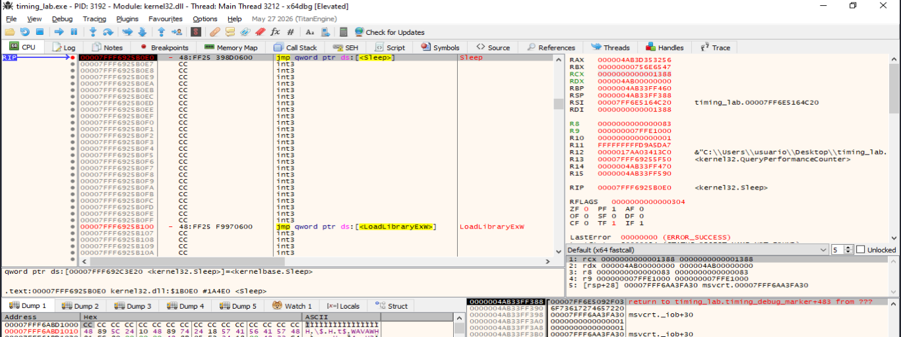
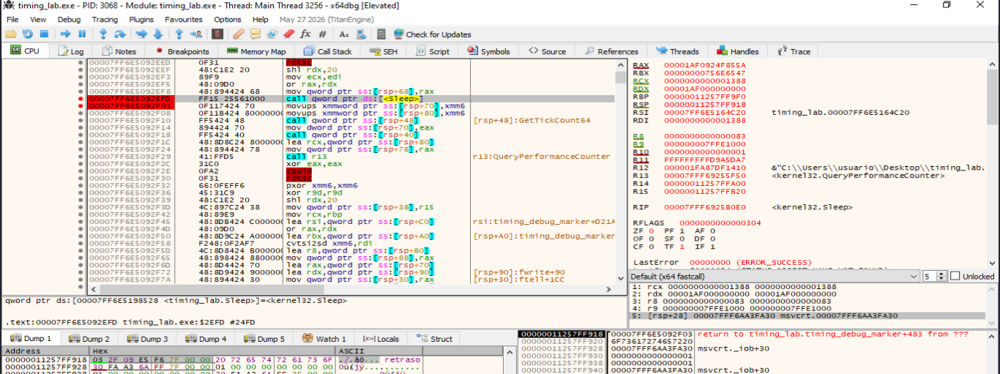
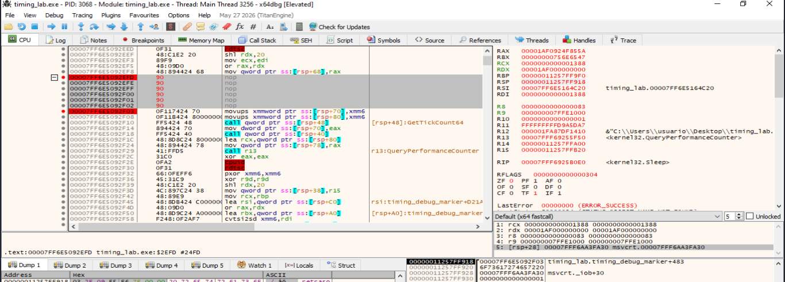
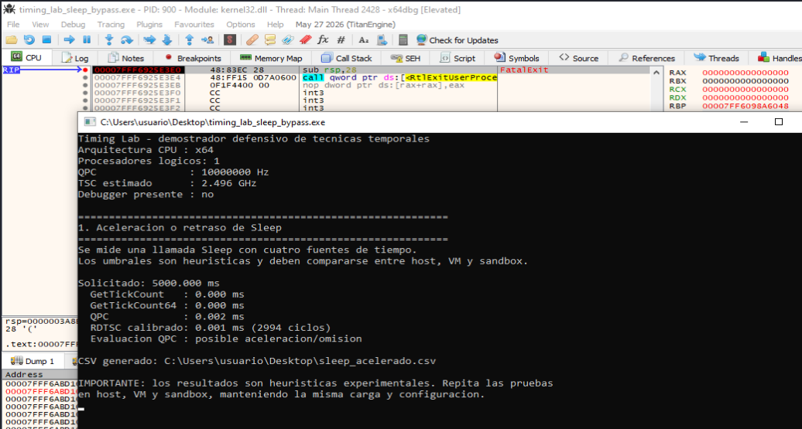
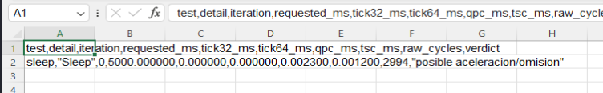

- [6. La técnica timing](#6-la-técnica-timing)
  - [6.1. Descripción de la técnica `timing`](#61-descripción-de-la-técnica-timing)
  - [6.2. Categoría](#62-categoría)
  - [6.3. Técnicas principales](#63-técnicas-principales)
    - [6.3.1. Detección de aceleración de Sleep](#631-detección-de-aceleración-de-sleep)
    - [6.3.2. Medición mediante GetTickCount y GetTickCount64](#632-medición-mediante-gettickcount-y-gettickcount64)
    - [6.3.3. Medición mediante QueryPerformanceCounter](#633-medición-mediante-queryperformancecounter)
    - [6.3.4. Medición mediante RDTSC y RDTSCP](#634-medición-mediante-rdtsc-y-rdtscp)
    - [6.3.5. Medición del coste de CPUID y los VM Exit](#635-medición-del-coste-de-cpuid-y-los-vm-exit)
    - [6.3.6. Comparación entre distintas fuentes de tiempo](#636-comparación-entre-distintas-fuentes-de-tiempo)
    - [6.3.7. Detección de pausas producidas por un depurador](#637-detección-de-pausas-producidas-por-un-depurador)
  - [6.4. Resumen visual de las técnicas que aparecen en timing](#64-resumen-visual-de-las-técnicas-que-aparecen-en-timing)
  - [6.5. Contramedidas ofensivas](#65-contramedidas-ofensivas)
  - [6.6. Contramedidas defensivas](#66-contramedidas-defensivas)
  - [6.7. Checklist rápido del laboratorio](#67-checklist-rápido-del-laboratorio)
    - [Preparación del entorno](#preparación-del-entorno)
    - [Análisis estático previo](#análisis-estático-previo)
    - [Preparación de las mediciones](#preparación-de-las-mediciones)
    - [Pruebas de aceleración de `Sleep`](#pruebas-de-aceleración-de-sleep)
    - [Pruebas con `GetTickCount` y `GetTickCount64`](#pruebas-con-gettickcount-y-gettickcount64)
    - [Pruebas con `QueryPerformanceCounter`](#pruebas-con-queryperformancecounter)
    - [Pruebas con `RDTSC`, `RDTSCP` y `CPUID`](#pruebas-con-rdtsc-rdtscp-y-cpuid)
    - [Comparación entre fuentes temporales](#comparación-entre-fuentes-temporales)
    - [Pruebas bajo depurador](#pruebas-bajo-depurador)
    - [Interpretación de los resultados](#interpretación-de-los-resultados)
    - [Evidencias que deben documentarse](#evidencias-que-deben-documentarse)
    - [Conclusión del checklist](#conclusión-del-checklist)
- [6.8. Análisis dinámico de las técnicas `timing`](#68-análisis-dinámico-de-las-técnicas-timing)
    - [6.8.1. Objetivos del análisis dinámico](#681-objetivos-del-análisis-dinámico)
    - [6.8.2. Herramientas recomendadas](#682-herramientas-recomendadas)
    - [6.8.3. Análisis de funciones de espera](#683-análisis-de-funciones-de-espera)
    - [6.8.4. Análisis de fuentes temporales de Windows](#684-análisis-de-fuentes-temporales-de-windows)
      - [`GetTickCount` y `GetTickCount64`](#gettickcount-y-gettickcount64)
      - [`QueryPerformanceCounter`](#queryperformancecounter)
      - [Otras fuentes](#otras-fuentes)
    - [6.8.5. Análisis de instrucciones `RDTSC`, `RDTSCP` y `CPUID`](#685-análisis-de-instrucciones-rdtsc-rdtscp-y-cpuid)
    - [6.8.6. Análisis con `API Monitor`](#686-análisis-con-api-monitor)
    - [6.8.7. Análisis con `x32dbg` o `x64dbg`](#687-análisis-con-x32dbg-o-x64dbg)
      - [Breakpoints útiles](#breakpoints-útiles)
      - [Procedimiento general](#procedimiento-general)
      - [Demostración de una pausa del depurador](#demostración-de-una-pausa-del-depurador)
      - [Elementos que deben documentarse](#elementos-que-deben-documentarse)
    - [6.8.8. Análisis y tratamiento estadístico de los resultados](#688-análisis-y-tratamiento-estadístico-de-los-resultados)
- [6.9. Demostración mediante la herramienta educativa `timing_lab`](#69-demostración-mediante-la-herramienta-educativa-timing_lab)
    - [6.9.1. Justificación de la herramienta](#691-justificación-de-la-herramienta)
    - [6.9.2. Objetivos y alcance](#692-objetivos-y-alcance)
    - [6.9.3. Arquitectura y funcionamiento](#693-arquitectura-y-funcionamiento)
    - [6.9.4. Compilación de la herramienta educativa](#694-compilación-de-la-herramienta-educativa)
      - [Requisitos de compilación](#requisitos-de-compilación)
      - [Compilación con Microsoft Visual C++](#compilación-con-microsoft-visual-c)
      - [Compilación en linux](#compilación-en-linux)
      - [Verificación del ejecutable](#verificación-del-ejecutable)
    - [6.9.5. Opciones de ejecución](#695-opciones-de-ejecución)
    - [6.9.6. Demostración de aceleración de `Sleep`](#696-demostración-de-aceleración-de-sleep)
      - [Ejecución de referencia](#ejecución-de-referencia)
      - [Localización de la llamada a `Sleep`](#localización-de-la-llamada-a-sleep)
      - [Localización de la instrucción `call`](#localización-de-la-instrucción-call)
      - [Neutralización controlada de la espera](#neutralización-controlada-de-la-espera)
      - [Creación del ejecutable de prueba](#creación-del-ejecutable-de-prueba)
      - [Ejecución de la copia parcheada](#ejecución-de-la-copia-parcheada)
      - [Resultados obtenidos](#resultados-obtenidos)
      - [Evidencia exportada en CSV](#evidencia-exportada-en-csv)
      - [Comparación de resultados](#comparación-de-resultados)
      - [Conclusión de la prueba](#conclusión-de-la-prueba)


# 6. La técnica timing


## 6.1. Descripción de la técnica `timing`

La técnica `timing` es un mecanismo de evasión anti-VM, anti-sandbox y anti-debug basado en la medición del tiempo que tarda el sistema en ejecutar determinadas instrucciones, funciones o bloques de código. Su objetivo es detectar retrasos anómalos provocados por la intervención de un hipervisor, una sandbox o un depurador.

Para ello, el malware puede utilizar funciones e instrucciones como `Sleep`, `GetTickCount`, `GetTickCount64`, `QueryPerformanceCounter`, `RDTSC`, `RDTSCP` o `CPUID`. También puede comparar varias fuentes temporales para identificar inconsistencias entre ellas.

Si el tiempo medido supera un umbral esperado, o si un retardo ha sido acelerado artificialmente, la muestra puede interpretar que se encuentra en un entorno de análisis. Como respuesta, puede finalizar su ejecución, retrasar su actividad, ocultar su funcionalidad o ejecutar un comportamiento alternativo.

Estas comprobaciones deben considerarse heurísticas, ya que la carga del sistema, la planificación de procesos o el hardware utilizado también pueden producir variaciones temporales y generar falsos positivos.


----


## 6.2. Categoría

La técnica `timing` se clasifica dentro de las técnicas de **evasión y anti-análisis**, concretamente en las categorías **anti-VM**, **anti-sandbox** y **anti-debug**. Su finalidad es detectar si la ejecución está siendo alterada por un hipervisor, una sandbox o un depurador mediante la observación de retrasos, aceleraciones o inconsistencias temporales.

Dentro de una taxonomía de evasión, puede representarse de la siguiente forma:

| Campo                 | Clasificación                                          |
| --------------------- | ------------------------------------------------------ |
| Categoría             | Evasión / Anti-análisis                                |
| Subcategoría          | Anti-VM / Anti-sandbox / Anti-debug                    |
| Tipo de artefacto     | Contadores temporales, retardos e instrucciones de CPU |
| Sistema principal     | Windows                                                |
| Prioridad para el TFM | Alta                                                   |


La fuente de información utilizada son los contadores temporales del sistema y de la CPU. El resultado de estas comprobaciones puede condicionar el comportamiento de la muestra, provocando que finalice, retrase o modifique su ejecución cuando detecta valores anómalos.


----

## 6.3. Técnicas principales

La técnica timing puede implementarse mediante diferentes mecanismos de medición temporal. Aunque todas sus variantes comparten el objetivo de identificar alteraciones en la velocidad normal de ejecución, cada una utiliza una fuente de tiempo o una operación diferente.

**Entre las técnicas principales se encuentran:**
- Comprobar si una función de espera, como Sleep, ha sido acelerada o eliminada.
- Medir el tiempo transcurrido mediante GetTickCount o GetTickCount64.
- Obtener mediciones de alta resolución con QueryPerformanceCounter.
- Contabilizar ciclos de CPU mediante RDTSC o RDTSCP.
- Medir el coste de instrucciones como CPUID, cuya ejecución puede provocar un VM Exit.
- Comparar distintas fuentes temporales para detectar inconsistencias.
- Identificar pausas producidas por breakpoints, ejecución paso a paso o intervención de un depurador.

Estas comprobaciones suelen realizarse antes y después de una operación determinada. La muestra registra un valor temporal inicial, ejecuta la operación y obtiene una segunda medición. A continuación, calcula la diferencia y la compara con un umbral previamente definido.

Desde el punto de vista del análisis de malware, estas técnicas son relevantes porque permiten detectar una fase de reconocimiento ambiental. Sin embargo, sus resultados deben interpretarse como indicadores heurísticos, ya que la carga del sistema, la planificación de procesos, el ahorro energético o las características del procesador también pueden generar variaciones temporales.

----

### 6.3.1. Detección de aceleración de Sleep

La detección de aceleración de Sleep consiste en comprobar si un entorno de análisis respeta realmente el tiempo de espera solicitado por un programa. Esta técnica se utiliza principalmente para identificar sandboxes que intentan reducir la duración del análisis omitiendo o acelerando retardos prolongados.

Una muestra puede solicitar una espera mediante funciones como:
- Sleep.
- SleepEx.
- NtDelayExecution.
- WaitForSingleObject.
- WaitForMultipleObjects.
- Temporizadores de Windows.

Antes de iniciar la espera, la muestra registra el tiempo actual mediante una fuente como GetTickCount64, QueryPerformanceCounter o RDTSC. Después de finalizar el retardo, obtiene una segunda medición y calcula el tiempo realmente transcurrido.


Si el tiempo observado es mucho menor que el solicitado, la muestra puede interpretar que la función ha sido interceptada o manipulada por una sandbox. Como respuesta, podría finalizar su ejecución, repetir el retardo, permanecer inactiva o evitar ejecutar su funcionalidad principal.

Para aumentar la fiabilidad, **algunas muestras dividen el retardo en múltiples esperas pequeñas, emplean funciones nativas como NtDelayExecution o contrastan el resultado mediante varias fuentes temporales.** Esto dificulta que el entorno acelere el tiempo sin producir inconsistencias detectables.

No obstante, esta técnica puede generar **falsos positivos** debido a cambios del reloj, suspensión del sistema, errores de medición o manipulación de la fuente temporal utilizada. Por ello, una evidencia más sólida requiere repetir la prueba y comparar los resultados obtenidos en una máquina física, una máquina virtual y un entorno de análisis automatizado.


----

### 6.3.2. Medición mediante GetTickCount y GetTickCount64

La medición mediante GetTickCount y GetTickCount64 consiste en utilizar los contadores de actividad de Windows para calcular el tiempo transcurrido entre dos puntos de la ejecución. Estas funciones devuelven el número de milisegundos que han pasado desde el inicio del sistema y pueden emplearse para detectar aceleraciones, pausas o retrasos anómalos.

La diferencia principal entre ambas funciones es el tamaño del valor devuelto:
- GetTickCount devuelve un valor de 32 bits y se reinicia aproximadamente cada 49,7 días.
- GetTickCount64 devuelve un valor de 64 bits, por lo que evita este problema práctico de desbordamiento.

El funcionamiento general consiste en registrar el contador antes de ejecutar una operación y volver a consultarlo cuando esta finaliza:

```bash
Obtener contador inicial
        ↓
Ejecutar operación o bloque de código
        ↓
Obtener contador final
        ↓
Calcular la diferencia
        ↓
Comparar el resultado con el valor esperado
```

Un ejemplo conceptual sería:
```c
ULONGLONG inicio = GetTickCount64();

Sleep(5000);

ULONGLONG fin = GetTickCount64();
ULONGLONG transcurrido = fin - inicio;

if (transcurrido < 4500) {
    // Posible aceleración del retardo
}
```

En este ejemplo, el programa solicita una espera de cinco segundos y comprueba posteriormente cuánto tiempo ha transcurrido realmente. Si la diferencia es considerablemente inferior al tiempo solicitado, puede interpretarse como un indicio de que una sandbox ha acelerado o interceptado la función Sleep.


Estas funciones también pueden utilizarse para **detectar pausas producidas por un depurador.** La muestra registra el valor antes y después de una sección breve de código. Si el intervalo es excesivamente alto, puede considerar que la ejecución ha sido detenida mediante un breakpoint o realizada paso a paso.

Desde el punto de vista del análisis dinámico, pueden configurarse puntos de ruptura en:
```bash
kernel32!GetTickCount
kernel32!GetTickCount64
kernelbase!GetTickCount
kernelbase!GetTickCount64
```

No obstante, los resultados obtenidos son heurísticos. La planificación de procesos, la carga del sistema, las interrupciones, la suspensión del equipo o la manipulación de estas funciones mediante hooks pueden alterar las mediciones. Por ello, conviene repetir la prueba y contrastarla con fuentes temporales adicionales, como QueryPerformanceCounter o RDTSC.


----

### 6.3.3. Medición mediante QueryPerformanceCounter


La medición mediante QueryPerformanceCounter consiste en utilizar el contador de alto rendimiento de Windows para calcular con gran precisión el tiempo transcurrido entre dos puntos de la ejecución. A diferencia de GetTickCount y GetTickCount64, cuya resolución se expresa en milisegundos, QueryPerformanceCounter permite realizar mediciones mucho más precisas.

Para convertir los valores del contador en unidades de tiempo, el programa obtiene primero su frecuencia mediante QueryPerformanceFrequency. Esta función indica el número de unidades o ticks que genera el contador por segundo.

Esta fuente temporal también puede emplearse para detectar pausas producidas por un depurador. La muestra registra el contador antes y después de ejecutar un bloque de instrucciones que debería completarse rápidamente. Si el intervalo resulta excesivamente alto, puede considerar que la ejecución ha sido detenida mediante un breakpoint, ejecución paso a paso o instrumentación dinámica.

Desde el punto de vista del análisis dinámico, pueden configurarse puntos de ruptura en:
```bash
kernel32!QueryPerformanceCounter
kernel32!QueryPerformanceFrequency
kernelbase!QueryPerformanceCounter
kernelbase!QueryPerformanceFrequency
```

La presencia de estas llamadas no demuestra por sí sola una técnica anti-análisis, ya que muchas aplicaciones legítimas las utilizan para medir rendimiento, sincronizar tareas o gestionar animaciones. La evidencia resulta más significativa cuando las mediciones aparecen antes y después de un bloque de código, se comparan con un umbral y condicionan posteriormente el flujo de ejecución.

Aunque QueryPerformanceCounter ofrece una medición de alta resolución, sus resultados siguen siendo heurísticos. La carga del sistema, las interrupciones, la planificación de procesos, la migración entre núcleos o la manipulación del contador por parte del entorno de análisis pueden introducir variaciones. Por ello, conviene repetir las mediciones y contrastarlas con otras fuentes, como GetTickCount64 o RDTSC.


----

### 6.3.4. Medición mediante RDTSC y RDTSCP

La medición mediante RDTSC y RDTSCP consiste en consultar el Time Stamp Counter —TSC— del procesador para calcular el tiempo transcurrido entre dos puntos de la ejecución. Este contador mantiene un valor de 64 bits que aumenta continuamente y permite realizar mediciones con una granularidad muy elevada.

La instrucción RDTSC devuelve el contenido del contador temporal en los registros EDX:EAX. En arquitecturas x64, el resultado completo puede recuperarse mediante la función intrínseca __rdtsc. Su funcionamiento general consiste en leer el contador antes y después de ejecutar una operación.

Una diferencia temporal elevada puede indicar que la operación medida ha requerido la intervención del hipervisor, ha sido instrumentada o se ha detenido temporalmente bajo un depurador. Sin embargo, RDTSC no es una instrucción completamente serializante, por lo que el procesador puede reorganizar instrucciones y alterar la precisión de la medición.

Para reducir este efecto, puede combinarse con instrucciones de serialización como CPUID o con barreras como LFENCE:

```bash
CPUID o LFENCE
        ↓
RDTSC
        ↓
Operación medida
        ↓
RDTSCP
        ↓
LFENCE
```

RDTSCP es una variante que proporciona un mayor control sobre el orden de ejecución respecto a las instrucciones anteriores. Además del contador temporal, devuelve en ECX el contenido de IA32_TSC_AUX, que puede utilizarse para identificar el procesador lógico en el que se realizó la lectura.

Desde el punto de vista del análisis estático y dinámico, estas instrucciones no corresponden a funciones importadas de Windows. Por ello, deben localizarse directamente en el código desensamblado:
```bash
rdtsc
rdtscp
cpuid
lfence
```

En x64dbg puede utilizarse la búsqueda de instrucciones dentro del módulo y colocar puntos de ruptura en las direcciones donde aparecen RDTSC o RDTSCP. Durante la depuración deben observarse:
- Los valores obtenidos antes y después de la operación.
- La combinación de los registros EDX:EAX.
- La diferencia calculada entre ambas lecturas.
- El umbral utilizado por el programa.
- La comparación y el salto condicional posterior.
- El posible cambio del flujo de ejecución.

No obstante, los resultados deben considerarse heurísticos. Los hipervisores modernos pueden virtualizar o compensar el TSC, mientras que la carga del sistema, las interrupciones, la migración entre procesadores lógicos y la ejecución fuera de orden también pueden introducir variaciones. Por ello, conviene repetir las mediciones, utilizar estadísticas como la mediana y contrastar los resultados con otras fuentes temporales, como GetTickCount64 o QueryPerformanceCounter.

----

### 6.3.5. Medición del coste de CPUID y los VM Exit

La medición del coste de CPUID consiste en calcular el número de ciclos de procesador necesarios para ejecutar esta instrucción. En determinados entornos virtualizados, la ejecución de CPUID puede ser interceptada por el hipervisor y provocar un VM Exit, es decir, una transferencia temporal del control desde la máquina virtual hacia el monitor de máquinas virtuales.

Durante un VM Exit, el hipervisor debe guardar parte del estado del sistema invitado, procesar la instrucción y devolver posteriormente el control a la máquina virtual. Esta intervención puede introducir un sobrecoste temporal superior al observado en una ejecución física convencional.

La comprobación suele combinar CPUID con instrucciones de lectura del contador temporal, como RDTSC y RDTSCP:
```bash
Serializar la ejecución
        ↓
Leer el TSC inicial
        ↓
Ejecutar CPUID
        ↓
Leer el TSC final
        ↓
Calcular los ciclos consumidos
        ↓
Comparar el resultado con un umbral
```

No obstante, una única medición no resulta suficientemente fiable. Las interrupciones, la carga del sistema, la planificación del proceso y otras tareas ejecutadas por el sistema operativo pueden incrementar temporalmente el número de ciclos. Por ello, la comprobación suele repetirse varias veces y analizarse mediante valores estadísticos como la mediana, el mínimo o el percentil 95.
```bash
Realizar múltiples mediciones
        ↓
Descartar valores extremos
        ↓
Calcular mediana o mínimo
        ↓
Comparar con una referencia
```

El valor mínimo puede resultar especialmente útil, ya que reduce el efecto de interrupciones ocasionales. La mediana, por su parte, permite representar mejor el comportamiento habitual sin depender de una sola observación.

Desde el punto de vista del análisis dinámico, deben localizarse las siguientes instrucciones en el código desensamblado:
```bash
rdtsc
cpuid
rdtscp
lfence
```

En x64dbg, el análisis debe centrarse en:
- Las lecturas realizadas con RDTSC o RDTSCP.
- La función seleccionada mediante EAX antes de ejecutar CPUID.
- Los ciclos calculados entre ambas mediciones.
- El número de repeticiones realizadas.
- El umbral utilizado por el programa.
- La comparación y el salto condicional posterior.
- La modificación del flujo cuando se supera el umbral.

La presencia de un coste elevado no demuestra por sí sola que exista virtualización. Los hipervisores modernos pueden optimizar el tratamiento de CPUID, compensar el contador temporal o reducir el coste del VM Exit. Del mismo modo, una máquina física sometida a una carga elevada puede producir mediciones anómalas. Por ello, esta técnica debe considerarse una heurística anti-VM y combinarse con otras comprobaciones del entorno.

----

### 6.3.6. Comparación entre distintas fuentes de tiempo
La comparación entre distintas fuentes de tiempo consiste en medir simultáneamente una misma operación mediante varios contadores temporales y comprobar si los resultados obtenidos son coherentes entre sí. Esta técnica permite detectar posibles manipulaciones realizadas por una sandbox, un hipervisor o una herramienta de análisis.

Una muestra puede combinar fuentes como:
```bash
GetTickCount o GetTickCount64.
QueryPerformanceCounter.
RDTSC o RDTSCP.
GetSystemTimeAsFileTime.
timeGetTime.
```

El procedimiento general consiste en registrar los valores iniciales de varios contadores, ejecutar una operación o retardo y volver a consultar las mismas fuentes al finalizar:
```bash
Registrar varias fuentes temporales
        ↓
Ejecutar una operación o retardo
        ↓
Obtener las mediciones finales
        ↓
Calcular el tiempo transcurrido en cada fuente
        ↓
Comparar los resultados
```

También puede compararse una fuente del sistema operativo con el contador de ciclos de la CPU. En este caso, la muestra puede comprobar si el incremento de RDTSC es compatible con el tiempo observado mediante QueryPerformanceCounter o GetTickCount64. Una discrepancia elevada puede indicar que el hipervisor está virtualizando el TSC o que una sandbox está acelerando determinadas funciones sin mantener una visión temporal coherente.

Desde el punto de vista del análisis dinámico, deben observarse:
- Las distintas APIs e instrucciones temporales utilizadas.
- El orden en que se realizan las mediciones.
- La conversión de cada contador a una unidad común.
- La tolerancia permitida entre fuentes.
- Las comparaciones y saltos condicionales posteriores.
- El comportamiento adoptado cuando aparece una inconsistencia.

Esta técnica puede ser más robusta que utilizar una sola fuente temporal, ya que obliga al entorno de análisis a manipular de forma coordinada todos los contadores utilizados. Sin embargo, continúa siendo heurística: la resolución de los relojes, las interrupciones, la planificación de procesos y la carga del sistema pueden producir pequeñas diferencias legítimas. Por ello, conviene repetir las pruebas y analizar los resultados mediante medias, medianas y márgenes de tolerancia.

----

### 6.3.7. Detección de pausas producidas por un depurador


La detección de pausas producidas por un depurador consiste en medir el tiempo empleado para ejecutar un bloque de código que, en condiciones normales, debería completarse rápidamente. Si el intervalo observado es considerablemente superior al esperado, la muestra puede interpretar que la ejecución ha sido detenida mediante un breakpoint, realizada paso a paso o sometida a instrumentación dinámica.

Esta técnica puede utilizar distintas fuentes temporales, entre ellas:
- GetTickCount o GetTickCount64.
- QueryPerformanceCounter.
- RDTSC o RDTSCP.
- timeGetTime.
- GetSystemTimeAsFileTime.

La técnica también puede distribuir varias comprobaciones temporales a lo largo del flujo de ejecución. De esta forma, no depende de una única medición y puede detectar pausas producidas en diferentes partes del programa.

Desde el punto de vista del análisis dinámico, resulta útil localizar:
- Las llamadas a funciones temporales.
- Las instrucciones RDTSC y RDTSCP.
- El bloque delimitado por las mediciones.
- El valor temporal calculado.
- El umbral establecido.
- La comparación y el salto condicional posterior.
- La respuesta adoptada cuando se detecta una anomalía.

En x64dbg, la técnica puede demostrarse colocando un breakpoint entre las dos lecturas temporales, manteniendo la ejecución detenida durante varios segundos y continuando posteriormente. Si el programa compara el intervalo con un umbral, debería observarse que el flujo toma la rama correspondiente a una anomalía temporal.

No obstante, esta comprobación puede generar falsos positivos. La carga del sistema, las interrupciones, la planificación de procesos, el cambio entre núcleos o una pausa legítima del sistema operativo también pueden incrementar la duración medida. Por ello, los resultados deben interpretarse como una heurística anti-debug y conviene emplear varias mediciones, márgenes de tolerancia y análisis estadístico.


----

## 6.4. Resumen visual de las técnicas que aparecen en timing

El objetivo general consiste en identificar tres tipos de anomalías:

Retardos menores de lo esperado, asociados a la aceleración de funciones como Sleep.
Retardos mayores de lo esperado, producidos por un hipervisor, un VM Exit, un breakpoint o la ejecución paso a paso.
Inconsistencias entre contadores, cuando distintas fuentes temporales ofrecen resultados incompatibles.

A continuación, se muestra un resumen visual de las principales técnicas:
```bash
timing
│
├── 1. Detección de aceleración de Sleep
│   │
│   ├── Sleep
│   ├── SleepEx
│   ├── NtDelayExecution
│   ├── WaitForSingleObject
│   └── Temporizadores de Windows
│
├── 2. Medición con contadores del sistema
│   │
│   ├── GetTickCount
│   └── GetTickCount64
│
├── 3. Medición de alta resolución
│   │
│   ├── QueryPerformanceCounter
│   └── QueryPerformanceFrequency
│
├── 4. Medición de ciclos de CPU
│   │
│   ├── RDTSC
│   ├── RDTSCP
│   └── LFENCE
│
├── 5. Medición del coste de instrucciones sensibles
│   │
│   └── CPUID
│       └── Posible VM Exit
│
├── 6. Comparación entre fuentes temporales
│   │
│   ├── GetTickCount64
│   ├── QueryPerformanceCounter
│   ├── RDTSC / RDTSCP
│   ├── timeGetTime
│   └── GetSystemTimeAsFileTime
│
└── 7. Detección de pausas del depurador
    │
    ├── Breakpoints
    ├── Ejecución paso a paso
    ├── Instrumentación dinámica
    └── Pausas anómalas entre dos mediciones
```

La siguiente tabla resume la finalidad de cada variante:
| Técnica                           | Qué mide                                     | Indicador observado                                  | Posible interpretación                                        |
| --------------------------------- | -------------------------------------------- | ---------------------------------------------------- | ------------------------------------------------------------- |
| Aceleración de `Sleep`            | Duración real de una función de espera       | Tiempo inferior al solicitado                        | Posible sandbox que acelera o elimina retardos                |
| `GetTickCount` / `GetTickCount64` | Milisegundos transcurridos desde el arranque | Intervalo demasiado corto o demasiado largo          | Aceleración temporal o pausa de ejecución                     |
| `QueryPerformanceCounter`         | Tiempo transcurrido con alta resolución      | Diferencia superior o inferior al intervalo esperado | Instrumentación, depuración o manipulación temporal           |
| `RDTSC` / `RDTSCP`                | Ciclos de procesador consumidos              | Número de ciclos anormalmente elevado                | Posible virtualización, interrupción o depuración             |
| `CPUID` y `VM Exit`               | Coste temporal de ejecutar `CPUID`           | Sobrecoste repetido respecto a una referencia        | Posible intervención del hipervisor                           |
| Comparación entre fuentes         | Coherencia entre varios contadores           | Resultados incompatibles entre relojes               | Manipulación parcial de las fuentes temporales                |
| Pausas del depurador              | Tiempo consumido por un bloque breve         | Intervalo excesivamente elevado                      | Posible `breakpoint`, ejecución paso a paso o instrumentación |


Desde el punto de vista del análisis, ninguna de estas comprobaciones debe interpretarse de forma aislada como una confirmación absoluta de virtualización o depuración. La carga del sistema, las interrupciones, la planificación de procesos, el ahorro energético y las características del hardware también pueden alterar las mediciones.

Por ello, una evidencia más sólida requiere repetir las pruebas, utilizar valores estadísticos como la mediana o el percentil 95 y comparar los resultados obtenidos en una máquina física, una máquina virtual y una ejecución bajo depurador.

----

## 6.5. Contramedidas ofensivas

Desde una perspectiva ofensiva, las contramedidas asociadas a la técnica timing buscan aumentar la fiabilidad de las mediciones temporales y dificultar que una sandbox, un hipervisor o un depurador pueda manipularlas sin ser detectado. Para ello, una muestra puede combinar varias fuentes de tiempo, repetir las comprobaciones y correlacionar los resultados antes de modificar su comportamiento.

Una primera estrategia consiste en utilizar múltiples fuentes temporales. En lugar de depender exclusivamente de una función como GetTickCount64, la muestra puede combinarla con QueryPerformanceCounter, RDTSC, RDTSCP o GetSystemTimeAsFileTime. Si el entorno de análisis altera únicamente una de estas fuentes, pueden aparecer inconsistencias entre los valores obtenidos.

Otra contramedida consiste en repetir las mediciones varias veces y aplicar cálculos estadísticos. Una única lectura puede verse afectada por interrupciones, carga del sistema o planificación de procesos. Para reducir estos efectos, la muestra puede calcular:
- El valor mínimo.
- La media.
- La mediana.
- El percentil 95.
- La desviación respecto a una referencia previa.

El uso de varias mediciones permite distinguir mejor entre una anomalía puntual y un sobrecoste temporal repetido.

También puede aplicarse una calibración dinámica de los umbrales. En lugar de utilizar un valor fijo para todos los sistemas, la muestra puede ejecutar primero operaciones consideradas normales, medir su coste y utilizar estos resultados como referencia. Posteriormente, compara las operaciones sensibles con la línea base obtenida en el propio equipo.

Otra estrategia ofensiva es dividir los retardos prolongados en múltiples esperas breves. En lugar de ejecutar una única llamada como Sleep(60000), la muestra puede realizar numerosos retardos cortos y comprobar el tiempo transcurrido después de cada uno. Esto dificulta que una sandbox elimine el retardo completo sin producir inconsistencias.

La muestra también puede emplear mecanismos de espera alternativos, como:
- Sleep y SleepEx.
- NtDelayExecution.
- WaitForSingleObject.
- WaitForMultipleObjects.
- Temporizadores de espera.
- Bucles dependientes del contador de CPU.

El uso combinado de varias funciones reduce la dependencia de una única API que pueda estar interceptada por el entorno de análisis.

Otra contramedida consiste en distribuir las comprobaciones temporales a lo largo del flujo de ejecución. En lugar de concentrarlas al inicio del programa, pueden aparecer antes de operaciones sensibles, después de llamadas al sistema o dentro de funciones aparentemente legítimas. Esta distribución dificulta su localización y neutralización mediante análisis estático.

Además, el malware puede aplicar ofuscación sobre las funciones y constantes utilizadas. Los nombres de las APIs pueden resolverse dinámicamente, mientras que los umbrales y cálculos temporales pueden estar fragmentados u ocultos dentro de otras operaciones. De esta forma, se dificulta identificar estáticamente que el programa utiliza técnicas timing.

Una variante más avanzada consiste en comprobar la integridad de las funciones temporales. La muestra puede analizar los primeros bytes de funciones como Sleep, GetTickCount64 o QueryPerformanceCounter para detectar posibles hooks, saltos insertados o modificaciones realizadas por herramientas de instrumentación.

Otra estrategia es medir instrucciones que pueden provocar la intervención del hipervisor, como CPUID. Si el coste temporal se mantiene elevado durante varias repeticiones, la muestra puede considerar que existe un sobrecoste compatible con la ejecución dentro de una máquina virtual.

----

## 6.6. Contramedidas defensivas

Desde una perspectiva defensiva, las contramedidas frente a la técnica timing tienen como objetivo evitar que una muestra pueda identificar de forma fiable una máquina virtual, sandbox o sesión de depuración mediante anomalías temporales. Para ello, el entorno de análisis debe mantener una visión coherente del tiempo y reducir los retrasos artificiales introducidos por la virtualización, la instrumentación o la interacción del analista.

Una primera medida consiste en mantener sincronizadas las distintas fuentes temporales. Si una sandbox acelera una llamada a Sleep, también debe ajustar de forma coherente los valores devueltos por otras fuentes como:
- GetTickCount y GetTickCount64.
- QueryPerformanceCounter.
- GetSystemTimeAsFileTime.
- timeGetTime.
- RDTSC y RDTSCP.


Otra contramedida defensiva es interceptar las funciones de espera y medición temporal. El entorno puede aplicar hooks sobre funciones como:
```bash
Sleep
SleepEx
NtDelayExecution
WaitForSingleObject
GetTickCount
GetTickCount64
QueryPerformanceCounter
QueryPerformanceFrequency
GetSystemTimeAsFileTime
```

La interceptación permite observar cuándo una muestra intenta medir el tiempo o introducir retardos. Sin embargo, las respuestas manipuladas deben conservar la coherencia con otras fuentes, ya que una alteración aislada puede resultar detectable.

También puede emplearse la virtualización o compensación del TSC. Los hipervisores modernos pueden ajustar el contador temporal expuesto al sistema invitado mediante mecanismos como el desplazamiento o escalado del TSC. El objetivo es evitar que instrucciones como RDTSC o RDTSCP revelen directamente el sobrecoste de la virtualización.

Una medida especialmente relevante consiste en reducir el coste de los VM Exit. Algunas instrucciones, como CPUID, pueden provocar la intervención del hipervisor. Una configuración eficiente debe minimizar el tiempo necesario para procesar estas transiciones, reduciendo las diferencias entre la ejecución física y virtualizada.


Otra estrategia es evitar pausas prolongadas durante la depuración. Cuando una muestra se encuentra detenida entre dos mediciones temporales, el intervalo registrado puede revelar la presencia del depurador. Para reducir esta evidencia, el analista puede:
- Colocar los breakpoints antes de la primera medición o después de la segunda.
- Utilizar breakpoints condicionales.
- Automatizar la captura de registros y memoria.
- Evitar la ejecución paso a paso dentro del bloque medido.
- Aplicar parches temporales sobre la comparación o el salto condicional.
- Modificar el valor temporal calculado antes de que sea evaluado.


También resulta útil monitorizar las APIs y las instrucciones asociadas a timing. La presencia de una única llamada temporal no implica evasión, ya que muchas aplicaciones legítimas miden rendimiento o gestionan temporizadores. Sin embargo, determinadas secuencias pueden considerarse sospechosas:
```bash
Obtener tiempo inicial
        ↓
Ejecutar Sleep, CPUID o un bloque breve
        ↓
Obtener tiempo final
        ↓
Calcular una diferencia
        ↓
Comparar con un umbral
        ↓
Cambiar el flujo de ejecución
```

Desde el punto de vista defensivo, deben buscarse combinaciones como:
| Patrón observado                                             | Posible interpretación                      |
| ------------------------------------------------------------ | ------------------------------------------- |
| `GetTickCount64` → `Sleep` → `GetTickCount64`                | Comprobación de aceleración del retardo     |
| `QueryPerformanceCounter` antes y después de un bloque breve | Posible detección de pausas del depurador   |
| `RDTSC` → `CPUID` → `RDTSCP`                                 | Medición del coste de un posible `VM Exit`  |
| Uso simultáneo de varias fuentes temporales                  | Detección de manipulación o inconsistencias |
| Comparación con un umbral seguida de finalización            | Posible técnica anti-análisis               |

Finalmente, las comprobaciones timing deben correlacionarse con otras técnicas anti-análisis. La evidencia resulta más sólida cuando aparecen junto con:
- Detección de procesos o herramientas de análisis.
- Consultas al Registro.
- Comprobaciones de hardware.
- Detección de servicios de virtualización.
- Técnicas anti-debug.
- Finalización o alteración del comportamiento tras la comprobación.


----
## 6.7. Checklist rápido del laboratorio

El siguiente checklist resume los pasos principales para analizar y demostrar técnicas `timing` en un entorno controlado. Su finalidad es identificar aceleraciones de retardos, sobrecostes de virtualización, incoherencias entre fuentes temporales y pausas producidas por un depurador.

### Preparación del entorno

- [ ] Ejecutar las pruebas únicamente en una máquina virtual o laboratorio controlado.
- [ ] Crear un `snapshot` limpio antes de comenzar.
- [ ] Documentar el hipervisor utilizado: `VirtualBox`, `VMware`, `Hyper-V` u otro.
- [ ] Registrar el sistema operativo, arquitectura y número de procesadores virtuales.
- [ ] Anotar el modelo de CPU expuesto a la máquina virtual.
- [ ] Asignar recursos suficientes para evitar retrasos artificiales por falta de memoria o CPU.
- [ ] Cerrar aplicaciones innecesarias antes de realizar las mediciones.
- [ ] Desactivar temporalmente tareas automáticas que puedan introducir ruido.
- [ ] Registrar si las pruebas se realizan en:
  - [ ] Máquina física.
  - [ ] Máquina virtual.
  - [ ] Máquina virtual bajo depurador.
  - [ ] Sandbox automatizada.
- [ ] Sincronizar, cuando sea posible, las condiciones de ejecución entre los distintos entornos.

### Análisis estático previo

- [ ] Buscar importaciones relacionadas con funciones de espera:

```text
Sleep
SleepEx
NtDelayExecution
WaitForSingleObject
WaitForMultipleObjects
CreateWaitableTimer
SetWaitableTimer
```

- [ ] Buscar importaciones relacionadas con fuentes temporales:

```text
GetTickCount
GetTickCount64
QueryPerformanceCounter
QueryPerformanceFrequency
GetSystemTimeAsFileTime
timeGetTime
```

- [ ] Buscar instrucciones relacionadas con el contador temporal de la CPU:

```asm
rdtsc
rdtscp
cpuid
lfence
mfence
```

- [ ] Localizar constantes que puedan actuar como umbrales temporales.
- [ ] Revisar comparaciones posteriores a las mediciones.
- [ ] Identificar saltos condicionales relacionados con resultados temporales.
- [ ] Comprobar si las funciones temporales se resuelven dinámicamente.
- [ ] Revisar si las cadenas de las APIs están cifradas u ofuscadas.
- [ ] Localizar posibles mensajes como:

```text
debugger detected
virtual machine detected
timing anomaly
sleep skipped
traced
```

- [ ] Determinar si la comprobación temporal se ejecuta antes del `payload`.

### Preparación de las mediciones

- [ ] Ejecutar una prueba inicial para obtener una línea base.
- [ ] Repetir cada medición varias veces.
- [ ] Utilizar el mismo número de iteraciones en todos los entornos.
- [ ] Mantener constante el tiempo solicitado en las pruebas de espera.
- [ ] Registrar los resultados en milisegundos y ciclos de CPU.
- [ ] Calcular, cuando sea posible:
  - [ ] Valor mínimo.
  - [ ] Valor máximo.
  - [ ] Media.
  - [ ] Mediana.
  - [ ] Percentil 95.
  - [ ] Desviación estándar.
- [ ] No basar la conclusión en una única ejecución.
- [ ] Documentar cualquier interrupción o carga anómala durante la prueba.

### Pruebas de aceleración de `Sleep`

- [ ] Registrar el tiempo antes de ejecutar `Sleep`.
- [ ] Solicitar un retardo conocido, por ejemplo:

```cpp
Sleep(5000);
```

- [ ] Registrar el tiempo inmediatamente después de la espera.
- [ ] Calcular la diferencia temporal.
- [ ] Comprobar si el tiempo real se aproxima al solicitado.
- [ ] Repetir la prueba con distintos retardos:

```text
1000 ms
5000 ms
10000 ms
```

- [ ] Repetir la prueba con funciones alternativas:

```text
SleepEx
NtDelayExecution
WaitForSingleObject
WaitForMultipleObjects
```

- [ ] Comprobar si una sandbox acelera solo los retardos prolongados.
- [ ] Revisar si el programa divide la espera en múltiples retardos breves.
- [ ] Documentar si el retardo fue:
  - [ ] Respetado.
  - [ ] Reducido.
  - [ ] Omitido.
  - [ ] Manipulado de forma inconsistente.

### Pruebas con `GetTickCount` y `GetTickCount64`

- [ ] Colocar puntos de ruptura en:

```text
kernel32!GetTickCount
kernel32!GetTickCount64
kernelbase!GetTickCount
kernelbase!GetTickCount64
```

- [ ] Registrar el primer valor devuelto.
- [ ] Continuar hasta la segunda llamada.
- [ ] Registrar el valor final.
- [ ] Calcular la diferencia entre ambos contadores.
- [ ] Identificar la operación ejecutada entre las dos mediciones.
- [ ] Comprobar si la diferencia se compara con un umbral.
- [ ] Revisar el salto condicional posterior.
- [ ] Tener en cuenta el posible desbordamiento de `GetTickCount`.
- [ ] Preferir `GetTickCount64` para pruebas prolongadas.
- [ ] Comparar los resultados con otra fuente temporal.

### Pruebas con `QueryPerformanceCounter`

- [ ] Colocar puntos de ruptura en:

```text
kernel32!QueryPerformanceCounter
kernel32!QueryPerformanceFrequency
kernelbase!QueryPerformanceCounter
kernelbase!QueryPerformanceFrequency
```

- [ ] Registrar la frecuencia obtenida mediante `QueryPerformanceFrequency`.
- [ ] Capturar el contador inicial.
- [ ] Capturar el contador final.
- [ ] Calcular el número de `ticks` transcurridos.
- [ ] Convertir el resultado a segundos o milisegundos.
- [ ] Identificar el bloque de código medido.
- [ ] Comprobar el umbral utilizado.
- [ ] Observar si existe una rama de detección positiva.
- [ ] Comparar el resultado con `GetTickCount64`.
- [ ] Repetir la medición para descartar valores atípicos.

La conversión puede realizarse mediante:

```text
Tiempo en segundos =
(contador_final - contador_inicial) / frecuencia
```

### Pruebas con `RDTSC`, `RDTSCP` y `CPUID`

- [ ] Buscar las instrucciones `RDTSC`, `RDTSCP` y `CPUID` en el desensamblado.
- [ ] Identificar las direcciones donde se realizan las lecturas.
- [ ] Colocar `breakpoints` antes o después de las instrucciones cuando sea necesario.
- [ ] Registrar los valores de `EDX:EAX`.
- [ ] Reconstruir el contador de 64 bits.
- [ ] Calcular la diferencia entre la lectura inicial y final.
- [ ] Comprobar si se utilizan instrucciones de serialización:

```asm
cpuid
lfence
mfence
```

- [ ] Identificar qué operación se mide entre las lecturas.
- [ ] Comprobar si `CPUID` se encuentra dentro del bloque medido.
- [ ] Registrar la función de `CPUID` indicada en `EAX`.
- [ ] Repetir la prueba múltiples veces.
- [ ] Calcular el mínimo y la mediana de los ciclos observados.
- [ ] Comparar los resultados entre máquina física y virtual.
- [ ] Revisar el umbral empleado para considerar un posible `VM Exit`.

### Comparación entre fuentes temporales

- [ ] Ejecutar la misma operación utilizando varias fuentes simultáneamente.
- [ ] Comparar:

```text
GetTickCount64
QueryPerformanceCounter
RDTSC / RDTSCP
GetSystemTimeAsFileTime
timeGetTime
```

- [ ] Convertir todas las mediciones a una unidad común.
- [ ] Calcular la diferencia absoluta entre fuentes.
- [ ] Calcular la diferencia porcentual.
- [ ] Establecer un margen de tolerancia.
- [ ] Comprobar si una fuente avanza mientras otra permanece constante.
- [ ] Identificar si una sandbox manipula únicamente una API.
- [ ] Revisar si el TSC mantiene una relación coherente con el tiempo real.
- [ ] Documentar las inconsistencias encontradas.
- [ ] Repetir la prueba para confirmar que la discrepancia no es puntual.

### Pruebas bajo depurador

- [ ] Ejecutar la herramienta o muestra inicialmente sin depurador.
- [ ] Registrar una línea base temporal.
- [ ] Abrir posteriormente el ejecutable en `x32dbg` o `x64dbg`.
- [ ] Localizar las dos mediciones que delimitan el bloque analizado.
- [ ] Colocar un `breakpoint` entre ambas mediciones.
- [ ] Mantener la ejecución detenida durante varios segundos.
- [ ] Continuar la ejecución.
- [ ] Comprobar si el intervalo medido aumenta.
- [ ] Observar si se activa una rama anti-debug.
- [ ] Repetir la prueba mediante ejecución paso a paso.
- [ ] Evitar detenerse antes de la primera o después de la segunda medición cuando se quiera demostrar la técnica.
- [ ] Registrar el tiempo de pausa introducido manualmente.
- [ ] Comparar el resultado con la ejecución normal.
- [ ] Documentar el salto condicional tomado tras la anomalía.
- [ ] Comprobar si el programa:
  - [ ] Finaliza.
  - [ ] Muestra una alerta.
  - [ ] Omite una función.
  - [ ] Ejecuta una rama alternativa.
  - [ ] Continúa con normalidad.

### Interpretación de los resultados

- [ ] Distinguir entre una técnica ejecutada y una detección positiva.
- [ ] Considerar demostrada la técnica si existe:
  - [ ] Una medición inicial.
  - [ ] Una operación intermedia.
  - [ ] Una medición final.
  - [ ] Un cálculo de diferencia.
  - [ ] Una comparación con un umbral.
- [ ] Considerar detección positiva solo si se cumple la condición definida.
- [ ] No interpretar un único valor elevado como confirmación de virtualización.
- [ ] Comprobar si la anomalía se repite de forma consistente.
- [ ] Correlacionar los resultados con otras técnicas anti-análisis.
- [ ] Tener en cuenta posibles causas legítimas:
  - [ ] Carga elevada del sistema.
  - [ ] Interrupciones.
  - [ ] Planificación del sistema operativo.
  - [ ] Migración entre núcleos.
  - [ ] Ahorro energético.
  - [ ] Suspensión del equipo.
  - [ ] Baja asignación de recursos a la VM.
- [ ] Utilizar términos como “indicio”, “anomalía” o “resultado compatible” cuando no exista confirmación concluyente.

### Evidencias que deben documentarse

- [ ] Nombre de la herramienta o muestra analizada.
- [ ] Hash del ejecutable.
- [ ] Fecha y hora de la prueba.
- [ ] Sistema operativo y arquitectura.
- [ ] Hipervisor utilizado.
- [ ] Recursos asignados a la máquina virtual.
- [ ] Herramientas de análisis empleadas.
- [ ] Fuente temporal utilizada.
- [ ] Operación o bloque de código medido.
- [ ] Tiempo o ciclos iniciales.
- [ ] Tiempo o ciclos finales.
- [ ] Diferencia calculada.
- [ ] Número de iteraciones.
- [ ] Media, mediana, mínimo y máximo.
- [ ] Umbral empleado.
- [ ] Resultado de la comparación.
- [ ] Salto condicional observado.
- [ ] Comportamiento posterior del programa.
- [ ] Capturas del depurador.
- [ ] Salida de consola.
- [ ] Resultados exportados a CSV.
- [ ] Comparación entre máquina física, virtual y ejecución bajo depurador.
- [ ] Conclusión sobre la técnica demostrada.

### Conclusión del checklist

Puede considerarse que una herramienta o muestra utiliza la técnica `timing` cuando realiza mediciones temporales antes y después de una operación y emplea la diferencia obtenida para tomar una decisión sobre el entorno de ejecución.

La evidencia será especialmente sólida cuando se observe una secuencia como:

```text
Lectura temporal inicial
        ↓
Sleep, CPUID o bloque breve
        ↓
Lectura temporal final
        ↓
Cálculo de la diferencia
        ↓
Comparación con un umbral
        ↓
Modificación del flujo de ejecución
```

No obstante, las técnicas `timing` son heurísticas y pueden generar falsos positivos. Por ello, la conclusión debe basarse en mediciones repetidas, análisis estadístico y comparación entre distintos entornos, evitando atribuir una anomalía temporal aislada exclusivamente a la presencia de una máquina virtual, sandbox o depurador.

-----

# 6.8. Análisis dinámico de las técnicas `timing`

El análisis dinámico de las técnicas `timing` permite observar en tiempo real cómo una herramienta o muestra registra, compara e interpreta distintas fuentes temporales durante su ejecución. A diferencia del análisis estático, que se centra en localizar importaciones, instrucciones o constantes, el análisis dinámico permite confirmar qué mediciones se realizan realmente, qué operación queda delimitada entre ellas y cómo influye el resultado en el flujo del programa.

En este tipo de análisis interesa identificar secuencias como:

```text
Lectura temporal inicial
        ↓
Ejecución de una espera, instrucción o bloque de código
        ↓
Lectura temporal final
        ↓
Cálculo de la diferencia
        ↓
Comparación con un umbral
        ↓
Cambio del flujo de ejecución
```

Las técnicas `timing` pueden orientarse a detectar la aceleración de funciones de espera, el sobrecoste producido por un hipervisor, inconsistencias entre distintas fuentes de tiempo o pausas introducidas por un depurador. No obstante, sus resultados son heurísticos y deben analizarse mediante varias repeticiones y una comparación controlada entre entornos.

----

### 6.8.1. Objetivos del análisis dinámico

Los objetivos principales del análisis dinámico son:

- Identificar las funciones e instrucciones temporales utilizadas durante la ejecución.
- Determinar qué bloque de código se mide entre dos lecturas.
- Comprobar si una función de espera se ejecuta durante el intervalo analizado.
- Registrar los valores iniciales y finales de cada contador.
- Reconstruir el cálculo temporal realizado por el programa.
- Identificar los umbrales utilizados para clasificar una anomalía.
- Observar los saltos condicionales posteriores a la comparación.
- Comprobar si el programa finaliza, se retrasa o altera su comportamiento.
- Detectar posibles inconsistencias entre fuentes temporales.
- Analizar si una pausa introducida por el depurador modifica el resultado.
- Comparar los valores obtenidos en una máquina física, una máquina virtual y una ejecución bajo depuración.
- Distinguir entre la ejecución de una comprobación y una detección positiva.

La técnica puede considerarse demostrada cuando se observa una secuencia formada por una medición inicial, una operación intermedia, una medición final y una comparación que influye en el flujo de ejecución. Sin embargo, solo puede hablarse de detección positiva cuando la condición definida por el programa se cumple.

----

### 6.8.2. Herramientas recomendadas

| Herramienta | Uso principal |
|---|---|
| `x32dbg` / `x64dbg` | Interceptar APIs, localizar instrucciones temporales y analizar saltos condicionales. |
| `API Monitor` | Registrar llamadas a funciones de espera y temporización de Windows. |
| `Process Monitor` | Correlacionar la ejecución con actividad de procesos, archivos y Registro. |
| `Ghidra` / `IDA` / `Cutter` | Localizar estáticamente las funciones, instrucciones y umbrales que deben observarse dinámicamente. |
| `Process Explorer` | Revisar procesos, hilos, consumo de CPU y comportamiento general. |
| `Windows Performance Recorder` / `Analyzer` | Analizar latencias, planificación de hilos e interrupciones cuando sea necesario. |
| `PowerShell` | Automatizar ejecuciones repetidas y recopilar resultados. |
| Hoja de cálculo o Python | Calcular media, mediana, percentiles y desviación estándar. |
| Herramienta educativa `timing_lab` | Reproducir las técnicas de forma controlada y exportar resultados a CSV. |
| `pafish` / `al-khaser` | Observar implementaciones conocidas de algunas técnicas anti-VM y anti-sandbox. |

Antes de iniciar la prueba conviene documentar:

- Sistema operativo y arquitectura.
- Hipervisor utilizado.
- Recursos asignados a la máquina virtual.
- Número de procesadores virtuales.
- Modelo de CPU expuesto.
- Estado de carga del sistema.
- Herramientas de monitorización activas.
- Número de iteraciones de cada prueba.

----

### 6.8.3. Análisis de funciones de espera

Las funciones de espera pueden utilizarse para retrasar la ejecución o para comprobar si una sandbox acelera artificialmente el tiempo. Entre las funciones más relevantes se encuentran:

```text
Sleep
SleepEx
NtDelayExecution
WaitForSingleObject
WaitForMultipleObjects
CreateWaitableTimer
SetWaitableTimer
```

El análisis dinámico debe determinar:

- Qué duración solicita la muestra.
- Qué fuente temporal utiliza para medir la espera.
- Cuánto tiempo transcurre realmente.
- Si el retardo se divide en varias esperas pequeñas.
- Si se emplean mecanismos alternativos a `Sleep`.
- Qué margen de tolerancia utiliza el programa.
- Qué comportamiento se activa si el intervalo es demasiado corto.

Una secuencia habitual puede ser:

```text
GetTickCount64
        ↓
Sleep(5000)
        ↓
GetTickCount64
        ↓
Restar ambos valores
        ↓
Comparar con 4500 ms
```

En `x64dbg`, pueden configurarse puntos de ruptura en:

```text
kernel32!Sleep
kernel32!SleepEx
kernelbase!Sleep
kernelbase!SleepEx
ntdll!NtDelayExecution
kernel32!WaitForSingleObject
kernel32!WaitForMultipleObjects
```

En Windows x64, el primer argumento de `Sleep` se recibe en `RCX`. Por ejemplo:

```text
RCX = 0000000000001388
```

El valor hexadecimal `0x1388` equivale a `5000` milisegundos.

Después de la espera deben observarse la segunda lectura temporal, la diferencia calculada y el salto condicional que evalúa el resultado. Para demostrar una aceleración real, el tiempo observado debe ser significativamente inferior al solicitado y esta diferencia debe repetirse de forma consistente.

----

### 6.8.4. Análisis de fuentes temporales de Windows

Las principales fuentes temporales de Windows que pueden aparecer en una técnica `timing` son:

```text
GetTickCount
GetTickCount64
QueryPerformanceCounter
QueryPerformanceFrequency
GetSystemTimeAsFileTime
GetSystemTimePreciseAsFileTime
timeGetTime
```

#### `GetTickCount` y `GetTickCount64`

Estas funciones devuelven el tiempo transcurrido desde el arranque del sistema en milisegundos. Durante el análisis deben registrarse:
- Primera lectura.
- Segunda lectura.
- Diferencia calculada.
- Operación situada entre ambas lecturas.
- Umbral aplicado.
- Salto condicional posterior.

Debe tenerse en cuenta que `GetTickCount` devuelve un valor de 32 bits y puede desbordarse aproximadamente cada 49,7 días. `GetTickCount64` evita este problema práctico.

#### `QueryPerformanceCounter`

`QueryPerformanceCounter` devuelve un contador de alta resolución. Su frecuencia se obtiene mediante `QueryPerformanceFrequency`.

En Windows x64, el primer argumento se pasa en `RCX` y contiene un puntero a una estructura `LARGE_INTEGER` donde se almacena el resultado.

La conversión general es:

```text
Tiempo en segundos =
(contador_final - contador_inicial) / frecuencia
```

Durante la depuración deben inspeccionarse:

- El puntero recibido en `RCX`.
- El valor almacenado tras el retorno.
- La frecuencia utilizada.
- La operación medida.
- La conversión a segundos o milisegundos.
- La comparación posterior.

#### Otras fuentes

Funciones como `GetSystemTimeAsFileTime` o `timeGetTime` pueden emplearse como fuente principal o como mecanismo de contraste. Su relevancia aumenta cuando se utilizan junto con otras fuentes para buscar inconsistencias.

La evidencia de una técnica anti-análisis es más sólida cuando se observa una secuencia completa de medición y decisión, no únicamente una llamada aislada a una API temporal.

----

### 6.8.5. Análisis de instrucciones `RDTSC`, `RDTSCP` y `CPUID`

Las instrucciones `RDTSC` y `RDTSCP` permiten leer el contador temporal del procesador. A diferencia de las APIs de Windows, no suelen aparecer en la tabla de importaciones y deben localizarse directamente en el código desensamblado.

Instrucciones relevantes:

```asm
rdtsc
rdtscp
cpuid
lfence
mfence
```

`RDTSC` devuelve el contador de 64 bits dividido entre:

```text
EDX = parte alta
EAX = parte baja
```

El valor completo se reconstruye mediante:

```text
TSC = (EDX << 32) | EAX
```

Una secuencia típica puede ser:

```asm
lfence
rdtsc
; Guardar EDX:EAX

cpuid

rdtscp
; Guardar EDX:EAX
lfence

; Restar valores
; Comparar con un umbral
```

Durante el análisis deben observarse:

- Dirección de la primera lectura.
- Dirección de la segunda lectura.
- Registros donde se almacenan los valores.
- Operación ejecutada entre ambas mediciones.
- Uso de `CPUID`, `LFENCE` o `MFENCE`.
- Número de ciclos calculado.
- Número de repeticiones.
- Umbral utilizado.
- Salto condicional posterior.

La ejecución de `CPUID` puede provocar un `VM Exit` en determinados entornos virtualizados. La intervención del hipervisor puede incrementar el coste temporal de la instrucción. Sin embargo, este comportamiento depende del hipervisor, del procesador y de su configuración.

Para evitar interpretaciones erróneas, conviene repetir la prueba y utilizar valores como:

- Mínimo.
- Mediana.
- Percentil 95.
- Máximo.
- Desviación estándar.

Un único valor elevado puede deberse a una interrupción o a la planificación del sistema operativo y no debe considerarse una detección concluyente.

----

### 6.8.6. Análisis con `API Monitor`

`API Monitor` permite observar llamadas a funciones de temporización y espera sin detener manualmente la ejecución en cada punto. Resulta especialmente útil para identificar la secuencia de APIs utilizada por una herramienta o muestra.

Las categorías relevantes incluyen:

```text
Process and Thread
Time
Synchronization
Native API
```

Funciones recomendadas para monitorizar:

```text
Sleep
SleepEx
NtDelayExecution
WaitForSingleObject
WaitForMultipleObjects
GetTickCount
GetTickCount64
QueryPerformanceCounter
QueryPerformanceFrequency
GetSystemTimeAsFileTime
GetSystemTimePreciseAsFileTime
timeGetTime
```

Durante la captura deben revisarse:

- Orden de las llamadas.
- Parámetros recibidos.
- Valores de retorno.
- Duración solicitada.
- Repetición de funciones.
- Hilo responsable de la llamada.
- Relación entre funciones de espera y medición.
- Posibles errores o respuestas anómalas.

Una secuencia especialmente relevante sería:

```text
QueryPerformanceCounter
        ↓
Sleep
        ↓
QueryPerformanceCounter
        ↓
Comparación interna del resultado
```

`API Monitor` no muestra necesariamente la lógica completa de comparación realizada dentro del programa. Por ello, suele ser necesario complementar la captura con un depurador o con análisis estático para localizar el cálculo y el salto condicional posterior.

----

### 6.8.7. Análisis con `x32dbg` o `x64dbg`

El análisis con `x32dbg` o `x64dbg` permite reconstruir con precisión cómo se utiliza cada medición temporal y qué decisión adopta el programa.

#### Breakpoints útiles

```text
bp kernel32.Sleep
bp kernelbase.Sleep
bp ntdll.NtDelayExecution

bp kernel32.GetTickCount
bp kernel32.GetTickCount64
bp kernelbase.GetTickCount
bp kernelbase.GetTickCount64

bp kernel32.QueryPerformanceCounter
bp kernel32.QueryPerformanceFrequency
bp kernelbase.QueryPerformanceCounter
bp kernelbase.QueryPerformanceFrequency
```

Para `RDTSC`, `RDTSCP` y `CPUID`, debe utilizarse la búsqueda de instrucciones dentro del módulo y colocar puntos de ruptura en sus direcciones concretas.

#### Procedimiento general

1. Ejecutar el programa hasta la primera medición.
2. Registrar los argumentos o el valor obtenido.
3. Continuar hasta la operación intermedia.
4. Identificar si se trata de una espera, `CPUID` o un bloque breve.
5. Continuar hasta la segunda medición.
6. Registrar el valor final.
7. Localizar la resta o cálculo de diferencia.
8. Identificar el umbral.
9. Observar la comparación.
10. Documentar el salto condicional.
11. Registrar el comportamiento posterior.

#### Demostración de una pausa del depurador

Para demostrar la detección de pausas:

1. Localizar las dos mediciones que delimitan el bloque.
2. Colocar un `breakpoint` después de la primera lectura y antes de la segunda.
3. Mantener el proceso detenido durante varios segundos.
4. Continuar la ejecución.
5. Observar el aumento del intervalo.
6. Comprobar si se activa la rama de detección.

Debe evitarse introducir la pausa antes de la primera medición o después de la segunda, ya que en esos casos el retardo no quedará incluido dentro del intervalo analizado.

#### Elementos que deben documentarse

- Dirección de las mediciones.
- Registros y memoria implicados.
- Valores iniciales y finales.
- Diferencia calculada.
- Umbral.
- Instrucción de comparación.
- Salto condicional.
- Rama tomada.
- Comportamiento posterior.
- Capturas del desensamblado y los registros.

----

### 6.8.8. Análisis y tratamiento estadístico de los resultados

Las técnicas `timing` presentan variabilidad natural. Por ello, no resulta adecuado basar una conclusión en una única medición. Cada prueba debe repetirse varias veces bajo condiciones similares.

Como mínimo, conviene registrar:

| Métrica | Finalidad |
|---|---|
| Mínimo | Aproximar el coste sin interrupciones ocasionales. |
| Máximo | Identificar valores extremos. |
| Media | Obtener una referencia global. |
| Mediana | Representar el comportamiento habitual con menor sensibilidad a valores atípicos. |
| Percentil 95 | Analizar el límite superior habitual. |
| Desviación estándar | Medir la dispersión de los resultados. |

La mediana suele ser más representativa que la media cuando existen interrupciones o valores extremos. Para las mediciones de `CPUID`, el mínimo también puede ser útil, ya que reduce el efecto de pausas puntuales provocadas por el sistema operativo.

Una tabla de resultados puede adoptar la siguiente estructura:

| Entorno | Técnica | Iteraciones | Mínimo | Mediana | Media | P95 | Máximo |
|---|---|---:|---:|---:|---:|---:|---:|
| Máquina física | `RDTSC + CPUID` | 200 | — | — | — | — | — |
| Máquina virtual | `RDTSC + CPUID` | 200 | — | — | — | — | — |
| VM bajo depurador | Pausa entre mediciones | 30 | — | — | — | — | — |

Para comparar dos fuentes o entornos puede calcularse la diferencia relativa:

```text
Diferencia relativa (%) =
|valor_A - valor_B| / valor_de_referencia × 100
```

También conviene representar gráficamente:

- Distribución de ciclos.
- Mediana por entorno.
- Percentiles.
- Valores atípicos.
- Diferencia entre tiempo solicitado y observado.
- Coherencia entre distintas fuentes temporales.

La conclusión debe utilizar expresiones prudentes, como:

- Resultado compatible con sobrecoste de virtualización.
- Anomalía temporal repetida.
- Diferencia significativa respecto a la línea base.
- Posible aceleración de la espera.
- Posible pausa introducida por el depurador.

No debe afirmarse que existe una máquina virtual o un depurador basándose únicamente en un valor aislado. La evidencia será más sólida cuando la anomalía sea reproducible, aparezca en múltiples fuentes y produzca un cambio observable en el flujo de ejecución.


----


# 6.9. Demostración mediante la herramienta educativa `timing_lab`

La herramienta educativa [timing_lab.cpp](../utiles/timing_lab.cpp) se ha desarrollado para reproducir de forma controlada distintas técnicas de temporización asociadas a la detección de máquinas virtuales, sandboxes y depuradores. Su finalidad es facilitar la observación y comparación de mediciones temporales sin ejecutar cargas maliciosas, ocultar actividad ni finalizar el proceso cuando aparece una anomalía.

La herramienta permite medir retardos, comparar varias fuentes temporales, analizar el coste de `CPUID`, generar pausas controladas bajo un depurador y exportar los resultados en formato CSV. De esta forma, las técnicas pueden demostrarse en un laboratorio reproducible y documentarse mediante valores numéricos, capturas y análisis estadístico.

----

### 6.9.1. Justificación de la herramienta

Herramientas como `pafish` y `al-khaser` permiten demostrar diferentes técnicas anti-VM, anti-sandbox y anti-debug. Sin embargo, ninguna de ellas cubre de forma conjunta todas las variantes temporales analizadas en este apartado.

Entre las técnicas que interesa estudiar se encuentran:

- Aceleración u omisión de `Sleep`.
- Uso de `NtDelayExecution`.
- Medición mediante `GetTickCount`.
- Medición mediante `GetTickCount64`.
- Medición mediante `QueryPerformanceCounter`.
- Lectura del contador temporal mediante `RDTSC` y `RDTSCP`.
- Medición del coste de `CPUID`.
- Comparación entre distintas fuentes de tiempo.
- Detección de pausas introducidas por un depurador.
- Exportación y tratamiento estadístico de los resultados.

Por este motivo, se emplea una herramienta educativa diseñada específicamente para reunir estas comprobaciones dentro de un mismo ejecutable. Su uso permite mantener constantes las condiciones de prueba y comparar los resultados obtenidos en:

- Máquina física.
- Máquina virtual.
- Máquina virtual bajo depurador.
- Sandbox automatizada, cuando se encuentre disponible.

La herramienta no pretende determinar de forma concluyente si el sistema es virtualizado. Los resultados se presentan como indicadores experimentales que deben interpretarse mediante repeticiones, comparación entre entornos y análisis estadístico.

----

### 6.9.2. Objetivos y alcance

Los objetivos principales de [timing_lab.cpp](../utiles/timing_lab.cpp) son:

- Reproducir técnicas temporales utilizadas en evasión y anti-análisis.
- Mostrar los valores obtenidos por distintas fuentes de tiempo.
- Comparar el tiempo solicitado con el tiempo observado.
- Medir el coste temporal de `CPUID`.
- Detectar inconsistencias entre contadores temporales.
- Demostrar el efecto de un `breakpoint` o de la ejecución paso a paso.
- Generar resultados reproducibles.
- Facilitar la exportación de evidencias a un archivo CSV.
- Permitir la comparación entre diferentes entornos de ejecución.

El alcance de la herramienta es exclusivamente educativo y defensivo. Por tanto, [timing_lab.cpp](../utiles/timing_lab.cpp):

- No ejecuta ningún `payload`.
- No oculta su comportamiento.
- No modifica el sistema.
- No deshabilita herramientas de análisis.
- No termina el proceso al detectar una anomalía.
- No toma una decisión definitiva sobre la existencia de una máquina virtual.
- No utiliza una única medición como prueba concluyente.

Cuando aparece un valor anómalo, la herramienta lo registra y muestra una valoración heurística. La interpretación final corresponde al analista.

----

### 6.9.3. Arquitectura y funcionamiento

La herramienta está implementada en C++ para Windows y utiliza APIs del sistema e instrucciones del procesador. Su arquitectura puede dividirse en los siguientes componentes:

```text
timing_lab
│
├── Procesamiento de argumentos
│   ├── Selección de pruebas
│   ├── Número de iteraciones
│   ├── Duración de Sleep
│   └── Ruta del archivo CSV
│
├── Inicialización temporal
│   ├── QueryPerformanceFrequency
│   └── Calibración aproximada del TSC
│
├── Captura de instantáneas
│   ├── GetTickCount
│   ├── GetTickCount64
│   ├── QueryPerformanceCounter
│   └── RDTSC
│
├── Módulos de prueba
│   ├── Sleep
│   ├── NtDelayExecution
│   ├── Resolución de relojes
│   ├── RDTSC y CPUID
│   ├── Comparación de fuentes
│   └── Pausas del depurador
│
├── Tratamiento de resultados
│   ├── Mediana
│   ├── Percentil 95
│   ├── Mínimo
│   ├── Máximo
│   └── Detección de outliers
│
└── Exportación CSV
```

La herramienta utiliza una estructura de instantánea temporal que registra simultáneamente:

```text
GetTickCount
GetTickCount64
QueryPerformanceCounter
RDTSC
```

La secuencia general de una medición es:

```text
Capturar instantánea inicial
        ↓
Ejecutar la operación analizada
        ↓
Capturar instantánea final
        ↓
Calcular los deltas de cada fuente
        ↓
Comparar los resultados
        ↓
Mostrar y exportar la evidencia
```

Para convertir los ciclos del TSC en una duración aproximada, la herramienta realiza una calibración inicial mediante `QueryPerformanceCounter`. Esta calibración emplea una espera activa controlada, evitando depender de `Sleep`, ya que precisamente esta función puede ser objeto de aceleración.


-----


### 6.9.4. Compilación de la herramienta educativa

La herramienta `timing_lab` está desarrollada en C++ y utiliza funciones específicas de Windows e instrucciones disponibles en procesadores de arquitectura x86 y x64. Para reproducir el laboratorio se recomienda compilarla como ejecutable de **64 bits**, en modo `Release` y con optimizaciones activadas.

#### Requisitos de compilación

- Windows 10 u 11.
- Archivo fuente `timing_lab.cpp`.
- Compilador compatible con C++17.
- Una de las siguientes opciones:
  - Microsoft Visual C++ incluido en Visual Studio 2019 o 2022.
  - MinGW-w64.
  - CMake 3.16 o posterior, junto con uno de los compiladores anteriores.
- Windows SDK, cuando se utilice Visual Studio.
- Arquitectura x64 recomendada para realizar las pruebas con `x64dbg`.

El programa utiliza las siguientes cabeceras específicas del entorno Windows:

```cpp
#include <windows.h>
#include <intrin.h>
```

Por este motivo, la compilación debe realizarse en Windows con un compilador que proporcione las APIs de Win32 y los intrínsecos correspondientes a `RDTSC`, `RDTSCP` y `CPUID`.

#### Compilación con Microsoft Visual C++

La opción recomendada para el laboratorio es Microsoft Visual C++. Debe abrirse:

```text
x64 Native Tools Command Prompt for Visual Studio
```

A continuación, se accede al directorio que contiene `timing_lab.cpp` y se ejecuta:

```bat
cl /nologo /std:c++17 /O2 /EHsc /W4 timing_lab.cpp /Fe:timing_lab.exe
```

Los parámetros utilizados tienen la siguiente finalidad:

| Parámetro | Función |
|---|---|
| `/std:c++17` | Activa el estándar C++17. |
| `/O2` | Habilita optimizaciones para obtener mediciones más próximas a una ejecución normal. |
| `/EHsc` | Activa el modelo estándar de excepciones de C++. |
| `/W4` | Habilita un nivel elevado de advertencias. |
| `/Fe:timing_lab.exe` | Define el nombre del ejecutable generado. |
| `/nologo` | Oculta el encabezado informativo del compilador. |

El paquete incluye también el script:

```text
build_msvc.bat
```

Este script comprueba que `cl.exe` se encuentre disponible y ejecuta automáticamente el comando de compilación:

```bat
build_msvc.bat
```

Si aparece el mensaje `cl no se reconoce como un comando`, debe utilizarse la consola de herramientas nativas de Visual Studio o instalar la carga de trabajo **Desarrollo para el escritorio con C++**.


#### Compilación en linux

```bash
x86_64-w64-mingw32-g++ \
  -std=c++17 \
  -O2 \
  -Wall \
  -Wextra \
  -static-libgcc \
  -static-libstdc++ \
  timing_lab.cpp \
  -o timing_lab.exe
```


#### Verificación del ejecutable

Después de la compilación debe comprobarse que el programa se ejecuta correctamente:

```bat
timing_lab.exe --help
```

La salida debe mostrar las opciones disponibles, entre ellas:

```text
--all
--sleep
--ntdelay
--clock-resolution
--rdtsc
--compare-clocks
--debug-probe
--csv
```

Para la demostración con `x64dbg`, también puede verificarse que la función utilizada como marcador está exportada:

```bat
dumpbin /exports timing_lab.exe | findstr timing_debug_marker
```

La aparición de `timing_debug_marker` permite colocar un `breakpoint` por nombre durante la prueba de pausas producidas por el depurador.

----

### 6.9.5. Opciones de ejecución

La sintaxis general es:

```bat
timing_lab.exe [opciones]
```

Las opciones disponibles son:

| Opción | Descripción |
|---|---|
| `--all` | Ejecuta todas las pruebas no interactivas. |
| `--sleep` | Ejecuta la prueba de aceleración o retraso de `Sleep`. |
| `--ntdelay` | Ejecuta la prueba basada en `NtDelayExecution`. |
| `--clock-resolution` | Mide la resolución observada de `GetTickCount`, `GetTickCount64` y QPC. |
| `--rdtsc` | Ejecuta las pruebas de `RDTSC` y coste de `CPUID`. |
| `--compare-clocks` | Compara varias fuentes temporales durante una misma operación. |
| `--debug-probe` | Ejecuta la sonda para demostrar pausas del depurador. |
| `--sleep-ms N` | Define la duración solicitada en milisegundos. |
| `--iterations N` | Define el número de iteraciones. |
| `--csv RUTA` | Exporta las mediciones a un archivo CSV. |
| `--help` | Muestra la ayuda. |

Ejemplo de ejecución completa:

```bat
timing_lab.exe --all --sleep-ms 3000 --iterations 200 --csv resultados_timing.csv
```

La opción `--all` ejecuta:

- Prueba de `Sleep`.
- Prueba de `NtDelayExecution`.
- Resolución de fuentes temporales.
- Medición de `RDTSC` y `CPUID`.
- Comparación entre relojes.

La sonda del depurador se ejecuta por separado:

```bat
timing_lab.exe --debug-probe --iterations 30 --csv depurador.csv
```

Esto se debe a que la prueba requiere una interacción manual o controlada con `x64dbg`.

----

### 6.9.6. Demostración de aceleración de `Sleep`

El objetivo de esta prueba es comprobar si `timing_lab` puede detectar que una función de espera ha sido acelerada u omitida. Para ello, se comparan dos ejecuciones:

1. Una ejecución de referencia en la que `Sleep` se ejecuta normalmente.
2. Una ejecución controlada en la que la llamada a `Sleep` se neutraliza mediante `x64dbg`.

La segunda ejecución reproduce experimentalmente el comportamiento de una sandbox que elimina o reduce los retardos para acelerar el análisis. Por tanto, la prueba no demuestra que la máquina virtual empleada esté manipulando el tiempo, sino que la herramienta es capaz de detectar dicha alteración cuando se introduce de forma controlada.

#### Ejecución de referencia

La prueba se ejecuta inicialmente sin modificar el flujo del programa:

```bat
timing_lab.exe --sleep --sleep-ms 5000 --csv sleep_normal.csv
```

La herramienta registra una instantánea temporal antes de invocar `Sleep`, solicita una espera de 5000 milisegundos y obtiene una segunda instantánea al finalizar. Para medir el intervalo utiliza simultáneamente:

- `GetTickCount`.
- `GetTickCount64`.
- `QueryPerformanceCounter`.
- El TSC calibrado mediante `RDTSC`.

En la ejecución de referencia se obtuvieron los siguientes valores:

| Fuente temporal | Tiempo observado |
|---|---:|
| `GetTickCount` | 5016 ms |
| `GetTickCount64` | 5016 ms |
| `QueryPerformanceCounter` | 5005,482 ms |
| TSC calibrado | 5005,607 ms |
| Evaluación | Compatible con el retardo solicitado |

Los resultados muestran que las distintas fuentes temporales registraron aproximadamente los 5000 milisegundos solicitados. Por tanto, en esta ejecución no se detectó aceleración ni omisión de la espera.

> **Figura 6.9.6.1. Ejecución de referencia de `Sleep`.** Las fuentes temporales registran una duración aproximada de 5000 milisegundos, por lo que `timing_lab` clasifica el resultado como compatible con el retardo solicitado.

#### Localización de la llamada a `Sleep`

A continuación, se abre `timing_lab.exe` en `x64dbg` y se configura la línea de comandos:

```text
"C:\Users\usuario\Desktop\timing_lab\timing_lab.exe" --sleep --sleep-ms 5000 --csv "C:\Users\usuario\Desktop\sleep_acelerado.csv"
```

Para interceptar la función se establece un punto de ruptura:

```text
bp kernel32.Sleep
```

En algunos sistemas, `kernel32!Sleep` actúa como un *thunk* que transfiere la ejecución a `kernelbase!Sleep`. Si el primer punto de ruptura no se activa, puede utilizarse:

```text
bp kernelbase.Sleep
```

Al alcanzar la función, el registro `RCX` contiene su primer argumento según la convención de llamadas de Windows x64:

```text
RCX = 0000000000001388
```

El valor hexadecimal `0x1388` equivale a 5000 en decimal, por lo que confirma que la herramienta ha solicitado una espera de cinco segundos.

| Elemento | Valor observado | Interpretación |
|---|---|---|
| `RIP` | Dirección de `kernel32!Sleep` | Punto de entrada de la función |
| `RCX` | `0x1388` | Retardo solicitado |
| `0x1388` en decimal | `5000` | Duración expresada en milisegundos |
| `[RSP]` | Dirección dentro de `timing_lab.exe` | Retorno posterior a la llamada |



> **Figura 6.9.6.2. Interceptación de `Sleep(5000)` en `x64dbg`.** El registro `RCX` contiene `0x1388`, equivalente a un retardo solicitado de 5000 milisegundos.

#### Localización de la instrucción `call`

El primer valor almacenado en la pila, `[RSP]`, corresponde a la dirección de retorno dentro de `timing_lab.exe`. Para localizar el código que realiza la llamada se selecciona dicho valor y se utiliza:

```text
Follow QWORD in Disassembler
```

En la ejecución analizada se localizó la siguiente secuencia:

```asm
00007FF6E5092EFD  call qword ptr ds:[<&Sleep>]
00007FF6E5092F03  movups xmmword ptr ss:[rsp+70], xmm6
```

La dirección `00007FF6E5092F03`, almacenada en `[RSP]`, coincide con la instrucción inmediatamente posterior al `call`. Esto confirma que la llamada a `Sleep` se realiza desde `00007FF6E5092EFD`.

Estas direcciones son específicas de la compilación y ejecución analizadas. Pueden variar en otras versiones del ejecutable o debido a mecanismos como ASLR.



> **Figura 6.9.6.3. Localización de la llamada a `Sleep` dentro de `timing_lab.exe`.** La dirección almacenada en `[RSP]` coincide con la instrucción posterior al `call`, permitiendo identificar con precisión la llamada que debe neutralizarse.

#### Neutralización controlada de la espera

Para simular la aceleración de `Sleep`, se sustituye únicamente la instrucción:

```asm
call qword ptr ds:[<&Sleep>]
```

por instrucciones `NOP`. En `x64dbg` se realiza mediante:

```text
Clic derecho → Binary → Fill with NOPs
```

Como la llamada ocupa varios bytes, el resultado presenta una secuencia equivalente a:

```asm
nop
nop
nop
nop
nop
nop
```

Esta modificación impide que se invoque `Sleep`, pero conserva el resto del flujo de ejecución. No es necesario alterar manualmente `RIP` o `RSP`, lo que evita corromper la pila del proceso.




> **Figura 6.9.6.4. Neutralización de la llamada a `Sleep`.** La instrucción `call` se sustituye por instrucciones `NOP`, simulando la omisión del retardo por parte de un entorno de análisis.

#### Creación del ejecutable de prueba

La ejecución en la que se localiza la llamada ya ha quedado afectada por las pausas introducidas durante la depuración. Por este motivo, no debe utilizarse para obtener la medición final.

El parche se guarda mediante:

```text
File → Patch file
```

La copia modificada se almacena con un nombre diferente:

```text
timing_lab_sleep_bypass.exe
```

De esta manera se conserva intacto el ejecutable original y se dispone de dos archivos diferenciados:

| Ejecutable | Finalidad |
|---|---|
| `timing_lab.exe` | Ejecución de referencia |
| `timing_lab_sleep_bypass.exe` | Simulación de omisión de `Sleep` |

#### Ejecución de la copia parcheada

La copia modificada se ejecuta desde el principio con los mismos parámetros:

```text
"C:\Users\usuario\Desktop\timing_lab\timing_lab_sleep_bypass.exe" --sleep --sleep-ms 5000 --csv "C:\Users\usuario\Desktop\sleep_acelerado.csv"
```

Para mantener abierta la consola al finalizar puede colocarse un punto de ruptura en una función de terminación, por ejemplo:

```text
bp kernel32.FatalExit
```

No deben establecerse puntos de ruptura en `Sleep`, `GetTickCount`, `GetTickCount64` o `QueryPerformanceCounter` durante esta ejecución. Cualquier pausa situada entre la instantánea inicial y la final incrementaría artificialmente el intervalo y alteraría los resultados.

La ejecución debe continuar sin intervención hasta alcanzar el punto de ruptura final.

#### Resultados obtenidos

La ejecución parcheada produjo los siguientes valores:

| Campo | Resultado |
|---|---:|
| Tiempo solicitado | 5000 ms |
| `GetTickCount` | 0 ms |
| `GetTickCount64` | 0 ms |
| `QueryPerformanceCounter` | 0,0023 ms |
| TSC calibrado | 0,0012 ms |
| Ciclos registrados | 2994 |
| Evaluación | Posible aceleración u omisión |

Aunque la herramienta conserva como referencia los 5000 milisegundos solicitados mediante la opción `--sleep-ms`, la llamada a `Sleep` no llega a ejecutarse. En consecuencia, las distintas fuentes temporales registran únicamente el tiempo necesario para continuar con las instrucciones posteriores.

El criterio heurístico aplicado por la herramienta considera una posible aceleración cuando el tiempo observado es inferior al 80 % del retardo solicitado:

```text
Umbral = 5000 ms × 0,80 = 4000 ms
```

El valor registrado mediante `QueryPerformanceCounter`, de 0,0023 milisegundos, se encuentra muy por debajo de este umbral. Por ello, el resultado se clasifica como:

```text
posible aceleracion/omision
```




> **Figura 6.9.6.5. Resultado de la ejecución parcheada.** Tras neutralizar la llamada a `Sleep`, `QueryPerformanceCounter` registra 0,0023 milisegundos frente a los 5000 milisegundos solicitados. La herramienta identifica correctamente una posible aceleración u omisión del retardo.

#### Evidencia exportada en CSV




La herramienta genera el archivo:
```text
sleep_acelerado.csv
```

La fila correspondiente a la prueba contiene:

```csv
sleep,"Sleep",0,5000.000000,0.000000,0.000000,0.002300,0.001200,2994,"posible aceleracion/omision"
```

Las columnas registran:

| Columna | Contenido |
|---|---|
| `test` | Prueba ejecutada |
| `detail` | Función analizada |
| `iteration` | Número de iteración |
| `requested_ms` | Tiempo solicitado |
| `tick32_ms` | Medición de `GetTickCount` |
| `tick64_ms` | Medición de `GetTickCount64` |
| `qpc_ms` | Medición de `QueryPerformanceCounter` |
| `tsc_ms` | Duración aproximada calculada mediante el TSC |
| `raw_cycles` | Ciclos registrados |
| `verdict` | Evaluación heurística |

> **Figura 6.9.6.6. Evidencia exportada en formato CSV.** El archivo registra el tiempo solicitado, las mediciones obtenidas mediante las distintas fuentes temporales y la clasificación final de posible aceleración u omisión.

#### Comparación de resultados

| Ejecución | QPC observado | Evaluación |
|---|---:|---|
| Ejecutable original | 5005,482 ms | Compatible con el retardo solicitado |
| Ejecutable parcheado | 0,0023 ms | Posible aceleración u omisión |

La diferencia entre ambas ejecuciones confirma que la herramienta distingue correctamente entre una espera respetada y una espera eliminada artificialmente.

#### Conclusión de la prueba

La demostración permitió observar la secuencia completa de la técnica:

```text
Captura temporal inicial
        ↓
Retardo solicitado de 5000 ms
        ↓
Omisión controlada de la llamada a Sleep
        ↓
Captura temporal final
        ↓
Comparación con el umbral
        ↓
Clasificación como posible aceleración u omisión
```

Los resultados obtenidos demuestran que `timing_lab` puede detectar una alteración artificial de `Sleep`. La prueba debe interpretarse como una simulación controlada de la técnica y no como evidencia de que la máquina virtual o una sandbox real estén acelerando el tiempo.

La evidencia resulta especialmente sólida porque:

- Se dispone de una ejecución de referencia.
- Se identificó el argumento original de `Sleep`.
- Se localizó la instrucción `call` dentro del ejecutable.
- La espera se neutralizó sin modificar el resto del flujo.
- Las mediciones de QPC y TSC mostraron una reducción coherente.
- El resultado se exportó a un archivo CSV reproducible.