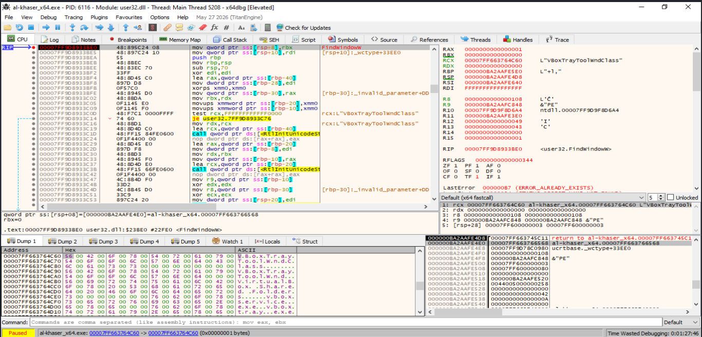
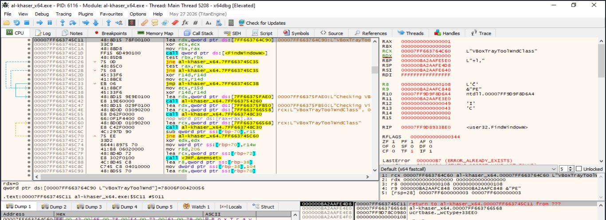
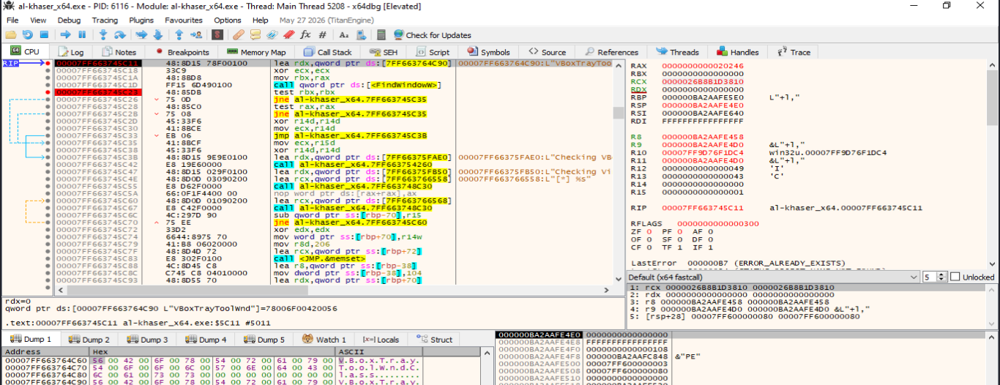
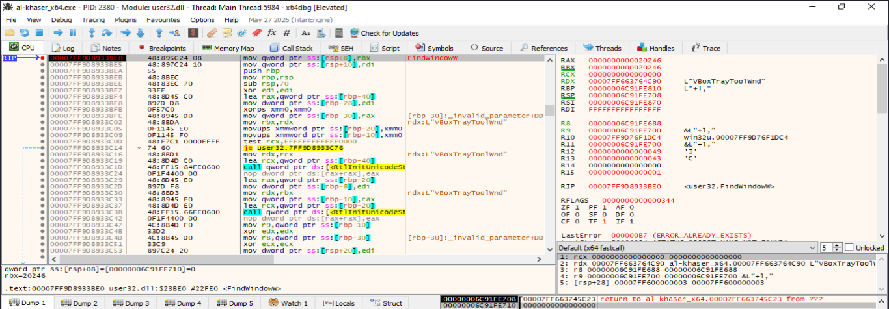
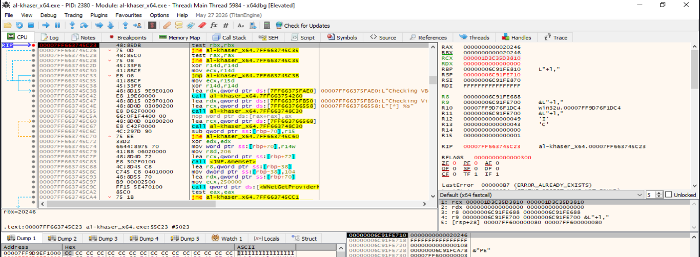
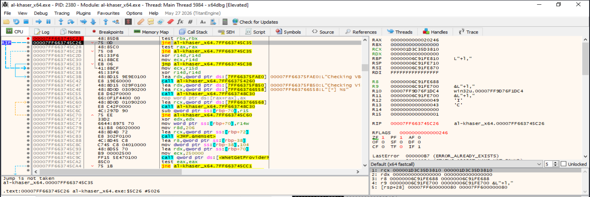
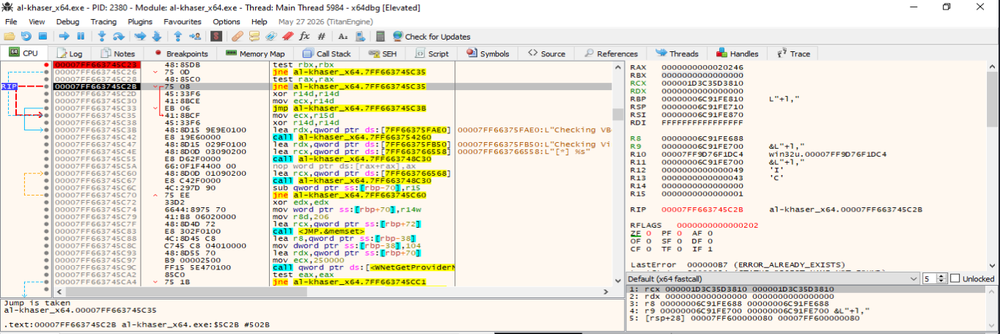
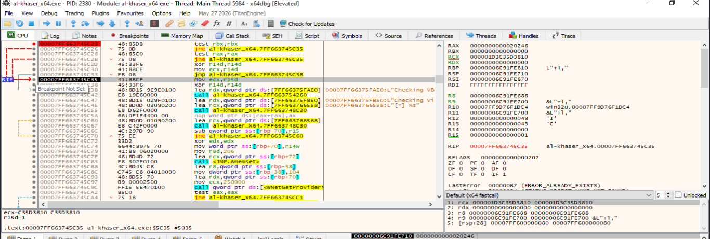

- [16. *UI Artifacts*](#16-ui-artifacts)
  - [16.1. Descripción de la técnica `UI Artifacts`](#161-descripción-de-la-técnica-ui-artifacts)
  - [16.2. Categoría](#162-categoría)
  - [16.3. Técnicas principales](#163-técnicas-principales)
    - [16.3.1. Detección de clases de ventana asociadas a virtualización](#1631-detección-de-clases-de-ventana-asociadas-a-virtualización)
    - [16.3.2. Detección mediante títulos o nombres de ventanas](#1632-detección-mediante-títulos-o-nombres-de-ventanas)
    - [16.3.3. Enumeración y recuento de ventanas de nivel superior](#1633-enumeración-y-recuento-de-ventanas-de-nivel-superior)
    - [16.3.4. Detección de ventanas asociadas a herramientas de análisis](#1634-detección-de-ventanas-asociadas-a-herramientas-de-análisis)
    - [16.3.5. Correlación de varios artefactos de interfaz](#1635-correlación-de-varios-artefactos-de-interfaz)
  - [16.4. Resumen visual de las técnicas que aparecen en `UI Artifacts`](#164-resumen-visual-de-las-técnicas-que-aparecen-en-ui-artifacts)
  - [16.5. Contramedidas ofensivas](#165-contramedidas-ofensivas)
  - [16.6. Contramedidas defensivas](#166-contramedidas-defensivas)
  - [16.7. Checklist rápido del laboratorio](#167-checklist-rápido-del-laboratorio)
    - [Preparación del entorno](#preparación-del-entorno)
    - [Análisis estático previo](#análisis-estático-previo)
    - [Preparación de la observación de la interfaz](#preparación-de-la-observación-de-la-interfaz)
    - [Pruebas con clases de ventana](#pruebas-con-clases-de-ventana)
    - [Pruebas con títulos y nombres de ventanas](#pruebas-con-títulos-y-nombres-de-ventanas)
    - [Pruebas de enumeración y recuento de ventanas](#pruebas-de-enumeración-y-recuento-de-ventanas)
    - [Pruebas relacionadas con herramientas de análisis](#pruebas-relacionadas-con-herramientas-de-análisis)
    - [Análisis dinámico con depurador y monitorización de APIs](#análisis-dinámico-con-depurador-y-monitorización-de-apis)
    - [Interpretación de los resultados](#interpretación-de-los-resultados)
    - [Evidencias que deben documentarse](#evidencias-que-deben-documentarse)
    - [Conclusión del checklist](#conclusión-del-checklist)
  - [16.8 Análisis dinámico](#168-análisis-dinámico)
    - [16.8.1. Detección de clases de ventana asociadas a virtualización](#1681-detección-de-clases-de-ventana-asociadas-a-virtualización)
      - [Objetivo de la demostración](#objetivo-de-la-demostración)
      - [Preparación de la prueba](#preparación-de-la-prueba)
      - [Entrada en `FindWindowW`](#entrada-en-findwindoww)
      - [Localización del retorno al código de `al-khaser`](#localización-del-retorno-al-código-de-al-khaser)
      - [Resultado de la búsqueda por clase](#resultado-de-la-búsqueda-por-clase)
      - [Conservación del resultado](#conservación-del-resultado)
      - [Evaluación del `HWND` obtenido](#evaluación-del-hwnd-obtenido)
      - [Activación de la rama de detección](#activación-de-la-rama-de-detección)
      - [Reconstrucción de la técnica observada](#reconstrucción-de-la-técnica-observada)
      - [Resultado obtenido](#resultado-obtenido)
      - [Interpretación](#interpretación)
      - [Evidencias demostradas](#evidencias-demostradas)
      - [Limitaciones](#limitaciones)
      - [Conclusión](#conclusión)
    - [16.8.2. Detección mediante títulos o nombres de ventanas](#1682-detección-mediante-títulos-o-nombres-de-ventanas)
      - [Objetivo de la demostración](#objetivo-de-la-demostración-1)
      - [Preparación de la prueba](#preparación-de-la-prueba-1)
      - [Entrada en `FindWindowW` durante la búsqueda por título](#entrada-en-findwindoww-durante-la-búsqueda-por-título)
      - [Retorno de `FindWindowW`](#retorno-de-findwindoww)
      - [Problema para aislar la evaluación por título](#problema-para-aislar-la-evaluación-por-título)
      - [Neutralización controlada de la comprobación por clase](#neutralización-controlada-de-la-comprobación-por-clase)
      - [Evaluación del resultado de la búsqueda por título](#evaluación-del-resultado-de-la-búsqueda-por-título)
      - [Ejecución del salto condicional](#ejecución-del-salto-condicional)
      - [Reconstrucción de la técnica observada](#reconstrucción-de-la-técnica-observada-1)
      - [Resultado obtenido](#resultado-obtenido-1)
      - [Diferencia respecto a la detección por clase](#diferencia-respecto-a-la-detección-por-clase)
      - [Interpretación](#interpretación-1)
      - [Evidencias demostradas](#evidencias-demostradas-1)
      - [Limitaciones](#limitaciones-1)
      - [Conclusión](#conclusión-1)
    - [16.8.3. Enumeración y recuento de ventanas de nivel superior](#1683-enumeración-y-recuento-de-ventanas-de-nivel-superior)


# 16. *UI Artifacts*

## 16.1. Descripción de la técnica `UI Artifacts`

La técnica `UI Artifacts` es un mecanismo de evasión y anti-análisis basado en la inspección de elementos de la **interfaz gráfica de usuario de Windows** con el objetivo de identificar indicios compatibles con una máquina virtual, una sandbox o un entorno utilizado para el análisis de malware.

A diferencia de otras técnicas anti-VM que consultan directamente el hardware, el Registro, los servicios o los dispositivos del sistema, `UI Artifacts` aprovecha información expuesta por el subsistema gráfico. Una muestra puede buscar determinadas **clases de ventana**, títulos concretos, ventanas pertenecientes a herramientas de virtualización o análisis, o analizar el número de ventanas de nivel superior existentes en la sesión.

El fundamento de la técnica parte de dos observaciones principales:

1. Algunos productos de virtualización o utilidades instaladas dentro del sistema invitado pueden crear ventanas auxiliares con nombres o clases reconocibles.
2. Las máquinas virtuales y sandboxes preparadas para análisis automatizado suelen presentar un escritorio más simple y menos actividad gráfica que un equipo utilizado de forma habitual por una persona.

Por ejemplo, una muestra puede utilizar funciones como:

```text
FindWindowA
FindWindowW
FindWindowExA
FindWindowExW
EnumWindows
GetClassNameA
GetClassNameW
GetWindowTextA
GetWindowTextW
GetWindowThreadProcessId
```

Una comprobación sencilla puede buscar una clase de ventana conocida. Otra variante puede enumerar todas las ventanas de nivel superior, contar cuántas existen y comparar el resultado con un umbral. Si el número es demasiado reducido, la muestra puede considerar que el sistema presenta un escritorio poco realista o compatible con una sandbox.

La técnica también puede utilizarse para localizar ventanas pertenecientes a depuradores, monitores de procesos, analizadores de red u otras herramientas de seguridad. En este caso, el mismo mecanismo de enumeración de la interfaz se emplea con una finalidad anti-debug o anti-analysis.

El flujo general puede representarse de la siguiente forma:

```text
Consultar la interfaz gráfica
        ↓
Enumerar o buscar ventanas
        ↓
Obtener clase, título o cantidad
        ↓
Comparar con indicadores conocidos
        ↓
Asignar una valoración al entorno
        ↓
Modificar o mantener el flujo de ejecución
```

Si la comprobación produce un resultado considerado sospechoso, una muestra puede finalizar, retrasar la ejecución, omitir su funcionalidad principal, evitar desplegar una segunda etapa o ejecutar una rama alternativa.

No obstante, `UI Artifacts` es una técnica **heurística**. La existencia de una ventana concreta puede deberse a software legítimo, mientras que un número reducido de ventanas puede aparecer en un equipo físico recién iniciado, una sesión de usuario poco activa, un sistema dedicado o una sesión remota. Del mismo modo, una máquina virtual utilizada diariamente puede presentar numerosas ventanas y un escritorio indistinguible, desde esta perspectiva, de un equipo físico.

Por ello, una comprobación de interfaz no debe interpretarse de forma aislada como una confirmación de virtualización. La evidencia resulta más sólida cuando se combinan varios indicadores independientes y se observa que el resultado condiciona realmente el comportamiento del programa.

----

## 16.2. Categoría

La técnica `UI Artifacts` se clasifica dentro de las técnicas de **evasión y anti-análisis**, principalmente en las categorías **anti-VM** y **anti-sandbox**. Cuando se utiliza para localizar ventanas pertenecientes a depuradores o herramientas de seguridad, también puede actuar como una técnica **anti-debug** o de detección de herramientas de análisis.

Dentro de una taxonomía de evasión puede representarse de la siguiente forma:

| Campo | Clasificación |
| --- | --- |
| Categoría | Evasión / Anti-análisis |
| Subcategoría | Anti-VM / Anti-sandbox / Anti-debug |
| Tipo de artefacto | Clases, títulos, handles y cantidad de ventanas |
| Fuente principal | Subsistema gráfico / interfaz de usuario de Windows |
| APIs habituales | `FindWindow*`, `FindWindowEx*`, `EnumWindows`, `GetClassName*`, `GetWindowText*` |
| Sistema principal | Windows |
| Naturaleza de la detección | Heurística |
| Prioridad para el TFM | Media-Alta |

Desde el punto de vista de MITRE ATT&CK, no existe una sub-técnica denominada específicamente `UI Artifacts`. Su utilización para detectar un entorno virtualizado puede encajar principalmente dentro de **T1497.001 — Virtualization/Sandbox Evasion: System Checks**, ya que el programa busca artefactos del entorno antes de decidir si continúa con su comportamiento.

La enumeración de ventanas también se relaciona técnicamente con **T1010 — Application Window Discovery**, que describe la obtención de información sobre las ventanas de aplicaciones abiertas. La finalidad determina la interpretación: la misma API puede utilizarse para descubrimiento legítimo de aplicaciones, selección de objetivos o evasión frente a herramientas de análisis.

Cuando la comprobación no busca una ventana característica sino evidencia de **actividad real del usuario**, como interacción con el escritorio, movimiento del ratón o cambios en la ventana activa, el comportamiento se aproxima más a **T1497.002 — User Activity Based Checks**. Conviene mantener esta separación para evitar agrupar bajo `UI Artifacts` todas las técnicas relacionadas con la interfaz.

En este documento, el núcleo de `UI Artifacts` queda delimitado a:

- Búsqueda de clases de ventana características.
- Búsqueda de títulos o nombres de ventana.
- Enumeración de ventanas de nivel superior.
- Recuento de ventanas como indicador de un escritorio artificialmente simple.
- Localización de ventanas pertenecientes a herramientas de análisis.
- Correlación de varios de estos indicadores.

Las comprobaciones de resolución de pantalla, número de monitores, movimientos del ratón, clics o historial de actividad se consideran **técnicas relacionadas**, pero no forman parte del núcleo estricto utilizado aquí para definir `UI Artifacts`.

----

## 16.3. Técnicas principales

La técnica `UI Artifacts` puede implementarse mediante distintos mecanismos de consulta de la interfaz. Aunque todas las variantes utilizan información expuesta por el entorno gráfico, difieren en el objeto buscado y en la forma en la que se interpreta.

**Entre las técnicas principales se encuentran:**

- Buscar directamente una clase de ventana asociada a un producto de virtualización.
- Buscar un título o nombre de ventana conocido.
- Enumerar las ventanas de nivel superior de la sesión.
- Contar el número total de ventanas y compararlo con un umbral.
- Obtener la clase y el título de cada ventana durante una enumeración.
- Relacionar un `HWND` con el proceso propietario.
- Buscar ventanas correspondientes a depuradores o herramientas de análisis.
- Combinar varios indicadores de interfaz antes de clasificar el entorno.

Una secuencia habitual puede representarse de la siguiente forma:

```text
EnumWindows / FindWindow
        ↓
Obtener HWND
        ↓
GetClassName / GetWindowText
        ↓
Comparar con una lista o condición
        ↓
Opcional: GetWindowThreadProcessId
        ↓
Acumular indicadores
        ↓
Decidir si el entorno resulta sospechoso
```

La presencia de estas APIs no demuestra por sí sola una técnica anti-VM. Aplicaciones legítimas utilizan `EnumWindows`, `FindWindow`, `GetWindowText` o `GetClassName` para automatización, accesibilidad, administración de ventanas y comunicación entre procesos.

La evidencia resulta más significativa cuando:

- Las cadenas comparadas corresponden a herramientas de virtualización o análisis.
- La enumeración se realiza poco antes de la ejecución de una función sensible.
- Existe una comparación con un umbral.
- El resultado controla un salto condicional.
- La rama positiva termina el proceso o evita ejecutar una funcionalidad.
- Se combinan varios indicadores independientes.

----

### 16.3.1. Detección de clases de ventana asociadas a virtualización

Una de las variantes más directas de `UI Artifacts` consiste en buscar una **clase de ventana** conocida y asociada a componentes instalados por un producto de virtualización.

En Windows, cada ventana pertenece a una clase registrada. La clase define determinadas propiedades y el procedimiento utilizado para procesar sus mensajes. Aunque el título visible puede cambiar, el nombre de la clase puede mantenerse estable y constituir un identificador útil para una comprobación anti-VM.

Una muestra puede utilizar:

```text
FindWindowA
FindWindowW
FindWindowExA
FindWindowExW
GetClassNameA
GetClassNameW
```

Un ejemplo conocido en entornos VirtualBox es la búsqueda de nombres como:

```text
VBoxTrayToolWndClass
VBoxTrayToolWnd
```

La lógica conceptual es:

```text
Buscar clase de ventana conocida
        ↓
¿Existe un HWND asociado?
       / \
     Sí   No
     ↓     ↓
Posible   Continuar
artefacto ejecución
de VM
```

`FindWindow` permite buscar una ventana de nivel superior especificando su clase y, opcionalmente, su título. Si la función devuelve un `HWND` válido, el programa puede interpretar que el elemento buscado está presente.

Otra variante consiste en ejecutar `EnumWindows` y consultar posteriormente la clase de cada ventana mediante `GetClassName`. Esto permite realizar una búsqueda más flexible y recopilar información sobre todo el escritorio antes de decidir.

Desde el punto de vista del análisis estático, deben localizarse:

- Importaciones de `FindWindow*`.
- Importaciones de `GetClassName*`.
- Cadenas que parezcan nombres de clases.
- Comparaciones de cadenas.
- Tablas de identificadores.
- Cálculos de hash utilizados para evitar almacenar los nombres en texto claro.
- Saltos condicionales posteriores.

Desde el punto de vista dinámico, interesa observar:

- Los parámetros enviados a `FindWindow`.
- La clase buscada.
- El valor retornado.
- Si el resultado es `NULL` o un `HWND` válido.
- La comparación realizada después de la llamada.
- El comportamiento adoptado por el programa.

Esta comprobación presenta una ventaja para el malware: el analista puede renombrar el ejecutable de una herramienta, pero eso no modifica necesariamente la clase de su ventana. No obstante, la técnica sigue siendo frágil, ya que los nombres pueden cambiar entre versiones o desaparecer si el componente correspondiente no está instalado o no se encuentra activo.

----

### 16.3.2. Detección mediante títulos o nombres de ventanas

Otra variante consiste en buscar ventanas mediante su **título visible** o mediante cadenas presentes en dicho título.

Las funciones más habituales son:

```text
FindWindowA
FindWindowW
FindWindowExA
FindWindowExW
GetWindowTextA
GetWindowTextW
GetWindowTextLengthA
GetWindowTextLengthW
```

Una búsqueda directa puede especificar el título esperado. Una variante más flexible enumera todas las ventanas, obtiene sus títulos y busca determinadas palabras o patrones.

El procedimiento general puede representarse como:

```text
Enumerar ventanas
        ↓
Obtener título
        ↓
Normalizar o comparar cadena
        ↓
¿Coincide con un indicador?
        ↓
Registrar resultado
```

Los títulos de las ventanas pueden aportar información sobre:

- Productos de virtualización.
- Consolas de administración.
- Depuradores.
- Desensambladores.
- Monitores de procesos.
- Analizadores de red.
- Herramientas utilizadas en un laboratorio.

Desde la perspectiva anti-análisis, esta técnica puede resultar útil incluso cuando el proceso de una herramienta ha sido renombrado, siempre que su ventana continúe mostrando un título reconocible.

Sin embargo, los títulos son menos estables que las clases de ventana. Pueden variar según:

- La versión del programa.
- El idioma del sistema.
- El archivo abierto.
- El estado de la aplicación.
- La personalización realizada por el usuario.
- La ejecución sin interfaz gráfica.

Por ello, la detección basada únicamente en un título exacto puede producir falsos negativos. Una implementación puede utilizar coincidencias parciales o varios indicadores, aunque esto incrementa también el riesgo de falsos positivos.

Durante el análisis dinámico deben documentarse:

- El título consultado.
- El `HWND` asociado.
- La cadena comparada.
- Si la comparación es exacta o parcial.
- La relación entre la ventana y el proceso propietario.
- La decisión tomada después de la coincidencia.

----

### 16.3.3. Enumeración y recuento de ventanas de nivel superior

Una sandbox o máquina virtual preparada exclusivamente para análisis puede presentar un escritorio más simple que un equipo utilizado de forma habitual. A partir de esta observación, una muestra puede enumerar las **ventanas de nivel superior** y utilizar su cantidad como indicador heurístico.

La API principal es:

```text
EnumWindows
```

`EnumWindows` invoca una función de callback para cada ventana de nivel superior asociada al escritorio. El programa puede incrementar un contador y, al finalizar, comparar el número obtenido con un umbral.

La secuencia conceptual es:

```text
contador = 0
        ↓
EnumWindows
        ↓
Callback por cada HWND
        ↓
contador = contador + 1
        ↓
Finaliza la enumeración
        ↓
Comparar contador con un umbral
```

Una condición conceptual podría ser:

```text
Pocas ventanas
        ↓
Escritorio poco poblado
        ↓
Posible sandbox o entorno de análisis
```

Este enfoque no identifica directamente un producto de virtualización. Lo que intenta medir es el **grado de realismo del entorno gráfico**.

La cantidad de ventanas debe considerarse un indicador débil por varias razones:

- Un equipo físico recién iniciado puede tener pocas ventanas.
- Un usuario puede cerrar la mayoría de las aplicaciones.
- Un servidor o sistema dedicado puede presentar poca actividad gráfica.
- Una sesión remota puede diferir de una sesión local.
- Una máquina virtual utilizada diariamente puede contener numerosas aplicaciones.
- Muchas ventanas internas no representan interacción visible del usuario.
- La cifra depende de la versión de Windows y del software instalado.

Por tanto, no existe un número universal que permita separar de forma fiable una máquina física de una virtual.

Durante el análisis deben observarse:

- La llamada a `EnumWindows`.
- La dirección del callback.
- La variable utilizada como contador.
- Los filtros aplicados a las ventanas.
- El umbral seleccionado.
- La comparación.
- El salto condicional posterior.
- La rama ejecutada cuando el recuento se considera bajo.

Una evidencia especialmente útil consiste en modificar de forma controlada el número de ventanas abiertas y comprobar si el resultado de la función o la rama tomada por el programa cambia de forma reproducible.

----

### 16.3.4. Detección de ventanas asociadas a herramientas de análisis

El mismo mecanismo utilizado para localizar artefactos de virtualización puede emplearse para detectar **depuradores y herramientas de análisis** mediante sus ventanas.

En este caso, el objetivo no es identificar directamente el hipervisor, sino determinar si el proceso está siendo observado dentro de un laboratorio.

Las APIs utilizadas pueden incluir:

```text
FindWindowA
FindWindowW
FindWindowExA
FindWindowExW
EnumWindows
GetWindowTextA
GetWindowTextW
GetClassNameA
GetClassNameW
GetWindowThreadProcessId
```

La búsqueda puede orientarse a:

- Clases de ventana propias de depuradores.
- Títulos que contienen el nombre de una herramienta.
- Ventanas de analizadores de red.
- Monitores de procesos.
- Herramientas de ingeniería inversa.

La relación entre ventana y proceso puede obtenerse mediante:

```text
GetWindowThreadProcessId
```

Esto permite asociar un `HWND` con el PID que lo posee y añadir contexto a la comprobación.

El flujo puede ser:

```text
Enumerar ventanas
        ↓
Obtener clase y título
        ↓
Detectar cadena sospechosa
        ↓
Obtener PID propietario
        ↓
Correlacionar con proceso
        ↓
Modificar el flujo
```

Desde el punto de vista taxonómico, esta variante se encuentra en la frontera entre `UI Artifacts`, detección de herramientas y anti-debug. La característica que justifica su inclusión en este apartado es que la **fuente primaria de información es la interfaz gráfica**, no la enumeración directa de procesos.

La presencia de una ventana asociada a una herramienta de análisis es una evidencia más concreta que un simple recuento bajo, pero tampoco garantiza que la muestra esté siendo analizada. La herramienta puede encontrarse abierta por otros motivos, utilizarse sobre otro proceso o ejecutarse en una sesión diferente.

----

### 16.3.5. Correlación de varios artefactos de interfaz

Una comprobación aislada de interfaz suele ser poco fiable. Para aumentar la robustez, una muestra puede combinar varios indicadores antes de clasificar el entorno.

Por ejemplo:

```text
Clase de ventana característica
        +
Número reducido de ventanas
        +
Título asociado a una herramienta
        ↓
Puntuación de sospecha
        ↓
Decisión
```

Una lógica de correlación puede asignar diferente peso a cada evidencia:

| Indicador | Fuerza aproximada |
| --- | --- |
| Clase de ventana específica de un componente de VM | Media-Alta |
| Título exacto de una herramienta de análisis | Media-Alta |
| Coincidencia parcial en un título | Media |
| Número reducido de ventanas | Baja |
| Ausencia de actividad gráfica | Baja si se observa de forma aislada |

La ventaja de este enfoque es que evita depender de un único artefacto que pueda desaparecer o cambiar. También permite tratar el recuento de ventanas como una señal complementaria en lugar de utilizarlo como criterio absoluto.

Desde el punto de vista del análisis, deben buscarse:

- Varias llamadas consecutivas a APIs de `user32.dll`.
- Estructuras que acumulen resultados.
- Variables booleanas o contadores de coincidencias.
- Comparaciones con una puntuación mínima.
- Ramas que se ejecuten únicamente después de varias comprobaciones.
- Combinación con otros módulos anti-VM, como procesos, Registro, WMI, hardware o timing.

Una secuencia de este tipo constituye una evidencia más sólida de reconocimiento ambiental que una llamada aislada a `FindWindow`.

----

## 16.4. Resumen visual de las técnicas que aparecen en `UI Artifacts`

El objetivo general de `UI Artifacts` consiste en utilizar características observables de la interfaz gráfica para determinar si el entorno presenta elementos asociados a virtualización, análisis o una sesión artificialmente simplificada.

Los indicadores principales son:

- **Presencia positiva:** existe una clase o título de ventana asociado a un componente conocido.
- **Ausencia o escasez:** el entorno contiene un número anormalmente bajo de ventanas.
- **Herramientas visibles:** aparecen ventanas pertenecientes a depuradores o utilidades de análisis.
- **Correlación:** varias señales débiles aparecen simultáneamente.

El siguiente esquema resume las variantes principales:

```text
UI Artifacts
│
├── 1. Búsqueda directa de ventanas
│   │
│   ├── FindWindowA / FindWindowW
│   ├── FindWindowExA / FindWindowExW
│   ├── Clase de ventana
│   └── Título de ventana
│
├── 2. Enumeración de ventanas
│   │
│   ├── EnumWindows
│   ├── Callback por HWND
│   ├── GetClassName
│   └── GetWindowText
│
├── 3. Recuento de ventanas
│   │
│   ├── Contar ventanas de nivel superior
│   ├── Aplicar filtros
│   └── Comparar con un umbral
│
├── 4. Detección de herramientas
│   │
│   ├── Depuradores
│   ├── Monitores de procesos
│   ├── Analizadores de red
│   └── Herramientas de ingeniería inversa
│
└── 5. Correlación de indicadores
    │
    ├── Clase conocida
    ├── Título conocido
    ├── Número de ventanas
    ├── PID propietario
    └── Otros indicadores anti-VM
```

La siguiente tabla resume la finalidad de cada variante:

| Técnica | Qué observa | Indicador | Posible interpretación |
| --- | --- | --- | --- |
| Clase de ventana | Nombre de la clase registrada | Coincidencia con una clase conocida | Posible componente de virtualización o análisis |
| Título de ventana | Texto asociado a una ventana | Nombre o patrón reconocible | Posible herramienta abierta |
| Enumeración de ventanas | Conjunto de ventanas de nivel superior | Inventario gráfico del escritorio | Reconocimiento del entorno |
| Recuento de ventanas | Cantidad de ventanas enumeradas | Valor anormalmente bajo | Posible sandbox o escritorio poco poblado |
| Asociación ventana-proceso | PID propietario de un `HWND` | Ventana ligada a un proceso concreto | Confirmación contextual de la coincidencia |
| Correlación | Varios indicadores simultáneos | Puntuación o combinación de resultados | Mayor confianza en la clasificación |

Desde el punto de vista del TFM, resulta importante distinguir `UI Artifacts` de técnicas próximas:

```text
UI Artifacts
    → clases, títulos y cantidad de ventanas

User Activity
    → ratón, clics, última entrada, cambios de interacción

Display / Generic OS Queries
    → resolución, monitores, características de pantalla

Process / Tool Discovery
    → enumeración directa de procesos y servicios
```

Estas familias pueden combinarse en una misma muestra, pero representan fuentes de evidencia diferentes.

Ningún indicador de `UI Artifacts` debe interpretarse de manera aislada como confirmación absoluta de una máquina virtual. La evidencia será más sólida cuando el comportamiento sea reproducible y exista una relación directa entre el resultado de la comprobación y una modificación posterior del flujo de ejecución.

----

## 16.5. Contramedidas ofensivas

Desde una perspectiva ofensiva, las contramedidas asociadas a `UI Artifacts` buscan aumentar la fiabilidad del reconocimiento ambiental y reducir la dependencia de un único identificador gráfico.

Una primera estrategia consiste en **combinar clases y títulos de ventana**. Una clase puede ser estable aunque cambie el texto visible, mientras que un título puede revelar herramientas que utilizan clases genéricas. La correlación de ambos atributos reduce la dependencia de una única fuente.

Otra estrategia consiste en **enumerar las ventanas en lugar de realizar únicamente búsquedas directas**. La enumeración permite recopilar varias propiedades del escritorio y aplicar posteriormente diferentes criterios de clasificación.

También puede utilizarse el **proceso propietario de la ventana** como información adicional. Después de obtener un `HWND`, el programa puede relacionarlo con un PID y utilizar el resultado para confirmar que la ventana pertenece al software esperado.

Otra medida consiste en **realizar varias observaciones a lo largo del tiempo**. Una ventana puede no existir durante el arranque y aparecer posteriormente. Del mismo modo, una herramienta puede abrirse después de que el proceso haya comenzado. Repetir una comprobación en distintos momentos puede aumentar la probabilidad de observar un artefacto, aunque también incrementa el riesgo de falsos positivos.

La utilización de **varios indicadores independientes** es otra contramedida relevante. En lugar de decidir únicamente a partir de un recuento reducido, pueden combinarse:

- Una clase de ventana específica.
- Un título relacionado con una herramienta.
- Un número bajo de ventanas.
- La identidad del proceso propietario.
- Otras evidencias anti-VM obtenidas mediante procesos, Registro, hardware o WMI.

Esta combinación permite tratar los artefactos gráficos como parte de una puntuación general del entorno.

También puede aplicarse una **calibración del umbral** utilizado en el recuento de ventanas. Un valor fijo puede comportarse de manera diferente en distintas versiones de Windows. Un enfoque más robusto requiere considerar qué ventanas se cuentan, si son visibles y en qué sesión se encuentran.

Desde el punto de vista del diseño de una técnica evasiva, otra posibilidad consiste en no ejecutar todas las comprobaciones al inicio. Distribuirlas a lo largo del flujo dificulta asociar inmediatamente una única función con una decisión anti-VM. Sin embargo, desde una perspectiva experimental, esta característica obliga al analista a seguir el flujo completo antes de concluir que existe evasión.

Las cadenas utilizadas para comparar títulos o clases también pueden encontrarse codificadas, construidas dinámicamente o representadas mediante hashes. En análisis estático, la ausencia de nombres legibles no descarta que exista una búsqueda de ventanas.

Finalmente, una implementación puede comprobar si los resultados de distintas fuentes son coherentes. Por ejemplo, una ventana que aparentemente pertenece a una herramienta puede contrastarse con el PID propietario antes de incrementar la puntuación de sospecha.

Estas estrategias aumentan la robustez del reconocimiento, pero no eliminan la naturaleza heurística de la técnica. Un entorno físico puede contener herramientas de análisis y una máquina virtual puede carecer completamente de artefactos gráficos identificables.

----

## 16.6. Contramedidas defensivas

Desde una perspectiva defensiva, las contramedidas frente a `UI Artifacts` tienen como objetivo evitar que una muestra pueda diferenciar fácilmente un entorno de análisis de un sistema de usuario normal mediante la inspección de la interfaz gráfica.

Una primera medida consiste en **reducir los artefactos gráficos específicos del hipervisor**. Deben revisarse las ventanas creadas por las utilidades del sistema invitado y determinar si exponen clases o títulos fácilmente reconocibles.

Cuando sea posible, el laboratorio puede configurarse de forma que los componentes de virtualización no creen elementos gráficos innecesarios. Esta medida debe aplicarse con cuidado, ya que deshabilitar determinados componentes puede modificar otras características del entorno y crear nuevos indicadores.

Otra estrategia consiste en mantener un **escritorio realista**. Una sandbox completamente vacía, con muy pocas ventanas y sin aplicaciones de usuario, puede facilitar las heurísticas basadas en recuento. Un entorno más representativo puede contener:

- Aplicaciones legítimas.
- Ventanas de uso cotidiano.
- Documentos de prueba.
- Navegadores.
- Elementos de la sesión de usuario.
- Un perfil con cierta actividad previa.

La finalidad no es alcanzar un número concreto de ventanas, sino evitar una configuración artificialmente mínima y repetitiva.

También resulta útil **separar las herramientas de análisis de la sesión observada**, cuando la arquitectura del laboratorio lo permite. Algunas herramientas pueden ejecutarse desde el host, desde una segunda VM o mediante mecanismos de captura que no creen una ventana fácilmente enumerable dentro de la sesión analizada.

En una sesión donde sea necesario ejecutar un depurador o monitor gráfico, conviene conocer las clases y títulos que expone. Cambiar únicamente el nombre del ejecutable puede ser insuficiente si la ventana continúa siendo reconocible.

Otra contramedida consiste en **interceptar o instrumentar las APIs de enumeración**, permitiendo observar qué intenta consultar la muestra. Entre las funciones relevantes se encuentran:

```text
FindWindowA
FindWindowW
FindWindowExA
FindWindowExW
EnumWindows
GetClassNameA
GetClassNameW
GetWindowTextA
GetWindowTextW
GetWindowThreadProcessId
```

La instrumentación puede utilizarse para:

- Registrar los parámetros de búsqueda.
- Identificar clases o títulos sospechosos.
- Localizar la función que inicia la comprobación.
- Reconstruir la lógica de decisión.
- Determinar si el resultado condiciona el flujo.

La manipulación de valores de retorno puede utilizarse en un laboratorio para demostrar la técnica, pero debe mantener la coherencia del sistema. Si `FindWindow` indica que una ventana no existe y una enumeración posterior la devuelve, la muestra podría detectar la inconsistencia.

Una medida especialmente eficaz durante el análisis dinámico consiste en colocar el punto de ruptura **después de la consulta y antes de la decisión**, en lugar de detener repetidamente todas las APIs de interfaz. Esto reduce el ruido y permite centrarse en:

```text
Resultado de la enumeración
        ↓
Comparación
        ↓
Salto condicional
```

También puede parchearse temporalmente la condición o el salto para continuar con el análisis del comportamiento posterior. En un entorno educativo, esta modificación permite demostrar que la comprobación actuaba como una puerta de acceso al resto de la funcionalidad.

Desde el punto de vista de detección, debe prestarse atención a secuencias como:

| Patrón observado | Posible interpretación |
| --- | --- |
| `FindWindow` con una clase específica y salto inmediato | Búsqueda directa de artefacto |
| `EnumWindows` → `GetClassName` → comparación de cadenas | Inventario de clases de ventana |
| `EnumWindows` → contador → comparación con un umbral | Detección de escritorio poco poblado |
| `GetWindowText` → búsqueda de nombres de herramientas | Posible anti-analysis |
| `GetWindowThreadProcessId` después de una coincidencia | Correlación entre ventana y proceso |
| Varias consultas de interfaz antes del `payload` | Reconocimiento ambiental |

La presencia de una de estas secuencias debe correlacionarse con el contexto. Aplicaciones de accesibilidad, automatización, gestores de ventanas y software de escritorio remoto pueden realizar comportamientos similares de forma legítima.

Finalmente, la defensa más robusta consiste en **correlacionar `UI Artifacts` con otras técnicas anti-análisis**. La evidencia aumenta cuando la enumeración de ventanas aparece junto con:

- Comprobación de procesos.
- Consultas al Registro.
- Enumeración de servicios.
- Consultas WMI.
- Comprobaciones de CPU o memoria.
- Artefactos de hardware.
- Técnicas `timing`.
- Comprobaciones de interacción del usuario.
- Finalización o alteración del comportamiento tras la detección.

----

## 16.7. Checklist rápido del laboratorio

El siguiente checklist resume los pasos principales para analizar y demostrar la técnica `UI Artifacts` en un entorno controlado. Su finalidad es identificar búsquedas de clases o títulos de ventana, enumeraciones del escritorio, recuentos anómalos y comprobaciones orientadas a detectar herramientas de análisis.

### Preparación del entorno

- [ ] Ejecutar las pruebas únicamente en una máquina virtual o laboratorio controlado.
- [ ] Crear un `snapshot` limpio antes de comenzar.
- [ ] Documentar el hipervisor utilizado: `VirtualBox`, `VMware`, `Hyper-V` u otro.
- [ ] Registrar el sistema operativo y la arquitectura.
- [ ] Anotar si se encuentran instaladas herramientas del sistema invitado.
- [ ] Registrar si dichas herramientas crean iconos, ventanas auxiliares o procesos gráficos.
- [ ] Documentar la sesión utilizada:
  - [ ] Consola local.
  - [ ] Escritorio remoto.
  - [ ] Sesión automatizada.
- [ ] Registrar las aplicaciones abiertas antes de cada prueba.
- [ ] Mantener constante, cuando sea posible, el conjunto de ventanas entre ejecuciones comparables.
- [ ] Preparar una segunda configuración con un escritorio más poblado para realizar comparaciones.
- [ ] Registrar si las pruebas se realizan:
  - [ ] Sin herramientas de análisis visibles.
  - [ ] Con depurador abierto.
  - [ ] Con monitor de procesos abierto.
  - [ ] Con analizador de red abierto.
- [ ] Capturar una referencia del estado inicial del escritorio.

### Análisis estático previo

- [ ] Buscar importaciones relacionadas con búsqueda de ventanas:

```text
FindWindowA
FindWindowW
FindWindowExA
FindWindowExW
```

- [ ] Buscar importaciones relacionadas con enumeración:

```text
EnumWindows
EnumChildWindows
EnumDesktopWindows
```

- [ ] Buscar funciones utilizadas para obtener propiedades:

```text
GetClassNameA
GetClassNameW
GetWindowTextA
GetWindowTextW
GetWindowTextLengthA
GetWindowTextLengthW
GetWindowThreadProcessId
IsWindowVisible
```

- [ ] Localizar cadenas que parezcan nombres de clases.
- [ ] Localizar cadenas asociadas a productos de virtualización.
- [ ] Localizar nombres de herramientas de análisis.
- [ ] Buscar referencias a:

```text
VBox
VMware
VirtualBox
debug
dbg
Wireshark
Process
Monitor
```

- [ ] No asumir que una cadena aislada demuestra evasión.
- [ ] Revisar si las cadenas se descifran o construyen en tiempo de ejecución.
- [ ] Buscar funciones de comparación:

```text
strcmp
strncmp
strstr
lstrcmp
CompareString
```

- [ ] Localizar comparaciones posteriores a `FindWindow`.
- [ ] Identificar el callback utilizado por `EnumWindows`.
- [ ] Determinar si el callback incrementa un contador.
- [ ] Localizar el umbral aplicado al recuento.
- [ ] Identificar saltos condicionales relacionados con el resultado.
- [ ] Comprobar si la técnica se ejecuta antes de una segunda etapa o funcionalidad sensible.

### Preparación de la observación de la interfaz

- [ ] Obtener una línea base de las ventanas existentes.
- [ ] Registrar para cada ventana, cuando sea relevante:
  - [ ] `HWND`.
  - [ ] Título.
  - [ ] Clase.
  - [ ] PID propietario.
  - [ ] Visibilidad.
- [ ] Utilizar una herramienta como `Spy++`, `WinSpy`, `Process Explorer` o equivalente para inspeccionar las ventanas.
- [ ] Contar las ventanas de nivel superior antes de iniciar la muestra.
- [ ] Repetir el recuento con varias aplicaciones abiertas.
- [ ] Guardar capturas de las configuraciones utilizadas.
- [ ] Documentar cualquier ventana específica creada por herramientas del hipervisor.
- [ ] Mantener las mismas condiciones entre ejecuciones cuando se comparen resultados.

### Pruebas con clases de ventana

- [ ] Colocar puntos de ruptura en:

```text
user32!FindWindowA
user32!FindWindowW
user32!FindWindowExA
user32!FindWindowExW
```

- [ ] Registrar el parámetro correspondiente a `lpClassName`.
- [ ] Determinar si la clase aparece como cadena directa o puntero.
- [ ] Documentar la cadena exacta buscada.
- [ ] Registrar el valor de retorno.
- [ ] Comprobar si el retorno es:
  - [ ] `NULL`.
  - [ ] Un `HWND` válido.
- [ ] Seguir el flujo después del retorno.
- [ ] Localizar la instrucción `test` o `cmp`.
- [ ] Documentar el salto condicional.
- [ ] Comprobar si existe una clase como:

```text
VBoxTrayToolWndClass
```

- [ ] Verificar en el sistema si la clase existe realmente.
- [ ] Repetir la prueba con el componente correspondiente activo e inactivo, cuando sea posible.
- [ ] Confirmar si la rama tomada cambia entre ambas configuraciones.

### Pruebas con títulos y nombres de ventanas

- [ ] Interceptar llamadas a `FindWindow*`.
- [ ] Registrar el parámetro utilizado como título.
- [ ] Si se utiliza `EnumWindows`, localizar posteriormente:

```text
GetWindowTextA
GetWindowTextW
```

- [ ] Registrar los títulos devueltos.
- [ ] Localizar la función de comparación.
- [ ] Determinar si la coincidencia es:
  - [ ] Exacta.
  - [ ] Parcial.
  - [ ] Insensible a mayúsculas.
  - [ ] Basada en hash.
- [ ] Identificar el nombre o patrón que activa la condición.
- [ ] Comprobar si el título cambia según el archivo abierto.
- [ ] Repetir la prueba con la herramienta cerrada.
- [ ] Repetir la prueba con la herramienta abierta.
- [ ] Documentar si cambia el flujo del programa.

### Pruebas de enumeración y recuento de ventanas

- [ ] Colocar un breakpoint en:

```text
user32!EnumWindows
```

- [ ] Identificar la función callback.
- [ ] Seguir la ejecución del callback.
- [ ] Determinar qué operaciones realiza para cada `HWND`.
- [ ] Comprobar si incrementa un contador.
- [ ] Revisar si aplica filtros mediante:

```text
IsWindowVisible
GetWindowText
GetClassName
GetWindowThreadProcessId
```

- [ ] Registrar el número final obtenido.
- [ ] Localizar el umbral utilizado por la muestra.
- [ ] Documentar la comparación.
- [ ] Registrar el salto condicional.
- [ ] Ejecutar una prueba con pocas aplicaciones abiertas.
- [ ] Ejecutar otra prueba con un escritorio más poblado.
- [ ] Mantener el resto de condiciones constantes.
- [ ] Comprobar si el resultado cambia de forma reproducible.
- [ ] No considerar un umbral aislado como universal.
- [ ] Documentar el número real de ventanas en cada configuración.

### Pruebas relacionadas con herramientas de análisis

- [ ] Ejecutar inicialmente la muestra sin herramientas gráficas visibles.
- [ ] Registrar el resultado.
- [ ] Abrir posteriormente una herramienta de análisis.
- [ ] Repetir la ejecución.
- [ ] Comprobar si la muestra busca:
  - [ ] Clase de ventana.
  - [ ] Título.
  - [ ] Cadena parcial.
- [ ] Si obtiene un `HWND`, comprobar si llama a:

```text
GetWindowThreadProcessId
```

- [ ] Registrar el PID obtenido.
- [ ] Verificar qué proceso posee realmente la ventana.
- [ ] Documentar si la herramienta se detecta aunque su ejecutable haya sido renombrado.
- [ ] Comprobar si el cambio afecta a:
  - [ ] Finalización del proceso.
  - [ ] Omisión de una función.
  - [ ] Retraso.
  - [ ] Rama alternativa.
  - [ ] Ausencia de una segunda etapa.

### Análisis dinámico con depurador y monitorización de APIs

- [ ] Utilizar `x32dbg` o `x64dbg` según la arquitectura.
- [ ] Configurar breakpoints únicamente en las APIs necesarias.
- [ ] Evitar detenerse en cada ventana enumerada si genera demasiado ruido.
- [ ] Cuando sea posible, colocar un breakpoint en la función callback.
- [ ] Localizar el punto donde termina la enumeración.
- [ ] Seguir la variable que contiene el resultado acumulado.
- [ ] Identificar la comparación final.
- [ ] Registrar los valores antes de ejecutar el salto.
- [ ] Utilizar `API Monitor` para observar llamadas a `user32.dll`.
- [ ] Registrar:
  - [ ] Nombre de la API.
  - [ ] Parámetros.
  - [ ] Valores de retorno.
  - [ ] Orden de llamadas.
  - [ ] Hilo responsable.
- [ ] Correlacionar la captura de APIs con el desensamblado.
- [ ] Comprobar si las funciones se resuelven dinámicamente mediante:

```text
LoadLibrary
GetProcAddress
LdrGetProcedureAddress
```

- [ ] Identificar la función del programa que inicia la comprobación.
- [ ] Localizar el cambio de flujo producido por el resultado.

### Interpretación de los resultados

- [ ] Distinguir entre una API ejecutada y una técnica anti-VM confirmada.
- [ ] Considerar demostrada la técnica cuando exista:
  - [ ] Consulta de una propiedad de interfaz.
  - [ ] Extracción de clase, título o cantidad.
  - [ ] Comparación con un indicador o umbral.
  - [ ] Decisión posterior basada en el resultado.
- [ ] Considerar detección positiva únicamente cuando se cumpla la condición definida.
- [ ] No interpretar `FindWindow` de forma aislada como evidencia concluyente.
- [ ] No interpretar un número reducido de ventanas como confirmación de sandbox.
- [ ] Revisar posibles causas legítimas.
- [ ] Comprobar si la evidencia se reproduce.
- [ ] Comparar varias configuraciones del escritorio.
- [ ] Correlacionar el resultado con otros módulos anti-VM.
- [ ] Diferenciar:
  - [ ] Artefacto de virtualización.
  - [ ] Herramienta de análisis.
  - [ ] Escritorio poco poblado.
  - [ ] Actividad del usuario.
- [ ] Utilizar términos como:
  - [ ] “indicio”.
  - [ ] “resultado compatible”.
  - [ ] “artefacto observado”.
  - [ ] “detección heurística”.
- [ ] Evitar afirmar que existe una VM cuando únicamente se ha observado una condición débil.

### Evidencias que deben documentarse

- [ ] Nombre de la herramienta o muestra analizada.
- [ ] Hash del ejecutable.
- [ ] Fecha y hora de la prueba.
- [ ] Sistema operativo y arquitectura.
- [ ] Hipervisor.
- [ ] Tipo de sesión.
- [ ] Herramientas de virtualización instaladas.
- [ ] Herramientas de análisis abiertas.
- [ ] Lista de aplicaciones abiertas.
- [ ] API utilizada.
- [ ] Dirección de la llamada.
- [ ] Parámetros enviados.
- [ ] Clase de ventana buscada.
- [ ] Título buscado.
- [ ] `HWND` obtenido.
- [ ] PID propietario, cuando se consulte.
- [ ] Número de ventanas enumeradas.
- [ ] Filtros aplicados.
- [ ] Umbral utilizado.
- [ ] Resultado de la comparación.
- [ ] Instrucción de comparación.
- [ ] Salto condicional.
- [ ] Rama tomada.
- [ ] Comportamiento posterior.
- [ ] Capturas de `x64dbg` o `x32dbg`.
- [ ] Capturas de la herramienta de inspección de ventanas.
- [ ] Capturas de `API Monitor`.
- [ ] Comparación entre ejecuciones con distintos estados del escritorio.
- [ ] Conclusión sobre la técnica demostrada.

### Conclusión del checklist

Puede considerarse que una herramienta o muestra utiliza `UI Artifacts` con finalidad anti-análisis cuando consulta propiedades de la interfaz gráfica y utiliza el resultado para valorar el entorno antes de continuar con su ejecución.

La evidencia más clara presenta una secuencia como:

```text
FindWindow / EnumWindows
        ↓
Obtención de clase, título o cantidad
        ↓
Comparación con indicador o umbral
        ↓
Salto condicional
        ↓
Modificación del flujo de ejecución
```

En una búsqueda directa, la secuencia puede ser:

```text
FindWindow
        ↓
HWND válido
        ↓
Comparación
        ↓
Rama de detección
```

En una comprobación basada en recuento:

```text
EnumWindows
        ↓
Callback
        ↓
Contador de ventanas
        ↓
Comparación con umbral
        ↓
Rama de detección
```

La técnica debe considerarse heurística. Una ventana concreta puede aparecer en un equipo físico y una máquina virtual puede no exponer ningún artefacto reconocible. Del mismo modo, la cantidad de ventanas depende del uso real del sistema y no constituye una característica exclusiva de la virtualización.

Por ello, la conclusión del laboratorio debe basarse en tres elementos:

1. **Evidencia técnica:** se identifica qué API obtiene la información y qué valor se utiliza.
2. **Evidencia de decisión:** se demuestra que el resultado condiciona una comparación y un salto.
3. **Evidencia contextual:** se correlaciona el indicador con otras comprobaciones anti-VM o con cambios controlados del entorno.

Cuando estos elementos aparecen conjuntamente, puede documentarse `UI Artifacts` como una técnica de reconocimiento ambiental orientada a detectar máquinas virtuales, sandboxes o herramientas de análisis.


---

## 16.8 Análisis dinámico

### 16.8.1. Detección de clases de ventana asociadas a virtualización

#### Objetivo de la demostración

El objetivo de esta prueba es demostrar dinámicamente cómo `al-khaser` utiliza un artefacto de la interfaz gráfica de Windows para identificar indicios compatibles con la ejecución dentro de **VirtualBox**. En concreto, la herramienta intenta localizar una ventana registrada con la clase:

```text
VBoxTrayToolWndClass
```

La comprobación se realiza mediante la API de Windows:

```text
FindWindowW
```

La lógica general observada durante la ejecución es:

```text
Preparar lpClassName = "VBoxTrayToolWndClass"
        ↓
FindWindowW
        ↓
Obtener HWND
        ↓
¿HWND != NULL?
        ↓
Conservar el resultado
        ↓
test rbx, rbx
        ↓
Salto condicional
        ↓
Rama de detección positiva
```

Esta técnica se encuadra dentro de `UI Artifacts`, ya que la fuente de información utilizada por la herramienta no es el hardware, el Registro o los procesos, sino una propiedad observable de la **interfaz gráfica del sistema invitado**.

---

#### Preparación de la prueba

La demostración se realizó con la versión x64 de `al-khaser` bajo `x64dbg`.

Para reducir el número de comprobaciones ejecutadas y centrarse en los artefactos de VirtualBox, se utilizó la opción:

```bat
al-khaser_x64.exe --check VBOX
```

Inicialmente se colocó un breakpoint sobre:

```text
user32!FindWindowW
```

En `x64dbg` puede establecerse mediante:

```text
bp user32.FindWindowW
```

La finalidad del breakpoint es interceptar la llamada en el momento en el que `al-khaser` proporciona a Windows la clase de ventana que desea localizar.

---

#### Entrada en `FindWindowW`

La primera evidencia se obtiene cuando la ejecución se detiene en:

```text
user32!FindWindowW
```

En Windows x64, los dos primeros argumentos de la función:

```cpp
HWND FindWindowW(
    LPCWSTR lpClassName,
    LPCWSTR lpWindowName
);
```

se transmiten mediante:

```text
RCX = lpClassName
RDX = lpWindowName
```

Durante la ejecución analizada se observó:

```text
RCX = 00007FF663764C60
      → L"VBoxTrayToolWndClass"

RDX = 0000000000000000
      → NULL
```

Por tanto, la llamada ejecutada por `al-khaser` puede representarse conceptualmente como:

```cpp
FindWindowW(
    L"VBoxTrayToolWndClass",
    NULL
);
```



> **Figura 16.8.1.1. Entrada en `FindWindowW` durante la búsqueda de una clase de ventana asociada a VirtualBox.** El registro `RCX`, correspondiente al parámetro `lpClassName`, apunta a la cadena Unicode `VBoxTrayToolWndClass`, mientras que `RDX`, correspondiente a `lpWindowName`, contiene `NULL`. En el volcado de memoria también puede observarse directamente la cadena utilizada por `al-khaser`.

Esta captura constituye la evidencia principal de que la herramienta está realizando una **búsqueda explícita por clase de ventana**.

---

#### Localización del retorno al código de `al-khaser`

Para conocer el resultado devuelto por `FindWindowW`, se localizó la dirección de retorno almacenada en la pila.

En la ejecución analizada, `[RSP]` contenía una dirección identificada por `x64dbg` como:

```text
return to al-khaser_x64.00007FF663745C11
```

Al seguir esa dirección en el desensamblador se localizó el código de `al-khaser` inmediatamente posterior a la primera llamada a `FindWindowW`.



> **Figura 16.8.1.2. Localización del retorno desde `FindWindowW` hacia `al-khaser`.** La dirección de retorno permite identificar el punto exacto en el que debe inspeccionarse `RAX` para recuperar el `HWND` devuelto por la API.

En el bloque localizado se observa además la secuencia utilizada por la herramienta:

```asm
lea     rdx, [L"VBoxTrayToolWnd"]
xor     ecx, ecx
mov     rbx, rax
call    qword ptr ds:[<&FindWindowW>]

test    rbx, rbx
jne     ...
test    rax, rax
jne     ...
```

La instrucción:

```asm
mov rbx, rax
```

conserva en `RBX` el resultado de la primera llamada, correspondiente a la búsqueda por clase de ventana.

---

#### Resultado de la búsqueda por clase

Se colocó un breakpoint en la dirección de retorno:

```text
00007FF663745C11
```

Después de continuar la ejecución, `FindWindowW` finalizó y el flujo regresó al módulo de `al-khaser`.

En ese momento se observó:

```text
RIP = 00007FF663745C11
RAX = 0000000000020246
```

`FindWindowW` devuelve un `HWND` cuando encuentra una ventana coincidente y devuelve `NULL` cuando la búsqueda no produce resultados.

Por tanto:

```text
RAX = 0x00020246
```

representa un **handle de ventana válido** y confirma que, en el entorno analizado, Windows encontró una ventana registrada con la clase:

```text
VBoxTrayToolWndClass
```



> **Figura 16.8.1.3. Retorno de `FindWindowW` tras buscar `VBoxTrayToolWndClass`.** El registro `RAX` contiene `0x00020246`, un `HWND` distinto de `NULL`. La comprobación produce, por tanto, un resultado positivo para el artefacto de interfaz utilizado por `al-khaser`.

La interpretación del resultado es:

| Valor retornado | Interpretación |
|---|---|
| `RAX = 0` | No se encontró ninguna ventana con la clase buscada. |
| `RAX != 0` | Se encontró una ventana y `RAX` contiene su `HWND`. |
| `RAX = 0x00020246` | Resultado observado en la ejecución analizada: detección positiva. |

Debe destacarse que el valor `0x00020246` no es un código de detección de `al-khaser`, sino el **handle de la ventana** localizado por el sistema.

---

#### Conservación del resultado

Después de la primera llamada, `al-khaser` ejecuta:

```asm
mov rbx, rax
```

De esta forma, el resultado de la búsqueda por clase queda almacenado en:

```text
RBX
```

La herramienta realiza posteriormente una segunda llamada a `FindWindowW`, esta vez orientada al título:

```cpp
FindWindowW(
    NULL,
    L"VBoxTrayToolWnd"
);
```

Esta segunda comprobación pertenece a la variante basada en títulos o nombres de ventana y puede analizarse de forma independiente. Para la sub-técnica actual, el dato relevante es que `RBX` conserva el resultado obtenido al buscar `VBoxTrayToolWndClass`.

---

#### Evaluación del `HWND` obtenido

Se colocó un breakpoint en:

```text
00007FF663745C23
```

correspondiente a:

```asm
test rbx, rbx
```

Al alcanzar ese punto se observó:

```text
RBX = 0000000000020246
```

El valor coincide con el `HWND` obtenido anteriormente mediante `FindWindowW`.


> **Figura 16.8.1.4. Evaluación del resultado de la búsqueda por clase.** `RBX` conserva el valor `0x00020246` devuelto por la búsqueda de `VBoxTrayToolWndClass`. La instrucción `test rbx,rbx` comprueba si el `HWND` es distinto de `NULL`.

La instrucción:

```asm
test rbx, rbx
```

realiza conceptualmente una operación lógica:

```text
RBX AND RBX
```

sin modificar el contenido del registro. Su finalidad es actualizar los flags de estado para determinar si el valor es cero.

Como:

```text
RBX = 0x00020246
RBX != 0
```

el resultado del `test` es distinto de cero.

---

#### Activación de la rama de detección

Después de ejecutar:

```asm
test rbx, rbx
```

la ejecución queda situada en:

```asm
jne al-khaser_x64.00007FF663745C35
```

En ese momento `x64dbg` muestra:

```text
ZF = 0
```


> **Figura 16.8.1.5. Evaluación del salto condicional posterior a la detección.** La instrucción `test rbx,rbx` establece `ZF = 0` porque `RBX` contiene un `HWND` distinto de cero. Como consecuencia, la condición de `JNE` se cumple y el flujo se dirige hacia la rama correspondiente al resultado positivo de la comprobación.

La secuencia lógica puede representarse como:

```text
RBX = 0x00020246
        ↓
test rbx, rbx
        ↓
RBX != 0
        ↓
ZF = 0
        ↓
jne 0x...5C35
        ↓
salto tomado
```

Conceptualmente, la lógica equivale a:

```cpp
HWND hClass = FindWindowW(
    L"VBoxTrayToolWndClass",
    NULL
);

if (hClass != NULL)
{
    // Artefacto de interfaz localizado
    // Resultado positivo de la comprobación
}
```

---

#### Reconstrucción de la técnica observada

Las evidencias obtenidas permiten reconstruir la comprobación de forma completa:

```text
al-khaser
    ↓
Preparación de argumentos
    ↓
RCX → L"VBoxTrayToolWndClass"
RDX → NULL
    ↓
FindWindowW
    ↓
RAX = 0x00020246
    ↓
HWND válido
    ↓
mov rbx, rax
    ↓
RBX = 0x00020246
    ↓
test rbx, rbx
    ↓
ZF = 0
    ↓
JNE
    ↓
rama de resultado positivo
```

La prueba demuestra tres elementos diferentes:

1. **La técnica se ejecuta.**  
   `al-khaser` busca explícitamente la clase `VBoxTrayToolWndClass`.

2. **La búsqueda produce una coincidencia.**  
   `FindWindowW` devuelve el `HWND` `0x00020246`.

3. **El resultado condiciona el flujo.**  
   El `HWND` se conserva en `RBX`, se evalúa mediante `test rbx,rbx` y provoca que se cumpla la condición del salto `JNE`.

---

#### Resultado obtenido

| Elemento | Resultado observado |
|---|---|
| Herramienta | `al-khaser_x64.exe` |
| Comprobación | Artefacto de interfaz de VirtualBox |
| API | `FindWindowW` |
| Clase buscada | `VBoxTrayToolWndClass` |
| `lpClassName` | `RCX → L"VBoxTrayToolWndClass"` |
| `lpWindowName` | `RDX = NULL` |
| Resultado de `FindWindowW` | `RAX = 0x00020246` |
| Resultado conservado | `RBX = 0x00020246` |
| Comprobación lógica | `test rbx,rbx` |
| Zero Flag | `ZF = 0` |
| Salto posterior | `JNE` |
| Resultado | Detección positiva del artefacto |

---

#### Interpretación

La demostración confirma que `al-khaser` utiliza la presencia de una clase de ventana concreta como **indicador anti-VM**.

La existencia de:

```text
VBoxTrayToolWndClass
```

es utilizada como artefacto relacionado con componentes de VirtualBox. La herramienta no necesita enumerar todas las ventanas de la sesión: realiza una búsqueda directa mediante `FindWindowW`.

La secuencia:

```text
FindWindowW
        ↓
HWND válido
        ↓
test
        ↓
salto condicional
```

demuestra que el resultado no se recopila únicamente con finalidad informativa, sino que forma parte de una decisión dentro del flujo de ejecución.

No obstante, desde el punto de vista metodológico, esta comprobación debe considerarse **heurística**. La presencia de una clase concreta constituye un indicio del entorno, pero no debería utilizarse de forma aislada para atribuir de manera concluyente la existencia de una máquina virtual. Una muestra real puede combinar este resultado con comprobaciones adicionales de procesos, Registro, dispositivos, WMI, CPU, memoria o temporización.

---

#### Evidencias demostradas

Las capturas obtenidas permiten documentar las siguientes evidencias:

- `al-khaser` invoca `FindWindowW`.
- `RCX` apunta a `VBoxTrayToolWndClass`.
- `RDX` contiene `NULL`.
- La API devuelve un `HWND` válido.
- El `HWND` observado es `0x00020246`.
- El resultado se conserva en `RBX`.
- `al-khaser` ejecuta `test rbx,rbx`.
- El resultado establece `ZF = 0`.
- La instrucción `JNE` cumple su condición.
- La comprobación produce una detección positiva del artefacto de interfaz.

---

#### Limitaciones

- El `HWND` es específico de la ejecución y puede cambiar en cada inicio del sistema.
- La dirección de las instrucciones de `al-khaser` depende de la compilación y de ASLR.
- La clase buscada puede no existir si el componente correspondiente de VirtualBox no se encuentra instalado o activo.
- Una detección negativa no demostraría que el sistema es físico; únicamente indicaría que ese artefacto concreto no fue localizado.
- La técnica depende de nombres de clases que pueden modificarse entre versiones.
- La presencia del artefacto debe correlacionarse con otras comprobaciones anti-VM para reducir falsos positivos.
- El valor de `LastError` observado durante la depuración no debe utilizarse para interpretar esta prueba; el resultado relevante de `FindWindowW` es el `HWND` devuelto en `RAX`.

---

#### Conclusión

La demostración dinámica permitió observar de forma completa la técnica de **detección de clases de ventana asociadas a virtualización** implementada por `al-khaser`.

La herramienta ejecutó:

```cpp
FindWindowW(
    L"VBoxTrayToolWndClass",
    NULL
);
```

y la función devolvió:

```text
RAX = 0x00020246
```

El valor constituye un `HWND` válido, por lo que la clase de ventana fue localizada en el entorno analizado. Posteriormente, `al-khaser` conservó el resultado en `RBX` y ejecutó:

```asm
test rbx, rbx
jne  ...
```

Como `RBX` era distinto de cero, `ZF` quedó establecido a `0` y la condición del salto `JNE` se cumplió.

Por tanto, la práctica demuestra experimentalmente la secuencia:

```text
Búsqueda de clase característica
        ↓
Obtención de un HWND válido
        ↓
Evaluación del resultado
        ↓
Salto condicional
        ↓
Detección positiva
```

El resultado confirma el uso de un **artefacto de interfaz gráfica como mecanismo heurístico de detección de VirtualBox**, proporcionando una evidencia reproducible de la sub-técnica `UI Artifacts`.


----


### 16.8.2. Detección mediante títulos o nombres de ventanas

#### Objetivo de la demostración

El objetivo de esta prueba es demostrar dinámicamente cómo `al-khaser` utiliza el **título o nombre de una ventana** como artefacto de interfaz para identificar indicios compatibles con la ejecución dentro de **VirtualBox**.

La comprobación analizada busca específicamente una ventana cuyo nombre es:

```text
VBoxTrayToolWnd
```

Para ello, `al-khaser` utiliza la API:

```text
FindWindowW
```

A diferencia de la sub-técnica anterior, en la que la búsqueda se realizaba mediante la clase `VBoxTrayToolWndClass`, en esta prueba el parámetro correspondiente a la clase se establece a `NULL` y la búsqueda se realiza mediante el parámetro `lpWindowName`.

La lógica general observada es:

```text
Preparar lpClassName = NULL
        ↓
Preparar lpWindowName = "VBoxTrayToolWnd"
        ↓
FindWindowW
        ↓
Obtener HWND
        ↓
¿HWND != NULL?
        ↓
Evaluar el resultado
        ↓
Salto condicional
        ↓
Rama de detección positiva
```

La técnica forma parte de `UI Artifacts` porque utiliza una propiedad observable de la interfaz gráfica de Windows —el nombre o título de una ventana— para inferir características del entorno de ejecución.

---

#### Preparación de la prueba

La demostración se realizó con `al-khaser_x64.exe` bajo `x64dbg`.

Para limitar la ejecución a las comprobaciones relacionadas con VirtualBox se utilizó:

```bat
al-khaser_x64.exe --check VBOX
```

Inicialmente se colocó un breakpoint en:

```text
user32!FindWindowW
```

mediante:

```text
bp user32.FindWindowW
```

La misma rutina de `al-khaser` realiza dos llamadas consecutivas a `FindWindowW`:

```text
Primera llamada
    ↓
Búsqueda por clase:
VBoxTrayToolWndClass

Segunda llamada
    ↓
Búsqueda por título:
VBoxTrayToolWnd
```

La primera corresponde a la sub-técnica anterior. Para este apartado interesa la segunda llamada.

---

#### Entrada en `FindWindowW` durante la búsqueda por título

La ejecución se detuvo en:

```text
user32!FindWindowW
```

En Windows x64, la firma de la API es:

```cpp
HWND FindWindowW(
    LPCWSTR lpClassName,
    LPCWSTR lpWindowName
);
```

Según la convención de llamadas de Windows x64:

```text
RCX = lpClassName
RDX = lpWindowName
```

Durante la ejecución analizada se observó:

```text
RCX = 0000000000000000
      → NULL

RDX = 00007FF663764C90
      → L"VBoxTrayToolWnd"
```

Por tanto, la llamada ejecutada por `al-khaser` puede representarse conceptualmente como:

```cpp
FindWindowW(
    NULL,
    L"VBoxTrayToolWnd"
);
```



> **Figura 16.8.2.1. Entrada en `FindWindowW` durante la búsqueda por título de ventana.** El registro `RCX`, correspondiente a `lpClassName`, contiene `NULL`, mientras que `RDX`, correspondiente a `lpWindowName`, apunta a la cadena Unicode `VBoxTrayToolWnd`. La captura demuestra que `al-khaser` intenta localizar una ventana mediante su nombre o título y no mediante su clase.

Esta diferencia permite separar claramente ambas variantes:

```text
Búsqueda por clase
FindWindowW(
    L"VBoxTrayToolWndClass",
    NULL
)
```

frente a:

```text
Búsqueda por título
FindWindowW(
    NULL,
    L"VBoxTrayToolWnd"
)
```

---

#### Retorno de `FindWindowW`

El retorno de la segunda llamada se localizó en:

```text
00007FF663745C23
```

Después de ejecutar `FindWindowW`, el registro `RAX` contenía:

```text
RAX = 0000000000020246
```

Como `FindWindowW` devuelve un `HWND` cuando encuentra una ventana coincidente y `NULL` cuando no existe ninguna coincidencia, el valor:

```text
0x00020246
```

representa un **handle de ventana válido**.



> **Figura 16.8.2.2. Retorno de `FindWindowW` tras buscar la ventana `VBoxTrayToolWnd`.** El registro `RAX` contiene `0x00020246`, un `HWND` distinto de `NULL`. La búsqueda mediante el título o nombre de la ventana produce, por tanto, un resultado positivo.

En ese mismo punto se observó:

```text
RBX = 0000000000020246
RAX = 0000000000020246
```

Los dos registros contienen el mismo `HWND`, pero proceden de comprobaciones diferentes:

```text
RBX
    ↓
resultado conservado de:
FindWindowW(
    L"VBoxTrayToolWndClass",
    NULL
)

RAX
    ↓
resultado de:
FindWindowW(
    NULL,
    L"VBoxTrayToolWnd"
)
```

Por tanto, ambas búsquedas localizaron la misma ventana mediante dos propiedades distintas:

```text
Clase:
VBoxTrayToolWndClass
        ↓
HWND = 0x00020246

Título:
VBoxTrayToolWnd
        ↓
HWND = 0x00020246
```

---

#### Problema para aislar la evaluación por título

Después de las dos búsquedas, el bloque de código relevante es:

```asm
test    rbx, rbx
jne     00007FF663745C35

test    rax, rax
jne     00007FF663745C35
```

La primera comprobación utiliza `RBX`, que contiene el resultado de la búsqueda por clase.

La segunda utiliza `RAX`, que contiene el resultado de la búsqueda por título.

En la ejecución natural:

```text
RBX = 0x00020246
```

por lo que:

```asm
test rbx, rbx
jne  ...
```

produce inmediatamente una condición positiva y el primer `JNE` salta antes de que el programa llegue a:

```asm
test rax, rax
```

Esto impide observar de forma aislada la decisión asociada al título.

Para demostrar específicamente la sub-técnica `16.8.2`, se realizó una **neutralización controlada del resultado anterior**, modificando únicamente `RBX` bajo el depurador.

Esta modificación no representa el comportamiento natural de `al-khaser`. Se utiliza exclusivamente como técnica experimental para permitir que la ejecución continúe hasta la segunda comparación sin alterar el resultado real almacenado en `RAX`.

---

#### Neutralización controlada de la comprobación por clase

En:

```text
00007FF663745C23
```

se modificó:

```text
RBX = 0000000000020246
```

por:

```text
RBX = 0000000000000000
```

sin modificar:

```text
RAX = 0000000000020246
```

Conceptualmente, la configuración experimental quedó:

```text
RBX = 0
        ↓
neutralización del resultado
de búsqueda por clase

RAX = 0x00020246
        ↓
resultado real de la
búsqueda por título
```

Después se ejecutó:

```asm
test rbx, rbx
```

Como `RBX = 0`, el resultado fue:

```text
ZF = 1
```

y la ejecución quedó situada en:

```asm
jne 00007FF663745C35
```



> **Figura 16.8.2.3. Neutralización controlada de la comprobación por clase.** Se establece `RBX = 0` para evitar que el resultado positivo de `VBoxTrayToolWndClass` provoque el primer salto condicional. Tras ejecutar `test rbx,rbx`, el flag `ZF` queda establecido a `1`, por lo que el primer `JNE` no se toma. El valor de `RAX = 0x00020246`, correspondiente a la búsqueda por título, permanece sin modificar.

La secuencia es:

```text
RBX = 0
        ↓
test rbx, rbx
        ↓
resultado = 0
        ↓
ZF = 1
        ↓
JNE no tomado
        ↓
continuación hacia test rax,rax
```

De esta forma puede aislarse la segunda comprobación.

---

#### Evaluación del resultado de la búsqueda por título

Después de no tomar el primer salto, la ejecución alcanzó:

```asm
test rax, rax
```

El registro relevante seguía conteniendo:

```text
RAX = 0000000000020246
```

Por tanto:

```text
RAX != 0
```

Después de ejecutar `test rax,rax`, el flag `ZF` quedó establecido a:

```text
ZF = 0
```

La instrucción siguiente era:

```asm
jne 00007FF663745C35
```



> **Figura 16.8.2.4. Evaluación del `HWND` obtenido mediante el título `VBoxTrayToolWnd`.** El registro `RAX` conserva el valor `0x00020246` devuelto por `FindWindowW(NULL, L"VBoxTrayToolWnd")`. Tras ejecutar `test rax,rax`, el flag `ZF` queda establecido a `0`, por lo que se cumple la condición del segundo salto `JNE`.

La lógica observada es:

```text
RAX = 0x00020246
        ↓
test rax, rax
        ↓
RAX != 0
        ↓
ZF = 0
        ↓
JNE preparado para saltar
```

Conceptualmente:

```cpp
HWND hWindow = FindWindowW(
    NULL,
    L"VBoxTrayToolWnd"
);

if (hWindow != NULL)
{
    // Artefacto de interfaz localizado
}
```

---

#### Ejecución del salto condicional

Al ejecutar:

```asm
jne 00007FF663745C35
```

con:

```text
ZF = 0
```

el salto se tomó.

La ejecución alcanzó:

```text
RIP = 00007FF663745C35
```



> **Figura 16.8.2.5. Salto hacia la rama de resultado positivo tras localizar `VBoxTrayToolWnd`.** Después de evaluar mediante `test rax,rax` el `HWND` obtenido por la búsqueda por título, `ZF = 0` y la instrucción `JNE` dirige el flujo a `0x00007FF663745C35`. La captura confirma que el resultado positivo de la búsqueda por título condiciona efectivamente el flujo de ejecución.

La secuencia experimental completa queda:

```text
FindWindowW(
    NULL,
    L"VBoxTrayToolWnd"
)
        ↓
RAX = 0x00020246
        ↓
HWND válido
        ↓
Neutralización controlada:
RBX = 0
        ↓
test rbx, rbx
        ↓
ZF = 1
        ↓
Primer JNE no tomado
        ↓
test rax, rax
        ↓
RAX != 0
        ↓
ZF = 0
        ↓
Segundo JNE tomado
        ↓
RIP = 0x...5C35
```

---

#### Reconstrucción de la técnica observada

Las evidencias permiten reconstruir el comportamiento relevante de `al-khaser` de la siguiente forma:

```cpp
HWND hClass = FindWindowW(
    L"VBoxTrayToolWndClass",
    NULL
);

HWND hWindow = FindWindowW(
    NULL,
    L"VBoxTrayToolWnd"
);

if (hClass != NULL || hWindow != NULL)
{
    // Resultado positivo
}
```

En ensamblador, la parte relevante observada corresponde conceptualmente a:

```asm
; resultado de búsqueda por clase en RBX
; resultado de búsqueda por título en RAX

test    rbx, rbx
jne     deteccion

test    rax, rax
jne     deteccion
```

Para aislar la segunda condición se forzó experimentalmente:

```text
RBX = 0
```

manteniendo intacto:

```text
RAX = 0x00020246
```

De esta forma se confirmó que la segunda comparación es suficiente para activar por sí misma la rama de resultado positivo.

---

#### Resultado obtenido

| Elemento | Resultado observado |
|---|---|
| Herramienta | `al-khaser_x64.exe` |
| Comprobación | Artefacto de interfaz de VirtualBox |
| API | `FindWindowW` |
| Parámetro `lpClassName` | `RCX = NULL` |
| Parámetro `lpWindowName` | `RDX → L"VBoxTrayToolWnd"` |
| Resultado de `FindWindowW` | `RAX = 0x00020246` |
| Tipo de resultado | `HWND` válido |
| Resultado previo por clase | `RBX = 0x00020246` |
| Neutralización experimental | `RBX = 0` |
| Comprobación específica | `test rax,rax` |
| Zero Flag | `ZF = 0` |
| Salto posterior | `JNE` |
| Destino observado | `0x00007FF663745C35` |
| Resultado | Detección positiva mediante título de ventana |

---

#### Diferencia respecto a la detección por clase

Las dos sub-técnicas utilizan la misma API, pero consultan propiedades diferentes.

| Sub-técnica | `RCX` | `RDX` | Propiedad buscada |
|---|---|---|---|
| Detección por clase | `VBoxTrayToolWndClass` | `NULL` | Clase de ventana |
| Detección por título | `NULL` | `VBoxTrayToolWnd` | Nombre/título de ventana |

Esto puede representarse como:

```text
16.8.1
FindWindowW(
    L"VBoxTrayToolWndClass",
    NULL
)

        frente a

16.8.2
FindWindowW(
    NULL,
    L"VBoxTrayToolWnd"
)
```

En la ejecución analizada ambas búsquedas devolvieron:

```text
0x00020246
```

lo que indica que las dos propiedades identificaron el mismo objeto de ventana.

---

#### Interpretación

La demostración confirma que `al-khaser` utiliza el título o nombre de una ventana como **artefacto de interfaz para la detección de VirtualBox**.

La herramienta realiza una búsqueda directa mediante:

```cpp
FindWindowW(
    NULL,
    L"VBoxTrayToolWnd"
);
```

y el sistema devuelve un `HWND` válido:

```text
0x00020246
```

La presencia de este handle demuestra que existe una ventana cuyo título coincide con el indicador utilizado por `al-khaser`.

La evaluación posterior mediante:

```asm
test rax, rax
jne  ...
```

demuestra además que el resultado condiciona el flujo de ejecución.

La neutralización de `RBX` fue necesaria únicamente para aislar experimentalmente la segunda comparación, ya que en la ejecución original la búsqueda por clase también había sido positiva y provocaba un salto antes de alcanzar `test rax,rax`.

Por tanto, deben diferenciarse claramente:

```text
Resultado natural
    ↓
ambas búsquedas positivas

Manipulación experimental
    ↓
RBX = 0

Finalidad
    ↓
demostrar aisladamente
la condición basada en RAX
```

---

#### Evidencias demostradas

Las capturas obtenidas permiten documentar que:

- `al-khaser` ejecuta `FindWindowW`.
- `RCX` contiene `NULL`.
- `RDX` apunta a `VBoxTrayToolWnd`.
- La búsqueda se realiza mediante el parámetro `lpWindowName`.
- `FindWindowW` devuelve un `HWND` válido.
- El `HWND` observado es `0x00020246`.
- La búsqueda por título localiza la misma ventana que la búsqueda por clase.
- La comprobación por clase se neutralizó de manera controlada estableciendo `RBX = 0`.
- El primer `JNE` no se tomó porque `ZF = 1`.
- El programa alcanzó `test rax,rax`.
- `RAX = 0x00020246`.
- `test rax,rax` estableció `ZF = 0`.
- El segundo `JNE` tomó el salto.
- El flujo alcanzó `0x00007FF663745C35`.
- La detección mediante título puede activar por sí misma la rama de resultado positivo.

---

#### Limitaciones

- El `HWND` `0x00020246` es específico de esta ejecución y puede cambiar.
- Las direcciones del módulo dependen de la compilación y de ASLR.
- `VBoxTrayToolWnd` puede no existir si el componente correspondiente de VirtualBox no está instalado o no se encuentra activo.
- Una detección negativa no permite concluir que el sistema sea físico.
- Los títulos de ventana pueden cambiar entre versiones o configuraciones.
- El valor de `LastError` visible durante la depuración no debe utilizarse para interpretar el resultado de `FindWindowW`; la evidencia relevante es el `HWND` devuelto en `RAX`.
- La modificación de `RBX` constituye una intervención deliberada del analista y debe documentarse como tal.
- La neutralización se utiliza únicamente para aislar la rama correspondiente al título; no representa el flujo original sin intervención.
- La técnica continúa siendo heurística y debe correlacionarse con otros indicadores anti-VM.

---

#### Conclusión

La demostración dinámica permitió observar de forma completa la técnica de **detección mediante títulos o nombres de ventanas** implementada por `al-khaser`.

La herramienta ejecutó:

```cpp
FindWindowW(
    NULL,
    L"VBoxTrayToolWnd"
);
```

y la API devolvió:

```text
RAX = 0x00020246
```

El valor corresponde a un `HWND` válido, por lo que la ventana buscada fue localizada.

En la ejecución original, la comprobación anterior basada en la clase `VBoxTrayToolWndClass` también había resultado positiva y provocaba un salto antes de evaluar el contenido de `RAX`. Para aislar la segunda condición se neutralizó de forma controlada el resultado almacenado en `RBX`, estableciendo:

```text
RBX = 0
```

sin alterar:

```text
RAX = 0x00020246
```

Después de ejecutar:

```asm
test rax, rax
```

el flag `ZF` quedó establecido a `0`. La instrucción:

```asm
jne 00007FF663745C35
```

tomó el salto y el flujo alcanzó dicha dirección.

La secuencia demostrada puede resumirse como:

```text
Búsqueda por título
        ↓
FindWindowW(NULL, "VBoxTrayToolWnd")
        ↓
HWND válido
        ↓
Evaluación mediante test
        ↓
ZF = 0
        ↓
JNE tomado
        ↓
Resultado positivo
```

Por tanto, la práctica confirma experimentalmente que `al-khaser` utiliza el **título o nombre de una ventana como artefacto de interfaz gráfica para detectar indicios asociados a VirtualBox**.


------


### 16.8.3. Enumeración y recuento de ventanas de nivel superior

