- [5. La técnica WMI](#5-la-técnica-wmi)
  - [5.1. Descripción de la técnica WMI](#51-descripción-de-la-técnica-wmi)
  - [5.2. Categoría](#52-categoría)
  - [5.3. Funcionamiento general de WMI](#53-funcionamiento-general-de-wmi)
    - [5.3.1. Inicialización de COM](#531-inicialización-de-com)
    - [5.3.2. Creación del localizador WMI](#532-creación-del-localizador-wmi)
    - [5.3.3. Conexión con el espacio de nombres WMI](#533-conexión-con-el-espacio-de-nombres-wmi)
    - [5.3.4. Ejecución de consultas WQL](#534-ejecución-de-consultas-wql)
    - [5.3.5. Ejecución de métodos WMI](#535-ejecución-de-métodos-wmi)
      - [Creación de procesos mediante Win32\_Process](#creación-de-procesos-mediante-win32_process)
      - [Creación de tareas mediante `Win32_ScheduledJob`](#creación-de-tareas-mediante-win32_scheduledjob)
      - [Indicadores durante el análisis](#indicadores-durante-el-análisis)
    - [5.3.6. Recuperación de propiedades](#536-recuperación-de-propiedades)
      - [Recorrido de los resultados](#recorrido-de-los-resultados)
      - [Lectura de propiedades mediante `Get`](#lectura-de-propiedades-mediante-get)
      - [Uso de la estructura `VARIANT`](#uso-de-la-estructura-variant)
      - [Ejemplo: recuperación del número de núcleos](#ejemplo-recuperación-del-número-de-núcleos)
      - [Ejemplo: recuperación del tamaño del disco](#ejemplo-recuperación-del-tamaño-del-disco)
      - [Ejemplo: recuperación del fabricante y el modelo](#ejemplo-recuperación-del-fabricante-y-el-modelo)
      - [Ejemplo: recuperación de información de la BIOS](#ejemplo-recuperación-de-información-de-la-bios)
      - [Ejemplo: recuperación de una dirección `MAC`](#ejemplo-recuperación-de-una-dirección-mac)
      - [Propiedades ausentes, nulas o vacías](#propiedades-ausentes-nulas-o-vacías)
      - [Liberación de recursos](#liberación-de-recursos)
      - [Indicadores durante el análisis estático](#indicadores-durante-el-análisis-estático)
      - [Indicadores durante el análisis dinámico](#indicadores-durante-el-análisis-dinámico)
      - [Interpretación en el contexto del anti-análisis](#interpretación-en-el-contexto-del-anti-análisis)
    - [5.3.7. Recuperación e interpretación de resultados](#537-recuperación-e-interpretación-de-resultados)
      - [Comprobación del resultado de la operación](#comprobación-del-resultado-de-la-operación)
      - [Recuperación de objetos devueltos](#recuperación-de-objetos-devueltos)
      - [Recuperación de parámetros de salida](#recuperación-de-parámetros-de-salida)
      - [Interpretación de valores `VARIANT`](#interpretación-de-valores-variant)
      - [Normalización de cadenas](#normalización-de-cadenas)
      - [Interpretación de valores numéricos](#interpretación-de-valores-numéricos)
      - [Interpretación de propiedades nulas o vacías](#interpretación-de-propiedades-nulas-o-vacías)
      - [Interpretación de cadenas asociadas a hipervisores](#interpretación-de-cadenas-asociadas-a-hipervisores)
      - [Interpretación de direcciones `MAC`](#interpretación-de-direcciones-mac)
      - [Interpretación de fechas y tiempos](#interpretación-de-fechas-y-tiempos)
      - [Evaluación de resultados individuales](#evaluación-de-resultados-individuales)
      - [Agregación de múltiples indicadores](#agregación-de-múltiples-indicadores)
      - [Correlación con otras técnicas anti-análisis](#correlación-con-otras-técnicas-anti-análisis)
      - [Gestión de errores y resultados inesperados](#gestión-de-errores-y-resultados-inesperados)
      - [Liberación de los resultados](#liberación-de-los-resultados)
      - [Indicadores durante el análisis estático](#indicadores-durante-el-análisis-estático-1)
      - [Indicadores durante el análisis dinámico](#indicadores-durante-el-análisis-dinámico-1)
      - [Limitaciones y falsos positivos](#limitaciones-y-falsos-positivos)
      - [Resumen del proceso de interpretación](#resumen-del-proceso-de-interpretación)
  - [5.4. Técnicas principales](#54-técnicas-principales)
    - [5.4.1. Consultar información del procesador](#541-consultar-información-del-procesador)
      - [Comprobación del número de núcleos](#comprobación-del-número-de-núcleos)
      - [Comprobación de `ProcessorId`](#comprobación-de-processorid)
      - [Interpretación de los resultados](#interpretación-de-los-resultados)
      - [Indicadores de virtualización](#indicadores-de-virtualización)
      - [Indicadores durante el análisis estático](#indicadores-durante-el-análisis-estático-2)
      - [Indicadores durante el análisis dinámico](#indicadores-durante-el-análisis-dinámico-2)
      - [Limitaciones y falsos positivos](#limitaciones-y-falsos-positivos-1)
      - [Valor de la técnica](#valor-de-la-técnica)
    - [5.4.2. Consultar el tamaño de los discos](#542-consultar-el-tamaño-de-los-discos)
      - [Discos lógicos](#discos-lógicos)
      - [Discos físicos](#discos-físicos)
      - [Interpretación de tamaños anómalos](#interpretación-de-tamaños-anómalos)
      - [Indicadores de virtualización](#indicadores-de-virtualización-1)
      - [Indicadores durante el análisis estático](#indicadores-durante-el-análisis-estático-3)
      - [Indicadores durante el análisis dinámico](#indicadores-durante-el-análisis-dinámico-3)
      - [Limitaciones y falsos positivos](#limitaciones-y-falsos-positivos-2)
      - [Valor de la técnica](#valor-de-la-técnica-1)
    - [5.4.3. Consultar información de la BIOS](#543-consultar-información-de-la-bios)
      - [Número de serie](#número-de-serie)
      - [Versión de la BIOS](#versión-de-la-bios)
      - [Fabricante de la BIOS](#fabricante-de-la-bios)
      - [Cadenas asociadas a hipervisores](#cadenas-asociadas-a-hipervisores)
      - [Indicadores de virtualización](#indicadores-de-virtualización-2)
      - [Indicadores durante el análisis estático](#indicadores-durante-el-análisis-estático-4)
      - [Indicadores durante el análisis dinámico](#indicadores-durante-el-análisis-dinámico-4)
      - [Limitaciones y falsos positivos](#limitaciones-y-falsos-positivos-3)
      - [Valor de la técnica](#valor-de-la-técnica-2)
    - [5.4.4. Consultar el fabricante y modelo del sistema](#544-consultar-el-fabricante-y-modelo-del-sistema)
      - [Clase `Win32_ComputerSystem`](#clase-win32_computersystem)
      - [Detección de VMware](#detección-de-vmware)
      - [Detección de VirtualBox](#detección-de-virtualbox)
      - [Detección de otros hipervisores](#detección-de-otros-hipervisores)
      - [Indicadores de virtualización](#indicadores-de-virtualización-3)
      - [Indicadores durante el análisis estático](#indicadores-durante-el-análisis-estático-5)
      - [Indicadores durante el análisis dinámico](#indicadores-durante-el-análisis-dinámico-5)
      - [Limitaciones y falsos positivos](#limitaciones-y-falsos-positivos-4)
      - [Valor de la técnica](#valor-de-la-técnica-3)
    - [5.4.5. Consultar la placa base](#545-consultar-la-placa-base)
      - [Número de serie](#número-de-serie-1)
      - [Fabricante](#fabricante)
      - [Modelo y versión](#modelo-y-versión)
      - [Indicadores de virtualización](#indicadores-de-virtualización-4)
      - [Indicadores durante el análisis estático](#indicadores-durante-el-análisis-estático-6)
      - [Indicadores durante el análisis dinámico](#indicadores-durante-el-análisis-dinámico-6)
      - [Limitaciones y falsos positivos](#limitaciones-y-falsos-positivos-5)
      - [Valor de la técnica](#valor-de-la-técnica-4)
    - [5.4.6. Consultar dispositivos Plug and Play](#546-consultar-dispositivos-plug-and-play)
      - [Identificadores de dispositivos virtuales](#identificadores-de-dispositivos-virtuales)
      - [Dispositivos de VirtualBox](#dispositivos-de-virtualbox)
      - [Dispositivos de VMware](#dispositivos-de-vmware)
      - [Indicadores de virtualización](#indicadores-de-virtualización-5)
      - [Indicadores durante el análisis estático](#indicadores-durante-el-análisis-estático-7)
      - [Indicadores durante el análisis dinámico](#indicadores-durante-el-análisis-dinámico-7)
      - [Limitaciones y falsos positivos](#limitaciones-y-falsos-positivos-6)
      - [Valor de la técnica](#valor-de-la-técnica-5)
    - [5.4.7. Consultar adaptadores de red](#547-consultar-adaptadores-de-red)
      - [Dirección MAC](#dirección-mac)
      - [Prefijos MAC de VirtualBox](#prefijos-mac-de-virtualbox)
      - [Prefijos MAC de VMware](#prefijos-mac-de-vmware)
      - [Prefijos MAC de Parallels y Xen](#prefijos-mac-de-parallels-y-xen)
      - [Indicadores de virtualización](#indicadores-de-virtualización-6)
      - [Indicadores durante el análisis](#indicadores-durante-el-análisis-1)
      - [Limitaciones](#limitaciones)
    - [5.4.8. Consultar el controlador de vídeo](#548-consultar-el-controlador-de-vídeo)
      - [Nombre del adaptador](#nombre-del-adaptador)
      - [Descripción](#descripción)
      - [Compatibilidad y fabricante](#compatibilidad-y-fabricante)
      - [Cadenas de VMware y VirtualBox](#cadenas-de-vmware-y-virtualbox)
      - [Indicadores de virtualización](#indicadores-de-virtualización-7)
      - [Indicadores durante el análisis](#indicadores-durante-el-análisis-2)
      - [Limitaciones](#limitaciones-1)
    - [5.4.9. Consultar dispositivos apuntadores](#549-consultar-dispositivos-apuntadores)
      - [Ratones virtuales](#ratones-virtuales)
      - [Dispositivos de VMware](#dispositivos-de-vmware-1)
      - [Indicadores de virtualización](#indicadores-de-virtualización-8)
      - [Indicadores durante el análisis](#indicadores-durante-el-análisis-3)
      - [Limitaciones](#limitaciones-2)
    - [5.4.10. Consultar información térmica del sistema](#5410-consultar-información-térmica-del-sistema)
      - [Clase `MSAcpi_ThermalZoneTemperature`](#clase-msacpi_thermalzonetemperature)
      - [Ausencia de sensores de temperatura](#ausencia-de-sensores-de-temperatura)
      - [Indicadores de virtualización](#indicadores-de-virtualización-9)
      - [Indicadores durante el análisis](#indicadores-durante-el-análisis-4)
      - [Limitaciones y falsos positivos](#limitaciones-y-falsos-positivos-7)
    - [5.4.11. Comprobar el último arranque del sistema](#5411-comprobar-el-último-arranque-del-sistema)
      - [Clase `Win32_OperatingSystem`](#clase-win32_operatingsystem)
      - [Propiedad `LastBootUpTime`](#propiedad-lastbootuptime)
      - [Tiempo de actividad demasiado reducido](#tiempo-de-actividad-demasiado-reducido)
      - [Tiempo de actividad excesivamente elevado](#tiempo-de-actividad-excesivamente-elevado)
      - [Inconsistencias tras restaurar snapshots](#inconsistencias-tras-restaurar-snapshots)
      - [Indicadores de virtualización](#indicadores-de-virtualización-10)
      - [Indicadores durante el análisis](#indicadores-durante-el-análisis-5)
      - [Limitaciones](#limitaciones-3)
    - [5.4.12. Comprobar el último reinicio de los adaptadores de red](#5412-comprobar-el-último-reinicio-de-los-adaptadores-de-red)
      - [Clase `Win32_NetworkAdapter`](#clase-win32_networkadapter)
      - [Propiedad `TimeOfLastReset`](#propiedad-timeoflastreset)
      - [Detección de snapshots mediante tiempos anómalos](#detección-de-snapshots-mediante-tiempos-anómalos)
      - [Indicadores de virtualización](#indicadores-de-virtualización-11)
      - [Indicadores durante el análisis](#indicadores-durante-el-análisis-6)
      - [Limitaciones](#limitaciones-4)
    - [5.4.13. Crear procesos mediante WMI](#5413-crear-procesos-mediante-wmi)
      - [Clase `Win32_Process`](#clase-win32_process)
      - [Método `Create`](#método-create)
      - [Ejecución mediante `IWbemServices::ExecMethod`](#ejecución-mediante-iwbemservicesexecmethod)
      - [Ejemplo completo simplificado](#ejemplo-completo-simplificado)
      - [Evasión de monitorización basada en el proceso padre](#evasión-de-monitorización-basada-en-el-proceso-padre)
      - [Correlación correcta durante el análisis](#correlación-correcta-durante-el-análisis)
      - [Indicadores durante el análisis estático](#indicadores-durante-el-análisis-estático-8)
      - [Indicadores durante el análisis dinámico](#indicadores-durante-el-análisis-dinámico-8)
      - [Registros y eventos relevantes](#registros-y-eventos-relevantes)
      - [Detección defensiva](#detección-defensiva)
      - [Contramedidas de monitorización](#contramedidas-de-monitorización)
      - [Limitaciones de la técnica](#limitaciones-de-la-técnica)
      - [Falsos positivos](#falsos-positivos)
      - [Valor de la técnica](#valor-de-la-técnica-6)
    - [5.4.14. Crear tareas programadas mediante WMI](#5414-crear-tareas-programadas-mediante-wmi)
      - [Clase `Win32_ScheduledJob`](#clase-win32_scheduledjob)
      - [Método `Create`](#método-create-1)
      - [Ejecución mediante `IWbemServices::ExecMethod`](#ejecución-mediante-iwbemservicesexecmethod-1)
      - [Ejemplo conceptual en VBScript](#ejemplo-conceptual-en-vbscript)
      - [Ejecución diferida](#ejecución-diferida)
      - [Relación con el comando AT](#relación-con-el-comando-at)
      - [Diferencias respecto del Programador de tareas moderno](#diferencias-respecto-del-programador-de-tareas-moderno)
      - [Limitaciones en versiones modernas de Windows](#limitaciones-en-versiones-modernas-de-windows)
      - [Indicadores durante el análisis estático](#indicadores-durante-el-análisis-estático-9)
      - [Indicadores durante el análisis dinámico](#indicadores-durante-el-análisis-dinámico-9)
      - [Evidencias y registros](#evidencias-y-registros)
      - [Detección defensiva](#detección-defensiva-1)
      - [Contramedidas de monitorización](#contramedidas-de-monitorización-1)
      - [Limitaciones y falsos positivos](#limitaciones-y-falsos-positivos-8)
      - [Valor de la técnica](#valor-de-la-técnica-7)
  - [5.5. Resumen visual de las técnicas que aparecen en WMI](#55-resumen-visual-de-las-técnicas-que-aparecen-en-wmi)
    - [Tabla resumen de clases WMI](#tabla-resumen-de-clases-wmi)
    - [Tabla resumen de propiedades consultadas](#tabla-resumen-de-propiedades-consultadas)
    - [Tabla resumen de hipervisores detectables](#tabla-resumen-de-hipervisores-detectables)
      - [VMware](#vmware)
      - [VirtualBox](#virtualbox)
      - [QEMU](#qemu)
      - [Parallels](#parallels)
      - [Xen](#xen)
      - [Hyper-V](#hyper-v)
    - [Matriz resumida de comprobaciones](#matriz-resumida-de-comprobaciones)
    - [Flujo general de una comprobación anti-VM mediante WMI](#flujo-general-de-una-comprobación-anti-vm-mediante-wmi)
      - [Flujo con puntuación acumulada](#flujo-con-puntuación-acumulada)
      - [Flujo de ejecución mediante métodos WMI](#flujo-de-ejecución-mediante-métodos-wmi)
    - [Indicadores comunes durante el análisis estático](#indicadores-comunes-durante-el-análisis-estático)
    - [Indicadores comunes durante el análisis dinámico](#indicadores-comunes-durante-el-análisis-dinámico)
    - [Interpretación global](#interpretación-global)
  - [5.6. APIs, interfaces y métodos relacionados](#56-apis-interfaces-y-métodos-relacionados)
    - [5.6.1. Funciones COM](#561-funciones-com)
    - [5.6.2. Interfaces WMI](#562-interfaces-wmi)
    - [5.6.3. Métodos WMI relevantes](#563-métodos-wmi-relevantes)
    - [5.6.4. Clases WMI relevantes](#564-clases-wmi-relevantes)
  - [5.7. Evidencias en análisis estático](#57-evidencias-en-análisis-estático)
    - [5.7.1. Imports relacionados con COM](#571-imports-relacionados-con-com)
    - [5.7.2. Identificación de interfaces WMI](#572-identificación-de-interfaces-wmi)
    - [5.7.3. Cadenas WQL embebidas](#573-cadenas-wql-embebidas)
    - [5.7.4. Nombres de clases y propiedades WMI](#574-nombres-de-clases-y-propiedades-wmi)
    - [5.7.5. Cadenas asociadas a hipervisores](#575-cadenas-asociadas-a-hipervisores)
    - [5.7.6. Identificación de scripts PowerShell, VBScript o WMIC](#576-identificación-de-scripts-powershell-vbscript-o-wmic)
    - [5.7.7. Limitaciones del análisis estático](#577-limitaciones-del-análisis-estático)
  - [5.8. Contramedidas ofensivas](#58-contramedidas-ofensivas)
    - [5.8.1. Modificar o falsificar propiedades recuperadas mediante WMI](#581-modificar-o-falsificar-propiedades-recuperadas-mediante-wmi)
    - [5.8.2. Reducir artefactos de herramientas invitadas](#582-reducir-artefactos-de-herramientas-invitadas)
    - [5.8.3. Normalizar los recursos asignados a la máquina virtual](#583-normalizar-los-recursos-asignados-a-la-máquina-virtual)
    - [5.8.4. Ajustar los tiempos después de restaurar snapshots](#584-ajustar-los-tiempos-después-de-restaurar-snapshots)
    - [5.8.5. Ocultar identificadores de hardware virtualizado](#585-ocultar-identificadores-de-hardware-virtualizado)
    - [5.8.6. Reiniciar el servicio y el repositorio WMI](#586-reiniciar-el-servicio-y-el-repositorio-wmi)
    - [5.8.7. Limitaciones de la sanitización del entorno](#587-limitaciones-de-la-sanitización-del-entorno)
  - [5.9. Contramedidas defensivas](#59-contramedidas-defensivas)
    - [5.9.1. Monitorizar consultas WMI sospechosas](#591-monitorizar-consultas-wmi-sospechosas)
    - [5.9.2. Registrar actividad WMI](#592-registrar-actividad-wmi)
    - [5.9.3. Correlacionar consultas con cambios en el flujo de ejecución](#593-correlacionar-consultas-con-cambios-en-el-flujo-de-ejecución)
    - [5.9.4. Detectar creación de procesos mediante WMI](#594-detectar-creación-de-procesos-mediante-wmi)
    - [5.9.5. Monitorizar procesos en modo kernel](#595-monitorizar-procesos-en-modo-kernel)
    - [5.9.6. Usar callbacks de creación de procesos](#596-usar-callbacks-de-creación-de-procesos)
    - [5.9.7. Correlacionar WMI con otras técnicas anti-análisis](#597-correlacionar-wmi-con-otras-técnicas-anti-análisis)
  - [5.10. Checklist rápido del laboratorio](#510-checklist-rápido-del-laboratorio)
    - [Preparación del entorno](#preparación-del-entorno)
    - [Revisión del servicio WMI](#revisión-del-servicio-wmi)
    - [Análisis estático previo](#análisis-estático-previo)
    - [Identificación de consultas WQL](#identificación-de-consultas-wql)
    - [Monitorización de procesos WMI](#monitorización-de-procesos-wmi)
    - [Comprobaciones de CPU y disco](#comprobaciones-de-cpu-y-disco)
    - [Comprobaciones de BIOS y placa base](#comprobaciones-de-bios-y-placa-base)
    - [Comprobaciones de dispositivos virtuales](#comprobaciones-de-dispositivos-virtuales)
    - [Comprobaciones de red](#comprobaciones-de-red)
    - [Comprobaciones de vídeo y dispositivos apuntadores](#comprobaciones-de-vídeo-y-dispositivos-apuntadores)
    - [Comprobaciones de tiempo de arranque](#comprobaciones-de-tiempo-de-arranque)
    - [Comprobaciones relacionadas con snapshots](#comprobaciones-relacionadas-con-snapshots)
    - [Interpretación del comportamiento](#interpretación-del-comportamiento)
    - [Evidencias que deben documentarse](#evidencias-que-deben-documentarse)
    - [Conclusión del checklist](#conclusión-del-checklist)
  - [5.11. Casos prácticos asociados a la técnica WMI](#511-casos-prácticos-asociados-a-la-técnica-wmi)
    - [Tabla resumen de casos prácticos por tipo de consulta](#tabla-resumen-de-casos-prácticos-por-tipo-de-consulta)
    - [Clasificación de los casos por finalidad](#clasificación-de-los-casos-por-finalidad)
    - [Valor orientativo de los indicadores](#valor-orientativo-de-los-indicadores)
    - [Evidencias mínimas que deben recogerse](#evidencias-mínimas-que-deben-recogerse)
    - [Malware que utiliza WMI](#malware-que-utiliza-wmi)
    - [Herramientas y frameworks que utilizan WMI](#herramientas-y-frameworks-que-utilizan-wmi)
    - [Clasificación resumida por finalidad](#clasificación-resumida-por-finalidad)
  - [5.12. Análisis dinámico de las técnicas WMI](#512-análisis-dinámico-de-las-técnicas-wmi)
    - [5.12.1. Objetivos del análisis dinámico](#5121-objetivos-del-análisis-dinámico)
    - [5.12.2. Herramientas recomendadas](#5122-herramientas-recomendadas)
    - [5.12.3. Análisis con Process Monitor](#5123-análisis-con-process-monitor)
      - [Procesos relacionados con WMI](#procesos-relacionados-con-wmi)
      - [Operaciones relevantes](#operaciones-relevantes)
      - [Filtros recomendados](#filtros-recomendados)
    - [5.12.4. Análisis con Process Explorer](#5124-análisis-con-process-explorer)
    - [5.12.5. Análisis con API Monitor](#5125-análisis-con-api-monitor)
    - [5.12.6. Análisis mediante los registros de actividad WMI](#5126-análisis-mediante-los-registros-de-actividad-wmi)
    - [5.12.7. Análisis con PowerShell](#5127-análisis-con-powershell)
    - [5.12.8. Análisis con x64dbg](#5128-análisis-con-x64dbg)
      - [Breakpoints en funciones COM](#breakpoints-en-funciones-com)
      - [Breakpoints en `IWbemServices::ExecQuery`](#breakpoints-en-iwbemservicesexecquery)
      - [Breakpoints en `IWbemServices::ExecMethod`](#breakpoints-en-iwbemservicesexecmethod)
      - [Recuperación de la consulta WQL](#recuperación-de-la-consulta-wql)
      - [Recuperación de nombres de clases y propiedades](#recuperación-de-nombres-de-clases-y-propiedades)
      - [Interpretación del resultado devuelto](#interpretación-del-resultado-devuelto)
      - [Identificación del salto condicional posterior](#identificación-del-salto-condicional-posterior)
    - [5.12.9. Análisis de procesos creados mediante WMI](#5129-análisis-de-procesos-creados-mediante-wmi)
    - [5.12.10. Correlación entre consulta, resultado y comportamiento](#51210-correlación-entre-consulta-resultado-y-comportamiento)
    - [5.12.11. Conclusiones del análisis dinámico](#51211-conclusiones-del-análisis-dinámico)
  - [5.13. Técnicas WMI demostrables en el laboratorio](#513-técnicas-wmi-demostrables-en-el-laboratorio)
    - [5.13.1. Consulta del número de núcleos](#5131-consulta-del-número-de-núcleos)
    - [5.13.2. Consulta del tamaño del disco](#5132-consulta-del-tamaño-del-disco)
    - [5.13.3. Consulta de la BIOS](#5133-consulta-de-la-bios)
    - [5.13.4. Consulta del fabricante y modelo](#5134-consulta-del-fabricante-y-modelo)
    - [5.13.5. Consulta de adaptadores de red](#5135-consulta-de-adaptadores-de-red)
    - [5.13.6. Consulta de dispositivos virtualizados](#5136-consulta-de-dispositivos-virtualizados)
    - [5.13.7. Creación de procesos mediante WMI](#5137-creación-de-procesos-mediante-wmi)
  - [5.13.8 Creación y ejecución diferida de procesos mediante WMI y Win32\_ScheduledJob](#5138-creación-y-ejecución-diferida-de-procesos-mediante-wmi-y-win32_scheduledjob)
  - [5.14. Conclusiones](#514-conclusiones)


# 5. La técnica WMI

## 5.1. Descripción de la técnica WMI

**Windows Management Instrumentation (`WMI`)** es una infraestructura de administración incluida en los sistemas operativos Windows que permite consultar, supervisar y modificar numerosos elementos del sistema. A través de `WMI` es posible obtener información sobre el hardware, el sistema operativo, los procesos, los dispositivos instalados, las interfaces de red, la `BIOS`, los discos, los usuarios o los servicios.

Aunque `WMI` es una tecnología legítima utilizada por administradores, herramientas de inventario y soluciones de monitorización, también puede ser empleada por malware para realizar tareas de reconocimiento, evasión y ejecución. En el contexto del anti-análisis, una muestra puede ejecutar consultas `WMI` para determinar si se encuentra dentro de una máquina virtual, una `sandbox` o un entorno de laboratorio.

Las consultas se realizan normalmente mediante **WQL —WMI Query Language—**, un lenguaje similar a `SQL` que permite solicitar información a las distintas clases `WMI`. Algunos ejemplos habituales son:

```sql
SELECT * FROM Win32_Processor
```

```sql
SELECT * FROM Win32_ComputerSystem
```

```sql
SELECT * FROM Win32_BIOS
```

```sql
SELECT * FROM Win32_NetworkAdapterConfiguration
```

Estas consultas permiten recuperar propiedades concretas del equipo, como el número de núcleos del procesador, el tamaño del disco, el fabricante del sistema, el modelo del dispositivo, la dirección `MAC` o la versión de la `BIOS`. El malware compara posteriormente los valores obtenidos con una serie de indicadores asociados a entornos virtualizados.

**Entre los principales elementos que pueden analizarse mediante `WMI` se encuentran los siguientes:**
* El número de procesadores o núcleos disponibles.
* El tamaño de los discos físicos o lógicos.
* El fabricante y el modelo del sistema.
* El número de serie y la versión de la `BIOS`.
* La información de la placa base.
* Los identificadores de dispositivos `Plug and Play`.
* El fabricante y el nombre del controlador gráfico.
* Las direcciones `MAC` de los adaptadores de red.
* La existencia de sensores de temperatura.
* El tiempo transcurrido desde el último arranque.
* El momento del último reinicio de los adaptadores de red.

Por ejemplo, una muestra puede consultar la clase `Win32_ComputerSystem` y comprobar si las propiedades `Manufacturer` o `Model` contienen cadenas como `VMware`, `VirtualBox` o `innotek GmbH`. También puede consultar `Win32_BIOS` para buscar valores como `VBOX`, `QEMU`, `BOCHS` o `PARALLELS`.

De forma similar, mediante la clase `Win32_NetworkAdapterConfiguration`, el malware puede recuperar las direcciones `MAC` del sistema y comparar sus primeros `bytes` con prefijos asignados habitualmente a determinados hipervisores. Entre ellos se encuentran `08:00:27`, asociado a `VirtualBox`, y distintos prefijos utilizados por `VMware`, como `00:05:69`, `00:0C:29`, `00:1C:14` o `00:50:56`.

La técnica también puede emplearse para detectar configuraciones de laboratorio poco realistas. Una máquina con un único núcleo, un disco de tamaño reducido, números de serie vacíos o ausencia de determinados sensores puede ser interpretada como una máquina virtual o una sandbox. No obstante, estas comprobaciones no son determinantes de forma aislada, ya que algunos equipos físicos pueden presentar características similares.

Además de recopilar información, `WMI` permite ejecutar acciones sobre el sistema. Una muestra puede utilizar la clase `Win32_Process` y su método `Create` para iniciar nuevos procesos. Esta forma de ejecución puede dificultar el seguimiento del árbol de procesos cuando la `sandbox` depende exclusivamente de la interceptación de funciones tradicionales como `CreateProcessInternalW` dentro del proceso analizado.

`WMI` también puede utilizarse para crear tareas programadas mediante la clase `Win32_ScheduledJob`. Sin embargo, este mecanismo se encuentra ligado al antiguo comando `AT` y presenta importantes limitaciones en las versiones modernas de Windows, por lo que su uso es menos frecuente.

Otra variante consiste en consultar información temporal del sistema. Mediante la propiedad `LastBootUpTime` de la clase `Win32_OperatingSystem`, el malware puede calcular el tiempo de actividad del equipo. Un tiempo demasiado corto puede indicar que la `sandbox` acaba de iniciarse, mientras que un tiempo excesivamente largo o incoherente puede revelar que la máquina virtual ha sido restaurada desde un `snapshot` antiguo.

De forma similar, la propiedad `TimeOfLastReset` de `Win32_NetworkAdapter` permite comprobar cuándo se reinició por última vez un adaptador de red. Los valores anómalos pueden utilizarse como indicio adicional de restauración de `snapshots` o manipulación del entorno.

Desde el punto de vista técnico, la interacción nativa con `WMI` suele realizarse mediante interfaces `COM`. El flujo general incluye la inicialización de `COM`, la creación de una instancia de `IWbemLocator`, la conexión con un espacio de nombres como `ROOT\CIMV2`, la ejecución de la consulta mediante `IWbemServices::ExecQuery` y la recuperación de los resultados mediante objetos como `IEnumWbemClassObject` e `IWbemClassObject`.

El uso de `WMI` puede identificarse durante el análisis estático mediante la presencia de funciones, interfaces, clases o cadenas relacionadas con esta infraestructura. Algunos indicadores relevantes son:

```bash
CoInitialize
CoInitializeEx
CoCreateInstance
IWbemLocator
IWbemServices
ExecQuery
ExecMethod
ExecMethodAsync
ROOT\CIMV2
Win32_Processor
Win32_ComputerSystem
Win32_BIOS
Win32_Process
```

También pueden encontrarse consultas `WQL` completas embebidas en el binario o construidas dinámicamente durante la ejecución.

En `PowerShell`, la misma información puede obtenerse mediante `cmdlets` como `Get-WmiObject` o `Get-CimInstance`. Por ejemplo:

```powershell
Get-CimInstance -ClassName Win32_BIOS
```

```powershell
Get-CimInstance -ClassName Win32_ComputerSystem
```

```powershell
Get-CimInstance -ClassName Win32_Processor
```

En consecuencia, la técnica `WMI` debe entenderse como un mecanismo versátil que permite al malware combinar reconocimiento del entorno, detección de virtualización, comprobación de `snapshots` y ejecución de procesos. Su principal ventaja reside en que ofrece acceso uniforme a una gran cantidad de información del sistema mediante una única infraestructura de administración.

Sin embargo, sus resultados deben interpretarse conjuntamente con otras comprobaciones. La presencia de un solo indicador, como un disco pequeño o un número reducido de núcleos, no demuestra por sí sola que el sistema sea virtual. Por ello, las muestras más avanzadas suelen combinar varias consultas `WMI` con técnicas basadas en registro, procesos, archivos, hardware y temporización antes de modificar su comportamiento o finalizar la ejecución.

## 5.2. Categoría

| Campo | Clasificación |
|---|---|
| Técnica | `WMI` |
| Categoría principal | Evasión / Anti-análisis |
| Subcategoría | Anti-VM / Anti-sandbox |
| Tipo de artefacto analizado | Información del sistema, hardware y configuración |
| Sistema operativo principal | Windows |
| Prioridad para el TFM | Alta |

La técnica basada en **Windows Management Instrumentation (`WMI`)** se clasifica principalmente dentro de las técnicas de **evasión y anti-análisis**, ya que permite recopilar información detallada del sistema para determinar si la muestra se está ejecutando en una máquina virtual, una `sandbox` o un entorno de laboratorio.

Dentro de la taxonomía de técnicas anti-análisis, `WMI` puede encuadrarse en las siguientes categorías:
* **Detección de máquinas virtuales**: consulta propiedades asociadas al procesador, la `BIOS`, la placa base, los discos, los adaptadores de red, el controlador gráfico o los dispositivos instalados.
* **Detección de `sandboxes`**: identifica configuraciones poco realistas, como un número reducido de núcleos, discos de pequeño tamaño, ausencia de sensores o valores anómalos del sistema.
* **Reconocimiento del entorno**: obtiene información sobre el hardware, el sistema operativo y la configuración del equipo antes de ejecutar el comportamiento principal.
* **Detección de `snapshots`**: analiza el tiempo del último arranque o el momento del último reinicio de los adaptadores de red para localizar inconsistencias producidas por la restauración de una máquina virtual.
* **Evasión de monitorización de procesos**: permite crear procesos mediante la clase `Win32_Process`, evitando determinados mecanismos de seguimiento basados únicamente en la interceptación de funciones tradicionales de creación de procesos.
* **Ejecución diferida**: puede utilizar la clase `Win32_ScheduledJob` para programar la ejecución de procesos, aunque esta variante presenta limitaciones en las versiones modernas de Windows.

Por tanto, su clasificación principal dentro de este trabajo es la siguiente:

```bash
Anti-análisis
└── Evasión del entorno de análisis
    └── Detección de virtualización y sandbox
        └── Consultas del sistema mediante WMI
```

No obstante, `WMI` no constituye una técnica `anti-análisis` por sí misma. Se trata de una infraestructura legítima de administración de Windows que puede utilizarse con distintos objetivos. Su consideración como técnica evasiva depende del tipo de consulta realizada, de los valores que busca la muestra y del comportamiento que adopta después de procesar los resultados.

Por ejemplo, una aplicación administrativa puede consultar `Win32_Processor` para elaborar un inventario de hardware. En cambio, una muestra maliciosa puede utilizar la misma clase para comprobar si el sistema dispone de menos de dos núcleos y finalizar su ejecución si considera que se encuentra dentro de una sandbox.

**De forma general, la técnica puede resumirse mediante la siguiente clasificación:**

| Elemento                      | Clasificación                                           |
| ----------------------------- | ------------------------------------------------------- |
| Categoría principal           | Evasión y anti-análisis                                 |
| Subcategoría                  | Detección de virtualización y sandbox                   |
| Fuente de información         | Infraestructura WMI                                     |
| Lenguaje de consulta habitual | WQL                                                     |
| Objetivo principal            | Reconocer el entorno de ejecución                       |
| Resultado esperado            | Detectar anomalías o artefactos de virtualización       |
| Acción posterior              | Continuar, modificar, retrasar o finalizar la ejecución |
| Técnicas relacionadas         | Registro, procesos, hardware, red y temporización       |

La principal particularidad de esta técnica es que permite centralizar numerosas comprobaciones mediante una única infraestructura. En lugar de acceder directamente a diferentes claves del registro, archivos, dispositivos o APIs específicas, la muestra puede realizar consultas `WMI` y obtener información homogénea sobre múltiples componentes del sistema.

Además, `WMI` suele combinarse con otras técnicas `anti-VM`. Los resultados obtenidos mediante sus consultas se utilizan habitualmente como indicadores parciales dentro de una lógica de decisión más amplia. La muestra puede asignar puntuaciones a distintos artefactos o exigir que se cumplan varias condiciones antes de considerar que se encuentra dentro de un entorno virtualizado.


## 5.3. Funcionamiento general de WMI

WMI proporciona una interfaz unificada para consultar y administrar distintos componentes de Windows. Su información se organiza en **clases**, **objetos**,
**propiedades** y **métodos**, accesibles mediante espacios de nombres como `ROOT\CIMV2`.

Una aplicación puede emplear `WMI` para obtener información del procesador, la `BIOS`, los discos, los adaptadores de red, el sistema operativo, los procesos o
los dispositivos instalados. En el contexto del anti-análisis, una muestra maliciosa puede recuperar estos datos y compararlos con indicadores asociados
a máquinas virtuales, `sandboxes` o configuraciones de laboratorio. 

El flujo general de una operación WMI puede dividirse en las siguientes fases:

```bash
Inicialización de COM
        ↓
Creación del localizador WMI
        ↓
Conexión con un espacio de nombres
        ↓
Ejecución de una consulta o método
        ↓
Recuperación de los resultados
        ↓
Evaluación de los valores obtenidos
        ↓
Modificación del flujo de ejecución
``` 


### 5.3.1. Inicialización de COM
`WMI` utiliza la tecnología `COM` (`Component Object Model`) para permitir la comunicación entre la aplicación y la infraestructura de administración de
Windows.

Antes de utilizar las interfaces `WMI`, el proceso debe inicializar `COM` mediante alguna de las siguientes funciones:
```bash
CoInitialize(NULL);
CoInitializeEx(NULL, COINIT_MULTITHREADED);
```

En determinadas implementaciones también se configura la seguridad de `COM` mediante:
```bash
CoInitializeSecurity(...);
```

Esta fase prepara el proceso para crear y utilizar objetos `COM`. La presencia de estas funciones no demuestra por sí sola el uso de `WMI`, ya que `COM` es una
tecnología empleada por numerosos componentes legítimos de Windows.


### 5.3.2. Creación del localizador WMI

Después de inicializar COM, la aplicación crea una instancia de `IWbemLocator`. Esta interfaz actúa como punto de entrada para localizar y establecer una conexión con los servicios `WMI`.

La instancia suele crearse mediante `CoCreateInstance`:
```bash
CoCreateInstance(
    CLSID_WbemLocator,
    NULL,
    CLSCTX_INPROC_SERVER,
    IID_IWbemLocator,
    (LPVOID *)&pLoc
);
```

Los elementos más relevantes de esta llamada son:
| Elemento            | Función                                     |
| ------------------- | ------------------------------------------- |
| `CLSID_WbemLocator` | Identifica el componente localizador de WMI |
| `IID_IWbemLocator`  | Solicita la interfaz `IWbemLocator`         |
| `pLoc`              | Recibe un puntero al objeto creado          |


En análisis estático, la combinación de `CoCreateInstance`, `CLSID_WbemLocator` e `IID_IWbemLocator` constituye un indicador más específico del uso de `WMI` que la presencia aislada de funciones `COM`.

### 5.3.3. Conexión con el espacio de nombres WMI

Una vez obtenido el localizador, la aplicación se conecta a un espacio de nombres mediante el método `IWbemLocator::ConnectServer`.

Uno de los espacios de nombres más utilizados es:
```bash
ROOT\CIMV2
```

Este espacio contiene numerosas clases relacionadas con el hardware y la configuración del sistema Windows.

Un ejemplo simplificado de conexión es:
```bash
pLoc->ConnectServer(
    _bstr_t(L"ROOT\\CIMV2"),
    NULL,
    NULL,
    NULL,
    0,
    NULL,
    NULL,
    &pSvc
);
```

Si la conexión se realiza correctamente, la variable `pSvc` recibe una referencia a la interfaz `IWbemServices`. Esta interfaz permite ejecutar  consultas, recuperar objetos y llamar a métodos `WMI`.

En algunas implementaciones también se configura la seguridad del proxy mediante `CoSetProxyBlanket`, especialmente cuando la consulta requiere un nivel concreto de autenticación o suplantación.

### 5.3.4. Ejecución de consultas WQL

Para recuperar información, la aplicación puede ejecutar consultas escritas en `WQL` (`WMI Query Language`). `WQL` utiliza una sintaxis similar a `SQL`, aunque está orientado a las clases y propiedades administradas por `WMI`.

La consulta se ejecuta normalmente mediante:
```bash
IWbemServices::ExecQuery
```

Por ejemplo, para obtener información sobre el procesador:
```bash
SELECT * FROM Win32_Processor
```

Para consultar la BIOS:
```bash
SELECT * FROM Win32_BIOS
```

Para obtener el fabricante y el modelo del equipo:
```bash
SELECT * FROM Win32_ComputerSystem
```

Para consultar los adaptadores de red:
```bash
SELECT * FROM Win32_NetworkAdapterConfiguration
```

Una llamada simplificada a `ExecQuery` puede representarse de la siguiente forma:
```bash
pSvc->ExecQuery(
    bstr_t("WQL"),
    bstr_t("SELECT * FROM Win32_Processor"),
    WBEM_FLAG_FORWARD_ONLY |
    WBEM_FLAG_RETURN_IMMEDIATELY,
    NULL,
    &pEnumerator
);
```

Si la consulta se ejecuta correctamente, `WMI` devuelve un enumerador de tipo `IEnumWbemClassObject`, que permite recorrer los objetos obtenidos.


### 5.3.5. Ejecución de métodos WMI

Además de consultar información mediante `IWbemServices::ExecQuery`, `WMI` permite ejecutar métodos asociados a determinadas clases. Estos métodos pueden realizar acciones sobre el sistema, como crear procesos, modificar propiedades o programar tareas.

La ejecución de métodos se realiza principalmente mediante las siguientes funciones:
- `IWbemServices::ExecMethod`
- `IWbemServices::ExecMethodAsync`

La primera ejecuta el método de forma síncrona, mientras que la segunda permite realizar la operación de forma asíncrona.

El flujo general puede representarse de la siguiente manera:

```bash
Obtener la clase WMI
        ↓
Localizar el método
        ↓
Crear una instancia de parámetros
        ↓
Asignar los argumentos
        ↓
Ejecutar el método
        ↓
Recuperar el resultado
```

Antes de ejecutar un método, la aplicación suele obtener la definición de la clase mediante `IWbemServices::GetObject`. Posteriormente, utiliza `IWbemClassObject::GetMethod` para recuperar la firma del método que desea invocar.

```bash
pSvc->GetObject(
    bstr_t("Win32_Process"),
    0,
    NULL,
    &pClass,
    NULL
);

pClass->GetMethod(
    L"Create",
    0,
    &pInSignature,
    NULL
);
```

A partir de la firma obtenida se crea una instancia de los parámetros de entrada mediante `IWbemClassObject::SpawnInstance`.

```bash
pInSignature->SpawnInstance(
    0,
    &pInParams
);
```

Los argumentos del método se asignan mediante `IWbemClassObject::Put`. Por ejemplo, para crear un proceso con la clase `Win32_Process`, se establece el valor de la propiedad `CommandLine`.

```bash
VARIANT commandLine;

VariantInit(&commandLine);
commandLine.vt = VT_BSTR;
commandLine.bstrVal = SysAllocString(L"programa.exe");

pInParams->Put(
    L"CommandLine",
    0,
    &commandLine,
    0
);
```

Finalmente, el método se ejecuta mediante `ExecMethod`:
```bash
pSvc->ExecMethod(
    bstr_t("Win32_Process"),
    bstr_t("Create"),
    0,
    NULL,
    pInParams,
    &pOutParams,
    NULL
);
```
En este ejemplo, la aplicación invoca el método Create de la clase `Win32_Process`. Como resultado, `WMI` solicita al sistema la creación de un nuevo
proceso.

Los principales elementos implicados son:
| Elemento          | Función                                         |
| ----------------- | ----------------------------------------------- |
| `GetObject`       | Obtiene la definición de una clase WMI          |
| `GetMethod`       | Recupera la firma de un método                  |
| `SpawnInstance`   | Crea una instancia de los parámetros de entrada |
| `Put`             | Asigna valores a los argumentos                 |
| `ExecMethod`      | Ejecuta el método de forma síncrona             |
| `ExecMethodAsync` | Ejecuta el método de forma asíncrona            |


#### Creación de procesos mediante Win32_Process

La clase `Win32_Process` incluye el método `Create`, que permite iniciar un proceso indicando su línea de comandos, el directorio de trabajo y determinados parámetros de inicio.
```bash
Clase: Win32_Process
Método: Create
```

Desde el punto de vista del anti-análisis, esta forma de ejecución resulta relevante porque el proceso no es creado directamente mediante una llamada tradicional a `CreateProcess` desde la muestra original.

La solicitud se transmite a la infraestructura `WMI` y el nuevo proceso suele ser creado por un componente del sistema relacionado con `WMI`, como `WmiPrvSE.exe`. Por tanto, el árbol de procesos puede mostrar una relación distinta de la esperada.
```bash
muestra.exe
    ↓
Solicitud WMI
    ↓
WmiPrvSE.exe
    ↓
proceso_creado.exe
```

Una `sandbox` que supervise únicamente las llamadas a `CreateProcessInternalW` dentro del proceso analizado podría no relacionar correctamente el nuevo proceso con la muestra que inició la solicitud.


#### Creación de tareas mediante `Win32_ScheduledJob`

`WMI` también puede utilizar la clase `Win32_ScheduledJob` y su método `Create` para crear una tarea programada.

```bash
Clase: Win32_ScheduledJob
Método: Create
```

Esta técnica permite retrasar la ejecución de un programa o hacer que se ejecute en un momento determinado. Sin embargo, `Win32_ScheduledJob` está relacionado con el antiguo comando `AT`, que se encuentra obsoleto en las versiones modernas de Windows.

En `Windows 8` y versiones posteriores, su funcionamiento puede depender de la configuración del sistema, por lo que esta variante tiene una aplicabilidad más limitada que la creación de procesos mediante `Win32_Process`.


#### Indicadores durante el análisis

La presencia de las siguientes combinaciones puede indicar que una aplicación está ejecutando métodos mediante `WMI`:
```bash
IWbemServices::ExecMethod
IWbemServices::ExecMethodAsync
IWbemClassObject::GetMethod
IWbemClassObject::SpawnInstance
IWbemClassObject::Put
Win32_Process
Win32_ScheduledJob
Create
```

Una llamada especialmente relevante es:
```bash
ExecMethod("Win32_Process", "Create", ...)
```

También debe prestarse atención a:
```bash
ExecMethod("Win32_ScheduledJob", "Create", ...)
```

No obstante, estas llamadas no son maliciosas por sí mismas. `WMI` es utilizado legítimamente por herramientas administrativas, sistemas de inventario, instaladores y aplicaciones de gestión remota.

Por ello, la interpretación debe basarse en el contexto, los argumentos utilizados y el comportamiento posterior del proceso.

En una muestra maliciosa, la ejecución de métodos `WMI` puede utilizarse para:
- Crear procesos de forma indirecta.
- Alterar la relación aparente entre procesos padre e hijo.
- Evitar sistemas de monitorización basados únicamente en hooks de usuario.
- Programar una ejecución diferida.
- Ejecutar acciones después de comprobar el entorno.
- Combinar reconocimiento y ejecución dentro de la misma infraestructura.

En consecuencia, la ejecución de métodos `WMI` amplía el uso de esta tecnología más allá de la simple recopilación de información. Mientras que `ExecQuery` permite consultar propiedades del sistema, `ExecMethod` y `ExecMethodAsync` permiten ejecutar acciones que pueden modificar el estado del equipo o iniciar nuevos procesos.


El flujo descrito y los ejemplos de `Win32_Process` y `Win32_ScheduledJob` proceden de la documentación aportada sobre evasión mediante `WMI`.


### 5.3.6. Recuperación de propiedades

Después de ejecutar una consulta mediante `IWbemServices::ExecQuery`, `WMI` devuelve una colección de objetos que contienen las propiedades solicitadas.
La aplicación debe recorrer esos objetos y extraer individualmente los valores que desea analizar.

El resultado de la consulta se recibe normalmente a través de la interfaz:
```bash
IEnumWbemClassObject
```

Esta interfaz actúa como un enumerador. Cada elemento recuperado representa una instancia de la clase `WMI` consultada y se almacena en un objeto de tipo:
```bash
IWbemClassObject
```

El flujo general de recuperación de propiedades puede representarse de la siguiente forma:
```bash
Ejecución de la consulta WQL
        ↓
Obtención de IEnumWbemClassObject
        ↓
Recorrido de los resultados con Next
        ↓
Obtención de un IWbemClassObject
        ↓
Lectura de propiedades mediante Get
        ↓
Interpretación del valor VARIANT
        ↓
Comparación con indicadores anti-VM
```

#### Recorrido de los resultados

El método `IEnumWbemClassObject::Next` permite recuperar los objetos devueltos por la consulta `WMI`.

Una llamada simplificada presenta la siguiente estructura:
```c
HRESULT hResult;
IWbemClassObject *pObject = NULL;
ULONG returnedObjects = 0;

hResult = pEnumerator->Next(
    WBEM_INFINITE,
    1,
    &pObject,
    &returnedObjects
);
```

Los argumentos principales son:
| Argumento | Descripción |
|---|---|
| `WBEM_INFINITE` | Espera indefinidamente hasta recibir un resultado |
| `1` | Número máximo de objetos que se desean recuperar |
| `pObject` | Recibe el objeto WMI recuperado |
| `returnedObjects` | Indica cuántos objetos se han devuelto |

Cuando `returnedObjects` contiene el valor `0`, significa que no quedan más elementos por procesar.
```c
if (returnedObjects == 0) {
    break;
}
```

En consultas que pueden devolver varias instancias, el método `Next` suele ejecutarse dentro de un bucle.
```c
while (pEnumerator != NULL) {
    hResult = pEnumerator->Next(
        WBEM_INFINITE,
        1,
        &pObject,
        &returnedObjects
    );

    if (returnedObjects == 0) {
        break;
    }

    /*
     * Recuperación y análisis de propiedades.
     */
}
```

Por ejemplo, una consulta sobre `Win32_NetworkAdapterConfiguration` puede devolver varios objetos, uno por cada adaptador de red instalado en el sistema.

#### Lectura de propiedades mediante `Get`

Una vez obtenido un objeto `IWbemClassObject`, la aplicación utiliza el método `IWbemClassObject::Get` para recuperar una propiedad concreta.

Su estructura simplificada es la siguiente:
```c
HRESULT Get(
    LPCWSTR propertyName,
    LONG flags,
    VARIANT *value,
    CIMTYPE *type,
    LONG *flavor
);
```

Los elementos principales son:
| Parámetro | Descripción |
|---|---|
| `propertyName` | Nombre de la propiedad que se desea recuperar |
| `flags` | Opciones de la operación |
| `value` | Estructura `VARIANT` que recibe el resultado |
| `type` | Tipo CIM de la propiedad |
| `flavor` | Información adicional sobre la propiedad |

Por ejemplo, después de consultar `Win32_Processor`, puede recuperarse la propiedad `NumberOfCores`:
```c
VARIANT propertyValue;

VariantInit(&propertyValue);

hResult = pObject->Get(
    L"NumberOfCores",
    0,
    &propertyValue,
    NULL,
    NULL
);
```

El valor recuperado queda almacenado en `propertyValue`.

#### Uso de la estructura `VARIANT`

`WMI` utiliza la estructura `VARIANT` para devolver propiedades de distintos tipos. Antes de interpretar el valor, la aplicación debe comprobar el campo `vt`, que indica el tipo de dato almacenado.

Algunos tipos habituales son:
| Tipo `VARIANT` | Contenido |
|---|---|
| `VT_BSTR` | Cadena de caracteres Unicode |
| `VT_I4` | Entero de 32 bits con signo |
| `VT_UI4` | Entero de 32 bits sin signo |
| `VT_I8` | Entero de 64 bits con signo |
| `VT_UI8` | Entero de 64 bits sin signo |
| `VT_BOOL` | Valor booleano |
| `VT_NULL` | Propiedad sin valor |
| `VT_EMPTY` | Estructura sin contenido |
| `VT_ARRAY` | Matriz de valores |

Por ejemplo, una propiedad numérica puede recuperarse de la siguiente forma:
```c
if (propertyValue.vt == VT_I4) {
    LONG value = propertyValue.lVal;
}
```

Para un entero sin signo:
```c
if (propertyValue.vt == VT_UI4) {
    ULONG value = propertyValue.ulVal;
}
```

Para una cadena:
```c
if (propertyValue.vt == VT_BSTR) {
    BSTR value = propertyValue.bstrVal;
}
```

No debe asumirse que una propiedad siempre contiene el mismo tipo de dato. Una implementación robusta comprueba el tipo antes de acceder al campo
correspondiente.

#### Ejemplo: recuperación del número de núcleos

Una muestra puede consultar la clase `Win32_Processor` y recuperar la propiedad `NumberOfCores`.
```sql
SELECT * FROM Win32_Processor
```

El código simplificado sería:
```c
VARIANT propertyValue;

VariantInit(&propertyValue);

while (pEnumerator != NULL) {
    ULONG returnedObjects = 0;
    IWbemClassObject *pObject = NULL;

    HRESULT hResult = pEnumerator->Next(
        WBEM_INFINITE,
        1,
        &pObject,
        &returnedObjects
    );

    if (returnedObjects == 0) {
        break;
    }

    hResult = pObject->Get(
        L"NumberOfCores",
        0,
        &propertyValue,
        NULL,
        NULL
    );

    if (
        SUCCEEDED(hResult) &&
        propertyValue.vt != VT_NULL &&
        propertyValue.vt != VT_EMPTY
    ) {
        if (propertyValue.uintVal < 2) {
            /*
             * Posible indicador de sandbox o VM.
             */
        }
    }

    VariantClear(&propertyValue);
    pObject->Release();
}
```

La lógica anti-análisis puede considerar sospechoso que el sistema tenga menos de dos núcleos. Sin embargo, esta condición no confirma por sí sola la existencia de una máquina virtual.

#### Ejemplo: recuperación del tamaño del disco

La clase `Win32_LogicalDisk` permite recuperar información sobre los discos lógicos del sistema.
```sql
SELECT * FROM Win32_LogicalDisk
```

Una de sus propiedades relevantes es:
```bash
Size
```

Ejemplo simplificado:
```c
VARIANT propertyValue;

VariantInit(&propertyValue);

hResult = pObject->Get(
    L"Size",
    0,
    &propertyValue,
    NULL,
    NULL
);

if (
    SUCCEEDED(hResult) &&
    propertyValue.vt != VT_NULL &&
    propertyValue.vt != VT_EMPTY
) {
    ULONGLONG diskSize = propertyValue.ullVal;

    if (diskSize < minimumDiskSize) {
        /*
         * Posible entorno de análisis.
         */
    }
}
```

Algunas propiedades numéricas pueden devolverse como cadenas. Por este motivo, la muestra podría convertir el contenido de un `BSTR` a un entero antes de
realizar la comparación.

#### Ejemplo: recuperación del fabricante y el modelo

La clase `Win32_ComputerSystem` permite consultar información general sobre el equipo.
```sql
SELECT * FROM Win32_ComputerSystem
```

Las propiedades más relevantes para detectar virtualización son:
```bash
Manufacturer
Model
```

Ejemplo de recuperación:
```c
VARIANT manufacturerValue;
VARIANT modelValue;

VariantInit(&manufacturerValue);
VariantInit(&modelValue);

pObject->Get(
    L"Manufacturer",
    0,
    &manufacturerValue,
    NULL,
    NULL
);

pObject->Get(
    L"Model",
    0,
    &modelValue,
    NULL,
    NULL
);
```

Posteriormente, la muestra puede comparar las cadenas con indicadores conocidos:
```c
if (manufacturerValue.vt == VT_BSTR) {
    if (
        wcsstr(manufacturerValue.bstrVal, L"VMware") != NULL ||
        wcsstr(manufacturerValue.bstrVal, L"innotek GmbH") != NULL
    ) {
        /*
         * Posible sistema virtualizado.
         */
    }
}
```

También puede buscar cadenas como:
```bash
VMware
VirtualBox
innotek GmbH
QEMU
Parallels
Xen
```

#### Ejemplo: recuperación de información de la BIOS

La consulta de la clase `Win32_BIOS` permite recuperar propiedades como:
```bash
Manufacturer
SerialNumber
Version
SMBIOSBIOSVersion
```

Ejemplo:
```c
VARIANT biosVersion;

VariantInit(&biosVersion);

pObject->Get(
    L"Version",
    0,
    &biosVersion,
    NULL,
    NULL
);
```

El malware puede comprobar si el resultado contiene cadenas relacionadas con hipervisores:
```bash
VBOX
VMware
QEMU
BOCHS
PARALLELS
```

También puede interpretar como sospechoso un número de serie vacío, nulo o excesivamente genérico.

#### Ejemplo: recuperación de una dirección `MAC`

La clase `Win32_NetworkAdapterConfiguration` permite consultar la propiedad: 
```bash
MACAddress
```

Ejemplo:
```c
VARIANT macAddress;

VariantInit(&macAddress);

pObject->Get(
    L"MACAddress",
    0,
    &macAddress,
    NULL,
    NULL
);
```

La muestra puede comparar el prefijo de la dirección con valores asignados habitualmente a hipervisores.

| Prefijo MAC | Entorno asociado |
|---|---|
| `08:00:27` | VirtualBox |
| `00:05:69` | VMware |
| `00:0C:29` | VMware |
| `00:1C:14` | VMware |
| `00:50:56` | VMware |
| `00:1C:42` | Parallels |
| `00:16:E3` | Xen |

La coincidencia con uno de estos prefijos constituye un indicador, pero no una prueba definitiva, ya que las direcciones MAC pueden modificarse.

#### Propiedades ausentes, nulas o vacías

Algunas técnicas anti-análisis no buscan un valor concreto, sino la ausencia de información.

Por ejemplo, pueden considerarse sospechosos:
- Un `ProcessorId` vacío.
- Un número de serie de la placa base nulo.
- Una versión de `BIOS` genérica.
- La ausencia de temperatura del procesador.
- Una propiedad no implementada por el hipervisor.
- Un valor devuelto como `VT_NULL` o `VT_EMPTY`.

La comprobación puede realizarse de la siguiente forma:
```c
if (
    propertyValue.vt == VT_NULL ||
    propertyValue.vt == VT_EMPTY
) {
    /*
     * Propiedad ausente o no implementada.
     */
}
```

Este tipo de verificación debe interpretarse con precaución, ya que algunos equipos físicos también pueden devolver propiedades vacías o no compatibles.

#### Liberación de recursos

Después de procesar una propiedad, es necesario liberar correctamente los recursos asociados.

La estructura `VARIANT` debe limpiarse mediante:
```c
VariantClear(&propertyValue);
```

Los objetos COM deben liberarse mediante su método `Release`:
```c
pObject->Release();
pEnumerator->Release();
pSvc->Release();
pLoc->Release();
```

Finalmente, COM debe cerrarse mediante:
```c
CoUninitialize();
```

La secuencia habitual es:
```bash
VariantClear
        ↓
IWbemClassObject::Release
        ↓
IEnumWbemClassObject::Release
        ↓
IWbemServices::Release
        ↓
IWbemLocator::Release
        ↓
CoUninitialize
```

Una liberación incorrecta puede provocar fugas de memoria, referencias `COM` pendientes o comportamientos inestables.

#### Indicadores durante el análisis estático

La recuperación de propiedades mediante `WMI` puede identificarse por la presencia de los siguientes elementos:
```bash
IEnumWbemClassObject::Next
IWbemClassObject::Get
VariantInit
VariantClear
VT_BSTR
VT_NULL
VT_EMPTY
```

También pueden aparecer cadenas correspondientes a propiedades concretas:
```bash
NumberOfCores
ProcessorId
Size
SerialNumber
Version
Manufacturer
Model
MACAddress
DeviceId
AdapterCompatibility
LastBootUpTime
TimeOfLastReset
```

La presencia conjunta de nombres de clases, propiedades y cadenas de hipervisores aumenta la probabilidad de que la muestra esté realizando una comprobación `anti-VM`.

#### Indicadores durante el análisis dinámico

Durante el análisis dinámico, resulta útil observar:
- La consulta `WQL` ejecutada.
- La clase `WMI` consultada.
- El nombre de la propiedad solicitada.
- El tipo de dato almacenado en el `VARIANT`.
- El valor concreto devuelto por `WMI`.
- La comparación realizada después de recuperar el valor.
- El salto condicional que modifica el flujo de ejecución.
- La finalización anticipada o el retraso de la muestra.

El punto más relevante no es únicamente la llamada a `Get`, sino la forma en la que la muestra utiliza el valor obtenido.

Por ejemplo:
```bash
IWbemClassObject::Get("NumberOfCores")
        ↓
Valor recuperado: 1
        ↓
Comparación con 2
        ↓
Salto condicional
        ↓
Finalización de la muestra
```

Esta secuencia permite relacionar directamente la consulta `WMI` con una decisión anti-análisis.

#### Interpretación en el contexto del anti-análisis

La recuperación de propiedades constituye la fase en la que la informaciónobtenida mediante `WMI` se transforma en una decisión.

La muestra puede:
- Comparar valores numéricos con umbrales mínimos.
- Buscar cadenas asociadas a hipervisores.
- Detectar propiedades vacías o no implementadas.
- Comparar tiempos del sistema con valores esperados.
- Asignar puntuaciones a diferentes indicadores.
- Combinar varios resultados antes de modificar su ejecución.

Por ejemplo, una muestra puede considerar sospechoso que coincidan varias condiciones:
```bash
Número de núcleos inferior a 2
        +
Disco menor de 60 GB
        +
Fabricante igual a VMware
        +
Dirección MAC asociada a VMware
        =
Alta probabilidad de entorno virtualizado
```

En consecuencia, `IEnumWbemClassObject::Next` e `IWbemClassObject::Get` son elementos fundamentales del funcionamiento de `WMI`. El primero permite recorrer los objetos devueltos por la consulta y el segundo extrae las propiedades que posteriormente serán evaluadas por la lógica `anti-análisis`.


### 5.3.7. Recuperación e interpretación de resultados

Una vez ejecutada una consulta o un método `WMI`, la aplicación debe comprobar si la operación se ha completado correctamente, recuperar los objetos devueltos e interpretar sus propiedades. Esta fase es especialmente relevante en las técnicas `anti-análisis`, ya que el resultado obtenido determina si la muestra continúa su ejecución, modifica su comportamiento o finaliza.

El flujo general puede representarse de la siguiente forma:
```bash
Ejecución de la consulta o método WMI
        ↓
Comprobación del código HRESULT
        ↓
Recuperación de objetos o parámetros de salida
        ↓
Lectura del tipo y contenido del VARIANT
        ↓
Normalización del valor
        ↓
Comparación con indicadores conocidos
        ↓
Aplicación de la lógica de decisión
        ↓
Continuación, evasión o finalización
```

#### Comprobación del resultado de la operación

Las funciones e interfaces `COM` utilizadas por `WMI` devuelven normalmente un valor de tipo `HRESULT`. Este código permite determinar si la operación se ha realizado correctamente.

```c
HRESULT hResult;

hResult = pSvc->ExecQuery(
    bstr_t("WQL"),
    bstr_t("SELECT * FROM Win32_ComputerSystem"),
    WBEM_FLAG_FORWARD_ONLY |
    WBEM_FLAG_RETURN_IMMEDIATELY,
    NULL,
    &pEnumerator
);

if (FAILED(hResult)) {
    /*
     * La consulta no se ha ejecutado correctamente.
     */
}
```

Las macros más utilizadas para comprobar el resultado son:
| Macro | Interpretación |
|---|---|
| `SUCCEEDED(hResult)` | La operación se ha completado correctamente |
| `FAILED(hResult)` | La operación ha producido un error |

Un resultado erróneo no implica necesariamente que la muestra abandone la comprobación. Algunos programas maliciosos interpretan la ausencia de datos o un error inesperado como un indicio adicional de virtualización.

Por ejemplo:

```c
if (FAILED(hResult)) {
    suspiciousScore++;
}
```

Sin embargo, esta lógica puede generar falsos positivos, ya que `WMI` también puede fallar por permisos insuficientes, corrupción del repositorio, clases no disponibles o problemas temporales del servicio.

#### Recuperación de objetos devueltos

Cuando se utiliza `IWbemServices::ExecQuery`, el resultado se recibe a través de un enumerador `IEnumWbemClassObject`. La aplicación utiliza el método `Next` para obtener cada instancia devuelta.

```c
IWbemClassObject *pObject = NULL;
ULONG returnedObjects = 0;

hResult = pEnumerator->Next(
    WBEM_INFINITE,
    1,
    &pObject,
    &returnedObjects
);
```

El valor de `returnedObjects` permite conocer si se ha recuperado algún objeto.

```c
if (returnedObjects == 0) {
    /*
     * No quedan resultados o la consulta no devolvió instancias.
     */
}
```

La ausencia de resultados puede interpretarse de distintas formas:
- La clase consultada no existe en el sistema.
- No hay dispositivos o instancias que cumplan la consulta.
- La propiedad no está implementada.
- El espacio de nombres utilizado es incorrecto.
- El servicio `WMI` no ha respondido correctamente.
- El entorno virtualizado oculta o no emula ese componente.

Por este motivo, la falta de resultados debe analizarse en contexto y no considerarse automáticamente una prueba de virtualización.

#### Recuperación de parámetros de salida

Cuando se ejecuta un método mediante `IWbemServices::ExecMethod`, el resultado se devuelve normalmente en un objeto `IWbemClassObject` que contiene los parámetros de salida.

Por ejemplo, el método `Create` de `Win32_Process` puede devolver propiedades como:
```bash
ReturnValue
ProcessId
```

Un ejemplo simplificado sería:
```c
VARIANT returnValue;
VARIANT processId;

VariantInit(&returnValue);
VariantInit(&processId);

pOutParams->Get(
    L"ReturnValue",
    0,
    &returnValue,
    NULL,
    NULL
);

pOutParams->Get(
    L"ProcessId",
    0,
    &processId,
    NULL,
    NULL
);
```

La propiedad `ReturnValue` permite comprobar si el método se ha ejecutado correctamente, mientras que `ProcessId` identifica el proceso creado.

```c
if (
    returnValue.vt == VT_I4 &&
    returnValue.lVal == 0
) {
    /*
     * El proceso se ha creado correctamente.
     */
}
```

En esta fase debe diferenciarse entre:
- El resultado de la llamada `COM`, expresado mediante `HRESULT`.
- El resultado funcional del método `WMI`, expresado mediante una propiedad  como `ReturnValue`.

Una llamada a `ExecMethod` puede devolver un `HRESULT` correcto aunque el método solicitado no haya completado la acción esperada.

#### Interpretación de valores `VARIANT`

Las propiedades `WMI` se devuelven mediante estructuras `VARIANT`. La aplicación debe comprobar el campo `vt` antes de interpretar el contenido.
```c
if (value.vt == VT_BSTR) {
    /*
     * El resultado contiene una cadena.
     */
}
```

Los tipos más relevantes en las comprobaciones anti-análisis son:
| Tipo | Uso habitual |
|---|---|
| `VT_BSTR` | Fabricante, modelo, BIOS, MAC o identificadores |
| `VT_I4` | Valores enteros y códigos de retorno |
| `VT_UI4` | Número de núcleos o identificadores |
| `VT_I8` | Valores numéricos de gran tamaño |
| `VT_UI8` | Tamaño de discos o memoria |
| `VT_BOOL` | Propiedades booleanas |
| `VT_NULL` | Propiedad sin valor |
| `VT_EMPTY` | Propiedad no inicializada |
| `VT_ARRAY` | Colecciones o listas de valores |

Una implementación robusta debe contemplar conversiones entre tipos. Por ejemplo, algunas propiedades numéricas pueden aparecer como cadenas:
```c
if (value.vt == VT_BSTR) {
    unsigned long long numericValue =
        _wcstoui64(value.bstrVal, NULL, 10);
}
```

El análisis debe comprobar tanto el tipo declarado como el campo concreto que la muestra utiliza para interpretar el resultado.

#### Normalización de cadenas

Las propiedades textuales pueden incluir diferencias de mayúsculas, minúsculas, espacios o formatos. Antes de compararlas, una muestra puede normalizar el contenido.

Las operaciones habituales incluyen:
- Conversión a mayúsculas o minúsculas.
- Eliminación de espacios iniciales y finales.
- Sustitución de separadores.
- Comparación parcial mediante subcadenas.
- Comparación exacta.
- Uso de expresiones regulares o tablas de indicadores.

Por ejemplo:
```c
if (
    wcsstr(modelValue.bstrVal, L"VMware") != NULL ||
    wcsstr(modelValue.bstrVal, L"VirtualBox") != NULL
) {
    virtualMachineDetected = TRUE;
}
```

Una comparación parcial permite detectar variantes como:
```bash
VMware Virtual Platform
VMware7,1
VirtualBox
VirtualBox Graphics Adapter
```

No obstante, las búsquedas demasiado genéricas pueden provocar falsos positivos. La cadena `Virtual` puede aparecer en productos legítimos que no
representan un hipervisor.

#### Interpretación de valores numéricos

Las propiedades numéricas suelen compararse con umbrales predefinidos.

Por ejemplo:
```c
if (numberOfCores < 2) {
    suspiciousScore++;
}
```

```c
if (diskSize < 60ULL * 1024 * 1024 * 1024) {
    suspiciousScore++;
}
```

Los umbrales más frecuentes se aplican sobre:
| Propiedad | Posible interpretación |
|---|---|
| `NumberOfCores` | Número reducido de núcleos |
| `NumberOfLogicalProcessors` | CPU limitada |
| `Size` | Disco de pequeño tamaño |
| `TotalPhysicalMemory` | Memoria RAM reducida |
| `FreePhysicalMemory` | Recursos insuficientes |
| `NumberOfProcesses` | Sistema con poca actividad |

Los valores pequeños pueden ser habituales en sandboxes configuradas con pocos recursos, pero también en equipos físicos antiguos o dispositivos de bajo
consumo. Por ello, la comparación debe combinarse con otros indicadores. 


#### Interpretación de propiedades nulas o vacías

Una propiedad puede devolverse como `VT_NULL` o `VT_EMPTY`.

```c
if (
    value.vt == VT_NULL ||
    value.vt == VT_EMPTY
) {
    suspiciousScore++;
}
```

Algunos ejemplos de valores ausentes que pueden considerarse sospechosos son:
- `ProcessorId` vacío.
- `SerialNumber` no disponible.
- `Version` de la placa base sin contenido.
- Sensor térmico no implementado.
- Modelo o fabricante genérico.
- Identificador de dispositivo incompleto.

Sin embargo, los fabricantes de hardware no siempre implementan todas las propiedades `WMI`. Por tanto, un valor nulo debe tratarse como un indicador débil.

#### Interpretación de cadenas asociadas a hipervisores

La muestra puede comparar los valores obtenidos con cadenas conocidas devirtualización.

| Clase WMI | Propiedad | Ejemplos de indicadores |
|---|---|---|
| `Win32_ComputerSystem` | `Model` | `VMware`, `VirtualBox` |
| `Win32_ComputerSystem` | `Manufacturer` | `VMware`, `innotek GmbH` |
| `Win32_BIOS` | `Version` | `VBOX`, `QEMU`, `BOCHS`, `PARALLELS` |
| `Win32_VideoController` | `Name` | `VMware`, `VirtualBox` |
| `Win32_PnPEntity` | `DeviceId` | `VEN_VMWARE`, `VBOX` |
| `Win32_NetworkAdapterConfiguration` | `MACAddress` | Prefijos de hipervisores |

Ejemplo:
```c
if (
    manufacturerValue.vt == VT_BSTR &&
    wcsstr(
        manufacturerValue.bstrVal,
        L"innotek GmbH"
    ) != NULL
) {
    virtualMachineDetected = TRUE;
}
```

La comparación puede realizarse mediante una tabla de indicadores:
```c
const wchar_t *vmIndicators[] = {
    L"VMware",
    L"VirtualBox",
    L"innotek GmbH",
    L"QEMU",
    L"BOCHS",
    L"PARALLELS"
};
```

#### Interpretación de direcciones `MAC`

La propiedad `MACAddress` puede compararse con prefijos `OUI` asociados a hipervisores.

| Prefijo | Entorno asociado |
|---|---|
| `08:00:27` | VirtualBox |
| `00:05:69` | VMware |
| `00:0C:29` | VMware |
| `00:1C:14` | VMware |
| `00:50:56` | VMware |
| `00:1C:42` | Parallels |
| `00:16:E3` | Xen |

Ejemplo:
```c
if (
    wcsncmp(
        macAddress.bstrVal,
        L"08:00:27",
        8
    ) == 0
) {
    virtualMachineDetected = TRUE;
}
```

La coincidencia de un prefijo `MAC` no es concluyente, ya que la dirección puede modificarse manualmente o pertenecer a un adaptador virtual legítimo.

#### Interpretación de fechas y tiempos

Algunas propiedades `WMI` se devuelven en formato de fecha `DMTF`. Un ejemplo es:
```bash
20260713121530.000000+120
```

Este formato puede aparecer en propiedades como:
```bash
LastBootUpTime
TimeOfLastReset
```

La muestra debe convertir el valor a una representación temporal que permita calcular diferencias.

```bash
Fecha y hora actuales
        -
LastBootUpTime
        =
Tiempo de actividad del sistema
```

La lógica anti-análisis puede considerar sospechosos los siguientes casos:
- Tiempo de actividad inferior a varios minutos.
- Tiempo de actividad excesivamente elevado.
- Diferencia entre el tiempo obtenido por `WMI` y otras `APIs`.
- Fecha anterior al momento esperado de creación de la `VM`.
- Tiempo del adaptador incoherente con el arranque del sistema.

Ejemplo conceptual:
```c
if (uptimeMinutes < 5) {
    suspiciousScore++;
}
```

```c
if (uptimeDays > 365) {
    suspiciousScore++;
}
```

Estos valores pueden indicar una `sandbox` recién iniciada o una máquina restaurada desde un snapshot antiguo.

#### Evaluación de resultados individuales

Una técnica simple puede tomar una decisión a partir de un único indicador.

```c
if (virtualMachineDetected) {
    ExitProcess(0);
}
```

Este enfoque es fácil de implementar, pero produce más falsos positivos y es más sencillo de evadir.

La muestra también puede cambiar únicamente una parte de su comportamiento:
```c
if (virtualMachineDetected) {
    executeBenignBehavior();
} else {
    executePayload();
}
```

Otras posibles respuestas son:
- Finalizar el proceso.
- Dormir durante un periodo prolongado.
- Omitir la descarga del payload.
- Mostrar comportamiento benigno.
- Ejecutar código señuelo.
- Eliminar archivos temporales.
- Evitar la comunicación con el servidor C2.
- Desactivar determinadas funciones.

#### Agregación de múltiples indicadores

Las muestras más avanzadas suelen combinar varios resultados antes de tomar una decisión. Para ello pueden utilizar una puntuación.

```c
int suspiciousScore = 0;

if (numberOfCores < 2) {
    suspiciousScore++;
}

if (diskSize < minimumDiskSize) {
    suspiciousScore++;
}

if (vmwareManufacturer) {
    suspiciousScore += 2;
}

if (virtualMacAddress) {
    suspiciousScore++;
}

if (suspiciousScore >= 3) {
    virtualMachineDetected = TRUE;
}
```

Este enfoque reduce la dependencia de un único artefacto.

```bash
CPU reducida                  +1
Disco pequeño                 +1
Fabricante VMware             +2
MAC virtual                   +1
BIOS sospechosa               +2
Ausencia de sensor térmico    +1
--------------------------------
Umbral de detección            3
```

La muestra también puede utilizar una lógica booleana:

```bash
Fabricante virtual
        Y
Modelo virtual
        =
VM confirmada
```

```bash
Disco pequeño
        Y
Pocos núcleos
        Y
Poca memoria
        =
Posible sandbox
```

#### Correlación con otras técnicas anti-análisis

Los resultados `WMI` pueden combinarse con comprobaciones realizadas mediante otras fuentes:
- Claves del registro.
- Procesos en ejecución.
- Archivos y directorios.
- Servicios instalados.
- Controladores cargados.
- Información `CPUID`.
- Tablas `SMBIOS`.
- Temporización.
- Interacción del usuario.
- Resolución y número de monitores.

Por ejemplo:
```bash
WMI detecta fabricante VMware
        +
Registro contiene VMware Tools
        +
Proceso vmtoolsd.exe activo
        =
Alta confianza de virtualización
```

Esta correlación proporciona una detección más fiable que una consulta `WMI` aislada.

#### Gestión de errores y resultados inesperados

El código debe considerar resultados incompletos o inesperados:
```c
if (FAILED(hResult)) {
    /*
     * Registrar o interpretar el error.
     */
} else if (returnedObjects == 0) {
    /*
     * La consulta no devolvió objetos.
     */
} else if (
    value.vt == VT_NULL ||
    value.vt == VT_EMPTY
) {
    /*
     * La propiedad no contiene información.
     */
} else {
    /*
     * Interpretar el valor.
     */
}
```

Los errores más relevantes pueden deberse a:
- Servicio `winmgmt` detenido.
- Repositorio `WMI` dañado.
- Espacio de nombres inexistente.
- Clase no registrada.
- Permisos insuficientes.
- Consulta `WQL` inválida.
- Tiempo de espera agotado.
- Propiedad no compatible.
- Interferencia de herramientas de seguridad.

Durante el análisis, conviene distinguir entre un error deliberadamente interpretado como señal `anti-VM` y un fallo accidental de la muestra.

#### Liberación de los resultados

Después de interpretar los datos, deben liberarse los recursos utilizados.

```c
VariantClear(&value);

if (pObject != NULL) {
    pObject->Release();
}

if (pEnumerator != NULL) {
    pEnumerator->Release();
}
```

En el caso de métodos WMI:

```c
if (pOutParams != NULL) {
    pOutParams->Release();
}
```

La liberación completa evita fugas de memoria y referencias `COM` pendientes.

#### Indicadores durante el análisis estático

La fase de interpretación puede identificarse mediante:
- Comparaciones después de `IWbemClassObject::Get`.
- Uso de `wcsstr`, `wcscmp`, `wcsncmp` o funciones equivalentes.
- Comprobaciones de `VARIANT.vt`.
- Comparaciones con `VT_NULL` o `VT_EMPTY`.
- Umbrales numéricos de `CPU`, disco o memoria.
- Tablas de cadenas relacionadas con hipervisores.
- Prefijos `MAC` embebidos.
- Operaciones aritméticas con fechas.
- Incrementos de contadores o puntuaciones.
- Saltos condicionales hacia rutinas de salida.

Ejemplo:
```bash
IWbemClassObject::Get
        ↓
Comparación de cadena
        ↓
Salto condicional
        ↓
ExitProcess
```

La presencia de `ExecQuery` o `Get` no demuestra por sí sola una intención evasiva. La evidencia principal aparece cuando el valor recuperado se compara con un indicador de virtualización y el resultado modifica el flujo.

#### Indicadores durante el análisis dinámico

En análisis dinámico deben observarse los siguientes elementos:
- Código `HRESULT` devuelto.
- Número de objetos recuperados.
- Nombre de la propiedad consultada.
- Tipo `VARIANT`.
- Valor real devuelto por `WMI`.
- Conversión o normalización aplicada.
- Cadena o umbral utilizado en la comparación.
- Resultado de la comparación.
- Salto condicional posterior.
- Comportamiento ejecutado en cada rama.

Un flujo típico puede ser:
```bash
Get("Manufacturer")
        ↓
Valor: "VMware, Inc."
        ↓
wcsstr("VMware")
        ↓
Coincidencia encontrada
        ↓
Bandera anti-VM = TRUE
        ↓
Finalización del proceso
```

Otro ejemplo:
```bash
Get("NumberOfCores")
        ↓
Valor: 1
        ↓
Comparación: 1 < 2
        ↓
Incremento de puntuación
        ↓
Evaluación del umbral global
```

Para demostrar la técnica en un laboratorio resulta útil modificar temporalmente el valor o la condición de salto y observar si la muestra continúa
hacia su funcionalidad principal.

#### Limitaciones y falsos positivos

La interpretación de resultados `WMI` presenta varias limitaciones:
- Los valores pueden variar entre versiones de Windows.
- Los fabricantes no implementan todas las propiedades.
- Los equipos físicos pueden tener pocos recursos.
- Las direcciones `MAC` pueden modificarse.
- Los adaptadores virtuales también existen en sistemas físicos.
- El fabricante o modelo puede personalizarse.
- Los snapshots no siempre producen tiempos incoherentes.
- Las clases `WMI` pueden devolver datos desactualizados.
- El repositorio `WMI` puede estar dañado.
- Las soluciones de seguridad pueden interceptar o alterar consultas.

Por tanto, ningún resultado aislado debe considerarse concluyente. La interpretación más fiable combina varios indicadores y contrasta los datos `WMI` con otras fuentes del sistema.

#### Resumen del proceso de interpretación

La recuperación e interpretación de resultados puede resumirse mediante la siguiente tabla:

| Fase | Acción |
|---|---|
| Validación | Comprobar el `HRESULT` |
| Recuperación | Obtener objetos o parámetros de salida |
| Tipado | Identificar el tipo `VARIANT` |
| Normalización | Convertir cadenas, números o fechas |
| Comparación | Contrastar con indicadores o umbrales |
| Correlación | Combinar varias evidencias |
| Decisión | Modificar el flujo de ejecución |
| Limpieza | Liberar objetos COM y estructuras `VARIANT` |

En conclusión, esta fase transforma los datos obtenidos mediante `WMI` en una decisión operativa. La consulta por sí sola únicamente recopila información. La técnica `anti-análisis` se materializa cuando la muestra interpreta los resultados, los compara con artefactos asociados a máquinas virtuales o `sandboxes` y modifica su comportamiento en función de la evaluación realizada.


## 5.4. Técnicas principales

WMI permite consultar una gran cantidad de información relacionada con el hardware, el sistema operativo y la configuración del equipo. En el contexto
del anti-análisis, estas consultas pueden utilizarse para localizar características asociadas a máquinas virtuales, sandboxes o entornos de laboratorio.

Las técnicas basadas en WMI no suelen depender de un único indicador. Una muestra puede consultar diferentes clases, recuperar varias propiedades y combinar los resultados antes de tomar una decisión.

El flujo habitual es el siguiente:
```bash
Selección de la clase WMI
        ↓
Ejecución de una consulta WQL
        ↓
Recuperación de una o varias propiedades
        ↓
Comparación con valores o umbrales
        ↓
Asignación de una puntuación de sospecha
        ↓
Modificación del flujo de ejecución
```

Entre las principales fuentes de información que pueden consultarse mediante WMI se encuentran:
- El procesador y el número de núcleos.
- El tamaño de los discos.
- La BIOS y la placa base.
- El fabricante y el modelo del equipo.
- Los dispositivos Plug and Play.
- Los adaptadores de red y sus direcciones MAC.
- El controlador de vídeo.
- Los dispositivos apuntadores.
- Los sensores de temperatura.
- El tiempo transcurrido desde el último arranque.
- El momento del último reinicio de los adaptadores de red.

Además de obtener información, WMI también permite ejecutar métodos. Por ejemplo, la clase `Win32_Process` puede emplearse para crear procesos y `Win32_ScheduledJob` para programar tareas en determinados sistemas.

La utilidad anti-análisis de cada técnica depende de tres elementos:
| Elemento | Descripción |
|---|---|
| Clase WMI | Define el componente del sistema que se consulta |
| Propiedad | Contiene el valor utilizado como indicador |
| Condición | Determina cuándo el resultado se considera sospechoso |

Por ejemplo:
```bash
Clase: Win32_Processor
Propiedad: NumberOfCores
Condición: valor inferior a 2
```

La presencia de un único valor anómalo no demuestra que el sistema sea virtual. Por este motivo, las muestras más avanzadas suelen combinar varias consultas WMI con comprobaciones de registro, procesos, archivos, hardware o temporización.

### 5.4.1. Consultar información del procesador

La clase `Win32_Processor` permite obtener información sobre los procesadores instalados en el sistema. En una técnica anti-VM o anti-sandbox, una muestra puede utilizar esta clase para comprobar si la cantidad de recursos asignados al equipo resulta demasiado reducida o si determinadas propiedades están vacías.

La consulta WQL habitual es: 
```sql
SELECT * FROM Win32_Processor
```

También puede limitarse a propiedades concretas: 
```sql
SELECT NumberOfCores, ProcessorId
FROM Win32_Processor
```

Las propiedades más relevantes para este tipo de comprobación son: 
| Propiedad | Descripción | Posible indicador |
|---|---|---|
| `NumberOfCores` | Número de núcleos físicos | Valor inferior a `2` |
| `ProcessorId` | Identificador del procesador | Valor vacío o nulo |
| `Name` | Nombre comercial de la CPU | Cadena genérica o inesperada |
| `Manufacturer` | Fabricante del procesador | Valor ausente o incoherente |

#### Comprobación del número de núcleos

Las sandboxes y máquinas virtuales de análisis suelen configurarse con pocos recursos para reducir el consumo de memoria y CPU. Por este motivo, una muestra puede consultar `NumberOfCores` y considerar sospechoso un valor inferior a un umbral determinado.

Ejemplo conceptual:
```c
if (numberOfCores < 2) {
    virtualEnvironmentDetected = TRUE;
}
```

El flujo de la comprobación puede representarse de la siguiente forma:
```bash
Consulta de Win32_Processor
        ↓
Recuperación de NumberOfCores
        ↓
Comparación con el umbral
        ↓
NumberOfCores < 2
        ↓
Posible sandbox o máquina virtual
```

Un ejemplo simplificado de recuperación mediante WMI sería:
```c
VARIANT processorValue;

VariantInit(&processorValue);

pObject->Get(
    L"NumberOfCores",
    0,
    &processorValue,
    NULL,
    NULL
);

if (
    processorValue.vt != VT_NULL &&
    processorValue.vt != VT_EMPTY
) {
    if (processorValue.uintVal < 2) {
        /*
         * Posible entorno de análisis.
         */
    }
}

VariantClear(&processorValue);
```

La muestra también puede utilizar un umbral superior, por ejemplo dos o cuatro núcleos, dependiendo de la lógica implementada.

#### Comprobación de `ProcessorId`

La propiedad `ProcessorId` contiene un identificador asociado al procesador. Una muestra puede comprobar si este valor está vacío, es nulo o presenta un formato inesperado.

Ejemplo:
```c
VARIANT processorId;

VariantInit(&processorId);

pObject->Get(
    L"ProcessorId",
    0,
    &processorId,
    NULL,
    NULL
);

if (
    processorId.vt == VT_NULL ||
    processorId.vt == VT_EMPTY
) {
    /*
     * Posible propiedad no implementada.
     */
}
```

También puede comprobarse si se ha devuelto una cadena vacía:
```c
if (
    processorId.vt == VT_BSTR &&
    SysStringLen(processorId.bstrVal) == 0
) {
    /*
     * Identificador vacío.
     */
}
```

La ausencia de `ProcessorId` puede interpretarse como un posible indicio de que el hipervisor no expone correctamente la información del procesador.

#### Interpretación de los resultados

Una implementación simple puede finalizar la ejecución cuando detecta un número reducido de núcleos:
```c
if (numberOfCores < 2) {
    ExitProcess(0);
}
```

Una implementación más avanzada puede utilizar una puntuación:
```c
int suspiciousScore = 0;

if (numberOfCores < 2) {
    suspiciousScore++;
}

if (processorIdMissing) {
    suspiciousScore++;
}

if (suspiciousScore >= 2) {
    virtualEnvironmentDetected = TRUE;
}
```

Esta técnica también puede combinarse con otras comprobaciones:
```bash
Número de núcleos inferior a 2
        +
Disco de pequeño tamaño
        +
Fabricante asociado a VMware
        =
Alta probabilidad de entorno virtualizado
```


#### Indicadores de virtualización

La consulta de información del procesador mediante WMI puede revelar características compatibles con una máquina virtual o una sandbox. Estos indicadores no son concluyentes de forma aislada, pero adquieren mayor valor cuando aparecen junto con otras evidencias del sistema.

Los principales indicadores relacionados con `Win32_Processor` son: 
| Indicador | Propiedad WMI | Interpretación |
|---|---|---|
| Número reducido de núcleos | `NumberOfCores` | Puede indicar una VM o sandbox con pocos recursos asignados |
| Número reducido de procesadores lógicos | `NumberOfLogicalProcessors` | Configuración mínima habitual en entornos automatizados |
| Identificador ausente | `ProcessorId` | La propiedad puede no estar implementada o estar ocultada |
| Nombre genérico o anómalo | `Name` | Puede revelar una CPU virtualizada o una emulación incompleta |
| Fabricante incoherente | `Manufacturer` | Valor inesperado respecto a la arquitectura o al modelo |
| Valores inconsistentes entre propiedades | Varias propiedades | Puede indicar una emulación parcial del procesador |

Un ejemplo de evaluación conjunta sería:
```bash
NumberOfCores < 2
        +
ProcessorId vacío
        +
Nombre del procesador genérico
        =
Posible entorno virtualizado
```

La muestra puede utilizar una lógica de puntuación para reducir falsos positivos:
```c
int suspiciousScore = 0;

if (numberOfCores < 2) {
    suspiciousScore++;
}

if (logicalProcessors < 2) {
    suspiciousScore++;
}

if (processorIdMissing) {
    suspiciousScore++;
}

if (genericProcessorName) {
    suspiciousScore++;
}

if (suspiciousScore >= 2) {
    virtualEnvironmentDetected = TRUE;
}
```

También pueden compararse los resultados obtenidos mediante WMI con otras fuentes del sistema, como `GetSystemInfo`, `GetNativeSystemInfo`, la instrucción `CPUID` o las variables de entorno. Una discrepancia entre estas fuentes puede indicar manipulación, emulación incompleta o una respuesta alterada por el entorno de análisis.
```bash
WMI informa de 1 núcleo
        +
GetSystemInfo informa de 4 procesadores lógicos
        =
Resultado incoherente
```

Los indicadores más relevantes durante el análisis son:
- Comparaciones de `NumberOfCores` con valores pequeños.
- Comprobaciones de `NumberOfLogicalProcessors`.
- Validaciones de `ProcessorId` frente a `VT_NULL`, `VT_EMPTY` o cadenas vacías.
- Búsquedas de nombres de CPU genéricos o inesperados.
- Comparaciones entre los datos WMI y los obtenidos mediante otras APIs.
- Saltos condicionales que finalizan o modifican la ejecución.
- Incrementos de una puntuación global de sospecha.

No obstante, estos valores también pueden aparecer en equipos físicos antiguos, sistemas embebidos, configuraciones con ahorro de recursos o equipos con firmware incompleto. Por tanto, deben considerarse indicadores débiles o moderados y combinarse con evidencias de BIOS, discos, red, dispositivos, registro y procesos.


#### Indicadores durante el análisis estático

Durante el análisis estático pueden localizarse las siguientes cadenas:
```bash
Win32_Processor
NumberOfCores
ProcessorId
SELECT * FROM Win32_Processor
```

También pueden aparecer funciones e interfaces relacionadas con WMI: 
```bash
IWbemServices::ExecQuery
IEnumWbemClassObject::Next
IWbemClassObject::Get
VariantInit
VariantClear
```

La presencia conjunta de la clase `Win32_Processor`, la propiedad `NumberOfCores` y una comparación con un valor pequeño constituye un indicador más sólido que la mera presencia de funciones WMI.

#### Indicadores durante el análisis dinámico

Durante el análisis dinámico conviene observar:
- La consulta WQL ejecutada.
- La propiedad recuperada.
- El tipo de dato almacenado en el `VARIANT`.
- El número de núcleos devuelto.
- El valor de `ProcessorId`.
- La comparación aplicada por la muestra.
- El salto condicional posterior.
- La acción realizada cuando la comprobación resulta positiva.

Un flujo de análisis típico sería:
```bash
ExecQuery("SELECT * FROM Win32_Processor")
        ↓
Get("NumberOfCores")
        ↓
Valor recuperado: 1
        ↓
Comparación con 2
        ↓
Salto condicional
        ↓
Finalización o comportamiento benigno
```

#### Limitaciones y falsos positivos

Esta técnica presenta varias limitaciones:
- Algunos equipos físicos antiguos pueden tener un solo núcleo.
- Una máquina virtual puede configurarse con varios núcleos.
- El usuario puede modificar los recursos asignados a la VM.
- `ProcessorId` puede estar vacío en equipos físicos.
- Algunas propiedades dependen del firmware y del fabricante.
- Los valores pueden variar según la versión de Windows.

Por tanto, el número de núcleos o la ausencia de `ProcessorId` no deben
considerarse pruebas concluyentes de virtualización.

#### Valor de la técnica

La consulta del procesador mediante WMI es una técnica sencilla, rápida y poco costosa. Su utilidad principal consiste en detectar configuraciones de laboratorio poco realistas.

Sin embargo, su eficacia aumenta cuando se combina con otras evidencias, como el tamaño del disco, la BIOS, el fabricante del sistema, los dispositivos virtuales o las direcciones MAC asociadas a hipervisores.


### 5.4.2. Consultar el tamaño de los discos

WMI permite consultar el tamaño y otras características de las unidades de almacenamiento mediante distintas clases. En el contexto del anti-análisis, una muestra puede utilizar esta información para detectar configuraciones poco realistas, como discos de capacidad reducida, particiones mínimas o dispositivos virtuales con propiedades genéricas.

Las sandboxes y máquinas virtuales destinadas al análisis de malware suelen asignar únicamente el espacio necesario para ejecutar el sistema operativo y las herramientas de laboratorio. Por este motivo, el tamaño del almacenamiento puede emplearse como un indicador de virtualización o de ejecución dentro de un entorno automatizado.

El flujo general de la comprobación es el siguiente:
```bash
Consulta de la clase WMI
        ↓
Recuperación de la propiedad Size
        ↓
Conversión del valor a bytes
        ↓
Comparación con un umbral mínimo
        ↓
Evaluación del resultado
        ↓
Continuación, evasión o finalización
```

Las clases más relevantes son: 
| Clase WMI | Tipo de información |
|---|---|
| `Win32_LogicalDisk` | Unidades lógicas y particiones montadas |
| `Win32_DiskDrive` | Dispositivos de almacenamiento físicos |
| `Win32_DiskPartition` | Particiones existentes en los discos |
| `Win32_LogicalDiskToPartition` | Relación entre particiones y unidades lógicas |

La consulta puede realizarse sobre discos lógicos o físicos. Cada enfoque proporciona información distinta y presenta limitaciones diferentes.

#### Discos lógicos

La clase `Win32_LogicalDisk` representa las unidades lógicas accesibles desde Windows, como `C:`, `D:` o unidades de red. Para una comprobación anti-sandbox, la muestra suele consultar la propiedad `Size`.

La consulta WQL básica es:
```sql
SELECT * FROM Win32_LogicalDisk
```

También puede limitarse a propiedades concretas: 
```sql
SELECT DeviceID, DriveType, Size, FreeSpace
FROM Win32_LogicalDisk
```

Las propiedades más relevantes son: 
| Propiedad | Descripción |
|---|---|
| `DeviceID` | Identificador de la unidad, por ejemplo `C:` |
| `DriveType` | Tipo de unidad |
| `Size` | Tamaño total de la unidad |
| `FreeSpace` | Espacio libre disponible |
| `FileSystem` | Sistema de archivos |
| `VolumeName` | Etiqueta del volumen |

El valor de `DriveType` permite distinguir entre distintos tipos de unidad: 
| Valor | Tipo |
|---:|---|
| `2` | Unidad extraíble |
| `3` | Disco local |
| `4` | Unidad de red |
| `5` | Unidad óptica |
| `6` | Disco RAM |

Para evitar interpretar unidades ópticas, extraíbles o de red como discos del sistema, una implementación puede limitar la consulta a discos locales:
```sql
SELECT DeviceID, Size, FreeSpace
FROM Win32_LogicalDisk
WHERE DriveType = 3
```

Un ejemplo simplificado de recuperación del tamaño es:
```c
VARIANT diskSize;

VariantInit(&diskSize);

pObject->Get(
    L"Size",
    0,
    &diskSize,
    NULL,
    NULL
);
```

La propiedad `Size` puede devolverse como una cadena de texto. Por ello, la muestra debe comprobar el tipo `VARIANT` y convertir el valor antes de realizar la comparación.

```c
ULONGLONG sizeInBytes = 0;

if (diskSize.vt == VT_BSTR) {
    sizeInBytes = _wcstoui64(
        diskSize.bstrVal,
        NULL,
        10
    );
}
```

También puede aparecer como un entero de 64 bits:
```c
if (diskSize.vt == VT_UI8) {
    sizeInBytes = diskSize.ullVal;
}
```

Una comprobación típica sería: 
```c
const ULONGLONG minimumDiskSize =
    60ULL * 1024ULL * 1024ULL * 1024ULL;

if (sizeInBytes < minimumDiskSize) {
    suspiciousEnvironment = TRUE;
}
```

El ejemplo anterior considera sospechosa una unidad inferior a `60 GB`. Otras implementaciones pueden utilizar umbrales de `80 GB`, `100 GB` o superiores.

La muestra puede analizar únicamente la unidad del sistema:
```bash
C:
```

o recorrer todos los discos lógicos devueltos por WMI:
```c
while (pEnumerator != NULL) {
    /*
     * Recuperar DeviceID, DriveType y Size.
     */
}
```

La consulta de discos lógicos presenta una ventaja: permite conocer el tamaño visible para el sistema operativo. Sin embargo, una partición pequeña no implica necesariamente que el disco físico sea pequeño.

Por ejemplo:
```bash
Disco físico: 500 GB
Partición C: 50 GB
Partición D: 450 GB
```

Una muestra que analice únicamente `C:` podría interpretar erróneamente el sistema como un entorno de laboratorio.

#### Discos físicos

La clase `Win32_DiskDrive` representa los dispositivos físicos de almacenamiento detectados por Windows. Permite consultar la capacidad total del disco, el modelo, la interfaz, el número de serie y otras propiedades. 

La consulta WQL habitual es:
```sql
SELECT * FROM Win32_DiskDrive
```

También puede limitarse a los campos relevantes:
```sql
SELECT DeviceID, Model, InterfaceType, Size, SerialNumber
FROM Win32_DiskDrive
```

Las propiedades más importantes son:
| Propiedad | Descripción |
|---|---|
| `DeviceID` | Identificador del dispositivo físico |
| `Model` | Modelo del disco |
| `Size` | Capacidad total |
| `InterfaceType` | Tipo de interfaz |
| `SerialNumber` | Número de serie |
| `MediaType` | Tipo de soporte |
| `Partitions` | Número de particiones |
| `PNPDeviceID` | Identificador Plug and Play |

Un ejemplo simplificado sería:
```c
VARIANT physicalDiskSize;

VariantInit(&physicalDiskSize);

pObject->Get(
    L"Size",
    0,
    &physicalDiskSize,
    NULL,
    NULL
);
```

La comparación se realiza de manera similar a la utilizada con `Win32_LogicalDisk`:
```c
if (
    physicalDiskSize.vt == VT_BSTR &&
    physicalDiskSize.bstrVal != NULL
) {
    ULONGLONG sizeInBytes =
        _wcstoui64(
            physicalDiskSize.bstrVal,
            NULL,
            10
        );

    if (sizeInBytes < minimumDiskSize) {
        suspiciousScore++;
    }
}
```

La consulta de discos físicos permite detectar la capacidad real del dispositivo virtualizado, aunque también puede revelar otros artefactos.

Por ejemplo, la propiedad `Model` puede contener cadenas como:
```bash
VBOX HARDDISK
VMware Virtual disk
QEMU HARDDISK
Virtual HD
```

Estas cadenas pueden combinarse con el tamaño reducido del disco:
```bash
Modelo: VBOX HARDDISK
        +
Tamaño: 40 GB
        =
Indicador fuerte de VirtualBox
```

La propiedad `InterfaceType` también puede presentar valores genéricos o poco habituales. Sin embargo, estos datos dependen del controlador virtual, de la configuración del hipervisor y de la versión de Windows.

La relación entre discos físicos, particiones y unidades lógicas puede consultarse mediante:
```bash
Win32_DiskDrive
        ↓
Win32_DiskDriveToDiskPartition
        ↓
Win32_DiskPartition
        ↓
Win32_LogicalDiskToPartition
        ↓
Win32_LogicalDisk
```

Este recorrido permite determinar si una unidad lógica pequeña pertenece a un disco físico de mayor capacidad.

Una muestra sencilla no suele realizar toda esta correlación, ya que requiere más consultas y más código. Sin embargo, una herramienta de análisis puede utilizarla para validar correctamente el comportamiento observado.

#### Interpretación de tamaños anómalos

La interpretación consiste en comparar el tamaño recuperado con uno o varios umbrales. El malware puede considerar sospechoso un disco demasiado pequeño porque muchas sandboxes utilizan imágenes de almacenamiento mínimas.

Ejemplo:
```bash
Size < 60 GB
        ↓
Posible entorno de análisis
```

Los umbrales dependen de la muestra y no existe un valor universal. Algunos ejemplos son:

| Umbral | Posible interpretación |
|---:|---|
| Menos de `40 GB` | Configuración muy reducida |
| Menos de `60 GB` | Posible sandbox o VM básica |
| Menos de `80 GB` | Umbral frecuente en pruebas anti-VM |
| Menos de `100 GB` | Detección más agresiva |
| Menos de `120 GB` | Riesgo elevado de falsos positivos |

La comparación debe realizarse en bytes para evitar errores:
```c
const ULONGLONG gigabyte =
    1024ULL * 1024ULL * 1024ULL;

if (diskSize < 80ULL * gigabyte) {
    suspiciousScore++;
}
```

También debe comprobarse si la muestra utiliza gigabytes decimales:
```bash
1 GB = 1 000 000 000 bytes
```

o gibibytes binarios:
```bash
1 GiB = 1 073 741 824 bytes
```

Esta diferencia puede modificar el resultado cerca del umbral.

Además del tamaño total, pueden analizarse otros patrones:
- Poco espacio ocupado.
- Cantidad excesiva de espacio libre.
- Una única partición pequeña.
- Ausencia de discos secundarios.
- Número reducido de particiones.
- Modelo genérico del dispositivo.
- Número de serie vacío.
- Discrepancias entre discos lógicos y físicos.

Ejemplo de evaluación:
```bash
Disco físico menor de 60 GB
        +
Una única partición
        +
Más del 90 % de espacio libre
        +
Modelo virtual
        =
Alta probabilidad de sandbox
```

Una implementación basada en puntuación podría ser:
```c
int suspiciousScore = 0;

if (physicalDiskSize < minimumDiskSize) {
    suspiciousScore++;
}

if (logicalDiskSize < minimumLogicalSize) {
    suspiciousScore++;
}

if (virtualDiskModel) {
    suspiciousScore += 2;
}

if (serialNumberMissing) {
    suspiciousScore++;
}

if (suspiciousScore >= 3) {
    virtualEnvironmentDetected = TRUE;
}
```

Los valores nulos o ausentes también pueden interpretarse como sospechosos:
```c
if (
    diskSize.vt == VT_NULL ||
    diskSize.vt == VT_EMPTY
) {
    suspiciousScore++;
}
```

No obstante, una propiedad vacía puede deberse a problemas de permisos, controladores, compatibilidad del hardware o fallos del repositorio WMI.

#### Indicadores de virtualización

Los principales indicadores relacionados con el almacenamiento son:
| Indicador | Fuente | Interpretación |
|---|---|---|
| Disco inferior al umbral | `Win32_DiskDrive.Size` | Posible VM o sandbox con pocos recursos |
| Partición del sistema pequeña | `Win32_LogicalDisk.Size` | Configuración mínima |
| Modelo con cadenas virtuales | `Win32_DiskDrive.Model` | Artefacto directo del hipervisor |
| Número de serie vacío | `SerialNumber` | Emulación incompleta o valor no expuesto |
| Una única partición | `Partitions` | Configuración simplificada |
| Gran porcentaje de espacio libre | `FreeSpace` | Sistema creado recientemente |
| Diferencias entre disco lógico y físico | Varias clases | Posible particionado artificial |

Entre las cadenas de interés pueden encontrarse:
```bash
VBOX
VirtualBox
VMware
Virtual disk
QEMU
Virtual HD
```

Estas cadenas son más específicas que el tamaño por sí solo. Por ejemplo:
```bash
Tamaño del disco: 50 GB
```

es un indicador débil, mientras que:
```bash
Modelo: VMware Virtual disk
```

constituye una evidencia más directa.

#### Indicadores durante el análisis estático

Durante el análisis estático pueden buscarse las siguientes cadenas:
```bash
Win32_LogicalDisk
Win32_DiskDrive
Win32_DiskPartition
Size
FreeSpace
DriveType
Model
SerialNumber
```

También pueden aparecer consultas WQL completas:
```sql
SELECT * FROM Win32_LogicalDisk
```

```sql
SELECT * FROM Win32_DiskDrive
```

Otros indicadores relevantes son:

- Constantes equivalentes a `40`, `60`, `80` o `100 GB`.
- Multiplicaciones por `1024`.
- Llamadas a `_wcstoui64`, `wcstoull` o funciones de conversión.
- Comparaciones de enteros de 64 bits.
- Cadenas de modelos de discos virtuales.
- Saltos condicionales después de recuperar `Size`.

Un patrón típico sería:
```bash
ExecQuery
        ↓
Get("Size")
        ↓
Conversión de BSTR a entero
        ↓
Comparación con 80 GB
        ↓
Salto condicional
```

#### Indicadores durante el análisis dinámico

Durante el análisis dinámico conviene observar:
- La clase WMI consultada.
- La consulta WQL exacta.
- La propiedad recuperada.
- El tipo de dato del `VARIANT`.
- El tamaño devuelto en bytes.
- El umbral utilizado.
- La conversión aplicada.
- El modelo y número de serie del disco.
- El salto condicional posterior.
- El comportamiento ejecutado cuando el resultado es sospechoso.

Un ejemplo de flujo sería:
```bash
ExecQuery("SELECT * FROM Win32_LogicalDisk")
        ↓
Get("Size")
        ↓
Valor: 42 949 672 960 bytes
        ↓
Conversión: 40 GiB
        ↓
Comparación con 60 GiB
        ↓
Resultado positivo
        ↓
Finalización de la muestra
```

En un depurador puede ser útil modificar el valor recuperado o invertir el salto condicional para comprobar si la muestra continúa hacia su funcionalidad principal.

#### Limitaciones y falsos positivos

La comprobación del tamaño de los discos presenta varias limitaciones:
- Algunos equipos físicos tienen discos pequeños.
- Los sistemas embebidos pueden utilizar almacenamiento reducido.
- Una VM puede configurarse con discos de gran tamaño.
- Los discos virtuales dinámicos pueden informar de su capacidad máxima.
- La unidad `C:` puede ser pequeña aunque el disco físico sea grande.
- El sistema puede tener varios discos.
- Las propiedades WMI pueden devolverse como cadenas o valores nulos.
- El modelo y el número de serie pueden personalizarse.
- El usuario puede ampliar fácilmente el disco virtual.

Por tanto, un tamaño reducido debe considerarse un indicador débil o moderado. La detección resulta más fiable cuando se combina con modelos virtuales, números de serie anómalos, información de BIOS, procesos de herramientas invitadas, claves de registro y dispositivos específicos del hipervisor.

#### Valor de la técnica

La consulta del tamaño de los discos es una técnica sencilla y de bajo coste que permite detectar entornos de laboratorio configurados con pocos recursos.

Su principal ventaja es que puede aplicarse mediante una única consulta WMI. Sin embargo, su facilidad de evasión y su riesgo de falsos positivos hacen que deba utilizarse como parte de una evaluación conjunta y no como una prueba aislada de virtualización.


### 5.4.3. Consultar información de la BIOS

WMI permite recuperar información de la BIOS mediante la clase `Win32_BIOS`. En el contexto del anti-análisis, una muestra puede utilizar esta clase para buscar valores genéricos, cadenas asociadas a hipervisores, números de serie anómalos o propiedades que no se corresponden con un equipo físico convencional.

La consulta WQL más habitual es:
```sql
SELECT * FROM Win32_BIOS
```

También puede limitarse a las propiedades relevantes: 
```sql
SELECT Manufacturer, SerialNumber, Version, SMBIOSBIOSVersion
FROM Win32_BIOS
```

Las propiedades más utilizadas son:
| Propiedad | Descripción | Posible uso anti-análisis |
|---|---|---|
| `SerialNumber` | Número de serie de la BIOS | Detectar valores vacíos, genéricos o propios de una VM |
| `Version` | Versión interna de la BIOS | Buscar cadenas asociadas a hipervisores |
| `Manufacturer` | Fabricante de la BIOS | Identificar fabricantes virtuales o valores incoherentes |
| `SMBIOSBIOSVersion` | Versión SMBIOS de la BIOS | Detectar referencias a VMware, VirtualBox, QEMU u otros |
| `Name` | Nombre descriptivo de la BIOS | Localizar cadenas genéricas o virtuales |
| `Description` | Descripción del componente | Confirmar artefactos de virtualización |

El flujo general de la comprobación puede representarse de la siguiente forma:
```bash
Consulta de Win32_BIOS
        ↓
Recuperación de propiedades
        ↓
Normalización de cadenas
        ↓
Comparación con indicadores conocidos
        ↓
Evaluación del resultado
        ↓
Continuación, evasión o finalización
```

#### Número de serie

La propiedad `SerialNumber` contiene el número de serie informado por la BIOS. En un equipo físico suele estar asociado al firmware o al fabricante del sistema. En una máquina virtual puede contener valores genéricos, cadenas predecibles o incluso estar vacío.

La recuperación de la propiedad puede realizarse mediante:
```c
VARIANT serialNumber;

VariantInit(&serialNumber);

pObject->Get(
    L"SerialNumber",
    0,
    &serialNumber,
    NULL,
    NULL
);
```

Antes de interpretar el resultado, debe comprobarse el tipo de dato:
```c
if (serialNumber.vt == VT_BSTR) {
    /*
     * El número de serie se ha devuelto como cadena.
     */
}
```

Una muestra puede considerar sospechosos los siguientes casos:
- Cadena vacía.
- Valor nulo.
- Valor igual a `0`.
- Valor excesivamente corto.
- Cadena genérica.
- Prefijo asociado a un hipervisor.
- Número de serie repetido o predecible.

Ejemplo de comprobación:
```c
if (
    serialNumber.vt == VT_NULL ||
    serialNumber.vt == VT_EMPTY
) {
    suspiciousScore++;
}
```

También puede comprobarse una cadena vacía:
```c
if (
    serialNumber.vt == VT_BSTR &&
    SysStringLen(serialNumber.bstrVal) == 0
) {
    suspiciousScore++;
}
```

En algunos entornos virtuales pueden aparecer valores como:
```bash
0
None
Default string
To Be Filled By O.E.M.
VMware-...
```

La presencia de uno de estos valores no demuestra por sí sola que el sistema sea virtual. Algunos fabricantes de equipos físicos también utilizan cadenas genéricas o no rellenan correctamente esta propiedad.

Una evaluación más fiable combina el número de serie con otros campos: 
```bash
SerialNumber = 0
        +
Manufacturer = innotek GmbH
        +
Version contiene VBOX
        =
Alta probabilidad de VirtualBox
```

#### Versión de la BIOS

La propiedad `Version` permite recuperar la versión de la BIOS expuesta a través de WMI.

Ejemplo:

```c
VARIANT biosVersion;

VariantInit(&biosVersion);

pObject->Get(
    L"Version",
    0,
    &biosVersion,
    NULL,
    NULL
);
```

La muestra puede normalizar el valor antes de compararlo:
```c
if (biosVersion.vt == VT_BSTR) {
    /*
     * Convertir a mayúsculas o buscar subcadenas.
     */
}
```

Entre los valores que pueden resultar relevantes se encuentran:
```bash
VBOX
VMware
QEMU
BOCHS
PARALLELS
INTEL - 6040000
```

Por ejemplo:
```c
if (
    biosVersion.vt == VT_BSTR &&
    wcsstr(biosVersion.bstrVal, L"VBOX") != NULL
) {
    virtualEnvironmentDetected = TRUE;
}
```

La propiedad `SMBIOSBIOSVersion` también puede utilizarse para realizar una comprobación equivalente:

```c
VARIANT smbiosVersion;

VariantInit(&smbiosVersion);

pObject->Get(
    L"SMBIOSBIOSVersion",
    0,
    &smbiosVersion,
    NULL,
    NULL
);
```

La muestra puede consultar ambas propiedades y comprobar si contienen valores coherentes.

```bash
Version
        +
SMBIOSBIOSVersion
        ↓
Comparación cruzada
        ↓
Detección de cadenas virtuales o inconsistencias
```

Una discrepancia entre ambas propiedades puede interpretarse como un indicio de emulación incompleta, aunque también puede deberse a diferencias legítimas entre el firmware y la información `SMBIOS`.

#### Fabricante de la BIOS

La propiedad `Manufacturer` identifica al fabricante que Windows asocia con la `BIOS`.

La recuperación puede realizarse mediante:
```c
VARIANT biosManufacturer;

VariantInit(&biosManufacturer);

pObject->Get(
    L"Manufacturer",
    0,
    &biosManufacturer,
    NULL,
    NULL
);
```

Una muestra puede buscar nombres asociados a hipervisores o valores genéricos:
```c
if (
    biosManufacturer.vt == VT_BSTR &&
    wcsstr(
        biosManufacturer.bstrVal,
        L"VMware"
    ) != NULL
) {
    virtualEnvironmentDetected = TRUE;
}
```

Los resultados más relevantes pueden incluir:
```bash
VMware, Inc.
innotek GmbH
Oracle Corporation
QEMU
Parallels
Bochs
```

No obstante, el fabricante de la BIOS puede diferir del fabricante del sistema. Por este motivo, es habitual correlacionar `Win32_BIOS.Manufacturer` con:
```bash
Win32_ComputerSystem.Manufacturer
Win32_ComputerSystem.Model
Win32_BaseBoard.Manufacturer
Win32_BaseBoard.Product
```

Ejemplo de correlación:
```bash
BIOS Manufacturer: VMware, Inc.
        +
ComputerSystem Model: VMware Virtual Platform
        +
BaseBoard Manufacturer: Intel Corporation
        =
Conjunto compatible con una VM de VMware
```

El valor de una única propiedad debe considerarse un indicador parcial. La correlación entre varias clases reduce los falsos positivos.

#### Cadenas asociadas a hipervisores

Las propiedades de `Win32_BIOS` pueden contener cadenas que revelan de forma directa el entorno virtualizado.

Las principales cadenas de interés son:
| Cadena | Hipervisor o entorno asociado |
|---|---|
| `VMware` | VMware |
| `VMware-` | VMware, especialmente en números de serie |
| `VBOX` | VirtualBox |
| `VirtualBox` | VirtualBox |
| `innotek GmbH` | VirtualBox |
| `Oracle Corporation` | VirtualBox |
| `QEMU` | QEMU |
| `BOCHS` | Bochs |
| `PARALLELS` | Parallels |
| `Xen` | Xen |

La búsqueda puede realizarse mediante comparaciones parciales: 
```c
const wchar_t *biosIndicators[] = {
    L"VMware",
    L"VBOX",
    L"VirtualBox",
    L"innotek GmbH",
    L"Oracle Corporation",
    L"QEMU",
    L"BOCHS",
    L"PARALLELS",
    L"Xen"
};
```

Una función simplificada de comparación podría ser: 
```c
BOOL containsVirtualizationIndicator(
    const wchar_t *value
) {
    const wchar_t *indicators[] = {
        L"VMware",
        L"VBOX",
        L"VirtualBox",
        L"QEMU",
        L"BOCHS",
        L"PARALLELS"
    };

    for (
        size_t index = 0;
        index < ARRAYSIZE(indicators);
        index++
    ) {
        if (wcsstr(value, indicators[index]) != NULL) {
            return TRUE;
        }
    }

    return FALSE;
}
```

La muestra puede aplicar esta función sobre varias propiedades: 
```bash
SerialNumber
Version
SMBIOSBIOSVersion
Manufacturer
Name
Description
```

La coincidencia en varias propiedades aumenta la confianza:
```bash
Version contiene VBOX
        +
Manufacturer contiene Oracle
        +
SerialNumber = 0
        =
Indicador fuerte de VirtualBox
```

#### Indicadores de virtualización

Los principales indicadores obtenidos mediante `Win32_BIOS` son:
| Indicador | Propiedad | Interpretación |
|---|---|---|
| Número de serie vacío | `SerialNumber` | Firmware incompleto o información no expuesta |
| Número de serie igual a `0` | `SerialNumber` | Valor genérico frecuente en algunas VM |
| Prefijo `VMware-` | `SerialNumber` | Indicador directo de VMware |
| Cadena `VBOX` | `Version` | Indicador de VirtualBox |
| Cadena `QEMU` | `Version` | Indicador de QEMU |
| Cadena `BOCHS` | `Version` | Indicador de Bochs |
| Cadena `PARALLELS` | `Version` | Indicador de Parallels |
| Fabricante virtual | `Manufacturer` | Posible hipervisor |
| Datos incoherentes | Varias propiedades | Emulación parcial o manipulación |

Una lógica de puntuación podría ser:
```c
int suspiciousScore = 0;

if (serialNumberMissing) {
    suspiciousScore++;
}

if (serialNumberIsZero) {
    suspiciousScore++;
}

if (biosVersionContainsVmString) {
    suspiciousScore += 2;
}

if (biosManufacturerContainsVmString) {
    suspiciousScore += 2;
}

if (suspiciousScore >= 3) {
    virtualEnvironmentDetected = TRUE;
}
```

El uso de puntuaciones evita depender de una única propiedad.

#### Indicadores durante el análisis estático

Durante el análisis estático pueden localizarse las siguientes cadenas:
```bash
Win32_BIOS
SerialNumber
Version
Manufacturer
SMBIOSBIOSVersion
Name
Description
```

También pueden aparecer consultas WQL completas:
```sql
SELECT * FROM Win32_BIOS
```

```sql
SELECT SerialNumber, Version, Manufacturer
FROM Win32_BIOS
```

Otros indicadores son:
- Cadenas `VMware`, `VBOX`, `QEMU`, `BOCHS` o `PARALLELS`.
- Comparaciones mediante `wcsstr`, `wcscmp` o `wcsncmp`.
- Validaciones frente a `VT_NULL` y `VT_EMPTY`.
- Comprobaciones de cadenas vacías.
- Tablas de cadenas asociadas a hipervisores.
- Saltos condicionales después de `IWbemClassObject::Get`.

Un patrón típico sería:
```bash
ExecQuery("SELECT * FROM Win32_BIOS")
        ↓
Get("Version")
        ↓
wcsstr(valor, "VBOX")
        ↓
Salto condicional
        ↓
Finalización o comportamiento señuelo
```

#### Indicadores durante el análisis dinámico

Durante el análisis dinámico conviene observar:
- La consulta WQL ejecutada.
- Las propiedades recuperadas.
- El tipo de dato almacenado en cada `VARIANT`.
- Los valores reales de la BIOS.
- Las cadenas utilizadas en las comparaciones.
- El resultado de cada comparación.
- El incremento de una puntuación de sospecha.
- El salto condicional posterior.
- La conducta ejecutada cuando se detecta la VM.

Un flujo típico sería:
```bash
Get("Manufacturer")
        ↓
Valor: "VMware, Inc."
        ↓
Comparación con "VMware"
        ↓
Coincidencia
        ↓
Bandera anti-VM = TRUE
        ↓
Finalización de la muestra
```

Otro ejemplo:
```bash
Get("SerialNumber")
        ↓
Valor: "0"
        ↓
Comparación con valor genérico
        ↓
Incremento de puntuación
        ↓
Consulta de Version
        ↓
Valor: "VBOX"
        ↓
Umbral de detección alcanzado
```

En un depurador puede modificarse el valor del `VARIANT` o invertirse el salto condicional para comprobar si la muestra continúa hacia su comportamiento principal.

#### Limitaciones y falsos positivos

La consulta de la BIOS mediante WMI presenta varias limitaciones:
- Algunos fabricantes físicos utilizan números de serie genéricos.
- Determinadas propiedades pueden estar vacías en equipos reales.
- El firmware puede exponer valores inconsistentes.
- El hipervisor puede personalizar las cadenas.
- Las propiedades WMI pueden almacenarse en caché.
- Los datos pueden variar entre versiones del hipervisor.
- Una máquina virtual puede imitar valores de hardware físico.
- Un equipo físico puede contener software de virtualización sin estar
  ejecutándose como invitado.

Por tanto, un número de serie vacío o una versión genérica no deben considerarse pruebas concluyentes. Las cadenas específicas de un hipervisor son indicadores más fuertes, pero también pueden ocultarse o modificarse.

#### Valor de la técnica

La consulta de información de la BIOS es una de las comprobaciones WMI más útiles para detectar virtualización, ya que puede revelar cadenas directamente asociadas al hipervisor.

Su eficacia aumenta cuando se correlacionan varias propiedades de `Win32_BIOS` con datos obtenidos de `Win32_ComputerSystem`, `Win32_BaseBoard`, el registro, los dispositivos Plug and Play y los procesos de herramientas invitadas.

En consecuencia, la información de la BIOS debe tratarse como una fuente de indicadores con distintos niveles de confianza: los valores vacíos o genéricos son evidencias débiles, mientras que cadenas como `VMware`, `VBOX`, `QEMU` o `PARALLELS` constituyen indicadores de mayor relevancia.


### 5.4.4. Consultar el fabricante y modelo del sistema

WMI permite consultar información general del equipo mediante la clase `Win32_ComputerSystem`. En el contexto del anti-análisis, una muestra puede utilizar esta clase para recuperar el fabricante y el modelo del sistema y compararlos con cadenas asociadas a máquinas virtuales.

Esta comprobación resulta especialmente útil porque numerosos hipervisores exponen valores identificativos en las propiedades SMBIOS que Windows publica a través de WMI. Si el fabricante o el modelo contienen referencias directas a VMware, VirtualBox u otra plataforma de virtualización, la muestra puede considerar que se está ejecutando dentro de una máquina virtual.

La consulta WQL más habitual es:
```sql
SELECT * FROM Win32_ComputerSystem
```

También puede limitarse a las propiedades relevantes:
```sql
SELECT Manufacturer, Model
FROM Win32_ComputerSystem
```

El flujo general de la técnica es el siguiente:
```bash
Consulta de Win32_ComputerSystem
        ↓
Recuperación de Manufacturer y Model
        ↓
Normalización de las cadenas
        ↓
Comparación con indicadores conocidos
        ↓
Evaluación del resultado
        ↓
Continuación, evasión o finalización
```

Las propiedades de mayor interés son:
| Propiedad | Descripción | Posible uso anti-análisis |
|---|---|---|
| `Manufacturer` | Fabricante declarado del sistema | Detectar fabricantes virtuales |
| `Model` | Modelo del equipo | Identificar plataformas virtuales |
| `Name` | Nombre del sistema | Contextualizar la consulta |
| `SystemType` | Arquitectura general del equipo | Detectar incoherencias |
| `TotalPhysicalMemory` | Memoria física total | Complementar la detección |
| `NumberOfLogicalProcessors` | Procesadores lógicos | Detectar recursos mínimos |

Aunque `Manufacturer` y `Model` son las propiedades principales, una muestra puede combinar sus valores con otros datos del sistema para aumentar la confianza de la detección.

#### Clase `Win32_ComputerSystem`

La clase `Win32_ComputerSystem` representa un sistema informático que ejecuta Windows. Sus propiedades proceden de diferentes fuentes del sistema, entre ellas SMBIOS, el firmware y la configuración administrada por Windows.

Una consulta simplificada sería: 
```c
IEnumWbemClassObject *pEnumerator = NULL;

HRESULT hResult = pSvc->ExecQuery(
    bstr_t("WQL"),
    bstr_t(
        "SELECT Manufacturer, Model "
        "FROM Win32_ComputerSystem"
    ),
    WBEM_FLAG_FORWARD_ONLY |
    WBEM_FLAG_RETURN_IMMEDIATELY,
    NULL,
    &pEnumerator
);
```

Después de ejecutar la consulta, la muestra recorre los resultados mediante `IEnumWbemClassObject::Next`:
```c
IWbemClassObject *pObject = NULL;
ULONG returnedObjects = 0;

hResult = pEnumerator->Next(
    WBEM_INFINITE,
    1,
    &pObject,
    &returnedObjects
);
```

Las propiedades se recuperan con `IWbemClassObject::Get`:
```c
VARIANT manufacturer;
VARIANT model;

VariantInit(&manufacturer);
VariantInit(&model);

pObject->Get(
    L"Manufacturer",
    0,
    &manufacturer,
    NULL,
    NULL
);

pObject->Get(
    L"Model",
    0,
    &model,
    NULL,
    NULL
);
```

Antes de interpretar los valores, debe comprobarse el tipo de dato:
```c
if (
    manufacturer.vt == VT_BSTR &&
    manufacturer.bstrVal != NULL
) {
    /*
     * Analizar el fabricante.
     */
}
```

```c
if (
    model.vt == VT_BSTR &&
    model.bstrVal != NULL
) {
    /*
     * Analizar el modelo.
     */
}
```

La muestra puede realizar comparaciones exactas o parciales. Las comparaciones parciales suelen ser más flexibles porque permiten detectar variaciones en las cadenas devueltas por diferentes versiones del hipervisor.

Ejemplo: 
```c
if (
    wcsstr(manufacturer.bstrVal, L"VMware") != NULL ||
    wcsstr(model.bstrVal, L"VMware") != NULL
) {
    virtualEnvironmentDetected = TRUE;
}
```

Para evitar problemas con mayúsculas y minúsculas, el programa puede normalizar las cadenas antes de compararlas:

```bash
"VMware, Inc."
        ↓
Conversión a mayúsculas
        ↓
"VMWARE, INC."
        ↓
Búsqueda de "VMWARE"
```

También puede eliminar espacios, tabulaciones o caracteres no significativos.

Las propiedades `Manufacturer` y `Model` deben analizarse de forma conjunta. Un valor aislado puede resultar ambiguo, mientras que una combinación coherente proporciona una evidencia más sólida.

Ejemplo:
```bash
Manufacturer = "VMware, Inc."
        +
Model = "VMware Virtual Platform"
        =
Alta probabilidad de VMware
```

#### Detección de VMware

En sistemas virtualizados con VMware, la clase `Win32_ComputerSystem` puede devolver valores que contienen referencias directas al fabricante o a la plataforma virtual.

Los valores más relevantes son:
| Propiedad | Indicador habitual |
|---|---|
| `Manufacturer` | `VMware, Inc.` |
| `Manufacturer` | Cadena que contiene `VMware` |
| `Model` | `VMware Virtual Platform` |
| `Model` | Cadena que contiene `VMware` |

La comprobación puede realizarse de forma parcial:
```c
BOOL vmwareDetected = FALSE;

if (
    manufacturer.vt == VT_BSTR &&
    wcsstr(
        manufacturer.bstrVal,
        L"VMware"
    ) != NULL
) {
    vmwareDetected = TRUE;
}

if (
    model.vt == VT_BSTR &&
    wcsstr(
        model.bstrVal,
        L"VMware"
    ) != NULL
) {
    vmwareDetected = TRUE;
}
```

Una lógica más estricta puede exigir coincidencias en ambas propiedades:
```c
BOOL manufacturerMatches =
    manufacturer.vt == VT_BSTR &&
    wcsstr(
        manufacturer.bstrVal,
        L"VMware"
    ) != NULL;

BOOL modelMatches =
    model.vt == VT_BSTR &&
    wcsstr(
        model.bstrVal,
        L"VMware"
    ) != NULL;

if (manufacturerMatches && modelMatches) {
    virtualEnvironmentDetected = TRUE;
}
```

El flujo de detección puede representarse así:
```bash
Get("Manufacturer")
        ↓
Valor: "VMware, Inc."
        ↓
Get("Model")
        ↓
Valor: "VMware Virtual Platform"
        ↓
Coincidencia doble
        ↓
VMware detectado
```

La muestra puede complementar esta evidencia con otros artefactos: 
- Procesos como `vmtoolsd.exe`.
- Servicios asociados a VMware Tools.
- Controladores específicos de VMware.
- Claves de registro del hipervisor.
- Adaptadores de red con prefijos MAC de VMware.
- Discos cuyo modelo contiene `VMware`.
- Dispositivos Plug and Play con identificadores de VMware.

Ejemplo de correlación:
```bash
Manufacturer contiene "VMware"
        +
Proceso vmtoolsd.exe activo
        +
MAC con prefijo de VMware
        =
Detección de alta confianza
```

La presencia de la palabra `VMware` en `Manufacturer` o `Model` constituye un indicador fuerte, aunque los valores pueden personalizarse o modificarse en
determinadas configuraciones.

#### Detección de VirtualBox

En una máquina virtual de VirtualBox, las propiedades de `Win32_ComputerSystem` pueden contener referencias a VirtualBox, Oracle o innotek.

Los valores más relevantes son:
| Propiedad | Indicador habitual |
|---|---|
| `Manufacturer` | `innotek GmbH` |
| `Manufacturer` | `Oracle Corporation` |
| `Model` | `VirtualBox` |
| `Model` | Cadena que contiene `VirtualBox` |

En configuraciones clásicas de VirtualBox puede aparecer:
```bash
Manufacturer: innotek GmbH
Model: VirtualBox
```

La comprobación puede implementarse de la siguiente forma:
```c
BOOL virtualBoxDetected = FALSE;

if (
    manufacturer.vt == VT_BSTR &&
    (
        wcsstr(
            manufacturer.bstrVal,
            L"innotek GmbH"
        ) != NULL ||
        wcsstr(
            manufacturer.bstrVal,
            L"Oracle Corporation"
        ) != NULL
    )
) {
    virtualBoxDetected = TRUE;
}

if (
    model.vt == VT_BSTR &&
    wcsstr(
        model.bstrVal,
        L"VirtualBox"
    ) != NULL
) {
    virtualBoxDetected = TRUE;
}
```

Una implementación puede asignar distinto peso a cada indicador:
```c
int suspiciousScore = 0;

if (manufacturerContainsInnotek) {
    suspiciousScore += 2;
}

if (manufacturerContainsOracle) {
    suspiciousScore++;
}

if (modelContainsVirtualBox) {
    suspiciousScore += 2;
}

if (suspiciousScore >= 2) {
    virtualEnvironmentDetected = TRUE;
}
```

La cadena `Oracle Corporation` debe interpretarse con cautela. Oracle fabrica y distribuye otros productos, por lo que su presencia aislada es menos específica que `VirtualBox` o `innotek GmbH`.

El flujo de detección puede ser:
```bash
Get("Manufacturer")
        ↓
Valor: "innotek GmbH"
        ↓
Get("Model")
        ↓
Valor: "VirtualBox"
        ↓
Coincidencia con indicadores
        ↓
VirtualBox detectado
```

La evidencia puede combinarse con otros artefactos:
- Proceso `VBoxService.exe`.
- Proceso `VBoxTray.exe`.
- Controladores de VirtualBox.
- Discos con el modelo `VBOX HARDDISK`.
- Dispositivos con identificadores `VBOX`.
- Dirección MAC con prefijo `08:00:27`.
- Versión de BIOS que contiene `VBOX`.

Ejemplo:
```bash
Model = "VirtualBox"
        +
BIOS contiene "VBOX"
        +
MAC comienza por 08:00:27
        =
Detección de alta confianza
```

#### Detección de otros hipervisores

Además de VMware y VirtualBox, la clase `Win32_ComputerSystem` puede revelar otros entornos virtualizados. Los valores exactos dependen del hipervisor, de la configuración SMBIOS y de la versión del software.

Algunos ejemplos posibles son:
| Hipervisor o entorno | Posible fabricante | Posible modelo |
|---|---|---|
| Microsoft Hyper-V | `Microsoft Corporation` | `Virtual Machine` |
| QEMU | `QEMU` | `Standard PC` o cadena configurada |
| KVM | `QEMU` o fabricante configurado | Modelo genérico o personalizado |
| Parallels | `Parallels Software International Inc.` | `Parallels Virtual Platform` |
| Xen | `Xen` o fabricante configurado | `HVM domU` u otro valor |
| Bochs | `Bochs` | Modelo genérico |
| Entornos cloud | Proveedor correspondiente | Modelo de instancia o plataforma |

Estos valores no son universales. Los hipervisores permiten personalizar parte de la información SMBIOS, y los proveedores cloud pueden modificar las cadenas para identificar su propia infraestructura.

Una muestra puede utilizar una tabla de indicadores: 
```c
const wchar_t *manufacturerIndicators[] = {
    L"VMware",
    L"innotek GmbH",
    L"Oracle Corporation",
    L"Microsoft Corporation",
    L"QEMU",
    L"Parallels",
    L"Xen",
    L"Bochs"
};
```

```c
const wchar_t *modelIndicators[] = {
    L"VMware Virtual Platform",
    L"VirtualBox",
    L"Virtual Machine",
    L"Parallels Virtual Platform",
    L"HVM domU",
    L"Standard PC"
};
```

Sin embargo, algunas cadenas son demasiado genéricas para considerarse concluyentes. Por ejemplo:
```bash
Manufacturer = "Microsoft Corporation"
Model = "Virtual Machine"
```

puede ser compatible con Hyper-V, pero la cadena `Microsoft Corporation` aislada también aparece en hardware y software legítimos.

De forma similar, `Standard PC` puede aparecer en configuraciones de QEMU, pero es una cadena genérica que requiere confirmación mediante otras evidencias.

Una lógica más fiable puede exigir dos o más coincidencias:
```c
int suspiciousScore = 0;

if (manufacturerMatchesHypervisor) {
    suspiciousScore++;
}

if (modelMatchesHypervisor) {
    suspiciousScore++;
}

if (biosMatchesHypervisor) {
    suspiciousScore++;
}

if (virtualDeviceDetected) {
    suspiciousScore++;
}

if (suspiciousScore >= 2) {
    virtualEnvironmentDetected = TRUE;
}
```

También puede establecer reglas específicas:
```bash
Manufacturer contiene "Microsoft Corporation"
        Y
Model es igual a "Virtual Machine"
        =
Posible Hyper-V
```

```bash
Manufacturer contiene "Parallels"
        Y
Model contiene "Parallels"
        =
Posible Parallels
```

```bash
Manufacturer contiene "QEMU"
        O
Model contiene "QEMU"
        =
Posible QEMU
```

#### Indicadores de virtualización

Los principales indicadores obtenidos mediante `Win32_ComputerSystem` son:
| Indicador | Propiedad | Nivel orientativo |
|---|---|---|
| `VMware` | `Manufacturer` o `Model` | Alto |
| `VirtualBox` | `Model` | Alto |
| `innotek GmbH` | `Manufacturer` | Alto |
| `Oracle Corporation` | `Manufacturer` | Medio |
| `Virtual Machine` | `Model` | Medio |
| `QEMU` | `Manufacturer` o `Model` | Alto |
| `Parallels` | `Manufacturer` o `Model` | Alto |
| `HVM domU` | `Model` | Medio |
| Valor vacío o genérico | `Manufacturer` o `Model` | Bajo |
| Inconsistencia entre fabricante y modelo | Ambas | Medio |

Una combinación de valores coherentes constituye una evidencia más fuerte que una coincidencia aislada.

Ejemplo:
```bash
Manufacturer = "innotek GmbH"
        +
Model = "VirtualBox"
        =
Indicador fuerte
```

En cambio:
```bash
Manufacturer = "Oracle Corporation"
```

debe considerarse un indicador parcial que necesita confirmación.

#### Indicadores durante el análisis estático

Durante el análisis estático pueden localizarse las siguientes cadenas:
```bash
Win32_ComputerSystem
Manufacturer
Model
SELECT * FROM Win32_ComputerSystem
```

También pueden aparecer indicadores de hipervisores:
```bash
VMware
VMware Virtual Platform
VirtualBox
innotek GmbH
Oracle Corporation
Virtual Machine
QEMU
Parallels
Xen
HVM domU
Bochs
```

Otros elementos relevantes son:
- Uso de `IWbemServices::ExecQuery`.
- Uso de `IEnumWbemClassObject::Next`.
- Uso de `IWbemClassObject::Get`.
- Comparaciones con `wcsstr`, `wcscmp` o `wcsncmp`.
- Conversión de cadenas a mayúsculas o minúsculas.
- Tablas de indicadores.
- Incrementos de una puntuación de sospecha.
- Saltos condicionales hacia rutinas de salida.

Un patrón típico sería:
```bash
ExecQuery("SELECT * FROM Win32_ComputerSystem")
        ↓
Get("Manufacturer")
        ↓
Get("Model")
        ↓
Comparación con "VMware"
        ↓
Salto condicional
```

#### Indicadores durante el análisis dinámico

Durante el análisis dinámico conviene observar:
- La consulta WQL ejecutada.
- Los valores de `Manufacturer` y `Model`.
- El tipo de los `VARIANT`.
- La normalización aplicada a las cadenas.
- Los indicadores utilizados en las comparaciones.
- El resultado de cada comparación.
- La puntuación acumulada.
- El salto condicional posterior.
- El comportamiento ejecutado en cada rama.

Ejemplo:
```bash
Get("Manufacturer")
        ↓
Valor: "VMware, Inc."
        ↓
wcsstr(valor, "VMware")
        ↓
Coincidencia
        ↓
Bandera anti-VM = TRUE
```

Otro ejemplo:

```bash
Get("Model")
        ↓
Valor: "VirtualBox"
        ↓
Comparación exacta
        ↓
Coincidencia
        ↓
Finalización de la muestra
```

En un depurador puede modificarse temporalmente el contenido del `BSTR` o invertirse el salto condicional para comprobar si la detección impide la ejecución del comportamiento principal.

#### Limitaciones y falsos positivos

La técnica presenta varias limitaciones:
- Los valores SMBIOS pueden personalizarse.
- Una VM puede imitar el fabricante y modelo de un equipo físico.
- Algunos equipos físicos utilizan valores genéricos.
- Determinadas cadenas pueden aparecer en herramientas legítimas.
- Los proveedores cloud pueden utilizar modelos propios.
- Las actualizaciones del hipervisor pueden modificar los valores.
- La propiedad puede estar vacía o no implementada.
- Las cadenas pueden variar entre idiomas o versiones.
- Un único indicador puede resultar ambiguo.

Por tanto, la detección debe combinarse con otras fuentes, como:
- Información de la BIOS.
- Información de la placa base.
- Modelo de los discos.
- Prefijos MAC.
- Dispositivos Plug and Play.
- Procesos y servicios del hipervisor.
- Claves de registro.
- Controladores instalados.

#### Valor de la técnica

La consulta del fabricante y del modelo del sistema es una técnica de bajo coste y alta utilidad. Cuando las propiedades contienen nombres directos como `VMware`, `VirtualBox` o `innotek GmbH`, la evidencia de virtualización es significativa.

Sin embargo, la facilidad con la que estos valores pueden modificarse impide considerarlos una prueba definitiva. Su valor aumenta cuando se correlacionan con otros indicadores WMI y con artefactos obtenidos del registro, los procesos, los dispositivos y el hardware virtual.


### 5.4.5. Consultar la placa base

WMI permite consultar información de la placa base mediante la clase `Win32_BaseBoard`. En el contexto del anti-análisis, una muestra puede utilizar esta clase para recuperar el número de serie, el fabricante, el modelo y la versión de la placa base y comparar esos valores con patrones asociados a máquinas virtuales o entornos de laboratorio.

La consulta WQL más habitual es:
```sql
SELECT * FROM Win32_BaseBoard
```

También puede limitarse a las propiedades relevantes: 
```sql
SELECT SerialNumber, Manufacturer, Product, Version
FROM Win32_BaseBoard
```

Las propiedades más utilizadas son:
| Propiedad | Descripción | Posible uso anti-análisis |
|---|---|---|
| `SerialNumber` | Número de serie de la placa base | Detectar valores vacíos, genéricos o predecibles |
| `Manufacturer` | Fabricante declarado | Identificar cadenas asociadas a hipervisores |
| `Product` | Modelo o producto de la placa base | Detectar nombres virtuales o genéricos |
| `Version` | Versión de la placa base | Localizar valores nulos o inconsistentes |
| `Name` | Nombre descriptivo | Complementar la identificación |
| `Tag` | Identificador interno del objeto | Contextualizar la instancia consultada |

El flujo general de la técnica es el siguiente:
```bash
Consulta de Win32_BaseBoard
        ↓
Recuperación de propiedades
        ↓
Normalización de cadenas
        ↓
Comparación con indicadores conocidos
        ↓
Evaluación conjunta
        ↓
Continuación, evasión o finalización
```

#### Número de serie

La propiedad `SerialNumber` contiene el número de serie informado por la placa base. En un equipo físico suele estar asociado al fabricante o al firmware, aunque no todos los fabricantes lo completan correctamente.

La recuperación puede realizarse mediante:
```c
VARIANT serialNumber;

VariantInit(&serialNumber);

pObject->Get(
    L"SerialNumber",
    0,
    &serialNumber,
    NULL,
    NULL
);
```

Antes de interpretar el resultado, debe comprobarse el tipo de dato:
```c
if (
    serialNumber.vt == VT_BSTR &&
    serialNumber.bstrVal != NULL
) {
    /*
     * Analizar el número de serie.
     */
}
```

Una muestra puede considerar sospechosos los siguientes casos:
- Propiedad devuelta como `VT_NULL`.
- Propiedad devuelta como `VT_EMPTY`.
- Cadena vacía.
- Valor igual a `None`.
- Valor igual a `0`.
- Cadena genérica.
- Número de serie excesivamente corto.
- Valor repetido o predecible.

Ejemplo:
```c
BOOL serialMissing = FALSE;

if (
    serialNumber.vt == VT_NULL ||
    serialNumber.vt == VT_EMPTY
) {
    serialMissing = TRUE;
}

if (
    serialNumber.vt == VT_BSTR &&
    SysStringLen(serialNumber.bstrVal) == 0
) {
    serialMissing = TRUE;
}
```

También pueden aparecer valores genéricos como:
```bash
None
0
Default string
To Be Filled By O.E.M.
Not Specified
```

Una comprobación parcial podría ser:
```c
if (
    serialNumber.vt == VT_BSTR &&
    (
        _wcsicmp(
            serialNumber.bstrVal,
            L"None"
        ) == 0 ||
        _wcsicmp(
            serialNumber.bstrVal,
            L"0"
        ) == 0
    )
) {
    suspiciousScore++;
}
```

La ausencia o genericidad del número de serie puede sugerir una emulación incompleta. Sin embargo, también aparece en equipos físicos, especialmente en sistemas ensamblados, placas antiguas o firmware mal configurado.

Por ello, el número de serie debe considerarse un indicador débil o moderado.

Ejemplo de evaluación conjunta:
```bash
SerialNumber = "None"
        +
Manufacturer contiene "Virtual"
        +
Product contiene "VMware"
        =
Alta probabilidad de entorno virtualizado
```

#### Fabricante

La propiedad `Manufacturer` identifica al fabricante que Windows asocia con la placa base.

La recuperación puede realizarse mediante:
```c
VARIANT baseBoardManufacturer;

VariantInit(&baseBoardManufacturer);

pObject->Get(
    L"Manufacturer",
    0,
    &baseBoardManufacturer,
    NULL,
    NULL
);
```

La muestra puede buscar cadenas asociadas a hipervisores o fabricantes virtuales:
```c
if (
    baseBoardManufacturer.vt == VT_BSTR &&
    wcsstr(
        baseBoardManufacturer.bstrVal,
        L"VMware"
    ) != NULL
) {
    virtualEnvironmentDetected = TRUE;
}
```

Entre los valores que pueden resultar relevantes se encuentran:
```bash
VMware
innotek GmbH
Oracle Corporation
QEMU
Parallels
Xen
Bochs
Microsoft Corporation
```

No todas estas cadenas tienen el mismo nivel de fiabilidad. Por ejemplo, `VMware` o `innotek GmbH` son indicadores más específicos que `Microsoft Corporation`, que puede aparecer tanto en equipos físicos como en entornos Hyper-V.

Una implementación puede utilizar una tabla de indicadores:
```c
const wchar_t *manufacturerIndicators[] = {
    L"VMware",
    L"innotek GmbH",
    L"Oracle Corporation",
    L"QEMU",
    L"Parallels",
    L"Xen",
    L"Bochs"
};
```

También puede realizar una comparación sin distinguir mayúsculas y minúsculas:
```c
BOOL containsVmIndicator(
    const wchar_t *value
) {
    if (value == NULL) {
        return FALSE;
    }

    return (
        StrStrIW(value, L"VMware") != NULL ||
        StrStrIW(value, L"VirtualBox") != NULL ||
        StrStrIW(value, L"innotek GmbH") != NULL ||
        StrStrIW(value, L"QEMU") != NULL ||
        StrStrIW(value, L"Parallels") != NULL
    );
}
```

La propiedad `Manufacturer` adquiere mayor valor cuando se correlaciona con otras clases WMI:
```bash
Win32_BaseBoard.Manufacturer
        +
Win32_ComputerSystem.Manufacturer
        +
Win32_BIOS.Manufacturer
```

Por ejemplo:

```bash
BaseBoard Manufacturer: "VMware, Inc."
        +
ComputerSystem Manufacturer: "VMware, Inc."
        +
BIOS Version contiene "VMware"
        =
Indicador fuerte de VMware
```

#### Modelo y versión

La clase `Win32_BaseBoard` utiliza normalmente la propiedad `Product` para representar el modelo o producto de la placa base. La propiedad `Version` contiene la versión informada por el firmware.

La recuperación puede realizarse mediante: 
```c
VARIANT product;
VARIANT version;

VariantInit(&product);
VariantInit(&version);

pObject->Get(
    L"Product",
    0,
    &product,
    NULL,
    NULL
);

pObject->Get(
    L"Version",
    0,
    &version,
    NULL,
    NULL
);
```

La muestra puede considerar sospechosos: 
- Productos con nombres virtuales.
- Modelos genéricos.
- Versiones vacías.
- Versiones iguales a `None`.
- Inconsistencias entre fabricante, producto y versión.
- Valores idénticos en múltiples sistemas.
- Cadenas asociadas a un hipervisor.

Ejemplo de comprobación: 
```c
if (
    product.vt == VT_BSTR &&
    wcsstr(
        product.bstrVal,
        L"Virtual"
    ) != NULL
) {
    suspiciousScore++;
}
```

Para la versión:
```c
if (
    version.vt == VT_NULL ||
    version.vt == VT_EMPTY
) {
    suspiciousScore++;
}
```

También puede comprobarse una cadena vacía:
```c
if (
    version.vt == VT_BSTR &&
    SysStringLen(version.bstrVal) == 0
) {
    suspiciousScore++;
}
```

Los valores de `Product` y `Version` deben interpretarse conjuntamente.

Ejemplo:
```bash
Manufacturer = "innotek GmbH"
Product = "VirtualBox"
Version = "1.2"
```

Este conjunto sería más relevante que un único campo vacío.

Una lógica de evaluación podría ser:
```c
int suspiciousScore = 0;

if (manufacturerContainsVmString) {
    suspiciousScore += 2;
}

if (productContainsVirtualString) {
    suspiciousScore += 2;
}

if (serialNumberMissing) {
    suspiciousScore++;
}

if (versionMissing) {
    suspiciousScore++;
}

if (suspiciousScore >= 3) {
    virtualEnvironmentDetected = TRUE;
}
```

#### Indicadores de virtualización

Los principales indicadores obtenidos mediante `Win32_BaseBoard` son:
| Indicador | Propiedad | Interpretación |
|---|---|---|
| Número de serie vacío | `SerialNumber` | Información no expuesta o emulación incompleta |
| Número de serie igual a `None` | `SerialNumber` | Valor genérico |
| Número de serie igual a `0` | `SerialNumber` | Valor no inicializado |
| Fabricante con cadena virtual | `Manufacturer` | Posible hipervisor |
| Producto con `Virtual` | `Product` | Modelo virtualizado |
| Producto con nombre de hipervisor | `Product` | Indicador directo |
| Versión vacía | `Version` | Propiedad no implementada |
| Datos incoherentes | Varias propiedades | Emulación parcial o manipulación |

Una combinación de indicadores puede representarse así:
```bash
SerialNumber vacío
        +
Manufacturer = "VMware"
        +
Product contiene "Virtual"
        =
Detección de alta confianza
```

En cambio:
```bash
Version = "None"
```

debe considerarse una evidencia débil que necesita confirmación.

#### Indicadores durante el análisis estático

Durante el análisis estático pueden localizarse las siguientes cadenas:
```bash
Win32_BaseBoard
SerialNumber
Manufacturer
Product
Version
SELECT * FROM Win32_BaseBoard
```

También pueden aparecer indicadores asociados a hipervisores:
```bash
VMware
VirtualBox
innotek GmbH
Oracle Corporation
QEMU
Parallels
Xen
Bochs
```

Otros patrones relevantes son:
- Uso de `IWbemServices::ExecQuery`.
- Uso de `IEnumWbemClassObject::Next`.
- Uso de `IWbemClassObject::Get`.
- Comparaciones con `VT_NULL` o `VT_EMPTY`.
- Comparaciones mediante `wcsstr`, `wcscmp` o `StrStrIW`.
- Comprobaciones de cadenas vacías.
- Tablas de indicadores.
- Incrementos de una puntuación de sospecha.
- Saltos condicionales hacia rutinas de salida.

Un patrón típico sería:
```bash
ExecQuery("SELECT * FROM Win32_BaseBoard")
        ↓
Get("SerialNumber")
        ↓
Comparación con "None"
        ↓
Get("Manufacturer")
        ↓
Búsqueda de "VMware"
        ↓
Salto condicional
```

#### Indicadores durante el análisis dinámico

Durante el análisis dinámico conviene observar:
- La consulta WQL ejecutada.
- Las propiedades solicitadas.
- El tipo de cada `VARIANT`.
- Los valores de `SerialNumber`, `Manufacturer`, `Product` y `Version`.
- Las cadenas utilizadas en las comparaciones.
- El resultado de cada comparación.
- La puntuación acumulada.
- El salto condicional posterior.
- El comportamiento ejecutado en cada rama.

Un flujo típico sería:
```bash
Get("SerialNumber")
        ↓
Valor: "None"
        ↓
Incremento de puntuación
        ↓
Get("Manufacturer")
        ↓
Valor: "VMware, Inc."
        ↓
Coincidencia con "VMware"
        ↓
Umbral alcanzado
        ↓
Finalización de la muestra
```

Otro ejemplo:
```bash
Get("Product")
        ↓
Valor: "VirtualBox"
        ↓
Comparación parcial
        ↓
Coincidencia
        ↓
Bandera anti-VM = TRUE
```

En un depurador puede modificarse temporalmente el contenido del `BSTR` o invertirse el salto condicional para comprobar si la detección bloquea la funcionalidad principal.

#### Limitaciones y falsos positivos

La consulta de la placa base presenta varias limitaciones:
- Algunos equipos físicos tienen números de serie vacíos.
- Los fabricantes pueden utilizar valores como `None`.
- Los sistemas ensamblados pueden mostrar información genérica.
- El hipervisor puede personalizar los valores SMBIOS.
- Las propiedades pueden variar entre versiones.
- La clase puede devolver datos desactualizados.
- Un equipo físico puede incluir adaptadores o software virtual.
- Una única propiedad no permite confirmar la virtualización.
- Los valores pueden modificarse mediante configuración del hipervisor.

Por tanto, los valores vacíos o genéricos deben considerarse indicadores débiles. Las cadenas específicas de un hipervisor tienen mayor valor, pero también deben correlacionarse con otras fuentes.

#### Valor de la técnica

La consulta de la placa base mediante WMI es una técnica sencilla y de bajo coste que puede revelar artefactos SMBIOS asociados a la virtualización.

Su valor aumenta cuando se combinan:
- `SerialNumber`.
- `Manufacturer`.
- `Product`.
- `Version`.
- Información de `Win32_BIOS`.
- Información de `Win32_ComputerSystem`.
- Dispositivos Plug and Play.
- Procesos y servicios del hipervisor.
- Claves de registro.
- Controladores instalados.

En consecuencia, la información de la placa base debe utilizarse como parte de una evaluación conjunta. Los valores genéricos aportan una sospecha inicial, mientras que las cadenas específicas de VMware, VirtualBox, QEMU o Parallels constituyen indicadores más relevantes.


### 5.4.6. Consultar dispositivos Plug and Play

WMI permite consultar los dispositivos Plug and Play instalados en el sistema
mediante la clase `Win32_PnPEntity`. En el contexto del anti-análisis, una
muestra puede utilizar esta clase para localizar identificadores asociados a
hardware virtual, controladores de integración y dispositivos emulados por un
hipervisor.

La consulta WQL más habitual es:

```sql
SELECT * FROM Win32_PnPEntity
```

También puede limitarse a las propiedades de mayor interés:

```sql
SELECT Name, Description, DeviceID, PNPDeviceID, Manufacturer
FROM Win32_PnPEntity
```

Las propiedades más relevantes son:

| Propiedad | Descripción | Posible uso anti-análisis |
|---|---|---|
| `DeviceID` | Identificador del dispositivo | Buscar cadenas propias de un hipervisor |
| `PNPDeviceID` | Identificador Plug and Play | Detectar fabricantes y productos virtuales |
| `Name` | Nombre descriptivo | Localizar referencias a VMware o VirtualBox |
| `Description` | Descripción del dispositivo | Confirmar el tipo de dispositivo virtual |
| `Manufacturer` | Fabricante declarado | Identificar proveedores de virtualización |
| `Service` | Servicio o controlador asociado | Relacionar el dispositivo con drivers virtuales |
| `Status` | Estado del dispositivo | Comprobar si el dispositivo está activo |

El flujo general de la técnica es el siguiente:

```bash
Consulta de Win32_PnPEntity
        ↓
Enumeración de los dispositivos
        ↓
Recuperación de DeviceID o PNPDeviceID
        ↓
Normalización de las cadenas
        ↓
Comparación con patrones conocidos
        ↓
Detección del hipervisor
        ↓
Continuación, evasión o finalización
```

La principal ventaja de esta técnica es que consulta artefactos vinculados al
hardware virtual expuesto al sistema operativo invitado. Estos artefactos
pueden permanecer visibles incluso cuando no se están ejecutando procesos de
las herramientas de integración del hipervisor.

#### Identificadores de dispositivos virtuales

Cada dispositivo Plug and Play dispone de uno o varios identificadores que
permiten a Windows asociarlo con su controlador correspondiente. Estos valores
pueden incluir información sobre el bus, el fabricante, el producto, el modelo
o la revisión del dispositivo.

Algunos formatos habituales son:

```bash
PCI\VEN_xxxx&DEV_xxxx
IDE\DISK...
IDE\CDROM...
SCSI\DISK...
USB\VID_xxxx&PID_xxxx
ROOT\...
```

En dispositivos PCI, los campos principales son:

| Campo | Significado |
|---|---|
| `VEN` | Identificador del fabricante |
| `DEV` | Identificador del dispositivo |
| `SUBSYS` | Identificador del subsistema |
| `REV` | Revisión del dispositivo |

Por ejemplo:

```bash
PCI\VEN_80EE&DEV_CAFE
```

En este identificador, `VEN_80EE` corresponde a un fabricante asociado a
VirtualBox y `DEV_CAFE` identifica un dispositivo virtual concreto.

Una muestra puede recuperar la propiedad `DeviceID` mediante
`IWbemClassObject::Get`:

```c
VARIANT deviceId;

VariantInit(&deviceId);

pObject->Get(
    L"DeviceID",
    0,
    &deviceId,
    NULL,
    NULL
);
```

Después debe comprobar el tipo del `VARIANT`:

```c
if (
    deviceId.vt == VT_BSTR &&
    deviceId.bstrVal != NULL
) {
    /*
     * Analizar el identificador del dispositivo.
     */
}
```

La comparación suele realizarse mediante búsquedas parciales:

```c
if (
    wcsstr(
        deviceId.bstrVal,
        L"VEN_80EE"
    ) != NULL
) {
    virtualBoxDetected = TRUE;
}
```

También pueden utilizarse comparaciones con prefijos:

```c
if (
    wcsncmp(
        deviceId.bstrVal,
        L"IDE\\DISKVBOX",
        12
    ) == 0
) {
    virtualBoxDetected = TRUE;
}
```

Una muestra puede recorrer todos los dispositivos devueltos:

```c
while (pEnumerator != NULL) {
    IWbemClassObject *pObject = NULL;
    ULONG returnedObjects = 0;

    HRESULT hResult = pEnumerator->Next(
        WBEM_INFINITE,
        1,
        &pObject,
        &returnedObjects
    );

    if (returnedObjects == 0) {
        break;
    }

    /*
     * Recuperar y comparar DeviceID.
     */

    pObject->Release();
}
```

La lógica puede detenerse después de la primera coincidencia o acumular varias
evidencias.

```bash
Primer identificador virtual detectado
        ↓
Bandera anti-VM = TRUE
```

o bien:

```bash
Dispositivo de disco virtual       +1
Controlador gráfico virtual        +1
Adaptador de red virtual           +1
--------------------------------------
Umbral de detección                 2
```

Los identificadores deben normalizarse antes de compararse. Una muestra puede
convertir la cadena a mayúsculas, ya que los valores pueden variar en el uso de
mayúsculas y minúsculas.

```bash
ide\diskvbox_harddisk
        ↓
IDE\DISKVBOX_HARDDISK
```

También puede eliminar caracteres de separación o buscar únicamente fragmentos
relevantes como:

```bash
VBOX
VMWARE
VIRTUAL
VEN_80EE
PROD_VMWARE_VIRTUAL
```

#### Dispositivos de VirtualBox

VirtualBox puede exponer dispositivos Plug and Play cuyos identificadores
contienen cadenas específicas. Algunos de los indicadores más relevantes son:

| Identificador o patrón | Tipo de dispositivo |
|---|---|
| `PCI\VEN_80EE&DEV_CAFE` | Dispositivo PCI de VirtualBox |
| `IDE\CDROMVBOX...` | Unidad óptica virtual |
| `IDE\DISKVBOX...` | Disco duro virtual |
| Cadena `VBOX` | Indicador genérico de VirtualBox |
| Cadena `VirtualBox` | Nombre o descripción del dispositivo |

Una muestra puede buscar el identificador PCI:

```c
if (
    deviceId.vt == VT_BSTR &&
    wcsstr(
        deviceId.bstrVal,
        L"PCI\\VEN_80EE&DEV_CAFE"
    ) != NULL
) {
    virtualBoxDetected = TRUE;
}
```

También puede buscar discos virtuales:

```c
if (
    deviceId.vt == VT_BSTR &&
    wcsstr(
        deviceId.bstrVal,
        L"IDE\\DISKVBOX"
    ) != NULL
) {
    virtualBoxDetected = TRUE;
}
```

Y unidades ópticas:

```c
if (
    deviceId.vt == VT_BSTR &&
    wcsstr(
        deviceId.bstrVal,
        L"IDE\\CDROMVBOX"
    ) != NULL
) {
    virtualBoxDetected = TRUE;
}
```

El flujo de detección puede representarse así:

```bash
Consulta de Win32_PnPEntity
        ↓
Get("DeviceID")
        ↓
Valor contiene "VBOX"
        ↓
Coincidencia con patrón
        ↓
VirtualBox detectado
```

La muestra puede correlacionar este resultado con otros indicadores:

- `Win32_ComputerSystem.Model` igual a `VirtualBox`.
- `Win32_ComputerSystem.Manufacturer` igual a `innotek GmbH`.
- BIOS con cadenas `VBOX`.
- Disco con modelo `VBOX HARDDISK`.
- Dirección MAC con prefijo `08:00:27`.
- Procesos `VBoxService.exe` o `VBoxTray.exe`.
- Servicios y controladores de las Guest Additions.

Ejemplo de correlación:

```bash
DeviceID contiene "VBOX"
        +
BIOS contiene "VBOX"
        +
MAC comienza por 08:00:27
        =
Detección de alta confianza
```

La presencia de un identificador concreto como `VEN_80EE` constituye una
evidencia más fuerte que una cadena genérica como `Virtual`.

#### Dispositivos de VMware

VMware también expone dispositivos cuyos identificadores pueden contener
cadenas específicas. Entre los patrones más relevantes se encuentran:

| Identificador o patrón | Interpretación |
|---|---|
| `VEN_VMWARE` | Fabricante asociado a VMware |
| `PROD_VMWARE_VIRTUAL` | Producto virtual de VMware |
| Cadena `VMWARE` | Indicador genérico |
| `VMware Virtual` | Nombre o descripción del dispositivo |

Una comprobación puede buscar la cadena `VEN_VMWARE`:

```c
if (
    deviceId.vt == VT_BSTR &&
    wcsstr(
        deviceId.bstrVal,
        L"VEN_VMWARE"
    ) != NULL
) {
    vmwareDetected = TRUE;
}
```

También puede buscar el producto:

```c
if (
    deviceId.vt == VT_BSTR &&
    wcsstr(
        deviceId.bstrVal,
        L"PROD_VMWARE_VIRTUAL"
    ) != NULL
) {
    vmwareDetected = TRUE;
}
```

Algunas muestras pueden analizar también las propiedades `Name`,
`Description` o `Manufacturer`:

```c
VARIANT description;

VariantInit(&description);

pObject->Get(
    L"Description",
    0,
    &description,
    NULL,
    NULL
);

if (
    description.vt == VT_BSTR &&
    wcsstr(
        description.bstrVal,
        L"VMware"
    ) != NULL
) {
    vmwareDetected = TRUE;
}
```

El flujo de detección puede ser:

```bash
Get("PNPDeviceID")
        ↓
Valor contiene "PROD_VMWARE_VIRTUAL"
        ↓
Coincidencia
        ↓
VMware detectado
```

La evidencia puede combinarse con:

- Fabricante del sistema igual a `VMware, Inc.`.
- Modelo igual a `VMware Virtual Platform`.
- BIOS con cadenas `VMware`.
- Discos con modelo `VMware Virtual disk`.
- Adaptadores de red con prefijos MAC de VMware.
- Proceso `vmtoolsd.exe`.
- Servicios y controladores de VMware Tools.

Ejemplo:

```bash
PNPDeviceID contiene "VMWARE"
        +
Model contiene "VMware"
        +
Proceso vmtoolsd.exe activo
        =
Detección de alta confianza
```

#### Indicadores de virtualización

Los principales indicadores obtenidos mediante `Win32_PnPEntity` son:

| Indicador | Propiedad | Hipervisor asociado |
|---|---|---|
| `PCI\VEN_80EE&DEV_CAFE` | `DeviceID` | VirtualBox |
| `IDE\CDROMVBOX...` | `DeviceID` | VirtualBox |
| `IDE\DISKVBOX...` | `DeviceID` | VirtualBox |
| `VEN_VMWARE` | `DeviceID` o `PNPDeviceID` | VMware |
| `PROD_VMWARE_VIRTUAL` | `DeviceID` o `PNPDeviceID` | VMware |
| `VBOX` | Varias propiedades | VirtualBox |
| `VMWARE` | Varias propiedades | VMware |
| Nombre de dispositivo virtual | `Name` o `Description` | Variable |
| Fabricante virtual | `Manufacturer` | Variable |

Una lógica de puntuación podría ser:

```c
int suspiciousScore = 0;

if (virtualPciDeviceDetected) {
    suspiciousScore += 2;
}

if (virtualDiskDetected) {
    suspiciousScore += 2;
}

if (virtualCdRomDetected) {
    suspiciousScore++;
}

if (virtualManufacturerDetected) {
    suspiciousScore++;
}

if (suspiciousScore >= 2) {
    virtualEnvironmentDetected = TRUE;
}
```

Los identificadores específicos deben recibir más peso que las cadenas
genéricas.

#### Indicadores durante el análisis estático

Durante el análisis estático pueden localizarse las siguientes cadenas:

```bash
Win32_PnPEntity
DeviceID
PNPDeviceID
Name
Description
Manufacturer
```

También pueden aparecer los patrones:

```bash
PCI\VEN_80EE&DEV_CAFE
IDE\CDROMVBOX
IDE\DISKVBOX
VEN_VMWARE
PROD_VMWARE_VIRTUAL
VBOX
VMWARE
```

Otros indicadores relevantes son:

- Uso de `IWbemServices::ExecQuery`.
- Uso de `IEnumWbemClassObject::Next`.
- Uso de `IWbemClassObject::Get`.
- Bucles para enumerar múltiples dispositivos.
- Comparaciones con `wcsstr`, `wcscmp` o `wcsncmp`.
- Conversión de cadenas a mayúsculas.
- Tablas de identificadores de hipervisores.
- Saltos condicionales después de una coincidencia.

Un patrón típico sería:

```bash
ExecQuery("SELECT * FROM Win32_PnPEntity")
        ↓
Next
        ↓
Get("DeviceID")
        ↓
Búsqueda de "VBOX"
        ↓
Salto condicional
```

#### Indicadores durante el análisis dinámico

Durante el análisis dinámico conviene observar:

- La consulta WQL ejecutada.
- El número de dispositivos devueltos.
- Las propiedades solicitadas.
- El contenido de `DeviceID` y `PNPDeviceID`.
- Las cadenas usadas en las comparaciones.
- El resultado de cada comparación.
- La puntuación acumulada.
- El salto condicional posterior.
- El comportamiento ejecutado cuando se detecta un dispositivo virtual.

Ejemplo:

```bash
Get("DeviceID")
        ↓
Valor: "PCI\VEN_80EE&DEV_CAFE"
        ↓
Comparación con "VEN_80EE"
        ↓
Coincidencia
        ↓
VirtualBox detectado
        ↓
Finalización de la muestra
```

Otro ejemplo:

```bash
Get("PNPDeviceID")
        ↓
Valor contiene "PROD_VMWARE_VIRTUAL"
        ↓
Coincidencia
        ↓
Incremento de puntuación
        ↓
Consulta de otros dispositivos
```

En un depurador puede modificarse temporalmente el contenido del `BSTR`,
forzarse un resultado sin coincidencia o invertirse el salto condicional para
comprobar si la detección impide la ejecución del comportamiento principal.

#### Limitaciones y falsos positivos

La consulta de dispositivos Plug and Play presenta varias limitaciones:

- Los identificadores pueden variar entre versiones del hipervisor.
- Los controladores pueden cambiar los nombres y descripciones.
- El usuario puede ocultar o sustituir determinados dispositivos.
- Una VM puede utilizar dispositivos virtuales genéricos sin cadenas evidentes.
- Un sistema físico puede tener adaptadores virtuales instalados.
- Algunos productos de seguridad crean dispositivos virtuales.
- Los identificadores pueden estar localizados o normalizados de forma distinta.
- Una cadena genérica como `Virtual` puede producir falsos positivos.
- Las herramientas invitadas pueden estar desinstaladas sin eliminar todos los
  dispositivos virtuales.

Por tanto, los patrones específicos, como `VEN_80EE` o
`PROD_VMWARE_VIRTUAL`, son más fiables que las coincidencias genéricas.

#### Valor de la técnica

La consulta de dispositivos Plug and Play mediante WMI es una técnica eficaz
porque analiza artefactos directamente relacionados con el hardware virtual
expuesto al sistema operativo invitado.

Su valor aumenta cuando se correlaciona con:

- Información de la BIOS.
- Fabricante y modelo del sistema.
- Modelo de los discos.
- Direcciones MAC.
- Procesos y servicios del hipervisor.
- Controladores instalados.
- Claves del registro.
- Archivos de las herramientas invitadas.

En consecuencia, los identificadores PnP específicos de VMware o VirtualBox
constituyen indicadores de alto valor, mientras que los nombres genéricos deben
interpretarse junto con otras evidencias.

### 5.4.7. Consultar adaptadores de red

WMI permite consultar la configuración de los adaptadores de red mediante la clase `Win32_NetworkAdapterConfiguration`. En técnicas anti-VM, una muestra puede recuperar la dirección MAC y comparar sus primeros bytes con prefijos asociados a determinados hipervisores.

La consulta WQL habitual es:
```sql
SELECT * FROM Win32_NetworkAdapterConfiguration
```

También puede limitarse a los adaptadores con IP habilitada:
```sql
SELECT MACAddress
FROM Win32_NetworkAdapterConfiguration
WHERE IPEnabled = TRUE
```

El flujo general es:
```bash
Consulta WMI
        ↓
Recuperación de MACAddress
        ↓
Extracción del prefijo
        ↓
Comparación con valores conocidos
        ↓
Posible detección del hipervisor
```

#### Dirección MAC

La propiedad `MACAddress` contiene la dirección física del adaptador de red.

```c
VARIANT macAddress;

VariantInit(&macAddress);

pObject->Get(
    L"MACAddress",
    0,
    &macAddress,
    NULL,
    NULL
);
```

Una muestra puede comparar los tres primeros bytes, conocidos como prefijo OUI, con valores asignados habitualmente a fabricantes de entornos virtuales.

Ejemplo:
```c
if (
    macAddress.vt == VT_BSTR &&
    wcsncmp(
        macAddress.bstrVal,
        L"08:00:27",
        8
    ) == 0
) {
    virtualEnvironmentDetected = TRUE;
}
```

#### Prefijos MAC de VirtualBox

VirtualBox utiliza habitualmente el siguiente prefijo:
| Prefijo MAC | Hipervisor |
|---|---|
| `08:00:27` | VirtualBox |

Ejemplo de detección:
```bash
MACAddress = 08:00:27:AA:BB:CC
        ↓
Coincidencia con 08:00:27
        ↓
Posible VirtualBox
```

#### Prefijos MAC de VMware

VMware puede utilizar varios prefijos:
| Prefijo MAC | Hipervisor |
|---|---|
| `00:05:69` | VMware |
| `00:0C:29` | VMware |
| `00:1C:14` | VMware |
| `00:50:56` | VMware |

La muestra puede comprobarlos mediante una lista:
```c
const wchar_t *vmwarePrefixes[] = {
    L"00:05:69",
    L"00:0C:29",
    L"00:1C:14",
    L"00:50:56"
};
```

#### Prefijos MAC de Parallels y Xen

Otros prefijos relevantes son:
| Prefijo MAC | Hipervisor |
|---|---|
| `00:1C:42` | Parallels |
| `00:16:E3` | Xen |

La coincidencia con uno de estos valores puede utilizarse como indicador adicional dentro de una lógica de detección más amplia.

#### Indicadores de virtualización

Los principales indicadores son:
- Presencia de un prefijo MAC asociado a un hipervisor.
- Varios adaptadores con direcciones virtuales.
- Coincidencia entre la MAC y otros artefactos del mismo entorno.
- Adaptadores con nombres o fabricantes relacionados con virtualización.

Ejemplo:
```bash
MAC con prefijo de VMware
        +
Modelo del sistema contiene "VMware"
        +
Proceso vmtoolsd.exe activo
        =
Detección de alta confianza
```

#### Indicadores durante el análisis

Durante el análisis estático pueden aparecer:
```bash
Win32_NetworkAdapterConfiguration
MACAddress
08:00:27
00:05:69
00:0C:29
00:1C:14
00:50:56
00:1C:42
00:16:E3
```

Durante el análisis dinámico conviene observar:
- La consulta WQL.
- El valor recuperado de `MACAddress`.
- El prefijo comparado.
- El resultado de la comparación.
- El salto condicional posterior.

#### Limitaciones

Esta técnica no es concluyente porque:
- La dirección MAC puede modificarse manualmente.
- Una VM puede utilizar un prefijo personalizado.
- Un equipo físico puede tener adaptadores virtuales.
- Algunos prefijos pueden aparecer en redes corporativas legítimas.

Por ello, la dirección MAC debe utilizarse como indicador complementario y combinarse con información de BIOS, procesos, registro, discos y dispositivos.


### 5.4.8. Consultar el controlador de vídeo

WMI permite consultar información del adaptador gráfico mediante la clase `Win32_VideoController`. En técnicas anti-VM, una muestra puede analizar el nombre, la descripción, el fabricante o la compatibilidad del controlador para buscar referencias a VMware o VirtualBox.

La consulta WQL habitual es:
```sql
SELECT * FROM Win32_VideoController
```

El flujo general es:
```bash
Consulta de Win32_VideoController
        ↓
Recuperación de propiedades
        ↓
Comparación con cadenas conocidas
        ↓
Posible detección del hipervisor
```

#### Nombre del adaptador

La propiedad `Name` contiene el nombre del controlador gráfico instalado.

```c
VARIANT adapterName;

VariantInit(&adapterName);

pObject->Get(
    L"Name",
    0,
    &adapterName,
    NULL,
    NULL
);
```

Una muestra puede buscar cadenas como:
```bash
VMware
VirtualBox
```

Ejemplo:
```c
if (
    adapterName.vt == VT_BSTR &&
    wcsstr(
        adapterName.bstrVal,
        L"VMware"
    ) != NULL
) {
    vmwareDetected = TRUE;
}
```

#### Descripción

La propiedad `Description` ofrece información adicional sobre el adaptador.

```c
pObject->Get(
    L"Description",
    0,
    &adapterDescription,
    NULL,
    NULL
);
```

Valores como `VMware SVGA` o referencias a `VirtualBox` pueden utilizarse comoindicadores de virtualización.

#### Compatibilidad y fabricante

Las propiedades `AdapterCompatibility` y `VideoProcessor` permiten conocer elfabricante o el procesador gráfico declarado.

Algunos valores relevantes son:
| Propiedad | Indicador |
|---|---|
| `AdapterCompatibility` | `VMware` |
| `AdapterCompatibility` | `Oracle Corporation` |
| `Name` | `VMware` o `VirtualBox` |
| `Description` | Referencias al adaptador virtual |

La presencia de `Oracle Corporation` suele relacionarse con VirtualBox, mientras que las cadenas `VMware` identifican dispositivos gráficos de VMware.

#### Cadenas de VMware y VirtualBox

Las principales cadenas de interés son:
```bash
VMware
VMware SVGA
VirtualBox
VirtualBox Graphics Adapter
Oracle Corporation
```

Una muestra puede comparar varias propiedades:
```bash
Name contiene "VirtualBox"
        +
AdapterCompatibility contiene "Oracle"
        =
Posible VirtualBox
```

```bash
Description contiene "VMware"
        +
Name contiene "VMware"
        =
Posible VMware
```

#### Indicadores de virtualización

Los indicadores más relevantes son:
- Nombre del adaptador con referencias a VMware o VirtualBox.
- Descripción de un controlador gráfico virtual.
- Fabricante igual a VMware u Oracle.
- Coincidencia entre varias propiedades del mismo adaptador.
- Relación con otros artefactos de BIOS, red o dispositivos.

#### Indicadores durante el análisis

Durante el análisis estático pueden aparecer:
```bash
Win32_VideoController
Name
Description
AdapterCompatibility
VideoProcessor
VMware
VirtualBox
Oracle Corporation
```

Durante el análisis dinámico conviene observar:
- La consulta WQL.
- Las propiedades recuperadas.
- Las cadenas comparadas.
- El salto condicional posterior.
- El comportamiento ejecutado tras la detección.

#### Limitaciones

Esta técnica no es concluyente porque los controladores pueden actualizarse, personalizarse o sustituirse. Además, algunos sistemas físicos pueden utilizar adaptadores gráficos virtuales para acceso remoto.

Por ello, la información del controlador de vídeo debe combinarse con otros indicadores, como BIOS, fabricante del sistema, dispositivos `PnP`, direcciones `MAC`, procesos y registro.


### 5.4.9. Consultar dispositivos apuntadores

WMI permite consultar los dispositivos apuntadores mediante la clase `Win32_PointingDevice`. En técnicas anti-VM, una muestra puede analizar la descripción, el nombre o el fabricante del dispositivo para localizar referencias a controladores virtuales.

La consulta WQL habitual es:
```sql
SELECT * FROM Win32_PointingDevice
```

El flujo general es:
```bash
Consulta de Win32_PointingDevice
        ↓
Recuperación de propiedades
        ↓
Comparación con cadenas conocidas
        ↓
Posible detección del hipervisor
```

#### Ratones virtuales

Las propiedades más relevantes son:
| Propiedad | Descripción |
|---|---|
| `Name` | Nombre del dispositivo |
| `Description` | Descripción del ratón o dispositivo apuntador |
| `Manufacturer` | Fabricante declarado |
| `PNPDeviceID` | Identificador Plug and Play |
| `Status` | Estado del dispositivo |

Una muestra puede recuperar la propiedad `Description`:
```c
VARIANT description;

VariantInit(&description);

pObject->Get(
    L"Description",
    0,
    &description,
    NULL,
    NULL
);
```

Posteriormente, compara el valor con nombres asociados a dispositivos virtuales.

```c
if (
    description.vt == VT_BSTR &&
    wcsstr(
        description.bstrVal,
        L"VMware"
    ) != NULL
) {
    virtualEnvironmentDetected = TRUE;
}
```

La presencia de un ratón virtual puede indicar que el sistema utiliza un controlador proporcionado por el hipervisor.

#### Dispositivos de VMware

En entornos VMware, la propiedad `Description` puede contener referencias a `VMware`.

| Propiedad | Posible indicador |
|---|---|
| `Description` | Cadena que contiene `VMware` |
| `Name` | Nombre asociado a un dispositivo virtual |
| `Manufacturer` | Referencia a VMware |
| `PNPDeviceID` | Identificador relacionado con el controlador virtual |

El flujo de detección puede ser:
```bash
Get("Description")
        ↓
Valor contiene "VMware"
        ↓
Coincidencia
        ↓
Posible entorno VMware
```

#### Indicadores de virtualización

Los principales indicadores son:
- Nombre o descripción con referencias a VMware.
- Fabricante asociado al hipervisor.
- Identificador PnP de un dispositivo virtual.
- Coincidencia con otros artefactos del mismo entorno.

Ejemplo:
```bash
Description contiene "VMware"
        +
Modelo del sistema contiene "VMware"
        +
Proceso vmtoolsd.exe activo
        =
Detección de alta confianza
```

#### Indicadores durante el análisis

Durante el análisis estático pueden aparecer:
```bash
Win32_PointingDevice
Name
Description
Manufacturer
PNPDeviceID
VMware
```

Durante el análisis dinámico conviene observar:
- La consulta WQL.
- La propiedad recuperada.
- La cadena comparada.
- El salto condicional posterior.
- El comportamiento ejecutado tras la detección.

#### Limitaciones

Esta técnica presenta una fiabilidad limitada porque algunos dispositivos virtuales pueden ocultarse, utilizar nombres genéricos o ser sustituidos por controladores estándar.

Además, los sistemas físicos pueden contener dispositivos de acceso remoto o controladores virtuales legítimos. Por ello, esta comprobación debe utilizarse como indicador complementario y combinarse con información de BIOS, procesos, registro, dispositivos PnP y adaptadores de red.

### 5.4.10. Consultar información térmica del sistema

WMI permite consultar información térmica mediante la clase `MSAcpi_ThermalZoneTemperature`, disponible normalmente en el espacio de nombres `ROOT\WMI`. En técnicas anti-VM, una muestra puede comprobar si el sistema expone sensores de temperatura o si la consulta devuelve valores vacíos o no compatibles.

La consulta WQL habitual es:
```sql
SELECT * FROM MSAcpi_ThermalZoneTemperature
```

El flujo general es:
```bash
Conexión con ROOT\WMI
        ↓
Consulta de MSAcpi_ThermalZoneTemperature
        ↓
Recuperación de CurrentTemperature
        ↓
Comprobación del valor
        ↓
Posible detección de entorno virtual
```

#### Clase `MSAcpi_ThermalZoneTemperature`

La propiedad principal es `CurrentTemperature`, que representa la temperatura actual informada por `ACPI`.

```c
VARIANT temperature;

VariantInit(&temperature);

pObject->Get(
    L"CurrentTemperature",
    0,
    &temperature,
    NULL,
    NULL
);
```

El valor suele expresarse en décimas de grados Kelvin. Su conversión aproximada a grados Celsius puede realizarse así:
```bash
Temperatura °C =
(CurrentTemperature / 10) - 273,15
```

Ejemplo:
```c
double temperatureCelsius =
    (temperature.uintVal / 10.0) - 273.15;
```

#### Ausencia de sensores de temperatura

Algunas máquinas virtuales no exponen sensores térmicos al sistema invitado. En ese caso, la consulta puede:
- No devolver objetos.
- Devolver `VT_NULL` o `VT_EMPTY`.
- Producir un error.
- Indicar que la propiedad no está soportada.

Una muestra puede interpretar esta ausencia como señal de virtualización:
```c
if (
    returnedObjects == 0 ||
    temperature.vt == VT_NULL ||
    temperature.vt == VT_EMPTY
) {
    suspiciousScore++;
}
```

El flujo de detección sería:
```bash
Consulta térmica
        ↓
Sin resultados o valor no soportado
        ↓
Incremento de puntuación anti-VM
```

#### Indicadores de virtualización

Los principales indicadores son:
- La clase no devuelve instancias.
- `CurrentTemperature` está vacío o no disponible.
- El valor aparece como no soportado.
- Existen incoherencias entre WMI y otras fuentes del sistema.
- La ausencia de sensores coincide con otros artefactos virtuales.

Ejemplo:
```bash
Sin temperatura disponible
        +
BIOS contiene "VBOX"
        +
Modelo del sistema = "VirtualBox"
        =
Alta probabilidad de entorno virtualizado
```

#### Indicadores durante el análisis

Durante el análisis estático pueden aparecer:
```bash
ROOT\WMI
MSAcpi_ThermalZoneTemperature
CurrentTemperature
VT_NULL
VT_EMPTY
```

Durante el análisis dinámico conviene observar:
- El espacio de nombres utilizado.
- La consulta WQL.
- El número de objetos devueltos.
- El valor de `CurrentTemperature`.
- El salto condicional posterior.

#### Limitaciones y falsos positivos

Esta técnica presenta una fiabilidad limitada porque muchos equipos físicos no exponen información térmica mediante esta clase. También puede fallar por restricciones del firmware, controladores ACPI, permisos o diferencias entre fabricantes.

Además, algunas máquinas virtuales pueden ofrecer datos térmicos simulados. Por ello, la ausencia de sensores debe considerarse un indicador débil y combinarse con información de BIOS, procesador, discos, dispositivos, red y procesos.


### 5.4.11. Comprobar el último arranque del sistema

WMI permite consultar la fecha y hora del último arranque mediante la clase `Win32_OperatingSystem`. En técnicas anti-VM o anti-sandbox, una muestra puede calcular el tiempo de actividad del sistema y buscar valores demasiado bajos, demasiado altos o incoherentes con otras fuentes temporales.

La consulta WQL habitual es: 
```sql
SELECT * FROM Win32_OperatingSystem
```

También puede limitarse a la propiedad relevante: 
```sql
SELECT LastBootUpTime
FROM Win32_OperatingSystem
```

El flujo general es:
```bash
Consulta de Win32_OperatingSystem
        ↓
Recuperación de LastBootUpTime
        ↓
Conversión de la fecha WMI
        ↓
Cálculo del tiempo de actividad
        ↓
Evaluación de valores anómalos
```

#### Clase `Win32_OperatingSystem`

La clase `Win32_OperatingSystem` contiene información sobre la instalación de Windows, su versión, arquitectura, estado y tiempos de ejecución.

Una muestra puede recuperar la propiedad `LastBootUpTime` mediante `IWbemClassObject::Get`:
```c
VARIANT lastBootTime;

VariantInit(&lastBootTime);

pObject->Get(
    L"LastBootUpTime",
    0,
    &lastBootTime,
    NULL,
    NULL
);
```

El valor se devuelve normalmente como una cadena de fecha y hora en formato WMI o DMTF.

#### Propiedad `LastBootUpTime`

`LastBootUpTime` indica el momento en el que se inició por última vez el sistema operativo.

Ejemplo de formato:
```bash
20260713111530.000000+120
```

La muestra convierte este valor a una fecha convencional y calcula el tiempo de actividad:
```bash
Fecha y hora actuales
        -
LastBootUpTime
        =
Tiempo de actividad del sistema
```

Ejemplo conceptual:
```c
if (uptimeMinutes < minimumUptime) {
    suspiciousScore++;
}
```

#### Tiempo de actividad demasiado reducido

Un tiempo de actividad de pocos minutos puede indicar que la sandbox o la máquina virtual se ha iniciado justo antes de ejecutar la muestra.

Ejemplo:
```bash
Tiempo de actividad < 5 minutos
        ↓
Posible entorno automatizado recién iniciado
```

Una muestra puede retrasar su ejecución, finalizar o mostrar un comportamiento benigno cuando detecta esta condición.

#### Tiempo de actividad excesivamente elevado

Un tiempo de actividad de varios meses o años también puede resultar sospechoso. Este valor puede aparecer cuando la máquina virtual se restaura desde un snapshot antiguo y WMI conserva una fecha de arranque desactualizada.

Ejemplo:
```bash
Tiempo de actividad > 365 días
        ↓
Posible restauración de snapshot
```

No existe un umbral universal. La muestra puede considerar anómalos periodos de semanas, meses o años.

#### Inconsistencias tras restaurar snapshots

Después de restaurar una máquina virtual, la información de WMI puede no coincidir con otras fuentes temporales del sistema.

Por ejemplo:
```bash
WMI indica un año de actividad
        +
Otra API indica unos minutos
        =
Inconsistencia temporal
```

Una muestra puede comparar `LastBootUpTime` con resultados obtenidos mediante: 
- `GetTickCount` o `GetTickCount64`.
- `QueryUnbiasedInterruptTime`.
- Contadores de rendimiento.
- Información del kernel.
- Otras consultas temporales.

Las discrepancias pueden utilizarse como señal de snapshot, manipulación del reloj o emulación incompleta.

#### Indicadores de virtualización

Los principales indicadores son:
- Tiempo de actividad inferior a varios minutos.
- Tiempo de actividad excesivamente elevado.
- Fecha de arranque anterior a la esperada.
- Diferencias entre WMI y otras fuentes.
- Coincidencia con otros artefactos de virtualización.

Ejemplo:
```bash
LastBootUpTime incoherente
        +
BIOS contiene "VMware"
        +
Disco virtual detectado
        =
Alta probabilidad de entorno virtualizado
```

#### Indicadores durante el análisis

Durante el análisis estático pueden aparecer:
```bash
Win32_OperatingSystem
LastBootUpTime
GetTickCount
GetTickCount64
```

Durante el análisis dinámico conviene observar:
- La consulta WQL.
- El valor de `LastBootUpTime`.
- La conversión de la fecha.
- El tiempo de actividad calculado.
- El umbral utilizado.
- El salto condicional posterior.

#### Limitaciones

Esta técnica no es concluyente porque un equipo físico puede haberse iniciado recientemente o permanecer encendido durante largos periodos. También pueden existir diferencias legítimas por suspensión, hibernación, cambios de reloj o errores del repositorio WMI.

Por ello, el tiempo de actividad debe considerarse un indicador complementario y combinarse con información de BIOS, hardware, procesos, dispositivos, red y otras técnicas temporales.


### 5.4.12. Comprobar el último reinicio de los adaptadores de red

WMI permite consultar cuándo se reinició por última vez un adaptador de red mediante la clase `Win32_NetworkAdapter`. En técnicas anti-VM, una muestra puede comparar ese valor con la hora actual para detectar tiempos anómalos asociados a la restauración de snapshots.

La consulta WQL habitual es:
```sql
SELECT * FROM Win32_NetworkAdapter
```

También puede limitarse a la propiedad relevante: 
```sql
SELECT Name, DeviceID, TimeOfLastReset
FROM Win32_NetworkAdapter
```

El flujo general es:
```bash
Consulta de Win32_NetworkAdapter
        ↓
Recuperación de TimeOfLastReset
        ↓
Conversión de la fecha WMI
        ↓
Cálculo del tiempo transcurrido
        ↓
Evaluación de posibles anomalías
```

#### Clase `Win32_NetworkAdapter`

La clase `Win32_NetworkAdapter` representa los adaptadores de red detectados por Windows. Entre sus propiedades se encuentran el nombre, el identificador, el fabricante, la dirección MAC y el momento del último reinicio.

Una muestra puede recuperar la propiedad mediante: 
```c
VARIANT lastReset;

VariantInit(&lastReset);

pObject->Get(
    L"TimeOfLastReset",
    0,
    &lastReset,
    NULL,
    NULL
);
```

Como la consulta puede devolver varios adaptadores, los resultados suelen recorrerse mediante `IEnumWbemClassObject::Next`.

#### Propiedad `TimeOfLastReset`

`TimeOfLastReset` indica la fecha y hora en la que el adaptador fue reiniciado por última vez. El valor suele devolverse como una cadena en formato WMI o `DMTF`.

Ejemplo:
```bash
20260713111530.000000+120
```

La muestra convierte el valor y calcula el tiempo transcurrido:
```bash
Fecha y hora actuales
        -
TimeOfLastReset
        =
Tiempo desde el último reinicio
```

Ejemplo conceptual:

```c
if (adapterResetDays > maximumExpectedDays) {
    suspiciousScore++;
}
```

#### Detección de snapshots mediante tiempos anómalos

Al restaurar una máquina virtual desde un snapshot, WMI puede conservar un valor antiguo de `TimeOfLastReset`. Como resultado, el adaptador puede aparentar llevar meses o años sin reiniciarse, aunque la VM se haya iniciado hace pocos minutos.

Ejemplo:
```bash
Tiempo desde el arranque: 3 minutos
        +
Tiempo desde el reinicio del adaptador: 400 días
        =
Posible restauración de snapshot
```

La muestra también puede comparar este valor con: 
- `LastBootUpTime` de `Win32_OperatingSystem`.
- `GetTickCount` o `GetTickCount64`.
- La hora actual del sistema.
- Otros adaptadores instalados.

Una diferencia significativa entre estas fuentes puede considerarse un indicador de manipulación temporal o restauración de snapshot.

#### Indicadores de virtualización

Los principales indicadores son:
- Tiempo desde el último reinicio excesivamente elevado.
- Diferencia entre `TimeOfLastReset` y `LastBootUpTime`.
- Valores incoherentes entre varios adaptadores.
- Fechas anteriores al tiempo esperado de creación de la VM.
- Coincidencia con otros artefactos de virtualización.

Ejemplo:
```bash
TimeOfLastReset anómalo
        +
LastBootUpTime incoherente
        +
BIOS contiene "VMware"
        =
Alta probabilidad de entorno restaurado
```

#### Indicadores durante el análisis

Durante el análisis estático pueden aparecer:
```bash
Win32_NetworkAdapter
TimeOfLastReset
LastBootUpTime
GetTickCount
GetTickCount64
```

Durante el análisis dinámico conviene observar:
- La consulta WQL.
- El adaptador analizado.
- El valor de `TimeOfLastReset`.
- La conversión de la fecha.
- El tiempo calculado.
- El umbral utilizado.
- El salto condicional posterior.

#### Limitaciones

Esta técnica no es concluyente porque los adaptadores pueden conservar tiempos antiguos por motivos legítimos, presentar propiedades vacías o comportarse de forma distinta según el controlador.

Además, algunos sistemas físicos permanecen activos durante largos periodos y determinadas VM actualizan correctamente estos valores tras restaurar un snapshot. Por ello, `TimeOfLastReset` debe utilizarse como indicador complementario y combinarse con otras comprobaciones temporales, de BIOS, hardware, procesos y dispositivos.


### 5.4.13. Crear procesos mediante WMI

WMI no solo permite consultar información del sistema, sino también ejecutar acciones administrativas. Una de las más relevantes en el contexto del anti-análisis es la creación de procesos mediante la clase `Win32_Process` y su método `Create`.

Esta técnica permite iniciar un proceso de forma indirecta a través de la infraestructura WMI. La muestra que solicita la ejecución no tiene por qué invocar directamente funciones como `CreateProcessW`, `CreateProcessInternalW` o `ShellExecuteExW`. En su lugar, delega la operación en los servicios WMI.

El flujo general puede representarse así:
```bash
Proceso solicitante
        ↓
Inicialización de COM
        ↓
Conexión con ROOT\CIMV2
        ↓
Obtención de la clase Win32_Process
        ↓
Preparación de los parámetros de Create
        ↓
Ejecución mediante ExecMethod
        ↓
Infraestructura WMI
        ↓
Creación del nuevo proceso
```

Desde el punto de vista del análisis de malware, esta técnica resulta importante porque modifica la relación aparente entre el proceso que solicita la ejecución y el proceso finalmente creado. Si una sandbox depende únicamente de `hooks` instalados en el proceso original o de la observación directa de llamadas a CreateProcessInternalW`, puede no atribuir correctamente el nuevo proceso a la muestra analizada.

#### Clase `Win32_Process`

La clase `Win32_Process` representa un proceso que se ejecuta en Windows. Se encuentra normalmente en el espacio de nombres:
```bash
ROOT\CIMV2
```

La clase permite consultar propiedades de los procesos existentes, como:
| Propiedad | Descripción |
|---|---|
| `ProcessId` | Identificador del proceso |
| `ParentProcessId` | Identificador del proceso padre |
| `Name` | Nombre del ejecutable |
| `ExecutablePath` | Ruta del binario |
| `CommandLine` | Línea de comandos |
| `CreationDate` | Fecha de creación |
| `ThreadCount` | Número de hilos |
| `WorkingSetSize` | Memoria utilizada |

Además de exponer propiedades, `Win32_Process` incluye métodos que permiten realizar acciones sobre procesos. Entre ellos destaca:
```bash
Create
```

Para utilizar la clase, la aplicación debe conectarse al espacio de nombres correspondiente y obtener su definición mediante `IWbemServices::GetObject`.

Ejemplo simplificado:
```c
IWbemClassObject *pProcessClass = NULL;

HRESULT hResult = pSvc->GetObject(
    bstr_t(L"Win32_Process"),
    0,
    NULL,
    &pProcessClass,
    NULL
);
```

La llamada anterior devuelve un objeto que representa la definición de la clase, no una instancia concreta de un proceso.

Una vez obtenida la clase, la aplicación puede recuperar la firma del método `Create` mediante:
```c
IWbemClassObject *pCreateInputDefinition = NULL;

hResult = pProcessClass->GetMethod(
    L"Create",
    0,
    &pCreateInputDefinition,
    NULL
);
```

Esta firma describe los parámetros de entrada que deben prepararse antes de invocar el método.

#### Método `Create`

El método `Create` permite iniciar un nuevo proceso. Sus parámetros principales son:
| Parámetro | Función |
|---|---|
| `CommandLine` | Línea de comandos que se ejecutará |
| `CurrentDirectory` | Directorio de trabajo |
| `ProcessStartupInformation` | Opciones de inicio del proceso |
| `ProcessId` | Identificador devuelto del proceso creado |
| `ReturnValue` | Código de resultado del método |

El parámetro más importante es `CommandLine`.

Ejemplo conceptual:
```bash
CommandLine = "notepad.exe"
```

El método también puede recibir una ruta completa:
```bash
CommandLine = "C:\Windows\System32\notepad.exe"
```

Para construir los parámetros de entrada, la aplicación utiliza `IWbemClassObject::SpawnInstance`:
```c
IWbemClassObject *pInputParameters = NULL;

hResult = pCreateInputDefinition->SpawnInstance(
    0,
    &pInputParameters
);
```

Posteriormente, asigna la línea de comandos mediante `IWbemClassObject::Put`:
```c
VARIANT commandLine;

VariantInit(&commandLine);
commandLine.vt = VT_BSTR;
commandLine.bstrVal = SysAllocString(
    L"C:\\Windows\\System32\\notepad.exe"
);

hResult = pInputParameters->Put(
    L"CommandLine",
    0,
    &commandLine,
    0
);
```

El directorio de trabajo puede establecerse de forma similar:
```c
VARIANT currentDirectory;

VariantInit(&currentDirectory);
currentDirectory.vt = VT_BSTR;
currentDirectory.bstrVal = SysAllocString(
    L"C:\\Windows\\System32"
);

hResult = pInputParameters->Put(
    L"CurrentDirectory",
    0,
    &currentDirectory,
    0
);
```

El parámetro `ProcessStartupInformation` permite configurar características adicionales del proceso. Para ello se utiliza la clase:
```bash
Win32_ProcessStartup
```

Su definición puede obtenerse mediante `GetObject`:
```c
IWbemClassObject *pStartupClass = NULL;

hResult = pSvc->GetObject(
    bstr_t(L"Win32_ProcessStartup"),
    0,
    NULL,
    &pStartupClass,
    NULL
);
```

Después se crea una instancia:
```c
IWbemClassObject *pStartupInstance = NULL;

hResult = pStartupClass->SpawnInstance(
    0,
    &pStartupInstance
);
```

Entre las propiedades configurables pueden encontrarse:
| Propiedad | Uso |
|---|---|
| `CreateFlags` | Flags de creación |
| `ShowWindow` | Estado inicial de la ventana |
| `X` y `Y` | Posición |
| `XSize` y `YSize` | Tamaño |
| `Title` | Título de la ventana |

Ejemplo:
```c
VARIANT createFlags;

VariantInit(&createFlags);
createFlags.vt = VT_I4;
createFlags.lVal = 0;

pStartupInstance->Put(
    L"CreateFlags",
    0,
    &createFlags,
    0
);
```

La instancia de `Win32_ProcessStartup` se asigna después al parámetro `ProcessStartupInformation`.

El flujo de preparación puede representarse así:
```bash
GetObject("Win32_Process")
        ↓
GetMethod("Create")
        ↓
SpawnInstance
        ↓
Put("CommandLine")
        ↓
Put("CurrentDirectory")
        ↓
Put("ProcessStartupInformation")
        ↓
ExecMethod
```

#### Ejecución mediante `IWbemServices::ExecMethod`

Una vez preparados los parámetros, el método se ejecuta mediante `IWbemServices::ExecMethod`.

Ejemplo simplificado:
```c
IWbemClassObject *pOutputParameters = NULL;

hResult = pSvc->ExecMethod(
    bstr_t(L"Win32_Process"),
    bstr_t(L"Create"),
    0,
    NULL,
    pInputParameters,
    &pOutputParameters,
    NULL
);
```

Los dos argumentos más relevantes son:
```bash
Clase: Win32_Process
Método: Create
```

Una llamada especialmente significativa durante el análisis es:
```bash
ExecMethod("Win32_Process", "Create", ...)
```

También puede utilizarse la variante asíncrona:
```bash
IWbemServices::ExecMethodAsync
```

La diferencia principal es que `ExecMethod` espera el resultado de la operación, mientras que `ExecMethodAsync` permite recibirlo mediante un mecanismo asíncrono.

Después de ejecutar el método, los parámetros de salida pueden incluir:
```bash
ReturnValue
ProcessId
```

La recuperación se realiza mediante `IWbemClassObject::Get`:
```c
VARIANT returnValue;
VARIANT processId;

VariantInit(&returnValue);
VariantInit(&processId);

pOutputParameters->Get(
    L"ReturnValue",
    0,
    &returnValue,
    NULL,
    NULL
);

pOutputParameters->Get(
    L"ProcessId",
    0,
    &processId,
    NULL,
    NULL
);
```

El valor `ReturnValue` indica si el método se ha ejecutado correctamente.

Un valor de `0` suele representar éxito:
```c
if (
    returnValue.vt == VT_I4 &&
    returnValue.lVal == 0
) {
    /*
     * Proceso creado correctamente.
     */
}
```

El identificador del proceso creado se obtiene mediante `ProcessId`:
```c
DWORD createdProcessId = 0;

if (processId.vt == VT_UI4) {
    createdProcessId = processId.ulVal;
}
```

Es importante diferenciar dos resultados:
| Resultado | Significado |
|---|---|
| `HRESULT` de `ExecMethod` | Indica si la llamada COM se completó |
| `ReturnValue` del método | Indica si `Win32_Process.Create` logró crear el proceso |

Por tanto, una llamada COM puede completarse correctamente y, aun así, el método `Create` puede devolver un error funcional.

El código debe comprobar ambos valores:
```c
if (SUCCEEDED(hResult)) {
    /*
     * Leer ReturnValue.
     */
}
```

#### Ejemplo completo simplificado

El siguiente ejemplo resume las fases principales utilizando un programa legítimo como `notepad.exe`:

```c
IWbemClassObject *pProcessClass = NULL;
IWbemClassObject *pInputDefinition = NULL;
IWbemClassObject *pInputParameters = NULL;
IWbemClassObject *pOutputParameters = NULL;

HRESULT hResult;

hResult = pSvc->GetObject(
    bstr_t(L"Win32_Process"),
    0,
    NULL,
    &pProcessClass,
    NULL
);

if (FAILED(hResult)) {
    return;
}

hResult = pProcessClass->GetMethod(
    L"Create",
    0,
    &pInputDefinition,
    NULL
);

if (FAILED(hResult)) {
    pProcessClass->Release();
    return;
}

hResult = pInputDefinition->SpawnInstance(
    0,
    &pInputParameters
);

if (FAILED(hResult)) {
    pInputDefinition->Release();
    pProcessClass->Release();
    return;
}

VARIANT commandLine;

VariantInit(&commandLine);
commandLine.vt = VT_BSTR;
commandLine.bstrVal = SysAllocString(
    L"C:\\Windows\\System32\\notepad.exe"
);

hResult = pInputParameters->Put(
    L"CommandLine",
    0,
    &commandLine,
    0
);

VariantClear(&commandLine);

if (FAILED(hResult)) {
    pInputParameters->Release();
    pInputDefinition->Release();
    pProcessClass->Release();
    return;
}

hResult = pSvc->ExecMethod(
    bstr_t(L"Win32_Process"),
    bstr_t(L"Create"),
    0,
    NULL,
    pInputParameters,
    &pOutputParameters,
    NULL
);

if (
    SUCCEEDED(hResult) &&
    pOutputParameters != NULL
) {
    VARIANT returnValue;
    VARIANT processId;

    VariantInit(&returnValue);
    VariantInit(&processId);

    pOutputParameters->Get(
        L"ReturnValue",
        0,
        &returnValue,
        NULL,
        NULL
    );

    pOutputParameters->Get(
        L"ProcessId",
        0,
        &processId,
        NULL,
        NULL
    );

    VariantClear(&returnValue);
    VariantClear(&processId);
}

if (pOutputParameters != NULL) {
    pOutputParameters->Release();
}

pInputParameters->Release();
pInputDefinition->Release();
pProcessClass->Release();
```

El ejemplo muestra la secuencia principal, aunque en una implementación real deben añadirse comprobaciones adicionales, tratamiento de errores, seguridad `COM` y liberación rigurosa de todos los recursos.

#### Evasión de monitorización basada en el proceso padre

La creación de procesos mediante WMI resulta relevante porque el nuevo proceso no se origina mediante una llamada directa a `CreateProcessInternalW` desde la muestra que solicita la ejecución.

En una creación tradicional, el flujo suele ser: 
```bash
muestra.exe
        ↓
CreateProcessW
        ↓
CreateProcessInternalW
        ↓
proceso_hijo.exe
```

En cambio, mediante WMI el flujo lógico es:
```bash
muestra.exe
        ↓
Solicitud WMI
        ↓
Servicio o proveedor WMI
        ↓
Creación del proceso
        ↓
proceso_hijo.exe
```

En el árbol de procesos, el nuevo proceso puede aparecer asociado a un proceso del sistema relacionado con WMI, habitualmente:

```bash
WmiPrvSE.exe
```

La relación observable puede ser:

```bash
muestra.exe
        ↓
COM / WMI
        ↓
WmiPrvSE.exe
        ↓
proceso_hijo.exe
```

Esto genera una diferencia entre:
- El proceso que solicitó realmente la ejecución.
- El proceso que aparece como padre inmediato en el sistema.
- El proceso que ejecutó internamente la función de creación.

Una sandbox basada únicamente en `hooks` de usuario dentro de la muestra puede registrar la solicitud WMI, pero no observar una llamada directa a
`CreateProcessInternalW` en ese mismo proceso.

Si tampoco correlaciona eventos COM, actividad WMI y creación de procesos, puede perder la relación causal.

La técnica puede afectar a los siguientes mecanismos de monitorización:
| Mecanismo | Posible limitación |
|---|---|
| Hook de `CreateProcessW` en la muestra | No se ejecuta necesariamente en el proceso solicitante |
| Hook de `CreateProcessInternalW` en la muestra | El proceso se crea desde otro componente |
| Seguimiento simple padre-hijo | El padre visible puede ser `WmiPrvSE.exe` |
| Sandbox centrada en un único proceso | Puede omitir procesos creados indirectamente |
| Monitorización sin correlación WMI | Puede no atribuir correctamente la acción |

Esta técnica no hace invisible el proceso. El sistema operativo sigue creando un nuevo proceso y genera eventos que pueden observarse desde el kernel, ETW, Sysmon, auditoría de procesos o herramientas EDR.

La evasión afecta principalmente a sistemas de análisis que dependen de: 
- Hooks instalados únicamente en el proceso inicial.
- Seguimiento basado exclusivamente en el padre inmediato.
- Instrumentación parcial de APIs de creación.
- Ausencia de correlación entre WMI y eventos de proceso.

#### Correlación correcta durante el análisis

Para analizar correctamente esta técnica, deben correlacionarse varias fuentes:
```bash
Proceso A realiza ExecMethod
        ↓
Clase = Win32_Process
        ↓
Método = Create
        ↓
CommandLine = programa.exe
        ↓
WmiPrvSE.exe crea un proceso
        ↓
Nuevo PID coincide con ProcessId devuelto
```

Los elementos que deben relacionarse son:
| Elemento | Evidencia |
|---|---|
| Proceso solicitante | Proceso que invoca `ExecMethod` |
| Clase WMI | `Win32_Process` |
| Método | `Create` |
| Línea de comandos | Valor de `CommandLine` |
| Proceso intermediario | Instancia de `WmiPrvSE.exe` |
| Proceso creado | PID devuelto en `ProcessId` |
| Resultado | Valor de `ReturnValue` |

Esta correlación permite reconstruir la cadena causal aunque el árbol de procesos no refleje directamente el proceso solicitante.

#### Indicadores durante el análisis estático

Durante el análisis estático pueden aparecer las siguientes cadenas:
```bash
Win32_Process
Win32_ProcessStartup
Create
CommandLine
CurrentDirectory
ProcessStartupInformation
ReturnValue
ProcessId
```

También son relevantes:
```bash
IWbemServices::GetObject
IWbemClassObject::GetMethod
IWbemClassObject::SpawnInstance
IWbemClassObject::Put
IWbemServices::ExecMethod
IWbemServices::ExecMethodAsync
```

Un patrón especialmente significativo es la presencia conjunta de:
```bash
Win32_Process
Create
ExecMethod
CommandLine
```

También pueden encontrarse:
- Rutas de ejecutables.
- Comandos de PowerShell.
- Argumentos de línea de comandos.
- Cadenas construidas dinámicamente.
- Objetos `BSTR`.
- Uso de `VariantInit` y `VariantClear`.
- Referencias a `ROOT\CIMV2`.
- Lógica para leer `ReturnValue` y `ProcessId`.

La ausencia de cadenas visibles no descarta la técnica, ya que los nombres de las clases y métodos pueden estar cifrados, ofuscados o construidos en tiempo de ejecución.

#### Indicadores durante el análisis dinámico

Durante el análisis dinámico conviene observar:
- La conexión con `ROOT\CIMV2`.
- La llamada a `GetObject("Win32_Process")`.
- La recuperación del método `Create`.
- La creación de la instancia de parámetros.
- El valor asignado a `CommandLine`.
- El valor de `CurrentDirectory`.
- La llamada a `ExecMethod`.
- El `HRESULT` devuelto.
- Los valores de `ReturnValue` y `ProcessId`.
- La aparición de un proceso hijo de `WmiPrvSE.exe`.
- La coincidencia entre el PID creado y el PID devuelto.

Un flujo típico sería:
```bash
GetObject("Win32_Process")
        ↓
GetMethod("Create")
        ↓
Put("CommandLine", "notepad.exe")
        ↓
ExecMethod
        ↓
ReturnValue = 0
        ↓
ProcessId = 4321
        ↓
Aparece PID 4321 bajo WmiPrvSE.exe
```

Herramientas útiles para observar esta actividad incluyen:
- Process Monitor.
- Process Explorer.
- Sysmon.
- ETW.
- Windows Event Viewer.
- API Monitor.
- x64dbg.
- Soluciones EDR.
- Registros operativos de WMI.

#### Registros y eventos relevantes

La actividad WMI puede dejar evidencias en registros de Windows, especialmente en los canales relacionados con WMI Activity.

Entre los elementos de interés se encuentran:
- Operaciones del proveedor WMI.
- Identidad del proceso cliente.
- Espacio de nombres utilizado.
- Clase y método invocados.
- Errores de ejecución.
- PID del cliente.
- Tiempo de la operación.

Estos eventos deben correlacionarse con los eventos de creación de procesos.

Por ejemplo:
```bash
Evento WMI:
Cliente PID 2500
Clase Win32_Process
Método Create

Evento de proceso:
WmiPrvSE.exe crea PID 4321
Comando: notepad.exe
```

La combinación demuestra que el PID `2500` solicitó indirectamente la creación del PID `4321`.

#### Detección defensiva

Desde una perspectiva defensiva, la detección debe centrarse en el uso anómalo, no en bloquear WMI de forma general, ya que se trata de una tecnología
legítima ampliamente utilizada.

Algunas señales relevantes son:
- Procesos no administrativos que invocan `Win32_Process.Create`.
- Ejecución desde ubicaciones temporales.
- Líneas de comandos ofuscadas.
- Uso de PowerShell con argumentos sospechosos.
- Creación de procesos desde aplicaciones que normalmente no usan WMI.
- Aparición inesperada de hijos de `WmiPrvSE.exe`.
- Secuencias repetidas de creación.
- Correlación con descargas o persistencia.
- Uso posterior a comprobaciones anti-VM.

Ejemplo de lógica defensiva:
```bash
Proceso desconocido
        +
ExecMethod("Win32_Process", "Create")
        +
CommandLine ofuscada
        +
Hijo de WmiPrvSE.exe
        =
Actividad de alta prioridad
```

#### Contramedidas de monitorización

Para evitar perder la trazabilidad, el entorno de análisis debe observar la creación de procesos desde una capa independiente del proceso solicitante.

Algunas opciones son:
- Monitorización en modo kernel.
- Callbacks de creación de procesos.
- ETW.
- Sysmon.
- Auditoría avanzada de procesos.
- Correlación de actividad WMI.
- Instrumentación de `WmiPrvSE.exe`.
- Seguimiento por PID y marca temporal.
- Registro de la línea de comandos.
- Correlación con `ProcessId` devuelto por WMI.

En modo kernel puede utilizarse un callback como:
```bash
PsSetCreateProcessNotifyRoutineEx
```

Este mecanismo permite recibir notificaciones de creación y finalización de procesos con independencia de la API utilizada en modo usuario.

Por tanto, aunque la técnica pueda eludir hooks locales, no evita una monitorización completa del sistema.

#### Limitaciones de la técnica

La creación de procesos mediante WMI presenta varias limitaciones:
- Depende del servicio WMI.
- Puede fallar si el repositorio WMI está dañado.
- Puede requerir permisos adecuados.
- Deja trazas en eventos y telemetría.
- El proceso creado sigue siendo visible.
- El árbol de procesos puede resultar anómalo.
- `WmiPrvSE.exe` es un punto de observación conocido.
- Las soluciones EDR suelen correlacionar este comportamiento.
- Los comandos pueden registrarse.
- El método puede estar restringido por políticas de seguridad.

Además, el uso de WMI no garantiza que la muestra evada una sandbox moderna. Las plataformas avanzadas observan procesos desde el kernel y correlacionan eventos WMI, `COM` y `ETW`.

#### Falsos positivos

El método `Win32_Process.Create` también puede utilizarse de forma legítima por:
- Herramientas de administración remota.
- Sistemas de inventario.
- Plataformas de despliegue.
- Scripts corporativos.
- Soluciones de soporte técnico.
- Productos de automatización.
- Instaladores.
- Software de monitorización.

Por ello, la detección debe considerar:
- El proceso cliente.
- El usuario.
- La línea de comandos.
- El contexto temporal.
- El destino ejecutado.
- La frecuencia.
- La relación con otros indicadores.
- El comportamiento posterior.

#### Valor de la técnica

La creación de procesos mediante WMI es una técnica relevante porque permite delegar la ejecución en la infraestructura administrativa de Windows y alterar la relación padre-hijo que observa un monitor simple.

Su utilidad ofensiva se basa en:
- Evitar llamadas directas a APIs tradicionales desde la muestra.
- Desacoplar el proceso solicitante del proceso creado.
- Dificultar la atribución en sandboxes poco instrumentadas.
- Combinar reconocimiento y ejecución en una misma tecnología.
- Utilizar componentes legítimos del sistema.

Desde la perspectiva del análisis, la clave consiste en correlacionar la llamada a `ExecMethod`, la clase `Win32_Process`, el método `Create`, la línea de comandos, el PID devuelto y el proceso generado por `WmiPrvSE.exe`.

En consecuencia, esta técnica no debe interpretarse como una forma de ocultar completamente la ejecución, sino como un mecanismo para dificultar los sistemas de monitorización basados exclusivamente en hooks de usuario o relaciones simples entre procesos padre e hijo.


### 5.4.14. Crear tareas programadas mediante WMI

WMI permite crear trabajos programados mediante la clase `Win32_ScheduledJob`. Esta clase proporciona una interfaz para programar la ejecución de un comando en una fecha y hora determinadas sin utilizar directamente la interfaz gráfica del Programador de tareas.

En el contexto del análisis de malware, esta técnica puede utilizarse para retrasar la ejecución de un proceso, separar temporalmente la fase inicial de la ejecución del payload o delegar la creación del proceso en componentes legítimos de Windows.

No obstante, `Win32_ScheduledJob` es una tecnología heredada. Su funcionamiento está relacionado con el antiguo comando `AT` y con las primeras versiones del Programador de tareas. Por este motivo, su compatibilidad y utilidad son limitadas en las versiones modernas de Windows.

El flujo general puede representarse de la siguiente forma:
```bash
Proceso solicitante
        ↓
Inicialización de COM
        ↓
Conexión con ROOT\CIMV2
        ↓
Obtención de Win32_ScheduledJob
        ↓
Preparación de los parámetros de Create
        ↓
Ejecución mediante ExecMethod
        ↓
Registro del trabajo programado
        ↓
Ejecución del comando en el momento indicado
```

A diferencia de `Win32_Process.Create`, la acción no tiene por qué producirse de forma inmediata. La muestra puede programar el trabajo para que se ejecute después de varios minutos o en una fecha concreta.

#### Clase `Win32_ScheduledJob`

La clase `Win32_ScheduledJob` representa un trabajo programado mediante el mecanismo heredado asociado al comando `AT`.

Se encuentra normalmente en el espacio de nombres:
```bash
ROOT\CIMV2
```

La consulta de los trabajos existentes puede realizarse mediante WQL:
```sql
SELECT * FROM Win32_ScheduledJob
```

Entre sus propiedades más relevantes se encuentran:
| Propiedad | Descripción |
|---|---|
| `JobId` | Identificador del trabajo programado |
| `Command` | Comando que se ejecutará |
| `StartTime` | Fecha y hora de inicio |
| `RunRepeatedly` | Indica si el trabajo debe repetirse |
| `DaysOfWeek` | Días de la semana seleccionados |
| `DaysOfMonth` | Días del mes seleccionados |
| `InteractWithDesktop` | Indica si puede interactuar con el escritorio |
| `Status` | Estado general del trabajo |

Para crear un nuevo trabajo, la aplicación obtiene la definición de la clase:
```c
IWbemClassObject *pJobClass = NULL;

HRESULT hResult = pSvc->GetObject(
    bstr_t(L"Win32_ScheduledJob"),
    0,
    NULL,
    &pJobClass,
    NULL
);
```

A continuación, recupera la firma del método `Create`:
```c
IWbemClassObject *pCreateDefinition = NULL;

hResult = pJobClass->GetMethod(
    L"Create",
    0,
    &pCreateDefinition,
    NULL
);
```

Después, crea una instancia de los parámetros de entrada:
```c
IWbemClassObject *pInputParameters = NULL;

hResult = pCreateDefinition->SpawnInstance(
    0,
    &pInputParameters
);
```

El flujo de preparación es similar al empleado con otros métodos WMI:
```bash
GetObject("Win32_ScheduledJob")
        ↓
GetMethod("Create")
        ↓
SpawnInstance
        ↓
Put("Command")
        ↓
Put("StartTime")
        ↓
Put("RunRepeatedly")
        ↓
ExecMethod
```

#### Método `Create`

El método `Create` permite registrar un nuevo trabajo programado.

Sus parámetros principales son:
| Parámetro | Descripción |
|---|---|
| `Command` | Comando que se ejecutará |
| `StartTime` | Momento de ejecución en formato de fecha WMI |
| `RunRepeatedly` | Indica si la ejecución será periódica |
| `DaysOfWeek` | Máscara de días de la semana |
| `DaysOfMonth` | Máscara de días del mes |
| `InteractWithDesktop` | Permite interacción con el escritorio |
| `JobId` | Identificador devuelto del trabajo creado |

El parámetro `Command` contiene la línea de comandos que ejecutará el trabajo.

Ejemplo benigno:
```bash
C:\Windows\System32\notepad.exe
```

La asignación puede realizarse mediante `IWbemClassObject::Put`:
```c
VARIANT command;

VariantInit(&command);
command.vt = VT_BSTR;
command.bstrVal = SysAllocString(
    L"C:\\Windows\\System32\\notepad.exe"
);

hResult = pInputParameters->Put(
    L"Command",
    0,
    &command,
    0
);

VariantClear(&command);
```

El parámetro `StartTime` debe expresarse en el formato de fecha y hora utilizado por WMI.

Ejemplo conceptual:
```bash
20260713153000.000000+120
```

Este valor representa la fecha, la hora, las fracciones de segundo y el desplazamiento respecto de `UTC`.

La asignación puede representarse así:
```c
VARIANT startTime;

VariantInit(&startTime);
startTime.vt = VT_BSTR;
startTime.bstrVal = SysAllocString(
    L"20260713153000.000000+120"
);

hResult = pInputParameters->Put(
    L"StartTime",
    0,
    &startTime,
    0
);

VariantClear(&startTime);
```

El parámetro `RunRepeatedly` indica si el trabajo debe repetirse:
```c
VARIANT runRepeatedly;

VariantInit(&runRepeatedly);
runRepeatedly.vt = VT_BOOL;
runRepeatedly.boolVal = VARIANT_FALSE;

pInputParameters->Put(
    L"RunRepeatedly",
    0,
    &runRepeatedly,
    0
);

VariantClear(&runRepeatedly);
```

Cuando `RunRepeatedly` es verdadero, los parámetros `DaysOfWeek` o `DaysOfMonth` determinan la periodicidad.

Ejemplo conceptual:
```bash
RunRepeatedly = TRUE
DaysOfWeek = lunes, miércoles y viernes
```

Para una ejecución única, estos parámetros suelen omitirse o establecerse a cero.

El parámetro `InteractWithDesktop` indica si el trabajo puede interactuar con el escritorio del usuario:

```c
VARIANT interactWithDesktop;

VariantInit(&interactWithDesktop);
interactWithDesktop.vt = VT_BOOL;
interactWithDesktop.boolVal = VARIANT_FALSE;

pInputParameters->Put(
    L"InteractWithDesktop",
    0,
    &interactWithDesktop,
    0
);

VariantClear(&interactWithDesktop);
```

En versiones modernas de Windows, la interacción con el escritorio está limitada por el aislamiento de sesiones y por las restricciones aplicadas a los servicios.

#### Ejecución mediante `IWbemServices::ExecMethod`

Una vez preparados los parámetros, el método se ejecuta mediante `IWbemServices::ExecMethod`.

```c
IWbemClassObject *pOutputParameters = NULL;

hResult = pSvc->ExecMethod(
    bstr_t(L"Win32_ScheduledJob"),
    bstr_t(L"Create"),
    0,
    NULL,
    pInputParameters,
    &pOutputParameters,
    NULL
);
```

La combinación más relevante durante el análisis es:
```bash
Clase: Win32_ScheduledJob
Método: Create
```

También puede utilizarse:
```bash
IWbemServices::ExecMethodAsync
```

Después de la llamada, el objeto de salida puede contener:
```bash
ReturnValue
JobId
```

La propiedad `ReturnValue` indica el resultado funcional del método:
```c
VARIANT returnValue;

VariantInit(&returnValue);

pOutputParameters->Get(
    L"ReturnValue",
    0,
    &returnValue,
    NULL,
    NULL
);
```

Si el método se ejecuta correctamente, puede recuperarse el identificador del trabajo:

```c
VARIANT jobId;

VariantInit(&jobId);

pOutputParameters->Get(
    L"JobId",
    0,
    &jobId,
    NULL,
    NULL
);
```

Es necesario diferenciar:
| Resultado | Significado |
|---|---|
| `HRESULT` | Resultado de la llamada COM |
| `ReturnValue` | Resultado de la creación del trabajo |
| `JobId` | Identificador asignado al trabajo |

Una llamada COM puede completarse correctamente aunque la creación del trabajo falle por permisos, configuración o incompatibilidad.

#### Ejemplo conceptual en VBScript

WMI también puede utilizarse desde VBScript. El siguiente ejemplo representa la programación de una aplicación legítima un minuto después de la hora actual:
```vb
strComputer = "."

Set objWMIService = GetObject( _
    "winmgmts:{impersonationLevel=Impersonate}!\\" & _
    strComputer & "\root\cimv2" _
)

Set objSWbemDateTime = CreateObject( _
    "WbemScripting.SWbemDateTime" _
)

objSWbemDateTime.SetVarDate( _
    DateAdd("n", 1, Now()) _
)

Set objNewJob = objWMIService.Get( _
    "Win32_ScheduledJob" _
)

errJobCreate = objNewJob.Create( _
    "C:\Windows\System32\notepad.exe", _
    objSWbemDateTime.Value, _
    False, _
    , _
    , _
    False, _
    jobId _
)
```

Los elementos principales son:
```bash
Objeto WMI: Win32_ScheduledJob
Método: Create
Comando: notepad.exe
Inicio: un minuto después
Repetición: desactivada
```

Este ejemplo muestra la lógica del mecanismo sin utilizar una carga maliciosa.

#### Ejecución diferida

La principal utilidad anti-análisis de esta técnica es la ejecución diferida.

Una muestra puede programar una acción para que se produzca después de que termine el intervalo de observación de una sandbox.

Ejemplo:
```bash
Duración de la sandbox: 5 minutos
        ↓
Trabajo programado para dentro de 15 minutos
        ↓
La sandbox finaliza antes de la ejecución
```

La secuencia puede ser: 
```bash
muestra.exe
        ↓
Crea trabajo programado
        ↓
Finaliza
        ↓
Pasa el tiempo configurado
        ↓
El sistema ejecuta el comando
```

Esto desacopla temporalmente:
- La creación del trabajo.
- La finalización del proceso original.
- La ejecución efectiva del comando.

Una sandbox que observe únicamente el proceso inicial durante un periodo corto puede no registrar la segunda fase.

Sin embargo, una plataforma moderna puede detectar la creación del trabajo, registrar sus parámetros y mantener la observación del sistema durante más tiempo.

#### Relación con el comando AT

`Win32_ScheduledJob` fue diseñado para trabajar con la infraestructura utilizada por el comando heredado:
```bash
AT
```

El comando `AT` permitía programar comandos y programas para su ejecución posterior.

Ejemplo histórico:
```cmd
at 15:30 notepad.exe
```

La clase WMI proporciona una forma programática de realizar una operación equivalente: 
```bash
AT
        ↔
Win32_ScheduledJob
```

Ambos mecanismos pertenecen al modelo antiguo del Programador de tareas.

Esta relación explica varias características de la clase:
- Funcionalidad limitada.
- Parámetros de programación simples.
- Dependencia del servicio de programación.
- Ausencia de las capacidades avanzadas del Task Scheduler moderno.
- Compatibilidad reducida en sistemas actuales.

A partir de Windows Vista, Microsoft introdujo una arquitectura más completa para el Programador de tareas, conocida habitualmente como `Task Scheduler 2.0.`

Esta arquitectura moderna permite:
- Desencadenadores avanzados.
- Condiciones de ejecución.
- Múltiples acciones.
- Configuración de privilegios.
- Repeticiones complejas.
- Ejecución por eventos.
- Administración mediante interfaces COM específicas.
- Uso de `schtasks.exe`.

`Win32_ScheduledJob` no proporciona acceso completo a estas funciones.

#### Diferencias respecto del Programador de tareas moderno

La técnica basada en `Win32_ScheduledJob` no debe confundirse con la creación de tareas mediante:
```bash
schtasks.exe
```

o mediante las interfaces COM del Task Scheduler moderno.

Las diferencias principales son:
| Característica | `Win32_ScheduledJob` | Task Scheduler moderno |
|---|---|---|
| Tecnología | Heredada | Actual |
| Relación | Comando `AT` | Task Scheduler 2.0 |
| Flexibilidad | Reducida | Elevada |
| Desencadenadores | Básicos | Avanzados |
| Compatibilidad moderna | Limitada | Completa |
| Configuración de seguridad | Limitada | Avanzada |
| Uso habitual actual | Poco frecuente | Frecuente |

Por tanto, la presencia de `Win32_ScheduledJob.Create` puede indicar código antiguo, una prueba de concepto o una técnica diseñada específicamente para sistemas heredados.

#### Limitaciones en versiones modernas de Windows

El comando `AT` está obsoleto desde Windows 8. Como consecuencia, `Win32_ScheduledJob` presenta restricciones importantes en Windows 8 y versiones posteriores.

En estos sistemas, la creación de trabajos mediante esta clase puede requerir la siguiente configuración del registro:
```bash
HKEY_LOCAL_MACHINE\
SOFTWARE\
Microsoft\
Windows NT\
CurrentVersion\
Schedule\
Configuration
```

Con el valor:
```bash
Nombre: EnableAt
Tipo: REG_DWORD
Valor: 1
```

Sin esta configuración, la creación del trabajo puede fallar o no estar disponible.

La dependencia puede representarse así:
```bash
Windows 8 o posterior
        ↓
Comprobación de EnableAt
        ↓
EnableAt = 1
        ↓
Compatibilidad con el mecanismo AT
```

Debido a esta restricción, la técnica es poco probable en malware moderno dirigido a versiones actuales de Windows.

Además, puede verse afectada por:
- Permisos insuficientes.
- Políticas de seguridad.
- Configuración del servicio.
- Restricciones de sesión.
- Desactivación del mecanismo heredado.
- Soluciones EDR.
- Auditoría de tareas.
- Cambios en la arquitectura del Programador de tareas.

#### Indicadores durante el análisis estático

Durante el análisis estático pueden aparecer las siguientes cadenas:
```bash
Win32_ScheduledJob
Create
Command
StartTime
RunRepeatedly
DaysOfWeek
DaysOfMonth
InteractWithDesktop
JobId
ReturnValue
```

También pueden aparecer:
```bash
IWbemServices::GetObject
IWbemClassObject::GetMethod
IWbemClassObject::SpawnInstance
IWbemClassObject::Put
IWbemServices::ExecMethod
IWbemServices::ExecMethodAsync
```

Otros indicadores relevantes son:
- Referencias a `ROOT\CIMV2`.
- Construcción de fechas DMTF.
- Uso de `SWbemDateTime`.
- Cadenas con rutas de ejecutables.
- Comandos que se ejecutarán de forma diferida.
- Referencias al comando `AT`.
- Referencias a `EnableAt`.
- Acceso a la clave de configuración del Programador de tareas.

Un patrón especialmente significativo es:
```bash
Win32_ScheduledJob
        +
Create
        +
StartTime
        +
ExecMethod
```

#### Indicadores durante el análisis dinámico

Durante el análisis dinámico conviene observar:
- La conexión con `ROOT\CIMV2`.
- La obtención de `Win32_ScheduledJob`.
- La llamada a `GetMethod("Create")`.
- El valor asignado a `Command`.
- El valor de `StartTime`.
- La configuración de `RunRepeatedly`.
- La llamada a `ExecMethod`.
- El `HRESULT` devuelto.
- El valor de `ReturnValue`.
- El valor de `JobId`.
- La ejecución posterior del comando.
- El proceso encargado de ejecutar el trabajo.

Un flujo típico sería:
```bash
GetObject("Win32_ScheduledJob")
        ↓
GetMethod("Create")
        ↓
Put("Command", "notepad.exe")
        ↓
Put("StartTime", fecha futura)
        ↓
ExecMethod
        ↓
ReturnValue = 0
        ↓
JobId asignado
        ↓
Ejecución diferida
```

Si el método falla, deben revisarse:
- La versión de Windows.
- La existencia de `EnableAt`.
- Los permisos del proceso.
- El estado del servicio.
- El formato de `StartTime`.
- Los registros de eventos.

#### Evidencias y registros

La creación de un trabajo puede dejar evidencias en:
- Registros de actividad WMI.
- Registros del Programador de tareas.
- Auditoría de procesos.
- Registros de seguridad.
- Telemetría de EDR.
- Consultas de trabajos existentes.
- Eventos de creación del proceso final.

La correlación debe relacionar:
```bash
Proceso cliente
        ↓
Win32_ScheduledJob.Create
        ↓
Command
        ↓
StartTime
        ↓
JobId
        ↓
Proceso ejecutado posteriormente
```

Esta correlación es importante porque el proceso que crea el trabajo puede haber finalizado antes de que se ejecute el comando.

#### Detección defensiva

Desde una perspectiva defensiva, resultan sospechosos:
- Procesos no administrativos que crean trabajos WMI.
- Comandos ejecutados desde directorios temporales.
- Rutas de usuario poco habituales.
- Líneas de comandos ofuscadas.
- Fechas programadas poco después de la ejecución inicial.
- Uso combinado con comprobaciones anti-VM.
- Creación de trabajos seguida de la finalización de la muestra.
- Modificación de `EnableAt`.
- Uso de una tecnología obsoleta sin justificación administrativa.

Ejemplo de regla conceptual: 
```bash
Proceso desconocido
        +
Win32_ScheduledJob.Create
        +
Command desde %TEMP%
        +
Inicio dentro de 10 minutos
        =
Actividad sospechosa
```

No obstante, el uso de WMI debe analizarse en contexto, ya que también puede aparecer en scripts administrativos antiguos.

#### Contramedidas de monitorización

Para detectar esta técnica, el entorno de análisis debe:
- Registrar las llamadas a `ExecMethod`.
- Capturar la clase y el método invocados.
- Registrar los parámetros `Command` y `StartTime`.
- Consultar los trabajos creados.
- Mantener la observación después de terminar la muestra.
- Correlacionar el `JobId` con la ejecución posterior.
- Monitorizar cambios en la clave `EnableAt`.
- Revisar los eventos del Programador de tareas.
- Registrar la creación del proceso final.

Un laboratorio puede ampliar su tiempo de observación o adelantar controladamente el reloj para comprobar si el trabajo llega a ejecutarse.

La manipulación temporal debe realizarse con precaución, ya que puede afectar a otras comprobaciones anti-análisis.

#### Limitaciones y falsos positivos

La técnica presenta las siguientes limitaciones:
- Es una tecnología heredada.
- Tiene compatibilidad reducida.
- Puede requerir `EnableAt`.
- Puede fallar en Windows 8 y versiones posteriores.
- Depende del servicio de programación.
- Deja evidencias en WMI y en el Programador de tareas.
- El trabajo puede enumerarse.
- Las soluciones EDR pueden detectarlo.
- Los parámetros son menos flexibles que en el sistema moderno.
- No garantiza la ejecución si el equipo se apaga antes del momento indicado.

También puede utilizarse legítimamente por:
- Scripts administrativos antiguos.
- Sistemas heredados.
- Herramientas de mantenimiento.
- Plataformas de gestión remota.
- Automatizaciones corporativas no actualizadas.

Por ello, la detección debe tener en cuenta:
- El proceso cliente.
- El usuario.
- El comando.
- La ruta del ejecutable.
- La fecha programada.
- La repetición.
- La versión del sistema.
- El comportamiento posterior.

#### Valor de la técnica

La creación de tareas mediante `Win32_ScheduledJob` permite separar la ejecución inicial de una acción posterior y puede superar sandboxes con tiempos
de observación reducidos.

Sin embargo, su valor práctico en sistemas modernos es limitado debido a su dependencia del mecanismo heredado asociado al comando `AT`.

La técnica es especialmente relevante desde una perspectiva histórica, académica y forense, ya que muestra cómo WMI puede utilizarse no solo para consultar información, sino también para programar acciones.

En un análisis actual, la presencia de: 
```bash
ExecMethod(
    "Win32_ScheduledJob",
    "Create",
    ...
)
```

debe considerarse un indicador de interés, pero también una señal de que el código puede estar orientado a sistemas antiguos, proceder de una prueba de
concepto o depender de una configuración poco habitual.

En consecuencia, la técnica debe documentarse como una variante de ejecución diferida mediante WMI cuya eficacia disminuye significativamente en `Windows 8`
y versiones posteriores.


## 5.5. Resumen visual de las técnicas que aparecen en WMI

WMI permite centralizar numerosas comprobaciones anti-VM y anti-sandbox mediante una infraestructura común. Una muestra puede consultar distintas clases, recuperar propiedades del hardware o del sistema y comparar los resultados con valores asociados a entornos virtualizados.

Este apartado resume las clases, propiedades e indicadores descritos en las técnicas anteriores. Su finalidad es facilitar una consulta rápida durante el análisis estático y dinámico de una muestra.

El funcionamiento puede reducirse a tres elementos:
| Elemento | Función |
|---|---|
| Clase WMI | Define el componente del sistema que se consulta |
| Propiedad | Contiene el dato que se desea analizar |
| Condición | Determina cuándo el valor se considera sospechoso |

Ejemplo:
```bash
Clase: Win32_ComputerSystem
Propiedad: Manufacturer
Valor: VMware, Inc.
Resultado: posible entorno VMware
```

Una coincidencia aislada no siempre demuestra que el sistema sea virtual. Las detecciones más fiables combinan varias consultas WMI y contrastan los resultados con artefactos del registro, procesos, archivos, servicios, controladores o dispositivos.

### Tabla resumen de clases WMI

La siguiente tabla recoge las principales clases utilizadas en las técnicas anti-análisis descritas: 
| Clase WMI | Información consultada | Uso anti-análisis |
|---|---|---|
| `Win32_Processor` | Procesador y número de núcleos | Detectar configuraciones con pocos recursos |
| `Win32_LogicalDisk` | Unidades lógicas | Comprobar tamaños reducidos de disco |
| `Win32_DiskDrive` | Discos físicos | Detectar discos pequeños o modelos virtuales |
| `Win32_BIOS` | BIOS y firmware | Buscar cadenas asociadas a hipervisores |
| `Win32_BaseBoard` | Placa base | Detectar fabricantes, modelos o series anómalas |
| `Win32_ComputerSystem` | Fabricante y modelo del sistema | Identificar directamente la plataforma virtual |
| `Win32_PnPEntity` | Dispositivos Plug and Play | Buscar identificadores de hardware virtual |
| `Win32_NetworkAdapterConfiguration` | Configuración de red | Comparar prefijos de direcciones MAC |
| `Win32_NetworkAdapter` | Adaptadores de red | Analizar el momento del último reinicio |
| `Win32_VideoController` | Controlador gráfico | Localizar adaptadores virtuales |
| `Win32_PointingDevice` | Ratones y dispositivos apuntadores | Detectar controladores virtuales |
| `MSAcpi_ThermalZoneTemperature` | Sensores térmicos | Comprobar la ausencia de temperatura |
| `Win32_OperatingSystem` | Sistema operativo y último arranque | Detectar tiempos de actividad anómalos |
| `Win32_Process` | Procesos y métodos de ejecución | Crear procesos de forma indirecta |
| `Win32_ProcessStartup` | Configuración de inicio | Definir opciones de los procesos creados |
| `Win32_ScheduledJob` | Trabajos programados heredados | Crear ejecuciones diferidas |

Las clases utilizadas para consultar hardware y configuración se concentran normalmente en:
```bash
ROOT\CIMV2
```

La clase térmica suele consultarse en:
```bash
ROOT\WMI
```

Desde el punto de vista funcional, las clases pueden agruparse así:
| Grupo | Clases principales |
|---|---|
| Recursos del sistema | `Win32_Processor`, `Win32_LogicalDisk`, `Win32_DiskDrive` |
| Firmware y hardware | `Win32_BIOS`, `Win32_BaseBoard`, `Win32_ComputerSystem` |
| Dispositivos | `Win32_PnPEntity`, `Win32_VideoController`, `Win32_PointingDevice` |
| Red | `Win32_NetworkAdapterConfiguration`, `Win32_NetworkAdapter` |
| Sensores | `MSAcpi_ThermalZoneTemperature` |
| Temporización | `Win32_OperatingSystem`, `Win32_NetworkAdapter` |
| Ejecución | `Win32_Process`, `Win32_ProcessStartup` |
| Programación | `Win32_ScheduledJob` |

### Tabla resumen de propiedades consultadas

La siguiente tabla relaciona las propiedades más relevantes con el tipo de comprobación que puede realizar una muestra:
| Clase | Propiedad | Valor o condición sospechosa | Interpretación |
|---|---|---|---|
| `Win32_Processor` | `NumberOfCores` | Menos de dos núcleos | Sandbox o VM con pocos recursos |
| `Win32_Processor` | `ProcessorId` | Vacío o nulo | Información de CPU no expuesta |
| `Win32_LogicalDisk` | `Size` | Tamaño inferior al umbral | Disco lógico reducido |
| `Win32_LogicalDisk` | `FreeSpace` | Porcentaje de espacio libre muy elevado | Sistema creado recientemente |
| `Win32_DiskDrive` | `Size` | Disco físico pequeño | Configuración mínima |
| `Win32_DiskDrive` | `Model` | `VBOX`, `VMware`, `QEMU` o `Virtual` | Disco virtual |
| `Win32_DiskDrive` | `SerialNumber` | Vacío o genérico | Emulación incompleta |
| `Win32_BIOS` | `SerialNumber` | `0`, vacío, genérico o `VMware-...` | Firmware virtual o no identificado |
| `Win32_BIOS` | `Version` | `VBOX`, `QEMU`, `BOCHS`, `PARALLELS` | Cadena asociada a un hipervisor |
| `Win32_BIOS` | `Manufacturer` | VMware, Oracle, QEMU u otro fabricante virtual | Posible sistema virtualizado |
| `Win32_BaseBoard` | `SerialNumber` | Vacío, `None` o `0` | Placa base no identificada |
| `Win32_BaseBoard` | `Manufacturer` | Fabricante virtual | Posible hipervisor |
| `Win32_BaseBoard` | `Product` | Cadena virtual o genérica | Modelo de placa virtual |
| `Win32_BaseBoard` | `Version` | Vacío o incoherente | Información SMBIOS incompleta |
| `Win32_ComputerSystem` | `Manufacturer` | `VMware`, `innotek GmbH`, `QEMU`, etc. | Fabricante asociado a virtualización |
| `Win32_ComputerSystem` | `Model` | `VirtualBox`, `VMware Virtual Platform`, etc. | Modelo virtual |
| `Win32_PnPEntity` | `DeviceID` | `VEN_80EE`, `VBOX`, `VMWARE` | Dispositivo virtual |
| `Win32_PnPEntity` | `PNPDeviceID` | Identificador de un hipervisor | Hardware virtual |
| `Win32_NetworkAdapterConfiguration` | `MACAddress` | Prefijo asignado a un hipervisor | Adaptador de red virtual |
| `Win32_NetworkAdapter` | `TimeOfLastReset` | Fecha excesivamente antigua o incoherente | Posible restauración de snapshot |
| `Win32_VideoController` | `Name` | VMware o VirtualBox | Adaptador gráfico virtual |
| `Win32_VideoController` | `Description` | Nombre de controlador virtual | Dispositivo gráfico emulado |
| `Win32_VideoController` | `AdapterCompatibility` | VMware u Oracle | Fabricante virtual |
| `Win32_PointingDevice` | `Description` | Cadena que contiene `VMware` | Dispositivo apuntador virtual |
| `MSAcpi_ThermalZoneTemperature` | `CurrentTemperature` | No soportada, vacía o sin objetos | Ausencia de sensores térmicos |
| `Win32_OperatingSystem` | `LastBootUpTime` | Tiempo de actividad muy corto o muy largo | Sandbox reciente o snapshot antiguo |
| `Win32_Process` | `CommandLine` | Comando ejecutado indirectamente | Creación de procesos mediante WMI |
| `Win32_Process` | `ProcessId` | PID devuelto por `Create` | Identificación del proceso creado |
| `Win32_Process` | `ReturnValue` | Código distinto de cero | Fallo funcional del método |
| `Win32_ScheduledJob` | `Command` | Comando programado | Ejecución diferida |
| `Win32_ScheduledJob` | `StartTime` | Fecha futura | Retraso de la ejecución |
| `Win32_ScheduledJob` | `JobId` | Identificador devuelto | Trabajo programado creado |

Las propiedades pueden devolverse mediante distintos tipos `VARIANT`. Los más habituales son:
| Tipo | Uso habitual |
|---|---|
| `VT_BSTR` | Cadenas, identificadores, fechas y tamaños representados como texto |
| `VT_I4` | Códigos de retorno y valores enteros |
| `VT_UI4` | Núcleos, PID e identificadores |
| `VT_UI8` | Tamaños de disco y memoria |
| `VT_BOOL` | Parámetros booleanos |
| `VT_NULL` | Propiedad sin valor |
| `VT_EMPTY` | Propiedad no inicializada |

Antes de interpretar una propiedad debe comprobarse siempre el campo `vt` del `VARIANT`.

```c
if (
    value.vt == VT_NULL ||
    value.vt == VT_EMPTY
) {
    /*
     * Propiedad ausente o no implementada.
     */
}
```

### Tabla resumen de hipervisores detectables

Los siguientes hipervisores pueden dejar artefactos identificables mediante consultas WMI:
| Hipervisor | Clases útiles | Indicadores frecuentes |
|---|---|---|
| VMware | `Win32_ComputerSystem`, `Win32_BIOS`, `Win32_PnPEntity`, `Win32_VideoController`, `Win32_NetworkAdapterConfiguration` | `VMware`, `VMware Virtual Platform`, `VEN_VMWARE`, `PROD_VMWARE_VIRTUAL` |
| VirtualBox | `Win32_ComputerSystem`, `Win32_BIOS`, `Win32_PnPEntity`, `Win32_DiskDrive`, `Win32_NetworkAdapterConfiguration` | `VirtualBox`, `VBOX`, `innotek GmbH`, `VEN_80EE`, `08:00:27` |
| QEMU | `Win32_BIOS`, `Win32_ComputerSystem`, `Win32_DiskDrive` | `QEMU`, `QEMU HARDDISK`, modelos genéricos |
| Parallels | `Win32_BIOS`, `Win32_ComputerSystem`, `Win32_NetworkAdapterConfiguration` | `PARALLELS`, `Parallels Virtual Platform`, `00:1C:42` |
| Xen | `Win32_ComputerSystem`, `Win32_NetworkAdapterConfiguration` | `Xen`, `HVM domU`, `00:16:E3` |
| Bochs | `Win32_BIOS`, `Win32_ComputerSystem` | `BOCHS`, `Bochs` |
| Hyper-V | `Win32_ComputerSystem`, `Win32_BIOS`, dispositivos y red | `Microsoft Corporation`, `Virtual Machine` |

#### VMware

Los indicadores más relevantes son:
```bash
Manufacturer = "VMware, Inc."
Model = "VMware Virtual Platform"
BIOS contiene "VMware"
DeviceID contiene "VEN_VMWARE"
PNPDeviceID contiene "PROD_VMWARE_VIRTUAL"
Adaptador gráfico contiene "VMware"
```

Prefijos MAC habituales:
```bash
00:05:69
00:0C:29
00:1C:14
00:50:56
```

Ejemplo de correlación:
```bash
Manufacturer contiene "VMware"
        +
PNPDeviceID contiene "VMWARE"
        +
MAC con prefijo de VMware
        =
Alta confianza de VMware
```

#### VirtualBox

Los indicadores más relevantes son:
```bash
Manufacturer = "innotek GmbH"
Manufacturer = "Oracle Corporation"
Model = "VirtualBox"
BIOS contiene "VBOX"
DeviceID contiene "VEN_80EE"
Disco contiene "VBOX HARDDISK"
```

Prefijo MAC habitual:
```bash
08:00:27
```

Ejemplo de correlación:
```bash
Model = "VirtualBox"
        +
BIOS contiene "VBOX"
        +
MAC comienza por 08:00:27
        =
Alta confianza de VirtualBox
```

#### QEMU

Los indicadores más relevantes son:
```bash
BIOS contiene "QEMU"
Fabricante o modelo contiene "QEMU"
Disco contiene "QEMU HARDDISK"
Modelo del sistema genérico
```

La presencia de una cadena directa como `QEMU` constituye una evidencia más fuerte que un modelo genérico como `Standard PC`.

#### Parallels

Los indicadores más relevantes son:
```bash
BIOS contiene "PARALLELS"
Manufacturer contiene "Parallels"
Model contiene "Parallels Virtual Platform"
MAC comienza por 00:1C:42
```

#### Xen

Los indicadores más relevantes son:
```bash
Manufacturer contiene "Xen"
Model contiene "HVM domU"
MAC comienza por 00:16:E3
```

#### Hyper-V

Los valores habituales pueden incluir:
```bash
Manufacturer = "Microsoft Corporation"
Model = "Virtual Machine"
```

Estas cadenas deben interpretarse conjuntamente, ya que `Microsoft Corporation` aislado no demuestra virtualización.

### Matriz resumida de comprobaciones

La siguiente matriz permite visualizar qué tipo de artefacto puede obtenerse de cada técnica:

| Técnica | Recurso | Cadena | Umbral | Tiempo | Acción |
|---|:---:|:---:|:---:|:---:|:---:|
| Procesador | ✓ | ✓ | ✓ |  |  |
| Discos | ✓ | ✓ | ✓ |  |  |
| BIOS | ✓ | ✓ |  |  |  |
| Placa base | ✓ | ✓ |  |  |  |
| Fabricante y modelo | ✓ | ✓ |  |  |  |
| Dispositivos PnP | ✓ | ✓ |  |  |  |
| Adaptadores de red | ✓ | ✓ |  | ✓ |  |
| Controlador de vídeo | ✓ | ✓ |  |  |  |
| Dispositivos apuntadores | ✓ | ✓ |  |  |  |
| Sensores térmicos | ✓ |  | ✓ |  |  |
| Último arranque |  |  | ✓ | ✓ |  |
| Procesos mediante WMI |  | ✓ |  |  | ✓ |
| Tareas programadas |  | ✓ |  | ✓ | ✓ |

### Flujo general de una comprobación anti-VM mediante WMI

Una comprobación anti-VM mediante WMI suele seguir las siguientes fases:
```bash
1. Inicialización de COM
        ↓
2. Creación de IWbemLocator
        ↓
3. Conexión con el espacio de nombres WMI
        ↓
4. Ejecución de una consulta WQL
        ↓
5. Obtención de IEnumWbemClassObject
        ↓
6. Recorrido de los resultados con Next
        ↓
7. Recuperación de propiedades mediante Get
        ↓
8. Interpretación del VARIANT
        ↓
9. Comparación con indicadores o umbrales
        ↓
10. Modificación del flujo de ejecución
```

El flujo técnico puede representarse mediante las interfaces y métodos principales:
```bash
CoInitializeEx
        ↓
CoCreateInstance(CLSID_WbemLocator)
        ↓
IWbemLocator::ConnectServer
        ↓
IWbemServices::ExecQuery
        ↓
IEnumWbemClassObject::Next
        ↓
IWbemClassObject::Get
        ↓
Comparación
        ↓
Decisión
```

Ejemplo basado en el fabricante del sistema: 
```bash
ExecQuery(
    "SELECT Manufacturer, Model
     FROM Win32_ComputerSystem"
)
        ↓
Next
        ↓
Get("Manufacturer")
        ↓
Valor = "VMware, Inc."
        ↓
Búsqueda de "VMware"
        ↓
Coincidencia
        ↓
Bandera anti-VM = TRUE
```

La decisión posterior puede producir distintos comportamientos:
```bash
Indicador detectado
        ↓
┌─────────────────────────────────┐
│ Finalizar el proceso            │
│ Retrasar la ejecución           │
│ Ejecutar comportamiento señuelo │
│ Omitir la descarga del payload  │
│ Evitar la comunicación C2       │
│ Continuar recopilando evidencias│
└─────────────────────────────────┘
```

#### Flujo con puntuación acumulada

Las muestras más avanzadas pueden combinar varias consultas:
```bash
NumberOfCores < 2                  +1
Disco menor de 60 GB               +1
Manufacturer contiene "VMware"     +2
MAC asociada a VMware              +1
BIOS contiene "VMware"             +2
Ausencia de sensor térmico         +1
--------------------------------------
Umbral de detección                 3
```

Ejemplo conceptual:
```c
int suspiciousScore = 0;

if (numberOfCores < 2) {
    suspiciousScore++;
}

if (diskSize < minimumDiskSize) {
    suspiciousScore++;
}

if (manufacturerContainsVmware) {
    suspiciousScore += 2;
}

if (virtualMacDetected) {
    suspiciousScore++;
}

if (biosContainsVmware) {
    suspiciousScore += 2;
}

if (suspiciousScore >= 3) {
    virtualEnvironmentDetected = TRUE;
}
```

Este enfoque reduce la dependencia de un único indicador y permite asignar mayor peso a artefactos específicos.

#### Flujo de ejecución mediante métodos WMI

Cuando WMI se utiliza para ejecutar acciones, el flujo cambia:
```bash
GetObject("Win32_Process")
        ↓
GetMethod("Create")
        ↓
SpawnInstance
        ↓
Put("CommandLine")
        ↓
ExecMethod
        ↓
Proceso creado por la infraestructura WMI
```

Para tareas programadas:
```bash
GetObject("Win32_ScheduledJob")
        ↓
GetMethod("Create")
        ↓
Put("Command")
        ↓
Put("StartTime")
        ↓
ExecMethod
        ↓
Trabajo programado
```

Estas variantes no realizan una comprobación anti-VM, pero utilizan la misma infraestructura WMI para ejecutar acciones que pueden dificultar la monitorización o retrasar el comportamiento principal.

### Indicadores comunes durante el análisis estático

Durante el análisis estático pueden aparecer:
```bash
CoInitialize
CoInitializeEx
CoInitializeSecurity
CoCreateInstance
CLSID_WbemLocator
IID_IWbemLocator
IWbemServices
ExecQuery
ExecMethod
ExecMethodAsync
Next
Get
Put
ROOT\CIMV2
ROOT\WMI
```

También deben buscarse:
- Consultas que comienzan por `SELECT`.
- Nombres de clases `Win32_*`.
- Propiedades como `Manufacturer`, `Model`, `Size` o `MACAddress`.
- Cadenas de hipervisores.
- Prefijos MAC.
- Umbrales numéricos.
- Comparaciones posteriores a `Get`.
- Saltos condicionales hacia rutinas de salida.

Ejemplo:
```bash
Win32_ComputerSystem
        +
Manufacturer
        +
VMware
        +
wcsstr
        +
ExitProcess
        =
Posible comprobación anti-VM
```

### Indicadores comunes durante el análisis dinámico

Durante el análisis dinámico conviene registrar:
| Elemento | Pregunta de análisis |
|---|---|
| Espacio de nombres | ¿Se utiliza `ROOT\CIMV2` o `ROOT\WMI`? |
| Consulta | ¿Qué clase se solicita? |
| Propiedad | ¿Qué dato se recupera? |
| Tipo `VARIANT` | ¿Cómo se representa el valor? |
| Resultado | ¿Qué valor devuelve WMI? |
| Comparación | ¿Con qué cadena o umbral se compara? |
| Decisión | ¿Qué salto condicional se ejecuta? |
| Consecuencia | ¿Finaliza, retrasa o modifica su comportamiento? |

El flujo que debe reconstruirse es:
```bash
Consulta
        ↓
Propiedad
        ↓
Valor
        ↓
Comparación
        ↓
Salto
        ↓
Comportamiento
```

Ejemplo:
```bash
Get("NumberOfCores")
        ↓
Valor = 1
        ↓
Comparación con 2
        ↓
Condición verdadera
        ↓
ExitProcess
```

### Interpretación global

Las comprobaciones WMI pueden clasificarse según la solidez de la evidencia:
| Nivel | Ejemplo |
|---|---|
| Débil | Pocos núcleos, disco pequeño o sensor ausente |
| Moderado | Número de serie genérico o modelo ambiguo |
| Fuerte | Cadena directa `VMware`, `VirtualBox`, `VBOX` o `QEMU` |
| Muy fuerte | Varios indicadores específicos del mismo hipervisor |

Ejemplo de evidencia débil:
```bash
NumberOfCores = 1
```

Ejemplo de evidencia fuerte:
```bash
Manufacturer = "VMware, Inc."
```

Ejemplo de evidencia muy fuerte:
```bash
Manufacturer = "VMware, Inc."
        +
BIOS contiene "VMware"
        +
PNPDeviceID contiene "VMWARE"
        +
MAC con prefijo de VMware
```

En conclusión, WMI proporciona una fuente amplia y estructurada de información para realizar comprobaciones anti-VM. Su principal ventaja es que permite consultar procesador, discos, firmware, dispositivos, red y tiempos mediante una interfaz común. Su principal limitación es que muchas propiedades pueden ser modificadas, estar ausentes o producir falsos positivos.

Por ello, la interpretación debe basarse en la correlación de varias evidencias y en el análisis del comportamiento que la muestra ejecuta después de procesar los resultados.


## 5.6. APIs, interfaces y métodos relacionados

La interacción con WMI desde código nativo suele apoyarse en COM. El flujo habitual consiste en inicializar COM, crear el localizador WMI, conectarse a un espacio de nombres, ejecutar una consulta o un método y procesar los resultados.

```bash
Inicialización COM
        ↓
Creación de IWbemLocator
        ↓
Conexión con WMI
        ↓
Consulta o ejecución de método
        ↓
Recuperación de resultados
        ↓
Liberación de recursos
```

### 5.6.1. Funciones COM

| Función | Finalidad |
|---|---|
| `CoInitialize` | Inicializa COM en el hilo actual |
| `CoInitializeEx` | Inicializa COM y permite seleccionar el modelo de concurrencia |
| `CoInitializeSecurity` | Configura la seguridad de COM |
| `CoCreateInstance` | Crea una instancia de un objeto COM, como `IWbemLocator` |
| `CoUninitialize` | Libera la inicialización COM del hilo |

Estas funciones no son exclusivas de WMI, pero su presencia junto con `CLSID_WbemLocator`, `IWbemServices` o consultas WQL constituye un indicador más específico.

### 5.6.2. Interfaces WMI

| Interfaz | Función |
|---|---|
| `IWbemLocator` | Localiza y conecta con un espacio de nombres WMI |
| `IWbemServices` | Ejecuta consultas, obtiene objetos e invoca métodos |
| `IEnumWbemClassObject` | Recorre los objetos devueltos por una consulta |
| `IWbemClassObject` | Representa una clase, instancia o conjunto de parámetros WMI |

La secuencia más habitual es:
```bash
IWbemLocator
        ↓
IWbemServices
        ↓
IEnumWbemClassObject
        ↓
IWbemClassObject
```

### 5.6.3. Métodos WMI relevantes

| Método | Finalidad |
|---|---|
| `ConnectServer` | Conecta con un espacio de nombres como `ROOT\CIMV2` |
| `ExecQuery` | Ejecuta una consulta WQL |
| `ExecMethod` | Ejecuta un método WMI de forma síncrona |
| `ExecMethodAsync` | Ejecuta un método WMI de forma asíncrona |
| `GetObject` | Obtiene la definición de una clase u objeto |
| `GetMethod` | Recupera la firma de un método |
| `SpawnInstance` | Crea una instancia de parámetros |
| `Put` | Asigna valores a propiedades o argumentos |
| `Next` | Recupera el siguiente objeto del enumerador |
| `Get` | Lee una propiedad de un objeto WMI |

Ejemplo de consulta:
```bash
ConnectServer
        ↓
ExecQuery
        ↓
Next
        ↓
Get
```

Ejemplo de ejecución de un método:
```bash
GetObject
        ↓
GetMethod
        ↓
SpawnInstance
        ↓
Put
        ↓
ExecMethod
```

### 5.6.4. Clases WMI relevantes

| Clase | Información o acción principal |
|---|---|
| `Win32_Processor` | Procesador, núcleos e identificadores |
| `Win32_LogicalDisk` | Unidades lógicas y tamaño |
| `Win32_DiskDrive` | Discos físicos y modelo |
| `Win32_BIOS` | BIOS, fabricante, versión y número de serie |
| `Win32_BaseBoard` | Placa base, modelo y fabricante |
| `Win32_ComputerSystem` | Fabricante y modelo del sistema |
| `Win32_PnPEntity` | Dispositivos Plug and Play |
| `Win32_NetworkAdapter` | Adaptadores de red y último reinicio |
| `Win32_NetworkAdapterConfiguration` | Dirección MAC y configuración de red |
| `Win32_VideoController` | Adaptador y controlador gráfico |
| `Win32_PointingDevice` | Ratones y dispositivos apuntadores |
| `Win32_OperatingSystem` | Sistema operativo y último arranque |
| `Win32_Process` | Procesos y creación mediante `Create` |
| `Win32_ScheduledJob` | Trabajos programados heredados |
| `MSAcpi_ThermalZoneTemperature` | Información térmica del sistema |

Las clases anteriores permiten realizar comprobaciones de CPU, discos, BIOS, hardware, red, dispositivos y temporización. También permiten ejecutar acciones como crear procesos o programar trabajos.

En análisis estático, la presencia conjunta de nombres de clases, propiedades y métodos WMI resulta más significativa que la aparición aislada de funciones COM.


## 5.7. Evidencias en análisis estático

El análisis estático permite identificar indicios de uso de WMI sin ejecutar la muestra. Las evidencias más útiles aparecen cuando se combinan imports COM,
interfaces WMI, consultas WQL, nombres de clases y cadenas asociadas a hipervisores.

### 5.7.1. Imports relacionados con COM

Las siguientes funciones pueden indicar que el binario inicializa y utiliza objetos COM:

```bash
CoInitialize
CoInitializeEx
CoInitializeSecurity
CoCreateInstance
CoSetProxyBlanket
CoUninitialize
```

Estas funciones no son exclusivas de WMI. Su presencia adquiere mayor relevancia cuando aparecen junto con `CLSID_WbemLocator`, `IWbemServices` o cadenas como
`ROOT\CIMV2`.

### 5.7.2. Identificación de interfaces WMI

Las referencias a las siguientes interfaces constituyen indicadores directos de interacción con WMI:
```bash
IWbemLocator
IWbemServices
IEnumWbemClassObject
IWbemClassObject
```

También pueden encontrarse métodos como:
```bash
ConnectServer
ExecQuery
ExecMethod
GetObject
Next
Get
Put
```

Un patrón típico es:
```bash
CoCreateInstance
        ↓
IWbemLocator::ConnectServer
        ↓
IWbemServices::ExecQuery
```

### 5.7.3. Cadenas WQL embebidas

Las consultas WQL pueden aparecer en texto claro dentro del binario:
```sql
SELECT * FROM Win32_Processor
```

```sql
SELECT Manufacturer, Model
FROM Win32_ComputerSystem
```

```sql
SELECT * FROM Win32_BIOS
```

La presencia de `SELECT`, nombres de clases `Win32_*` y propiedades concretas puede revelar directamente la comprobación implementada.

Las consultas también pueden estar fragmentadas, cifradas o construidas en tiempo de ejecución.

### 5.7.4. Nombres de clases y propiedades WMI

Entre las clases más relevantes se encuentran:
```bash
Win32_Processor
Win32_LogicalDisk
Win32_DiskDrive
Win32_BIOS
Win32_BaseBoard
Win32_ComputerSystem
Win32_PnPEntity
Win32_NetworkAdapterConfiguration
Win32_VideoController
Win32_OperatingSystem
Win32_Process
Win32_ScheduledJob
```

Algunas propiedades de interés son:
```bash
NumberOfCores
ProcessorId
Size
SerialNumber
Manufacturer
Model
MACAddress
DeviceID
LastBootUpTime
TimeOfLastReset
CommandLine
```

La combinación entre clase, propiedad y comparación posterior permite inferir el objetivo de la técnica.

### 5.7.5. Cadenas asociadas a hipervisores

Durante el análisis pueden localizarse cadenas como:
```bash
VMware
VirtualBox
VBOX
innotek GmbH
Oracle Corporation
QEMU
BOCHS
PARALLELS
Xen
```

También pueden aparecer identificadores y prefijos específicos:
```bash
VEN_80EE
VEN_VMWARE
PROD_VMWARE_VIRTUAL
08:00:27
00:0C:29
00:50:56
```

Una tabla de cadenas de hipervisores junto con llamadas a `wcsstr`, `wcscmp` o funciones equivalentes suele indicar una rutina de detección anti-VM.

### 5.7.6. Identificación de scripts PowerShell, VBScript o WMIC

El uso de WMI también puede aparecer en scripts.

Indicadores de PowerShell:
```bash
Get-WmiObject
Get-CimInstance
Invoke-WmiMethod
Invoke-CimMethod
```

Indicadores de VBScript:
```bash
GetObject("winmgmts:
SWbemLocator
ExecQuery
Win32_Process
Win32_ScheduledJob
```

Indicadores de WMIC:
```bash
wmic computersystem get manufacturer,model
wmic bios get serialnumber
wmic process call create
```

También deben revisarse comandos codificados, cadenas concatenadas y scripts embebidos en recursos o secciones del ejecutable.

### 5.7.7. Limitaciones del análisis estático

El análisis estático puede verse dificultado por:
- Ofuscación o cifrado de cadenas.
- Resolución dinámica de APIs.
- Construcción de consultas en tiempo de ejecución.
- Uso de wrappers o librerías intermedias.
- Scripts descargados posteriormente.
- Packing o cifrado del ejecutable.
- Uso legítimo de COM o WMI.

Por ello, una evidencia aislada no confirma una técnica anti-VM. La conclusión debe basarse en la combinación de imports, consultas, clases, propiedades, cadenas de hipervisores y lógica condicional.

El análisis estático debe complementarse con análisis dinámico para observar la consulta real, los valores devueltos y el comportamiento posterior de la muestra.


## 5.8. Contramedidas ofensivas

Las contramedidas ofensivas buscan reducir los artefactos que permiten a una muestra detectar que se ejecuta dentro de una máquina virtual, sandbox o
laboratorio de análisis.

En este contexto, el término **ofensivas** hace referencia a la preparación y sanitización controlada del entorno de laboratorio para evitar que las técnicas
anti-VM alteren el comportamiento de la muestra. Estas medidas deben aplicarse únicamente en sistemas autorizados y aislados.

### 5.8.1. Modificar o falsificar propiedades recuperadas mediante WMI

Una primera medida consiste en proporcionar valores WMI coherentes con los de un equipo físico real.

Entre las propiedades que suelen revisarse se encuentran: 
```bash
Manufacturer
Model
SerialNumber
Version
NumberOfCores
Size
MACAddress
LastBootUpTime
TimeOfLastReset
```

El objetivo es evitar valores vacíos, genéricos o directamente asociados a un hipervisor.

Ejemplo:
```bash
Valor sospechoso: Model = "VirtualBox"
Valor normalizado: modelo compatible con un equipo físico
```

La modificación debe mantener la coherencia entre WMI, SMBIOS, registro y APIs del sistema. Si distintas fuentes devuelven valores contradictorios, la muestra
puede detectar la manipulación.

### 5.8.2. Reducir artefactos de herramientas invitadas

Las herramientas invitadas de VMware, VirtualBox u otros hipervisores pueden dejar procesos, servicios, archivos, controladores y claves de registro
identificables.

Algunas medidas son:
- Evitar instalar componentes no necesarios.
- Deshabilitar procesos visibles de integración.
- Revisar servicios y controladores asociados al hipervisor.
- Eliminar accesos directos, iconos y nombres evidentes.
- Comprobar que no existan dispositivos con descripciones virtuales.

Estas acciones pueden reducir la funcionalidad de la VM, por ejemplo el portapapeles compartido, el ajuste automático de resolución o las carpetas
compartidas.

### 5.8.3. Normalizar los recursos asignados a la máquina virtual

Las sandboxes suelen configurarse con pocos recursos. Para evitar detecciones basadas en umbrales, conviene asignar valores compatibles con un equipo de uso
habitual.

| Recurso | Configuración recomendable |
|---|---|
| CPU | Varios núcleos y procesadores lógicos |
| Memoria RAM | Cantidad suficiente y no mínima |
| Disco | Capacidad superior a los umbrales anti-VM comunes |
| Particiones | Distribución coherente |
| Pantalla | Resolución y número de monitores realistas |
| Actividad | Archivos, programas y uso habitual |

La normalización debe evitar configuraciones extremas, ya que una asignación excesiva también puede resultar poco realista.

### 5.8.4. Ajustar los tiempos después de restaurar snapshots

La restauración de snapshots puede producir incoherencias entre el reloj, el último arranque y el reinicio de dispositivos.

Después de restaurar una instantánea conviene comprobar:
```bash
Win32_OperatingSystem.LastBootUpTime
Win32_NetworkAdapter.TimeOfLastReset
GetTickCount64
Hora actual del sistema
```

Los valores deben ser compatibles entre sí.

Ejemplo de anomalía:
```bash
Tiempo desde el arranque: 3 minutos
Tiempo desde el reinicio del adaptador: 400 días
```

También es recomendable reiniciar los servicios afectados o iniciar la VM de forma limpia cuando sea posible.

### 5.8.5. Ocultar identificadores de hardware virtualizado

Algunos hipervisores exponen cadenas específicas en BIOS, discos, dispositivos `PnP`, adaptadores gráficos o direcciones `MAC`.

Entre los indicadores que deben revisarse se encuentran:
```bash
VMware
VirtualBox
VBOX
VEN_80EE
VEN_VMWARE
PROD_VMWARE_VIRTUAL
QEMU
PARALLELS
```

Las áreas más relevantes son:
- BIOS y SMBIOS.
- Fabricante y modelo del sistema.
- Modelo y número de serie de los discos.
- Identificadores Plug and Play.
- Controlador de vídeo.
- Direcciones MAC.
- Dispositivos apuntadores.

La ocultación debe ser coherente. Cambiar únicamente una propiedad puede dejar contradicciones visibles en otras fuentes.

### 5.8.6. Reiniciar el servicio y el repositorio WMI

WMI puede conservar información almacenada en caché. Después de modificar propiedades del entorno, puede ser necesario reiniciar el servicio:
```bash
winmgmt
```

También puede ser necesario verificar o restablecer el repositorio WMI cuando los cambios no se reflejan correctamente.

Estas operaciones deben realizarse con precaución, ya que un repositorio dañado puede afectar a herramientas administrativas y componentes del sistema.

Antes y después de los cambios conviene comprobar:
```bash
Estado del servicio winmgmt
Consistencia del repositorio WMI
Valores devueltos por Get-CimInstance
Errores en los registros de WMI
```

### 5.8.7. Limitaciones de la sanitización del entorno

La sanitización completa de una máquina virtual es difícil porque los indicadores pueden aparecer en distintas capas:
- WMI.
- Registro.
- Firmware y SMBIOS.
- Procesos y servicios.
- Controladores.
- Dispositivos.
- Temporización.
- Instrucciones de CPU.
- Comportamiento del usuario.
- Características del hipervisor.

Además, una modificación puede producir nuevas incoherencias.

Por ejemplo:
```bash
WMI muestra fabricante físico
        +
BIOS conserva cadena VMware
        +
DeviceID contiene VEN_VMWARE
        =
Manipulación detectable
```

Por tanto, las contramedidas deben aplicarse de forma conjunta y validarse desde varias fuentes.

La estrategia más fiable consiste en:
```bash
Identificar los artefactos
        ↓
Modificar el entorno
        ↓
Reiniciar los componentes afectados
        ↓
Verificar WMI y otras APIs
        ↓
Ejecutar herramientas de detección
        ↓
Corregir inconsistencias
```

En conclusión, la sanitización reduce la eficacia de las técnicas anti-VM, pero no garantiza que el entorno resulte indistinguible de un equipo físico. Su objetivo principal es evitar configuraciones evidentes y mejorar la fidelidad del laboratorio.


## 5.9. Contramedidas defensivas

Las contramedidas defensivas buscan detectar, registrar y correlacionar el uso de WMI cuando una muestra intenta reconocer el entorno, crear procesos o modificar su comportamiento. WMI es una tecnología legítima, por lo que la detección debe centrarse en el contexto, la frecuencia, el proceso solicitante y las acciones posteriores.

### 5.9.1. Monitorizar consultas WMI sospechosas

Conviene supervisar consultas dirigidas a clases utilizadas habitualmente en técnicas anti-VM, como:

```bash
Win32_Processor
Win32_ComputerSystem
Win32_BIOS
Win32_BaseBoard
Win32_PnPEntity
Win32_NetworkAdapterConfiguration
Win32_VideoController
Win32_OperatingSystem
```

También resultan relevantes las consultas repetidas desde procesos que no suelen utilizar WMI o las que aparecen inmediatamente antes de una terminación, un retraso o un cambio de comportamiento.

Ejemplo: 
```bash
Proceso desconocido
        +
Consulta de Win32_ComputerSystem
        +
Comparación con "VMware"
        =
Posible técnica anti-VM
```

### 5.9.2. Registrar actividad WMI

La actividad WMI debe registrarse mediante:
- Registros operativos de WMI.
- ETW.
- Sysmon.
- Auditoría de procesos.
- Telemetría de soluciones EDR.
- Eventos del Programador de tareas y del sistema.

Los datos más útiles son:
| Dato | Utilidad |
|---|---|
| Proceso cliente | Identifica quién realizó la consulta |
| PID | Permite correlacionar eventos |
| Espacio de nombres | Indica si se utilizó `ROOT\CIMV2` o `ROOT\WMI` |
| Clase | Revela el componente consultado |
| Consulta o método | Muestra la operación realizada |
| Marca temporal | Facilita la correlación |
| Resultado | Permite comprobar si la operación tuvo éxito |

### 5.9.3. Correlacionar consultas con cambios en el flujo de ejecución

Una consulta WMI aislada no demuestra una técnica anti-análisis. La evidencia más sólida aparece cuando el resultado modifica el flujo de la muestra.

Debe reconstruirse la secuencia:
```bash
Consulta WMI
        ↓
Propiedad recuperada
        ↓
Comparación
        ↓
Salto condicional
        ↓
Finalización, retraso o comportamiento señuelo
```

Durante el análisis dinámico conviene observar:
- La propiedad consultada.
- El valor devuelto.
- El umbral o cadena comparada.
- El salto condicional posterior.
- La función ejecutada en cada rama.

### 5.9.4. Detectar creación de procesos mediante WMI

La creación de procesos mediante:
```bash
Win32_Process.Create
```

debe correlacionarse con la aparición de procesos iniciados por componentes relacionados con WMI, como `WmiPrvSE.exe`.

El flujo típico es:
```bash
Proceso solicitante
        ↓
ExecMethod("Win32_Process", "Create")
        ↓
WmiPrvSE.exe
        ↓
Nuevo proceso
```

Los elementos que deben registrarse son:
- Proceso solicitante.
- Línea de comandos.
- Clase y método WMI.
- PID devuelto por `ProcessId`.
- Proceso creado.
- Proceso padre visible.
- Marca temporal.

La aparición de un hijo de `WmiPrvSE.exe` no es maliciosa por sí sola, pero requiere análisis cuando la línea de comandos es anómala o el proceso cliente no tiene una función administrativa.

### 5.9.5. Monitorizar procesos en modo kernel

La monitorización en modo kernel permite detectar la creación de procesos con independencia de la API utilizada en modo usuario.

Este enfoque evita depender exclusivamente de hooks sobre:
```bash
CreateProcessW
CreateProcessInternalW
ShellExecuteExW
```

Las ventajas principales son:
- Visibilidad global del sistema.
- Detección de procesos creados indirectamente.
- Menor dependencia del proceso solicitante.
- Seguimiento de relaciones padre-hijo.
- Correlación con eventos WMI y ETW.

Esta monitorización debe complementarse con la captura de la línea de comandos y del proceso cliente que inició la operación WMI.

### 5.9.6. Usar callbacks de creación de procesos

En Windows puede utilizarse un callback de kernel como:
```bash
PsSetCreateProcessNotifyRoutineEx
```

Este mecanismo permite recibir notificaciones cuando se crea o termina unproceso, incluso si la solicitud se realizó mediante WMI.

El callback puede proporcionar información útil sobre:
- PID del nuevo proceso.
- PID del proceso padre.
- Imagen ejecutada.
- Línea de comandos.
- Momento de creación.

La correlación recomendada es:
```bash
ExecMethod de Win32_Process
        +
Callback de creación
        +
PID devuelto por WMI
        =
Trazabilidad completa
```

El uso de callbacks debe realizarse dentro de un controlador legítimo y correctamente firmado.

### 5.9.7. Correlacionar WMI con otras técnicas anti-análisis

Las muestras suelen combinar WMI con otras técnicas. Por ello, la detección debe correlacionar distintas fuentes:
- Registro.
- Procesos y servicios.
- Archivos.
- Dispositivos.
- BIOS y SMBIOS.
- Temporización.
- CPUID.
- Interacción del usuario.
- Información de red.
- Resolución de pantalla y monitores.

Ejemplo:
```bash
WMI detecta fabricante VMware
        +
Registro contiene VMware Tools
        +
Proceso vmtoolsd.exe activo
        +
MAC asociada a VMware
        =
Alta confianza de virtualización
```

Una estrategia defensiva eficaz debe registrar la secuencia completa:
```bash
Reconocimiento del entorno
        ↓
Evaluación anti-VM
        ↓
Decisión de la muestra
        ↓
Creación de procesos o tareas
        ↓
Actividad posterior
```

En conclusión, la defensa frente al uso evasivo de WMI depende de la monitorización conjunta de consultas, métodos, procesos y cambios de comportamiento. La  correlación entre varias fuentes es más fiable que el bloqueo o la alerta sobre una única llamada WMI.


## 5.10. Checklist rápido del laboratorio

Este checklist resume las comprobaciones principales para analizar técnicas WMI en un entorno controlado. Su objetivo es facilitar una revisión ordenada del laboratorio, las consultas realizadas y el comportamiento posterior de la muestra.

### Preparación del entorno

- [ ] Utilizar una máquina virtual aislada.
- [ ] Crear un snapshot limpio antes del análisis.
- [ ] Deshabilitar carpetas compartidas y portapapeles si no son necesarios.
- [ ] Verificar la conectividad simulada o controlada.
- [ ] Sincronizar correctamente la fecha y la hora.
- [ ] Registrar la configuración de CPU, RAM, discos y red.
- [ ] Preparar herramientas de monitorización y depuración.

### Revisión del servicio WMI

- [ ] Comprobar que el servicio `winmgmt` está iniciado.
- [ ] Verificar que el repositorio WMI responde correctamente.
- [ ] Probar consultas con `Get-CimInstance` o herramientas equivalentes.
- [ ] Revisar errores en los registros operativos de WMI.
- [ ] Confirmar el acceso a `ROOT\CIMV2` y `ROOT\WMI`.

Ejemplo:
```powershell
Get-CimInstance -ClassName Win32_OperatingSystem
```

### Análisis estático previo

- [ ] Revisar imports relacionados con COM.
- [ ] Buscar referencias a `IWbemLocator` e `IWbemServices`.
- [ ] Localizar cadenas `ROOT\CIMV2` o `ROOT\WMI`.
- [ ] Buscar nombres de clases `Win32_*`.
- [ ] Identificar propiedades como `Manufacturer`, `Model` o `Size`.
- [ ] Localizar cadenas asociadas a hipervisores.
- [ ] Revisar scripts PowerShell, VBScript o comandos WMIC embebidos.

### Identificación de consultas WQL

- [ ] Buscar cadenas que comiencen por `SELECT`.
- [ ] Identificar la clase consultada.
- [ ] Registrar las propiedades solicitadas.
- [ ] Comprobar si la consulta se construye dinámicamente.
- [ ] Relacionar la consulta con la lógica posterior.
- [ ] Documentar cada consulta relevante.

Ejemplo:
```sql
SELECT Manufacturer, Model
FROM Win32_ComputerSystem
```

### Monitorización de procesos WMI

- [ ] Observar la actividad de `WmiPrvSE.exe`.
- [ ] Registrar procesos que invocan WMI.
- [ ] Monitorizar llamadas a `ExecQuery` y `ExecMethod`.
- [ ] Correlacionar PID, hora y línea de comandos.
- [ ] Comprobar si aparecen hijos de `WmiPrvSE.exe`.
- [ ] Registrar tareas programadas o procesos creados mediante WMI.

### Comprobaciones de CPU y disco

- [ ] Consultar `Win32_Processor`.
- [ ] Registrar `NumberOfCores`.
- [ ] Revisar `ProcessorId`.
- [ ] Consultar `Win32_LogicalDisk`.
- [ ] Consultar `Win32_DiskDrive`.
- [ ] Registrar el tamaño lógico y físico.
- [ ] Buscar modelos de disco virtual.
- [ ] Comparar los valores con los umbrales utilizados por la muestra.

### Comprobaciones de BIOS y placa base

- [ ] Consultar `Win32_BIOS`.
- [ ] Registrar `Manufacturer`, `Version` y `SerialNumber`.
- [ ] Consultar `Win32_BaseBoard`.
- [ ] Registrar `Manufacturer`, `Product`, `Version` y `SerialNumber`.
- [ ] Buscar cadenas como `VMware`, `VBOX`, `QEMU` o `PARALLELS`.
- [ ] Comprobar valores vacíos, genéricos o incoherentes.
- [ ] Comparar la información con `Win32_ComputerSystem`.

### Comprobaciones de dispositivos virtuales

- [ ] Consultar `Win32_PnPEntity`.
- [ ] Registrar `DeviceID` y `PNPDeviceID`.
- [ ] Buscar `VEN_80EE`, `VBOX`, `VEN_VMWARE` o similares.
- [ ] Revisar modelos de discos y unidades ópticas virtuales.
- [ ] Comprobar controladores y servicios asociados al hipervisor.
- [ ] Correlacionar los dispositivos con BIOS y fabricante del sistema.

### Comprobaciones de red

- [ ] Consultar `Win32_NetworkAdapterConfiguration`.
- [ ] Registrar las direcciones MAC.
- [ ] Comparar los prefijos con valores de hipervisores.
- [ ] Revisar nombres y fabricantes de los adaptadores.
- [ ] Consultar `Win32_NetworkAdapter`.
- [ ] Registrar `TimeOfLastReset`.
- [ ] Comprobar adaptadores virtuales no utilizados.

Prefijos de interés:

```bash
08:00:27
00:05:69
00:0C:29
00:1C:14
00:50:56
00:1C:42
00:16:E3
```

### Comprobaciones de vídeo y dispositivos apuntadores

- [ ] Consultar `Win32_VideoController`.
- [ ] Registrar `Name`, `Description` y `AdapterCompatibility`.
- [ ] Buscar referencias a VMware, VirtualBox u Oracle.
- [ ] Consultar `Win32_PointingDevice`.
- [ ] Revisar `Name`, `Description` y `Manufacturer`.
- [ ] Correlacionar los resultados con dispositivos PnP.

### Comprobaciones de tiempo de arranque

- [ ] Consultar `Win32_OperatingSystem`.
- [ ] Registrar `LastBootUpTime`.
- [ ] Calcular el tiempo de actividad.
- [ ] Comprobar si el valor es demasiado bajo.
- [ ] Comprobar si el valor es excesivamente alto.
- [ ] Comparar el resultado con `GetTickCount64`.
- [ ] Revisar posibles cambios recientes de fecha y hora.

### Comprobaciones relacionadas con snapshots

- [ ] Comparar `LastBootUpTime` con `TimeOfLastReset`.
- [ ] Buscar diferencias de días, meses o años.
- [ ] Comprobar incoherencias entre WMI y otras APIs.
- [ ] Revisar si el snapshot fue creado hace mucho tiempo.
- [ ] Reiniciar la VM desde apagado completo cuando sea necesario.
- [ ] Documentar cualquier anomalía temporal.

Ejemplo:
```bash
Tiempo desde el arranque: 4 minutos
Tiempo desde el reinicio del adaptador: 300 días
Resultado: posible restauración de snapshot
```

### Interpretación del comportamiento

- [ ] Identificar el valor devuelto por WMI.
- [ ] Registrar la comparación realizada por la muestra.
- [ ] Localizar el salto condicional posterior.
- [ ] Comprobar si la muestra finaliza.
- [ ] Revisar si retrasa la ejecución.
- [ ] Observar si ejecuta comportamiento señuelo.
- [ ] Comprobar si evita descargas o comunicaciones.
- [ ] Comparar el comportamiento antes y después de modificar el entorno.

El flujo que debe reconstruirse es:
```bash
Consulta WMI
        ↓
Propiedad
        ↓
Valor
        ↓
Comparación
        ↓
Salto condicional
        ↓
Comportamiento
```

### Evidencias que deben documentarse

- [ ] Hash y nombre de la muestra.
- [ ] Sistema operativo y versión.
- [ ] Configuración de la máquina virtual.
- [ ] Herramientas utilizadas.
- [ ] Consultas WQL ejecutadas.
- [ ] Clases y propiedades consultadas.
- [ ] Valores devueltos por WMI.
- [ ] Cadenas o umbrales comparados.
- [ ] Capturas de pantalla relevantes.
- [ ] PID del proceso solicitante.
- [ ] PID de procesos creados mediante WMI.
- [ ] Árbol de procesos.
- [ ] Registros WMI y eventos del sistema.
- [ ] Saltos condicionales identificados.
- [ ] Comportamiento observado.
- [ ] Limitaciones y posibles falsos positivos.

### Conclusión del checklist

Al finalizar el análisis debe ser posible responder a las siguientes preguntas:

- [ ] ¿Qué clase WMI utilizó la muestra?
- [ ] ¿Qué propiedad o método consultó?
- [ ] ¿Qué valor obtuvo?
- [ ] ¿Qué condición consideró sospechosa?
- [ ] ¿Cómo modificó su comportamiento?
- [ ] ¿La detección dependía de un único indicador?
- [ ] ¿Existían evidencias adicionales fuera de WMI?
- [ ] ¿La técnica podía producir falsos positivos?
- [ ] ¿La muestra creó procesos o tareas mediante WMI?
- [ ] ¿Se pudo reproducir y documentar la técnica?

La conclusión debe diferenciar entre una simple consulta administrativa y una comprobación anti-análisis. La evidencia más sólida aparece cuando la consulta, el valor devuelto y el cambio de comportamiento pueden relacionarse de forma directa.


## 5.11. Casos prácticos asociados a la técnica WMI

Los casos prácticos permiten relacionar las consultas WMI con comportamientos concretos de evasión, reconocimiento o ejecución. Cada caso se basa en una clase WMI, una propiedad o método y una condición que la muestra interpreta como indicio de máquina virtual, sandbox o entorno de laboratorio.

La siguiente tabla resume los casos principales que pueden reproducirse en un laboratorio controlado.

### Tabla resumen de casos prácticos por tipo de consulta

| Caso práctico | Clase WMI | Propiedad o método | Indicador o comportamiento | Objetivo |
|---|---|---|---|---|
| Comprobar el número de núcleos | `Win32_Processor` | `NumberOfCores` | Valor inferior a `2` | Detectar una VM o sandbox con pocos recursos |
| Comprobar el identificador de CPU | `Win32_Processor` | `ProcessorId` | Valor vacío, nulo o no disponible | Detectar una emulación incompleta |
| Comprobar el tamaño del disco lógico | `Win32_LogicalDisk` | `Size` | Unidad inferior a un umbral, por ejemplo `60 GB` | Identificar configuraciones mínimas de laboratorio |
| Comprobar el tamaño y modelo del disco físico | `Win32_DiskDrive` | `Size`, `Model` | Disco pequeño o modelo con `VBOX`, `VMware` o `QEMU` | Detectar almacenamiento virtual |
| Consultar el número de serie de la BIOS | `Win32_BIOS` | `SerialNumber` | Valor `0`, vacío, genérico o con prefijo virtual | Identificar firmware virtualizado |
| Consultar la versión de la BIOS | `Win32_BIOS` | `Version`, `SMBIOSBIOSVersion` | Cadenas como `VBOX`, `QEMU`, `BOCHS` o `PARALLELS` | Detectar el hipervisor |
| Consultar fabricante y modelo del sistema | `Win32_ComputerSystem` | `Manufacturer`, `Model` | `VMware`, `VirtualBox`, `innotek GmbH` o `Virtual Machine` | Identificar directamente la plataforma virtual |
| Consultar la placa base | `Win32_BaseBoard` | `SerialNumber`, `Manufacturer`, `Product`, `Version` | Valores vacíos, genéricos o asociados a hipervisores | Detectar artefactos SMBIOS |
| Enumerar dispositivos Plug and Play | `Win32_PnPEntity` | `DeviceID`, `PNPDeviceID` | `VEN_80EE`, `VBOX`, `VEN_VMWARE` o `PROD_VMWARE_VIRTUAL` | Localizar hardware virtual |
| Comprobar la dirección MAC | `Win32_NetworkAdapterConfiguration` | `MACAddress` | Prefijo asociado a VirtualBox, VMware, Parallels o Xen | Detectar adaptadores de red virtuales |
| Consultar el controlador de vídeo | `Win32_VideoController` | `Name`, `Description`, `AdapterCompatibility` | Cadenas `VMware`, `VirtualBox` u `Oracle Corporation` | Identificar adaptadores gráficos virtuales |
| Consultar dispositivos apuntadores | `Win32_PointingDevice` | `Description`, `Name` | Referencias a VMware u otro controlador virtual | Detectar dispositivos invitados |
| Comprobar sensores térmicos | `MSAcpi_ThermalZoneTemperature` | `CurrentTemperature` | Consulta sin resultados o propiedad no soportada | Detectar ausencia de sensores físicos |
| Comprobar el último arranque | `Win32_OperatingSystem` | `LastBootUpTime` | Tiempo de actividad demasiado corto o demasiado largo | Detectar sandboxes recientes o snapshots antiguos |
| Comprobar el último reinicio de red | `Win32_NetworkAdapter` | `TimeOfLastReset` | Fecha incoherente con el arranque del sistema | Detectar restauraciones de snapshots |
| Crear un proceso mediante WMI | `Win32_Process` | Método `Create` | Proceso creado indirectamente mediante `ExecMethod` | Dificultar el seguimiento padre-hijo |
| Crear un trabajo programado | `Win32_ScheduledJob` | Método `Create` | Comando programado para una hora futura | Retrasar la ejecución y superar ventanas cortas de análisis |

### Clasificación de los casos por finalidad

Los casos anteriores pueden agruparse según su finalidad principal:

| Finalidad | Casos incluidos |
|---|---|
| Detección de recursos mínimos | CPU, memoria lógica y tamaño del disco |
| Detección de hardware virtual | BIOS, placa base, discos, vídeo y dispositivos PnP |
| Detección por red | Direcciones MAC y adaptadores |
| Detección temporal | Último arranque y último reinicio de adaptadores |
| Detección de emulación incompleta | Propiedades vacías, sensores ausentes y series genéricas |
| Evasión de monitorización | Creación de procesos mediante `Win32_Process.Create` |
| Ejecución diferida | Creación de trabajos con `Win32_ScheduledJob.Create` |

### Valor orientativo de los indicadores

No todos los casos tienen la misma fuerza probatoria:

| Nivel | Ejemplo |
|---|---|
| Bajo | Un único núcleo, disco pequeño o sensor térmico ausente |
| Medio | Número de serie vacío o modelo genérico |
| Alto | Cadena directa `VMware`, `VirtualBox`, `VBOX` o `QEMU` |
| Muy alto | Varios indicadores específicos del mismo hipervisor |

Ejemplo de correlación:

```bash
Manufacturer = "VMware, Inc."
        +
Model = "VMware Virtual Platform"
        +
MAC con prefijo 00:0C:29
        +
PNPDeviceID contiene "VMWARE"
        =
Detección de alta confianza
```

### Evidencias mínimas que deben recogerse

Para documentar cada caso práctico deben registrarse:
- La consulta WQL ejecutada.
- La clase WMI utilizada.
- La propiedad o método analizado.
- El valor devuelto.
- La comparación realizada.
- El salto condicional posterior.
- El comportamiento observado.
- Las limitaciones y posibles falsos positivos.
- Las capturas, logs o trazas que demuestren la técnica.

La conclusión de cada caso debe indicar si la evidencia es suficiente por sí sola o si necesita correlación con otras técnicas anti-análisis.


### Malware que utiliza WMI

> **Nota:** no todos los ejemplos de la tabla utilizan WMI específicamente para > detectar máquinas virtuales. Algunos lo emplean para recopilar información, ejecutar procesos, mantener persistencia o desplazarse por la red.

| Malware | Tipo de uso de WMI | Finalidad principal | Indicadores de análisis |
|---|---|---|---|
| **Action RAT** | Consulta de productos antivirus instalados | Reconocimiento del entorno de seguridad | Consultas a clases de seguridad o antivirus |
| **Agent Tesla** | Consultas de información del sistema | Reconocimiento del equipo infectado | Cadenas WQL y clases `Win32_*` |
| **Akira** | Acceso a objetos COM mediante WMI durante la ejecución | Evasión y ejecución | Uso conjunto de COM, WMI y creación de procesos |
| **Astaroth** | Uso de `wmic.exe` para ejecutar payloads | Ejecución indirecta | Procesos `wmic.exe` y comandos remotos o locales |
| **BADHATCH** | Recopilación de información, creación de procesos y ejecución de PowerShell | Reconocimiento y ejecución | `Win32_Process.Create`, PowerShell y consultas del sistema |
| **Bazar** | Consulta del antivirus instalado | Descubrimiento de defensas | Consultas WMI sobre productos de seguridad |
| **BlackEnergy** | Obtención de detalles del host | Reconocimiento del sistema | Consultas sobre sistema operativo, hardware y red |
| **Bumblebee** | Recopilación de información y creación de procesos para inyección | Reconocimiento y ejecución | Consultas WMI seguidas de nuevos procesos |
| **DarkGate** | Ejecución remota de archivos y obtención de información del dominio | Ejecución y descubrimiento | Actividad WMI remota y procesos bajo `WmiPrvSE.exe` |
| **Emotet** | Ejecución de `powershell.exe` mediante WMI | Ejecución de comandos | Relación entre WMI, PowerShell y procesos descendientes |
| **HOPLIGHT** | Suscripciones de eventos WMI | Persistencia | Filtros, consumidores y enlaces WMI permanentes |
| **POSHSPY** | Almacenamiento de comandos PowerShell y suscripción de eventos WMI | Persistencia sin archivos convencionales | Objetos persistentes en el repositorio WMI |
| **Sardonic** | Filtros y consumidores de eventos WMI | Persistencia | `__EventFilter`, consumidores y bindings sospechosos |
| **SeaDuke** | Filtro WMI para ejecutar un binario después del arranque | Persistencia y ejecución diferida | Eventos WMI asociados al inicio del sistema |

### Herramientas y frameworks que utilizan WMI

| Herramienta | Tipo | Uso de WMI | Aplicación en laboratorio |
|---|---|---|---|
| **al-khaser** | Herramienta de prueba anti-análisis | Consultas WMI de BIOS, CPU, discos, dispositivos, modelo del sistema y sensores | Evaluar si una VM expone artefactos detectables |
| **InviZzzible** | Herramienta de investigación | Creación de procesos con `Win32_Process.Create` | Demostrar evasión del seguimiento padre-hijo |
| **Impacket `wmiexec`** | Framework de red y postexplotación | Ejecución remota de comandos mediante WMI | Analizar movimiento lateral y procesos remotos |
| **Cobalt Strike** | Framework de simulación adversaria | Entrega y ejecución de payloads mediante WMI | Reproducir ejecución remota controlada |
| **CrackMapExec** | Herramienta de administración ofensiva | Ejecución remota de comandos mediante WMI | Comprobar telemetría de movimiento lateral |
| **Covenant** | Framework C2 | Instalación o ejecución de agentes mediante WMI | Estudiar ejecución remota y one-liners |
| **Empire** | Framework de postexplotación | Entrega de payloads mediante WMI | Analizar PowerShell y ejecución remota |
| **PoshC2** | Framework C2 | Persistencia mediante eventos WMI | Estudiar suscripciones permanentes |
| **PowerSploit** | Conjunto de módulos PowerShell | Ejecución y persistencia mediante WMI | Crear pruebas controladas de telemetría |
| **WMIC** | Utilidad nativa heredada de Windows | Consultas, ejecución remota y administración | Identificar comandos WMI desde línea de órdenes |
| **PowerShell** | Intérprete y plataforma de automatización | `Get-WmiObject`, `Get-CimInstance`, `Invoke-WmiMethod` e interfaces CIM | Reproducir consultas y métodos WMI de forma controlada |
| **WbemTest** | Herramienta administrativa de Windows | Exploración manual de espacios de nombres, clases y propiedades | Verificar los valores visibles para una muestra |

### Clasificación resumida por finalidad

| Finalidad | Malware o herramientas representativas |
|---|---|
| Reconocimiento del sistema | Agent Tesla, BlackEnergy, BADHATCH |
| Descubrimiento de antivirus | Action RAT, Bazar |
| Ejecución local o remota | Astaroth, Emotet, Bumblebee, Impacket, Cobalt Strike |
| Persistencia mediante eventos | POSHSPY, HOPLIGHT, Sardonic, PoshC2 |
| Movimiento lateral | DarkGate, Impacket, CrackMapExec |
| Pruebas anti-VM | al-khaser |
| Evasión del seguimiento de procesos | InviZzzible, `Win32_Process.Create` |
| Administración legítima | WMIC, PowerShell, WbemTest |


**Evidencias que deben correlacionarse:** Durante el análisis, conviene relacionar:
```bash
Proceso solicitante
        ↓
Consulta o método WMI
        ↓
Clase y propiedad utilizadas
        ↓
Valor o comando procesado
        ↓
Proceso creado o acción realizada
```

**Los indicadores más relevantes son:**
- Aparición de `wmic.exe`, PowerShell o clientes COM poco habituales.
- Consultas repetidas a clases `Win32_*`.
- Uso de `Win32_Process.Create`.
- Procesos iniciados por `WmiPrvSE.exe`.
- Creación de filtros, consumidores y bindings WMI permanentes.
- Comandos codificados u ofuscados.
- Actividad WMI seguida de movimiento lateral o persistencia.
- Consultas anti-VM seguidas de una modificación del flujo de ejecución.

**Fuentes principales:**
- MITRE ATT&CK, técnica **T1047: Windows Management Instrumentation**.
- MITRE ATT&CK, subtécnica **T1546.003: WMI Event Subscription**.
- Microsoft Defender, documentación sobre amenazas sin archivos.
- Repositorio oficial de **al-khaser**.
- Documentación y repositorios oficiales de las herramientas citadas.

## 5.12. Análisis dinámico de las técnicas WMI

El análisis dinámico permite observar cómo una muestra inicializa COM, se conecta con WMI, ejecuta consultas o métodos, recupera propiedades y modifica su comportamiento según los resultados obtenidos.

El objetivo principal no consiste únicamente en confirmar que la muestra usa WMI, sino en reconstruir la cadena completa:
```bash
Proceso analizado
        ↓
Inicialización de COM
        ↓
Conexión con WMI
        ↓
Consulta o método
        ↓
Valor devuelto
        ↓
Comparación
        ↓
Salto condicional
        ↓
Comportamiento posterior
```

El análisis debe realizarse en una máquina virtual aislada, con snapshots, monitorización activa y sin conexión directa con sistemas de producción.

### 5.12.1. Objetivos del análisis dinámico

Los principales objetivos son:
- Confirmar el uso efectivo de WMI.
- Identificar el espacio de nombres utilizado.
- Recuperar la consulta WQL ejecutada.
- Determinar las clases y propiedades consultadas.
- Observar los valores devueltos por WMI.
- Localizar las comparaciones anti-VM o anti-sandbox.
- Identificar los saltos condicionales posteriores.
- Detectar procesos creados mediante `Win32_Process.Create`.
- Detectar trabajos creados mediante `Win32_ScheduledJob.Create`.
- Correlacionar la actividad WMI con cambios de comportamiento.

La evidencia ideal debe demostrar:
```bash
Consulta
        +
Resultado
        +
Decisión
        +
Consecuencia
```

Ejemplo:

```bash
SELECT Manufacturer, Model
FROM Win32_ComputerSystem
        ↓
Manufacturer = "VMware, Inc."
        ↓
Comparación con "VMware"
        ↓
Salto condicional
        ↓
Finalización de la muestra
```

### 5.12.2. Herramientas recomendadas

| Herramienta | Finalidad |
|---|---|
| Process Monitor | Observar procesos, archivos, registro y actividad relacionada |
| Process Explorer | Analizar árboles de procesos, PID, padre e imagen |
| API Monitor | Interceptar APIs COM y WMI en modo usuario |
| x64dbg | Depurar llamadas, argumentos, resultados y saltos |
| PowerShell | Reproducir consultas WMI y validar valores |
| WbemTest | Explorar clases, propiedades y espacios de nombres |
| Event Viewer | Revisar registros de actividad WMI |
| Sysmon | Registrar creación de procesos y líneas de comandos |
| ETW | Obtener telemetría detallada de WMI y procesos |
| ProcDump | Capturar memoria en puntos de interés |
| Strings / FLOSS | Localizar consultas y cadenas asociadas |

La combinación mínima recomendable es:
```bash
Process Monitor
        +
Process Explorer
        +
x64dbg
        +
Registros WMI
```

### 5.12.3. Análisis con Process Monitor

Process Monitor permite observar actividad de procesos, archivos, registro y carga de módulos durante la ejecución de la muestra.

#### Procesos relacionados con WMI

Los procesos más relevantes son:
```bash
muestra.exe
WmiPrvSE.exe
svchost.exe
wmic.exe
powershell.exe
cscript.exe
wscript.exe
```

`WmiPrvSE.exe` actúa como proveedor de WMI y puede aparecer como proceso padre de aplicaciones creadas mediante `Win32_Process.Create`.

Debe prestarse atención a secuencias como:
```bash
muestra.exe
        ↓
Actividad WMI
        ↓
WmiPrvSE.exe
        ↓
nuevo_proceso.exe
```

#### Operaciones relevantes

Process Monitor no muestra directamente todas las llamadas COM, pero permite detectar efectos asociados:

- Creación de procesos.
- Carga de DLL relacionadas con COM y WMI.
- Acceso al registro.
- Lectura de información del sistema.
- Ejecución de PowerShell o WMIC.
- Creación de archivos temporales.
- Acceso a rutas del sistema.
- Actividad de `WmiPrvSE.exe`.

Módulos de interés:
```bash
ole32.dll
oleaut32.dll
combase.dll
wbemprox.dll
wbemcomn.dll
fastprox.dll
```

#### Filtros recomendados

Filtros por nombre de proceso:
```bash
Process Name is muestra.exe
Process Name is WmiPrvSE.exe
Process Name is powershell.exe
Process Name is wmic.exe
```

Filtros por operación:
```bash
Operation is Process Create
Operation is Load Image
Operation is RegQueryValue
Operation is RegOpenKey
```

Filtros por ruta:
```bash
Path contains wbem
Path contains WMI
Path contains CIMV2
```

También conviene activar:
```bash
Include Process Tree
Enable Advanced Output
Drop Filtered Events
```

El objetivo es reducir el ruido y mantener únicamente los eventos relacionados con la muestra y la infraestructura WMI.

### 5.12.4. Análisis con Process Explorer

Process Explorer permite revisar el árbol de procesos y comprobar la relación entre el proceso solicitante, `WmiPrvSE.exe` y los procesos creados.

Debe observarse:
- PID del proceso analizado.
- PID de `WmiPrvSE.exe`.
- Procesos hijos de `WmiPrvSE.exe`.
- Línea de comandos.
- Ruta del ejecutable.
- Usuario y nivel de integridad.
- Módulos cargados.
- Firma digital.
- Hora de inicio.

Ejemplo:
```bash
WmiPrvSE.exe
└── powershell.exe
    └── payload.exe
```

Esta relación puede indicar una creación indirecta mediante WMI.

También conviene revisar si existen varias instancias de `WmiPrvSE.exe`, ya que Windows puede crear procesos separados para distintos proveedores o contextos de seguridad.

### 5.12.5. Análisis con API Monitor

API Monitor permite interceptar llamadas COM y funciones relacionadas con WMI.

Las APIs y métodos más relevantes son:
```bash
CoInitialize
CoInitializeEx
CoInitializeSecurity
CoCreateInstance
CoSetProxyBlanket
CoUninitialize
```

Interfaces y métodos:
```bash
IWbemLocator::ConnectServer
IWbemServices::ExecQuery
IWbemServices::ExecMethod
IWbemServices::ExecMethodAsync
IWbemServices::GetObject
IEnumWbemClassObject::Next
IWbemClassObject::Get
IWbemClassObject::Put
IWbemClassObject::GetMethod
IWbemClassObject::SpawnInstance
```

El análisis debe registrar:
- Argumentos de entrada.
- Cadenas BSTR.
- Espacio de nombres.
- Consulta WQL.
- Clase y método.
- Código `HRESULT`.
- Valores devueltos.

Ejemplo de secuencia:
```bash
CoCreateInstance(CLSID_WbemLocator)
        ↓
ConnectServer("ROOT\\CIMV2")
        ↓
ExecQuery("SELECT * FROM Win32_BIOS")
        ↓
Next
        ↓
Get("Manufacturer")
```

API Monitor puede resultar especialmente útil cuando la muestra no está ofuscada y utiliza interfaces COM de forma convencional.

### 5.12.6. Análisis mediante los registros de actividad WMI

Windows registra parte de la actividad WMI en:
```bash
Applications and Services Logs
└── Microsoft
    └── Windows
        └── WMI-Activity
            └── Operational
```

Los eventos pueden contener:
- PID del proceso cliente.
- Usuario.
- Espacio de nombres.
- Operación ejecutada.
- Consulta WQL.
- Clase o método.
- Código de error.
- Marca temporal.

Para habilitar el registro:
```bash
Visor de eventos
        ↓
Registros de aplicaciones y servicios
        ↓
Microsoft
        ↓
Windows
        ↓
WMI-Activity
        ↓
Operational
```

La correlación recomendada es:
```bash
Evento WMI
        +
PID del cliente
        +
Hora de ejecución
        +
Evento de creación de proceso
```

Estos registros son especialmente útiles para investigar:
- Consultas repetidas.
- Fallos de WMI.
- Ejecución de métodos.
- Actividad remota.
- Procesos creados mediante WMI.

### 5.12.7. Análisis con PowerShell

PowerShell permite reproducir consultas y verificar qué valores observa la muestra.

Ejemplos: 
```powershell
Get-CimInstance -ClassName Win32_Processor
```

```powershell
Get-CimInstance -ClassName Win32_ComputerSystem |
    Select-Object Manufacturer, Model
```

```powershell
Get-CimInstance -ClassName Win32_BIOS |
    Select-Object Manufacturer, SerialNumber, Version
```

```powershell
Get-CimInstance -ClassName Win32_NetworkAdapterConfiguration |
    Select-Object Description, MACAddress
```

Para consultar el último arranque:

```powershell
Get-CimInstance -ClassName Win32_OperatingSystem |
    Select-Object LastBootUpTime
```

Para información térmica:

```powershell
Get-CimInstance `
    -Namespace root/wmi `
    -ClassName MSAcpi_ThermalZoneTemperature
```

PowerShell permite comparar rápidamente los valores reales con los umbrales o cadenas utilizados por la muestra.

También puede emplearse para comprobar si una clase devuelve resultados:
```powershell
$result = Get-CimInstance -ClassName Win32_PointingDevice
$result.Count
```

### 5.12.8. Análisis con x64dbg

x64dbg permite observar las llamadas COM, recuperar argumentos, inspeccionar estructuras `VARIANT` y localizar el salto condicional posterior.

#### Breakpoints en funciones COM

Breakpoints iniciales recomendados:
```bash
ole32.CoInitialize
ole32.CoInitializeEx
ole32.CoInitializeSecurity
ole32.CoCreateInstance
ole32.CoUninitialize
```

Dependiendo de la versión de Windows, algunas funciones pueden resolverse desde:
```bash
combase.dll
ole32.dll
```

El breakpoint en `CoCreateInstance` permite comprobar si se solicita:
```bash
CLSID_WbemLocator
IID_IWbemLocator
```

#### Breakpoints en `IWbemServices::ExecQuery`

`ExecQuery` suele invocarse mediante una tabla virtual COM, por lo que puede no aparecer como importación directa.

Para localizarla puede utilizarse:
- API Monitor.
- Trazado desde `ConnectServer`.
- Breakpoint en la dirección de la vtable.
- Búsqueda de referencias a la consulta WQL.
- Breakpoint de memoria sobre el `BSTR`.

El objetivo es recuperar:
```bash
Lenguaje: WQL
Consulta: SELECT ...
Flags
Puntero al enumerador
```

Ejemplo:
```bash
ExecQuery(
    "WQL",
    "SELECT * FROM Win32_ComputerSystem",
    ...
)
```

#### Breakpoints en `IWbemServices::ExecMethod`

En `ExecMethod` deben recuperarse:
```bash
Nombre de la clase
Nombre del método
Parámetros de entrada
Parámetros de salida
```

Ejemplos relevantes:
```bash
Win32_Process
Create
```

```bash
Win32_ScheduledJob
Create
```

También debe comprobarse si la muestra utiliza:
```bash
ExecMethodAsync
```

#### Recuperación de la consulta WQL

Las consultas suelen almacenarse como cadenas Unicode `BSTR`.

En x64dbg debe inspeccionarse:
- Registro que contiene el puntero.
- Memoria apuntada.
- Codificación UTF-16.
- Longitud de la cadena.
- Consulta completa.

Ejemplo:
```bash
SELECT Manufacturer, Model
FROM Win32_ComputerSystem
```

Si la cadena está construida dinámicamente, debe localizarse el punto donde se concatena o descifra.

Puede utilizarse:
- Breakpoint en `SysAllocString`.
- Breakpoint en `SysAllocStringLen`.
- Breakpoint de acceso a memoria.
- Seguimiento de funciones de concatenación Unicode.

#### Recuperación de nombres de clases y propiedades

Los nombres de clases y propiedades también suelen almacenarse como `BSTR` o cadenas Unicode.

Ejemplos:
```bash
Win32_BIOS
Win32_Processor
Manufacturer
Model
SerialNumber
NumberOfCores
```

En llamadas a `IWbemClassObject::Get`, debe identificarse:
```bash
Nombre de la propiedad
Puntero al VARIANT
Tipo devuelto
Valor devuelto
```

#### Interpretación del resultado devuelto

El resultado se almacena normalmente en una estructura `VARIANT`.

Debe comprobarse:
| Campo | Función |
|---|---|
| `vt` | Tipo del valor |
| `bstrVal` | Cadena Unicode |
| `ulVal` | Entero sin signo |
| `ullVal` | Entero de 64 bits |
| `boolVal` | Booleano |

Tipos habituales:
```bash
VT_BSTR
VT_I4
VT_UI4
VT_UI8
VT_BOOL
VT_NULL
VT_EMPTY
```

Ejemplo:
```bash
vt = VT_BSTR
bstrVal = "VMware, Inc."
```

Otro ejemplo:
```bash
vt = VT_UI4
ulVal = 1
```

Después de recuperar el valor debe seguirse la ejecución hasta la función de comparación.

#### Identificación del salto condicional posterior

Las funciones de comparación más frecuentes son: 
```bash
wcscmp
wcsncmp
_wcsicmp
wcsstr
StrStrIW
```

Para valores numéricos pueden aparecer: 
```bash
CMP
TEST
SUB
JL
JLE
JG
JGE
JE
JNE
```

Ejemplo:
```bash
Get("NumberOfCores")
        ↓
Valor = 1
        ↓
CMP EAX, 2
        ↓
JL entorno_virtual
```

Ejemplo con cadena:
```bash
Get("Manufacturer")
        ↓
Valor = "VMware, Inc."
        ↓
wcsstr(valor, "VMware")
        ↓
TEST RAX, RAX
        ↓
JNE entorno_virtual
```

La evidencia principal es el salto que conecta el resultado WMI con el cambio de comportamiento.

### 5.12.9. Análisis de procesos creados mediante WMI

Cuando la muestra usa `Win32_Process.Create`, deben correlacionarse:
- Proceso solicitante.
- Llamada a `ExecMethod`.
- Línea de comandos.
- Valor de `ReturnValue`.
- PID devuelto.
- Proceso padre visible.
- Proceso creado.

Flujo esperado:
```bash
muestra.exe
        ↓
ExecMethod("Win32_Process", "Create")
        ↓
WmiPrvSE.exe
        ↓
nuevo_proceso.exe
```

La propiedad de salida `ProcessId` permite confirmar el proceso generado.

Ejemplo:
```bash
ReturnValue = 0
ProcessId = 4321
```

Después debe verificarse que el PID `4321` aparece en Process Explorer, Sysmon o Process Monitor.

También conviene registrar:
- Ruta del ejecutable.
- Línea de comandos completa.
- Usuario.
- Nivel de integridad.
- Hora exacta.
- Procesos descendientes.

### 5.12.10. Correlación entre consulta, resultado y comportamiento

La fase más importante consiste en relacionar todos los eventos.

La secuencia mínima es:
```bash
1. Consulta WMI
2. Propiedad o método
3. Valor devuelto
4. Comparación
5. Salto condicional
6. Comportamiento final
```

Ejemplo anti-VM:
```bash
ExecQuery("SELECT * FROM Win32_BIOS")
        ↓
Get("Version")
        ↓
Valor contiene "VBOX"
        ↓
Comparación positiva
        ↓
Salto condicional
        ↓
ExitProcess
```

Ejemplo de creación de procesos:
```bash
ExecMethod("Win32_Process", "Create")
        ↓
CommandLine = "powershell.exe ..."
        ↓
ReturnValue = 0
        ↓
ProcessId = 5080
        ↓
WmiPrvSE.exe crea PID 5080
```

Para documentar correctamente la técnica deben incluirse:
- Capturas del depurador.
- Consulta WQL.
- Valores de los registros.
- Contenido del `VARIANT`.
- Dirección del salto.
- Árbol de procesos.
- Eventos WMI.
- Resultado final.

### 5.12.11. Conclusiones del análisis dinámico

El análisis dinámico debe permitir responder:
- ¿La muestra utiliza WMI?
- ¿Qué espacio de nombres emplea?
- ¿Qué clase consulta?
- ¿Qué propiedad recupera?
- ¿Qué valor obtiene?
- ¿Qué cadena o umbral compara?
- ¿Qué salto condicional ejecuta?
- ¿Cómo modifica su comportamiento?
- ¿Crea procesos o tareas mediante WMI?
- ¿Puede reproducirse la técnica?

La conclusión debe diferenciar entre:
| Situación | Interpretación |
|---|---|
| Consulta legítima sin cambio de comportamiento | Uso administrativo |
| Consulta de hardware seguida de comparación | Posible reconocimiento |
| Comparación con cadenas de hipervisores | Técnica anti-VM |
| Finalización o retraso posterior | Evasión confirmada |
| `Win32_Process.Create` | Ejecución indirecta |
| `Win32_ScheduledJob.Create` | Ejecución diferida |

La evidencia más sólida aparece cuando se demuestra la relación directa entre la consulta WMI, el valor devuelto y la decisión posterior de la muestra.

En consecuencia, el análisis dinámico no debe limitarse a observar `WmiPrvSE.exe` o una consulta aislada. Debe reconstruir el flujo completo y correlacionar telemetría, depuración, registros WMI y procesos.


## 5.13. Técnicas WMI demostrables en el laboratorio

### 5.13.1. Consulta del número de núcleos

Antes de abrir `x64dbg`, comprobamos el número de nucleos que dispone la máquina virtual:
``` 
Get-CimInstance -ClassName Win32_Processor |
    Select-Object DeviceID, NumberOfCores, NumberOfLogicalProcessors
```

Obtenemos:
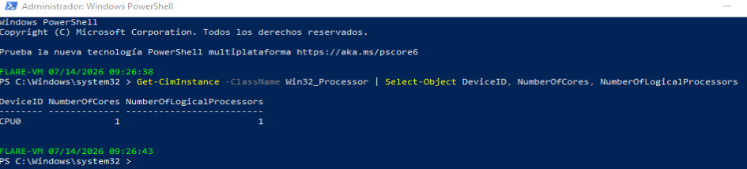

----

Abrimos la versión de 64 bits de `Al-Khaser` con `x64dbg` y modificamos la línea de comandos del proceso para añadir:
```
"C:\Laboratorio\al-khaser.exe" --check GEN_SANDBOX
```
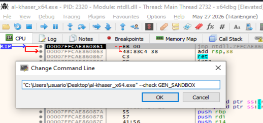


--------

Localizamos la técnica mediante `strings`: Cuando `x64dbg` se detenga en el punto de entrada (OEP), en la ventana `CPU`, pulsamos con el botón derecho sobre el desensamblado y seleccionamos
```
Search for
    → Current Module
        → String references
```
Buscamos estas cadenas Unicode:
```
Win32_Processor
NumberOfCores
```

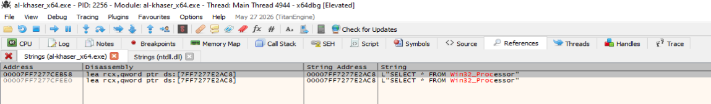


---------


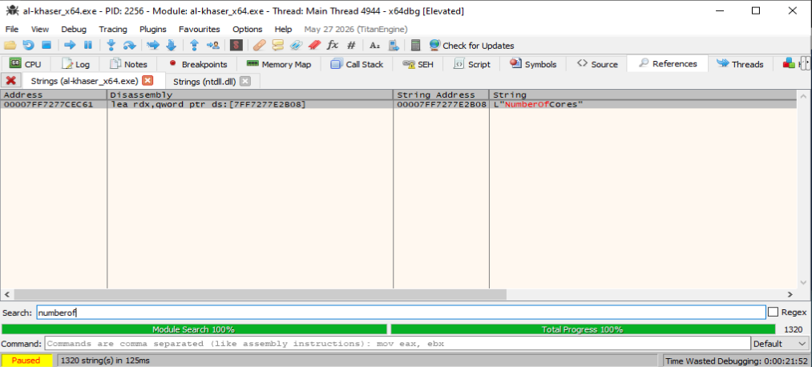

La referencia a `NumberOfCores`, nos permitirá localizar la llamada a `exec_check` y, desde ella, la dirección de la función `number_cores_wmi`.

----------

La cadena WQL:

En la primera referencia `Win32_Processor` hacemos doble click sobre ella para ir a la instrucción y colocamos un breakpoint:

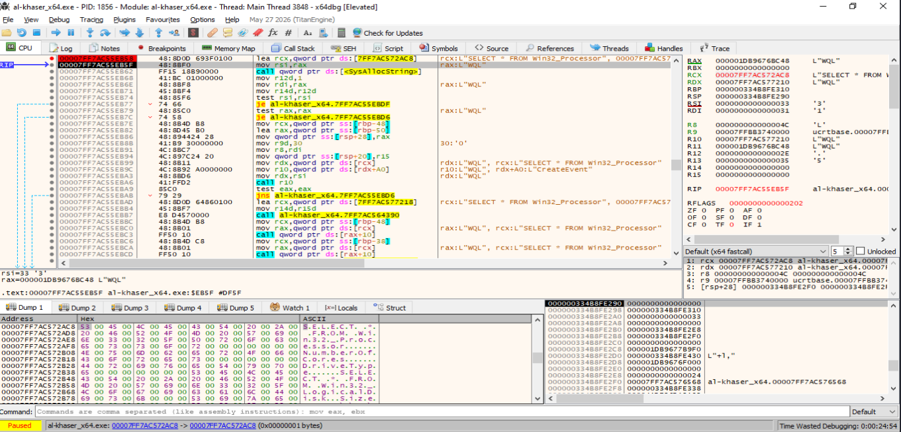

Vemos en este captura cómo se hace la recuperación dinámica de la consulta `WQL` en `x64dbg`.

La captura muestra el momento en el que Al-Khaser prepara la consulta WMI
utilizada para obtener información sobre el procesador. El depurador se
encuentra detenido dentro del módulo `al-khaser_x64.exe`, antes de la llamada a
`SysAllocString` que transformará la consulta en una cadena `BSTR` compatible
con COM.

La instrucción relevante es:

```asm
lea rcx, qword ptr ds:[7FF7AC572AC8]
```

Esta instrucción carga en `RCX` la dirección de la cadena Unicode:

```text
SELECT * FROM Win32_Processor
```

La cadena puede observarse tanto en el comentario del desensamblado como en la ventana **Dump**, donde aparece codificada en `UTF-16`.


**Interpretación de los registros:**
En el momento de la captura se observan los siguientes valores:

| Registro | Contenido | Interpretación |
|---|---|---|
| `RCX` | Dirección de `SELECT * FROM Win32_Processor` | Consulta que se convertirá en `BSTR` |
| `RAX` | Puntero a `L"WQL"` | Resultado de una llamada anterior a `SysAllocString` |
| `R14` | Puntero a `L"WQL"` | Lenguaje utilizado por la consulta |
| `RIP` | Código de preparación de la consulta | Punto anterior a `SysAllocString` |

El registro `RCX` contiene el primer argumento de la siguiente llamada:
```asm
call qword ptr ds:[SysAllocString]
```

Según la convención de llamada x64 de Windows, el primer argumento se transmite mediante `RCX`. Por tanto, la llamada equivale conceptualmente a:
```cpp
BSTR query = SysAllocString(
    L"SELECT * FROM Win32_Processor"
);
```

La cadena `WQL`, visible en `RAX` y `R14`, ya había sido convertida previamente en otro `BSTR`. Ambos valores serán utilizados posteriormente en la llamada a `IWbemServices::ExecQuery`.

**Flujo demostrado en la captura**
```text
Cadena estática "WQL"
        ↓
SysAllocString
        ↓
BSTR con el lenguaje WQL
        ↓
Cadena estática
"SELECT * FROM Win32_Processor"
        ↓
SysAllocString
        ↓
BSTR con la consulta
        ↓
IWbemServices::ExecQuery
```

**La consulta solicita todas las propiedades expuestas por la clase:**

```text
Win32_Processor
```

A continuación el malware extrae una propiedad concreta del objeto devuelto por la consulta:
```text
NumberOfCores
```

Al-Khaser recorrerá posteriormente los objetos devueltos y recuperará esa propiedad para comprobar si el sistema dispone de menos de dos núcleos.


El flujo es este:
```
1. Al-Khaser ejecuta una consulta WQL
   SELECT * FROM Win32_Processor

2. WMI devuelve una o varias instancias de Win32_Processor

3. Al-Khaser recorre esas instancias con Next()

4. Para cada instancia solicita:
   Get("NumberOfCores")

5. Obtiene el valor, por ejemplo:
   NumberOfCores = 1

6. Compara:
   1 < 2

7. Activa la detección
```

La consulta:
```
SELECT * FROM Win32_Processor
```
significa:
```
Devuelve las instancias de Win32_Processor con todas sus propiedades disponibles.
```

Una instancia puede contener propiedades como:
```
DeviceID
Name
Manufacturer
ProcessorId
NumberOfCores
NumberOfLogicalProcessors
MaxClockSpeed
Architecture
```

Sin embargo, en la `API COM` el programa no recibe necesariamente una tabla ya impresa con todos esos valores. Recibe objetos `IWbemClassObject` y va leyendo las propiedades que le interesan mediante `Get`.

**En resumen:** `Al-Khaser` ejecuta una consulta `WQL` sobre la clase `Win32_Processor`. La consulta devuelve una o varias instancias de dicha clase. Posteriormente, la herramienta recorre los objetos obtenidos y recupera de cada instancia la
propiedad `NumberOfCores`, cuyo valor compara con el umbral de dos núcleos.


**Relevancia de la evidencia:** La captura demuestra dinámicamente que la herramienta:
1. Utiliza el lenguaje de consultas `WQL`.
2. Construye la consulta `SELECT * FROM Win32_Processor`.
3. Prepara sus argumentos mediante cadenas `BSTR`.
4. Se dispone a ejecutar una consulta sobre la clase `Win32_Processor`.

Esta evidencia no demuestra todavía el valor de `NumberOfCores`, ya que la captura corresponde a la fase de construcción de la consulta. Para completar la demostración documentaremos también:
- La llamada a `IWbemServices::ExecQuery`.
- El valor `HRESULT` devuelto.
- La recuperación de `NumberOfCores`.
- El contenido del `VARIANT`.
- La comparación con el umbral de dos núcleos.
- La activación del resultado positivo.


----


En la referencia `NumberOfCores` hacemos doble click sobre ella para ir a la instrucción y colocamos un breakpoint:

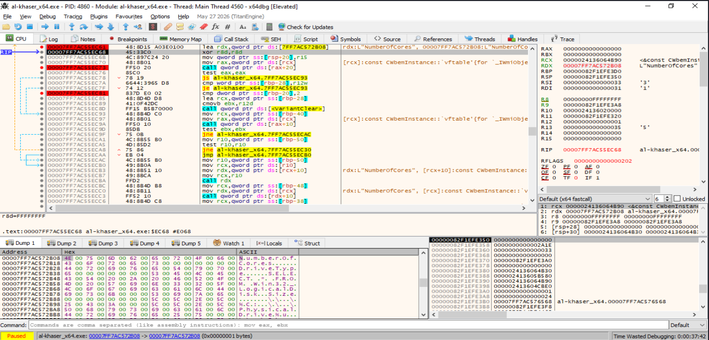

**En la captura vemos la preparación de la recuperación de `NumberOfCores`:**

La captura muestra el momento inmediatamente anterior a la llamada virtual que recupera la propiedad `WMI` `NumberOfCores`. El depurador se encuentra detenido dentro de `al-khaser_x64.exe`, después de que la dirección de la propiedad haya sido cargada en el registro `RDX`.

**La secuencia principal es:**

```asm
lea     rdx, qword ptr [NumberOfCores]
xor     r8d, r8d
mov     qword ptr [rsp+20], r15
mov     rax, qword ptr [rcx]
call    qword ptr [rax+20]
```

La primera instrucción carga la dirección de la cadena Unicode:

```text
NumberOfCores
```

En la captura puede comprobarse que:

```text
RDX → L"NumberOfCores"
```

Esta cadena identifica la propiedad que Al-Khaser pretende recuperar de la instancia devuelta por la consulta:

```sql
SELECT * FROM Win32_Processor
```

**Interpretación de los argumentos:** Según la convención de llamada x64 de Windows, los cuatro primeros argumentos se transmiten mediante `RCX`, `RDX`, `R8` y `R9`.

En la captura se observan los siguientes valores:

| Ubicación | Contenido | Interpretación |
|---|---|---|
| `RCX` | Puntero a la instancia WMI | Objeto sobre el que se invoca el método |
| `RDX` | Puntero a `L"NumberOfCores"` | Nombre de la propiedad solicitada |
| `R8D` | `0` | Flags de la operación |
| `R9` | Dirección de una variable local | Buffer de salida para el valor recuperado |
| `[RSP+20]` | `0` | Parámetro opcional nulo |

El registro `R9` contiene en esta ejecución:

```text
00000082F1EFE3A8
```

Esta dirección corresponde a una variable local ubicada en:

```text
RBP - 0x28
```

La variable se utiliza para almacenar el valor devuelto por WMI, normalmente mediante una estructura `VARIANT`.

La distribución esperada es:

```text
[RBP-28] → tipo del VARIANT
[RBP-20] → valor de NumberOfCores
```

**Llamada virtual:** La instrucción:
```asm
mov     rax, qword ptr [rcx]
call    qword ptr [rax+20]
```

obtiene la tabla virtual del objeto y ejecuta el método situado en el desplazamiento `0x20`.

La operación equivale conceptualmente a una recuperación de propiedad como:

```cpp
object->Get(
    L"NumberOfCores",
    0,
    &value,
    nullptr
);
```

El comentario automático de x64dbg identifica el objeto como una instancia relacionada con `CWbemInstance`. Por ello, la captura demuestra una llamada virtual sobre un objeto WMI o sobre un wrapper utilizado por Al-Khaser para recuperar la propiedad.

No es necesario identificar el nombre exacto del método únicamente a partir del desplazamiento de la tabla virtual. La combinación de los argumentos demuestra su finalidad:

```text
Objeto WMI
        +
Nombre "NumberOfCores"
        +
Dirección de salida en R9
        =
Recuperación de la propiedad
```

**Flujo demostrado:**
```text
Consulta de Win32_Processor
        ↓
Obtención de una instancia WMI
        ↓
Carga de L"NumberOfCores" en RDX
        ↓
Preparación del buffer de salida en R9
        ↓
Llamada virtual
        ↓
Almacenamiento del resultado en [RBP-28]
```

Después de ejecutar la llamada con `F8`, debe comprobarse:

```text
EAX = 0
```

Este valor representa normalmente una operación completada correctamente.

A continuación, el número de núcleos puede observarse en:

```text
[RBP-20]
```

En el laboratorio analizado, el valor esperado es:

```text
[RBP-20] = 1
```

**Relevancia de la evidencia:** La captura demuestra que Al-Khaser:

1. Ha recuperado una instancia de `Win32_Processor`.
2. Solicita expresamente la propiedad `NumberOfCores`.
3. Prepara una variable local para recibir el resultado.
4. Ejecuta una llamada virtual para obtener el valor.
5. Utilizará posteriormente el resultado en la comprobación anti-sandbox.

La comprobación posterior se realiza mediante:

```asm
cmp     dword ptr [rbp-20], 2
```

Por tanto, la captura representa la fase intermedia entre la consulta WQL y la
comparación del número de núcleos.


---------------


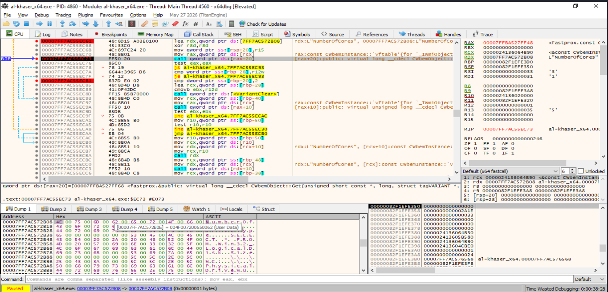

**En la captura vemos la identificación de `CWbemObject::Get` en `x64dbg`:**

La captura muestra el momento inmediatamente anterior a la ejecución del método encargado de recuperar la propiedad WMI `NumberOfCores`.

El depurador se encuentra detenido en:

```asm
00007FF7AC55EC73  call qword ptr [rax+20]
```

En esta ocasión, x64dbg ha resuelto el símbolo asociado a la entrada de la tabla virtual y muestra que la llamada corresponde a un método:

```text
CWbemObject::Get
```

Por tanto, la evidencia permite identificar de forma más precisa la operación realizada por `Al-Khaser`.


**Secuencia de instrucciones:** Las instrucciones relevantes son:

```asm
lea     rdx, qword ptr [NumberOfCores]
xor     r8d, r8d
mov     qword ptr [rsp+20], r15
mov     rax, qword ptr [rcx]
call    qword ptr [rax+20]
```

La primera instrucción carga en `RDX` la dirección de la cadena Unicode:

```text
NumberOfCores
```

A continuación, el programa prepara los argumentos y ejecuta el método virtual situado en el desplazamiento `0x20` de la tabla virtual del objeto.

**Identificación del método:** El comentario automático de `x64dbg` muestra una firma equivalente a:

```cpp
CWbemObject::Get(
    const wchar_t* propertyName,
    long flags,
    VARIANT* value,
    ...
);
```

La llamada corresponde conceptualmente a:
```cpp
wmiObject->Get(
    L"NumberOfCores",
    0,
    &propertyValue,
    nullptr,
    nullptr
);
```

Esta operación recupera el valor de la propiedad `NumberOfCores` de la instancia `Win32_Processor` obtenida previamente mediante WMI.


**Interpretación de los registros:** En el momento de la captura se observan los siguientes argumentos:

| Registro o posición | Valor | Interpretación |
|---|---|---|
| `RCX` | Puntero a una instancia `CWbemInstance` | Objeto WMI sobre el que se invoca `Get` |
| `RDX` | Puntero a `L"NumberOfCores"` | Nombre de la propiedad |
| `R8D` | `0` | Flags de la operación |
| `R9` | `00000082F1EFE3A8` | Dirección de la estructura `VARIANT` de salida |
| `[RSP+20]` | `0` | Parámetro opcional nulo |
| `[RSP+28]` | `0` | Parámetro opcional nulo |

Según la convención de llamada x64 de Windows, los cuatro primeros argumentos se transmiten mediante:

```text
RCX
RDX
R8
R9
```

La dirección almacenada en `R9` coincide con:

```text
RBP - 0x28
```

Por tanto:

```text
R9 = &propertyValue
```

**Nota: Estructura `Variant`:** Una estructura `VARIANT` es un contenedor de Windows capaz de almacenar valores de distintos tipos. Incluye principalmente:
```
vt      → indica el tipo del dato
valor   → contiene el dato real
```


Representación:
```text
RBP-28                         RBP-20
   │                              │
   ▼                              ▼
+----------+----------------------+----------------------+
| tipo `vt`| campos reservados    | valor de la propiedad|
+----------+----------------------+----------------------+
```


**Estructura de salida:** El método almacenará el resultado en una estructura `VARIANT` situada en:
```text
[RBP-28] → vt → tipo del VARIANT
[RBP-20] → valor → valor de NumberOfCores
```

En este laboratorio el valor esperado es:
```text
[RBP-28] = VT_I4 → entero
[RBP-20] = 1 → NumberOfCores = 1
```

Después de ejecutar la llamada con `F8`, debemos comprobar:
```text
EAX = 0
```

Este resultado representa normalmente:

```text
S_OK
```

y confirma que la propiedad se recuperó correctamente.

**Flujo demostrado en la captura:**

```text
Consulta de Win32_Processor
        ↓
Obtención de una instancia WMI
        ↓
Carga de L"NumberOfCores" en RDX
        ↓
Preparación del VARIANT en R9
        ↓
CWbemObject::Get
        ↓
Valor almacenado en [RBP-20]
```

La comprobación posterior utiliza:

```asm
cmp     dword ptr [rbp-20], 2
```

De esta forma, Al-Khaser determina si el sistema presenta menos de dos núcleos.


**Relevancia de la evidencia:** La captura demuestra que Al-Khaser:

1. Opera sobre una instancia WMI.
2. Solicita expresamente la propiedad `NumberOfCores`.
3. Utiliza el método `CWbemObject::Get`.
4. Proporciona una estructura `VARIANT` para recibir el resultado.
5. Almacena el valor en una variable local.
6. Utilizará ese valor en la comprobación anti-sandbox.

La resolución del símbolo `CWbemObject::Get` aporta una evidencia más precisa que la mera observación de una llamada indirecta a `[rax+20]`.

------


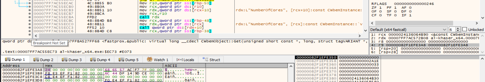


**Contenido del Dump:** La ventana **Dump** está posicionada en:

```text
00000082F1EFE3A8
```

que es la dirección contenida en `R9`.

En esta captura, la llamada todavía no ha sido ejecutada. Por ello, los bytes que aparecen en esa dirección:

```text
24 00 00 00 ...
```
no deben interpretarse todavía como el tipo y el valor definitivos de `NumberOfCores`. Contiene un estado previo del objeto `VARIANT`.

La evidencia válida debe recogerse **después** de ejecutar el siguente `call` con `F8`:
```asm
call qword ptr [rax+20]
```


**Flujo demostrado:**

```text
RDX → L"NumberOfCores"
        ↓
R9 → variable de salida en [RBP-28]
        ↓
CWbemObject::Get
        ↓
VARIANT actualizado
        ↓
Valor disponible en [RBP-20]
```

**Relevancia de la captura:** La captura demuestra:

1. El nombre exacto de la propiedad consultada.
2. La instancia WMI utilizada.
3. La preparación de una variable de salida.
4. La dirección exacta donde se almacenará el resultado.
5. La llamada al método `CWbemObject::Get`.

Sin embargo, la imagen representa el estado **anterior** a la ejecución del método. Por ese motivo, el contenido visible en el Dump no debe utilizarse como prueba del número de núcleos hasta ejecutar la llamada y comprobar el valor devuelto.


----

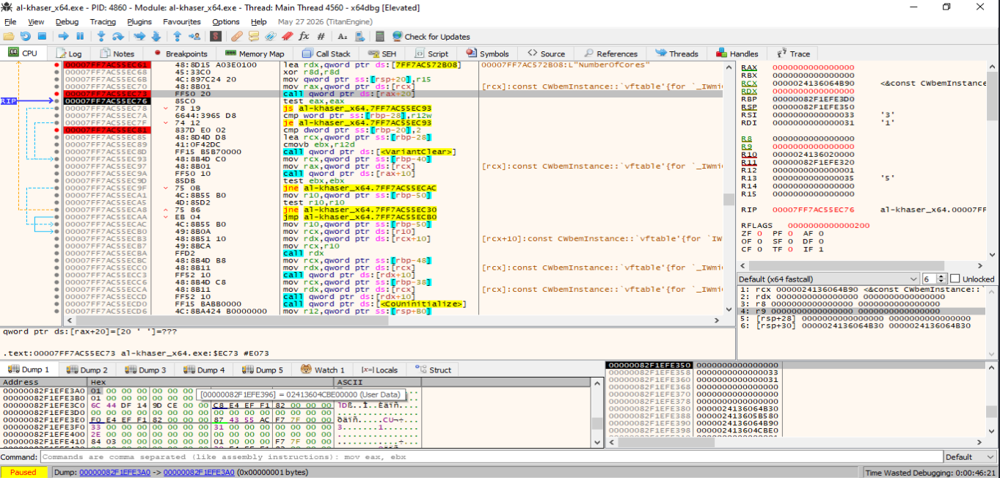


Estamos en:
```
00007FF7AC55EC73  call qword ptr [rax+20]
00007FF7AC55EC76  test eax,eax        ; RIP actual
```

Y en los registros:
```
EAX = 0
RBP = 00000082F1EFE3D0
```

En ese momento el `VARIANT` ya contiene el resultado. Por tanto:
```
RBP-28 = 00000082F1EFE3A8  → inicio del VARIANT
RBP-20 = 00000082F1EFE3B0  → valor de NumberOfCores
```

La captura corresponde al momento inmediatamente posterior a la llamada encargada de recuperar la propiedad `NumberOfCores`. El registro `RIP` se encuentra en la instrucción `test eax, eax`, lo que demuestra que la llamada virtual anterior ya ha finalizado. El valor `EAX = 0` indica que la operación se completó correctamente. Como `R9` apuntaba previamente a la variable local situada en `[RBP-28]`, en este momento la estructura `VARIANT` ya contiene el resultado devuelto por `WMI`. El tipo se almacena en `[RBP-28]` y el valor numérico de `NumberOfCores` aparece en `[RBP-20]`, donde se observa el valor `1`.


**Estructura VARIANT:**
```
Fila E3A0:
01 00 00 00 00 00 00 00 | 03 00 00 00 00 00 00 00
↑ E3A0, dato ajeno          ↑ E3A8, VARIANT.vt = VT_I4

Fila E3B0:
01 00 00 00 00 00 00 00
↑ E3B0, NumberOfCores = 1
```


----

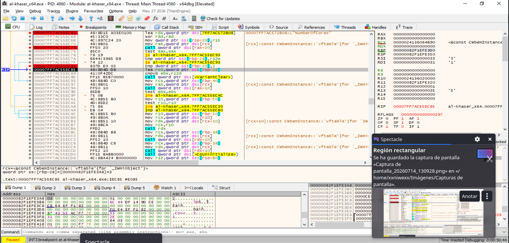

**En la captura vemos la comparación de `NumberOfCores` con el umbral anti-sandbox:**

La captura muestra el momento inmediatamente posterior a la comparación del número de núcleos recuperado mediante WMI.

La instrucción que acaba de ejecutarse es:

```asm
cmp     dword ptr [rbp-20], 2
```

El registro de instrucción se encuentra ahora en:

```asm
lea     rcx, qword ptr [rbp-28]
```

Por tanto, los indicadores de estado visibles en `RFLAGS` corresponden al resultado de la comparación anterior.


**Valor recuperado mediante WMI:** En la ventana **Dump** puede observarse:
```text
03 00 00 00 00 00 00 00 01 00 00 00 00 00 00 00
↑ 00000082F1EFE3A8
│                       │
└─ tipo VT_I4           └─ NumberOfCores = 1
```


**Interpretación de la comparación:** La instrucción ejecutada ha sido:

```asm
cmp     dword ptr [rbp-20], 2
```

Conceptualmente, equivale a:

```text
CMP 1, 2
```

o, expresado como condición:

```cpp
NumberOfCores < 2
```

Como el sistema dispone de un único núcleo:

```text
1 < 2 → verdadero
```


**Estado de los indicadores:** En el panel de registros se observa:

```text
CF = 1
ZF = 0
```

El indicador `CF` se activa porque el primer operando es inferior al segundo en una comparación sin signo.


**Conservación de los indicadores:** Después del `cmp` aparece:

```asm
lea     rcx, qword ptr [rbp-28]
```

La instrucción `LEA` calcula una dirección, pero no modifica los indicadores de
estado.

Por tanto, cuando se ejecute la instrucción posterior:

```asm
cmovb   ebx, r12d
```

el valor de `CF` seguirá siendo `1`.


**Activación de la detección mediante `CMOVB`:** En la captura se observan los valores:

```text
RBX  = 0
R12D = 1
CF   = 1
```

La instrucción:

```asm
cmovb   ebx, r12d
```

significa:

```text
Mover si es inferior
```

La condición de `CMOVB` se cumple cuando:

```text
CF = 1
```

Por tanto, después de ejecutar la instrucción:

```text
EBX = R12D
EBX = 1
```

La lógica equivalente es:

```cpp
if (NumberOfCores < 2)
{
    detected = true;
}
```


**Flujo demostrado en la captura:**

```text
CWbemObject::Get("NumberOfCores")
        ↓
VARIANT de tipo VT_I4
        ↓
NumberOfCores = 1
        ↓
CMP [RBP-20], 2
        ↓
CMP 1, 2
        ↓
CF = 1
        ↓
CMOVB copia 1 en EBX
        ↓
Detección positiva
```


**Relevancia de la evidencia:** La captura demuestra de forma dinámica que:

1. WMI devolvió un entero de 32 bits.
2. El valor recuperado fue un núcleo.
3. Al-Khaser comparó ese valor con el umbral de dos.
4. La comparación estableció `CF = 1`.
5. La condición utilizada por `CMOVB` quedó activada.
6. La herramienta marcará el entorno como sospechoso.

Esta evidencia relaciona directamente:

```text
Consulta WMI
        +
Valor recuperado
        +
Comparación
        +
Decisión anti-sandbox
```


----

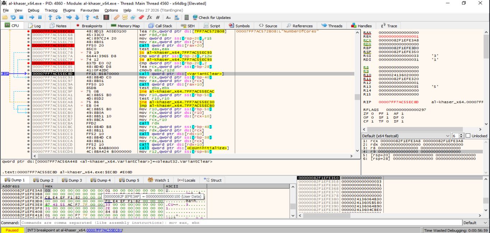


**En la captura vemos la activación de la detección y limpieza del `VARIANT`:**

La captura muestra el momento posterior a la comparación del número de núcleos y a la ejecución de la instrucción condicional encargada de activar el resultado positivo.

El registro de instrucción se encuentra en:

```asm
00007FF7AC55EC8D  call qword ptr ds:[VariantClear]
```

Por tanto, las instrucciones anteriores ya han sido ejecutadas:

```asm
cmp     dword ptr [rbp-20], 2
lea     rcx, qword ptr [rbp-28]
cmovb   ebx, r12d
```

La captura permite comprobar que la condición anti-sandbox se ha cumplido y que Al-Khaser se dispone a liberar la estructura `VARIANT` utilizada para almacenar el resultado de WMI.

`RCX` apunta a la estructura `VARIANT` que contiene el valor recuperado. La llamada equivale conceptualmente a:

```cpp
VariantClear(&propertyValue);
```

`VariantClear` libera los recursos internos del `VARIANT` y restablece su contenido. Esta operación se realiza después de que Al-Khaser haya utilizado el valor de `NumberOfCores`.


-----


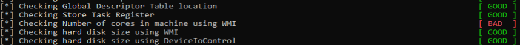

**En la captura vemos la confirmación del resultado positivo en la consola de Al-Khaser:**

La captura muestra la salida final de Al-Khaser después de ejecutar la comprobación WMI basada en el número de núcleos del procesador.

La línea relevante es:

```text
[*] Checking Number of cores in machine using WMI        [ BAD ]
```

Este resultado confirma que la técnica anti-sandbox produjo una detección positiva.


indica que la comprobación ha encontrado una condición compatible con un entorno de análisis, sandbox o máquina virtual.

**Relación con el análisis en x64dbg:** La salida de consola confirma el resultado observado previamente en el depurador:

```text
SELECT * FROM Win32_Processor
        ↓
Get("NumberOfCores")
        ↓
VARIANT de tipo VT_I4
        ↓
NumberOfCores = 1
        ↓
CMP 1, 2
        ↓
CF = 1
        ↓
CMOVB establece EBX = 1
        ↓
Resultado [BAD]
```


-----

### 5.13.2. Consulta del tamaño del disco


```
Get-CimInstance -ClassName Win32_LogicalDisk |
    Select-Object DeviceID,
                  DriveType,
                  Size,
                  @{Name="SizeGiB";
                    Expression={[math]::Round($_.Size / 1GB, 2)}}
```

Obteniendo:
```
DeviceID DriveType         Size SizeGiB
-------- ---------         ---- -------
C:               3  96019763200   89,43
D:               5     58843136    0,05
Z:               4 493839982592  459,92
```


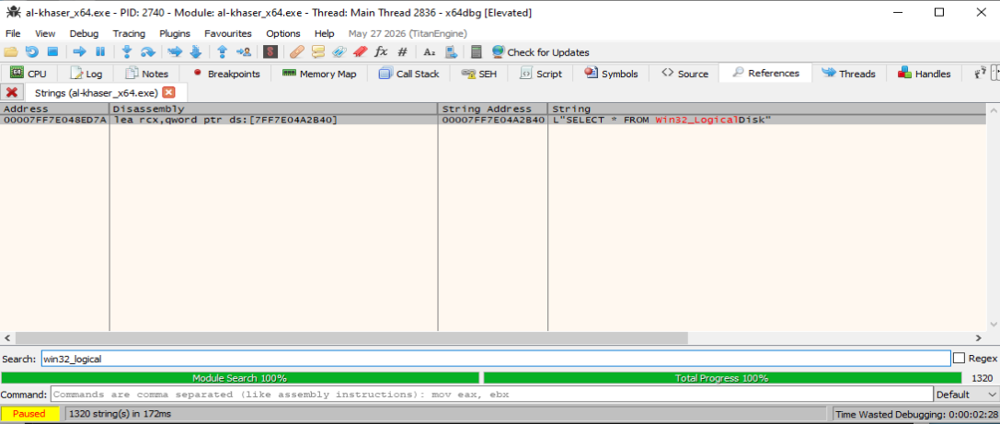


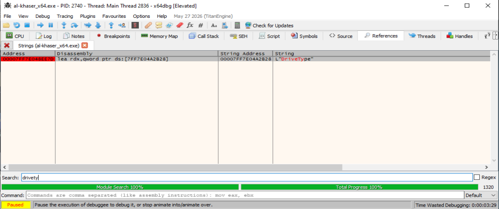


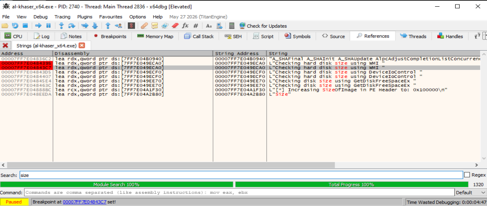


---


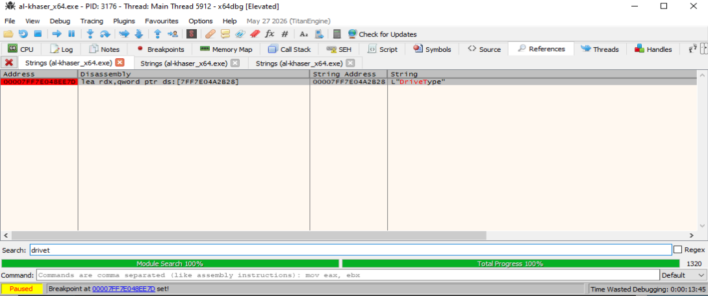

Durante el análisis dinámico se identificó la función responsable de la comprobación del tamaño del disco mediante WMI. En al-khaser_x64+AED22, la rutina carga el namespace ROOT\CIMV2 y llama a una función auxiliar de inicialización de WMI. Posteriormente crea las cadenas WQL y SELECT * FROM Win32_LogicalDisk, preparando una llamada compatible con el método IWbemServices::ExecQuery. La consulta permite enumerar los discos lógicos visibles desde el sistema operativo invitado, sobre los que posteriormente se recuperan propiedades como el tipo y la capacidad total del volumen. Esta evidencia confirma que la técnica se basa en WMI y en la clase Win32_LogicalDisk, no en el acceso directo al disco físico del sistema anfitrión.

----


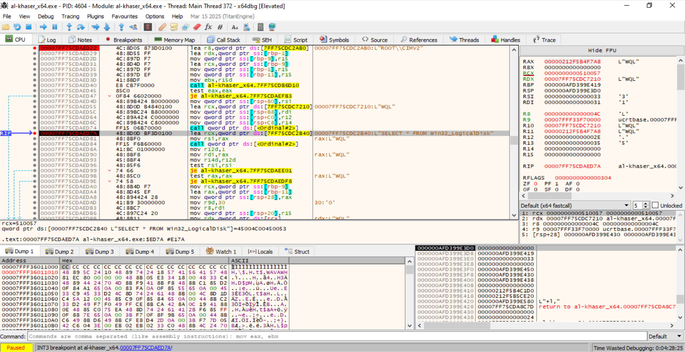

Tras inicializar la conexión con el namespace ROOT\CIMV2, la rutina crea dinámicamente dos cadenas de tipo BSTR. La primera contiene el lenguaje de consulta WQL, mientras que la segunda contiene la sentencia SELECT * FROM Win32_LogicalDisk. En la captura, la primera llamada ya ha finalizado y RAX apunta a la cadena dinámica WQL. A continuación, la dirección de la consulta se carga en RCX para realizar una segunda asignación. Los resultados se conservan en RSI y RDI, respectivamente, y se validan mediante instrucciones test antes de preparar la ejecución de la consulta WMI. Esta secuencia confirma que al-khaser emplea la clase Win32_LogicalDisk para enumerar los volúmenes accesibles desde el sistema operativo invitado.


-----


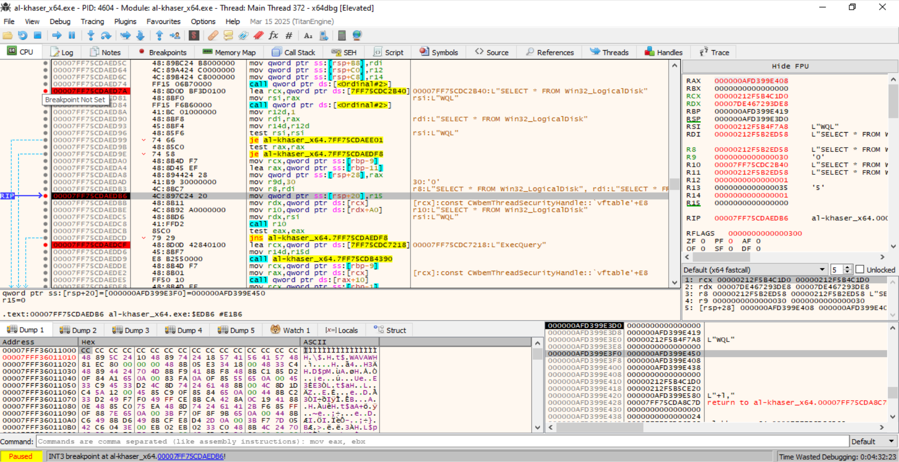

La rutina prepara una llamada al método IWbemServices::ExecQuery mediante la tabla virtual del objeto COM. En el momento capturado, RSI contiene la cadena BSTR WQL, mientras que RDI y R8 apuntan a la consulta SELECT * FROM Win32_LogicalDisk. El método se obtiene desde el desplazamiento 0xA0 de la tabla virtual, correspondiente a ExecQuery. Como argumentos adicionales, la función utiliza los flags 0x30, un contexto nulo y la dirección de una variable local destinada a recibir un objeto IEnumWbemClassObject. Tras la llamada, el HRESULT se comprueba mediante test eax,eax y jns, continuando únicamente cuando el resultado no es negativo. La secuencia confirma dinámicamente que al-khaser consulta mediante WMI los discos lógicos disponibles en el sistema operativo invitado.


-----

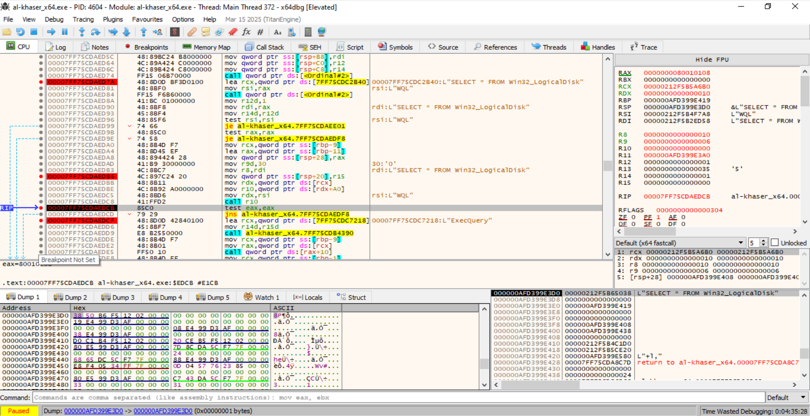


Vemos que la llamada a `IWbemServices::ExecQuery` se ha ejecutado, pero ha fallado. Tras ejecutar el método IWbemServices::ExecQuery, el registro EAX contiene el valor 0x80010108, correspondiente al error `COM` `RPC_E_DISCONNECTED`. La comprobación test eax,eax establecerá el indicador de signo y evitará que se tome el salto jns asociado a la ruta de éxito. Además, la variable local destinada a recibir el objeto IEnumWbemClassObject permanece a cero, por lo que la consulta SELECT * FROM Win32_LogicalDisk no ha producido un enumerador válido. La captura demuestra el intento de consulta WMI, pero no permite observar la recuperación de la propiedad Size ni la comparación del volumen con el umbral anti-VM.

La ejecución analizada demuestra el mecanismo empleado por al-khaser para iniciar la consulta WMI sobre Win32_LogicalDisk. Sin embargo, la llamada a ExecQuery finaliza con el error RPC_E_DISCONNECTED, por lo que no se obtiene un enumerador válido y no llega a ejecutarse la recuperación ni la comparación de la propiedad Size.


En resumen: la demostración de la consulta WMI sí queda acreditada; la demostración completa de la comprobación del tamaño del disco todavía no.

------

Eliminamos todos los breakpoints. Colocamos un breakpoint justo después de call r10 y ejecutamos directamente con F9, evitando recorrer paso a paso las funciones COM:

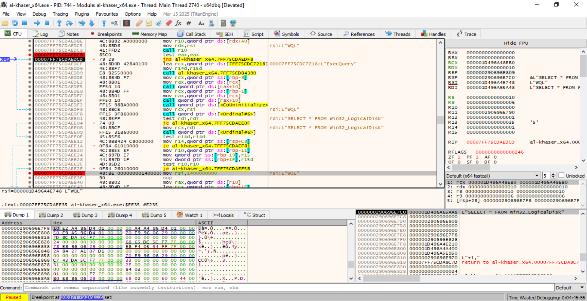


Esta vez la consulta WMI ha funcionado correctamente. Ahora
```
EAX = 00000000
```

El valor 0 corresponde a una ejecución satisfactoria de IWbemServices::ExecQuery.

Además, después de test eax,eax:
```
ZF = 1
SF = 0
```

Como jns salta cuando SF=0, el salto hacia AEDF8 se tomará. Es la ruta de éxito.

----


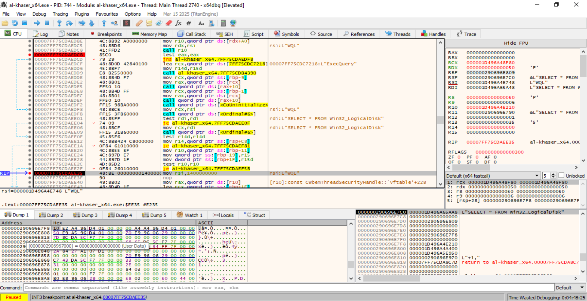


Ese breakpoint corresponde a:

```bash
00007FF75CDAEE35  mov rsi,1400000000
```

Esta instrucción carga el umbral utilizado para la comprobación:

```bash
0x0000001400000000
= 85.899.345.920 bytes
= 80 GiB
```

Todavía falta demostrar que recupera la propiedad Size y que compara el valor recuperado con ese umbral.

-----

buscamos en x64dbg: `Size`

Ruta habitual:

`CPU → clic derecho → Search for → Current Module → String references`

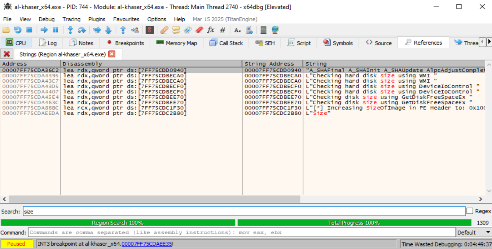

La referencia al-khaser_x64+EEDA pertenece a la misma función disk_size_wmi, que comenzó aproximadamente en al-khaser_x64+AED00.
```bash
00007FF75CDAEEDA  lea rcx,qword ptr ds:[7FF75CDC2B80]
                                      ; L"Size"
```

La cadena:

```bash
L"Size"
```

es el nombre de la propiedad que al-khaser solicita a cada objeto Win32_LogicalDisk.

-----


Eliminamos los breakpoints y colocamos un breakpoint en `00007FF75CDAEEDA`. Pulsamos `F9` para llegar a este breakpoint.

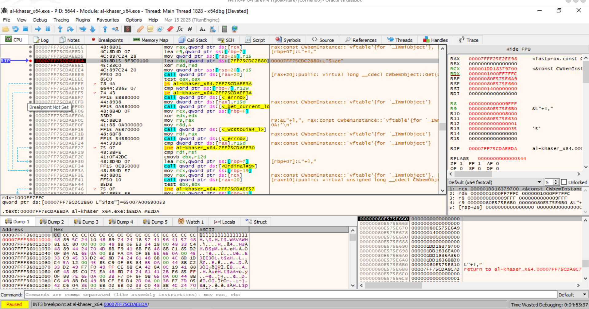

hemos llegado al núcleo exacto de la comprobación del tamaño del disco. Esta captura permite reconstruir toda la lógica: recuperación de Size, conversión a entero, comparación con 80 GiB y activación del resultado anti-VM.


Una vez obtenido cada objeto Win32_LogicalDisk, al-khaser invoca el método IWbemClassObject::Get con la propiedad Size. El valor se recibe en una estructura VARIANT y, si no es nulo, su campo bstrVal se convierte a un entero de 64 bits mediante _wcstoui64_l, utilizando base decimal. El resultado se almacena en RDI y se compara con la constante cargada en RSI, 0x1400000000, equivalente a 80 GiB. Finalmente, la instrucción cmovb ebx,r12d establece el indicador de detección a uno cuando el tamaño recuperado es inferior al umbral. Esta secuencia demuestra que al-khaser considera sospechoso un disco lógico visible desde el sistema invitado cuya capacidad total sea menor de 80 GiB.

------

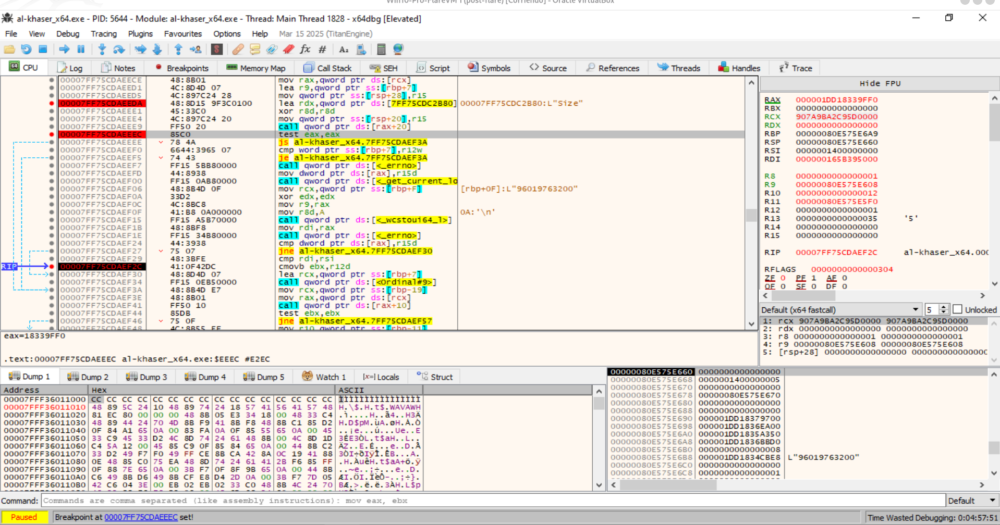

La propiedad WMI Size ha devuelto la cadena:
```bash
L"96019763200"
```

Es decir:

```bash
96.019.763.200 bytes
≈ 89,43 GiB
```

Después de la llamada a:

```bash
call qword ptr [<_wcstoui64_l>]
```

el valor convertido se almacena en RDI:

```bash
RDI = 000000165B395000
    = 96.019.763.200 bytes
```

El umbral cargado anteriormente permanece en RSI:

```bash
RSI = 0000001400000000
    = 85.899.345.920 bytes
    = 80 GiB
```

Comparación final: La rutina acaba de ejecutar:
```bash

cmp rdi,rsi
```

Por tanto, compara:

```bash
96.019.763.200 bytes  frente a  85.899.345.920 bytes
89,43 GiB             frente a  80 GiB
```

Esta comprobación concreta no la considera sospechosa, porque el disco lógico expuesto a la VM supera los 80 GiB.

Tras recuperar la propiedad Size del objeto Win32_LogicalDisk, WMI devuelve el valor 96019763200 en forma de cadena Unicode. Al-khaser convierte dicha cadena a un entero sin signo de 64 bits mediante _wcstoui64_l, almacenando el resultado en RDI como 0x165B395000, equivalente aproximadamente a 89,43 GiB. Posteriormente compara este valor con la constante almacenada en RSI, 0x1400000000, correspondiente a 80 GiB. La instrucción cmovb ebx,r12d únicamente activa el indicador de detección cuando el tamaño obtenido es inferior al umbral. En la ejecución analizada, RDI es superior a RSI, por lo que el indicador permanece a cero y la técnica no clasifica el entorno como sospechoso.


------

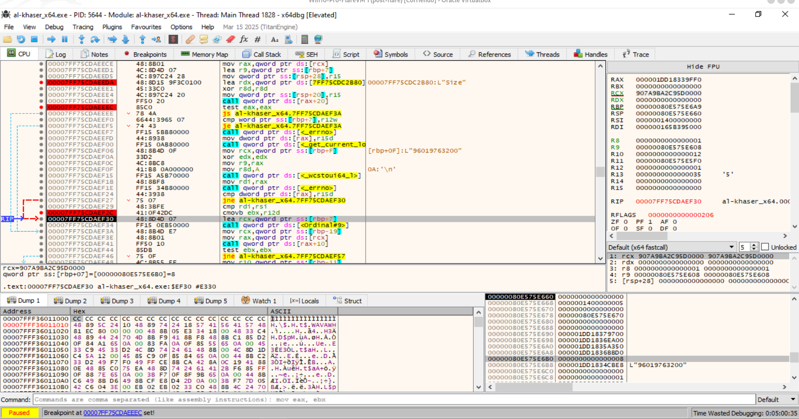

En los registros se observa:

```bash
RDI = 000000165B395000
RSI = 0000001400000000
R12 = 0000000000000001
RBX = 0000000000000000
```

Tras convertir la propiedad Size obtenida mediante WMI, al-khaser almacena en RDI el valor 0x165B395000, equivalente a 96.019.763.200 bytes, aproximadamente 89,43 GiB. El valor se compara con el umbral almacenado en RSI, 0x1400000000, correspondiente a 80 GiB. Como el tamaño recuperado es superior al umbral, la comparación deja la bandera CF a cero y la instrucción cmovb ebx,r12d no se ejecuta de forma efectiva. En consecuencia, EBX permanece a cero, indicando que esta técnica concreta no considera sospechoso el entorno analizado.


-------

### 5.13.3. Consulta de la BIOS

Vamos a analizar la consulta del número de serie de la BIOS mediante WMI, que es distinta de las comprobaciones del registro o de las tablas SMBIOS.

La secuencia que buscamos es:

```bash
ROOT\CIMV2
    ↓
SELECT * FROM Win32_BIOS
    ↓
IWbemServices::ExecQuery
    ↓
IEnumWbemClassObject::Next
    ↓
IWbemClassObject::Get(L"SerialNumber")
    ↓
comparación con indicadores de virtualización
    ↓
resultado booleano
```

Al-khaser incluye esta técnica como serial_number_bios_wmi: consulta Win32_BIOS, recupera la propiedad SerialNumber y analiza el texto obtenido buscando valores asociados con entornos virtualizados. La clase Win32_BIOS representa los atributos de la BIOS visibles para Windows.

localizar la llamada principal

Reiniciamos al-khaser y en x64dbg abrimos:

```bash
CPU → clic derecho → Search for
→ Current Module
→ String references
```

Busca primero:

```bash
SerialNumber from BIOS
```

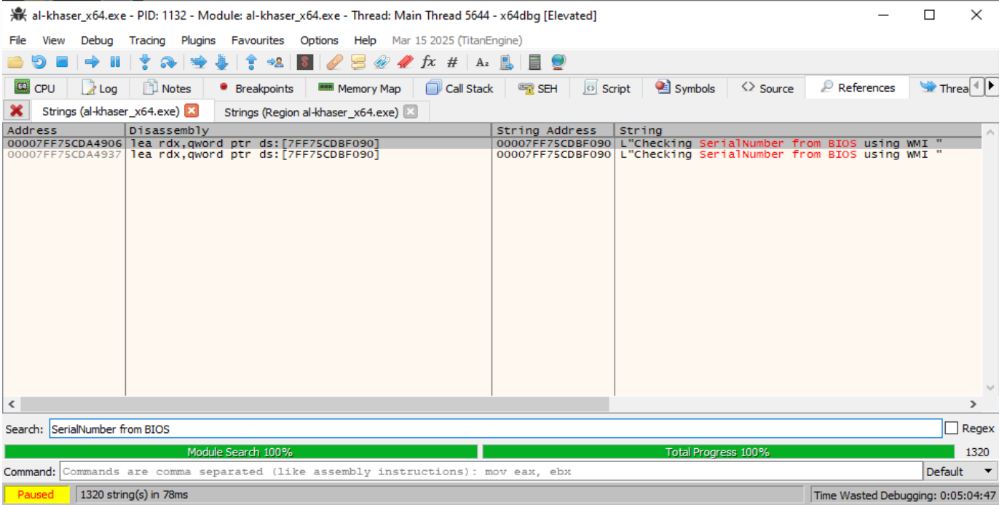


Las dos referencias están muy próximas, separadas por 0x31 bytes, por lo que probablemente pertenecen al mismo bloque de control o a dos rutas adyacentes de impresión. No conviene asumir todavía cuál conduce a la comprobación real. La primera llamada tras el lea rdx será normalmente la función de impresión. No es la comprobación de BIOS.

-----


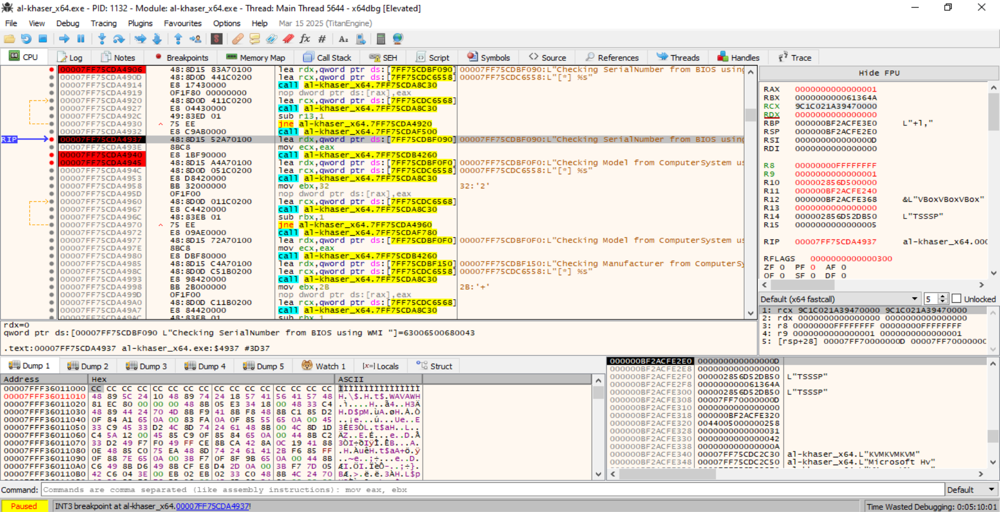


Ya podemos afirmar que:
- existe una comprobación denominada Checking SerialNumber from BIOS using WMI;
- la rutina encargada se encuentra en al-khaser_x64+ADF500;
- la función devuelve su resultado en EAX;
- en esta ejecución devuelve 1;
- el resultado se pasa en ECX a una función de presentación.

Sin embargo, todavía no se ve:
- la consulta SELECT * FROM Win32_BIOS;
- la propiedad SerialNumber;
- el número de serie obtenido;
- el patrón con el que se compara;
- la condición exacta que provoca el retorno 1.


---------------


Colocamos un breakpoint directamente en la entrada de la función:

```bash
00007FF75CDADF500
```

Para ello hacemos doble click en la instrucción:
```bash
call al-khaser_x64.7FF75CDADF500
```

Colocamos el Breakpoint. Eliminamos el breakpoints anteriores, reiniciamos al-khaser, y ejecutamos con F9:


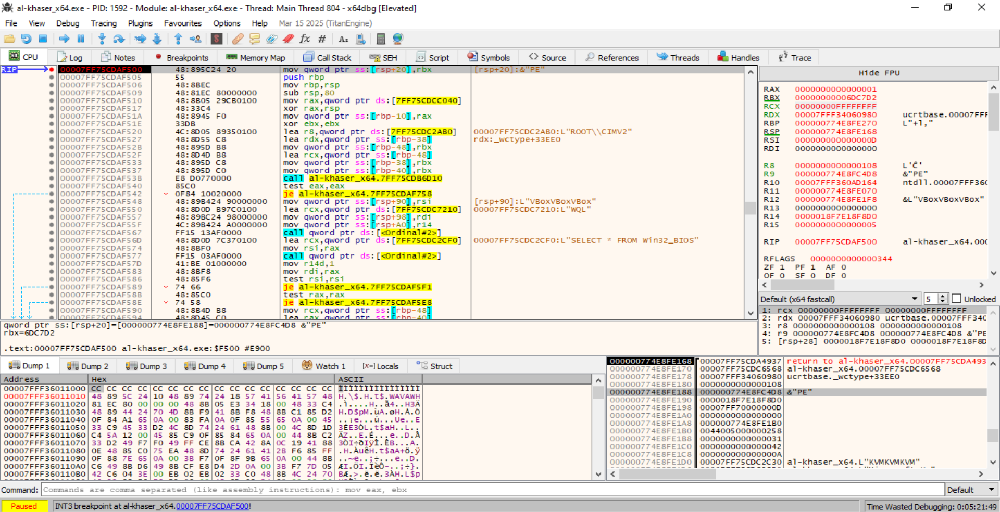


Hemos entrado en la función correcta para consultar el número de serie de la BIOS mediante WMI:
```bash
al-khaser_x64+ADF500
```

La función situada en al-khaser_x64+ADF500 inicializa una conexión WMI con el namespace ROOT\CIMV2. Posteriormente crea dos cadenas BSTR: WQL como lenguaje de consulta y SELECT * FROM Win32_BIOS como sentencia destinada a enumerar la información de la BIOS expuesta al sistema operativo. Las asignaciones se validan antes de preparar la llamada a IWbemServices::ExecQuery. Esta captura confirma la consulta de la clase Win32_BIOS, aunque todavía no muestra la recuperación ni el análisis de la propiedad SerialNumber.

-------

Colocamos un breakpoint inmediatamente después de `call r10` y ejecuta con `F9`:

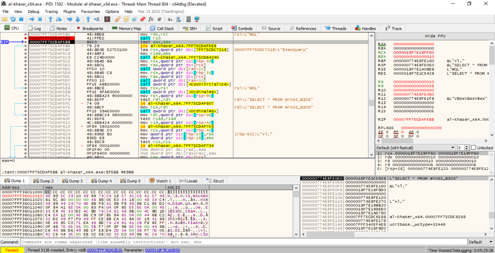


Estamos justo despues de ejecutar `IWbemServices::ExecQuery` para la `BIOS`. Comprobamos que la consulta de la BIOS mediante WMI se ha ejecutado correctamente.

La llamada a IWbemServices::ExecQuery se ejecuta utilizando el lenguaje WQL y la consulta SELECT * FROM Win32_BIOS. Tras la llamada, EAX contiene 0x00000000, correspondiente a S_OK. Asimismo, la variable local situada en [RBP-0x38] contiene un puntero no nulo a un objeto IEnumWbemClassObject. Esto confirma que la consulta WMI se ha completado correctamente y que al-khaser dispone de un enumerador válido para recuperar las propiedades de la BIOS.

------


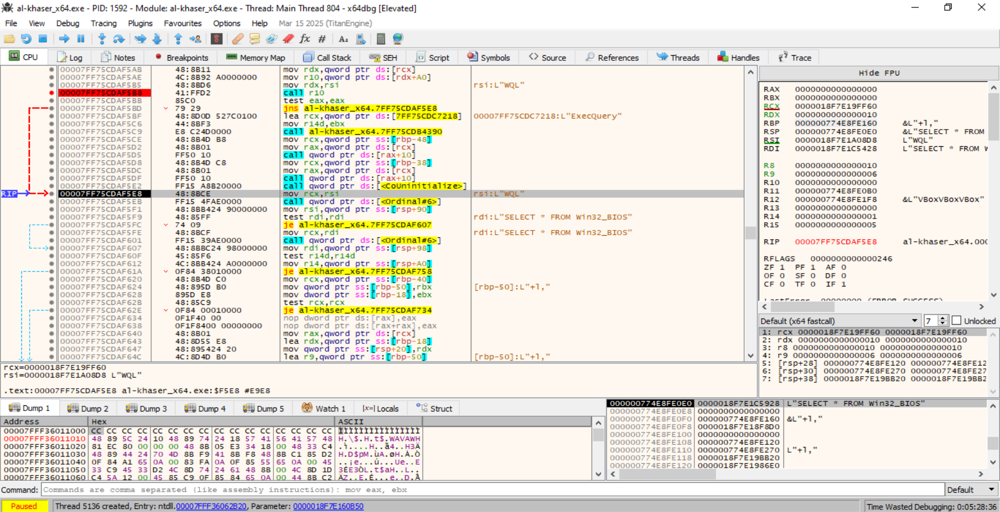

Esta captura confirma que ExecQuery ha terminado correctamente y que el flujo entra ahora en la enumeración de los objetos Win32_BIOS.

Tras completarse correctamente IWbemServices::ExecQuery, la rutina libera las cadenas BSTR utilizadas para el lenguaje WQL y la consulta SELECT * FROM Win32_BIOS. Posteriormente recupera desde la variable local [RBP-0x40] un puntero válido a IEnumWbemClassObject. El código inicializa una variable destinada a recibir un objeto IWbemClassObject y otra para almacenar el número de resultados, comenzando así la preparación de una llamada a IEnumWbemClassObject::Next. Esta secuencia confirma que al-khaser procede a recorrer los objetos BIOS devueltos por WMI.


```bash
ADF620  mov rcx,qword ptr [rbp-40]
```

Ese puntero no contiene aún el número de serie. Es un objeto IEnumWbemClassObject que permite recorrer los resultados de:

```bash
SELECT * FROM Win32_BIOS
```

Ver el objeto devuelto por Next:
```bash
mov rax,[rcx]
lea rdx,[rbp-18]
mov [rsp+20],rdx
lea r9,[rbp-50]
...
call qword ptr [...]
```

Esa llamada corresponde a algo equivalente a:

```bash
enumerator->Next(
    timeout,
    1,
    &biosObject,
    &returnedObjects
);
```

Las variables importantes son:

```bash
[RBP-50] → puntero al objeto Win32_BIOS
[RBP-18] → cantidad de objetos devueltos
```


---- 


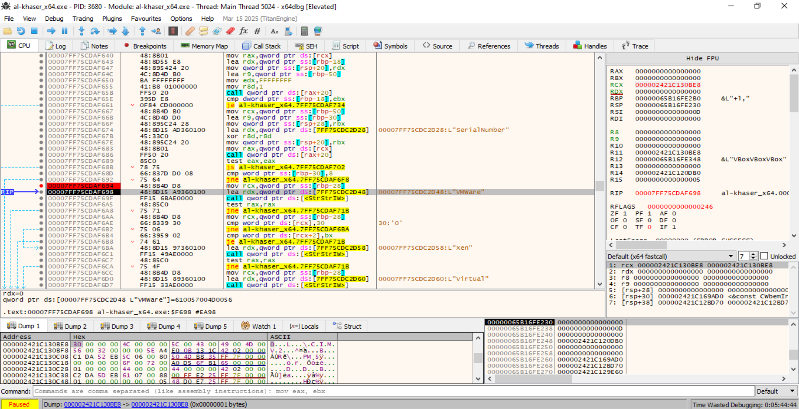


```bash
mov rcx,[rbp-28]
```
Comprobamos que ahora:
```bash
RCX = 000002421C130BE8
```
Hacemos clic derecho sobre RCX y seleccionamos:
```bash
Follow in Dump
```

En el Dump, en esa dirección, aparecen los bytes:
```bash
30 00 00 00
```

Interpretados como UTF-16LE:

```bash
30 00 → U+0030 → carácter "0"
00 00 → terminador nulo
```

Por tanto, la propiedad WMI ha devuelto:

```bash
SerialNumber = L"0"
```

```bash
Consulta WMI:       SELECT * FROM Win32_BIOS
Propiedad obtenida: SerialNumber
Tipo del VARIANT:   VT_BSTR
Valor recuperado:   "0"
Condición:           número de serie exactamente igual a "0"
Resultado:           detección positiva
```


-----

La consulta a la clase Win32_BIOS recupera la propiedad SerialNumber mediante IWbemClassObject::Get. El valor se devuelve en un VARIANT de tipo VT_BSTR, cuyo campo bstrVal apunta a la cadena Unicode "0". La rutina busca inicialmente la subcadena VMware mediante StrStrIW; al no encontrarla, comprueba de forma explícita que el primer carácter sea 0x0030 y que el siguiente sea el terminador nulo 0x0000. Al cumplirse ambas condiciones, el flujo salta a la ruta de detección positiva. De este modo, al-khaser considera sospechosa una BIOS cuyo número de serie sea exactamente "0".


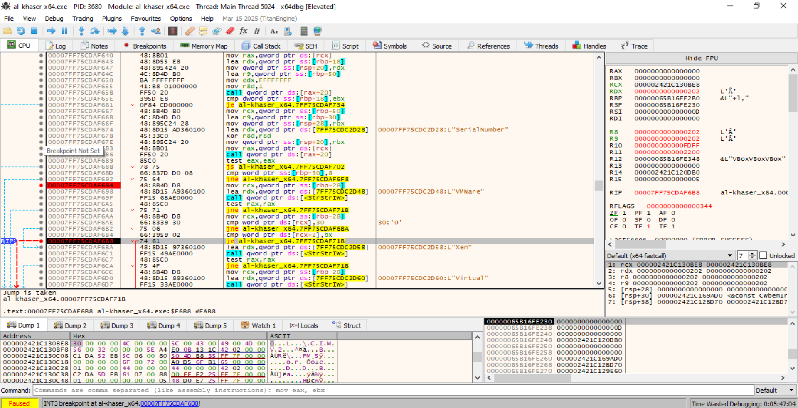


Secuencia completa:
```bash
SELECT * FROM Win32_BIOS
        ↓
Get(L"SerialNumber")
        ↓
VARIANT de tipo VT_BSTR
        ↓
SerialNumber = L"0"
        ↓
comparación del carácter '0'
        ↓
comprobación del terminador nulo
        ↓
ZF = 1
        ↓
salto a ADF71B
```

La propiedad SerialNumber recuperada mediante WMI contiene la cadena Unicode "0", representada en memoria por los bytes 30 00 00 00. La rutina comprueba que el primer carácter sea 0x0030 y que el siguiente sea el terminador nulo 0x0000. Ambas comparaciones se cumplen, dejando ZF=1. En consecuencia, la instrucción je situada en al-khaser_x64+ADF6B8 toma el salto hacia al-khaser_x64+ADF71B, ruta utilizada para procesar el número de serie como indicador de un entorno potencialmente virtualizado.


### 5.13.4. Consulta del fabricante y modelo

```
PS C:\Users\usuario\Desktop > Get-CimInstance -ClassName Win32_ComputerSystem |
>>     Select-Object Manufacturer, Model

Manufacturer Model
------------ -----
innotek GmbH VirtualBox


FLARE-VM 07/16/2026 13:07:38
```

Hay dos comprobaciones distintas que reutilizan la misma consulta:

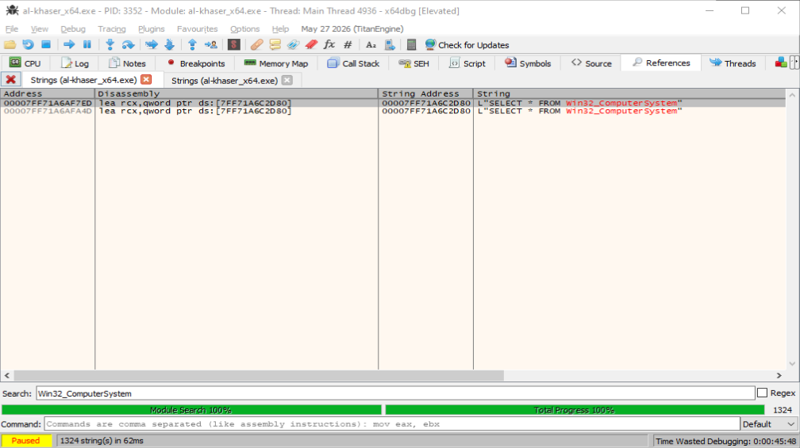


| Captura | Función aproximada     | Propiedad que analizará |
| ------- | ---------------------- | ----------------------- |
| Primera | `al-khaser_x64+ADF780` | `Model`                 |
| Segunda | `al-khaser_x64+ADFA40` | `Manufacturer`          |


La primera función corresponde a la comprobación del modelo, porque anteriormente identificamos que el bloque principal llama a al-khaser_x64+ADF780 desde:

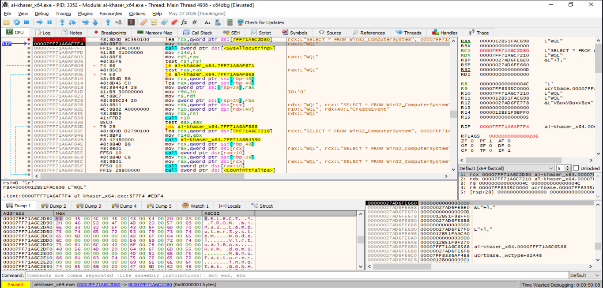


La segunda función corresponde a la comprobación del fabricante, que comienza aproximadamente en `al-khaser_x64+ADFA40`:

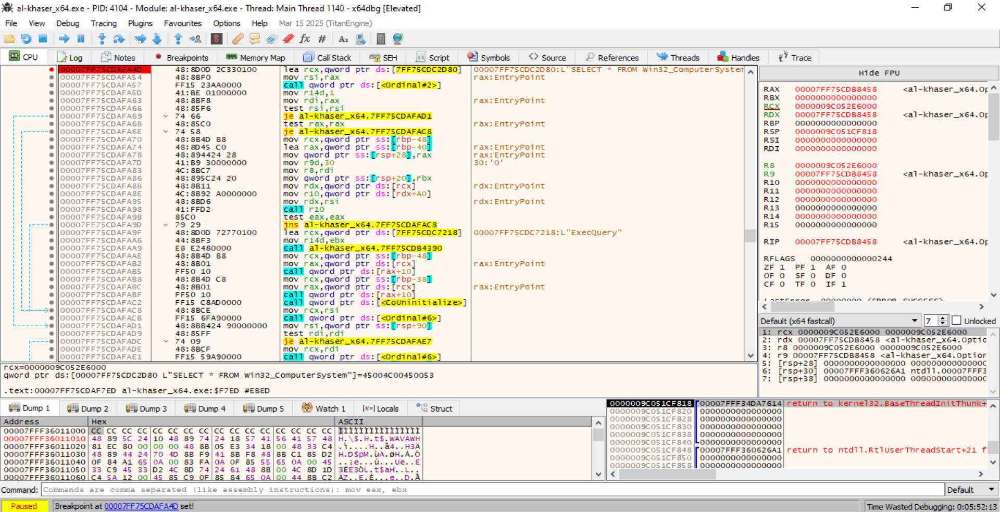


Todavía no estamos ejecutando esas instrucciones. En ambas capturas, el panel de registros muestra:
```bash
RIP = 00007FF75CDB8458
```
Por tanto, únicamente hemos navegado hasta el código y colocado breakpoints. Las instrucciones seleccionadas en `ADF7ED` y `ADFA4D` todavía no se han alcanzado dinámicamente.

----


Colocamos un breakpoint inmediatamente después de ExecQuery:

```bash
al-khaser_x64+ADF83B
```

Reiniciamos y pulsamos F9. Al detenerse comprobamos:

```bash
EAX >= 0
[RBP-40] != 0
```

-----------------

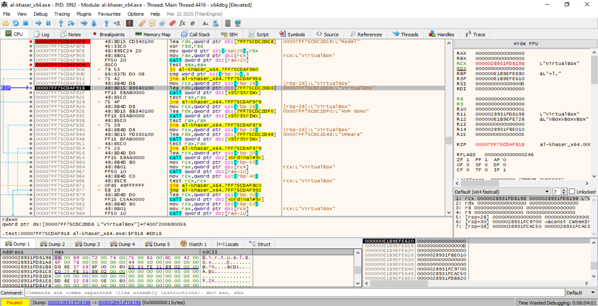


La captura confirma dinámicamente que al-khaser ha recuperado mediante WMI el valor de la propiedad Model y que el sistema se identifica como:

```bash
Model = L"VirtualBox"
```

Su interpretación es:
- Get("Model") no devolvió un error.
- El VARIANT contiene el tipo 8, es decir, VT_BSTR.
- [RBP-28] contiene el puntero a la cadena devuelta.
- Esa cadena se carga en RCX.

En la captura:
```bash
RCX = 0000028931FD8198
RCX → L"VirtualBox"

```
El Dump confirma el contenido UTF-16LE:
```bash
56 00 69 00 72 00 74 00 75 00 61 00 6C 00 42 00
6F 00 78 00 00 00

```

que corresponde a:
```bash
VirtualBox
```

Resultado de la técnica
```bash
Consulta WMI:       SELECT * FROM Win32_ComputerSystem
Propiedad:          Model
Tipo devuelto:      VT_BSTR
Valor obtenido:     VirtualBox
Indicador buscado:  VirtualBox
Coincidencia:       Sí
Resultado:          detección positiva de virtualización
```

El valor actual RAX = 0 no es todavía el resultado de StrStrIW, porque RIP se encuentra antes de cargar RDX y antes de ejecutar la llamada. Al pasar StrStrIW con F8, RAX debería contener una dirección no nula, normalmente la misma dirección inicial de RCX, ya que la coincidencia comienza en el primer carácter.


La rutina consulta mediante WMI la clase Win32_ComputerSystem y recupera la propiedad Model a través de IWbemClassObject::Get. El valor se devuelve en un VARIANT de tipo VT_BSTR, cuyo campo bstrVal apunta a la cadena Unicode VirtualBox. Posteriormente, al-khaser utiliza StrStrIW para buscar en el modelo los indicadores VirtualBox, HVM domU y VMWare. En la ejecución analizada, el primer indicador coincide con el valor recuperado, por lo que StrStrIW devuelve un puntero no nulo y el flujo salta a la ruta de detección positiva. Esto permite identificar el entorno como una máquina virtual de VirtualBox.


---


### 5.13.5. Consulta de adaptadores de red

```
PS C:\Windows\system32 > Get-CimInstance Win32_NetworkAdapterConfiguration |
>>     Select-Object Description, MACAddress

Description                            MACAddress
-----------                            ----------
Microsoft Kernel Debug Network Adapter
Intel(R) PRO/1000 MT Desktop Adapter   08:00:27:01:E4:E9
WAN Miniport (SSTP)
WAN Miniport (IKEv2)
WAN Miniport (L2TP)
WAN Miniport (PPTP)
WAN Miniport (PPPOE)
WAN Miniport (IP)
WAN Miniport (IPv6)
WAN Miniport (Network Monitor)
```

Este resultado confirma que WMI funciona correctamente dentro de la VM y que existe un adaptador cuya MAC contiene el indicador buscado por al-khaser:
```
Intel(R) PRO/1000 MT Desktop Adapter
08:00:27:01:E4:E9
```
El prefijo evaluado por la rutina es:
```
08:00:27
```
Por tanto, cuando al-khaser alcance ese objeto, la comprobación debería producir una detección positiva.

-----

Para ejecutar específicamente la comprobación `WMI` de adaptadores de red tenemos que modificar la línea de comandos al cargar la aplicación Al-Khaser::
```
al-khaser_x64.exe --check VBOX
```

Vamos a analizar la comprobación WMI de la dirección MAC de los adaptadores de red. En al-khaser, esta técnica consulta Win32_NetworkAdapterConfiguration, recupera la propiedad MACAddress y busca indicadores asociados a VirtualBox; el repositorio documenta específicamente el prefijo 08:00:27 para VirtualBox.
1. Localizamos la consulta

En x64dbg:

```bash
CPU → clic derecho → Search for
→ Current Module → String references
```

Buscamos:

```bash
Win32_NetworkAdapterConfiguration

```
La cadena relevante será:

```bash
SELECT * FROM Win32_NetworkAdapterConfiguration
```

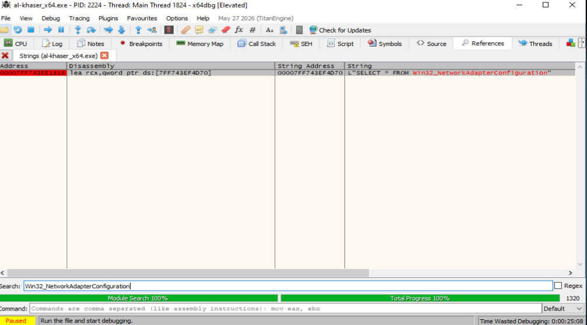

----

Verificamos ExecQuery: Buscamos un bloque semejante a:
```
mov  rcx,[variable_services]
lea  rax,[variable_enumerator]
mov  [rsp+28],rax
mov  r9d,30
mov  r8,rdi
mov  [rsp+20],0
mov  rdx,[rcx]
mov  r10,[rdx+A0]
mov  rdx,rsi
call r10
test eax,eax
```
La llamada equivale a:
```
services->ExecQuery(
    L"WQL",
    L"SELECT * FROM Win32_NetworkAdapterConfiguration",
    0x30,
    nullptr,
    &enumerator
);
```
Colocamos un breakpoint inmediatamente después de `call r10` y ejecutamos con F9 y F8 para pasar `test eax,eax`:

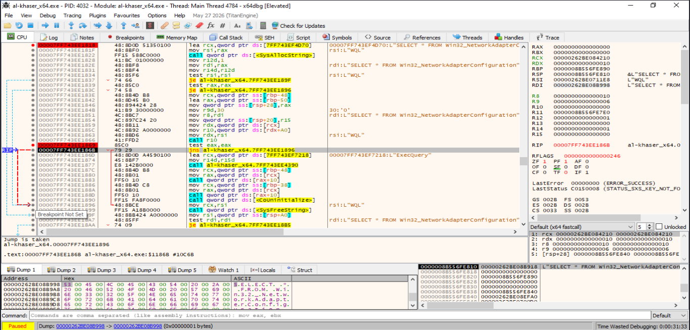

Los valores relevantes son:
```
EAX = 00000000
ZF  = 1
SF  = 0
```
Por tanto:
```
HRESULT = S_OK
```


La dirección pasada como último argumento es:
```
[RSP+28] = 0000008B556FE840
```
Esta dirección corresponde a:
```
RBP - 0x50
```
En esa posición se observa un valor no nulo, aproximadamente:
```
[RBP-50] = 00000262BE08EFA0
```
Por tanto, WMI ha devuelto correctamente un:
```
IEnumWbemClassObject*
```
que permitirá recorrer los objetos `Win32_NetworkAdapterConfiguration`.

Al-khaser ejecuta mediante WMI la consulta SELECT * FROM Win32_NetworkAdapterConfiguration. La llamada a IWbemServices::ExecQuery devuelve S_OK y almacena un puntero no nulo a IEnumWbemClassObject, confirmando que la enumeración de configuraciones de red se ha iniciado correctamente. Esta captura demuestra la consulta WMI, pero aún falta recuperar la propiedad MACAddress y observar la comparación de la dirección obtenida con el indicador utilizado para detectar VirtualBox.

----

Recorremos los adaptadores: Después aparece una llamada mediante la tabla virtual equivalente a:
```
enumerator->Next(
    WBEM_INFINITE,
    1,
    &networkAdapterObject,
    &returned
);
```


El patrón será similar a:
```
mov  rax,[rcx]
lea  rdx,[variable_returned]
mov  [rsp+20],rdx
lea  r9,[variable_object]
mov  edx,FFFFFFFF
mov  r8d,1
call qword ptr [rax+20]
```
Colocamos un breakpoint después del call y comprobamos:
```
returned = 1
networkAdapterObject != NULL
```
Como existen varios adaptadores, este bloque se ejecuta varias veces: Ethernet, adaptadores virtuales, túneles, Bluetooth, etc.


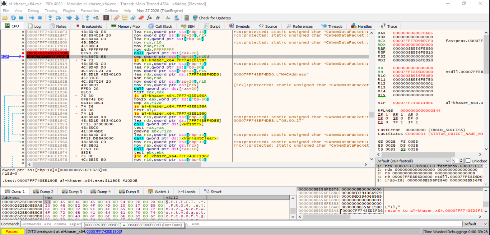

Esta captura muestra que la llamada a IEnumWbemClassObject::Next ha fallado, por lo que en esta ejecución no se obtiene ningún adaptador ni se alcanza la lectura de MACAddress.

Tras la llamada, el registro contiene:
```
RAX = 00000000800706B5
EAX = 800706B5
```
0x800706B5 representa un HRESULT de error cuyo código Win32 subyacente es 1717 / 0x6B5, RPC_S_UNKNOWN_IF: la interfaz RPC es desconocida.

Tras invocar IEnumWbemClassObject::Next, la rutina recibe el código de error 0x800706B5 y la variable que indica el número de objetos devueltos permanece a cero. La comparación posterior provoca el salto hacia la salida del bucle, por lo que no se obtiene ningún objeto Win32_NetworkAdapterConfiguration y no se ejecuta la recuperación de la propiedad MACAddress. Esta captura documenta un fallo de enumeración, pero no constituye la evidencia final de la comprobación del prefijo MAC de VirtualBox.


Ya hemos acreditado en el ensamblador que al-khaser:
```
consulta Win32_NetworkAdapterConfiguration
        ↓
enumera los resultados con Next
        ↓
solicita la propiedad MACAddress
        ↓
busca el prefijo "08:00:27" mediante wcsstr
        ↓
establece el indicador de detección si existe coincidencia
```

El análisis dinámico confirma que al-khaser ejecuta una consulta WMI sobre Win32_NetworkAdapterConfiguration y contiene la lógica destinada a recuperar MACAddress y buscar el prefijo 08:00:27. Sin embargo, en la ejecución observada, IEnumWbemClassObject::Next devuelve un error y no entrega ningún objeto, por lo que no se alcanza la recuperación ni la comparación de la dirección MAC.

-------

Quitamos todos los breakpoints. Ponemos los siguientes breakpoints usando las direcciones relativas al módulo, para que sigan siendo válidos aunque cambie la base por ASLR:
```
00007FF743EE1869   ; test eax,eax tras ExecQuery
00007FF743EE190E   ; cmp [rbp-18],r15d tras Next
00007FF743EE193D   ; test eax,eax tras Get("MACAddress")
00007FF743EE195C   ; test rax,rax tras wcsstr
```


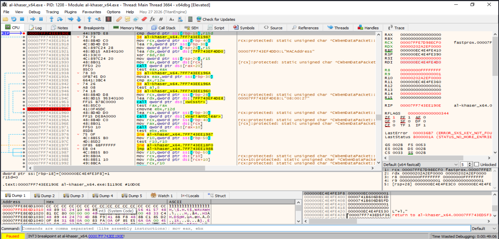

IEnumWbemClassObject::Next ha funcionado correctamente y ha devuelto un objeto de configuración de red.
Qué demuestra la captura

La ejecución está detenida inmediatamente después de:
```
00007FF743EE190B  call qword ptr [rax+20]   ; Next
00007FF743EE190E  cmp dword ptr [rbp-18],r15d
```
Los valores relevantes son:
```
EAX = 00000000
[RBP-18] = 1
R15D = 0
```
Interpretación:
```
EAX = 0        → HRESULT S_OK
[RBP-18] = 1   → WMI ha devuelto un objeto
```

---------


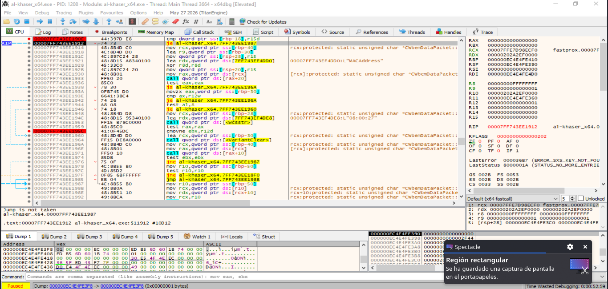

Los valores son:
```
DWORD [RBP-18] = 1
R15D           = 0
ZF             = 0
```
x64dbg indica explícitamente:
```
Jump is not taken
```
Por tanto, WMI ha devuelto un objeto y el flujo no sale del bucle:
```
returned = 1;
```
Además:
```
EAX = 0
```
indica que Next terminó con S_OK.

-----

Recuperamos la propiedad MACAddress: Buscamos ahora la cadena exacta:
```
MACAddress
```
Seleccionamos:
```
L"MACAddress"
```


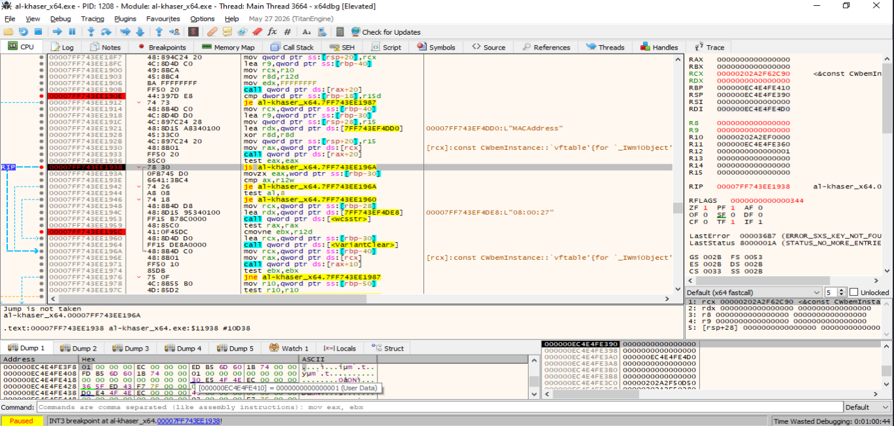


Los registros muestran:
```
EAX = 00000000
SF  = 0
```
Por tanto:
```
HRESULT = S_OK
```
El salto js no se tomará. La propiedad MACAddress se ha consultado sin error.

--------

Comprobación del VARIANT:  Las siguientes instrucciones son:
```
AE193A  movzx eax,word ptr [rbp-30]
AE193E  cmp   ax,r12w
AE1942  je    AE196A
AE1944  test  al,8
AE1946  je    AE1960
```
En la ejecución:
```
R12 = 1
```
La instrucción:
```
cmp ax,1
```
comprobamos si:
```
VARIANT.vt = VT_NULL
```

------------

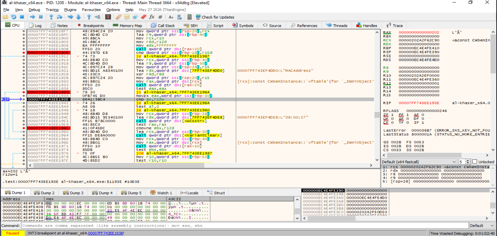


Vemos que la llamada Get(L"MACAddress") ha tenido éxito, pero el objeto actual no ha devuelto la MAC como una cadena BSTR válida.

```
cmp ax,r12w ; compara 0x0202 con 1 je AE196A
```
Como:
```
0x0202 != 0x0001
```
ese salto no se tomará.

La rutina limpiará el VARIANT y continuará con el siguiente objeto, sin llamar a wcsstr.

En otras palabras, esta iteración no contiene una MACAddress utilizable como VT_BSTR.


-----

Pulsamoa F9 para continuar enumerando adaptadores. El breakpoint después de Get se activará varias veces, porque Win32_NetworkAdapterConfiguration devuelve numerosos objetos y muchos no tienen MAC.

El caso que buscamos debe mostrar:
```
AX = 0008
```
porque:
```
VT_BSTR = 8
```
Cuand```o AX = 8, se cumplirá:
```
test al,8
```

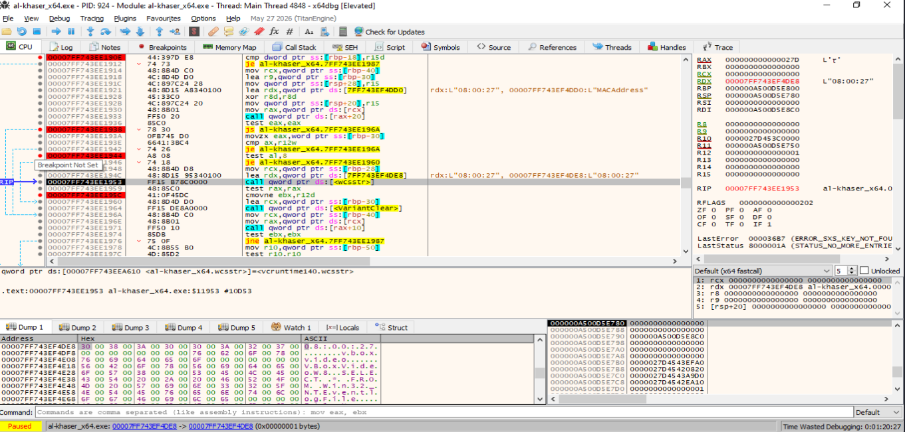


----

Usamos estas direcciones absolutas:
```
bp 00007FF743EE1869
bp 00007FF743EE190E
bp 00007FF743EE1936
bp 00007FF743EE194C
bp 00007FF743EE1959
```
Correspondencia:
```
00007FF743EE1869  → después de ExecQuery
00007FF743EE190E  → después de Next
00007FF743EE1936  → después de Get(L"MACAddress")
00007FF743EE194C  → MAC cargada en RCX, antes de preparar "08:00:27"
00007FF743EE1959  → después de wcsstr
```

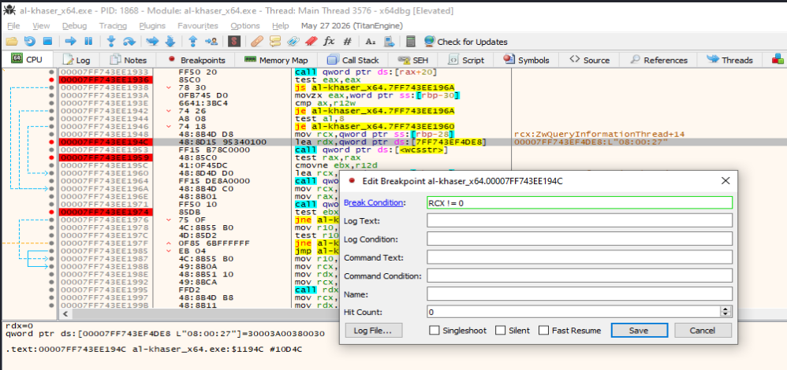

------


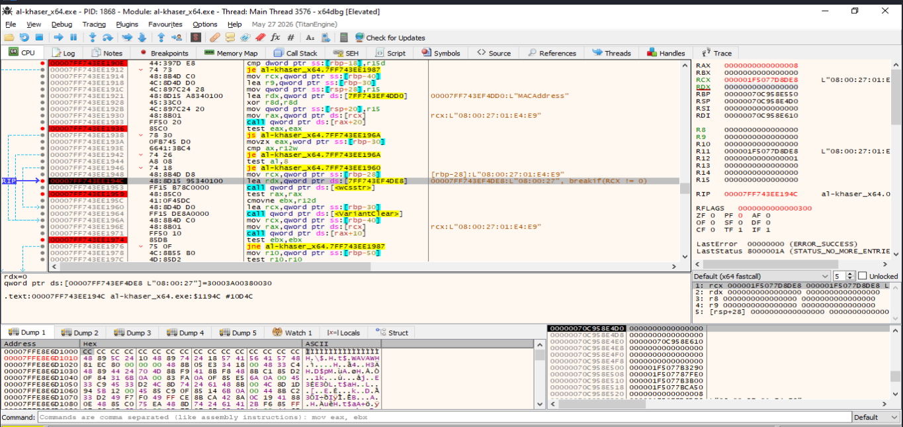


RCX contiene:
```
RCX = 000001F5077D8DE8
RCX → L"08:00:27:01:E4:E9"
```

El comentario del desensamblador también confirma:
```
[rbp-28]: L"08:00:27:01:E4:E9"
```
Esto demuestra que:
```
Win32_NetworkAdapterConfiguration
        ↓
Get(L"MACAddress")
        ↓
MACAddress = L"08:00:27:01:E4:E9"
```

Además:
```
RAX = 8
```
en este punto corresponde al tipo cargado anteriormente desde el VARIANT:
```
VT_BSTR = 8
```
No es todavía el resultado de wcsstr.

-------

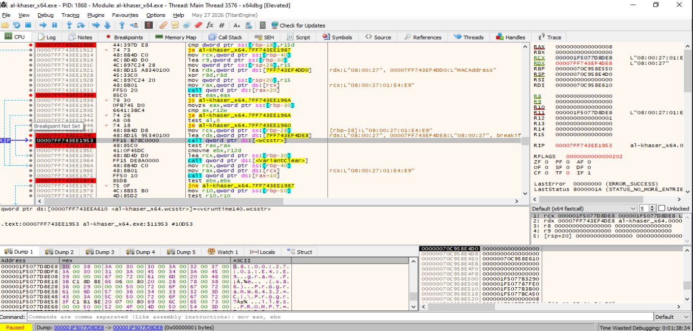


Los argumentos ya están preparados según la convención x64 de Windows:
```
RCX = 000001F5077D8DE8 → L"08:00:27:01:E4:E9"
RDX = 00007FF743EF4DE8 → L"08:00:27"
```

Por tanto, al-khaser está a punto de ejecutar:
```
wcsstr(
    L"08:00:27:01:E4:E9",
    L"08:00:27"
);
```
Esto demuestra dinámicamente que:
```
WMI ha devuelto una dirección MAC válida.
La MAC obtenida es 08:00:27:01:E4:E9.
Al-khaser la compara con el prefijo 08:00:27.
Ese prefijo aparece al comienzo de la dirección recuperada.
```
El Dump inferior también muestra correctamente la MAC en UTF-16LE:
```
08:00:27:01:E4:E9
```


Al-khaser consulta mediante WMI la clase Win32_NetworkAdapterConfiguration y recupera la propiedad MACAddress. En la ejecución analizada, la dirección obtenida es 08:00:27:01:E4:E9. La rutina carga esta cadena en RCX y utiliza como segundo argumento de wcsstr el prefijo 08:00:27, almacenado en RDX. Debido a que la dirección MAC comienza por dicho prefijo, asociado a los adaptadores de VirtualBox, la búsqueda devuelve un puntero no nulo. Posteriormente, la instrucción cmovne establece el indicador de detección en uno, clasificando el entorno como una máquina virtual VirtualBox.

----

Pulsamos una vez F8 para ejecutar wcsstr. La ejecución debe quedar en:
```
00007FF743EE1959  test rax,rax
```

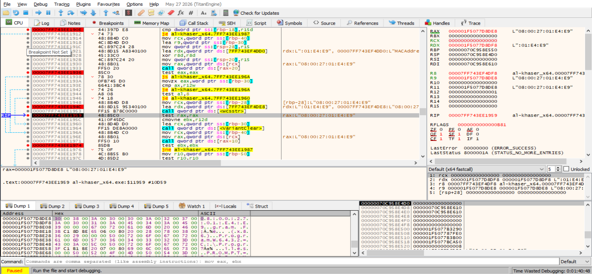

Al-khaser recupera mediante WMI la propiedad MACAddress de un objeto Win32_NetworkAdapterConfiguration, obteniendo la cadena 08:00:27:01:E4:E9. Posteriormente invoca wcsstr para buscar el prefijo 08:00:27. La función devuelve en RAX un puntero no nulo al comienzo de la propia dirección MAC, demostrando que la coincidencia ha sido encontrada. Como consecuencia, la instrucción cmovne ebx,r12d establece el indicador EBX a uno, produciendo una detección positiva del entorno VirtualBox.


-----

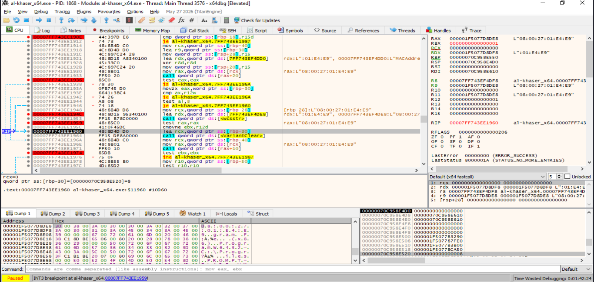


Esta captura confirma de forma dinámica la detección positiva mediante la dirección MAC.

La ejecución está detenida en:
```
00007FF743EE1960  lea rcx,[rbp-30]
```
Por tanto, ya se han ejecutado:
```
AE1953  call    [wcsstr]
AE1959  test    rax,rax
AE195C  cmovne  ebx,r12d
```
Los registros muestran:
```
RAX = 000001F5077D8DE8 → L"08:00:27:01:E4:E9"
RBX = 0000000000000001
R12 = 0000000000000001
```

Resultado de wcsstr: La llamada realizada fue equivalente a:
```
wcsstr(
    L"08:00:27:01:E4:E9",
    L"08:00:27"
);
```

Como el prefijo se encuentra al principio de la MAC, wcsstr devolvió un puntero no nulo:
```
RAX → L"08:00:27:01:E4:E9"
```

Después:
```
test rax,rax
```
dejó ZF = 0, y por eso:
```
cmovne ebx,r12d
```
copió el valor 1 de R12D a EBX.

Resultado:
```
EBX = 1
```
Ese registro funciona como indicador de detección.

A continuación se inicia la limpieza del VARIANT.

Al-khaser consulta mediante WMI la clase Win32_NetworkAdapterConfiguration y recupera la propiedad MACAddress. En la ejecución analizada se obtiene la dirección 08:00:27:01:E4:E9. Posteriormente, la rutina utiliza wcsstr para buscar el prefijo 08:00:27. La función devuelve un puntero no nulo al inicio de la propia dirección MAC, confirmando la coincidencia. Tras comprobar el resultado mediante test rax,rax, la instrucción cmovne ebx,r12d establece EBX a uno. Este valor actúa como indicador de detección y demuestra que al-khaser identifica positivamente el entorno como VirtualBox a partir del prefijo de la dirección MAC.

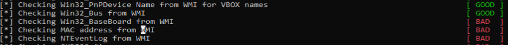

-------


### 5.13.6. Consulta de dispositivos virtualizados


En al-khaser, la consulta de dispositivos virtualizados se materializa en tres comprobaciones WMI de VirtualBox:
```
DeviceId de dispositivos PnP para localizar hardware PCI de VBox.
Name para localizar controladores característicos.
Name para localizar cadenas que contengan VBOX.
```
Las tres se ejecutan dentro de la categoría VBOX.

Vamos a empezar por la más clara: detección por DeviceId PCI.

----


Línea de comandos

Ejecuta:
```
al-khaser_x64.exe --check VBOX
```
-----


Localizar la prueba en x64dbg. Abrimos
```
CPU → clic derecho → Search for
→ Current Module → String references
```
Buscamos exactamente:
```
Checking Win32_PnPDevice DeviceId from WMI for VBox PCI device
```

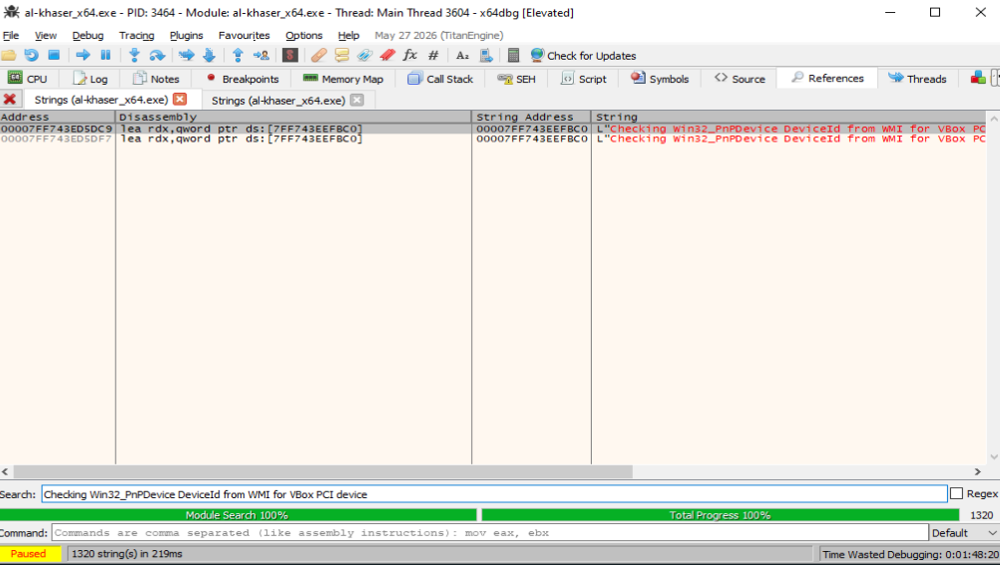


tiene dos referencias:
```
00007FF743ED5DC9  lea rdx,[7FF743EEFBC0]
00007FF743ED5DF7  lea rdx,[7FF743EEFBC0]
```

Por el patrón que ya hemos observado en al-khaser, lo más probable es:
```
ED5DC9 → impresión inicial del nombre de la prueba
ED5DF7 → preparación de la impresión del resultado
```

-------

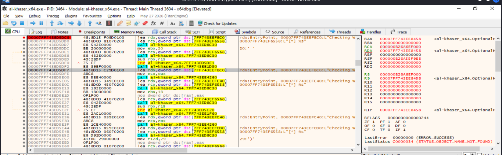

La captura identifica claramente la función que realiza la comprobación de dispositivos PnP virtualizados.
Bloque principal

La primera parte solo imprime el nombre de la prueba:
```
00007FF743ED5DC9  lea  rdx,[L"Checking Win32_PnPDevice DeviceId from WMI for VBox PCI device"]
00007FF743ED5DD0  lea  rcx,[formato]
00007FF743ED5DD7  call al-khaser_x64+...8C30
```

Después aparece el bucle de relleno de la salida.

Función que realiza la comprobación: La llamada importante es:
```
00007FF743ED5DF2  call 00007FF743EE1D30
```
Por tanto, la función de comprobación es:
```
00007FF743EE1D30
```
Con la base usada en esta sesión, su desplazamiento es aproximadamente:
```
al-khaser_x64+AE1D30
```

--------

Breakpoints que debemos colocar: Para evitar problemas con el nombre del módulo, utilizamos las direcciones absolutas de esta sesión:
```
bp 00007FF743ED5DF2   ; antes de llamar a la comprobación
bp 00007FF743EE1D30   ; entrada de la función WMI
bp 00007FF743ED5DF7   ; después de la comprobación
```

Reiniciamos al-khaser y ejecutamos con F9. Cuando se detenga en:
```
00007FF743ED5DF2
```
continuamos con F9 hasta el breakpoint de:
```
00007FF743EE1D30
```

------


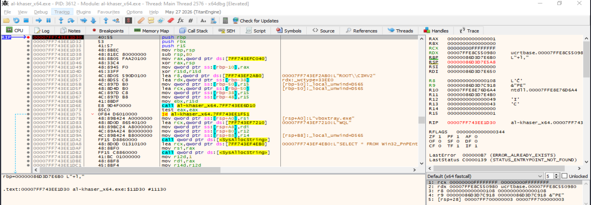

La captura ya confirma el inicio de la comprobación WMI de dispositivos virtualizados.

La secuencia acreditada es:
```
función al-khaser_x64+AE1D30
        ↓
ROOT\CIMV2
        ↓
WQL
        ↓
SELECT * FROM Win32_PnPEntity
```

La función situada en al-khaser_x64+AE1D30 inicializa una conexión WMI con el espacio de nombres ROOT\CIMV2. Posteriormente crea las cadenas BSTR correspondientes al lenguaje WQL y a la consulta SELECT * FROM Win32_PnPEntity. Esta consulta permite enumerar los dispositivos Plug and Play expuestos por Windows. La captura confirma la preparación de la consulta WMI, aunque todavía no muestra la ejecución de ExecQuery, la recuperación de la propiedad DeviceId ni su comparación con los identificadores asociados a VirtualBox.

------------------


Colocamos un breakpoint en la instrucción inmediatamente posterior a:
```
call r10
```
y ejecutamos con F9. En esa parada comprobaremos:
```
EAX >= 0       → ExecQuery correcto
enumerador != 0
```

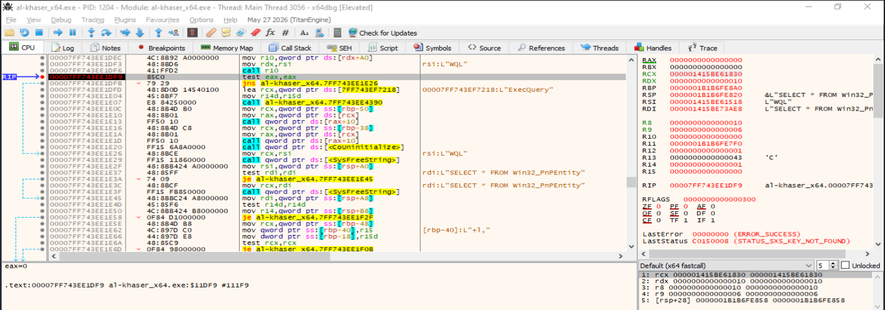

La captura confirma que IWbemServices::ExecQuery se ha ejecutado correctamente para enumerar dispositivos Plug and Play.


La rutina ejecuta mediante WMI la consulta SELECT * FROM Win32_PnPEntity sobre el espacio de nombres ROOT\CIMV2. La llamada a IWbemServices::ExecQuery devuelve 0x00000000, correspondiente a S_OK, confirmando que la enumeración de dispositivos Plug and Play se ha iniciado correctamente. A partir del enumerador resultante, al-khaser recorrerá los objetos obtenidos y analizará su propiedad DeviceId en busca de identificadores asociados a VirtualBox.


------

En los registros se observa:
```
EAX = 00000000
```
Por tanto:
```
HRESULT = S_OK
```
La consulta WMI se ha completado sin errores.


Continuamos un poco más abajo hasta localizar el bloque:
```
mov  rax,[rcx]
lea  rdx,[variable returned]
mov  [rsp+20],rdx
lea  r9,[variable objeto]
mov  edx,FFFFFFFF
mov  r8d,1
call qword ptr [rax+20]
cmp  dword ptr [variable returned],0
```
Ese call [rax+20] será IEnumWbemClassObject::Next.

Colocamos un breakpoint en la instrucción inmediatamente posterior al call.

-----


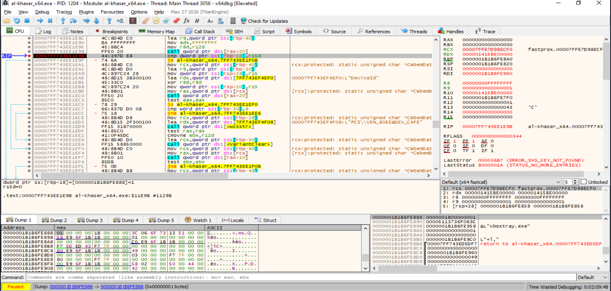

Esta captura confirma que IEnumWbemClassObject::Next ha devuelto correctamente un dispositivo PnP y muestra toda la lógica posterior de detección.

En la captura:
```
DWORD [RBP-18] = 1
R15D           = 0
EAX            = 0
```

Esto significa:
```
HRESULT = S_OK
Objetos devueltos = 1
```

La comparación será 1 != 0, por lo que el salto:
```
je al-khaser_x64+AE1F0B
```
no se tomará. La rutina continuará analizando el dispositivo obtenido.


Recuperación de DeviceId:

El siguiente bloque prepara:
```
AE1EA1  mov rcx,[rbp-40]        ; IWbemClassObject del dispositivo
AE1EA5  lea r9,[rbp-30]         ; VARIANT de salida
AE1EA9  mov [rsp+28],r15        ; NULL
AE1EAF  lea rdx,[L"DeviceId"]
AE1EB6  xor r8d,r8d             ; flags = 0
AE1EB9  mov [rsp+20],r15        ; NULL
AE1EBD  mov rax,[rcx]
AE1EC0  call qword ptr [rax+20] ; IWbemClassObject::Get
```

Equivale a:
```
pnpObject->Get(
    L"DeviceId",
    0,
    &variant,
    nullptr,
    nullptr
);
```


Después valida el resultado:
```
AE1EC3  test eax,eax
AE1EC6  js   AE1EF0
AE1EC8  cmp  word ptr [rbp-30],8
AE1ECD  jne  AE1EE6
```


El valor 8 corresponde a:
```
VT_BSTR
```
Por tanto, solo continúa si DeviceId se devuelve como cadena Unicode.

------

Breakpoints para terminar la demostración
```
bp 00007FF743EE1EC4
bp 00007FF743EE1ED3
bp 00007FF743EE1EE0
bp 00007FF743EE1EFA
```

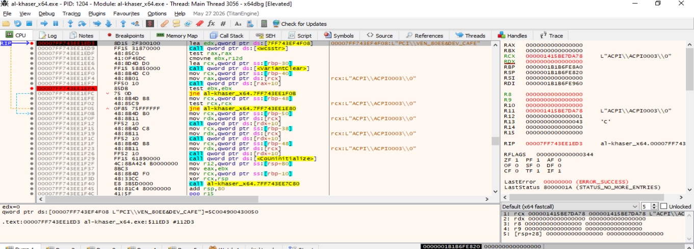

En EE1EC4, comprobamos:
```

EAX = 0
WORD [RBP-30] = 8
QWORD [RBP-28] != 0
```

```
RBP-30 = 0000001B1B6FE870  08 00 00 00 00 00 00 00 78 DA E7 5B 41 01 00 00  ........xÚç[A...  
RBP-28 = 0000001B1B6FE878  78 DA E7 5B 41 01 00 00 00 00 00 00 00 00 00 00  xÚç[A...........  
```

Al-khaser ha recuperado correctamente un DeviceId mediante WMI, pero el valor correspondiente a esta iteración es ACPI\ACPI0003\0, que no contiene la firma PCI\VEN_80EE&DEV_CAFE. Por ello, esta iteración no activa la detección. La enumeración debe continuar hasta encontrar un dispositivo cuyo identificador contenga la firma PCI de VirtualBox; en ese caso, wcsstr devolverá un puntero no nulo y EBX se establecerá a uno.

----

quitamos todos los bps. Dejamos solo
```
00007FF743EE1EE0
00007FF743EE1EFA, con la condición: EBX == 1
```

Pasa por multiples dispositivos hasta llegar a:

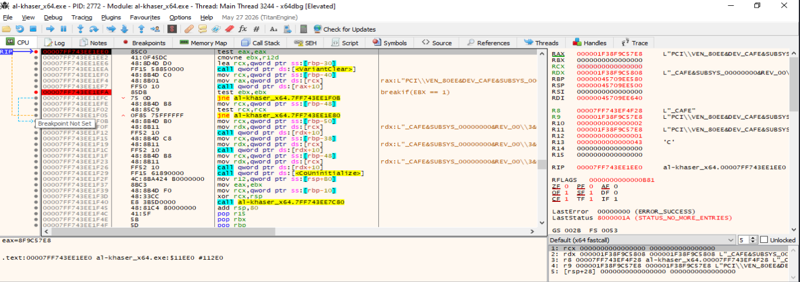

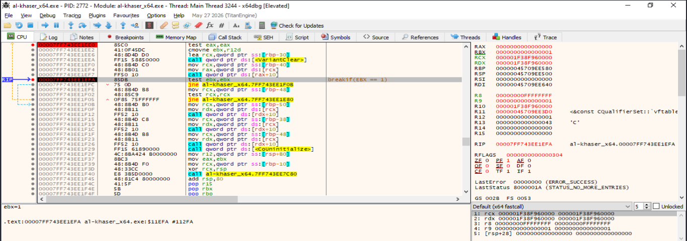


Coincidencia del DeviceId: En la captura detenida en:
```
00007FF743EE1EE0  test rax,rax
```
ya se ha ejecutado:
```
lea  rdx,[L"PCI\\VEN_80EE&DEV_CAFE"]
call [wcsstr]
```
RAX contiene un puntero no nulo:
```
RAX = 000001F38F9C57E8
```
y x64dbg interpreta el contenido como un identificador semejante a:
```
PCI\VEN_80EE&DEV_CAFE&SUBSYS_00000000&REV_00\...
```
Por tanto, la llamada realizada ha sido aproximadamente:
```
wcsstr(
    deviceId,
    L"PCI\\VEN_80EE&DEV_CAFE"
);
```
y ha encontrado la firma dentro del DeviceId.

La evidencia decisiva es:
```
RAX != 0
RAX → L"PCI\VEN_80EE&DEV_CAFE&SUBSYS_..."
```

Secuencia demostrada
```
SELECT * FROM Win32_PnPEntity
        ↓
IEnumWbemClassObject::Next
        ↓
Get(L"DeviceId")
        ↓
DeviceId = PCI\VEN_80EE&DEV_CAFE&SUBSYS_...
        ↓
wcsstr(DeviceId, L"PCI\VEN_80EE&DEV_CAFE")
        ↓
RAX != 0
        ↓
cmovne EBX,R12D
        ↓
EBX = 1
        ↓
detección positiva
```

El RAX = 0 observado posteriormente en la captura de EBX = 1 no invalida el resultado. Entre ambos puntos se ejecutan VariantClear y métodos de liberación COM, que pueden modificar los registros volátiles. El indicador persistente de la comprobación es EBX.

La rutina ejecuta la consulta WMI SELECT * FROM Win32_PnPEntity y recorre los dispositivos obtenidos mediante IEnumWbemClassObject::Next. Para cada objeto recupera la propiedad DeviceId y busca mediante wcsstr la firma PCI\VEN_80EE&DEV_CAFE. En la ejecución analizada, el identificador contiene dicha secuencia, por lo que wcsstr devuelve un puntero no nulo. Como consecuencia, la instrucción cmovne ebx,r12d establece EBX a uno. La comprobación posterior de este registro conduce a la ruta de detección positiva, demostrando que al-khaser identifica un dispositivo PCI característico de VirtualBox.


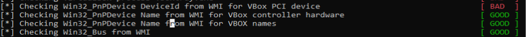


La salida confirma que la técnica que acabamos de analizar ha producido una detección positiva:
```
Checking Win32_PnPDevice DeviceId from WMI for VBox PCI device   [ BAD ]
```

La ejecución de al-khaser muestra el resultado [BAD] para la comprobación del DeviceId de dispositivos PnP mediante WMI. El análisis dinámico confirma que la rutina recupera un identificador que contiene la firma PCI\VEN_80EE&DEV_CAFE. La búsqueda realizada mediante wcsstr devuelve un puntero no nulo y establece el indicador interno de detección a uno. La salida [BAD] confirma finalmente que al-khaser ha identificado un dispositivo PCI asociado a VirtualBox. Las comprobaciones basadas en el nombre del dispositivo y en el número de buses devuelven [GOOD], al no encontrar sus respectivos indicadores.


-------

### 5.13.7. Creación de procesos mediante WMI

La técnica «creación de procesos mediante WMI» no está implementada en la versión oficial de al-khaser ni se ha localizado en el binario analizado.  La forma más limpia y reproducible es no utilizar malware real, sino una emulación controlada de MITRE ATT&CK T1047. Atomic Red Team incluye específicamente la prueba “WMI Execute Local Process”, que crea localmente un proceso mediante WMI, y otra prueba basada en un comando codificado inspirado en el comportamiento observado en Solorigate: https://attack.mitre.org/techniques/T1047/

Usaremos notepad.exe como proceso benigno y Invoke-CimMethod para llamar directamente al método estático Create de Win32_Process. Este método devuelve ReturnValue = 0 cuando la creación es correcta y proporciona el PID del nuevo proceso.


----


Creamos el proceso mediante WMI:

```bash
$command = 'C:\Windows\System32\notepad.exe'

$result = Invoke-CimMethod `
    -Namespace 'root/cimv2' `
    -ClassName 'Win32_Process' `
    -MethodName 'Create' `
    -Arguments @{
        CommandLine = $command
    }

$result | Select-Object ReturnValue, ProcessId | Format-List
```

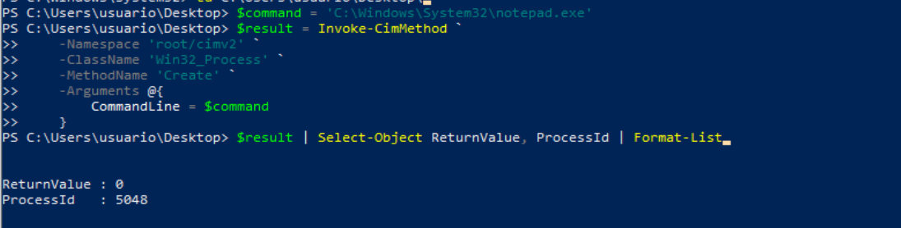

Es exactamente la operación utilizada por el Atomic Test #5 de T1047. La prueba predeterminada ejecuta notepad.exe en el equipo local.


Obtenemos:

```bash
Clase:       Win32_Process
Método:      Create
CommandLine: C:\Windows\System32\notepad.exe
Resultado:   ReturnValue = 0
PID:         5048
```

ReturnValue = 0 indica que el método Win32_Process.Create se completó correctamente, mientras que ProcessId identifica el proceso creado


---

Verificamos automáticamente el proceso creado:

```bash
if ($result.ReturnValue -ne 0) {
    throw "Win32_Process.Create falló. ReturnValue: $($result.ReturnValue)"
}

$createdPid = [uint32]$result.ProcessId

Start-Sleep -Milliseconds 500

$child = Get-CimInstance `
    -ClassName Win32_Process `
    -Filter "ProcessId = $createdPid"

if (-not $child) {
    throw "No se ha encontrado el proceso con PID $createdPid"
}

$child | Select-Object `
    Name,
    ProcessId,
    ParentProcessId,
    ExecutablePath,
    CommandLine,
    CreationDate |
Format-List
```

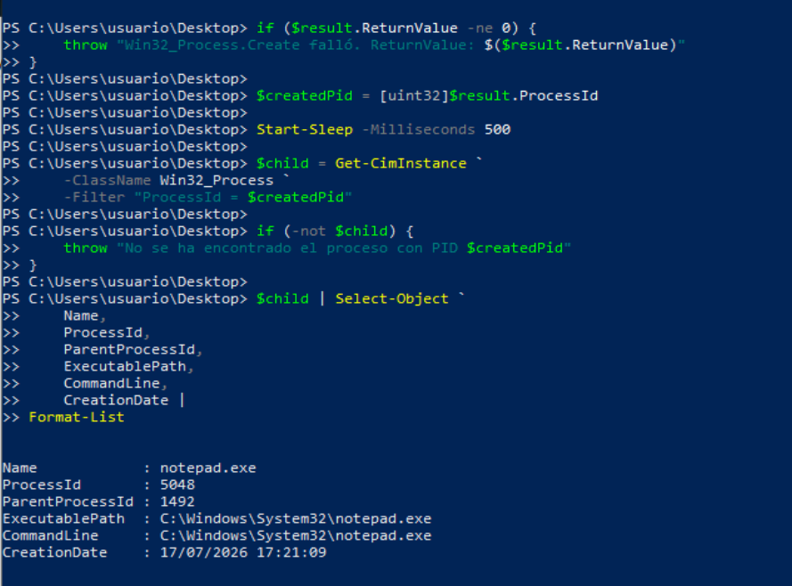

Obtenemos:

```bash
Name            : notepad.exe
ProcessId       : 5048
ParentProcessId : 1492
ExecutablePath  : C:\Windows\System32\notepad.exe
CommandLine     : C:\Windows\System32\notepad.exe
CreationDate    : 17/07/2026 17:21:09
```

Esta es la confirmación decisiva: el PID devuelto por Win32_Process.Create corresponde al proceso solicitado.


----

Identificar el proceso padre:

```bash
$parent = Get-CimInstance `
    -ClassName Win32_Process `
    -Filter "ProcessId = $($child.ParentProcessId)" `
    -ErrorAction SilentlyContinue

[PSCustomObject]@{
    Technique          = 'WMI process creation'
    Class              = 'Win32_Process'
    Method             = 'Create'
    ReturnValue        = $result.ReturnValue
    ChildName          = $child.Name
    ChildPID           = $child.ProcessId
    ChildCommandLine   = $child.CommandLine
    ChildCreationDate  = $child.CreationDate
    ParentPID          = $child.ParentProcessId
    ParentName         = $parent.Name
    ParentPath         = $parent.ExecutablePath
    ParentCommandLine  = $parent.CommandLine
} | Format-List
```

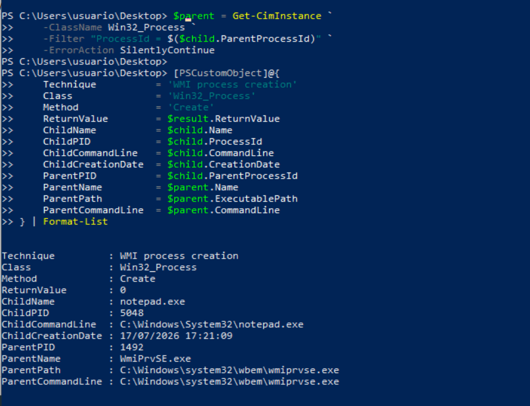

Cadena de ejecución demostrada:
```bash
PowerShell
    ↓
Invoke-CimMethod
    ↓
root/cimv2
    ↓
Win32_Process.Create
    ↓
WmiPrvSE.exe — PID 1492
    ↓
notepad.exe — PID 5048
```


La técnica se demostró invocando el método Create de la clase WMI Win32_Process. La operación devolvió ReturnValue = 0 y el PID 5048. Una consulta posterior confirmó que dicho PID correspondía a notepad.exe, ejecutado con la línea de comandos C:\Windows\System32\notepad.exe. Además, el proceso padre fue identificado como WmiPrvSE.exe, ubicado en C:\Windows\System32\wbem\wmiprvse.exe, lo que evidencia que la creación fue gestionada por el proveedor WMI de Windows.


-----

Demostracion con x64dbg:

La demostración más clara con x64dbg consiste en crear un ejecutable C++ nativo mínimo que invoque Win32_Process.Create mediante COM/WMI. Depurar powershell.exe o wmic.exe añade mucho código ajeno a la técnica.

Win32_Process.Create es un método estático que recibe los parámetros de creación y devuelve, entre otros valores, ReturnValue y ProcessId. La invocación se realiza mediante IWbemServices::ExecMethod, que remite la solicitud al proveedor WMI correspondiente y espera su respuesta.


wmi_create.cpp:
```c
#include <Windows.h>
#include <Wbemidl.h>
#include <iostream>
#include <cstdint>

#pragma comment(lib, "wbemuuid.lib")
#pragma comment(lib, "ole32.lib")
#pragma comment(lib, "oleaut32.lib")

template <typename T>
void SafeRelease(T*& ptr)
{
    if (ptr != nullptr)
    {
        ptr->Release();
        ptr = nullptr;
    }
}

std::uint32_t VariantToUInt32(const VARIANT& value)
{
    switch (value.vt)
    {
    case VT_UI4:
        return value.ulVal;

    case VT_I4:
        return static_cast<std::uint32_t>(value.lVal);

    case VT_UI2:
        return value.uiVal;

    case VT_I2:
        return static_cast<std::uint32_t>(value.iVal);

    default:
        return 0;
    }
}

int wmain()
{
    HRESULT hr = S_OK;
    bool comInitialized = false;

    IWbemLocator* locator = nullptr;
    IWbemServices* services = nullptr;
    IWbemClassObject* processClass = nullptr;
    IWbemClassObject* inputDefinition = nullptr;
    IWbemClassObject* inputInstance = nullptr;
    IWbemClassObject* outputInstance = nullptr;

    BSTR nameSpace = nullptr;
    BSTR className = nullptr;
    BSTR methodName = nullptr;

    VARIANT commandLine;
    VARIANT returnValue;
    VARIANT processId;

    VariantInit(&commandLine);
    VariantInit(&returnValue);
    VariantInit(&processId);

    hr = CoInitializeEx(nullptr, COINIT_MULTITHREADED);
    if (FAILED(hr))
    {
        std::wcerr << L"CoInitializeEx: 0x"
                   << std::hex << hr << L"\n";
        goto cleanup;
    }

    comInitialized = true;

    hr = CoInitializeSecurity(
        nullptr,
        -1,
        nullptr,
        nullptr,
        RPC_C_AUTHN_LEVEL_DEFAULT,
        RPC_C_IMP_LEVEL_IMPERSONATE,
        nullptr,
        EOAC_NONE,
        nullptr
    );

    if (FAILED(hr) && hr != RPC_E_TOO_LATE)
    {
        std::wcerr << L"CoInitializeSecurity: 0x"
                   << std::hex << hr << L"\n";
        goto cleanup;
    }

    hr = CoCreateInstance(
        CLSID_WbemLocator,
        nullptr,
        CLSCTX_INPROC_SERVER,
        IID_IWbemLocator,
        reinterpret_cast<void**>(&locator)
    );

    if (FAILED(hr))
        goto cleanup;

    nameSpace = SysAllocString(L"ROOT\\CIMV2");
    className = SysAllocString(L"Win32_Process");
    methodName = SysAllocString(L"Create");

    hr = locator->ConnectServer(
        nameSpace,
        nullptr,
        nullptr,
        nullptr,
        0,
        nullptr,
        nullptr,
        &services
    );

    if (FAILED(hr))
        goto cleanup;

    hr = CoSetProxyBlanket(
        services,
        RPC_C_AUTHN_WINNT,
        RPC_C_AUTHZ_NONE,
        nullptr,
        RPC_C_AUTHN_LEVEL_CALL,
        RPC_C_IMP_LEVEL_IMPERSONATE,
        nullptr,
        EOAC_NONE
    );

    if (FAILED(hr))
        goto cleanup;

    hr = services->GetObject(
        className,
        0,
        nullptr,
        &processClass,
        nullptr
    );

    if (FAILED(hr))
        goto cleanup;

    hr = processClass->GetMethod(
        methodName,
        0,
        &inputDefinition,
        nullptr
    );

    if (FAILED(hr))
        goto cleanup;

    hr = inputDefinition->SpawnInstance(
        0,
        &inputInstance
    );

    if (FAILED(hr))
        goto cleanup;

    commandLine.vt = VT_BSTR;
    commandLine.bstrVal =
        SysAllocString(L"C:\\Windows\\System32\\notepad.exe");

    hr = inputInstance->Put(
        L"CommandLine",
        0,
        &commandLine,
        0
    );

    if (FAILED(hr))
        goto cleanup;

    VariantClear(&commandLine);

    std::wcout
        << L"Preparado para llamar a IWbemServices::ExecMethod.\n"
        << L"Pulsa Enter para continuar...\n";

    std::wcin.get();

    hr = services->ExecMethod(
        className,
        methodName,
        0,
        nullptr,
        inputInstance,
        &outputInstance,
        nullptr
    );

    std::wcout << L"ExecMethod HRESULT: 0x"
               << std::hex << hr << std::dec << L"\n";

    if (FAILED(hr) || outputInstance == nullptr)
        goto cleanup;

    hr = outputInstance->Get(
        L"ReturnValue",
        0,
        &returnValue,
        nullptr,
        nullptr
    );

    if (FAILED(hr))
        goto cleanup;

    hr = outputInstance->Get(
        L"ProcessId",
        0,
        &processId,
        nullptr,
        nullptr
    );

    if (FAILED(hr))
        goto cleanup;

    std::wcout
        << L"ReturnValue: " << VariantToUInt32(returnValue) << L"\n"
        << L"ProcessId: " << VariantToUInt32(processId) << L"\n"
        << L"Pulsa Enter para finalizar.\n";

    std::wcin.get();

cleanup:

    VariantClear(&commandLine);
    VariantClear(&returnValue);
    VariantClear(&processId);

    SafeRelease(outputInstance);
    SafeRelease(inputInstance);
    SafeRelease(inputDefinition);
    SafeRelease(processClass);
    SafeRelease(services);
    SafeRelease(locator);

    SysFreeString(methodName);
    SysFreeString(className);
    SysFreeString(nameSpace);

    if (comInitialized)
        CoUninitialize();

    return FAILED(hr) ? 1 : 0;
}
```


El programa reproduce el procedimiento recomendado para métodos WMI: obtener la definición del método, crear una instancia de los parámetros de entrada, rellenarla y pasarla como pInParams a ExecMethod.

----

Compilación

Desde x64 Native Tools Command Prompt for Visual Studio:
```bash
cl /nologo /EHsc /Zi /Od /DUNICODE /D_UNICODE wmi_create.cpp /link /DEBUG
```

Ejecutamos:
```bash
x64 Native Tools Command Prompt for VS 2022
```

Ejecutamos:
```bash
cl /nologo /EHsc /Zi /Od /std:c++17 /DUNICODE /D_UNICODE wmi_create.cpp /link /DEBUG
```

Al finalizar obtenemos:
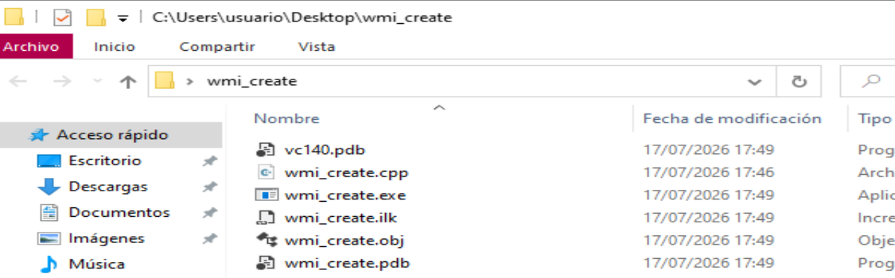

----


Después ejecutamos una primera prueba:
```bash
wmi_create.exe
```
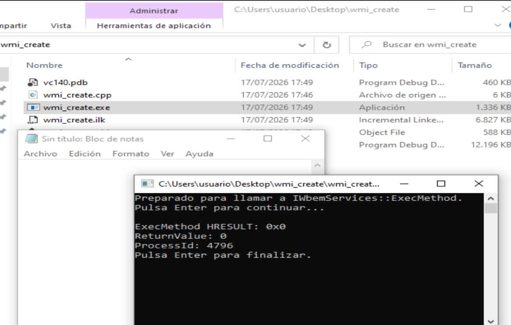

Esto confirma que IWbemServices::ExecMethod ejecutó Win32_Process.Create y creó correctamente notepad.exe. Ahora toca demostrar internamente la secuencia con x64dbg.


Preparamos una ejecución limpia: Cerramos la consola y el Bloc de notas de esta prueba:

```bash
Stop-Process -Id 4796 -Force -ErrorAction SilentlyContinue
```

-----


Después abrimos en x64dbg:
```bash
C:\Users\usuario\Desktop\wmi_create\wmi_create.exe
```

Localizamos la preparación de CommandLine. En x64dbg:

```bash
CPU
→ clic derecho
→ Search for
→ Current Module
→ String references
```

Buscamos
```bash
CommandLine
```

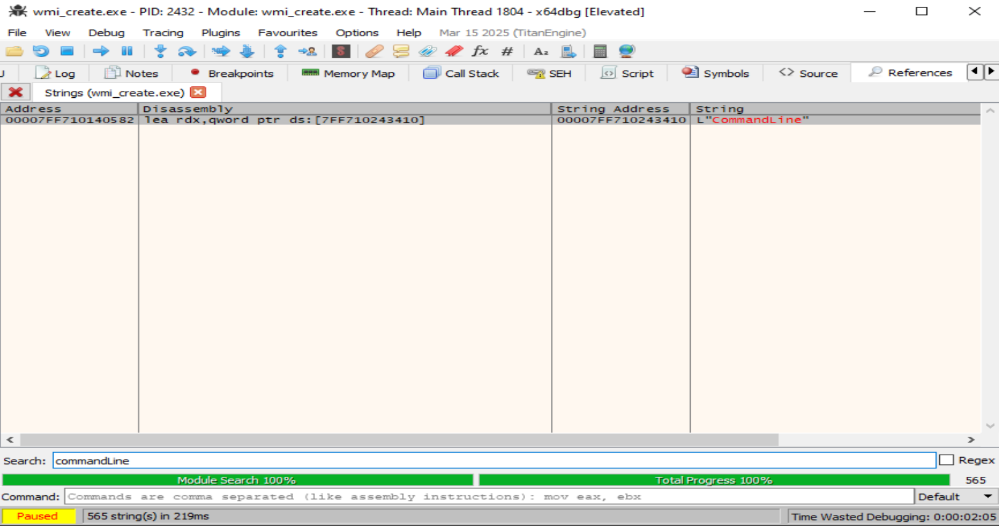

Hacemos doble clic en su referencia.
```bash
Referencia de código: 00007FF710140582
Dirección de cadena:  00007FF710243410
```

Hacemos doble clic sobre la fila:

```bash
00007FF710140582  lea rax,qword ptr ds:[7FF710243410]
```

x64dbg volverá a la ventana CPU y mostrará esa instrucción.

Colocamos ahí un breakpoint con F2:

```bash
bp 00007FF710140582
```

Después pulsamos F9.

La ejecución debe detenerse antes de introducir la propiedad CommandLine en el objeto WMI.


-------

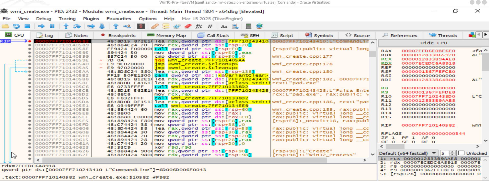


El RIP está en:

```bash
00007FF710140582  lea rdx,[00007FF710243410] ; L"CommandLine"
```

La instrucción todavía no se ha ejecutado. Avanzamos dos veces con F8:

```bash
00007FF710140582  lea rdx,[L"CommandLine"]
00007FF710140589  mov rcx,[rsp+70]
```

-----

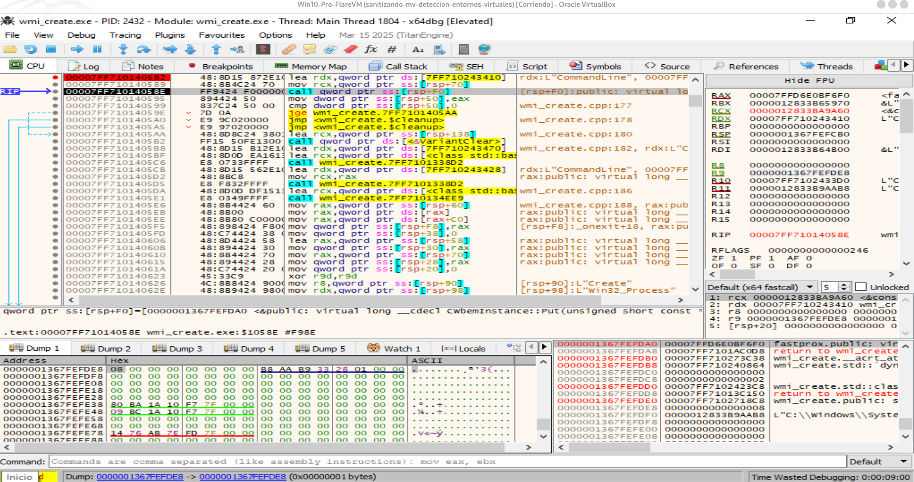


Esta captura ya demuestra correctamente la preparación de:

```bash
inputInstance->Put(
    L"CommandLine",
    0,
    &commandLine,
    0
);
```

Los argumentos son:
```bash
RCX = 0000012833BBA9A60   → objeto IWbemClassObject de entrada
RDX = 00007FF710243410    → L"CommandLine"
R8  = 0                   → flags
R9  = 000001367FEFDE8     → VARIANT
[RSP+20] = 0              → tipo CIM
```

En el Dump de `R9` se observa:

```bash
08 00 00 00 00 00 00 00
```

Por tanto:

```bash
WORD [R9] = 8 = VT_BSTR
```

Y en:

```bash
QWORD [R9+8] = 0000012833B9AAB8
```

se encuentra el puntero al BSTR que contiene la línea de comandos.

------

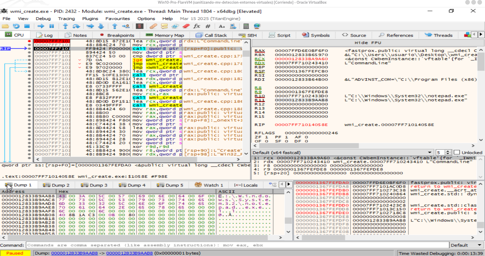

x64dbg identifica el destino como CWbemInstance::Put, equivalente a:

```bash
inputInstance->Put(
    L"CommandLine",
    0,
    &commandLine,
    0
);
```

Los argumentos visibles son:

```bash
RDX → L"CommandLine"
R8  = 0
R9  → VARIANT
```

En el volcado has seguido el puntero contenido en el VARIANT y se observa claramente:

```bash
C:\Windows\System32\notepad.exe
```

Además, el inicio del VARIANT mostrado anteriormente contenía:

```bash
08 00
```

por lo que:

```bash
VARIANT.vt = 8 = VT_BSTR
```

La captura demuestra:

```bash
Propiedad WMI: CommandLine
Tipo:          VT_BSTR
Valor:         C:\Windows\System32\notepad.exe
Método:        IWbemClassObject::Put
```

-----


Pulsamos F8 una vez para pasar la llamada. Quedamos en:

```bash
00007FF710140595  mov dword ptr [rsp+50],eax
```

Comprobamos EAX.
```bash
EAX = 00000000
```

Eso corresponde a:
```bash
HRESULT = S_OK
```

y confirma que CommandLine se introdujo correctamente en el objeto de parámetros WMI.

-----

Continuamos:
```bash
call qword ptr [rsp+F8]
```

Colocamos un breakpoint con F2 sobre ese último call.


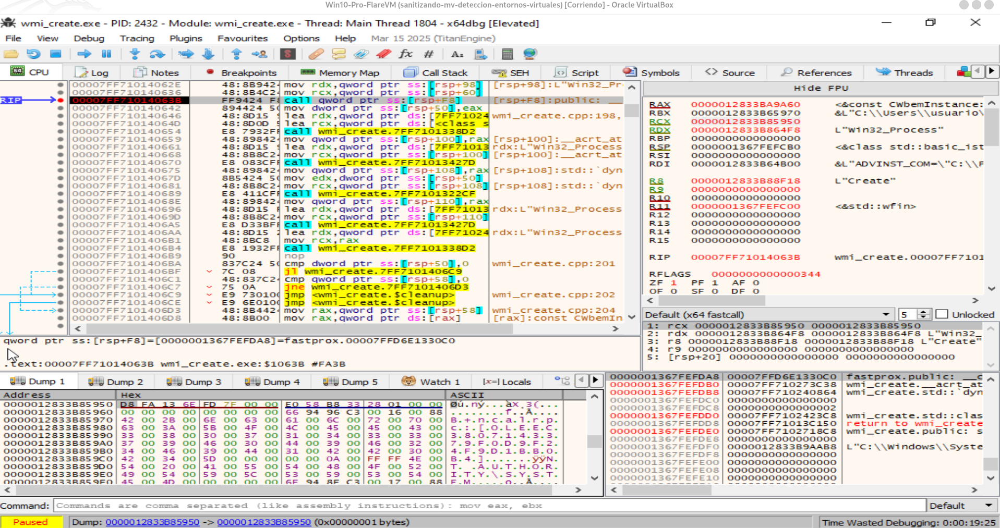


Estamos detenido justo antes de ejecutar IWbemServices::ExecMethod. El RIP está en:

```bash
00007FF71014063B  call qword ptr [rsp+F8]
```

Las instrucciones anteriores preparan:

```bash
00007FF71014062E  mov rdx,[rsp+98]  ; L"Win32_Process"
00007FF710140636  mov rcx,[rsp+60]  ; IWbemServices*
00007FF71014063B  call [rsp+F8]     ; ExecMethod
```

Los registros confirman los argumentos:

```bash
RCX = 0000012833B85950  → IWbemServices
RDX = 0000012833B864F8  → L"Win32_Process"
R8  = 0000012833B88F18  → L"Create"
R9  = 0                 → flags
```

En la convención x64, los argumentos restantes se encuentran en la pila:

```bash
[RSP+20] = pCtx
[RSP+28] = pInParams
[RSP+30] = ppOutParams
[RSP+38] = ppCallResult
```

La llamada reconstruida es:

```bash
services->ExecMethod(
    L"Win32_Process",
    L"Create",
    0,
    nullptr,
    inputInstance,
    &outputInstance,
    nullptr
);
```

Esta captura demuestra que el programa solicita a WMI la ejecución del método Create de la clase Win32_Process.

-----


Pulsamos F8 una sola vez. Quedamos en:

```bash
00007FF710140642  mov dword ptr [rsp+50],eax
```

Comprobamos EAX. El resultado es:

```bash
EAX = 00000000
```

Esto significa:

```bash
HRESULT = S_OK
```

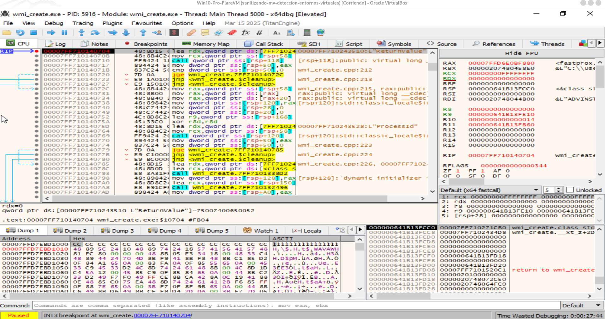

----

Recuperar ReturnValue: Pulsamos F8 dos veces, hasta quedar en:

```bash
00007FF710140710  call qword ptr [rsp+118]
```

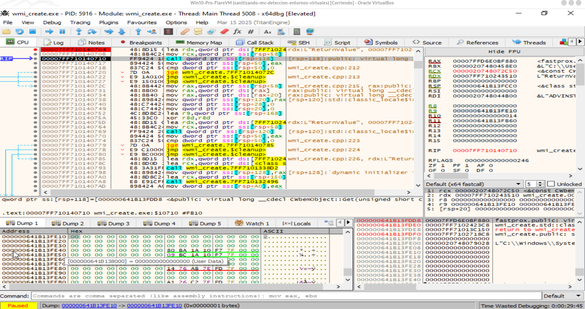

Estamos justo antes de ejecutar la recuperación de ReturnValue.

Los argumentos están correctamente preparados:
```bash
RCX → objeto de salida devuelto por ExecMethod
RDX → L"ReturnValue"
R8  = 0
R9  = 000000641B13FE10 → VARIANT de salida
```

El VARIANT debería quedar aproximadamente así:
```bash
Offset +0:  03 00 ...   → VT_I4
Offset +8:  00 00 00 00 → ReturnValue = 0
```

-----


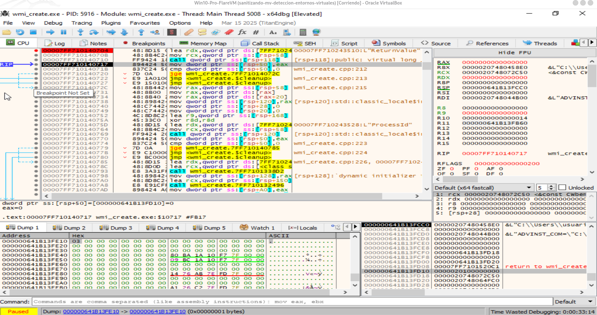


Esta captura confirma correctamente la recuperación de ReturnValue. Estamos detenidos en:
```bash
00007FF710140717  mov dword ptr [rsp+50],eax
```

La llamada anterior a CWbemObject::Get(L"ReturnValue") ya se ejecutó.


En los registros:

```bash
EAX = 00000000
```

Por tanto:

```bash
IWbemClassObject::Get → HRESULT = S_OK
```

En el VARIANT situado en:

```bash
000000641B13FE10
```

se observa:

```bash
03 00 00 00 ... 00 00 00 00
```

Interpretación:

```bash
WORD  [641B13FE10]   = 3 → VT_I4
DWORD [641B13FE18]   = 0 → ReturnValue = 0
```

Esto demuestra que Win32_Process.Create finalizó correctamente. La propiedad ReturnValue fue recuperada mediante IWbemClassObject::Get. La llamada devolvió S_OK y el VARIANT resultante era de tipo VT_I4, con valor cero, confirmando que Win32_Process.Create ejecutó correctamente la creación del proceso.

-----

recuperar ProcessId. Colocamos un breakpoint en:

```bash
00007FF710140769
```

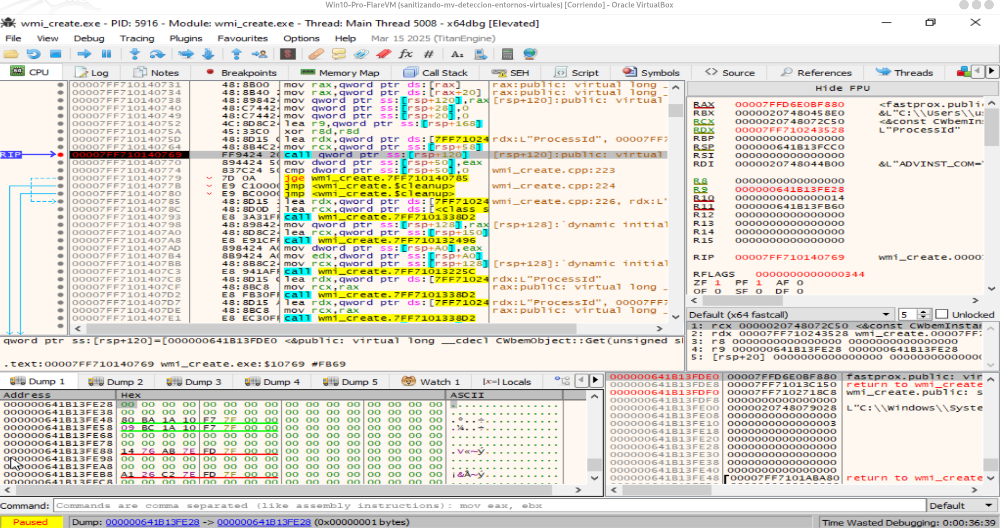

```bash
RCX → objeto de salida devuelto por ExecMethod
RDX → L"ProcessId"
R8  = 0
R9  = 000000641B13FE28 → VARIANT donde se guardará el PID
```


-----


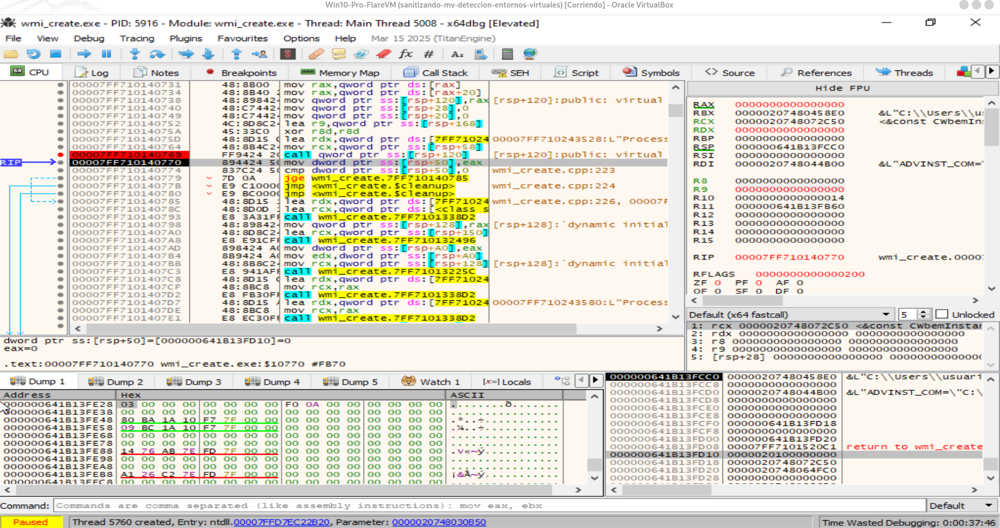


El registro muestra:

```bash
EAX = 00000000
```

Por tanto, la recuperación de la propiedad ProcessId devolvió:

```bash
HRESULT = S_OK
Interpretación del VARIANT
```

El VARIANT empleado para almacenar el resultado estaba en:

```bash
000000641B13FE28
```

En el volcado se observa:

```bash
000000641B13FE28  03 00 00 00 00 00 00 00
000000641B13FE30  F0 0A 00 00 00 00 00 00
```

Interpretación:

```bash
WORD  [641B13FE28] = 3
DWORD [641B13FE30] = 00000AF0
```

El tipo 3 corresponde a:

```bash
VT_I4
```

Y el identificador de proceso es:

```bash
0x0AF0 = 2800 decimal
```

Por tanto:

```bash
ProcessId = 2800
```

Que R9 aparezca ahora a cero no invalida el resultado: R9 es un registro volátil y la llamada COM puede modificarlo. La dirección del VARIANT se obtuvo y siguió antes de ejecutar el call.


----


Mientras notepad.exe continúe abierto, ejecutamos:

```bash
Get-CimInstance Win32_Process `
    -Filter "ProcessId = 2800" |
Select-Object `
    Name,
    ProcessId,
    ParentProcessId,
    ExecutablePath,
    CommandLine,
    CreationDate |
Format-List
```

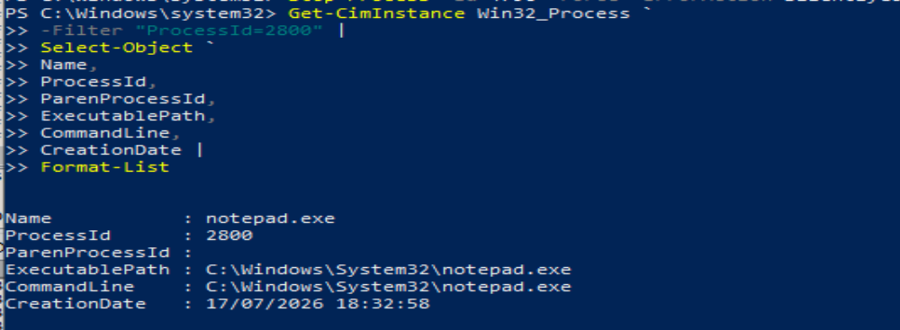


En el depurador, el VARIANT de ProcessId contenía:
```bash
0x0AF0 = 2800 decimal
```

La consulta posterior confirma que ese PID corresponde a:

```bash
Name           : notepad.exe
ProcessId      : 2800
ExecutablePath : C:\Windows\System32\notepad.exe
CommandLine    : C:\Windows\System32\notepad.exe
CreationDate   : 17/07/2026 18:32:58
```

Por tanto, existe correspondencia directa entre:
```bash
IWbemClassObject::Get("ProcessId")
        ↓
ProcessId = 2800
        ↓
Win32_Process con PID 2800
        ↓
notepad.exe
```

Que ParentProcessId aparezca vacío en esta consulta no invalida la demostración. La creación ya está probada por:

```bash
Put("CommandLine", ...) con un VT_BSTR que contenía la ruta de notepad.exe.
ExecMethod("Win32_Process", "Create").
ReturnValue = 0.
ProcessId = 2800.
Confirmación externa de que el PID 2800 era notepad.exe.
```


El valor recuperado dinámicamente mediante IWbemClassObject::Get para la propiedad ProcessId fue 0xAF0, equivalente al PID decimal 2800. Una consulta posterior a la clase Win32_Process confirmó que dicho identificador correspondía a notepad.exe, ejecutado desde C:\Windows\System32\notepad.exe. Esta correspondencia, junto con el valor ReturnValue = 0 y la llamada observada a IWbemServices::ExecMethod con la clase Win32_Process y el método Create, demuestra que el proceso fue creado correctamente mediante WMI.


----

## 5.13.8 Creación y ejecución diferida de procesos mediante WMI y Win32_ScheduledJob

Abromos Windows PowerShell como administrador y ejecutamos:

```bash
New-Item `
    -Path 'HKLM:\SOFTWARE\Microsoft\Windows NT\CurrentVersion\Schedule\Configuration' `
    -Force | Out-Null

New-ItemProperty `
    -Path 'HKLM:\SOFTWARE\Microsoft\Windows NT\CurrentVersion\Schedule\Configuration' `
    -Name EnableAt `
    -PropertyType DWord `
    -Value 1 `
    -Force

Get-Service Schedule |
    Select-Object Name, Status, StartType
```


Después reinicia la VM:

```bash
Restart-Computer
```

Microsoft documenta EnableAt = 1 y advierte de que puede ser necesario reiniciar para activar el protocolo.

---


Creamos el programa de laboratorio:

[wmi_scheduledjob.cpp](../../modulo-evasion/utiles/wmi_scheduledjob.cpp)


Win32_ScheduledJob.Create recibe Command, StartTime, parámetros opcionales de repetición e interacción y devuelve JobId. La cadena StartTime debe utilizar el formato DMTF, con la fecha sustituida por ocho asteriscos.

-----

Desde x64 Native Tools Command Prompt for VS 2022:

```bash
cd /d C:\Users\usuario\Desktop\wmi_scheduledjob

cl /nologo /EHsc /Zi /Od /std:c++17 /DUNICODE /D_UNICODE wmi_scheduledjob_v2.cpp /Fe:wmi_scheduledjob_v2.exe /link /DEBUG
```

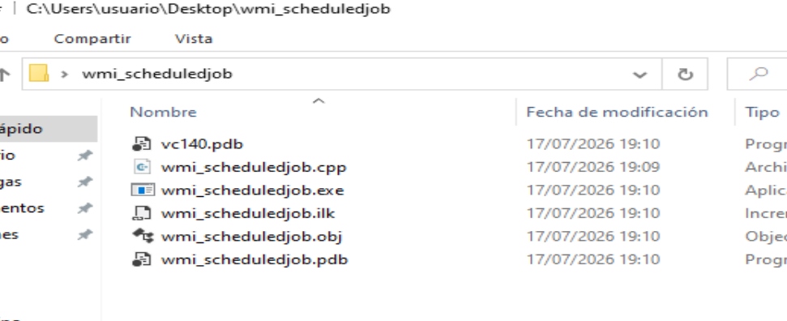


----


En el menú Inicio buscamos:

```bash
x64 Native Tools Command Prompt for VS 2022
```

Ejecutamos como administrador:


```bash
Administrador: x64 Native Tools Command Prompt for VS 2022
```

Ejecutamos como administrador:
```bash
wmi_scheduledjob.exe
```


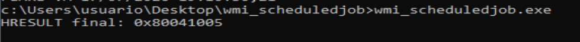


Obtenemos
```bash
IWbemServices::ExecMethod = 0x0
ReturnValue               = 0
JobId                     = 1
```

Esto demuestra que WMI aceptó la llamada y que Win32_ScheduledJob::Create creó realmente el trabajo programado.


---

Apertura en x64dbg como administrador:

```bash
wmi_scheduledjob.exe
```

Sin argumentos.

Buscamos en:

```bash
CPU → Search for → Current Module → String references
```

estas cadenas:

```bash
Command
StartTime
Win32_ScheduledJob
Create
ReturnValue
JobId
Preparado para IWbemServices::ExecMethod
```


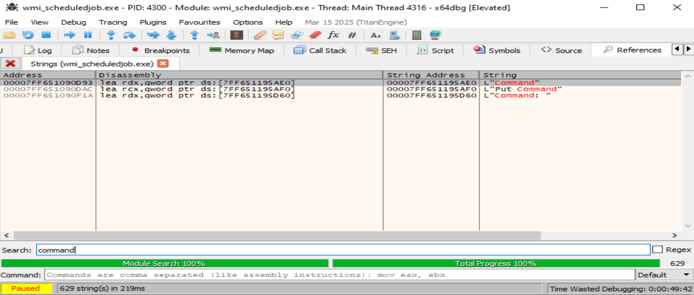

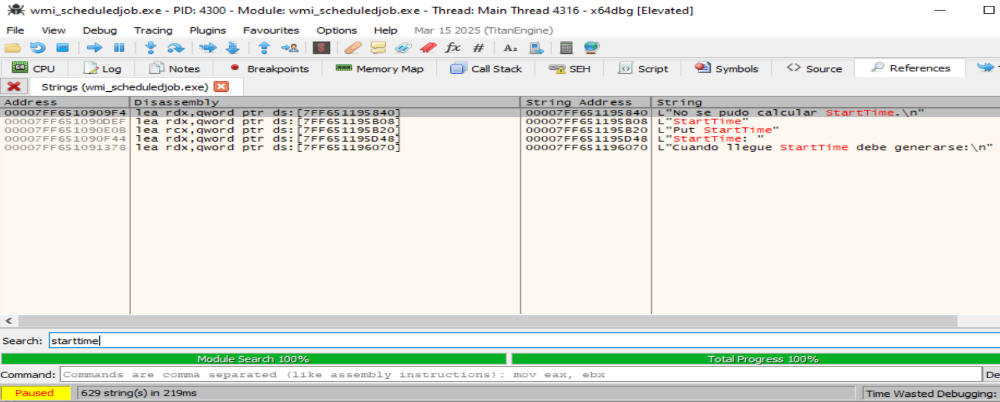

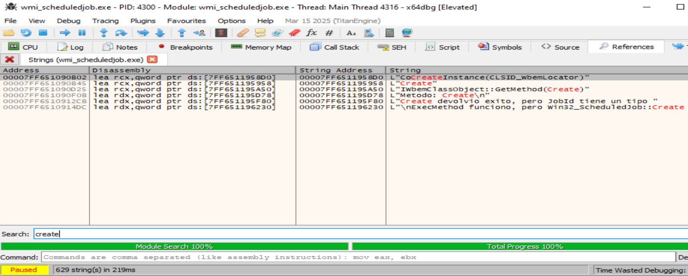

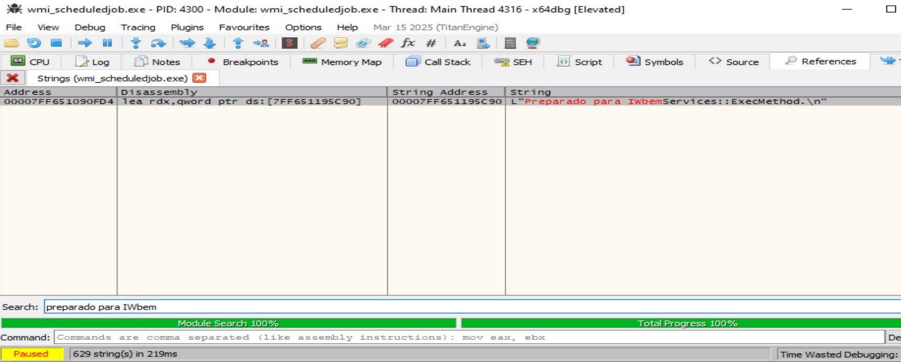

----

Primera evidencia: Command: Hacemos doble clic en 00007FF651090D93:

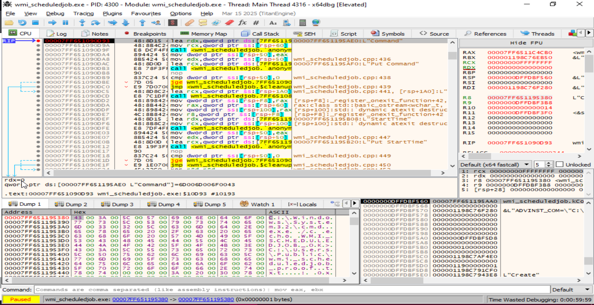

Parámetros
```bash
RCX → objeto de parámetros WMI
RDX → L"Command"
R8  → comando completo

```
R8 apunta a:

```bash
C:\Windows\System32\cmd.exe /c echo WMI_SCHEDULEDJOB_OK>C:\Users\Public\wmi_scheduledjob_proof.txt
```

Colocamos un breakpoint sobre el `call PutString` y usamos `F7`, no `F8`. Dentro de la función se ejecutarán:
```bash
SysAllocString
        ↓
VARIANT.vt = VT_BSTR
        ↓
IWbemClassObject::Put
```

Nos detenemos justo antes de la llamada virtual a Put. En ese punto aparece:

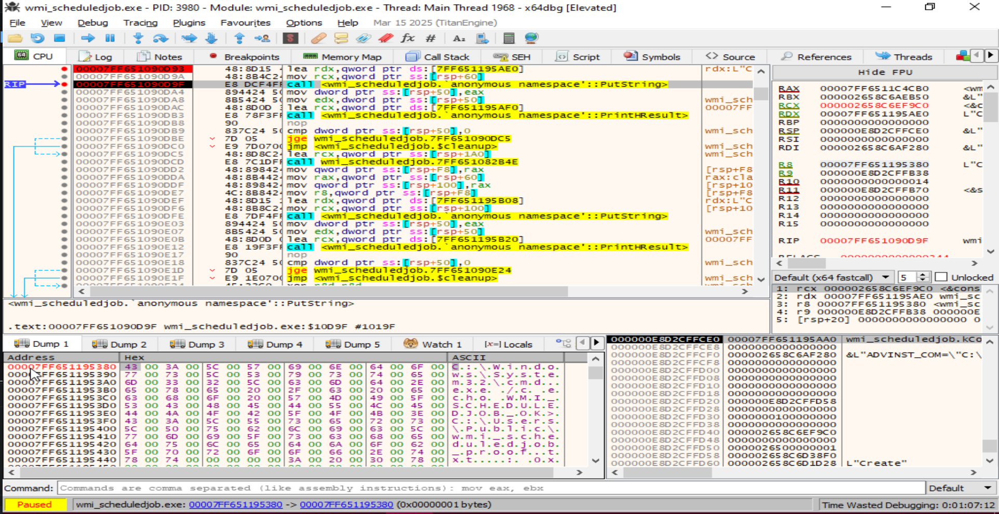

Los tres argumentos de PutString están preparados:

```bash
RCX = 000002658C6EF9C0  → objeto IWbemClassObject de parámetros
RDX = 00007FF651195AE0  → L"Command" → Command 
R8  = 00007FF651195380  → valor de la propiedad → comando completo
```

La llamada de alto nivel es:

```bash
PutString(
    inputInstance,
    L"Command",
    L"C:\\Windows\\System32\\cmd.exe /c echo ..."
);
```

En este punto, R9 todavía no es el VARIANT. PutString solo recibe tres argumentos; el VARIANT se construirá dentro de esa función.


Entramos dentro de la función y colocamos un breakpoint en `call qword ptr [rsp+38]`:

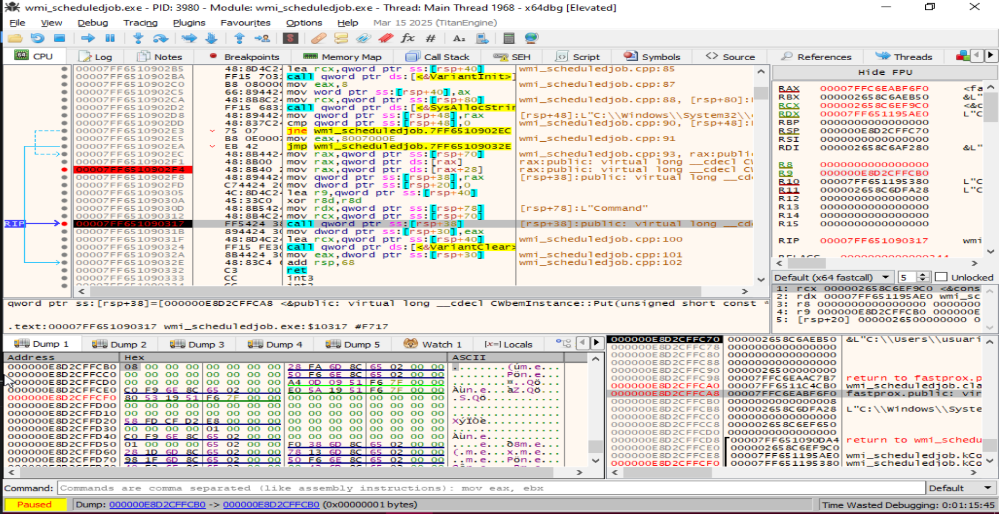

Seguimos R9 en el Dump:

```bash
WORD [R9] = 8
```

Esto corresponde a:

```bash
VT_BSTR
```

Y:

```bash
QWORD [R9+8]
```

Apunta a:

```bash
C:\Windows\System32\cmd.exe /c echo WMI_SCHEDULEDJOB_OK>C:\Users\Public\wmi_scheduledjob_proof.txt
```

Ahora ejecutamos el `call qword ptr [rsp+38]` con F8. El registro muestra:

```bash
EAX = 00000000
```

Por tanto:

```bash
Put("Command", ...) → HRESULT = S_OK
```

La propiedad Command se ha introducido correctamente. Confirma que IWbemClassObject::Put("Command", …) devolvió S_OK.


En la barra de comandos de x64dbg escribimos:

```bash
dump rsp+40
```

El VARIANT está en [RSP+40]. Observamos:

```bash
WORD [RSP+40] = 8
```

Esto significa:

```bash
VT_BSTR
```

El puntero a la cadena se encuentra en:

```bash
QWORD [RSP+48]
```


------

Segunda evidencia: StartTime

La referencia correcta es:

```bash
00007FF651090DEF → L"StartTime"
```


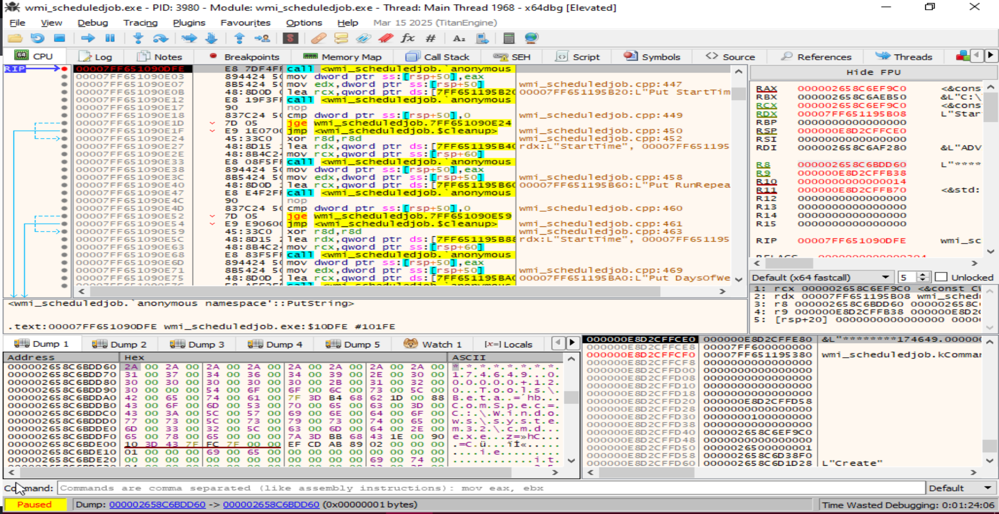


Entramos otra vez en PutString: Desde el call de StartTime, pulsamos: F7


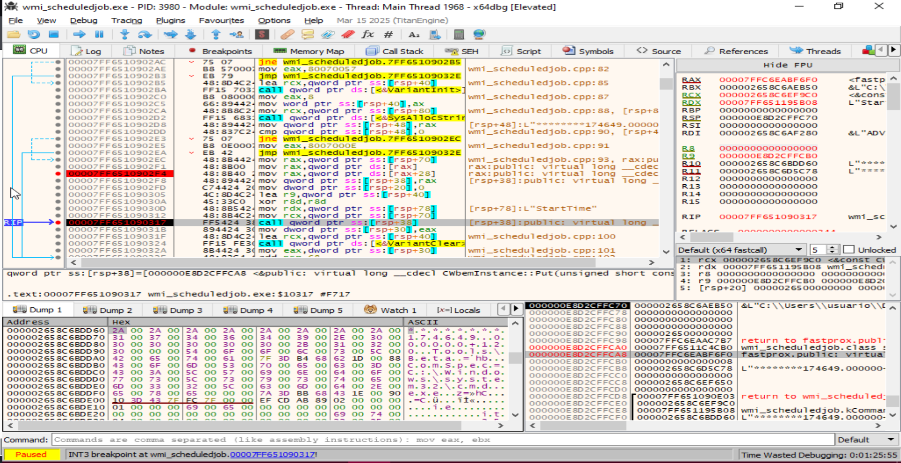


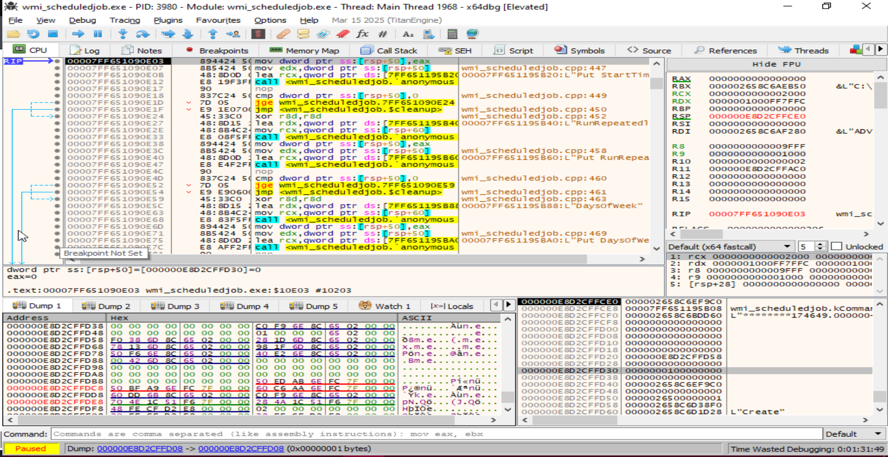

Estamos justo después de regresar de PutString:

```bash
00007FF651090DFE  call PutString
00007FF651090E03  mov dword ptr [rsp+50],eax   ; RIP actual
```

El panel de registros y la anotación inferior muestran:

```bash
EAX = 00000000
```

Por tanto:

```bash
PutString("StartTime", ...) → HRESULT = S_OK
```

La instrucción actual todavía no se ha ejecutado. Al pulsar F8, guarda el resultado en:

```bash
mov dword ptr [rsp+50],eax
```

Después se comprueba:

```bash
cmp dword ptr [rsp+50],0
jge 00007FF651090E24
```

Como el valor es `0`, se seguirá la ruta de éxito.


Hemos demostrado:

```bash
Propiedad: StartTime
Tipo:      VT_BSTR
Valor:     ********174649.000000+120
Resultado: S_OK
```

Es decir, la hora programada quedó insertada correctamente en la instancia de parámetros de Win32_ScheduledJob.Create.


--------


Localizar ExecMethod

La referencia:

```bash
00007FF651090FD4
```

corresponde al mensaje:

```bash
L"Preparado para IWbemServices::ExecMethod.\n"
```

Ejecución limpia. Reiniciamos la aplicacion en x64dbg antes de continuar. Conservamos estos breakpoints:
```bash
bp wmi_scheduledjob.exe:$1106F   ; call ExecMethod
bp wmi_scheduledjob.exe:$11076   ; instrucción inmediatamente posterior
bp wmi_scheduledjob.exe:$110F3
bp wmi_scheduledjob.exe:$110FA
bp wmi_scheduledjob.exe:$11158
bp wmi_scheduledjob.exe:$1115F
```

En $1106F comprobamos:

```bash
RDX → L"Win32_ScheduledJob"
R8  → L"Create"
R9  = 0
```

Pulsamos F9. En $11076 aparece:

```bash
EAX = 0
```

Esto confirma ExecMethod = S_OK. Pulsa F9.

En $110F3, antes de la llamada:

```bash
RDX → L"ReturnValue"
R9  → [RSP+158]
```

Pulsamos F9 para ejecutar la llamada y detenernos en $110FA. El resultado es:

```bash
EAX = 0
word:[rsp+158]  = 3
dword:[rsp+160] = 0
```

Interpretación:

```bash
VARIANT.vt = 3 = VT_I4
ReturnValue = 0

```

En $11158: 
```bash
RDX → L"JobId"
R9  → [RSP+168]
```

Pulsamos F9 para llegar a $1115F:

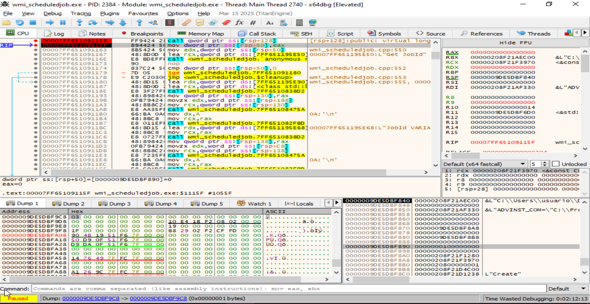


```bash
EAX = 0
word:[rsp+168]  = 3
dword:[rsp+170] = valor distinto de cero
```


------
## 5.14. Conclusiones

