# 2. Hashes

## 2.1 Colisión.
**Usa los archivos de la carpeta "hashes": archivo_1 y archivo_2.**

**Calcula el hash SHA-1 (haz captura de pantalla) y explica que está ocurriendo y por qué sucede.**

**¿Qué algoritmo utilizarías para obtener hashes diferentes? Explica como lo soluciona. Razona tu respuesta (añade captura de pantalla).**

--------------------------------------------

**Vemos que los documentos son diferentes:**  


**Usamos comando `file` y `ls` para obtener información de los ficheros:**  

- Comprobamos que ambos ficheros son documentos pdfs.
- Tienen exactamente el mismo tamaño.


**Calculamos hash-1:**  
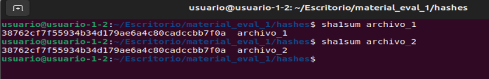
- SHA-1 de los archivos son iguales: 38762cf7f55934b34d179ae6a4c80cadccbb7f0a


**Usamos la función hash criptográfica sha-256:**  
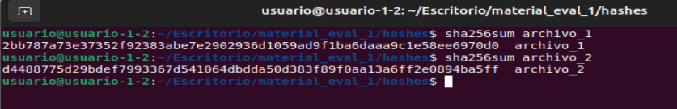

SHA-256 de los archivos son distintos:
- archivo_1: 2bb787a73e37352f92383abe7e2902936d1059ad9f1ba6daaa9c1e58ee6970d0
- archivo_2: d4488775d29bdef7993367d541064dbdda50d383f89f0aa13a6ff2e0894ba5ff


**Propiedades criptográficas de sha-256:**
- Resistencia a colisiones: encontrar dos entradas distintas con el mismo hash cuesta ≈ 2<sup>128</sup> operaciones (por el ataque de cumpleaños).
- Estado actual: no hay colisiones prácticas conocidas para SHA-256; sigue considerándose seguro (a diferencia de SHA-1).


## Comparamos los dos archivos con el comando linux `cmp`
El comando `cmp` comparará byte a byte ambos archivos y mostrará sus diferencias. Usaremos la opción `-l` para listar todas las posiciones donde difieren.
```bash
usuario@usuario-1-2:$ cmp -l archivo_1 archivo_2 
   193 163 177
   196 221 223
   197 146 246
   200  21   1
   201 217  73
   204 266 252
   205  41  35
   208  17  13
   209 371 105
   212 314 326
   213 250 210
   216 133 113
   217 250 214
   220   3  37
   221  14 340
   224 342 366
   225  30  24
   228 263 261
   229 251 151
   232 325 305
   233 337 153
   236 117 123
   237  46  12
   240 263 267
   241 334 140
   244 152 162
   245 302 162
   248 275 255
   252 105 111
   253 274   4
   256 322 302
   257  74  60
   260 353 351
   261  24 324
   264 273 253
   265 125 341
   268 240 274
   269 250 224
   272  61  65
   273 376 102
   276  67  55
   277 270 230
   280  37  17
   281  16  52
   284 337 303
   285 223 177
   288   0  24
   289 353 347
   292  15  17
   293 354  54
   296 144 164
   297 171 315
   300  54  60
   301 166 132
   304 140 144
   305 335 141
   308 221 211
   309 320 140
   312 257 277
   316 244 250
   317 274   4
   320 261 241
```
La salida del comando `cmp` muestra cada diferencia encontrada entre los archivos, estableciendo tres columnas:
- Número de byte (empieza en 1, no en 0).
- Valor del byte en archivo_1 en octal.
- Valor del byte en archivo_2 en octal.

Por ejemplo, el byte 193 (contado desde el 1):
- En el archivo 1, aparece: 163 (octal) → es 0x73 (hex) = 115 (dec) → carácter ASCII: 's' (minúscula).
- En el archivo 2, aparece: 177 (octal) → es 0x7F (hex) = 127 (dec) → carácter ASCII: DEL (no imprimible).


## Extraemos las diferencias
Vamos a mostar el primer y el ultimo offset distintos entre ambos ficheros (contado desde 1).
- Primer offset que difiere: `cmp -l archivo_1 archivo_2 | awk 'NR==1{print $1; exit}'` → 193
- Último offset que difiere: `cmp -l archivo_1 archivo_2 | tail -n1 | awk '{print $1}'` → 320


donde:
- `awk 'NR==1{print $1; exit}'`→ toma solo la primera línea (NR==1), imprime la primera columna ($1, el offset) y sale para no procesar más.
- `| tail -n1 | awk '{print $1}'` → se queda sólo con la última línea del flujo e imprime el primer campo.
  
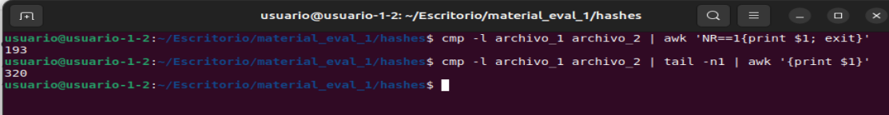


## Mostramos el contenido en todo el tramo 193–320 (base 1) con hexdump
```bash
hexdump -Cv -s 192 -n 128 archivo_1
hexdump -Cv -s 192 -n 128 archivo_2
```
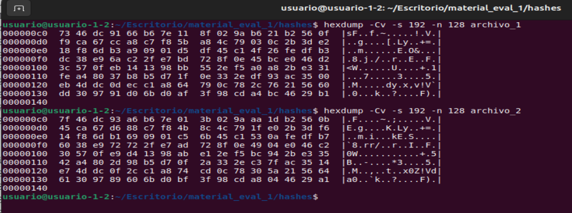

Donde:
- Inicio de las diferencias en base 0: 192
- Fin de las diferencias en base 0: 319
- Tamaño a mostrar: 319 − 192 + 1 = 128 bytes
- -s 192 →  salta 192 bytes (empieza en el offset 193 en base 1)
- -n 128 →  muestra justo 128 bytes.

## Sha-1 y los bloques de colisión
- SHA-1 trabaja en bloques de 512 bits = 64 bytes, contados desde el byte 0 del archivo.
- El primer byte distinto está en 193 (base 1) ⇒ 192 (base 0), y el último en 320 (base 1) ⇒ 319 (base 0).
- El rango 192..319 (base 0) tiene 128 bytes, o sea exactamente 2 bloques de 64 bytes consecutivos:
   - Bloque 3: 192–255
   - Bloque 4: 256–319
     
**Podemos decir que el tramo 192–319 son los bloques de colisión (dos bloques) que hacen que ambos archivos terminen con el mismo SHA-1.**


## Comprobación de que todo lo demás es idéntico
Aplicamos la función criptográfica sha256 a la parte del archivo antes de que empiece las diferencias para ver que son **IDENTICOS**:  
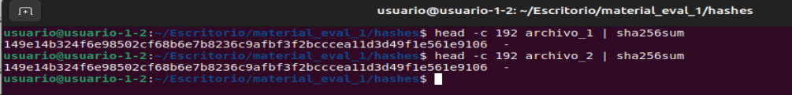

Alicar la función criptográfica sha256 a la parte del archivo al finalizar las diferencias para ver que son **IDENTICOS**:  
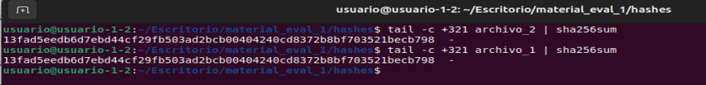

Esto corrobora que sólo difieren en esos 128 bytes y que son los dos bloques de colisión de SHA-1.


## Algoritmo que utilizaría para obtener hashes diferentes
Para evitar que dos ficheros distintos tengan el mismo hash, usaría algoritmos modernos como por ejemplo:
- SHA-256
- SHA-512
- MD5
- SHA-3-256 (Keccak)
- BLAKE2 / BLAKE3


**Cómo soluciona SHA-256 las colisiones:**
- Sha256 no parchea SHA-1; es un rediseño:
- Aumenta el tamaño de hash (de 160 → 256 bits).
- Reestructura el compresor para romper correlaciones lineales.
- Usa constantes y rotaciones adicionales para mejorar la difusión (pequeños cambios → hash completamente distinto).
- A día de hoy continúa sin colisiones conocidas.


### Nota histórica:
Los pdfs del ejercicio se corresponden con los que usaron en el experimento Google y CWI Amsterdam para demostrar la primera colisión práctica de SHA-1: llamada SHAttered (2017) →  https://shattered.io/

Desde entonces se usa como ejemplo académico clásico de por qué **SHA-1 no debe emplearse para seguridad criptográfica.**

## 2.2 SSDEEP.
ssdeep es un hash difuso (fuzzy hashing) que se usa para medir similitud entre ficheros. Detecta variaciones o alteraciones en un archivo. 

ssdeep divide el archivo en trozos según el contenido y genera una firma de esos trozos. Al comparar dos firmas, calcula un score de similitud.

No se usa para detectar colisiones criptográficas. No es un hash criptográfico: sirve para detección de contenido similar (malware, documentos parecidos, versiones, etc.).

ssdeep fragmenta el fichero en bloques y compara las cadenas resultantes; si la mayoría de bloques coinciden, la similitud es alta aunque haya diferencias localizadas.

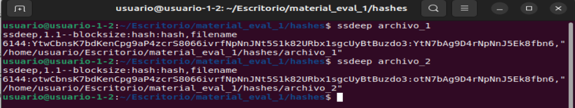

donde:
- 6144 bytes es el Blocksize → ssdeep eligió bloques de 6144 bytes (≈6 KB) para construir el fuzzy hash
- archivo_1 → 6144:**Y**twCbnsK7bdKenCpg9aP4zcrS8066ivrfNpNnJNt5S1k82URbx1sgcUyBtBuzdo3:**Y**tN7bAg9D4rNpNnJ5Ek8fbn6
- archivo_2 → 6144:**o**twCbnsK7bdKenCpg9aP4zcrS8066ivrfNpNnJNt5S1k82URbx1sgcUyBtBuzdo3:**o**tN7bAg9D4rNpNnJ5Ek8fbn6
- La única diferencia es una letra inicial (“Y” - “o”), lo que indica que ssdeep percibe una similitud muy alta, pero no idéntica.

Vemos que ssdeep no devuelve un simple hash; devuelve una huella sensible a los cambios. Aquí, el algoritmo detectó que los archivos son casi idénticos, con una pequeña variación (esas 128 bytes modificadas para provocar la colisión SHA-1). Esa pequeña diferencia cambió apenas un carácter del fuzzy hash.

Porcentaje de similitud: Usamos la opción `-d` para que calcule dicho porcentaje:  
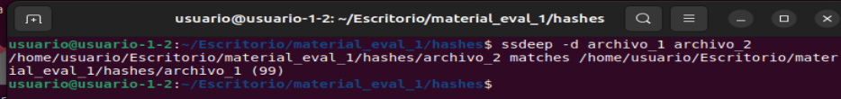

**Porcentaje de similitud detetada: 99**

--------------------------------------------

# 3. REGLAS YARA
## 3.1 YARA I
Usa los archivos de la carpeta "yara1".

Escribe una regla YARA por cada archivo.

Cada una de ellas deberá detectar la presencia de uno solo de los archivos. Es decir, la regla, pongamos "regla_1.yara", detecta el file1' y no el resto. Así con las otras dos.

Escribe una cuarta regla yara que detecte dos archivos de tu elección pero no detecte el que has descartado.

En el documento pdf de entrega, añade que estrategia has seguido para conseguirlo, así como la elección de la sintaxis yara y tu razonamiento para encontrar la solución. Documenta con capturas de pantalla.

--------------------------------------------

El nombre del archivo por sí solo no puede usarse como patrón de detección en una regla YARA estándar, ya que YARA analiza el contenido interno de los archivos y no su nombre en el sistema de archivos. Así, las condiciones deben referirse a datos o cadenas que estén realmente presentes dentro del contenido del archivo.

Para una detección precisa y exclusiva, buscaremos una cadena única dentro de cada archivo. Para ello usaremos el comando `cmp`para estudiar las diferencias que comparten los archivos.

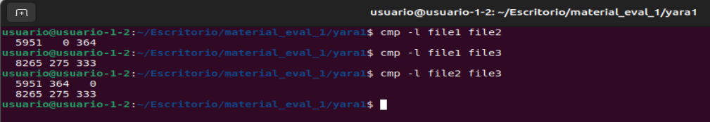


## Detección de file1
```
rule regla_1 : detection
{
	meta:
		description = "Detecta sólo file1 usando dos bytes característicos del file1"
		nota1 = "Offset en base 0: 5950 --> 0x00 --> Excluye a file2 que tiene en esa posición 364)octal --> 0xF4"
		nota2 = "Offset en base 0: 8264 --> 275)octal --> 0xBD --> Excluye a file 3 que tiene en esa posición 333)octal --> 0xDB"
		nota3 = "Al combinar ambas reglas, sólo puede cumplirse en file1"
		
	condition:
		uint8(5950) == 0x00 and uint8(8264) == 0xBD

}
```


## Detección de file2
```
rule regla_2 : detection
{
	meta:
		description = "Detecta sólo file2 usando el Offset base 0: 5950 del file2"
		nota1 = "En file2 el Offset en base 0: 5950 --> 364)octal --> 0xF4"
		nota2 = "En file1 el Offset en base 0: 5950 --> 0x0"
		nota3 = "En file3 el Offset en base 0: 5950 --> 0x0"
	
	condition:
		uint8(5950) == 0xF4

}
```
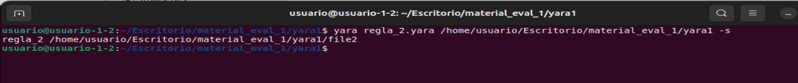


## Detección de file3
```
rule regla_3 : detection
{
	meta:
		description = "Detecta sólo file3 usando dos bytes característicos del file2"
		nota1 = "En file3 el Offset en base 0: 8264 -> 333)octal --> 0xDB --> Exluye a file1 que tiene en esa posición 0xBD"
		nota2 = "En file3 el Offset en base 0: 5950 -> 0)octal -->  0x0 --> Excluye a file2 que tiene en esa posición 364)octal --> 0xF4"
		nota3 = "Al combinar ambas reglas, sólo puede cumplirse en file3"
		
	condition:
		uint8(8264) == 0xDB and uint8(5950) == 0x0

}
```
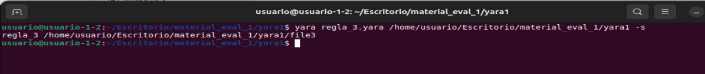

## Detecta file1 y file3
```
rule regla_4 : detection
{
	meta:
		description = "Detecta dos archivos: file1 y file3, pero no detecta file2"
		nota1 = "En file1 el Offset en base 0: 5950 -> 0)octal -->  0x0"
		nota2 = "En file3 el Offset en base 0: 5950 -> 0)octal -->  0x0"
		nota3 = "En file2 el Offset en base 0: 5950 -> 364)octal --> 0xF4"
		nota4 = "Escogemos que detecte ficheros que tengan en el byte 5950 algo distinteo de 364 --> 0xF4"
		
	condition:
		not uint8(5950) == 0xF4

}
```
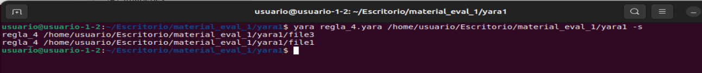


## 3.2 YARA II
Usa el/los archivos de la carpeta "yara2 ".

Tenemos un archivo "sospechoso" en la carpeta "yara2" (no es malware, puedes ejecutarlo) que se comunica con un dominio.

Crea una regla yara que detecte dicho dominio en el ejecutable.

Cuando se te evalúe, se hará contra un ejecutable idéntico pero sin ese dominio exacto. Es decir: o creas la regla para detectar el uso del dominio exacto o no va a funcionar.

En el documento pdf de entrega, añade que estrategia has seguido para conseguirlo, así como la elección de la sintaxis yara y tu razonamiento para encontrar la solución.

## Investigamos el fichero ejecutable
Vamos a usar el comando `strings` para investigar las cadenas de texto que se encuentran en dicho ejecutable:
```
usuario@usuario-1-2:~/Escritorio/material_eval_1/yara2$ strings -a -n 2 ejecutable 
ELF
`1
td
td
td
td
/lib64/ld-linux-x86-64.so.2
GNU
GNU
GNU
libc.so.6
strcpy
inet_ntoa
puts
__stack_chk_fail
strlen
herror
gethostbyname
__cxa_finalize
__libc_start_main
GLIBC_2.4
GLIBC_2.2.5
_ITM_deregisterTMCloneTable
__gmon_start__
_ITM_registerTMCloneTable
ii
i	
h!
 @
5j/
%k/
%M/
^H
PTL
H9
n.
t	
H)
?H
E.
=].
u+UH
=".
=&.
5.
UH
SH
<?v
H+E
[]
UH
AUATSH
<?v
H+E
~B
~FH
~CH
)E
[A\A]]
UH
0H
lH
t7
UH
AWAVAUATSH
HdH
%(
Hk
H)
H9
H)
dH34%(
[A\A]A^A_]
f.
AWL
AVI
AUI
ATA
UH
SL)
H9
[]A\A]A^A_
ff.
@@@@@@@@@@@@@@@@@@@@@@@@@@@@@@@@@@@@@@@@@@@>@@@?456789:;<=@@@@@@@
@@@@@@
 !"#$%&'()*+,-./0123@@@@@@@@@@@@@@@@@@@@@@@@@@@@@@@@@@@@@@@@@@@@@@@@@@@@@@@@@@@@@@@@@@@@@@@@@@@@@@@@@@@@@@@@@@@@@@@@@@@@@@@@@@@@@@@@@@@@@@@@@@@@@@@@@@@@@ABCDEFGHIJKLMNOPQRSTUVWXYZabcdefghijklmnopqrstuvwxyz0123456789+/
d3d3LmNhbXB1c2NpYmVyc2VndXJpZGFkLmNvbQ==
www.dominiochungoono.com
d3d3LmRvbWluaW9jaHVuZ29vbm8uY29t
gethostbyname
;\
zR
:*3$"
@n
8A
0A
(B
 B
h!
GCC: (Ubuntu 9.4.0-1ubuntu1~20.04.2) 9.4.0
.shstrtab
.interp
.note.gnu.property
.note.gnu.build-id
.note.ABI-tag
.gnu.hash
.dynsym
.dynstr
.gnu.version
.gnu.version_r
.rela.dyn
.rela.plt
.init
.plt.got
.plt.sec
.text
.fini
.rodata
.eh_frame_hdr
.eh_frame
.init_array
.fini_array
.dynamic
.data
.bss
.comment
@"
@"
(@
(0
(0
S0
usuario@usuario-1-2:~/Escritorio/material_eval_1/yara2$ 
```
Aparece un dominio: www.dominiochungoono.com

## Regla yara que detecte el dominio detectado
Creamos una regla YARA que contenga ese literal exacto:
- Usamos `ASCII` y `WIDE` por si el ejecutable lo guarda como Unicode.
- Usamos `nocase` para que en el dominio no se distinga entre mayúsculas/minúsculas.

```
rule regla_detecta_dominio : detection
{
	meta:
		author = "Sonia Salido"
		description = "Detecta si aparece el dominio www.dominiochungoono.com en el ejecutable"
		date = "2025-10-13"

	strings:
		$dominio_ascii = "www.dominiochungoono.com" ascii wide nocase
	condition:
		$dominio_ascii

}
```

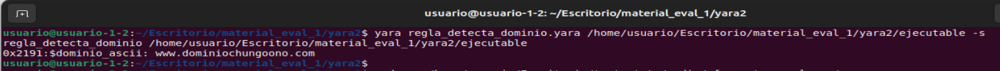

0x2191 es el offset (desplazamiento) en bytes desde el inicio del archivo donde empieza la coincidencia del string, expresado en hexadecimal.

Usaremos el comando `hexdump` para ver el texto ASCII que aparece en ese desplazamiento del archivo: 0x2191 que se corresponde con el dominio que estábamos buscando → 
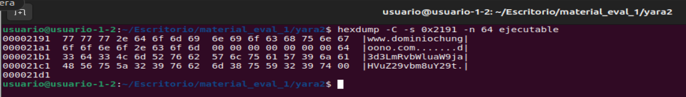


--------------------------------
## 3.3 YARA III
Crea una regla que detecte el archivo 1 y 3.

Crea otra regla que detecte el archivo 2 y 4.

En el documento pdf de entrega, añade que estrategia has seguido para conseguirlo, así como la elección de la sintaxis yara y tu razonamiento para encontrar la solución.
Documenta con capturas de pantalla.

## Análisis de las diferencias entre fichero1 y fichero3
Vamos a usar el comando `diff <(xxd -p 1.bin) <(xxd -p 3.bin)` para analizar las diferencias entre estos ficheros para poder hacer una regla yara que los detecte.
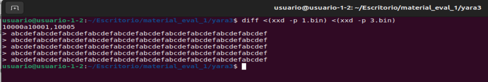

donde: 
- `xxd -p` imprime 60 caracteres hexadecimales por línea (= 30 bytes).
- `10000a10001,10005` → Significa que en la línea 10000 del volcado en crudo del fichero 1.bin se añaden las líneas 10001 a 10005 de 3.bin.
- **3.bin tiene 5 líneas extra respecto a 1.bin: las líneas 10001 a 10005.**
- Estas 5 líneas añadidas muestran `abcdefabcdef...`, que es el patrón hexadecimal `ab cd ef....`.
- Estas 5 líneas extra son ≈ 150 bytes insertados en 3.bin.


Usamos el comando ls para verficar ese extra de tamaño de 150 bytes del fichero 3.bin:  
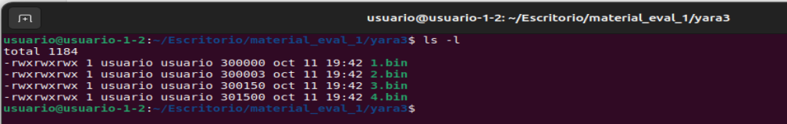


## Análisis de las diferencias entre fichero1 y fichero2
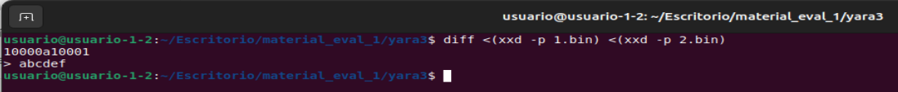

El fichero 2.bin sigue el patrón anterior: en la línea 10000 del volcado en crudo del fichero 1.bin se añaden una línea 10001 con el patrón `abcdef` en hexadecimal.

Estos 6 caracteres hexadecimales son 3 bytes, que se pueden ver en la captura de pantalla que muestra el tamaño de los ficheros.


## Análisis de las diferencias entre fichero1 y fichero4
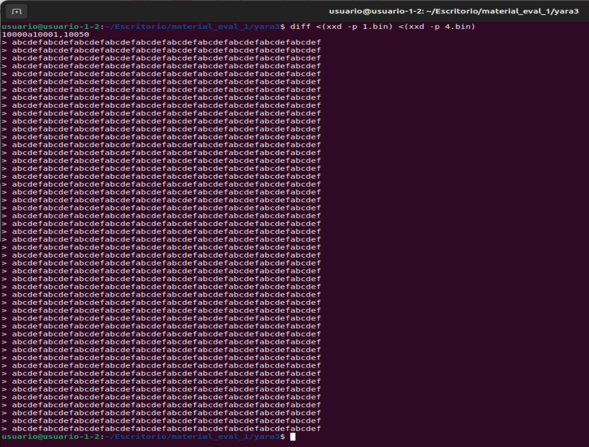

El fichero 4.bin sigue el patrón anterior: en la línea 10000 del volcado en crudo del fichero 1.bin se añaden 500 líneas con el patrón `abcdefabcdef...`, que es el patrón hexadecimal `ab cd ef....`.

Se añaden desde la 10001 hasta la 10500. Son 500 líneas extra × 30 bytes/línea = 15000 bytes añadidos. Que se corresponden con la captura de pantalla que muestra el tamaño de los ficheros.


## Regla Yara que de positivo para los ficheros: 1.bin y 3.bin:
Sabemos que:
- 1.bin se identifica por su tamaño exacto (300000 bytes).
- 3.bin es igual que 1.bin pero con un apéndice al final de 150 bytes formado por \xAB\xCD\xEF repetido 50 veces.

```
rule detecta_fichero1_y_fichero3 {
	strings:
		$tail = /(\xAB\xCD\xEF){50}/
	condition:
		// 1.bin
		filesize == 300000
		// 3.bin: termina EXACTAMENTE con 150 bytes (AB CD EF × 50)
		or (filesize > 300000 and $tail at (filesize - 150) and #tail == 50)
}
```
donde:
- `at (filesize - 150)` lo ancla al final del archivo.
- `#tail == 1` asegura una única coincidencia. El patrón (\xAB\xCD\xEF){50} también coincide en muchos offsets dentro de un bloque largo lleno de AB CD EF. Es por ello que ponemos como condición que tenga una única coincidencia
- Añadimos `filesize > 300000` en la segunda rama para evitar falsos positivos (p. ej., un archivo exactamente de 150 bytes formado solo por ese patrón también cumpliría la condición):


## Regla Yara que de positivo para los fichero: 2.bin y 4.bin:
