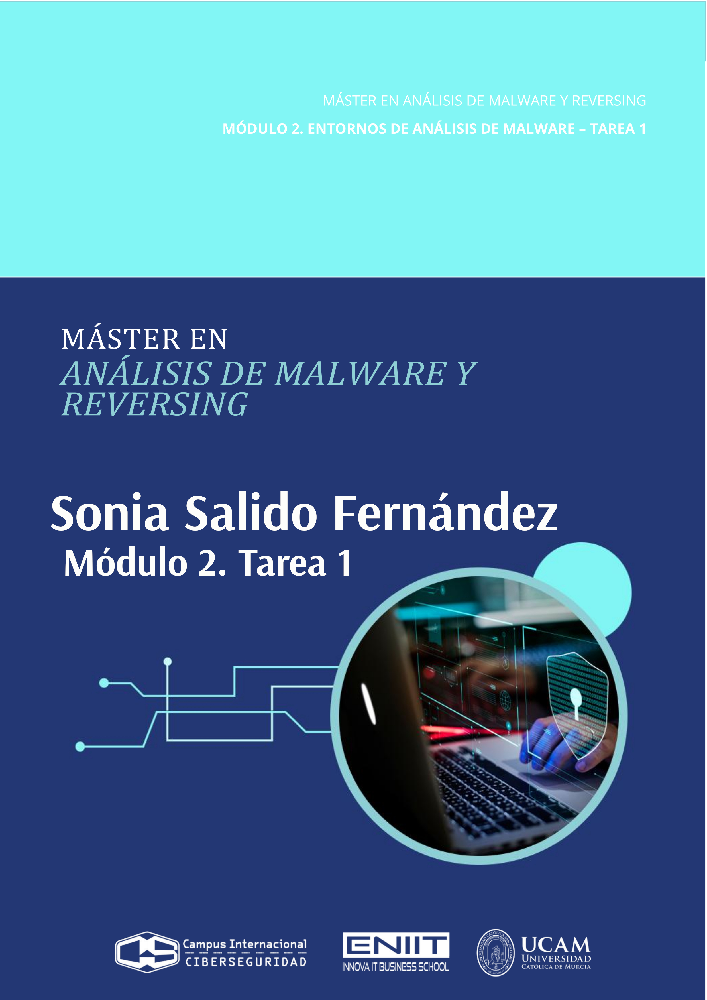
--------------------------------
# 2. Hashes

## 2.1 Colisión.
**Usa los archivos de la carpeta "hashes": archivo_1 y archivo_2.**

**Calcula el hash SHA-1 (haz captura de pantalla) y explica que está ocurriendo y por qué sucede.**

**¿Qué algoritmo utilizarías para obtener hashes diferentes? Explica como lo soluciona. Razona tu respuesta (añade captura de pantalla).**

----------------
### Marco Teórico: SHA-1

**<mark>Las siglas SHA corresponden a Algoritmo de Hash Seguro</mark>**, un algoritmo de resumen propuesto por la `NSA` y adoptado como estándar Federal por el `NIST` (National Institute of Standards and Technology) en 1993. Antes de los 2 años se detectan vulnerabilidades por lo en 1995 proponen un nuevo algoritmo conocido como `SHA 1`, pasando el anterior a denominarse `SHA 0`, y no recomendarse su uso.


**<mark>El diseño de `SHA 1` es muy similar al de `md5`</mark>**. MD5 y SHA-1 son funciones hash criptográficas. Toman un mensaje de cualquier tamaño (un archivo, un texto, etc.) y devuelven una `“huella” fija llamada resumen o digest.`
- **Tamaño del digest (resumen):**
  - MD5 produce 128 bits → 16 bytes → 32 caracteres hexadecimales.
  - SHA-1 produce 160 bits → 20 bytes → 40 caracteres hexadecimales.
    
  Más bits = más combinaciones posibles de huellas. Cuantas más combinaciones tengamos, más difícil es encontrar dos mensajes distintos con la misma huella (colisión) o recuperar el mensaje original (preimagen).

**<mark>Una función hash no cifra</mark>, sino que crea un resumen o «firma» de un conjunto de datos, que es pasado como parámetro a esta función.**

**<mark>SHA1 es útil para verificar la integridad</mark>, por ejemplo, de un archivo.** Aplicamos dicha función sobre un archivo verificamos que el hash obtenido es el mismo que el anunciado por el emisor.


**<mark>Paradoja del cumpleaños:</mark>** la dificultad de colisión crece como 2<sup>(n/2)</sup>, siendo n los bits del hash.
- MD5 (128 bits) ≈ 2<sup>64</sup> intentos.
- SHA-1 (160 bits) ≈ 2<sup>80</sup> intentos.
Por eso, SHA-1 era considerado más robusto que MD5: su digest es más largo y, en diseño, mejora algunas partes.


**<mark>Esquema del algoritmo SHA-1</mark>**  
Al igual que en md5, el mensaje se agrupa en bloques de 512 bits con 16 palabras de 32 bits. Para completar el último bloque de 512 bits, se aplicará un relleno de un 1, seguido de tantos 0 como sea necesario, reservando los últimos 64 bits para indicar el tamaño del mensaje o archivo. Internamente **SHA1 trata las palabras en representación Big Endian**, es decir, primero se leen los bytes más significativos y después, los bytes menos significativos (manera natural a la que estamos acostumbrados).

Por ejemplo la palabra de 32 bits "amor", que en hexadecimal es: `41 6D 6F 72`, se leerá: `41 6D 6F 72`.

**SHA1 usa 5 vectores públicos de 32 bits, conocidos como `A, B, C, D y E` que se mezclarán con las palabras del texto en claro, también de 32 bits.** Realizando para cada bloque de entrada de 512 bits, un total de 80 vueltas. Terminadas las primeras 80 vueltas, los vectores iniciales `A, B, C, D y E` habrán cambiado varias veces de valor y serán los nuevos 5 vectores que se mezclarán con el segundo bloque de 512 bits de entrada. Esta acción se va encadenando con los siguientes bloques, hasta que el último valor de los vectores `A, B, C, D y E` es el resumen de 160 bits de todo el documento.

**<mark>Las 80 vueltas de SHA1</mark>**  
A cada bloque del texto de entrada se le aplicarán 20 vueltas con 4 funciones distintas, de forma tal que el número total de vueltas por bloque será igual a 20 *4 = 80.
Pero, ¿cómo podemos generar 80 palabras de 32 bits a partir sólo de los 512 bits de entrada? Cada bloque de 16 palabras del mensaje se expandirá en 80 palabras, de forma que las palabras 0 a 15 se corresponden a los 512 bits del bloque y las 64 palabras restantes, de la 16 a la 79, se obtienen mediante una operación lógica entre las palabras anteriores.


**<mark>La fortaleza de SHA1. La “paradoja del cumpleaños”.</mark>**  
**Para un hash de n bits, el coste esperado de encontrar una colisión por fuerza bruta (dos mensajes cualesquiera con el mismo hash) no es 2<sup>𝑛</sup>, sino ~2<sup>𝑛/2</sup>.  A esto se le llama límite de cumpleaños.**

Para SHA-1, 𝑛 = 160 → límite ideal ≈ 2<sup>80</sup> evaluaciones del hash.

**<mark>Qué pasó con SHA-1 en la práctica</mark>**
La criptoanálisis redujo ese coste muy por debajo de 2<sup>80</sup>:
- 2017 (SHAttered): colisión práctica con complejidad ~2<sup>63</sup> (orden de magnitud), muy inferior al ideal.
- 2020 (“SHA-1 is a Shambles”): colisión de prefijo elegido también con coste ~2<sup>63</sup> (orden de magnitud).
Es decir: no bajó “a menos de 2<sup>50</sup>” en ataques reales al SHA-1 completo; los mejores ataques prácticos están en torno a 2<sup>63</sup> (en equivalentes de evaluaciones de la función de compresión), que ya es devastador para seguridad.


> [!TIP]
> **<mark>Conclusión </mark>**
> - Fortaleza de colisión de SHA-1: cayó de ~2<sup>80</sup> (ideal) a ~2<sup>63</sup> (ataques prácticos).
> - Eso es preocupante (y suficiente para retirar SHA-1 de usos de seguridad: firmas, certificados, integridad con adversario).
> - Se pasó a SHA-256 (colisión ideal ~2<sup>128</sup> o SHA-3-256/BLAKE2/3.

#### <mark>Coste ideal por paradoja del cumpleaños</mark>
| Algoritmo               | Bits del hash (n) | Colisión ideal ≈ (2<sup>n/2</sup>) | Nota práctica conocida                                                              |
| ----------------------- | ----------------: | -------------------------: | ----------------------------------------------------------------------------------- |
| **SHA-1**               |               160 |                   (2<sup>80</sup>) | Colisiones **prácticas** ≈ (2<sup>63</sup>) (SHAttered, 2017; CPC 2020) → **desaconsejado** |
| **SHA-256** (SHA-2)     |               256 |                  (2<sup>128</sup>) | Sin colisiones conocidas                                                            |
| **SHA-3-256** (Keccak)  |               256 |                  (2<sup>128</sup>) | Sin colisiones conocidas                                                            |
| **SHA-512/256** (SHA-2) |               256 |                  (2<sup>128</sup>) | Sin colisiones conocidas                                                            |
| **BLAKE2s/BLAKE3-256**  |               256 |                  (2<sup>128</sup>) | Sin colisiones conocidas                                                            |


#### <mark>Demostración de colisión en SHA-1 - SHAttered</mark>
10 años después de la introducción del algoritmo SHA-1 como función hash, se anunció la primera técnica práctica para generar una colisión. Esto es dado un «archivo A«, generar otro «archivo B» que produzca el mismo hash que el del «archivo A«.

Tras dos años de investigación y la colaboración del CWI Institute en Amsterdamy Google, este equipo de investigadores consiguió crear un método para generar colisiones. Como prueba del ataque, publican dos archivos PDF que tienen hash SHA-1 idénticos pero con contenido diferente (PDF 1 y PDF 2).


#### <mark>Referencias</mark>
[Píldora 45 - Cómo funciona el hash SHA-1]https://www.youtube.com/watch?v=pG8785ZEFuM&list=PL8bSwVy8_IcNNS5QDLjV7gUg8dIeMFSER&index=45


https://unaaldia.hispasec.com/2017/02/demostracion-practica-de-colision-en-sha-1.html


--------------------------------------------

### Análisis del problema

**<mark>Vemos que los documentos son diferentes:</mark>**  


**<mark>Usamos comando `file` y `ls` para obtener información de los ficheros:</mark>**  

- Comprobamos que ambos ficheros son documentos pdfs.
- Tienen exactamente el mismo tamaño.


**<mark>Calculamos hash-1:</mark>**  

- SHA-1 de los archivos son iguales: 38762cf7f55934b34d179ae6a4c80cadccbb7f0a


**<mark>Usamos la función hash criptográfica sha-256:</mark>**  


SHA-256 de los archivos son distintos:
- archivo_1: 2bb787a73e37352f92383abe7e2902936d1059ad9f1ba6daaa9c1e58ee6970d0
- archivo_2: d4488775d29bdef7993367d541064dbdda50d383f89f0aa13a6ff2e0894ba5ff


**<mark>Propiedades criptográficas de sha-256:</mark>**
- Resistencia a colisiones: encontrar dos entradas distintas con el mismo hash cuesta ≈ 2<sup>128</sup> operaciones (por el ataque de cumpleaños).
- Estado actual: no hay colisiones prácticas conocidas para SHA-256; sigue considerándose seguro (a diferencia de SHA-1).


**<mark>Comparamos los dos archivos con el comando linux `cmp`:</mark>**
El comando `cmp` comparará byte a byte ambos archivos y mostrará sus diferencias. Usaremos la opción `-l` para listar todas las posiciones donde difieren.
```bash
usuario@usuario-1-2:$ cmp -l archivo_1 archivo_2 
   193 163 177
   196 221 223
   197 146 246
   200  21   1
   201 217  73
   204 266 252
   205  41  35
   208  17  13
   209 371 105
   212 314 326
   213 250 210
   216 133 113
   217 250 214
   220   3  37
   221  14 340
   224 342 366
   225  30  24
   228 263 261
   229 251 151
   232 325 305
   233 337 153
   236 117 123
   237  46  12
   240 263 267
   241 334 140
   244 152 162
   245 302 162
   248 275 255
   252 105 111
   253 274   4
   256 322 302
   257  74  60
   260 353 351
   261  24 324
   264 273 253
   265 125 341
   268 240 274
   269 250 224
   272  61  65
   273 376 102
   276  67  55
   277 270 230
   280  37  17
   281  16  52
   284 337 303
   285 223 177
   288   0  24
   289 353 347
   292  15  17
   293 354  54
   296 144 164
   297 171 315
   300  54  60
   301 166 132
   304 140 144
   305 335 141
   308 221 211
   309 320 140
   312 257 277
   316 244 250
   317 274   4
   320 261 241
```
La salida del comando `cmp` muestra cada diferencia encontrada entre los archivos, estableciendo tres columnas:
- Número de byte (empieza en 1, no en 0).
- Valor del byte en archivo_1 en octal.
- Valor del byte en archivo_2 en octal.

Por ejemplo, el byte 193 (contado desde el 1):
- En el archivo 1, aparece: 163 (octal) → es 0x73 (hex) = 115 (dec) → carácter ASCII: 's' (minúscula).
- En el archivo 2, aparece: 177 (octal) → es 0x7F (hex) = 127 (dec) → carácter ASCII: DEL (no imprimible).


**<mark>Extraemos las diferencias:</mark>**
Vamos a mostar el primer y el ultimo offset distintos entre ambos ficheros (contado desde 1).
- Primer offset que difiere: `cmp -l archivo_1 archivo_2 | awk 'NR==1{print $1; exit}'` → 193
- Último offset que difiere: `cmp -l archivo_1 archivo_2 | tail -n1 | awk '{print $1}'` → 320

donde:
- `awk 'NR==1{print $1; exit}'`→ toma solo la primera línea (NR==1), imprime la primera columna ($1, el offset) y sale para no procesar más.
- `| tail -n1 | awk '{print $1}'` → se queda sólo con la última línea del flujo e imprime el primer campo.
  


**<mark>Mostramos el contenido en todo el tramo 193–320 (base 1) con hexdump:</mark>**
```bash
hexdump -Cv -s 192 -n 128 archivo_1
hexdump -Cv -s 192 -n 128 archivo_2
```


Donde:
- Inicio de las diferencias en base 0: 192
- Fin de las diferencias en base 0: 319
- Tamaño a mostrar: 319 − 192 + 1 = 128 bytes
- -s 192 →  salta 192 bytes (empieza en el offset 193 en base 1)
- -n 128 →  muestra justo 128 bytes.

**<mark>Sha-1 y los bloques de colisión:</mark>**
- SHA-1 trabaja en bloques de 512 bits = 64 bytes, contados desde el byte 0 del archivo.
- El primer byte distinto está en 193 (base 1) ⇒ 192 (base 0), y el último en 320 (base 1) ⇒ 319 (base 0).
- El rango 192..319 (base 0) tiene 128 bytes, o sea exactamente 2 bloques de 64 bytes consecutivos:
   - Bloque 3: 192–255
   - Bloque 4: 256–319
     
**Podemos decir que el tramo 192–319 son los bloques de colisión (dos bloques) que hacen que ambos archivos terminen con el mismo SHA-1.**


**<mark>Comprobación de que todo lo demás es idéntico:</mark>**
Aplicamos la función criptográfica sha256 a la parte del archivo antes de que empiece las diferencias para ver que son **IDENTICOS**:  


Alicar la función criptográfica sha256 a la parte del archivo al finalizar las diferencias para ver que son **IDENTICOS**:  


**<mark>Esto corrobora que sólo difieren en esos 128 bytes y que son los dos bloques de colisión de SHA-1.</mark>**


--------------------------------------------

### Algoritmo que utilizaría para obtener hashes diferentes
Para evitar que dos ficheros distintos tengan el mismo hash, usaría algoritmos modernos como por ejemplo:
- SHA-256
- SHA-512
- MD5


**<mark>Usamos la función hash criptográfica sha-256:</mark>**  


Tal y como vimos en la parte del ánalisis del problema, si usamos SHA-256 obtenemos hashes diferentes:
- archivo_1: 2bb787a73e37352f92383abe7e2902936d1059ad9f1ba6daaa9c1e58ee6970d0
- archivo_2: d4488775d29bdef7993367d541064dbdda50d383f89f0aa13a6ff2e0894ba5ff


**Cómo soluciona SHA-256 las colisiones:**
- Sha256 no parchea SHA-1; es un rediseño:
- Aumenta el tamaño de hash (de 160 → 256 bits).
- Reestructura el compresor para romper correlaciones lineales.
- Usa constantes y rotaciones adicionales para mejorar la difusión (pequeños cambios → hash completamente distinto).
- A día de hoy continúa sin colisiones conocidas.


----------------
### Nota histórica:
Los pdfs del ejercicio se corresponden con los que usaron en el experimento Google y CWI Amsterdam para demostrar la primera colisión práctica de SHA-1: llamada SHAttered (2017) →  https://shattered.io/

Desde entonces se usa como ejemplo académico clásico de por qué **SHA-1 no debe emplearse para seguridad criptográfica.**

----------------
## 2.2 SSDEEP.

### Marco Teórico: `ssdeep`
ssdeep es un hash difuso (fuzzy hashing) que se usa para medir similitud entre ficheros. Detecta variaciones o alteraciones en un archivo. 

ssdeep divide el archivo en trozos según el contenido y genera una firma de esos trozos. Al comparar dos firmas, calcula un score de similitud.

**No se usa para detectar colisiones criptográficas. No es un hash criptográfico: sirve para detección de contenido similar** (malware, documentos parecidos, versiones, etc.).

ssdeep fragmenta el fichero en bloques y compara las cadenas resultantes; si la mayoría de bloques coinciden, la similitud es alta aunque haya diferencias localizadas.


### Análisis del problema: Usando ssdeep obtenemos una salida similar pero no idéntica.


donde:
- 6144 bytes es el Blocksize → ssdeep eligió bloques de 6144 bytes (≈6 KB) para construir el fuzzy hash
- archivo_1 → 6144:**Y**twCbnsK7bdKenCpg9aP4zcrS8066ivrfNpNnJNt5S1k82URbx1sgcUyBtBuzdo3:**Y**tN7bAg9D4rNpNnJ5Ek8fbn6
- archivo_2 → 6144:**o**twCbnsK7bdKenCpg9aP4zcrS8066ivrfNpNnJNt5S1k82URbx1sgcUyBtBuzdo3:**o**tN7bAg9D4rNpNnJ5Ek8fbn6
- <mark>La única diferencia es una letra inicial (“Y” - “o”), lo que indica que ssdeep percibe una similitud muy alta, pero no idéntica.</mark>

Vemos que ssdeep no devuelve un simple hash; devuelve una huella sensible a los cambios. Aquí, el algoritmo detectó que los archivos son casi idénticos, con una pequeña variación (esas 128 bytes modificadas para provocar la colisión SHA-1). Esa pequeña diferencia cambió apenas un carácter del fuzzy hash.

Porcentaje de similitud: Usamos la opción `-d` para que calcule dicho porcentaje:  


**Porcentaje de similitud detetada: 99**

--------------------------------------------

# 3. REGLAS YARA
## 3.1 YARA I
Usa los archivos de la carpeta "yara1".

Escribe una regla YARA por cada archivo.

Cada una de ellas deberá detectar la presencia de uno solo de los archivos. Es decir, la regla, pongamos "regla_1.yara", detecta el file1' y no el resto. Así con las otras dos.

Escribe una cuarta regla yara que detecte dos archivos de tu elección pero no detecte el que has descartado.

En el documento pdf de entrega, añade que estrategia has seguido para conseguirlo, así como la elección de la sintaxis yara y tu razonamiento para encontrar la solución. Documenta con capturas de pantalla.


--------------------------------------------

### Análisis del problema

El nombre del archivo por sí solo no puede usarse como patrón de detección en una regla YARA estándar, ya que YARA analiza el contenido interno de los archivos y no su nombre en el sistema de archivos. Así, las condiciones deben referirse a datos o cadenas que estén realmente presentes dentro del contenido del archivo.

<mark>Para una detección precisa y exclusiva, buscaremos una cadena única dentro de cada archivo.</mark> Para ello usaremos el comando `cmp` para estudiar las diferencias que comparten los archivos.


donde:
- En el byte 5951, file1 tiene 000 (NUL) y file2 tiene 364₈ (= 244₁₀ = 0xF4).
- En el byte 8265, file1 tiene 275₈ (= 189₁₀ = 0xBD) y file3 333₈ (= 219₁₀ = 0xDB).
- En 5951: file2 = 364₈ y file3 = 000 (mismo que file1).
- En 8265: file2 = 275₈ (mismo que file1) y file3 = 333₈.

**<mark>Utilizaremos estas diferencias para escribir reglas yara con las que detectar unos u otros ficheros:</mark>**
- En los offsets (considerando el primer offset: 0):
	- `5950`.
	- `8264`.
- Valores:
	- `364₈ = 0xF4`.
	- `275₈ = 0xBD`.
	- `333₈ = 0xDB`.

--------------------------------------------
## Detección de file1
```
rule regla_1 : detection
{
	meta:
		author = "soniasalido"
		email = "soniasalido@gmail.com"
		version	= "1.5"
		created	= "2025-10-09"
		last_modified = "2025-10-26"
		description	= "Detecta sólo file1 usando dos bytes característicos del file1"
		nota1 = "Offset 5950 --> 0x00 -> Excluye a file2 que tiene en esa posición 364)octal -> 0xF4"
		nota2 = "Offset 8264 --> 275)octal --> 0xBD --> Excluye file 3: tiene 333)octal --> 0xDB"
		nota3 = "Al combinar ambas reglas, sólo puede cumplirse en file1"
		license	= "CC BY-SA 4.0"
	condition:
		uint8(5950) == 0x00 and uint8(8264) == 0xBD

}
```


--------------------------------------------
## Detección de file2
```
rule regla_2 : detection
{
	meta:
		author = "soniasalido"
		email = "soniasalido@gmail.com"
		version	= "1.5"
		created	= "2025-10-09"
		last_modified = "2025-10-26"
		description	= "Detecta sólo file2 usando el Offset base 0: 5950 del file2"
		nota1 = "En file2 el Offset: 5950 --> 364)octal --> 0xF4"
		nota2 = "En file1 el Offset: 5950 --> 0x0"
		nota3 = "En file3 el Offset: 5950 --> 0x0"
		license	= "CC BY-SA 4.0"
	
	condition:
		uint8(5950) == 0xF4

}
```


--------------------------------------------
## Detección de file3
```
rule regla_3 : detection
{
	meta:
		author = "soniasalido"
		email = "soniasalido@gmail.com"
		version	= "1.5"
		created	= "2025-10-09"
		last_modified = "2025-10-26"
		description = "Detecta sólo file3 usando dos bytes característicos del file2"
		nota1 = "File3 el Offset 8264 --> 333)octal --> 0xDB --> Exluye a file1, tiene: 0xBD"
		nota2 = "File3 el Offset 5950 --> 0)octal -->  0x0 --> Excluye a file2, tiene 364)octal --> 0xF4"
		nota3 = "Al combinar ambas reglas, sólo puede cumplirse en file3"
		license	= "CC BY-SA 4.0"
		
	condition:
		uint8(8264) == 0xDB and uint8(5950) == 0x0

}
```


--------------------------------------------
## Detecta file1 y file3
```
rule regla_4 : detection
{
	meta:
		author = "soniasalido"
		email = "soniasalido@gmail.com"
		version = "1.5"
		created	= "2025-10-09"
		last_modified = "2025-10-26"
		description	= "Detecta dos archivos: file1 y file3, pero no detecta file2"
		nota1 = "En file1 el Offset 5950 --> 0)octal -->  0x0"
		nota2 = "En file3 el Offset 5950 --> 0)octal -->  0x0"
		nota3 = "En file2 el Offset 5950 --> 364)octal --> 0xF4"
		nota4 = "En 5950 debe tener 0x00 (file1 y file3 lo tienen; file2 no)."
		nota5 = "En 8264 debe tener 0xBD ó 0xDB (file1 = 0xBD, file3 = 0xDB)."
		license	= "CC BY-SA 4.0"
		
	condition:
		uint8(5950) == 0x00 and
		(uint8(8264) == 0xBD or uint8(8264) == 0xDB)

}
```


## 3.2 YARA II
Usa el/los archivos de la carpeta "yara2 ".

Tenemos un archivo "sospechoso" en la carpeta "yara2" (no es malware, puedes ejecutarlo) que se comunica con un dominio.

Crea una regla yara que detecte dicho dominio en el ejecutable.

Cuando se te evalúe, se hará contra un ejecutable idéntico pero sin ese dominio exacto. Es decir: o creas la regla para detectar el uso del dominio exacto o no va a funcionar.

En el documento pdf de entrega, añade que estrategia has seguido para conseguirlo, así como la elección de la sintaxis yara y tu razonamiento para encontrar la solución.

## Análisis del problema: Investigamos el fichero ejecutable
Vamos a usar el comando `strings` para investigar las cadenas de texto que se encuentran en dicho ejecutable:
```
usuario@usuario-1-2:~/Escritorio/material_eval_1/yara2$ strings -a -n 2 ejecutable 
ELF
`1
td
td
td
td
/lib64/ld-linux-x86-64.so.2
GNU
GNU
GNU
libc.so.6
strcpy
inet_ntoa
puts
__stack_chk_fail
strlen
herror
gethostbyname
__cxa_finalize
__libc_start_main
GLIBC_2.4
GLIBC_2.2.5
_ITM_deregisterTMCloneTable
__gmon_start__
_ITM_registerTMCloneTable
ii
i	
h!
 @
5j/
%k/
%M/
^H
PTL
H9
n.
t	
H)
?H
E.
=].
u+UH
=".
=&.
5.
UH
SH
<?v
H+E
[]
UH
AUATSH
<?v
H+E
~B
~FH
~CH
)E
[A\A]]
UH
0H
lH
t7
UH
AWAVAUATSH
HdH
%(
Hk
H)
H9
H)
dH34%(
[A\A]A^A_]
f.
AWL
AVI
AUI
ATA
UH
SL)
H9
[]A\A]A^A_
ff.
@@@@@@@@@@@@@@@@@@@@@@@@@@@@@@@@@@@@@@@@@@@>@@@?456789:;<=@@@@@@@
@@@@@@
 !"#$%&'()*+,-./0123@@@@@@@@@@@@@@@@@@@@@@@@@@@@@@@@@@@@@@@@@@@@@@@@@@@@@@@@@@@@@@@@@@@@@@@@@@@@@@@@@@@@@@@@@@@@@@@@@@@@@@@@@@@@@@@@@@@@@@@@@@@@@@@@@@@@@ABCDEFGHIJKLMNOPQRSTUVWXYZabcdefghijklmnopqrstuvwxyz0123456789+/
d3d3LmNhbXB1c2NpYmVyc2VndXJpZGFkLmNvbQ==
www.dominiochungoono.com
d3d3LmRvbWluaW9jaHVuZ29vbm8uY29t
gethostbyname
;\
zR
:*3$"
@n
8A
0A
(B
 B
h!
GCC: (Ubuntu 9.4.0-1ubuntu1~20.04.2) 9.4.0
.shstrtab
.interp
.note.gnu.property
.note.gnu.build-id
.note.ABI-tag
.gnu.hash
.dynsym
.dynstr
.gnu.version
.gnu.version_r
.rela.dyn
.rela.plt
.init
.plt.got
.plt.sec
.text
.fini
.rodata
.eh_frame_hdr
.eh_frame
.init_array
.fini_array
.dynamic
.data
.bss
.comment
@"
@"
(@
(0
(0
S0
usuario@usuario-1-2:~/Escritorio/material_eval_1/yara2$ 
```
<mark>Aparece un dominio: www.dominiochungoono.com</mark>

## Regla yara que detecte el dominio encontrado
Creamos una regla YARA que contenga ese literal exacto:
- Usamos `ASCII` y `WIDE` por si el ejecutable lo guarda como Unicode.
- Usamos `nocase` para que en el dominio no se distinga entre mayúsculas/minúsculas.

```
rule regla_detecta_dominio : detection
{
	meta:
		author = "soniasalido"
		email = "soniasalido@gmail.com"
		version	= "1.1"
		created	= "2025-10-15"
		last_modified = "2025-10-26"
		description = "Detecta si aparece el dominio www.dominiochungoono.com en el ejecutable"
		license	= "CC BY-SA 4.0"

	strings:
		$dominio_ascii = "www.dominiochungoono.com" ascii wide nocase
	condition:
		$dominio_ascii

}
```


donde:
- 0x2191 es el offset (desplazamiento) en bytes desde el inicio del archivo donde empieza la coincidencia del string, expresado en hexadecimal.

Usaremos el comando `hexdump` para ver el texto ASCII que aparece en ese desplazamiento del archivo: 0x2191 que se corresponde con el dominio que estábamos buscando → 


--------------------------------
## 3.3 YARA III
Crea una regla que detecte el archivo 1 y 3.

Crea otra regla que detecte el archivo 2 y 4.

En el documento pdf de entrega, añade que estrategia has seguido para conseguirlo, así como la elección de la sintaxis yara y tu razonamiento para encontrar la solución.
Documenta con capturas de pantalla.

## Análisis del problema

### Análisis de las diferencias entre fichero1 y fichero3
Vamos a usar el comando `diff <(xxd -p 1.bin) <(xxd -p 3.bin)` para analizar las diferencias entre estos ficheros para poder hacer una regla yara que los detecte.


donde: 
- `xxd -p` imprime 60 caracteres hexadecimales por línea (= 30 bytes).
- `10000a10001,10005` → Significa que en la línea 10000 del volcado en crudo del fichero 1.bin se añaden las líneas 10001 a 10005 de 3.bin.
- **3.bin tiene 5 líneas extra respecto a 1.bin: las líneas 10001 a 10005.**
- Estas 5 líneas añadidas muestran `abcdefabcdef...`, que es el patrón hexadecimal `ab cd ef....`.
- Estas 5 líneas extra son ≈ 150 bytes insertados en 3.bin.


Usamos el comando ls para verificar ese extra de tamaño de 150 bytes del fichero 3.bin:  


### Análisis de las diferencias entre fichero1 y fichero2


El fichero 2.bin sigue el patrón anterior: en la línea 10000 del volcado en crudo del fichero 1.bin se añaden una línea 10001 con el patrón `abcdef` en hexadecimal.

Estos 6 caracteres hexadecimales son 3 bytes, que se pueden ver en la captura de pantalla que muestra el tamaño de los ficheros.


### Análisis de las diferencias entre fichero1 y fichero4


El fichero 4.bin sigue el patrón anterior: en la línea 10000 del volcado en crudo del fichero 1.bin se añaden 500 líneas con el patrón `abcdefabcdef...`, que es el patrón hexadecimal `ab cd ef....`.

Se añaden desde la 10001 hasta la 10500. Son 500 líneas extra × 30 bytes/línea = 15000 bytes añadidos. Que se corresponden con la captura de pantalla que muestra el tamaño de los ficheros.


## Regla Yara que de positivo para los ficheros: 1.bin y 3.bin:
Sabemos que:
- 1.bin se identifica por su tamaño exacto (300000 bytes).
- 3.bin es igual que 1.bin pero con un apéndice al final de 150 bytes formado por \xAB\xCD\xEF repetido 50 veces.

```
rule detecta_1_y_3_solo {
	meta:	
		author = "soniasalido"
		email = "soniasalido@gmail.com"
		version	= "1.1"
		created	= "2025-10-17"
		last_modified = "2025-10-26"
		description	= "Detecta al archivo 1 y 3"
		nota1 = "1.bin se identifica por su tamaño exacto (300000 bytes)."
		nota2 = "3.bin es igual que 1.bin pero con un apéndice al final de 150 bytes formado por \xAB\xCD\xEF repetido 50 veces"
		nota3 = "Contiene ese bloque al final del fichero."
		license	= "CC BY-SA 4.0"
	strings:
		$tail = /(\xAB\xCD\xEF){50}/
	condition:
		filesize == 300000
		or (filesize == 300150 and $tail at 300000 and $tail at (filesize - 150))
}
```
donde:
- Detecta 1.bin por tamaño exacto (300000) → `filesize == 300000`.
- Detecta 3.bin por
	- Tamaño exacto (300150) → `filesize == 300150`.
	- Contiene ese bloque de 150 bytes (AB CD EF × 50) empezando en el offset 300000 → `$tail at 300000`.
 	- Contiene ese bloque al final del fichero → `$tail at (filesize - 150)`.

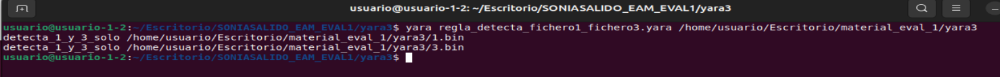

## Regla Yara que de positivo para los ficheros: 2.bin y 4.bin:
```
rule detecta_2_y_4_solo
{
	meta:
		author = "soniasalido"
		email = "soniasalido@gmail.com"
		version = "1.3"
		created	= "2025-10-18"
		last_modified	= "2025-10-26"
		description = "Detecta al archivo 2 y 4"
		nota1 = "Debe contener al menos 50 repeticiones del patrón en la parte final del fichero. Lo cumplen 3.bin y 4.bin"
		nota2 = "Excluye a 3.bin por su tamaño. Es diferente de 300150"
		nota3a = "Detecta 2.bin exigiendo AB CD EF exactamente en el offset 300000 y..."
		nota3b = "... asegurando que no se repite dentro de esa “línea” (siguiente rango de 29 bytes),...
		nota3c = "... de modo que sea solo esos 3 bytes."
		license	= "CC BY-SA 4.0"
	strings:
		$tail = /(\xAB\xCD\xEF){50}/
		$once = { AB CD EF }
	condition:
		//($tail in (300000..filesize-1) and filesize != 300150)
		(filesize > 300000 and $tail at (filesize -150) and filesize != 300150)
		or
		(filesize > 300002 and $once at 300000 and not ($once in (300003..300029)))
}
```
donde:
- Debe contener al menos 50 repeticiones del patrón en la parte final del fichero →  `$tail in (300000..filesize-1)`. Esto lo cumplen 3.bin y 4.bin.
- Excluye a 3.bin por el tamaño → `filesize != 300150`.
- Detecta 2.bin por para “línea 10001” en un volcado xxd -p (cada línea = 30 bytes). La línea 10001 empieza en el offset 300000 (10000 × 30)..
- nota1: se satisface con `$tail at (filesize - 150)` → el patrón aparece al final.
- nota2: se excluye 3.bin con `filesize != 300150`.
- nota3: se detecta 2.bin exigiendo AB CD EF exactamente en el offset 300000 y asegurando que no se repite dentro de esa “línea” (siguiente rango de 29 bytes), de modo que sea solo esos 3 bytes.


--------------------------------
# 4. Sandboxes

## 4.1 Sandbox I

Usando cualquier sandbox de uso gratuito tienes que encontrar una muestra que tenga estas características:
- Que sea maliciosa.
- Que tenga actividad maliciosa de red.
- Que cree archivos en el sistema.

Cuando la hayas encontrado, deberás escribir un análisis explicando cómo funciona y qué hace la muestra.


### Muestra de malware

He escogido una muestra que aparece en ANY.run en: https://app.any.run/tasks/65317167-d24d-47f2-bac3-2d244dc4f23b

**<mark>Arquitectura de destino del malware:</mark>**
| Field                                 | Value                                                                                               |
|---------------------------------------|-----------------------------------------------------------------------------------------------------|
| file > sha256                         | D1BFC02DB9922F89DA0CEF14B514B63AF3703F1AB7BD88D558431151BFAC92E2                                     |
| file > first 32 bytes (hex)           | 4D 5A 90 00 03 00 00 00 04 00 00 00 FF FF 00 00 B8 00 00 00 00 00 00 00 40 00 00 00 00 00 00 00       |
| file > first 32 bytes (text)          | MZ............................................@..............                                        |
| file > info                           | size: 37376 bytes, entropy: 6.314                                                                    |
| file > type                           | executable, 32-bit, GUI                                                                              |
| file > version                        | n/a                                                                                                  |
| file > description                    | n/a                                                                                                  |
| entry-point > first 32 bytes (hex)    | 55 8B EC 6A FF 68 78 91 40 00 68 C4 5E 40 00 64 A1 00 00 00 00 50 64 89 25 00 00 00 00 83 EC 10       |
| entry-point > location                | 0x0000352F (section[.text])                                                                          |
| file > signature                      | Microsoft Linker 6.0 \| Visual Studio 6.0 MASM \| Microsoft Visual C++ \| Microsoft Visual C++ 6.0 - 8.0 |

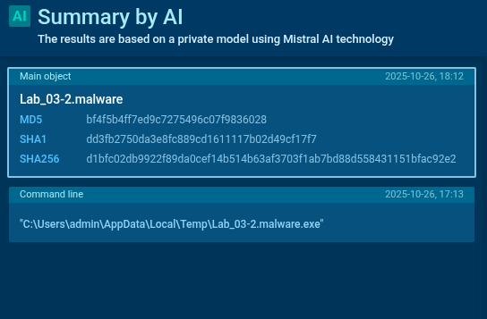


**<mark>Conexión con el servidor:</mark>**  
El malware intentó resolver el FQDN para obtener la IP de su infraestructura C2 (us.t28.net) y, si la resolución tenía éxito, abrir después una conexión (HTTP/HTTPS/TCP) a ese host.

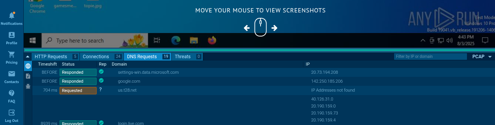


**<mark>Procesos:</mark>**  
En esta captura vemos los procesos que ha generado este malware.  
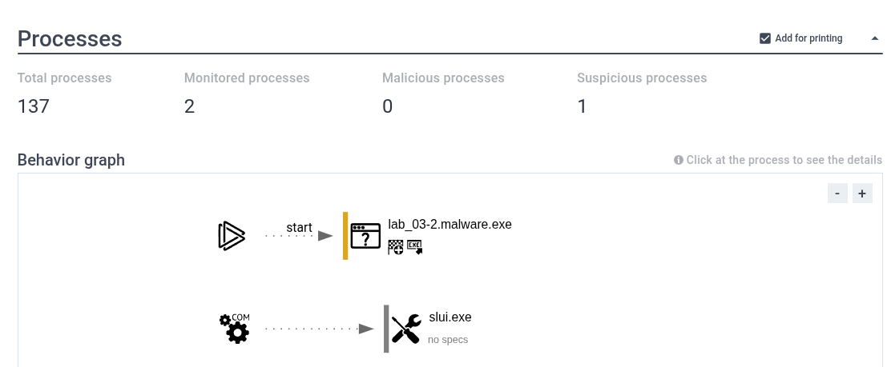

- Procesos totales: 137
- Monitoreados: 2
- Sospechosos: 1 → lab_03-2.malware.exe (arrancado por el sandbox).
- slui.exe aparece en un hilo separado y con “no specs”. Este proceso slui.exe (Windows Activation UI) no figura como hijo de la muestra ni marcado sospechoso → probablemente sea actividad del sistema no relacionada con el malware.

El árbol de procesos muestra que el archivo “Lab_03-2.malware.exe” fue ejecutado por el usuario “admin” con la línea de comandos \"C:\\Users\\admin\\AppData\\Local\\Temp\\Lab_03-2.malware.exe\". El archivo se encuentra en la carpeta temporal del usuario:  
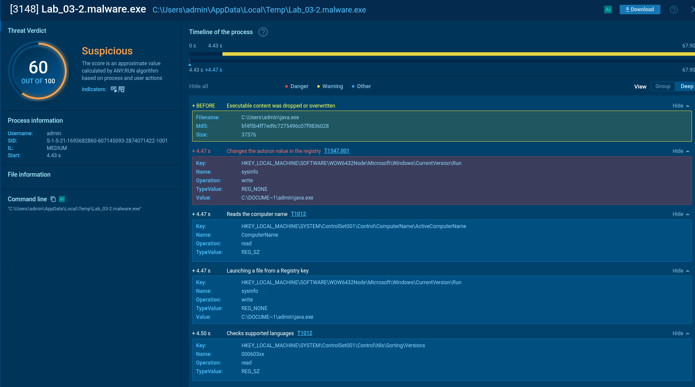

**1. Masquerading:**
El primero proceso vemos que el malware crea C:\Users\admin\java.exe (37 376 bytes) y que su hash es identico al del fichero malware, luego indica que es una copia exacta del mismo.  
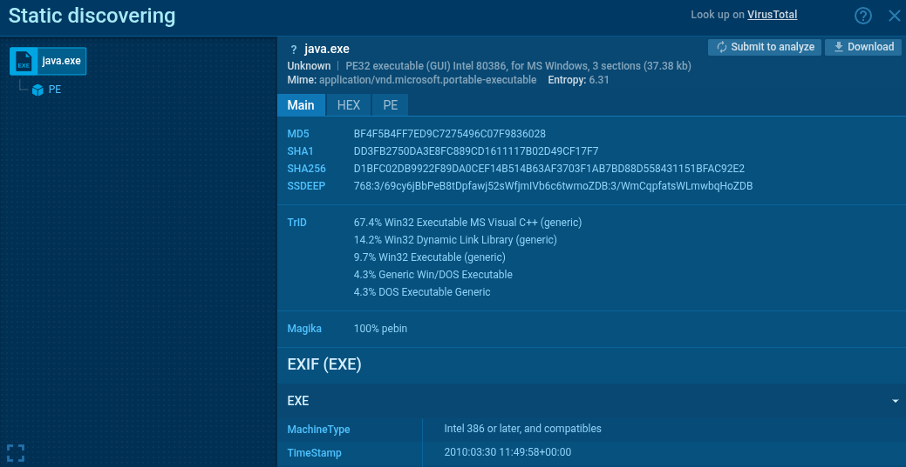


**2. Persistencia en Registro**
Escribe en `HKLM\SOFTWARE\WOW6432Node...\Run` una entrada llamada `sysinfo` con valor `C:\DOCUME~1\admin\java.exe`.  
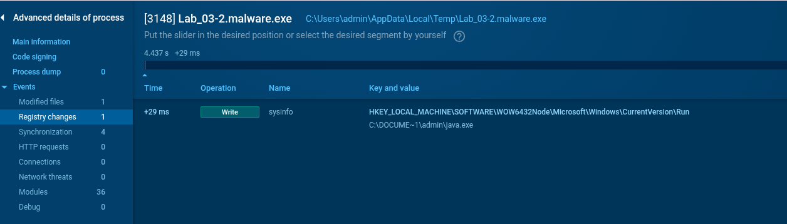


**3. Lee el nombre del equipo**  
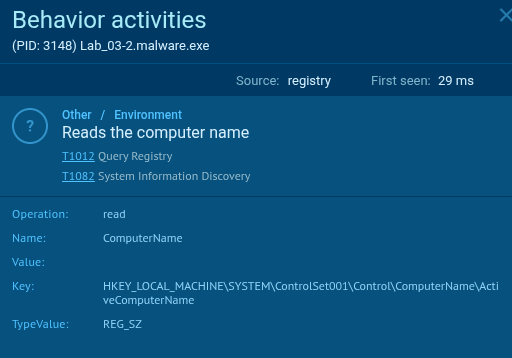


**4. Ejecuta fichero desde una clave del registro**  
El clon del malware que se creó es ejecutado desde la clave de registro: `sysinfo`. 
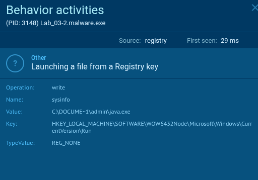


**5. Chequea idioma**  
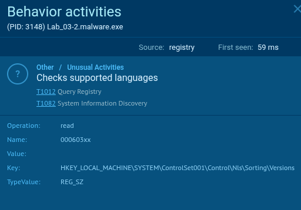


**<mark>Módulos usados por el malware:</mark>**  
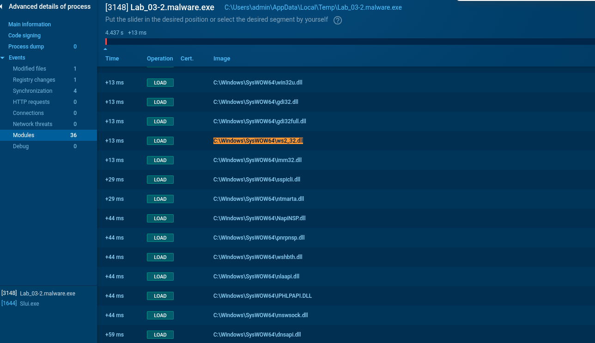  
A destacar:
- WS2_32.dll → sockets y C2. Hooks/BP: WSAStartup, socket, connect, send, recv, closesocket, inet_addr, inet_ntoa, htons.
- MSWSOCK.dll → extensiones Winsock (resolución/conexiones avanzadas). Útil si el sample usa ConnectEx/optimizaciones.
- DNSAPI.dll → resolución de dominios (encaja con el dns requeste para  us.t28.net).
- ADVAPI32.dll → Registro y seguridad. Hooks: RegCreateKeyExA/W, RegSetValueExA/W, RegOpenKeyEx, RegCloseKey.
- KERNEL32.dll / KernelBase.dll → file I/O y creación de procesos/pipes. Hooks: CreateFileA/W, WriteFile, CopyFileA/W, DeleteFileA/W...


**<mark>APIS claves detectadas:</mark>**  
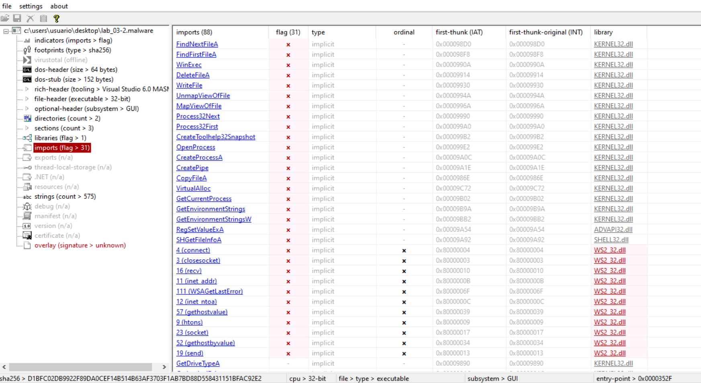
Pasado el malware por la aplicación pestudio para ver las APIs que usa el malware, destacamos:
- Red (WS2_32): socket, connect, send, recv, WSAStartup, inet_addr/ntoa, htons.
- Ficheros: CopyFileA, CreateFileA, WriteFile, ReadFile, DeleteFileA, mapeo (CreateFileMapping/MapViewOfFile/UnmapViewOfFile).
- Procesos: CreateProcessA con pipes anónimos para capturar salida, CreateToolhelp32Snapshot + Process32First/Next (enumeración), OpenProcess, TerminateProcess.
- Registro: RegSetValueExA (persistencia en Run key).


**<mark>Técnicas MITRE ATT&CK observadas:</mark>**  
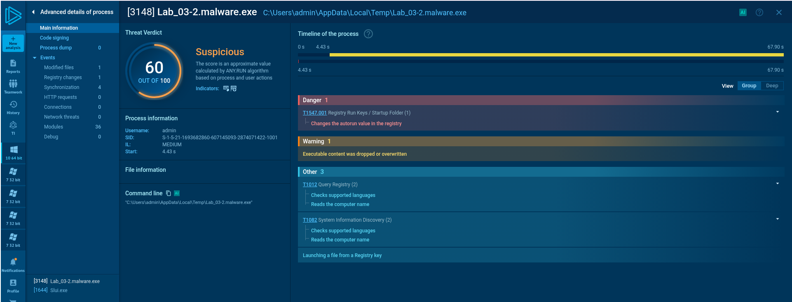
- Persistencia: T1547.001 – Boot or Logon Autostart::Run Keys (ya que crea una clave de registro `HKLM\...\Run\sysinfo` apuntando a su propia copia java.exe).

- Evasión:
	- T1027 (ya que usa codificación XOR).
	- T1036 / T1036.005 – Masquerading (Match Legitimate Name or Location - Ya que hace una copia de sí mismo en local, no la descarga del servidor)

- T1027 – Obfuscated/Compressed Files or Information (ya que usa vodificaciones simples/XOR).

- Descubrimiento:
	- T1082 – System Information Discovery (ya que lee nombre del equipo).
	- T1614.001 – System Location::System Language Discovery (ya que consulta NLS/idioma).
	- T1012 – Query Registry (ya que lee claves de registro para recoger info del sistema).

- Command and Control (C2):
	- T1071.004 – Application Layer Protocol: DNS (ya que usa DNS como parte del canal de C2/bootstrapping).
	- T1568 – Dynamic Resolution (ya que hace una resolución de dominio para localizar su C2; aplica aunque no haya respuesta del C2).


**<mark>Conclusiones:</mark>**
Esta muestra de malware es un PE32 (GUI) compilado con Visual C++ sin packer aparente que, al ejecutarse, se copia a sí mismo con otro nombre (java.exe) y persiste por registro para arrancar en cada inicio de Windows. La muestra tiene comunicación por red / conexión C2 y espera la orden del servidor para llevar a cabo. La recepción de esta orden nunca se produce ya que el servidor parece caido.


La sección de archivos modificados indica que el archivo “java.exe” fue modificado y ahora es un ejecutable. Este archivo está en la carpeta temporal del usuario y tiene el PID (Identificador de Proceso) 3148.

La sección de escritura en el registro muestra que se creó una clave llamada “sysinfo” en el registro con el valor C:\\DOCUME~1\\admin\\java.exe. La clave fue creada por el proceso con PID 3148.

Artefactos clave / IOCs:
- Archivo: C:\Users\admin\java.exe (sin firma/metadata de Oracle).
- Registro: HKLM\SOFTWARE\WOW6432Node\...\Run\sysinfo = C:\DOCUME~1\admin\java.exe.
- Comportamiento: creación de EXE en perfil/Temp → escritura en Run → ejecución posterior.


----------------------

# 5. REGLAS SIGMA
## 5.1 Sigma I

Debes recrear el entorno SIGMA que se expone en el temario y convertir una regla a tu elección que no sea la mostrada en los materiales.

Explica brevemente el proceso con tus palabras. E importante, que hace (detecta) la regla que has elegido y cómo lo hace.

Ilustra los pasos de la conversión de la regla con capturas de pantalla en tu documento de entrega PDF.

------------------------

### <mark>1. Preparando el entorno. Instalación de Python</mark>
Instalación de python y creamos un entorno virtual para instalar sigma-cli en este entorno virtual:
```
sudo apt update
sudo apt install -y python3 python3-pip python3-venv
python3 -m venv ~/sigma-venv
source ~/sigma-venv/bin/activate
python -m pip install --upgrade pip
```
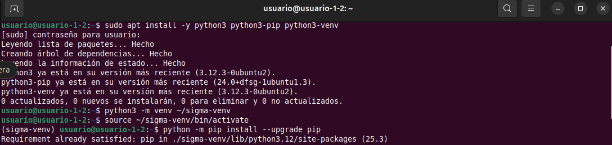


### <mark>2. Instalamos sigma-cli</mark>
```
pip install sigma-cli
```
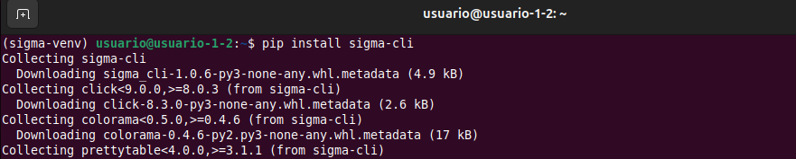


### <mark>3. Mostramos qué plugins/backends hay</mark>
```
sigma plugin list
```
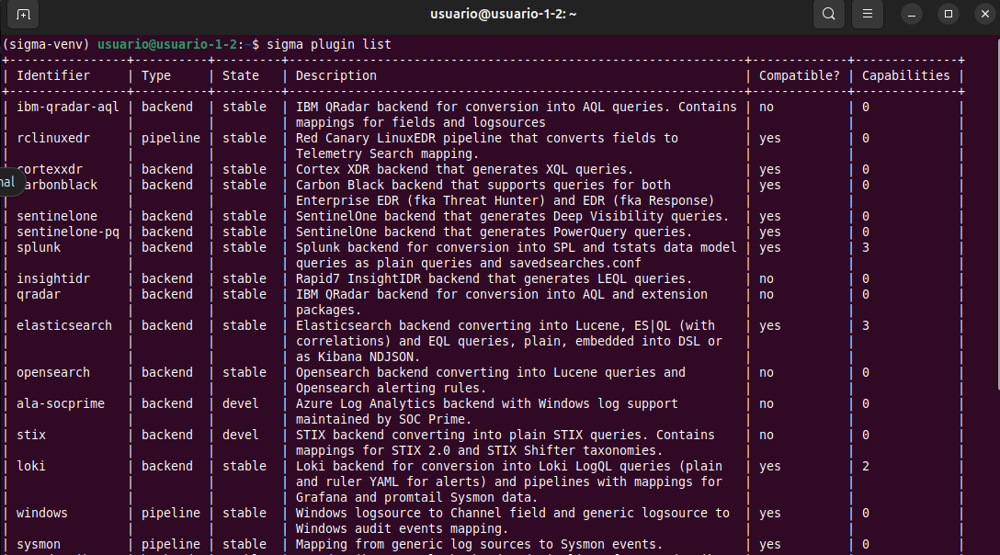


### <mark>4. Instalamos backend de Elastic (EQL) y pipelines de Windows/Sysmon</mark>
```
sigma plugin install elasticsearch
sigma plugin install windows
sigma plugin install sysmon
```
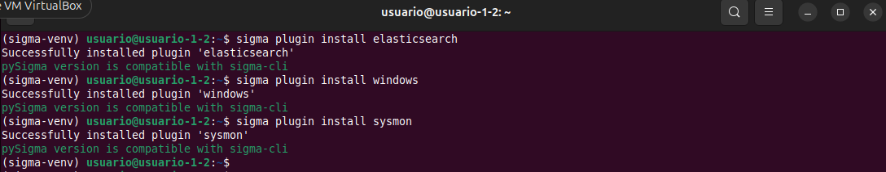


### <mark>5. Descargamos las reglas oficiales para practicar con una de ellas</mark>
```
git clone https://github.com/SigmaHQ/sigma
```
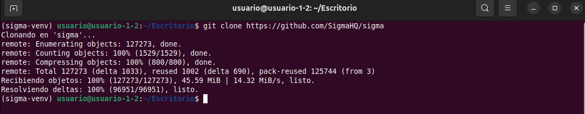


### <mark>5. La Regla elegida</mark>
En concreto he elegido una regla con detectar ofuscación con XOR en powershell: https://github.com/SigmaHQ/sigma/blob/master/rules/windows/process_creation/proc_creation_win_powershell_xor_commandline.yml
```
title: Suspicious XOR Encoded PowerShell Command
id: bb780e0c-16cf-4383-8383-1e5471db6cf9
related:
    - id: 5b572dcf-254b-425c-a8c5-d9af6bea35a6
      type: obsolete
status: test
description: Detects presence of a potentially xor encoded powershell command
references:
    - https://speakerdeck.com/heirhabarov/hunting-for-powershell-abuse?slide=65
    - https://redcanary.com/blog/yellow-cockatoo/
    - https://zero2auto.com/2020/05/19/netwalker-re/
    - https://mez0.cc/posts/cobaltstrike-powershell-exec/
author: Sami Ruohonen, Harish Segar, Tim Shelton, Teymur Kheirkhabarov, Vasiliy Burov, oscd.community, Nasreddine Bencherchali
date: 2018-09-05
modified: 2023-01-30
tags:
    - attack.defense-evasion
    - attack.execution
    - attack.t1059.001
    - attack.t1140
    - attack.t1027
logsource:
    category: process_creation
    product: windows
detection:
    selection_img:
        - Image|endswith:
              - '\powershell.exe'
              - '\pwsh.exe'
        - OriginalFileName:
              - 'PowerShell.EXE'
              - 'pwsh.dll'
        - Description: 'Windows PowerShell'
        - Product: 'PowerShell Core 6'
    selection_cli_xor:
        CommandLine|contains: 'bxor'
    selection_cli_other:
        CommandLine|contains:
            - 'ForEach'
            - 'for('
            - 'for '
            - '-join '
            - "-join'"
            - '-join"'
            - '-join`'
            - '::Join'
            - '[char]'
    condition: all of selection_*
falsepositives:
    - Unknown
level: medium
```
donde:
- Esta regla busca líneas de comando de PowerShell que puedan desofuscar/decodificar contenido usando el operador `XOR`.
- Sus creadores: Sami Ruohonen, Harish Segar, Tim Shelton, Teymur Kheirkhabarov, Vasiliy Burov, oscd.community, Nasreddine Bencherchali.
- Fecha de creación: 2018-09-05.
- Fecha de modificación: 2023-01-30.
- `status: test` → considerada en pruebas. Podría requerir tuning: puede requerir ajustes (tuning) en el entorno para reducir falsos positivos u otros ajustes.
- `level: medium` → severidad media. Indica que la detección es relevante y se necesita un triage para corroborar si existe indicios de compromiso crítico.
- `falsepositives: Unknown` → no catalogados. Los autores no tienen identificados (o no han documentado) casos típicos en los que la regla pueda disparar alertas legítimas (falsos positivos).
- Etiquetas MITRE ATT&CK que posee → Para que podamos podamos hacer mejores triages o correlaciones.
	- `t1059.001` (PowerShell) – Ejecución.
	- `t1140` (Deobfuscate/Decode) y `t1027` (Ofuscación) – Evasión de defensas.
	- Tácticas: `attack.execution, attack.defense-evasion`.

- Dónde mira esta regla → Se aplica a eventos de creación de procesos en Windows.
  ```
  logsource:
    category: process_creation
    product: windows
  ```

- Los filtros que aplica este regla: Tiene tres bloques y exige que todos se cumplan, ya que usa la condición: `condition: all of selection_*`.
	- Bloque `selection_img` → Identifica que el proceso sea PowerShell.  Usa la condición `OR` →  Basta con que se cumpla uno de los puntos para ser positivo.
		- `Image|endswith: \powershell.exe` o `\pwsh.exe` → hace un match si la ruta acaba en \powershell.exe  `OR` \pwsh.exe. (Dentro del mismo campo, una lista implica OR)
  		- `OriginalFileName: PowerShell.EXE` o `pwsh.dll` → la regla intenta identificar PowerShell por su identidad interna, no solo por la ruta (Image). Esto es útil si el atacante renombra powershell.exe por otra cosa.
    	- `Description: Windows PowerShell` → la regla filtra por el metadato de descripción del archivo (FileDescription) del ejecutable que creó el proceso.
     	- `Product: PowerShell Core 6` → la regla pide que el proceso pertenezca al producto llamado exactamente PowerShell Core 6. Por eso filtra por el metadato `ProductName`. Esta regla puede no cubrir si se usa PowerShell 7+.

        Objetivo: cubrir tanto Windows PowerShell clásico como PowerShell Core (pwsh) y evitar binarios renombrados.
   
	- Bloque `selection_cli_xor` → Busca la presencia de XOR. La línea de comando debe contener `-bxor`.
		- `CommandLine|contains: 'bxor'`  → la regla exige que el valor del campo `CommandLine` del evento (la línea de comandos con la que se lanzó el proceso) contenga la subcadena 'bxor'.

    	Objetivo: el operador -bxor de PowerShell (bitwise XOR) es la pista clave del uso de descifrado.

	- Bloque `selection_cli_other` → selection_cli_other agrupa pistas típicas de reconstrucción de payload alrededor del XOR en PowerShell. Busca patrones típicos alrededor del XOR.  Usa la condición `OR` →  Basta con que se cumpla uno de los puntos para ser positivo.
		- `ForEach`, `for( ` .... Para iterar  datos.
  		- `-join `, `-join', `-join"`.... → Para recomponer las cadenas de texto.
    	- `[char]` → Para conversión de bytes a carácter

       	Objetivo: detectar la reconstrucción del payload (concatenado/iterado) tras el XOR.


### <mark>6. Comprobamos la sintaxis de la regla sigma con `check`</mark>
```
sigma check sigma/rules/windows/process_creation/proc_creation_win_powershell_xor_commandline.yml
```
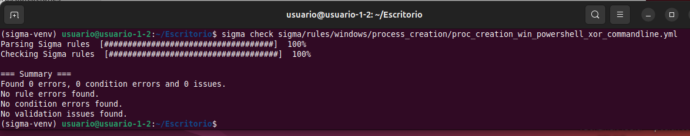


### <mark>7. Convertimos la regla a Elastic </mark>
Comprobada que la sintaxis de la regla es correcta, la convertimos a Elastic (consulta EQL directa para Kibana). Tomamos la regla Sigma que hemos elegido, que es una regla genérica (.YAML) y la traducimos al lenguaje que entiende la plataforma Elastic (Kibana/Elastic Security), usando sigma-cli.
```
sigma convert \
  -t eql \
  -p sysmon \
  -f default \
  ./sigma/rules/windows/process_creation/proc_creation_win_powershell_xor_commandline.yml
```
donde:
- `-t eql` →  El backend elegido es eql (Elastic Query Language). Con este backend, la salida por defecto es una consulta EQL que podremos pegar en Kibana (EQL search/Timelines).
- `-p sysmon` →  La pipeline mapea los campos de Sigma a los campos reales de nuestros logs.
- `-f default` →  Pide el formato por defecto del backend eql, que es justo una query EQL en texto plano.
- Ruta del YAML es la regla Sigma a convertir.

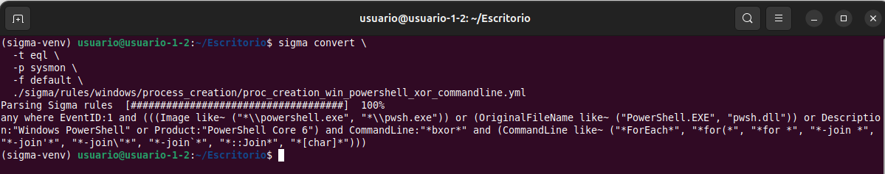


### <mark>8. Convertimos la regla a Splunk </mark>
Instalamos el backend y pipelines necesarios:
```
sigma plugin install splunk
sigma plugin install sysmon
sigma plugin install windows
```


Convertimos la regla a Splunk:
```
sigma convert \
  -t splunk \
  -p sysmon \
  -f default \
  ./sigma/rules/windows/process_creation/proc_creation_win_powershell_xor_commandline.yml
```
donde:
- `-t splunk` →  El backend elegido es splunk.


El resultado es que devuelve el comando anterior es la **consulta SPL que luego copiaremos para pegarlo en la plataforma Splunk en app Search & Reporting**, barra de búsqueda.
```
Parsing Sigma rules  [####################################]  100%
EventID=1 Image IN ("*\\powershell.exe", "*\\pwsh.exe") OR OriginalFileName IN ("PowerShell.EXE", "pwsh.dll") OR Description="Windows PowerShell" OR Product="PowerShell Core 6" CommandLine="*bxor*" CommandLine IN ("*ForEach*", "*for(*", "*for *", "*-join *", "*-join'*", "*-join\"*", "*-join`*", "*::Join*", "*[char]*")
```

Vamos a conprobar si la regla convertida funciona. Para ello en una MV Windows, instalamos sysmon:

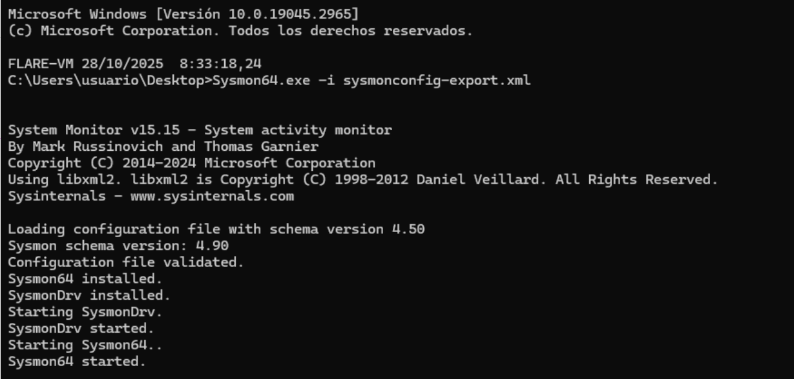


Comprobamos que el servicio sysmon está funcionando:
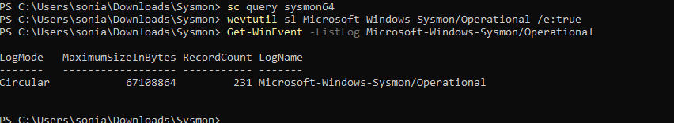


exportamos el eventos a un documento .evtx:
```
wevtutil epl Microsoft-Windows-Sysmon/Operational "%USERPROFILE%\Desktop\sysmon.evtx"
```
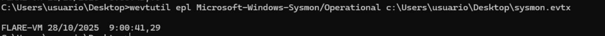


Lanzamos un proceso que use ofuscacion xor y generamos un documento con los eventos del sistema que luego pasaremos a splunk:
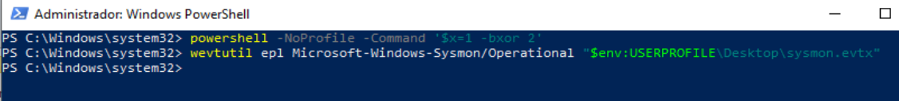


Abrimos Splunk y lanzamos la búsqueda:


**<mark>Instalamos chainsaw para evaluar Sigma sobre EVTX directamente:</mark>**
Creamos las siguientes carpetas:
```
New-Item -ItemType Directory -Force -Path C:\tools\chainsaw | Out-Null
New-Item -ItemType Directory -Force -Path C:\sigma\mappings | Out-Null
```

Descargamos, descomprimimos y colocamos [Chainsaw](https://github.com/WithSecureLabs/chainsaw) en: `C:\tools\chainsaw`.
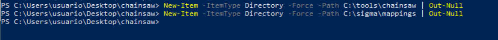


Descargamos un mapping listo para Windows --> Chainsaw trae mapeos de ejemplo; el más cómodo para empezar es `[mappings/sigma-event-logs-all.yml[(https://github.com/WithSecureLabs/chainsaw/blob/master/mappings/sigma-event-logs-all.yml)` del propio repositorio de Chainsaw. Lo descargamos lo guardamos en `C:\sigma\mappings\winlogbeat.yml`.
```
chainsaw.exe hunt "C:\Windows\System32\winevt\Logs" `
  --sigma "C:\sigma\rules\proc_creation_win_powershell_xor_commandline.yml" `
  --mapping "C:\sigma\mappings\sigma-event-logs-all.yml" `
  --json -o C:\tools\chainsaw\findings.json
```


