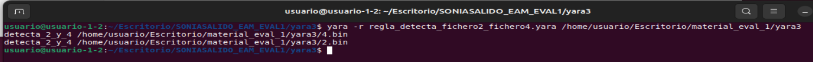
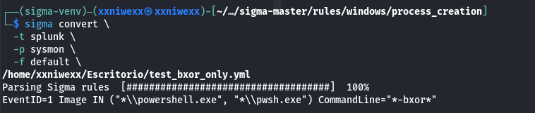
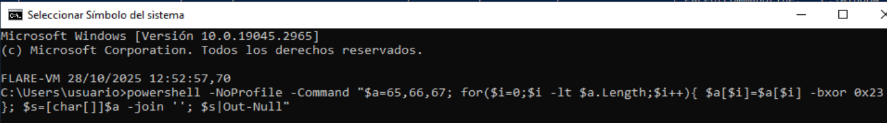
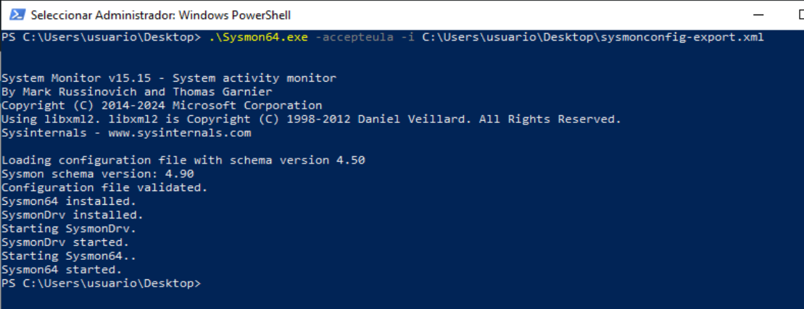
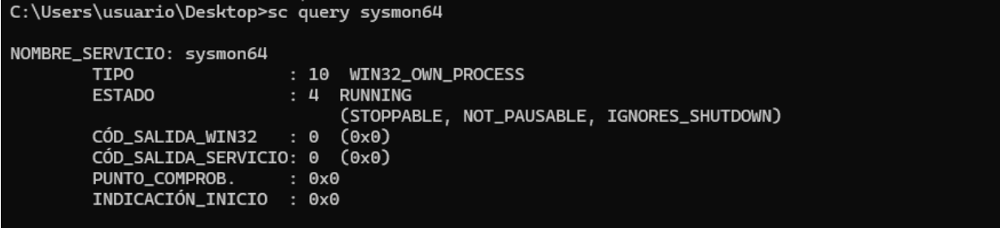
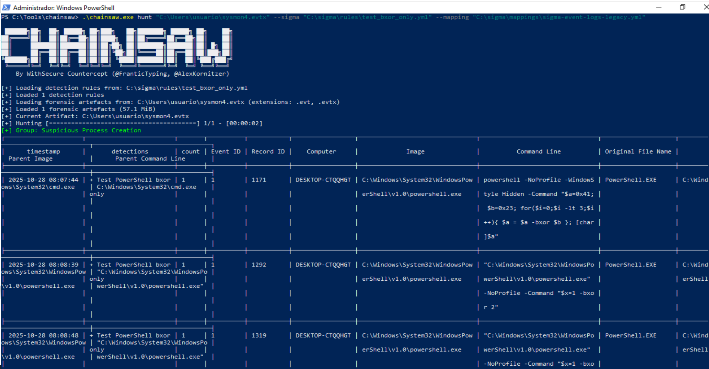
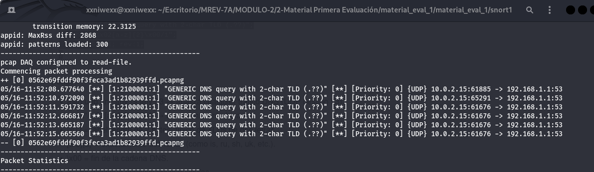
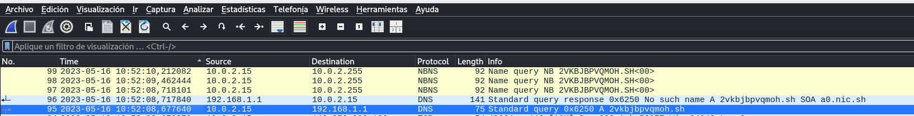
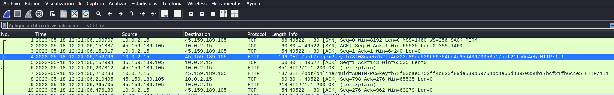

--------------------------------

# Indice

- [Indice](#indice)
- [2. Hashes](#2-hashes)
  - [2.1 Colisión.](#21-colisión)
    - [Marco Teórico: SHA-1](#marco-teórico-sha-1)
      - [Coste ideal por paradoja del cumpleaños](#coste-ideal-por-paradoja-del-cumpleaños)
      - [Demostración de colisión en SHA-1 - SHAttered](#demostración-de-colisión-en-sha-1---shattered)
      - [Referencias](#referencias)
    - [Análisis del problema](#análisis-del-problema)
    - [Algoritmo que utilizaría para obtener hashes diferentes](#algoritmo-que-utilizaría-para-obtener-hashes-diferentes)
    - [Nota histórica:](#nota-histórica)
  - [2.2 SSDEEP.](#22-ssdeep)
    - [Marco Teórico: `ssdeep`](#marco-teórico-ssdeep)
    - [Análisis del problema: Usando ssdeep obtenemos una salida similar pero no idéntica.](#análisis-del-problema-usando-ssdeep-obtenemos-una-salida-similar-pero-no-idéntica)
- [3. REGLAS YARA](#3-reglas-yara)
  - [3.1 YARA I](#31-yara-i)
    - [Análisis del problema](#análisis-del-problema-1)
  - [Detección de file1](#detección-de-file1)
  - [Detección de file2](#detección-de-file2)
  - [Detección de file3](#detección-de-file3)
  - [Detecta file1 y file3](#detecta-file1-y-file3)
  - [3.2 YARA II](#32-yara-ii)
  - [Análisis del problema: Investigamos el fichero ejecutable](#análisis-del-problema-investigamos-el-fichero-ejecutable)
  - [Regla yara que detecte el dominio encontrado](#regla-yara-que-detecte-el-dominio-encontrado)
  - [3.3 YARA III](#33-yara-iii)
  - [Análisis del problema](#análisis-del-problema-2)
    - [Análisis de las diferencias entre fichero1 y fichero3](#análisis-de-las-diferencias-entre-fichero1-y-fichero3)
    - [Análisis de las diferencias entre fichero1 y fichero2](#análisis-de-las-diferencias-entre-fichero1-y-fichero2)
    - [Análisis de las diferencias entre fichero1 y fichero4](#análisis-de-las-diferencias-entre-fichero1-y-fichero4)
  - [Regla Yara que de positivo para los ficheros: 1.bin y 3.bin:](#regla-yara-que-de-positivo-para-los-ficheros-1bin-y-3bin)
  - [Regla Yara que de positivo para los ficheros: 2.bin y 4.bin:](#regla-yara-que-de-positivo-para-los-ficheros-2bin-y-4bin)
- [4. Sandboxes](#4-sandboxes)
  - [4.1 Sandbox I](#41-sandbox-i)
    - [Muestra de malware](#muestra-de-malware)
- [5. REGLAS SIGMA](#5-reglas-sigma)
  - [5.1 Sigma I](#51-sigma-i)
    - [1. Preparando el entorno. Instalación de Python](#1-preparando-el-entorno-instalación-de-python)
    - [2. Instalamos sigma-cli](#2-instalamos-sigma-cli)
    - [3. Mostramos qué plugins/backends hay](#3-mostramos-qué-pluginsbackends-hay)
    - [4. Instalamos backend de Elastic (EQL) y pipelines de Windows/Sysmon](#4-instalamos-backend-de-elastic-eql-y-pipelines-de-windowssysmon)
    - [5. Descargamos las reglas oficiales para practicar con una de ellas](#5-descargamos-las-reglas-oficiales-para-practicar-con-una-de-ellas)
    - [5. La Regla elegida](#5-la-regla-elegida)
    - [6. Comprobamos la sintaxis de la regla sigma con `check`](#6-comprobamos-la-sintaxis-de-la-regla-sigma-con-check)
    - [7. Convertimos la regla a Elastic ](#7-convertimos-la-regla-a-elastic-)
    - [8. Convertimos otra regla sigma a Splunk ](#8-convertimos-otra-regla-sigma-a-splunk-)
- [6. REGLAS SNORT](#6-reglas-snort)
  - [6.1 SNORT 1](#61-snort-1)
    - [Análisis del problema. Usaremos Wireshark para investigar el pcap.](#análisis-del-problema-usaremos-wireshark-para-investigar-el-pcap)
    - [Regla snort para detectar los dominios sospechosos encontrados](#regla-snort-para-detectar-los-dominios-sospechosos-encontrados)
  - [6.2 SNORT II](#62-snort-ii)
    - [Análisis del problema](#análisis-del-problema-3)


--------------------------------
# 2. Hashes

## 2.1 Colisión.
**Usa los archivos de la carpeta "hashes": archivo_1 y archivo_2.**

**Calcula el hash SHA-1 (haz captura de pantalla) y explica que está ocurriendo y por qué sucede.**

**¿Qué algoritmo utilizarías para obtener hashes diferentes? Explica como lo soluciona. Razona tu respuesta (añade captura de pantalla).**

----------------
### Marco Teórico: SHA-1

**<mark>Las siglas SHA corresponden a Algoritmo de Hash Seguro</mark>**, un algoritmo de resumen propuesto por la `NSA` y adoptado como estándar Federal por el `NIST` (National Institute of Standards and Technology) en 1993. Antes de los 2 años se detectan vulnerabilidades por lo en 1995 proponen un nuevo algoritmo conocido como `SHA 1`, pasando el anterior a denominarse `SHA 0`, y no recomendarse su uso.


**<mark>El diseño de `SHA 1` es muy similar al de `md5`</mark>**. MD5 y SHA-1 son funciones hash criptográficas. Toman un mensaje de cualquier tamaño (un archivo, un texto, etc.) y devuelven una `“huella” fija llamada resumen o digest.`
- **Tamaño del digest (resumen):**
  - MD5 produce 128 bits → 16 bytes → 32 caracteres hexadecimales.
  - SHA-1 produce 160 bits → 20 bytes → 40 caracteres hexadecimales.
    
  Más bits = más combinaciones posibles de huellas. Cuantas más combinaciones tengamos, más difícil es encontrar dos mensajes distintos con la misma huella (colisión) o recuperar el mensaje original (preimagen).

**Una función hash no cifra, sino que crea un resumen o «firma» de un conjunto de datos, que es pasado como parámetro a esta función.**

**<mark>SHA1 es útil para verificar la integridad</mark>, por ejemplo, de un archivo.** Aplicamos dicha función sobre un archivo verificamos que el hash obtenido es el mismo que el anunciado por el emisor.


**<mark>Paradoja del cumpleaños:</mark>**  la dificultad de colisión crece como 2<sup>(n/2)</sup>, siendo n los bits del hash.
- MD5 (128 bits) ≈ 2<sup>64</sup> intentos.
- SHA-1 (160 bits) ≈ 2<sup>80</sup> intentos.
Por eso, SHA-1 era considerado más robusto que MD5: su digest es más largo y, en diseño, mejora algunas partes.


**<mark>Esquema del algoritmo SHA-1</mark>**  
Al igual que en md5, el mensaje se agrupa en bloques de 512 bits con 16 palabras de 32 bits. Para completar el último bloque de 512 bits, se aplicará un relleno de un 1, seguido de tantos 0 como sea necesario, reservando los últimos 64 bits para indicar el tamaño del mensaje o archivo. Internamente **SHA1 trata las palabras en representación Big Endian**, es decir, primero se leen los bytes más significativos y después, los bytes menos significativos (manera natural a la que estamos acostumbrados).

Por ejemplo la palabra de 32 bits "amor", que en hexadecimal es: `41 6D 6F 72`, se leerá: `41 6D 6F 72`.

**SHA1 usa 5 vectores públicos de 32 bits, conocidos como `A, B, C, D y E` que se mezclarán con las palabras del texto en claro, también de 32 bits.** Realizando para cada bloque de entrada de 512 bits, un total de 80 vueltas. Terminadas las primeras 80 vueltas, los vectores iniciales `A, B, C, D y E` habrán cambiado varias veces de valor y serán los nuevos 5 vectores que se mezclarán con el segundo bloque de 512 bits de entrada. Esta acción se va encadenando con los siguientes bloques, hasta que el último valor de los vectores `A, B, C, D y E` es el resumen de 160 bits de todo el documento.

**<mark>Las 80 vueltas de SHA1</mark>**  
A cada bloque del texto de entrada se le aplicarán 20 vueltas con 4 funciones distintas, de forma tal que el número total de vueltas por bloque será igual a 20 *4 = 80.
Pero, ¿cómo podemos generar 80 palabras de 32 bits a partir sólo de los 512 bits de entrada? Cada bloque de 16 palabras del mensaje se expandirá en 80 palabras, de forma que las palabras 0 a 15 se corresponden a los 512 bits del bloque y las 64 palabras restantes, de la 16 a la 79, se obtienen mediante una operación lógica entre las palabras anteriores.


**<mark>La fortaleza de SHA1. La “paradoja del cumpleaños”.</mark>**  
**Para un hash de n bits, el coste esperado de encontrar una colisión por fuerza bruta (dos mensajes cualesquiera con el mismo hash) no es 2<sup>𝑛</sup>, sino ~2<sup>𝑛/2</sup>.  A esto se le llama límite de cumpleaños.**

Para SHA-1, 𝑛 = 160 → límite ideal ≈ 2<sup>80</sup> evaluaciones del hash.

**<mark>Qué pasó con SHA-1 en la práctica</mark>**
La criptoanálisis redujo ese coste muy por debajo de 2<sup>80</sup>:
- 2017 (SHAttered): colisión práctica con complejidad ~2<sup>63</sup> (orden de magnitud), muy inferior al ideal.
- 2020 (“SHA-1 is a Shambles”): colisión de prefijo elegido también con coste ~2<sup>63</sup> (orden de magnitud).
Es decir: no bajó “a menos de 2<sup>50</sup>” en ataques reales al SHA-1 completo; los mejores ataques prácticos están en torno a 2<sup>63</sup> (en equivalentes de evaluaciones de la función de compresión), que ya es devastador para seguridad.


> [!TIP]
> **<mark>Conclusión </mark>**
> - Fortaleza de colisión de SHA-1: cayó de ~2<sup>80</sup> (ideal) a ~2<sup>63</sup> (ataques prácticos).
> - Eso es preocupante (y suficiente para retirar SHA-1 de usos de seguridad: firmas, certificados, integridad con adversario).
> - Se pasó a SHA-256 (colisión ideal ~2<sup>128</sup> o SHA-3-256/BLAKE2/3.

#### <mark>Coste ideal por paradoja del cumpleaños</mark>
| Algoritmo               | Bits del hash (n) | Colisión ideal ≈ (2<sup>n/2</sup>) | Nota práctica conocida                                                              |
| ----------------------- | ----------------: | -------------------------: | ----------------------------------------------------------------------------------- |
| **SHA-1**               |               160 |                   (2<sup>80</sup>) | Colisiones **prácticas** ≈ (2<sup>63</sup>) (SHAttered, 2017; CPC 2020) → **desaconsejado** |
| **SHA-256** (SHA-2)     |               256 |                  (2<sup>128</sup>) | Sin colisiones conocidas                                                            |
| **SHA-3-256** (Keccak)  |               256 |                  (2<sup>128</sup>) | Sin colisiones conocidas                                                            |
| **SHA-512/256** (SHA-2) |               256 |                  (2<sup>128</sup>) | Sin colisiones conocidas                                                            |
| **BLAKE2s/BLAKE3-256**  |               256 |                  (2<sup>128</sup>) | Sin colisiones conocidas                                                            |


#### <mark>Demostración de colisión en SHA-1 - SHAttered</mark>
10 años después de la introducción del algoritmo SHA-1 como función hash, se anunció la primera técnica práctica para generar una colisión. Esto es dado un «archivo A«, generar otro «archivo B» que produzca el mismo hash que el del «archivo A«.

Tras dos años de investigación y la colaboración del CWI Institute en Amsterdamy Google, este equipo de investigadores consiguió crear un método para generar colisiones. Como prueba del ataque, publican dos archivos PDF que tienen hash SHA-1 idénticos pero con contenido diferente (PDF 1 y PDF 2).


#### <mark>Referencias</mark>
[Píldora 45 - Cómo funciona el hash SHA-1]https://www.youtube.com/watch?v=pG8785ZEFuM&list=PL8bSwVy8_IcNNS5QDLjV7gUg8dIeMFSER&index=45


https://unaaldia.hispasec.com/2017/02/demostracion-practica-de-colision-en-sha-1.html


--------------------------------------------

### Análisis del problema

**<mark>Vemos que los documentos son diferentes:</mark>**  


**<mark>Usamos comando `file` y `ls` para obtener información de los ficheros:</mark>**  

- Comprobamos que ambos ficheros son documentos pdfs.
- Tienen exactamente el mismo tamaño.


**<mark>Calculamos hash-1:</mark>**  

- SHA-1 de los archivos son iguales: 38762cf7f55934b34d179ae6a4c80cadccbb7f0a


**<mark>Usamos la función hash criptográfica sha-256:</mark>**  


SHA-256 de los archivos son distintos:
- archivo_1: 2bb787a73e37352f92383abe7e2902936d1059ad9f1ba6daaa9c1e58ee6970d0
- archivo_2: d4488775d29bdef7993367d541064dbdda50d383f89f0aa13a6ff2e0894ba5ff


**<mark>Propiedades criptográficas de sha-256:</mark>**
- Resistencia a colisiones: encontrar dos entradas distintas con el mismo hash cuesta ≈ 2<sup>128</sup> operaciones (por el ataque de cumpleaños).
- Estado actual: no hay colisiones prácticas conocidas para SHA-256; sigue considerándose seguro (a diferencia de SHA-1).


**<mark>Comparamos los dos archivos con el comando linux `cmp`:</mark>**
El comando `cmp` comparará byte a byte ambos archivos y mostrará sus diferencias. Usaremos la opción `-l` para listar todas las posiciones donde difieren.
```bash
usuario@usuario-1-2:$ cmp -l archivo_1 archivo_2 
   193 163 177
   196 221 223
   197 146 246
   200  21   1
   201 217  73
   204 266 252
   205  41  35
   208  17  13
   209 371 105
   212 314 326
   213 250 210
   216 133 113
   217 250 214
   220   3  37
   221  14 340
   224 342 366
   225  30  24
   228 263 261
   229 251 151
   232 325 305
   233 337 153
   236 117 123
   237  46  12
   240 263 267
   241 334 140
   244 152 162
   245 302 162
   248 275 255
   252 105 111
   253 274   4
   256 322 302
   257  74  60
   260 353 351
   261  24 324
   264 273 253
   265 125 341
   268 240 274
   269 250 224
   272  61  65
   273 376 102
   276  67  55
   277 270 230
   280  37  17
   281  16  52
   284 337 303
   285 223 177
   288   0  24
   289 353 347
   292  15  17
   293 354  54
   296 144 164
   297 171 315
   300  54  60
   301 166 132
   304 140 144
   305 335 141
   308 221 211
   309 320 140
   312 257 277
   316 244 250
   317 274   4
   320 261 241
```
La salida del comando `cmp` muestra cada diferencia encontrada entre los archivos, estableciendo tres columnas:
- Número de byte (empieza en 1, no en 0).
- Valor del byte en archivo_1 en octal.
- Valor del byte en archivo_2 en octal.

Por ejemplo, el byte 193 (contado desde el 1):
- En el archivo 1, aparece: 163 (octal) → es 0x73 (hex) = 115 (dec) → carácter ASCII: 's' (minúscula).
- En el archivo 2, aparece: 177 (octal) → es 0x7F (hex) = 127 (dec) → carácter ASCII: DEL (no es imprimible).


**<mark>Extraemos las diferencias:</mark>**
Vamos a mostrar el primer y el ultimo offset distintos entre ambos ficheros (contado desde 1).
- Primer offset que difiere: `cmp -l archivo_1 archivo_2 | awk 'NR==1{print $1; exit}'` → 193
- Último offset que difiere: `cmp -l archivo_1 archivo_2 | tail -n1 | awk '{print $1}'` → 320

donde:
- `awk 'NR==1{print $1; exit}'`→ toma solo la primera línea (NR==1), imprime la primera columna ($1, el offset) y sale para no procesar más.
- `| tail -n1 | awk '{print $1}'` → se queda sólo con la última línea del flujo e imprime el primer campo.
  


**<mark>Mostramos el contenido en todo el tramo 193–320 (base 1) con hexdump:</mark>**
```bash
hexdump -Cv -s 192 -n 128 archivo_1
hexdump -Cv -s 192 -n 128 archivo_2
```


Donde:
- Inicio de las diferencias en base 0: 192
- Fin de las diferencias en base 0: 319
- Tamaño a mostrar: 319 − 192 + 1 = 128 bytes
- -s 192 →  salta 192 bytes (empieza en el offset 193 en base 1)
- -n 128 →  muestra justo 128 bytes.

**<mark>Sha-1 y los bloques de colisión:</mark>**
- SHA-1 trabaja en bloques de 512 bits = 64 bytes, contados desde el byte 0 del archivo.
- El primer byte distinto está en 193 (base 1) ⇒ 192 (base 0), y el último en 320 (base 1) ⇒ 319 (base 0).
- El rango 192..319 (base 0) tiene 128 bytes, o sea exactamente 2 bloques de 64 bytes consecutivos:
   - Bloque 3: 192–255
   - Bloque 4: 256–319
     
**Podemos decir que el tramo 192–319 son los bloques de colisión (dos bloques) que hacen que ambos archivos terminen con el mismo SHA-1.**


**<mark>Comprobación de que todo lo demás es idéntico:</mark>**
Aplicamos la función criptográfica sha256 a la parte del archivo antes de que empiece las diferencias para ver que son **IDENTICOS**:  


Aplicar la función criptográfica sha256 a la parte del archivo al finalizar las diferencias para ver que son **IDENTICOS**:  


**<mark>Esto corrobora que sólo difieren en esos 128 bytes y que son los dos bloques de colisión de SHA-1.</mark>**


--------------------------------------------

### Algoritmo que utilizaría para obtener hashes diferentes
Para evitar que dos ficheros distintos tengan el mismo hash, usaría algoritmos modernos como por ejemplo:
- SHA-256
- SHA-512
- MD5


**<mark>Usamos la función hash criptográfica sha-256:</mark>**  


Tal y como vimos en la parte del análisis del problema, si usamos SHA-256 obtenemos hashes diferentes:
- archivo_1: 2bb787a73e37352f92383abe7e2902936d1059ad9f1ba6daaa9c1e58ee6970d0
- archivo_2: d4488775d29bdef7993367d541064dbdda50d383f89f0aa13a6ff2e0894ba5ff


**<mark>Cómo soluciona SHA-256 las colisiones:</mark>**
- Sha256 no parchea SHA-1; es un rediseño:
- Aumenta el tamaño de hash (de 160 → 256 bits).
- Reestructura el compresor para romper correlaciones lineales.
- Usa constantes y rotaciones adicionales para mejorar la difusión (pequeños cambios → hash completamente distinto).
- A día de hoy continúa sin colisiones conocidas.


----------------
### Nota histórica:
Los pdfs del ejercicio se corresponden con los que usaron en el experimento Google y CWI Amsterdam para demostrar la primera colisión práctica de SHA-1: llamada SHAttered (2017) →  https://shattered.io/

Desde entonces se usa como ejemplo académico clásico de por qué **SHA-1 no debe emplearse para seguridad criptográfica.**

----------------
## 2.2 SSDEEP.

### Marco Teórico: `ssdeep`
ssdeep es un hash difuso (fuzzy hashing) que se usa para medir similitud entre ficheros. Detecta variaciones o alteraciones en un archivo. 

ssdeep divide el archivo en trozos según el contenido y genera una firma de esos trozos. Al comparar dos firmas, calcula un score de similitud.

**No se usa para detectar colisiones criptográficas. No es un hash criptográfico: sirve para detección de contenido similar** (malware, documentos parecidos, versiones, etc.).

ssdeep fragmenta el fichero en bloques y compara las cadenas resultantes; si la mayoría de bloques coinciden, la similitud es alta aunque haya diferencias localizadas.


### Análisis del problema: Usando ssdeep obtenemos una salida similar pero no idéntica.


donde:
- 6144 bytes es el Blocksize → ssdeep eligió bloques de 6144 bytes (≈6 KB) para construir el fuzzy hash
- archivo_1 → 6144:**Y**twCbnsK7bdKenCpg9aP4zcrS8066ivrfNpNnJNt5S1k82URbx1sgcUyBtBuzdo3:**Y**tN7bAg9D4rNpNnJ5Ek8fbn6
- archivo_2 → 6144:**o**twCbnsK7bdKenCpg9aP4zcrS8066ivrfNpNnJNt5S1k82URbx1sgcUyBtBuzdo3:**o**tN7bAg9D4rNpNnJ5Ek8fbn6
- <mark>La única diferencia es una letra inicial (“Y” - “o”), lo que indica que ssdeep percibe una similitud muy alta, pero no idéntica.</mark>

Vemos que ssdeep no devuelve un simple hash; devuelve una huella sensible a los cambios. Aquí, el algoritmo detectó que los archivos son casi idénticos, con una pequeña variación (esas 128 bytes modificadas para provocar la colisión SHA-1). Esa pequeña diferencia cambió apenas un carácter del fuzzy hash.

Porcentaje de similitud: Usamos la opción `-d` para que calcule dicho porcentaje:  


**Porcentaje de similitud detetada: 99**

--------------------------------------------

# 3. REGLAS YARA
## 3.1 YARA I
Usa los archivos de la carpeta "yara1".

Escribe una regla YARA por cada archivo.

Cada una de ellas deberá detectar la presencia de uno solo de los archivos. Es decir, la regla, pongamos "regla_1.yara", detecta el file1' y no el resto. Así con las otras dos.

Escribe una cuarta regla yara que detecte dos archivos de tu elección pero no detecte el que has descartado.

En el documento pdf de entrega, añade que estrategia has seguido para conseguirlo, así como la elección de la sintaxis yara y tu razonamiento para encontrar la solución. Documenta con capturas de pantalla.


--------------------------------------------

### Análisis del problema

El nombre del archivo por sí solo no puede usarse como patrón de detección en una regla YARA estándar, ya que YARA analiza el contenido interno de los archivos y no su nombre en el sistema de archivos. Así, las condiciones deben referirse a datos o cadenas que estén realmente presentes dentro del contenido del archivo.

<mark>Para una detección precisa y exclusiva, buscaremos una cadena única dentro de cada archivo.</mark> Para ello usaremos el comando `cmp` para estudiar las diferencias que comparten los archivos.


donde:
- En el byte 5951, file1 tiene 000 (NUL) y file2 tiene 364₈ (= 244₁₀ = 0xF4).
- En el byte 8265, file1 tiene 275₈ (= 189₁₀ = 0xBD) y file3 333₈ (= 219₁₀ = 0xDB).
- En 5951: file2 = 364₈ y file3 = 000 (mismo que file1).
- En 8265: file2 = 275₈ (mismo que file1) y file3 = 333₈.

**<mark>Utilizaremos estas diferencias para escribir reglas yara con las que detectar unos u otros ficheros:</mark>**
- En los offsets (considerando el primer offset: 0):
	- `5950`.
	- `8264`.
- Valores:
	- `364₈ = 0xF4`.
	- `275₈ = 0xBD`.
	- `333₈ = 0xDB`.

--------------------------------------------
## Detección de file1
```
rule regla_1 : detection
{
	meta:
		author = "soniasalido"
		email = "soniasalido@gmail.com"
		version	= "1.5"
		created	= "2025-10-09"
		last_modified = "2025-10-26"
		description	= "Detecta sólo file1 usando dos bytes característicos del file1"
		nota1 = "Offset 5950 --> 0x00 -> Excluye a file2 que tiene en esa posición 364)octal -> 0xF4"
		nota2 = "Offset 8264 --> 275)octal --> 0xBD --> Excluye file 3: tiene 333)octal --> 0xDB"
		nota3 = "Al combinar ambas reglas, sólo puede cumplirse en file1"
		license	= "CC BY-SA 4.0"
	condition:
		uint8(5950) == 0x00 and uint8(8264) == 0xBD

}
```


--------------------------------------------
## Detección de file2
```
rule regla_2 : detection
{
	meta:
		author = "soniasalido"
		email = "soniasalido@gmail.com"
		version	= "1.5"
		created	= "2025-10-09"
		last_modified = "2025-10-26"
		description	= "Detecta sólo file2 usando el Offset base 0: 5950 del file2"
		nota1 = "En file2 el Offset: 5950 --> 364)octal --> 0xF4"
		nota2 = "En file1 el Offset: 5950 --> 0x0"
		nota3 = "En file3 el Offset: 5950 --> 0x0"
		license	= "CC BY-SA 4.0"
	
	condition:
		uint8(5950) == 0xF4

}
```


--------------------------------------------
## Detección de file3
```
rule regla_3 : detection
{
	meta:
		author = "soniasalido"
		email = "soniasalido@gmail.com"
		version	= "1.5"
		created	= "2025-10-09"
		last_modified = "2025-10-26"
		description = "Detecta sólo file3 usando dos bytes característicos del file2"
		nota1 = "File3 el Offset 8264 --> 333)octal --> 0xDB --> Exluye a file1, tiene: 0xBD"
		nota2 = "File3 el Offset 5950 --> 0)octal -->  0x0 --> Excluye a file2, tiene 364)octal --> 0xF4"
		nota3 = "Al combinar ambas reglas, sólo puede cumplirse en file3"
		license	= "CC BY-SA 4.0"
		
	condition:
		uint8(8264) == 0xDB and uint8(5950) == 0x0

}
```


--------------------------------------------
## Detecta file1 y file3
```
rule regla_4 : detection
{
	meta:
		author = "soniasalido"
		email = "soniasalido@gmail.com"
		version = "1.5"
		created	= "2025-10-09"
		last_modified = "2025-10-26"
		description	= "Detecta dos archivos: file1 y file3, pero no detecta file2"
		nota1 = "En file1 el Offset 5950 --> 0)octal -->  0x0"
		nota2 = "En file3 el Offset 5950 --> 0)octal -->  0x0"
		nota3 = "En file2 el Offset 5950 --> 364)octal --> 0xF4"
		nota4 = "En 5950 debe tener 0x00 (file1 y file3 lo tienen; file2 no)."
		nota5 = "En 8264 debe tener 0xBD ó 0xDB (file1 = 0xBD, file3 = 0xDB)."
		license	= "CC BY-SA 4.0"
		
	condition:
		uint8(5950) == 0x00 and
		(uint8(8264) == 0xBD or uint8(8264) == 0xDB)

}
```


## 3.2 YARA II
Usa el/los archivos de la carpeta "yara2 ".

Tenemos un archivo "sospechoso" en la carpeta "yara2" (no es malware, puedes ejecutarlo) que se comunica con un dominio.

Crea una regla yara que detecte dicho dominio en el ejecutable.

Cuando se te evalúe, se hará contra un ejecutable idéntico pero sin ese dominio exacto. Es decir: o creas la regla para detectar el uso del dominio exacto o no va a funcionar.

En el documento pdf de entrega, añade que estrategia has seguido para conseguirlo, así como la elección de la sintaxis yara y tu razonamiento para encontrar la solución.

## Análisis del problema: Investigamos el fichero ejecutable
Vamos a usar el comando `strings` para investigar las cadenas de texto que se encuentran en dicho ejecutable:
```
usuario@usuario-1-2:~/Escritorio/material_eval_1/yara2$ strings -a -n 2 ejecutable 
ELF
`1
td
td
td
td
/lib64/ld-linux-x86-64.so.2
GNU
...
...
@@@@@@@@@@@@@@@@@@@@@@@@@@@@@@@@@@@@@@@@@@@>@@@?456789:;<=@@@@@@@
@@@@@@
 !"#$%&'()*+,-./0123@@@@@@@@@@@@@@@@@@@@@@@@@@@@@@@@@@@@@@@@@@@@@@@@@@@@@@@@@@@@@@@@@@@@@@@@@@@@@@@@@@@@@@@@@@@@@@@@@@@@@@@@@@@@@@@@@@@@@@@@@@@@@@@@@@@@@ABCDEFGHIJKLMNOPQRSTUVWXYZabcdefghijklmnopqrstuvwxyz0123456789+/
d3d3LmNhbXB1c2NpYmVyc2VndXJpZGFkLmNvbQ==
www.dominiochungoono.com
d3d3LmRvbWluaW9jaHVuZ29vbm8uY29t
gethostbyname
;\
zR
:*3$"
@n
8A
0A
(B
 B
h!
GCC: (Ubuntu 9.4.0-1ubuntu1~20.04.2) 9.4.0
.shstrtab
.interp
.note.gnu.property
.note.gnu.build-id
.note.ABI-tag
.gnu.hash
.dynsym
.dynstr
.gnu.version
.gnu.version_r
.rela.dyn
.rela.plt
.init
.plt.got
.plt.sec
.text
.fini
.rodata
.eh_frame_hdr
.eh_frame
.init_array
.fini_array
.dynamic
.data
.bss
.comment
@"
@"
(@
(0
(0
S0
usuario@usuario-1-2:~/Escritorio/material_eval_1/yara2$ 
```
<mark>Aparece un dominio: www.dominiochungoono.com</mark>

## Regla yara que detecte el dominio encontrado
Creamos una regla YARA que contenga ese literal exacto:
- Usamos `ASCII` y `WIDE` por si el ejecutable lo guarda como Unicode.
- Usamos `nocase` para que en el dominio no se distinga entre mayúsculas/minúsculas.

```
rule regla_detecta_dominio : detection
{
	meta:
		author = "soniasalido"
		email = "soniasalido@gmail.com"
		version	= "1.1"
		created	= "2025-10-15"
		last_modified = "2025-10-26"
		description = "Detecta si aparece el dominio www.dominiochungoono.com en el ejecutable"
		license	= "CC BY-SA 4.0"

	strings:
		$dominio_ascii = "www.dominiochungoono.com" ascii wide nocase
	condition:
		$dominio_ascii

}
```


donde:
- 0x2191 es el offset (desplazamiento) en bytes desde el inicio del archivo donde empieza la coincidencia del string, expresado en hexadecimal.

Usaremos el comando `hexdump` para ver el texto ASCII que aparece en ese desplazamiento del archivo: 0x2191 que se corresponde con el dominio que estábamos buscando → 


--------------------------------
## 3.3 YARA III
Crea una regla que detecte el archivo 1 y 3.

Crea otra regla que detecte el archivo 2 y 4.

En el documento pdf de entrega, añade que estrategia has seguido para conseguirlo, así como la elección de la sintaxis yara y tu razonamiento para encontrar la solución.
Documenta con capturas de pantalla.

## Análisis del problema

### Análisis de las diferencias entre fichero1 y fichero3
Vamos a usar el comando `diff <(xxd -p 1.bin) <(xxd -p 3.bin)` para analizar las diferencias entre estos ficheros para poder hacer una regla yara que los detecte.


donde: 
- `xxd -p` imprime 60 caracteres hexadecimales por línea (= 30 bytes).
- `10000a10001,10005` → Significa que en la línea 10000 del volcado en crudo del fichero 1.bin se añaden las líneas 10001 a 10005 de 3.bin.
- **3.bin tiene 5 líneas extra respecto a 1.bin: las líneas 10001 a 10005.**
- Estas 5 líneas añadidas muestran `abcdefabcdef...`, que es el patrón hexadecimal `ab cd ef....`.
- Estas 5 líneas extra son ≈ 150 bytes insertados en 3.bin.


Usamos el comando ls para verificar ese extra de tamaño de 150 bytes del fichero 3.bin:  


### Análisis de las diferencias entre fichero1 y fichero2


El fichero 2.bin sigue el patrón anterior: en la línea 10000 del volcado en crudo del fichero 1.bin se añaden una línea 10001 con el patrón `abcdef` en hexadecimal.

Estos 6 caracteres hexadecimales son 3 bytes, que se pueden ver en la captura de pantalla que muestra el tamaño de los ficheros.


### Análisis de las diferencias entre fichero1 y fichero4


El fichero 4.bin sigue el patrón anterior: en la línea 10000 del volcado en crudo del fichero 1.bin se añaden 500 líneas con el patrón `abcdefabcdef...`, que es el patrón hexadecimal `ab cd ef....`.

Se añaden desde la 10001 hasta la 10500. Son 500 líneas extra × 30 bytes/línea = 15000 bytes añadidos. Que se corresponden con la captura de pantalla que muestra el tamaño de los ficheros.


## Regla Yara que de positivo para los ficheros: 1.bin y 3.bin:
Sabemos que:
- 1.bin se identifica por su tamaño exacto (300000 bytes).
- 3.bin es igual que 1.bin pero con un apéndice al final de 150 bytes formado por \xAB\xCD\xEF repetido 50 veces.

```
rule detecta_1_y_3_solo {
	meta:	
		author = "soniasalido"
		email = "soniasalido@gmail.com"
		version	= "1.1"
		created	= "2025-10-17"
		last_modified = "2025-10-26"
		description	= "Detecta al archivo 1 y 3"
		nota1 = "1.bin se identifica por su tamaño exacto (300000 bytes)."
		nota2 = "3.bin es igual que 1.bin pero con un apéndice al final de 150 bytes formado por \xAB\xCD\xEF repetido 50 veces"
		nota3 = "Contiene ese bloque al final del fichero."
		license	= "CC BY-SA 4.0"
	strings:
		$tail = /(\xAB\xCD\xEF){50}/
	condition:
		filesize == 300000
		or (filesize == 300150 and $tail at 300000 and $tail at (filesize - 150))
}
```
donde:
- Detecta 1.bin por tamaño exacto (300000) → `filesize == 300000`.
- Detecta 3.bin por
	- Tamaño exacto (300150) → `filesize == 300150`.
	- Contiene ese bloque de 150 bytes (AB CD EF × 50) empezando en el offset 300000 → `$tail at 300000`.
 	- Contiene ese bloque al final del fichero → `$tail at (filesize - 150)`.


## Regla Yara que de positivo para los ficheros: 2.bin y 4.bin:
```
rule detecta_2_y_4_solo
{
	meta:
		author = "soniasalido"
		email = "soniasalido@gmail.com"
		version = "1.3"
		created	= "2025-10-18"
		last_modified	= "2025-10-26"
		description = "Detecta al archivo 2 y 4"
		nota1 = "Debe contener al menos 50 repeticiones del patrón en la parte final del fichero. Lo cumplen 3.bin y 4.bin"
    	nota2 = "Excluye a 3.bin por su tamaño. Es diferente de 300150"
    	nota3 = "Detecta 2.bin por comprobar que toda la línea es abcdef (3bytes)"
		license	= "CC BY-SA 4.0"
	strings:
    	$tail = /(\xAB\xCD\xEF){50}/      // 50 repeticiones = 150 bytes
    	$once  = { AB CD EF }             // 'abcdef' en hex

	condition:
    	(filesize > 300000 and $tail at (filesize - 150) and filesize != 300150)
    	or
    	(filesize > 300002 and $once at 300000 and not ($once in (300003..300029)))
}
```
donde:
- nota1: se satisface con $tail at (filesize - 150) (el patrón aparece al final).
- nota2: se excluye 3.bin con filesize != 300150.
- nota3: se detecta 2.bin exigiendo AB CD EF exactamente en el offset 300000 y asegurando que no se repite dentro de esa “línea” (siguiente rango de 29 bytes), de modo que sea solo esos 3 bytes.




--------------------------------
# 4. Sandboxes

## 4.1 Sandbox I

Usando cualquier sandbox de uso gratuito tienes que encontrar una muestra que tenga estas características:
- Que sea maliciosa.
- Que tenga actividad maliciosa de red.
- Que cree archivos en el sistema.

Cuando la hayas encontrado, deberás escribir un análisis explicando cómo funciona y qué hace la muestra.


### Muestra de malware

He escogido una muestra que aparece en ANY.run en: https://app.any.run/tasks/65317167-d24d-47f2-bac3-2d244dc4f23b

**<mark>Arquitectura de destino del malware:</mark>**
| Field                                 | Value                                                                                               |
|---------------------------------------|-----------------------------------------------------------------------------------------------------|
| file > sha256                         | D1BFC02DB9922F89DA0CEF14B514B63AF3703F1AB7BD88D558431151BFAC92E2                                     |
| file > first 32 bytes (hex)           | 4D 5A 90 00 03 00 00 00 04 00 00 00 FF FF 00 00 B8 00 00 00 00 00 00 00 40 00 00 00 00 00 00 00       |
| file > first 32 bytes (text)          | MZ............................................@..............                                        |
| file > info                           | size: 37376 bytes, entropy: 6.314                                                                    |
| file > type                           | executable, 32-bit, GUI                                                                              |
| file > version                        | n/a                                                                                                  |
| file > description                    | n/a                                                                                                  |
| entry-point > first 32 bytes (hex)    | 55 8B EC 6A FF 68 78 91 40 00 68 C4 5E 40 00 64 A1 00 00 00 00 50 64 89 25 00 00 00 00 83 EC 10       |
| entry-point > location                | 0x0000352F (section[.text])                                                                          |
| file > signature                      | Microsoft Linker 6.0 \| Visual Studio 6.0 MASM \| Microsoft Visual C++ \| Microsoft Visual C++ 6.0 - 8.0 |


**<mark>Conexión con el servidor:</mark>**  
El malware intentó resolver el FQDN para obtener la IP de su infraestructura C2 (us.t28.net) y, si la resolución tenía éxito, abrir después una conexión (HTTP/HTTPS/TCP) a ese host.


**<mark>Procesos:</mark>**  
En esta captura vemos los procesos que ha generado este malware.  


- Procesos totales: 137
- Monitoreados: 2
- Sospechosos: 1 → lab_03-2.malware.exe (arrancado por el sandbox).
- slui.exe aparece en un hilo separado y con “no specs”. Este proceso slui.exe (Windows Activation UI) no figura como hijo de la muestra ni marcado sospechoso → probablemente sea actividad del sistema no relacionada con el malware.

El árbol de procesos muestra que el archivo “Lab_03-2.malware.exe” fue ejecutado por el usuario “admin” con la línea de comandos \"C:\\Users\\admin\\AppData\\Local\\Temp\\Lab_03-2.malware.exe\". El archivo se encuentra en la carpeta temporal del usuario:  


**1. Masquerading:**
El primero proceso vemos que el malware crea C:\Users\admin\java.exe (37 376 bytes) y que su hash es identico al del fichero malware, luego indica que es una copia exacta del mismo.  


**2. Persistencia en Registro**
Escribe en `HKLM\SOFTWARE\WOW6432Node...\Run` una entrada llamada `sysinfo` con valor `C:\DOCUME~1\admin\java.exe`.  


**3. Lee el nombre del equipo**  


**4. Ejecuta fichero desde una clave del registro**  
El clon del malware que se creó es ejecutado desde la clave de registro: `sysinfo`. 


**5. Chequea idioma**  


**<mark>Módulos usados por el malware:</mark>**  
  
A destacar:
- WS2_32.dll → sockets y C2. Hooks/BP: WSAStartup, socket, connect, send, recv, closesocket, inet_addr, inet_ntoa, htons.
- MSWSOCK.dll → extensiones Winsock (resolución/conexiones avanzadas). Útil si el sample usa ConnectEx/optimizaciones.
- DNSAPI.dll → resolución de dominios (encaja con el dns requeste para  us.t28.net).
- ADVAPI32.dll → Registro y seguridad. Hooks: RegCreateKeyExA/W, RegSetValueExA/W, RegOpenKeyEx, RegCloseKey.
- KERNEL32.dll / KernelBase.dll → file I/O y creación de procesos/pipes. Hooks: CreateFileA/W, WriteFile, CopyFileA/W, DeleteFileA/W...


**<mark>APIS claves detectadas:</mark>**  

Pasado el malware por la aplicación pestudio para ver las APIs que usa el malware, destacamos:
- Red (WS2_32): socket, connect, send, recv, WSAStartup, inet_addr/ntoa, htons.
- Ficheros: CopyFileA, CreateFileA, WriteFile, ReadFile, DeleteFileA, mapeo (CreateFileMapping/MapViewOfFile/UnmapViewOfFile).
- Procesos: CreateProcessA con pipes anónimos para capturar salida, CreateToolhelp32Snapshot + Process32First/Next (enumeración), OpenProcess, TerminateProcess.
- Registro: RegSetValueExA (persistencia en Run key).


**<mark>Técnicas MITRE ATT&CK observadas:</mark>**  

- Persistencia: T1547.001 – Boot or Logon Autostart::Run Keys (ya que crea una clave de registro `HKLM\...\Run\sysinfo` apuntando a su propia copia java.exe).

- Evasión:
	- T1027 (ya que usa codificación XOR).
	- T1036 / T1036.005 – Masquerading (Match Legitimate Name or Location - Ya que hace una copia de sí mismo en local, no la descarga del servidor)

- T1027 – Obfuscated/Compressed Files or Information (ya que usa vodificaciones simples/XOR).

- Descubrimiento:
	- T1082 – System Information Discovery (ya que lee nombre del equipo).
	- T1614.001 – System Location::System Language Discovery (ya que consulta NLS/idioma).
	- T1012 – Query Registry (ya que lee claves de registro para recoger info del sistema).

- Command and Control (C2):
	- T1071.004 – Application Layer Protocol: DNS (ya que usa DNS como parte del canal de C2/bootstrapping).
	- T1568 – Dynamic Resolution (ya que hace una resolución de dominio para localizar su C2; aplica aunque no haya respuesta del C2).


**<mark>Conclusiones:</mark>**
Esta muestra de malware es un PE32 (GUI) compilado con Visual C++ sin packer aparente que, al ejecutarse, se copia a sí mismo con otro nombre (java.exe) y persiste por registro para arrancar en cada inicio de Windows. La muestra tiene comunicación por red / conexión C2 y espera la orden del servidor para llevar a cabo. La recepción de esta orden nunca se produce ya que el servidor parece caido.


La sección de archivos modificados indica que el archivo “java.exe” fue modificado y ahora es un ejecutable. Este archivo está en la carpeta temporal del usuario y tiene el PID (Identificador de Proceso) 3148.

La sección de escritura en el registro muestra que se creó una clave llamada “sysinfo” en el registro con el valor C:\\DOCUME~1\\admin\\java.exe. La clave fue creada por el proceso con PID 3148.

Artefactos clave / IOCs:
- Archivo: C:\Users\admin\java.exe (sin firma/metadata de Oracle).
- Registro: HKLM\SOFTWARE\WOW6432Node\...\Run\sysinfo = C:\DOCUME~1\admin\java.exe.
- Comportamiento: creación de EXE en perfil/Temp → escritura en Run → ejecución posterior.


----------------------

# 5. REGLAS SIGMA
## 5.1 Sigma I

Debes recrear el entorno SIGMA que se expone en el temario y convertir una regla a tu elección que no sea la mostrada en los materiales.

Explica brevemente el proceso con tus palabras. E importante, que hace (detecta) la regla que has elegido y cómo lo hace.

Ilustra los pasos de la conversión de la regla con capturas de pantalla en tu documento de entrega PDF.

------------------------

### <mark>1. Preparando el entorno. Instalación de Python</mark>
Instalación de python y creamos un entorno virtual para instalar sigma-cli en este entorno virtual:
```
sudo apt update
sudo apt install -y python3 python3-pip python3-venv
python3 -m venv ~/sigma-venv
source ~/sigma-venv/bin/activate
python -m pip install --upgrade pip
```


### <mark>2. Instalamos sigma-cli</mark>
```
pip install sigma-cli
```


### <mark>3. Mostramos qué plugins/backends hay</mark>
```
sigma plugin list
```


### <mark>4. Instalamos backend de Elastic (EQL) y pipelines de Windows/Sysmon</mark>
```
sigma plugin install elasticsearch
sigma plugin install windows
sigma plugin install sysmon
```


### <mark>5. Descargamos las reglas oficiales para practicar con una de ellas</mark>
```
git clone https://github.com/SigmaHQ/sigma
```


### <mark>5. La Regla elegida</mark>
En concreto he elegido una regla con detectar ofuscación con XOR en powershell: https://github.com/SigmaHQ/sigma/blob/master/rules/windows/process_creation/proc_creation_win_powershell_xor_commandline.yml
```
title: Suspicious XOR Encoded PowerShell Command
id: bb780e0c-16cf-4383-8383-1e5471db6cf9
related:
    - id: 5b572dcf-254b-425c-a8c5-d9af6bea35a6
      type: obsolete
status: test
description: Detects presence of a potentially xor encoded powershell command
references:
    - https://speakerdeck.com/heirhabarov/hunting-for-powershell-abuse?slide=65
    - https://redcanary.com/blog/yellow-cockatoo/
    - https://zero2auto.com/2020/05/19/netwalker-re/
    - https://mez0.cc/posts/cobaltstrike-powershell-exec/
author: Sami Ruohonen, Harish Segar, Tim Shelton, Teymur Kheirkhabarov, Vasiliy Burov, oscd.community, Nasreddine Bencherchali
date: 2018-09-05
modified: 2023-01-30
tags:
    - attack.defense-evasion
    - attack.execution
    - attack.t1059.001
    - attack.t1140
    - attack.t1027
logsource:
    category: process_creation
    product: windows
detection:
    selection_img:
        - Image|endswith:
              - '\powershell.exe'
              - '\pwsh.exe'
        - OriginalFileName:
              - 'PowerShell.EXE'
              - 'pwsh.dll'
        - Description: 'Windows PowerShell'
        - Product: 'PowerShell Core 6'
    selection_cli_xor:
        CommandLine|contains: 'bxor'
    selection_cli_other:
        CommandLine|contains:
            - 'ForEach'
            - 'for('
            - 'for '
            - '-join '
            - "-join'"
            - '-join"'
            - '-join`'
            - '::Join'
            - '[char]'
    condition: all of selection_*
falsepositives:
    - Unknown
level: medium
```
donde:
- Esta regla busca líneas de comando de PowerShell que puedan desofuscar/decodificar contenido usando el operador `XOR`.
- Sus creadores: Sami Ruohonen, Harish Segar, Tim Shelton, Teymur Kheirkhabarov, Vasiliy Burov, oscd.community, Nasreddine Bencherchali.
- Fecha de creación: 2018-09-05.
- Fecha de modificación: 2023-01-30.
- `status: test` → considerada en pruebas. Podría requerir tuning: puede requerir ajustes (tuning) en el entorno para reducir falsos positivos u otros ajustes.
- `level: medium` → severidad media. Indica que la detección es relevante y se necesita un triage para corroborar si existe indicios de compromiso crítico.
- `falsepositives: Unknown` → no catalogados. Los autores no tienen identificados (o no han documentado) casos típicos en los que la regla pueda disparar alertas legítimas (falsos positivos).
- Etiquetas MITRE ATT&CK que posee → Para que podamos podamos hacer mejores triages o correlaciones.
	- `t1059.001` (PowerShell) – Ejecución.
	- `t1140` (Deobfuscate/Decode) y `t1027` (Ofuscación) – Evasión de defensas.
	- Tácticas: `attack.execution, attack.defense-evasion`.

- Dónde mira esta regla → Se aplica a eventos de creación de procesos en Windows.
  ```
  logsource:
    category: process_creation
    product: windows
  ```

- Los filtros que aplica este regla: Tiene tres bloques y exige que todos se cumplan, ya que usa la condición: `condition: all of selection_*`.
	- Bloque `selection_img` → Identifica que el proceso sea PowerShell.  Usa la condición `OR` →  Basta con que se cumpla uno de los puntos para ser positivo.
		- `Image|endswith: \powershell.exe` o `\pwsh.exe` → hace un match si la ruta acaba en \powershell.exe  `OR` \pwsh.exe. (Dentro del mismo campo, una lista implica OR)
  		- `OriginalFileName: PowerShell.EXE` o `pwsh.dll` → la regla intenta identificar PowerShell por su identidad interna, no solo por la ruta (Image). Esto es útil si el atacante renombra powershell.exe por otra cosa.
    	- `Description: Windows PowerShell` → la regla filtra por el metadato de descripción del archivo (FileDescription) del ejecutable que creó el proceso.
     	- `Product: PowerShell Core 6` → la regla pide que el proceso pertenezca al producto llamado exactamente PowerShell Core 6. Por eso filtra por el metadato `ProductName`. Esta regla puede no cubrir si se usa PowerShell 7+.

        Objetivo: cubrir tanto Windows PowerShell clásico como PowerShell Core (pwsh) y evitar binarios renombrados.
   
	- Bloque `selection_cli_xor` → Busca la presencia de XOR. La línea de comando debe contener `-bxor`.
		- `CommandLine|contains: 'bxor'`  → la regla exige que el valor del campo `CommandLine` del evento (la línea de comandos con la que se lanzó el proceso) contenga la subcadena 'bxor'.

    	Objetivo: el operador -bxor de PowerShell (bitwise XOR) es la pista clave del uso de descifrado.

	- Bloque `selection_cli_other` → selection_cli_other agrupa pistas típicas de reconstrucción de payload alrededor del XOR en PowerShell. Busca patrones típicos alrededor del XOR.  Usa la condición `OR` →  Basta con que se cumpla uno de los puntos para ser positivo.
		- `ForEach`, `for( ` .... Para iterar  datos.
  		- `-join `, `-join', `-join"`.... → Para recomponer las cadenas de texto.
    	- `[char]` → Para conversión de bytes a carácter

       	Objetivo: detectar la reconstrucción del payload (concatenado/iterado) tras el XOR.


### <mark>6. Comprobamos la sintaxis de la regla sigma con `check`</mark>
```
sigma check sigma/rules/windows/process_creation/proc_creation_win_powershell_xor_commandline.yml
```


### <mark>7. Convertimos la regla a Elastic </mark>
Comprobada que la sintaxis de la regla es correcta, la convertimos a Elastic (consulta EQL directa para Kibana). Tomamos la regla Sigma que hemos elegido, que es una regla genérica (.YAML) y la traducimos al lenguaje que entiende la plataforma Elastic (Kibana/Elastic Security), usando sigma-cli.
```
sigma convert \
  -t eql \
  -p sysmon \
  -f default \
  ./sigma/rules/windows/process_creation/proc_creation_win_powershell_xor_commandline.yml
```
donde:
- `-t eql` →  El backend elegido es eql (Elastic Query Language). Con este backend, la salida por defecto es una consulta EQL que podremos pegar en Kibana (EQL search/Timelines).
- `-p sysmon` →  La pipeline mapea los campos de Sigma a los campos reales de nuestros logs.
- `-f default` →  Pide el formato por defecto del backend eql, que es justo una query EQL en texto plano.
- Ruta del YAML es la regla Sigma a convertir.


### <mark>8. Convertimos otra regla sigma a Splunk </mark>
Despues de múltiples intentos con la regla que propone sigma para detección de ofuscación, **no he conseguido que me funcionara en la práctica dentro de splunk. Así que he decidico utilizar una regla más simple para detectar ofuscación con xor y probarla en splunk:**
```
title: Test PowerShell bxor only
id: 3f1a2b1c-4d5e-4f00-9111-1234567890ab
status: test
description: Minimal Sigma rule to match any PowerShell process where command line contains -bxor
logsource:
  category: process_creation
  product: windows
detection:
  selection_img:
    Image|endswith:
      - '\powershell.exe'
      - '\pwsh.exe'
  selection_xor:
    CommandLine|contains: '-bxor'
  condition: selection_img and selection_xor
level: low
```


Instalamos el backend y pipelines necesarios:
```
sigma plugin install splunk
sigma plugin install sysmon
sigma plugin install windows
```


Convertimos esta sencilla regla a Splunk:
```
┌──(sigma-venv)─(xxniwexx㉿xxniwexx)-[~/…/sigma-master/rules/windows/process_creation]
└─$ sigma convert \
  -t splunk \
  -p sysmon \
  -f default \
/home/xxniwexx/Escritorio/test_bxor_only.yml 
Parsing Sigma rules  [####################################]  100%
EventID=1 Image IN ("*\\powershell.exe", "*\\pwsh.exe") CommandLine="*-bxor*"
```
donde:
- `-t splunk` →  El backend elegido es splunk.
  


El resultado que devuelve el comando anterior es la **consulta SPL que luego copiaremos para pegarlo en la plataforma Splunk en app Search & Reporting**, barra de búsqueda.


Lanzamos un proceso que use ofuscacion xor, en la terminal cmd:
```
powershell -NoProfile -Command "$a=65,66,67; for($i=0;$i -lt $a.Length;$i++){ $a[$i]=$a[$i] -bxor 0x23 }; \
$s=[char[]]$a -join ''; $s|Out-Null"
```



Exportamos los eventos a un documento .evtx. Generamos un documento con los eventos del sistema que luego pasaremos a splunk:
```
wevtutil epl Microsoft-Windows-Sysmon/Operational "%USERPROFILE%\Desktop\sysmon.evtx"
```


Abrimos Splunk, subimos el documento que contiene los eventos y lanzamos la búsqueda con la consulta SPL:  
  


**<mark>9. Instalamos chainsaw para evaluar Sigma sobre EVTX directamente:</mark>**
Decubrí que si no dispones de splunk, las reglas sigma se pueden probar con sysmon y chainsaw. He creado otro apartado para ver cómo se usan las reglas sigma con [Sysmon](https://learn.microsoft.com/es-es/sysinternals/downloads/sysmon) y [Chainsaw](https://github.com/WithSecureLabs/chainsaw/tree/master).


Vamos a conprobar si la regla sencilla funciona. Aquí ya no se convertierte a ninguna plataforma (splunk, elastic...), se usa la regla directamente. Es por ello que colocamos la regla sigma sin convertir en `c:\sigma\rules`.

Ahora en una MV Windows, instalamos sysmon:
Con la [configuración básica de sysmon](https://github.com/SwiftOnSecurity/sysmon-config/blob/master/sysmonconfig-export.xml): 




Comprobamos que el servicio sysmon está funcionando:



Creamos las siguientes carpetas:
```
New-Item -ItemType Directory -Force -Path C:\tools\chainsaw | Out-Null
New-Item -ItemType Directory -Force -Path C:\sigma\mappings | Out-Null
```

Descargamos, descomprimimos y colocamos [Chainsaw](https://github.com/WithSecureLabs/chainsaw) en: `C:\tools\chainsaw`.


Descargamos un mapping listo para Windows --> Chainsaw trae mapeos de ejemplo; el más cómodo para empezar es [mappings/sigma-event-logs-all.yml](https://github.com/WithSecureLabs/chainsaw/blob/master/mappings/sigma-event-logs-all.yml) del propio repositorio de Chainsaw. Lo descargamos y lo guardamos en `C:\sigma\mappings\`.

Exportamos Sysmon Operational a un evtx reciente:
```
wevtutil epl Microsoft-Windows-Sysmon/Operational C:\Users\usuario\sysmon.evtx
```


Vemos como chainsaw detecta los eventos relaccionados con la regla en cuestión:  
```
chainsaw.exe hunt "C:\Users\usuario\sysmon.evtx" `
  --sigma "C:\sigma\rules\test-bxor_only.yml" `
  --mapping "C:\sigma\mappings\sigma-event-logs-all.yml" `
```



----------------------------------------

# 6. REGLAS SNORT

## 6.1 SNORT 1
Usa el archivo de la carpeta snort1. Es una captura de red, un archivo pcap que puedes abrir con Wireshark para inspeccionarlo si deseas (y es recomendable de cara a realizar la práctica).

En la captura de red: 0562e69fddf90f3feca3ad1b82939ffd.ngpcap se ve bastante actividad de resolución de dominios sospechosos. Concretamente, parecen dominios generados aleatoriamente (DGA).

¿Sabrías distinguir cuáles son maliciosos y cuáles no?

Crea una regla que detecte ese tipo de dominios. Fíjate como son, que características poseen.

Vamos a crear una regla que detecte este tipo de dominios. Para evaluarte se va a seguir una escala:
- Apruebas si creas una regla capaz de detectar un solo dominio.
- Apruebas y obtienes puntos extra si detectas en la misma regla todos los dominios de la captura.
- Máxima nota si detectas con la regla todos los dominios de la captura y además tu regla es capaz de detectar dominios de la misma familia (con características similares)

En tu documento de entra pdf añade capturas de la regla y la detección sobre el pcap. Añade la regla a tu carpeta "snort1".

-------------------------------------------------

### Análisis del problema. Usaremos Wireshark para investigar el pcap.

**<mark>Buscamos consultas DNS:</mark>**
```
dns && dns.qry.name

.....
95	4.259880	10.0.2.15	192.168.1.1	DNS	75	Standard query 0x6250 A 2vkbjbpvqmoh.sh
96	4.300080	192.168.1.1	10.0.2.15	DNS	141	Standard query response 0x6250 No such name A 2vkbjbpvqmoh.sh SOA a0.nic.sh

100	6.554330	10.0.2.15	192.168.1.1	DNS	74	Standard query 0x0d14 A bekopgznpqe.is
101	6.571020	192.168.1.1	10.0.2.15	DNS	90	Standard query response 0x0d14 A bekopgznpqe.is A 93.95.230.126


130	7.173972	10.0.2.15	192.168.1.1	DNS	74	Standard query 0x8323 A dpwdpqshxux.ru


162	7.717978	10.0.2.15	192.168.1.1	DNS	74	Standard query 0x3271 A r3.o.lencr.org
166	7.735584	192.168.1.1	10.0.2.15	DNS	173	Standard query response 0x3271 A r3.o.lencr.org CNAME o.lencr.edgesuite.net CNAME a1887.dscq.akamai.net A 2.21.39.19 A 2.21.39.17


198	8.249057	10.0.2.15	192.168.1.1	DNS	74	Standard query 0x8323 A dpwdpqshxux.ru
201	9.247427	10.0.2.15	192.168.1.1	DNS	74	Standard query 0x8323 A dpwdpqshxux.ru
207	11.247800	10.0.2.15	192.168.1.1	DNS	74	Standard query 0x8323 A dpwdpqshxux.ru
216	13.262310	192.168.1.1	10.0.2.15	DNS	74	Standard query response 0x8323 Server failure A dpwdpqshxux.ru


232	15.533879	10.0.2.15	192.168.1.1	DNS	65	Standard query 0x4dfe A cyril
233	15.537652	192.168.1.1	10.0.2.15	DNS	65	Standard query response 0x4dfe A cyril


268	38.077327	10.0.2.15	192.168.1.1	DNS	74	Standard query 0xd78f A x1.c.lencr.org
269	38.091950	192.168.1.1	10.0.2.15	DNS	179	Standard query response 0xd78f A x1.c.lencr.org CNAME crl.root-x1.letsencrypt.org.edgekey.net CNAME e8652.dscx.akamaiedge.net A 95.100.116.203

.....
```
donde detectamos los siguientes dominios sospechosos:
- bekopgznpqe.is → 93.95.230.126 → Dominio reportado como adware/malicioso en varias fuentes de limpieza/IOC.
- 2vkbjbpvqmoh.sh → Parece una prueba de conectividad de malware. Que no obtiene resultado: `No such name`.
- dpwdpqshxux.ru → Tiene múltiples consultas fallidas, parece el dominio caído/deshabilitado de C2.


**<mark>Conexiones TLS. TLS ClientHello:</mark>**
```
tls.handshake.extensions_server_name
....
105	6.678820	10.0.2.15	93.95.230.126	TLSv1.2	214	Client Hello (SNI=bekopgznpqe.is)
....
```

El host ha intentado establecer una conexión TLS hacia bekopgznpqe.is usando SNI. Dado que ese dominio salió en los DNS request y apunta a 93.95.230.126, esto implica que **hay intento real de conexión C2**.


**<mark>Mostramos todos los paquetes IPv4 cuyo origen es 10.0.2.15 y cuyo protocolo de capa transporte es TCP o UDP:</mark>**
```
ip.src==10.0.2.15 && (tcp || udp)
....
100	6.554330	10.0.2.15	192.168.1.1	DNS	74	Standard query 0x0d14 A bekopgznpqe.is
102	6.585496	10.0.2.15	93.95.230.126	TCP	66	49265 → 443 [SYN] Seq=0 Win=8192 Len=0 MSS=1460 WS=256 SACK_PERM
104	6.666908	10.0.2.15	93.95.230.126	TCP	54	49265 → 443 [ACK] Seq=1 Ack=1 Win=64240 Len=0
**105	6.678820	10.0.2.15	93.95.230.126	TLSv1.2	214	Client Hello (SNI=bekopgznpqe.is)**
109	6.759926	10.0.2.15	93.95.230.126	TCP	54	49265 → 443 [ACK] Seq=161 Ack=2921 Win=64240 Len=0
112	6.762515	10.0.2.15	93.95.230.126	TCP	54	49265 → 443 [ACK] Seq=161 Ack=4475 Win=64240 Len=0
113	6.779145	10.0.2.15	93.95.230.126	TLSv1.2	204	Client Key Exchange, Change Cipher Spec, Encrypted Handshake Message
117	6.961408	10.0.2.15	192.168.1.1	DNS	83	Standard query 0x1254 A ctldl.windowsupdate.com
119	6.990936	10.0.2.15	209.197.3.8	TCP	66	49266 → 80 [SYN] Seq=0 Win=8192 Len=0 MSS=1460 WS=256 SACK_PERM
121	7.003726	10.0.2.15	209.197.3.8	TCP	54	49266 → 80 [ACK] Seq=1 Ack=1 Win=64240 Len=0
122	7.013324	10.0.2.15	209.197.3.8	HTTP	278	GET /msdownload/update/v3/static/trustedr/en/CABD2A79A1076A31F21D253635CB039D4329A5E8.crt?7e2d50896914159c HTTP/1.1 
126	7.026545	10.0.2.15	209.197.3.8	TCP	54	49266 → 80 [ACK] Seq=225 Ack=1743 Win=64240 Len=0
**127	7.085553	10.0.2.15	93.95.230.126	TLSv1.2	171	Application Data**
....
```

Eso indica **handshake completado y tráfico cifrado enviado al host sospechoso**


-------------------------------------------------

### Regla snort para detectar los dominios sospechosos encontrados

Instamos Snort:
```
sudo apt update
sudo apt install -y snort
```

**Ejecutamos Snort contra el PCAP del ejercicio:**
Primeramente vamos a lanzar las reglas predefinidas que tiene Snort contra la muestra pcap de este ejercicio. Obtendremos información sobre las transmisiones de esta muestra.
```
sudo snort -k none \
  -r 0562e69fddf90f3feca3ad1b82939ffd.pcapng \
  -A alert_fast \
  -l /var/log/snort \
  -c /etc/snort/snort.lua

--------------------------------------------------
o")~   Snort++ 3.1.82.0
--------------------------------------------------
Loading /etc/snort/snort.lua:
Loading snort_defaults.lua:
Finished snort_defaults.lua:
	output
	smtp
	ftp_server
	ftp_client
	http_inspect
	http2_inspect
	file_policy
	js_norm
	appid
	binder
	references
	classifications
	active
	alerts
	daq
	decode
	host_cache
	host_tracker
	hosts
	network
	process
	search_engine
	so_proxy
	ips
	wizard
	file_id
	ftp_data
	port_scan
	gtp_inspect
	dce_http_server
	dce_http_proxy
	dce_udp
	dce_tcp
	dce_smb
	s7commplus
	modbus
	mms
	iec104
	dnp3
	cip
	telnet
	ssl
	ssh
	sip
	rpc_decode
	pop
	normalizer
	netflow
	imap
	dns
	back_orifice
	arp_spoof
	stream_file
	trace
	stream_tcp
	packets
	stream
	stream_ip
	stream_icmp
	stream_udp
	stream_user
Finished /etc/snort/snort.lua:
Loading file_id.rules_file:
Loading file_magic.rules:
Finished file_magic.rules:
Finished file_id.rules_file:
--------------------------------------------------
ips policies rule stats
              id  loaded  shared enabled    file
               0     208       0     208    /etc/snort/snort.lua
--------------------------------------------------
rule counts
       total rules loaded: 208
               text rules: 208
            option chains: 208
            chain headers: 1
--------------------------------------------------
service rule counts          to-srv  to-cli
                  file_id:      208     208
                    total:      208     208
--------------------------------------------------
fast pattern groups
                to_server: 1
                to_client: 1
--------------------------------------------------
search engine (ac_bnfa)
                instances: 2
                 patterns: 416
            pattern chars: 2508
               num states: 1778
         num match states: 370
             memory scale: KB
             total memory: 68.5879
           pattern memory: 18.6973
        match list memory: 27.3281
        transition memory: 22.3125
appid: MaxRss diff: 2816
appid: patterns loaded: 300
--------------------------------------------------
pcap DAQ configured to read-file.
Commencing packet processing
++ [0] 0562e69fddf90f3feca3ad1b82939ffd.pcapng
-- [0] 0562e69fddf90f3feca3ad1b82939ffd.pcapng
--------------------------------------------------
Packet Statistics
--------------------------------------------------
daq
                    pcaps: 1
                 analyzed: 299
              outstanding: 18446744073709551317
          outstanding_max: 18446744073709551317
                    allow: 220
                whitelist: 79
                 rx_bytes: 136333
--------------------------------------------------
codec
                    total: 299         	(100.000%)
                      arp: 2           	(  0.669%)
                      eth: 299         	(100.000%)
                     ipv4: 270         	( 90.301%)
                     ipv6: 27          	(  9.030%)
                      tcp: 225         	( 75.251%)
                      udp: 72          	( 24.080%)
--------------------------------------------------
Module Statistics
--------------------------------------------------
appid
                  packets: 297
        processed_packets: 297
           total_sessions: 30
       service_cache_adds: 16
             bytes_in_use: 2432
             items_in_use: 16
--------------------------------------------------
arp_spoof
                  packets: 2
--------------------------------------------------
back_orifice
                  packets: 72
--------------------------------------------------
binder
              raw_packets: 2
                new_flows: 30
          service_changes: 11
                 inspects: 32
--------------------------------------------------
detection
                 analyzed: 299
            file_searches: 2
--------------------------------------------------
dns
                  packets: 31
                 requests: 17
                responses: 14
--------------------------------------------------
file_id
              total_files: 2
          total_file_data: 1759
     max_concurrent_files: 1
--------------------------------------------------
http_inspect
                    flows: 5
                    scans: 29
              reassembles: 29
              inspections: 28
                 requests: 7
                responses: 6
             get_requests: 7
       uri_normalizations: 1
  max_concurrent_sessions: 5
              total_bytes: 5089
--------------------------------------------------
port_scan
                  packets: 297
                 trackers: 19
--------------------------------------------------
search_engine
           searched_bytes: 1759
--------------------------------------------------
ssl
                  packets: 42
                  decoded: 42
             client_hello: 6
             server_hello: 6
              certificate: 6
              server_done: 18
      client_key_exchange: 6
      server_key_exchange: 6
            change_cipher: 12
       client_application: 6
       server_application: 5
     handshakes_completed: 5
         sessions_ignored: 5
  max_concurrent_sessions: 6
--------------------------------------------------
stream
                    flows: 30
--------------------------------------------------
stream_tcp
                 sessions: 11
                      max: 11
                  created: 11
                 released: 11
             instantiated: 11
                   setups: 11
                 restarts: 11
             syn_trackers: 11
              segs_queued: 71
            segs_released: 71
                segs_used: 68
          rebuilt_packets: 74
            rebuilt_bytes: 45649
                     syns: 11
                 syn_acks: 11
                   resets: 3
                 max_segs: 5
                max_bytes: 7300
--------------------------------------------------
stream_udp
                 sessions: 19
                      max: 19
                  created: 19
                 released: 19
              total_bytes: 6653
--------------------------------------------------
wizard
                tcp_scans: 11
                 tcp_hits: 11
                udp_scans: 5
               udp_misses: 5
--------------------------------------------------
Appid Statistics
--------------------------------------------------
detected apps and services
              Application: Services   Clients    Users      Payloads   Misc       Referred  
                  unknown: 26         15         0          11         0          0         
--------------------------------------------------
Summary Statistics
--------------------------------------------------
timing
                  runtime: 00:00:00
                  seconds: 0.041905
                 pkts/sec: 7135
                Mbits/sec: 25
o")~   Snort exiting
```


**Para empezar, vamos a crear 3 reglas snort `/etc/snort/rules/local.rules` para que detecten estos dominios:**
```
# --- alert que detecta de todo a ver si esto funciona de una vez ---
alert ip any any -> any any (msg:"PRUEBA: cualquier paquete"; sid:9; rev:1;)

# --- DNS (patrón binario label .TLD = \x02) ---
alert udp any any -> any 53 (msg:"IOC DNS bekopgznpqe.is";
  pcre:"/bekopgznpqe\x02is/i"; sid:2000001; rev:5;)

alert udp any any -> any 53 (msg:"IOC DNS dpwdpqshxux.ru";
  pcre:"/dpwdpqshxux\x02ru/i"; sid:2000002; rev:5;)

alert udp any any -> any 53 (msg:"IOC DNS 2vkbjbpvqmoh.sh";
  pcre:"/2vkbjbpvqmoh\x02sh/i"; sid:2000003; rev:5;)
```
analizamos una de estas `alert`:  
- alert → acción: genera una alerta cuando la condición se cumple.
- udp → aplica a tráfico UDP.
- any any → origen: cualquier IP y cualquier puerto.
- -> any 53 → destino: cualquier IP en el puerto 53, que es el puerto estándar de DNS.
- msg:"IOC DNS bekopgznpqe.is" → Es el mensaje que aparecerá en el log o alerta. Indica que se detectó una posible comunicación DNS relacionada con el dominio bekopgznpqe.is.
- pcre:"/bekopgznpqe\x02is/i";  → Usa una expresión regular para buscar un patrón en el contenido del paquete.
	- bekopgznpqe\x02is → busca esa secuencia de bytes dentro del paquete.
	- Se busca \x02is para detectar la parte correspondiente al dominio .is.
	- La bandera /i → hace la búsqueda insensible a mayúsculas/minúsculas.
- sid:2000001;  → sid → ID único de la regla (Snort ID).
- rev:5; → rev → número de revisión de la regla (versión).


En resumen, analiza cualquier paquete UDP que vaya hacia el puerto 53 (DNS). Detecta si dentro del paquete DNS aparece una consulta al dominio bekopgznpqe.is.


Validamos estas 3 reglas:
```
┌──(xxniwexx㉿xxniwexx)-[~/…/2-Material Primera Evaluación/material_eval_1/material_eval_1/snort1]
└─$ sudo snort -k none \                     
  -r 0562e69fddf90f3feca3ad1b82939ffd.pcapng \
  -A alert_fast \
  -l /var/log/snort \
  -c /etc/snort/snort.lua
--------------------------------------------------
o")~   Snort++ 3.1.82.0
--------------------------------------------------
Loading /etc/snort/snort.lua:
	output
	active
	alerts
...
...
...
--------------------------------------------------
pcap DAQ configured to read-file.
Commencing packet processing
++ [0] 0562e69fddf90f3feca3ad1b82939ffd.pcapng
05/16-11:52:08.677640 [**] [1:2000003:5] "IOC DNS 2vkbjbpvqmoh.sh" [**] [Priority: 0] {UDP} 10.0.2.15:61885 -> 192.168.1.1:53
05/16-11:52:10.972090 [**] [1:2000001:5] "IOC DNS bekopgznpqe.is" [**] [Priority: 0] {UDP} 10.0.2.15:65291 -> 192.168.1.1:53
05/16-11:52:11.591732 [**] [1:2000002:5] "IOC DNS dpwdpqshxux.ru" [**] [Priority: 0] {UDP} 10.0.2.15:61676 -> 192.168.1.1:53
05/16-11:52:12.666817 [**] [1:2000002:5] "IOC DNS dpwdpqshxux.ru" [**] [Priority: 0] {UDP} 10.0.2.15:61676 -> 192.168.1.1:53
05/16-11:52:13.665187 [**] [1:2000002:5] "IOC DNS dpwdpqshxux.ru" [**] [Priority: 0] {UDP} 10.0.2.15:61676 -> 192.168.1.1:53
05/16-11:52:15.665560 [**] [1:2000002:5] "IOC DNS dpwdpqshxux.ru" [**] [Priority: 0] {UDP} 10.0.2.15:61676 -> 192.168.1.1:53
-- [0] 0562e69fddf90f3feca3ad1b82939ffd.pcapng
--------------------------------------------------
Packet Statistics
--------------------------------------------------
...
...
...
o")~   Snort exiting
```

**Estas tres reglas snort detectan los tres dominios:**
- 05/16-11:52:08.677640 [**] [1:2000003:5] "IOC DNS 2vkbjbpvqmoh.sh" [**] [Priority: 0] {UDP} 10.0.2.15:61885 -> 192.168.1.1:53
- 05/16-11:52:10.972090 [**] [1:2000001:5] "IOC DNS bekopgznpqe.is" [**] [Priority: 0] {UDP} 10.0.2.15:65291 -> 192.168.1.1:53
- 05/16-11:52:11.591732 [**] [1:2000002:5] "IOC DNS dpwdpqshxux.ru" [**] [Priority: 0] {UDP} 10.0.2.15:61676 -> 192.168.1.1:53


**Para finalizar, vamos a crear una única regla que detecte los tres dominios:**
```
alert udp any any -> any 53 (
  msg:"GENERIC DNS query with 2-char TLD (.??)";
  pcre:"/\x02[a-z]{2}\x00/i";
  sid:2100001; rev:1;
)
```
Donde:
- alert udp any any -> any 53 → analiza cualquier tráfico DNS (UDP destino 53).
- pcre:"/\x02[a-z]{2}\x00/i"; → busca un patrón binario:
- \x02 = label length de 2 bytes, típico de TLDs de dos letras.
- [a-z]{2} = exactamente dos letras (como is, ru, sh, uk, etc.).
- \x00 = fin de la cadena DNS.
- /i = no distingue mayúsculas/minúsculas.

En conjunto, esto detecta cualquier nombre de dominio que termine en .xx, donde xx son dos letras (países o TLDs de 2 caracteres).
- msg:"GENERIC DNS query with 2-char TLD (.??)"; → texto informativo para el log/alerta.
- sid:2100001; rev:1; → nuevo ID único y número de revisión inicial.



Con una única regla snort, hemos detectado los dominios sospechosos. Ahora podemos ir a wireshark y buscarlos uno a uno por su timestamp. Por ejemplo para `05/16-11:52:08.677640 [**] [1:2100001:1] "GENERIC DNS query with 2-char TLD (.??)" [**] [Priority: 0] {UDP} 10.0.2.15:61885 -> 192.168.1.1:53`, buscamos por su timestamp `05/16-11:52:08.677640` (OJO: hay un descuadre de una hora):



---------------------------------

## 6.2 SNORT II

Usa el archivo de la carpeta snort2. Es una captura de red, un archivo pcap que puedes abrir con Wireshark para inspeccionarlo si deseas (y es recomendable de cara a realizar la práctica).

En la captura de red: 825b0080782dee075f8aac11c3a682f86c5d3aa5462bd16be0ed511a181dd7ba.ngpcap se puede ver como la máquina virtual detona una muestra que intenta comunicarse con una máquina externa.

Dichas peticiones funcionan sobre http, es fácil distinguirlas. No obstante, no resuelve a dominio alguno, sino una IP, pero no nos interesa detectar la IP puesto que en otras muestras ésta va a cambiar.
Centrémonos entonces en cómo se realiza la petición web. Has de escribir una regla SNORT que contemple la URL que se está pidiendo.

Recuerda que si solo detectas una porción de la URL podrías crear falsos positivos y por contra, si eres demasiado explícito solo detectaras una muestra en concreto.

Intenta escribir una buena regla que equilibre ambos extremos. Si consigues una buena regla que detecte mucho sin falsos positivos tienes puntos extra. Si tu regla solo detecta ese ejemplar concreto o potencialmente tiene muchos falsos positivos
simplemente aprobarás el ejercicio.

En tu documento de entra pdf añade capturas de la regla y la detección sobre el pcap. Añade la regla a tu carpeta "snort2".

PISTA: URL también suele denominarse de forma más genérica como URI.


------------------------------------

### Análisis del problema

**Filtramos todas las peticiones GET:**
```
http.request.method == "GET"


4	0.052089	10.0.2.15	45.159.189.105	HTTP	196	GET /bot/regex?key=b73f03cae5752ff4c823f89de539b59754bc4e65d43970358b17bcf21fb6c4e5 HTTP/1.1 
7	0.109581	10.0.2.15	45.159.189.105	HTTP	187	GET /bot/online?guid=ADMIN-PC&key=b73f03cae5752ff4c823f89de539b59754bc4e65d43970358b17bcf21fb6c4e5 HTTP/1.1 
32	60.236134	10.0.2.15	45.159.189.105	HTTP	172	GET /bot/regex?key=b73f03cae5752ff4c823f89de539b59754bc4e65d43970358b17bcf21fb6c4e5 HTTP/1.1 
35	60.292110	10.0.2.15	45.159.189.105	HTTP	187	GET /bot/online?guid=ADMIN-PC&key=b73f03cae5752ff4c823f89de539b59754bc4e65d43970358b17bcf21fb6c4e5 HTTP/1.1 
60	120.407130	10.0.2.15	45.159.189.105	HTTP	172	GET /bot/regex?key=b73f03cae5752ff4c823f89de539b59754bc4e65d43970358b17bcf21fb6c4e5 HTTP/1.1 
63	120.466353	10.0.2.15	45.159.189.105	HTTP	187	GET /bot/online?guid=ADMIN-PC&key=b73f03cae5752ff4c823f89de539b59754bc4e65d43970358b17bcf21fb6c4e5 HTTP/1.1 
91	154.634860	10.0.2.15	185.43.182.90	HTTP	440	GET /assets/Owner/arm/ProcessMAU.txt HTTP/1.1 
102	154.655320	10.0.2.15	185.43.182.90	HTTP	410	GET /assets/Owner/arm/20/adnme/NoValidReasonForAdnme.txt HTTP/1.1 
120	180.567364	10.0.2.15	45.159.189.105	HTTP	172	GET /bot/regex?key=b73f03cae5752ff4c823f89de539b59754bc4e65d43970358b17bcf21fb6c4e5 HTTP/1.1 
123	180.643381	10.0.2.15	45.159.189.105	HTTP	187	GET /bot/online?guid=ADMIN-PC&key=b73f03cae5752ff4c823f89de539b59754bc4e65d43970358b17bcf21fb6c4e5 HTTP/1.1 
134	184.749554	10.0.2.15	23.73.170.180	HTTP	280	GET / HTTP/1.1 
142	184.799860	10.0.2.15	93.184.221.240	HTTP	335	GET /msdownload/update/v3/static/trustedr/en/authrootstl.cab?91bec1d0bed9bf09 HTTP/1.1 
145	184.833874	10.0.2.15	93.184.221.240	HTTP	340	GET /msdownload/update/v3/static/trustedr/en/disallowedcertstl.cab?47a5ade62a0d4c51 HTTP/1.1 

```

**Candidatas maliciosas:**
- Frame 4 → GET /bot/regex?key=<hex64>
- Frame 7 → GET /bot/online?guid=ADMIN-PC&key=<hex64>
- Frame 32 → GET /bot/regex?...
- Frame 35 → GET /bot/online?...
- Frame 60 → GET /bot/regex?...
- Frame 63 → GET /bot/online?...
- Frame 120 → GET /bot/regex?...
- Frame 123 → GET /bot/online?...


**Patron URI - Cómo se realiza la petición web:**
- Dos endpoints fijos:
	- /bot/regex
 	- /bot/online.
- Siempre incluye key= con un valor hex de 64 chars.
- En /bot/online aparece guid=ADMIN-PC.


Para hacerlo más sencillo, vamos a escoger una regla snort en la que se alerte ante cualquier petición HTTP con `/bot/` en la URI:
```
alert http any any -> any any (
  msg:"HTTP /bot/ in URI";
  flow:to_server,established;
  http_uri; content:"/bot/";
  sid:3000001; rev:1;
)
```

Comprobamos que la regla funciona:
```
....
--------------------------------------------------
pcap DAQ configured to read-file.
Commencing packet processing
++ [0] 825b0080782dee075f8aac11c3a682f86c5d3aa5462bd16be0ed511a181dd7ba.pcapng
05/18-13:21:06.152796 [**] [1:3000001:1] "HTTP /bot/ in URI" [**] [Priority: 0] {TCP} 10.0.2.15:49522 -> 45.159.189.105:80
05/18-13:21:06.210288 [**] [1:3000001:1] "HTTP /bot/ in URI" [**] [Priority: 0] {TCP} 10.0.2.15:49522 -> 45.159.189.105:80
05/18-13:22:06.336841 [**] [1:3000001:1] "HTTP /bot/ in URI" [**] [Priority: 0] {TCP} 10.0.2.15:49522 -> 45.159.189.105:80
05/18-13:22:06.392817 [**] [1:3000001:1] "HTTP /bot/ in URI" [**] [Priority: 0] {TCP} 10.0.2.15:49522 -> 45.159.189.105:80
05/18-13:22:11.007343 [**] [112:1:1] "(arp_spoof) unicast ARP request" [**] [Priority: 3] {ARP}  -> 
05/18-13:22:37.526066 [**] [122:23:1] "(port_scan) UDP filtered portsweep" [**] [Priority: 3] {UDP} fe80::a498:7a4:3eed:23e7:52597 -> ff02::c:1900
05/18-13:23:06.507837 [**] [1:3000001:1] "HTTP /bot/ in URI" [**] [Priority: 0] {TCP} 10.0.2.15:49522 -> 45.159.189.105:80
05/18-13:23:06.567060 [**] [1:3000001:1] "HTTP /bot/ in URI" [**] [Priority: 0] {TCP} 10.0.2.15:49522 -> 45.159.189.105:80
05/18-13:23:11.507545 [**] [112:1:1] "(arp_spoof) unicast ARP request" [**] [Priority: 3] {ARP}  -> 
05/18-13:24:06.668071 [**] [1:3000001:1] "HTTP /bot/ in URI" [**] [Priority: 0] {TCP} 10.0.2.15:49522 -> 45.159.189.105:80
05/18-13:24:06.744088 [**] [1:3000001:1] "HTTP /bot/ in URI" [**] [Priority: 0] {TCP} 10.0.2.15:49522 -> 45.159.189.105:80
-- [0] 825b0080782dee075f8aac11c3a682f86c5d3aa5462bd16be0ed511a181dd7ba.pcapng
....
```

Ahora podemos ir a wireshark y buscar por el timestamp de las que han dado positivo:


