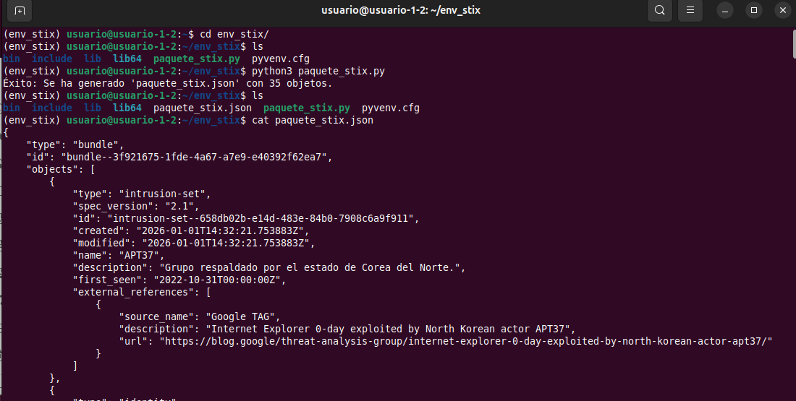

--------------------------------------

# Análisis del artículo
Vamos a ir tomando notas importantes de la lectura del artículo e intentando relacionarlas con su posible forma de modelarlas en Stix.

## 1. Fuente y metadatos del reporte
- Fuente primaria: Google Threat Analysis Group (TAG), post “Internet Explorer 0-day exploited by North Korean actor APT37”.
- Fecha de publicación del post: 07-dic-2022. 
- Autores: Clément Lecigne y Benoît Sevens (TAG). 


<mark>En STIX podría modelarse como un objeto `report`:</mark>
- name: "Internet Explorer 0-day exploited by North Korean actor APT37".
- published: "2022-12-07T00:00:00Z".
- Agrupará todos los SDOs (Standard Data Objects) generados, incluyendo referencias externas al post original


## 2. Descripción del artículo - Ámbito (scope)
TAG documenta una campaña de explotación 0-day:
- Vulnerabilidad 0-day en Internet Explorer (motor JScript), usada in-the-wild.
- Entrega mediante documentos maliciosos de Microsoft Office (cadena Office → plantilla remota → HTML → IE).
- Objetivo principal: usuarios en Corea del Sur.
  

## 3. Atribución
- TAG atribuye la actividad al grupo norcoreano APT37, actor respaldado por el Estado. 
- Además, indica que no es la primera vez que APT37 usa 0-days de Internet Explorer y que, históricamente, se enfoca en:
    - Usuarios surcoreanos.
    - Desertores norcoreanos.
    - Responsables de políticas públicas (policy makers).
    - Periodistas.
    - Activistas de derechos humanos.

<mark>En STIX podría modelarse como:</mark>
- Un `intrusion-set` para APT37.
- Un objeto `identity  para representar a las víctimas.


## 4. Cronología de interés
TAG da tres fechas claras, útiles para `first_seen/last_seen` o narrativa:
- 31-oct-2022: TAG recibe/observa el/los documentos, subidas a VirusTotal por múltiples submitters en Corea del Sur y reporta el 0-day a Microsoft. 
- 03-nov-2022: asignación del `CVE-2022-41128`. 
- 08-nov-2022: parche publicado por Microsoft. 

<mark>Para STIX, estas fechas se podrían modelar como:</mark>
- Campos `first_seen` y `last_seen` en el objeto `intrusion-set`
- Campo `published` en el objeto `vulnerability`.


## 5. Cadena de ataque - Kill chain
### 5.1. Señuelo (lure) y documento inicial
- El 31-oct-2022 se sube a VirusTotal un documento Office titulado: “221031 Seoul Yongsan Itaewon accident response situation (06:00).docx”
- El señuelo referencia el incidente de Itaewon (Seúl) del 29-oct-2022 y aprovecha el interés público. 

<mark>En STIX podría modelarse como:</mark>
- El documento puede modelarse como `indicator`, basado en el hash SHA-256 publicado por TAG (patrón file:hashes.'SHA-256' = '...').


### 5.2 Requisito de interacción del usuario (Protected View)
- En un escenario típico, el documento tiene Mark-of-the-Web (MOTW).
- Eso implica que el usuario debe desactivar Protected View para que se obtenga la plantilla remota. 

<mark>En STIX podría modelarse como:</mark>
- No es un IOC como tal pero se refleja en la narrativa del `report` (o en `notes`) como que existe una dependencia de interacción del usuario.


### 5.3 Template remota (RTF) → HTML remoto
- El documento descarga una plantilla remota RTF (remote template).
- Esa plantilla remota a su vez obtiene contenido HTML remoto. 
- Office renderiza ese HTML usando Internet Explorer, y esta técnica se usa para distribuir exploits IE vía Office.

<mark>En STIX podría modelarse como:</mark>
- La plantilla remota puede modelarse como `indicator` (por hash) y/o como `filep  dentro de `observed-data`.
- El “hosting” del contenido remoto (RTF/HTML) puede representarse como `infrastructure`.


<mark>Como TTP (ATT&CK):</mark> Esto encaja muy bien con `Template Injection (T1221)`.


### 5.4 Ejecución del exploit: IE JScript (jscript9.dll)
- El 0-day está en **jscript9.dll** (motor JavaScript de IE).
- Permite ejecución de código al renderizar una web controlada por el atacante.
- Naturaleza del bug: incorrecta optimización JIT → type confusion, similar a CVE-2021-34480.


<mark>En STIX podría modelarse como:</mark>
- Un objeto vulnerability para CVE-2022-41128.


<mark>Como TTP (ATT&CK):</mark> La técnica más adecuada es `Exploitation for Client Execution (T1203)`: Explotación de una vulnerabilidad en una aplicación cliente para ejecutar código.


### 5.5 Control de entrega: cookie “anti-análisis” y telemetría al C2
- Al servir la RTF remota, el servidor pone una cookie única.
- Esa cookie se reenvía cuando se solicita el HTML remoto; probablemente para detectar “fetches” directos del exploit (análisis). 
- El JavaScript del exploit:
    - Verifica que la cookie esté presente antes de explotar, y
    - reporta al C2 dos veces: antes de lanzar y después de éxito. 

<mark>En STIX podría modelarse como:</mark>
- La infraestructura como `infrastructure`, por ejemplo, “C2/hosting asociado a la cadena RTF→HTML”.
- Relación: `intrusion-set` uses `infrastructure`.
- Los dominios publicados se modelan como `indicator` (con patrón domain-name:value = '...') y se relacionan como:
    - `indicator` indicates `infrastructure`.


### 5.6 Post-explotación inmediata: shellcode, evasión y siguiente etapa
- El shellcode usa un hashing custom para resolver Windows APIs. 
- Borra rastros limpiando caché e historial de Internet Explorer antes de bajar la siguiente etapa. 
- La siguiente etapa se descarga usando la misma cookie.

<mark>En STIX podría modelarse como:</mark>
- Si no hay un payload identificable (hash/nombre), estos elementos se reflejan principalmente en:
    - `report.description`, o un objeto `note`, como comportamiento post-explotación.

<mark>Para TTP ATT&CK:</mark>
- La limpieza de caché/historial encaja con Indicator Removal on Host (T1070) (defense evasion).
- El hashing de APIs se puede considerar como ofuscación/resolución dinámica.


### 5.7 Payload final y malware asociado
- TAG indica que no recuperó el payload final de esa campaña.
- Pero atribuye al mismo actor el uso previo de implantes:
    - ROKRAT
    - BLUELIGHT
    - DOLPHIN
- Añade que APT37 suele abusar de servicios cloud legítimos como canal C2, con capacidades típicas de backdoor.

<mark>En STIX podría modelarse como:</mark>
- Para simplificar, no vamos a crear `malware` para ROKRAT/BLUELIGHT/DOLPHIN como parte de esta intrusión.
- Los mencionaremos únicamente en `report.description` como “históricamente asociado”.


### 5.8 Tabla resumen de modelos para Stix
| Etapa Técnica | Hallazgo en el Informe | Objeto STIX | Técnica ATT&CK |
| -- | -- | -- | -- |
| Acceso Inicial | Documento Word sobre el accidente en Itaewon. | indicator (File Hash) | Phishing: Spearphishing Attachment (T1566.001) |
| Evasión | Inyección de plantilla remota (RTF) para evadir análisis estático. | indicator (URL/Domain) | Template Injection (T1221) |
| Explotación | Vulnerabilidad JIT en jscript9.dll (CVE-2022-41128). | vulnerability | Exploitation for Client Execution (T1203) |
| Persistencia | "Descarga de payloads adicionales (implantes previos: RokRAT, Dolphin)." | malware | N/A (Payload no recuperado en esta campaña) |
| Defensa | Limpieza de caché e historial de IE antes de la siguiente fase. | attack-pattern | Indicator Removal on Host (T1070) |


## 6. Inventario de IOCs publicados (datos “duros”)
### 6.1 Hashes de “Initial documents” (SHA-256)
- 56ca24b57c4559f834c190d50b0fe89dd4a4040a078ca1f267d0bbc7849e9ed7
- af5fb99d3ff18bc625fb63f792ed7cd955171ab509c2f8e7c7ee44515e09cebf
- 926a947ea2b59d3e9a5a6875b4de2bd071b15260370f4da5e2a60ece3517a32f
- 3bff571823421c013e79cc10793f238f4252f7d7ac91f9ef41435af0a8c09a39
- c49b4d370ad0dcd1e28ee8f525ac8e3c12a34cfcf62ebb733ec74cca59b29f82
  
  
<mark>En STIX podría modelarse como un `indicator` por hash:</mark>
- [file:hashes.'SHA-256' = '56ca24b57c4559f834c190d50b0fe89dd4a4040a078ca1f267d0bbc7849e9ed7']
- [file:hashes.'SHA-256' = 'af5fb99d3ff18bc625fb63f792ed7cd955171ab509c2f8e7c7ee44515e09cebf']
- [file:hashes.'SHA-256' = '926a947ea2b59d3e9a5a6875b4de2bd071b15260370f4da5e2a60ece3517a32f']
- [file:hashes.'SHA-256' = '3bff571823421c013e79cc10793f238f4252f7d7ac91f9ef41435af0a8c09a39']
- [file:hashes.'SHA-256' = 'c49b4d370ad0dcd1e28ee8f525ac8e3c12a34cfcf62ebb733ec74cca59b29f82']
- name: Initial documents SHA-256
- description: texto tipo Hash de la plantilla initial documents.
- labels: ["file-hash", "rtf", "initial-documents"]


### 6.2. Hash de la “Remote RTF template” (SHA-256)
- TAG publica 1 hash: 08f93351d0d3905bee5b0c2b9215d448abb0d3cf49c0f8b666c46df4fcc007cb

<mark>En STIX podría modelarse como:</mark>
- “remote template RTF” en `description` del `indicador`.
- [file:hashes.'SHA-256' = '08f93351d0d3905bee5b0c2b9215d448abb0d3cf49c0f8b666c46df4fcc007cb']
- name: Remote RTF template SHA-256
- description: texto tipo Hash de la plantilla remota RTF usada en la cadena de infección
- labels: ["file-hash", "rtf", "remote-template"]

### 6.3. Dominios C2
TAG publica 5 dominios que están ofuscados con [.]:
- word-template[.]net
- openxmlformat[.]org
- ms-office[.]services
- ms-offices[.]com
- template-openxml[.]com
  
<mark>En STIX podría modelarse como:</mark>
- [domain-name:value = 'word-template.net']
- [domain-name:value = 'openxmlformat.org']
- [domain-name:value = 'ms-office.services']
- [domain-name:value = 'ms-offices.com']
- [domain-name:value = 'template-openxml.com']

Nota: en STIX los dominios deben ir desofuscados.


## 7. Elementos “técnicos” adicionales del RCA
El RCA de Project Zero/TAG añade información técnica relevante:
- Clase de vulnerabilidad: optimización incorrecta del JIT que deriva en type confusion.
- Explicación del supuesto de tipos y cómo el exploit lo rompe, cambio de tipo durante la ejecución bajo supuestos del JIT.
- Estrategia de explotación: construcción de primitivas de lectura/escritura (R/W), fugas para sortear ASLR, manipulación de estructuras (p. ej., vtables) y uso de APIs como VirtualProtect para habilitar ejecución de shellcode.
- Detalle operacional: la explotación observada se realiza mediante un documento de Office que carga HTML remoto con JavaScript, reiterando que normalmente requiere que el usuario desactive Protected View para permitir la descarga/ejecución del contenido remoto.

<mark>En STIX podría modelarse como:</mark>
- Esta información sirve para enriquecer la `vulnerability.description`.
- También justifica modelar un `attack-pattern` asociado a `Exploitation for Client Execution (T1203)`, ya que describe explotación de una aplicación cliente para ejecutar código.


## 8. Lista de entidades para transformar a STIX
### 8.1. Entidades principales (core)
- Intrusion Set: APT37 (North Korean government-backed). 
- Vulnerability: CVE-2022-41128 (IE JScript / jscript9.dll; JIT type confusion; RCE). 
- Targeting: usuarios en Corea del Sur; lure sobre Itaewon. 


### 8.2. Artefactos/IOCs
- 5 SHA-256 de documentos iniciales. 
- 1 SHA-256 de plantilla remota RTF. 
- 5 dominios C2. 


### 8.3. Infraestructura y flujo
- Infraestructura web que sirve RTF/HTML y setea cookie única. 
- C2 con doble beacon (pre y post exploit). 


### 8.4. TTPs (para enlazar luego con ATT&CK si haces el extra)
- Template Injection (T1221). 
- Exploitation for Client Execution (T1203). 
- Spearphishing Attachment (T1566.001) como técnica plausible de entrega del doc (si decides incluirla como hipótesis razonable, dejando claro que el canal no está explicitado). 
- Indicator Removal on Host (T1070) por limpieza de caché/historial (defense evasion). 


-------------------------------
# El script de python generado por Gemini
```
import json
from stix2 import (
    IntrusionSet, Vulnerability, Indicator, AttackPattern, 
    Relationship, Identity, Bundle, ExternalReference, Report
)

def generar_paquete_completo():
    # --- 1. REFERENCIAS EXTERNAS Y REPORTE ---
    ref_google = ExternalReference(
        source_name="Google TAG",
        url="https://blog.google/threat-analysis-group/internet-explorer-0-day-exploited-by-north-korean-actor-apt37/",
        description="Internet Explorer 0-day exploited by North Korean actor APT37"
    )

    # --- 2. ACTOR Y VÍCTIMAS ---
    apt37 = IntrusionSet(
        name="APT37",
        description="Grupo respaldado por el estado de Corea del Norte.",
        first_seen="2022-10-31T00:00:00Z",
        external_references=[ref_google]
    )

    victimas = Identity(
        name="Usuarios en Corea del Sur",
        description="Ciudadanos, desertores, periodistas y activistas de derechos humanos.",
        identity_class="individual"
    )

    # --- 3. VULNERABILIDAD ---
    cve_ie = Vulnerability(
        name="CVE-2022-41128",
        description="Fallo de confusión de tipos en jscript9.dll (Internet Explorer) que permite RCE.",
        external_references=[ExternalReference(source_name="cve", external_id="CVE-2022-41128")]
    )

    # --- 4. TTPs (ATT&CK TECHNIQUES) ---
    phishing = AttackPattern(
        name="Spearphishing Attachment",
        external_references=[ExternalReference(source_name="mitre-attack", external_id="T1566.001")]
    )
    template_inj = AttackPattern(
        name="Template Injection",
        external_references=[ExternalReference(source_name="mitre-attack", external_id="T1221")]
    )
    client_exploit = AttackPattern(
        name="Exploitation for Client Execution",
        external_references=[ExternalReference(source_name="mitre-attack", external_id="T1203")]
    )
    indicator_removal = AttackPattern(
        name="Indicator Removal on Host",
        external_references=[ExternalReference(source_name="mitre-attack", external_id="T1070")]
    )

    # --- 5. INDICADORES (IOCs) ---
    indicadores = []
    
    # Hashes de documentos iniciales
    hashes_docs = [
        "56ca24b57c4559f834c190d50b0fe89dd4a4040a078ca1f267d0bbc7849e9ed7",
        "af5fb99d3ff18bc625fb63f792ed7cd955171ab509c2f8e7c7ee44515e09cebf",
        "926a947ea2b59d3e9a5a6875b4de2bd071b15260370f4da5e2a60ece3517a32f",
        "3bff571823421c013e79cc10793f238f4252f7d7ac91f9ef41435af0a8c09a39",
        "c49b4d370ad0dcd1e28ee8f525ac8e3c12a34cfcf62ebb733ec74cca59b29f82"
    ]
    for h in hashes_docs:
        indicadores.append(Indicator(
            name="Documento Inicial SHA-256",
            pattern=f"[file:hashes.'SHA-256' = '{h}']",
            pattern_type="stix",
            labels=["malicious-activity"]
        ))

    # Hash de plantilla RTF remota
    indicadores.append(Indicator(
        name="Remote RTF template SHA-256",
        pattern="[file:hashes.'SHA-256' = '08f93351d0d3905bee5b0c2b9215d448abb0d3cf49c0f8b666c46df4fcc007cb']",
        pattern_type="stix",
        labels=["malicious-activity"]
    ))

    # Dominios C2
    dominios = ["word-template.net", "openxmlformat.org", "ms-office.services", "ms-offices.com", "template-openxml.com"]
    for d in dominios:
        indicadores.append(Indicator(
            name="C2 Domain",
            pattern=f"[domain-name:value = '{d}']",
            pattern_type="stix"
        ))

    # --- 6. RELACIONES ---
    relaciones = [
        Relationship(relationship_type="targets", source_ref=apt37.id, target_ref=victimas.id),
        Relationship(relationship_type="uses", source_ref=apt37.id, target_ref=cve_ie.id),
        Relationship(relationship_type="uses", source_ref=apt37.id, target_ref=phishing.id),
        Relationship(relationship_type="uses", source_ref=apt37.id, target_ref=template_inj.id),
        Relationship(relationship_type="uses", source_ref=apt37.id, target_ref=client_exploit.id),
        Relationship(relationship_type="uses", source_ref=apt37.id, target_ref=indicator_removal.id)
    ]
    
    # Relacionar indicadores con el actor
    for ind in indicadores:
        relaciones.append(Relationship(relationship_type="indicates", source_ref=ind.id, target_ref=apt37.id))

    # --- 7. BUNDLE Y REPORTE ---
    todos_los_objetos = [apt37, victimas, cve_ie, phishing, template_inj, client_exploit, indicator_removal] + indicadores + relaciones
    
    reporte = Report(
        name="Reporte APT37 - CVE-2022-41128",
        published="2022-12-07T00:00:00Z",
        object_refs=[obj.id for obj in todos_los_objetos]
    )
    
    bundle = Bundle(objects=todos_los_objetos + [reporte])

    # Guardar archivo
    with open('paquete_stix.json', 'w') as f:
        f.write(bundle.serialize(indent=4))
    
    print(f"Éxito: Se ha generado 'paquete_stix.json' con {len(todos_los_objetos)} objetos.")

if __name__ == "__main__":
    generar_paquete_completo()
```


# Ejecución del script en una MV


## 1. Usaremos un entornos virtuales para mantener la limpieza del sistema:
- Instalamos el gestor de entornos virtuales: sudo apt install python3-venv -y
- Creamos el entorno virtual: python3 -m venv env_stix
- Activamos el entorno: source env_stix/bin/activate


## 2. Instalación de la Librería STIX2
Como el ejercicio requiere el uso extensivo de esta librería, la instalamos dentro de tu entorno activo: Comando de instalación: pip install stix2


### 3. Ejecución del Script
Copiamos y pegamos el documento del script en la carpeta del entorno virtual. Ejecutamos el script: python3 paquete_stix.py



# JSON resultante
```
{
    "type": "bundle",
    "id": "bundle--3f921675-1fde-4a67-a7e9-e40392f62ea7",
    "objects": [
        {
            "type": "intrusion-set",
            "spec_version": "2.1",
            "id": "intrusion-set--658db02b-e14d-483e-84b0-7908c6a9f911",
            "created": "2026-01-01T14:32:21.753883Z",
            "modified": "2026-01-01T14:32:21.753883Z",
            "name": "APT37",
            "description": "Grupo respaldado por el estado de Corea del Norte.",
            "first_seen": "2022-10-31T00:00:00Z",
            "external_references": [
                {
                    "source_name": "Google TAG",
                    "description": "Internet Explorer 0-day exploited by North Korean actor APT37",
                    "url": "https://blog.google/threat-analysis-group/internet-explorer-0-day-exploited-by-north-korean-actor-apt37/"
                }
            ]
        },
        {
            "type": "identity",
            "spec_version": "2.1",
            "id": "identity--d07f8e2d-355b-4663-8652-168b2a82860a",
            "created": "2026-01-01T14:32:21.754224Z",
            "modified": "2026-01-01T14:32:21.754224Z",
            "name": "Usuarios en Corea del Sur",
            "description": "Ciudadanos, desertores, periodistas y activistas de derechos humanos.",
            "identity_class": "individual"
        },
        {
            "type": "vulnerability",
            "spec_version": "2.1",
            "id": "vulnerability--46a55e6f-8631-456f-9ee8-217540281f89",
            "created": "2026-01-01T14:32:21.754723Z",
            "modified": "2026-01-01T14:32:21.754723Z",
            "name": "CVE-2022-41128",
            "description": "Fallo de confusi\u00f3n de tipos en jscript9.dll (Internet Explorer) que permite RCE.",
            "external_references": [
                {
                    "source_name": "cve",
                    "external_id": "CVE-2022-41128"
                }
            ]
        },
        {
            "type": "attack-pattern",
            "spec_version": "2.1",
            "id": "attack-pattern--fea8a27a-c5b5-46d8-a56d-9feb01e14749",
            "created": "2026-01-01T14:32:21.754803Z",
            "modified": "2026-01-01T14:32:21.754803Z",
            "name": "Spearphishing Attachment",
            "external_references": [
                {
                    "source_name": "mitre-attack",
                    "external_id": "T1566.001"
                }
            ]
        },
        {
            "type": "attack-pattern",
            "spec_version": "2.1",
            "id": "attack-pattern--f150aa22-a518-40dc-9ffb-13dbeeb77518",
            "created": "2026-01-01T14:32:21.754874Z",
            "modified": "2026-01-01T14:32:21.754874Z",
            "name": "Template Injection",
            "external_references": [
                {
                    "source_name": "mitre-attack",
                    "external_id": "T1221"
                }
            ]
        },
        {
            "type": "attack-pattern",
            "spec_version": "2.1",
            "id": "attack-pattern--51e9622c-8aec-4721-b9f8-606e1b3636c6",
            "created": "2026-01-01T14:32:21.754941Z",
            "modified": "2026-01-01T14:32:21.754941Z",
            "name": "Exploitation for Client Execution",
            "external_references": [
                {
                    "source_name": "mitre-attack",
                    "external_id": "T1203"
                }
            ]
        },
        {
            "type": "attack-pattern",
            "spec_version": "2.1",
            "id": "attack-pattern--883924a2-c907-459c-be49-8452ef3b0733",
            "created": "2026-01-01T14:32:21.755004Z",
            "modified": "2026-01-01T14:32:21.755004Z",
            "name": "Indicator Removal on Host",
            "external_references": [
                {
                    "source_name": "mitre-attack",
                    "external_id": "T1070"
                }
            ]
        },
        {
            "type": "indicator",
            "spec_version": "2.1",
            "id": "indicator--49c1ee2c-9afe-455c-82fc-1cce3392b31f",
            "created": "2026-01-01T14:32:21.755048Z",
            "modified": "2026-01-01T14:32:21.755048Z",
            "name": "Documento Inicial SHA-256",
            "pattern": "[file:hashes.'SHA-256' = '56ca24b57c4559f834c190d50b0fe89dd4a4040a078ca1f267d0bbc7849e9ed7']",
            "pattern_type": "stix",
            "pattern_version": "2.1",
            "valid_from": "2026-01-01T14:32:21.755048Z",
            "labels": [
                "malicious-activity"
            ]
        },
        {
            "type": "indicator",
            "spec_version": "2.1",
            "id": "indicator--463c4959-7309-4633-9248-406492b46879",
            "created": "2026-01-01T14:32:21.757681Z",
            "modified": "2026-01-01T14:32:21.757681Z",
            "name": "Documento Inicial SHA-256",
            "pattern": "[file:hashes.'SHA-256' = 'af5fb99d3ff18bc625fb63f792ed7cd955171ab509c2f8e7c7ee44515e09cebf']",
            "pattern_type": "stix",
            "pattern_version": "2.1",
            "valid_from": "2026-01-01T14:32:21.757681Z",
            "labels": [
                "malicious-activity"
            ]
        },
        {
            "type": "indicator",
            "spec_version": "2.1",
            "id": "indicator--d6821f8e-f5cd-4e31-bb27-c59d877517bd",
            "created": "2026-01-01T14:32:21.758007Z",
            "modified": "2026-01-01T14:32:21.758007Z",
            "name": "Documento Inicial SHA-256",
            "pattern": "[file:hashes.'SHA-256' = '926a947ea2b59d3e9a5a6875b4de2bd071b15260370f4da5e2a60ece3517a32f']",
            "pattern_type": "stix",
            "pattern_version": "2.1",
            "valid_from": "2026-01-01T14:32:21.758007Z",
            "labels": [
                "malicious-activity"
            ]
        },
        {
            "type": "indicator",
            "spec_version": "2.1",
            "id": "indicator--664258e0-90f7-4bf3-bc19-0871df46531d",
            "created": "2026-01-01T14:32:21.758282Z",
            "modified": "2026-01-01T14:32:21.758282Z",
            "name": "Documento Inicial SHA-256",
            "pattern": "[file:hashes.'SHA-256' = '3bff571823421c013e79cc10793f238f4252f7d7ac91f9ef41435af0a8c09a39']",
            "pattern_type": "stix",
            "pattern_version": "2.1",
            "valid_from": "2026-01-01T14:32:21.758282Z",
            "labels": [
                "malicious-activity"
            ]
        },
        {
            "type": "indicator",
            "spec_version": "2.1",
            "id": "indicator--415c5f35-0658-4d2c-9feb-d583a5b5a7d2",
            "created": "2026-01-01T14:32:21.75854Z",
            "modified": "2026-01-01T14:32:21.75854Z",
            "name": "Documento Inicial SHA-256",
            "pattern": "[file:hashes.'SHA-256' = 'c49b4d370ad0dcd1e28ee8f525ac8e3c12a34cfcf62ebb733ec74cca59b29f82']",
            "pattern_type": "stix",
            "pattern_version": "2.1",
            "valid_from": "2026-01-01T14:32:21.75854Z",
            "labels": [
                "malicious-activity"
            ]
        },
        {
            "type": "indicator",
            "spec_version": "2.1",
            "id": "indicator--90d0eb95-7d95-476f-985b-f0b23e9ac026",
            "created": "2026-01-01T14:32:21.758791Z",
            "modified": "2026-01-01T14:32:21.758791Z",
            "name": "Remote RTF template SHA-256",
            "pattern": "[file:hashes.'SHA-256' = '08f93351d0d3905bee5b0c2b9215d448abb0d3cf49c0f8b666c46df4fcc007cb']",
            "pattern_type": "stix",
            "pattern_version": "2.1",
            "valid_from": "2026-01-01T14:32:21.758791Z",
            "labels": [
                "malicious-activity"
            ]
        },
        {
            "type": "indicator",
            "spec_version": "2.1",
            "id": "indicator--5804c791-f650-469a-aaf2-bd4fc708f014",
            "created": "2026-01-01T14:32:21.75904Z",
            "modified": "2026-01-01T14:32:21.75904Z",
            "name": "C2 Domain",
            "pattern": "[domain-name:value = 'word-template.net']",
            "pattern_type": "stix",
            "pattern_version": "2.1",
            "valid_from": "2026-01-01T14:32:21.75904Z"
        },
        {
            "type": "indicator",
            "spec_version": "2.1",
            "id": "indicator--85163e70-95f2-46d5-974c-3638697632eb",
            "created": "2026-01-01T14:32:21.759638Z",
            "modified": "2026-01-01T14:32:21.759638Z",
            "name": "C2 Domain",
            "pattern": "[domain-name:value = 'openxmlformat.org']",
            "pattern_type": "stix",
            "pattern_version": "2.1",
            "valid_from": "2026-01-01T14:32:21.759638Z"
        },
        {
            "type": "indicator",
            "spec_version": "2.1",
            "id": "indicator--1019ea71-9b28-42a4-903b-ffc3aee7f37a",
            "created": "2026-01-01T14:32:21.759888Z",
            "modified": "2026-01-01T14:32:21.759888Z",
            "name": "C2 Domain",
            "pattern": "[domain-name:value = 'ms-office.services']",
            "pattern_type": "stix",
            "pattern_version": "2.1",
            "valid_from": "2026-01-01T14:32:21.759888Z"
        },
        {
            "type": "indicator",
            "spec_version": "2.1",
            "id": "indicator--aa5facae-a1c2-4659-b930-f82fa699d6c3",
            "created": "2026-01-01T14:32:21.760216Z",
            "modified": "2026-01-01T14:32:21.760216Z",
            "name": "C2 Domain",
            "pattern": "[domain-name:value = 'ms-offices.com']",
            "pattern_type": "stix",
            "pattern_version": "2.1",
            "valid_from": "2026-01-01T14:32:21.760216Z"
        },
        {
            "type": "indicator",
            "spec_version": "2.1",
            "id": "indicator--974f41c2-c40b-4866-8334-f9f6fafcb34b",
            "created": "2026-01-01T14:32:21.760402Z",
            "modified": "2026-01-01T14:32:21.760402Z",
            "name": "C2 Domain",
            "pattern": "[domain-name:value = 'template-openxml.com']",
            "pattern_type": "stix",
            "pattern_version": "2.1",
            "valid_from": "2026-01-01T14:32:21.760402Z"
        },
        {
            "type": "relationship",
            "spec_version": "2.1",
            "id": "relationship--68e319d2-be4d-4f62-aa92-52d1e02c39c7",
            "created": "2026-01-01T14:32:21.760634Z",
            "modified": "2026-01-01T14:32:21.760634Z",
            "relationship_type": "targets",
            "source_ref": "intrusion-set--658db02b-e14d-483e-84b0-7908c6a9f911",
            "target_ref": "identity--d07f8e2d-355b-4663-8652-168b2a82860a"
        },
        {
            "type": "relationship",
            "spec_version": "2.1",
            "id": "relationship--72c435d3-9eb5-4952-a211-cb5230b6e260",
            "created": "2026-01-01T14:32:21.760797Z",
            "modified": "2026-01-01T14:32:21.760797Z",
            "relationship_type": "uses",
            "source_ref": "intrusion-set--658db02b-e14d-483e-84b0-7908c6a9f911",
            "target_ref": "vulnerability--46a55e6f-8631-456f-9ee8-217540281f89"
        },
        {
            "type": "relationship",
            "spec_version": "2.1",
            "id": "relationship--307af2c4-22c0-43a8-b36c-bef522a7bf25",
            "created": "2026-01-01T14:32:21.760857Z",
            "modified": "2026-01-01T14:32:21.760857Z",
            "relationship_type": "uses",
            "source_ref": "intrusion-set--658db02b-e14d-483e-84b0-7908c6a9f911",
            "target_ref": "attack-pattern--fea8a27a-c5b5-46d8-a56d-9feb01e14749"
        },
        {
            "type": "relationship",
            "spec_version": "2.1",
            "id": "relationship--aae5d698-4148-473c-9b89-b41a8a615591",
            "created": "2026-01-01T14:32:21.760913Z",
            "modified": "2026-01-01T14:32:21.760913Z",
            "relationship_type": "uses",
            "source_ref": "intrusion-set--658db02b-e14d-483e-84b0-7908c6a9f911",
            "target_ref": "attack-pattern--f150aa22-a518-40dc-9ffb-13dbeeb77518"
        },
        {
            "type": "relationship",
            "spec_version": "2.1",
            "id": "relationship--29e5a30a-8eec-46b1-a31b-abbe68fc0924",
            "created": "2026-01-01T14:32:21.76097Z",
            "modified": "2026-01-01T14:32:21.76097Z",
            "relationship_type": "uses",
            "source_ref": "intrusion-set--658db02b-e14d-483e-84b0-7908c6a9f911",
            "target_ref": "attack-pattern--51e9622c-8aec-4721-b9f8-606e1b3636c6"
        },
        {
            "type": "relationship",
            "spec_version": "2.1",
            "id": "relationship--dd96d006-660c-4817-bfde-6ce02a5d9d8b",
            "created": "2026-01-01T14:32:21.761042Z",
            "modified": "2026-01-01T14:32:21.761042Z",
            "relationship_type": "uses",
            "source_ref": "intrusion-set--658db02b-e14d-483e-84b0-7908c6a9f911",
            "target_ref": "attack-pattern--883924a2-c907-459c-be49-8452ef3b0733"
        },
        {
            "type": "relationship",
            "spec_version": "2.1",
            "id": "relationship--5ceb92e3-61cc-4fda-ba69-6d62c0c0b578",
            "created": "2026-01-01T14:32:21.761095Z",
            "modified": "2026-01-01T14:32:21.761095Z",
            "relationship_type": "indicates",
            "source_ref": "indicator--49c1ee2c-9afe-455c-82fc-1cce3392b31f",
            "target_ref": "intrusion-set--658db02b-e14d-483e-84b0-7908c6a9f911"
        },
        {
            "type": "relationship",
            "spec_version": "2.1",
            "id": "relationship--79139651-2822-403b-b852-6ccae3b86fed",
            "created": "2026-01-01T14:32:21.761147Z",
            "modified": "2026-01-01T14:32:21.761147Z",
            "relationship_type": "indicates",
            "source_ref": "indicator--463c4959-7309-4633-9248-406492b46879",
            "target_ref": "intrusion-set--658db02b-e14d-483e-84b0-7908c6a9f911"
        },
        {
            "type": "relationship",
            "spec_version": "2.1",
            "id": "relationship--0d7020b2-f4fc-4bd8-893f-5094ac184538",
            "created": "2026-01-01T14:32:21.761195Z",
            "modified": "2026-01-01T14:32:21.761195Z",
            "relationship_type": "indicates",
            "source_ref": "indicator--d6821f8e-f5cd-4e31-bb27-c59d877517bd",
            "target_ref": "intrusion-set--658db02b-e14d-483e-84b0-7908c6a9f911"
        },
        {
            "type": "relationship",
            "spec_version": "2.1",
            "id": "relationship--fb23ac11-cf17-4c14-8fae-12d61f98a53f",
            "created": "2026-01-01T14:32:21.761245Z",
            "modified": "2026-01-01T14:32:21.761245Z",
            "relationship_type": "indicates",
            "source_ref": "indicator--664258e0-90f7-4bf3-bc19-0871df46531d",
            "target_ref": "intrusion-set--658db02b-e14d-483e-84b0-7908c6a9f911"
        },
        {
            "type": "relationship",
            "spec_version": "2.1",
            "id": "relationship--4d30e944-b089-4ed6-805e-ae2e11e15e0a",
            "created": "2026-01-01T14:32:21.761293Z",
            "modified": "2026-01-01T14:32:21.761293Z",
            "relationship_type": "indicates",
            "source_ref": "indicator--415c5f35-0658-4d2c-9feb-d583a5b5a7d2",
            "target_ref": "intrusion-set--658db02b-e14d-483e-84b0-7908c6a9f911"
        },
        {
            "type": "relationship",
            "spec_version": "2.1",
            "id": "relationship--2ba67c24-2951-4678-9c1a-c61f83c1a1b9",
            "created": "2026-01-01T14:32:21.76134Z",
            "modified": "2026-01-01T14:32:21.76134Z",
            "relationship_type": "indicates",
            "source_ref": "indicator--90d0eb95-7d95-476f-985b-f0b23e9ac026",
            "target_ref": "intrusion-set--658db02b-e14d-483e-84b0-7908c6a9f911"
        },
        {
            "type": "relationship",
            "spec_version": "2.1",
            "id": "relationship--b748e494-c8ee-4410-8ffe-f53e77b5265b",
            "created": "2026-01-01T14:32:21.761387Z",
            "modified": "2026-01-01T14:32:21.761387Z",
            "relationship_type": "indicates",
            "source_ref": "indicator--5804c791-f650-469a-aaf2-bd4fc708f014",
            "target_ref": "intrusion-set--658db02b-e14d-483e-84b0-7908c6a9f911"
        },
        {
            "type": "relationship",
            "spec_version": "2.1",
            "id": "relationship--60b02011-1428-4d22-b1b1-f51e977a2fac",
            "created": "2026-01-01T14:32:21.761434Z",
            "modified": "2026-01-01T14:32:21.761434Z",
            "relationship_type": "indicates",
            "source_ref": "indicator--85163e70-95f2-46d5-974c-3638697632eb",
            "target_ref": "intrusion-set--658db02b-e14d-483e-84b0-7908c6a9f911"
        },
        {
            "type": "relationship",
            "spec_version": "2.1",
            "id": "relationship--9fdf95e9-3a4f-4b94-9985-509920017797",
            "created": "2026-01-01T14:32:21.761483Z",
            "modified": "2026-01-01T14:32:21.761483Z",
            "relationship_type": "indicates",
            "source_ref": "indicator--1019ea71-9b28-42a4-903b-ffc3aee7f37a",
            "target_ref": "intrusion-set--658db02b-e14d-483e-84b0-7908c6a9f911"
        },
        {
            "type": "relationship",
            "spec_version": "2.1",
            "id": "relationship--e9907f16-92a6-4e64-bb2c-5cb1c8f5f487",
            "created": "2026-01-01T14:32:21.761535Z",
            "modified": "2026-01-01T14:32:21.761535Z",
            "relationship_type": "indicates",
            "source_ref": "indicator--aa5facae-a1c2-4659-b930-f82fa699d6c3",
            "target_ref": "intrusion-set--658db02b-e14d-483e-84b0-7908c6a9f911"
        },
        {
            "type": "relationship",
            "spec_version": "2.1",
            "id": "relationship--cef45f56-fe28-4ab0-b159-65ca44438013",
            "created": "2026-01-01T14:32:21.761581Z",
            "modified": "2026-01-01T14:32:21.761581Z",
            "relationship_type": "indicates",
            "source_ref": "indicator--974f41c2-c40b-4866-8334-f9f6fafcb34b",
            "target_ref": "intrusion-set--658db02b-e14d-483e-84b0-7908c6a9f911"
        },
        {
            "type": "report",
            "spec_version": "2.1",
            "id": "report--39077981-d185-47db-ae56-3eb459556fe0",
            "created": "2026-01-01T14:32:21.761636Z",
            "modified": "2026-01-01T14:32:21.761636Z",
            "name": "Reporte APT37 - CVE-2022-41128",
            "published": "2022-12-07T00:00:00Z",
            "object_refs": [
                "intrusion-set--658db02b-e14d-483e-84b0-7908c6a9f911",
                "identity--d07f8e2d-355b-4663-8652-168b2a82860a",
                "vulnerability--46a55e6f-8631-456f-9ee8-217540281f89",
                "attack-pattern--fea8a27a-c5b5-46d8-a56d-9feb01e14749",
                "attack-pattern--f150aa22-a518-40dc-9ffb-13dbeeb77518",
                "attack-pattern--51e9622c-8aec-4721-b9f8-606e1b3636c6",
                "attack-pattern--883924a2-c907-459c-be49-8452ef3b0733",
                "indicator--49c1ee2c-9afe-455c-82fc-1cce3392b31f",
                "indicator--463c4959-7309-4633-9248-406492b46879",
                "indicator--d6821f8e-f5cd-4e31-bb27-c59d877517bd",
                "indicator--664258e0-90f7-4bf3-bc19-0871df46531d",
                "indicator--415c5f35-0658-4d2c-9feb-d583a5b5a7d2",
                "indicator--90d0eb95-7d95-476f-985b-f0b23e9ac026",
                "indicator--5804c791-f650-469a-aaf2-bd4fc708f014",
                "indicator--85163e70-95f2-46d5-974c-3638697632eb",
                "indicator--1019ea71-9b28-42a4-903b-ffc3aee7f37a",
                "indicator--aa5facae-a1c2-4659-b930-f82fa699d6c3",
                "indicator--974f41c2-c40b-4866-8334-f9f6fafcb34b",
                "relationship--68e319d2-be4d-4f62-aa92-52d1e02c39c7",
                "relationship--72c435d3-9eb5-4952-a211-cb5230b6e260",
                "relationship--307af2c4-22c0-43a8-b36c-bef522a7bf25",
                "relationship--aae5d698-4148-473c-9b89-b41a8a615591",
                "relationship--29e5a30a-8eec-46b1-a31b-abbe68fc0924",
                "relationship--dd96d006-660c-4817-bfde-6ce02a5d9d8b",
                "relationship--5ceb92e3-61cc-4fda-ba69-6d62c0c0b578",
                "relationship--79139651-2822-403b-b852-6ccae3b86fed",
                "relationship--0d7020b2-f4fc-4bd8-893f-5094ac184538",
                "relationship--fb23ac11-cf17-4c14-8fae-12d61f98a53f",
                "relationship--4d30e944-b089-4ed6-805e-ae2e11e15e0a",
                "relationship--2ba67c24-2951-4678-9c1a-c61f83c1a1b9",
                "relationship--b748e494-c8ee-4410-8ffe-f53e77b5265b",
                "relationship--60b02011-1428-4d22-b1b1-f51e977a2fac",
                "relationship--9fdf95e9-3a4f-4b94-9985-509920017797",
                "relationship--e9907f16-92a6-4e64-bb2c-5cb1c8f5f487",
                "relationship--cef45f56-fe28-4ab0-b159-65ca44438013"
            ]
        }
    ]
}
```

# Razonamiento Técnico del Modelado STIX
El objetivo de este análisis es transformar un informe de inteligencia no estructurado en un modelo de datos legible por máquinas (JSON STIX 2.1). A continuación, se detalla la lógica aplicada para establecer las relaciones entre los objetos identificados:

## 1. Atribución y Actor de Amenaza (Intrusion Set)
Se ha definido un objeto de tipo `intrusion-set` para APT37 debido a la atribución directa realizada por el equipo TAG de Google. La relación de tipo targets hacia el objeto identity (Corea del Sur) se justifica por:

    El uso de un señuelo de ingeniería social basado en el incidente de Itaewon, diseñado específicamente para atraer a ciudadanos surcoreanos.

El histórico del grupo, que muestra un enfoque persistente en desertores y responsables de políticas de dicha región.

2. Explotación de la Vulnerabilidad

La relación uses entre el actor y el objeto vulnerability (CVE-2022-41128) es el núcleo técnico de esta campaña. El razonamiento es el siguiente:

    Se identifica una explotación activa (in-the-wild) de una vulnerabilidad 0-day en el motor jscript9.dll.

La técnica de Template Injection (T1221) actúa como el puente necesario para que un documento de Office ejecute contenido HTML malicioso en el motor de Internet Explorer, facilitando la ejecución del exploit.

3. Infraestructura e Indicadores (IOCs)

Se han modelado 11 objetos de tipo indicator (6 hashes y 5 dominios) vinculados al actor mediante la relación indicates.

    Hashes (SHA-256): Representan los artefactos físicos (documentos Word y plantillas RTF) que inician la cadena de infección.

Dominios: Se identifican como puntos de entrega de la plantilla remota y el exploit final. Su desofuscación es necesaria para que el paquete STIX sea funcional en sistemas de detección.

4. Mapeo con MITRE ATT&CK (Puntos Extra)

Para enriquecer el paquete y facilitar la respuesta ante incidentes, se han incluido objetos attack-pattern vinculados al intrusion-set mediante relaciones uses.

    T1566.001 (Spearphishing Attachment): Identificado por la distribución de los documentos iniciales observados en VirusTotal.

T1203 (Exploitation for Client Execution): Se aplica debido a que el éxito del ataque depende de la vulnerabilidad en una aplicación cliente (IE) renderizada a través de Office.

T1070 (Indicator Removal on Host): Justificado por la actividad post-explotación del shellcode, que limpia el historial y la caché de IE para dificultar el análisis forense.


# Grafo del paquete STIX generado
Usaremos la plataforma: "https://oasis-open.github.io/cti-stix-visualization/" para generar un grafo con nuestro paquete stix:


# Conclusiones
El desarrollo de esta evaluación ha permitido profundizar en el estudio técnico de una campaña de amenazas avanzadas persistentes (APT) mediante el uso de estándares industriales. Tras el análisis y modelado de la actividad de APT37, se desprenden las siguientes conclusiones clave:

    Estandarización y Automatización: El uso de STIX 2.1 permite transformar reportes narrativos en inteligencia procesable por máquinas, una labor fundamental en cualquier SOC moderno o cadena automatizada de análisis de malware.

Complejidad del Actor APT37: El aprovechamiento de una vulnerabilidad 0-day (CVE-2022-41128) mediante técnicas de Template Injection demuestra el alto nivel técnico de los actores respaldados por estados y la importancia de un análisis detallado de sus TTPs.

Habilidades de Analista y Reverser: La identificación de componentes técnicos (exploits, vulnerabilidades y productos) y su posterior modelado en Python refuerza las capacidades críticas necesarias para un analista de malware.

Cultura de Seguridad (OPSEC): Se ha validado que el procesamiento de este tipo de amenazas debe realizarse estrictamente bajo entornos virtuales desechables, garantizando la integridad de los sistemas de análisis frente a exploits diseñados para ser usados in-the-wild.