--------------------------------------

- [1. Análisis de la Amenaza y Modelado en STIX](#1-análisis-de-la-amenaza-y-modelado-en-stix)
  - [1.1 Fuente y metadatos del reporte](#11-fuente-y-metadatos-del-reporte)
  - [1.2 Descripción del artículo - Ámbito (scope)](#12-descripción-del-artículo---ámbito-scope)
  - [1.3 Atribución](#13-atribución)
  - [1.4 Cronología de interés](#14-cronología-de-interés)
  - [1.5. Cadena de ataque - Kill chain](#15-cadena-de-ataque---kill-chain)
    - [5.1. Señuelo (lure) y documento inicial](#51-señuelo-lure-y-documento-inicial)
    - [5.2 Requisito de interacción del usuario (Protected View)](#52-requisito-de-interacción-del-usuario-protected-view)
    - [5.3 Template remota (RTF) → HTML remoto](#53-template-remota-rtf--html-remoto)
    - [5.4 Ejecución del exploit: IE JScript (jscript9.dll)](#54-ejecución-del-exploit-ie-jscript-jscript9dll)
    - [5.5 Control de entrega: cookie “anti-análisis” y telemetría al C2](#55-control-de-entrega-cookie-anti-análisis-y-telemetría-al-c2)
    - [5.6 Post-explotación inmediata: shellcode, evasión y siguiente etapa](#56-post-explotación-inmediata-shellcode-evasión-y-siguiente-etapa)
    - [5.7 Payload final y malware asociado](#57-payload-final-y-malware-asociado)
    - [5.8 Tabla resumen de modelos para Stix](#58-tabla-resumen-de-modelos-para-stix)
  - [1.6. Inventario de IOCs publicados](#16-inventario-de-iocs-publicados)
    - [6.1 Hashes de “Initial documents” (SHA-256)](#61-hashes-de-initial-documents-sha-256)
    - [6.2. Hash de la “Remote RTF template” (SHA-256)](#62-hash-de-la-remote-rtf-template-sha-256)
    - [6.3. Dominios C2](#63-dominios-c2)
  - [1.7. Elementos “técnicos” adicionales del RCA](#17-elementos-técnicos-adicionales-del-rca)
  - [1.8. Lista de entidades para transformar a STIX](#18-lista-de-entidades-para-transformar-a-stix)
    - [8.1. Entidades principales (core)](#81-entidades-principales-core)
    - [8.2. Artefactos/IOCs](#82-artefactosiocs)
    - [8.3. Infraestructura y flujo](#83-infraestructura-y-flujo)
- [2. Razonamiento Técnico del Modelado STIX](#2-razonamiento-técnico-del-modelado-stix)
  - [2.1 Atribución y Actor de Amenaza (Intrusion Set)](#21-atribución-y-actor-de-amenaza-intrusion-set)
  - [2.2 Explotación de la Vulnerabilidad](#22-explotación-de-la-vulnerabilidad)
  - [2.3 Infraestructura e Indicadores (IOCs)](#23-infraestructura-e-indicadores-iocs)
- [3. Prompt para ChatGPT](#3-prompt-para-chatgpt)
- [4. El script de python generado por ChatGPT](#4-el-script-de-python-generado-por-chatgpt)
- [5. Ejecución del script en una MV](#5-ejecución-del-script-en-una-mv)
- [6. Bundle en formato JSON](#6-bundle-en-formato-json)
- [7. Grafo del paquete STIX generado](#7-grafo-del-paquete-stix-generado)
  - [7.1 Detalle del grupo APT](#71-detalle-del-grupo-apt)
  - [7.2 Detalle del nodo Identity](#72-detalle-del-nodo-identity)
  - [7.3 Detalle un `indicator`](#73-detalle-un-indicator)
  - [7.4 Detalle del informe y su URL de consulta](#74-detalle-del-informe-y-su-url-de-consulta)
  - [7.5 Detalle del Nodo Campaign](#75-detalle-del-nodo-campaign)
  - [7.6 Detalle del Nodo Infrastructure / C2](#76-detalle-del-nodo-infrastructure--c2)
  - [7.7 Detalle del Nodo Vulnerability (CVE-2022-41128)](#77-detalle-del-nodo-vulnerability-cve-2022-41128)
  - [7.8 Detalle de Indicator de dominio C2](#78-detalle-de-indicator-de-dominio-c2)
  - [7.9 Detalle de Indicador de hash](#79-detalle-de-indicador-de-hash)
  - [7.10 Nodo Identity - Google TAG](#710-nodo-identity---google-tag)
- [8. Mapeo ATT\&CK](#8-mapeo-attck)
  - [8.1  Técnicas confirmadas](#81--técnicas-confirmadas)
    - [T1221 - Template Injection - Initial Access](#t1221---template-injection---initial-access)
    - [T1203 - Exploitation for Client Execution](#t1203---exploitation-for-client-execution)
    - [T1070 - Indicator Removal on Host](#t1070---indicator-removal-on-host)
    - [T1480 – Execution Guardrails (Defense Evasion)](#t1480--execution-guardrails-defense-evasion)
    - [T1071.001 – Application Layer Protocol: Web Protocols (Command and Control)](#t1071001--application-layer-protocol-web-protocols-command-and-control)
  - [8.2  Técnicas no confirmadas - Assessed](#82--técnicas-no-confirmadas---assessed)
    - [T1566.001 - Phishing: Spearphishing Attachment](#t1566001---phishing-spearphishing-attachment)
    - [T1204.002 – User Execution: Malicious File (Execution) — assessed/alta](#t1204002--user-execution-malicious-file-execution--assessedalta)
    - [T1105 – Ingress Tool Transfer (Command and Control) — assessed/media](#t1105--ingress-tool-transfer-command-and-control--assessedmedia)
    - [T1027 – Obfuscated Files or Information (Defense Evasion) — assessed/baja-media](#t1027--obfuscated-files-or-information-defense-evasion--assessedbaja-media)
- [9. Nuevo prompt para incluir el mapeo ATT\&CK](#9-nuevo-prompt-para-incluir-el-mapeo-attck)
- [10. Nuevo script para incluir el mapeo ATT\&CK](#10-nuevo-script-para-incluir-el-mapeo-attck)
- [11. Nuevo Bundle en formato JSON para incluir el mapeo ATT\&CK](#11-nuevo-bundle-en-formato-json-para-incluir-el-mapeo-attck)
- [12. Nuevo Grafo del paquete STIX generado para incluir el mapeo ATT\&CK](#12-nuevo-grafo-del-paquete-stix-generado-para-incluir-el-mapeo-attck)
- [9. Conclusiones](#9-conclusiones)


--------------------------------------

# 1. Análisis de la Amenaza y Modelado en STIX
Vamos a ir tomando notas importantes de la lectura del artículo e intentando relacionarlas con su posible forma de modelarlas en Stix.

## 1.1 Fuente y metadatos del reporte
- Fuente primaria: Google Threat Analysis Group (TAG), post “Internet Explorer 0-day exploited by North Korean actor APT37”.
- Fecha de publicación del post: 07-dic-2022. 
- Autores: Clément Lecigne y Benoît Sevens (TAG). 


<mark>En STIX podría modelarse como un objeto `report`:</mark>
- name: "Internet Explorer 0-day exploited by North Korean actor APT37".
- published: "2022-12-07T00:00:00Z".
- Agrupará todos los SDOs (Standard Data Objects) generados, incluyendo referencias externas al post original


## 1.2 Descripción del artículo - Ámbito (scope)
TAG documenta una campaña de explotación 0-day:
- Vulnerabilidad 0-day en Internet Explorer (motor JScript), usada in-the-wild.
- Entrega mediante documentos maliciosos de Microsoft Office (cadena Office → plantilla remota → HTML → IE).
- Objetivo principal: usuarios en Corea del Sur.
  

## 1.3 Atribución
- TAG atribuye la actividad al grupo norcoreano APT37, actor respaldado por el Estado. 
- Además, indica que no es la primera vez que APT37 usa 0-days de Internet Explorer y que, históricamente, se enfoca en:
    - Usuarios surcoreanos.
    - Desertores norcoreanos.
    - Responsables de políticas públicas (policy makers).
    - Periodistas.
    - Activistas de derechos humanos.

<mark>En STIX podría modelarse como:</mark>
- Un `intrusion-set` para APT37.
- Un objeto `identity  para representar a las víctimas.


## 1.4 Cronología de interés
TAG da tres fechas claras, útiles para `first_seen/last_seen` o narrativa:
- 31-oct-2022: TAG recibe/observa el/los documentos, subidas a VirusTotal por múltiples submitters en Corea del Sur y reporta el 0-day a Microsoft. 
- 03-nov-2022: asignación del `CVE-2022-41128`. 
- 08-nov-2022: parche publicado por Microsoft. 

<mark>Para STIX, estas fechas se podrían modelar como:</mark>
- Campos `first_seen` y `last_seen` en el objeto `intrusion-set`
- Campo `published` en el objeto `vulnerability`.


## 1.5. Cadena de ataque - Kill chain
### 5.1. Señuelo (lure) y documento inicial
- El 31-oct-2022 se sube a VirusTotal un documento Office titulado: “221031 Seoul Yongsan Itaewon accident response situation (06:00).docx”
- El señuelo referencia el incidente de Itaewon (Seúl) del 29-oct-2022 y aprovecha el interés público. 

<mark>En STIX podría modelarse como:</mark>
- El documento puede modelarse como `indicator`, basado en el hash SHA-256 publicado por TAG (patrón file:hashes.'SHA-256' = '...').


### 5.2 Requisito de interacción del usuario (Protected View)
- En un escenario típico, el documento tiene Mark-of-the-Web (MOTW).
- Eso implica que el usuario debe desactivar Protected View para que se obtenga la plantilla remota. 

<mark>En STIX podría modelarse como:</mark>
- No es un IOC como tal pero se refleja en la narrativa del `report` (o en `notes`) como que existe una dependencia de interacción del usuario.


### 5.3 Template remota (RTF) → HTML remoto
- El documento descarga una plantilla remota RTF (remote template).
- Esa plantilla remota a su vez obtiene contenido HTML remoto. 
- Office renderiza ese HTML usando Internet Explorer, y esta técnica se usa para distribuir exploits IE vía Office.

<mark>En STIX podría modelarse como:</mark>
- La plantilla remota puede modelarse como `indicator` (por hash) y/o como `filep  dentro de `observed-data`.
- El “hosting” del contenido remoto (RTF/HTML) puede representarse como `infrastructure`.


<mark>Como TTP (ATT&CK):</mark> Esto encaja muy bien con `Template Injection (T1221)`.


### 5.4 Ejecución del exploit: IE JScript (jscript9.dll)
- El 0-day está en **jscript9.dll** (motor JavaScript de IE).
- Permite ejecución de código al renderizar una web controlada por el atacante.
- Naturaleza del bug: incorrecta optimización JIT → type confusion, similar a CVE-2021-34480.


<mark>En STIX podría modelarse como:</mark>
- Un objeto vulnerability para CVE-2022-41128.


<mark>Como TTP (ATT&CK):</mark> La técnica más adecuada es `Exploitation for Client Execution (T1203)`: Explotación de una vulnerabilidad en una aplicación cliente para ejecutar código.


### 5.5 Control de entrega: cookie “anti-análisis” y telemetría al C2
- Al servir la RTF remota, el servidor pone una cookie única.
- Esa cookie se reenvía cuando se solicita el HTML remoto; probablemente para detectar “fetches” directos del exploit (análisis). 
- El JavaScript del exploit:
    - Verifica que la cookie esté presente antes de explotar, y
    - reporta al C2 dos veces: antes de lanzar y después de éxito. 

<mark>En STIX podría modelarse como:</mark>
- La infraestructura como `infrastructure`, por ejemplo, “C2/hosting asociado a la cadena RTF→HTML”.
- Relación: `intrusion-set` uses `infrastructure`.
- Los dominios publicados se modelan como `indicator` (con patrón domain-name:value = '...') y se relacionan como:
    - `indicator` indicates `infrastructure`.


### 5.6 Post-explotación inmediata: shellcode, evasión y siguiente etapa
- El shellcode usa un hashing custom para resolver Windows APIs. 
- Borra rastros limpiando caché e historial de Internet Explorer antes de bajar la siguiente etapa. 
- La siguiente etapa se descarga usando la misma cookie.

<mark>En STIX podría modelarse como:</mark>
- Si no hay un payload identificable (hash/nombre), estos elementos se reflejan principalmente en:
    - `report.description`, o un objeto `note`, como comportamiento post-explotación.

<mark>Para TTP ATT&CK:</mark>
- La limpieza de caché/historial encaja con Indicator Removal on Host (T1070) (defense evasion).
- El hashing de APIs se puede considerar como ofuscación/resolución dinámica.


### 5.7 Payload final y malware asociado
- TAG indica que no recuperó el payload final de esa campaña.
- Pero atribuye al mismo actor el uso previo de implantes:
    - ROKRAT
    - BLUELIGHT
    - DOLPHIN
- Añade que APT37 suele abusar de servicios cloud legítimos como canal C2, con capacidades típicas de backdoor.

<mark>En STIX podría modelarse como:</mark>
- Para simplificar, no vamos a crear `malware` para ROKRAT/BLUELIGHT/DOLPHIN como parte de esta intrusión.
- Los mencionaremos únicamente en `report.description` como “históricamente asociado”.


### 5.8 Tabla resumen de modelos para Stix
| Etapa Técnica | Hallazgo en el Informe | Objeto STIX | Técnica ATT&CK |
| -- | -- | -- | -- |
| Acceso Inicial | Documento Word sobre el accidente en Itaewon. | indicator (File Hash) | Phishing: Spearphishing Attachment (T1566.001) |
| Evasión | Inyección de plantilla remota (RTF) para evadir análisis estático. | indicator (URL/Domain) | Template Injection (T1221) |
| Explotación | Vulnerabilidad JIT en jscript9.dll (CVE-2022-41128). | vulnerability | Exploitation for Client Execution (T1203) |
| Persistencia | "Descarga de payloads adicionales (implantes previos: RokRAT, Dolphin)." | malware | N/A (Payload no recuperado en esta campaña) |
| Defensa | Limpieza de caché e historial de IE antes de la siguiente fase. | attack-pattern | Indicator Removal on Host (T1070) |


## 1.6. Inventario de IOCs publicados
### 6.1 Hashes de “Initial documents” (SHA-256)
- 56ca24b57c4559f834c190d50b0fe89dd4a4040a078ca1f267d0bbc7849e9ed7
- af5fb99d3ff18bc625fb63f792ed7cd955171ab509c2f8e7c7ee44515e09cebf
- 926a947ea2b59d3e9a5a6875b4de2bd071b15260370f4da5e2a60ece3517a32f
- 3bff571823421c013e79cc10793f238f4252f7d7ac91f9ef41435af0a8c09a39
- c49b4d370ad0dcd1e28ee8f525ac8e3c12a34cfcf62ebb733ec74cca59b29f82
  
  
<mark>En STIX podría modelarse como un `indicator` por hash:</mark>
- [file:hashes.'SHA-256' = '56ca24b57c4559f834c190d50b0fe89dd4a4040a078ca1f267d0bbc7849e9ed7']
- [file:hashes.'SHA-256' = 'af5fb99d3ff18bc625fb63f792ed7cd955171ab509c2f8e7c7ee44515e09cebf']
- [file:hashes.'SHA-256' = '926a947ea2b59d3e9a5a6875b4de2bd071b15260370f4da5e2a60ece3517a32f']
- [file:hashes.'SHA-256' = '3bff571823421c013e79cc10793f238f4252f7d7ac91f9ef41435af0a8c09a39']
- [file:hashes.'SHA-256' = 'c49b4d370ad0dcd1e28ee8f525ac8e3c12a34cfcf62ebb733ec74cca59b29f82']


### 6.2. Hash de la “Remote RTF template” (SHA-256)
- TAG publica 1 hash: 08f93351d0d3905bee5b0c2b9215d448abb0d3cf49c0f8b666c46df4fcc007cb

<mark>En STIX podría modelarse como:</mark>
- “remote template RTF” en `description` del `indicador`.
- [file:hashes.'SHA-256' = '08f93351d0d3905bee5b0c2b9215d448abb0d3cf49c0f8b666c46df4fcc007cb']


### 6.3. Dominios C2
TAG publica 5 dominios que están ofuscados con [.]:
- word-template[.]net
- openxmlformat[.]org
- ms-office[.]services
- ms-offices[.]com
- template-openxml[.]com
  
<mark>En STIX podría modelarse como:</mark>
- [domain-name:value = 'word-template.net']
- [domain-name:value = 'openxmlformat.org']
- [domain-name:value = 'ms-office.services']
- [domain-name:value = 'ms-offices.com']
- [domain-name:value = 'template-openxml.com']

Nota: en STIX los dominios deben ir desofuscados.


## 1.7. Elementos “técnicos” adicionales del RCA
El RCA de Project Zero/TAG añade información técnica relevante:
- Clase de vulnerabilidad: optimización incorrecta del JIT que deriva en type confusion.
- Explicación del supuesto de tipos y cómo el exploit lo rompe, cambio de tipo durante la ejecución bajo supuestos del JIT.
- Estrategia de explotación: construcción de primitivas de lectura/escritura (R/W), fugas para sortear ASLR, manipulación de estructuras (p. ej., vtables) y uso de APIs como VirtualProtect para habilitar ejecución de shellcode.
- Detalle operacional: la explotación observada se realiza mediante un documento de Office que carga HTML remoto con JavaScript, reiterando que normalmente requiere que el usuario desactive Protected View para permitir la descarga/ejecución del contenido remoto.

<mark>En STIX podría modelarse como:</mark>
- Esta información sirve para enriquecer la `vulnerability.description`.
- También justifica modelar un `attack-pattern` asociado a `Exploitation for Client Execution (T1203)`, ya que describe explotación de una aplicación cliente para ejecutar código.


## 1.8. Lista de entidades para transformar a STIX
### 8.1. Entidades principales (core)
- Intrusion Set: APT37 (North Korean government-backed). 
- Vulnerability: CVE-2022-41128 (IE JScript / jscript9.dll; JIT type confusion; RCE). 
- Targeting: usuarios en Corea del Sur; lure sobre Itaewon. 


### 8.2. Artefactos/IOCs
- 5 SHA-256 de documentos iniciales. 
- 1 SHA-256 de plantilla remota RTF. 
- 5 dominios C2. 


### 8.3. Infraestructura y flujo
- Infraestructura web que sirve RTF/HTML y setea cookie única. 
- C2 con doble beacon (pre y post exploit). 


-------------------------------


# 2. Razonamiento Técnico del Modelado STIX
El objetivo de este análisis es transformar un informe de inteligencia no estructurado en un modelo de datos legible por máquinas (JSON STIX 2.1). A continuación, se detalla la lógica aplicada para establecer las relaciones entre los objetos identificados:

## 2.1 Atribución y Actor de Amenaza (Intrusion Set)
Se ha definido un objeto de tipo `intrusion-set` para APT37 debido a la atribución directa realizada por el equipo TAG de Google. La relación de tipo targets hacia el objeto identity (Corea del Sur) se justifica por:

    El uso de un señuelo de ingeniería social basado en el incidente de Itaewon, diseñado específicamente para atraer a ciudadanos surcoreanos.

El histórico del grupo, que muestra un enfoque persistente en desertores y responsables de políticas de dicha región.

## 2.2 Explotación de la Vulnerabilidad

La relación uses entre el actor y el objeto vulnerability (CVE-2022-41128) es el núcleo técnico de esta campaña. El razonamiento es el siguiente:

    Se identifica una explotación activa (in-the-wild) de una vulnerabilidad 0-day en el motor jscript9.dll.

La técnica de Template Injection (T1221) actúa como el puente necesario para que un documento de Office ejecute contenido HTML malicioso en el motor de Internet Explorer, facilitando la ejecución del exploit.

## 2.3 Infraestructura e Indicadores (IOCs)

Se han modelado 11 objetos de tipo indicator (6 hashes y 5 dominios) vinculados al actor mediante la relación indicates.

    Hashes (SHA-256): Representan los artefactos físicos (documentos Word y plantillas RTF) que inician la cadena de infección.

Dominios: Se identifican como puntos de entrega de la plantilla remota y el exploit final. Su desofuscación es necesaria para que el paquete STIX sea funcional en sistemas de detección.


------ 


# 3. Prompt para ChatGPT
Con la recopilación de la anterior información, he pedido a GhatGPT que realice el script de python ya que yo no tengo nivel en este lenguaje de programación para abordar semejante script.

Necesito un script completo en Python usando la librería stix2 (STIX 2.1) para modelar de forma exhaustiva la campaña de APT37 descrita por Google TAG en el post “Internet Explorer 0-day exploited by North Korean actor APT37”. Datos e IOCs obligatorios a incluir:
- Título: `Internet Explorer 0-day exploited by North Korean actor APT37`.

- Lista `INITIAL_DOC_SHA256` con estos 5 hashes SHA-256:
  - `56ca24b57c4559f834c190d50b0fe89dd4a4040a078ca1f267d0bbc7849e9ed7`.
  - `af5fb99d3ff18bc625fb63f792ed7cd955171ab509c2f8e7c7ee44515e09cebf`.
  - `926a947ea2b59d3e9a5a6875b4de2bd071b15260370f4da5e2a60ece3517a32f`.
  - `3bff571823421c013e79cc10793f238f4252f7d7ac91f9ef41435af0a8c09a39`.
  - `c49b4d370ad0dcd1e28ee8f525ac8e3c12a34cfcf62ebb733ec74cca59b29f82`.

- `REMOTE_RTF_TEMPLATE_SHA256` con el hash: `08f93351d0d3905bee5b0c2b9215d448abb0d3cf49c0f8b666c46df4fcc007cb`.

- Lista `C2_DOMAINS` con estos 5 dominios:
  - `word-template.net`.
  - `openxmlformat.org`.
  - `ms-office.services`.
  - `ms-offices.com`.
  - `template-openxml.com`.

- SDOs obligatorios:
  - `threat-actor` para APT37.
  - `intrusion-set` para APT37. Mantenerlo además del threat-actor.
  - `campaign` para la campaña del IE 0-day vía Office.
  - `vulnerability` para `CVE-2022-41128`.
  - `infrastructure` para C2/hosting asociado a dominios.
  - `indicator` para:
    - Cada hash de `INITIAL_DOC_SHA256`, pattern de `file:hashes.'SHA-256'`.
    - El hash `REMOTE_RTF_TEMPLATE_SHA256`.
    - Cada dominio `C2_DOMAINS`,  pattern de `domain-name:value`.
  - `attack-pattern` para técnicas MITRE ATT&CK, con `external_references`:
    - T1221 Template Injection.
    - T1203 Exploitation for Client Execution.
    - T1070 Indicator Removal on Host.
    - T1566.001 Spearphishing Attachment. Marcar como “assessed”/hipótesis, no afirmación. ???????xxxxx
  - `malware` familias históricas asociadas a APT37:
    - `ROKRAT`.
    - `BLUELIGHT`.
    - `DOLPHIN`.
  - Un `unknown_payload = Malware(...)` como placeholder para “payload final no recuperado”, usado solo para poder demostrar la relación authored-by hacia el threat-actor con baja confianza y nota aclaratoria. ????XXXXX
  - `location` “South Korea”.
  - `report` (SDO) del informe TAG.


- `Notes`:
  - `Note “Cookie-based gating and double beaconing”` describiendo: cookie única en RTF, verificación cookie antes de explotar, y telemetría pre/post exploit al C2.
  - `Note “Caveat: authored-by modeled for teaching purposes”` explicando que TAG no recuperó el payload final y que authored-by es didáctico/hipótesis con baja confianza.

- Relaciones SRO obligatorias (SDO → SDO):
  - `campaign — attributed-to → threat-actor (APT37)`.
  - `intrusion-set — attributed-to → threat-actor (APT37)`.
  - `indicator — indicates → threat-actor (APT37)`.
  - `threat-actor — uses → infrastructure`.
  - `threat-actor — uses → attack-pattern`.
  - `threat-actor — uses → malware (ROKRAT/BLUELIGHT/DOLPHIN)`.
  - `malware (unknown_payload) — authored-by → threat-actor`.
  - `campaign — exploits → vulnerability`.
  - `campaign — uses → infrastructure`.
  - `campaign — targets → location (South Korea)`.

- Requisito del Report:
  - Crear `published_time = datetime(year=2022, month=12, day=7)`, con timezone UTC.
  - Crear `url_report = {"source_name": "google-tag", "url": "<URL del post>"}`
  - `Report(published=published_time, external_references=[url_report], report_types=["campaign"], object_refs=[...])`

- Requisito visual, muy importante:
  - El `report` y la `identity “Google TAG”` NO deben quedar aislados en STIX Visualizer. (He tenido que incorporar expreamente esto al prompt ya que aparecía el nodo, pero no tenía unión con el resto del grafo.)
  - Añade SROs `report — refers-to → (threat-actor, campaign, vulnerability, infrastructure e identity)` para que el grafo quede también conectado.

- Salida y ejecución:
  - El script debe aceptar argumentos `--out` y `--pretty` y escribir un `Bundle(objects=[...])` en JSON.
  - Salida del script: `apt37_ie0day_campaign_stix.json`.

Devuélveme el script completo listo para copiar/pegar y ejecutar.


--------------------------------------

# 4. El script de python generado por ChatGPT
```
#!/usr/bin/env python3
"""
APT37 (Google TAG) - STIX 2.1 Bundle con:
- ThreatActor + IntrusionSet + Campaign + Vulnerability + Infrastructure + Indicators
- Relaciones forward/reverse como en teoría
- Report con URL en external_references (10.6.5) y published_time como datetime
- Report conectado al grafo vía relationship "refers-to"

Requisitos:
  pip install stix2

Ejecución:
  python3 apt37_stix_full.py --out apt37_ie0day_campaign_stix.json --pretty
"""

from __future__ import annotations

import argparse
from datetime import datetime, timezone
from typing import List, Optional
from uuid import uuid4

from stix2 import (
    AttackPattern,
    Bundle,
    Campaign,
    Identity,
    Indicator,
    Infrastructure,
    IntrusionSet,
    Location,
    Malware,
    Note,
    Relationship,
    Report,
    ThreatActor,
    Tool,
    Vulnerability,
)

# -----------------------------
# Source / report metadata
# -----------------------------
ARTICLE_URL = "https://blog.google/threat-analysis-group/internet-explorer-0-day-exploited-by-north-korean-actor-apt37/"
ARTICLE_TITLE = "Internet Explorer 0-day exploited by North Korean actor APT37"

# Enfoque de apuntes (10.6.5): published_time como datetime
published_time = datetime(year=2022, month=12, day=7, tzinfo=timezone.utc)

# Enfoque de apuntes (10.6.5): URL como external_reference (NO como SDO/SCO)
url_report = {
    "source_name": "google-tag",
    "url": ARTICLE_URL,
}

# Timeline anchors
OBSERVED_FIRST = datetime(2022, 10, 31, 0, 0, 0, tzinfo=timezone.utc)
PATCH_TUESDAY = datetime(2022, 11, 8, 0, 0, 0, tzinfo=timezone.utc)

# -----------------------------
# IOCs from TAG
# -----------------------------
INITIAL_DOC_SHA256 = [
    "56ca24b57c4559f834c190d50b0fe89dd4a4040a078ca1f267d0bbc7849e9ed7",
    "af5fb99d3ff18bc625fb63f792ed7cd955171ab509c2f8e7c7ee44515e09cebf",
    "926a947ea2b59d3e9a5a6875b4de2bd071b15260370f4da5e2a60ece3517a32f",
    "3bff571823421c013e79cc10793f238f4252f7d7ac91f9ef41435af0a8c09a39",
    "c49b4d370ad0dcd1e28ee8f525ac8e3c12a34cfcf62ebb733ec74cca59b29f82",
]

REMOTE_RTF_TEMPLATE_SHA256 = "08f93351d0d3905bee5b0c2b9215d448abb0d3cf49c0f8b666c46df4fcc007cb"

C2_DOMAINS = [
    "word-template.net",
    "openxmlformat.org",
    "ms-office.services",
    "ms-offices.com",
    "template-openxml.com",
]


def utc(dt: datetime) -> str:
    """RFC3339 UTC string (útil para campos que no uses como datetime)."""
    if dt.tzinfo is None:
        dt = dt.replace(tzinfo=timezone.utc)
    return dt.astimezone(timezone.utc).isoformat().replace("+00:00", "Z")


def make_file_hash_indicator(sha256: str, name: str, desc: str, created_by_ref: str, valid_from: datetime) -> Indicator:
    return Indicator(
        spec_version="2.1",
        name=name,
        description=desc,
        pattern_type="stix",
        pattern=f"[file:hashes.'SHA-256' = '{sha256}']",
        valid_from=utc(valid_from),
        labels=["file-hash", "malicious-activity"],
        created_by_ref=created_by_ref,
    )


def make_domain_indicator(domain: str, created_by_ref: str, valid_from: datetime) -> Indicator:
    return Indicator(
        spec_version="2.1",
        name=f"C2 domain indicator: {domain}",
        description="Domain reported as command-and-control / campaign infrastructure in the TAG report.",
        pattern_type="stix",
        pattern=f"[domain-name:value = '{domain}']",
        valid_from=utc(valid_from),
        labels=["domain", "c2", "malicious-activity"],
        created_by_ref=created_by_ref,
    )


def rel(
    source_ref: str,
    relationship_type: str,
    target_ref: str,
    created_by_ref: str,
    description: Optional[str] = None,
    confidence: Optional[int] = None,
) -> Relationship:
    kwargs = {}
    if description:
        kwargs["description"] = description
    if confidence is not None:
        kwargs["confidence"] = confidence

    return Relationship(
        spec_version="2.1",
        relationship_type=relationship_type,
        source_ref=source_ref,
        target_ref=target_ref,
        created_by_ref=created_by_ref,
        **kwargs,
    )


def main() -> None:
    ap = argparse.ArgumentParser(description="Generate STIX 2.1 bundle for APT37 IE 0-day campaign (Google TAG).")
    ap.add_argument("--out", default="apt37_ie0day_campaign_stix.json", help="Output JSON file path.")
    ap.add_argument("--pretty", action="store_true", help="Pretty-print JSON.")
    args = ap.parse_args()

    # -----------------------------
    # Producer identity
    # -----------------------------
    google_tag = Identity(
        spec_version="2.1",
        name="Google Threat Analysis Group (TAG)",
        identity_class="organization",
        description="Google Threat Analysis Group; publisher of the referenced report.",
    )

    # -----------------------------
    # Location (must have country/region or lat/long)
    # -----------------------------
    south_korea = Location(
        spec_version="2.1",
        name="South Korea",
        country="South Korea",
        region="eastern-asia",
        description="Primary target geography mentioned in the report.",
        created_by_ref=google_tag.id,
    )

    # -----------------------------
    # Threat Actor + Intrusion Set
    # -----------------------------
    apt37_ta = ThreatActor(
        spec_version="2.1",
        name="APT37",
        aliases=["APT37"],
        threat_actor_types=["nation-state"],
        description="North Korea-linked threat actor. Google TAG attributes the observed activity to APT37.",
        created_by_ref=google_tag.id,
    )

    apt37_is = IntrusionSet(
        spec_version="2.1",
        name="APT37",
        aliases=["APT37"],
        description="Intrusion set representation for the group activity; linked to Threat Actor via attributed-to.",
        first_seen=utc(OBSERVED_FIRST),
        created_by_ref=google_tag.id,
    )

    # -----------------------------
    # Campaign
    # -----------------------------
    campaign = Campaign(
        spec_version="2.1",
        name="APT37 IE 0-day via Office remote template (CVE-2022-41128)",
        description=(
            "Observed exploitation chain: Office doc -> remote RTF template -> remote HTML rendered via IE -> "
            "exploitation of CVE-2022-41128 (jscript9.dll)."
        ),
        first_seen=utc(OBSERVED_FIRST),
        last_seen=utc(PATCH_TUESDAY),
        created_by_ref=google_tag.id,
    )

    # -----------------------------
    # Vulnerability
    # -----------------------------
    vuln = Vulnerability(
        spec_version="2.1",
        name="CVE-2022-41128",
        description=(
            "Internet Explorer JScript (jscript9.dll) 0-day exploited in the wild; JIT optimization issue leading to "
            "type confusion and code execution."
        ),
        external_references=[
            {
                "source_name": "cve",
                "external_id": "CVE-2022-41128",
                "url": "https://cve.mitre.org/cgi-bin/cvename.cgi?name=CVE-2022-41128",
            },
            url_report,  # también referencia el post de TAG
        ],
        created_by_ref=google_tag.id,
    )

    # -----------------------------
    # ATT&CK Attack Patterns
    # -----------------------------
    ap_template_injection = AttackPattern(
        spec_version="2.1",
        name="Template Injection",
        description="Office uses a remote template (RTF) to load attacker-controlled content.",
        external_references=[{"source_name": "mitre-attack", "external_id": "T1221", "url": "https://attack.mitre.org/techniques/T1221/"}],
        created_by_ref=google_tag.id,
    )

    ap_exploit_client = AttackPattern(
        spec_version="2.1",
        name="Exploitation for Client Execution",
        description="Exploitation of a client-side application vulnerability to execute code.",
        external_references=[{"source_name": "mitre-attack", "external_id": "T1203", "url": "https://attack.mitre.org/techniques/T1203/"}],
        created_by_ref=google_tag.id,
    )

    ap_indicator_removal = AttackPattern(
        spec_version="2.1",
        name="Indicator Removal on Host",
        description="Post-exploitation cleanup such as clearing IE cache/history to reduce forensic artifacts.",
        external_references=[{"source_name": "mitre-attack", "external_id": "T1070", "url": "https://attack.mitre.org/techniques/T1070/"}],
        created_by_ref=google_tag.id,
    )

    ap_spearphish_attach = AttackPattern(
        spec_version="2.1",
        name="Spearphishing Attachment (assessed)",
        description="Assessment: malicious Office doc suggests T1566.001, but TAG does not specify delivery channel.",
        external_references=[{"source_name": "mitre-attack", "external_id": "T1566.001", "url": "https://attack.mitre.org/techniques/T1566/001/"}],
        created_by_ref=google_tag.id,
    )

    # -----------------------------
    # Infrastructure
    # -----------------------------
    infra = Infrastructure(
        spec_version="2.1",
        name="APT37 campaign infrastructure (C2 / hosting)",
        description=(
            "Infrastructure serving remote templates/HTML and receiving telemetry/C2 beacons; "
            "TAG observed cookie-based gating and beaconing pre/post exploitation."
        ),
        infrastructure_types=["command-and-control", "hosting-malware"],
        created_by_ref=google_tag.id,
    )

    # -----------------------------
    # Tool (align with 'threat-actor uses tool' examples)
    # -----------------------------
    exploit_tool = Tool(
        spec_version="2.1",
        name="CVE-2022-41128 exploit chain (Office->IE JScript)",
        tool_types=["exploitation"],
        description="Modeled as a Tool to align with 'threat-actor uses tool' relationship examples.",
        created_by_ref=google_tag.id,
    )

    # -----------------------------
    # Malware (historical association)
    # -----------------------------
    rokrat = Malware(
        spec_version="2.1",
        name="ROKRAT",
        is_family=True,
        description="Historically associated with APT37 per TAG; not confirmed as payload in this campaign.",
        created_by_ref=google_tag.id,
    )
    bluelight = Malware(
        spec_version="2.1",
        name="BLUELIGHT",
        is_family=True,
        description="Historically associated with APT37 per TAG; not confirmed as payload in this campaign.",
        created_by_ref=google_tag.id,
    )
    dolphin = Malware(
        spec_version="2.1",
        name="DOLPHIN",
        is_family=True,
        description="Historically associated with APT37 per TAG; not confirmed as payload in this campaign.",
        created_by_ref=google_tag.id,
    )

    # Placeholder payload (didactic for authored-by)
    unknown_payload = Malware(
        spec_version="2.1",
        name="Unrecovered second-stage payload (modeled)",
        is_family=False,
        description=(
            "Modeled placeholder for unrecovered payload (TAG states final payload not recovered). "
            "Included to demonstrate 'malware authored-by threat-actor' with low confidence."
        ),
        created_by_ref=google_tag.id,
    )

    # -----------------------------
    # Indicators
    # -----------------------------
    indicators: List[Indicator] = []
    for i, h in enumerate(INITIAL_DOC_SHA256, start=1):
        indicators.append(
            make_file_hash_indicator(
                sha256=h,
                name=f"Initial Office document SHA-256 (#{i})",
                desc="SHA-256 for an initial malicious Office document reported by TAG in this campaign.",
                created_by_ref=google_tag.id,
                valid_from=OBSERVED_FIRST,
            )
        )

    indicators.append(
        make_file_hash_indicator(
            sha256=REMOTE_RTF_TEMPLATE_SHA256,
            name="Remote RTF template SHA-256",
            desc="SHA-256 for the remote RTF template used in the Office -> RTF -> HTML chain.",
            created_by_ref=google_tag.id,
            valid_from=OBSERVED_FIRST,
        )
    )

    indicators.extend([make_domain_indicator(d, google_tag.id, OBSERVED_FIRST) for d in C2_DOMAINS])

    # -----------------------------
    # Notes
    # -----------------------------
    note_protected_view = Note(
        spec_version="2.1",
        abstract="Protected View / MOTW dependency",
        content="TAG notes victims typically must disable Protected View (MOTW) to allow remote template retrieval/exploitation.",
        created_by_ref=google_tag.id,
        object_refs=[campaign.id],
    )

    note_cookie_gate = Note(
        spec_version="2.1",
        abstract="Cookie-based gating and double beaconing",
        content="Cookie gate: unique cookie set on remote RTF fetch and required by exploit; beacons before/after success.",
        created_by_ref=google_tag.id,
        object_refs=[campaign.id, infra.id],
    )

    note_authored_by_caveat = Note(
        spec_version="2.1",
        abstract="Caveat: authored-by modeled for teaching purposes",
        content=(
            "The 'malware authored-by threat-actor' relationship is included with low confidence for didactic alignment. "
            "TAG states the final payload was not recovered."
        ),
        created_by_ref=google_tag.id,
        object_refs=[unknown_payload.id, apt37_ta.id],
    )

    # -----------------------------
    # Relationships
    # -----------------------------
    relationships: List[Relationship] = []

    # Reverse towards Threat Actor
    relationships.append(rel(campaign.id, "attributed-to", apt37_ta.id, google_tag.id, confidence=80))
    relationships.append(rel(apt37_is.id, "attributed-to", apt37_ta.id, google_tag.id, confidence=80))

    # Forward from Threat Actor (uses)
    relationships.append(rel(apt37_ta.id, "uses", infra.id, google_tag.id, confidence=70))
    relationships.append(rel(apt37_ta.id, "uses", ap_template_injection.id, google_tag.id, confidence=60))
    relationships.append(rel(apt37_ta.id, "uses", ap_exploit_client.id, google_tag.id, confidence=60))
    relationships.append(rel(apt37_ta.id, "uses", ap_indicator_removal.id, google_tag.id, confidence=50))
    relationships.append(rel(apt37_ta.id, "uses", ap_spearphish_attach.id, google_tag.id, confidence=40))
    relationships.append(rel(apt37_ta.id, "uses", exploit_tool.id, google_tag.id, confidence=60))
    relationships.append(rel(apt37_ta.id, "uses", rokrat.id, google_tag.id, confidence=45))
    relationships.append(rel(apt37_ta.id, "uses", bluelight.id, google_tag.id, confidence=45))
    relationships.append(rel(apt37_ta.id, "uses", dolphin.id, google_tag.id, confidence=45))

    # Didactic reverse: malware authored-by threat-actor
    relationships.append(
        rel(
            unknown_payload.id,
            "authored-by",
            apt37_ta.id,
            google_tag.id,
            description="Didactic; TAG did not recover final payload. Low confidence.",
            confidence=15,
        )
    )

    # Campaign structure
    relationships.append(rel(campaign.id, "targets", south_korea.id, google_tag.id, confidence=70))
    relationships.append(rel(campaign.id, "exploits", vuln.id, google_tag.id, confidence=80))
    relationships.append(rel(campaign.id, "uses", infra.id, google_tag.id, confidence=80))

    # indicator indicates threat-actor (+ campaign/infra enrichment)
    for ind in indicators:
        ta_conf = 60 if "domain" in ind.labels else 50
        relationships.append(rel(ind.id, "indicates", apt37_ta.id, google_tag.id, confidence=ta_conf))
        relationships.append(rel(ind.id, "indicates", campaign.id, google_tag.id, confidence=70))
        if "domain" in ind.labels:
            relationships.append(rel(ind.id, "indicates", infra.id, google_tag.id, confidence=70))

    # ---------------------------------------------------------
    # IMPORTANT: Connect REPORT via explicit SRO "refers-to"
    # Pre-generate report_id so we can build relationships before creating Report object.
    # ---------------------------------------------------------
    report_id = f"report--{uuid4()}"

    relationships.append(rel(report_id, "refers-to", apt37_ta.id, google_tag.id, confidence=80))
    relationships.append(rel(report_id, "refers-to", campaign.id, google_tag.id, confidence=80))
    relationships.append(rel(report_id, "refers-to", vuln.id, google_tag.id, confidence=70))
    relationships.append(rel(report_id, "refers-to", infra.id, google_tag.id, confidence=70))
    relationships.append(rel(report_id, "refers-to", google_tag.id, google_tag.id, confidence=60))  # connect Identity too

    # -----------------------------
    # Report (10.6.5 style + connected)
    # -----------------------------
    report = Report(
        id=report_id,
        spec_version="2.1",
        name=ARTICLE_TITLE,
        published=published_time,                 # <-- como en apuntes
        report_types=["campaign"],                # <-- como en apuntes (si prefieres: ["threat-report", "campaign"])
        external_references=[url_report],         # <-- como en apuntes
        created_by_ref=google_tag.id,
        description=(
            "Google TAG report describing in-the-wild exploitation of CVE-2022-41128 (IE JScript / jscript9.dll) "
            "attributed to APT37. Chain: Office doc -> remote RTF template -> remote HTML rendered via IE."
        ),
        object_refs=[                             # <-- como en apuntes (pero con IDs, forma robusta)
            rokrat.id,            # ejemplos (históricos)
            apt37_ta.id,
            campaign.id,
            vuln.id,
            infra.id,
            *[ind.id for ind in indicators],
            note_protected_view.id,
            note_cookie_gate.id,
            note_authored_by_caveat.id,
        ],
    )

    # -----------------------------
    # Bundle
    # -----------------------------
    all_objects = [
        google_tag,
        south_korea,
        apt37_ta,
        apt37_is,
        campaign,
        vuln,
        infra,
        exploit_tool,
        ap_template_injection,
        ap_exploit_client,
        ap_indicator_removal,
        ap_spearphish_attach,
        rokrat,
        bluelight,
        dolphin,
        unknown_payload,
        note_protected_view,
        note_cookie_gate,
        note_authored_by_caveat,
        report,
        *indicators,
        *relationships,
    ]

    bundle = Bundle(objects=all_objects)

    with open(args.out, "w", encoding="utf-8") as f:
        f.write(bundle.serialize(pretty=args.pretty))

    print(f"STIX bundle written to: {args.out}")
    print("Sanity check ThreatActor present:",
          any(getattr(o, "type", None) == "threat-actor" for o in all_objects))
    print("Sanity check Report connected via refers-to:",
          any(getattr(o, "type", None) == "relationship"
              and getattr(o, "relationship_type", None) == "refers-to"
              and getattr(o, "source_ref", "") == report_id
              for o in all_objects))


if __name__ == "__main__":
    main()

```


--------------------------------------

# 5. Ejecución del script en una MV
**Usaremos máquinas virtuales para mantener la limpieza del sistema.**

**En una máquina virtual de linux, instalamos un entorno virtual de python:**
- Instalamos el gestor de entornos virtuales: `sudo apt install python3-venv -y`.
- Creamos el entorno virtual: `python3 -m venv env_stix`-
- Activamos el entorno: `source env_stix/bin/activate`

**Instalación de la Librería STIX2:** Como el ejercicio requiere el uso de esta librería, la instalamos dentro del entorno que hemos creado. Estando activo el entorno ejecutamos este comando: `pip install stix2`.
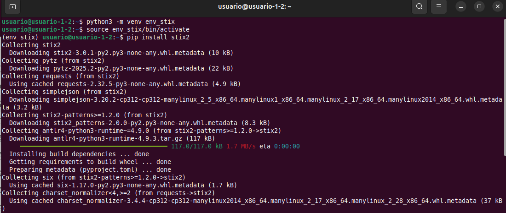


**Ejecución del Script:** Ejecutamos el script: `python3 paquete_stix.py`.
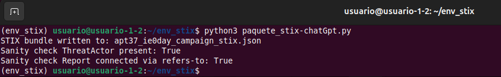


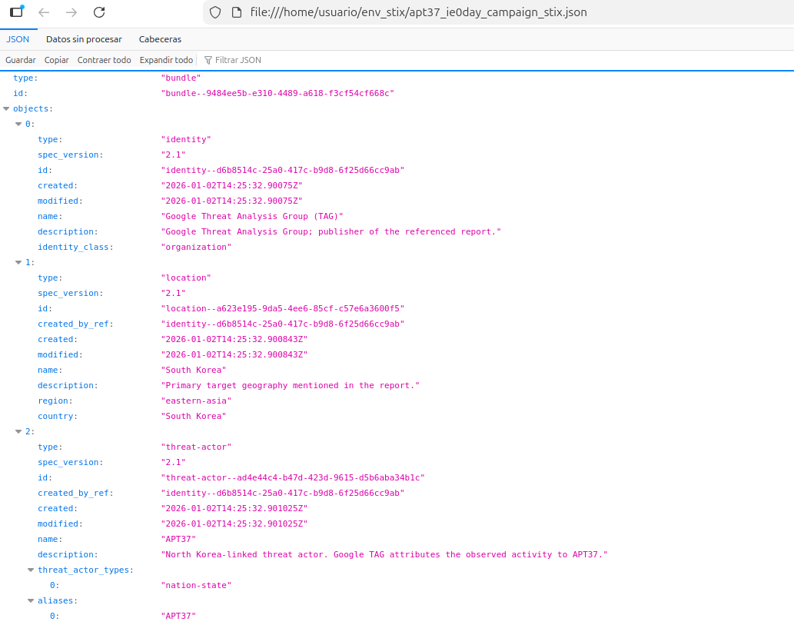


--------------------------------------

# 6. Bundle en formato JSON
[apt37_ie0day_campaign_stix.json](apt37_ie0day_campaign_stix.json)


# 7. Grafo del paquete STIX generado
Usaremos la plataforma: "https://oasis-open.github.io/cti-stix-visualization/" para generar un grafo con nuestro paquete stix:

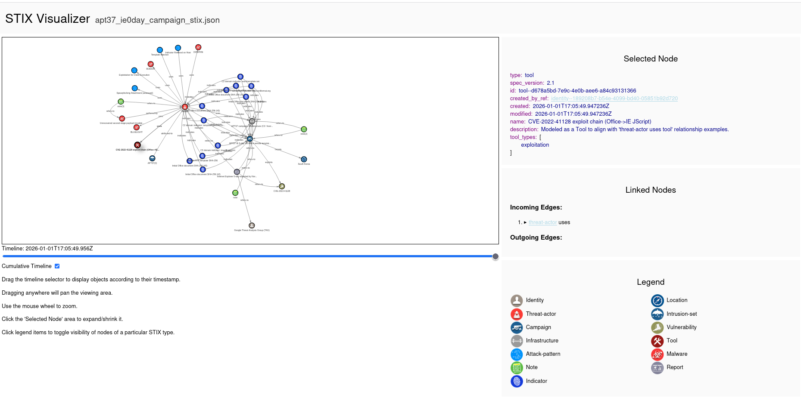


---


## 7.1 Detalle del grupo APT
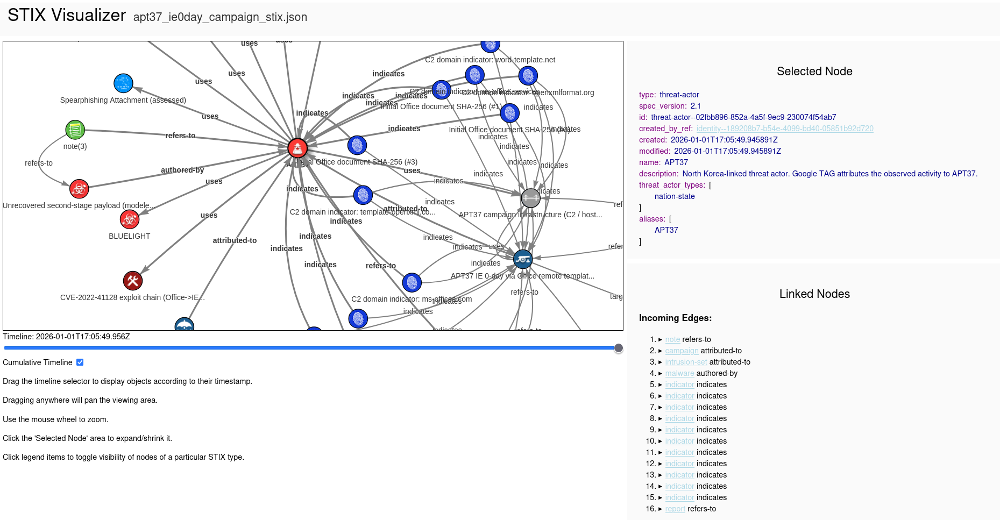
donde:
-  Incoming Edges son todas las entidades que apuntan a APT37.
  - note → refers-to → APT37
  - campaign → attributed-to → APT37
  - intrusion-set → attributed-to → APT37
  - malware → authored-by → APT37
    5–15. indicator → indicates → APT37 (muchos)
  - report → refers-to → APT37 
-  Outgoing Edges son todas las entidades que salen de APT37.
- El script crea un Indicator por cada IOC, los hashes y lso dominios, y luego añade:
  - indicator — indicates → threat-actor
  - Eso genera muchas aristas entrantes a APT37, y se ve en la lista, los items 5 a 15, como repetición de “indicator indicates”. 
- malware authored-by hacia APT37: `authored-by` sugiere que el threat actor es autor del malware.
- Atribución: campaign/intrusion-set attributed-to threat-actor
- IOCs: indicator indicates threat-actor
- Documentación: report/note refers-to threat-actor
- Asociaciones adicionales: malware authored-by threat-actor.


## 7.2 Detalle del nodo Identity
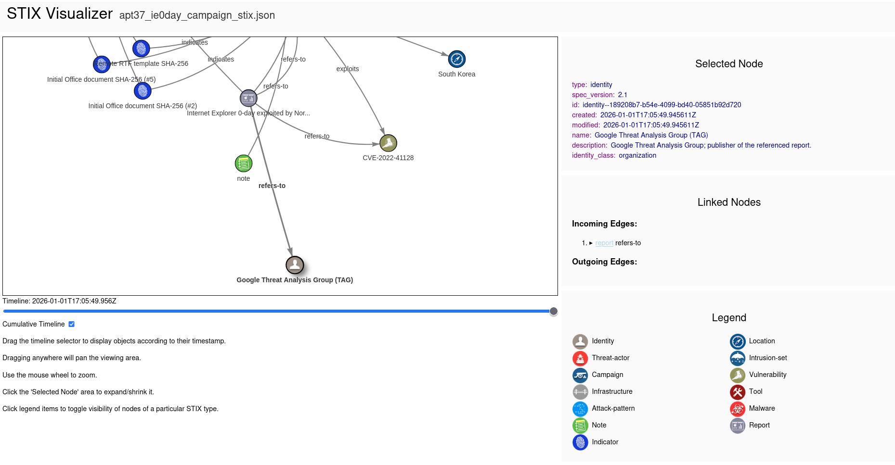
donde:
- En el panel “Selected Node” aparece:
  - type: identity
  - name: Google Threat Analysis Group (TAG)
  - identity_class: organization
  - description: ...publisher of the referenced report.
- La Identity representa al productor/fuente (TAG).
- La Identity (TAG) ya no queda aislada y está conectada por un refers-to desde el Report. Es exactamente el efecto buscado para que el grafo se parezca al del pdf de la teoría y esté conectado al grafo.


  
---

## 7.3 Detalle un `indicator`
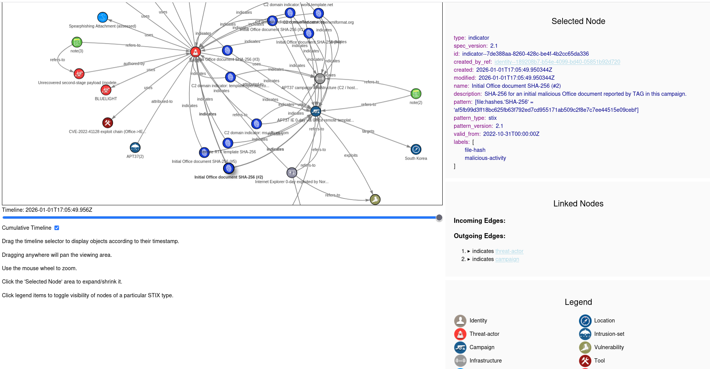
donde:
- Se representa uno de los hashes SHA-256 de “Initial Office documents”.
- En `Linked Nodes → Outgoing Edges` aparecen 2 aristas salientes:
    - `indicator — indicates → threat-actor`
    - `indicator — indicates → campaign`


---

## 7.4 Detalle del informe y su URL de consulta
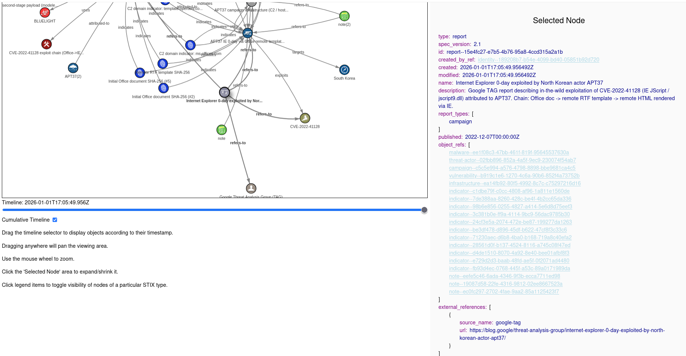
donde:
- Vemos la URL del informe que aparece en la parte inferior derecha:
    - external_references con:
        - source_name: google-tag
        - url: https://blog.google/.....


---


## 7.5 Detalle del Nodo Campaign
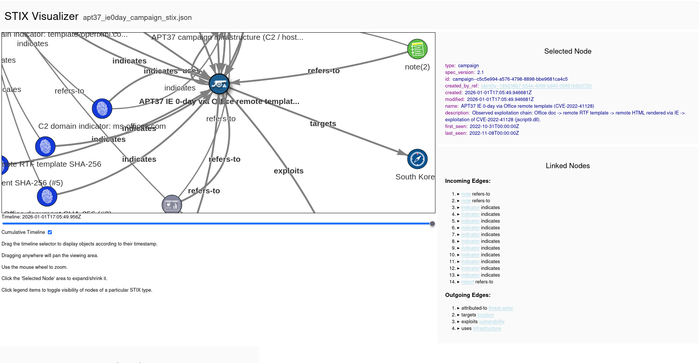
donde:
- Nodo seleccionado `campaign` (SDO) “APT37 IE 0-day via Office remote template (CVE-2022-41128)”.
- A destacar: `type: campaign`, el `name/description` y la ventana temporal `first_seen: 2022-10-31` y `last_seen: 2022-11-08`, que encaja con la cronología del reporte.
- Se demuestra que la `Campaign` es el nodo central operativo, conectando IOCs entrantes, objetivo, vulnerabilidad e infraestructura.

---

## 7.6 Detalle del Nodo Infrastructure / C2
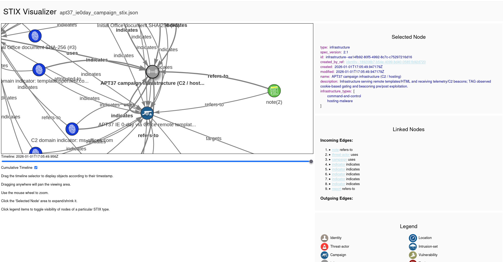
donde:
- Nodo seleccionado es la `infrastructure` “APT37 campaign infrastructure (C2 / hosting)”.
- Se ve correctamente tipado como `infrastructure`, con `infrastructure_types: ["command-and-control", "hosting-malware"]` y una descripción que recoge el rol (servir plantillas/HTML y recibir telemetría/C2, con cookie-gating).
- En esta vista se evidencia el triángulo clave `Actor → uses → Infrastructure` y `Campaign → uses → Infrastructure`.

--- 

## 7.7 Detalle del Nodo Vulnerability (CVE-2022-41128)

donde:
- Nodo seleccionado `vulnerability (SDO) CVE-2022-41128`.
- Linked Nodes (Incoming Edges):
    - `campaign — exploits → vulnerability`: es la relación clave que “engancha” la vulnerabilidad a la campaña.
    - `report — refers-to → vulnerability`: el informe la referencia (por object_refs y/o por relación explícita).


---

## 7.8 Detalle de Indicator de dominio C2
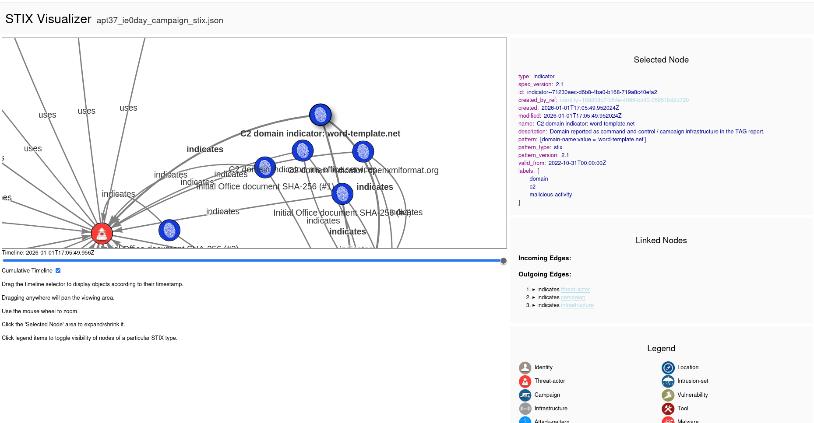
donde:
- Nodo seleccionado `indicator de dominio C2`, en concreto el word-template.net.
- Outgoing Edges: este `indicador` indica tres cosas:
    - `indicates → threat-actor (APT37)`.
    - `indicates → campaign`.
    - `indicates → infrastructure (C2/hosting)`.


----


## 7.9 Detalle de Indicador de hash

donde:
- Nodo seleccionado `SDO indicator` que correspondiente a un hash SHA-256 de un documento Office inicial.
- Linked Nodes (Outgoing Edges): este IOC se usa para pivotar a:
  - `indicates → threat-actor (APT37)`.
  - `indicates → campaign`.
  - Esta vista demuestra correctamente el IOC hash y su vínculo operativo hacia el actor y la campaña mediante `indicates`.


-----

## 7.10 Nodo Identity - Google TAG
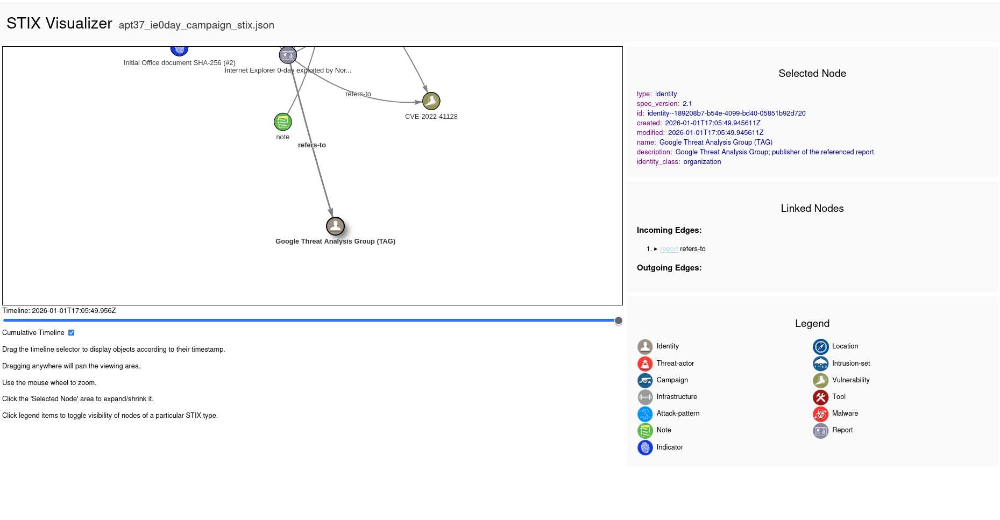
donde:
- Linked Nodes (Incoming Edges): aparece 1 única entrada: `report — refers-to → identity`. Esto verifica que la `Identity` ya no queda aislada y está conectada al grafo a través del `Report`.


----- 


# 8. Mapeo ATT&CK
Este apartado mapea las acciones descritas en el reporte de Google TAG sobre la explotación 0-day de Internet Explorer (CVE-2022-41128) atribuida a APT37 a MITRE ATT&CK. Se diferencian técnicas confirmadas, con evidencia explícita en el reporte; y técnicas assessed, inferidas de forma razonable, pero no afirmadas de manera directa.

## 8.1  Técnicas confirmadas
### T1221 - Template Injection - Initial Access
- Táctica: Acceso Inicial (Initial Access).
- Justificación: El documento inicial no contiene el exploit directamente, sino que descarga una plantilla remota para evadir detecciones estáticas y cargar el contenido HTML malicioso.
- Modelado STIX:
    - attack-pattern (T1221) con external_references.
    - Relación principal: campaign --uses--> attack-pattern (T1221).

### T1203 - Exploitation for Client Execution
- Táctica: Ejecución.
- Justificación: Representa el núcleo técnico de la campaña: la explotación de la vulnerabilidad de día cero CVE-2022-41128 en el motor JScript de Internet Explorer.
- Modelado STIX: Este patrón de ataque se relaciona directamente con el objeto vulnerability en el script de Python.
    - attack-pattern (T1221) con external_references.
    - Relación principal: campaign --uses--> attack-pattern (T1221).
    - Relación con la CVE: campaign --exploits--> vulnerability (CVE-2022-41128).

### T1070 - Indicator Removal on Host
- Táctica: Evasión de Defensas.
- Justificación: El shellcode realiza tareas de limpieza en la caché y el historial del navegador tras la explotación exitosa.
- Modelado STIX: Incluido como una técnica empleada por el actor para dificultar el análisis forense posterior.
    - attack-pattern (T1070) con external_references.
    - Relación: campaign --uses--> attack-pattern (T1070) y/o threat-actor --uses--> attack-pattern (T1070).


### T1480 – Execution Guardrails (Defense Evasion)
- Táctica: Evasión de Defensas.
- Justificación: El servidor asigna cookie única y el exploit verifica su presencia antes de ejecutarse; reduce ejecución fuera del flujo real.
- Modelado STIX: 
    - Añadir attack-pattern (T1480) con external_references.
    - Relación: campaign --uses--> attack-pattern (T1480) (y opcionalmente threat-actor --uses-->).
    - Se añade una `Note` (“cookie gating / double beaconing”) referenciando campaign, infrastructure y este attack-pattern.


### T1071.001 – Application Layer Protocol: Web Protocols (Command and Control)
- Táctica: Command and control.
- Evidencia: El exploit reporta al servidor C2 (beacon) dos veces (antes y después del éxito) y usa un flujo web con cookie; la comunicación se integra en tráfico web típico.
- Modelado STIX: 
    - Relación: attack-pattern (T1071.001) con external_references.
    - Relación: campaign --uses--> attack-pattern (T1071.001) y/o threat-actor --uses-->.


## 8.2  Técnicas no confirmadas - Assessed
### T1566.001 - Phishing: Spearphishing Attachment
- Táctica: Acceso Inicial (Initial Access).
- Justificación: La campaña comienza con la distribución de documentos maliciosos de Microsoft Word que utilizan un señuelo de ingeniería social basado en un incidente de actualidad.
- Modelado STIX: 
    - attack-pattern (T1566.001) con external_references.
    - Relación recomendada: campaign --uses--> attack-pattern (T1566.001) con confidence menor.


### T1204.002 – User Execution: Malicious File (Execution) — assessed/alta
- Táctica: Ejecución.
- Evidencia: TAG indica que, con MOTW, el usuario debe desactivar Protected View para que se recupere la plantilla remota; esto implica acción del usuario para habilitar la cadena
- Modelado STIX: 
    - attack-pattern (T1204.002) con external_references.
    - Relación: campaign --uses--> attack-pattern (T1204.002) con confidence menor.

### T1105 – Ingress Tool Transfer (Command and Control) — assessed/media
- Táctica: Command and Control.
- Evidencia: TAG indica descarga de “next stage” tras la explotación (aunque no recupera el payload final). La acción “transferir/traer” una siguiente etapa encaja con Ingress Tool Transfer.
- Modelado STIX: 
    - campaign --uses--> attack-pattern (T1105).
    - Relación: campaign --uses--> attack-pattern (T1105).

### T1027 – Obfuscated Files or Information (Defense Evasion) — assessed/baja-media
- Táctica: Evasión de Defensas.
- Evidencia: El shellcode usa un hashing custom para resolver APIs (patrón habitual para dificultar análisis estático). No es “obfuscation” en sentido estricto de empaquetado, pero sí una forma de opacidad deliberada. 
- Modelado STIX: 
    - attack-pattern (T1027) con external_references.
    - Relación: campaign --uses--> attack-pattern (T1027) o threat-actor --uses-->.


<mark>Pero esto ahora modifica el grafo.</mark>

# 9. Nuevo prompt para incluir el mapeo ATT&CK


# 10. Nuevo script para incluir el mapeo ATT&CK
```
#!/usr/bin/env python3
"""
APT37 (Google TAG) - STIX 2.1 Bundle

Incluye:
- SDOs: identity (Google TAG), threat-actor (APT37), intrusion-set (APT37), campaign,
        vulnerability (CVE-2022-41128), infrastructure (C2/hosting), indicators (hashes/domains),
        malware (ROKRAT/BLUELIGHT/DOLPHIN + unknown_payload), tool, report, notes.
- SROs: forward/reverse relationships, incluyendo:
    * campaign — attributed-to → threat-actor
    * intrusion-set — attributed-to → threat-actor
    * indicator — indicates → threat-actor (y campaign/infra)
    * threat-actor — uses → infrastructure/attack-pattern/tool/malware
    * campaign — uses → attack-pattern
    * report — refers-to → (para conectar el report/identity en el grafo)
- Mapeo ATT&CK completo (AttackPattern + external_references) para:
    T1221, T1203, T1070, T1480, T1071.001, T1204.002, T1105, T1027, T1566.001 (assessed)

Requisitos:
  pip install stix2

Ejecución:
  python3 apt37_stix_full_attack.py --out apt37_ie0day_campaign_stix.json --pretty
"""

from __future__ import annotations

import argparse
from datetime import datetime, timezone
from typing import List, Optional
from uuid import uuid4

from stix2 import (
    AttackPattern,
    Bundle,
    Campaign,
    Identity,
    Indicator,
    Infrastructure,
    IntrusionSet,
    Location,
    Malware,
    Note,
    Relationship,
    Report,
    ThreatActor,
    Tool,
    Vulnerability,
)

# -----------------------------
# Fuente / metadatos del reporte (enfoque "10.6.5")
# -----------------------------
ARTICLE_URL = "https://blog.google/threat-analysis-group/internet-explorer-0-day-exploited-by-north-korean-actor-apt37/"
ARTICLE_TITLE = "Internet Explorer 0-day exploited by North Korean actor APT37"

published_time = datetime(year=2022, month=12, day=7, tzinfo=timezone.utc)
url_report = {"source_name": "google-tag", "url": ARTICLE_URL}

# Cronología base
OBSERVED_FIRST = datetime(2022, 10, 31, 0, 0, 0, tzinfo=timezone.utc)
PATCH_TUESDAY = datetime(2022, 11, 8, 0, 0, 0, tzinfo=timezone.utc)

# -----------------------------
# IOCs (TAG)
# -----------------------------
INITIAL_DOC_SHA256 = [
    "56ca24b57c4559f834c190d50b0fe89dd4a4040a078ca1f267d0bbc7849e9ed7",
    "af5fb99d3ff18bc625fb63f792ed7cd955171ab509c2f8e7c7ee44515e09cebf",
    "926a947ea2b59d3e9a5a6875b4de2bd071b15260370f4da5e2a60ece3517a32f",
    "3bff571823421c013e79cc10793f238f4252f7d7ac91f9ef41435af0a8c09a39",
    "c49b4d370ad0dcd1e28ee8f525ac8e3c12a34cfcf62ebb733ec74cca59b29f82",
]
REMOTE_RTF_TEMPLATE_SHA256 = "08f93351d0d3905bee5b0c2b9215d448abb0d3cf49c0f8b666c46df4fcc007cb"
C2_DOMAINS = [
    "word-template.net",
    "openxmlformat.org",
    "ms-office.services",
    "ms-offices.com",
    "template-openxml.com",
]


def utc(dt: datetime) -> str:
    """RFC3339 UTC string."""
    if dt.tzinfo is None:
        dt = dt.replace(tzinfo=timezone.utc)
    return dt.astimezone(timezone.utc).isoformat().replace("+00:00", "Z")


def make_file_hash_indicator(
    sha256: str, name: str, desc: str, created_by_ref: str, valid_from: datetime
) -> Indicator:
    return Indicator(
        spec_version="2.1",
        name=name,
        description=desc,
        pattern_type="stix",
        pattern=f"[file:hashes.'SHA-256' = '{sha256}']",
        valid_from=utc(valid_from),
        labels=["file-hash", "malicious-activity"],
        created_by_ref=created_by_ref,
    )


def make_domain_indicator(domain: str, created_by_ref: str, valid_from: datetime) -> Indicator:
    return Indicator(
        spec_version="2.1",
        name=f"C2 domain indicator: {domain}",
        description="Domain reported as command-and-control / campaign infrastructure in the TAG report.",
        pattern_type="stix",
        pattern=f"[domain-name:value = '{domain}']",
        valid_from=utc(valid_from),
        labels=["domain", "c2", "malicious-activity"],
        created_by_ref=created_by_ref,
    )


def rel(
    source_ref: str,
    relationship_type: str,
    target_ref: str,
    created_by_ref: str,
    description: Optional[str] = None,
    confidence: Optional[int] = None,
) -> Relationship:
    kwargs = {}
    if description:
        kwargs["description"] = description
    if confidence is not None:
        kwargs["confidence"] = confidence

    return Relationship(
        spec_version="2.1",
        relationship_type=relationship_type,
        source_ref=source_ref,
        target_ref=target_ref,
        created_by_ref=created_by_ref,
        **kwargs,
    )


def mitre_ap(name: str, tid: str, desc: str, created_by_ref: str) -> AttackPattern:
    """Helper para AttackPattern con external_reference a ATT&CK."""
    # URL MITRE: sub-técnicas usan /techniques/TXXXX/YYY/
    if "." in tid:
        base, sub = tid.split(".", 1)
        url = f"https://attack.mitre.org/techniques/{base}/{sub.replace('.', '')}/"
        external_id = f"{base}.{sub}"
    else:
        url = f"https://attack.mitre.org/techniques/{tid}/"
        external_id = tid

    return AttackPattern(
        spec_version="2.1",
        name=name,
        description=desc,
        external_references=[{"source_name": "mitre-attack", "external_id": external_id, "url": url}],
        created_by_ref=created_by_ref,
    )


def main() -> None:
    ap = argparse.ArgumentParser(description="Generate STIX 2.1 bundle for APT37 IE 0-day campaign (Google TAG).")
    ap.add_argument("--out", default="apt37_ie0day_campaign_stix.json", help="Output JSON file path.")
    ap.add_argument("--pretty", action="store_true", help="Pretty-print JSON.")
    args = ap.parse_args()

    # -----------------------------
    # Identity (fuente/productor)
    # -----------------------------
    google_tag = Identity(
        spec_version="2.1",
        name="Google Threat Analysis Group (TAG)",
        identity_class="organization",
        description="Google Threat Analysis Group; publisher of the referenced report.",
    )

    # -----------------------------
    # Location (victimología)
    # -----------------------------
    south_korea = Location(
        spec_version="2.1",
        name="South Korea",
        country="South Korea",
        region="eastern-asia",
        description="Primary target geography mentioned in the report.",
        created_by_ref=google_tag.id,
    )

    # -----------------------------
    # Threat Actor + Intrusion Set
    # -----------------------------
    apt37_ta = ThreatActor(
        spec_version="2.1",
        name="APT37",
        aliases=["APT37"],
        threat_actor_types=["nation-state"],
        description="North Korea-linked threat actor. Google TAG attributes the observed activity to APT37.",
        created_by_ref=google_tag.id,
    )

    apt37_is = IntrusionSet(
        spec_version="2.1",
        name="APT37",
        aliases=["APT37"],
        description="Intrusion set representation for the group activity; linked to Threat Actor via attributed-to.",
        first_seen=utc(OBSERVED_FIRST),
        created_by_ref=google_tag.id,
    )

    # -----------------------------
    # Campaign
    # -----------------------------
    campaign = Campaign(
        spec_version="2.1",
        name="APT37 IE 0-day via Office remote template (CVE-2022-41128)",
        description=(
            "Observed chain: Office doc -> remote RTF template -> remote HTML rendered via IE -> "
            "exploitation of CVE-2022-41128 (jscript9.dll)."
        ),
        first_seen=utc(OBSERVED_FIRST),
        last_seen=utc(PATCH_TUESDAY),
        created_by_ref=google_tag.id,
    )

    # -----------------------------
    # Vulnerability
    # -----------------------------
    vuln = Vulnerability(
        spec_version="2.1",
        name="CVE-2022-41128",
        description=(
            "Internet Explorer JScript (jscript9.dll) 0-day exploited in the wild; JIT optimization issue leading to "
            "type confusion and code execution."
        ),
        external_references=[
            {
                "source_name": "cve",
                "external_id": "CVE-2022-41128",
                "url": "https://cve.mitre.org/cgi-bin/cvename.cgi?name=CVE-2022-41128",
            },
            url_report,
        ],
        created_by_ref=google_tag.id,
    )

    # -----------------------------
    # ATT&CK Attack Patterns (completo)
    # -----------------------------
    ap_T1221 = mitre_ap(
        "Template Injection",
        "T1221",
        "Office uses a remote template (RTF) to load attacker-controlled content.",
        google_tag.id,
    )
    ap_T1203 = mitre_ap(
        "Exploitation for Client Execution",
        "T1203",
        "Exploitation of a client-side application vulnerability to execute code.",
        google_tag.id,
    )
    ap_T1070 = mitre_ap(
        "Indicator Removal on Host",
        "T1070",
        "Post-exploitation cleanup such as clearing IE cache/history to reduce forensic artifacts.",
        google_tag.id,
    )
    ap_T1480 = mitre_ap(
        "Execution Guardrails",
        "T1480",
        "Gating/guardrails to prevent execution outside intended victim flow (e.g., cookie-gated exploit).",
        google_tag.id,
    )
    ap_T1071_001 = mitre_ap(
        "Application Layer Protocol: Web Protocols",
        "T1071.001",
        "C2/telemetry over web protocols (HTTP/HTTPS).",
        google_tag.id,
    )
    ap_T1204_002 = mitre_ap(
        "User Execution: Malicious File",
        "T1204.002",
        "User action required to execute or enable malicious content (e.g., disabling Protected View/MOTW).",
        google_tag.id,
    )
    ap_T1105 = mitre_ap(
        "Ingress Tool Transfer",
        "T1105",
        "Transfer/download of additional payloads or stages to the compromised host.",
        google_tag.id,
    )
    ap_T1027 = mitre_ap(
        "Obfuscated Files or Information",
        "T1027",
        "Obfuscation/opacification such as hashed API resolution to hinder analysis.",
        google_tag.id,
    )
    ap_T1566_001 = mitre_ap(
        "Phishing: Spearphishing Attachment (assessed)",
        "T1566.001",
        "Assessed: delivery likely via malicious Office attachment; exact delivery channel not explicitly stated by TAG.",
        google_tag.id,
    )

    all_attack_patterns = [
        ap_T1221,
        ap_T1203,
        ap_T1070,
        ap_T1480,
        ap_T1071_001,
        ap_T1204_002,
        ap_T1105,
        ap_T1027,
        ap_T1566_001,
    ]

    # -----------------------------
    # Infrastructure (C2/hosting)
    # -----------------------------
    infra = Infrastructure(
        spec_version="2.1",
        name="APT37 campaign infrastructure (C2 / hosting)",
        description=(
            "Infrastructure serving remote templates/HTML and receiving telemetry/C2 beacons; "
            "TAG observed cookie-based gating and beaconing pre/post exploitation."
        ),
        infrastructure_types=["command-and-control", "hosting-malware"],
        created_by_ref=google_tag.id,
    )

    # -----------------------------
    # Tool (para 'threat-actor uses tool')
    # -----------------------------
    exploit_tool = Tool(
        spec_version="2.1",
        name="CVE-2022-41128 exploit chain (Office->IE JScript)",
        tool_types=["exploitation"],
        description="Modeled as a Tool to align with 'threat-actor uses tool' relationship examples.",
        created_by_ref=google_tag.id,
    )

    # -----------------------------
    # Malware (histórico) + placeholder
    # -----------------------------
    rokrat = Malware(
        spec_version="2.1",
        name="ROKRAT",
        is_family=True,
        description="Historically associated with APT37 per TAG; not confirmed as payload in this campaign.",
        created_by_ref=google_tag.id,
    )
    bluelight = Malware(
        spec_version="2.1",
        name="BLUELIGHT",
        is_family=True,
        description="Historically associated with APT37 per TAG; not confirmed as payload in this campaign.",
        created_by_ref=google_tag.id,
    )
    dolphin = Malware(
        spec_version="2.1",
        name="DOLPHIN",
        is_family=True,
        description="Historically associated with APT37 per TAG; not confirmed as payload in this campaign.",
        created_by_ref=google_tag.id,
    )
    unknown_payload = Malware(
        spec_version="2.1",
        name="Unrecovered second-stage payload (modeled)",
        is_family=False,
        description=(
            "Modeled placeholder for unrecovered payload (TAG states final payload not recovered). "
            "Included to demonstrate 'malware authored-by threat-actor' with low confidence."
        ),
        created_by_ref=google_tag.id,
    )

    # -----------------------------
    # Indicators (hashes + domains)
    # -----------------------------
    indicators: List[Indicator] = []
    for i, h in enumerate(INITIAL_DOC_SHA256, start=1):
        indicators.append(
            make_file_hash_indicator(
                sha256=h,
                name=f"Initial Office document SHA-256 (#{i})",
                desc="SHA-256 for an initial malicious Office document reported by TAG in this campaign.",
                created_by_ref=google_tag.id,
                valid_from=OBSERVED_FIRST,
            )
        )

    indicators.append(
        make_file_hash_indicator(
            sha256=REMOTE_RTF_TEMPLATE_SHA256,
            name="Remote RTF template SHA-256",
            desc="SHA-256 for the remote RTF template used in the Office -> RTF -> HTML chain.",
            created_by_ref=google_tag.id,
            valid_from=OBSERVED_FIRST,
        )
    )

    indicators.extend([make_domain_indicator(d, google_tag.id, OBSERVED_FIRST) for d in C2_DOMAINS])

    # -----------------------------
    # Notes (evidencia narrativa)
    # -----------------------------
    note_protected_view = Note(
        spec_version="2.1",
        abstract="Protected View / MOTW dependency",
        content=(
            "TAG notes victims typically must disable Protected View (MOTW) to allow remote template retrieval and "
            "enable the exploitation chain."
        ),
        created_by_ref=google_tag.id,
        object_refs=[campaign.id, ap_T1204_002.id],
    )

    note_cookie_gate = Note(
        spec_version="2.1",
        abstract="Cookie-based gating and double beaconing",
        content=(
            "Cookie-based gating observed: unique cookie set on remote RTF fetch and required by exploit stage; "
            "JavaScript beacons to C2 twice (pre-attempt and post-success)."
        ),
        created_by_ref=google_tag.id,
        object_refs=[campaign.id, infra.id, ap_T1480.id, ap_T1071_001.id],
    )

    note_authored_by_caveat = Note(
        spec_version="2.1",
        abstract="Caveat: authored-by modeled for teaching purposes",
        content=(
            "The relationship 'malware authored-by threat-actor' is included with low confidence for didactic alignment. "
            "TAG states the final payload was not recovered; therefore authorship is not confirmed."
        ),
        created_by_ref=google_tag.id,
        object_refs=[unknown_payload.id, apt37_ta.id],
    )

    # -----------------------------
    # Relationships (SRO)
    # -----------------------------
    relationships: List[Relationship] = []

    # Atribución (reverse hacia threat-actor)
    relationships.append(rel(campaign.id, "attributed-to", apt37_ta.id, google_tag.id, confidence=80))
    relationships.append(rel(apt37_is.id, "attributed-to", apt37_ta.id, google_tag.id, confidence=80))

    # Campaign core (targets/exploits/uses)
    relationships.append(rel(campaign.id, "targets", south_korea.id, google_tag.id, confidence=70))
    relationships.append(rel(campaign.id, "exploits", vuln.id, google_tag.id, confidence=80))
    relationships.append(rel(campaign.id, "uses", infra.id, google_tag.id, confidence=80))

    # Mapeo ATT&CK en STIX:
    # - principal: campaign --uses--> attack-pattern
    # - opcional: threat-actor --uses--> attack-pattern
    # Ajustamos confidence: assessed más bajo
    for ap_obj in all_attack_patterns:
        if ap_obj.id == ap_T1566_001.id:
            conf = 40
        elif ap_obj.id in {ap_T1204_002.id, ap_T1105.id, ap_T1027.id}:
            conf = 55
        else:
            conf = 65

        relationships.append(rel(campaign.id, "uses", ap_obj.id, google_tag.id, confidence=conf))
        relationships.append(rel(apt37_ta.id, "uses", ap_obj.id, google_tag.id, confidence=max(conf - 5, 15)))

    # threat-actor uses infra/tool/malware
    relationships.append(rel(apt37_ta.id, "uses", infra.id, google_tag.id, confidence=70))
    relationships.append(rel(apt37_ta.id, "uses", exploit_tool.id, google_tag.id, confidence=60))

    relationships.append(rel(apt37_ta.id, "uses", rokrat.id, google_tag.id, confidence=45))
    relationships.append(rel(apt37_ta.id, "uses", bluelight.id, google_tag.id, confidence=45))
    relationships.append(rel(apt37_ta.id, "uses", dolphin.id, google_tag.id, confidence=45))

    # didáctico: authored-by (muy bajo)
    relationships.append(
        rel(
            unknown_payload.id,
            "authored-by",
            apt37_ta.id,
            google_tag.id,
            description="Didactic; TAG did not recover final payload. Low confidence.",
            confidence=15,
        )
    )

    # indicator indicates (threat-actor + campaign + infra para dominios)
    for ind in indicators:
        ta_conf = 60 if "domain" in ind.labels else 50
        relationships.append(rel(ind.id, "indicates", apt37_ta.id, google_tag.id, confidence=ta_conf))
        relationships.append(rel(ind.id, "indicates", campaign.id, google_tag.id, confidence=70))
        if "domain" in ind.labels:
            relationships.append(rel(ind.id, "indicates", infra.id, google_tag.id, confidence=70))

    # ---------------------------------------------------------
    # Conectar Report/Identity al grafo vía SRO "refers-to"
    # (el visualizador también enlaza por object_refs, pero esto garantiza conectividad)
    # ---------------------------------------------------------
    report_id = f"report--{uuid4()}"
    relationships.append(rel(report_id, "refers-to", apt37_ta.id, google_tag.id, confidence=80))
    relationships.append(rel(report_id, "refers-to", campaign.id, google_tag.id, confidence=80))
    relationships.append(rel(report_id, "refers-to", vuln.id, google_tag.id, confidence=70))
    relationships.append(rel(report_id, "refers-to", infra.id, google_tag.id, confidence=70))
    relationships.append(rel(report_id, "refers-to", google_tag.id, google_tag.id, confidence=60))

    # -----------------------------
    # Report (10.6.5 style)
    # -----------------------------
    report = Report(
        id=report_id,
        spec_version="2.1",
        name=ARTICLE_TITLE,
        published=published_time,
        report_types=["campaign"],
        external_references=[url_report],
        created_by_ref=google_tag.id,
        description=(
            "Google TAG report describing in-the-wild exploitation of CVE-2022-41128 (IE JScript / jscript9.dll) "
            "attributed to APT37. Chain: Office doc -> remote RTF template -> remote HTML rendered via IE."
        ),
        object_refs=[
            google_tag.id,
            apt37_ta.id,
            apt37_is.id,
            campaign.id,
            vuln.id,
            infra.id,
            south_korea.id,
            exploit_tool.id,
            rokrat.id,
            bluelight.id,
            dolphin.id,
            unknown_payload.id,
            note_protected_view.id,
            note_cookie_gate.id,
            note_authored_by_caveat.id,
            *[ap_obj.id for ap_obj in all_attack_patterns],
            *[ind.id for ind in indicators],
        ],
    )

    # -----------------------------
    # Bundle (NO incluir spec_version en Bundle)
    # -----------------------------
    all_objects = [
        google_tag,
        south_korea,
        apt37_ta,
        apt37_is,
        campaign,
        vuln,
        infra,
        exploit_tool,
        rokrat,
        bluelight,
        dolphin,
        unknown_payload,
        note_protected_view,
        note_cookie_gate,
        note_authored_by_caveat,
        report,
        *all_attack_patterns,
        *indicators,
        *relationships,
    ]

    bundle = Bundle(objects=all_objects)

    with open(args.out, "w", encoding="utf-8") as f:
        f.write(bundle.serialize(pretty=args.pretty))

    print(f"STIX bundle written to: {args.out}")
    print("AttackPatterns included:", len(all_attack_patterns))


if __name__ == "__main__":
    main()
```


# 11. Nuevo Bundle en formato JSON para incluir el mapeo ATT&CK
[apt37_ie0day_campaign_stix-mapeo-attack.json](apt37_ie0day_campaign_stix-mapeo-attack.json)


# 12. Nuevo Grafo del paquete STIX generado para incluir el mapeo ATT&CK


Para ver el mapeo a ATT&CK en el grafo, vamos a seleccionar alguno de los nodos de tipo `attack-pattern`, como por ejemplo:
- Template Injection (T1221).
- Exploitation for Client Execution (T1203).
- Execution Guardrails (T1480).
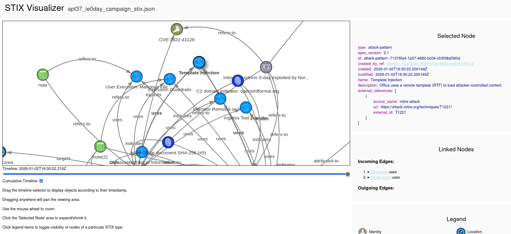
donde:
- Hemos seleccionado el Template Injection (T1221).


# 9. Conclusiones
El desarrollo de esta evaluación ha permitido profundizar en el estudio técnico de una campaña de amenazas avanzadas persistentes (APT) mediante el uso de estándares industriales. Tras el análisis y modelado de la actividad de APT37, se desprenden las siguientes conclusiones clave:

    Estandarización y Automatización: El uso de STIX 2.1 permite transformar reportes narrativos en inteligencia procesable por máquinas, una labor fundamental en cualquier SOC moderno o cadena automatizada de análisis de malware.

Complejidad del Actor APT37: El aprovechamiento de una vulnerabilidad 0-day (CVE-2022-41128) mediante técnicas de Template Injection demuestra el alto nivel técnico de los actores respaldados por estados y la importancia de un análisis detallado de sus TTPs.

Habilidades de Analista y Reverser: La identificación de componentes técnicos (exploits, vulnerabilidades y productos) y su posterior modelado en Python refuerza las capacidades críticas necesarias para un analista de malware.

Cultura de Seguridad (OPSEC): Se ha validado que el procesamiento de este tipo de amenazas debe realizarse estrictamente bajo entornos virtuales desechables, garantizando la integridad de los sistemas de análisis frente a exploits diseñados para ser usados in-the-wild.
