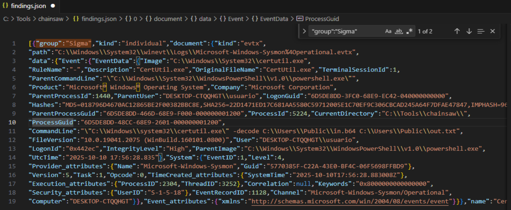

## Para practicar con reglas sigma necesitamos:
- Un MV Windows.
- Sysmon de Sysinternals. https://learn.microsoft.com/es-es/sysinternals/downloads/sysmon
- Reglas sigma. https://github.com/SigmaHQ/sigma/tree/master/rules
- Chainsaw. https://github.com/WithSecureLabs/chainsaw

**Sysmon produce la telemetría, Sigma define lo que quemos detectar y Chainsaw aplica esas reglas a los logs.**

## Sysmon
Sysmon = el “sensor” que genera los datos.
Es un servicio en Windows que registra eventos enriquecidos (EVTX): creación de procesos, líneas de comando, árbol padre-hijo, hashes, conexiones de red, cargas de DLL, cambios en el sistema de archivos/registro, etc. (IDs típicos: 1 proceso, 3 red, 7 image load, 10 registry, 11 file create, 22 DNS…).

### Instalación de Sysmon.
- Descargamos Sysmon.
- Descargamos una buena configuración. Para ello usaremos `sysmonconfig-export.xml` del repo de SwiftOnSecurity (es una configuración popular y mantenida). https://github.com/SwiftOnSecurity/sysmon-config
- Instalamos con esa configuración (CMD/PowerShell como Admin)
  ```
  cd C:\ruta\al\zip\extraido
  .\sysmon64.exe -accepteula -i C:\ruta\sysmonconfig-export.xml
  ```
  Eso instala el servicio y activa los eventos más relevantes (procesos, red, etc.). 
- Verificamos que está registrando: Abrimos el Visor de eventos → Applications and Services Logs → Microsoft → Windows → Sysmon → Operational. Deben aparecer eventos (p. ej., Event ID 1 creación de procesos).

## Sigma
Son las “reglas” que describen patrones sospechosos sobre esos eventos. No recolecta ni ejecuta nada por sí sola: define qué buscar (p. ej., CommandLine contiene -EncodedCommand en Event ID 1).
Descargamos reglas sigma y las intalamos en el path `C:\sigma\rules\`. Puede ser un repo clonado de SigmaHQ: https://github.com/SigmaHQ/sigma/tree/master/rules

## Chainsaw
Chainsaw = el motor de “búsqueda” offline. Toma los EVTX que generó Sysmon y evalúa las reglas Sigma contra ellos (usando un mapping de campos) para indicarnos qué coincidencias hay.

### Instalación de chainsaw:
- Descargamos chainsaw: https://github.com/WithSecureLabs/chainsaw/releases
- Creación de las carpetas:
  ```
  New-Item -ItemType Directory -Force -Path C:\tools\chainsaw | Out-Null
  New-Item -ItemType Directory -Force -Path C:\sigma\mappings | Out-Null
  ```
- Extraemos y movemos contenido al path C:\tools\chainsaw
- Verificamos que el binario está accesible: `C:\tools\chainsaw\chainsaw.exe --version`
- Descargamos un mapping listo para Windows. Chainsaw trae mapeos de ejemplo; el más cómodo para empezar es `mappings/sigma-event-logs-all.yml` del propio repo de Chainsaw. Copiamos este fichero al path: `C:\sigma\mappings\`.
- Pueba rápida: Con sysmon generando eventos, lanzamos una caza básica sobre los EVTX del sistema:
  ```
  chainsaw.exe hunt "C:\Windows\System32\winevt\Logs" `
  --sigma "C:\sigma\rules" `
  --mapping "C:\sigma\mappings\sigma-event-logs-all.yml" `
  --json -o C:\tools\chainsaw\findings.json
  ```

### Chainsaw: necesita que le digamos dónde leer los EVTX. Puede apuntar a:
- Los EVTX del propio sistema:
  ```
  chainsaw hunt "C:\Windows\System32\winevt\Logs"
  ```
- Un directorio cualquiera con EVTX exportados/copiados:
  ```
  chainsaw hunt "D:\caso01\evtx" 
  ```
- En un SIEM (Elastic, Splunk, Sentinel, Wazuh/OpenSearch), no hay rutas: convertimos Sigma a la query del backend y la ejecutamos sobre índices/fuentes (por ejemplo, index=wazuh-alerts-* en Elastic, index=win* en Splunk, etc.).


### Es muy importante el mapping (--mapping)
Es importante para alinear los nombres de campos de nuestros eventos con lo que espera la regla Sigma.


# Ejemplo de uso de una regla sigma
Generamos un caso real de decodificación Base64 con certutil.exe para que una regla Sigma lo detecte. Esto genera un evento de creación de proceso (Sysmon Event ID 1) para certutil.exe con su CommandLine conteniendo -decode.
```
$b64 = [Convert]::ToBase64String([Text.Encoding]::ASCII.GetBytes("Hola Sigma"))
Set-Content -Path C:\Users\Public\in.b64 -Value $b64 -Encoding ascii -NoNewline
certutil.exe -decode C:\Users\Public\in.b64 C:\Users\Public\out.txt
type C:\Users\Public\out.txt
```

**Regla sigma `win_certutil_decode.yml`:**
```
title: Certutil Decode Usage
id: 8f4d9d5a-0000-4f00-8000-certutil-decode
status: experimental
description: Detecta uso de certutil con -decode o -decodehex
author: tu-equipo
date: 2025/10/10
tags:
  - attack.t1140
level: medium
logsource:
  product: windows
  category: process_creation
detection:
  sel_proc:
    Image|endswith:
      - '\certutil.exe'
  sel_args:
    CommandLine|contains:
      - " -decode "
      - " -decodehex "
  condition: sel_proc and sel_args
falsepositives:
  - Administración legítima (decodificar ficheros base64)
fields:
  - Image
  - CommandLine
  - ParentImage
```
- logsource apunta a eventos de creación de proceso en Windows.
- sel_proc exige que el ejecutable sea certutil.exe.
- sel_args busca los argumentos -decode o -decodehex en la línea de comandos.
- condition une ambas cosas: proceso + argumentos.


**Disparamos Chainsaw:**
Chainsaw hunt lee los EVTX locales y evalúa la Sigma (usando un mapping de campos) para decirnos si hay coincidencias.
```
chainsaw.exe hunt "C:\Windows\System32\winevt\Logs" `
--sigma "C:\sigma\rules" `
--mapping "C:\sigma\mappings\sigma-event-logs-all.yml" `
--json -o C:\tools\chainsaw\findings.json
```
- --sigma: carpeta donde está la regla win_certutil_decode.yml.
- --mapping: traduce nombres de campos de nuestros EVTX a los que espera Sigma.
- findings.json: resultados (coincidencias) para revisar.




# Nota: Conversión de las reglas sigma
Las reglas sigma son genericas. Antes debemos convertir o transformar la reglas sigma a un formato de salida.

Chainsaw lee la regla Sigma directamente (YAML) y la evalúa sobre los EVTX usando el --mapping que alinea nombres de campos (p. ej., Image → el campo real del evento). El comando `chainsaw.exe hunt ...` ya está “haciendo” la conversión internamente; es por ello que no vemos una query resultante porque Chainsaw interpreta Sigma en tiempo real.

Cuando la regla va a un SIEM (Elastic, Splunk, Sentinel, QRadar, etc.), ahí sí debemnos convertir la Sigma a la query del backend (KQL/Lucene, SPL, KQL de Sentinel, AQL, …) con sigma-cli (pySigma).

Ejemplos con la regla win_certutil_decode.yml:
```
# Validar
sigma validate win_certutil_decode.yml

# Convertir a Elastic (KQL/Lucene “es-qs”)
sigma convert -t es-qs win_certutil_decode.yml

# Convertir a Splunk (SPL)
sigma convert -t splunk win_certutil_decode.yml
```

**Resumiendo:**
- Sigma es genérica → se convierte cuando vamos a un backend concreto (SIEM).
- En Chainsaw, no necesitamos ese paso explícito: él interpreta Sigma con el --mapping y nos da los hallazgos.
