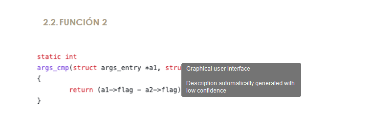

# Ejercicio 1
Cuando nos dan un código para que lo estudiemos, lo primero de todo es averiguar **en que lenguaje está escrito**. Ya sea **ensamblador o un lenguaje de alto nivel**, nuestro primer movimiento es observar los detalles del código para responder las siguientes preguntas: **¿Es un ensamblador o es código de alto nivel? ¿El sistema de tipos es dinámico o estático? ¿Es un lenguaje compilado o se trata de un lenguaje interpretado?** Para ello, vamos a entrenar la vista con trozos (la expresión angosajona sería “snippet”) de código sobre los que debéis averiguar en que lenguaje esta escrito e indicar como lo habéis averiguado. Es decir, no basta con decir: “Es Perl.”

## Trozo 1


### La definición de función
```go
func InMemLoads() (map[string]Image, error) {
```
donde:
- Los tipos de retorno van después de los paréntesis, e incluso son múltiples `(map[string]Image, error)`. Esto es algo **muy típico de Go.**

---------------------------

### Declaraciones con :=
```go
ret := make(map[string]Image)
s, si, p := GetModuleLoadedOrder(0)
start := p
i := 1
```
donde:
- La declaración corta (short variable declaration) con `:=` es una **característica distintiva de Go.**


---------------------------

### Uso de make para mapas
```
make(map[string]Image)
```
donde: 
- make es una **función predefinida de Go (builtin)** que sirve específicamente para inicializar mapas (map), canales (chan) y slices.

---------------------------

### Conversión de tipos al estilo Go
```
Image{uint64(s), uint64(si)}
```
donde:
- **En Go** las conversiones se escriben como llamadas de función: `uint64(...)`.

---------------------------

### Uso de nil como valor nulo
```
return ret, nil
```
donde:
- **En Go**, nil representa el “valor cero” para ciertos tipos de referencia (punteros, interfaces, mapas, slices, canales y funciones) y significa “no hay valor / no apunta a nada”.


---------------------------

### Conclusión
Este trozo está en Go (Golang) porque los tipos de retorno van después de los paréntesis para definir funciones, devuelve `map[string]Image`, inicializa mapas con `make`, utiliza la asignación corta `:=` y las conversiones de tipo explícitas `uint64(...)`, elementos característicos de Go y no presentes juntos en otros lenguajes de alto nivel y compilado.
- Es un lenguaje de alto nivel.
- Usa un tipado estático `(map[string]Image, error, uint64, etc.)`.
- Es compilado. El código fuente de Go se traduce mediante el compilador go build directamente a binario nativo (código máquina). 

---------------------------

## Trozo 2


### La cabecera de la clase
```
export default class Encoder {
```
donde:
- `export default` es sintaxis de módulos ES6 (JS/TS), que forma parte de JavaScript.
- `export default class Encoder` junto con anotaciones de tipo (`value: number`, `bytes: Uint8Array | Buffer | number[]`). Esa mezcla de módulos ES6 + tipos estáticos **apunta claramente a TypeScript.**

---------------------------

### Anotaciones de tipos exclusivos de Typescript
```
data: number[] = []
pushByte(value: number) {
pushInt(value: number, n: number, littleEndian=false) {
pushBytes(bytes: Uint8Array | Buffer | number[]) {
```
donde:
- El uso de tipos unidos con `| (Uint8Array | Buffer | number[])` y de tipos primitivos en los parámetros (`n: number, littleEndian=false`) **es sintaxis típica de TypeScript para tipado estático.​​**

---------------------------

### Uso de Javascript
```
let
const
b => this.data.push(b).
>>
&
```
donde:
- Usos de let, const.
- Arrow function: b => this.data.push(b).
- Operadores bit a bit: >>, & 0xff.


---------------------------

### Conclusión
Este trozo usa JavaScript moderno, y la combinación “JS + anotaciones de tipo” es precisamente lo que **demuestra el uso de TypeScript**.
- Es un lenguaje de alto nivel.
- Tiene tipado estático (aunque se borra al compilar a JS).
- TypeScript se considera un lenguaje compilado (o más precisamente “transpilado”).
  - El código TypeScript no se ejecuta directamente en el navegador ni en Node; primero pasa por un compilador (tsc) que lo convierte a JavaScript estándar.
  - El resultado de esa compilación es JavaScript, y ese JavaScript sí se ejecuta de forma interpretada (o JIT‑compilada) por el motor correspondiente.

---------------------------

## Trozo 3


### Directiva al principio
```
Option Explicit
``` 
donde:
- **Es muy típica de VB/VBA** para obligar a declarar variables.

---------------------------

### Definición de procedimientos
```
Sub PDF2Workbook()
...
End Sub
``` 
donde:
- El uso de Sub ... End Sub para procedimientos es **propio de Visual Basic.**


----------------------------

### Llamada a métodos de la aplicación host
```
Application.Run "PDFTables2Workbook", , True
``` 
donde:
- `Application.Run` es **típico en VBA dentro de Excel/Word.**

---------------------------

### Cuadros de mensaje y constantes “vb*”
```
MsgBox PDFTablesPages, vbOKOnly + vbInformation, " PDFTables"
``` 
donde:
- `MsgBox` y constantes como `vbOKOnly`, `vbInformation`, `vbNullString` **son constantes predefinidas de VBA.**

---------------------------

### Firma de procedimiento con Optional, ByVal, As Tipo
```
ub PDFTables2Workbook(Optional ByVal InitialFolderFile As String = vbNullString, _
                       Optional ByVal AllowMultiSelect As Boolean = False)
``` 
donde:
- Esta **Sintaxis es característica de Visual Basic/VBA.**


---------------------------

###  Conclusión
Es Visual Basic for Applications (VBA) porque usa la directiva `Option Explicit`, define procedimientos con `Sub ... End Sub`, utiliza parámetros `Optional ByVal ... As String/Boolean` y constantes predefinidas como `vbNullString y vbInformation`, todo ello típico de Visual Basic for Applications en macros de Office.
- Es un lenguaje de alto nivel.
- VBA usa un tipado estático:
  - Si declaramoss `Dim x As String o Dim y As Boolean`, el tipo de esa variable queda fijado y el compilador comprueba compatibilidad de tipos.
  - `Option Explicit` obliga a declarar las variables antes de usarlas.
- En el contexto de VBA (macros de Office) se compila a p-code y lo ejecuta el intérprete de VBA dentro de la aplicación; a efectos prácticos en esta clasificación se suele considerar interpretado (no se produce un binario nativo independiente), pero realmente es “compilado a bytecode e interpretado por el runtime de Office”.


-----------------------------------

## Trozo 4


### La definición de la función
```
long uv__idna_toascii(const char* s, const char* se, char* d, char* de) {
``` 
donde:
- El Tipo de retorno al principio `(long)` y el uso de parámetros con **tipos clasicos de C** `(const char*)`.
- No hay clases, ni namespace, ni referencias (& en parámetros), nada “orientado a objetos” → **parece más C que C++.**

----------------------------------------

### Declaraciones de variables locales
```
const char* si;
const char* st;
unsigned c;
char* ds;
int rc;
``` 
donde:
- Uso de punteros `(char*)` y del tipo `unsigned` “a secas”, **muy típico en código C.**

----------------------------------------

### Estructura del bucle y llamada a función
```
while (si < se) {
    st = si;
    c = uv__utf8_decode1(&si, se);
    if (c == -1u)
        return UV_EINVAL;
}
``` 
donde:
- Sintaxis de control `(while, if)` **típica de la familia C.**
- Macros estilo `UV_EINVAL` **también son muy de C** (constantes definidas con #define).


----------------------------------------

### Conclusión
Es C porque declara funciones y variables con tipos primitivos `(long, unsigned, int)` y punteros `(const char*)`, usa un `while` con comparación de punteros, llama a funciones con paso de direcciones `(&si)` y no aparece ninguna característica propia de C++ como referencias, new, class o namespace.
- Es código de alto nivel, lenguaje C.
- C tiene tipado estático: todos los identificadores tienen tipo en tiempo de compilación (long, int, char*, unsigned, …).
- C es un lenguaje compilado: se traduce a código máquina (normalmente a través de un compilador como gcc, clang, etc.).


----------------------------------------


## Trozo 5


### Cmdlets con guiones y parámetros con `-`
```
Out-File -FilePath $PayloadPath -InputObject $Payload -Encoding ascii
```
donde:
- `Out-File`, `Get-WmiObject`, `Write-Output`, `Write-Verbose` son `cmdlets` **típicos de PowerShell.**

---------------------------

### Variables con el símbolo `$` delante
```
$PayloadPath
$OSVersion = (Get-WmiObject -Class win32_OperatingSystem).BuildNumber
```
donde:
- Las variables con prefijo $ ($OSVersion, $PayloadPath, $env:temp) **son características de PowerShell.**

---------------------------

### Uso de switch con strings entre comillas:
```
switch($method)
{
    "Sysprep"
    {
        ...
    }
}
```
donde:
- Sigue la **gramática propia de PowerShell.**

---------------------------

### Operador `-match` para expresiones regulares:
```
if ($OSVersion -match "76")
```
donde:
- Sigue la **gramática propia de PowerShell.**

---------------------------

### Tipos .NET entre corchetes y llamadas estáticas
```
[Byte[]] $temp = $DllBytes -split ' '
[System.IO.File]::WriteAllBytes($PathToDll, $temp)
```
donde:
- Muestran la **integración directa de PowerShell con .NET**, algo distintivo frente a otros shells.

---------------------------

### Conclusión
Concluimos que este trozo está escrito en PowerShell.
- Es un lenguaje de alto nivel (script de PowerShell).
- PowerShell usa tipado dinámico (aunque permite anotar tipos como [Byte[]]). Por defecto el sistema es dinámicamente tipado y resuelve tipos en tiempo de ejecución, no en compilación.
- Se considera un lenguaje interpretado / de scripting: el motor de PowerShell ejecuta el script directamente (sobre .NET).

---------------------------

# Ejercicio 2

- Describe que hace la función.
- Define si es función o procedimiento.
- Define el tipo de la función.
- ¿Es o no es predicado?
- ¿Es o no es una función hoja?
- ¿Es o no es una función de sistema?
- ¿Es o no es una función con parámetros variables?
- Describe la signatura de la función.
  - Define los tipos de parámetros que recibe.
  - Define si una parámetros por defecto y qué valores poseen.
  - Define que tipo de dato devuelve.
  - Los parámetros que usa la función están pasado por valor o por referencia?

- Define que devuelve la función.
- Define si llama a otras funciones.
- Define si modifica algún parámetro o solo lee los valores recibidos?.
- Define si devuelve un objeto creado dentro de ella.
- Define si modifica objetos globales.
- Define el Sistema de tipos usados, son dinámicos, son estáticos.
- Funciones que importa o exporta. ¿Cómo el programa importa/exporta funciones de una librería? Mediante
  - Enlace dinámico.
  - Enlace estático.
  - Carga dinámica, dureante la ejecución.
- ¿Es una función de usuario?
- ¿es una función que no cambia el estado del programa, es decir tiene transparencia referencial?
- ¿Es una función pura?
- ¿cual es el ámbito de la función (su visibilidad)?
- Define las variales que usa, son globales? son locales? son estaticas?
- Si muta o lee valores fuera de su ámbito. Es decir, valores no creados dentro de la función o que no forman parte de los parámetros de la función.
- ¿Posee o no parámetros constantes?
- tiene runtime?
- tiene simbolos de depuración?
- estamos en un modulo? una dll?
- Definir el ambito: estamos en un modulo? una función?
- Ecplicar estructuras de bifurcación, repetición, saltos...


## Función 1


### 1. Identificación y propósito
- Nombre: aeResizeSetSize
- Contexto: función C relacionada con un bucle de eventos (aeEventLoop).
- Descripción en palabras: Redimensiona las estructuras internas (events y fired) de un bucle de eventos a un nuevo tamaño setsize.
  - Si el tamaño no cambia, sale con éxito.
  - Si el nuevo tamaño es demasiado pequeño para los descriptores ya usados (maxfd), devuelve error.
  - Llama a aeApiResize (parte dependiente del sistema) y si falla, devuelve error.
  - Si todo va bien, hace zrealloc de los arrays, actualiza setsize y, para las posiciones nuevas, inicializa la máscara de eventos a AE_NONE.

### 2. Naturaleza de la función
- Función vs procedimiento: Es función (devuelve un int de estado: AE_OK o AE_ERR).
- Origen: Función de usuario, no forma parte de la biblioteca estándar del lenguaje.
- ¿Predicado? No estrictamente; devuelve un código de error/éxito, no un booleano puro.
- ¿Función hoja? No. Llama a otras funciones: aeApiResize y zrealloc.
- ¿Transparencia referencial / pura? No. Modifica el estado de eventLoop y la memoria dinámica asociada → tiene efectos secundarios.

### 3. Sistema de tipos
- Lenguaje C, tipado estático.
- Los tipos se conocen en compilación: int, aeEventLoop *, aeFileEvent, aeFiredEvent.

### 4. Signatura y parámetros
- Signatura: `int aeResizeSetSize(aeEventLoop *eventLoop, int setsize)`
- Aridad: 2 parámetros → función binaria.
- Parámetro 1:
  - Nombre: eventLoop
  - Tipo: aeEventLoop * (puntero a estructura)
  - Paso: por valor, pero es un puntero → permite modificar la estructura apuntada.
  - No está declarado const.

- Parámetro 2:
  - Nombre: setsize
  - Tipo: int
  - Paso: por valor.
  - Tampoco está declarado const, aunque en la práctica no se modifica.

- Parámetros constantes / valores por defecto / varargs:
  - No hay palabra clave const en ninguno.
  - No tiene parámetros por defecto.
  - No es una función con parámetros variables (no hay ...).

### 5. Valor de retorno
- Tipo devuelto: int.
- Qué significa:
  - AE_OK → redimensionado correcto (o no hacía falta cambiar nada).
  - AE_ERR → error por:
    - setsize demasiado pequeño (maxfd >= setsize), o
    - fallo de aeApiResize.
- No devuelve objetos nuevos, solo un código de estado.

### 6. Efectos secundarios y estado
- Parámetros:
  - No cambia las variables formales eventLoop ni setsize como tales, pero modifica el objeto al que apunta eventLoop.
- Modificaciones en eventLoop:
  - eventLoop->events (puntero) → reasignado con zrealloc.
  - eventLoop->fired (puntero) → reasignado con zrealloc.
  - eventLoop->setsize → actualizado al nuevo tamaño.
  - Para índices i de maxfd+1 a setsize-1, asigna eventLoop->events[i].mask = AE_NONE.
- Variables globales: no se ven en el fragmento. Macros como AE_OK, AE_ERR, AE_NONE son constantes de compilación, no variables globales.
- Memoria dinámica: Sí, hay cambios de tamaño con zrealloc (reserva/ajusta memoria en el heap).

### 7. Ámbito y visibilidad
- Es una función de nivel superior en C (no está dentro de otra función).
- No tiene static delante, así que por defecto tiene enlace externo (visible desde otros archivos si se declara en un header).

### 8. Relaciones con otras funciones y librerías
- Llama a:
  - aeApiResize(eventLoop, setsize) → parte dependiente del sistema/implementación del backend de eventos.
  - zrealloc(...) → wrapper de realloc (muy probablemente), función de memoria.

- No importa/exporta directamente librerías en el propio código; eso ocurre a nivel de compilación/enlace del módulo donde está definida.

### 9. Ejecución y depuración
- Usa el runtime estándar de C (para memoria dinámica, aunque envuelto en zrealloc).
- El fragmento es código fuente; si el binario se compila con símbolos de depuración o no depende de las opciones del compilador, aquí no se ve.

### 10. Estructuras de control
- Bifurcación:
  - Tres if seguidos con return temprano:
    - Igualdad de tamaños.
    - Comprobación maxfd >= setsize.
    - Resultado de aeApiResize.
- Repetición:
  - Un bucle `for (i = eventLoop->maxfd+1; i < setsize; i++)`: Inicializa las nuevas posiciones de events con AE_NONE.
- Saltos / flujo:
  - `return` múltiple (salidas tempranas en caso de error o no-cambio).
  - No hay break, continue, goto, ni manejo de excepciones (en C estándar no hay try/catch).

### 11. Análisis de malware / seguridad
- Desde el punto de vista de malware, esta función no muestra comportamiento típico malicioso:
  - No accede a disco, registro, red, procesos externos, servicios, etc.
  - Solo toca memoria dinámica y campos de una estructura de bucle de eventos.
  - No hay ofuscación, anti-debug, ni resolución dinámica de APIs “sospechosa”; las llamadas son directas (aeApiResize, zrealloc).
  - No implementa persistencia, exfiltración, keylogging, cifrado de archivos, etc.
- Conclusión en clave malware: Es una función de infraestructura interna de un event loop (gestión de arrays de eventos). Por sí sola no es indicio de comportamiento malicioso.


---------------------------

## Función 2

### 1. Identificación y propósito
- Nombre: args_cmp
- Contexto: función C, probablemente usada como función de comparación (por ejemplo en qsort, listas ordenadas, etc.).
- ¿Qué hace?: Compara dos estructuras args_entry mirando el campo flag. Devuelve la diferencia a1->flag - a2->flag. Eso sirve para saber:
  - < 0 si a1->flag es menor que a2->flag
  - == 0 si son iguales
  - > 0 si a1->flag es mayor

### 2. Naturaleza de la función
- Función vs procedimiento: Es función (devuelve un int).
- Origen: Función de usuario, no forma parte de la biblioteca estándar.
- ¿Predicado?: No, devuelve un valor de comparación, no un booleano puro.
- ¿Función hoja?: Sí. No llama a ninguna otra función; solo hace una operación aritmética.
- ¿Transparencia referencial / función pura? Sí, asumiendo que a1 y a2 apuntan a estructuras válidas y no se modifican:
  - No cambia ningún estado.
  - Siempre devuelve el mismo resultado para los mismos a1->flag y a2->flag.
  - ⇒ Se puede considerar función pura.

### 3. Sistema de tipos
- Lenguaje C → tipado estático.
- Usa tipos: int, struct args_entry *.

### 4. Signatura y parámetros
- Signatura: `static int args_cmp(struct args_entry *a1, struct args_entry *a2);`
- Aridad: 2 parámetros → función binaria.
- Parámetro 1:
  - Nombre: a1
  - Tipo: struct args_entry *
  - Paso: por valor (puntero); permite leer la estructura apuntada.
  - No es const.

- Parámetro 2:
  - Nombre: a2
  - Tipo: struct args_entry *
  - Paso: por valor (puntero).
  - No es const.

- Constantes / por defecto / varargs:
  - No hay `const` en los parámetros.
  - No tiene parámetros por defecto.
  - No es varargs.

### 5. Valor de retorno
- Tipo: int.
- Qué devuelve exactamente: `a1->flag - a2->flag` → un entero negativo, cero o positivo según la relación de orden entre ambos flag.
- No devuelve objetos ni códigos complejos, solo el resultado de la comparación.

### 6. Efectos secundarios y estado
- Parámetros:
  - Solo se leen a1->flag y a2->flag.
  - No modifica ni los punteros ni las estructuras.

- Variables globales / estáticas / memoria dinámica:
  - No toca nada global, ni estático, ni reserva/libera memoria.

- ⇒ Sin efectos secundarios visibles.

### 7. Ámbito y visibilidad

La función está declarada con static a nivel de archivo.
⇒ Visibilidad interna al fichero (no exportada; solo la pueden usar funciones del mismo .c).

### 8. Relaciones con otras funciones y librerías
- No llama a otras funciones.
- Es casi seguro que otras funciones la llaman a ella como callback de comparación (p.ej. qsort, ordenación de listas, etc.), pero eso no se ve aquí.

### 9. Ejecución y depuración
- Usa solo el runtime mínimo de C (operación aritmética).
- Si el binario se compila con símbolos, esta función aparecerá con nombre interno, pero al ser static solo dentro del módulo.

### 10. Estructuras de control
- No hay estructuras de control (if, for, etc.).
- Solo una instrucción: return (a1->flag - a2->flag);

### 11. Análisis de malware / seguridad
Desde la óptica de malware, esta función:
- Solo lee un campo de dos estructuras y devuelve una resta.
- No accede a red, disco, procesos, registro, ni memoria dinámica.
- No hace ofuscación, ni anti-debug, ni nada similar.
- Conclusión: Es una función de comparación completamente inocua, típica como helper para ordenar o buscar elementos; por sí misma no tiene ningún rasgo de comportamiento malicioso.

---------------------------

## Función 3

xxxx

---------------------------


## Función 4

xxxx

---------------------------


## Función 5

xxxx

---------------------------
