# Ejercicio 1
Cuando nos dan un código para que lo estudiemos, lo primero de todo es averiguar **en que lenguaje está escrito**. Ya sea **ensamblador o un lenguaje de alto nivel**, nuestro primer movimiento es observar los detalles del código para responder las siguientes preguntas: **¿Es un ensamblador o es código de alto nivel? ¿El sistema de tipos es dinámico o estático? ¿Es un lenguaje compilado o se trata de un lenguaje interpretado?** Para ello, vamos a entrenar la vista con trozos (la expresión angosajona sería “snippet”) de código sobre los que debéis averiguar en que lenguaje esta escrito e indicar como lo habéis averiguado. Es decir, no basta con decir: “Es Perl.”

## Trozo 1

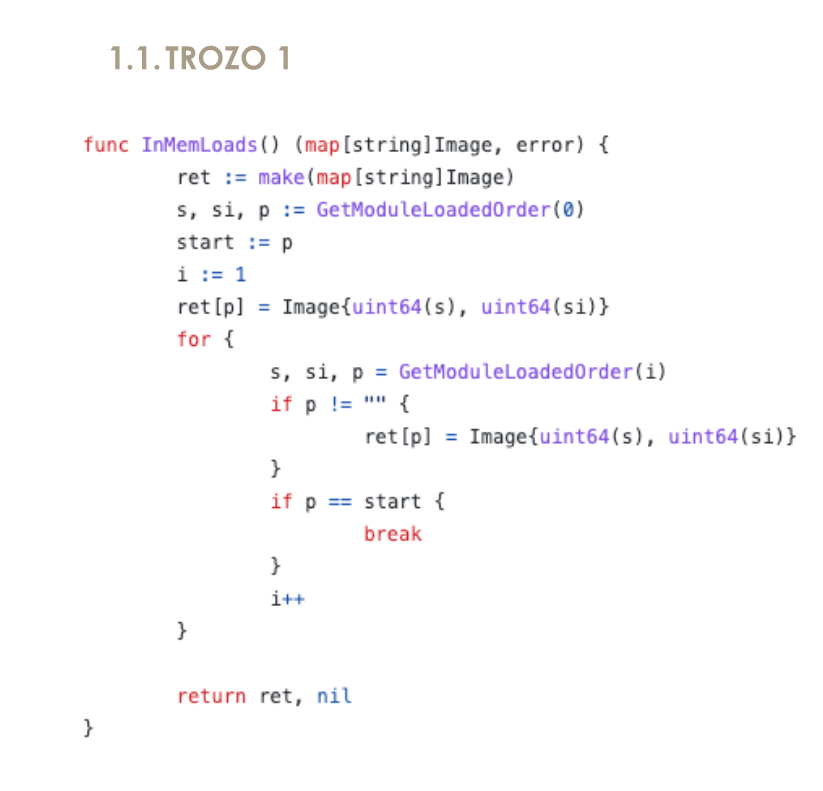


### La definición de función
```go
func InMemLoads() (map[string]Image, error) {
```
donde:
- Los tipos de retorno van después de los paréntesis, e incluso son múltiples `(map[string]Image, error)`. Esto es algo **muy típico de Go.**

---------------------------

### Declaraciones con :=
```go
ret := make(map[string]Image)
s, si, p := GetModuleLoadedOrder(0)
start := p
i := 1
```
donde:
- La declaración corta (short variable declaration) con `:=` es una **característica distintiva de Go.**


---------------------------

### Uso de make para mapas
```
make(map[string]Image)
```
donde: 
- make es una **función predefinida de Go (builtin)** que sirve específicamente para inicializar mapas (map), canales (chan) y slices.

---------------------------

### Conversión de tipos al estilo Go
```
Image{uint64(s), uint64(si)}
```
donde:
- **En Go** las conversiones se escriben como llamadas de función: `uint64(...)`.

---------------------------

### Uso de nil como valor nulo
```
return ret, nil
```
donde:
- **En Go**, nil representa el “valor cero” para ciertos tipos de referencia (punteros, interfaces, mapas, slices, canales y funciones) y significa “no hay valor / no apunta a nada”.


---------------------------

### Conclusión
Este trozo está en Go (Golang) porque los tipos de retorno van después de los paréntesis para definir funciones, devuelve `map[string]Image`, inicializa mapas con `make`, utiliza la asignación corta `:=` y las conversiones de tipo explícitas `uint64(...)`, elementos característicos de Go y no presentes juntos en otros lenguajes de alto nivel y compilado.
- Es un lenguaje de alto nivel.
- Usa un tipado estático `(map[string]Image, error, uint64, etc.)`.
- Es compilado. El código fuente de Go se traduce mediante el compilador go build directamente a binario nativo (código máquina). 

---------------------------

## Trozo 2
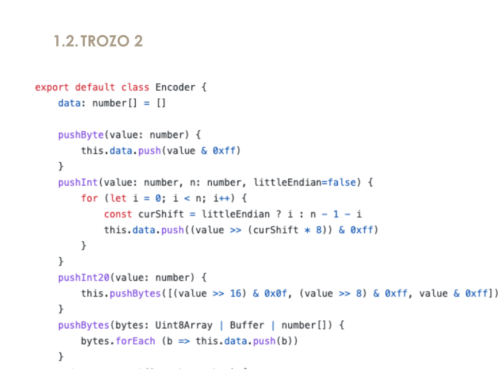


### La cabecera de la clase
```
export default class Encoder {
```
donde:
- `export default` es sintaxis de módulos ES6 (JS/TS), que forma parte de JavaScript.
- `export default class Encoder` junto con anotaciones de tipo (`value: number`, `bytes: Uint8Array | Buffer | number[]`). Esa mezcla de módulos ES6 + tipos estáticos **apunta claramente a TypeScript.**

---------------------------

### Anotaciones de tipos exclusivos de Typescript
```
data: number[] = []
pushByte(value: number) {
pushInt(value: number, n: number, littleEndian=false) {
pushBytes(bytes: Uint8Array | Buffer | number[]) {
```
donde:
- El uso de tipos unidos con `| (Uint8Array | Buffer | number[])` y de tipos primitivos en los parámetros (`n: number, littleEndian=false`) **es sintaxis típica de TypeScript para tipado estático.​​**

---------------------------

### Uso de Javascript
```
let
const
b => this.data.push(b).
>>
&
```
donde:
- Usos de let, const.
- Arrow function: b => this.data.push(b).
- Operadores bit a bit: >>, & 0xff.


---------------------------

### Conclusión
Este trozo usa JavaScript moderno, y la combinación “JS + anotaciones de tipo” es precisamente lo que **demuestra el uso de TypeScript**.
- Es un lenguaje de alto nivel.
- Tiene tipado estático (aunque se borra al compilar a JS).
- TypeScript se considera un lenguaje compilado (o más precisamente “transpilado”).
  - El código TypeScript no se ejecuta directamente en el navegador ni en Node; primero pasa por un compilador (tsc) que lo convierte a JavaScript estándar.
  - El resultado de esa compilación es JavaScript, y ese JavaScript sí se ejecuta de forma interpretada (o JIT‑compilada) por el motor correspondiente.

---------------------------

## Trozo 3
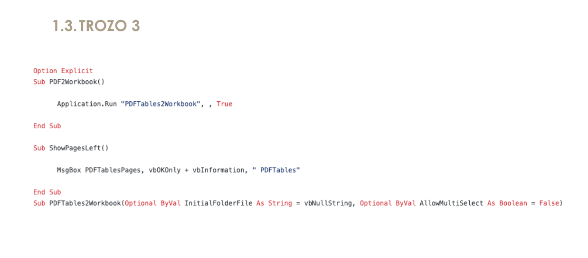

### Directiva al principio
```
Option Explicit
``` 
donde:
- **Es muy típica de VB/VBA** para obligar a declarar variables.

---------------------------

### Definición de procedimientos
```
Sub PDF2Workbook()
...
End Sub
``` 
donde:
- El uso de Sub ... End Sub para procedimientos es **propio de Visual Basic.**


----------------------------

### Llamada a métodos de la aplicación host
```
Application.Run "PDFTables2Workbook", , True
``` 
donde:
- `Application.Run` es **típico en VBA dentro de Excel/Word.**

---------------------------

### Cuadros de mensaje y constantes “vb*”
```
MsgBox PDFTablesPages, vbOKOnly + vbInformation, " PDFTables"
``` 
donde:
- `MsgBox` y constantes como `vbOKOnly`, `vbInformation`, `vbNullString` **son constantes predefinidas de VBA.**

---------------------------

### Firma de procedimiento con Optional, ByVal, As Tipo
```
ub PDFTables2Workbook(Optional ByVal InitialFolderFile As String = vbNullString, _
                       Optional ByVal AllowMultiSelect As Boolean = False)
``` 
donde:
- Esta **Sintaxis es característica de Visual Basic/VBA.**


---------------------------

###  Conclusión
Es Visual Basic for Applications (VBA) porque usa la directiva `Option Explicit`, define procedimientos con `Sub ... End Sub`, utiliza parámetros `Optional ByVal ... As String/Boolean` y constantes predefinidas como `vbNullString y vbInformation`, todo ello típico de Visual Basic for Applications en macros de Office.
- Es un lenguaje de alto nivel.
- VBA usa un tipado estático:
  - Si declaramoss `Dim x As String o Dim y As Boolean`, el tipo de esa variable queda fijado y el compilador comprueba compatibilidad de tipos.
  - `Option Explicit` obliga a declarar las variables antes de usarlas.
- En el contexto de VBA (macros de Office) se compila a p-code y lo ejecuta el intérprete de VBA dentro de la aplicación; a efectos prácticos en esta clasificación se suele considerar interpretado (no se produce un binario nativo independiente), pero realmente es “compilado a bytecode e interpretado por el runtime de Office”.


-----------------------------------

## Trozo 4
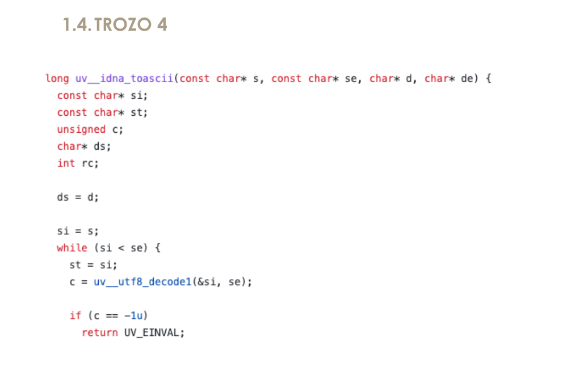

### La definición de la función
```
long uv__idna_toascii(const char* s, const char* se, char* d, char* de) {
``` 
donde:
- El Tipo de retorno al principio `(long)` y el uso de parámetros con **tipos clasicos de C** `(const char*)`.
- No hay clases, ni namespace, ni referencias (& en parámetros), nada “orientado a objetos” → **parece más C que C++.**

----------------------------------------

### Declaraciones de variables locales
```
const char* si;
const char* st;
unsigned c;
char* ds;
int rc;
``` 
donde:
- Uso de punteros `(char*)` y del tipo `unsigned` “a secas”, **muy típico en código C.**

----------------------------------------

### Estructura del bucle y llamada a función
```
while (si < se) {
    st = si;
    c = uv__utf8_decode1(&si, se);
    if (c == -1u)
        return UV_EINVAL;
}
``` 
donde:
- Sintaxis de control `(while, if)` **típica de la familia C.**
- Macros estilo `UV_EINVAL` **también son muy de C** (constantes definidas con #define).


----------------------------------------

### Conclusión
Es C porque declara funciones y variables con tipos primitivos `(long, unsigned, int)` y punteros `(const char*)`, usa un `while` con comparación de punteros, llama a funciones con paso de direcciones `(&si)` y no aparece ninguna característica propia de C++ como referencias, new, class o namespace.
- Es código de alto nivel, lenguaje C.
- C tiene tipado estático: todos los identificadores tienen tipo en tiempo de compilación (long, int, char*, unsigned, …).
- C es un lenguaje compilado: se traduce a código máquina (normalmente a través de un compilador como gcc, clang, etc.).


----------------------------------------


## Trozo 5
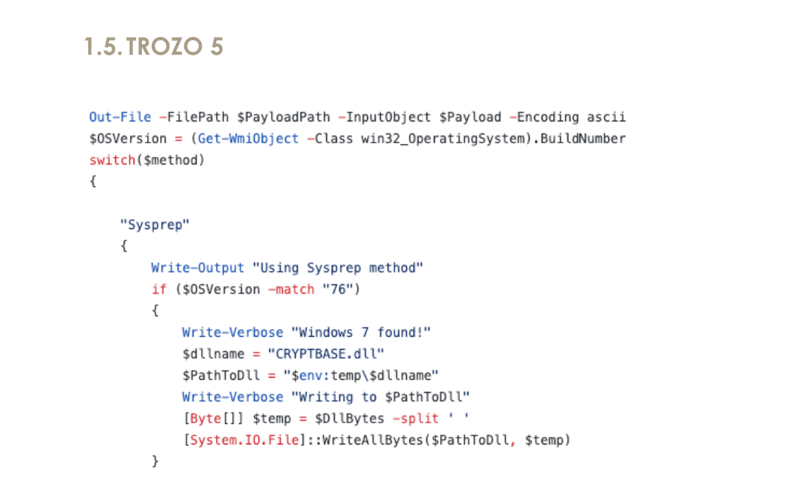

### Cmdlets con guiones y parámetros con `-`
```
Out-File -FilePath $PayloadPath -InputObject $Payload -Encoding ascii
```
donde:
- `Out-File`, `Get-WmiObject`, `Write-Output`, `Write-Verbose` son `cmdlets` **típicos de PowerShell.**

---------------------------

### Variables con el símbolo `$` delante
```
$PayloadPath
$OSVersion = (Get-WmiObject -Class win32_OperatingSystem).BuildNumber
```
donde:
- Las variables con prefijo $ ($OSVersion, $PayloadPath, $env:temp) **son características de PowerShell.**

---------------------------

### Uso de switch con strings entre comillas:
```
switch($method)
{
    "Sysprep"
    {
        ...
    }
}
```
donde:
- Sigue la **gramática propia de PowerShell.**

---------------------------

### Operador `-match` para expresiones regulares:
```
if ($OSVersion -match "76")
```
donde:
- Sigue la **gramática propia de PowerShell.**

---------------------------

### Tipos .NET entre corchetes y llamadas estáticas
```
[Byte[]] $temp = $DllBytes -split ' '
[System.IO.File]::WriteAllBytes($PathToDll, $temp)
```
donde:
- Muestran la **integración directa de PowerShell con .NET**, algo distintivo frente a otros shells.

---------------------------

### Conclusión
Concluimos que este trozo está escrito en PowerShell.
- Es un lenguaje de alto nivel (script de PowerShell).
- PowerShell usa tipado dinámico (aunque permite anotar tipos como [Byte[]]). Por defecto el sistema es dinámicamente tipado y resuelve tipos en tiempo de ejecución, no en compilación.
- Se considera un lenguaje interpretado / de scripting: el motor de PowerShell ejecuta el script directamente (sobre .NET).

---------------------------

# Ejercicio 2

- Describe que hace la función.
- Define si es función o procedimiento.
- Define el tipo de la función.
- ¿Es o no es predicado?
- ¿Es o no es una función hoja?
- ¿Es o no es una función de sistema?
- ¿Es o no es una función con parámetros variables?
- Describe la signatura de la función.
  - Define los tipos de parámetros que recibe.
  - Define si una parámetros por defecto y qué valores poseen.
  - Define que tipo de dato devuelve.
  - Los parámetros que usa la función están pasado por valor o por referencia?

- Define que devuelve la función.
- Define si llama a otras funciones.
- Define si modifica algún parámetro o solo lee los valores recibidos?.
- Define si devuelve un objeto creado dentro de ella.
- Define si modifica objetos globales.
- Define el Sistema de tipos usados, son dinámicos, son estáticos.
- Funciones que importa o exporta. ¿Cómo el programa importa/exporta funciones de una librería? Mediante
  - Enlace dinámico.
  - Enlace estático.
  - Carga dinámica, dureante la ejecución.
- ¿Es una función de usuario?
- ¿es una función que no cambia el estado del programa, es decir tiene transparencia referencial?
- ¿Es una función pura?
- ¿cual es el ámbito de la función (su visibilidad)?
- Define las variales que usa, son globales? son locales? son estaticas?
- Si muta o lee valores fuera de su ámbito. Es decir, valores no creados dentro de la función o que no forman parte de los parámetros de la función.
- ¿Posee o no parámetros constantes?
- tiene runtime?
- tiene simbolos de depuración?
- estamos en un modulo? una dll?
- Definir el ambito: estamos en un modulo? una función?
- Explicar estructuras de bifurcación, repetición, saltos...


## Función 1


### 1. Identificación y propósito
- **Nombre:** aeResizeSetSize
- **Contexto:** función C relacionada con un bucle de eventos (aeEventLoop).
- **Descripción:** La función aeResizeSetSize se encarga de redimensionar la capacidad del bucle de eventos (eventLoop). Intenta expandir los arrays que almacenan los eventos registrados y los eventos disparados (events y fired) para acomodar un nuevo tamaño (setsize). Si la redimensión es exitosa, inicializa las nuevas ranuras (slots) creadas con una máscara vacía (AE_NONE).


### 2. Naturaleza de la función
- **Clasificación:** Es una función porque devuelve un valor (`int`) usado típicamente como código de error/éxito. 
  - Aunque retorna int, su valor principal reside en los efectos secundarios (modificar el eventLoop), no en el cálculo de un valor.
  - Tiene efectos secundarios significativos (modifica el estado del programa), por lo que **actúa semánticamente como un procedimiento que devuelve un código de error.**
- **Origen:** Función de usuario, no forma parte de la biblioteca estándar del lenguaje. No es una función de sistema. Es código definido por el programador (o la librería), no una llamada directa al kernel del sistema operativo.
- **¿Predicado?** No estrictamente; devuelve un código de error/éxito, no un booleano puro. (Un predicado suele devolver un booleano (verdadero/falso) evaluando una condición lógica.)
- **¿Función hoja?** No. Llama a otras funciones: aeApiResize y zrealloc. Por lo tanto, no es una hoja (leaf function) en el árbol de llamadas.


### 3. Signatura y parámetros
- **Signatura:** `int aeResizeSetSize(aeEventLoop *eventLoop, int setsize)`
- **Aridad:** 2 parámetros → función binaria.
- **Parámetros:**
  - `eventLoop`:
    - Tipo: aeEventLoop *. Un puntero a una estructura aeEventLoop.
    - Paso: por valor, pero es un puntero → permite modificar la estructura apuntada.
    - No está declarado const.
    - Mutabilidad: Se modifica intensivamente (punteros internos y metadatos).

  - `setsize`:
    - Tipo: int. Un entero que representa el nuevo tamaño deseado.
    - Paso: por valor.
    - Tampoco está declarado const, aunque en la práctica no se modifica.

- **No hay palabra clave const en ninguno.** Ninguno de los parámetros está marcado con el calificador const.
- **No tiene parámetros por defecto.** El lenguaje C no soporta parámetros por defecto. Ambos deben ser provistos al llamar la función.
- **No es una función con parámetros variables.** Tiene un número fijo de argumentos.


### 4. Valor de retorno
- **Tipo devuelto:** int. (Entero con signo).
- **¿Qué devuelve la función?:** Devuelve constantes simbólicas (macros):
  - AE_OK → Si la operación fue exitosa.
  - AE_ERR → Si hubo un error. Por:
    - setsize demasiado pequeño (maxfd >= setsize), o
    - fallo de aeApiResize.
- **¿Devuelve un objeto creado dentro de ella?:** No. Solo devuelve un código de estado entero.


### 5. Comportamiento y Efectos secundarios
- **¿Llama a otras funciones?:** Sí.
  - aeApiResize(eventLoop, setsize)
  - zrealloc(...) (Una envoltura de realloc).
- **¿Modifica algún parámetro o solo lee?:** Modifica el contenido apuntado por el parámetro eventLoop. Específicamente actualiza sus punteros internos (events, fired) y el campo setsize.
- **¿Modifica objetos globales?:** Técnicamente modifica memoria en el heap (montículo) a través de zrealloc. Si la estructura eventLoop a la que apunta el puntero es global, entonces sí modifica un objeto global.
- **Muta o lee valores fuera de su ámbito:** Sí. Al acceder a eventLoop->events y eventLoop->fired, está mutando memoria que fue asignada fuera del ámbito de esta función específica.


### 6. Pureza y Estado
- **¿Es una función pura?:** No.
  - Depende de estado externo (el contenido de eventLoop).
  - Tiene efectos secundarios (modifica eventLoop, realiza asignación de memoria).
- **Transparencia referencial:** No tiene. No se puede reemplazar la llamada a la función simplemente por su valor de retorno sin perder la lógica de redimensionamiento del sistema.
- **¿Es una función que no cambia el estado del programa?:** No. Su propósito principal es cambiar el estado del programa (redimensionar estructuras de datos).


### 7. Sistema de tipos y visibilidad
- **Lenguaje:** C, tipado estático. Los tipos se verifican en tiempo de compilación.
- **Los tipos se conocen en compilación:** int, aeEventLoop *, aeFileEvent, aeFiredEvent.
- **Enlace (Linkage):** Externo (Público).
  - No tiene static delante, así que por defecto tiene enlace externo (visible desde otros archivos si se declara en un header).

### 8. Relaciones con otras funciones y librerías
- **Llama a:**
  - aeApiResize(eventLoop, setsize) → parte dependiente del sistema/implementación del backend de eventos.
  - zrealloc(...) → wrapper de realloc (muy probablemente), función de memoria.
- **No importa/exporta directamente librerías** en el propio código; eso ocurre a nivel de compilación/enlace del módulo donde está definida.
- **Mecanismo de importación/exportación:** Depende de la compilación. Normalmente, en C, esto se resuelve mediante el Enlace (Linking). Si es parte de un ejecutable monolítico, es enlace estático. Si ae.c se compila en una .dll o .so, se usaría enlace dinámico.


### 9 Ejecución y depuración
- Usa el runtime estándar de C (para memoria dinámica, aunque envuelto en zrealloc).
- El fragmento es código fuente; si el binario se compila con símbolos de depuración o no depende de las opciones del compilador, aquí no se ve.

### 10. Estructuras de control
- **Bifurcación:**
  - Tres if seguidos con return temprano:
    - Igualdad de tamaños.
    - Comprobación maxfd >= setsize.
    - Resultado de aeApiResize.
- **Repetición:**
  - Un bucle `for (i = eventLoop->maxfd+1; i < setsize; i++)`: Inicializa las nuevas posiciones de events con AE_NONE.
- **Saltos / flujo:**
  - `return` múltiple (salidas tempranas en caso de error o no-cambio).
  - No hay break, continue, goto, ni manejo de excepciones (en C estándar no hay try/catch).

### 11. Análisis de malware / seguridad
- Desde el punto de vista de malware, esta función no muestra comportamiento típico malicioso:
  - No accede a disco, registro, red, procesos externos, servicios, etc.
  - Solo toca memoria dinámica y campos de una estructura de bucle de eventos.
  - No hay ofuscación, anti-debug, ni resolución dinámica de APIs “sospechosa”; las llamadas son directas (aeApiResize, zrealloc).
  - No implementa persistencia, exfiltración, keylogging, cifrado de archivos, etc.
- Conclusión en clave malware: Es una función de infraestructura interna de un event loop (gestión de arrays de eventos). Por sí sola no es indicio de comportamiento malicioso.


---------------------------

## Función 2
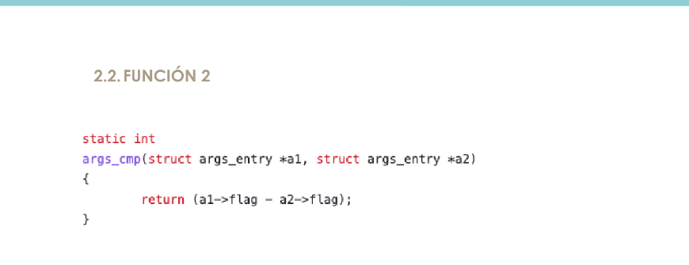
### 1. Identificación y propósito
- **Nombre:** args_cmp
- ***Contexto:** función C, probablemente usada como función de comparación.
- **Descripción:** La función args_cmp compara dos estructuras del tipo struct args_entry. Resta el valor del campo flag de la segunda estructura (a2) al de la primera (a1).
  - El propósito de este patrón es servir como función de comparación, típicamente utilizada por algoritmos de ordenamiento como qsort o de búsqueda como bsearch.
  - Si el resultado es < 0: a1 es menor que a2.
  - Si el resultado es 0: Son iguales.
  - Si el resultado es > 0: a1 es mayor que a2.


### 2. Naturaleza de la función
- **Clasificación:** Es una función, ya que su objetivo principal es calcular y devolver un valor (int) sin generar efectos secundarios.
- **Origen:** Función de usuario, no forma parte de la biblioteca estándar. Función auxiliar / Comparador (Helper function).
- **¿Predicado?:** No, devuelve un valor de comparación, no un booleano puro.
- **¿Función hoja?:** Sí. No llama a ninguna otra función; solo hace una operación aritmética.


### 3. Signatura y parámetros
- **Signatura:** `static int args_cmp(struct args_entry *a1, struct args_entry *a2);`
- **Aridad:** 2 parámetros → función binaria.
- **Parámetros:**
  - `a1`:
    - Tipo: struct args_entry *. Puntero a la primera estructura (LHS - Left Hand Side).
    - Paso: por valor (puntero), se copian las direcciones de memoria, actuando como referencia a los datos. Evita la copia costosa de toda la estructura.
    - No es const.

  - `a2
    - Tipo: struct args_entry *. Puntero a la segunda estructura (RHS - Right Hand Side).
    - Paso: por valor (puntero), se copian las direcciones de memoria, actuando como referencia a los datos. Evita la copia costosa de toda la estructura.
    - No es const.

- **No hay `const` en los parámetros.**
- **Parámetros por defecto:** No.
- **No es varargs.**


### 4. Valor de retorno
- **Tipo:** int (Entero con signo).
- **Qué devuelve exactamente:** `a1->flag - a2->flag` → un entero negativo, cero o positivo según la relación de orden entre ambos flag.
- **No devuelve objetos** ni códigos complejos, solo el resultado de la comparación.


### 5. Comportamiento y Efectos secundarios
- **Lectura:** Lee memoria del heap/stack (flag).
- **Escritura:** Ninguna.
- **Estado Global:** No accede ni modifica nada fuera de sus parámetros.
- **Conclusión:** Sin efectos secundarios observables.


### 6. Pureza y Estado
- **¿Es una función pura?:** Sí.
  - Su valor de retorno depende exclusivamente de sus argumentos.
  - No tiene efectos secundarios (no imprime, no escribe en archivos, no modifica variables globales).

- **Transparencia referencial:** Sí. Podemos reemplazar la llamada a la función por el resultado de la resta (si tuvieramos acceso a los punteros) y el programa funcionaría igual.


### 7. Sistema de tipos y Visibilidad
- **Lenguaje:** C → tipado estático.
- **Usa tipos:** int, struct args_entry *.
- **Enlace (Linkage):** Interno.
  - La palabra clave static restringe la visibilidad al archivo fuente actual (Unidad de traducción).
  - No puede ser invocada directamente desde otros archivos .c (no se exporta el símbolo).


### 8. Relaciones con otras funciones y librerías
- No llama a otras funciones.
- Exporta: No. La palabra clave static al inicio de la declaración restringe la visibilidad de esta función únicamente al archivo fuente (.c) actual. No es visible para otros módulos (Enlace interno).

  
### 9. Ejecución y depuración
- Usa solo el runtime mínimo de C (operación aritmética).
- Mecanismo de carga: Al ser estática, su dirección se resuelve en tiempo de compilación/enlace dentro de su propia unidad de traducción.


### 10. Estructuras de control
- No hay estructuras de control (if, for, etc.).
- **Es un bloque lineal** simple que ejecuta una instrucción y retorna.
- Usa return para finalizar.


### 11. Análisis de malware / seguridad
Desde la óptica de malware, esta función:
- Solo lee un campo de dos estructuras y devuelve una resta.
- No accede a red, disco, procesos, registro, ni memoria dinámica.
- No hace ofuscación, ni anti-debug, ni nada similar.
- Segura en memoria: No realiza aritmética de punteros peligrosa ni escribe en memoria.

---------------------------

## Función 3
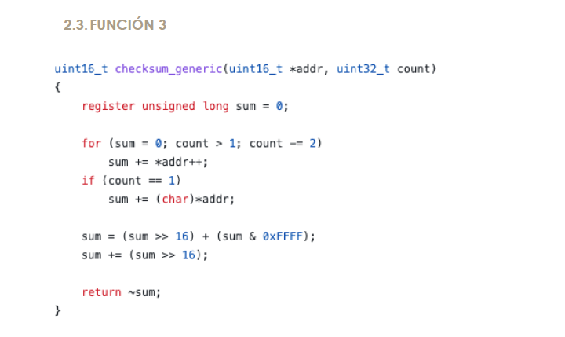

### 1. Identificación y propósito
- **Nombre:** checksum_generic
- **Contexto:** Algoritmo de verificación de integridad (Checksum).
- **¿Qué hace?:** Implementa el cálculo del Checksum de Internet (RFC 1071), estándar en protocolos como IP, TCP y UDP. Recorre un bloque de memoria apuntado por addr, suma palabras de 16 bits en una variable de mayor tamaño (unsigned long), maneja el posible byte sobrante y finalmente pliega la suma a 16 bits y le hace el complemento a uno. Devuelve ese checksum de 16 bits.

### 2. Naturaleza de la función
- **Clasificación:** Es función, devuelve un valor numérico explícito (`uint16_t`).
- **Origen:** Función de usuario.
- **¿Predicado?:** No; devuelve un valor numérico de checksum, no un booleano.
- **¿Función hoja?:** Sí. No realiza llamadas a otras funciones.


### 3. Signatura y parámetros
- **Signatura:** `uint16_t checksum_generic(uint16_t *addr, uint32_t count);`
- **Aridad:** 2 parámetros → función binaria.
- **Parámetros:**
  - `addr`:
    - Tipo: uint16_t *. Puntero a enteros sin signo de 16 bits (el buffer de datos).
    - Paso: Se pasa por valor (la dirección de memoria), actuando como referencia al buffer.
    - No está declarado como const, aunque no se modifica la memoria apuntada.

  - `count`:
    - Tipo: uint32_t. Entero sin signo de 32 bits (la cantidad de bytes a procesar).
    - Paso: por valor.
    - Se utiliza como contador de longitud: en el bucle for se va decrementando (count -= 2); esta modificación solo afecta al valor local dentro de la función.

- **Parámetros constantes:** No. Ninguno está declarado const, aunque semánticamente se usan como entrada solo.
- **Parámetros por defecto:** No tiene.
- **Varargs:** No, no hay ....


### 4. Valor de retorno
- **Tipo devuelto:** `uint16_t`. Entero sin signo de 16 bits.
- **Devuelve:** El valor del checksum calculado.
- **¿Devuelve un objeto creado dentro de ella?:** No, devuelve un valor primitivo.


### 5. Comportamiento y Efectos secundarios
- **Efectos Secundarios:** Ninguno.
- **Lectura de Memoria:** Solo lee el rango especificado por addr.
- **Mutación:** Solo muta sus propias variables locales (sum, copias locales de addr y count).
- **Conclusión: no tiene efectos secundarios observables.**


### 6. Pureza y Estado
- **¿Es pura?:** Sí. No modifica estado global ni parámetros. Solo lee la memoria a la que apuntan sus parámetros. Si el contenido de la memoria no cambia, siempre devuelve lo mismo → se puede considerar función pura (a efectos prácticos de análisis de código).
- Transparencia referencial: Sí.


### 7. Sistema de tipos y visibilidad
- **Lenguaje:** C → tipado estático.
- **Tipos Clave:** uint16_t (datos), uint32_t (contador), unsigned long (acumulador).  
- **Enlace (Linkage):** Enlace estático o dinámico dependiendo de cómo se compile el archivo objet


### 8. Relaciones con otras funciones y librerías
- No llama a ninguna otra función.
- **Exporta:** Sí.
- 

### 9. Ejecución y depuración
- Usa solo el runtime básico de C (operaciones aritméticas y de desplazamiento).
- Si el binario se compila con símbolos de depuración, aparecerá con el nombre checksum_generic, pero esto depende de las opciones de compilación, no del código fuente.


### 10. Estructuras de control
- **Bifurcación:**
  - Un if (count == 1) para tratar el caso en que queda un byte sobrante.

- **Repetición:**
  - Bucle for (sum = 0; count > 1; count -= 2)
    Lee de dos en dos bytes (una palabra de 16 bits) mientras queden al menos 2 bytes.

- **Saltos / flujo:**
  - Solo un return al final (return ~sum;).
  - No hay break, continue, goto, ni excepciones (en C no hay try/catch).

### 11. Análisis de malware / seguridad
- No toca disco, red, registro, procesos ni servicios.
- No carga librerías dinámicas ni hace llamadas de sistema sospechosas.
- No hay ofuscación ni anti-debug; es una rutina matemática clara.
- Es un cálculo de checksum genérico:
  - Este tipo de función puede aparecer tanto en software legítimo (protocolos de red, verificación de integridad) como en malware (para validar payloads, comprobar integridad de código, etc.).
  - Por sí sola no es indicador de comportamiento malicioso.

- Conclusión en clave malware: Es una rutina de checksum genérica, muy neutra; el posible uso malicioso dependería de qué datos se le pasan y desde dónde se llama, no de la función en sí.


---------------------------


## Función 4
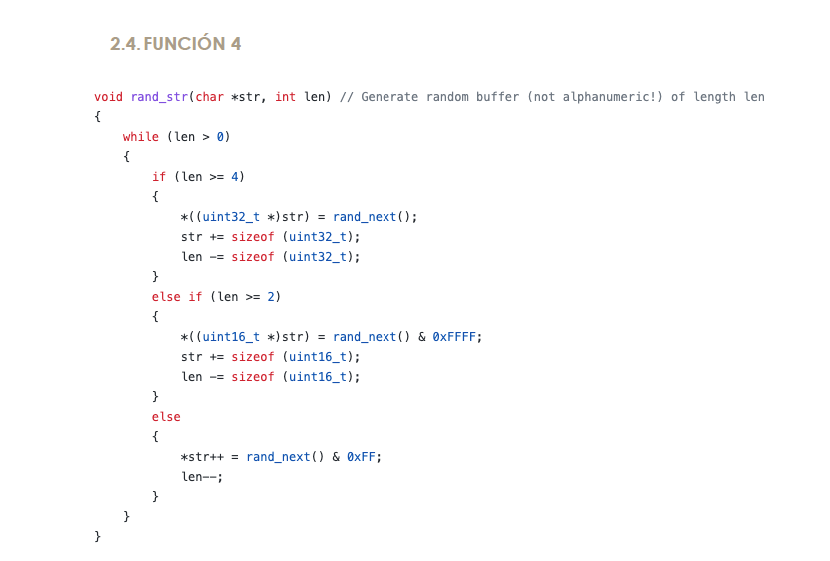
### 1. Identificación y propósito
- **Nombre:** rand_str.
- **Contexto:** Rutina de llenado de memoria con datos pseudo-aleatorios (Memory Fill / Random Generator).
- **Descripción:** Rellena un búfer apuntado por str con len bytes de datos aleatorios.
  - Estrategia de Optimización: En lugar de escribir byte a byte (lento), intenta escribir bloques de palabra de 32 bits (4 bytes) y media palabra (2 bytes) para reducir el número de accesos a memoria.
- **Nota Importante:** El comentario "not alphanumeric!" confirma que genera datos binarios crudos, no texto legible. Los bytes pueden tener cualquier valor entre 0x00 y 0xFF.


### 2. Naturaleza de la función
- **Clasificación:** Es un procedimiento (retorna void).
- **Origen:** Código de usuario (User-defined).
- **Nivel:** Bajo nivel (manipulación directa de punteros y memoria).
- **¿Predicado?:** No.
- **¿Función Hoja?:** No. Depende de rand_next().


### 3. Signatura y parámetros
- **Signatura:** `void rand_str(char *str, int len);`
- **Aridad:** 2 parámetros → función binaria.
- **Parámetros:**
  - `str` (Entrada/Salida): char *.
    - Puntero al inicio del bloque de memoria a llenar. Paso por valor.
    - No es const: explícitamente se usa para escritura.
    - Riesgo de Alineación: Al hacer cast a (uint32_t *), si la dirección de str no es múltiplo de 4, podría provocar un fallo de segmentación (Bus Error) en arquitecturas estrictas (como SPARC o ARM antiguos), aunque x86 lo tolera con penalización de rendimiento.
  - `len` (Entrada): int.
    - Entero que indica la longitud (cantidad de bytes) a escribir. Paso por valor.
    - Se usa como contador de bytes restantes; se va decrementando en el while.
    - Longitud en bytes. Se modifica localmente (decrementa) para controlar el bucle.

- **Parámetros `const`:** No.
- **Valores por defecto:** No.
- **No es varargs.**


### 4. Valor de retorno
- **Tipo devuelto:** void.
- **Qué “devuelve” en la práctica:** No hay valor de retorno; el “resultado” es el contenido del búfer str, que queda rellenado con valores pseudo-aleatorios.
- **Resultado:** La función opera exclusivamente mediante efectos secundarios (mutación del búfer).


### 5. Comportamiento y Efectos secundarios
- **Muta o lee valores fuera de su ámbito:** Muta valores en el heap o stack (el búfer str) que pertenece al ámbito del llamador ⇒ Tiene efectos secundarios claros, no es pura.
- **Mutación de Memoria:** Escribe directamente en el heap o stack del llamador.
- **Llamadas:** Invoca repetidamente a rand_next() para obtener entropía.
- **Estado Global:** Modifica implícitamente el estado del generador de números aleatorios (la "semilla" interna de rand_next).


### 6. Pureza y Estado
- **¿Es pura?:** No.
  - Depende de un generador externo (rand_next).
  - Muta la memoria externa (str).
  - No es determinista.
- **Transparencia Referencial:** No.


### 7. Sistema de tipos y Visibilidad
- **Lenguaje:** C (Tipado estático pero con punteros "débiles").
- **Casting (Type Punning):** La función realiza conversiones de tipo explícitas y arriesgadas: convierte un puntero char* a uint32_t* y uint16_t*.
  - Esto indica que el compilador debe tratar la misma dirección de memoria como diferentes tipos de datos para optimizar la escritura.
- **Enlace (Linkage):** Externo.
  - Al no tener la keyword static, la función es exportada y visible para cualquier otro archivo del proyecto que la enlace.


### 8. Relaciones con otras funciones y librerías
- Llama a: `rand_next()`: generador de números pseudo-aleatorios (probablemente implementado en el mismo proyecto o en una librería).
- No se ven otras dependencias directas (no hace llamadas de sistema, ni I/O, etc.).


### 9. Ejecución y depuración
- Requiere el runtime del generador de PRNG (rand_next()), pero por lo demás solo operaciones aritméticas / de punteros.
- No hay información en el código fuente sobre símbolos de depuración; eso depende de cómo se compile.


### 10. Estructuras de control
- **Repetición:** Un bucle while (len > 0) que va consumiendo longitud.

- **Bifurcación:**
  - Dentro del while, un if / else if / else:
    - len >= 4 → escribe 4 bytes de golpe (cast a uint32_t *).
    - len >= 2 → escribe 2 bytes (uint16_t *).
    - Si no, escribe 1 byte.

- **Saltos / flujo:**
  - No hay break, continue, goto.
  - El bucle termina cuando len llega a 0.


### 11. Análisis de malware / seguridad
- **Riesgo Técnico (Crash):** El mencionado problema de alineación de punteros.
- **Calidad Criptográfica:** Depende totalmente de rand_next(). Si rand_next es un generador lineal simple (LCG), estos datos no son seguros para generar claves criptográficas o IVs.
- **Perspectiva de Malware:**
  - Polimorfismo: El malware usa funciones así para generar "basura" (junk code/data) y cambiar su firma (hash) en cada infección.
  - Ofuscación: Generar claves XOR dinámicas para cifrar el payload.
  - Tráfico Falso: Generar contenido aleatorio para enviar por red y confundir a los analistas o herramientas de monitoreo.


---------------------------

## Función 5
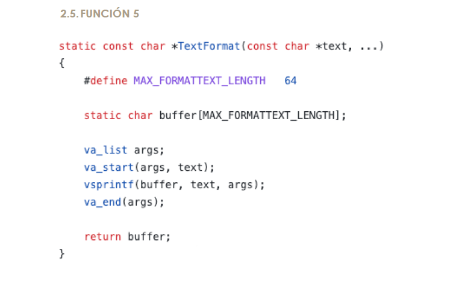
### 1. Identificación y Propósito
- **Nombre:** TextFormat
- **Contexto:** Función envoltorio (wrapper) para formateo de cadenas en C.
- **Descripción:** Utilidad para formatear texto con argumentos variables (similar a printf) y devolverlo como una cadena utilizable.
  - Toma una cadena de formato (text) y argumentos variables (...).
  - Procesa los argumentos usando vsprintf.
  - Almacena el resultado en un búfer estático interno (buffer).
  - Devuelve un puntero a dicho búfer.
- **Nota Crítica:** Debido al uso de un static char buffer, el contenido devuelto es volátil: se sobrescribirá en la siguiente llamada a la función. No es persistente más allá de la siguiente invocación.

### 2. Naturaleza de la función
- **Clasificación:** Es una función (devuelve un valor explícito const char *).
- **Origen:** Función de usuario (User-defined function).
- **¿Es Predicado?:** No.
- **¿Es Función Hoja?: No.** Realiza llamadas a la biblioteca estándar (va_start, vsprintf, va_end).
- **¿Parámetros Variables?:** Sí. Es una función variádica (variadic function).


### 3. Signatura y parámetros
- **Signatura:** `static const char *TextFormat(const char *text, ...);`
- **Aridad:** función de aridad variable (varargs):
  - Al menos 1 parámetro fijo (text).
  - Luego ... (lista de argumentos variables).
- **Parámetros por defecto:** No.

- **Parámetros:**
  - `text` (Fijo): const char *. Cadena de formato. Pasado por valor (el puntero), de solo lectura.
  - `...` (Variables): Lista de argumentos gestionada mediante macros de stdarg.h. Se pasan a través de la pila (stack).

### 4. Valor de retorno
- **Tipo:** const char * (Puntero a caracteres constantes).
- **Valor:** La dirección de memoria del arreglo estático buffer.
- **Semántica:** Devuelve una referencia a una zona de memoria compartida y mutable internamente.


### 5. Comportamiento y Efectos (Side Effects)
- **Modificación de Estado:** Sí. Modifica la variable estática buffer.
  - Aunque `buffer` está declarada dentro de la función, su almacenamiento es estático (vive durante toda la ejecución del programa) y mantiene su valor entre llamadas hasta que es sobrescrito.
- **Modificación de Globales:** Técnicamente modifica una variable con almacenamiento estático, que actúa funcionalmente como una variable global privada (con visibilidad restringida al ámbito de la función).
- **Llamadas:** Invoca a vsprintf (con efectos secundarios de escritura en memoria).


### 6. Pureza y Estado
- **¿Función Pura?:** No.
  - Depende de estado mutable (buffer).
  - No tiene transparencia referencial.

- **Seguridad de Hilos (Thread-Safety):** No.
  - No es reentrante. Si dos hilos llaman a TextFormat simultáneamente, se producirá una condición de carrera (race condition) corrompiendo el contenido del buffer.


### 7. Sistema de Tipos y Visibilidad
- **Sistema de Tipos:** Estático (C).
- **Ámbito (Scope):** De archivo / Módulo.
- **Enlace (Linkage):** Interno.
  - La palabra clave static en la declaración de la función (static const char *...) impide que esta función sea visible o enlazada desde otros archivos objeto (.o). Es privada para este módulo.


### 8. Relaciones con otras funciones y librerías
- Llama a:
  - va_start, va_end (macros/funciones de <stdarg.h>).
  - vsprintf (función de la libc para formatear en un buffer con va_list).


### 9. Ejecución y depuración
- Usa el runtime estándar de C (libc).
- Depuración normal; al ser static, su símbolo es interno al módulo.

### 10. Estructuras de control
- No tiene bucles ni condicionales.
- **Flujo lineal:**
  - Preparar va_list.
  - Llamar a vsprintf.
  - Cerrar va_list.
  - return buffer;.

### 11. Análisis de malware / seguridad
- **Vulnerabilidad Crítica (Buffer Overflow)**:
  - Uso de vsprintf (en lugar de vsnprintf) en un búfer de tamaño fijo muy pequeño (`MAX_FORMATTEXT_LENGTH = 64 bytes`) → riesgo de desbordamiento de buffer si el resultado supera MAX_FORMATTEXT_LENGTH.
  - Si el texto formateado excede los 63 caracteres (+ terminador nulo), vsprintf escribirá fuera de los límites del arreglo buffer, corrompiendo la memoria adyacente (stack o sección de datos estáticos, dependiendo del compilador).


---------------------------

# Ejercicio 3 

Una función representa un punto de entrada, posiblemente con parámetros, que puede necesitar acceder a variables globales, que puede manipular ciertas variables y que, finalmente, retorna o no un resultado. En más, puede retonar no solo en un punto sino en varios, dado que también puede tomar decisiones mediante las estructuras de control que hemos estudiado.

Tenemos el código de una función y vamos a analizarla. Necesitamos señalar:
- Donde y que variables crea y necesita; cual es su ámbito.
- Donde modifica (escribe) los parámetros.
- Donde lee o modifica valores globales (fuera de la función o sus parámetros)
- Que estructuras de control posee. Debemos identificar los bucles (while, for, …), estructuras
selectivas (if, switch, …).
- Que puntos de salida posee y con que valor lo hacen.

```c
void sentinelPropagateDownAfterPeriod(sentinelRedisInstance *master) {
    dictIterator *di;
    dictEntry *de;
    int j;
    dict *d[] = {master->slaves, master->sentinels, NULL};
 
    for (j = 0; d[j]; j++) {
        di = dictGetIterator(d[j]);
        while((de = dictNext(di)) != NULL) {
            sentinelRedisInstance *ri = dictGetVal(de);
            ri->down_after_period = master->down_after_period;
        }
        dictReleaseIterator(di);
    }
}
```

## 1. Parámetros y retorno
- La función se llama sentinelPropagateDownAfterPeriod.
- Retorno: void → no devuelve ningún valor.
- Parámetro único (1): Toma un solo parámetro de tipo puntero a `sentinelRedisInstance` llamado `master`. Este parámetro se usa para leer valores iniciales y para propagar su configuración a otros objetos.


## 2. Variables locales que crea y necesita; ámbito de esas variables.
Dentro de la función se crean variables locales (su ámbito es todo el cuerpo de la función, salvo donde se indique):
- (2) `dictIterator *di;` Puntero a un iterador de diccionario. Se usa para recorrer los diccionarios de esclavos y sentinels.
- (3) `dictEntry *de;` Puntero a una entrada de diccionario, usada en el while.
- (4) `int j;` Entero usado como índice en el bucle for sobre el array d.
- (5) `dict *d[] = {master->slaves, master->sentinels, NULL};` Array local de punteros a `dict`.
  - `d[0]` apunta al diccionario de esclavos (master->slaves).
  - `d[1]` apunta al diccionario de sentinels (master->sentinels).
  - `d[2]` es NULL y actúa como marcador de final para el bucle for.

Dentro del bucle while se crea otra variable local, cuyo ámbito se limita al cuerpo del while:
- (6) `sentinelRedisInstance *ri = dictGetVal(de);` Puntero a sentinelRedisInstance, representa cada esclavo o sentinel extraído del diccionario actual.


## 3. Uso y modificación de parámetros
- El parámetro master no se modifica (no se le asigna un nuevo valor ni se cambia su dirección).
- Sí se leen varios campos de master:
  - En la inicialización del array d (línea 5):
    - `master->slaves`
    - `master->sentinels`

  - En el interior del while (línea 11):
    - `master->down_after_period` se usa como fuente del valor que se va a propagar.

Por tanto:
- master se usa como origen de información, nunca como destino de escritura directa.

## 4. Lectura / Escritura de valores globales (fuera de la función o sus parámetros))
Aunque no vemos variables globales explícitas, sí se modifican estructuras que no son locales a la función:
- En la línea 11:
  - `ri->down_after_period = master->down_after_period;`
  - Se lee master->down_after_period (dato asociado al maestro).
  - Se escribe en ri->down_after_period. `ri` apunta a instancias obtenidas de los diccionarios master->slaves y master->sentinels, por lo que la función está modificando el campo down_after_period de todas esas instancias (esclavos y sentinels) accesibles a través del parámetro master.

Es decir, la función propaga el valor down_after_period del maestro al resto de instancias relacionadas.

- Modificación de memoria (Efecto lateral):
  - En la línea 10, modifica el objeto apuntado por ri.
  -     Escribe en ri->down_after_period el valor leído del parámetro master->down_after_period. Aquí es donde ocurre la "propagación" del valor.

## 5. Estructuras de control
- **Bucle for (líneas 7–14):**
  ```c
  for (j = 0; d[j]; j++) {
    ...
  }
  ```
  - Inicialización: j = 0.
  - Condición: d[j] → el bucle continúa mientras el elemento actual del array d no sea NULL.
  - Actualización: j++ en cada iteración.
  - Efecto: recorre los dos diccionarios (slaves y sentinels) definidos en el array d. El NULL final actúa de condición de parada.

- **Bucle while (líneas 9–12):**
  ```c
  while((de = dictNext(di)) != NULL) {
    ...
  }
  ```
  - Condición: el resultado de dictNext(di) se asigna a de y se compara con NULL.
  - La iteración continúa mientras dictNext devuelva una entrada válida de diccionario (de != NULL).
  - Efecto: recorre todas las entradas del diccionario actual d[j].
 
- **No hay estructuras selectivas** tipo if, switch en este fragmento.


## 6. Llamadas a funciones externas
- dictGetIterator(d[j]) (línea 8)
  - Usa el diccionario actual (d[j]) y devuelve un iterador que se guarda en di.

- dictNext(di) (línea 9)
  - Avanza el iterador di y devuelve la siguiente entrada (dictEntry *) o NULL al terminar.

- dictGetVal(de) (línea 10)
  - Obtiene el valor asociado a la entrada de diccionario de. Ese valor se interpreta como sentinelRedisInstance *.

- dictReleaseIterator(di) (línea 13)
  - Libera los recursos asociados al iterador di al terminar de recorrer el diccionario.

Estas funciones operan sobre estructuras que viven fuera de la función y representan el estado del programa (diccionarios de instancias).


## 7. Puntos de salida de la función
- La función no contiene `return` explícitos.
- Solo tiene un único punto de salida implícito:
  - Al llegar a la llave de cierre } (línea 15), finaliza la ejecución.
  - No se devuelve ningún valor (tipo void).

## 8. En resumen
- (1) Argumento tipo puntero a sentinelRedisInstance llamado master.
- (2, 3, 4) Variables locales:
  - dictIterator *di
  - dictEntry *de
  - int j
- (5) Variable local compuesta: array dict *d[] inicializado con:
  - master->slaves
  - master->sentinels
  - NULL como terminador
- (6) Dentro del while, variable local sentinelRedisInstance *ri.
- (7) Estructura de repetición for que recorre los elementos del array d hasta NULL.
- (8) Dentro del for, se crea un iterador de diccionario con dictGetIterator.
- (9) Estructura de repetición while que recorre todas las entradas de cada diccionario.
- (10) En cada iteración del while, se obtiene ri con dictGetVal(de) y se propaga:
  - ri->down_after_period = master->down_after_period;
- (11) Al salir del while, se libera el iterador con dictReleaseIterator(di).
- (12) La función termina al final del bloque (}), sin valor de retorno (void).


----------------------

# Ejercicio 4


## 1. Muestra las instrucciones (capturas de pantalla si quieres) de los pasos dados para crear la base de datos simbólica en la/las herramienta/s que hayas elegido.

### ctags
```sh
sudo apt install exuberant-ctags
ctags -R --languages=C --exclude=.git --exclude=deps .
```
donde:
- -R: recorre subdirectorios.
- --languages=C → solo código C (Redis es C).
- --exclude=... → no indexar .git ni deps (código de terceros).
- .: directorio actual.

Crea un archivo tags con todas las funciones, variables, etc.
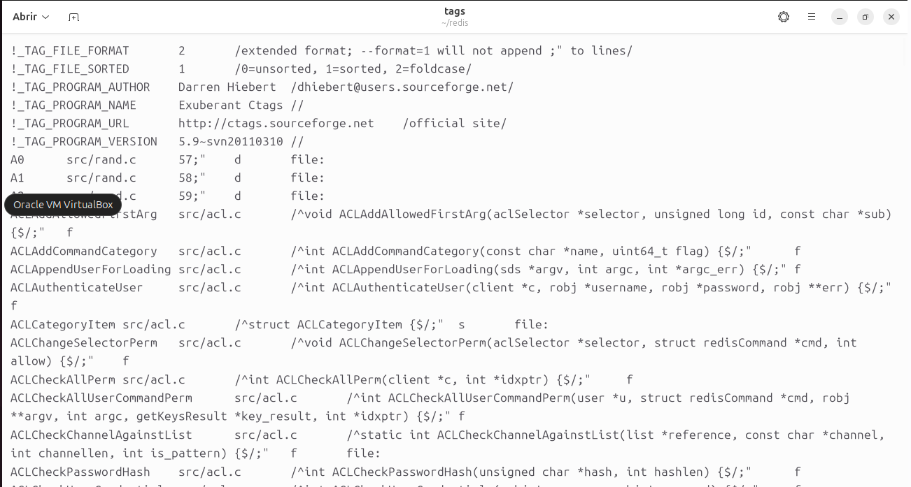


### global
```
sudo apt install global
gtags
```
donde:
- Recorre los .c, .h, etc.
- Genera 3 archivos: GTAGS, GRTAGS, GPATH.
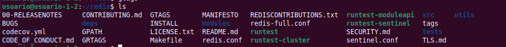


Ver todas las referencias (usos) de una función main:
```
global -rx main
```
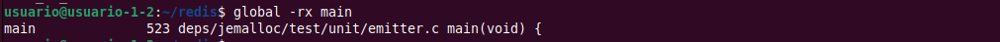


### cscope

Instalamos cscope y generamos un fichero con todos los .c y .h del proyecto:
```
sudo apt install cscope
find . -name '*.[ch]' > cscope.files
```

Vemos el fichero scope.files:
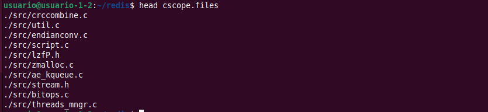


Construimos la base de datos
```
cscope -b -q -k -i cscope.files
```
donde:
- -b → solo construye la base de datos, no abre la interfaz.
- -q → índice rápido (añade cscope.in.out y cscope.po.out).
- -k → ignora cabeceras del sistema (no mira /usr/include).
- -i cscope.files → usa la lista de archivos que acabamos de generar.
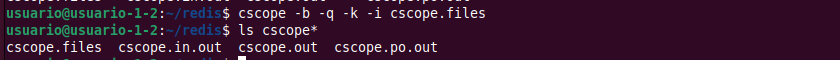


Entramos en el menú interactivo y montrarmos dónde se usa un símbolo `main`:
```
cscope -d
```
donde:
- -d → usa la base existente, no la reconstruye.
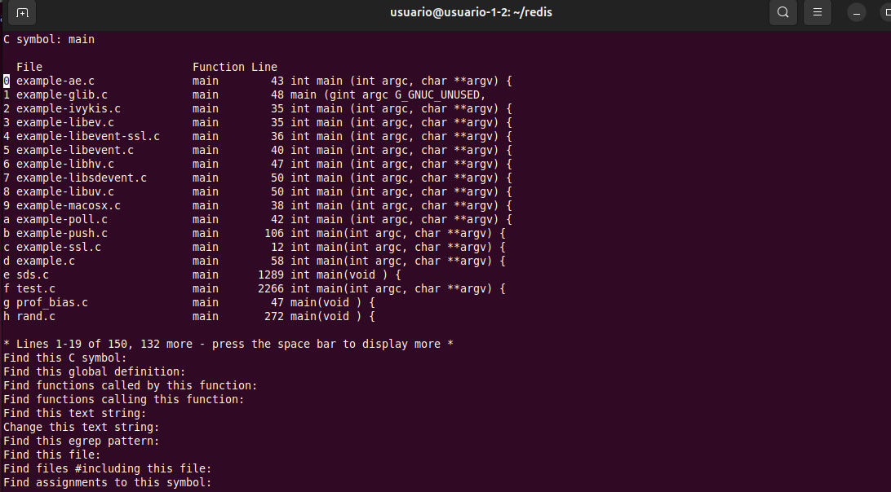


## 2. Busca todas las funciones “main” que existen en el proyecto. Como sabrás, son las funciones principales de entrada a los distintos ejecutables que existen. Haz una captura o copia la lista resultante.

## Global
Buscamos todas las definiciones de main y las guardamos en un fichero de texto:
```
global -x main > lista_main.txt
```

Resultado:
```
main               43 deps/hiredis/examples/example-ae.c int main (int argc, char **argv) {
main               48 deps/hiredis/examples/example-glib.c main (gint argc     G_GNUC_UNUSED,
main               35 deps/hiredis/examples/example-ivykis.c int main (int argc, char **argv) {
main               35 deps/hiredis/examples/example-libev.c int main (int argc, char **argv) {
main               36 deps/hiredis/examples/example-libevent-ssl.c int main (int argc, char **argv) {
main               40 deps/hiredis/examples/example-libevent.c int main (int argc, char **argv) {
main               47 deps/hiredis/examples/example-libhv.c int main (int argc, char **argv) {
main               50 deps/hiredis/examples/example-libsdevent.c int main (int argc, char **argv) {
main               50 deps/hiredis/examples/example-libuv.c int main (int argc, char **argv) {
main               38 deps/hiredis/examples/example-macosx.c int main (int argc, char **argv) {
main               42 deps/hiredis/examples/example-poll.c int main (int argc, char **argv) {
main              106 deps/hiredis/examples/example-push.c int main(int argc, char **argv) {
main               36 deps/hiredis/examples/example-qt.cpp int main (int argc, char **argv) {
main               12 deps/hiredis/examples/example-ssl.c int main(int argc, char **argv) {
main               58 deps/hiredis/examples/example.c int main(int argc, char **argv) {
main             1289 deps/hiredis/sds.c int main(void) {
main             2266 deps/hiredis/test.c int main(int argc, char **argv) {
main                8 deps/jemalloc/msvc/test_threads/test_threads_main.cpp int main(int argc, char** argv) {
main               47 deps/jemalloc/test/analyze/prof_bias.c main(void) {
main              272 deps/jemalloc/test/analyze/rand.c main(void) {
main               32 deps/jemalloc/test/analyze/sizes.c main() {
main               63 deps/jemalloc/test/integration/MALLOCX_ARENA.c main(void) {
main              151 deps/jemalloc/test/integration/aligned_alloc.c main(void) {
main              116 deps/jemalloc/test/integration/allocated.c main(void) {
main               21 deps/jemalloc/test/integration/cpp/basic.cpp main() {
main               19 deps/jemalloc/test/integration/cpp/infallible_new_false.cpp main(void) {
main               63 deps/jemalloc/test/integration/cpp/infallible_new_true.cpp main(void) {
main              281 deps/jemalloc/test/integration/extent.c main(void) {
main               13 deps/jemalloc/test/integration/malloc.c main(void) {
main              267 deps/jemalloc/test/integration/mallocx.c main(void) {
main               56 deps/jemalloc/test/integration/overflow.c main(void) {
main              123 deps/jemalloc/test/integration/posix_memalign.c main(void) {
main              300 deps/jemalloc/test/integration/rallocx.c main(void) {
main               51 deps/jemalloc/test/integration/sdallocx.c main(void) {
main               77 deps/jemalloc/test/integration/slab_sizes.c main(void) {
main              305 deps/jemalloc/test/integration/smallocx.c main(void) {
main               83 deps/jemalloc/test/integration/thread_arena.c main(void) {
main               79 deps/jemalloc/test/integration/thread_tcache_enabled.c main(void) {
main              374 deps/jemalloc/test/integration/xallocx.c main(void) {
main              190 deps/jemalloc/test/stress/batch_alloc.c int main(void) {
main               72 deps/jemalloc/test/stress/fill_flush.c int main(void) {
main               66 deps/jemalloc/test/stress/hookbench.c main(void) {
main               29 deps/jemalloc/test/stress/large_microbench.c main(void) {
main               70 deps/jemalloc/test/stress/mallctl.c main(void) {
main              119 deps/jemalloc/test/stress/microbench.c main(void) {
main             1593 deps/jemalloc/test/unit/SFMT.c main(void) {
main               13 deps/jemalloc/test/unit/a0.c main(void) {
main              429 deps/jemalloc/test/unit/arena_decay.c main(void) {
main              355 deps/jemalloc/test/unit/arena_reset.c main(void) {
main              221 deps/jemalloc/test/unit/atomic.c main(void) {
main              113 deps/jemalloc/test/unit/background_thread.c main(void) {
main               92 deps/jemalloc/test/unit/background_thread_enable.c main(void) {
main              258 deps/jemalloc/test/unit/base.c main(void) {
main              182 deps/jemalloc/test/unit/batch_alloc.c main(void) {
main              149 deps/jemalloc/test/unit/binshard.c main(void) {
main              280 deps/jemalloc/test/unit/bit_util.c main(void) {
main              335 deps/jemalloc/test/unit/bitmap.c main(void) {
main              189 deps/jemalloc/test/unit/buf_writer.c main(void) {
main              381 deps/jemalloc/test/unit/cache_bin.c main(void) {
main              206 deps/jemalloc/test/unit/ckh.c main(void) {
main               76 deps/jemalloc/test/unit/counter.c main(void) {
main              274 deps/jemalloc/test/unit/decay.c main(void) {
main               26 deps/jemalloc/test/unit/div.c main(void) {
main               74 deps/jemalloc/test/unit/double_free.c main(void) {
main              220 deps/jemalloc/test/unit/edata_cache.c main(void) {
main              136 deps/jemalloc/test/unit/extent_quantize.c main(void) {
main              938 deps/jemalloc/test/unit/fb.c main(void) {
main              137 deps/jemalloc/test/unit/fork.c main(void) {
main              381 deps/jemalloc/test/unit/fxp.c main(void) {
main              168 deps/jemalloc/test/unit/hash.c main(void) {
main              574 deps/jemalloc/test/unit/hook.c main(void) {
main              441 deps/jemalloc/test/unit/hpa.c main(void) {
main              170 deps/jemalloc/test/unit/hpa_background_thread.c main(void) {
main              237 deps/jemalloc/test/unit/hpdata.c int main(void) {
main              103 deps/jemalloc/test/unit/huge.c main(void) {
main              274 deps/jemalloc/test/unit/inspect.c main(void) {
main              185 deps/jemalloc/test/unit/junk.c main(void) {
main              190 deps/jemalloc/test/unit/log.c main(void) {
main             1237 deps/jemalloc/test/unit/mallctl.c main(void) {
main               26 deps/jemalloc/test/unit/malloc_conf_2.c main(void) {
main              262 deps/jemalloc/test/unit/malloc_io.c main(void) {
main              382 deps/jemalloc/test/unit/math.c main(void) {
main              298 deps/jemalloc/test/unit/mpsc_queue.c main(void) {
main               84 deps/jemalloc/test/unit/mq.c main(void) {
main               53 deps/jemalloc/test/unit/mtx.c main(void) {
main              237 deps/jemalloc/test/unit/nstime.c main(void) {
main              128 deps/jemalloc/test/unit/oversize_threshold.c main(void) {
main              123 deps/jemalloc/test/unit/pa.c main(void) {
main              163 deps/jemalloc/test/unit/pack.c main(void) {
main               26 deps/jemalloc/test/unit/pages.c main(void) {
main               44 deps/jemalloc/test/unit/peak.c main(void) {
main              326 deps/jemalloc/test/unit/ph.c main(void) {
main              181 deps/jemalloc/test/unit/prng.c main(void) {
main               81 deps/jemalloc/test/unit/prof_accum.c main(void) {
main              116 deps/jemalloc/test/unit/prof_active.c main(void) {
main               74 deps/jemalloc/test/unit/prof_gdump.c main(void) {
main              164 deps/jemalloc/test/unit/prof_hook.c main(void) {
main               54 deps/jemalloc/test/unit/prof_idump.c main(void) {
main              143 deps/jemalloc/test/unit/prof_log.c main(void) {
main              211 deps/jemalloc/test/unit/prof_mdump.c main(void) {
main              670 deps/jemalloc/test/unit/prof_recent.c main(void) {
main              257 deps/jemalloc/test/unit/prof_reset.c main(void) {
main              147 deps/jemalloc/test/unit/prof_stats.c main(void) {
main               74 deps/jemalloc/test/unit/prof_sys_thread_name.c main(void) {
main               45 deps/jemalloc/test/unit/prof_tctx.c main(void) {
main              118 deps/jemalloc/test/unit/prof_thread_name.c main(void) {
main              735 deps/jemalloc/test/unit/psset.c main(void) {
main              306 deps/jemalloc/test/unit/ql.c main(void) {
main              236 deps/jemalloc/test/unit/qr.c main(void) {
main             1012 deps/jemalloc/test/unit/rb.c main(void) {
main              185 deps/jemalloc/test/unit/retained.c main(void) {
main              282 deps/jemalloc/test/unit/rtree.c main(void) {
main              153 deps/jemalloc/test/unit/safety_check.c main(void) {
main              202 deps/jemalloc/test/unit/san.c main(void) {
main              107 deps/jemalloc/test/unit/san_bump.c main(void) {
main               30 deps/jemalloc/test/unit/sc.c main(void) {
main              622 deps/jemalloc/test/unit/sec.c main(void) {
main               91 deps/jemalloc/test/unit/seq.c int main(void) {
main               74 deps/jemalloc/test/unit/size_check.c main(void) {
main              183 deps/jemalloc/test/unit/size_classes.c main(void) {
main               36 deps/jemalloc/test/unit/slab.c main(void) {
main               97 deps/jemalloc/test/unit/smoothstep.c main(void) {
main               15 deps/jemalloc/test/unit/spin.c main(void) {
main              420 deps/jemalloc/test/unit/stats.c main(void) {
main              995 deps/jemalloc/test/unit/stats_print.c main(void) {
main               64 deps/jemalloc/test/unit/sz.c main(void) {
main              173 deps/jemalloc/test/unit/tcache_max.c main(void) {
main               34 deps/jemalloc/test/unit/test_hooks.c main(void) {
main               31 deps/jemalloc/test/unit/thread_event.c main(void) {
main               94 deps/jemalloc/test/unit/ticker.c main(void) {
main              262 deps/jemalloc/test/unit/tsd.c main(void) {
main              257 deps/jemalloc/test/unit/uaf.c main(void) {
main              272 deps/jemalloc/test/unit/witness.c main(void) {
main               55 deps/jemalloc/test/unit/zero.c main(void) {
main               22 deps/jemalloc/test/unit/zero_realloc_abort.c main(void) {
main               45 deps/jemalloc/test/unit/zero_realloc_alloc.c main(void) {
main               30 deps/jemalloc/test/unit/zero_realloc_free.c main(void) {
main               33 deps/jemalloc/test/unit/zero_reallocs.c main(void) {
main               23 deps/linenoise/example.c int main(int argc, char **argv) {
main               32 deps/lua/etc/min.c int main(void)
main              377 deps/lua/src/lua.c int main (int argc, char **argv) {
main              186 deps/lua/src/luac.c int main(int argc, char* argv[])
main              927 modules/vector-sets/expr.c int main(int argc, char **argv) {
main              485 modules/vector-sets/w2v.c int main(int argc, char **argv) {
main               89 src/localtime.c  int main(void) {
main              170 src/mt19937-64.c int main(void)
main             1696 src/redis-benchmark.c int main(int argc, char **argv) {
main             10616 src/redis-cli.c  int main(int argc, char **argv) {
main             7462 src/server.c     int main(int argc, char **argv) {
main              323 src/setproctitle.c int main(int argc, char *argv[]) {
main              363 src/siphash.c    int main(void) {
main               18 utils/corrupt_rdb.c int main(int argc, char **argv) {
main               83 utils/lru/lfu-simulation.c int main(void) {
main               75 utils/tracking_collisions.c int main(void) {
```

## Cscope

Usamos cscope en modo “no interactivo” para buscar la definición global de main:
```
cscope -d -L1 main > lista_main_cscope.txt
```
donde:
- -d → usa la base existente, no la reconstruye. Recordamos que limitamos a XXXXX.
- -L1 → búsqueda tipo “Find this global definition” para el símbolo main.
- Redirigimos a lista_main_cscope.txt.

Vemos el resultado:
```
deps/hiredis/examples/example-ae.c main 43 int main (int argc, char **argv) {
deps/hiredis/examples/example-glib.c main 48 main (gint argc G_GNUC_UNUSED,
deps/hiredis/examples/example-ivykis.c main 35 int main (int argc, char **argv) {
deps/hiredis/examples/example-libev.c main 35 int main (int argc, char **argv) {
deps/hiredis/examples/example-libevent-ssl.c main 36 int main (int argc, char **argv) {
deps/hiredis/examples/example-libevent.c main 40 int main (int argc, char **argv) {
deps/hiredis/examples/example-libhv.c main 47 int main (int argc, char **argv) {
deps/hiredis/examples/example-libsdevent.c main 50 int main (int argc, char **argv) {
deps/hiredis/examples/example-libuv.c main 50 int main (int argc, char **argv) {
deps/hiredis/examples/example-macosx.c main 38 int main (int argc, char **argv) {
deps/hiredis/examples/example-poll.c main 42 int main (int argc, char **argv) {
deps/hiredis/examples/example-push.c main 106 int main(int argc, char **argv) {
deps/hiredis/examples/example-ssl.c main 12 int main(int argc, char **argv) {
deps/hiredis/examples/example.c main 58 int main(int argc, char **argv) {
deps/hiredis/sds.c main 1289 int main(void ) {
deps/hiredis/test.c main 2266 int main(int argc, char **argv) {
deps/jemalloc/test/analyze/prof_bias.c main 47 main(void ) {
deps/jemalloc/test/analyze/rand.c main 272 main(void ) {
deps/jemalloc/test/analyze/sizes.c main 32 main() {
deps/jemalloc/test/integration/MALLOCX_ARENA.c main 63 main(void ) {
deps/jemalloc/test/integration/aligned_alloc.c main 151 main(void ) {
deps/jemalloc/test/integration/allocated.c main 116 main(void ) {
deps/jemalloc/test/integration/extent.c main 281 main(void ) {
deps/jemalloc/test/integration/malloc.c main 13 main(void ) {
deps/jemalloc/test/integration/mallocx.c main 267 main(void ) {
deps/jemalloc/test/integration/overflow.c main 56 main(void ) {
deps/jemalloc/test/integration/posix_memalign.c main 123 main(void ) {
deps/jemalloc/test/integration/rallocx.c main 300 main(void ) {
deps/jemalloc/test/integration/sdallocx.c main 51 main(void ) {
deps/jemalloc/test/integration/slab_sizes.c main 77 main(void ) {
deps/jemalloc/test/integration/smallocx.c main 305 main(void ) {
deps/jemalloc/test/integration/thread_arena.c main 83 main(void ) {
deps/jemalloc/test/integration/thread_tcache_enabled.c main 79 main(void ) {
deps/jemalloc/test/integration/xallocx.c main 374 main(void ) {
deps/jemalloc/test/stress/batch_alloc.c main 190 int main(void ) {
deps/jemalloc/test/stress/fill_flush.c main 72 int main(void ) {
deps/jemalloc/test/stress/hookbench.c main 66 main(void ) {
deps/jemalloc/test/stress/large_microbench.c main 29 main(void ) {
deps/jemalloc/test/stress/mallctl.c main 70 main(void ) {
deps/jemalloc/test/stress/microbench.c main 119 main(void ) {
deps/jemalloc/test/unit/SFMT.c main 1593 main(void ) {
deps/jemalloc/test/unit/a0.c main 13 main(void ) {
deps/jemalloc/test/unit/arena_decay.c main 429 main(void ) {
deps/jemalloc/test/unit/arena_reset.c main 355 main(void ) {
deps/jemalloc/test/unit/atomic.c main 221 main(void ) {
deps/jemalloc/test/unit/background_thread.c main 113 main(void ) {
deps/jemalloc/test/unit/background_thread_enable.c main 92 main(void ) {
deps/jemalloc/test/unit/base.c main 258 main(void ) {
deps/jemalloc/test/unit/batch_alloc.c main 182 main(void ) {
deps/jemalloc/test/unit/binshard.c main 149 main(void ) {
deps/jemalloc/test/unit/bit_util.c main 280 main(void ) {
deps/jemalloc/test/unit/bitmap.c main 335 main(void ) {
deps/jemalloc/test/unit/buf_writer.c main 189 main(void ) {
deps/jemalloc/test/unit/cache_bin.c main 381 main(void ) {
deps/jemalloc/test/unit/ckh.c main 206 main(void ) {
deps/jemalloc/test/unit/counter.c main 76 main(void ) {
deps/jemalloc/test/unit/decay.c main 274 main(void ) {
deps/jemalloc/test/unit/div.c main 26 main(void ) {
deps/jemalloc/test/unit/double_free.c main 74 main(void ) {
deps/jemalloc/test/unit/edata_cache.c main 220 main(void ) {
deps/jemalloc/test/unit/emitter.c main 523 main(void ) {
deps/jemalloc/test/unit/extent_quantize.c main 136 main(void ) {
deps/jemalloc/test/unit/fb.c main 938 main(void ) {
deps/jemalloc/test/unit/fork.c main 137 main(void ) {
deps/jemalloc/test/unit/fxp.c main 381 main(void ) {
deps/jemalloc/test/unit/hash.c main 168 main(void ) {
deps/jemalloc/test/unit/hook.c main 574 main(void ) {
deps/jemalloc/test/unit/hpa.c main 441 main(void ) {
deps/jemalloc/test/unit/hpa_background_thread.c main 170 main(void ) {
deps/jemalloc/test/unit/hpdata.c main 237 int main(void ) {
deps/jemalloc/test/unit/huge.c main 103 main(void ) {
deps/jemalloc/test/unit/inspect.c main 274 main(void ) {
deps/jemalloc/test/unit/junk.c main 185 main(void ) {
deps/jemalloc/test/unit/log.c main 190 main(void ) {
deps/jemalloc/test/unit/mallctl.c main 1237 main(void ) {
deps/jemalloc/test/unit/malloc_conf_2.c main 26 main(void ) {
deps/jemalloc/test/unit/malloc_io.c main 262 main(void ) {
deps/jemalloc/test/unit/math.c main 382 main(void ) {
deps/jemalloc/test/unit/mpsc_queue.c main 298 main(void ) {
deps/jemalloc/test/unit/mq.c main 84 main(void ) {
deps/jemalloc/test/unit/mtx.c main 53 main(void ) {
deps/jemalloc/test/unit/nstime.c main 237 main(void ) {
deps/jemalloc/test/unit/oversize_threshold.c main 128 main(void ) {
deps/jemalloc/test/unit/pa.c main 123 main(void ) {
deps/jemalloc/test/unit/pack.c main 163 main(void ) {
deps/jemalloc/test/unit/pages.c main 26 main(void ) {
deps/jemalloc/test/unit/peak.c main 44 main(void ) {
deps/jemalloc/test/unit/ph.c main 326 main(void ) {
deps/jemalloc/test/unit/prng.c main 181 main(void ) {
deps/jemalloc/test/unit/prof_accum.c main 81 main(void ) {
deps/jemalloc/test/unit/prof_active.c main 116 main(void ) {
deps/jemalloc/test/unit/prof_gdump.c main 74 main(void ) {
deps/jemalloc/test/unit/prof_hook.c main 164 main(void ) {
deps/jemalloc/test/unit/prof_idump.c main 54 main(void ) {
deps/jemalloc/test/unit/prof_log.c main 143 main(void ) {
deps/jemalloc/test/unit/prof_mdump.c main 211 main(void ) {
deps/jemalloc/test/unit/prof_recent.c main 670 main(void ) {
deps/jemalloc/test/unit/prof_reset.c main 257 main(void ) {
deps/jemalloc/test/unit/prof_stats.c main 147 main(void ) {
deps/jemalloc/test/unit/prof_sys_thread_name.c main 74 main(void ) {
deps/jemalloc/test/unit/prof_tctx.c main 45 main(void ) {
deps/jemalloc/test/unit/prof_thread_name.c main 118 main(void ) {
deps/jemalloc/test/unit/psset.c main 735 main(void ) {
deps/jemalloc/test/unit/ql.c main 306 main(void ) {
deps/jemalloc/test/unit/qr.c main 236 main(void ) {
deps/jemalloc/test/unit/rb.c main 1012 main(void ) {
deps/jemalloc/test/unit/retained.c main 185 main(void ) {
deps/jemalloc/test/unit/rtree.c main 282 main(void ) {
deps/jemalloc/test/unit/safety_check.c main 153 main(void ) {
deps/jemalloc/test/unit/san.c main 202 main(void ) {
deps/jemalloc/test/unit/san_bump.c main 107 main(void ) {
deps/jemalloc/test/unit/sc.c main 30 main(void ) {
deps/jemalloc/test/unit/sec.c main 622 main(void ) {
deps/jemalloc/test/unit/seq.c main 91 int main(void ) {
deps/jemalloc/test/unit/size_check.c main 74 main(void ) {
deps/jemalloc/test/unit/size_classes.c main 183 main(void ) {
deps/jemalloc/test/unit/slab.c main 36 main(void ) {
deps/jemalloc/test/unit/smoothstep.c main 97 main(void ) {
deps/jemalloc/test/unit/spin.c main 15 main(void ) {
deps/jemalloc/test/unit/stats.c main 420 main(void ) {
deps/jemalloc/test/unit/stats_print.c main 995 main(void ) {
deps/jemalloc/test/unit/sz.c main 64 main(void ) {
deps/jemalloc/test/unit/tcache_max.c main 173 main(void ) {
deps/jemalloc/test/unit/test_hooks.c main 34 main(void ) {
deps/jemalloc/test/unit/thread_event.c main 31 main(void ) {
deps/jemalloc/test/unit/ticker.c main 94 main(void ) {
deps/jemalloc/test/unit/tsd.c main 262 main(void ) {
deps/jemalloc/test/unit/uaf.c main 257 main(void ) {
deps/jemalloc/test/unit/witness.c main 272 main(void ) {
deps/jemalloc/test/unit/zero.c main 55 main(void ) {
deps/jemalloc/test/unit/zero_realloc_abort.c main 22 main(void ) {
deps/jemalloc/test/unit/zero_realloc_alloc.c main 45 main(void ) {
deps/jemalloc/test/unit/zero_realloc_free.c main 30 main(void ) {
deps/jemalloc/test/unit/zero_reallocs.c main 33 main(void ) {
deps/linenoise/example.c main 23 int main(int argc, char **argv) {
deps/lua/etc/min.c main 32 int main(void )
deps/lua/src/lua.c main 377 int main (int argc, char **argv) {
deps/lua/src/luac.c main 186 int main(int argc, char * argv[])
modules/vector-sets/expr.c main 927 int main(int argc, char **argv) {
modules/vector-sets/w2v.c main 485 int main(int argc, char **argv) {
src/localtime.c main 89 int main(void ) {
src/mt19937-64.c main 170 int main(void )
src/redis-benchmark.c main 1696 int main(int argc, char **argv) {
src/redis-cli.c main 10616 int main(int argc, char **argv) {
src/server.c main 7462 int main(int argc, char **argv) {
src/setproctitle.c main 323 int main(int argc, char *argv[]) {
src/siphash.c main 363 int main(void ) {
utils/corrupt_rdb.c main 18 int main(int argc, char **argv) {
utils/lru/lfu-simulation.c main 83 int main(void ) {
utils/tracking_collisions.c main 75 int main(void ) {
```


## 3. Enumera o pon una captura de pantalla de todas las funciones que llaman a la función “stringmatch”.

### Global
Buscamos todas las referencias a stringmatch:
```
global -rx stringmatch
```
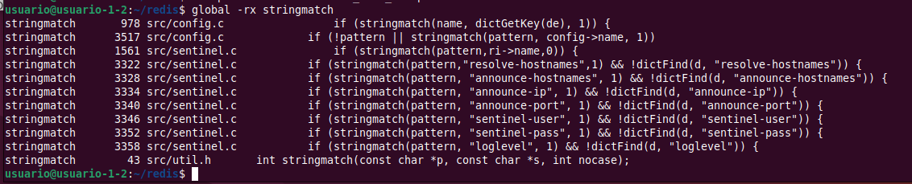


### Scope
```
cd redis
find . -name '*.[ch]' > cscope.files         # solo si no tenemos la Base de Datos
cscope -b -q -k -i cscope.files              # solo una vez

cscope -d -L3 stringmatch > referencias_stringmatch.txt
cat callers_stringmatch.txt                  # copiar o capturar
``` 
donde:
- -d → usa la base, no la reconstruye.
- -L3 → “functions calling this function” (la opción 3 del menú interactivo).
- stringmatch → el símbolo a buscar.

```
src/config.c configGetCommand 978 if (stringmatch(name, dictGetKey(de), 1)) {
src/config.c moduleConfigIteratorNext 3517 if (!pattern || stringmatch(pattern, config->name, 1))
src/sentinel.c sentinelResetMastersByPattern 1561 if (stringmatch(pattern,ri->name,0)) {
src/sentinel.c sentinelConfigGetCommand 3322 if (stringmatch(pattern,"resolve-hostnames",1) && !dictFind(d, "resolve-hostnames")) {
src/sentinel.c sentinelConfigGetCommand 3328 if (stringmatch(pattern, "announce-hostnames", 1) && !dictFind(d, "announce-hostnames")) {
src/sentinel.c sentinelConfigGetCommand 3334 if (stringmatch(pattern, "announce-ip", 1) && !dictFind(d, "announce-ip")) {
src/sentinel.c sentinelConfigGetCommand 3340 if (stringmatch(pattern, "announce-port", 1) && !dictFind(d, "announce-port")) {
src/sentinel.c sentinelConfigGetCommand 3346 if (stringmatch(pattern, "sentinel-user", 1) && !dictFind(d, "sentinel-user")) {
src/sentinel.c sentinelConfigGetCommand 3352 if (stringmatch(pattern, "sentinel-pass", 1) && !dictFind(d, "sentinel-pass")) {
src/sentinel.c sentinelConfigGetCommand 3358 if (stringmatch(pattern, "loglevel", 1) && !dictFind(d, "loglevel")) {
```


## 4. Buscad la declaración de “struct stream” en el código, tanto el archivo donde está, como la línea donde comienza. Debéis hacerlo usando las herramientas, no vale con mostrar su localización, debéis mostrar como se localiza.


## 5. Por último, vamos a utilizar una funcionalidad extraordinaria cuando nos encontramos con una función extremadamente larga y difícil de analizar (suelen ser una pesadilla). Enumerad, mediante una lista o capturas de pantalla, qué funciones llama la función ‘genRedisInfoString’.

