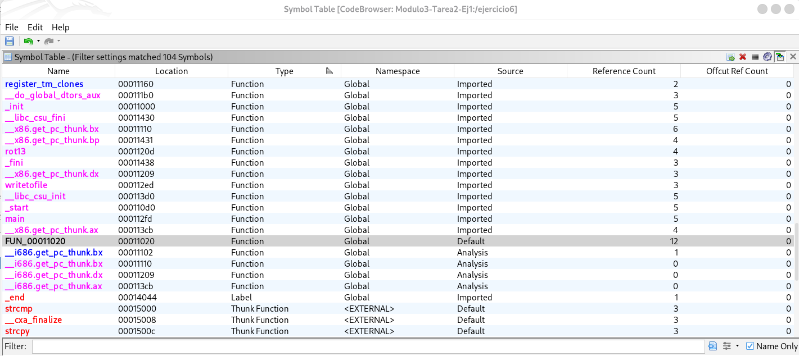
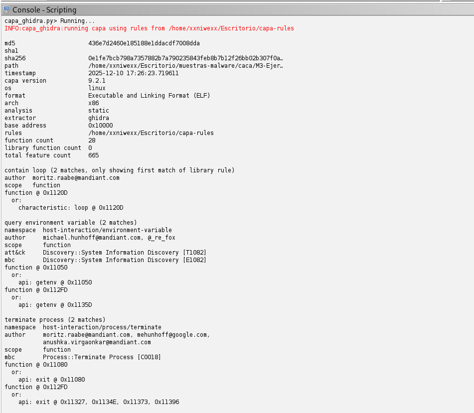

# **Ejercicio 1**

Detalles a tener en cuenta:
- que guarda las variables? en el datoa? en heap? en el stack?
- que devuelve?
- que usa
- de donde viene los parametros
- donde guarda los parametros
- las variables que usa donde las guarda? en la pila? en el heap?
- es estatic? si es estatic NO se exporta el simbolo. No se ve fuera. es como si fuera private.
- Se puede linkar los simbolos?
- Que ambito tiene?
- usa malloc? juega al despiste.
- 

## **PISTAS**
- El ensamblador es x86 32 bits.
- Comenzar desensamblando el código (ajustad la sintáxis de x86 a vuestro gusto: Intel o AT&T).
- Comenzad por ‘main’, es el punto de entrada de todos los programas, es fácil localizarlo.
- ¿Qué va haciendo ‘main’? ¿Se están cumpliendo todas las condiciones que inspecciona el programa?
- Además de ‘main’ el programa contiene otra función, el resto son llamadas a funciones externas.
- Podéis usad todas las herramientas que queráis, pero de nuevo, se resuelve con un buen desensamblador y estudiando el código parte a parte. Es decir, analizando.


## **Tarea 1**
Descubrid a través de la lectura del código de la función ‘main’ desensamblada como ejecutar el programa.

Es decir, NO ES NECESARIO MANIPULAR EL PROGRAMA. Simplemente entendiendo como funciona ‘main’ es posible adivinar como evadir las protecciones y ejecutar el programa.

Se pide:
- Detallad y explicad mostrando el código ensamblador cuales son las condiciones para que el programa se ejecute.
- Demostrad (mediante capturas de pantalla) la ejecución del programa.

### **El documento del ejercicio**
[Ejercicio](ejercicio1/Ejercicio-1.zip)
- Contraseña para descomprimir: infected

### **Ajustad la sintáxis de x86 a vuestro gusto: Intel o AT&T**

Para el análisis hea utilizado Ghidra como desensamblador, con sintaxis estilo Intel. A continuación se muestran los fragmentos de código ensamblador relevantes.

### ¿Qué va haciendo la función main?
[La función main](https://github.com/soniasalido/cybersecurity/blob/main/Documentation/Malware/Master-ENIIT-Analisis-Malware-Reversing/modulo-3-analisis-de-codigo-fuente/2-M3-Tarea2/ejercicio1/funcion-main.md)

**1. Variables:**
```
undefined main()
undefined         <UNASSIGNED>   <RETURN>
undefined4        Stack[0x0]:4   local_res0                              XREF[2]:     00011304(R), 
                                                                                      000113c7(*)  
undefined         Stack[-0x14]:1 local_14                                XREF[1]:     000113c0(*)  
undefined4        Stack[-0x24]:4 local_24                                XREF[3]:     00011365(W), 
                                                                                      00011368(R), 
                                                                                      00011381(R)
```
donde:
- `main` devuelve (`return` ) un tipo `undefined`.
- Hay tres variables de interés en la pila:
  - `local_res0`:
    - Stack[0x0]:4 → está a desplazamiento +0x0 respecto a EBP.
    - Tamaño: 4 bytes.
    - Sirve para guardar la dirección de retorno original / ajuste de pila.
    - Se usa en las instrucciones en 0x00011304 (lectura) y 0x000113c7 (en la salida de la función).
  - `local_14`:
    - Stack[-0x14]:1 → está a desplazamiento -0x14 desde EBP, ocupa 1 byte.
    - Es una variable local “de relleno” usada en la epílogo para restaurar la pila:
    - Ghidra la llama local_14 sólo por el offset.
  - `local_24`:
    - Stack[-0x24]:4 → desplazamiento -0x24, 4 bytes.
    - Ghidra la llama local_24 sólo por el offset.
    - Es una variable local real: ahí se guarda el puntero devuelto por getenv("KEY").


**2. El prólogo de la función main:**  
Continuamos analizando las siguientes insctrucciones de la función main, que son el prólogo de main ➡ preparan la pila, alinean ESP a 16 bytes y configuran los registros de base para código posición-independiente (PIC).:
```
  000112fd 8d 4c 24 04     LEA        ECX=>Stack[0x4],[ESP + 0x4]
  00011301 83 e4 f0        AND        ESP,0xfffffff0
  00011304 ff 71 fc        PUSH       dword ptr [ECX + local_res0]
  00011307 55              PUSH       EBP
  00011308 89 e5           MOV        EBP,ESP
  0001130a 56              PUSH       ESI
  0001130b 53              PUSH       EBX
  0001130c 51              PUSH       ECX
  0001130d 83 ec 1c        SUB        ESP,0x1c
  00011310 e8 fb fd        CALL       __x86.get_pc_thunk.bx                    undefined __x86.get_pc_thunk.bx()
```
donde:
- Al entrar en la función, la pila está así:
  - [ESP + 0] → dirección de retorno a _start
  - [ESP + 4] → argc
  - [ESP + 8] → argv
  - [ESP + 12] → envp
- Guarda un puntero a los argumentos originales ➡ `LEA ECX,[ESP + 0x4]` ➡ `ECX = ESP + 4` ➡ `ECX` pasa a apuntar a `argc`.
  - [ECX + 0] → argc
  - [ECX + 4] → argv
  - [ECX + 8] → envp
  - [ECX - 4] → antigua dirección de retorno
- Se alinea la pila a 16 bytes ➡ `AND ESP,0xfffffff0`.
- Se restaura la dirección de retorno sobre la pila alineada ➡ `PUSH dword ptr [ECX - 0x4]`.
  - [ECX - 4] es lo que estaba en [ESP_original + 0], es decir, la dirección de retorno original.
  - Se hace PUSH de ese valor.
- Se crea el marco de pila clásico de una función: Desde 00011307 a 001130d.
  - `PUSH EBP / MOV EBP,ESP`.
  - Se crea el marco estándar de función:
    - Se guarda el antiguo EBP.
    - EBP pasa a apuntar al “nuevo” frame.
  - PUSH ESI y PUSH EBX: Se guardan registros callee-saved (que la función debe restaurar antes de salir).
  - PUSH ECX: Se guarda en la pila el puntero a los argumentos originales (argc/argv/envp).
  - SUB ESP,0x1c: Se reserva 0x1c bytes en la pila para variables locales (local_14, local_24, etc.)
- Se inicializa EBX para código posición-independiente (PIC): `CALL __x86.get_pc_thunk.bx`.

**3. Primera Protección:**  
Número de argumentos: `argc` debe ser igual a 3:
```
0001131b 89 ce           MOV   ESI,ECX            ; ESI = puntero a argc/argv
0001131d 83 3e 03        CMP   dword ptr [ESI],0x3
00011320 74 0a           JZ    LAB_0001132c       ; si argc == 3 -> OK
00011322 83 ec 0c        SUB   ESP,0xc
00011325 6a ff           PUSH  -0x1
00011327 e8 54 fd ff ff  CALL  exit               ; si no, exit(-1)
```
Es decir, para que se ejecute el programa, tenemos que pasar 3 argumentos: `argv[0] = programa`, `argv[1]` y `argv[2])`.


**4. Segunda Protección:**  
El primer argumento `argv[1]` que es una cadena, la convierte a número con `atoi` y lo compara con `1729` ➡ 0x6c1 en hexadecimal.
```
0001132c 8b 46 04        MOV  EAX,dword ptr [ESI + 4]  ; EAX = *(ESI+4) = argv
0001132f 83 c0 04        ADD  EAX,0x4                  ; EAX = &argv[1]
00011332 8b 00           MOV  EAX,dword ptr [EAX]      ; EAX = argv[1]
00011334 83 ec 0c        SUB  ESP,0xc
00011337 50              PUSH EAX                      ; push argv[1]
00011338 e8 73 fd ff ff  CALL atoi                     ; atoi(argv[1])
0001133d 83 c4 10        ADD  ESP,0x10
00011340 ba c1 06 00 00  MOV  EDX,0x6c1                ; 0x6c1 = 1729
00011345 39 d0           CMP  EAX,EDX                  ; atoi(argv[1]) ?= 1729
00011347 74 0a           JZ   LAB_00011353             ; si es igual -> OK
00011349 83 ec 0c        SUB  ESP,0xc
0001134c 6a ff           PUSH -0x1
0001134e e8 2d fd ff ff  CALL exit                     ; si no, exit(-1)
```

**5. Tercera Protección:**  
Debe existir una variable de entorno concreta:
```
LAB_00011353:
00011353 83 ec 0c        SUB  ESP,0xc
00011356 8d 83 2b e0 ff ff  LEA EAX,[EBX + 0xffffe02b] ; EAX = &DAT_0001202b
                                                       ; (nombre de la variable de entorno, empieza por 'K')
0001135c 50              PUSH EAX                      ; push nombre
0001135d e8 ee fc ff ff  CALL getenv                  ; getenv(nombre)
00011362 83 c4 10        ADD  ESP,0x10
00011365 89 45 e4        MOV  [EBP + local_24],EAX    ; guardar retorno de getenv
00011368 83 7d e4 00     CMP  dword ptr [EBP + local_24],0x0
0001136c 75 0a           JNZ  LAB_00011378            ; si != NULL -> OK
0001136e 83 ec 0c        SUB  ESP,0xc
00011371 6a ff           PUSH -0x1
00011373 e8 08 fd ff ff  CALL exit                    ; si NULL, exit(-1)
```
donde:
- Si la variable de entorno no existe (getenv devuelve NULL), termina con exit(-1).​

La cadena en DAT_0001202b:
```
DAT_0001202b
0001202b 4b  K
0001202c 45  E
0001202d 59  Y
0001202e 00  \0
```
La cadena en DAT_0001202b es: "KEY".


Resumiendo, la llamada de main:
```
00011356 8d 83 2b e0 ff ff  LEA EAX,[EBX + 0xffffe02b] ; → "KEY"
0001135c 50                 PUSH EAX
0001135d e8 ee fc ff ff     CALL getenv                 ; getenv("KEY")
```
Lo que hace exactamente es: `char *env = getenv("KEY");`. Debe existir una variable de entorno KEY definida y correcta. Con un valor determinado que se explica justo en el siguiente punto.


**6. Cuarta Protección:**  
Esa variable de entorno debe valer exactamente `HOLAKASE`:
```
00011378 8b 83 38 00 00 00  MOV EAX,dword ptr [EBX + 0x38] ; EAX = envkey = 0x12008
                              ; en 0x12008 está la cadena "HOLAKASE"
0001137e 83 ec 08           SUB ESP,0x8
00011381 ff 75 e4           PUSH dword ptr [EBP + local_24] ; push env
00011384 50                 PUSH EAX                        ; push "HOLAKASE"
00011385 e8 a6 fc ff ff     CALL strcmp                     ; strcmp("HOLAKASE", env)
0001138a 83 c4 10           ADD  ESP,0x10
0001138d 85 c0              TEST EAX,EAX
0001138f 74 0a              JZ   LAB_0001139b               ; si devuelve 0 -> OK
00011391 83 ec 0c           SUB  ESP,0xc
00011394 6a ff              PUSH -0x1
00011396 e8 e5 fc ff ff     CALL exit                       ; si != 0, exit(-1)
```

**7. Finalización del Programa:**  
> !Important:  
> En este main vemos que hay 4 condiciones importantes y si alguna falla se hace `exit(-1)` inmediatamente.
> Así que si llegamos a ejecutar la instrucción `puts(rot13(argv[2]))`, es que todas se han cumplido.
```
LAB_0001139b:
0001139b 8b 46 04        MOV  EAX,dword ptr [ESI + 4]  ; EAX = argv
0001139e 83 c0 08        ADD  EAX,0x8                  ; &argv[2]
000113a1 8b 00           MOV  EAX,dword ptr [EAX]      ; EAX = argv[2]
000113a3 83 ec 0c        SUB  ESP,0xc
000113a6 50              PUSH EAX                      ; push argv[2]
000113a7 e8 61 fe ff ff  CALL rot13                   ; rot13(argv[2])
000113ac 83 c4 10        ADD  ESP,0x10
000113af 83 ec 0c        SUB  ESP,0xc
000113b2 50              PUSH EAX                      ; resultado de rot13
000113b3 e8 b8 fc ff ff  CALL puts                    ; puts(rot13(argv[2]))
```
donde:
- El segundo argumento `(argv[2])` se pasa a la función `rot13`, y el resultado se imprime con `puts`.
- rot13 es el clásico cifrado de sustitución que desplaza letras 13 posiciones en el alfabeto (tanto para codificar como para decodificar).

**Resumen de la función main escrita en C:**  
```c
int main(int argc, char **argv) {
    if (argc != 3)
        exit(-1);

    if (atoi(argv[1]) != 1729)
        exit(-1);

    char *env = getenv(NOMBRE_ENV);   // NOMBRE_ENV = cadena en DAT_0001202b = KEY
    if (env == NULL)
        exit(-1);

    if (strcmp("HOLAKASE", env) != 0)
        exit(-1);

    char *out = rot13(argv[2]);
    puts(out);

    return 0;
}
```


## Cómo ejecutar el programa
Para que el programa se ejecute, es decir, llegar a `rot13 + puts` se necesitan evadir "las protecciones" que hemos estudiado en el punto anterior.

### La variable de entorno
Creamos una variable de entorno llamada Key y su valor = HOLAKASE:
```
$ export KEY=HOLAKASE
```
donde:
- KEY es la variable de entorno que exige el programa.

### Ejecución del programa con 2 argumentos
```
$ ./programa 1729 HOLA
UBYN
```
donde:
- 1729 cumple la comparación con 0x6c1.
- HOLA es argv[2], al que se aplica ROT13 →
- UBYN, que es lo que se imprime.


### Breakpoints intresantes en x32dbg
```
# Inicio de main
b *0x000112fd

# Comprobar argc == 3
b *0x0001131d
b *0x00011320

# Comprobar atoi(argv[1]) == 1729
b *0x00011338
b *0x00011345
b *0x00011347

# Comprobar getenv("KEY") != NULL
b *0x00011356
b *0x0001135d
b *0x00011365
b *0x00011368

# Comprobar strcmp("HOLAKASE", KEY) == 0
b *0x00011378
b *0x00011385
b *0x0001138d
b *0x0001138f

# rot13 y salida
b *0x000113a1
b *0x000113a7
b *0x000113b3

# Para localizar rápidamente violaciones de protección
b exit
b rot13
b strcmp
b getenv
b atoi
```


## Tarea 2
El programa, además de “main”, solo tiene una única función. Encontradla y explicad que hace y como lo hace esta función mostrando el código ensamblador correspondiente.


## Ananlisis con las herramientas de analisis de codigo de la asignatura
xxxxxxx

### Identificar las funciones "Globales" y "Propias"
Nos basaremos en la tabla de símbolos extraída del archivo para encontrar la otra función definida por el usuario, además de main. De la Tabla de símbolos:
- Descartamos las funciones "Thunk" y "External" ya que son funciones de librerías estándar (libc) que el programa "toma prestadas".
- Descartamos las funciones del Compilador/Sistema: tienen nombres con guiones bajos. Son el "pegamento" que añade el compilador (GCC) para que el programa arranque y termine correctamente en Linux.
- Identificamos las funciones "Globales" y "Propias". Nos quedamos con las filas que cumplen tres condiciones:
  - Type: Indica "Function": Es código real, no un salto/thunk.
  - Namespace: Indica "Global". Está accesible.
  - Name: Tiene un nombre legible y sin guiones bajos iniciales (es una convención humana estándar).




### Funciones de usuario interesantes destacar
#### 1. rot13:
donde:
- Es llamada por la función main.
- Devuelve una nueva cadena en memoria dinámica que es la entrada pasada por ROT13.
- Solo rota letras ASCII (A-Z, a-z); los demás caracteres se quedan igual.
- Si el argumento es NULL o malloc falla, devuelve NULL.


#### 2. writetofile:
donde:
- No toca argumentos.
- No interactúa con ficheros.
- No modifica estado observable salvo, como mucho, cargar una dirección en EAX y devolver.
- Aunque aparezca en XREFs (Entry Point, tablas internas), su cuerpo no afecta al flujo ni a las condiciones que debe satisfacer el programa para que termine la ejecución.
- El nombre de la función parece un señuelo estupendo para despistar.

#### 3. fun_00011020:
Esta función es la entrada 0 de la PLT (Procedure Linkage Table), el trampolín que usa el enlazador dinámico para resolver llamadas a funciones externas (printf, exit, strcmp, etc.). Sirve para resolver en tiempo de ejecución las funciones importadas. Luego no parace relevante para las comprobaciones de protección del programa.


**<mark>El ejercicio indica que el programa, además de “main”, solo tiene una única función.</mark>** **Parece que se refiere a la función `rot13` ya que las otras funciones:**
- FUN_00011020 (PLT)
- writetofile (vacía, solo PIC)...
No son lógica del programa.


### ¿Qué hace rot13 y cómo lo hace?
- Recibe un char * (una cadena).
- Si el puntero es NULL, devuelve NULL.
- Calcula la longitud de la cadena con strlen.
- Reserva memoria dinámica con malloc(strlen(s)) y copia ahí la cadena con strcpy.
- Recorre la copia carácter a carácter:
  - Si es letra minúscula a..z o mayúscula A..Z, aplica ROT13:
    - a..m / A..M → suma 13.
    - n..z / N..Z → resta 13.
  - Si no es letra, lo deja igual.
- Devuelve el puntero a la nueva cadena transformada.

**1. Comprobación de puntero nulo y cálculo de longitud + malloc:**  
```
0001121f 83 7d 08 00        CMP  dword ptr [EBP + 0x8],0x0
00011223 75 0a              JNZ  LAB_0001122f
00011225 b8 00 00 00 00     MOV  EAX,0x0           ; return NULL
0001122a e9 b9 00 00 00     JMP  LAB_000112e8

LAB_0001122f:
00011232 ff 75 08           PUSH dword ptr [EBP + 0x8]
00011235 e8 56 fe ff ff     CALL strlen
...
00011240 50                 PUSH EAX               ; size
00011241 e8 1a fe ff ff     CALL malloc
...
00011249 89 45 f0           MOV  [EBP + local_14],EAX ; dest
0001124c 83 7d f0 00        CMP  [EBP + local_14],0x0
00011250 0f 84 8f 00 00 00  JZ   LAB_000112e5      ; si malloc falla: return NULL
```

**2. Copia de la cadena original en el buffer nuevo:**  
```
00011256 83 ec 08           SUB  ESP,0x8
00011259 ff 75 08           PUSH dword ptr [EBP + 0x8]    ; src (s)
0001125c ff 75 f0           PUSH dword ptr [EBP + local_14]; dest
0001125f e8 dc fd ff ff     CALL strcpy
00011267 8b 45 f0           MOV  EAX,[EBP + local_14]
0001126a 89 45 f4           MOV  [EBP + local_10],EAX     ; p = dest
```

**3. Bucle sobre la cadena:**  
```
LAB_000112db:
000112db 8b 45 f4           MOV  EAX,[EBP + local_10] ; p
000112de 0f b6 00           MOVZX EAX,byte ptr [EAX]  ; *p
000112e1 84 c0              TEST AL,AL
000112e3 75 8a              JNZ  LAB_0001126f         ; mientras *p != 0
```

**4. Detección de letras y decisión +13/−13:**  
```
LAB_0001126f:
    ; minúsculas 'a'..'z'
00011275 3c 60              CMP  AL,0x60          ; '`'
00011277 7e 0a              JLE  LAB_00011283     ; si <= '`', no minúscula
...
0001127f 3c 7a              CMP  AL,0x7a          ; 'z'
00011281 7e 14              JLE  LAB_00011297     ; en 'a'..'z'

LAB_00011283:
    ; mayúsculas 'A'..'Z'
00011289 3c 40              CMP  AL,0x40          ; '@'
0001128b 7e 4a              JLE  LAB_000112d7     ; no letra
...
00011293 3c 5a              CMP  AL,0x5a          ; 'Z'
00011295 7f 40              JG   LAB_000112d7     ; no letra

LAB_00011297:
    ; decidir sumar o restar 13
0001129d 3c 6d              CMP  AL,0x6d          ; 'm'
0001129f 7f 14              JG   LAB_000112b5     ; parte alta → restar 13
...
000112a7 3c 4d              CMP  AL,0x4d          ; 'M'
000112a9 7e 1c              JLE  LAB_000112c7     ; parte baja → sumar 13
```

**5. Aplicación de ROT13 (+13 o −13):**  
```
LAB_000112b5:               ; restar 13
000112bb 83 e8 0d           SUB  EAX,0xd
...
000112c3 88 10              MOV  byte ptr [EAX],DL ; *p = c - 13

LAB_000112c7:               ; sumar 13
000112cd 83 c0 0d           ADD  EAX,0xd
...
000112d5 88 10              MOV  byte ptr [EAX],DL ; *p = c + 13
```

**6. Incremento del puntero y retorno:**
```
LAB_000112d7:
000112d7 83 45 f4 01        ADD [EBP + local_10],0x1 ; p++
...
LAB_000112e5:
000112e5 8b 45 f0           MOV EAX,[EBP + local_14] ; return dest
000112eb c9                 LEAVE
000112ec c3                 RET
```


## Aplicamos Reglas de capa al ejercicio

donde:
- La dirección 0x1120D es el inicio de rot13. En rot13 hay claramente un bucle que recorre la cadena carácter a carácter.
  - Las reglas de capa tienen una regla muy genérica “contain loop” que se dispara cuando detecta características de bucle (saltos condicionales hacia atrás, etc.).
- Capa detecta que el binario consulta variables de entorno: `getenv("KEY")`.
- Capa detecta `terminate process`. Capa ha encontrado varias llamadas a exit.
- Consultar variable de entorno → típico en malware para leer configuración / entorno.
- Terminar proceso con exit en varios puntos → coincide con reglas genéricas de “terminate process”.
- Bucle sobre datos → característica típica de transformaciones, cifrados, etc. (ROT13 en tu caso).
- Por eso capa saca etiquetas como:
  - host-interaction/environment-variable
  - host-interaction/process/terminate
  - Discovery::System Information Discovery [T1082]
  - Process::Terminate Process [C0018]


-----------------------------------------
# Ejercicio 2
Para este ejercicio emplearemos el código fuente del ransomware Babuk, el cual NO DEBEIS COMPILAR NI MUCHO MENOS EJECUTAR.

Babuk es un ransomware que tuvo un significativo auge a comienzos de 2021 y cuyo código fue liberado de forma súbita por sus creadores. Este malware es multiplataforma, existiendo versiones para Linux, Windows, routers y varios dispositivos IoT. Su código está escrito en los lenguajes Go y C.

El código fuente está disponible en el siguiente repositorio: https://github.com/Hildaboo/BabukRansomwareSourceCode


+++++++++++++++++++++++++++++++++++++++++
- crear una BD simbolica
- Navegar a traves del codigo fuente
- ve como funciona el malware visto desde la perspectiva del alto nivel
+++++++++++++++++++++++++++++++++++++++++


## Tarea 1
Una de las características del malware es que ejecuta una rutina o función que detiene ciertos procesos del sistema para evitar su detección por parte de estos. En otras ocaciones suele detectar la presencia de herramientas de análisis y detiene su propia ejecución o la camufla para evitar ser
analizada.

Esta tarea consiste en la localización de la función (ojo, no donde esta es llamada) que detiene los procesos en la versión para sistemas Windows del malware Babuk.

Es decir:
- Localizad el código de la función (de nuevo, NO DONDE ES LLAMADA).
- Realizad un análisis de código de la función.
- Enumerar los procesos que tiene en cuenta esta función para que sean detenenidos.

Documentad profusamente el proceso que habéis realizado (capturas de pantalla, evidencias). Cuanto más detallada (en calidad) esté hecho el análisis mayor será la puntuación.

## Tarea 2
Aquí (https://github.com/Hildaboo/BabukRansomwareSourceCode/blob/main/nas/enc/main.go#L810), se encuentra la función “main” del código del cifrador escrito en Go de la versión para dispositivos NAS de Babuk.

Esa función representa el punto de entrada del ejecutable. Dicho ejecutable es el que utilizan los cibercriminales para cifrar un sistema. Es decir, explotan un sistema, filtran el ejecutable y este se encarga de ir cifrando todos los archivos de la víctima en ese sistema.

Comentad el funcionamiento de la función referenciada con todo el detalle posible. Si no entendéis algunas partes saltadlas y proseguid o al menos comentad lo que creeis que es.

Código: https://github.com/Hildaboo/BabukRansomwareSourceCode/blob/main/nas/enc/main.go#L810
