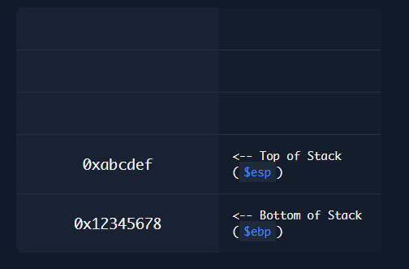
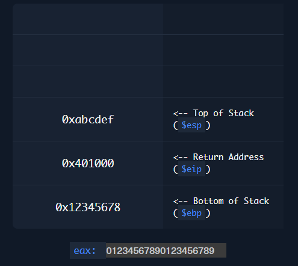

# Desbordamientos de Búfer

En la explotación binaria, nuestro objetivo principal es subvertir la ejecución del binario de una manera que nos beneficie. Los desbordamientos de búfer son el tipo más común de explotación binaria, pero existen otros tipos, como la explotación de cadenas de formato (Format String) y la explotación del Heap.

Un desbordamiento de búfer ocurre cuando un programa recibe datos más largos de lo esperado, de modo que esos datos sobrescriben todo el espacio de memoria del búfer en la pila. Esto puede sobrescribir el siguiente puntero de instrucción (EIP/RIP), lo que hace que el programa falle porque intentará ejecutar instrucciones en una dirección de memoria inválida. Forzar al programa a fallar es el ejemplo más básico de explotación de desbordamientos de búfer, conocido como un ataque de Denegación de Servicio (DoS).

Otro ataque básico consiste en sobrescribir un valor en la pila para cambiar el comportamiento del programa. Por ejemplo, si un programa de exámenes tuviera una vulnerabilidad de desbordamiento de búfer, podríamos sobrescribir el búfer lo suficiente para sobrescribir nuestra puntuación. Dado que la puntuación está almacenada en la pila en este ejemplo, podríamos aprovechar esta falla para cambiarla.

Si somos un poco más sofisticados, podemos cambiar la dirección del EIP hacia una instrucción que ejecute nuestro shellcode. Esto permitiría ejecutar cualquier comando que queramos, en lugar de solo hacer que el programa falle; esto se conoce como saltar al shellcode.

Con protecciones de memoria más avanzadas, puede que no sea posible cargar nuestro shellcode completo y apuntar a él. En ese caso, podemos usar una combinación de instrucciones del propio binario para ejecutar una función concreta y sobrescribir varios punteros para cambiar el flujo de ejecución del programa. Esto se conoce como un ataque Return Oriented Programming (ROP).

Finalmente, los programas y sistemas operativos modernos pueden usar el Heap en lugar de la pila para almacenar memoria de búfer, lo que requeriría desbordamientos o explotación del Heap.

# Desbordamiento de la Pila (Stack Overflow)

Comencemos demostrando cómo funciona la pila al almacenar datos. La pila tiene un diseño `LIFO (Last-In, First-Out)`, lo que significa que solo podemos extraer (pop) el último elemento insertado (push). Si insertamos un elemento, quedará en la parte superior de la pila. Si extraemos algo, será ese elemento superior el que se retire.

La siguiente tabla muestra como funciona el stack:


xxx



Lo que ocurre cuando escribimos MÁS allá del búfer (desbordamiento):
```css
            Búfer válido
            ▼
0xabcdef   [ 01 | 23 | 45 | 67 ]
           [ 89 | 01 | 23 | 45 ]  ← comienzo del desbordamiento
           -----------------------
0x401000   [ 67 | 89 | 01 | 23 ]  ← 🔥 EIP sobrescrito
           -----------------------
0x12345678 [ 45 | 67 | 89 | 01 ]  ← ⚠️ EBP sobrescrito
``` 
