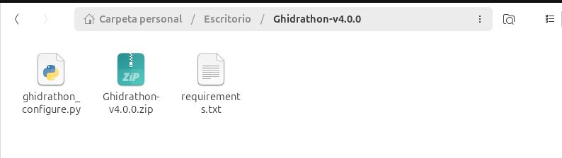
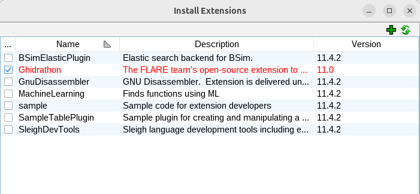

# Plugin Capa para Ghidra
El plugin de capa para Ghidra (capa_ghidra.py, capa_explorer.py) está escrito para Python 3 y usa la librería capa (también Python 3). Para poder usarlo en Ghidra necesitamos un "puente" que es Ghidrathon. Ghidra trae de serie scripts en Java y en Python 2 (Jython). Ghidrathon usa Jep (Java Embedded Phyton) como "puente" entre Java (Ghidra) y phython3.


[Ghidrathon](https://github.com/mandiant/Ghidrathon), fue creado por el equipo FLARE de Mandiant, añade a Ghidra:
- Intérprete interactivo de Python 3 dentro de la ventana de Ghidra. 
- Posibilidad de escribir y ejecutar scripts de Ghidra en Python 3 desde el Script Manager.
- Soporte para usar librerías externas (capstone, unicorn, angr, **capa**, etc.) como si fuera un entorno Python normal. 


## Requerimientos
- Es preciso la instalación previa de:
        - Python3.
        - Ghidra.
        - Java.


- Establecer las variables de entorno de Java:
  - Las variables típicas de Java son:
    - JAVA_HOME → ubicación del JDK/JRE
    - PATH → agregar el bin del JDK

Si no están establecidas, es preciso hacerlo:
```c
nano ~/.bashrc
```

Agregar al final:
```c
# Variables de entorno de Java
export JAVA_HOME=/usr/lib/jvm/java-17-openjdk-amd64
export PATH=$JAVA_HOME/bin:$PATH
```


## Instalacion de Ghidrathon

### Creación de un entorno Python3:
```
cd RUTA_Ghidra
python3 -m venv ghidra-py
source ghidra-py/bin/activate
pip install --upgrade pip
```


### Instalamos Ghidrathon
Descargamos Ghidrathon en nuestro Ghidra environment: https://github.com/mandiant/Ghidrathon/releases
Descomprimimos y ejecutamos:
```
cd RUTA_Ghidra
(seguimos en el entorno virtual de python)
pip install -r RUTA_Ghidrathon/requirements.txt
python RUTA_Ghidrathon/ghidrathon_configure.py RUTA_Ghidra
```

Verificamos que crea dentro de la carpeta de ghidra, un documento llamado `ghidrathon.save` que establece rutas necesarias para el correcto funcionamiento.

### Instalar capa en el mismo Python que usa Ghidrathon
```
source ~/ghidra-py/venv/bin/activate
pip install --upgrade flare-capa
deactivate
```

### Comprobamos la version de capa instalado:
```
RUTA_Ghidra/ghidra-py/bin/capa --version
```

### Descargamos las reglas de capa
```
git clone https://github.com/mandiant/capa-rules.git ~/capa-rules
```

### Instalamos la extensión de Ghidrathon dentro de ghidra
Tenemos que instalar el fichero .zip que está dentro de la carpeta Ghidrathon.




Para ello abrimos Ghidra, Menú File > Install Extensions >  hacer click en el boton verde que tiene un `+` > buscamos la carpeta donde está el fichero .zip > Click Ok





-------------------------------------------------
## Instalacion de plugin CAPA para Ghidra
El ZIP del plugin capa explorer no viene con Ghidra, tenemos que descargarlo del repositorio oficial de capa en GitHub.

Descargamos `capa_explorer.py` y `capa_ghidra.py`: https://github.com/mandiant/capa/tree/master/capa/ghidra


Crear la carpeta de scripts en Ghidra e introducimos estos ficheros dentro.


Pulsamos en manejar scripts directories para indicar este nuevo directorio que acabamos de crear.


Ejecutamos Ghidra


```
# Run capa against loaded Ghidra database and render results in Ghidra Console window
# @author Mike Hunhoff (mehunhoff@google.com)
# @category Python 3.capa

# Copyright 2023 Google LLC
#
# Licensed under the Apache License, Version 2.0 (the "License");
# you may not use this file except in compliance with the License.
# You may obtain a copy of the License at
#
#     http://www.apache.org/licenses/LICENSE-2.0
#
# Unless required by applicable law or agreed to in writing, software
# distributed under the License is distributed on an "AS IS" BASIS,
# WITHOUT WARRANTIES OR CONDITIONS OF ANY KIND, either express or implied.
# See the License for the specific language governing permissions and
# limitations under the License.

import sys
import logging
import pathlib
import argparse

import capa
import capa.main
import capa.rules
import capa.ghidra.helpers
import capa.render.default
import capa.capabilities.common
import capa.features.extractors.ghidra.extractor

logger = logging.getLogger("capa_ghidra")


def run_headless():
    parser = argparse.ArgumentParser(description="The FLARE team's open-source tool to integrate capa with Ghidra.")

    parser.add_argument(
        "rules",
        type=str,
        help="path to rule file or directory",
    )
    parser.add_argument(
        "-v", "--verbose", action="store_true", help="enable verbose result document (no effect with --json)"
    )
    parser.add_argument(
        "-vv", "--vverbose", action="store_true", help="enable very verbose result document (no effect with --json)"
    )
    parser.add_argument("-d", "--debug", action="store_true", help="enable debugging output on STDERR")
    parser.add_argument("-q", "--quiet", action="store_true", help="disable all output but errors")
    parser.add_argument("-j", "--json", action="store_true", help="emit JSON instead of text")

    script_args = list(getScriptArgs())  # type: ignore [name-defined] # noqa: F821
    if not script_args or len(script_args) > 1:
        script_args = []
    else:
        script_args = script_args[0].split()
        for idx, arg in enumerate(script_args):
            if arg.lower() == "help":
                script_args[idx] = "--help"

    args = parser.parse_args(args=script_args)

    if args.quiet:
        logging.basicConfig(level=logging.WARNING)
        logging.getLogger().setLevel(logging.WARNING)
    elif args.debug:
        logging.basicConfig(level=logging.DEBUG)
        logging.getLogger().setLevel(logging.DEBUG)
    else:
        logging.basicConfig(level=logging.INFO)
        logging.getLogger().setLevel(logging.INFO)

    logger.debug("running in Ghidra headless mode")

    rules_path = pathlib.Path(args.rules)

    logger.debug("rule path: %s", rules_path)
    rules = capa.rules.get_rules([rules_path])

    meta = capa.ghidra.helpers.collect_metadata([rules_path])
    extractor = capa.features.extractors.ghidra.extractor.GhidraFeatureExtractor()

    capabilities = capa.capabilities.common.find_capabilities(rules, extractor, False)

    meta.analysis.feature_counts = capabilities.feature_counts
    meta.analysis.library_functions = capabilities.library_functions
    meta.analysis.layout = capa.loader.compute_layout(rules, extractor, capabilities.matches)

    if capa.capabilities.common.has_static_limitation(rules, capabilities, is_standalone=True):
        logger.info("capa encountered warnings during analysis")

    if args.json:
        print(capa.render.json.render(meta, rules, capabilities.matches))  # noqa: T201
    elif args.vverbose:
        print(capa.render.vverbose.render(meta, rules, capabilities.matches))  # noqa: T201
    elif args.verbose:
        print(capa.render.verbose.render(meta, rules, capabilities.matches))  # noqa: T201
    else:
        print(capa.render.default.render(meta, rules, capabilities.matches))  # noqa: T201

    return 0


def run_ui():
    logging.basicConfig(level=logging.INFO)
    logging.getLogger().setLevel(logging.INFO)

    rules_dir: str = ""
    try:
        selected_dir = askDirectory("Choose capa rules directory", "Ok")  # type: ignore [name-defined] # noqa: F821
        if selected_dir:
            rules_dir = selected_dir.getPath()
    except RuntimeError:
        # RuntimeError thrown when user selects "Cancel"
        pass

    if not rules_dir:
        logger.info("You must choose a capa rules directory before running capa.")
        return capa.main.E_MISSING_RULES

    verbose = askChoice(  # type: ignore [name-defined] # noqa: F821
        "capa output verbosity", "Choose capa output verbosity", ["default", "verbose", "vverbose"], "default"
    )

    rules_path: pathlib.Path = pathlib.Path(rules_dir)
    logger.info("running capa using rules from %s", str(rules_path))

    rules = capa.rules.get_rules([rules_path])

    meta = capa.ghidra.helpers.collect_metadata([rules_path])
    extractor = capa.features.extractors.ghidra.extractor.GhidraFeatureExtractor()

    capabilities = capa.capabilities.common.find_capabilities(rules, extractor, True)

    meta.analysis.feature_counts = capabilities.feature_counts
    meta.analysis.library_functions = capabilities.library_functions
    meta.analysis.layout = capa.loader.compute_layout(rules, extractor, capabilities.matches)

    if capa.capabilities.common.has_static_limitation(rules, capabilities, is_standalone=False):
        logger.info("capa encountered warnings during analysis")

    if verbose == "vverbose":
        print(capa.render.vverbose.render(meta, rules, capabilities.matches))  # noqa: T201
    elif verbose == "verbose":
        print(capa.render.verbose.render(meta, rules, capabilities.matches))  # noqa: T201
    else:
        print(capa.render.default.render(meta, rules, capabilities.matches))  # noqa: T201

    return 0


def main():
    if not capa.ghidra.helpers.is_supported_ghidra_version():
        return capa.main.E_UNSUPPORTED_GHIDRA_VERSION

    if not capa.ghidra.helpers.is_supported_file_type():
        return capa.main.E_INVALID_FILE_TYPE

    if not capa.ghidra.helpers.is_supported_arch_type():
        return capa.main.E_INVALID_FILE_ARCH

    if isRunningHeadless():  # type: ignore [name-defined] # noqa: F821
        return run_headless()
    else:
        return run_ui()


if __name__ == "__main__":
    if sys.version_info < (3, 10):
        from capa.exceptions import UnsupportedRuntimeError

        raise UnsupportedRuntimeError("This version of capa can only be used with Python 3.10+")
    sys.exit(main())
```


### Editar el script o introducir rutas al ejecutarlo
Al ejecutar capa_explorer.py o capa_ghidra.py Si es la primera vez, debe pedirnos el path a capa y rules dir. Si no lo hacen, puedes abrir el script y buscar las variables tipo:
```
capa_path = "/ruta/a/capa"
rules_dir = "/ruta/a/capa-rules"
```

### Vemos su funcionamiento
Una vez instalado, ejecutamos el script. Aparece el informe que genera la herramienta capa. Podemos acceder a las partes que detecta este informe, haciendo doble click en ellas.
)
