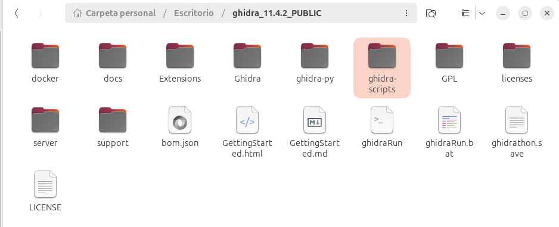
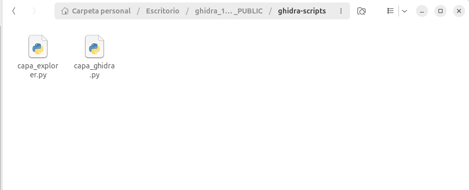
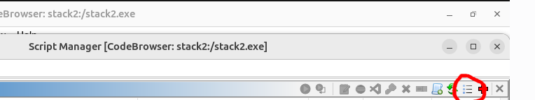
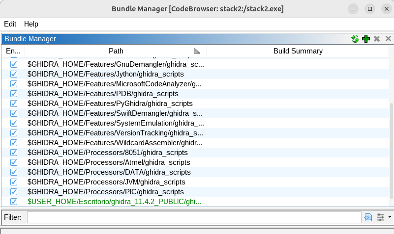
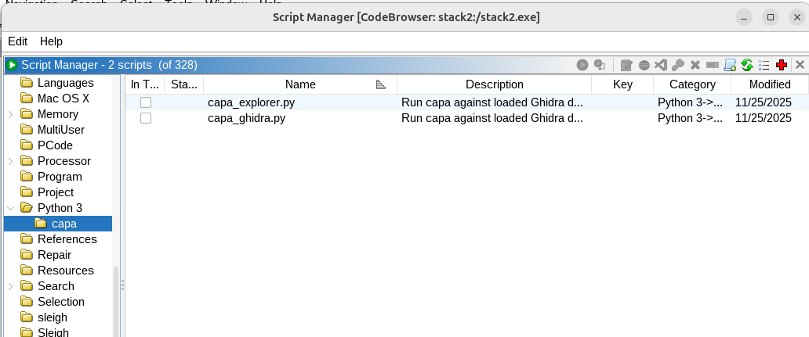
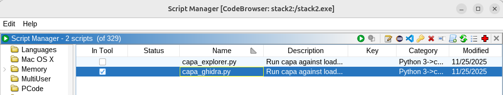
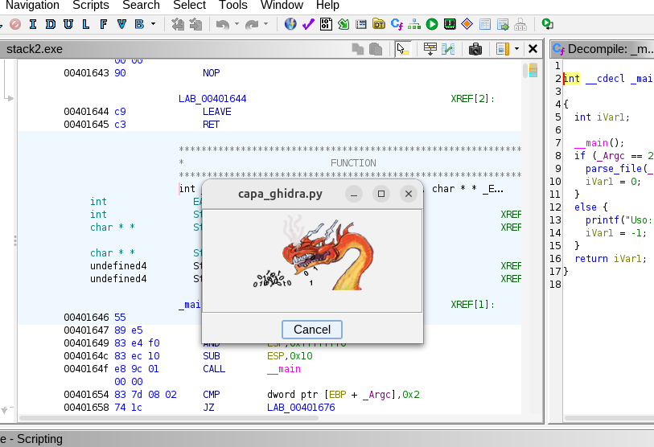
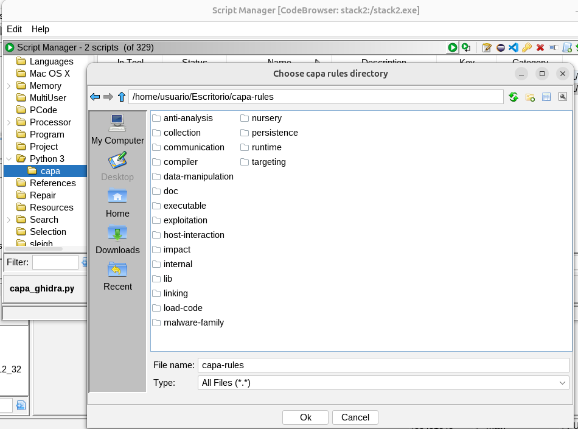
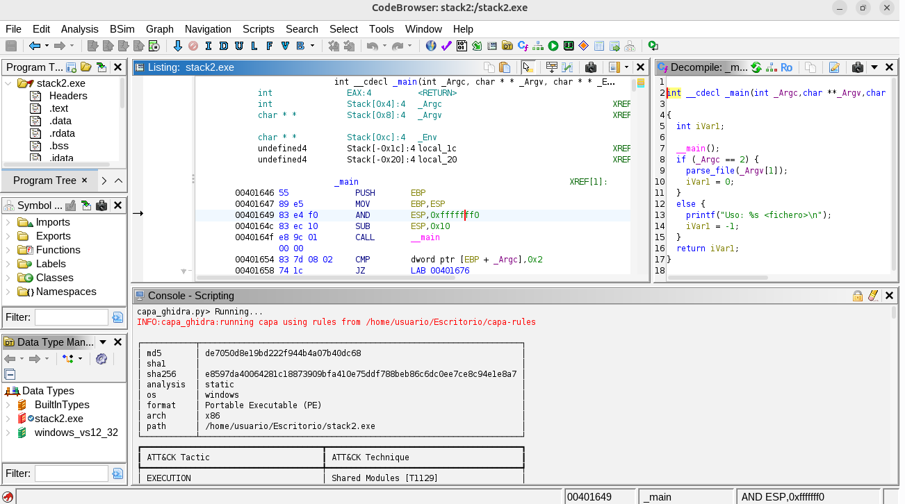
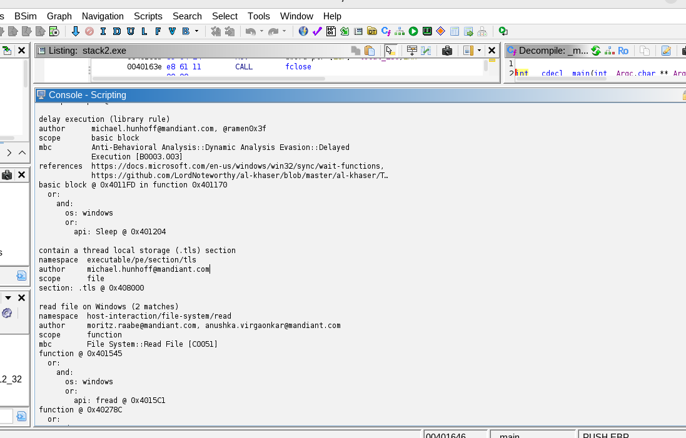

# Plugin Capa para Ghidra
El plugin de capa para Ghidra (capa_ghidra.py, capa_explorer.py) está escrito para Python 3 y usa la librería capa (también Python 3). Para poder usarlo en Ghidra necesitamos un "puente" que es Ghidrathon. Ghidra trae de serie scripts en Java y en Python 2 (Jython). Ghidrathon usa Jep (Java Embedded Phyton) como "puente" entre Java (Ghidra) y phython3.


[Ghidrathon](https://github.com/mandiant/Ghidrathon), fue creado por el equipo FLARE de Mandiant, añade a Ghidra:
- Intérprete interactivo de Python 3 dentro de la ventana de Ghidra. 
- Posibilidad de escribir y ejecutar scripts de Ghidra en Python 3 desde el Script Manager.
- Soporte para usar librerías externas (capstone, unicorn, angr, **capa**, etc.) como si fuera un entorno Python normal. 


## Beneficios del uso de capa
Capa analiza el binario que ya tenemos cargado en Ghidra. Se usa básicamente para entender rápido qué hace un binario, describiendo sus comportamientos y ayudandonos a encontrar rápido las partes importantes del código.


## Requerimientos
- Es preciso la instalación previa de:
  - Python3.
  - Ghidra.
  - Java.


- Establecer las variables de entorno de Java:
  - Las variables típicas de Java son:
    - JAVA_HOME → ubicación del JDK/JRE
    - PATH → agregar el bin del JDK

Si no están establecidas, es preciso hacerlo:
```c
nano ~/.bashrc
```

Agregar al final:
```c
# Variables de entorno de Java
export JAVA_HOME=/usr/lib/jvm/java-17-openjdk-amd64
export PATH=$JAVA_HOME/bin:$PATH
```


## Instalacion de Ghidrathon

### Creación de un entorno virtual en Python3
```
cd RUTA_Ghidra
python3 -m venv ghidra-py
source ghidra-py/bin/activate
pip install --upgrade pip
```


### Instalamos Ghidrathon
Descargamos Ghidrathon: https://github.com/mandiant/Ghidrathon/releases
Descomprimimos y ejecutamos:
```
(debemos seguir en el entorno virtual de python)
pip install -r RUTA_Ghidrathon/requirements.txt
python RUTA_Ghidrathon/ghidrathon_configure.py RUTA_Ghidra
```

Verificamos que crea dentro de la carpeta de ghidra, un documento llamado `ghidrathon.save` que establece las rutas necesarias para el correcto funcionamiento.

### Instalar capa en el mismo Python que usa Ghidrathon
```
(debemos estar en el entorno virtual de python)
source RUTA_Ghidra/ghidra-py/venv/bin/activate
pip install --upgrade flare-capa
deactivate
```

### Comprobamos la version de capa instalado:
```
RUTA_Ghidra/ghidra-py/bin/capa --version
```

### Descargamos las reglas de capa
Yo lo he guardado dentro de la carpeta de ghidra (más adelante nos pedirá esta dirección):
```
git clone https://github.com/mandiant/capa-rules.git RUTA_Ghidra/capa-rules
```

### Instalamos la extensión de Ghidrathon dentro de ghidra
Tenemos que instalar el fichero .zip que está dentro de la carpeta Ghidrathon.


Para ello abrimos Ghidra, en la primera ventana que nos aparece: Menú File > Install Extensions >  hacer click en el boton verde que tiene un `+` > buscamos la carpeta donde está el fichero .zip > Click Ok


-------------------------------


-------------------------------


-------------------------------------------------
## Instalacion de plugin CAPA para Ghidra
El ZIP del plugin capa explorer no viene con Ghidra, tenemos que descargarlo del repositorio oficial de capa en GitHub.

Descargamos `capa_explorer.py` y `capa_ghidra.py`: https://github.com/mandiant/capa/tree/master/capa/ghidra

Creamos la carpeta de scripts en Ghidra e introducimos estos ficheros dentro.





-------------------------------



-------------------------------

Abrimos un binario con ghidra y en la ventana que vemos el código decompilado: Menú window > Opción: Script Manager


-------------------------------

Buscamos el botón: `Manage script Directories`:



-------------------------------

Pulsamos el botón `+ `para añadir el directorio donde están los ficheros `capa_explorer.py` y `capa_ghidra.py`:




-------------------------------

Buscamos en la columna izquierda de `Scripts` --> Python3 y al abrilo, vemos que ya están instalados el plugin capa para ghidra:



-------------------------------

Marcamos que vamos a ejecutar el plugin de Capa_ghidra.py y pulsamos el boton verde para que se ejecute el script:



-------------------------------

Comienza a funcinar:



-------------------------------

Nos pide que indiquemos dónde está la carpeta de capa-rules:



-------------------------------

Una vez instalado, ejecutamos el script. Podemos acceder a las partes que detecta este informe, haciendo doble click en ellas.




