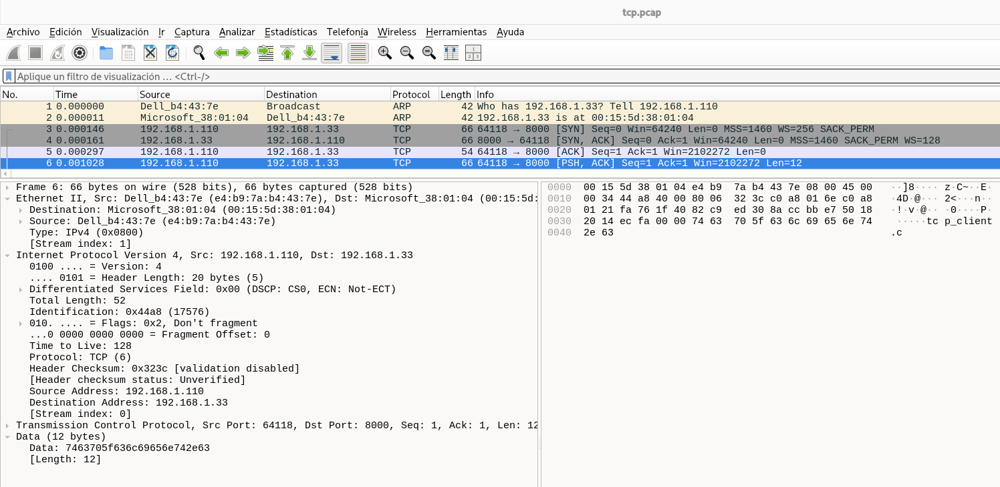

Esta captura muestra una comunicación TCP local (LAN) muy “limpia”, con el patrón típico request → response:
- Cliente: 192.168.1.110:64118
- Servidor: 192.168.1.33:8000
- Y consta de: ARP → 3-way handshake → envío pequeño del cliente → cierre del cliente (FIN) → respuesta grande del servidor → FIN del servidor → ACK final.

## 1) Resolución en la LAN: ARP (paquetes 1–2)
- (1) ARP Request   
Who has 192.168.1.33? Tell 192.168.1.110  
El cliente (192.168.1.110) necesita saber la MAC del host 192.168.1.33 antes de enviarle tráfico IP.

- (2) ARP Reply  
192.168.1.33 is at 00:15:5d:38:01:04  
Respuesta con la MAC del destino. A partir de aquí ya puede iniciar TCP.

## 2) Establecimiento de conexión TCP (3-way handshake) (paquetes 3–5)
- (3) SYN (cliente → servidor)  
64118 → 8000 [SYN]  
Opciones importantes:
  - MSS=1460
  - SACK Permitted
  - Window Scaling WS=256

- (4) SYN, ACK (servidor → cliente)  
8000 → 64118 [SYN, ACK]
Opciones importantes:
  - MSS=1460
  - SACK Permitted
  - WS=128

- (5) ACK (cliente → servidor)  
64118 → 8000 [ACK]  
Con esto, la conexión queda establecida.

📌 El handshake ocurre en microsegundos (tráfico local), sin retransmisiones.

## 3) Intercambio de datos: petición pequeña del cliente (paquetes 6–7)
- (6) Datos del cliente (request)  
64118 → 8000 [PSH, ACK] Len=12  
El cliente envía 12 bytes (muy poco). Esto suele ser:
  - una consulta corta,
  - un comando,
  - o un “trigger” para que el servidor responda.

`[PSH, ACK] ... Len=12`
Eso significa:
  - No es un ACK vacío (los ACK puros suelen tener Len=0)
  - Este segmento TCP lleva carga útil (payload) de 12 bytes
  - Por lo tanto, hay datos de aplicación viajando en ese paquete
  - ✅ Conclusión: si ves Len > 0, estás viendo intercambio de datos.

Los flags `PSH`, `ACK` son típicos de “envío inmediato” de datos. En TCP, cuando ves:
  - `PSH` → “empuja” los datos a la aplicación cuanto antes (no esperes a llenar buffers)
  - `ACK` → confirma datos recibidos previamente

Data: 7463705f636c69656e742e63:
  - En el hexdump se ven bytes que NO son cabeceras
  - En la parte derecha (hex/ASCII) del paquete 6 aparecen bytes del payload: `74 63 70 5f 63 6c 69 65 6e 74 2e 63`
  - Eso en ASCII corresponde a texto legible: tcp_client.c (12 caracteres)

📌 Es decir: el cliente está enviando literalmente la cadena "tcp_client.c" dentro del segmento TCP.

- (7) ACK del servidor  
8000 → 64118 [ACK] Ack=13  
El servidor confirma que recibió esos 12 bytes.

## 4) El cliente cierra su envío (half-close) (paquete 8)
- (8) FIN del cliente  
64118 → 8000 [FIN, ACK] Seq=13  
Esto es clave: el cliente hace un FIN inmediatamente después del request.

✅ Significa: “yo ya no voy a enviar más datos” pero todavía puede recibir datos del servidor.

Este comportamiento es típico en protocolos tipo:
  - “mando petición y espero respuesta”
  - descarga de datos tras una orden

## 5) Respuesta grande del servidor (paquetes 9–12)
Después del FIN del cliente, el servidor responde enviando bastante información:  
- (9) Segmento 1 del servidor  
8000 → 64118 Len=1460 Ack=14  
Envía datos y a la vez ACKea el FIN del cliente (Ack=14).

- (10) Segmento 2  
Len=1460  

- (11) Segmento 3  
[PSH, ACK] Len=1176

✅ Hasta aquí el servidor envía: 1460 + 1460 + 1176 = 4096 bytes exactos (4 KB)

- (12) Último segmento + cierre del servidor  
[FIN, PSH, ACK] Len=882  
Envía el último bloque (882 bytes)  
y en el mismo paquete incluye FIN (cierre del servidor)

📌 Total de datos del servidor: 4096 + 882 = 4978 bytes

## 6) ACK final del cliente (paquete 13)
- (13) ACK del cliente  
64118 → 8000 [ACK] Ack=4980  
Este ACK confirma:
  - todos los datos recibidos
  - y el FIN del servidor (por eso el Ack llega a 4980)

✅ Con esto la conexión queda cerrada correctamente (sin RST).

## Conclusión técnica
Esta traza representa un flujo TCP perfectamente normal y sin errores, con patrón:
- ARP para resolver MAC
- Handshake TCP (SYN/SYN-ACK/ACK)
- Cliente envía 12 bytes (petición)
- Cliente hace FIN (cierra su lado de envío)
- Servidor responde con ~5 KB y luego cierra (FIN)
- Cliente confirma con ACK final
