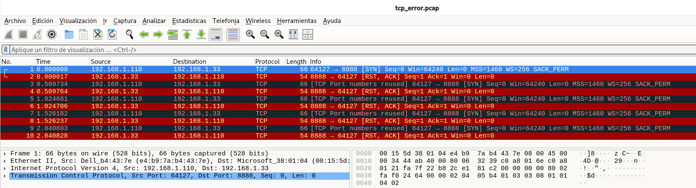

El cliente intenta abrir una conexión, pero el servidor la rechaza inmediatamente con RST (connection refused).

## 1) Qué intenta hacer el cliente
El host 192.168.1.110 intenta conectarse por TCP a:
- Destino: 192.168.1.33
- Puerto destino: 8888
- Puerto origen del cliente: 64127

Se ve en el paquete 1: `192.168.1.110:64127 → 192.168.1.33:8888 [SYN]`

✅ Esto es el primer paso del 3-way handshake (SYN).

## 2) Qué responde el servidor y qué significa
Justo después, en el paquete 2, el host 192.168.1.33 responde: `192.168.1.33:8888 → 192.168.1.110:64127 [RST, ACK]`

Un RST,ACK como respuesta a un SYN significa:
- ✅ El host destino está alcanzable (hay conectividad IP)
- ❌ Pero el puerto 8888 está cerrado o no hay ningún servicio escuchando en ese puerto.

En términos prácticos: “Connection refused”. Si fuese un cortafuegos “bloqueando” sin responder, normalmente verías SYN repetidos sin respuesta, no RST inmediato.

## 3) Por qué aparecen varios SYN repetidos

En tu captura el cliente insiste varias veces con el mismo intento:
- Paquete 1: SYN
- Paquete 3: SYN otra vez (Wireshark marca “TCP Port numbers reused”)
- Paquete 5: SYN otra vez
- Paquete 7: SYN otra vez
- Paquete 9: SYN otra vez

Y cada uno recibe su RST,ACK correspondiente: Paquete 2, 4, 6, 8, 10

Qué significa esto:
- No es un “reenvío automático” del TCP por pérdida (porque sí hay respuesta).
- Esto indica que la aplicación cliente (o un script) está programada para:
    - “intentar conectar”
    - si falla → esperar un poco → volver a intentar
    - Los tiempos (≈ cada 0.5 s) sugieren un bucle de reintentos.

## 4) Qué significa “TCP Port numbers reused”

Wireshark te avisa de que el cliente está reutilizando el mismo puerto origen (64127) en varios intentos sucesivos.

Esto puede pasar por ejemplo si:
- el cliente fija el puerto origen (bind manual)
- el programa reintenta demasiado rápido
- o el stack lo reasigna por circunstancias del sistema

No es “el error principal”, pero sí una pista de que no son SYN retransmissions normales, sino nuevos intentos de conexión.

## 5) Conclusión del error
- ✅ Hay conectividad entre 192.168.1.110 y 192.168.1.33
- ❌ No se establece TCP porque el servidor responde con RST en todos los intentos.

Causa más probable (la normal):
- En 192.168.1.33 no hay ningún proceso escuchando en el puerto TCP 8888.
- Otras posibilidades:
    - Un firewall en 192.168.1.33 configurado para rechazar activamente (con RST) ese puerto.
    - Estás intentando el puerto equivocado (el servicio real escucha en otro).

