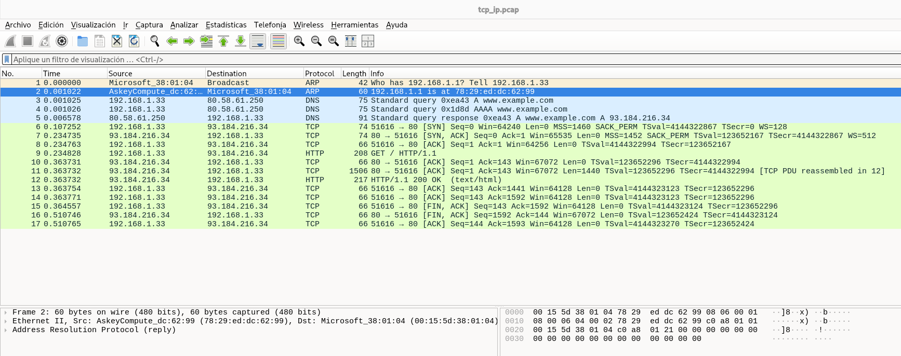

En la captura de pantalla se ve una lista de tramas en Wireshark, que es un flujo típico TCP/IP de navegación HTTP: primero ARP + DNS, luego 3-way handshake TCP, HTTP GET / respuesta 200 OK, y finalmente cierre ordenado (FIN/ACK).

## 1) Descubrimiento en LAN: ARP (paquetes 1–2)
- (1) ARP Request  
Who has 192.168.1.1? Tell 192.168.1.33  
Tu host (192.168.1.33) pregunta por la MAC del gateway 192.168.1.1 para poder salir a Internet.

- (2) ARP Reply  
192.168.1.1 is at 78:29:ed:dc:62:99  
Respuesta del router (fabricante Askey) indicando su MAC.  
Con esto ya puede encapsular tráfico IP hacia fuera de la LAN.

## 2) Resolución de nombre: DNS (paquetes 3–5)
- (3) DNS Query A (IPv4) a 80.58.61.250  
Pregunta por la IP de www.example.com.

- (4) DNS Query AAAA (IPv6)  
También intenta resolver IPv6 (normal en muchos sistemas).

- (5) DNS Response A  
www.example.com = 93.184.216.34  
Con esta IP (IPv4) ya puede iniciar la conexión TCP a ese destino.

En la traza se ve que finalmente se usa IPv4 (porque el TCP va a 93.184.216.34).

## 3) Establecimiento de conexión TCP: 3-Way Handshake (paquetes 6–8)

Aquí empieza la conexión entre:
- Cliente: 192.168.1.33:51616 (puerto efímero)
- Servidor web: 93.184.216.34:80 (HTTP)

---

- (6) SYN (cliente → servidor)  
51616 → 80 [SYN]  
Opciones destacables:
  - MSS=1460 (tamaño máximo de segmento típico con MTU 1500)
  - SACK Permitted (permite ACK selectivos)
  - Timestamps (TSval/TSecr) (medición RTT y PAWS)
  - WS=128 (Window Scaling: factor de escalado)

- (7) SYN,ACK (servidor → cliente)  
80 → 51616 [SYN, ACK]  
  - MSS=1452 (algo menor que 1460)
    Esto suele indicar que el servidor/anillo de red puede tener overhead extra (por ejemplo, PPPoE o ajustes de MTU), por lo que anuncia una MSS menor.

  - También anuncia SACK, timestamps y WS=512.

- (8) ACK final (cliente → servidor)  
51616 → 80 [ACK]  
Handshake completado: a partir de aquí ya se puede intercambiar datos de aplicación (HTTP).

📌 RTT aproximado:  
Tiempo (6) ≈ 0.107252 → Tiempo (7) ≈ 0.234735  
RTT ~ 127 ms (con la precisión de la captura).  

## 4) Intercambio de datos: HTTP GET y respuesta 200 OK (paquetes 9–13)
- (9) HTTP GET (cliente → servidor)  
GET / HTTP/1.1  
Esto es una petición web directa (sin TLS, porque es puerto 80).
  
Vemos en el user-agent que es una petición con el comando wget.

- (10) ACK del servidor  
El servidor confirma recepción del GET (Ack=143), sin datos.

- (11) Respuesta del servidor (primer segmento grande)  
80 → 51616 [ACK] Len=1440  
Wireshark marca: “TCP PDU reassembled in 12”  
Significa que la respuesta HTTP está fragmentada en varios segmentos TCP y Wireshark la reconstruye en el paquete donde la decodifica completa (el 12).

- (12) HTTP/1.1 200 OK  
HTTP/1.1 200 OK (text/html)  
Aquí Wireshark ya puede interpretar la cabecera HTTP y el contenido HTML (parte o todo).

- (13) ACK del cliente  
El cliente confirma recepción (Ack=1441, etc.).  
En resumen: la web se entrega correctamente.

## 5) Cierre de conexión TCP (paquetes 14–17)
Aquí vemos un cierre ordenado (no Reset).

- (14) ACK (cliente → servidor)  
ACK intermedio, típico al finalizar la transferencia.

- (15) FIN,ACK (cliente → servidor)  
El cliente inicia el cierre:  
51616 → 80 [FIN, ACK]

- (16) FIN,ACK (servidor → cliente)  
El servidor responde cerrando su lado:  
80 → 51616 [FIN, ACK]

- (17) ACK final (cliente → servidor)  
51616 → 80 [ACK]  
Cierre completo.

📌 Observación: el cierre ocurre muy rápido tras el 200 OK (la página es pequeña).
