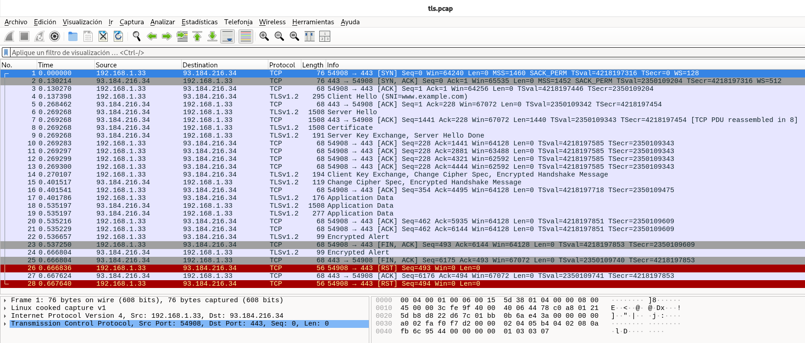
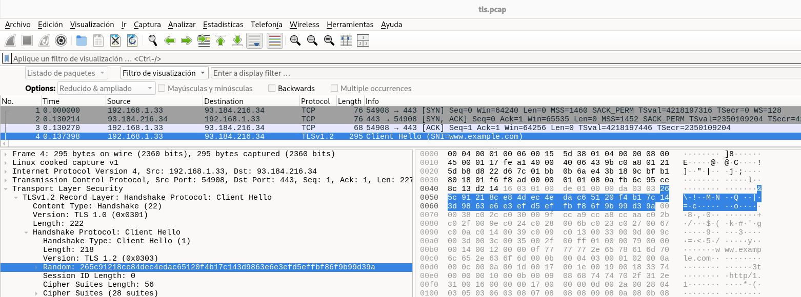
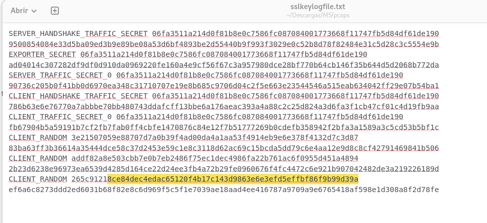
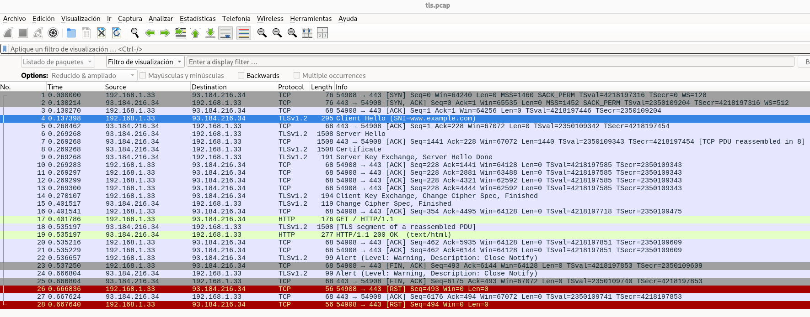
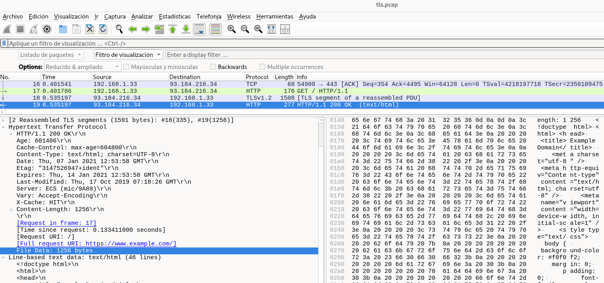

Esta captura de pantalla (tls.pcap) muestra una sesión completa de HTTPS, que utiliza el protocolo TLSv1.2 sobre una base de TCP. Aquí el objetivo es establecer un canal de comunicación cifrado y seguro entre el cliente (192.168.1.33) y el servidor (93.184.216.34).

## 1) Establecimiento TCP (3-Way Handshake) — paquetes 1–3
Cliente: 192.168.1.33:54908  
Servidor: 93.184.216.34:443  

- (1) SYN 54908 → 443
- (2) SYN,ACK 443 → 54908
- (3) ACK 54908 → 443

✅ Resultado: TCP queda establecido y ya puede iniciar TLS sobre ese canal.

## 2) Handshake TLS 1.2 — paquetes 4–15
### 2.1 ClientHello (inicio TLS)

- (4) TLSv1.2 Client Hello (SNI=www.example.com)  
Esto significa que el cliente (tu máquina) propone:
    - Versión TLS (1.2)
    - suites criptográficas soportadas
    - extensiones
    - y el SNI (Server Name Indication): www.example.com

✅ El SNI es clave porque permite que un mismo servidor IP aloje varios dominios HTTPS.

### 2.2 Respuesta del servidor: ServerHello + Certificado + parámetros de clave
- (6) Server Hello

- (8) Certificate

- (9) Server Key Exchange, Server Hello Done

🔎 En tu lista aparece un mensaje “TCP PDU reassembled…”, lo que indica que parte de estos mensajes TLS van “troceados” en varios segmentos TCP y Wireshark los recompone (esto es normal en TLS).

✅ Hasta aquí el servidor ya ha:
    - elegido la configuración del cifrado
    - enviado el certificado
    - enviado parámetros para el intercambio de claves (por ejemplo, ECDHE suele ir aquí en TLS 1.2).

### 2.3 El cliente termina el handshake (pasa a cifrado)
- (14) Client Key Exchange, Change Cipher Spec, Encrypted Handshake Message

Esto significa:
    - El cliente envía el material para acordar la clave de sesión
    - Luego manda ChangeCipherSpec: “a partir de ahora cifro”
    - Y envía el Finished (ya cifrado)

### 2.4 El servidor confirma y ya está cifrado todo
- (15) Change Cipher Spec, Encrypted Handshake Message

✅ Con esto el handshake TLS se considera completado: ya pueden intercambiar Application Data (datos reales cifrados).

## 3) Intercambio de datos cifrados (Application Data) — paquetes 17–21
- (17) TLSv1.2 Application Data

- (18) TLSv1.2 Application Data

- (19) TLSv1.2 Application Data

ACKs asociados (20–21)

📌 Esto corresponde a tráfico HTTPS real (por ejemplo, petición/respuesta HTTP, pero cifrado). Wireshark no puede ver el contenido sin claves TLS, por eso lo muestra como “Application Data”.

✅ Aquí está claro que sí hubo comunicación útil, no solo handshake.

-------

Se necesita el fichero sslkeylogfile.txt para este tls.pcap, porque es un archivo de claves TLS (SSLKEYLOGFILE) que permite a Wireshark descifrar el tráfico TLS y mostrar el contenido real (HTTP) en lugar de solo ver “Application Data”. 

Sin el keylog, Wireshark solo puede mostrar:
- Handshake TLS (ClientHello, ServerHello, Certificate…)
- y después “TLS Application Data” (cifrado)

Con el keylog correcto, podrás ver por ejemplo:
- HTTP GET / HTTP headers
- Respuestas HTTP (200, 301, etc.)
- Host, URI, User-Agent, etc.
- Seguir el flujo con Follow → TLS Stream y leer contenido descifrado.

El keylog solo descifra si corresponde a esa misma sesión TLS. Cómo comprobarlo rápido:
- Abre el paquete Client Hello en Wireshark
- Busca el campo Random (Client Random)
- Copia ese valor y verifica que exista en el sslkeylogfile.txt (líneas CLIENT_RANDOM ... o los secretos de tráfico)
- Si coincide, descifra. Si no coincide, no.

  
random: 8ce84dec4edac65120f4b17c143d9863e6e3efd5effbf86f9b99d39a  

------

## 4) Cierre TLS y cierre TCP — paquetes 22–28 (aquí está “lo interesante”)
### 4.1 Cierre TLS (correcto a nivel criptográfico)
- (22) TLSv1.2 Encrypted Alert (cliente → servidor)  
Normalmente esto es un close_notify cifrado (avisa que va a cerrar TLS).

- (24) TLSv1.2 Encrypted Alert (servidor → cliente)   
Respuesta equivalente: el servidor también cierra la sesión TLS “de forma educada”.

✅ Esto es el cierre “bien hecho” de TLS: alertas close_notify.

### 4.2 Cierre TCP (FIN/ACK) y luego un RST (cierre anómalo)
- (23) FIN, ACK (cliente inicia cierre TCP)

- (25) FIN, ACK (servidor cierra su lado)

**Y aquí viene el comportamiento anómalo:**  
- (26) RST 54908 → 443 (cliente resetea)

- (28) RST otra vez (cliente)

📌 Un RST significa: “corto la conexión de golpe / aborto el socket”. ¿Por qué puede pasar esto si ya había FIN? Las causas típicas son:
    - La aplicación cliente cerró el socket de forma brusca (por ejemplo con SO_LINGER=0 o terminando el proceso), y el sistema operativo envía RST.
    - El cliente no esperaba más paquetes (por ejemplo llega el FIN/ACK del servidor cuando el cliente ya “dio por cerrada” la conexión) y responde con reset.
    - Algún software intermedio (proxy/antivirus/inspector) fuerza el reset.

✅ Lo importante: el handshake TLS y el intercambio de datos fueron correctos.  

✅ El “problema” está en el cierre TCP, que termina siendo reset en vez de un cierre 100% limpio.

## Conclusión (resumen de lo que ocurre)
- Se establece TCP correctamente (1–3)
- Se completa TLS 1.2 con SNI www.example.com (4–15)
- Se intercambian datos cifrados (17–19)
- Se intenta cerrar correctamente con Encrypted Alert (22,24)
- El cierre TCP acaba en RST del cliente (26,28) → cierre abrupto

-----------

## Cargamos el fichero sslkeylogfile en wireshark
Cómo cargarlo en Wireshark (pasos)
- Edit → Preferences
- Protocols → TLS
- En (Pre)-Master-Secret log filename selecciona tu archivo sslkeylogfile.txt
- Aceptar y recargar el pcap

Ahora podemos analizar el tráfico cifrado que antes no podíamos: Intercambio de datos real (HTTP descifrado) (paquetes 17–21)

### Petición
- (17) HTTP GET / HTTP/1.1 (cliente → servidor)

Es decir: el cliente solicita la raíz / (la página principal).

### Respuesta
- (19) HTTP/1.1 200 OK (text/html) (servidor → cliente)

Esto confirma que el servidor respondió correctamente con un HTML (la típica página de example.com).

📌 El paquete (18) aparece como “TLS segment of a reassembled PDU”: es parte del troceado/reensamblado de la respuesta.

✅ Conclusión de esta fase: se completó la transacción HTTPS (GET → 200 OK).

