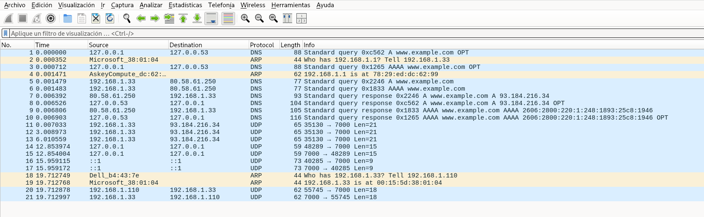

Esta captura de pantalla de Wiresharkmuestra el tráfico generado por las aplicaciones cliente y servidor UDP. La captura se realizó en el equipo 192.168.1.33, donde corre el servidor UDP en el puerto 7000.

## 1) Fase de resolución de nombre (DNS) + salida a red (ARP)
DNS local (stub resolver)
- Paquete 1: 127.0.0.1 → 127.0.0.53 consulta DNS A para www.example.com
- Paquete 3: consulta DNS AAAA para www.example.com
Esto es típico cuando Linux usa un resolvedor local tipo systemd-resolved (127.0.0.53).

ARP para poder salir al gateway
- Paquete 2: “Who has 192.168.1.1? Tell 192.168.1.33”
- Paquete 4: respuesta: 192.168.1.1 está en la MAC 78:29:...
Esto ocurre porque nuestro equipo (192.168.1.33) necesita conocer la MAC del router (gateway) para poder enviar tráfico fuera de la LAN (DNS público e Internet).

DNS real hacia el servidor DNS del ISP
- Paquetes 5 y 6: 192.168.1.33 → 80.58.61.250 consultas A y AAAA
- Paquete 7: respuesta A: www.example.com = 93.184.216.34
- Paquete 9: respuesta AAAA: 2606:2800:...:1946
Esto corresponde al uso de getaddrinfo() con AF_UNSPEC, que intenta IPv4 e IPv6 (tal y como se ve en el código del 4.1).

## 2) Cliente UDP fallando contra Internet (reintentos cada 3 segundos)
Aquí está el bloque clave:
- Paquete 11 (t=0.007033): 192.168.1.33:35130 → 93.184.216.34:7000 Len=21
- Paquete 12 (t=3.008973): mismo envío otra vez
- Paquete 13 (t=6.010559): tercer envío

¿Qué significa?
- Estamos enviando un mensaje UDP a www.example.com  --> puerto 7000
- El cliente reintenta 3 veces (intento inicial + 2 reintentos)
- Los reintentos se separan por ~3 segundos, que cuadra con:
  - TIMEOUT = 3000 ms
  - MAX_RETRIES = 2 (→ total 3 envíos) 
  - implementado con poll(..., TIMEOUT) antes de reintentar 
Y además coincide con la ejecución fallida del propio temario: envía 21 bytes y aparecen los timeouts/reintentos. 

Punto importante: En la captura no aparece ninguna respuesta UDP de vuelta desde 93.184.216.34:7000, así que el cliente agota reintentos y falla.

## 3) Cliente UDP funcionando en loopback IPv4 (127.0.0.1)
- Paquete 14: 127.0.0.1:48289 → 127.0.0.1:7000 Len=15
- Paquete 15: respuesta 127.0.0.1:7000 → 127.0.0.1:48289 Len=15
Esto es un ECHO perfecto: mismo tamaño y vuelta inmediata (milisegundos).

Y encaja con el ejemplo “OK” del documento: envío de 15 bytes y recepción de 15 bytes.

## 4) Cliente UDP funcionando en loopback IPv6 (::1)
- Paquete 16: ::1:40285 → ::1:7000 Len=9
- Paquete 17: ::1:7000 → ::1:40285 Len=9
Esto confirma que en tu máquina también hay prueba por IPv6 loopback, coherente con getaddrinfo() devolviendo direcciones IPv4/IPv6. 

## 5) Comunicación UDP con otro equipo de la LAN (192.168.1.110)
Primero ARP (resolver MAC del destino LAN)
- Paquete 18: “Who has 192.168.1.33? Tell 192.168.1.110”
- Paquete 19: respuesta con la MAC de 192.168.1.33

Luego el intercambio UDP
- Paquete 20: 192.168.1.110:55745 → 192.168.1.33:7000 Len=18
- Paquete 21: 192.168.1.33:7000 → 192.168.1.110:55745 Len=18
Aquí 192.168.1.110 actúa como cliente y 192.168.1.33 como servidor UDP en el puerto 7000, devolviendo el mensaje (echo).

## Conclusión operativa
En la captura hay tres “escenarios” distintos típicos del análisis 4.1:
- Caso fallido (Internet): 192.168.1.33 → 93.184.216.34:7000
  - 3 envíos separados ~3s
  - sin respuesta (timeout + retries)
- Caso exitoso local IPv4: 127.0.0.1 ↔ 127.0.0.1:7000
- Caso exitoso LAN: 192.168.1.110 ↔ 192.168.1.33:7000
Y todo está totalmente alineado con el cliente UDP del temario: resuelve nombre, envía UDP, espera con poll() 3 segundos y reintenta hasta 3 veces. 
