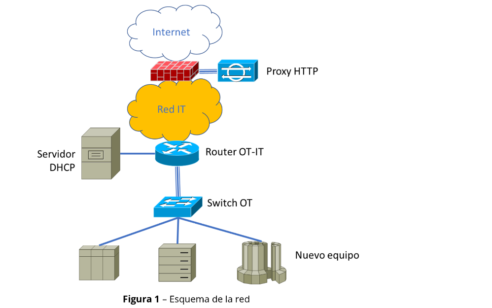
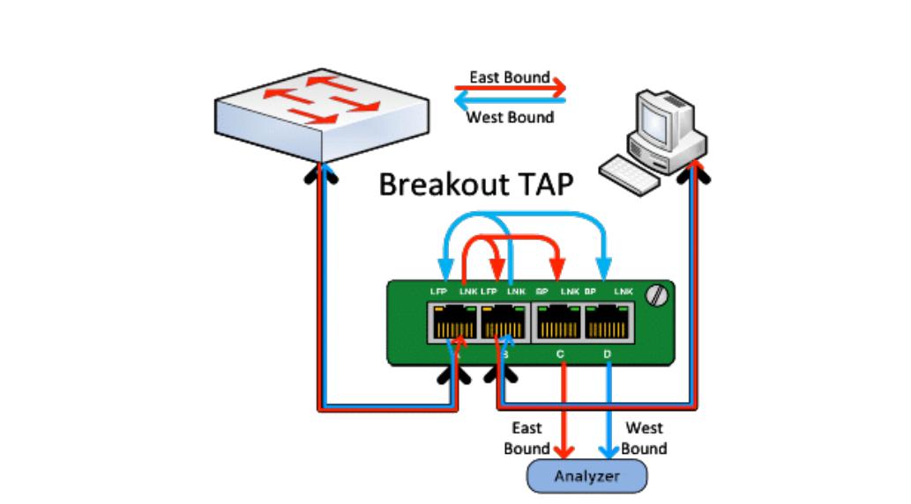

# La infraestructura
- Esquema de la Red:
    

- El Nuevo Equipo:
    - Se conecta a un Switch Ethernet OT a través de un puerto Fast Ethernet de 100Mbps.
    - Tiene SO propietario.
    - Sólo ofrece panel web de configuración.
    - No permite ejecutar comandos.
- El Switch Ethernet OT:
    - Tiene un enlace uplink de 10 Gbps con un Router OT-IT que le permite conectarse a la red IT de la organización.
    - No soporta port mirroring.
- Equipos de la red industrial:
    - Obtienen su dirección IPv4 y la configuración de red de un Servidor DHCP que está conectado al Router OT-IT.
    - Algunos equipos de la red industrial requieren que el servidor DHCP les proporcione parámetros de arranque.
    - Algunos equipos de la red industrial acceden a Internet.
- El Router OT-IT:
    - Interconecta las redes IT y OT.
    - Permite que los equipos industriales se comuniquen con un servidor DNS y un Proxy Web con conexión a Internet.
    - La infraestructura IT (incluyendo el router de interconexión) dispone de capacidades de port mirroring. Esto es es vital para capturar el tráfico que sale hacia la red IT o Internet.
- El Proxy Web:
    - Debe ser configurado en cada cliente.
    - El cliente debe disponer de un usuario y contraseña.
    - El proxy web es la única forma de salir a Internet desde dentro de la organización.
    - Almacena en un logs las URls a las que se conecta cada cliente
    - No almacena en el log el contenido (payload) de los mensajes HTTP que se intercambian.

# Se pide
- I. Analizar “todos y cada uno” de los mecanismos/técnicas del Capítulo 3.
    - Explicar cómo se podrían usar.
    - Explicar si son recomendables o no, para este caso.
    - Analizar los protocolos que emplea el nuevo equipo en sus comunicaciones internas y hacia Internet (incluyendo lo que se pueda inferir del uso del proxy HTTP y del servidor DHCP).
    - Analizar la información que se intercambia con el fabricante.

- II. Proponer un mecanismo de captura de tráfico que cumpla:
    - Configuración necesaria en la estación de captura.
    - Despliegue en la estación de captura.
    - Capturar todo el tráfico que envío o recibe el Equipo nuevo con otros equipos de la red.
    - Capturar todo el tráfico que envío o recibe el Equipo nuevo con Internet.
    - Tener impacto mínimo en OT.
    - No comprometer la fiabilidad. 
    - Quedar desplegado en la ventana corta de mantenimiento y no requerir cambios posteriores, incluso si hay incidencias con la captura.
    - Se puede contar con la colaboración de los administradors de red IT siempre que no se comprometa la fiabilidad de OT, porque abre la puerta a soluciones basadas en port mirroring en el router, TAPs, etc.

# Detalles a tener en cuenta
- Tráfico Local vs. Tráfico a Internet: El enunciado pide capturar todo el tráfico. El tráfico entre equipos de la red industrial (OT) que están conectados al mismo Switch no suele pasar por el Router. Como el Switch no tiene mirroring, tendremos que proponer algo específico para "ver" lo que pasa dentro del switch.

- Impacto y Fiabilidad: Este es el requisito más estricto. El mecanismo no puede interrumpir la red OT si falla una vez en producción. Esto nos obligará a elegir entre técnicas "activas" (como ARP Spoofing o DHCP Spoofing) o "pasivas" (como un Network TAP).

- El Servidor DHCP: El hecho de que el servidor DHCP permita "configuración personalizada" y "parámetros de arranque" es una pista para una posible técnica de captura basada en la reconfiguración de la red (por ejemplo, cambiar la puerta de enlace predeterminada o el servidor DNS mediante DHCP).

- Análisis del Capítulo 3: Debemos pasar por el filtro de "ventajas/desventajas" cada técnica (TAPs, Mirroring, Hubs, ARP Poisoning, DHCP Spoofing, etc.) aplicándola a este escenario concreto.

- La Propuesta Final: Hay que detallar la estación de captura (qué software usariamos, por ejemplo, Wireshark o tcpdump) y cómo se conectaría físicamente a la red según nuestra propuesta.

- Tráfico Local: Como el switch no colabora, tendremos que analizar técnicas como el uso de un Network TAP (pasivo y fiable) o técnicas de redirección de tráfico (activas como ARP Spoofing), evaluando cuál tiene menos impacto en la fiabilidad de OT.

- Uso del DHCP: Hemos detectado la "pista" del servidor DHCP. En redes industriales, manipular las opciones de DHCP puede permitir redirigir el tráfico del equipo hacia una estación de captura (haciendo que pase por ella antes de ir al router), pero debemoss analizar si esto compromete la fiabilidad.

# I. Análisis de las técnicas de captura de Tráfico de Red
Para cada una de las técnicas y herramientas del capítulo 3, vamos a ir respondiendo a las siguientes preguntas:
- Cómo se podría usar esa técnica | herramienta en este caso. Explicar la configuración y su despligue.
- Protocolos que podriamos ver usando esa técnica | herramienta.
- Información intercambiada con el fabricante.
- ¿Esta técnica | herramienta tiene un impacto mínimo en OT?
- ¿Esta técnica | herramienta compromete la fiabilidad?
- Conclusión: ¿Es recomendable esta técnica | herramienta en el ambito de este ejercicio?

## 1. Estrategias de Captura de Tráfico de Red

### 1.1 En el propio equipo

**Cómo se podría usar. Configuración y Despligue:**  
Consistiría en instalar en el `Nuevo equipo` un sniffer como `tcpdump` o `Wireshark`, y capturar el tráfico en todos sus interfaces, incluido `loopback`, para ver todo el tráfico que genera y recibe. Permitiría además combinar la captura con herramientas tipo `netstat` o `strace` para mapear sockets, puertos y llamadas a sistema, enriqueciendo mucho el análisis de protocolos e información que se envía al fabricante.
​

**Protocolos que podriamos ver:**
- Todo el tráfico IP del equipo:
    - Loopback IP y tráfico normal de LAN. 
    - DHCP para la obtención de IPv4 y parámetros de arranque.
    - Tráfico no-IP como ARP. 
    - DNS ya que el router permite comunicación con el servidor DNS. 
    - HTTP hacia el proxy.
​
- Podriamos analizar cabeceras y, si no hay cifrado, también el payload:
    - URLs completas.
    - Parámetros de actualización.
    - Contenido de informes de estado.
    - Identificadores de dispositivo, etc.
​
- Protocolos Industriales: Protocolos industriales del fabricante para la comunicación con otros equipos de la red OT.

**Información intercambiada con el fabricante:**
- Se podría identificar con precisión qué datos manda el equipo: versión de firmware, configuración, métricas de uso, logs, posibles datos sensibles y también cómo recibe datos, como ficheros de actualización, comandos de control, políticas.
​
​
- Al estar en el propio host no se pierde tráfico local, aunque ciertas optimizaciones de la `NIC` (`LSO`/`LRO`, `checksum offload`) pueden distorsionar tamaños y checksums en la captura, algo mitigable ajustando la configuración de `offloading`.

​

**Impacto en la OT:**
- Tiene un impacto alto en la OT, porque la ejecución de un proceso de captura consume recursos críticos de CPU y de memoria RAM, afectando el rendimiento del equipo monitorizado.

**Fiabilidad en la OT:**
- Compromete la fiabilidad: en un sistema propietario, cualquier proceso adicional no validado por el fabricante puede provocar bloqueos y no sería fácil de mantener si falla tras la ventana de mantenimiento

- Además, los efectos de `offloading` y `segmentación` pueden generar `ruido` en la captura como checksums incorrectos o paquetes demasiado grandes, y complicar la interpretación del tráfico.

**Conclusión: ¿Es recomendable en el ambito de este ejercicio?**  
Aunque la técnica es muy potente, en este escenario hay dos inconvenientes claros:
- Falta de acceso al equipo. No podemos instalar ni lanzar herramientas de captura.
- Requisitos estrictos de fiabilidad en la red OT.

**<mark>Por tanto, para nuestro ejercicio es teóricamente la mejor para visibilidad, pero no aplicable ni recomendable. Se deberían implementar estrategias externas como TAP, port mirroring en el router IT, etc. para cumplir los requisitos. Solo podría ser viable si el panel web ofreciese alguna funcionalidad de exportar logs o ficheros PCAP generados por el propio fabricante.</mark>**

----

### 1.2 Nivel físico o de Enlace

#### 1.2.1 Network TAP - Sonda de Red - Pasivo
Un TAP - Test Access Point - de red es un dispositivo hardware que se inserta directamente en un enlace de red para duplicar el tráfico que circula por él hacia una estación de monitorización sin alterar el flujo original.

**Cómo se podría usar. Configuración y despliegue:**  
- Se instalaría una sonda física, network TAP, entre el `Nuevo equipo` y el `Switch OT`, intercalándola en el enlace `Fast Ethernet 100 Mbps` para replicar todas las tramas entre ambos extremos hacia una o dos interfaces de la estación de captura.
​
- La estación de captura se conectaría a los puertos de monitorización del TAP con sus interfaces en `modo promiscuo`, sin IP configurada, y con un sniffer como `tcpdump` o `Wireshark` grabando el tráfico. No se envía ningún paquete desde esos interfaces, sólo se recibe.
​

**Protocolos que podríamos ver:**  
- Todo el tráfico Ethernet del Equipo nuevo: tramas ARP, DHCP, DNS, tráfico IP interno con otros equipos OT y tráfico IP hacia el router OT‑IT, incluyendo HTTP/HTTPS hacia el proxy web.
​
- Al trabajar a nivel físico/enlace, se obtiene una copia íntegra de todas las tramas que salen y entran por ese enlace, independientemente de VLANs o protocolos de nivel superior, siempre que el TAP soporte la velocidad y el medio que en este caso es: cobre a 100 Mbps.

**Información intercambiada con el fabricante:**  

- Se podrían identificar todas las conexiones del equipo con servidores externos: dominios/IPs de fabricante, puertos utilizados y patrones de comunicación.

- Si las sesiones no están cifradas, se puede inspeccionar el payload para ver parámetros de actualización, informes de estado, identificadores de dispositivo y otra telemetría; si están cifradas, al menos se obtienen metadatos, como SNI, certificados, tamaños y frecuencia de mensajes.
​

**¿Tiene un impacto mínimo en OT?:**  
- Una sonda/TAP pasivo bien dimensionada tiene un impacto muy bajo, ya que actúa como un cable inteligente que sólo copia el tráfico sin introducir retardo apreciable ni modificar las tramas.
​
- Al colocarse en un enlace de 100 Mbps y diseñarse específicamente para esa velocidad, no debería introducir cuellos de botella siempre que sea hardware adecuado y se instale durante la ventana de mantenimiento.
​

**¿Compromete la fiabilidad?:**  
- Las sondas pasivas se consideran muy fiables: si son realmente pasivas o tienen bypass físico, el enlace entre el equipo y el switch sigue funcionando incluso si la sonda pierde alimentación o la estación de captura se cae.
​
- El principal riesgo es físico, como un mal conector o una instalación defectuosa, pero una vez desplegada correctamente es una solución estable que no requiere cambios posteriores en la red OT.

**Conclusión: ¿Es recomendable en el ámbito de este ejercicio?:**
- Sí, es una de las técnicas más recomendables para este caso, porque permite capturar todo el tráfico del nuevo equipo con impacto mínimo y sin tocar su configuración ni la del switch OT, que además no soporta port mirroring.
​
- Cumple bien los requisitos del cliente (cobertura completa del tráfico del equipo, mínimo impacto, alta fiabilidad y posibilidad de dejarlo desplegado tras la ventana de mantenimiento), aunque exige disponer de un TAP físico adecuado y acceso físico al cableado entre el equipo y el switch.

---

#### 1.2.2 Network TAP - Sonda de Red - Activo
Una sonda/TAP activo es un dispositivo físico que se inserta en línea entre el nuevo equipo y el switch para copiar el tráfico hacia una estación de captura. En enlaces de cobre de 1 Gbps o superiores se suele requerir este tipo de sonda frente a una pasiva; algunos modelos permiten agregar ambos sentidos en un único puerto de monitorización de mayor capacidad, a costa de necesitar alimentación, aunque suelen incluir un bypass físico A–B si se pierde la alimentación.

**Cómo se podría usar. Configuración y despliegue:**  
- Se instalaría en el enlace del nuevo equipo, no en el uplink de 10 Gbps, porque interesa capturar también el tráfico OT local del equipo; el esquema típico sería: switch → puerto A, nuevo equipo → puerto B y estación de captura → puertos C y D (salidas de monitorización, o un único puerto agregado si el TAP lo soporta).

- Para evitar pérdidas se utilizarían dos salidas (una por sentido) o un puerto de monitorización de mayor capacidad, y en la estación de captura las NIC se pondrían en modo promiscuo, sin dirección IP y con el reenvío IP desactivado, de forma que solo reciban tráfico y no participen en la red.

**Protocolos que podríamos ver:**  
Se observaría exactamente el mismo tráfico que con un TAP pasivo en ese enlace: tramas ARP, DHCP, DNS, tráfico IP interno con otros equipos OT y tráfico IP hacia el router OT‑IT (incluyendo HTTP/HTTPS hacia el proxy web y cualquier comunicación con el fabricante).

**Información intercambiada con el fabricante:**  
Permitiría identificar las conexiones del equipo con servidores externos (direcciones, puertos, frecuencia) y, si el tráfico no está cifrado, inspeccionar el contenido de las peticiones y respuestas para ver parámetros de actualización, informes de estado, identificadores de dispositivo y otros datos que se envían al fabricante.

**Impacto y fiabilidad en OT:**
- Es fundamental que el TAP activo disponga de bypass físico entre los puertos A y B cuando pierde alimentación, de modo que el enlace equipo–switch siga funcionando aunque el TAP o la estación de captura fallen; con este bypass el impacto sobre la fiabilidad es muy bajo.
​

- A diferencia del TAP pasivo, introduce una latencia mínima al regenerar la señal y añade una dependencia de la alimentación y del propio hardware, lo que implica algo más de complejidad operativa y de supervisión, aunque en la práctica la latencia suele ser despreciable en un enlace de 100 Mbps bien dimensionado.

**Conclusión: ¿Es recomendable en el ámbito de este ejercicio?:**
- Para el enlace de 100 Mbps entre el nuevo equipo y el switch, un TAP pasivo ya sería suficiente y ofrece el menor riesgo posible (no requiere alimentación y puede introducir todavía menos puntos de fallo), por lo que suele considerarse preferible.
​

- Sin embargo, un TAP activo con bypass también cumpliría los requisitos del ejercicio, por lo que se puede mencionar como alternativa, reservando en general los TAP activos como opción necesaria en enlaces de 1 Gbps o superiores.

---

#### 1.2.3 Port mirroring (SPAN/RSPAN/ERSPAN)
Útil como complemento, pero no suficiente por sí solo

Limitación crítica del caso: el switch OT no tiene port mirroring. Por tanto, no podemos basarnos en SPAN (replica el comportamiento de una sonda de red física, y que permite copiar todo el tráfico enviado y recibido por uno o más puertos, a otro puerto del mismo switch donde se conecta la estación de captura) en el punto más importante (el puerto del equipo). 

Qué sí podemos hacer (infra IT/router sí tiene mirroring):
- Mirroring en el router OT-IT para ver tráfico que cruza hacia DNS/proxy o hacia IT (si necesitas redundancia/visibilidad adicional).
- Posible ERSPAN si nos interesa transportar la copia a una estación de captura remota (sin estar físicamente en el armario OT).

Pero: capturar en el router no cubre comunicaciones intra-subred OT que no pasen por el router. Por eso, para el objetivo “¿se comunica con otros equipos OT?” necesitas el TAP en el enlace del equipo.

Conclusión de esta sección para tu propuesta:
- TAP en el enlace del equipo = mecanismo principal.
- SPAN/ERSPAN en router = apoyo/backup y para visibilidad agregada, no para sustituir el TAP.

Datos a considerar si se configura port mirroring:
- Los interfaces de red Ethernet que capturen el tráfico deben encontrarse en modo promiscuo, ya que la gran mayoría de las tramas que reciba (excepto las tramas broadcast/multicast) no estarán destinadas a su dirección MAC.
- No se debe configurar una dirección IP en los interfaces de captura, de forma que la estación de captura no pueda enviar tráfico a través dichos interfaces.
- Desactivar el reenvío de paquetes IP (i.e. para que la estación de captura no se comporte como un router).
- No utilizar un hub Ethernet para capturar tráfico ya que los hubs degradan significativamente el rendimiento de Ethernet.

---

#### 1.2.4 Modo promiscuo necesario

#### 1.2.5 Prácticas no recomendadas (Hubs, Ataques MAC)

### 1.3 Nivel de red

#### 1.3.1 Modificación de tablas de rutas.

#### 1.3.2 Ataques AitM - Adversary in the middle

#### 1.3.3 Redirección ICMP

#### 1.3.4 DHCP Spoofing

#### 1.3.5 ARP/ND Poisoning

#### 1.3.6 Túneles IP/GRE y VPN

Este método NO es recomendable debido a:
- Este mecanismo se utiliza cuando no hay acceso físico ni al switch, cosa que no es nuetro caso.
- Este mecanismo no cumple con los requisitos del ejercicio:
    - Impacto mínimo.
    - Fiabilidad OT: forzar rutas/gateway o hacer MITM de red introduce dependencia operativa y riesgo.
    - Restricción operativa fuerte: después de la ventana de mantenimiento, no se puede interrumpir ni reconfigurar OT “incluso si hay problemas con el mecanismo de captura”. Eso penaliza cualquier solución que requiera ajustes o que pueda degradar la red si algo falla
- ARP poisoning / DHCP spoofing / ICMP Redirect: el propio capítulo lo trata como “última opción”
    - Además es especialmente inadecuado en OT por ruido, inestabilidad y riesgo.
    - Se debe terner el consentimiento expreso de los responsables de la infraestructura antes de realizarlo.

### 1.4 Nivel de aplicación

### 1.4.1 Uso de Proxies (HTTP, SOCKS)

### 1.4.2 Configuración global o por App

### 1.4.3 Proxy inverso

### 1.4.4 Interceptación DNS (Fichero HOTS, DNAT)

### 1.4.5 Paneles de desarrollo en navegadores

Muy relevante para “Internet”, pero como telemetría complementaria

Aquí el ejercicio te da una pista directa:
- Funciona en redes empresariales que no permiten la conexión directa de los equipos con Internet.
- La salida a Internet desde OT es solo mediante DNS + proxy, con usuario/contraseña configurado explícitamente en el cliente. 
- El proxy loggea URLs por cliente, pero no guarda contenido HTTP. 

Cómo conectarlo con tu resumen:

Qué sí puedes obtener (y es muy útil para responder al cliente):
- A qué dominios/URLs intenta acceder el equipo (vía logs del proxy y/o DNS).
- Patrones de beaconing, actualizaciones, endpoints del fabricante.

Qué no puedes obtener por defecto:
- El contenido de la comunicación (si hay TLS o si el proxy no registra cuerpos/respuestas).
- Y sobre mitmproxy (de tu resumen): En teoría, mitmproxy ayuda a inspeccionar aplicación y TLS, pero en este caso suele no ser viable porque requeriría:

Reconfigurar el cliente para que use tu proxy, y (si interceptas TLS) instalar una CA en el equipo, lo cual es improbable con SO propietario y además arriesgado para OT.

Veredicto razonable: no como mecanismo principal, y solo planteable en laboratorio/entorno de pruebas si el fabricante lo permite.

## 2 Herramientas de Captura y Análisis de Tráfico

### 2.1. Captura de tráfico con ‘tcpdump’

### 2.2. Análisis de tráfico con ‘Wireshark’

### 2.3. Análisis de tráfico a nivel de aplicación con ‘mitmproxy’

