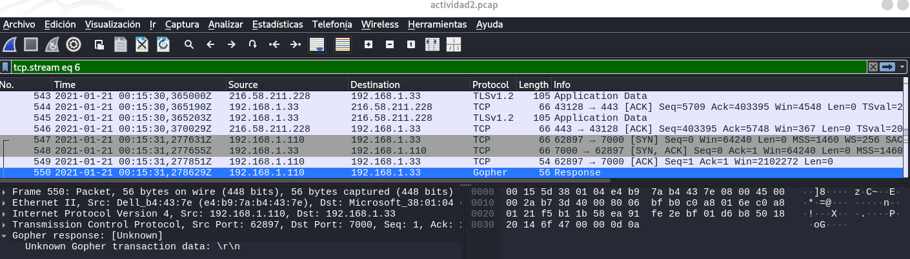
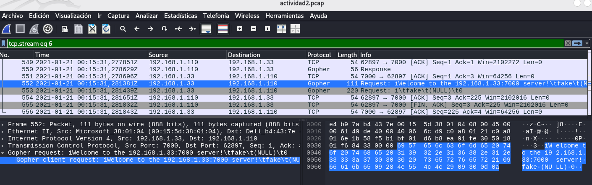

<div style="page-break-before: always;"></div>

- [**Entendiendo que pide el ejercicio**](#entendiendo-que-pide-el-ejercicio)
- [**1. Análisis del protocolo**](#1-análisis-del-protocolo)
  - [**Filtración el tráfico específico**](#filtración-el-tráfico-específico)
  - [**Localización las conversaciones reales de la app. Sesiones TCP**](#localización-las-conversaciones-reales-de-la-app-sesiones-tcp)
- [**2. Información intercambiada entre el cliente y el servidor**](#2-información-intercambiada-entre-el-cliente-y-el-servidor)
  - [**Listar directorio - Paquete 550**](#listar-directorio---paquete-550)
  - [**Fichero hello.txt - Paquete 560**](#fichero-hellotxt---paquete-560)
  - [**Fichero lena.gif - Paquete 571**](#fichero-lenagif---paquete-571)

<div style="page-break-before: always;"></div>

# **Entendiendo que pide el ejercicio**
Analizar el tráfico incluido en el fichero actividad2.pcap.

Esa captura de tráfico se ha realizado en la misma máquina (192.168.1.33) donde se ejecuta el servidor de la aplicación a analizar y que
corre en el puerto TCP/7000 (que no es el puerto estándar de ese protocolo). El fichero de captura también incluye otro tipo de tráfico, que no está relacionado con la aplicación, por lo que se deberían utilizar los filtros de visualización de Wireshark para encontrar el tráfico de la aplicación.

# **1. Análisis del protocolo**
El objetivo de la práctica es:
- Estudiar el protocolo empleado por la aplicación.
- Identificar el tipo de mensajes intercambiados por el cliente y el servidor.
- Intentar interpretar el contenido y significado de los mismos.
- Obtener la información intercambiada.
- Intentar identificar el protocolo exacto que está siendo empleado por la aplicación.
- Incluir capturas de pantalla de Wireshark:
    - Especificación del protocolo de la aplicación
    - La información intercambiada entre el cliente y el servidor.


Para resolver este ejercicio de análisis de tráfico con Wireshark, necesitamos filtrar el ruido y centrarnos específicamente en la actividad del puerto 7000. Por ello debemos eliminar el tráfico de fondo como TLS e ICMP.

<br>

## **Filtración el tráfico específico**
Dado que el enunciado indica que la aplicación corre en el puerto TCP 7000, lo primero es limpiar la vista. En wireshark, aplicamos el filtro: `tcp.port == 7000`:

```
No.	Time	Source	Destination	Protocol	Length	Info
547	23.658353	192.168.1.110	servidor	TCP	66	62897 → 7000 [SYN] Seq=0 Win=64240 Len=0 MSS=1460 WS=256 SACK_PERM
548	23.658377	servidor	192.168.1.110	TCP	66	7000 → 62897 [SYN, ACK] Seq=0 Ack=1 Win=64240 Len=0 MSS=1460 SACK_PERM WS=128
549	23.658573	192.168.1.110	servidor	TCP	54	62897 → 7000 [ACK] Seq=1 Ack=1 Win=2102272 Len=0
550	23.659351	192.168.1.110	servidor	TCP	56	62897 → 7000 [PSH, ACK] Seq=1 Ack=1 Win=2102272 Len=2
551	23.659418	servidor	192.168.1.110	TCP	54	7000 → 62897 [ACK] Seq=1 Ack=3 Win=64256 Len=0
552	23.662103	servidor	192.168.1.110	TCP	111	7000 → 62897 [PSH, ACK] Seq=1 Ack=3 Win=64256 Len=57
553	23.662161	servidor	192.168.1.110	TCP	220	7000 → 62897 [FIN, PSH, ACK] Seq=58 Ack=3 Win=64256 Len=166
554	23.662373	192.168.1.110	servidor	TCP	54	62897 → 7000 [ACK] Seq=3 Ack=225 Win=2102016 Len=0
555	23.662554	192.168.1.110	servidor	TCP	54	62897 → 7000 [FIN, ACK] Seq=3 Ack=225 Win=2102016 Len=0
556	23.662565	servidor	192.168.1.110	TCP	54	7000 → 62897 [ACK] Seq=225 Ack=4 Win=64256 Len=0
....
....
```

En el primer paquete que aparece tras aplicar el filtro (547), vamos hacer un seguimiento con TCP stream: Hacemos click derecho en el paquete 547 y seleccionamos Follow (Seguir) → TCP Stream.


```
iWelcome to the 192.168.1.33:7000 server!	fake	(NULL)	0
i	fake	(NULL)	0
0Hello	/hello.txt	192.168.1.33	7000	+
1RFCs	/dir/	192.168.1.33	7000	+
gLena	/lena.gif	192.168.1.33	7000	+
1Quux Mega Server	/	142.4.200.132	7000
```
donde:
- **<mark>Vemos palabras legibles como "Welcome to the...", "Hello", "Mega Server". Esto parece que es un protocolo basado en texto (ASCII), lo cual descarta protocolos complejos cifrados o puramente binarios.</mark>**
- **<mark>Tambien parece una comunicación en la que se piden recursos, como hello.txt, lena.gif</mark>**


<div style="page-break-before: always;"></div>

## **Localización las conversaciones reales de la app. Sesiones TCP**
Aunque filtremo por 7000, es buena práctica confirmar cuántas conexiones hay y quién habla con quién:
- Vamos a Statistics → Conversations → TCP  → Ordenamos por Port o usamos el buscador para encontrar 7000.
- Apuntamos:
    - IP/puerto del cliente
    - IP/puerto del servidor (192.168.1.33:7000)
    - Número de bytes transferidos en cada sentido (te ayuda a identificar la sesión “importante”).


```
Dirección A,Puerto A,Dirección B,Puerto B,Paquetes,Bytes,Stream ID,Paquetes totales,Porcentaje filtrado,Packets A → B,Bytes A → B,Packets B → A,Bytes B → A,Inicio rel,Duración,Bits/s A → B,Bits/s B → A,Flows
"192.168.1.110",62897,"192.168.1.33",7000,10,789,6,10,100,5,284,5,505,23.658352999999998,0.004212000000002547,"","",3
"192.168.1.110",62900,"192.168.1.33",7000,10,589,7,10,100,5,294,5,295,25.852265,0.007728000000000179,304347,305383,2
"192.168.1.110",62910,"192.168.1.33",7000,82,231798,8,82,100,66,3587,16,228211,31.351551,2.8117599999999996,10205,649304,14
"192.168.1.110",62949,"192.168.1.33",7000,10,618,10,10,100,5,289,5,329,52.655474,0.00575200000000109,401947,457579,2
```

Esta vista de Conversaciones TCP es fundamental porque nos aporta una visión global de cómo interactuó el cliente con la aplicación. Al filtrar por el puerto 7000, vemos que se establecieron 4 flujos o sesiones independientes entre el cliente (192.168.1.110) y el servidor (192.168.1.33).

Y los volúmenes son muy diferentes:
- Stream 6: 10 paquetes / 789 bytes → muy corto
- Stream 7: 10 paquetes / 589 bytes → muy corto
- Stream 8: 82 paquetes / 231,798 bytes → con diferencia, el principal
- Stream 10: 10 paquetes / 618 bytes → muy corto

Además, en el Stream 8:
- A→B (cliente→servidor): 3,587 bytes
- B→A (servidor→cliente): 228,211 bytes

**<mark>Esto encaja con un patrón típico: el cliente hace una petición pequeña y el servidor responde con un contenido grande, que puede ser una descarga, listado, datos, o un archivo. Es por esto que vamos a apostar por este stream para seguir investigando `tcp.stream == 8`.</mark>**

Aplicamos el filtro: `tcp.stream == 8`
```
No.	Time	Source	Destination	Protocol	Length	Info
568	31.351551	192.168.1.110	servidor	TCP	66	62910 → 7000 [SYN] Seq=0 Win=64240 Len=0 MSS=1460 WS=256 SACK_PERM
569	31.351573	servidor	192.168.1.110	TCP	66	7000 → 62910 [SYN, ACK] Seq=0 Ack=1 Win=64240 Len=0 MSS=1460 SACK_PERM WS=128
570	31.351799	192.168.1.110	servidor	TCP	54	62910 → 7000 [ACK] Seq=1 Ack=1 Win=2102272 Len=0
571	31.352463	192.168.1.110	servidor	TCP	65	62910 → 7000 [PSH, ACK] Seq=1 Ack=1 Win=2102272 Len=11
572	31.352469	servidor	192.168.1.110	TCP	54	7000 → 62910 [ACK] Seq=1 Ack=12 Win=64256 Len=0
573	31.355524	servidor	192.168.1.110	TCP	4150	7000 → 62910 [PSH, ACK] Seq=1 Ack=12 Win=64256 Len=4096 [TCP PDU reassembled in 575]
574	31.355543	servidor	192.168.1.110	TCP	7354	7000 → 62910 [PSH, ACK] Seq=4097 Ack=12 Win=64256 Len=7300 [TCP PDU reassembled in 575]
575	31.355556	servidor	192.168.1.110	Gryphon	2974	
576	31.355954	192.168.1.110	servidor	TCP	54	62910 → 7000 [ACK] Seq=12 Ack=14317 Win=2087936 Len=0
577	31.355963	servidor	192.168.1.110	Gryphon	14654	- Invalid -- Invalid -
578	31.355967	servidor	192.168.1.110	Gryphon	14654	- Invalid -
579	31.355954	192.168.1.110	servidor	TCP	54	[TCP Window Update] 62910 → 7000 [ACK] Seq=12 Ack=14317 Win=2092032 Len=0
580	31.355954	192.168.1.110	servidor	TCP	54	[TCP Window Update] 62910 → 7000 [ACK] Seq=12 Ack=14317 Win=2096128 Len=0
581	31.355954	192.168.1.110	servidor	TCP	54	[TCP Window Update] 62910 → 7000 [ACK] Seq=12 Ack=14317 Win=2100224 Len=0
582	31.355954	192.168.1.110	servidor	TCP	54	[TCP Window Update] 62910 → 7000 [ACK] Seq=12 Ack=14317 Win=2102272 Len=0
583	31.356253	192.168.1.110	servidor	TCP	54	62910 → 7000 [ACK] Seq=12 Ack=43517 Win=2073088 Len=0
584	31.356259	servidor	192.168.1.110	Gryphon	29254	- Invalid -
585	31.356263	servidor	192.168.1.110	TCP	2974	7000 → 62910 [PSH, ACK] Seq=72717 Ack=12 Win=64256 Len=2920 [TCP PDU reassembled in 586]
586	31.356265	servidor	192.168.1.110	Gryphon	26334	- Invalid -- Invalid -
587	31.356253	192.168.1.110	servidor	TCP	54	[TCP Window Update] 62910 → 7000 [ACK] Seq=12 Ack=43517 Win=2077184 Len=0
588	31.356253	192.168.1.110	servidor	TCP	54	[TCP Window Update] 62910 → 7000 [ACK] Seq=12 Ack=43517 Win=2081280 Len=0
589	31.356253	192.168.1.110	servidor	TCP	54	[TCP Window Update] 62910 → 7000 [ACK] Seq=12 Ack=43517 Win=2085376 Len=0
590	31.356253	192.168.1.110	servidor	TCP	54	[TCP Window Update] 62910 → 7000 [ACK] Seq=12 Ack=43517 Win=2089472 Len=0
591	31.356253	192.168.1.110	servidor	TCP	54	[TCP Window Update] 62910 → 7000 [ACK] Seq=12 Ack=43517 Win=2093568 Len=0
592	31.356253	192.168.1.110	servidor	TCP	54	[TCP Window Update] 62910 → 7000 [ACK] Seq=12 Ack=43517 Win=2097664 Len=0
593	31.356274	192.168.1.110	servidor	TCP	54	[TCP Window Update] 62910 → 7000 [ACK] Seq=12 Ack=43517 Win=2101760 Len=0
594	31.356563	192.168.1.110	servidor	TCP	54	62910 → 7000 [ACK] Seq=12 Ack=101917 Win=2043392 Len=0
595	31.356572	servidor	192.168.1.110	Gryphon	35094	- Invalid -- Invalid -
596	31.356563	192.168.1.110	servidor	TCP	54	[TCP Window Update] 62910 → 7000 [ACK] Seq=12 Ack=101917 Win=2048000 Len=0
597	31.356563	192.168.1.110	servidor	TCP	54	[TCP Window Update] 62910 → 7000 [ACK] Seq=12 Ack=101917 Win=2052096 Len=0
598	31.356563	192.168.1.110	servidor	TCP	54	[TCP Window Update] 62910 → 7000 [ACK] Seq=12 Ack=101917 Win=2056192 Len=0
599	31.356563	192.168.1.110	servidor	TCP	54	[TCP Window Update] 62910 → 7000 [ACK] Seq=12 Ack=101917 Win=2060288 Len=0
.....
.....

```

Reconstruimos el diálogo en el primer paquete que muestra este filtro → Analyze → Follow → TCP Stream

donde: 
- El cliente envía la cadena /lena.gif (en rojo).
- El servidor devuelve un contenido que empieza por GIF87a, que es la firma (“magic bytes”) de un fichero GIF.
- La aplicación está sirviendo un recurso llamado lena.gif, y el cliente lo solicita indicando la ruta. Esto es muy compatible con HTTP (GET de un objeto), pero también podría ser un protocolo propio minimalista, en el que el cliente manda la ruta y el servidor devuelve bytes “a pelo”.

**<mark>Podemos deducir un patrón: el cliente pide un recurso por “ruta/selector” y el servidor devuelve el fichero en bruto.</mark>**

<div style="page-break-before: always;"></div>


**Vamos a tirar por hacer un “Decode As… COMO HTTP” de un paque que ofrezca el puerto 7000 a ver que nos dice:**
De los dos primeros paquetes de este stream 8:
- Paquete 568: 62910 → 7000 [SYN]  
Es el SYN del cliente, donde el puerto “destino” es 7000 pero el paquete se origina desde el puerto 62910.  


- Paquete 569: 7000 → 62910 [SYN, ACK]  
Es el SYN/ACK del servidor, y aquí el paquete sale desde el puerto 7000. Al abrir Decode As desde este paquete, es mucho más probable que Wireshark te muestre TCP port = 7000, que es lo que necesitas para decirle: “trata el puerto 7000 como HTTP”.

donde:
- **"Protocol", Wireshark etiqueta el paquete 575 como Gryphon.** Sin embargo, si investigamos este protocolo Gryphon, es un protocolo de red industrial utilizado principalmente en la automoción (para diagnósticos de vehículos y buses CAN). Es un protocolo binario.

**<mark>Aunque Wireshark intenta interpretarlo como Gryphon debido al puerto 7000, lo que vimos  en la captura donde veíamos palabras legibles en texto plano que decían "Welcome to the... server!", "hello.txt", "RFCs", "lena.gif" indica un protocolo de texto. Luego el protocolo que buscamos no es ese Gryphon.</mark>**


<div style="page-break-before: always;"></div>

Como parece que es un protocolo de texto, vamos a intentar hacer un decode del paque 569, obligando a usar HTTP:


Pero no cambia nada:


**<mark>No usa el protocolo http. Veamos que responde google:</mark>**


Vamos a probar con FTP. Hacemos un decode de ese paquete 569 con el protocolo FTP:


<div style="page-break-before: always;"></div>

donde:
- FTP (control) usa comandos tipo: USER, PASS, SYST, PWD, TYPE, RETR, PASV, etc.
- Normalmente en puerto 21, y además abre canales de datos separados.
- En el stream:
    - El “request” es solo /lena.gif
    - La “response” empieza por GIF87a (cabecera binaria de un GIF)
- **<mark>Se demuestra que Dios también se equivoca: Tampoco es FTP.</mark>**
- **<mark>Lo que sí sabemos es que: Es un protocolo de petición/respuesta donde el cliente envía un “selector/ruta” y el servidor devuelve el recurso binario.</mark>**


**Preguntamos a google por protocolos similares a http:**  

donde:
- **HTTPS no puede ser**. Los datos son legibles, estan en texto claro. La característica principal de HTTPS es que cifra la información para que nadie pueda leerla. Si fuera HTTPS, en Wireshark veríamos caracteres aleatorios y sin sentido `Application Data`. En cambio, en la captura del paquete 547 vemos frases perfectamente legibles como `Welcome to the server!` o nombres de archivos como `hello.txt`.
- **Websocket no puede ser** ya que falta el handshake de bienvenida. Todo WebSocket debe empezar pidiendo permiso a través de una página web (HTTP) con una frase especial llamada `Upgrade: websocket`. En la captura del paquete 547, el cliente no pide permiso ni usa cabeceras web.
- **FTP ya hemos visto que tampoco.**


**Probamos con Gopher:** Un sistema de información distribuida más antiguo, con un protocolo ligero muy similar a HTTP, permitiendo la navegación en menús. Volvemos hacer en ese paquete un “Decode As… COMO Gopher :

donde:
- **<mark>Wireshark disecciona el tráfico como Gopher, y el comportamiento observado (cliente envía un selector /lena.gif y servidor devuelve bytes que empiezan por GIF87a) encaja exactamente con Gopher.</mark>**


Volvemos a aplicar el filtro: `tcp.port == 7000`:

donde:
- Con el filtro tcp.port == 7000 se observan varias conexiones donde Wireshark ya decodifica Gopher.
- Gopher Request: [Directory list] (listado de directorio/menú).
- Gopher Request: /hello.txt (petición de fichero de texto).
- Gopher Request: /lena.gif (petición de imagen GIF).
- Respuestas “Gopher Response” asociadas.
- **<mark>Conclusión: la aplicación usa el protocolo Gopher sobre TCP, pero en un puerto no estándar, el 7000 en vez de 70.</mark>**


<br>
<br>


# **2. Información intercambiada entre el cliente y el servidor**
Vamos a realizar una captura de pantalla en la que se vea la información intercambiada entre el cliente y el servidor:
- Aplicamos filtro: `tcp.port == 7000`.
- Seleccionaremos dos paquetes
    - “Gopher Request: /hello.txt”
    - “Gopher Request: /lena.gif”.
- Analyze → Follow → TCP Stream → Analizamos la información que se intercambia.


## **Listar directorio - Paquete 550**

donde:
- Vemos una petición de tipo Gopher.
- En el panel de detalles del paquete, vemos que el cliente (192.168.1.110) envía una petición vacía: sólo un salto de línea `\r\n`. En el protocolo Gopher, esto se interpreta como la orden para listar el directorio raíz.


La respuesta del servidor está en los paquetes 552 y 553:



## **Fichero hello.txt - Paquete 560**

donde: 
- En la parte del cliente: la petición con el nombre del fichero y el lugar donde està: `/hello.txt`.
- En la parte del servidor: la respuesta del servidor que envía el contenido de ese fichero: `Hello world!`.


<br>

## **Fichero lena.gif - Paquete 571**

donde:
- En la parte del cliente: la petición `/lena.gif`.
- En la parte del servidor: la respuesta: `GIF87a........a].LP.8D.]Y.]a.8H.YY.DL....Ua.0@.,@.@H.<D.......$<.......YP......P.4a.HP.4......Y.@a.4.....qa.4....D].De..m..}.PU..q..y.8a.La.uu.yi.yy.ye.DUq,a.mai,Y.@P.e].LP.ae.]].HP.8D.4D.]Y.U].DL.UY.@H.@P.YY....<D....,@. <m L....YPY LH.8H.8m.8a.@D.4..y..m].`. Que es el fichero en crudo.
- La respuesta del servidor empieza por GIF87a, que es la firma (“magic bytes”) de un fichero GIF. Eso indica que lo que viene a continuación son bytes binarios del propio fichero.

<div style="page-break-before: always;"></div>

**Veamos la foto en crudo:** Estando en este paque 571, en la ventana: Analyze → Follow → TCP Stream → Cambiamos “Mostrar como”: Raw.  
  
donde:
- Vemos la petición del cliente y del servidor en crudo.

**Cambiamos unas opciones para poder guadar la foto:**  
  
donde:
- “Show data as / Mostrar datos como” debe estar en Raw.
- Tipo “Stream/Conversation” o “Direction: 192.168.1.33:7000 --> 192.168.1.110
- Pulsamos el botón guardar y damos un nombre al fichero.


**Abrimos el fichero descargado:**  


<mark>La investigación del fichero pcap con una captura de tráfico concluye satisfactoriamente con la identificación del protocolo Gopher y la extracción exitosa de los activos hello.txt y lena.gif. También se ha podido reconstruir del archivo binario a partir de los datos en formato Raw.</mark>