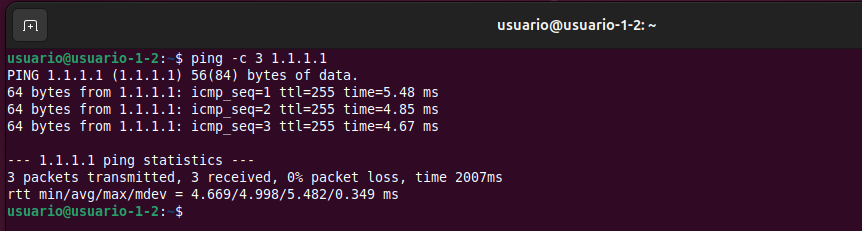
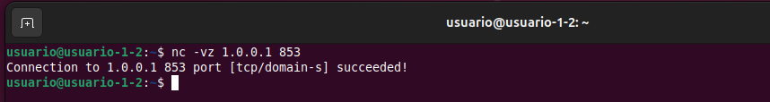
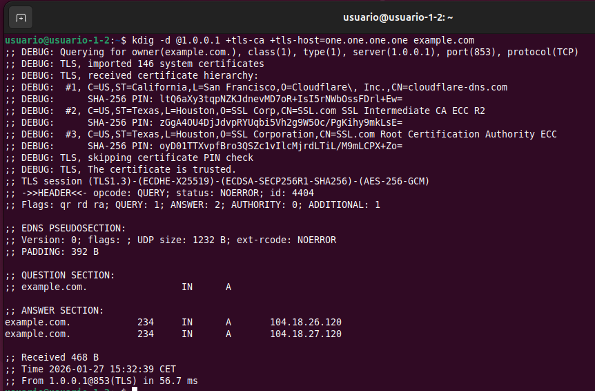
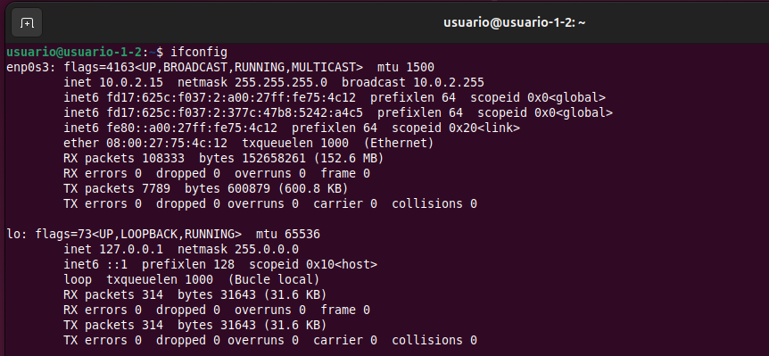
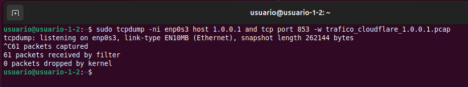
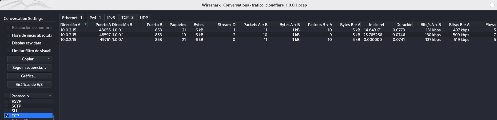
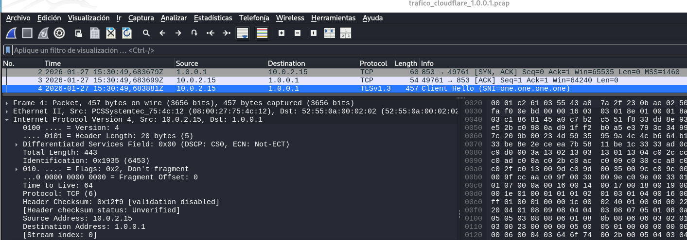
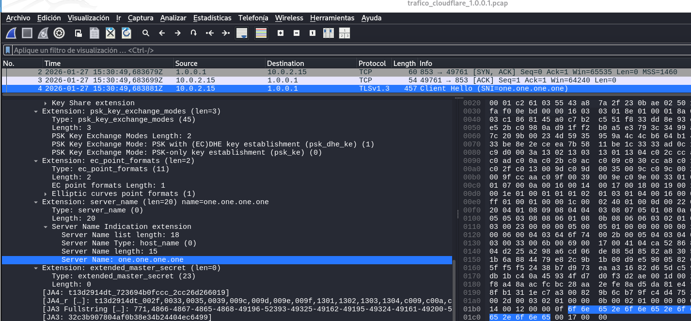

- [Entendiendo lo que pide el ejercicio:](#entendiendo-lo-que-pide-el-ejercicio)
  - [1. Capturar y analizar tráfico cifrado de un cliente DNS-over-TLS - DoT:](#1-capturar-y-analizar-tráfico-cifrado-de-un-cliente-dns-over-tls---dot)
    - [Fase 1 ➡ Análisis de la Aplicación - Cliente DoT](#fase-1--análisis-de-la-aplicación---cliente-dot)
    - [Fase 2 ➡ Interceptación y Descifrado del Tráfico](#fase-2--interceptación-y-descifrado-del-tráfico)
  - [2. Incluir evidencias](#2-incluir-evidencias)
- [Entendiendo que es un cliente DNS-over-TLS - DoT](#entendiendo-que-es-un-cliente-dns-over-tls---dot)
- [Entendiendo el cliente DNS avanzado kdig](#entendiendo-el-cliente-dns-avanzado-kdig)
- [Fase 1](#fase-1)
  - [Instalación de kdig](#instalación-de-kdig)
  - [Consulta con el cliente kdig en @1.1.1.1](#consulta-con-el-cliente-kdig-en-1111)
    - [El Error WARNING: can't connect to 1.1.1.1@853(TLS).](#el-error-warning-cant-connect-to-1111853tls)
      - [1. Verificamos la conexión con el servidor Cloudflare.](#1-verificamos-la-conexión-con-el-servidor-cloudflare)
      - [2. Verificamos si el puerto 853 está bloqueado](#2-verificamos-si-el-puerto-853-está-bloqueado)
  - [Probamos otro IP de Cloudflare para DoT](#probamos-otro-ip-de-cloudflare-para-dot)
  - [Consulta con el cliente kdig en @1.0.0.1](#consulta-con-el-cliente-kdig-en-1001)
  - [Captura del tráfico de red](#captura-del-tráfico-de-red)
  - [Análisis COMPLETO de la sesión TLS](#análisis-completo-de-la-sesión-tls)
    - [Transporte / Socket](#transporte--socket)
      - [IPV4 (AF\_INET)](#ipv4-af_inet)
      - [TCP (SOCK\_STREAM) y puerto 853](#tcp-sock_stream-y-puerto-853)
      - [TCP 3-way handsake (SYN/SYN-ACK/ACK)](#tcp-3-way-handsake-synsyn-ackack)
    - [Handshake TLS](#handshake-tls)
      - [Versión negociada (supported\_versions)](#versión-negociada-supported_versions)
      - [Cipher suite negociada (ej. TLS\_AES\_256\_GCM\_SHA384)](#cipher-suite-negociada-ej-tls_aes_256_gcm_sha384)
      - [Intercambio de claves (ECDHE/PFS) (key\_share x25519)](#intercambio-de-claves-ecdhepfs-key_share-x25519)
      - [Extensiones relevantes](#extensiones-relevantes)
        - [SNI (one.one.one.one)](#sni-oneoneoneone)
        - [ALPN (si aparece / si no aparece, se indica)](#alpn-si-aparece--si-no-aparece-se-indica)
      - [Certificado del servidor](#certificado-del-servidor)
        - [Subject / SAN (hostnames)](#subject--san-hostnames)
        - [Cadena de confianza (intermedia/raíz)](#cadena-de-confianza-intermediaraíz)
        - [Validación (OK / trusted)](#validación-ok--trusted)
    - [Datos y Cierre](#datos-y-cierre)
      - [Tráfico de aplicación cifrado (TLS Application Data)](#tráfico-de-aplicación-cifrado-tls-application-data)
      - [Cierre de conexión (FIN/ACK o alertas TLS si se ven)](#cierre-de-conexión-finack-o-alertas-tls-si-se-ven)
  - [Consultas con las herramientas strace y ldd](#consultas-con-las-herramientas-strace-y-ldd)
    - [Ejecución del cliente kdig bajo strace](#ejecución-del-cliente-kdig-bajo-strace)
    - [Captura del tipo de socket que emplea](#captura-del-tipo-de-socket-que-emplea)
    - [Captura de las syscalls](#captura-de-las-syscalls)
    - [Captura de las Librerias SSL/TLS](#captura-de-las-librerias-ssltls)
- [Fase 2](#fase-2)
  - [openssl](#openssl)


# Entendiendo lo que pide el ejercicio:
## 1. Capturar y analizar tráfico cifrado de un cliente DNS-over-TLS - DoT:
### Fase 1 ➡ Análisis de la Aplicación - Cliente DoT

Primero analizamos su comportamiento, aunque el tráfico vaya cifrado ➡ El objetivo es observar cómo la herramienta `kdig` realiza una consulta DNS segura a un servidor, como el de Cloudflare, 1.1.1.1.

- Realizamos una captura del tráfico.
- Capturamos las llamas al sistema empleadas, tal y como se describe en los Capítulos 4 y 6.
- Identificamos el tipo de socket empleado.
- Identificamos las llamadas de red más importantes utilizadas.
- Identificamos la librería SSL/TLS empleada para cifrar las comunicaciones.
- Hacemos un análisis completo de la sesión TLS establecida entre el cliente y el servidor DNS-over-TLS.


### Fase 2 ➡ Interceptación y Descifrado del Tráfico
Después desciframos ese tráfico usando 2 técnicas diferentes del capitulo 7.


## 2. Incluir evidencias
- De todos los comandos.
- De todas las pruebas:
  - Salidas de terminal.
  - Capturas, y ficheros generados como PCAP.
  - Explicar qué hace cada paso. 


# Entendiendo que es un cliente DNS-over-TLS - DoT
Un cliente DNS-over-TLS (DoT) es, en esencia, un cliente DNS que ha decidido ponerse una capa de seguridad antes de salir a la red. En lugar de gritar nuestras peticiones por megáfono, como hace el DNS tradicional, las mete en un túnel privado y cifrado.

Tradicionalmente, el DNS envía mensajes sobre datagramas UDP, lo cual es rápido pero totalmente legible para cualquiera que esté mirando el tráfico. Un cliente DoT, en cambio, establece una sesión TLS completa con el servidor DNS antes de preguntar nada. Esto implica que la comunicación no es "lanzar y olvidar", sino que requiere un protocolo de enlace (Handshake) previo para asegurar la conexión.


**El objetivo principal de estos clientes es evitar que intermediarios, como nuestro proveedor de internet o un atacante en la red, puedan ver qué páginas estamos intentando visitar.**

Estos clientes utilizan mecanismos avanzados como `Diffie-Hellman Efímero (DHE)` o `Curvas Elípticas (ECDH)` para el intercambio de claves, lo que garantiza que nadie pueda descifrar el tráfico incluso si robaran la clave privada del servidor en el futuro.


# Entendiendo el cliente DNS avanzado kdig
El cliente DoT que recomienda usar el enunciado el ejercicio es `kdig` que es parte del paquete `knot-dnsutils`. Mientras que una herramienta normal como `nslookup` o `dig` usa el `puerto 53 (UDP)`, `kdig` con el parámetro `+tls` busca establecer una conexión segura, normalmente en el `puerto 853`.

El tráfico generado por este cliente aparecerá en Wireshark simplemente como `Application Data`, ocultando la consulta DNS real bajo capas criptográficas. Realizando la última parte del ejercicio, conseguiremos descifrar estas capas.


**En la Fase 1, donde realizaremos un análisis sin descifrar:**
- Wireshark capturará los paquetes, pero al estar cifrados con TLS, el contenido útil se mostrará etiquetado simplemente como `Application Data`.
- En esta etapa sólo podremos ver el "envoltorio":
  - Las direcciones IP.
  - Los puertos, normalmente el 853 para DoT.
  - El Handshake de TLS, donde se intercambian certificados y se negocian algoritmos.
- La consulta DNS real y su respuesta serán totalmente ilegibles.

**En la Fase 2, tras el descifrado:** Al aplicar las técnicas que menciona el documento, como el uso de SSLKEYLOGFILE o un proxy como mitmproxy, ocurrirá lo siguiente:
- Wireshark utilizará las claves de sesión obtenidas para ver las capas criptográficas en tiempo real.
- Debajo de la capa de `Transport Layer Security`, aparecerá una nueva sección en el análisis del paquete llamada `Domain Name System`.
- Ahí podremos ver finalmente el `texto claro`: el nombre de dominio consultado, el tipo de registro (A, AAAA, MX) y la dirección IP devuelta por el servidor.


# Fase 1
Ejecutamos una consulta DNS cifrada (DoT) con kdig contra el servidor DoT de Cloudflare (1.1.1.1 puerto 853), validando correctamente el certificado TLS usando el nombre one.one.one.one, y luego analizaremos este tráfico.


## Instalación de kdig
En Debian, kdig viene en el paquete knot-dnsutils.
```
sudo apt update
sudo apt install -y knot-dnsutils ca-certificates
```
donde:
- El ca-certificates es para que la validación de certificados TLS funcione con el almacén del sistema, que es lo que usa +tls-ca.


Comprobamos que está instalado: 
```
kdig -V
kdig, Knot DNS 3.4.6
```

## Consulta con el cliente kdig en @1.1.1.1
```
kdig -d @1.1.1.1 +tls-ca +tls-host=one.one.one.one example.com
```
donde:
- `-d`: activa mensajes de depuración.
- `kdig`: el programa cliente DNS.
- `@1.1.1.1`: servidor DNS a la que lanza la consulta, en este caso Cloudflare.
- `+tls-ca`: Opción que indica que usa TLS y valida el certificado con autoridades de certificación (CA).
- `+tls-host=one.one.one.one`: Opción que indica que cuando valide el certificado, debe comprobar que corresponde al hostname one.one.one.one. Esto evita que un atacante haga MITM con otro certificado. En TLS, el hostname es importante porque el certificado del servidor se valida contra ese nombre, no contra la IP.
- `example.com`: el dominio que está consultando.


**<mark>Lo que estamos haciendo es: Ejecutar una consulta DNS cifrada (DoT) con kdig contra el servidor DoT de Cloudflare (1.1.1.1 puerto 853), validando correctamente el certificado TLS usando el nombre one.one.one.one, para luego, analizar ese tráfico.</mark>**


  
donde:
- Puerto y Protocolo: La línea de `DEBUG` indica que se está intentando conectar al `puerto 853` usando el `protocolo TCP`. Esto es fundamental, ya que el `DNS` estándar usa `UDP/53`, pero DoT requiere una conexión orientada a flujo (`TCP`) para establecer el `túnel TLS`.
- Interacción con Librerías: El mensaje `imported 146 system certificates` indica que `kdig` está utilizando las librerías criptográficas del sistema para validar la identidad del servidor de Cloudflare. Esto da una pista sobre la `librería SSL/TLS` que mencionan los apuntes de clase, probablemente `GnuTLS` u `OpenSSL`, dependiendo de la distribución Linux usada.


### El Error WARNING: can't connect to 1.1.1.1@853(TLS).
Ese error significa que no logramos establecer una conexión TCP/TLS hacia 1.1.1.1 en el puerto 853.

#### 1. Verificamos la conexión con el servidor Cloudflare.
```
ping -c 2 1.1.1.1
```
  
donde:
- Confirmamos que hay conexión con el servidor Cloudflare.

#### 2. Verificamos si el puerto 853 está bloqueado
  
donde:
- El servidor, o un firewall intermedio, ha enviado un paquete `TCP RST` (`Reset`), cerrando activamente el intento de conexión.
- No sabemos la causa pero <mark>esto nos obliga a usar otro servidor de Cloudflare para DoT.</mark>


## Probamos otro IP de Cloudflare para DoT
Vemos en la documentación que Cloudflare ofrece DoT en TCP/853 sobre 1.1.1.1 y 1.0.0.1 (y sus IPv6) [DNS over TLS](https://developers.cloudflare.com/1.1.1.1/encryption/dns-over-tls/). Probamos si tenemos conexión con este servidor DOT en 1.0.0.1:
```
nc -vz 1.0.0.1 853
```


donde:
- Observamos que se establece la conexión en ese servidor y con ese puerto.
- **<mark>Realizaremos el ejercicio usando este servidor.</mark>**


## Consulta con el cliente kdig en @1.0.0.1
Ejecutamos kdig contra 1.0.0.1 (Cloudflare):
  
donde:
- **1) Evidencia de que realmente estamos usando el cliente DoT contra Cloudflare, usando TCP + 853:**
    - `;; DEBUG: Querying for owner(example.com.), class(1), type(1), server(1.0.0.1), port(853), protocol(TCP)`
    - `owner(example.com.)`: el nombre consultado `example.com`.
    - `type(1)`: el tipo A (IPv4). En DNS, el tipo A es el código 1.
    - `class(1)`: clase IN (Internet). En DNS, IN es el código 1.
    - `server(1.0.0.1), port(853), protocol(TCP)`: confirma que la consulta va a `1.0.0.1` por `TCP/853`, que es el puerto estándar de DoT.

- **2) Evidencia de validación `TLS` con `CAs` del sistema**
    - `;; DEBUG: TLS, imported 151 system certificates`
    - `+tls-ca` hace que kdig cargue el almacén de `CA` del sistema, o el path que corresponda, para validar el certificado del servidor.
    - `“151 system certificates”` es evidencia de que está usando el `trust store` del sistema para la validación.

- **3) Cadena de certificados `certificate chain` presentada por el servidor:**
    - `;; DEBUG: TLS, received certificate hierarchy:`
    - Certificado #1 (leaf / servidor): `#1 ... O=Cloudflare, Inc., CN=cloudflare-dns.com`
        - Este es el certificado del servidor (leaf-hoja).
        - xxxx Ojo: el comando indica `+tls-host=one.one.one.one`, pero el `CN` que imprime `kdig` es `cloudflare-dns.com`. Eso no es necesariamente un problema: hoy en día lo que manda para hostname validation suele ser el SAN `(Subject Alternative Name)`, no el `CN`. Es muy posible que el `SAN` incluya `one.one.one.one` y/o nombres del servicio DoT de Cloudflare.
        - xxxxx Para una evidencia “cerrada” en memoria, conviene añadir una captura complementaria con openssl s_client mostrando SANs (te dejo el comando al final).

        - `SHA-256 PIN: ....` kdig muestra el pin (hash) de la clave pública/cert para pinning. Es información útil para “fingerprinting” del certificado, pero no imprescindible salvo que el guion del curso pida pinning. xxxxx

    - Certificado `#2 (intermediate): #2 ... CN=SSL.com SSL Intermediate CA ECC R2`: Es el certificado intermedio (CA intermedia) que firma el leaf.
    
    - Certificado `#3 (root): #3 ... CN=SSL.com Root Certification Authority ECC`: Es el certificado raíz (root CA) del que deriva la confianza (normalmente ya está en el sistema o se valida por cadena hasta un root confiable).

- **4) Pinning y confianza del certificado:**
    - `;; DEBUG: TLS, skipping certificate PIN check`: Indica que no se está aplicando pinning, ya que no se ha configurado un pin.
    - `;; DEBUG: TLS, The certificate is trusted.`: Esta es la evidencia principal de que la verificación TLS con CA ha sido correcta: el certificado presentado por el servidor es confiable según el almacén del sistema (y la validación que hace kdig con los parámetros que le diste).


- **5) Parámetros criptográficos de la sesión TLS:** Esto es muy importante para el análisis del handshake:
    - `;; TLS session (TLS1.3)-(ECDHE-X25519)-(ECDSA-SECP256R1-SHA256)-(AES-256-GCM)`. Esta línea resume lo esencial del canal cifrado:
        - `TLS1.3`: La sesión negoció TLS 1.3 (moderno; handshake y cifrados distintos a TLS 1.2).
        - `ECDHE-X25519`: intercambio de claves efímero con `curva X25519`, Perfect Forward Secrecy.
        - `ECDSA-SECP256R1-SHA256`: Autenticación/firmas con `ECDSA` (`curva P-256` / `secp256r1`) y `hash SHA-256`.
        - `AES-256-GCM`: cifrado simétrico de la sesión con `AES-GCM` (`AEAD`), clave 256 bits.


- **6) Interpretación de la respuesta DNS (ya dentro del túnel TLS):**
    - Cabecera DNS:
      - `->>HEADER<<- opcode: QUERY; status: NOERROR; id: 33829`
        - opcode: QUERY: consulta estándar.
        - status: NOERROR: resolución correcta.
        - id: 33829: identificador de transacción DNS (sirve para emparejar request/response).
      - `;; Flags: qr rd ra; QUERY: 1; ANSWER: 2; AUTHORITY: 0; ADDITIONAL: 1`
        - qr: es respuesta (Query Response).
        - rd: Recursion Desired (el cliente pidió recursión).
        - ra: Recursion Available (el resolver la ofrece).
        - QUERY: 1: una pregunta.
        - ANSWER: 2: dos registros en la respuesta.
        - ADDITIONAL: 1: información adicional (aquí se ve que es EDNS).
    - EDNS y padding:
      - `;; EDNS PSEUDOSECTION: ... UDP size: 1232 B ... PADDING: 392 B`
        - Aunque estamos usando TCP/TLS, se sigue usando EDNS(0) como mecanismo de extensión.
        - UDP size 1232 B: tamaño anunciado típico “seguro” (1232) para evitar fragmentación en muchos entornos; es un valor común en resolvers modernos.
        - PADDING 392 B: esto es relevante para privacidad: el padding ayuda a homogeneizar tamaños y reducir filtraciones por longitud (traffic analysis). En DoT/DoH se utiliza precisamente para mitigar correlación por tamaño de paquete.

    - Pregunta y respuesta:
      - `;; QUESTION SECTION: example.com. IN A`:
        - Pregunta: A de example.com.
      - `;; ANSWER SECTION: ... 104.18.27.120`
        ... 104.18.26.120
        - Dos A records (dos IPv4) con TTL 101 segundos (lo que queda de caché en el resolver en ese momento).


- **7) Métricas de transferencia y latencia:**
    - `;; Received 468 B`: Tamaño total del mensaje DNS (a nivel aplicación DNS) recibido.
    - `;; Time 2026-01-17 18:15:45 CET`: Marca de tiempo del sistema donde ejecutaste el comando (útil como evidencia de cuándo se hizo la prueba).
    - `;; From 1.0.0.1@853(TLS) in 56.7 ms`: Confirma de nuevo: servidor 1.0.0.1, puerto 853, sobre TLS.
    - `56.7 ms`: latencia de la consulta (incluye establecimiento/uso de sesión).
  

**Capturas/“evidencias” para incluir en el informe:**
- La primera línea DEBUG (TCP/853) y la última (From 1.0.0.1@853(TLS)).
- La línea de “The certificate is trusted”.
- La línea del “TLS session (TLS1.3)…”.
- La sección EDNS con PADDING (porque es un indicador claro de medidas anti-análisis de tráfico).
- QUESTION y ANSWER.


------------------------------

xxxxxx

**Tema del hostname vs CN**
Como kdig muestra CN=cloudflare-dns.com pero como nosotros validamos contra one.one.one.one, conviene añadir una evidencia con SANs:
```
openssl s_client -connect 1.0.0.1:853 -servername one.one.one.one -CApath /etc/ssl/certs </dev/null 2>/dev/null | openssl x509 -noout -subject -issuer -ext subjectAltName
```
donde:
- Podemos demostrar explícitamente que one.one.one.one (u otros nombres equivalentes del servicio) aparecen en subjectAltName, que es lo que normalmente se valida.


``` 
subject=C=US, ST=California, L=San Francisco, O=Cloudflare, Inc., CN=cloudflare-dns.com
issuer=C=US, ST=Texas, L=Houston, O=SSL Corp, CN=SSL.com SSL Intermediate CA ECC R2
X509v3 Subject Alternative Name: 
    DNS:cloudflare-dns.com, DNS:*.cloudflare-dns.com, IP Address:1.0.0.1, IP Address:1.1.1.1, IP Address:162.159.36.1, IP Address:162.159.46.1, IP Address:2606:4700:4700:0:0:0:0:1001, IP Address:2606:4700:4700:0:0:0:0:1111, IP Address:2606:4700:4700:0:0:0:0:64, IP Address:2606:4700:4700:0:0:0:0:6400, DNS:one.one.one.one
```

-----------------------------

## Captura del tráfico de red
**Analizamos la configuración de red de la máquina virtual:**
  
donde:
- La interfaz de red es la enp0s3.

----

**Capturamos el tráfico en la interfaz de salida cuando se lanza kdig:**
```
sudo tcpdump -ni enp0s3 host 1.0.0.1 and tcp port 853 -w trafico_cloudflare_1.0.0.1.pcap
```
  
donde:
- Filtraremos por la IP de Cloudflare (1.0.0.1).
- Filtraremos por el puerto 853.

----


**En otra terminal, lanzamos varias consultas:**
```
kdig -d @1.0.0.1 +tls-ca +tls-host=one.one.one.one example.com
kdig -d @1.0.0.1 +tls-ca +tls-host=one.one.one.one example2.com
kdig -d @1.0.0.1 +tls-ca +tls-host=one.one.one.one cloudflare.com
```

----


**Archivo pcap obtenido:**
 
con este fichero pcap:
- demostraremos que el tráfico es TCP/853,
- analizaremos el handshake TLS,
- y, más adelante, descifraremos este tráfico con dos técnicas del capítulo 7.


-----


## Análisis COMPLETO de la sesión TLS
Aunque aún no corresponde descrifrar, ya que eso se verá en la Fase 2, vamos a realizar un análisis completo de la sesión TLS establecida entre el cliente y el servidor DNS-over-TLS


**Identificamos una sesión - stream - TLS concreta:** Como hemos lanzado 3 veces el comando kdig, habrá varias conexiones TCP, con varios handshakes. Para elegir un handshake concreto:
- Vamos a: Statistics → Conversations → TCP
- Buscamos conversaciones donde uno de los puertos sea 853 y el peer sea 1.0.0.1
   


**Seleccionamos una conversación, por ejemplo la primera que tiene un Stream ID = 0:**
Filtramos por ese stream 0: Se ha seleccionado el Stream TCP 0 para el análisis, el cual contiene el intercambio completo de la primera consulta DNS-over-TLS. En este flujo se observa el Handshake inicial donde el cliente propone las suites de cifrado y el servidor Cloudflare responde con la configuración final.
```
tcp.stream == 0
```
  
donde vemos una visión general del flujo de comunicación:
- TCP Handshake. Se comprueba que DoT va por TCP y que se usa el puerto 853:
  - Paquete 1: `10.0.2.15:49761 → 1.0.0.1:853 [SYN]`.
  - Paquete 2: `1.0.0.1:853 → 10.0.2.15:49761 [SYN, ACK]`.
  - Paquete 3: `[ACK]`.
  
- Handshake TLS 1.3 - Inicio del canal cifrado:
  - Paquete 4: `TLSv1.3 Client Hello` y en el campo “Info” ya aparece: `SNI=one.one.one.one`. Esto es una evidencia directa de la extensión SNI (Server Name Indication).
  - Paquete 6: `TLSv1.3 Server Hello, Change Cipher Spec`.
    - Wireshark etiqueta la sesión como `TLSv1.3`, así que la versión negociada de TLS es TLS 1.3.
    - Campo tipo `Supported Version: TLS 1.3`. Suele aparecer como mensaje de compatibilidad.

- Tráfico cifrado de aplicación - DNS dentro de TLS. Es tráfico cifrado, donde va la consulta DNS y la respuesta:
  - Paquete 8.
  - Paquete 12.
  - Paquete 13.
  - Paquete 16.
  - Paquete 17.


- Cierre de la conexión:
  - Paquete 18: el cliente envía FIN, ACK.
  - El servidor responde ACK y luego su FIN, ACK


### Transporte / Socket

#### IPV4 (AF_INET)
AF_INET (IPv4) vs AF_INET6 (IPv6):  

donde:
- `Internet Protocol Version 4`.
- `Version: 4`.
- `Src: 10.0.2.15`.
- `Dst: 1.0.0.1`.


En el PCAP, los paquetes del flujo DoT muestran Internet Protocol Version 4. Con origen 10.0.2.15 y destino 1.0.0.1. Por tanto, la familia de direcciones utilizada es IPv4, equivalente a un socket AF_INET.

En el PCAP se observa que la comunicación es sobre IPv4, por lo que la familia de direcciones corresponde a AF_INET, y que el transporte es TCP hacia el puerto 853. Para evidenciar el uso explícito de SOCK_STREAM y las llamadas socket()/connect()/read-write()/close(), se complementa con strace en el siguiente apartado.

IPv4 ⇒ AF_INET. Si fuese Internet Protocol Version 6 ⇒ AF_INET6)


#### TCP (SOCK_STREAM) y puerto 853

#### TCP 3-way handsake (SYN/SYN-ACK/ACK)


### Handshake TLS

#### Versión negociada (supported_versions)
Dentro del mismo paquete 6, en el panel inferior de Package Details → Versión negociada: TLS 1.3, por supported_versions:  


Nota: Aunque vemos `Version: TLS 1.2 (0x0303)`, la sesión es TLS 1.3. En TLS 1.3, muchos campos muestran un `legacy_version 0x0303`, que parece TLS 1.2 por compatibilidad. Sin embargo, la versión real negociada se evidencia en la extensión: `Extension: supported_versions TLS 1.3`.

------


#### Cipher suite negociada (ej. TLS_AES_256_GCM_SHA384)
En la lista de paquetes de la captura anterior, NO se ve el nombre de la cipher suite, tendremos que abrir el detalle del paquete `ServerHello`. Para ello hacemos click en el paquete 6 y en el panel inferior de Package Details buscaremos:
  
donde:
- Cipher Suite: `TLS_AES_256_GCM_SHA384 (0x1302)`
- `AES_256_GCM`:
  - Cifrado simétrico `AES` con clave de 256 bits en modo GCM (AEAD).
  - GCM aporta confidencialidad + integridad/autenticación, no se necesita una MAC aparte.
- `SHA384`: Hash usado en TLS 1.3 para derivación de claves (HKDF) y para el transcript del handshake.


En TLS 1.3, la cipher suite define principalmente:
- El cifrado simétrico, para los datos de aplicación, y
- La función hash asociada al HKDF y al transcript del handshake.

A diferencia de TLS 1.2, en TLS 1.3 la cipher suite ya no incluye en su nombre el intercambio de claves (ECDHE) ni el algoritmo de firma (RSA/ECDSA). Esto se negocia en otros campos, como key_share, supported_groups, y el signature_algorithms.


En el ServerHello se observa la suite negociada TLS_AES_256_GCM_SHA384 (0x1302). En TLS 1.3 esta suite indica que el tráfico de aplicación se cifra con AES-256 en modo GCM (AEAD) y que se emplea SHA-384 en la derivación de claves y el transcript del handshake. El intercambio de claves efímero no forma parte del nombre de la suite en TLS 1.3; se evidencia aparte mediante la extensión key_share (que analizamos en el siguiente apartado).


-------


#### Intercambio de claves (ECDHE/PFS) (key_share x25519)
Dentro del mismo paquete 6, en el panel inferior de Package Details:  

donde:
- `Extension: key_share … x25519`.
- `Key Share Entry: Group: x25519`
- `Key Exchange length: 32`
- `Key Exchange: <32 bytes…>` la clave pública efímera del cliente.
- `x25519` es un grupo de intercambio de claves basado en `Curve25519 (ECDH moderno)`. El `Key Exchange` es la clave pública efímera que el cliente aporta para derivar el secreto compartido con el servidor. Al ser efímero, cambia por sesión y no depende de la clave privada del servidor.

En el ClientHello se observa la extensión key_share con Group: x25519 (Key Exchange length 32), lo que evidencia que el intercambio de claves de TLS 1.3 usa ECDHE/ECDH efímero. Esto proporciona PFS, por lo que la posesión posterior de la clave privada del servidor no permitiría derivar las claves de sesión y descifrar la captura. Es por ello que necesitamos técnicas como SSLKEYLOGFILE o proxies TLS para obtener el tráfico en claro.


------


#### Extensiones relevantes

##### SNI (one.one.one.one)
En el paquete 4 `ClientHello` de la conexión DoT (10.0.2.15 → 1.0.0.1:853), en la columna `Info` ya vimos: `Client Hello (SNI=one.one.one.one)`. Vamos a buscar ela extensión SNI en el árbol de Wireshark. Seleccionamos este paquete y en el panel Packet Details →  Transport Layer Security → Handshake Protocol: Client Hello → Extensions → server_name
  
donde:
- `Extension: server_name (...) name=one.one.one.one`.
- `Server Name Indication extension`
- `Server Name: one.one.one.one`
- SNI (Server Name Indication) es una extensión de TLS donde el cliente envía el hostname del servicio al que quiere conectarse.
- Esto permite al servidor escoger el certificado correcto (y configuración TLS) cuando hay varios servicios/hostnames detrás de la misma IP.
- En este caso, concuerda con el comando que lanzamos `kdig ... +tls-host=one.one.one.one`: estamos indicando que el hostname esperado y por tanto el que se valida, es `one.one.one.one`.
- El ClientHello y el SNI, se envían antes de que exista cifrado de aplicación, así que SNI queda visible en el PCAP aunque luego el DNS vaya cifrado dentro de `Application Data`. Aaunque DoT cifra el DNS, ciertos metadatos del handshake (como SNI) pueden observarse.


##### ALPN (si aparece / si no aparece, se indica)

#### Certificado del servidor

##### Subject / SAN (hostnames)

##### Cadena de confianza (intermedia/raíz)

##### Validación (OK / trusted)


### Datos y Cierre

#### Tráfico de aplicación cifrado (TLS Application Data)

#### Cierre de conexión (FIN/ACK o alertas TLS si se ven)


**<mark>Resumiento: Lo que sabemos hasta este punto:</mark>**
- DoT sobre TCP/853: 3-way handshake + puerto destino 853.
- TLS negociado: TLS 1.3. Wireshark etiqueta ClientHello/ServerHello como TLSv1.3.
- SNI presente: one.one.one.one.


-----------------

xxxxxxxxxxxxxxxxx

Conexión con teoría (cap. 7)

Por qué ECDHE ⇒ PFS ⇒ no se puede descifrar el PCAP “a posteriori” sin secretos de sesión

Mención de técnicas: SSLKEYLOGFILE / proxy TLS (según os pidan)


xxxxxxxxxxxxxxxxx


------

## Consultas con las herramientas strace y ldd
El ejercicio también nos pide responder a:
- Qué tipo de socket emplea: AF_INET/AF_INET6, SOCK_STREAM, etc
- Las llamadas de red (syscalls) que hace: socket, connect, send/recv, close…
- Las librerias SSL/TLS empleadas para cifrar las comunicaciones.

Para responder al análisis del cliente DoT, distinguimos entre evidencia de red y evidencia de ejecución. El PCAP capturado anteriormente permite observar el protocolo y metadatos de la comunicación: para evidenciar que se trata de TCP, el puerto 853, y detalles del handshake TLS (versión negociada, cipher suite, extensiones como SNI/ALPN). Sin embargo, el PCAP no contiene llamadas al sistema. Para identificar con precisión el tipo de socket usado por la aplicación (AF_INET/AF_INET6, SOCK_STREAM) y las llamadas de red más relevantes (socket(), connect(), send()/recv() o read()/write(), close()), es necesario ejecutar el cliente bajo `strace` y guardar el log de syscalls. Finalmente, para justificar las librerías SSL/TLS empleadas, se aportará evidencias adicionales con la herramienta `ldd`.


### Ejecución del cliente kdig bajo strace
```
strace -f -tt -s 256 \
  -e trace=network,read,write,close \
  -o strace_kdig_net.txt \
  kdig -d @1.0.0.1 +tls-ca +tls-host=one.one.one.one example.com
```
donde:
- `-f`: sigue procesos/hilos hijos (muy importante).
- `-tt`: timestamps. Es útil para correlacionar con el PCAP.
- `-s 256`: no corta strings demasiado pronto.
- `-e trace=network,read,write,close`: filtra a lo relevante: syscalls de red + I/O + cierre.
- `-o strace_kdig_net.txt`: guarda todo a este fichero.


------

### Captura del tipo de socket que emplea
Para extraer el tipo de socket que emplea usamos el comando `grep` sobre el fichero con contine los logs:
```
grep -E 'socket\(|connect\(' strace_kdig_net.txt                                                            
```

Resultado:
```
4720  10:49:14.254175 socket(AF_INET, SOCK_STREAM, IPPROTO_IP) = 3
4720  10:49:14.254809 connect(3, {sa_family=AF_INET, sin_port=htons(853), sin_addr=inet_addr("1.0.0.1")}, 16) = -1 EINPROGRESS (Operación en curso)
```
donde el socket que emplea es:
- `socket(AF_INET, SOCK_STREAM, IPPROTO_IP) = 3`:
  - AF_INET ⇒ familia de direcciones: IPv4.
  - SOCK_STREAM ⇒ Tipo de socket: orientado a conexión (stream) ⇒ TCP.
  - IPPROTO_IP → protocolo pasado a socket().
  - Devuelve FD=3: este descriptor es el que se usa luego en las syscalls connect/send/recv/close.

**<mark>Sockets que emplea: Socket IPv4 (AF_INET) de tipo stream (SOCK_STREAM), es decir, un socket TCP.</mark>** El tercer argumento aparece como IPPROTO_IP, que en este contexto actúa como protocolo por defecto/0 en la llamada `socket()`.


------

### Captura de las syscalls 
Para extraer la syscalls empledas usamos el comando `grep` sobre el fichero con contine los logs:
```
grep -E '^[0-9]+[[:space:]]+[0-9:.]+[[:space:]]+(socket|connect|sendmsg|recvfrom|sendto|recvmsg|setsockopt|getsockopt|shutdown|close)\(' strace_kdig_net.txt
```
donde filtramos para ver:
- creación del socket
- configuración
- conexión
- envío/recepción (handshake TLS + datos cifrados)
- cierre


Resultado:
```
4720  10:49:14.230657 close(3)          = 0
....
....
4720  10:49:14.254175 socket(AF_INET, SOCK_STREAM, IPPROTO_IP) = 3
4720  10:49:14.254765 setsockopt(3, SOL_TCP, TCP_NODELAY, [1], 4) = 0
4720  10:49:14.254809 connect(3, {sa_family=AF_INET, sin_port=htons(853), sin_addr=inet_addr("1.0.0.1")}, 16) = -1 EINPROGRESS (Operación en curso)
4720  10:49:14.274362 getsockopt(3, SOL_SOCKET, SO_ERROR, [0], [4]) = 0
4720  10:49:14.276450 sendmsg(3, {msg_name=NULL, msg_namelen=0, msg_iov=[{iov_base="\26\3\3\1\216\1\0\1\212\3\3\2129$v\232R\231\35L\212\\1\220O\342\2774\325\277\306\246\265\254{c\372\275\321\363f\263\321 kp\325\3711\v\310[\352\327\5\256\366\234\241d\364v;\243\327\232\370\332_a,S:\215O\31\0:\23\2\23\3\23\1\23\4\300,\314\251\300\255\300\n\300+\300\254\300\t\3000\314\250\300\24\300/\300\23\0\235\300\235\0005\0\234\300\234\0/\0\237\314\252\300\237\09\0\236\300\236\0003\1\0\1\7\0003\0k\0i\0\27\0A\4T\300\31\257\376f\267^q\7&\3109\246\346\272,\212\4\327\246I\300\341\225\345j\216\375A|\201\262Z\2\206\202\355\243Ufx\26\207C'|o\337\301\1\5\3771QT\16!\220\236h\10\367\242\0\35\0 \354T\26\312\370&I/\245\314\312\327h\325\354\320&g\340\f\203\247$\357\363\v\266\201p9\36,\0\r\0\"\0"..., iov_len=403}], msg_iovlen=1, msg_controllen=0, msg_flags=0}, 0) = 403
4720  10:49:14.276735 recvfrom(3, 0x5a0464bce7ab, 5, 0, NULL, NULL) = -1 EAGAIN (Recurso no disponible temporalmente)
4720  10:49:14.293724 recvfrom(3, "\26\3\3\0z", 5, 0, NULL, NULL) = 5
4720  10:49:14.293958 recvfrom(3, "\2\0\0v\3\3\347\370\317\330\4\317$(\10\365}\25\247\n\275\310\302X\357\322Y\212\36\1\320\223\4\346b\266\221\256 kp\325\3711\v\310[\352\327\5\256\366\234\241d\364v;\243\327\232\370\332_a,S:\215O\31\23\2\0\0.\0003\0$\0\35\0 \332\361\200\377\21\347Z\240\213N\226_\370xcgZ\5\254Nf\366r$&\33\322\21e\211H\36\0+\0\2\3\4", 122, 0, NULL, NULL) = 122
4720  10:49:14.294124 sendmsg(3, {msg_name=NULL, msg_namelen=0, msg_iov=[{iov_base="\24\3\3\0\1\1", iov_len=6}], msg_iovlen=1, msg_controllen=0, msg_flags=0}, 0) = 6
4720  10:49:14.294324 recvfrom(3, "\24\3\3\0\1", 5, 0, NULL, NULL) = 5
4720  10:49:14.294392 recvfrom(3, "\1", 1, 0, NULL, NULL) = 1
4720  10:49:14.294456 recvfrom(3, "\27\3\3\fJ", 5, 0, NULL, NULL) = 5
4720  10:49:14.294519 recvfrom(3, "\266\311\240\350\371\3\270R\356\233A\324yE\357\233\3ui\4r\314\303\302\213\2\204c\n\0221m\274\271\347\317\363_e\265#X\324\374\313R\202fU|\377\333% \376\25\226\3673\10\366L\357\210\321\270MU{sg\201q\371O\231L>\361\24N\2713\354~M,\256(~^Xm\353\201\267\225t\250\214\7\20\4t \254\370\247\331\272OE\4P\254\306:o\f\312$\2607\347b\234E\276\224\237\225\372\243!wE{\210\7\216\366/geKV\307\30\1$\35#W\26\td[\2\300\n%\333\2432y\345\247\24\335\217\276zy\220\16\59\302\206\306\373\30/)\36\1771\354D{\7\266\344\nc\365n\nb5B\340r%\37\304k\314\252\215*\177\252\4CV!\"\353.\23\321U\350\240\26\327\214=X`\224\233UpP\321\30\254\317\23.{\345P\215~\237\vB\3\5\310\214\204\221"..., 3146, 0, NULL, NULL) = 3146
4720  10:49:14.301524 sendmsg(3, {msg_name=NULL, msg_namelen=0, msg_iov=[{iov_base="\27\3\3\0E\253u[mU\313\356\323\220p\264\340z\336\251\6h\30ZiA\331\240\345\252\31\20\3214*\302a\220\256\364\317\23B\227\322\0y\276\223\375N2\305\365\243,O\333\347\231\216\205\323O\340\316\2344\233\321\227\213\0241", iov_len=74}], msg_iovlen=1, msg_controllen=0, msg_flags=0}, 0) = 74
4720  10:49:14.301594 sendmsg(3, {msg_name=NULL, msg_namelen=0, msg_iov=[{iov_base="\27\3\3\0\223\36K-Q\213\4\352\314\r\224\361j\27\246\341^\342\352F\16\2]\30y\273\204\330Z\365k!\2524\353y\371X\354B\366\247\264S\307t,\0276\0254^\21\242\256\270\312\3566Q*\22\347}\235\374X\332\354\345\177^w\305\377\21\362\\\24>\274X\2\341%\353\273\267u\360\202\241\317\302\32\226\260\3B0G\214\206\6\217\250\362\205\335\375\255sPDa\23K5i\36F\f\347\270\376\1\211A\305/[\207)\372\341\305\326#\34\27\317E\26\223\330W\272p", iov_len=152}], msg_iovlen=1, msg_controllen=0, msg_flags=0}, 0) = 152
4720  10:49:14.302012 recvfrom(3, 0x5a0464be9893, 5, 0, NULL, NULL) = -1 EAGAIN (Recurso no disponible temporalmente)
4720  10:49:14.321183 recvfrom(3, "\27\3\3\1\275", 5, 0, NULL, NULL) = 5
4720  10:49:14.321235 recvfrom(3, "[\371\325y\203\250$,\327\22\344*\330\346v\210\364\0\t\35\230\230\234\232\356\200\230\373\206VA\327\vy\"\233]\214\314M\\\25\27M\10\344\202\224C\333(\232\26\6\33\35758\272/&\0\276\217\225/\317\363x\337\324\26\267\3O+\220\374\235\3\306\317Q\360t~4>\320S\204\316\0340\311&\220\27\260\26\rM\234\304X\377\247sS\177\25\202\331n\327\4Y\265\201\315]\347\356\347\350j\350/\305\22\34\325\v-\310\254LG\222\2342\350x1va\237\336V\t\255`\331\37\353vG\212\346\254\326\25\330\276\266\"83\276\360\207\366\304(e\313\350\320\305\332[W\237{z\361f\364=\10\2223\373,&h\361\320\221\233\326\232\350\0257+\177\261\250\237\16\200~9X9\"0%u\325t\222\273\303Hl\262\243\217GT\311r\21\212gCf \330\363\nw\1Nq\31\366\243\1\326\364|\255O"..., 445, 0, NULL, NULL) = 445
4720  10:49:14.321265 recvfrom(3, "\27\3\3\1\347", 5, 0, NULL, NULL) = 5
4720  10:49:14.321278 recvfrom(3, "Z\235\325!\314\325\7\321\200\20b)\365\310=\342\2Z\213\224\303T\340\6\372-\"\342#C[\27,F;\216\312\327\372\364R9\v\346ym\225-\335\6\225N\277\223K\36Lf\262\315k\306\244<\341\326\234*\327Y\315.z\3376\271\6\303%\35E\377\327\253/oa5o\v\227[\4\35\255L\333kY}\f\202\237>\210s\353\3\37\17\241\321\37\302\355$\224\204:\264\356.[\234\6,z%\323\272\322Q\177\20PLe\33K\344\276K\372h3\1\261\36Q\332`X\302\244\4\364H\16%\253y|\266\35\225\223iO\202\310\323\264\375\20)`\f\30o\352\324\276+-\366\337\304\rB\200\366\24\222\321\262{\3\271\27\243\276\257\271\345C\364\3233\267i\240W-\306\0057o`\224i`3N\26\254\364\301\231gh\344\22m\3538aN\317\10M\327f\245\303\360\265\201U\377,S\177Y\350xJ"..., 487, 0, NULL, NULL) = 487
4720  10:49:14.321598 sendmsg(3, {msg_name=NULL, msg_namelen=0, msg_iov=[{iov_base="\27\3\3\0\239\327=\304\331a\364_\375\364\271\234D\3507\21\261\4U", iov_len=24}], msg_iovlen=1, msg_controllen=0, msg_flags=0}, 0) = 24
4720  10:49:14.321632 recvfrom(3, 0x5a0464be9893, 5, 0, NULL, NULL) = -1 EAGAIN (Recurso no disponible temporalmente)
4720  10:49:14.321645 close(3)          = 0
```
donde vemos las syscalls usadas:
- `socket()`: creación del socket: AF_INET, SOCK_STREAM → inicio de la comunicación.
- `setsockopt()`: configuración del socket.
- `connect()`: intento de conexión al servidor 1.0.0.1:853.
- `getsockopt()`: comprobación del estado del connect().
- `sendmsg()`: envío de datos por el socket: handshake TLS y después datos cifrados.
- `recvfrom()`: recepción de datos por el socket: respuestas TLS / application data cifrada.
- `close()`: cierre del descriptor: final de la conexión.
 

 ------

### Captura de las Librerias SSL/TLS
Para capturar qué librerías criptográficas/TLS está empleado kdig en la máquina virtual para cifrar las comunicaciones, usaremos `ldd` sobre el binario `kdig` y luego filtraremos con `grep`:
```
ldd "$(which kdig)" | grep -Ei 'gnutls|ssl|crypto|mbedtls|wolfssl|nss|nettle|gcrypt|sodium'
``` 

Resultado:
``` 
libdnssec.so.9 => /lib/x86_64-linux-gnu/libdnssec.so.9 (0x00007fb9c11f6000)
libgnutls.so.30 => /lib/x86_64-linux-gnu/libgnutls.so.30 (0x00007fb9c0ffc000)
libnettle.so.8 => /lib/x86_64-linux-gnu/libnettle.so.8 (0x00007fb9c0891000)
```
donde:
- `libgnutls.so.30`:
  - libgnutls es la librería TLS que implementa TLS 1.2/1.3, certificados X.509, handshake, cifrados, etc..
  - kdig usa GnuTLS para establecer el canal TLS de DoT.
- `libnettle.so.8`: 
  - Nettle es una librería de primitivas criptográficas: hashes, HMAC, AES, ECC, etc. que GnuTLS utiliza como backend criptográfico.
  - GnuTLS se apoya en Nettle para operaciones criptográficas.

- `libdnssec.so.9`:
  - Esto no es TLS, es la librería de DNSSEC para validación de firmas DNS, claves, etc.
  - Es relevante para DNS y para kdig, pero NO es la librería que cifra el canal TLS.


**Qué rol GnuTLS juega dentro de kdig (DoT) como responsable del handshake, cifrado, verificación de certificados:**
1. Handshake TLS - Establecimiento de sesión: GnuTLS ejecuta todo el handshake TLS 1.3 sobre el socket TCP que abre kdig:
- Envía ClientHello (con extensiones como SNI, supported_versions, key_share).
- Procesa ServerHello y el resto de mensajes del servidor.
- Negocia parámetros: versión TLS, grupo ECDHE (p. ej. x25519) y cipher suite (p. ej. AES-GCM).

Resultado: se deriva un conjunto de claves de sesión (simétricas) para cifrar el tráfico posterior.


2. Intercambio de claves efímero y PFS: En TLS 1.3, el intercambio de claves es (EC)DHE efímero (lo vimos como key_share: x25519). GnuTLS gestiona:
- Generación de claves efímeras del cliente,
- cálculo del secreto compartido,
- derivación de claves con HKDF.

Implicación: da Perfect Forward Secrecy: capturar tráfico + conocer la clave privada del servidor no basta para descifrar después.


3. Verificación de certificados - Autenticación del servidor: GnuTLS valida la identidad del servidor, que es crítico en DoT:
- Construye la cadena de certificados (leaf → intermedia → raíz).
- Verifica firma, validez temporal, CA de confianza del sistema.
- Verifica el nombre: +tls-host=one.one.one.one fuerza la comprobación del hostname (y también se usa como SNI).

Resultado: evita MITM si el certificado no corresponde o no es confiable.


4. Cifrado y autenticación del tráfico - Application Data: Una vez finalizado el handshake:
- GnuTLS cifra/des cifra los datos con la suite negociada (ej. AES-256-GCM).
- Aporta integridad/autenticación (AEAD), detectando manipulación.


5. Interfaz con kdig - lectura/escritura: kdig no cifra a mano, pasa los datos DNS a la API TLS (GnuTLS), y esta:
- Empaqueta en registros TLS,
- gestiona reintentos, fragmentación TLS, alertas, cierre TLS,
- escribe/lee del socket TCP subyacente.


**Resumiendo:** En kdig, GnuTLS implementa el protocolo TLS para DoT: realiza el handshake (negociación de versión/cifrados y key exchange efímero), valida la cadena de certificados y el hostname (autenticación del servidor) y cifra/autentica el tráfico de aplicación (DNS) con la suite negociada (p. ej. AES-GCM). GnuTLS delega primitivas criptográficas (hashes, AES, etc.) en Nettle.

-----
-----


# Fase 2

Las dos técnicas de descifrado de la parte 2 (una con volcado de claves de sesión al estilo SSLKEYLOGFILE y otra con AitM/mitmproxy, que es precisamente lo que se describe en el capítulo 7).


----------------------------------


------
------
------

## openssl
```
xxniwexx@debian:~$ openssl s_client -tls1_3 -connect 1.0.0.1:853 -servername cloudflare-dns.com
Connecting to 1.0.0.1
CONNECTED(00000003)
depth=2 C=US, ST=Texas, L=Houston, O=SSL Corporation, CN=SSL.com Root Certification Authority ECC
verify return:1
depth=1 C=US, ST=Texas, L=Houston, O=SSL Corp, CN=SSL.com SSL Intermediate CA ECC R2
verify return:1
depth=0 C=US, ST=California, L=San Francisco, O=Cloudflare, Inc., CN=cloudflare-dns.com
verify return:1
---
Certificate chain
 0 s:C=US, ST=California, L=San Francisco, O=Cloudflare, Inc., CN=cloudflare-dns.com
   i:C=US, ST=Texas, L=Houston, O=SSL Corp, CN=SSL.com SSL Intermediate CA ECC R2
   a:PKEY: EC, (prime256v1); sigalg: ecdsa-with-SHA384
   v:NotBefore: Dec 31 19:20:01 2025 GMT; NotAfter: Dec 21 19:20:01 2026 GMT
 1 s:C=US, ST=Texas, L=Houston, O=SSL Corp, CN=SSL.com SSL Intermediate CA ECC R2
   i:C=US, ST=Texas, L=Houston, O=SSL Corporation, CN=SSL.com Root Certification Authority ECC
   a:PKEY: EC, (secp384r1); sigalg: ecdsa-with-SHA384
   v:NotBefore: Mar  7 19:42:42 2019 GMT; NotAfter: Mar  3 19:42:42 2034 GMT
 2 s:C=US, ST=Texas, L=Houston, O=SSL Corporation, CN=SSL.com Root Certification Authority ECC
   i:C=US, ST=Texas, L=Houston, O=SSL Corporation, CN=SSL.com Root Certification Authority ECC
   a:PKEY: EC, (secp384r1); sigalg: ecdsa-with-SHA256
   v:NotBefore: Feb 12 18:14:03 2016 GMT; NotAfter: Feb 12 18:14:03 2041 GMT
---
Server certificate
-----BEGIN CERTIFICATE-----
MIIFgTCCBQigAwIBAgIQTtAzBMRrh6jC61Vp2566DDAKBggqhkjOPQQDAzBvMQsw
CQYDVQQGEwJVUzEOMAwGA1UECAwFVGV4YXMxEDAOBgNVBAcMB0hvdXN0b24xETAP
BgNVBAoMCFNTTCBDb3JwMSswKQYDVQQDDCJTU0wuY29tIFNTTCBJbnRlcm1lZGlh
dGUgQ0EgRUNDIFIyMB4XDTI1MTIzMTE5MjAwMVoXDTI2MTIyMTE5MjAwMVowcjEL
MAkGA1UEBhMCVVMxEzARBgNVBAgMCkNhbGlmb3JuaWExFjAUBgNVBAcMDVNhbiBG
cmFuY2lzY28xGTAXBgNVBAoMEENsb3VkZmxhcmUsIEluYy4xGzAZBgNVBAMMEmNs
b3VkZmxhcmUtZG5zLmNvbTBZMBMGByqGSM49AgEGCCqGSM49AwEHA0IABGODUCUS
6nJ4GesyR6/BBVKcKitgioROdW2BSEfBx77PhXlsEilbULPM7FChlJ7cRAgHDIAa
k9O9eBF7tqPI6qyjggOBMIIDfTAMBgNVHRMBAf8EAjAAMB8GA1UdIwQYMBaAFA10
Zgpen+Is7NXCXSUEf3Uyuv99MHEGCCsGAQUFBwEBBGUwYzA/BggrBgEFBQcwAoYz
aHR0cDovL2NlcnQuc3NsLmNvbS9TU0xjb20tU3ViQ0EtU1NMLUVDQy0zODQtUjIu
Y2VyMCAGCCsGAQUFBzABhhRodHRwOi8vb2NzcHMuc3NsLmNvbTCBpgYDVR0RBIGe
MIGbghJjbG91ZGZsYXJlLWRucy5jb22CFCouY2xvdWRmbGFyZS1kbnMuY29thwQB
AAABhwQBAQEBhwSinyQBhwSiny4BhxAmBkcARwAAAAAAAAAAABABhxAmBkcARwAA
AAAAAAAAABERhxAmBkcARwAAAAAAAAAAAABkhxAmBkcARwAAAAAAAAAAAGQAgg9v
bmUub25lLm9uZS5vbmUwIwYDVR0gBBwwGjAIBgZngQwBAgIwDgYMKwYBBAGCqTAB
AwECMBMGA1UdJQQMMAoGCCsGAQUFBwMBMEQGA1UdHwQ9MDswOaA3oDWGM2h0dHA6
Ly9jcmxzLnNzbC5jb20vU1NMY29tLVN1YkNBLVNTTC1FQ0MtMzg0LVIyLmNybDAd
BgNVHQ4EFgQULCjsVCC2hgAmVappu7bDZS4W+h8wDgYDVR0PAQH/BAQDAgeAMIIB
fwYKKwYBBAHWeQIEAgSCAW8EggFrAWkAdgDCMX5XRRmjRe5/ON6ykEHrx8IhWiK/
f9W1rXaa2Q5SzQAAAZt144FrAAAEAwBHMEUCIHuQBtNhAb4vKGOEHCF7VVPrLHCJ
zk63LICoCBt00zT1AiEAyWgmqpFEDhYYf7tCfbPHKIFQ0m7FAnfkvAbtdxitYr0A
dwDIo8R/x7OtuTVrAT9qehJt4zpOQ6XGRvmXrTl1mR3PmgAAAZt144HcAAAEAwBI
MEYCIQDK+OeKN052kyl9skxqqvcjM0EnMjAoqfW/w2oDJhe+KwIhANhNTK+gJ6lT
DGHjETKguyIS+BGaEnybtSUbxasJS0BoAHYA2AlVO5RPev/IFhlvlE+Fq7D4/F6H
VSYPFdEucrtFSxQAAAGbdeOCMgAABAMARzBFAiBCcTgVSPtumHiOc5mABE05SNon
hQ+/HKlM/mZ5fujyAgIhALV9R9eZpDKVs4o6+Y8uQYQIshlc6drDSS5Ojen3Q2dH
MAoGCCqGSM49BAMDA2cAMGQCMBsutT9/NO4qecncXj/hWurz/QWBsk7GyrZB71SA
1P7QMBDonFpyfkEQWoiWANfPDwIwEvzlukLPMNPCKWOAcErLN5FR6h4kqMEzd1Lq
Tjux4jSNXWzCsgVjnOxJn4q3MjKF
-----END CERTIFICATE-----
subject=C=US, ST=California, L=San Francisco, O=Cloudflare, Inc., CN=cloudflare-dns.com
issuer=C=US, ST=Texas, L=Houston, O=SSL Corp, CN=SSL.com SSL Intermediate CA ECC R2
---
No client certificate CA names sent
Peer signing digest: SHA256
Peer signature type: ecdsa_secp256r1_sha256
Negotiated TLS1.3 group: X25519MLKEM768
---
SSL handshake has read 4372 bytes and written 1567 bytes
Verification: OK
---
New, TLSv1.3, Cipher is TLS_AES_256_GCM_SHA384
Protocol: TLSv1.3
Server public key is 256 bit
This TLS version forbids renegotiation.
Compression: NONE
Expansion: NONE
No ALPN negotiated
Early data was not sent
Verify return code: 0 (ok)
---
---
Post-Handshake New Session Ticket arrived:
SSL-Session:
    Protocol  : TLSv1.3
    Cipher    : TLS_AES_256_GCM_SHA384
    Session-ID: 7487130BF071CCBB11621F8257A3FE7EDEAC64A21E1AC1DA14640C7FA83AE03D
    Session-ID-ctx: 
    Resumption PSK: D8D07FE6D3E11EDD1DC26C9391DA3AAFA0EAC30521CBE8672ED86CCCCE47B3BFA58F7220E0C0CA6E15F30F823068D775
    PSK identity: None
    PSK identity hint: None
    SRP username: None
    TLS session ticket lifetime hint: 172800 (seconds)
    TLS session ticket:
    0000 - 10 11 b5 af fb 55 e8 9c-e3 37 bd 7c fd 6e 2e af   .....U...7.|.n..
    0010 - b4 7a 33 4f 39 4a 89 a7-1d a3 a6 9f 8a 66 d0 77   .z3O9J.......f.w
    0020 - 99 35 8c d9 6e ca 47 f2-86 0a 03 a8 57 b6 ba 00   .5..n.G.....W...
    0030 - c3 27 29 dd 1d 2b 6f b5-68 c2 71 30 9a f2 e5 59   .')..+o.h.q0...Y
    0040 - d4 9e 6d 34 aa b7 bf 42-96 04 b2 cc 5e 2e c0 ca   ..m4...B....^...
    0050 - b0 d8 7d c7 f7 40 6e 5c-ef 77 08 c5 73 ed 95 26   ..}..@n\.w..s..&
    0060 - 64 96 54 df c5 b1 a9 89-06 4f 22 01 96 0f aa c0   d.T......O".....
    0070 - 9b fa 54 2c 3c dd 92 64-ae 07 52 e1 80 30 0e 17   ..T,<..d..R..0..
    0080 - 08 1a f8 6d f3 72 f3 93-42 60 b1 fe 68 a0 13 f5   ...m.r..B`..h...
    0090 - 5c 45 90 ca c1 03 e8 53-c4 2c fa f9 86 31 f1 00   \E.....S.,...1..
    00a0 - 81 2d 4b f3 36 77 0e 1b-eb 4f fb 4c 04 e6 2b 34   .-K.6w...O.L..+4
    00b0 - 71 92 e6 2c c2 c6 ab d1-30 6d bb 24 10 8b 29 ab   q..,....0m.$..).

    Start Time: 1769192805
    Timeout   : 7200 (sec)
    Verify return code: 0 (ok)
    Extended master secret: no
    Max Early Data: 0
---
read R BLOCK
---
Post-Handshake New Session Ticket arrived:
SSL-Session:
    Protocol  : TLSv1.3
    Cipher    : TLS_AES_256_GCM_SHA384
    Session-ID: A7A6E6FBCBE7F4ECF1A50EBB3D1DC50CD3FF644C051720DF94FD7DA805455EF6
    Session-ID-ctx: 
    Resumption PSK: 1B89C9AF91124DEEA3FA312DAFEA0A314658913B7DD58E9B1BB8987CABCD69E40BC963885C7174D0F27F278BFCF42EEA
    PSK identity: None
    PSK identity hint: None
    SRP username: None
    TLS session ticket lifetime hint: 172800 (seconds)
    TLS session ticket:
    0000 - 10 11 b5 af fb 55 e8 9c-e3 37 bd 7c fd 6e 2e af   .....U...7.|.n..
    0010 - 5e 1a f0 2c 5c a7 7f a7-f5 f1 dc 06 ec c0 3e fd   ^..,\.........>.
    0020 - 96 7a bf 5b 9f 87 77 ad-f0 63 df 23 30 00 18 2c   .z.[..w..c.#0..,
    0030 - 8b ca 3e 6a c0 b0 5d 2a-04 91 27 ca 65 c6 ca 54   ..>j..]*..'.e..T
    0040 - c0 ee bf 8b 4d 8a 6e 87-36 e4 59 5c 98 5e 57 30   ....M.n.6.Y\.^W0
    0050 - 94 ad b9 45 bb 1d e0 d6-d6 7f 2b 67 17 13 96 ec   ...E......+g....
    0060 - fe 78 4c 25 be 3d 10 a5-99 7e c5 b7 dd 84 cf d2   .xL%.=...~......
    0070 - 4e 9e 97 24 34 87 5b 24-a8 f5 88 09 ce b5 6f b5   N..$4.[$......o.
    0080 - 2a fb ae 09 1b 67 81 7e-bd 2b 15 7f bd 4d 18 72   *....g.~.+...M.r
    0090 - 4d 34 5d c7 7b c0 23 41-4e 9e e6 04 ec 29 22 03   M4].{.#AN....)".
    00a0 - 16 89 3e 3d 24 47 97 73-c0 c9 d6 8f ee 21 f0 12   ..>=$G.s.....!..
    00b0 - a9 49 a1 41 90 0c b6 07-a5 15 f6 46 6e 0b b0 cb   .I.A.......Fn...

    Start Time: 1769192805
    Timeout   : 7200 (sec)
    Verify return code: 0 (ok)
    Extended master secret: no
    Max Early Data: 0
---
read R BLOCK
closed
```


