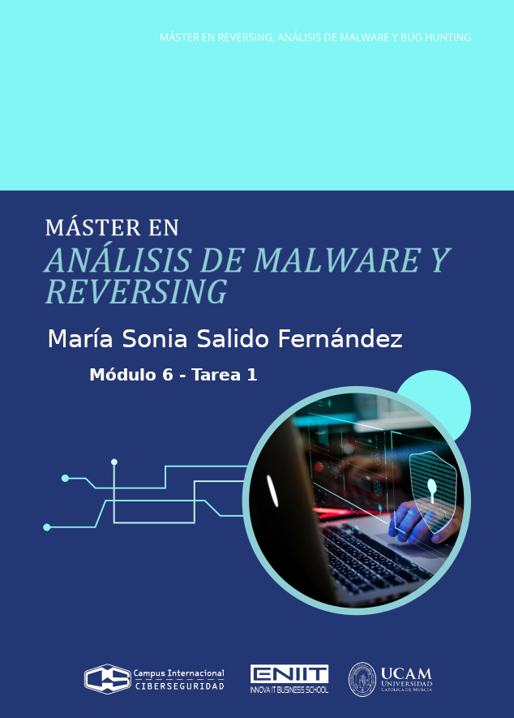
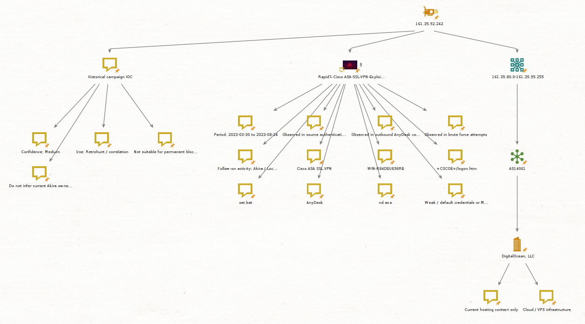
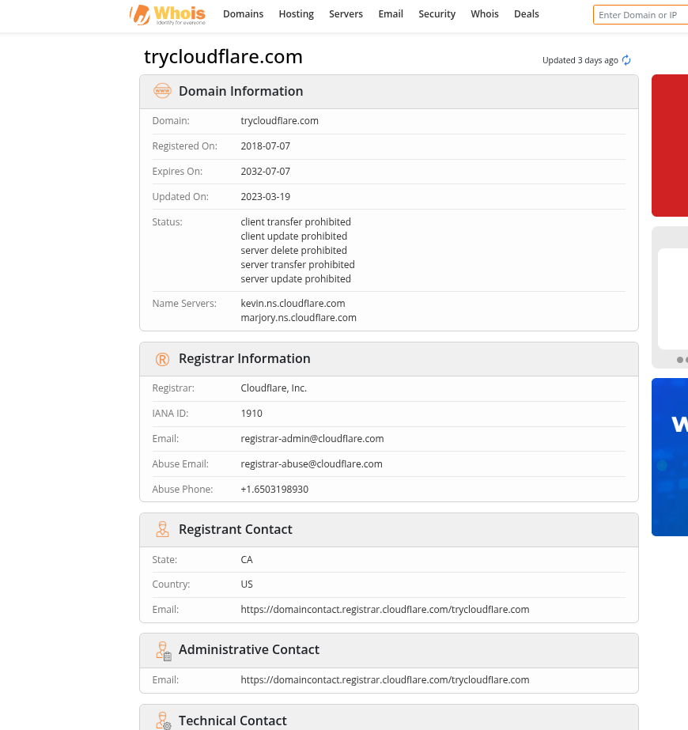

- [**1. Contexto de la amenaza y planes de acción**](#1-contexto-de-la-amenaza-y-planes-de-acción)
  - [**1.1 Descripción general de Akira**](#11-descripción-general-de-akira)
    - [**Objetivos y Víctimas**](#objetivos-y-víctimas)
    - [**Impacto Financiero**](#impacto-financiero)
  - [**1.2 Alcance y superficies afectadas**](#12-alcance-y-superficies-afectadas)
  - [**1.3 Campañas detectadas y evolución técnica de Akira**](#13-campañas-detectadas-y-evolución-técnica-de-akira)
    - [**Ataque del Hipervisor**](#ataque-del-hipervisor)
    - [**Coexistencia de Variantes: El Factor Rust**](#coexistencia-de-variantes-el-factor-rust)
    - [**Payloads de Akira**](#payloads-de-akira)
    - [**Evolución táctica**](#evolución-táctica)
    - [**Atacando las plataformas de virtualización**](#atacando-las-plataformas-de-virtualización)
    - [**Uso de herramientas legítimas**](#uso-de-herramientas-legítimas)
    - [**Resumen de las Campañas con sus IOCs**](#resumen-de-las-campañas-con-sus-iocs)
    - [**Tabla Resumen de las Campañas**](#tabla-resumen-de-las-campañas)
  - [**1.4 Modus operandi resumido**](#14-modus-operandi-resumido)
- [**2. Obtención de información en fuentes abiertas OSINT**](#2-obtención-de-información-en-fuentes-abiertas-osint)
  - [**2.1 Metodología OSINT aplicada**](#21-metodología-osint-aplicada)
  - [**2.2 Estrategia de búsqueda y “dorks”/consultas**](#22-estrategia-de-búsqueda-y-dorksconsultas)
  - [**2.3 Tipologías de fuentes y qué aportan**](#23-tipologías-de-fuentes-y-qué-aportan)
  - [**2.4 Evaluación de fuentes: fiabilidad vs credibilidad**](#24-evaluación-de-fuentes-fiabilidad-vs-credibilidad)
  - [**2.5 Tabla de fuentes OSINT**](#25-tabla-de-fuentes-osint)
- [**3. Análisis de IoCs clave detectados**](#3-análisis-de-iocs-clave-detectados)
  - [**3.1 Tabla 1. Resumen operativo de IoCs de Akira**](#31-tabla-1-resumen-operativo-de-iocs-de-akira)
  - [**3.2 Tabla 2. Contexto, vigencia y evidencia de IoCs**](#32-tabla-2-contexto-vigencia-y-evidencia-de-iocs)
  - [**3.3 Malware asociado a este ransomware**](#33-malware-asociado-a-este-ransomware)
    - [**1. Payload principal de ransomware**](#1-payload-principal-de-ransomware)
    - [**2. Variante Megazord del malware**](#2-variante-megazord-del-malware)
    - [**3. Akira\_v2**](#3-akira_v2)
    - [**4. Variante Linux / ESXi y expansión a AHV**](#4-variante-linux--esxi-y-expansión-a-ahv)
    - [**5. Malware auxiliar observado en operaciones Akira**](#5-malware-auxiliar-observado-en-operaciones-akira)
    - [**6. Herramientas de robo de credenciales y acceso asociadas**](#6-herramientas-de-robo-de-credenciales-y-acceso-asociadas)
    - [**7. Herramientas legítimas abusadas que forman parte del ecosistema Akira**](#7-herramientas-legítimas-abusadas-que-forman-parte-del-ecosistema-akira)
  - [**3.4 TTPS asociados**](#34-ttps-asociados)
    - [**Tabla resumen de TTPs asociados**](#tabla-resumen-de-ttps-asociados)
  - [**3.5 Investigación de las direcciones IPS detectadas**](#35-investigación-de-las-direcciones-ips-detectadas)
    - [**Tabla resumen de direcciones IPs**](#tabla-resumen-de-direcciones-ips)
    - [**IP 161.35.92.242**](#ip-1613592242)
    - [**IP 176.124.201.200**](#ip-176124201200)
    - [**Grafo con Maltego**](#grafo-con-maltego)
  - [**3.6 Investigación de los dominios asociados**](#36-investigación-de-los-dominios-asociados)
- [**4. Análisis de los actores detrás de la amenaza**](#4-análisis-de-los-actores-detrás-de-la-amenaza)
  - [**4.1 Motivación**](#41-motivación)
  - [**4.2 Victimología**](#42-victimología)
  - [**4.3 Modelo operativo**](#43-modelo-operativo)
  - [**4.4 Conclusión**](#44-conclusión)
- [**5. Planes de acción y respuesta**](#5-planes-de-acción-y-respuesta)
  - [**5.1 Detección**](#51-detección)
  - [**5.2 Contención**](#52-contención)
  - [**5.3 Erradicación**](#53-erradicación)
  - [**5.4 Recuperación**](#54-recuperación)
  - [**5.6 Prevención**](#56-prevención)
- [**6. Conclusión**](#6-conclusión)
  - [**6.1 IoCs más relevantes**](#61-iocs-más-relevantes)
  - [**6.2. Las direcciones IPS detectadas**](#62-las-direcciones-ips-detectadas)
  - [**6.3 Los actores detrás de la amenaza**](#63-los-actores-detrás-de-la-amenaza)
  - [**6.4 Recomendaciones priorizadas**](#64-recomendaciones-priorizadas)

# **1. Contexto de la amenaza y planes de acción**
## **1.1 Descripción general de Akira**
Akira es una operación de **ransomware-as-a-service (RaaS)** observada desde marzo de 2023. Los desarrolladores mantienen el malware y la infraestructura de negociación/extorsión, mientras que afiliados o actores asociados ejecutan la intrusión, la expansión interna, la exfiltración y el despliegue del cifrado. Los advisories públicos coinciden en que Akira ha operado de forma `affiliate-based`, con capacidad para **impactar tanto entornos Windows como Linux**, y con especial interés en las infraestructuras corporativas que están expuestas en Internet. [(Isomer User Content)](https://isomer-user-content.by.gov.sg/36/b6648462-ce24-45f3-8fef-b95320241df0/joint-technical-advisory-on-akira.pdf)

Según los informes públicos, Akira emplea de forma predominante una **estrategia de doble extorsión:** antes o junto al cifrado, los afiliados roban información de la víctima y la usan como palanca adicional para presionar el pago. Esta lógica incrementa el impacto porque la organización no sólo afronta indisponibilidad operativa, sino también, riesgo de fuga de datos, exposición regulatoria, afectación reputacional y potencial extorsión secundaria. [Unit 42](https://unit42.paloaltonetworks.com/threat-assessment-howling-scorpius-akira-ransomware/) y [MITRE](https://attack.mitre.org/groups/G1024/) describen precisamente este patrón de exfiltración previa al cifrado y amenaza de publicación en su web de filtraciones, Data Leak Site - DLS, alojado en la red Tor, que poseía una estética "retro" que simula una terminal de comandos de los años 80. [(Arete)](https://6288364.fs1.hubspotusercontent-na1.net/hubfs/6288364/Website/Other%20Reports/2024-11%20Arete_Malware%20Spotlight%20Akira%20Ransomware.pdf)

### **Objetivos y Víctimas**
Según los datos de respuesta a incidentes, Akira se ha dirigido a una amplia gama de sectores, incluyendo educación, finanzas, inmobiliaria, manufactura, servicios profesionales y atención médica. Inicialmente, se enfocaron en pequeñas y medianas empresas (PYMES), pero han escalado hacia grandes corporaciones e infraestructuras críticas. Akira prioriza objetivos que combinen exposición externa, dependencia operativa de TI y probabilidad razonable de pago. [(Stop Ransomware)](https://www.ic3.gov/CSA/2024/240418.pdf)

### **Impacto Financiero**
Las demandas de rescate observadas varían significativamente dependiendo de la facturación de la víctima, oscilando típicamente entre 200.000 dólares y 4 millones de dólares. La media de la demanda inicial se sitúa en torno a los 500.000 dólares, con pagos facilitados que rondan los 150.000 dólares tras la negociación. Al 1 de enero de 2024, se estimaba que el grupo había acumulado aproximadamente 42 millones de dólares en ganancias ilícitas afectando a más de 250 organizaciones.
[HC3-Analyst-Note](https://www.hhs.gov/sites/default/files/akira-randsomware-analyst-note-feb2024.pdf)

La actualización de noviembre de 2025 elevó esa cifra a unos 244,17 millones de dólares en ingresos reclamados hasta finales de septiembre de 2025. Conviene tratar estas magnitudes como cifras de advisories públicos y reclamaciones atribuidas a la operación, no como una contabilidad verificable. [Stop Ransomware](https://www.ic3.gov/CSA/2024/240418.pdf)

## **1.2 Alcance y superficies afectadas**
La versatilidad técnica de Akira le permite comprometer diversas superficies dentro de un entorno corporativo heterogéneo. El malware ha sido desarrollado para afectar a los dos sistemas operativos más críticos en la infraestructura empresarial:

**1. Entornos Windows (Versión V1 y Megazord):** El ransomware original, escrito en C++, está diseñado para sistemas Windows. Afecta a estaciones de trabajo y servidores, cifrando archivos y añadiendo extensiones como `.akira` o `.powerranges`. Utiliza la API de `Restart Manager` de Windows para cerrar procesos y servicios, como por ejemplo bases de datos SQL, que podrían mantener archivos bloqueados, asegurando así un cifrado exitoso

**2. Entornos Linux y Virtualización (Variante ESXi):** Dada la prevalencia de la virtualización en entornos corporativos, los operadores de Akira desarrollaron una variante específica para Linux, escrita inicialmente en C++ y portada posteriormente a Rust en su versión v2, dirigida explícitamente a máquinas virtuales VMware ESXi. Esto permite a los atacantes cifrar cientos de servidores virtuales simultáneamente al atacar el hipervisor, maximizando el impacto operativo.

**Activos Críticos Comprometidos:** Además de los servidores de archivos y bases de datos, Akira ataca componentes vitales para la recuperación y continuidad del negocio:[(Logpoint)](https://logpoint.com/hubfs/blog_assets/emerging-threats-akira.pdf?hsLang=en)
- Copias de Seguridad (Shadow Copies): El malware elimina sistemáticamente las Volume Shadow Copies (VSS) mediante comandos de PowerShell para impedir la restauración rápida sin las claves de descifrado.

- Controladores de Dominio: Los atacantes buscan comprometer el Directorio Activo para desplegar políticas de grupo (GPO) que distribuyan el ransomware a toda la red.

## **1.3 Campañas detectadas y evolución técnica de Akira**
Para este apartado nos basamos en el aviso técnico oficial de ciberseguridad publicado el 18 de abril de 2024, con identificador AA24-109A y título **#StopRansomware: Akira Ransomware.** [(Advisori - Boletín técnico oficial)](https://www.ic3.gov/CSA/2024/240418.pdf). En este documento, FBI, CISA, EC3 (Europol) y NCSC-NL recopilan TTPs, variantes observadas, vectores de acceso, mitigaciones y recomendaciones defensivas sobre Akira. Es un boletín/alerta técnica oficial usado para compartir inteligencia operativa con equipos defensivos:
- Qué se ha observado.
- Cómo entra el actor.
- Cómo se mueve.
- Qué herramientas usa.
- Qué controles recomiendan las agencias.

El propio documento dice que forma parte de la iniciativa #StopRansomware y que está dirigido a “network defenders”. Este boletín fue actualizado el 13 de noviembre de 2025, manteniendo el mismo código de advisory.

La evolución de Akira no es simplemente un cambio de código, es una respuesta estratégica a las defensas corporativas y a los movimientos del mercado de infraestructura IT. Un elemento especialmente relevante en las campañas atribuidas a Akira es que no se trata de una operación estática, sino de una amenaza con evolución progresiva del `encryptor`, ampliación de plataformas objetivo y ajustes tácticos en función de su eficacia operativa. El advisory conjunto de 2024 ya indicaba que, tras un foco inicial sobre sistemas Windows, los operadores desplegaron en abril de 2023 una variante Linux orientada a `VMware ESXi`, lo que marcó un cambio cualitativo: **Akira dejó de ser únicamente un ransomware para estaciones y servidores Windows y pasó a atacar de forma directa la capa de virtualización**, aumentando el impacto potencial sobre múltiples cargas de trabajo a la vez.

### **Ataque del Hipervisor**
**Atacar el hipervisor permite comprometer de una sola vez varias máquinas virtuales críticas**, reducir tiempos de cifrado y elevar la presión sobre la víctima, especialmente en entornos donde aplicaciones de negocio, bases de datos y servicios internos dependen de una infraestructura virtual consolidada. En términos defensivos, este cambio supone que la superficie relevante ya no es sólo el `endpoint Windows`, sino también los `hosts de virtualización`, sus credenciales administrativas, los accesos remotos y los repositorios de backup ligados al clúster. Según los advisories públicos, esta ampliación de objetivo fue observable desde etapas relativamente tempranas de la operación.

Inicialmente, Akira se comportaba como un ransomware convencional centrado en Windows. Sin embargo, su maduración técnica lo llevó a priorizar los hypervisors, donde reside el núcleo de los datos empresariales.

- **Variante Linux/ESXi:** El desarrollo de un cifrador específico para `VMware ESXi` permitió a los atacantes apagar máquinas virtuales y cifrar los archivos de disco virtual `.vmdk` de forma masiva. Esto es mucho más eficiente que infectar cada sistema operativo invitado uno por uno.

- **Expansión a Nutanix AHV:** El incidente de junio de 2025 marcó un punto de inflexión. Al atacar `Nutanix Acropolis Hypervisor (AHV)`. El uso de comandos específicos para interactuar con el almacenamiento distribuido de Nutanix sugiere un conocimiento profundo de arquitecturas de hiperconvergencia.

### **Coexistencia de Variantes: El Factor Rust**
La diversificación del código de Akira busca dos objetivos: evadir la detección basada en firmas y maximizar la compatibilidad multiplataforma.
- **Las primeras variantes Akira:** Habían sido desarrolladas en C++ y usaban la extensión `.akira`.

- **Megazord:** Esta variante, detectada inicialmente en 2024, destaca por estar escrita en Rust. El uso de Rust permite una ejecución extremadamente rápida y dificulta la ingeniería inversa. Megazord suele utilizar una extensión de archivo específica y un sistema de notas de rescate que imita la estética de los `Power Rangers`.

- **Akira_v2:** Representa la consolidación de las lecciones aprendidas en `ESXi`. Tanto MITRE como el advisory actualizado de 2025 describen Akira_v2 como una variante también escrita en Rust, diseñada para `VMware ESXi`, con argumentos de línea de comandos y capacidades ampliadas respecto a versiones previas. El advisory 2025 indica que esta variante puede trabajar con rutas por defecto de `ESXi`, añadir nuevas extensiones de salida como `.akiranew` o `.aki`, e incorporar funciones como `vmonly` y `stopvm`, lo que sugiere una orientación más explícita hacia la gestión de máquinas virtuales como objeto principal del impacto. Desde una perspectiva de campaña, esto muestra que Akira no sólo trasladó el cifrado a `Linux/ESXi`, sino que lo especializó para operar con mayor precisión sobre entornos virtualizados. [(attack.mitre)](https://attack.mitre.org/software/S1194/)

### **Payloads de Akira**
Otro hallazgo relevante según el boletín técnico oficial de 2024 y su actualización posterior, es que en al menos un compromiso se observó el **uso concurrente de dos payloads distintos** según la arquitectura del sistema comprometido:
- Megazord para Windows.
- Y un segundo payload identificado más tarde como Akira_v2 para ESXi.

Este detalle es técnicamente significativo porque sugiere una campaña multi-arquitectura, preparada para cifrar de forma coordinada diferentes capas del entorno de las víctimas.

### **Evolución táctica**
Cisco Talos aporta además una lectura muy útil sobre la evolución táctica de 2024. Según su análisis, a comienzos de ese año Akira pareció **reducir temporalmente el uso del cifrado y priorizar campañas centradas en exfiltración de datos sin encryptor visible**, con "una confianza de baja a moderada en que esa decisión estuvo relacionada con el tiempo necesario para retocar o rehacer el encryptor". Talos observó durante ese periodo el desarrollo iterativo de una variante Rust para ESXi y, posteriormente, una vuelta a tácticas que combinaban otra vez robo de datos y cifrado. Esta observación es importante porque **rompe la idea de que Akira opera siempre con una secuencia fija: según campaña y momento evolutivo**, "el grupo puede inclinarse más hacia la extorsión por datos o volver al esquema clásico de doble extorsión". [(Cisco Talos Blog)](https://blog.talosintelligence.com/akira-ransomware-continues-to-evolve/)

Talos también observó indicios de una reversión parcial desde algunas implementaciones en Rust hacia encryptors nuevamente escritos en C++, tanto en Windows como en Linux, durante la segunda mitad de 2024. Su hipótesis es que "esta vuelta a variantes previas pudo responder a una búsqueda de estabilidad y fiabilidad operativa por encima de la innovación técnica". En otras palabras, la operación parece haber experimentado con Rust para ganar flexibilidad y modularidad, pero habría mantenido o recuperado binarios anteriores cuando estos ofrecían mejores resultados prácticos para los afiliados. **El desarrollo técnico se adapta a lo que resulte más eficaz para la mejorar la monetización.**

| Fase | Estrategia Dominante | Razón Técnica/Estratégica |
| -- | -- | -- |
| Principios 2024 | Doble Extorsión | Cifrado + Amenaza de filtración. |
| Mediados 2024 | Exfiltración Pura | Reajuste de encryptors tras filtraciones de código o mejoras en EDRs. |
| 2025 - 2026 | Cifrado Híbrido | Ataque directo a almacenamiento masivo (Nutanix/ESXi) combinado con exfiltración selectiva. |

### **Atacando las plataformas de virtualización**
La actualización del boletín técnico oficial de noviembre de 2025 añade otro salto importante: en un incidente de **junio de 2025**, los actores de Akira **cifraron por primera vez archivos de disco de máquinas virtuales en Nutanix AHV**, ampliando explícitamente su capacidad más allá de VMware ESXi y Hyper-V. El propio documento vincula ese incidente al abuso de **CVE-2024-40766**, descrita allí como una vulnerabilidad usada en la intrusión. Este dato es especialmente relevante porque confirma que la operación ya no debe modelarse únicamente como una amenaza para Windows y ESXi, sino como un actor con interés creciente por diversificar plataformas de virtualización y explotar puntos de acceso que le permitan llegar al plano donde residen las cargas críticas.

> CVE-2024-40766 es una vulnerabilidad crítica de control de acceso en SonicWall SonicOS que afecta al plano de administración y a SSLVPN, y que puede facilitar acceso no autorizado a recursos del dispositivo. Su relevancia en campañas de ransomware radica en que ha sido explotada en entornos reales y, según comunicaciones públicas del fabricante en 2025, se ha correlacionado con actividad maliciosa reciente sobre firewalls Gen 7, especialmente en equipos migrados desde Gen 6 con credenciales locales no reseteadas, circunstancia que habría favorecido intrusiones asociadas en fuentes abiertas a actores como Akira.[(mist.gov)](https://nvd.nist.gov/vuln/detail/cve-2024-40766)

En conjunto, **las campañas observadas muestran una evolución en tres ejes:**
- Primero, un eje de plataforma, que va de Windows a ESXi y posteriormente a AHV.
- Segundo, un eje de tooling, con coexistencia de binarios en C++ y Rust, y de variantes como Akira, Megazord y Akira_v2.
- Tercero, un eje táctico, donde Akira alterna entre campañas de doble extorsión “clásica” y fases con mayor peso de la exfiltración sin cifrado.

Para defensa y respuesta, esto obliga a evitar una visión reduccionista del grupo: **Akira no debe tratarse como una única muestra de malware, sino como una operación adaptable, con capacidad para modificar el encryptor, la plataforma objetivo y el equilibrio entre robo de datos y cifrado según el contexto de la campaña.**

### **Uso de herramientas legítimas**
Para exfiltrar grandes volúmenes de información antes de que se activen las alarmas, Akira suele apoyarse en programas legítimos que ya existen en muchas empresas o que parecen normales para un administrador. A eso se le llama `Living-off-the-Land` (LotL).

En vez de desplegar una herramienta extraña que el antivirus detecte enseguida, Akira usa cosas como:
- Utilidades de compresión:
    - WinRAR: Para crear un archivo grande con documentos.
    - 7-Zip.
- Transferencia de archivos:
    - WinSCP y FileZilla: Para transferencias manuales de archivos críticos.
    - Rclone: Para sincronizar datos con nubes públicas como Mega, Amazon S3.
- Acceso remoto:
    - En Akira, los avisos oficiales describen sobre todo el abuso de AnyDesk y otras utilidades legítimas de acceso remoto para mantener persistencia, mezclarse con actividad administrativa y pivotar lateralmente dentro del entorno comprometido.
- Comandos del sistema: PowerShell, cmd, wmic, net
    - Se han detectado scripts en PowerShell que automatizan la búsqueda de archivos con extensiones financieras o legales antes de iniciar el cifrado.

### **Resumen de las Campañas con sus IOCs**
**1. Campaña Windows "Legacy" (C++):** Esta es la variante original que consolidó al grupo en 2023. Sus IoCs son los más estables y reconocibles.
- Extensiones de archivo: `.akira`.
- Nota de rescate: `akira_readme.txt`.
- Persistencia/Herramientas: Uso extensivo de `PCHunter64` y `Process Hacker` para desactivar `EDRs`.
    - Ejecución de `net.exe stop "NombreServicio"` para detener bases de datos `SQL` o `Exchange`.
- IoC de red: Conexiones salientes a través de puertos no estándar hacia servicios de almacenamiento como `Mega.nz`.

**2. Variante Megazord (Rust - Windows):** Aparecida a finales de 2023 y principios de 2024, destaca por su velocidad y el uso de un lenguaje de programación más moderno.
- Extensiones de archivo: `.powerranges`.
- Nota de rescate: `powerranges.txt`, a menudo con referencias estética a dicha serie.
- IoC de Comportamiento: Uso de la librería `rust-crypto` para el cifrado `ChaCha20`.
    - Generación de tráfico `SMB` inusualmente alto en periodos muy cortos, debido a la eficiencia de Rust.
- Herramientas de acompañamiento: Uso de `Ngrok` para tunelizar el tráfico de `C2` y saltar firewalls perimetrales.

**3. Variante Akira_v2 (Rust - ESXi / Linux / Windows):** Es la versión más avanzada (2025-2026), diseñada específicamente para entornos de virtualización masiva.
- Extensiones de archivo: `.akiranew` o `.aki`.
- Impacto en Hypervisors: Ejecución de comandos `esxcli` para listar y apagar máquinas virtuales, `vim-cmd vmsvc/power.off`.
- Acceso a rutas `/vmfs/volumes/` para cifrar directamente los archivos `.vmdk`, `.vmem` y `.vmsn`.
- IoC Técnico: Validación de `Build ID`. El binario no se ejecuta si no detecta un entorno específico, lo que dificulta el análisis en sandboxes de investigadores.

**4. Campaña Nutanix AHV (Incidente Junio 2025):** Representa la expansión más reciente del grupo hacia infraestructuras hiperconvergentes `HCI` más allá de VMware.
- Vector de entrada específico: Explotación de `CVE-2024-40766` en dispositivos `SonicWall` para obtener acceso inicial a la red de gestión.
- IoCs de Actividad:
    - Movimiento lateral hacia la `CVM - Controller VM` de Nutanix mediante `SSH` utilizando credenciales robadas.
    - Cifrado de archivos de disco con extensión `.vdisk` y contenedores de almacenamiento Nutanix.
    - Uso de `Veeam Backup & Replication` vulnerabilidades no parcheadas para localizar y destruir backups antes del cifrado.

**5. IoCs Transversales (Exfiltración y C2):** Independientemente de la variante, Akira mantiene un "set" de herramientas preferidas para el robo de datos:
| Categoría | Herramientas / IoCs | Notas |
| -- | -- | -- |
| Exfiltración | "rclone.exe, WinSCP.com, FileZilla.exe" | "Buscan archivos .pdf, .docx, .xlsx y bases de datos." |
| Acceso Remoto | "AnyDesk.exe, LogMeIn, RustDesk" | Instalados en servidores críticos para mantener persistencia. |
| Reconocimiento | "Advanced IP Scanner, NetScan, ShareFinder.ps1" | Utilizados para mapear la red y encontrar hypervisors. |
| Descubrimiento | "nltest /dclist:, Get-ADComputer" | Comandos para enumerar controladores de dominio. |

### **Tabla Resumen de las Campañas**
| Periodo / fase               | Variante o patrón observado                                        | Plataforma objetivo                          | Cambio técnico o táctico más relevante                                                                                                                                                       | Implicación defensiva                                                                                                                                                        | Fuente(s)                                                         |
| ---------------------------- | ------------------------------------------------------------------ | -------------------------------------------- | -------------------------------------------------------------------------------------------------------------------------------------------------------------------------------------------- | ---------------------------------------------------------------------------------------------------------------------------------------------------------------------------- | ----------------------------------------------------------------- |
| Marzo–abril de 2023          | Expansión desde la línea inicial de Akira hacia una variante Linux | Windows y después VMware ESXi                | El grupo pasó de un foco inicial en Windows a desplegar en abril de 2023 una variante Linux para ESXi, ampliando el impacto potencial sobre entornos virtualizados.                          | Priorizar la protección de hipervisores, la segmentación entre plano de usuario y plano de virtualización, y la revisión de credenciales administrativas del entorno VMware. | AA24-109A (2024); AA24-109A update (2025)                         |
| Desde agosto de 2023         | Aparición y uso de Megazord                                        | Windows                                      | Se documentó Megazord como una variante en Rust atribuida a Akira por solapamiento de infraestructura, lo que apunta a una diversificación del tooling.                                      | La detección no debe centrarse en un único binario o extensión; conviene monitorizar familias relacionadas y comportamientos comunes de ransomware afiliado.                 | MITRE ATT&CK S1191; AA24-109A update (2025)                       |
| 2024 (fase de reajuste)      | Campañas con mayor peso de exfiltración sin cifrado visible        | Entornos corporativos mixtos                 | Cisco Talos observó que algunas campañas parecieron priorizar temporalmente la exfiltración mientras los operadores reajustaban el encryptor.                                                | Es crítico detectar compresión, transferencia de datos y herramientas de exfiltración, no solo eventos de cifrado o notas de rescate.                                        | Cisco Talos (2024)                                                |
| 2024–2025                    | Desarrollo y empleo de Akira_v2                                    | VMware ESXi                                  | MITRE describe Akira_v2 como una variante en Rust diseñada para ESXi, con nuevos argumentos de ejecución y capacidades ampliadas.                                                            | Reforzar hardening y telemetría en ESXi, junto con control estricto de acceso remoto y cuentas privilegiadas del hipervisor.                                                 | MITRE ATT&CK S1194; AA24-109A update (2025)                       |
| Junio de 2025                | Extensión del impacto hacia Nutanix AHV                            | Nutanix AHV                                  | El aviso técnico actualizado de 2025 recoge un incidente en el que Akira cifró por primera vez discos de máquinas virtuales en AHV, ampliando su radio de acción más allá de ESXi e Hyper-V. | La defensa frente a Akira debe contemplar múltiples plataformas de virtualización, no únicamente VMware.                                                                     | AA24-109A update (2025)                                           |
| Lectura global de la campaña | Coexistencia de Akira, Megazord y Akira_v2                         | Windows, ESXi y otros entornos virtualizados | La operación muestra una evolución en plataforma, tooling y táctica, lo que sugiere una amenaza adaptable más que una muestra estática de malware.                                           | La respuesta defensiva debe basarse en TTPs y superficie crítica, no solo en nombres de variantes o IoCs puntuales.                                                          | Síntesis: AA24-109A (2024), AA24-109A update (2025), MITRE, Talos |

Referencias de la tabla
- [AA24-109A (2024)](https://www.ic3.gov/CSA/2024/240418.pdf): #StopRansomware: Akira Ransomware, FBI, CISA, EC3 y NCSC-NL, 18 de abril de 2024. El documento indica que, tras un foco inicial en Windows, en abril de 2023 Akira desplegó una variante Linux dirigida a VMware ESXi.

- [AA24-109A update (2025)](https://www.ic3.gov/CSA/2025/251113.pdf): actualización del mismo aviso técnico conjunto, publicada el 13 de noviembre de 2025 por FBI, CISA, DC3 y HHS. Añade la coexistencia de Megazord y Akira_v2, así como el incidente de junio de 2025 que afectó a Nutanix AHV.

- [MITRE ATT&CK S1191](https://attack.mitre.org/software/S1191): entrada de software para Megazord, descrita como variante en Rust usada al menos desde agosto de 2023 para entornos Windows.

- [MITRE ATT&CK S1194](https://attack.mitre.org/software/S1194): entrada de software para Akira_v2, descrita como variante en Rust diseñada para VMware ESXi y observada al menos desde 2024.

- [Cisco Talos (2024)](https://blog.talosintelligence.com/akira-ransomware-continues-to-evolve/): Akira ransomware continues to evolve, publicado el 21 de octubre de 2024, donde se describe la fase en la que algunas campañas parecieron privilegiar la exfiltración mientras el grupo reajustaba su encryptor.

## **1.4 Modus operandi resumido**
El modus operandi de Akira puede describirse, a alto nivel, como una cadena de cuatro fases:
- Acceso inicial.
- Consolidación y movimiento lateral.
- Exfiltración de información.
- Cifrado con extorsión.

No obstante, conviene resaltar que la secuencia exacta puede variar entre campañas, afiliados y oportunidades técnicas. En términos generales, Akira debe entenderse menos como un “ejecutable de cifrado” aislado y más como una operación de intrusión orientada a la extorsión, donde el cifrado constituye la fase final y visible de un compromiso previo más amplio.

El ciclo de vida del ataque de Akira sigue un patrón estructurado que alinea con el marco MITRE ATT&CK, caracterizado por un enfoque manual y "fire-and-forget" (dispara y olvida) en las fases finales.[(MottaSec)](https://github.com/MottaSec/akira-ransomware-reverse/blob/main/docs/technical/04_encryption_strategy_network.md)

**1. Acceso Inicial:** De acuerdo con los avisos técnicos conjuntos y con MITRE ATT&CK, Akira suele obtener acceso inicial mediante credenciales válidas comprometidas, especialmente sobre mecanismos remotos de acceso externo como `VPN`, `RDP` o `SSH`, así como a través de spearphishing, password spraying y, en determinados casos, explotación de vulnerabilidades en dispositivos perimetrales o servidores expuestos. Esta fase muestra una preferencia clara por entornos donde el acceso remoto depende de autenticación débil, configuraciones heredadas o controles de identidad insuficientes. [(Attack Mitre)](https://attack.mitre.org/groups/G1024/)

**2. Persistencia, elevación de privilegios y movimiento lateral:** Una vez dentro, los actores asociados a Akira suelen dedicarse a consolidar su presencia y ampliar el control sobre la red. Según la documentación oficial, esto incluye actividades como la creación de nuevas cuentas, la incorporación de usuarios a grupos privilegiados, el abuso de herramientas legítimas de administración remota y la recopilación de credenciales desde sistemas comprometidos. A continuación, realizan un descubrimiento interno para identificar servidores, controladores de dominio, hipervisores, repositorios de backup y otras rutas de alto valor, y se desplazan lateralmente mediante `RDP`, `SSH`, herramientas remotas legítimas y utilidades de administración ampliamente disponibles. El objetivo de esta fase no es aún cifrar, sino alcanzar posiciones con el máximo rendimiento operativo antes de que la organización detecte la intrusión.[(Isomer user)](https://isomer-user-content.by.gov.sg/36/b6648462-ce24-45f3-8fef-b95320241df0/joint-technical-advisory-on-akira.pdf)

**3. Exfiltración:** Antes del impacto visible, Akira suele proceder a la recolección y extracción de información sensible, siguiendo el modelo de doble extorsión. Los informes públicos describen el uso de utilidades legítimas o de administración habitual para comprimir, preparar y transferir datos fuera del entorno comprometido, reduciendo así la probabilidad de detección temprana. Desde un punto de vista operativo, esta fase es tan relevante como el cifrado posterior, ya que incluso una restauración técnica exitosa no elimina el riesgo derivado de la fuga de documentos internos, información regulada, credenciales, material financiero o propiedad intelectual. Cisco Talos indicó además que, en determinadas campañas de 2024, Akira pareció conceder temporalmente un mayor protagonismo a la exfiltración sin cifrado, lo que refuerza la idea de que la presión extorsiva puede materializarse aun cuando el encryptor no sea la primera manifestación del incidente. [(Cisco Talos Blog)](https://blog.talosintelligence.com/akira-ransomware-continues-to-evolve/)

**4. Cifrado y Extorsión:** Tras consolidar el acceso y extraer información, los actores despliegan el `encryptor` adecuado a la arquitectura del entorno, con variantes documentadas para Windows, Linux y plataformas de virtualización como `VMware ESXi`. MITRE ATT&CK y el aviso técnico conjunto actualizado de 2025 recogen además la coexistencia de variantes como `Megazord` y `Akira_v2`, esta última orientada a `ESXi`, así como la ampliación del impacto hacia otros entornos virtualizados en campañas más recientes. En paralelo, los operadores suelen dificultar la recuperación mediante acciones como la eliminación de mecanismos de restauración locales o la afectación de activos críticos de infraestructura. La fase final se completa con la nota de rescate y la amenaza de publicación de los datos exfiltrados en la infraestructura de filtración del grupo, de forma que la víctima queda sometida a una doble presión: por indisponibilidad operativa y por exposición de la información robada.[(ic3.gov)](https://www.ic3.gov/CSA/2025/251113.pdf)

**En resumen:** El patrón de Akira responde a una lógica de intrusión, expansión, extracción y extorsión. Desde la perspectiva defensiva, esto implica que la organización no debería centrar su vigilancia únicamente en el momento del cifrado, ya que para entonces el actor probablemente ya habrá comprometido identidad, administración remota y datos sensibles. En consecuencia, la detección temprana debe orientarse a las fases previas —acceso anómalo, elevación de privilegios, movimiento lateral y exfiltración—, que son las que determinan la profundidad real del incidente.

----------------------

# **2. Obtención de información en fuentes abiertas OSINT**

## **2.1 Metodología OSINT aplicada**

Para la amenaza Akira se aplicó un flujo OSINT replicable y auditable, orientado a obtener información útil para investigación técnica y defensa: `definición de preguntas → búsqueda inicial → selección → validación → extracción → normalización → correlación → documentación`. En la práctica, el punto de partida fueron fuentes primarias o casi primarias: `avisos técnicos oficiales + MITRE ATT&CK.

Primero, se definieron preguntas concretas:
- qué es Akira,
- desde cuándo se observa,
- qué TTPs (Tácticas, Técnicas y Procedimientos) y variantes se han documentado,
- qué IoCs (Indicadores de Compromiso) están publicados,
- qué técnicas defensivas se recomiendan y
- qué cambios recientes han aparecido en campañas o infraestructura.

Después, se ejecutó una búsqueda escalonada: dominio oficial, framework ATT&CK, vendors reconocidos, repositorios de detección, sandboxes y, por último, tracking de víctimas o leak-tracking. La selección posterior priorizó documentos con fecha clara, autor identificable, evidencia observable y trazabilidad.

**Criterios de validez aplicados**
- Actualidad: Se priorizaron informes de 2024 y 2025 para reflejar las tácticas más recientes.
- Evidencia Técnica: Preferencia por documentos que incluyen capturas de tráfico, depuración de código o logs reales.
- Corroboración Cruzada: Un dato se considera confirmado sólo si aparece en al menos dos fuentes independientes.

## **2.2 Estrategia de búsqueda y “dorks”/consultas**
La recolección de información se basó en consultas específicas `dorks` diseñadas para filtrar ruido y localizar documentación técnica de alto valor.

**Tabla 1. Consultas OSINT base para Akira:**
| Consulta (Dork) | Objetivo de inteligencia | Justificación |
|---|---|---|
| `"Akira ransomware" advisory IOC` | Localizar advisories técnicos e indicadores de compromiso (IoCs). | Combina el nombre de la amenaza con términos típicos de informes defensivos, por lo que suele devolver avisos oficiales, blogs de threat intel y documentos con tablas de IoCs. |
| `site:cisa.gov Akira ransomware` | Obtener información oficial de organismos de ciberseguridad. | Restringe la búsqueda al dominio de CISA, priorizando alertas, mitigaciones y referencias institucionales de alta fiabilidad. |
| `site:ic3.gov AA24-109A Akira` | Recuperar el aviso técnico oficial específico sobre Akira. | Busca directamente el identificador del advisory conjunto AA24-109A, útil para fijar una fuente primaria y trazable. |
| `Akira ransomware MITRE ATT&CK` | Mapear TTPs, técnicas ATT&CK y contexto del grupo/software. | Permite localizar la entrada de MITRE y normalizar la investigación con tácticas, técnicas y procedimientos estandarizados. |
| `Akira ransomware S1129` | Acceder a la ficha ATT&CK del software Akira. | Usa el identificador ATT&CK del malware para reducir ruido y localizar la entrada técnica concreta del software. |
| `Akira ransomware Akira_v2 S1194` | Identificar la variante Akira_v2 y su orientación técnica. | Facilita el acceso a la ficha ATT&CK de la variante S1194, útil para estudiar la evolución hacia ESXi y otros entornos virtualizados. |
| `Akira ransomware YARA Sigma` | Buscar reglas de detección y contenido de hunting. | Devuelve reglas YARA, Sigma, repositorios comunitarios y material operativo para detección y respuesta. |
| `Akira ransomware ANY.RUN` | Localizar análisis dinámicos y comportamiento observable. | Permite encontrar ejecuciones en sandbox con procesos, archivos, red e IoCs observables de forma reproducible. |
| `Akira ransomware Joe Sandbox` | Obtener análisis automatizados de muestras y artefactos técnicos. | Joe Sandbox suele aportar hashes, comportamiento, artefactos y cronología de ejecución de muestras concretas. |
| `Akira ransomware MalwareBazaar` | Buscar hashes, muestras etiquetadas y first/last seen. | Es útil para pivotes técnicos sobre muestras, firmas y enriquecimiento de IoCs asociados a Akira. |
| `Akira ransomware SonicWall Rapid7` | Investigar campañas recientes y posibles vectores de acceso inicial. | Ayuda a localizar análisis de incidentes o MDR relacionados con Akira y dispositivos perimetrales, especialmente edge devices y VPN. |
| `Akira leak site` | Contextualizar la infraestructura de extorsión y cronología pública de víctimas. | Sirve para contexto OSINT sobre la fase de doble extorsión, aunque debe tratarse con cautela y sin enlazar ni acceder a contenido ilegal. |

**Tabla 2. Dorks complementarios y consultas avanzadas:**
| Consulta (Dork) | Objetivo de inteligencia | Justificación |
|---|---|---|
| `"Akira ransomware" filetype:pdf advisory IOC` | Obtención de informes técnicos y listas de indicadores de compromiso. | Filtra documentos formales en PDF, que suelen contener análisis más estructurados, tablas de IoCs estáticas y anexos técnicos reutilizables. |
| `site:cisa.gov OR site:fbi.gov "Akira ransomware"` | Priorizar fuentes oficiales de gobierno y agencias de seguridad. | Permite localizar avisos, alertas y comunicados oficiales de alto valor analítico, como el advisory AA24-109A. |
| `"Akira ransomware" AND ("CVE-2020-3259" OR "CVE-2023-20269")` | Identificar posibles vectores de acceso inicial asociados a vulnerabilidades concretas. | Relaciona la amenaza con CVEs explotadas en campañas o investigaciones públicas, útil para estudiar superficie expuesta y acceso inicial. |
| `"Akira" ransomware malware analysis github` | Buscar reglas de detección, utilidades y scripts de análisis. | Suele localizar repositorios con reglas YARA, Sigma, scripts de apoyo, muestras de ingeniería inversa o material técnico auxiliar. |
| `"Akira" ransomware MITRE ATT&CK TTP` | Mapear tácticas, técnicas y procedimientos del actor o malware. | Ayuda a encontrar matrices ATT&CK y contenido de threat intel centrado en persistencia, movimiento lateral, exfiltración y cifrado. |
| `intitle:"index of" "akira" ransomware` | Explorar directorios abiertos o repositorios expuestos relacionados con la amenaza. | Para uso con fines defensivos o de investigación. |

## **2.3 Tipologías de fuentes y qué aportan**

**Organismos oficiales (CERT/CSIRT/agencias):** Son la base del análisis cuando existe material específico de la amenaza. En Akira, el `advisory conjunto FBI/CISA/EC3/NCSC-NL/DC3/HHS` y el `advisory conjunto CSA/SPF/PDPC` aportan TTPs, IoCs, mitigaciones, cronología y contexto sectorial, además de un nivel de autoridad superior al de fuentes derivadas. Son especialmente valiosos para fijar los hechos consolidados.[(ic3.gov)](https://www.ic3.gov/CSA/2025/251113.pdf)

**Vendors de ciberseguridad / Threat Intel:** Aportan el detalle que a menudo no cabe en un advisory: evolución de campañas, cambios de encryptor, tooling adicional, hipótesis sobre motivación operativa y ejemplos de intrusion chain. En Akira, Cisco Talos, Unit 42 y Rapid7 complementan bien el marco oficial, aunque su peso debe modularse según la evidencia publicada en cada pieza.[(Cisco Talos Blog)](https://blog.talosintelligence.com/akira-ransomware-continues-to-evolve/)

**Frameworks y bases de conocimiento:** MITRE ATT&CK es especialmente útil para normalizar la investigación: permite traducir descripciones narrativas a técnicas y sub-técnicas, y separar grupo, software y variantes. En Akira, las entradas del grupo G1024 y del software S1129/S1194 ayudan a consolidar nomenclatura, alias y mapeo ATT&CK. [(mitre attack)](https://attack.mitre.org/groups/G1024)

**Repositorios técnicos:** GitHub y otros repositorios similares, aportan reglas YARA/Sigma, scripts auxiliares y materiales de emulación o validación. Su utilidad es alta para operacionalizar detección, pero su autoridad es desigual y deben tratarse como material técnico a validar, no como fuente primaria. [(Rivitna)](https://github.com/rivitna/Malware) - [(MottaSec)](https://github.com/MottaSec/akira-ransomware-reverse)

**Sandboxes y análisis de malware:** ANY.RUN y Joe Sandbox aportan evidencia observable: hashes, tiempos de ejecución, procesos, archivos, IOCs y veredictos dinámicos. Son especialmente valiosos para elevar la credibilidad de un indicador concreto. [(any.run)](https://any.run/malware-trends/akira/)

**Repositorios de muestras y agregadores técnicos:** Plataformas como MalwareBazaar ayudan a ver first seen / last seen, disponibilidad de muestras y volumen relativo de observaciones. Son útiles para cazar hashes, enriquecer pivotes y corroborar presencia de una familia.[(bazaar.abuse.ch)](https://bazaar.abuse.ch/browse/tag/akira/)

**Agregadores de incidentes / leak tracking:** Son útiles para cronología, volumen aparente de víctimas y actividad pública del grupo. Su mejor uso es contextual y comparativo, no probatorio. En Akira, herramientas como `ransomware.live` o `ransomwatch` pueden servir para seguimiento de víctimas y timeline, siempre sin interacción directa con infraestructura criminal y siempre corroborando con fuentes oficiales o vendors. [(ransomware.live)](https://www.ransomware.live/groupstats/akira?utm_source=chatgpt.com)

## **2.4 Evaluación de fuentes: fiabilidad vs credibilidad**
Es importante tener en cuenta los conceptos de:
- Fiabilidad: Entendida como, el grado de confianza que merece la fuente en sí misma, por su autoridad, estabilidad, control editorial, experiencia y consistencia histórica.

- Credifilidad: Entendida como, grado en que una afirmación concreta puede verificarse o reproducirse, a partir de evidencia técnica observable.

Para la tabla del punto siguiente la que utilizaremos estos conceptos, vamos a definir la siguiente escala:

| Nivel     | Fiabilidad                                                                                                                                        | Credibilidad                                                                                                                                          |
| --------- | ------------------------------------------------------------------------------------------------------------------------------------------------- | ----------------------------------------------------------------------------------------------------------------------------------------------------- |
| **Alta**  | Fuente primaria o muy consolidada: organismo oficial, framework reconocido o vendor con metodología clara, autoría visible y revisión/versionado. | Aporta evidencia verificable: IoCs en STIX/JSON, ATT&CK mapping, hashes, muestras, logs, capturas de sandbox, identificadores o trazas reproducibles. |
| **Media** | Fuente reputada pero no primaria, o repositorio técnico/comunitario útil con mantenimiento razonable.                                             | La afirmación es plausible y parcialmente verificable, pero la evidencia es incompleta, indirecta o depende de contrastarla con otra fuente.          |
| **Baja**  | Fuente anónima, sensacionalista, sin control editorial, sin fecha o con historial inconsistente.                                                  | No aporta evidencia técnica suficiente, reutiliza contenido de terceros sin trazabilidad o formula afirmaciones que no pueden reproducirse.           |

## **2.5 Tabla de fuentes OSINT**
Fuentes principales utilizadas para el análisis de Akira, clasificadas según los criterios definidos.

| Fuente (Título)                                                                       | Tipo                                       |                             Fecha pub. | Qué aporta                                                                   | Fiabilidad | Credibilidad | Notas                                                                                                                                                          |
| ------------------------------------------------------------------------------------- | ------------------------------------------ | -------------------------------------: | ---------------------------------------------------------------------------- | ---------- | ------------ | -------------------------------------------------------------------------------------------------------------------------------------------------------------- |
| **#StopRansomware: Akira Ransomware (AA24-109A)**                                     | Agencia / Advisory (FBI, CISA y socios)    |            18/04/2024; act. 13/11/2025 | Visión completa, IoCs oficiales, TTPs, mitigación, variantes, mapeo ATT&CK   | Alta       | Alta         | Fuente base “gold standard”; incluye historial de versión y paquetes STIX/IOC descargables. ([Blackpoint][1])                                                  |
| **Joint Advisory On Akira Ransomware**                                                | Organismo oficial (CSA/SPF/PDPC, Singapur) |                             07/06/2024 | TTPs observados, RaaS, sectores afectados, medidas de mitigación             | Alta       | Alta         | Buena corroboración cruzada de TTPs y del modelo affiliate-based/RaaS. ([Singapore Police Force][2])                                                           |
| **Alerta Técnica: Ransomware AKIRA (AL-2024-017)**                                    | CSIRT (EcuCERT)                            |                             06/08/2024 | TTPs, herramientas de exfiltración, hashes, V1/V2, leak-site context         | Alta       | Alta         | Muy útil para exfiltración y herramientas dual-use; cita AnyDesk, MobaXterm, RustDesk, Ngrok, Cloudflare Tunnel, WinSCP y RClone.                              |
| **Alerta Técnica: Akira Ransomware (AL-2025-042)**                                    | CSIRT (EcuCERT)                            |                             12/08/2025 | Contexto LATAM, foco en MSP, vector de acceso y recomendaciones              | Alta       | Alta         | Aporta contexto regional y confirma el foco sobre MSPs y credenciales/vulnerabilidades.                                                                        |
| **MITRE ATT&CK – Group G1024 (Akira / GOLD SAHARA / PUNK SPIDER / Howling Scorpius)** | Framework                                  |            20/02/2024; mod. 11/03/2025 | Grupo, aliases, TTPs, ATT&CK mapping                                         | Alta       | Alta         | Excelente para normalización y consolidación semántica del actor. ([attack.mitre.org][3])                                                                      |
| **MITRE ATT&CK – Software S1129 (Akira)**                                             | Framework                                  |                             04/04/2024 | Software, capacidades, plataformas, variantes                                | Alta       | Alta         | Separa software de grupo; útil para documentar Akira como malware y no solo como operación. ([attack.mitre.org][4])                                            |
| **MITRE ATT&CK – Software S1194 (Akira_v2)**                                          | Framework                                  |            09/01/2025; mod. 11/03/2025 | Variante ESXi, argumentos y capacidades ampliadas                            | Alta       | Alta         | Muy útil para documentar la especialización hacia VMware ESXi. ([attack.mitre.org][5])                                                                         |
| **Akira ransomware continues to evolve**                                              | Vendor / Threat Intel (Cisco Talos)        |                             21/10/2024 | Evolución del encryptor, campañas, transición táctica exfiltración/cifrado   | Alta       | Media        | Muy valiosa para evolución técnica; parte del valor es analítico y debe cruzarse con fuentes primarias. ([Cisco Talos Blog][6])                                |
| **Threat Assessment: Howling Scorpius (Akira Ransomware)**                            | Vendor / IR / Threat Intel (Unit 42)       |                             02/12/2024 | Casuística IR, regiones/sectores, tooling, leak site, lifecycle técnico      | Alta       | Media-Alta   | Muy útil para attack lifecycle y tooling; incluye captura y análisis del leak site y foco geográfico/sectorial. ([Unit 42][7])                                 |
| **Akira Ransomware Group Utilizing SonicWall Devices for Initial Access**             | Vendor / MDR (Rapid7)                      |                             10/09/2025 | Campaña reciente, edge devices, acceso inicial y contexto SonicWall          | Alta       | Media        | Útil para campañas recientes y superficie perimetral; conviene contrastar con advisories oficiales. ([Rapid7][8])                                              |
| **Akira Ransomware / Threat Profile**                                                 | Vendor (Blackpoint)                        |                             23/10/2024 | Perfil de amenaza, sectores, operación RaaS, herramientas observadas         | Alta       | Media        | Buen resumen ejecutivo-operativo; menos evidencia bruta que sandbox o advisory oficial. ([Blackpoint][1])                                                      |
| **How Darktrace Stopped Akira Ransomware**                                            | Vendor / Caso SOC (Darktrace)              |                             13/09/2023 | Timeline de ataque, comportamiento de red y señales de detección             | Alta       | Media        | Útil para visibilidad de red y secuencia del ataque; orientado a producto. ([darktrace.com][9])                                                                |
| **Deciphering Akira’s Arsenal: Tactics for Uncovering and Countering…**               | Vendor / SIEM (Logpoint)                   |                             21/09/2023 | TTPs, IoCs, hunting en SIEM, queries y detección                             | Alta       | Media        | Muy útil para el apartado de detección; documento temprano pero aún válido para TTPs base. ([logpoint.com][10])                                                |
| **Akira Ransomware Malware Analysis, Overview by ANY.RUN**                            | Sandbox / análisis dinámico                |                             03/03/2025 | Comportamiento, cadena de ejecución, ransom note, TTPs e IoCs observables    | Media      | Alta         | Alta credibilidad en artefactos observados; no describe por sí sola toda la operación RaaS. ([any.run][11])                                                    |
| **Ransomware Akira.exe**                                                              | Sandbox / Joe Sandbox                      |                             05/11/2024 | Hashes, IOC report, dropped files, URLs, Analysis ID, tiempos de ejecución   | Media      | Alta         | Muy útil para trazabilidad pericial de muestra concreta. ([joesandbox.com][12])                                                                                |
| **MalwareBazaar – tag/signature `akira`**                                             | Repositorio de muestras                    |                                    s/f | Hashes, first seen / last seen, sightings, pivotes de muestra                | Media      | Alta         | Página dinámica sin fecha de publicación única; sí expone firstseen/lastseen y sightings verificables. ([bazaar.abuse.ch][13])                                 |
| **Hybrid Malware Analysis for Threat Intelligence: Unveiling Akira Ransomware**       | Académico / técnico                        |                             21/04/2025 | Análisis estático/dinámico, IoCs, Ghidra, PEStudio, metodología reproducible | Media-Alta | Alta         | Artículo con DOI y cita formal; útil para soporte metodológico y detalles del binario. ([ijcesen.com][14])                                                     |
| **GitHub – MottaSec/akira-ransomware-reverse**                                        | Repositorio técnico / RE                   | 08/11/2025 (última referencia visible) | Ingeniería inversa, criptografía, IoCs, estrategias de detección             | Media      | Alta         | Fiabilidad media por autor individual; alta credibilidad técnica por evidencia de código y análisis publicado. ([GitHub][15])                                  |
| **Akira Ransomware: In-Depth Technical Analysis**                                     | Blog técnico / Vendor (Porthas)            |                                    s/f | Caso de estudio técnico, análisis profundo del malware y respuesta           | Media      | Media        | Localicé referencias secundarias al artículo, pero no una ficha estable con fecha exacta verificable desde la propia página en esta búsqueda. ([LinkedIn][16]) |

[1]: https://blackpointcyber.com/threat-profile/akira-ransomware/ "Akira Ransomware"
[2]: https://www.police.gov.sg/media-hub/news/2024/20240607_joint_advisory_on_akira_ransomware "SPF | Joint Advisory On Akira Ransomware"
[3]: https://attack.mitre.org/groups/G1024/ "Akira, GOLD SAHARA, PUNK SPIDER, Howling Scorpius, Group G1024 | MITRE ATT&CK®"
[4]: https://attack.mitre.org/software/S1129/ "Akira, Software S1129 | MITRE ATT&CK®"
[5]: https://attack.mitre.org/software/S1194/ "Akira _v2, Software S1194 | MITRE ATT&CK®"
[6]: https://blog.talosintelligence.com/akira-ransomware-continues-to-evolve/ "Akira ransomware continues to evolve"
[7]: https://unit42.paloaltonetworks.com/threat-assessment-howling-scorpius-akira-ransomware/ "Threat Assessment: Howling Scorpius (Akira Ransomware)"
[8]: https://www.rapid7.com/blog/post/dr-akira-ransomware-group-utilizing-sonicwall-devices-for-initial-access/ "Akira Ransomware Group Utilizing SonicWall Devices for ..."
[9]: https://www.darktrace.com/blog/akira-ransomware-how-darktrace-foiled-another-novel-ransomware-attack "How Darktrace Stopped Akira Ransomware"
[10]: https://logpoint.com/hubfs/blog_assets/emerging-threats-akira.pdf?hsLang=en&utm_source=chatgpt.com "Deciphering Akira's Arsenal: Tactics for Uncovering and ..."
[11]: https://any.run/malware-trends/akira/ "Akira Ransomware Malware Analysis, Overview ..."
[12]: https://www.joesandbox.com/analysis/1549256 "Automated Malware Analysis - Joe Sandbox Cloud Basic"
[13]: https://bazaar.abuse.ch/browse/tag/akira/ "MalwareBazaar | akira"
[14]: https://www.ijcesen.com/index.php/ijcesen/article/view/3393 "Hybrid Malware Analysis for Threat Intelligence"
[15]: https://github.com/MottaSec/akira-ransomware-reverse "MottaSec/akira-ransomware-reverse: Comprehensive ..."
[16]: https://www.linkedin.com/pulse/ransomware-operations-2025-tracking-evolution-threat-actors-i6hxf "Ransomware Operations in 2025: Tracking the Evolution of ..."

------------------------

# **3. Análisis de IoCs clave detectados**
Tomando como referencia el ejemplo incluido en los apuntes del módulo, desarrollaremos los siguientes puntos:
- Indicadores de compromisos asociados.
- Malware asociado.
- TTPS aosciados.
- Investigación de las direcciones IPS detectadas.
- Investigación de los dominios asociados.

## **3.1 Tabla 1. Resumen operativo de IoCs de Akira**

| ID | IoC normalizado | Tipo | Fase del ataque | Estado / utilidad |
|---|---|---|---|---|
| IOC-01 | `d2fd0654710c27dcf37b6c1437880020824e161dd0bf28e3a133ed777242a0ca` (`w.exe`) | SHA-256 | Cifrado / impacto | Alta |
| IOC-02 | `dcfa2800754e5722acf94987bb03e814edcb9acebda37df6da1987bf48e5b05e` (`Win.exe`) | SHA-256 | Cifrado / impacto | Alta |
| IOC-03 | `3298d203c2acb68c474e5fdad8379181890b4403d6491c523c13730129be3f75` / `0ee1d284ed663073872012c7bde7fac5ca1121403f1a5d2d5411317df282796c` (`Akira_v2`) | SHA-256 | Cifrado en ESXi | Alta |
| IOC-04 | `ffd9f58e5fe8502249c67cad0123ceeeaa6e9f69b4ec9f9e21511809849eb8fc` / `dfe6fddc67bdc93b9947430b966da2877fda094edf3e21e6f0ba98a84bc53198` / `131da83b521f610819141d5c740313ce46578374abb22ef504a7593955a65f07` / `9f393516edf6b8e011df6ee991758480c5b99a0efbfd68347786061f0e04426c` (`Megazord`) | SHA-256 | Cifrado Windows | Alta |
| IOC-05 | `9585af44c3ff8fd921c713680b0c2b3bbc9d56add848ed62164f7c9b9f23d065` / `2f629395fdfa11e713ea8bf11d40f6f240acf2f5fcf9a2ac50b6f7fbc7521c83` / `7f731cc11f8e4d249142e99a44b9da7a48505ce32c4ee4881041beeddb3760be` / `95477703e789e6182096a09bc98853e0a70b680a4f19fa2bf86cbb9280e8ec5a` / `0c0e0f9b09b80d87ebc88e2870907b6cacb4cd7703584baf8f2be1fd9438696d` / `c9c94ac5e1991a7db42c7973e328fceeb6f163d9f644031bdfd4123c7b3898b0` | SHA-256 | Cifrado Windows | Alta |
| IOC-06 | `e1321a4b2b104f31aceaf4b19c5559e40ba35b73a754d3ae13d8e90c53146c0f` / `74f497088b49b745e6377b32ed5d9dfaef3c84c7c0bb50fabf30363ad2e0bfb1` / `3d2b58ef6df743ce58669d7387ff94740ceb0122c4fc1c4ffd81af00e72e60a4` | SHA-256 | Cifrado Linux / ESXi | Alta |
| IOC-07 | `VeeamHax.exe` → `aaa6041912a6ba3cf167ecdb90a434a62feaf08639c59705847706b9f492015d` | Hash / nombre de archivo | Credential access / post-exploit | Alta |
| IOC-08 | `Veeam-GetCreds.ps1` → `18051333e658c4816ff3576a2e9d97fe2a1196ac0ea5ed9ba386c46defafdb88` | Hash / script | Credential access / post-exploit | Alta |
| IOC-09 | `PowershellKerberosTicketDumper` → `5e1e3bf6999126ae4aa52146280fdb913912632e8bac4f54e98c58821a307d32` | Hash / script | Credential access | Alta |
| IOC-10 | `sshd.exe` → `8317ff6416af8ab6eb35df3529689671a700fdb61a5e6436f4d6ea8ee002d694` | Hash / nombre de archivo | Persistencia / acceso remoto | Alta |
| IOC-11 | `akira_readme.txt`, `fn.txt`, `akiranew.txt`; extensiones `.akira`, `.powerranges`, `.akiranew`, `.aki` | Archivo / extensión | Impacto / negociación | Alta |
| IOC-12 | `C:\PerfLogs\`, `WebClient.DownloadString()`, `Cobalt Strike`, `STONESTOP` | Ruta / cadena / artefacto | Ingress tool transfer / staging | Media-Alta |
| IOC-13 | `C:\Windows\temp\lsass.dmp`, `rundll32.exe ... comsvcs.dll, MiniDump`, `esentutl.exe /y ... key4.db`, `Login Data` | Ruta / comando | Credential access | Alta |
| IOC-14 | `C:\Windows\tmp\nssm.exe`, `C:\Windows\tmp\nssm-2.24\win64\nssm.exe`, servicio `sysmon`, `C:\Windows\tmp\config.yml` | Ruta / servicio / archivo | Persistencia / túnel / acceso remoto | Media-Alta |
| IOC-15 | `hxxps://akiralkzxzq2dsrzsrvbr2xgbbu2wgsmxryd4csgfameg52n7efvr2id[.]onion` | URL / dominio `.onion` | Negociación / leak site | Media |
| IOC-16 | `hxxp://akiral2iz6a7qgd3ayp3l6yub7xx2uep76idk3u2kollpj5z3z636bad[.]onion` | URL / dominio `.onion` | Extorsión / leak site | Media |
| IOC-17 | `176.124.201[.]200`, `162.35.92[.]242`, `161.35.92[.]242`, `WIN-R84DEUE96RB`, `+CSCOE+/logon.htm`, `set.bat`, `nd.exe` | IP / hostname / URI / archivo | Acceso inicial / brute force / post-auth | Baja-Media |
| IOC-18 | `AnyDesk.exe`, `WinSCP-6.1.2-Setup.exe`, `winscp.rnd`, `winrar-x64-623.exe` | Hash de binario legítimo / auxiliar | Acceso remoto / exfil | Contextual |

## **3.2 Tabla 2. Contexto, vigencia y evidencia de IoCs**

| ID | 1ª / última vez visto (en fuentes) | Evidencia y fuente |
|---|---|---|
| IOC-01 | Obs. 2023-06 a 2025-08 / pub. 2025-11 | Encryptor Akira en tabla oficial de CISA. |
| IOC-02 | Obs. 2023-06 a 2025-08 / pub. 2025-11 | Encryptor Akira en tabla oficial de CISA. |
| IOC-03 | Pub. 2024 / act. 2025 | Muestras `Akira_v2` en CISA y EcuCERT. |
| IOC-04 | 2024 / 2025 | Hashes de `Megazord` publicados por CISA; corroborados por EcuCERT. |
| IOC-05 | Muestras creadas 2023-12-28 / pub. 2025-11 | Samples Windows en CISA Table 6; parte también en EcuCERT. |
| IOC-06 | Pub. 2025 | Muestras ELF/Linux en CISA Table 7. |
| IOC-07 | 2024 / 2025 | Herramienta para extraer credenciales de Veeam, listada por CISA y EcuCERT. |
| IOC-08 | 2024 / 2025 | Script para obtener y descifrar cuentas de Veeam. |
| IOC-09 | 2024 / 2025 | Dumper de tickets Kerberos desde caché LSA. |
| IOC-10 | 2024 / 2025 | Catalogado como OpenSSH backdoor en EcuCERT. |
| IOC-11 | 2023 / 2025 | CISA y Sophos documentan ransom notes y extensiones; `akiranew.txt` aparece con `Akira_v2`. |
| IOC-12 | 2025 | CISA documenta staging en `PerfLogs` y descarga con `WebClient.DownloadString()`. |
| IOC-13 | 2024 / 2025 | CISA publica comandos concretos de robo de credenciales y acceso a Firefox/Chrome. |
| IOC-14 | 2023 | Sophos observó `nssm.exe` creando el servicio `sysmon` y lanzando `Ngrok` o `Ligolo-ng`. |
| IOC-15 | 2024 / vigente en trackers 2026 | Aparece en EcuCERT como URL TOR; útil para inteligencia, no para bloqueo preventivo estándar. |
| IOC-16 | 2026 en tracker | WatchGuard lo lista como extortion link; útil para contexto y retroanálisis. |
| IOC-17 | 2023-03-30 a 2023-08-24 | Rapid7 los observó en la oleada contra Cisco ASA SSL VPN; valor principal para retrohunt. |
| IOC-18 | 2024 / 2025 | EcuCERT los publicó por estar presentes en incidentes, pero son herramientas legítimas y su valor es contextual. |

## **3.3 Malware asociado a este ransomware**
El malware asociado a Akira no es un único binario, sino un ecosistema de payloads de cifrado, loaders, proxys/RATs, herramientas de credential access y utilidades legítimas usadas para el ataque. Esa distinción es importante: una parte del “arsenal Akira” es malware propiamente dicho y otra parte son herramientas que los afiliados usan para moverse, exfiltrar y desactivar defensas.

### **1. Payload principal de ransomware**
El payload principal es Akira como malware de cifrado, catalogado por MITRE como S1129. Tal y como desarrollamos en el Apartado 1 de este ejercicio, MITRE lo describe como un ransomware escrito en C++, asociado de forma destacada, aunque no exclusiva, a la operación RaaS Akira, con uso de cifrado híbrido y argumentos de ejecución para adaptar el ataque al entorno víctima.

[Ver apartado 1 - payload](#payloads-de-akira)

### **2. Variante Megazord del malware**
Uno de los componentes más relevantes del ecosistema es Megazord, descrito en el advisory conjunto de 2025 como un encryptor escrito en Rust que comenzó a aparecer en ataques desde agosto de 2023 y que cifraba con la extensión `.powerranges`. Su importancia analítica radica en que muestra que Akira no mantuvo una única línea de desarrollo, sino que introdujo un segundo encryptor para determinadas campañas, especialmente en Windows. Megazord probablemente dejó de usarse desde 2024.

### **3. Akira_v2**

Otra pieza clave es Akira_v2, identificada en MITRE como S1194. MITRE la describe como una variante escrita en Rust, en uso al menos desde 2024, y específicamente diseñada para VMware ESXi. Su valor no está solo en el cambio de lenguaje, sino en que incorpora nuevos argumentos de línea de comandos y capacidades ampliadas para operar mejor sobre hipervisores.

El advisory de 2025 añade que, en una misma intrusión, los actores pudieron desplegar dos payloads distintos según la arquitectura: Megazord para Windows y Akira_v2 para ESXi. Eso confirma que el “malware asociado” a Akira debe entenderse como un conjunto multi-arquitectura, no como un único binario uniforme.

### **4. Variante Linux / ESXi y expansión a AHV**
El salto desde Windows a Linux/ESXi se documenta ya en abril de 2023. Posteriormente, el advisory actualizado de 2025 recoge un incidente de junio de 2025 en el que Akira cifró por primera vez discos de máquinas virtuales en Nutanix AHV, ampliando su capacidad más allá de VMware ESXi y Hyper-V mediante el abuso de CVE-2024-40766 en SonicWall. Esto sitúa a Akira como una amenaza ya orientada a plataformas de virtualización, no solo a endpoints Windows.

### **5. Malware auxiliar observado en operaciones Akira**
El advisory conjunto de 2025 documenta varios componentes usados por los actores de Akira para soporte operativo:
- **SystemBC:** Las agencias autoras indican que Akira ha utilizado SystemBC tanto como proxy bot como RAT. Eso significa que no cifra archivos por sí mismo, pero sí ayuda a establecer comando y control, ocultar tráfico malicioso y mantener acceso remoto dentro del entorno comprometido. Desde un punto de vista defensivo, SystemBC es una pieza muy relevante porque suele aparecer antes o durante el despliegue del ransomware, como facilitador de la intrusión.

- **STONESTOP:** El mismo advisory indica que Akira utiliza STONESTOP como malware para cargar payloads adicionales. Su función se aproxima a la de un loader, es decir, una pieza intermedia que prepara o entrega otros componentes del ataque. En el ciclo operativo de Akira, STONESTOP no sería el malware final de impacto, sino un habilitador de etapas posteriores.

- **POORTRY:** En la actualización de 2025 también se documenta el uso de POORTRY, descrito como un malware que emplea un driver vulnerable firmado para ejecutar una técnica BYOVD (Bring Your Own Vulnerable Driver). Su objetivo es obtener privilegios elevados y facilitar la desactivación de defensas. Esto lo convierte en un componente especialmente relevante para EDR evasion y privilege escalation.

### **6. Herramientas de robo de credenciales y acceso asociadas**

No todas las piezas observadas son “malware” en sentido estricto; muchas son herramientas o scripts usados durante la operación. El advisory actualizado y los anexos IOC publicados por CISA, incluyen utilidades como `VeeamHax.exe`, `Veeam-GetCreds.ps1` y `PowershellKerberosTicketDumper`, orientadas al robo de credenciales, especialmente en entornos con `Veeam` o infraestructuras donde interesa escalar a cuentas privilegiadas.

Además, el advisory documenta el uso de `Mimikatz`, `LaZagne`, `NetExec` con opciones `--dpapi`, y extracción de credenciales desde `LSASS`, `SAM`, `NTDS.dit`, navegadores y Windows Credential Manager. Esto refuerza la idea de que Akira no depende solo del encryptor: el éxito del ataque se basa en una fase previa intensa de `credential access` y `privilege escalation`.

### **7. Herramientas legítimas abusadas que forman parte del ecosistema Akira**
En muchas intrusiones Akir usa herramientas legítimas o ampliamente disponibles. El advisory 2025 cita entre otras:
- AnyDesk.
- LogMeIn.
- RDP.
- SSH.
- MobaXterm.
- WinSCP.
- Rclone.
- Ngrok.
- Advanced IP Scanner.
- NetScan.
- AdFind.
- SoftPerfect.
- netscan.exe.
- Cobalt Strike.
- Utilidades de PowerShell/WMIC.

Técnicamente, estas no deberían clasificarse como “malware Akira” en sentido estricto, pero sí como tooling asociado a la operación. Su función es:
- acceso remoto y persistencia: AnyDesk, LogMeIn, RDP, SSH;
- túneles y ocultación de C2/exfiltración: Ngrok;
- descarga y staging de payloads: PowerShell con WebClient.DownloadString(), Cobalt Strike, STONESTOP;
- exfiltración de datos: WinSCP, CloudZilla y Rclone;
- descubrimiento y enumeración: AdFind, nltest, Advanced IP Scanner, netscan.exe, tasklist.

## **3.4 TTPS asociados**

### **Tabla resumen de TTPs asociados**
La tabla resumen de TTPs asociados a Akira, normalizada con MITRE ATT&CK y sintetizada a partir del advisory oficial AA24-109A y de las fichas MITRE G1024 / S1129 / S1194.

| Táctica                           | Técnica / ID MITRE                                 | Cómo se observa en Akira                                                                  | Herramientas / artefactos asociados                                | Valor defensivo |
| --------------------------------- | -------------------------------------------------- | ----------------------------------------------------------------------------------------- | ------------------------------------------------------------------ | --------------- |
| Acceso inicial                    | **Valid Accounts – T1078**                         | Uso de credenciales comprometidas para acceder a VPN y otros servicios externos.          | Credenciales robadas, cuentas válidas                              | Muy alto        |
| Acceso inicial                    | **External Remote Services – T1133**               | Acceso a través de **RDP** o **VPN** expuestas.                                           | VPN, RDP                                                           | Muy alto        |
| Acceso inicial                    | **Exploit Public-Facing Application – T1190**      | Explotación de sistemas expuestos, incluidos edge devices y software vulnerable.          | CVE-2020-3259, CVE-2023-20269, CVE-2024-40766, Veeam CVEs          | Muy alto        |
| Acceso inicial                    | **Phishing: Spearphishing Attachment – T1566.001** | Correos con adjuntos maliciosos para obtener acceso.                                      | Adjuntos maliciosos                                                | Alto            |
| Acceso inicial                    | **Phishing: Spearphishing Link – T1566.002**       | Correos con enlaces maliciosos para comprometer credenciales o iniciar infección.         | Enlaces maliciosos                                                 | Alto            |
| Acceso inicial / credenciales     | **Brute Force – T1110**                            | Fuerza bruta sobre accesos VPN y servicios remotos.                                       | VPN endpoints                                                      | Alto            |
| Acceso inicial / credenciales     | **Password Spraying – T1110.003**                  | Intentos distribuidos de autenticación con herramientas como **SharpDomainSpray**.        | SharpDomainSpray                                                   | Alto            |
| Ejecución                         | **PowerShell – T1059.001**                         | Ejecución de scripts maliciosos, LOLBins, harvesting y desactivación de controles.        | `powershell.exe`, `WebClient.DownloadString()`                     | Muy alto        |
| Ejecución                         | **Windows Command Shell – T1059.003**              | Uso de `cmd.exe` para batch scripts, ejecución remota y manipulación de seguridad.        | `cmd.exe`                                                          | Alto            |
| Ejecución                         | **Visual Basic – T1059.005**                       | Uso de scripts VB para ejecutar carga maliciosa y persistencia.                           | VB scripts                                                         | Medio-Alto      |
| Ejecución / despliegue            | **Service Execution – T1569.002**                  | Ejecución remota de payloads mediante servicios.                                          | `PSEXESVC.exe`                                                     | Alto            |
| Persistencia                      | **Account Manipulation – T1098**                   | Cambio de contraseñas o modificación de cuentas para mantener acceso.                     | Cuentas comprometidas                                              | Alto            |
| Persistencia                      | **Create Account: Local Account – T1136.001**      | Creación de usuarios locales con privilegios para backdoor persistente.                   | Nuevas cuentas admin locales                                       | Alto            |
| Persistencia                      | **Create Account: Domain Account – T1136.002**     | Creación de cuentas de dominio; en algunos casos se observó `itadm`.                      | `itadm`, nuevas cuentas AD                                         | Muy alto        |
| Escalada de privilegios           | **Exploitation for Privilege Escalation – T1068**  | Abuso de software sin parchear para elevar privilegios.                                   | Veeam CVEs, CVE-2024-40766                                         | Muy alto        |
| Escalada / evasión                | **BYOVD / signed vulnerable driver – T1068**       | Uso de **POORTRY** para obtener privilegios elevados con driver vulnerable firmado.       | POORTRY                                                            | Alto            |
| Acceso a credenciales             | **OS Credential Dumping – T1003**                  | Uso de herramientas para extraer credenciales del sistema.                                | Mimikatz, LaZagne                                                  | Muy alto        |
| Acceso a credenciales             | **LSASS Memory – T1003.001**                       | Volcado de LSASS para recuperar secretos y credenciales.                                  | `comsvcs.dll, MiniDump`, `lsass.dmp`                               | Muy alto        |
| Descubrimiento                    | **System Network Configuration Discovery – T1016** | Enumeración de red y reconocimiento interno.                                              | SoftPerfect, Advanced IP Scanner, NetScan                          | Alto            |
| Descubrimiento                    | **Remote System Discovery – T1018**                | Identificación de controladores de dominio y hosts remotos.                               | `net`, `nltest /dclist:`                                           | Muy alto        |
| Descubrimiento                    | **Domain Trust Discovery – T1482**                 | Enumeración de relaciones de confianza entre dominios.                                    | `net`, `nltest /DOMAIN_TRUSTS`                                     | Alto            |
| Descubrimiento                    | **System Information Discovery – T1082**           | Obtención de información de sistema y procesos antes del cifrado o movimiento lateral.    | `GetSystemInfo`, PCHunter64                                        | Medio-Alto      |
| Descubrimiento                    | **Network Share Discovery – T1135**                | Identificación de shares remotos para cifrado posterior.                                  | Shares SMB / rutas remotas                                         | Alto            |
| Movimiento lateral                | **Remote Services – T1021**                        | Abuso de servicios remotos para moverse dentro de la red.                                 | SSH, VNC                                                           | Muy alto        |
| Movimiento lateral                | **Remote Services: RDP – T1021.001**               | Uso de RDP para pivotar o incluso como acceso inicial.                                    | RDP                                                                | Muy alto        |
| Movimiento lateral                | **Remote Services: SSH – T1021.004**               | Uso de SSH, incluso a través de routers comprometidos.                                    | SSH                                                                | Alto            |
| Movimiento lateral / credenciales | **Pass the Hash – T1550.002**                      | Uso de material de autenticación alternativo obtenido tras volcado de credenciales.       | Mimikatz, tickets/credenciales                                     | Alto            |
| Evasión                           | **Obfuscated Files or Information – T1027**        | Ofuscación o cifrado de malware, scripts y payloads para dificultar análisis y detección. | Base64, XOR, packers                                               | Alto            |
| Evasión                           | **Compression – T1027.015**                        | Compresión de datos para reducir huella y apoyar exfiltración.                            | 7-Zip                                                              | Medio-Alto      |
| Evasión                           | **Masquerading – T1036**                           | Disfraz de archivos y payloads para parecer legítimos.                                    | Archivos/ejecutables renombrados                                   | Alto            |
| C2 / transferencia                | **Proxy – T1090**                                  | Uso de túneles o proxys para ocultar tráfico y sostener operaciones.                      | Ngrok, **SystemBC**                                                | Muy alto        |
| C2 / transferencia                | **Ingress Tool Transfer – T1105**                  | Descarga de herramientas y beacons, con staging en `PerfLogs`.                            | `PerfLogs`, `WebClient.DownloadString()`, Cobalt Strike, STONESTOP | Muy alto        |
| C2 / acceso remoto                | **Remote Access Software – T1219**                 | Uso de software legítimo de acceso remoto para control persistente.                       | AnyDesk, **SystemBC** como RAT                                     | Muy alto        |
| C2 / túneles                      | **Protocol Tunneling – T1572**                     | Encapsulado de tráfico C2 y exfiltración dentro de HTTPS legítimo.                        | Ngrok                                                              | Alto            |
| Colección                         | **Archive Collected Data via Utility – T1560.001** | Compresión de ficheros antes de exfiltrarlos.                                             | WinRAR                                                             | Alto            |
| Exfiltración                      | **Exfiltration Over Alternative Protocol – T1048** | Transferencia de datos con herramientas de intercambio de ficheros.                       | WinSCP                                                             | Muy alto        |
| Exfiltración                      | **Transfer Data to Cloud Account – T1537**         | Exfiltración hacia cuentas cloud o infraestructura controlada por el actor.               | CloudZilla                                                         | Alto            |
| Exfiltración                      | **Exfiltration to Cloud Storage – T1567.002**      | Sincronización de archivos con almacenamiento cloud.                                      | Rclone                                                             | Muy alto        |
| Impacto                           | **Data Encrypted for Impact – T1486**              | Cifrado de sistemas y recursos para interrumpir disponibilidad.                           | Akira, Megazord, Akira_v2                                          | Muy alto        |
| Impacto                           | **Inhibit System Recovery – T1490**                | Eliminación de copias VSS para impedir recuperación sencilla.                             | PowerShell, borrado de VSS                                         | Muy alto        |
| Impacto / monetización            | **Financial Theft – T1657**                        | Modelo de **doble extorsión**: cifrado + amenaza de publicación de datos robados.         | Leak site, negociación                                             | Muy alto        |

Fuentes base de la tabla
- [CISA / FBI / socios – AA24-109A](https://www.cisa.gov/news-events/cybersecurity-advisories/aa24-131a): TTPs del actor, técnicas ATT&CK, herramientas observadas y mitigaciones.
- [MITRE ATT&CK G1024](https://attack.mitre.org/groups/G1024/): contexto del grupo/operación Akira y su patrón general de acceso válido + doble extorsión.
- [MITRE ATT&CK S1129](https://attack.mitre.org/software/S1129/): TTPs del payload Akira, incluidos T1486, T1490, T1135, T1057, T1082 y T1047.
- [MITRE ATT&CK S1194](https://attack.mitre.org/software/S1194/): TTPs de Akira_v2 en ESXi, como T1543, T1486, T1480, T1083, T1654 y T1489.

## **3.5 Investigación de las direcciones IPS detectadas**

### **Tabla resumen de direcciones IPs**

Rapid7 documentó una oleada de intrusiones sobre Cisco ASA SSL VPN entre marzo y agosto de 2023, en la que varios casos culminaron en despliegue de ransomware por parte de Akira o LockBit. En consecuencia, los IoCs e IPs recogidos en esa fuente deben interpretarse como indicadores de una campaña de acceso inicial compartida o reutilizada por más de un actor, y no como infraestructura exclusiva de Akira.[(rapid7)](https://www.rapid7.com/blog/post/2023/08/29/under-siege-rapid7-observed-exploitation-of-cisco-asa-ssl-vpns/)]

| IP                  | Papel observado                                                                                                                                         | Valor analítico                                                           | Estado actual / cautela                                                                                                                                                                                                                                                                                                                  |
| ------------------- | ------------------------------------------------------------------------------------------------------------------------------------------------------- | ------------------------------------------------------------------------- | ---------------------------------------------------------------------------------------------------------------------------------------------------------------------------------------------------------------------------------------------------------------------------------------------------------------------------------------- |
| **176.124.201.200** | IOC de solapamiento entre casos; asociada por Rapid7 a infraestructura del actor                                                                        | **Alta** como IOC histórico para retroanálisis                            | **Media-baja** como bloqueo permanente: no he podido verificar de forma independiente su proveedor actual en una fuente primaria abierta de esta revisión; Rapid7 solo indica que muchas IPs del conjunto estaban en proveedores como Chang Way, Flyservers, Xhost, NFOrce y VDSina, sin mapear proveedor por IP. ([Rapid7][1])          |
| **162.35.92.242**   | IOC de solapamiento entre casos; también listada por Rapid7                                                                                             | **Media**                                                                 | **Baja** como IOC autónomo hoy: en esta revisión no he encontrado una corroboración independiente sólida distinta de Rapid7 y republicaciones; por prudencia la trataría como **IOC histórico de confianza media** hasta validarla con telemetría propia. ([Rapid7][1])                                                                  |
| **161.35.92.242**   | IP asociada por Rapid7 a **source authentication events** sobre activos internos comprometidos y también incluida entre IPs de **brute force attempts** | **Muy alta** dentro del set histórico, porque aparece en **ambos grupos** | **Media** para uso actual: el bloque **161.35.92.0/24** figura hoy en **AS14061 DigitalOcean, LLC**, y el host **161.35.92.242** aparece sin PTR en el listado actual del /24; eso apoya la hipótesis de infraestructura **VPS/cloud-hosted**, pero no prueba continuidad maliciosa porque una IP cloud puede reasignarse. ([Rapid7][1]) |

[1]: https://www.rapid7.com/blog/post/2023/08/29/under-siege-rapid7-observed-exploitation-of-cisco-asa-ssl-vpns/ "Under Siege: Rapid7-Observed Exploitation of Cisco ASA SSL VPNs | Rapid7 Blog"

Rapid7 indica que muchas de las IPs observadas estaban alojadas en proveedores como Chang Way Technologies Co. Limited, Flyservers S.A., Xhost Internet Solutions LP, NFOrce Entertainment B.V. y VDSina Hosting, pero no asigna de forma pública cada proveedor a cada IP concreta en el extracto abierto. Por tanto, salvo en el caso de 161.35.92.242, donde hoy sí se puede ver el /24 de DigitalOcean en IPinfo.

Desde el punto de vista de la cadena de ataque, estas IPs se reparten en dos usos principales. El primero es reconocimiento y acceso inicial sobre portales ASA SSL VPN, mediante listas de usuarios comunes, combinaciones débiles y automatización. Rapid7 observó intentos fallidos en milisegundos y Cisco confirmó que [CVE-2023-20269](https://nvd.nist.gov/vuln/detail/cve-2023-20269) permitía precisamente brute force o sesiones clientless SSL VPN no autorizadas en ciertas condiciones. El segundo es post-acceso, cuando algunas IPs quedan asociadas a autenticación sobre activos internos comprometidos y a tráfico saliente de AnyDesk. En otras palabras: no son solo IPs “de escaneo”, sino también IOCs de operación interactiva dentro del entorno ya comprometido.

La investigación de las IPs detectadas en campañas vinculadas a Akira indica que son, sobre todo, indicadores históricos de acceso inicial y operación post-compromiso en la oleada contra Cisco ASA SSL VPN de 2023. La IP con más valor analítico dentro del conjunto es 161.35.92.242, porque aparece vinculada tanto a autenticación sobre activos comprometidos / AnyDesk como a brute force. 176.124.201.200 y 162.35.92.242 siguen siendo útiles como IoCs históricos.

### **IP 161.35.92.242**  
Es la IP con más valor analítico del conjunto. Rapid7 la incluye dos veces en su investigación sobre intrusiones en Cisco ASA SSL VPN: una vez dentro del grupo de IPs asociadas a eventos de autenticación contra activos internos comprometidos y conexiones salientes de AnyDesk, y otra vez dentro del grupo de brute-force attempts. A nivel de infraestructura actual, el bloque 161.35.92.0/24 aparece en AS14061 – DigitalOcean, LLC, y el propio listado del /24 muestra que 161.35.92.242 no tiene un hostname PTR visible en esa vista pública.

En las fuentes públicas revisadas no aparecen teléfono ni email del actor vinculados a esta IP. Lo que sí aparece es el contacto de abuso del proveedor: los registros públicos de enrutamiento de AS14061 indican que los abusos deben reportarse a través de la página de contacto de DigitalOcean. Eso sirve como dato administrativo del proveedor, pero no como dato atribuible a Akira.

Rapid7 asocia esta IP a la misma cadena operativa en la que documenta el uso de la ruta `+CSCOE+/logon.htm` para brute force sobre ASA, el despliegue de `set.bat`, la instalación de AnyDesk y, en algunos casos, la ejecución de `nd.exe` para volcar `NTDS.DIT`, `SAM` y `SYSTEM`. Rapid7 no publica una muestra hash específica ligada solo a esta IP, pero sí la sitúa dentro de intrusiones que acabaron en despliegue de Akira o LockBit.

### **IP 176.124.201.200**  
Rapid7 la incluye dentro del conjunto de IPs asociadas a source authentication events y conexiones salientes de AnyDesk. El mismo informe añade que muchas de las IPs observadas en esa campaña estaban alojadas en proveedores como Chang Way Technologies Co. Limited, Flyservers S.A., Xhost Internet Solutions LP, NFOrce Entertainment B.V. y VDSina Hosting, pero no asigna públicamente un proveedor concreto a cada IP individual, incluida 176.124.201.200. Por eso, la atribución de compañía para esta IP debe mantenerse como indeterminada en fuente primaria.

En la documentación pública revisada no aparecen emails ni teléfonos asociados específicamente a esta IP ni a un actor controlador. Rapid7 no publica el mapeo IP→proveedor para este indicador concreto.

Esta IP queda dentro del mismo clúster narrativo de Rapid7 que enlaza `+CSCOE+/logon.htm`, `set.bat`, AnyDesk y `nd.exe` con las intrusiones sobre ASA SSL VPN; sin embargo, Rapid7 no liga una muestra o hash exclusivo a 176.124.201.200. Su asociación es de infraestructura usada en campaña, no de repositorio directo de payloads publicado en abierto.

### **Grafo con Maltego**
Escogemos 161.35.92.242 para analizarla con Maltego ya que es la que tiene más valor relaciona. Usamos maltego para construir un grafo que muestren las relaciones relevantes en el contexto de amenaza de Akira y que Maltego no puede infereir automáticamente. El grafo representa adecuadamente la dirección IP 161.35.92.242 como un IOC histórico de campaña asociado a intrusiones sobre Cisco ASA SSL VPN documentadas por Rapid7, incorporando tanto el contexto técnico actual de la infraestructura como los elementos de evidencia observados durante la campaña.

donde:
- La IP 161.35.92.242 aparece como nodo central.
- La rama derecha (161.35.80.0–161.35.95.255 → AS14061 → DigitalOcean, LLC) deja claro que hoy el observable cae en infraestructura cloud, lo que reduce su valor como indicador de bloqueo permanente y lo desplaza hacia un uso más contextual.
- La rama central recoge bien el núcleo del artículo de Rapid7: esa IP fue observada tanto en source authentication events / outbound AnyDesk como en brute force attempts, dentro de la oleada contra Cisco ASA SSL VPN entre 2023-03-30 y 2023-08-24, y varios de esos incidentes terminaron en despliegue de Akira o LockBit. También se han incluido los artefactos y elementos de contexto más relevantes: `WIN-R84DEUE96RB`, `+CSCOE+/logon.htm`, `set.bat`, AnyDesk, `nd.exe` y la referencia a debilidades en credenciales/MFA.
- La rama izquierda corresponde al juicio analítico: `Historical campaign IOC`, `Confidence: Medium`, `Use: Retrohunt / correlation` y `Not suitable for permanent blocklisting` son conclusiones razonables para este caso, precisamente porque se corresponde con una IP asociada a una campaña histórica y alojada en infraestructura de hosting compartido.
- 

## **3.6 Investigación de los dominios asociados**

Según los informes, parece que hay muy pocos dominios propios y estables, y la operación depende más de infraestructura Tor para negociación/extorsión y de servicios legítimos para túneles y exfiltración. Los avisos oficiales de CISA/FBI mencionan Ngrok, Cloudflare Tunnel y Mega como canales o plataformas usadas por los actores, pero no publican un conjunto amplio de FQDNs clearnet exclusivos de Akira. [(ic3.gov)](https://www.ic3.gov/CSA/2025/251113.pdf)

Los dominios de mayor confianza asociados a Akira son los dos `.onion` usados para comunicación y extorsión. WatchGuard identifica:
- `akiralkzxzq2dsrzsrvbr2xgbbu2wgsmxryd4csgfameg52n7efvr2id.onion`: como enlace de comunicación.
- `akiral2iz6a7qgd3ayp3l6yub7xx2uep76idk3u2kollpj5z3z636bad.onion`: como enlace de extorsión/leak .

El segundo grupo lo forman dominios o servicios legítimos abusados. El caso más claro es `trycloudflare.com`, y en particular la llamada a `api.trycloudflare.com` para crear Quick Tunnels. Reglas de detección y resúmenes técnicos posteriores documentan que esta infraestructura de túneles ha sido observada en actividad relacionada con Akira, y explican que genera subdominios efímeros sobre `trycloudflare.com`, lo que complica su derribo y reduce su utilidad como IOC exacto. Por eso, `trycloudflare.com` y `api.trycloudflare.com` deben tratarse como indicadores contextuales de túnel, no como dominios exclusivos del grupo. [(manageengine)](https://www.manageengine.com/log-management/detection-rules/cloudflared-quick-tunnel-execution.html)

donde:
- La consulta WHOIS de trycloudflare.com muestra que se trata de un dominio legítimo gestionado por Cloudflare, con nameservers y datos registrales coherentes con infraestructura corporativa del proveedor. En consecuencia, su presencia en una investigación relacionada con Akira debe interpretarse como abuso de un servicio legítimo de túneles, y no como un dominio registrado específicamente por el actor.

El tercer grupo son plataformas y marcas de servicio citadas en fuentes oficiales, pero sin FQDN estable publicado. El advisory actualizado de CISA/FBI indica que Akira usa Ngrok para túneles seguros, Cloudflare Tunnel como canal de C2/exfiltración y Mega como servicio de almacenamiento para exfiltración.  [(ic3.gov)](https://www.ic3.gov/CSA/2025/251113.pdf)

# **4. Análisis de los actores detrás de la amenaza**

Akira es una familia de malware y un grupo cibercriminal:
- Como familia / software de ransomware, Akira está catalogado por MITRE ATT&CK como S1129. MITRE lo describe como un ransomware escrito en C++, asociado de forma prominente, aunque no exclusiva, a la entidad RaaS Akira.[(mitre)](https://attack.mitre.org/software/S1129/)

- Como grupo / operación criminal, MITRE ATT&CK rastrea Akira como el grupo G1024, con alias como GOLD SAHARA, PUNK SPIDER y Howling Scorpius. Unit 42 usa precisamente Howling Scorpius para referirse al actor que está detrás de la operación Akira.[(mitre)](https://attack.mitre.org/groups/G1024/)

## **4.1 Motivación**
La motivación de Akira es, según la evidencia pública disponible, principalmente financiera. El advisory conjunto de FBI/CISA describe explícitamente que los actores Akira emplean un modelo de doble extorsión: primero exfiltran datos, luego cifran sistemas, y finalmente presionan a la víctima con la amenaza de publicar la información robada en la red Tor si la víctima no paga. El mismo documento vincula esta conducta con la técnica `ATT&CK T1657 – Financial Theft`. Unit 42 coincide en que Howling Scorpius opera Akira como una campaña de double extortion ransomware, no como una operación de espionaje. Por tanto, no hay base sólida para clasificar a Akira como un actor de espionaje. Se trata de una operación cibercriminal con ánimo de lucro, orientada a monetizar acceso, robo de datos e indisponibilidad operativa mediante pago de rescate. [(unit42)](https://unit42.paloaltonetworks.com/threat-assessment-howling-scorpius-akira-ransomware/)

## **4.2 Victimología**
La victimología de Akira es amplia, pero con ciertos patrones repetidos. El advisory conjunto de 2024 indica que, desde marzo de 2023, Akira ha afectado a una amplia variedad de empresas y entidades de infraestructuras críticas en Norteamérica, Europa y Australia. La actualización oficial de CISA de 2025 añade que los actores han priorizado principalmente pequeñas y medianas empresas, aunque también han impactado organizaciones mayores y múltiples sectores. [(cisa)](https://www.cisa.gov/sites/default/files/2025-12/aa24-109a-stopransomware-akira-ransomware.pdf)

Unit 42 concreta mejor esa distribución: Howling Scorpius ha dirigido sus campañas sobre todo contra pequeñas y medianas empresas en Norteamérica, Europa y Australia, y menciona como sectores afectados educación, consultoría, gobierno, manufactura, telecomunicaciones, tecnología y farmacéutico. Su análisis de víctimas publicadas en el leak site sitúa a Estados Unidos como el país más afectado y muestra un peso significativo de manufactura, servicios financieros y legales, construcción, retail/wholesale, high technology y educación. MITRE, por su parte, resume que el malware Akira ha sido usado con foco en manufacturing, education e IT services. En consecuencia, la **victimología de Akira puede definirse como oportunista, transversal y orientada a capacidad de pago, con preferencia observable por organizaciones que combinan dependencia operativa de TI, exposición de servicios remotos y capacidad razonable de negociación.** [(unit42)](https://unit42.paloaltonetworks.com/threat-assessment-howling-scorpius-akira-ransomware/)

## **4.3 Modelo operativo**
Akira opera bajo un modelo Ransomware-as-a-Service (RaaS). El grupo central mantiene el software, la infraestructura de negociación/leak site y parte del desarrollo técnico, mientras que los afiliados realizan intrusiones, acceso inicial, movimiento lateral, exfiltración y despliegue del encryptor. El advisory conjunto de Singapur lo expresa de forma muy clara: **Akira es un affiliate-based ransomware threat group que proporciona software e infraestructura a afiliados a cambio de un porcentaje del rescate pagado.** Unit 42 coincide en que **Howling Scorpius es la entidad detrás del Akira RaaS.** [(singapore police force)](https://www.police.gov.sg/media-hub/news/2024/20240607_joint_advisory_on_akira_ransomware?utm_source=chatgpt.com)

El propio MITRE G1024 y el advisory de CISA muestran además que **Akira no debe entenderse como una única muestra estática, sino como una operación criminal estructurada**, capaz de usar distintas variantes del malware y de adaptar la fase final de cifrado a la arquitectura objetivo. [(attack.mitre)](https://attack.mitre.org/groups/G1024/)

## **4.4 Conclusión**
- Akira es a la vez el nombre de una familia de ransomware y de una operación RaaS.
- Como malware, corresponde a la familia Akira ransomware (MITRE S1129).
- Como actor, corresponde a la operación Howling Scorpius / G1024, una estructura RaaS afiliada, financieramente motivada, que emplea doble extorsión y ha dirigido campañas sobre todo contra PYMEs y organizaciones medianas en Norteamérica, Europa y Australia, con presencia destacada en sectores como manufactura, educación, tecnología y servicios.

----------------------------

# **5. Planes de acción y respuesta**
La base principal para este apartado es el Joint Cybersecurity Advisory AA24-109A / #StopRansomware: Akira Ransomware, publicado inicialmente en abril de 2024 y actualizado en noviembre de 2025. Como apoyo metodológico he usado también MITRE ATT&CK para el mapeo de TTPs, la guía de CISA #StopRansomware, y los recursos de NIST sobre protección, respuesta y recuperación ante ransomware e incidentes.
- [AA24-109A update (2025)](https://www.ic3.gov/CSA/2025/251113.pdf)
- [CISA](https://www.cisa.gov/stopransomware/ive-been-hit-ransomware)
- [Versión 2025 del #StopRansomware Guide](https://www.cisa.gov/sites/default/files/2025-03/StopRansomware-Guide%20508.pdf)

Acciones técnicas requeridas para abordar una intrusión de Akira en sus diferentes etapas. Debemos asumir que el cifrado es la fase final de una intrusión más amplia. Los informes públicos describen un patrón recurrente de acceso inicial por servicios remotos o credenciales válidas, seguido de persistencia, movimiento lateral, robo de credenciales, exfiltración y, finalmente, cifrado/extorsión. Por tanto, **la respuesta eficaz no debe activarse sólo cuando aparece la nota de rescate, sino desde las primeras señales en autenticación, administración remota y tráfico de salida.**

## **5.1 Detección**
El objetivo es identificar la actividad maliciosa antes de que ocurra el cifrado masivo. La detección inicial debe concentrarse en el perímetro y la identidad. En Akira, los accesos iniciales observados incluyen explotación de sistemas expuestos a Internet, campañas de phishing, uso de cuentas válidas y acceso a mecanismos remotos como `VPN`, `RDP` o `SSH`, especialmente cuando la `MFA` no está bien implantada.
- **Monitorización de Logs y SIEM:**
    - Buscar eventos de creación de cuentas inusuales y escalada de privilegios en el Directorio Activo.
    - Inicios de sesión anómalos en `VPN`, picos de fallos de autenticación, password spraying, accesos desde ubicaciones/horarios inusuales y autenticaciones exitosas sobre cuentas privilegiadas fuera de patrón.
    - Alertar sobre el uso de comandos de PowerShell sospechosos, especialmente: Get-WmiObject Win32_Shadowcopy | Remove-WmiObject
    - Detectar ejecuciones de herramientas de reconocimiento como netscan.exe, nltest /dclist, o adfind.exe

- **Telemetría de host y Active Directory:**
    - Creación de cuentas locales o de dominio no reconocidas.
    - Incorporación a grupos privilegiados.
    - Modificación de contraseñas.
    - Ejecución de comandos de descubrimiento como `nltest`, `net group`, `net localgroup` o `tasklist`.
    - Eventos de credential dumping sobre LSASS, SAM o materiales Kerberos.
    - El propio aviso técnico recoge ejemplos explícitos como `rundll32.exe` ... `comsvcs.dll`, `MiniDump` ... `lsass.dmp` y técnicas ATT&CK ligadas a `T1003`, `T1003.001` y `T1003.002`.

- **Señales en EDR/Endpoint:**
    - AnyDesk, LogMeIn, wmiexec.py de Impacket, RDP, SSH y MobaXterm para persistencia y movimiento lateral.
    - WinRAR y FileZilla para recolección.
    - WinSCP y Rclone para exfiltración.
    - Cloudflare Tunnel, Ngrok o utilidades similares para C2 y túneles.
    - Desinstalación de EDR.
    - Abuso de BYOVD/PowerTool para desactivar defensas.
    - Apertura de puertos mediante allssh modify_firewall.
    - Borrado de VSS para dificultar la recuperación
    - Uso de herramientas como PowerTool para: Terminación inesperada de servicios de seguridad como antivirus, o bases de datos como SQL. 
    - Ventana Crítica: La fase de cifrado provoca un uso sostenido del 90-100% de la CPU y saturación de disco.
    - Detección temprana de la creación masiva de archivos con extensión .akira es vital.
    - Correlacionar:
        - `acceso remoto anómalo` + `creación de cuenta` + `herramienta de acceso remoto`.
        - `winRAR/7-Zip` + `WinSCP/Rclone` + `aumento de tráfico saliente`.
        - `lsass.dmp/Mimikatz` + `cambios en grupos privilegiados`.
        - `VSS deletion` + `desinstalación de EDR` + `ejecución del encryptor`.

- **Tráfico de Red:** El propio advisory recomienda desplegar herramientas que registren todo el tráfico de red y destaca que el EDR es especialmente útil para detectar conexiones laterales comunes e infrecuentes por host.
    - Vigilar conexiones salientes hacia servicios de almacenamiento en la nube como Mega o IPfs.
    - Tráfico RDP/FTP anómalo indicativo de exfiltración vía Rclone o WinSCP.

## **5.2 Contención**
**La prioridad es aislar de forma inmediata y coordinada los sistemas afectados.** La guía de [CISA](https://www.cisa.gov/stopransomware/ive-been-hit-ransomware) para ransomware indica que primero debe determinarse qué sistemas han sido impactados y aislarlos inmediatamente. La [versión 2025 del #StopRansomware Guide](https://www.cisa.gov/sites/default/files/2025-03/StopRansomware-Guide%20508.pdf) añade que el aislamiento debe hacerse de forma coordinada y, preferiblemente, con comunicaciones fuera de banda. Sólo si no es posible desconectarlos de la red, debe contemplarse apagarlos para evitar propagación adicional.

En Akira, **la contención debe priorizar activos de alto valor operativo**: controladores de dominio, servidores de backup, jump hosts, estaciones administrativas y plataformas de virtualización. El advisory actualizado documenta interés del grupo por servidores Veeam, entornos ESXi, administración remota y credenciales privilegiadas. Además recomienda revisar controladores de dominio, servidores, estaciones y directorios activos en busca de cuentas nuevas o no reconocidas. Por tanto, **no basta con aislar el primer host cifrado: hay que asumir posible alcance a identidad, backup y virtualización hasta que se descarte.**

**La segunda línea de contención es el bloqueo de acceso y credenciales.** Deben revocarse sesiones VPN activas, invalidar tokens o cookies persistentes si aplica, resetear credenciales sospechosas, sobre todo administrativas, de servicio, de backup y de virtualización, y bloquear temporalmente herramientas remotas observadas en la intrusión. También conviene cortar el acceso desde orígenes no confiables hacia servicios remotos internos, tal como recomienda el advisory, para impedir que el actor siga usando canales de persistencia ya establecidos.

**La tercera línea es la contención de la exfiltración.** Si se observan WinSCP, Rclone, FTP/SFTP, túneles o sincronización hacia nubes no aprobadas, debe aplicarse filtrado de salida y bloqueo selectivo de esos destinos o protocolos. Esto no sólo limita el robo de datos, sino que puede degradar la capacidad de mando y control del actor. Como medida operativa, conviene además congelar cambios no esenciales, preservar evidencias perimetrales y de endpoint, y mantener una cronología unificada del incidente desde el primer acceso confirmado. 

## **5.3 Erradicación**
La erradicación debe tratar a Akira como una intrusión completa, no como un único binario malicioso. El punto de partida es **corregir el vector de entrada**: el advisory recomienda priorizar la remediación de vulnerabilidades explotadas, mantener actualizados sistemas operativos, software y firmware, y reforzar especialmente los activos expuestos a Internet. Dado que el mismo documento vincula campañas Akira con vulnerabilidades en equipos perimetrales y servidores Veeam, el parcheo y cierre del punto de acceso deben considerarse condición previa a cualquier restauración. 

**La limpieza debe abarcar persistencias, cuentas y herramientas.** En la práctica, esto implica eliminar cuentas nuevas no autorizadas, revisar grupos privilegiados, retirar software de acceso remoto o túneles no aprobados, verificar si se han modificado ACLs o permisos, restaurar controles defensivos que hayan sido deshabilitados y comprobar que no persisten mecanismos de defensa evasion como desinstalación de EDR, BYOVD o apertura de puertos en firewall. El advisory recoge explícitamente este tipo de actividad, por lo que la erradicación debe comprobar esos puntos antes de declarar el entorno “limpio”.

**La fase de hardening inmediato debe incorporar mínimo privilegio y reducción de superficie.** El aviso conjunto recomienda auditar cuentas con privilegios administrativos, deshabilitar puertos no usados, filtrar tráfico hacia servicios remotos, exigir MFA, aplicar políticas ICAM y contemplar acceso administrativo Just-in-Time (JIT). En términos prácticos, esto significa que la erradicación no termina al borrar artefactos: termina cuando el entorno vuelve a abrirse con controles más estrictos que los que existían antes del incidente.

**Los playbooks federales de CISA recomiendan** escanear para asegurar la eliminación de código malicioso y vigilar signos de respuesta del actor a las acciones de erradicación. En Akira, esto es relevante porque el grupo ha usado canales remotos legítimos y proxies/túneles que pueden reactivarse si no se clausuran de forma completa.

## **5.4 Recuperación**
La recuperación debe basarse en **copias offline, verificadas y probadas.** El advisory de Akira recomienda mantener backups offline y probar de forma regular los procesos de respaldo y restauración; además, añade que la organización debe contar con un plan de recuperación con múltiples copias de datos y servidores en una ubicación físicamente separada, segmentada y segura. En la misma línea, el advisory actualizado exige que los backups sean cifrados, inmutables y que cubran toda la infraestructura de datos de la organización.

CISA viene recomendando en sus listas de comprobación **escanear los backups antes de utilizarlos**, cuando sea posible, para comprobar que están libres de malware; NIST, por su parte, remite a recursos específicos para detectar, responder y recuperar frente a ransomware, así como a la [guía de recuperación de eventos cibernéticos SP 800-184](https://csrc.nist.gov/pubs/sp/800/184/final). Esto implica que **la restauración no debe verse como una simple copia de vuelta a producción, sino como una recuperación controlada, con validación técnica y revisión de seguridad antes del retorno al servicio.**

Operativamente, **la recuperación debería ejecutarse por niveles de confianza**: primero identidad y gestión, después respaldos y servicios base, y por último aplicaciones de negocio. Aunque esta secuencia concreta es una recomendación operativa, encaja con el modelo de NIST de Detect–Respond–Recover y con la necesidad, destacada por CISA, de verificar que el actor ya no conserva acceso ni mecanismos de persistencia antes de devolver activos a producción. **Tras la restauración, conviene mantener monitorización estrecha y registrar lecciones aprendidas para alimentar la mejora continua del plan.** [(Incident Response)](https://csrc.nist.gov/projects/incident-response)

**Nota importante: El pago del rescate NO se recomienda oficialmente.**

## **5.6 Prevención**
**La prevención frente a Akira debe reforzar cuatro capas: perímetro, identidad, segmentación y resiliencia.** El aviso técnico conjunto recomienda:
- En primer lugar, **priorizar la remediación de vulnerabilidades explotadas.**
- En segundo lugar, **implantar políticas de gestión** de identidades, credenciales y accesos y exigir MFA, preferiblemente resistente al phishing, para servicios como webmail, VPN y cuentas con acceso a sistemas críticos.
- En tercer lugar, **aplicar políticas de contraseñas** largas, bloqueo por intentos fallidos y eliminación de “password hints”.
- **Mínimos Privilegios:** Restringir el uso de cuentas de Administrador de Dominio y deshabilitar el acceso por línea de comandos para usuarios estándar.
- **Backups Inmutables:** Asegurar el cumplimiento de la regla 3-2-1 de copias de seguridad, manteniendo una copia inmutable u offline.

CISA recomienda **segmentar redes** para limitar el movimiento lateral, **filtrar el tráfico de red** para impedir el acceso desde orígenes desconocidos o no confiables a servicios remotos internos, **registrar y reportar todo el tráfico de red** relevante, y **mantener AV/EDR actualizado y con detección en tiempo real**. Para Akira, estas medidas son especialmente pertinentes porque los TTPs observados incluyen RDP, SSH, herramientas remotas legítimas, túneles y utilidades de exfiltración que prosperan en entornos con demasiada conectividad interna.

**La resiliencia depende de que los backups no solo existan, sino que sean offline, inmutables, cifrados, probados y de cobertura completa.** NIST, además, recomienda complementar ese control con **patch management, application allowlisting/whitelisting** y preparación formal para la recuperación. En otras palabras, la prevención real frente a ransomware no es un control único, sino un conjunto de barreras que dificultan el acceso, la expansión, la exfiltración y la monetización del incidente.

Finalmente, **la prevención debe incluir formación y concienciación.** La guía #StopRansomware recomienda un programa de **awareness y training** que enseñe a identificar y reportar actividad sospechosa, especialmente **phishing**, que sigue siendo uno de los vectores de acceso documentados en la operación Akira. Para organizaciones con madurez media, las pruebas periódicas de phishing y el entrenamiento basado en casos reales son medidas añadibles de alta rentabilidad.

-------------------

# **6. Conclusión**
Akira debe entenderse como una operación de ransomware-as-a-service (RaaS) activa al menos desde marzo de 2023, asociada a un modelo de doble extorsión: los actores obtienen acceso, con frecuencia mediante credenciales comprometidas, VPN expuestas u otros servicios remotos. Se mueven lateralmente con herramientas públicas o legítimas, exfiltran datos y finalmente cifran los sistemas para presionar el pago. La amenaza ha mostrado capacidad para operar sobre Windows, Linux y VMware ESXi, y la actualización oficial de 2025 destaca que ha afectado principalmente a pequeñas y medianas empresas, aunque también a otros sectores y organizaciones de mayor tamaño. Su impacto no se limita a la indisponibilidad: combina interrupción operativa, exposición de información, presión reputacional y riesgo regulatorio, lo que la convierte en una amenaza de alta relevancia para entornos corporativos con acceso remoto, virtualización y dependencia crítica de copias de seguridad.

## **6.1 IoCs más relevantes**
Los IoCs de mayor valor para defensa y triage inicial, priorizando fidelidad frente a volumen, son los siguientes:
- Notas y extensiones de impacto: akira_readme.txt, fn.txt, akiranew.txt, así como las extensiones .akira, .powerranges, .akiranew y .aki, por su fuerte relación con la fase de cifrado y negociación.
- Artefactos de credential access: lsass.dmp y ejecución de rundll32.exe ... comsvcs.dll, MiniDump, útiles para detectar robo de credenciales previo al cifrado.
- Staging y transferencia de herramientas: uso de PerfLogs y de descargas vía WebClient.DownloadString(), observados en campañas recientes documentadas por el advisory oficial.
- Payloads y variantes: Akira (S1129) y la variante Akira_v2 para ESXi; como referencia de campaña, también se ha documentado Megazord en determinadas fases históricas.
- Infraestructura de negociación/extorsión: los enlaces .onion asociados al portal de comunicación y al leak site deben tratarse como IoCs de alto valor analítico, aunque su utilidad es mayor para investigación y correlación que para bloqueo preventivo tradicional.

## **6.2. Las direcciones IPS detectadas**
En la investigación de las IPs asociadas a Akira, el mayor valor analítico recae en 161.35.92.242, ya que fue observada por Rapid7 tanto en eventos de autenticación hacia activos comprometidos y conexiones salientes de AnyDesk como en intentos de fuerza bruta sobre Cisco ASA SSL VPN. Su contexto actual apunta a infraestructura cloud en AS14061 (DigitalOcean, LLC), por lo que debe tratarse como IOC histórico de campaña y no como infraestructura exclusiva o vigente del actor. En contraste, 176.124.201.200 y 162.35.92.242 conservan utilidad para correlación retrospectiva, pero con menor confianza y menor riqueza relacional. En las fuentes públicas revisadas no aparecen datos de contacto del actor ni certificados SSL estables atribuibles a estas IPs. Por tanto, su empleo recomendado es retrohunt, correlación multifuente y enriquecimiento contextual, no bloqueo permanente ni atribución fuerte.

## **6.3 Los actores detrás de la amenaza**
- Akira es a la vez el nombre de una familia de ransomware y de una operación RaaS.
- Como malware, corresponde a la familia Akira ransomware (MITRE S1129).
- Como actor, corresponde a la operación Howling Scorpius / G1024, una estructura RaaS afiliada, financieramente motivada, que emplea doble extorsión y ha dirigido campañas sobre todo contra PYMEs y organizaciones medianas en Norteamérica, Europa y Australia, con presencia destacada en sectores como manufactura, educación, tecnología y servicios.

## **6.4 Recomendaciones priorizadas**
- Imponer MFA robusta en VPN, correo y cuentas privilegiadas: Akira se apoya con frecuencia en credenciales válidas y mecanismos remotos de acceso externo, por lo que reforzar identidad reduce de forma directa la probabilidad de acceso inicial.
- Priorizar parcheo y hardening de superficie expuesta: edge devices, VPN, firewalls, servidores de backup e hipervisores deben tratarse como activos de máxima prioridad, porque el advisory oficial vincula a Akira con explotación de sistemas expuestos y con especial interés por backup/virtualización.
- Asegurar backups offline, inmutables y probados: la recuperación frente a Akira depende de poder restaurar sin reintroducir artefactos maliciosos ni depender de la negociación con el actor.
- Detectar antes del cifrado: conviene priorizar reglas y casos de uso para lsass.dmp, borrado de VSS, uso anómalo de AnyDesk, WinSCP, Rclone, Ngrok, cloudflared y staging en PerfLogs, porque gran parte del valor defensivo está en las fases previas a la nota de rescate.
- Segmentar identidad, backup y virtualización: separar administrativamente estos planos limita el movimiento lateral y reduce el impacto de una sola credencial comprometida sobre el conjunto del entorno.

Aunque se apliquen las medidas anteriores, persiste un riesgo medio-alto en organizaciones con servicios remotos expuestos, herramientas legítimas de acceso/transferencia permitidas, dependencia de entornos virtualizados y cobertura imperfecta de logs/EDR. En Akira, la combinación de credenciales válidas, herramientas dual-use y doble extorsión implica que el riesgo no desaparece con el bloqueo de IoCs estáticos; debe mantenerse vigilancia continua sobre autenticaciones remotas anómalas, creación de cuentas, robo de credenciales, túneles y exfiltración, así como sobre la aparición de nuevas variantes o cambios de tooling dentro de la operación RaaS. Como próximos pasos, resulta razonable mantener monitorización reforzada de VPN/RDP/SSH, revisar periódicamente el plano de virtualización y backups, validar controles frente a las técnicas ATT&CK atribuidas a Akira y actualizar los contenidos de detección cuando cambien campañas o variantes.

