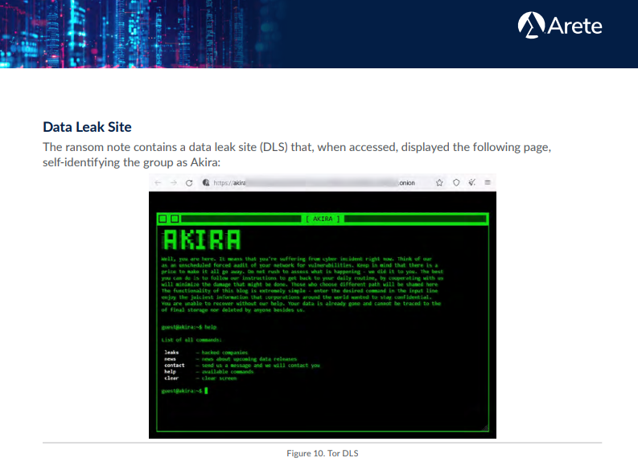

- Describir qué es “Akira” (tipo de amenaza: p.ej. ransomware / grupo / campaña).
- A quién afecta (sector, tamaño de organizaciones, geografía si aplica).
- Impacto típico: cifrado, doble extorsión, robo de datos, interrupción operativa.
- Plan de acción (defensivo): escribe acciones concretas, por ejemplo:
- Contención (aislar equipos, bloquear IoCs, reset credenciales)
- Erradicación (parcheo, limpieza, reimagen)
- Recuperación (backups, restauración, hardening)
- Prevención (EDR, MFA, segmentación, backups offline, detección en SIEM)
- Comunicación (legal, compliance, notificación si procede)

------------------------------------------

# 3. Contexto de la amenaza y planes de acción
## 3.1 Descripción general de Akira
Akira es una operación de **ransomware-as-a-service (RaaS)** observada desde marzo de 2023. Los desarrolladores mantienen el malware y la infraestructura de negociación/extorsión, mientras que afiliados o actores asociados ejecutan la intrusión, la expansión interna, la exfiltración y el despliegue del cifrado. Los advisories públicos coinciden en que Akira ha operado de forma `affiliate-based`, con capacidad para **impactar tanto entornos Windows como Linux**, y con especial interés en las infraestructuras corporativas que están expuestas en Internet. [(Isomer User Content)](https://isomer-user-content.by.gov.sg/36/b6648462-ce24-45f3-8fef-b95320241df0/joint-technical-advisory-on-akira.pdf)

Según los informes públicos, Akira emplea de forma predominante una **estrategia de doble extorsión:** antes o junto al cifrado, los afiliados roban información de la víctima y la usan como palanca adicional para presionar el pago. Esta lógica incrementa el impacto porque la organización no sólo afronta indisponibilidad operativa, sino también, riesgo de fuga de datos, exposición regulatoria, afectación reputacional y potencial extorsión secundaria. [(Unit 42)](https://unit42.paloaltonetworks.com/threat-assessment-howling-scorpius-akira-ransomware/) y [(MITRE)](https://attack.mitre.org/groups/G1024/) describen precisamente este patrón de exfiltración previa al cifrado y amenaza de publicación en su web de filtraciones, Data Leak Site - DLS, alojado en la red Tor, que poseía una estética "retro" que simula una terminal de comandos de los años 80. [(Arete)](https://6288364.fs1.hubspotusercontent-na1.net/hubfs/6288364/Website/Other%20Reports/2024-11%20Arete_Malware%20Spotlight%20Akira%20Ransomware.pdf)

### Objetivos y Víctimas
Según los datos de respuesta a incidentes, Akira se ha dirigido a una amplia gama de sectores, incluyendo educación, finanzas, inmobiliaria, manufactura, servicios profesionales y atención médica. Inicialmente, se enfocaron en pequeñas y medianas empresas (PYMES), pero han escalado hacia grandes corporaciones e infraestructuras críticas. Akira no se limita a un vertical concreto; típicamente prioriza objetivos que combinen exposición externa, dependencia operativa de TI y probabilidad razonable de pago. [(Stop Ransomware)](https://www.ic3.gov/CSA/2024/240418.pdf)

### Impacto Financiero
Las demandas de rescate observadas varían significativamente dependiendo de la facturación de la víctima, oscilando típicamente entre 200.000 dólares y $4 millones de dólares. La media de la demanda inicial se sitúa en torno a los 500.000 dólares, con pagos facilitados que rondan los 150.000 dólares tras la negociación. Al 1 de enero de 2024, se estimaba que el grupo había acumulado aproximadamente 42 millones de dólares en ganancias ilícitas afectando a más de 250 organizaciones.
[HC3-Analyst-Note](https://www.hhs.gov/sites/default/files/akira-randsomware-analyst-note-feb2024.pdf)

La actualización de noviembre de 2025 elevó esa cifra a unos 244,17 millones USD en ingresos reclamados hasta finales de septiembre de 2025. Conviene tratar estas magnitudes como cifras de advisories públicos y reclamaciones atribuidas a la operación, no como una contabilidad verificable caso por caso. [Stop Ransomware](https://www.ic3.gov/CSA/2024/240418.pdf)

## 3.2 Alcance y superficies afectadas
La versatilidad técnica de Akira le permite comprometer diversas superficies dentro de un entorno corporativo heterogéneo. El malware ha sido desarrollado para afectar a los dos sistemas operativos más críticos en la infraestructura empresarial:

**1. Entornos Windows (Versión V1 y Megazord):** El ransomware original, escrito en C++, está diseñado para sistemas Windows. Afecta a estaciones de trabajo y servidores, cifrando archivos y añadiendo extensiones como `.akira` o `.powerranges`. Utiliza la API de Restart Manager de Windows para cerrar procesos y servicios, como por ejemplo bases de datos SQL, que podrían mantener archivos bloqueados, asegurando así un cifrado exitoso

**2. Entornos Linux y Virtualización (Variante ESXi):** Dada la prevalencia de la virtualización en entornos corporativos, los operadores de Akira desarrollaron una variante específica para Linux, escrita inicialmente en C++ y portada posteriormente a Rust en su versión v2, dirigida explícitamente a máquinas virtuales VMware ESXi. Esto permite a los atacantes cifrar cientos de servidores virtuales simultáneamente al atacar el hipervisor, maximizando el impacto operativo.

**Activos Críticos Comprometidos:** Además de los servidores de archivos y bases de datos, Akira ataca componentes vitales para la recuperación y continuidad del negocio:[(5)Logpoint](https://logpoint.com/hubfs/blog_assets/emerging-threats-akira.pdf?hsLang=en)
- Copias de Seguridad (Shadow Copies): El malware elimina sistemáticamente las Volume Shadow Copies (VSS) mediante comandos de PowerShell para impedir la restauración rápida sin las claves de descifrado.

- Controladores de Dominio: Los atacantes buscan comprometer el Directorio Activo para desplegar políticas de grupo (GPO) que distribuyan el ransomware a toda la red.

## 3.3 Campañas detectadas y evolución técnica de Akira
Para este apartado nos basamos en el aviso técnico oficial de ciberseguridad publicado el 18 de abril de 2024, con identificador AA24-109A y título **#StopRansomware: Akira Ransomware.** [(Advisori - Boletín técnico oficial)](https://www.ic3.gov/CSA/2024/240418.pdf). En este documento, FBI, CISA, EC3 (Europol) y NCSC-NL recopilan TTPs, variantes observadas, vectores de acceso, mitigaciones y recomendaciones defensivas sobre Akira. Es un boletín/alerta técnica oficial usado para compartir inteligencia operativa con equipos defensivos:
- Qué se ha observado.
- Cómo entra el actor.
- Cómo se mueve.
- Qué herramientas usa.
- Qué controles recomiendan las agencias.

El propio documento dice que forma parte de la iniciativa #StopRansomware y que está dirigido a “network defenders”. Este boletín fue actualizado el 13 de noviembre de 2025, manteniendo el mismo código de advisory.

La evolución de Akira no es simplemente un cambio de código, es una respuesta estratégica a las defensas corporativas y a los movimientos del mercado de infraestructura IT. Un elemento especialmente relevante en las campañas atribuidas a Akira es que no se trata de una operación estática, sino de una amenaza con evolución progresiva del `encryptor`, ampliación de plataformas objetivo y ajustes tácticos en función de su eficacia operativa. El advisory conjunto de 2024 ya indicaba que, tras un foco inicial sobre sistemas Windows, los operadores desplegaron en abril de 2023 una variante Linux orientada a `VMware ESXi`, lo que marcó un cambio cualitativo: **Akira dejó de ser únicamente un ransomware para estaciones y servidores Windows y pasó a atacar de forma directa la capa de virtualización**, aumentando el impacto potencial sobre múltiples cargas de trabajo a la vez.

### Ataque del Hipervisor
**Atacar el hipervisor permite comprometer de una sola vez varias máquinas virtuales críticas**, reducir tiempos de cifrado y elevar la presión sobre la víctima, especialmente en entornos donde aplicaciones de negocio, bases de datos y servicios internos dependen de infraestructura virtual consolidada. En términos defensivos, este cambio supone que la superficie relevante ya no es sólo el endpoint Windows, sino también los hosts de virtualización, sus credenciales administrativas, los accesos remotos y los repositorios de backup ligados al clúster. Según los advisories públicos, esta ampliación de objetivo fue observable desde etapas relativamente tempranas de la operación.

**El Salto a la Virtualización: De Windows a Hypervisors**  
Inicialmente, Akira se comportaba como un ransomware convencional centrado en Windows. Sin embargo, su maduración técnica lo llevó a priorizar los hypervisors, donde reside el núcleo de los datos empresariales.

- Variante Linux/ESXi: El desarrollo de un cifrador específico para VMware ESXi permitió a los atacantes apagar máquinas virtuales y cifrar los archivos de disco virtual (.vmdk) de forma masiva. Esto es mucho más eficiente que infectar cada sistema operativo invitado uno por uno.

- Expansión a Nutanix AHV (Hito 2025): El incidente de junio de 2025 marcó un punto de inflexión. Al atacar Nutanix Acropolis Hypervisor (AHV), Akira demostró que su departamento de I+D sigue de cerca la migración de empresas que huyen de VMware tras cambios en sus políticas de licenciamiento. El uso de comandos específicos para interactuar con el almacenamiento distribuido de Nutanix sugiere un conocimiento profundo de arquitecturas de hiperconvergencia.

### Coexistencia de Variantes: El Factor Rust
La diversificación del código de Akira busca dos objetivos: evadir la detección basada en firmas y maximizar la compatibilidad multiplataforma.
- **Las primeras variantes Akira:** Habían sido desarrolladas en C++ y usaban la extensión `.akira`.

- **Megazord:** Esta variante, detectada inicialmente en 2024, destaca por estar escrita en Rust. El uso de Rust permite una ejecución extremadamente rápida y dificulta la ingeniería inversa. Megazord suele utilizar una extensión de archivo específica y un sistema de notas de rescate que imita la estética de los `Power Rangers`.

- **Akira_v2:** Representa la consolidación de las lecciones aprendidas en ESXi. Tanto MITRE como el advisory actualizado de 2025 describen Akira_v2 como una variante también escrita en Rust, diseñada para VMware ESXi, con argumentos de línea de comandos y capacidades ampliadas respecto a versiones previas. El advisory 2025 indica que esta variante puede trabajar con rutas por defecto de ESXi, añadir nuevas extensiones de salida como `.akiranew` o `.aki`, e incorporar funciones como `vmonly` y `stopvm`, lo que sugiere una orientación más explícita hacia la gestión de máquinas virtuales como objeto principal del impacto. Desde una perspectiva de campaña, esto muestra que Akira no sólo trasladó el cifrado a Linux/ESXi, sino que lo especializó para operar con mayor precisión sobre entornos virtualizados. [(attack.mitre)](https://attack.mitre.org/software/S1194/)

### Payloads de Akira
Otro hallazgo relevante según el boletín técnico oficial de 2024 y su actualización posterior, es que en al menos un compromiso se observó el **uso concurrente de dos payloads distintos** según la arquitectura del sistema comprometido: Megazord para Windows y un segundo payload identificado más tarde como Akira_v2 para ESXi. Ese detalle es técnicamente significativo porque sugiere una campaña multi-arquitectura, preparada para cifrar de forma coordinada diferentes capas del entorno de las víctimas.

### Evolución táctica
Cisco Talos aporta además una lectura muy útil sobre la evolución táctica de 2024. Según su análisis, a comienzos de ese año Akira pareció **reducir temporalmente el uso del cifrado y priorizar campañas centradas en exfiltración de datos sin encryptor visible**, con "una confianza de baja a moderada en que esa decisión estuvo relacionada con el tiempo necesario para retocar o rehacer el encryptor". Talos observó durante ese periodo el desarrollo iterativo de una variante Rust para ESXi y, posteriormente, una vuelta a tácticas que combinaban otra vez robo de datos y cifrado. Esta observación es importante porque rompe la idea de que Akira opera siempre con una secuencia fija: según campaña y momento evolutivo, "el grupo puede inclinarse más hacia la extorsión por datos o volver al esquema clásico de doble extorsión". [(Cisco Talos Blog)](https://blog.talosintelligence.com/akira-ransomware-continues-to-evolve/)

Talos también observó indicios de una reversión parcial desde algunas implementaciones en Rust hacia encryptors nuevamente escritos en C++, tanto en Windows como en Linux, durante la segunda mitad de 2024. Su hipótesis es que "esta vuelta a variantes previas pudo responder a una búsqueda de estabilidad y fiabilidad operativa por encima de la innovación técnica". En otras palabras, la operación parece haber experimentado con Rust para ganar flexibilidad y modularidad, pero habría mantenido o recuperado binarios anteriores cuando estos ofrecían mejores resultados prácticos para los afiliados. El desarrollo técnico se adapta a lo que resulte más eficaz para la mejorar la monetización.

| Fase | Estrategia Dominante | Razón Técnica/Estratégica |
| -- | -- | -- |
| Principios 2024 | Doble Extorsión | Cifrado + Amenaza de filtración. |
| Mediados 2024 | Exfiltración Pura | Reajuste de encryptors tras filtraciones de código o mejoras en EDRs. |
| 2025 - 2026 | Cifrado Híbrido | Ataque directo a almacenamiento masivo (Nutanix/ESXi) combinado con exfiltración selectiva. |

### Atacando las plataformas de virtualización
La actualización del boletín técnico oficial de noviembre de 2025 añade otro salto importante: en un incidente de junio de 2025, los actores de Akira cifraron por primera vez archivos de disco de máquinas virtuales en Nutanix AHV, ampliando explícitamente su capacidad más allá de VMware ESXi y Hyper-V. El propio documento vincula ese incidente al abuso de CVE-2024-40766, descrita allí como una vulnerabilidad usada en la intrusión. Este dato es especialmente relevante porque confirma que la operación ya no debe modelarse únicamente como una amenaza para Windows y ESXi, sino como un actor con interés creciente por diversificar plataformas de virtualización y explotar puntos de acceso que le permitan llegar al plano donde residen las cargas críticas.

En conjunto, **las campañas observadas muestran una evolución en tres ejes:**
- Primero, un eje de plataforma, que va de Windows a ESXi y posteriormente a AHV.
- Segundo, un eje de tooling, con coexistencia de binarios en C++ y Rust, y de variantes como Akira, Megazord y Akira_v2.
- Tercero, un eje táctico, donde Akira alterna entre campañas de doble extorsión “clásica” y fases con mayor peso de la exfiltración sin cifrado.

Para defensa y respuesta, esto obliga a evitar una visión reduccionista del grupo: **Akira no debe tratarse como una única muestra de malware, sino como una operación adaptable, con capacidad para modificar el encryptor, la plataforma objetivo y el equilibrio entre robo de datos y cifrado según el contexto de la campaña.**

### Evolución de las Herramientas de Exfiltración
Para exfiltrar grandes volúmenes de información antes de que se activen las alarmas, Akira suele apoyarse en programas legítimos que ya existen en muchas empresas o que parecen normales para un administrador. A eso se le llama `Living-off-the-Land` (LotL).

En vez de desplegar una herramienta extraña que el antivirus detecte enseguida, Akira usa cosas como:
- Utilidades de compresión:
    - WinRAR: Para crear un archivo grande con documentos.
    - 7-Zip.
- Transferencia de archivos:
    - WinSCP y FileZilla: Para transferencias manuales de archivos críticos.
    - Rclone: Para sincronizar datos con nubes públicas como Mega, Amazon S3.
- Acceso remoto:
    - En Akira, los avisos oficiales describen sobre todo el abuso de AnyDesk y otras utilidades legítimas de acceso remoto para mantener persistencia, mezclarse con actividad administrativa y pivotar lateralmente dentro del entorno comprometido.
- Comandos del sistema: PowerShell, cmd, wmic, net
    - Se han detectado scripts en PowerShell que automatizan la búsqueda de archivos con extensiones financieras o legales antes de iniciar el cifrado.

### Resumen de las Campañas con sus IOCs
1. Campaña Windows "Legacy" (C++): Esta es la variante original que consolidó al grupo en 2023. Sus IoCs son los más estables y reconocibles.
- Extensiones de archivo: .akira
- Nota de rescate: akira_readme.txt
- Persistencia/Herramientas: * Uso extensivo de PCHunter64 y Process Hacker para desactivar EDRs.
    - Ejecución de net.exe stop "NombreServicio" para detener bases de datos (SQL, Exchange).
- IoC de red: Conexiones salientes a través de puertos no estándar hacia servicios de almacenamiento como Mega.nz.

2. Variante Megazord (Rust - Windows): Aparecida a finales de 2023 y principios de 2024, destaca por su velocidad y el uso de un lenguaje de programación más moderno.
- Extensiones de archivo: .powerranges
- Nota de rescate: powerranges.txt (a menudo con referencias estéticas a la serie homónima).
- IoC de Comportamiento: * Uso de la librería rust-crypto para el cifrado ChaCha20.
    - Generación de tráfico SMB inusualmente alto en periodos muy cortos (debido a la eficiencia de Rust).
- Herramientas de acompañamiento: Uso de Ngrok para tunelizar el tráfico de C2 y saltar firewalls perimetrales.

3. Variante Akira_v2 (Rust - ESXi / Linux / Windows): Es la versión más avanzada (2025-2026), diseñada específicamente para entornos de virtualización masiva.
- Extensiones de archivo: .akiranew o .aki
- Impacto en Hypervisors: * Ejecución de comandos esxcli para listar y apagar máquinas virtuales (vim-cmd vmsvc/power.off).
- Acceso a rutas /vmfs/volumes/ para cifrar directamente los archivos .vmdk, .vmem y .vmsn.
- IoC Técnico: Validación de Build ID. El binario no se ejecuta si no detecta un entorno específico, lo que dificulta el análisis en sandboxes de investigadores.

4. Campaña Nutanix AHV (Incidente Junio 2025): Representa la expansión más reciente del grupo hacia infraestructuras hiperconvergentes (HCI) más allá de VMware.
- Vector de entrada específico: Explotación de CVE-2024-40766 en dispositivos SonicWall para obtener acceso inicial a la red de gestión.
- IoCs de Actividad:
    - Movimiento lateral hacia la CVM (Controller VM) de Nutanix mediante SSH utilizando credenciales robadas.
    - Cifrado de archivos de disco con extensión .vdisk y contenedores de almacenamiento Nutanix.
    - Uso de Veeam Backup & Replication (vulnerabilidades no parcheadas) para localizar y destruir backups antes del cifrado.

5. IoCs Transversales (Exfiltración y C2): Independientemente de la variante, Akira mantiene un "set" de herramientas preferidas para el robo de datos:
| Categoría | Herramientas / IoCs | Notas |
| -- | -- | -- |
| Exfiltración | "rclone.exe, WinSCP.com, FileZilla.exe" | "Buscan archivos .pdf, .docx, .xlsx y bases de datos." |
| Acceso Remoto | "AnyDesk.exe, LogMeIn, RustDesk" | Instalados en servidores críticos para mantener persistencia. |
| Reconocimiento | "Advanced IP Scanner, NetScan, ShareFinder.ps1" | Utilizados para mapear la red y encontrar hypervisors. |
| Descubrimiento | "nltest /dclist:, Get-ADComputer" | Comandos para enumerar controladores de dominio. |

| Periodo / fase               | Variante o patrón observado                                        | Plataforma objetivo                          | Cambio técnico o táctico más relevante                                                                                                                                                       | Implicación defensiva                                                                                                                                                        | Fuente(s)                                                         |
| ---------------------------- | ------------------------------------------------------------------ | -------------------------------------------- | -------------------------------------------------------------------------------------------------------------------------------------------------------------------------------------------- | ---------------------------------------------------------------------------------------------------------------------------------------------------------------------------- | ----------------------------------------------------------------- |
| Marzo–abril de 2023          | Expansión desde la línea inicial de Akira hacia una variante Linux | Windows y después VMware ESXi                | El grupo pasó de un foco inicial en Windows a desplegar en abril de 2023 una variante Linux para ESXi, ampliando el impacto potencial sobre entornos virtualizados.                          | Priorizar la protección de hipervisores, la segmentación entre plano de usuario y plano de virtualización, y la revisión de credenciales administrativas del entorno VMware. | AA24-109A (2024); AA24-109A update (2025)                         |
| Desde agosto de 2023         | Aparición y uso de Megazord                                        | Windows                                      | Se documentó Megazord como una variante en Rust atribuida a Akira por solapamiento de infraestructura, lo que apunta a una diversificación del tooling.                                      | La detección no debe centrarse en un único binario o extensión; conviene monitorizar familias relacionadas y comportamientos comunes de ransomware afiliado.                 | MITRE ATT&CK S1191; AA24-109A update (2025)                       |
| 2024 (fase de reajuste)      | Campañas con mayor peso de exfiltración sin cifrado visible        | Entornos corporativos mixtos                 | Cisco Talos observó que algunas campañas parecieron priorizar temporalmente la exfiltración mientras los operadores reajustaban el encryptor.                                                | Es crítico detectar compresión, transferencia de datos y herramientas de exfiltración, no solo eventos de cifrado o notas de rescate.                                        | Cisco Talos (2024)                                                |
| 2024–2025                    | Desarrollo y empleo de Akira_v2                                    | VMware ESXi                                  | MITRE describe Akira_v2 como una variante en Rust diseñada para ESXi, con nuevos argumentos de ejecución y capacidades ampliadas.                                                            | Reforzar hardening y telemetría en ESXi, junto con control estricto de acceso remoto y cuentas privilegiadas del hipervisor.                                                 | MITRE ATT&CK S1194; AA24-109A update (2025)                       |
| Junio de 2025                | Extensión del impacto hacia Nutanix AHV                            | Nutanix AHV                                  | El aviso técnico actualizado de 2025 recoge un incidente en el que Akira cifró por primera vez discos de máquinas virtuales en AHV, ampliando su radio de acción más allá de ESXi e Hyper-V. | La defensa frente a Akira debe contemplar múltiples plataformas de virtualización, no únicamente VMware.                                                                     | AA24-109A update (2025)                                           |
| Lectura global de la campaña | Coexistencia de Akira, Megazord y Akira_v2                         | Windows, ESXi y otros entornos virtualizados | La operación muestra una evolución en plataforma, tooling y táctica, lo que sugiere una amenaza adaptable más que una muestra estática de malware.                                           | La respuesta defensiva debe basarse en TTPs y superficie crítica, no solo en nombres de variantes o IoCs puntuales.                                                          | Síntesis: AA24-109A (2024), AA24-109A update (2025), MITRE, Talos |

Referencias de la tabla
- [AA24-109A (2024)](https://www.ic3.gov/CSA/2024/240418.pdf?utm_source=chatgpt.com): #StopRansomware: Akira Ransomware, FBI, CISA, EC3 y NCSC-NL, 18 de abril de 2024. El documento indica que, tras un foco inicial en Windows, en abril de 2023 Akira desplegó una variante Linux dirigida a VMware ESXi.

- [AA24-109A update (2025)](https://www.ic3.gov/CSA/2025/251113.pdf?utm_source=chatgpt.com): actualización del mismo aviso técnico conjunto, publicada el 13 de noviembre de 2025 por FBI, CISA, DC3 y HHS. Añade la coexistencia de Megazord y Akira_v2, así como el incidente de junio de 2025 que afectó a Nutanix AHV.

- [MITRE ATT&CK S1191](https://attack.mitre.org/software/S1191/?utm_source=chatgpt.com): entrada de software para Megazord, descrita como variante en Rust usada al menos desde agosto de 2023 para entornos Windows.

- [MITRE ATT&CK S1194](https://attack.mitre.org/software/S1194/?utm_source=chatgpt.com): entrada de software para Akira_v2, descrita como variante en Rust diseñada para VMware ESXi y observada al menos desde 2024.

- [Cisco Talos (2024)](https://blog.talosintelligence.com/akira-ransomware-continues-to-evolve/?utm_source=chatgpt.com): Akira ransomware continues to evolve, publicado el 21 de octubre de 2024, donde se describe la fase en la que algunas campañas parecieron privilegiar la exfiltración mientras el grupo reajustaba su encryptor.

# 3.3 Modus operandi resumido
El ciclo de vida del ataque de Akira sigue un patrón estructurado que alinea con el marco MITRE ATT&CK, caracterizado por un enfoque manual y "fire-and-forget" (dispara y olvida) en las fases finales.[(6)MottaSec](https://github.com/MottaSec/akira-ransomware-reverse/blob/main/docs/technical/04_encryption_strategy_network.md)

**1. Acceso Inicial:** La vía de entrada predominante es la explotación de VPNs sin Autenticación Multifactor (MFA) configurada. Se aprovechan específicamente de vulnerabilidades en dispositivos Cisco AnyConnect (CVE-2020-3259) y SonicWall (CVE-2023-20269). También utilizan credenciales válidas compradas en la dark web, fuerza bruta sobre servicios RDP expuestos y campañas de spearphishing.

**2. Persistencia y Movimiento Lateral:** Una vez dentro, crean cuentas de administrador para mantener el acceso. Utilizan herramientas legítimas de administración remota y doble uso (Living-off-the-Land) para moverse por la red y evadir la detección. Las herramientas observadas incluyen AnyDesk, RustDesk, Ngrok (para túneles C2), Mimikatz y LaZagne (para robo de credenciales vía LSASS y Kerberoasting). Para el reconocimiento de red emplean SoftPerfect Network Scanner, Advanced IP Scanner y AdFind.

**3. Exfiltración:** Antes del cifrado, los datos sensibles son extraídos. Akira utiliza herramientas de transferencia de archivos como Rclone, WinSCP, FileZilla y WinRAR para comprimir y enviar datos a servicios de almacenamiento en la nube o servidores controlados por los atacantes.

**4. Cifrado y Extorsión:** Finalmente, se despliega el cifrador. Akira utiliza un esquema híbrido:
- Para velocidad: ChaCha20.
- Para proteger la clave de sesión: RSA-4096.
El malware puede operar en modo de cifrado parcial para acelerar el proceso en archivos grandes. Tras el cifrado, se deposita la nota de rescate `akira_readme.txt` en las carpetas afectadas. Según análisis de ingeniería inversa, el binario de cifrado a menudo no realiza comunicación de red `fire-and-forget`, lo que complica la detección basada en tráfico C2 durante esta fase específica.

## 3.4 Planes de acción y respuesta
Acciones técnicas requeridas para abordar una intrusión de Akira en sus diferentes etapas.

### Detección:
El objetivo es identificar la actividad maliciosa antes de que ocurra el cifrado masivo. [(4)Ecucert](https://www.ecucert.gob.ec/wp-content/uploads/2024/08/Ransomware_Akira.pdf) - [(2)Arete-Malware](https://6288364.fs1.hubspotusercontent-na1.net/hubfs/6288364/Website/Other%20Reports/2024-11%20Arete_Malware%20Spotlight%20Akira%20Ransomware.pdf) - 
- Monitorización de Logs y SIEM:
    - Buscar eventos de creación de cuentas inusuales (ej. itadm) y escalada de privilegios en el Directorio Activo.
    - Alertar sobre el uso de comandos de PowerShell sospechosos, especialmente: Get-WmiObject Win32_Shadowcopy | Remove-WmiObject
    - Detectar ejecuciones de herramientas de reconocimiento como netscan.exe, nltest /dclist, o adfind.exe

- Señales en EDR/Endpoint:
    - Identificar la ejecución de binarios de acceso remoto no autorizados (AnyDesk, Ngrok, RustDesk) en servidores críticos.
    - Monitorizar la terminación inesperada de servicios de seguridad (antivirus) o bases de datos (SQL) mediante herramientas como PowerTool.
    - Ventana Crítica: La fase de cifrado provoca un uso sostenido del 90-100% de la CPU y saturación de disco. La detección temprana de la creación masiva de archivos con extensión .akira es vital.

- Tráfico de Red:
    - Vigilar conexiones salientes hacia servicios de almacenamiento en la nube (Mega, IPfs) o tráfico RDP/FTP anómalo indicativo de exfiltración vía Rclone o WinSCP.

### Contención:
Acciones inmediatas para frenar la propagación.
- Aislamiento: Desconectar físicamente o aislar vía VLAN/EDR los hosts infectados y aquellos sospechosos de haber sido accedidos lateralmente
- Bloqueo de Comunicaciones: Bloquear en el firewall perimetral las IPs y dominios asociados a la infraestructura de C2 detectada (ver IoCs) y puertos de salida SMB (445) y RDP (3389) hacia internet
- Gestión de Credenciales: Restablecer inmediatamente la contraseña de la cuenta `krbtgt`, dos veces para invalidar `Golden Tickets` y de todas las cuentas de administrador de dominio comprometidas.
- Deshabilitar cuentas VPN sospechosas.

### Erradicación:
Eliminación total de la presencia del atacante.
- Limpieza de Malware: Eliminar los binarios del ransomware (w.exe, akira_v2), herramientas de persistencia (AnyDesk.exe, ngrok.exe) y tareas programadas maliciosas. 
- Parcheo de Vulnerabilidades: Aplicar parches de seguridad críticos, priorizando Cisco AnyConnect (CVE-2020-3259) y vulnerabilidades en Veeam o SonicWall, que son vectores de entrada comunes. 
- Hardening: Deshabilitar servicios no esenciales y reforzar las configuraciones de RDP y SMB.

### Recuperación:
Restauración de las operaciones de negocio.
- Restauración de Backups: Recuperar los datos desde copias de seguridad inmutables y desconectadas (offline). Es preciso verificar que las copias no estén cifradas ni contengan backdoors.
- Verificación: Escanear los sistemas restaurados antes de reconectarlos a la red de producción para asegurar que no persisten herramientas de acceso remoto.
- Descifrado (Si aplica): Aunque existió un descifrador para versiones antiguas, las variantes recientes (v2/Megazord) han corregido fallos criptográficos, haciendo improbable el descifrado sin pagar, salvo que existan errores en la implementación específica de la campaña o se utilicen entornos virtuales con generadores de números aleatorios débiles.

**Nota: El pago del rescate no se recomienda oficialmente**

### Prevención
Medidas para evitar la recurrencia.
- MFA Obligatorio: Implementar autenticación multifactor resistente al phishing en todos los accesos externos, especialmente VPNs y correo web.
- Segmentación de Red: Aislar servidores críticos y copias de seguridad en segmentos de red separados con listas de control de acceso (ACL) estrictas.
- Mínimos Privilegios: Restringir el uso de cuentas de Administrador de Dominio y deshabilitar el acceso por línea de comandos para usuarios estándar.
- Backups Inmutables: Asegurar el cumplimiento de la regla 3-2-1 de copias de seguridad, manteniendo una copia inmutable u offline.

## 3.5 Recomendaciones priorizadas
A continuación, se presentan las cinco recomendaciones de seguridad más críticas para mitigar la amenaza de Akira, ordenadas por impacto y eficacia inmediata:
1. Implementar MFA en todos los accesos VPN y remotos: Es la barrera más efectiva contra el vector de entrada principal de Akira (credenciales comprometidas en VPNs Cisco/SonicWall).

2. Asegurar copias de seguridad inmutables y offline: Garantiza la recuperación ante el cifrado y la eliminación de Shadow Copies que realiza el malware, anulando la necesidad de pagar.

3. Parchear vulnerabilidades críticas en dispositivos de borde (VPN/Firewall): Cerrar las brechas conocidas (CVE-2020-3259, CVE-2023-20269) evita que los atacantes exploten el perímetro inicial.

4. Desplegar EDR con protección anti-tamper en todos los endpoints: Permite detectar y bloquear la ejecución de herramientas de commodity (Mimikatz, Rclone, AnyDesk) usadas antes del cifrado.

5. Restringir y monitorear el uso de herramientas de administración remota (RMM): Bloquear o alertar sobre el uso no autorizado de software como AnyDesk o Ngrok reduce drásticamente la capacidad de persistencia del atacante.

------
