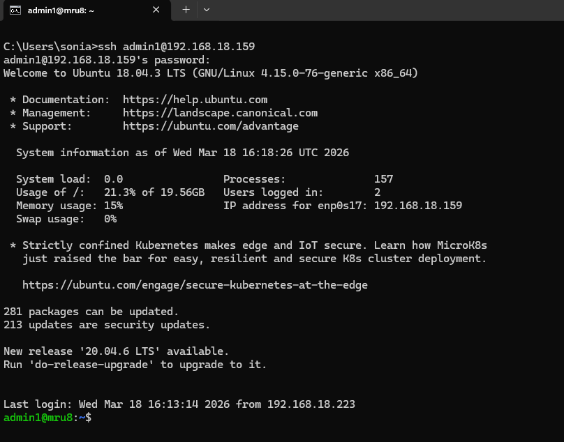

**Pasos generales a realizar que indica el enunciado:**
- Descargamos  la máquina virtual del ejercicio y la importamos en VirtualBox.

- Cambiamos el adaptador de red de la VM a Bridge.

- Iniciamos la máquina y accedemos por la consola de la VM con
  - Usuario: admin2
  - Password: 1234

- Ejecutamos ifconfig y anotamos la IP de la interfaz enp0s17.
  

----

# **1. Primera conexión SSH con admin2**
Iniciamos la máquina virtual y accedemos por la consola de la VM a través de ssh en modo verbose con:
  - Usuario: admin2
  - Password: 1234

Mostrar el resultado verbose de dicha ejecución resaltando la información de utilidad que se haya observado, así como una posible explicación de su significado.


```
admin2@mru8:~$ ssh -vvv admin2@192.168.18.159
OpenSSH_7.6p1 Ubuntu-4ubuntu0.5, OpenSSL 1.0.2n  7 Dec 2017
debug1: Reading configuration data /etc/ssh/ssh_config
debug1: /etc/ssh/ssh_config line 19: Applying options for *
debug2: resolving "192.168.18.159" port 22
debug2: ssh_connect_direct: needpriv 0
debug1: Connecting to 192.168.18.159 [192.168.18.159] port 22.
debug1: Connection established.
debug1: key_load_public: No such file or directory
debug1: identity file /home/admin2/.ssh/id_rsa type -1
debug1: key_load_public: No such file or directory
debug1: identity file /home/admin2/.ssh/id_rsa-cert type -1
debug1: key_load_public: No such file or directory
debug1: identity file /home/admin2/.ssh/id_dsa type -1
debug1: key_load_public: No such file or directory
debug1: identity file /home/admin2/.ssh/id_dsa-cert type -1
debug1: key_load_public: No such file or directory
debug1: identity file /home/admin2/.ssh/id_ecdsa type -1
debug1: key_load_public: No such file or directory
debug1: identity file /home/admin2/.ssh/id_ecdsa-cert type -1
debug1: key_load_public: No such file or directory
debug1: identity file /home/admin2/.ssh/id_ed25519 type -1
debug1: key_load_public: No such file or directory
debug1: identity file /home/admin2/.ssh/id_ed25519-cert type -1
debug1: Local version string SSH-2.0-OpenSSH_7.6p1 Ubuntu-4ubuntu0.5
debug1: Remote protocol version 2.0, remote software version OpenSSH_7.6p1 Ubuntu-4ubuntu0.5
debug1: match: OpenSSH_7.6p1 Ubuntu-4ubuntu0.5 pat OpenSSH* compat 0x04000000
debug2: fd 3 setting O_NONBLOCK
debug1: Authenticating to 192.168.18.159:22 as 'admin2'
debug3: hostkeys_foreach: reading file "/home/admin2/.ssh/known_hosts"
debug3: record_hostkey: found key type ECDSA in file /home/admin2/.ssh/known_hosts:1
debug3: load_hostkeys: loaded 1 keys from 192.168.18.159
debug3: order_hostkeyalgs: prefer hostkeyalgs: ecdsa-sha2-nistp256-cert-v01@openssh.com,ecdsa-sha2-nistp384-cert-v01@openssh.com,ecdsa-sha2-nistp521-cert-v01@openssh.com,ecdsa-sha2-nistp256,ecdsa-sha2-nistp384,ecdsa-sha2-nistp521
debug3: send packet: type 20
debug1: SSH2_MSG_KEXINIT sent
debug3: receive packet: type 20
debug1: SSH2_MSG_KEXINIT received
debug2: local client KEXINIT proposal
debug2: KEX algorithms: curve25519-sha256,curve25519-sha256@libssh.org,ecdh-sha2-nistp256,ecdh-sha2-nistp384,ecdh-sha2-nistp521,diffie-hellman-group-exchange-sha256,diffie-hellman-group16-sha512,diffie-hellman-group18-sha512,diffie-hellman-group-exchange-sha1,diffie-hellman-group14-sha256,diffie-hellman-group14-sha1,ext-info-c
debug2: host key algorithms: ecdsa-sha2-nistp256-cert-v01@openssh.com,ecdsa-sha2-nistp384-cert-v01@openssh.com,ecdsa-sha2-nistp521-cert-v01@openssh.com,ecdsa-sha2-nistp256,ecdsa-sha2-nistp384,ecdsa-sha2-nistp521,ssh-ed25519-cert-v01@openssh.com,ssh-rsa-cert-v01@openssh.com,ssh-ed25519,rsa-sha2-512,rsa-sha2-256,ssh-rsa
debug2: ciphers ctos: chacha20-poly1305@openssh.com,aes128-ctr,aes192-ctr,aes256-ctr,aes128-gcm@openssh.com,aes256-gcm@openssh.com
debug2: ciphers stoc: chacha20-poly1305@openssh.com,aes128-ctr,aes192-ctr,aes256-ctr,aes128-gcm@openssh.com,aes256-gcm@openssh.com
debug2: MACs ctos: umac-64-etm@openssh.com,umac-128-etm@openssh.com,hmac-sha2-256-etm@openssh.com,hmac-sha2-512-etm@openssh.com,hmac-sha1-etm@openssh.com,umac-64@openssh.com,umac-128@openssh.com,hmac-sha2-256,hmac-sha2-512,hmac-sha1
debug2: MACs stoc: umac-64-etm@openssh.com,umac-128-etm@openssh.com,hmac-sha2-256-etm@openssh.com,hmac-sha2-512-etm@openssh.com,hmac-sha1-etm@openssh.com,umac-64@openssh.com,umac-128@openssh.com,hmac-sha2-256,hmac-sha2-512,hmac-sha1
debug2: compression ctos: none,zlib@openssh.com,zlib
debug2: compression stoc: none,zlib@openssh.com,zlib
debug2: languages ctos:
debug2: languages stoc:
debug2: first_kex_follows 0
debug2: reserved 0
debug2: peer server KEXINIT proposal
debug2: KEX algorithms: curve25519-sha256,curve25519-sha256@libssh.org,ecdh-sha2-nistp256,ecdh-sha2-nistp384,ecdh-sha2-nistp521,diffie-hellman-group-exchange-sha256,diffie-hellman-group16-sha512,diffie-hellman-group18-sha512,diffie-hellman-group14-sha256,diffie-hellman-group14-sha1
debug2: host key algorithms: ssh-rsa,rsa-sha2-512,rsa-sha2-256,ecdsa-sha2-nistp256,ssh-ed25519
debug2: ciphers ctos: chacha20-poly1305@openssh.com,aes128-ctr,aes192-ctr,aes256-ctr,aes128-gcm@openssh.com,aes256-gcm@openssh.com
debug2: ciphers stoc: chacha20-poly1305@openssh.com,aes128-ctr,aes192-ctr,aes256-ctr,aes128-gcm@openssh.com,aes256-gcm@openssh.com
debug2: MACs ctos: umac-64-etm@openssh.com,umac-128-etm@openssh.com,hmac-sha2-256-etm@openssh.com,hmac-sha2-512-etm@openssh.com,hmac-sha1-etm@openssh.com,umac-64@openssh.com,umac-128@openssh.com,hmac-sha2-256,hmac-sha2-512,hmac-sha1
debug2: MACs stoc: umac-64-etm@openssh.com,umac-128-etm@openssh.com,hmac-sha2-256-etm@openssh.com,hmac-sha2-512-etm@openssh.com,hmac-sha1-etm@openssh.com,umac-64@openssh.com,umac-128@openssh.com,hmac-sha2-256,hmac-sha2-512,hmac-sha1
debug2: compression ctos: none,zlib@openssh.com
debug2: compression stoc: none,zlib@openssh.com
debug2: languages ctos:
debug2: languages stoc:
debug2: first_kex_follows 0
debug2: reserved 0
debug1: kex: algorithm: curve25519-sha256
debug1: kex: host key algorithm: ecdsa-sha2-nistp256
debug1: kex: server->client cipher: chacha20-poly1305@openssh.com MAC: <implicit> compression: none
debug1: kex: client->server cipher: chacha20-poly1305@openssh.com MAC: <implicit> compression: none
debug3: send packet: type 30
debug1: expecting SSH2_MSG_KEX_ECDH_REPLY
debug3: receive packet: type 31
debug1: Server host key: ecdsa-sha2-nistp256 SHA256:OwC8+VNNXiW4pns025jYh/3P9OIU7kzZ6P20s/2ZOao
debug3: hostkeys_foreach: reading file "/home/admin2/.ssh/known_hosts"
debug3: record_hostkey: found key type ECDSA in file /home/admin2/.ssh/known_hosts:1
debug3: load_hostkeys: loaded 1 keys from 192.168.18.159
debug1: Host '192.168.18.159' is known and matches the ECDSA host key.
debug1: Found key in /home/admin2/.ssh/known_hosts:1
debug3: send packet: type 21
debug2: set_newkeys: mode 1
debug1: rekey after 134217728 blocks
debug1: SSH2_MSG_NEWKEYS sent
debug1: expecting SSH2_MSG_NEWKEYS
debug3: receive packet: type 21
debug1: SSH2_MSG_NEWKEYS received
debug2: set_newkeys: mode 0
debug1: rekey after 134217728 blocks
debug2: key: /home/admin2/.ssh/id_rsa ((nil))
debug2: key: /home/admin2/.ssh/id_dsa ((nil))
debug2: key: /home/admin2/.ssh/id_ecdsa ((nil))
debug2: key: /home/admin2/.ssh/id_ed25519 ((nil))
debug3: send packet: type 5
debug3: receive packet: type 7
debug1: SSH2_MSG_EXT_INFO received
debug1: kex_input_ext_info: server-sig-algs=<ssh-ed25519,ssh-rsa,rsa-sha2-256,rsa-sha2-512,ssh-dss,ecdsa-sha2-nistp256,ecdsa-sha2-nistp384,ecdsa-sha2-nistp521>
debug3: receive packet: type 6
debug2: service_accept: ssh-userauth
debug1: SSH2_MSG_SERVICE_ACCEPT received
debug3: send packet: type 50
debug3: receive packet: type 51
debug1: Authentications that can continue: publickey,password
debug3: start over, passed a different list publickey,password
debug3: preferred gssapi-keyex,gssapi-with-mic,publickey,keyboard-interactive,password
debug3: authmethod_lookup publickey
debug3: remaining preferred: keyboard-interactive,password
debug3: authmethod_is_enabled publickey
debug1: Next authentication method: publickey
debug1: Trying private key: /home/admin2/.ssh/id_rsa
debug3: no such identity: /home/admin2/.ssh/id_rsa: No such file or directory
debug1: Trying private key: /home/admin2/.ssh/id_dsa
debug3: no such identity: /home/admin2/.ssh/id_dsa: No such file or directory
debug1: Trying private key: /home/admin2/.ssh/id_ecdsa
debug3: no such identity: /home/admin2/.ssh/id_ecdsa: No such file or directory
debug1: Trying private key: /home/admin2/.ssh/id_ed25519
debug3: no such identity: /home/admin2/.ssh/id_ed25519: No such file or directory
debug2: we did not send a packet, disable method
debug3: authmethod_lookup password
debug3: remaining preferred: ,password
debug3: authmethod_is_enabled password
debug1: Next authentication method: password
admin2@192.168.18.159's password:
debug3: send packet: type 50
debug2: we sent a password packet, wait for reply
debug3: receive packet: type 52
debug1: Authentication succeeded (password).
Authenticated to 192.168.18.159 ([192.168.18.159]:22).
debug1: channel 0: new [client-session]
debug3: ssh_session2_open: channel_new: 0
debug2: channel 0: send open
debug3: send packet: type 90
debug1: Requesting no-more-sessions@openssh.com
debug3: send packet: type 80
debug1: Entering interactive session.
debug1: pledge: network
debug3: receive packet: type 80
debug1: client_input_global_request: rtype hostkeys-00@openssh.com want_reply 0
debug3: receive packet: type 91
debug2: channel_input_open_confirmation: channel 0: callback start
debug2: fd 3 setting TCP_NODELAY
debug3: ssh_packet_set_tos: set IP_TOS 0x10
debug2: client_session2_setup: id 0
debug2: channel 0: request pty-req confirm 1
debug3: send packet: type 98
debug1: Sending environment.
debug3: Ignored env LS_COLORS
debug3: Ignored env SSH_CONNECTION
debug3: Ignored env LESSCLOSE
debug1: Sending env LANG = en_US.UTF-8
debug2: channel 0: request env confirm 0
debug3: send packet: type 98
debug3: Ignored env XDG_SESSION_ID
debug3: Ignored env USER
debug3: Ignored env PWD
debug3: Ignored env HOME
debug3: Ignored env SSH_CLIENT
debug3: Ignored env XDG_DATA_DIRS
debug3: Ignored env SSH_TTY
debug3: Ignored env MAIL
debug3: Ignored env TERM
debug3: Ignored env SHELL
debug3: Ignored env SHLVL
debug3: Ignored env LOGNAME
debug3: Ignored env XDG_RUNTIME_DIR
debug3: Ignored env PATH
debug3: Ignored env LESSOPEN
debug3: Ignored env _
debug2: channel 0: request shell confirm 1
debug3: send packet: type 98
debug2: channel_input_open_confirmation: channel 0: callback done
debug2: channel 0: open confirm rwindow 0 rmax 32768
debug3: receive packet: type 99
debug2: channel_input_status_confirm: type 99 id 0
debug2: PTY allocation request accepted on channel 0
debug2: channel 0: rcvd adjust 2097152
debug3: receive packet: type 99
debug2: channel_input_status_confirm: type 99 id 0
debug2: shell request accepted on channel 0
Welcome to Ubuntu 18.04.3 LTS (GNU/Linux 4.15.0-76-generic x86_64)

 * Documentation:  https://help.ubuntu.com
 * Management:     https://landscape.canonical.com
 * Support:        https://ubuntu.com/advantage

  System information as of Tue Mar 17 15:56:41 UTC 2026

  System load:  0.0                Processes:              154
  Usage of /:   21.0% of 19.56GB   Users logged in:        1
  Memory usage: 11%                IP address for enp0s17: 192.168.18.159
  Swap usage:   0%

 * Strictly confined Kubernetes makes edge and IoT secure. Learn how MicroK8s
   just raised the bar for easy, resilient and secure K8s cluster deployment.

   https://ubuntu.com/engage/secure-kubernetes-at-the-edge

281 packages can be updated.
213 updates are security updates.

New release '20.04.6 LTS' available.
Run 'do-release-upgrade' to upgrade to it.


*** System restart required ***
Last login: Tue Mar 17 15:40:41 2026 from 192.168.18.223
```
donde:
- Comprobamos que sí podemos acceder vía ssh a la máquina virtual.

----

# **2. Segunda conexión SSH con admin1**
Iniciamos la máquina virtual y accedemos por la consola de la VM a través de ssh en modo verbose con:
  - Usuario: admin1
  - Password: 1234

```
ssh -vvv admin1@192.168.18.159
OpenSSH_7.6p1 Ubuntu-4ubuntu0.5, OpenSSL 1.0.2n  7 Dec 2017
debug1: Reading configuration data /etc/ssh/ssh_config
debug1: /etc/ssh/ssh_config line 19: Applying options for *
debug2: resolving "192.168.18.159" port 22
debug2: ssh_connect_direct: needpriv 0
debug1: Connecting to 192.168.18.159 [192.168.18.159] port 22.
debug1: Connection established.
debug1: SELinux support disabled
debug1: key_load_public: No such file or directory
debug1: identity file /home/admin2/.ssh/id_rsa type -1
debug1: key_load_public: No such file or directory
debug1: identity file /home/admin2/.ssh/id_rsa-cert type -1
debug1: key_load_public: No such file or directory
debug1: identity file /home/admin2/.ssh/id_dsa type -1
debug1: key_load_public: No such file or directory
debug1: identity file /home/admin2/.ssh/id_dsa-cert type -1
debug1: key_load_public: No such file or directory
debug1: identity file /home/admin2/.ssh/id_ecdsa type -1
debug1: key_load_public: No such file or directory
debug1: identity file /home/admin2/.ssh/id_ecdsa-cert type -1
debug1: key_load_public: No such file or directory
debug1: identity file /home/admin2/.ssh/id_ed25519 type -1
debug1: key_load_public: No such file or directory
debug1: identity file /home/admin2/.ssh/id_ed25519-cert type -1
debug1: Local version string SSH-2.0-OpenSSH_7.6p1 Ubuntu-4ubuntu0.5
debug1: Remote protocol version 2.0, remote software version OpenSSH_7.6p1 Ubuntu-4ubuntu0.5
debug1: match: OpenSSH_7.6p1 Ubuntu-4ubuntu0.5 pat OpenSSH* compat 0x04000000
debug2: fd 3 setting O_NONBLOCK
debug1: Authenticating to 192.168.18.159:22 as 'admin1'
debug3: send packet: type 20
debug1: SSH2_MSG_KEXINIT sent
debug3: receive packet: type 20
debug1: SSH2_MSG_KEXINIT received
debug2: local client KEXINIT proposal
debug2: KEX algorithms: curve25519-sha256,curve25519-sha256@libssh.org,ecdh-sha2-nistp256,ecdh-sha2-nistp384,ecdh-sha2-nistp521,diffie-hellman-group-exchange-sha256,diffie-hellman-group16-sha512,diffie-hellman-group18-sha512,diffie-hellman-group-exchange-sha1,diffie-hellman-group14-sha256,diffie-hellman-group14-sha1,ext-info-c
debug2: host key algorithms: ecdsa-sha2-nistp256-cert-v01@openssh.com,ecdsa-sha2-nistp384-cert-v01@openssh.com,ecdsa-sha2-nistp521-cert-v01@openssh.com,ssh-ed25519-cert-v01@openssh.com,ssh-rsa-cert-v01@openssh.com,ecdsa-sha2-nistp256,ecdsa-sha2-nistp384,ecdsa-sha2-nistp521,ssh-ed25519,rsa-sha2-512,rsa-sha2-256,ssh-rsa
debug2: ciphers ctos: chacha20-poly1305@openssh.com,aes128-ctr,aes192-ctr,aes256-ctr,aes128-gcm@openssh.com,aes256-gcm@openssh.com
debug2: ciphers stoc: chacha20-poly1305@openssh.com,aes128-ctr,aes192-ctr,aes256-ctr,aes128-gcm@openssh.com,aes256-gcm@openssh.com
debug2: MACs ctos: umac-64-etm@openssh.com,umac-128-etm@openssh.com,hmac-sha2-256-etm@openssh.com,hmac-sha2-512-etm@openssh.com,hmac-sha1-etm@openssh.com,umac-64@openssh.com,umac-128@openssh.com,hmac-sha2-256,hmac-sha2-512,hmac-sha1
debug2: MACs stoc: umac-64-etm@openssh.com,umac-128-etm@openssh.com,hmac-sha2-256-etm@openssh.com,hmac-sha2-512-etm@openssh.com,hmac-sha1-etm@openssh.com,umac-64@openssh.com,umac-128@openssh.com,hmac-sha2-256,hmac-sha2-512,hmac-sha1
debug2: compression ctos: none,zlib@openssh.com,zlib
debug2: compression stoc: none,zlib@openssh.com,zlib
debug2: languages ctos:
debug2: languages stoc:
debug2: first_kex_follows 0
debug2: reserved 0
debug2: peer server KEXINIT proposal
debug2: KEX algorithms: curve25519-sha256,curve25519-sha256@libssh.org,ecdh-sha2-nistp256,ecdh-sha2-nistp384,ecdh-sha2-nistp521,diffie-hellman-group-exchange-sha256,diffie-hellman-group16-sha512,diffie-hellman-group18-sha512,diffie-hellman-group14-sha256,diffie-hellman-group14-sha1
debug2: host key algorithms: ssh-rsa,rsa-sha2-512,rsa-sha2-256,ecdsa-sha2-nistp256,ssh-ed25519
debug2: ciphers ctos: chacha20-poly1305@openssh.com,aes128-ctr,aes192-ctr,aes256-ctr,aes128-gcm@openssh.com,aes256-gcm@openssh.com
debug2: ciphers stoc: chacha20-poly1305@openssh.com,aes128-ctr,aes192-ctr,aes256-ctr,aes128-gcm@openssh.com,aes256-gcm@openssh.com
debug2: MACs ctos: umac-64-etm@openssh.com,umac-128-etm@openssh.com,hmac-sha2-256-etm@openssh.com,hmac-sha2-512-etm@openssh.com,hmac-sha1-etm@openssh.com,umac-64@openssh.com,umac-128@openssh.com,hmac-sha2-256,hmac-sha2-512,hmac-sha1
debug2: MACs stoc: umac-64-etm@openssh.com,umac-128-etm@openssh.com,hmac-sha2-256-etm@openssh.com,hmac-sha2-512-etm@openssh.com,hmac-sha1-etm@openssh.com,umac-64@openssh.com,umac-128@openssh.com,hmac-sha2-256,hmac-sha2-512,hmac-sha1
debug2: compression ctos: none,zlib@openssh.com
debug2: compression stoc: none,zlib@openssh.com
debug2: languages ctos:
debug2: languages stoc:
debug2: first_kex_follows 0
debug2: reserved 0
debug1: kex: algorithm: curve25519-sha256
debug1: kex: host key algorithm: ecdsa-sha2-nistp256
debug1: kex: server->client cipher: chacha20-poly1305@openssh.com MAC: <implicit> compression: none
debug1: kex: client->server cipher: chacha20-poly1305@openssh.com MAC: <implicit> compression: none
debug3: send packet: type 30
debug1: expecting SSH2_MSG_KEX_ECDH_REPLY
debug3: receive packet: type 31
debug1: Server host key: ecdsa-sha2-nistp256 SHA256:OwC8+VNNXiW4pns025jYh/3P9OIU7kzZ6P20s/2ZOao
The authenticity of host '192.168.18.159 (192.168.18.159)' can't be established.
ECDSA key fingerprint is SHA256:OwC8+VNNXiW4pns025jYh/3P9OIU7kzZ6P20s/2ZOao.
Are you sure you want to continue connecting (yes/no)? yes
Warning: Permanently added '192.168.18.159' (ECDSA) to the list of known hosts.
debug3: send packet: type 21
debug2: set_newkeys: mode 1
debug1: rekey after 134217728 blocks
debug1: SSH2_MSG_NEWKEYS sent
debug1: expecting SSH2_MSG_NEWKEYS
debug3: receive packet: type 21
debug1: SSH2_MSG_NEWKEYS received
debug2: set_newkeys: mode 0
debug1: rekey after 134217728 blocks
debug2: key: /home/admin2/.ssh/id_rsa ((nil))
debug2: key: /home/admin2/.ssh/id_dsa ((nil))
debug2: key: /home/admin2/.ssh/id_ecdsa ((nil))
debug2: key: /home/admin2/.ssh/id_ed25519 ((nil))
debug3: send packet: type 5
debug3: receive packet: type 7
debug1: SSH2_MSG_EXT_INFO received
debug1: kex_input_ext_info: server-sig-algs=<ssh-ed25519,ssh-rsa,rsa-sha2-256,rsa-sha2-512,ssh-dss,ecdsa-sha2-nistp256,ecdsa-sha2-nistp384,ecdsa-sha2-nistp521>
debug3: receive packet: type 6
debug2: service_accept: ssh-userauth
debug1: SSH2_MSG_SERVICE_ACCEPT received
debug3: send packet: type 50
debug3: receive packet: type 51
debug1: Authentications that can continue: publickey,password
debug3: start over, passed a different list publickey,password
debug3: preferred gssapi-keyex,gssapi-with-mic,publickey,keyboard-interactive,password
debug3: authmethod_lookup publickey
debug3: remaining preferred: keyboard-interactive,password
debug3: authmethod_is_enabled publickey
debug1: Next authentication method: publickey
debug1: Trying private key: /home/admin2/.ssh/id_rsa
debug3: no such identity: /home/admin2/.ssh/id_rsa: No such file or directory
debug1: Trying private key: /home/admin2/.ssh/id_dsa
debug3: no such identity: /home/admin2/.ssh/id_dsa: No such file or directory
debug1: Trying private key: /home/admin2/.ssh/id_ecdsa
debug3: no such identity: /home/admin2/.ssh/id_ecdsa: No such file or directory
debug1: Trying private key: /home/admin2/.ssh/id_ed25519
debug3: no such identity: /home/admin2/.ssh/id_ed25519: No such file or directory
debug2: we did not send a packet, disable method
debug3: authmethod_lookup password
debug3: remaining preferred: ,password
debug3: authmethod_is_enabled password
debug1: Next authentication method: password
admin1@192.168.18.159's password:
debug3: send packet: type 50
debug2: we sent a password packet, wait for reply
Connection closed by 192.168.18.159 port 22
```
donde:
- Vemos que el servidor acepta la conexión SSH. Recibe el intento de contraseña y luego corta la sesión. Eso apunta más a un problema del lado del servidor y del usuario `admin1` que a un problema de red o de IP.
- Vamos a aplicar los conocimientos aprendidos en las unidades 8.1, 8.2 y especialmente de 8.3 para elaborar una lista de comprobaciones de elementos del sistema como:
  - configuraciones,
  - permisos,
  - limitaciones, etc
  que puedan ayudar a resolver el problema.

----

# **3. Comparando las salidas de la conexión SSH**
## **3.1 Convergencia**
- Se resuelven  la IP correctamente.
- Se establecen las conexiones TCP al puerto 22.
- El servidor responde como OpenSSH_7.6p1.
- El intercambio criptográfico (KEXINIT, algoritmos, cifrados, MACs) se completa bien.
- El cliente llega a:
  - `SSH2_MSG_SERVICE_ACCEPT received`.
  - `Authentications that can continue: publickey,password`.
- Se intenta primero autenticación por clave pública y falla de forma normal porque no existen claves privadas locales.
- Después se pasa a autenticación por contraseña.

Esto significa que el problema no está en:
- la red,
- la IP,
- el puerto 22,
- la conectividad básica,
- ni en una caída general del servicio sshd.

**En otras palabras: SSH funciona, porque con admin2 llega hasta login interactivo completo.**

## **3.2 Divergencia**
- `known_hosts`:
  - En admin2 aparece: `Host '192.168.18.159' is known and matches the ECDSA host key`.
  - En admin1 aparece el aviso:
    ```
    The authenticity of host '192.168.18.159' can't be established
    ...
    Are you sure you want to continue connecting (yes/no)?
    ```
    Eso sólo indica que en ese intento era la primera vez que ese host se guardaba en known_hosts. No es una anomalía de acceso.

- `SELinux support disabled`: En una traza aparece y en la otra no, pero eso no explica el fallo de admin1. No cambia la secuencia real del login.

- Justo después de enviar la contraseña:
  - Con admin2 tras escribir la contraseña:
    ```
    debug3: send packet: type 50
    debug2: we sent a password packet, wait for reply
    debug3: receive packet: type 52
    debug1: Authentication succeeded (password).
    Authenticated to 192.168.18.159 ...
    ```
    Luego el servidor crea la sesión:
      - channel 0: new [client-session]
      - acepta PTY,
      - acepta shell,
      - muestra el banner de Ubuntu,
      - y deja entrar al usuario.

  - Con admin1 tras escribir la contraseña:
    ```
    debug3: send packet: type 50
    debug2: we sent a password packet, wait for reply
    Connection closed by 192.168.18.159 port 22
    ```
    Es decir:
      - el cliente sí envía la contraseña,
      - pero el servidor no devuelve ni:
        - type 52 (autenticación correcta),
        - ni type 51 (fallo normal de autenticación),
      - y en su lugar cierra la conexión.
      - Ese es el punto exacto donde se rompe el flujo.

## **3.3 Conclusiones de la comparación de las salidas de las conexiones SSH**
- admin2 completa estas fases:
  - transporte SSH,
  - negociación criptográfica,
  - autenticación,
  - apertura de sesión,
  - asignación de terminal,
  - ejecución de shell interactiva.

- admin1 solo completa con seguridad:
  - transporte SSH,
  - negociación criptográfica,
  - inicio del proceso de autenticación por contraseña,
  - y falla antes de que el servidor confirme éxito y antes de abrir la sesión.

- El problema puede estar en el lado servidor, en una comprobación ligada al usuario admin1, probablemente en:
  - PAM auth o account,
  - estado de cuenta del usuario,
  - una política de acceso específica, 
  - una restricción aplicada antes de abrir sesión...
  - Restricción en SSHD solo para admin1.
  - Módulo PAM que deja autenticar o evaluar al usuario y luego corta el acceso.
  - Estado de la cuenta de admin1 (bloqueada, expirada, shell inválido, etc.).
  - Problema de sesión del usuario: home, shell, scripts de arranque, límites o permisos.

La comparación de ambas salidas `ssh -vvv` muestra que el servicio SSH funciona correctamente a nivel de red, negociación criptográfica y oferta de métodos de autenticación, ya que ambos intentos alcanzan la fase password. En el caso de `admin2`, tras enviar la contraseña el servidor responde con `type 52`, confirmando `Authentication succeeded`, y posteriormente abre la sesión interactiva, asigna `PTY` y lanza la `shell`. En cambio, en el caso de `admin1`, tras el envío de la contraseña el servidor no devuelve ni éxito ni rechazo normal de autenticación, sino que cierra directamente la conexión. Esto sugiere un problema localizado en el lado servidor, probablemente asociado al estado de la cuenta o a una restricción de acceso gestionada por `PAM` o por la configuración de SSH, más que a un problema de conectividad o de cliente.

----

# **4. Lista de comprobaciones**
Tras acceder con el usuario `admin2`, vamos a realizar una serie de comprobaciones sobre el estado de la máquina y la información que se ha obtenido sobre el usuario `admin1`.


## **4.1 Estado de la cuenta admin1**

```
getent passwd admin1
admin1:x:1000:1000:MReversing U8:/home/admin1:/bin/bash
```
donde:
- `admin1`: el usuario existe en el sistema.
- `x`: la contraseña no está en `/etc/passwd`, sino en `/etc/shadow`, que es lo normal.
- `1000`: `UID` del usuario.
- `1000`: `GID` principal del usuario.
- `MReversing U8`: campo descriptivo/comentario.
- `/home/admin1`: directorio personal asignado. Pero sería necesario comprobar si:
  - el directorio existe,
  - tiene el propietario correcto,
  - y los permisos son válidos.
- `/bin/bash`: shell de login que es válida.


----

```
admin2@mru8:~$ sudo passwd -S admin1
admin1 P 02/09/2020 0 99999 7 -1
```
donde: 
- El formato del comando  passwd -S es `usuario  estado  última_modificación  mínimo  máximo  aviso  inactividad`, donde:
  - `admin1`: usuario analizado.
  - `P`: la cuenta tiene password válida.
  - `02/09/2020`: fecha del último cambio de contraseña.
  - `0`: puede cambiar la contraseña sin esperar días mínimos.
  - `99999`: la contraseña no caduca en la práctica.
  - `7`: avisaría 7 días antes de caducar.
  - `-1`: no hay periodo de inactividad configurado tras caducidad.
- La salida de este comando muestra que la cuenta dispone de una contraseña válida (P), no bloqueada, y que la política de envejecimiento de la contraseña no apunta a una expiración inmediata (99999 días de validez, 7 días de aviso y sin periodo de inactividad). Por tanto, se descarta como causa principal del fallo un bloqueo de contraseña o una caducidad normal de la misma.
- El problema puede deberse a
  - la expiración de cuenta,
  - a restricciones PAM/SSHD,
  - a permisos del entorno del usuario o
  - limitaciones adicionales del sistema.

----

```
admin2@mru8:~$ sudo chage -l admin1
Last password change                                    : Feb 09, 2020
Password expires                                        : never
Password inactive                                       : never
Account expires                                         : never
Minimum number of days between password change          : 0
Maximum number of days between password change          : 99999
Number of days of warning before password expires       : 7
```
donde:
- Se descarta casi por completo un problema de caducidad.
- `admin1` existe.
- Tiene shell válida `/bin/bash`.
- La contraseña no está bloqueada.
- La contraseña no está caducada.
- La cuenta no está expirada.

----

```
admin2@mru8:~$ sudo faillog -u admin1
Login       Failures Maximum Latest                   On

admin1          0        0   01/01/70 00:00:00 +0000
```
donde:
- Se comprueba que admin1 no parece estar bloqueado por intentos fallidos.
- `Failures = 0`: No hay intentos fallidos registrados para admin1.
- `Maximum = 0`: No aparece un umbral de bloqueo efectivo para este usuario en faillog, o no se está aplicando desde aquí.
- `Latest = 01/01/70 00:00:00 +0000`: Esa fecha “epoch” suele indicar que nunca ha habido un fallo registrado para ese usuario en este mecanismo.

----

```
admin2@mru8:~$ sudo lastlog -u admin1
Username         Port     From             Latest
admin1           pts/0    172.16.60.1      Sun Feb  9 19:38:52 +0000 2020
```
donde:
- Se comprueba que `admin1` sí inició sesión correctamente alguna vez. Por tanto, la cuenta no nació mal configurada, sino que el problema actual parece deberse a una modificación posterior en la configuración, las restricciones de acceso o el entorno del usuario.
- La última vez registrada fue el 9 de febrero de 2020.
- Entró por `pts/0`, es decir, una sesión interactiva de terminal.
- El origen fue `172.16.60.1`, no la IP actual 192.168.18.223

----

```
admin2@mru8:~$ id admin1
uid=1000(admin1) gid=1000(admin1) groups=1000(admin1),4(adm),24(cdrom),27(sudo),30(dip),46(plugdev),108(lxd)
```
donde:
- `uid=1000(admin1)`: el usuario existe a nivel de cuenas y su `UID es 1000`.
- `gid=1000(admin1)`: su grupo principal también existe y es `admin1`.
- `groups=...`: además pertenece a varios grupos secundarios. No parece un problema de pertenencia a grupos.
- A destacar que pertenece al grupo `sudo`.
- No hay una restricción obvia por grupo principal. Su GID y grupos secundarios son normales para un usuario administrativo en Ubuntu.


----

```
admin2@mru8:~$ groups admin1
admin1 : admin1 adm cdrom sudo dip plugdev lxd
```
donde:
- `admin1`: grupo principal del usuario.
- `adm`: acceso a ciertos logs del sistema.
- `sudo`: permisos administrativos.
- La salida de este comando confirma que el usuario pertenece a los grupos esperables, incluido `sudo`, por lo que no se aprecia una limitación evidente por pertenencia a grupos. Esto refuerza la hipótesis de que el fallo está relacionado con la configuración de SSH, PAM o el entorno del usuario, y no con una falta de membresía administrativa.

----

### **Conclusiones del estado de la cuenta**
- La cuenta existe en el sistema.
- Tiene shell válida: `/bin/bash`.
- Tiene directorio personal asignado: `/home/admin1`.
- La contraseña está activa, no bloqueada.
- La contraseña no está caducada.
- La cuenta no está expirada.
- No hay bloqueo por intentos fallidos en faillog.
- `admin1` ya inició sesión correctamente en el pasado, así que no es una cuenta que haya estado siempre mal.
- La identidad del usuario es normal: tiene `UID/GID` válidos.
- La pertenencia a grupos también parece normal, incluido sudo.


---


## **4.2 PAM**
PAM es el framework que decide si un usuario puede acceder a una operación concreta; sus logs y su configuración son especialmente útiles para analizar intentos de acceso por SSH. La configuración relevante está en `/etc/pam.conf` y, preferiblemente, en `/etc/pam.d/[servicio]`. PAM separa la lógica en interfaces `auth`, `account`, `password` y `session`, con banderas de control como `required`, `requisite`, `sufficient`, `optional` e `include`.

```
admin2@mru8:~$ sudo cat /etc/pam.d/sshd
# PAM configuration for the Secure Shell service

# Standard Un*x authentication.
@include common-auth

# Disallow non-root logins when /etc/nologin exists.
account    required     pam_nologin.so

# Uncomment and edit /etc/security/access.conf if you need to set complex
# access limits that are hard to express in sshd_config.
# account  required     pam_access.so

# Standard Un*x authorization.
@include common-account

# SELinux needs to be the first session rule.  This ensures that any
# lingering context has been cleared.  Without this it is possible that a
# module could execute code in the wrong domain.
session [success=ok ignore=ignore module_unknown=ignore default=bad]        pam_selinux.so close

# Set the loginuid process attribute.
session    required     pam_loginuid.so

# Create a new session keyring.
session    optional     pam_keyinit.so force revoke

# Standard Un*x session setup and teardown.
@include common-session

# Print the message of the day upon successful login.
# This includes a dynamically generated part from /run/motd.dynamic
# and a static (admin-editable) part from /etc/motd.
session    optional     pam_motd.so  motd=/run/motd.dynamic
session    optional     pam_motd.so noupdate

# Print the status of the user's mailbox upon successful login.
session    optional     pam_mail.so standard noenv # [1]

# Set up user limits from /etc/security/limits.conf.
session    required     pam_limits.so

# Read environment variables from /etc/environment and
# /etc/security/pam_env.conf.
session    required     pam_env.so # [1]
# In Debian 4.0 (etch), locale-related environment variables were moved to
# /etc/default/locale, so read that as well.
session    required     pam_env.so user_readenv=1 envfile=/etc/default/locale

# SELinux needs to intervene at login time to ensure that the process starts
# in the proper default security context.  Only sessions which are intended
# to run in the user's context should be run after this.
session [success=ok ignore=ignore module_unknown=ignore default=bad]        pam_selinux.so open

# Standard Un*x password updating.
@include common-password
```
donde:
- Se comprueba que el servicio SSH usa esta secuencia PAM:
  - `@include common-auth`: Se valida la autenticación del usuario.
  - `account required pam_nologin.so`: Bloquea accesos de usuarios `no root` si existe `/etc/nologin`.
  - `@include common-account`: Ae comprueba si la cuenta está autorizada a entrar.
- Varias reglas de `session`: Se ejecutan al abrir la sesión:
  - `pam_loginuid.so`.
  - `pam_keyinit.so`.
  - `@include common-session`.
  - `pam_motd.so`.
  - `pam_mail.so`.
  - `pam_limits.so`.
  - `pam_env.so`.
  - `pam_selinux.so open`.
- `@include common-password`: Relacionado con cambios de contraseña, no con el login normal.
- `pam_access.so` NO está activo aquí ya que tiene la línea está comentada: `# account  required     pam_access.so`. Eso significa que, en este fichero, NO se está aplicando una restricción tipo `access.conf` para SSH.
- No hay una reglas raras o específicas contra admin1 en este fichero. Por tanto, `/etc/pam.d/sshd` NO muestra una denegación explícita directa contra admin1.
- `pam_nologin.so` NO parece el problema principal. Esa regla bloquearía a usuarios normales si existiera `/etc/nologin`. Pero como admin2 sí puede entrar por SSH, lo normal es pensar que no existe `/etc/nologin` o no está afectando.
- Este fichero delega la lógica real en los ficheros comunes. Las líneas clave son:
  - `@include common-auth`: Si aquí fallara la autenticación, normalmente es mostraría un rechazo más clásico de credenciales. Como en este caso el servidor cierra la conexión tras enviar la contraseña, no es la hipótesis más fuerte, aunque sigue abierta.
  - `@include common-account`: Aquí pueden aparecer reglas como por ejemplo:
    - la cuenta no puede acceder en este contexto,
    - el usuario no cumple cierta política,
    - o PAM decide cortar el acceso antes de abrir la sesión.
  - `@include common-session`: También es muy sospechoso, porque el problema ocurre justo al pasar de autenticación a apertura de sesión. Si una regla `session required` falla, la conexión puede cerrarse.
- Conclusion: El fichero `/etc/pam.d/sshd` no muestra una denegación explícita para admin1 y no activa `pam_access.so` en este servicio. Además, como admin2 puede acceder, `pam_nologin.so` no parece la causa principal. La lógica relevante del acceso SSH está delegada en `common-auth`, `common-account` y `common-session`, por lo que el problema más probable se encuentra en uno de esos ficheros comunes o en un módulo de sesión obligatorio como `pam_limits` o `pam_env`.

---

```
admin2@mru8:~$ sudo cat /etc/pam.d/common-auth
...
...
# here are the per-package modules (the "Primary" block)
auth    [success=1 default=ignore]      pam_unix.so nullok_secure
# here's the fallback if no module succeeds
auth    requisite                       pam_deny.so
# prime the stack with a positive return value if there isn't one already;
# this avoids us returning an error just because nothing sets a success code
# since the modules above will each just jump around
auth    required                        pam_permit.so
# and here are more per-package modules (the "Additional" block)
auth    optional                        pam_cap.so
# end of pam-auth-update config
admin2@mru8:~$
```
donde: 
- Esta salida sugiere que `common-auth` es el bloque PAM estándar y, por sí solo, no muestra ninguna restricción especial contra admin1.

---

```
admin2@mru8:~$ sudo cat /etc/pam.d/common-account
...
...
# here are the per-package modules (the "Primary" block)
account [success=1 new_authtok_reqd=done default=ignore]        pam_unix.so
# here's the fallback if no module succeeds
account requisite                       pam_deny.so
# prime the stack with a positive return value if there isn't one already;
# this avoids us returning an error just because nothing sets a success code
# since the modules above will each just jump around
account required                        pam_permit.so
# and here are more per-package modules (the "Additional" block)
# end of pam-auth-update config
```
donde:
- Esta salida indica que `common-account` TAMBIÉN es estándar y no apunta a una denegación en la fase `account`.
- El fichero `/etc/pam.d/common-account` contiene una configuración PAM estándar basada únicamente en `pam_unix.so`, sin módulos adicionales de restricción. Dado que la cuenta admin1 no está expirada y su contraseña tampoco, no hay indicios de que el rechazo se produzca en la fase account de PAM.

---

```
admin2@mru8:~$ sudo cat /etc/pam.d/common-session
...
...
# here are the per-package modules (the "Primary" block)
session [default=1]                     pam_permit.so
# here's the fallback if no module succeeds
session requisite                       pam_deny.so
# prime the stack with a positive return value if there isn't one already;
# this avoids us returning an error just because nothing sets a success code
# since the modules above will each just jump around
session required                        pam_permit.so
# The pam_umask module will set the umask according to the system default in
# /etc/login.defs and user settings, solving the problem of different
# umask settings with different shells, display managers, remote sessions etc.
# See "man pam_umask".
session optional                        pam_umask.so
# and here are more per-package modules (the "Additional" block)
session required        pam_unix.so
session optional        pam_systemd.so
# end of pam-auth-update config
```
donde:
- Esta salida indica que `common-session` TAMBIÉN es una configuración PAM estándar y TAMPOCO contiene ninguna regla específica que apunte contra admin1.
- El fichero `/etc/pam.d/common-session` presenta una configuración estándar y no contiene restricciones específicas para admin1. No se observan módulos adicionales capaces de denegar selectivamente el acceso. En consecuencia, NO hay indicios de que el problema resida en los bloques PAM comunes (`common-auth`, `common-account`, `common-session`).


----

```
admin2@mru8:~$ sudo grep -nH '' /etc/pam.d/common-auth /etc/pam.d/common-account /etc/pam.d/common-session /etc/pam.d/common-password
/etc/pam.d/common-auth:1:#
/etc/pam.d/common-auth:2:# /etc/pam.d/common-auth - authentication settings common to all services
/etc/pam.d/common-auth:3:#
/etc/pam.d/common-auth:4:# This file is included from other service-specific PAM config files,
/etc/pam.d/common-auth:5:# and should contain a list of the authentication modules that define
/etc/pam.d/common-auth:6:# the central authentication scheme for use on the system
/etc/pam.d/common-auth:7:# (e.g., /etc/shadow, LDAP, Kerberos, etc.).  The default is to use the
/etc/pam.d/common-auth:8:# traditional Unix authentication mechanisms.
/etc/pam.d/common-auth:9:#
/etc/pam.d/common-auth:10:# As of pam 1.0.1-6, this file is managed by pam-auth-update by default.
/etc/pam.d/common-auth:11:# To take advantage of this, it is recommended that you configure any
/etc/pam.d/common-auth:12:# local modules either before or after the default block, and use
/etc/pam.d/common-auth:13:# pam-auth-update to manage selection of other modules.  See
/etc/pam.d/common-auth:14:# pam-auth-update(8) for details.
/etc/pam.d/common-auth:15:
/etc/pam.d/common-auth:16:# here are the per-package modules (the "Primary" block)
/etc/pam.d/common-auth:17:auth  [success=1 default=ignore]      pam_unix.so nullok_secure
/etc/pam.d/common-auth:18:# here's the fallback if no module succeeds
/etc/pam.d/common-auth:19:auth  requisite                       pam_deny.so
/etc/pam.d/common-auth:20:# prime the stack with a positive return value if there isn't one already;
/etc/pam.d/common-auth:21:# this avoids us returning an error just because nothing sets a success code
/etc/pam.d/common-auth:22:# since the modules above will each just jump around
/etc/pam.d/common-auth:23:auth  required                        pam_permit.so
/etc/pam.d/common-auth:24:# and here are more per-package modules (the "Additional" block)
/etc/pam.d/common-auth:25:auth  optional                        pam_cap.so
/etc/pam.d/common-auth:26:# end of pam-auth-update config
/etc/pam.d/common-account:1:#
...
...
```
donde:
- Se demuestra que `common-auth` está en modo estándar.
- Esta  salida confirma que los cuatro ficheros PAM comunes están prácticamente en configuración estándar y que, por sí solos, no introducen una restricción específica contra `admin1`.
- No aparecen módulos adicionales como: `pam_access.so`, `pam_time.so`, `pam_listfile.so`, `pam_exec.so`... que refuerza la conclusión de que NO hay una política PAM rara bloqueando a `admin1`.


**<mark>Vamos a dejar de centrarnos en PAM y nos vamos a centrar en los módulos propios de sshd, en el entorno del usuario y en los registros de autenticación.</mark>**

----


## **4.3 Configuración SSH**

```
admin2@mru8:~$ sudo grep -nEi '^(UsePAM|PasswordAuthentication|PubkeyAuthentication|AllowUsers|DenyUsers|AllowGroups|DenyGroups|Match|ForceCommand)' /etc/ssh/sshd_config
84:UsePAM yes
123:PasswordAuthentication yes
```
donde: 
- `UsePAM yes`: SSH está usando PAM para gestionar parte del acceso. Esto es importante porque, aunque la conexión llegue hasta pedir contraseña, PAM puede seguir aceptando o rechazando al usuario en fases como `auth`, `account` o `session`.
- `PasswordAuthentication yes`: El acceso por contraseña está habilitado. Por tanto, el problema de admin1 no se debe a que SSH tenga desactivada la autenticación por password.
- Conclusiones del comando `grep`:
  - No aparece `AllowUsers`.
  - No aparece `DenyUsers`.
  - No aparece `AllowGroups`.
  - No aparece `DenyGroups`.
  - No aparece `Match`.
  - No aparece `ForceCommand`.
  - Lo que implica que en el archivo principal `/etc/ssh/sshd_config`, no hay una restricción explícita que bloquee solo a admin1 por usuario, grupo o una regla especial.
- El problema no parece estar en una denegación directa en la configuración principal de SSH, sino probablemente en PAM o en configuraciones adicionales.

---

```
admin2@mru8:~$ sudo sshd -T | egrep 'usepam|passwordauthentication|pubkeyauthentication|allowusers|denyusers|allowgroups|denygroups|forcecommand'
usepam yes
pubkeyauthentication yes
passwordauthentication yes
forcecommand none
```
donde: 
- `usepam yes`: SSH usa PAM en el proceso de acceso. Esto sigue siendo clave, porque aunque la autenticación por contraseña esté habilitada, PAM todavía puede rechazar o cerrar el acceso de admin1.
- `pubkeyauthentication yes`: La autenticación por clave pública está permitida, aunque en este caso no aplica mucho porque ya vimos que no había claves locales y luego SSH pasaba a contraseña.
- `passwordauthentication yes`: La autenticación por contraseña está realmente habilitada en la configuración efectiva, no sólo en el fichero. Esto descarta que el fallo de admin1 sea porque SSH no admita password.
- `forcecommand none`: No hay un comando forzado global que esté cerrando la sesión nada más entrar.

---


```
admin2@mru8:~$ sudo journalctl -u ssh --no-pager | tail -n 50
Feb 09 19:39:05 mru8 sshd[4870]: pam_unix(sshd:session): session opened for user admin2 by (uid=0)
Feb 09 19:39:16 mru8 systemd[1]: Stopping OpenBSD Secure Shell server...
Feb 09 19:39:16 mru8 systemd[1]: Stopped OpenBSD Secure Shell server.
-- Reboot --
Feb 09 19:39:55 mru8 systemd[1]: Starting OpenBSD Secure Shell server...
Feb 09 19:39:55 mru8 sshd[964]: Server listening on 0.0.0.0 port 22.
Feb 09 19:39:55 mru8 sshd[964]: Server listening on :: port 22.
Feb 09 19:39:55 mru8 systemd[1]: Started OpenBSD Secure Shell server.
Feb 09 19:40:06 mru8 sshd[964]: Received signal 15; terminating.
Feb 09 19:40:06 mru8 systemd[1]: Stopping OpenBSD Secure Shell server...
Feb 09 19:40:06 mru8 systemd[1]: Stopped OpenBSD Secure Shell server.
-- Reboot --
Mar 23 13:02:45 mru8 systemd[1]: Starting OpenBSD Secure Shell server...
Mar 23 13:02:46 mru8 sshd[883]: Server listening on 0.0.0.0 port 22.
Mar 23 13:02:46 mru8 sshd[883]: Server listening on :: port 22.
Mar 23 13:02:46 mru8 systemd[1]: Started OpenBSD Secure Shell server.
Mar 23 12:07:45 mru8 sshd[5593]: Accepted password for admin2 from 192.168.157.1 port 49794 ssh2
Mar 23 12:07:45 mru8 sshd[5593]: pam_unix(sshd:session): session opened for user admin2 by (uid=0)
Mar 23 12:33:53 mru8 sshd[5733]: Accepted password for admin2 from 192.168.157.1 port 50579 ssh2
Mar 23 12:33:53 mru8 sshd[5733]: pam_unix(sshd:session): session opened for user admin2 by (uid=0)
Mar 23 12:37:17 mru8 sshd[5849]: Accepted password for admin2 from 192.168.157.1 port 50776 ssh2
Mar 23 12:37:17 mru8 sshd[5849]: pam_unix(sshd:session): session opened for user admin2 by (uid=0)
Mar 23 12:37:42 mru8 sshd[5930]: Accepted password for admin2 from 192.168.157.1 port 50777 ssh2
Mar 23 12:37:42 mru8 sshd[5930]: pam_unix(sshd:session): session opened for user admin2 by (uid=0)
Mar 23 12:38:02 mru8 sshd[6018]: Accepted password for admin2 from 192.168.157.1 port 50779 ssh2
Mar 23 12:38:02 mru8 sshd[6018]: pam_unix(sshd:session): session opened for user admin2 by (uid=0)
Mar 23 12:46:34 mru8 sshd[883]: Received signal 15; terminating.
Mar 23 12:46:34 mru8 systemd[1]: Stopping OpenBSD Secure Shell server...
Mar 23 12:46:34 mru8 systemd[1]: Stopped OpenBSD Secure Shell server.
-- Reboot --
Mar 23 15:27:09 mru8 systemd[1]: Starting OpenBSD Secure Shell server...
Mar 23 15:27:09 mru8 sshd[796]: Server listening on 0.0.0.0 port 22.
Mar 23 15:27:09 mru8 sshd[796]: Server listening on :: port 22.
Mar 23 15:27:09 mru8 systemd[1]: Started OpenBSD Secure Shell server.
-- Reboot --
Mar 17 16:28:14 mru8 systemd[1]: Starting OpenBSD Secure Shell server...
Mar 17 16:28:15 mru8 sshd[1172]: Server listening on 0.0.0.0 port 22.
Mar 17 16:28:15 mru8 sshd[1172]: Server listening on :: port 22.
Mar 17 16:28:15 mru8 systemd[1]: Started OpenBSD Secure Shell server.
Mar 17 15:40:40 mru8 sshd[20325]: Accepted password for admin2 from 192.168.18.223 port 62280 ssh2
Mar 17 15:40:40 mru8 sshd[20325]: pam_unix(sshd:session): session opened for user admin2 by (uid=0)
Mar 17 15:42:19 mru8 sshd[1172]: Received signal 15; terminating.
Mar 17 15:42:19 mru8 systemd[1]: Stopping OpenBSD Secure Shell server...
Mar 17 15:42:19 mru8 systemd[1]: Stopped OpenBSD Secure Shell server.
Mar 17 15:42:19 mru8 systemd[1]: Starting OpenBSD Secure Shell server...
Mar 17 15:42:19 mru8 sshd[27118]: Server listening on 0.0.0.0 port 22.
Mar 17 15:42:19 mru8 sshd[27118]: Server listening on :: port 22.
Mar 17 15:42:19 mru8 systemd[1]: Started OpenBSD Secure Shell server.
Mar 17 15:56:40 mru8 sshd[28527]: Accepted password for admin2 from 192.168.18.159 port 55204 ssh2
Mar 17 15:56:40 mru8 sshd[28527]: pam_unix(sshd:session): session opened for user admin2 by (uid=0)
```
donde:
- Se demuestra aquí que sshd estaba funcionando y arrancando correctamente.
- La revisión de `journalctl -u ssh` confirma que el servicio `sshd` arrancaba correctamente, quedaba a la escucha en el puerto 22 y permitía accesos válidos del usuario admin2. También se observan paradas y arranques del servicio asociadas a reinicios o reinicios del demonio. Sin embargo, en este fragmento no aparecen eventos relevantes del usuario admin1, por lo que este registro resulta útil para verificar el estado general del servicio SSH, pero no para aislar la causa concreta del problema de acceso de admin1.


---
```
admin2@mru8:~$ sudo sshd -T
Could not load host key: /etc/ssh/ssh_host_rsa_key
Could not load host key: /etc/ssh/ssh_host_ecdsa_key
Could not load host key: /etc/ssh/ssh_host_ed25519_key
port 22
addressfamily any
listenaddress [::]:22
listenaddress 0.0.0.0:22
usepam yes
logingracetime 120
x11displayoffset 10
maxauthtries 6
maxsessions 10
clientaliveinterval 0
clientalivecountmax 3
streamlocalbindmask 0177
permitrootlogin without-password
ignorerhosts yes
ignoreuserknownhosts no
hostbasedauthentication no
hostbasedusesnamefrompacketonly no
pubkeyauthentication yes
kerberosauthentication no
kerberosorlocalpasswd yes
kerberosticketcleanup yes
gssapiauthentication no
gssapikeyexchange no
gssapicleanupcredentials yes
gssapistrictacceptorcheck yes
gssapistorecredentialsonrekey no
passwordauthentication yes
kbdinteractiveauthentication no
challengeresponseauthentication no
printmotd no
printlastlog yes
x11forwarding yes
x11uselocalhost yes
permittty yes
permituserrc yes
strictmodes yes
tcpkeepalive yes
permitemptypasswords no
permituserenvironment no
compression yes
gatewayports no
usedns no
allowtcpforwarding yes
allowagentforwarding yes
disableforwarding no
allowstreamlocalforwarding yes
streamlocalbindunlink no
fingerprinthash SHA256
exposeauthinfo no
pidfile /run/sshd.pid
xauthlocation /usr/bin/xauth
ciphers chacha20-poly1305@openssh.com,aes128-ctr,aes192-ctr,aes256-ctr,aes128-gcm@openssh.com,aes256-gcm@openssh.com
macs umac-64-etm@openssh.com,umac-128-etm@openssh.com,hmac-sha2-256-etm@openssh.com,hmac-sha2-512-etm@openssh.com,hmac-sha1-etm@openssh.com,umac-64@openssh.com,umac-128@openssh.com,hmac-sha2-256,hmac-sha2-512,hmac-sha1
banner none
forcecommand none
chrootdirectory none
trustedusercakeys none
revokedkeys none
authorizedprincipalsfile none
versionaddendum none
authorizedkeyscommand none
authorizedkeyscommanduser none
authorizedprincipalscommand none
authorizedprincipalscommanduser none
hostkeyagent none
kexalgorithms curve25519-sha256,curve25519-sha256@libssh.org,ecdh-sha2-nistp256,ecdh-sha2-nistp384,ecdh-sha2-nistp521,diffie-hellman-group-exchange-sha256,diffie-hellman-group16-sha512,diffie-hellman-group18-sha512,diffie-hellman-group14-sha256,diffie-hellman-group14-sha1
hostbasedacceptedkeytypes ecdsa-sha2-nistp256-cert-v01@openssh.com,ecdsa-sha2-nistp384-cert-v01@openssh.com,ecdsa-sha2-nistp521-cert-v01@openssh.com,ssh-ed25519-cert-v01@openssh.com,ssh-rsa-cert-v01@openssh.com,ecdsa-sha2-nistp256,ecdsa-sha2-nistp384,ecdsa-sha2-nistp521,ssh-ed25519,rsa-sha2-512,rsa-sha2-256,ssh-rsa
hostkeyalgorithms ecdsa-sha2-nistp256-cert-v01@openssh.com,ecdsa-sha2-nistp384-cert-v01@openssh.com,ecdsa-sha2-nistp521-cert-v01@openssh.com,ssh-ed25519-cert-v01@openssh.com,ssh-rsa-cert-v01@openssh.com,ecdsa-sha2-nistp256,ecdsa-sha2-nistp384,ecdsa-sha2-nistp521,ssh-ed25519,rsa-sha2-512,rsa-sha2-256,ssh-rsa
pubkeyacceptedkeytypes ecdsa-sha2-nistp256-cert-v01@openssh.com,ecdsa-sha2-nistp384-cert-v01@openssh.com,ecdsa-sha2-nistp521-cert-v01@openssh.com,ssh-ed25519-cert-v01@openssh.com,ssh-rsa-cert-v01@openssh.com,ecdsa-sha2-nistp256,ecdsa-sha2-nistp384,ecdsa-sha2-nistp521,ssh-ed25519,rsa-sha2-512,rsa-sha2-256,ssh-rsa
loglevel INFO
syslogfacility AUTH
authorizedkeysfile .ssh/authorized_keys .ssh/authorized_keys2
hostkey /etc/ssh/ssh_host_rsa_key
hostkey /etc/ssh/ssh_host_ecdsa_key
hostkey /etc/ssh/ssh_host_ed25519_key
acceptenv LANG
acceptenv LC_*
authenticationmethods any
subsystem sftp /usr/lib/openssh/sftp-server
maxstartups 10:30:100
permittunnel no
ipqos lowdelay throughput
rekeylimit 0 0
permitopen any
```
donde:
- SSH escucha correctamente:
  - `port 22`.
  - `listenaddress [::]:22`.
  - `listenaddress 0.0.0.0:22`.
- El acceso SSH pasa por PAM: `usepam yes`.
- La autenticación por contraseña está permitida: 
  - `passwordauthentication yes`.
  - `pubkeyauthentication yes`.
- No hay comando forzado global: `forcecommand none`. Esto descarta que SSH estuviera obligando a ejecutar un comando que cerrase la sesión inmediatamente.
- Se permite terminal interactiva: `permittty yes`. Esto es importante porque una sesión SSH interactiva necesita PTY. Por tanto, SSHD no estaba bloqueando la apertura de terminal.
- Se permite rc de usuario: `permituserrc yes`.
- `strictmodes` está activo: strictmodes yes
- No hay restricciones por usuarios o grupos.
- Se aceptan variables de entorno enviadas por el cliente:
  - `acceptenv LANG`.
  - `acceptenv LC_*`.
- No se permite entorno arbitrario de usuario: `permituserenvironment no`. 


### **Conclusiones del estado de SSH**
La configuración efectiva de sshd obtenida confirma que el servicio tiene activado UsePAM, permite autenticación por clave pública y por contraseña, y no define ningún `ForceCommand global`. Además, no se observan restricciones efectivas por usuarios o grupos en los parámetros consultados. Por ello, **<mark>se descarta que el fallo de admin1 provenga de una política global de SSH, continuamos investigando el entorno del usuario, los registros de autenticación y la apertura de sesión del usuario.</mark>**

---


## **4.4 Permisos y entorno del usuario**

```
admin2@mru8:~$ sudo ls -ld /home/admin1
drwxr-xr-x 5 admin1 admin1 4096 Mar 23  2022 /home/admin1
```
donde la salida:
- `d`: es un directorio.
- `rwx` para el propietario admin1: el usuario puede entrar, leer y escribir en su home.
  `r-x` para grupo y otros: se puede recorrer y leer.
- Propietario: admin1.
- Grupo: admin1.
- Conclusión: La comprobación de `/home/admin1` muestra que el directorio personal existe, pertenece a `admin1:admin1` y tiene permisos 755, compatibles con el inicio de sesión. Por tanto, no se observan anomalías en el directorio personal que expliquen el fallo de acceso.

---

```
admin2@mru8:~$ sudo namei -l /home/admin1
f: /home/admin1
drwxr-xr-x root   root   /
drwxr-xr-x root   root   home
drwxr-xr-x admin1 admin1 admin1
```
donde:
- `/ → drwxr-xr-x root root`: El directorio raíz permite recorrido.
- `/home → drwxr-xr-x root root`: También permite recorrido a usuarios normales.
- `/home/admin1 → drwxr-xr-x admin1 admin1`: El usuario admin1 puede entrar y usar su directorio personal sin bloqueo.
- Se descarta que el fallo de acceso estuviera causado por permisos incorrectos en alguno de los componentes del path hacia el directorio personal del usuario.

---


```
admin2@mru8:~$ sudo ls -la /home/admin1
total 36
drwxr-xr-x 5 admin1 admin1 4096 Mar 23  2022 .
drwxr-xr-x 4 root   root   4096 Feb  9  2020 ..
-rw-r--r-- 1 admin1 admin1  220 Apr  4  2018 .bash_logout
-rw-r--r-- 1 admin1 admin1 3771 Apr  4  2018 .bashrc
drwx------ 2 admin1 admin1 4096 Feb  9  2020 .cache
drwx------ 3 admin1 admin1 4096 Feb  9  2020 .gnupg
drwxrwxr-x 3 admin1 admin1 4096 Feb  9  2020 .local
-rw-r--r-- 1 admin1 admin1  807 Apr  4  2018 .profile
-rw-rw-r-- 1 admin1 admin1   66 Feb  9  2020 .selected_editor
-rw-r--r-- 1 admin1 admin1    0 Feb  9  2020 .sudo_as_admin_successful
```
donde:
- Esa salida muestra que el contenido del `home` de admin1 es normal y coherente con un usuario Ubuntu estándar, sin anomalías claras de propietario o permisos.

---

```
admin2@mru8:~$ sudo ls -la /home/admin1/.ssh
ls: cannot access '/home/admin1/.ssh': No such file or directory
```
donde: 
- `admin1` no tiene directorio `~/.ssh`. Por tanto, tampoco tiene:
  - `authorized_keys`.
  - Claves SSH personales.
  - Ni un posible `script ~/.ssh/rc`.
- No es un fallo por claves públicas o permisos de `authorized_keys`.
- La ausencia de `~/.ssh` no impide entrar por contraseña.
- También queda descartado `~/.ssh/rc` como origen del cierre.
- Conclusión: La ausencia de `/home/admin1/.ssh` no explica el fallo del acceso SSH por contraseña. Sí descarta, en cambio, problemas relacionados con autenticación por clave pública, `authorized_keys` o scripts de usuario en `~/.ssh/rc`.

---


```
admin2@mru8:~$ sudo cat /home/admin1/.profile
# ~/.profile: executed by the command interpreter for login shells.
# This file is not read by bash(1), if ~/.bash_profile or ~/.bash_login
# exists.
# see /usr/share/doc/bash/examples/startup-files for examples.
# the files are located in the bash-doc package.

# the default umask is set in /etc/profile; for setting the umask
# for ssh logins, install and configure the libpam-umask package.
#umask 022

# if running bash
if [ -n "$BASH_VERSION" ]; then
    # include .bashrc if it exists
    if [ -f "$HOME/.bashrc" ]; then
        . "$HOME/.bashrc"
    fi
fi

# set PATH so it includes user's private bin if it exists
if [ -d "$HOME/bin" ] ; then
    PATH="$HOME/bin:$PATH"
fi

# set PATH so it includes user's private bin if it exists
if [ -d "$HOME/.local/bin" ] ; then
    PATH="$HOME/.local/bin:$PATH"
fi
```
donde:
- Ese `.profile` parece normal y no contiene nada que, por sí solo, explique el cierre de la sesión SSH.
- Confirma algo clave: en un login por SSH, admin1 cargará también `~/.bashrc`. Por tanto, si la sesión se autentica, se abre y luego se cierra, ahora `.bashrc` pasa a ser uno de los sospechosos principales.

----


```
admin2@mru8:~$ sudo cat /home/admin1/.bashrc
# ~/.bashrc: executed by bash(1) for non-login shells.
# see /usr/share/doc/bash/examples/startup-files (in the package bash-doc)
# for examples

# If not running interactively, don't do anything
case $- in
    *i*) ;;
      *) return;;
esac

# don't put duplicate lines or lines starting with space in the history.
# See bash(1) for more options
HISTCONTROL=ignoreboth

# append to the history file, don't overwrite it
shopt -s histappend

# for setting history length see HISTSIZE and HISTFILESIZE in bash(1)
HISTSIZE=1000
HISTFILESIZE=2000

# check the window size after each command and, if necessary,
# update the values of LINES and COLUMNS.
shopt -s checkwinsize

...
...
```
donde:
- Este `.bashrc` parece el fichero estándar de Ubuntu y, a simple vista, no contiene nada que explique el cierre inmediato de la sesión.
- La lógica inicial que abandona el fichero en shells no interactivas es normal y no debería afectar a un acceso SSH interactivo. En consecuencia, no hay indicios de que ~/.bashrc sea la causa directa del problema.
- Probaremos con `~/.bash_logout`.

----

```
admin2@mru8:~$ sudo cat /home/admin1/.bash_logout
# ~/.bash_logout: executed by bash(1) when login shell exits.

# when leaving the console clear the screen to increase privacy

if [ "$SHLVL" = 1 ]; then
    [ -x /usr/bin/clear_console ] && /usr/bin/clear_console -q
fi
```
donde:
- Este `.bash_logout` también es normal y, en principio, no explica el problema.


### **Conclusiones sobre los permisos y el entorno del usuario**
**<mark>Las comprobaciones realizadas muestran que el entorno personal de admin1 es correcto: el directorio `/home/admin1` existe, pertenece al usuario adecuado y tiene permisos válidos. Además, toda la ruta hasta ese directorio permite el acceso sin restricciones. El contenido del `home` es el habitual de un usuario y no presenta anomalías relevantes de propiedad o permisos. También se comprobó que no existe `~/.ssh`, por lo que se descartan problemas relacionados con claves públicas, `authorized_keys` o scripts de arranque en `~/.ssh/rc`. En conjunto, no se encontraron evidencias de que el fallo de acceso estuviera causado por permisos o por el entorno básico del usuario.</mark>**


---

## **4.5 Limitaciones y restricciones del sistema**

```
admin2@mru8:~$ sudo cat /etc/security/access.conf
# Login access control table.
#
# Comment line must start with "#", no space at front.
# Order of lines is important.
#
# When someone logs in, the table is scanned for the first entry that
# matches the (user, host) combination, or, in case of non-networked
# logins, the first entry that matches the (user, tty) combination.  The
# permissions field of that table entry determines whether the login will
# be accepted or refused.
#
# Format of the login access control table is three fields separated by a
# ":" character:
#
# [Note, if you supply a 'fieldsep=|' argument to the pam_access.so
# module, you can change the field separation character to be
# '|'. This is useful for configurations where you are trying to use
# pam_access with X applications that provide PAM_TTY values that are
# the display variable like "host:0".]
#
#       permission : users : origins
#
# The first field should be a "+" (access granted) or "-" (access denied)
# character.
#
..
..
```
donde:
- Esta salida indica que `/etc/security/access.conf` NO contiene reglas activas de control de acceso, sino únicamente comentarios de ejemplo y documentación.
- Se descarta que el problema de acceso de admin1 estuviera causado por restricciones definidas en `access.conf`.

---

```
admin2@mru8:~$ sudo grep -Rni . /etc/security/limits.conf /etc/security/limits.d 2>/dev/null
/etc/security/limits.conf:1:# /etc/security/limits.conf
/etc/security/limits.conf:2:#
/etc/security/limits.conf:3:#Each line describes a limit for a user in the form:
/etc/security/limits.conf:4:#
/etc/security/limits.conf:5:#<domain>        <type>  <item>  <value>
/etc/security/limits.conf:6:#
/etc/security/limits.conf:7:#Where:
/etc/security/limits.conf:8:#<domain> can be:
/etc/security/limits.conf:9:#        - a user name
/etc/security/limits.conf:10:#        - a group name, with @group syntax
/etc/security/limits.conf:11:#        - the wildcard *, for default entry
/etc/security/limits.conf:12:#        - the wildcard %, can be also used with %group syntax,
/etc/security/limits.conf:13:#                 for maxlogin limit
/etc/security/limits.conf:14:#        - NOTE: group and wildcard limits are not applied to root.
/etc/security/limits.conf:15:#          To apply a limit to the root user, <domain> must be
/etc/security/limits.conf:16:#          the literal username root.
/etc/security/limits.conf:17:#
/etc/security/limits.conf:18:#<type> can have the two values:
/etc/security/limits.conf:19:#        - "soft" for enforcing the soft limits
/etc/security/limits.conf:20:#        - "hard" for enforcing hard limits
/etc/security/limits.conf:21:#
/etc/security/limits.conf:22:#<item> can be one of the following:
/etc/security/limits.conf:23:#        - core - limits the core file size (KB)
/etc/security/limits.conf:24:#        - data - max data size (KB)
/etc/security/limits.conf:25:#        - fsize - maximum filesize (KB)
/etc/security/limits.conf:26:#        - memlock - max locked-in-memory address space (KB)
/etc/security/limits.conf:27:#        - nofile - max number of open files
/etc/security/limits.conf:28:#        - rss - max resident set size (KB)
/etc/security/limits.conf:29:#        - stack - max stack size (KB)
/etc/security/limits.conf:30:#        - cpu - max CPU time (MIN)
/etc/security/limits.conf:31:#        - nproc - max number of processes
/etc/security/limits.conf:32:#        - as - address space limit (KB)
/etc/security/limits.conf:33:#        - maxlogins - max number of logins for this user
/etc/security/limits.conf:34:#        - maxsyslogins - max number of logins on the system
/etc/security/limits.conf:35:#        - priority - the priority to run user process with
/etc/security/limits.conf:36:#        - locks - max number of file locks the user can hold
/etc/security/limits.conf:37:#        - sigpending - max number of pending signals
/etc/security/limits.conf:38:#        - msgqueue - max memory used by POSIX message queues (bytes)
/etc/security/limits.conf:39:#        - nice - max nice priority allowed to raise to values: [-20, 19]
/etc/security/limits.conf:40:#        - rtprio - max realtime priority
/etc/security/limits.conf:41:#        - chroot - change root to directory (Debian-specific)
/etc/security/limits.conf:42:#
/etc/security/limits.conf:43:#<domain>      <type>  <item>         <value>
/etc/security/limits.conf:44:#
/etc/security/limits.conf:46:#*               soft    core            0
/etc/security/limits.conf:47:#root            hard    core            100000
/etc/security/limits.conf:48:#*               hard    rss             10000
/etc/security/limits.conf:49:#@student        hard    nproc           20
/etc/security/limits.conf:50:#@faculty        soft    nproc           20
/etc/security/limits.conf:51:#@faculty        hard    nproc           50
/etc/security/limits.conf:52:#ftp             hard    nproc           0
/etc/security/limits.conf:53:#ftp             -       chroot          /ftp
/etc/security/limits.conf:54:#@student        -       maxlogins       4
/etc/security/limits.conf:56:# End of file
```
donde:
- Esta salida indica que NO hay límites activos definidos en `limits.conf` ni en `limits.d`.
- Dado que `pam_limits.so` estaba cargado en la fase de sesión de SSH, esta comprobación era necesaria. Sin embargo, se descarta que el problema de acceso estuviera causado por restricciones de recursos como `nproc`, `nofile` o `maxlogins`.


---

```
admin2@mru8:~$ ls -l /etc/nologin
ls: cannot access '/etc/nologin': No such file or directory
```
donde:
- Esto es relevante porque en `/etc/pam.d/sshd` aparecía esta línea: `account required pam_nologin.so`.
- La comprobación de `/etc/nologin` muestra que dicho fichero NO existe en el sistema. Dado que `pam_nologin.so` estaba presente en la configuración PAM de `sshd`, esta verificación era necesaria. Al no existir `/etc/nologin`, se descarta que el acceso de admin1 estuviera siendo bloqueado por un estado de mantenimiento global del sistema.


---

### Conclusiones sobre las limitaciones y restricciones del sistema
Las comprobaciones realizadas sobre `access.conf`, `limits.conf/limits.d` y `/etc/nologin` no muestran restricciones activas que afecten al usuario admin1. No existen reglas de control de acceso en `access.conf`, no hay límites de recursos definidos en `limits.conf` ni en `limits.d`, y tampoco existe el fichero `/etc/nologin`, por lo que no había un bloqueo global por mantenimiento. En consecuencia, **<mark>se descarta que el problema de acceso de admin1 estuviera causado por políticas de acceso, limitaciones de recursos o restricciones generales del sistema definidas en estos ficheros.</mark>**


## **4.6 Evidencias de Logs**
```
admin2@mru8:~$ sudo grep -i admin1 /var/log/auth.log | tail -n 30
Binary file /var/log/auth.log matches
```
donde:
- El comando `grep` sí ha encontrado coincidencias con admin1 en `/var/log/auth.log`.
- Pero el fichero contiene algún byte no imprimible, así que `grep` lo trata como binario y por eso no muestra las líneas.
- Vamos a forzar que se muestre el texto con la opcion `-a` del comando grep para forzar a que se procese el archivo binario como si fuera texto plano.


----

```
admin2@mru8:~$ sudo grep -a -i admin1 /var/log/auth.log | tail -n 30
Feb  9 19:39:55 mru8 CRON[959]: pam_unix(cron:session): session opened for user admin1 by (uid=0)
Mar 23 13:02:46 mru8 CRON[862]: pam_unix(cron:session): session opened for user admin1 by (uid=0)
Mar 23 15:27:09 mru8 CRON[804]: pam_unix(cron:session): session opened for user admin1 by (uid=0)
Mar 17 16:28:15 mru8 CRON[1165]: pam_unix(cron:session): session opened for user admin1 by (uid=0)
Mar 17 16:31:55 mru8 sudo:   admin2 : TTY=pts/1 ; PWD=/home/admin2 ; USER=root ; COMMAND=/usr/bin/passwd -S admin1
Mar 17 16:32:15 mru8 sudo:   admin2 : TTY=pts/1 ; PWD=/home/admin2 ; USER=root ; COMMAND=/usr/bin/chage -l admin1
Mar 17 16:32:33 mru8 sudo:   admin2 : TTY=pts/1 ; PWD=/home/admin2 ; USER=root ; COMMAND=/usr/bin/faillog -u admin1
Mar 17 16:32:52 mru8 sudo:   admin2 : TTY=pts/1 ; PWD=/home/admin2 ; USER=root ; COMMAND=/usr/bin/lastlog -u admin1
Mar 17 16:34:53 mru8 sudo:   admin2 : TTY=pts/1 ; PWD=/home/admin2 ; USER=root ; COMMAND=/bin/ls -ld /home/admin1
Mar 17 16:35:11 mru8 sudo:   admin2 : TTY=pts/1 ; PWD=/home/admin2 ; USER=root ; COMMAND=/usr/bin/namei -l /home/admin1
Mar 17 16:35:29 mru8 sudo:   admin2 : TTY=pts/1 ; PWD=/home/admin2 ; USER=root ; COMMAND=/bin/ls -la /home/admin1
Mar 17 16:35:45 mru8 sudo:   admin2 : TTY=pts/1 ; PWD=/home/admin2 ; USER=root ; COMMAND=/bin/ls -la /home/admin1/.ssh
Mar 17 16:36:01 mru8 sudo:   admin2 : TTY=pts/1 ; PWD=/home/admin2 ; USER=root ; COMMAND=/usr/bin/stat /home/admin1 /home/admin1/.ssh /home/admin1/.ssh/authorized_keys
Mar 17 16:38:56 mru8 sudo:   admin2 : TTY=pts/1 ; PWD=/home/admin2 ; USER=root ; COMMAND=/bin/grep -i admin1 /var/log/auth.log
Mar 17 16:40:24 mru8 sshd[28689]: Accepted password for admin1 from 192.168.18.223 port 56374 ssh2
Mar 17 16:40:24 mru8 sshd[28689]: pam_unix(sshd:session): session opened for user admin1 by (uid=0)
Mar 17 16:40:24 mru8 systemd: pam_unix(systemd-user:session): session opened for user admin1 by (uid=0)
Mar 17 16:40:24 mru8 systemd-logind[920]: New session 7 of user admin1.
Mar 17 16:40:31 mru8 sshd[28795]: Disconnected from user admin1 192.168.18.223 port 56374
Mar 17 16:40:31 mru8 sshd[28689]: pam_unix(sshd:session): session closed for user admin1
Mar 17 16:44:33 mru8 sudo:   admin2 : TTY=pts/1 ; PWD=/home/admin2 ; USER=root ; COMMAND=/bin/grep -RniE pam_access|pam_time|pam_nologin|pam_listfile|pam_succeed_if|pam_exec|pam_limits|pam_tally2|pam_faillock|admin1 /etc/pam.d /etc/security
Mar 18 12:01:36 mru8 CRON[949]: pam_unix(cron:session): session opened for user admin1 by (uid=0)
Mar 18 11:05:38 mru8 sudo:   admin2 : TTY=pts/0 ; PWD=/home/admin2 ; USER=root ; COMMAND=/usr/bin/passwd -S admin1
Mar 18 12:07:38 mru8 sudo:   admin2 : TTY=pts/0 ; PWD=/home/admin2 ; USER=root ; COMMAND=/bin/grep -i admin1 /var/log/auth.log
Mar 18 12:48:17 mru8 sudo:   admin2 : TTY=pts/0 ; PWD=/home/admin2 ; USER=root ; COMMAND=/bin/grep -i admin1 /var/log/auth.log
Mar 18 12:49:23 mru8 sudo:   admin2 : TTY=pts/0 ; PWD=/home/admin2 ; USER=root ; COMMAND=/usr/bin/namei -l /home/admin1
Mar 18 12:49:38 mru8 sudo:   admin2 : TTY=pts/0 ; PWD=/home/admin2 ; USER=root ; COMMAND=/bin/ls -ld /home/admin1
Mar 18 12:51:23 mru8 sudo:   admin2 : TTY=pts/0 ; PWD=/home/admin2 ; USER=root ; COMMAND=/bin/grep -a -i admin1 /var/log/auth.log
Mar 18 12:52:51 mru8 sudo:   admin2 : TTY=pts/0 ; PWD=/home/admin2 ; USER=root ; COMMAND=/bin/grep -a -i admin1 /var/log/auth.log
Mar 18 12:52:58 mru8 sudo:   admin2 : TTY=pts/0 ; PWD=/home/admin2 ; USER=root ; COMMAND=/bin/grep -a -i admin1 /var/log/auth.log
```
donde:
- Vemos en tiempo real qué ocurrió con el intento de login de admin1.
- `Accepted password for admin1...`: La contraseña fue aceptada. Lo que implica que admin1 existe, que la autenticación por contraseña funcionó y que SSH no estaba rechazando las credenciales.
- `pam_unix(sshd:session): session opened for user admin1`: PAM abrió la sesión correctamente.
- `New session 7 of user admin1`: systemd creó la sesión de usuario a nivel del sistema.
- `Disconnected from user admin1`: La sesión se desconecta 7 segundos después.


### Conclusión de las evidencias y los logs

La monitorización en tiempo real de /var/log/auth.log demuestra que el servidor SSH aceptó correctamente la contraseña de admin1 y que PAM abrió la sesión sin errores. Además, systemd-logind registró la creación de una nueva sesión de usuario. Sin embargo, pocos segundos después, dicha sesión fue eliminada. Esta evidencia confirma que el problema no se producía en la autenticación ni en la validación de la cuenta, sino después de abrir la sesión, durante la inicialización o mantenimiento de la sesión interactiva remota.

- **<mark>El fallo NO se produce en la autenticación ni en la validación de la cuenta, sino después de abrir la sesión, probablemente en el arranque del entorno interactivo del usuario o en alguno de sus ficheros de inicialización. NO es un `rechazo de acceso`. Es más un `cierre inmediato tras login`.</mark>**


---
## **4.7 A la desesperada**

```
admin2@mru8:~$ sudo su - admin1
admin1@mru8:~$ sudo su - admin1 -c 'echo LOGIN_OK'
[sudo] password for admin1:
LOGIN_OK
```
donde:
- `sudo su - admin1`: Abre correctamente una shell de login de admin1.
- El prompt cambia a `admin1@mru8:~$`, así que:
  - la cuenta funciona,
  - la shell `/bin/bash` funciona,
  - el `home` se carga,
  - y la sesión local no se cierra sola.
- `sudo su - admin1 -c 'echo LOGIN_OK'`: También termina bien.

<mark>Esto descarta casi del todo que el problema esté en:</mark>
- la cuenta admin1,
- la shell de login,
- los ficheros personales básicos (.profile, .bashrc, .bash_logout),
- o el entorno local del usuario.

Con lo que ya vimos antes en `auth.log` (Accepted password, session opened, session closed), esta prueba refuerza que <mark>el fallo es específico del acceso por SSH, no del usuario en sí.</mark>


```
admin1@mru8:~$ sudo cat /etc/profile
[sudo] password for admin1:
# /etc/profile: system-wide .profile file for the Bourne shell (sh(1))
# and Bourne compatible shells (bash(1), ksh(1), ash(1), ...).

if [ "${PS1-}" ]; then
  if [ "${BASH-}" ] && [ "$BASH" != "/bin/sh" ]; then
    # The file bash.bashrc already sets the default PS1.
    # PS1='\h:\w\$ '
    if [ -f /etc/bash.bashrc ]; then
      . /etc/bash.bashrc
    fi
....
```
donde:
- `/etc/profile` parece normal y, por sí solo, no explica el cierre de la sesión.
- El fichero global `/etc/profile` presenta una configuración estándar. No contiene instrucciones de salida ni restricciones directas, pero sí carga `/etc/bash.bashrc` y los scripts de `/etc/profile.d`. Por tanto, no parece ser la causa inmediata del problema, aunque mantiene abiertas hipótesis relacionadas con la configuración global de shell cargada indirectamente durante la sesión.

---


```
admin1@mru8:~$ sudo cat /etc/bash.bashrc
# System-wide .bashrc file for interactive bash(1) shells.

# To enable the settings / commands in this file for login shells as well,
# this file has to be sourced in /etc/profile.

# If not running interactively, don't do anything
[ -z "$PS1" ] && return

# check the window size after each command and, if necessary,
# update the values of LINES and COLUMNS.
shopt -s checkwinsize

# set variable identifying the chroot you work in (used in the prompt below)
if [ -z "${debian_chroot:-}" ] && [ -r /etc/debian_chroot ]; then
    debian_chroot=$(cat /etc/debian_chroot)
fi

# set a fancy prompt (non-color, overwrite the one in /etc/profile)
# but only if not SUDOing and have SUDO_PS1 set; then assume smart user.
if ! [ -n "${SUDO_USER}" -a -n "${SUDO_PS1}" ]; then
  PS1='${debian_chroot:+($debian_chroot)}\u@\h:\w\$ '
fi

# Commented out, don't overwrite xterm -T "title" -n "icontitle" by default.
# If this is an xterm set the title to user@host:dir
#case "$TERM" in
#xterm*|rxvt*)
#    PROMPT_COMMAND='echo -ne "\033]0;${USER}@${HOSTNAME}: ${PWD}\007"'
#    ;;
#*)
#    ;;
#esac

# enable bash completion in interactive shells
#if ! shopt -oq posix; then
#  if [ -f /usr/share/bash-completion/bash_completion ]; then
#    . /usr/share/bash-completion/bash_completion
#  elif [ -f /etc/bash_completion ]; then
#    . /etc/bash_completion
#  fi
#fi

# sudo hint
if [ ! -e "$HOME/.sudo_as_admin_successful" ] && [ ! -e "$HOME/.hushlogin" ] ; then
    case " $(groups) " in *\ admin\ *|*\ sudo\ *)
    if [ -x /usr/bin/sudo ]; then
        cat <<-EOF
        To run a command as administrator (user "root"), use "sudo <command>".
        See "man sudo_root" for details.

        EOF
    fi
    esac
fi

# if the command-not-found package is installed, use it
if [ -x /usr/lib/command-not-found -o -x /usr/share/command-not-found/command-not-found ]; then
        function command_not_found_handle {
                # check because c-n-f could've been removed in the meantime
                if [ -x /usr/lib/command-not-found ]; then
                   /usr/lib/command-not-found -- "$1"
                   return $?
                elif [ -x /usr/share/command-not-found/command-not-found ]; then
                   /usr/share/command-not-found/command-not-found -- "$1"
                   return $?
                else
                   printf "%s: command not found\n" "$1" >&2
                   return 127
                fi
        }
fi
```
donde:
- `/etc/bash.bashrc` también parece estándar y no muestra una causa clara del cierre.
- Eso deja como sospechosos principales:
  - algo específico del terminal interactivo SSH/PTY;
  - algún script en /etc/profile.d/;
  - alguna diferencia entre SSH interactivo y SSH no interactivo.


-----

```
admin1@mru8:~$ sudo ls -la /etc/profile.d
total 36
drwxr-xr-x  2 root root 4096 Mar 18 11:02 .
drwxr-xr-x 92 root root 4096 Mar 18 11:03 ..
-rw-r--r--  1 root root   96 Aug 19  2018 01-locale-fix.sh
-rw-r--r--  1 root root  835 May 29  2023 apps-bin-path.sh
-rw-r--r--  1 root root  664 Apr  2  2018 bash_completion.sh
-rw-r--r--  1 root root 1003 Dec 29  2015 cedilla-portuguese.sh
-rw-r--r--  1 root root 1557 Dec  4  2017 Z97-byobu.sh
-rwxr-xr-x  1 root root  873 May 11  2019 Z99-cloudinit-warnings.sh
-rwxr-xr-x  1 root root 3417 May 11  2019 Z99-cloud-locale-test.sh
```
donde:
- `/etc/profile.d` existe y tiene permisos normales: `drwxr-xr-x, root:root`.
- Los scripts dentro también tienen propietarios y permisos normales.
- Como `/etc/profile` recorre y sourcea todos los `*.sh` legibles, estos ficheros sí se ejecutan durante el login de una shell tipo bash.
- Destacamos:
  - `Z97-byobu.sh`: puede alterar el comportamiento de sesiones interactivas/terminal.
  - `Z99-cloudinit-warnings.sh`: puede mostrar mensajes al login.
  - `Z99-cloud-locale-test.sh`: puede tocar configuración regional o emitir salida.
  - `01-locale-fix.sh` y `bash_completion.sh` parecen más inocuos.


-----

```
admin1@mru8:~$ sudo grep -RniE 'exit|logout|return|tty|ssh|SSH|mesg|stty|exec|clear' /etc/profile.d
/etc/profile.d/Z99-cloud-locale-test.sh:51:    [ -n "$bad_lcs" ] || return 0
/etc/profile.d/Z97-byobu.sh:21:#  b) LC_* is sent and receieved by most /etc/ssh/ssh*_config
/etc/profile.d/Z99-cloudinit-warnings.sh:12:    [ -d "$warndir" ] || return 0
/etc/profile.d/Z99-cloudinit-warnings.sh:13:    [ ! -f "$ufile" ] || return 0
/etc/profile.d/Z99-cloudinit-warnings.sh:14:    [ ! -f "$sfile" ] || return 0
/etc/profile.d/Z99-cloudinit-warnings.sh:21:    [ $n -eq 0 ] && return 0
```
donde:
- La búsqueda de patrones potencialmente problemáticos en `/etc/profile.d` no revela órdenes de salida o cierre de sesión.
- Las coincidencias encontradas corresponden principalmente a `return 0` en scripts cargados por `/etc/profile`, lo que sólo finaliza el script actual y no la shell del usuario.
- La única referencia a SSH aparece en `Z97-byobu.sh`, pero en la línea localizada se trata de un comentario. Por tanto, NO hay evidencia concluyente de que los scripts de /etc/profile.d estén cerrando directamente la sesión SSH. **Pero vamos a probar con esta referencia ya ese comentario parece bastante raro.**

----

```
admin1@mru8:~$ sudo cat /etc/profile.d/Z97-byobu.sh
#    Z97-byobu.sh - allow any user to opt into auto-launching byobu
#    Copyright (C) 2011 Canonical Ltd.
#
#    Authors: Dustin Kirkland <kirkland@byobu.org>
#
#    This program is free software: you can redistribute it and/or modify
#    it under the terms of the GNU General Public License as published by
#    the Free Software Foundation, version 3 of the License.
#
#    This program is distributed in the hope that it will be useful,
#    but WITHOUT ANY WARRANTY; without even the implied warranty of
#    MERCHANTABILITY or FITNESS FOR A PARTICULAR PURPOSE.  See the
#    GNU General Public License for more details.
#
#    You should have received a copy of the GNU General Public License
#    along with this program.  If not, see <http://www.gnu.org/licenses/>.

# Allow any user to opt into auto-launching byobu by setting LC_BYOBU=1
# Apologies for borrowing the LC_BYOBU namespace, but:
#  a) it's reasonable to assume that no one else is using LC_BYOBU
#  b) LC_* is sent and receieved by most /etc/ssh/ssh*_config

if [ -r "/usr/bin/byobu-launch" ]; then
        if [ "$LC_BYOBU" = "0" ]; then
                true
        elif [ "$LC_BYOBU" = "1" ]; then
                . /usr/bin/byobu-launch
        elif [ -e "/etc/byobu/autolaunch" ]; then
                . /usr/bin/byobu-launch
        elif [ "$LC_TERMTYPE" = "byobu" ]; then
                . /usr/bin/byobu-launch
        elif [ "$LC_TERMTYPE" = "byobu-screen" ]; then
                export BYOBU_BACKEND="screen"
                . /usr/bin/byobu-launch
        elif [ "$LC_TERMTYPE" = "byobu-tmux" ]; then
                export BYOBU_BACKEND="tmux"
                . /usr/bin/byobu-launch
        fi
fi

# vi: syntax=sh ts=4 noexpandtab
```
donde:
- No cierra la sesión directamente, pero sí hace algo importante: durante el arranque de una shell de login, puede auto-lanzar Byobu.
- Lógica de funcionamiento:
  - sólo actúa si existe `/usr/bin/byobu-launch`
  - y además se cumple una de estas condiciones:
    - `LC_BYOBU=1`
    - existe `/etc/byobu/autolaunch`
    - `LC_TERMTYPE=byobu`
    - `LC_TERMTYPE=byobu-screen`
    - `LC_TERMTYPE=byobu-tmux`
  - En esos casos ejecuta: `. /usr/bin/byobu-launch` que significa que **no ejecuta un proceso aparte, sino que inyecta el comportamiento de Byobu dentro de la sesión que se está iniciando.**


**Hasta ahora sabemos que:**
- `admin1` funciona con el comando `su - admin1` en local.
- `admin1` autentica correctamente por SSH.
- La sesión SSH se abre y luego se cierra.
- Los ficheros normales de bash no tienen nada raro.
- Entonces, existe una diferencia real entre:
  - una sesión local con `su - admin1`,
  - y una sesión SSH interactiva
- <mark>Puede ser precisamente que SSH esté propagando variables `LC_*` que activen este script. Es decir, este fichero sí introduce una lógica específica de sesión remota VS interactiva, que no necesariamente se reproduce en `su -`.</mark>


**Hipótesis:** La autenticación y apertura de sesión de `admin1` funcionan, pero durante la inicialización del entorno de login se activa `Z97-byobu.sh`, que podría estar lanzando `byobu-launch` en el contexto SSH y provocando el cierre o comportamiento anómalo de la sesión interactiva.


----


```
admin1@mru8:~$ ls -l /usr/bin/byobu-launch
-rwxr-xr-x 1 root root 3289 Dec  4  2017 /usr/bin/byobu-launch
```
donde: 
- Comprobamos que `byobu-launch` existe.

----

```
admin1@mru8:~$ ls -l /etc/byobu/autolaunch
ls: cannot access '/etc/byobu/autolaunch': No such file or directory
```
donde:
- Comprobamos que NO existe `/etc/byobu/autolaunch`.

----

```
admin1@mru8:~$ printenv | grep -E '^(LC_|TERM|SSH_)'
TERM=xterm-256color
```
donde:
- Aquí no se ve ninguna de las variables que `Z97-byobu.sh` usa para lanzar Byobu.
- `TERM=xterm-256color` NO activa ese script.

----

```
admin1@mru8:~$ grep -nE 'AcceptEnv' /etc/ssh/sshd_config
112:AcceptEnv LANG LC_*
```
donde:
- Sí está preparado para propagar `LANG` y `LC*`.
- Si el cliente SSH desde el que se hace la conexión exporta variables como `LC_BYOBU` o `LC_TERMTYPE`, el servidor las aceptará y `Z97-byobu.sh` podría ejecutarse en sesiones remotas.
- **Sin embargo, no existe `/etc/byobu/autolaunch` y en el entorno mostrado no aparecen variables `LC_BYOBU` ni `LC_TERMTYPE` que disparen dicho script. Por ello, Byobu queda como hipótesis posible pero no demostrada, y pierde peso como causa principal del cierre de sesión.**
----

```
admin1@mru8:~$ grep -nE 'SendEnv' /etc/ssh/ssh_config
49:    SendEnv LANG LC_*
```
donde:
- x

----

```
admin1@mru8:~$ printenv | grep -E '^(LC_|LANG|TERM|SSH_)'
LANG=en_US.UTF-8
TERM=xterm-256color
```
donde:
- x


------


```
admin1@mru8:~$ env -u LC_BYOBU -u LC_TERMTYPE LANG=C ssh -vvv admin1@192.168.18.159
OpenSSH_7.6p1 Ubuntu-4ubuntu0.5, OpenSSL 1.0.2n  7 Dec 2017
debug1: Reading configuration data /etc/ssh/ssh_config
debug1: /etc/ssh/ssh_config line 19: Applying options for *
debug2: resolving "192.168.18.159" port 22
debug2: ssh_connect_direct: needpriv 0
debug1: Connecting to 192.168.18.159 [192.168.18.159] port 22.
debug1: Connection established.
debug1: SELinux support disabled
debug1: key_load_public: No such file or directory
debug1: identity file /home/admin1/.ssh/id_rsa type -1
debug1: key_load_public: No such file or directory
debug1: identity file /home/admin1/.ssh/id_rsa-cert type -1
debug1: key_load_public: No such file or directory
debug1: identity file /home/admin1/.ssh/id_dsa type -1
debug1: key_load_public: No such file or directory
debug1: identity file /home/admin1/.ssh/id_dsa-cert type -1
debug1: key_load_public: No such file or directory
debug1: identity file /home/admin1/.ssh/id_ecdsa type -1
debug1: key_load_public: No such file or directory
debug1: identity file /home/admin1/.ssh/id_ecdsa-cert type -1
debug1: key_load_public: No such file or directory
debug1: identity file /home/admin1/.ssh/id_ed25519 type -1
debug1: key_load_public: No such file or directory
debug1: identity file /home/admin1/.ssh/id_ed25519-cert type -1
debug1: Local version string SSH-2.0-OpenSSH_7.6p1 Ubuntu-4ubuntu0.5
debug1: Remote protocol version 2.0, remote software version OpenSSH_7.6p1 Ubuntu-4ubuntu0.5
debug1: match: OpenSSH_7.6p1 Ubuntu-4ubuntu0.5 pat OpenSSH* compat 0x04000000
debug2: fd 3 setting O_NONBLOCK
debug1: Authenticating to 192.168.18.159:22 as 'admin1'
debug3: send packet: type 20
debug1: SSH2_MSG_KEXINIT sent
debug3: receive packet: type 20
debug1: SSH2_MSG_KEXINIT received
debug2: local client KEXINIT proposal
debug2: KEX algorithms: curve25519-sha256,curve25519-sha256@libssh.org,ecdh-sha2-nistp256,ecdh-sha2-nistp384,ecdh-sha2-nistp521,diffie-hellman-group-exchange-sha256,diffie-hellman-group16-sha512,diffie-hellman-group18-sha512,diffie-hellman-group-exchange-sha1,diffie-hellman-group14-sha256,diffie-hellman-group14-sha1,ext-info-c
debug2: host key algorithms: ecdsa-sha2-nistp256-cert-v01@openssh.com,ecdsa-sha2-nistp384-cert-v01@openssh.com,ecdsa-sha2-nistp521-cert-v01@openssh.com,ssh-ed25519-cert-v01@openssh.com,ssh-rsa-cert-v01@openssh.com,ecdsa-sha2-nistp256,ecdsa-sha2-nistp384,ecdsa-sha2-nistp521,ssh-ed25519,rsa-sha2-512,rsa-sha2-256,ssh-rsa
debug2: ciphers ctos: chacha20-poly1305@openssh.com,aes128-ctr,aes192-ctr,aes256-ctr,aes128-gcm@openssh.com,aes256-gcm@openssh.com
debug2: ciphers stoc: chacha20-poly1305@openssh.com,aes128-ctr,aes192-ctr,aes256-ctr,aes128-gcm@openssh.com,aes256-gcm@openssh.com
debug2: MACs ctos: umac-64-etm@openssh.com,umac-128-etm@openssh.com,hmac-sha2-256-etm@openssh.com,hmac-sha2-512-etm@openssh.com,hmac-sha1-etm@openssh.com,umac-64@openssh.com,umac-128@openssh.com,hmac-sha2-256,hmac-sha2-512,hmac-sha1
debug2: MACs stoc: umac-64-etm@openssh.com,umac-128-etm@openssh.com,hmac-sha2-256-etm@openssh.com,hmac-sha2-512-etm@openssh.com,hmac-sha1-etm@openssh.com,umac-64@openssh.com,umac-128@openssh.com,hmac-sha2-256,hmac-sha2-512,hmac-sha1
debug2: compression ctos: none,zlib@openssh.com,zlib
debug2: compression stoc: none,zlib@openssh.com,zlib
debug2: languages ctos:
debug2: languages stoc:
debug2: first_kex_follows 0
debug2: reserved 0
debug2: peer server KEXINIT proposal
debug2: KEX algorithms: curve25519-sha256,curve25519-sha256@libssh.org,ecdh-sha2-nistp256,ecdh-sha2-nistp384,ecdh-sha2-nistp521,diffie-hellman-group-exchange-sha256,diffie-hellman-group16-sha512,diffie-hellman-group18-sha512,diffie-hellman-group14-sha256,diffie-hellman-group14-sha1
debug2: host key algorithms: ssh-rsa,rsa-sha2-512,rsa-sha2-256,ecdsa-sha2-nistp256,ssh-ed25519
debug2: ciphers ctos: chacha20-poly1305@openssh.com,aes128-ctr,aes192-ctr,aes256-ctr,aes128-gcm@openssh.com,aes256-gcm@openssh.com
debug2: ciphers stoc: chacha20-poly1305@openssh.com,aes128-ctr,aes192-ctr,aes256-ctr,aes128-gcm@openssh.com,aes256-gcm@openssh.com
debug2: MACs ctos: umac-64-etm@openssh.com,umac-128-etm@openssh.com,hmac-sha2-256-etm@openssh.com,hmac-sha2-512-etm@openssh.com,hmac-sha1-etm@openssh.com,umac-64@openssh.com,umac-128@openssh.com,hmac-sha2-256,hmac-sha2-512,hmac-sha1
debug2: MACs stoc: umac-64-etm@openssh.com,umac-128-etm@openssh.com,hmac-sha2-256-etm@openssh.com,hmac-sha2-512-etm@openssh.com,hmac-sha1-etm@openssh.com,umac-64@openssh.com,umac-128@openssh.com,hmac-sha2-256,hmac-sha2-512,hmac-sha1
debug2: compression ctos: none,zlib@openssh.com
debug2: compression stoc: none,zlib@openssh.com
debug2: languages ctos:
debug2: languages stoc:
debug2: first_kex_follows 0
debug2: reserved 0
debug1: kex: algorithm: curve25519-sha256
debug1: kex: host key algorithm: ecdsa-sha2-nistp256
debug1: kex: server->client cipher: chacha20-poly1305@openssh.com MAC: <implicit> compression: none
debug1: kex: client->server cipher: chacha20-poly1305@openssh.com MAC: <implicit> compression: none
debug3: send packet: type 30
debug1: expecting SSH2_MSG_KEX_ECDH_REPLY
debug3: receive packet: type 31
debug1: Server host key: ecdsa-sha2-nistp256 SHA256:OwC8+VNNXiW4pns025jYh/3P9OIU7kzZ6P20s/2ZOao
The authenticity of host '192.168.18.159 (192.168.18.159)' can't be established.
ECDSA key fingerprint is SHA256:OwC8+VNNXiW4pns025jYh/3P9OIU7kzZ6P20s/2ZOao.
Are you sure you want to continue connecting (yes/no)? yes
Warning: Permanently added '192.168.18.159' (ECDSA) to the list of known hosts.
debug3: send packet: type 21
debug2: set_newkeys: mode 1
debug1: rekey after 134217728 blocks
debug1: SSH2_MSG_NEWKEYS sent
debug1: expecting SSH2_MSG_NEWKEYS
debug3: receive packet: type 21
debug1: SSH2_MSG_NEWKEYS received
debug2: set_newkeys: mode 0
debug1: rekey after 134217728 blocks
debug2: key: /home/admin1/.ssh/id_rsa ((nil))
debug2: key: /home/admin1/.ssh/id_dsa ((nil))
debug2: key: /home/admin1/.ssh/id_ecdsa ((nil))
debug2: key: /home/admin1/.ssh/id_ed25519 ((nil))
debug3: send packet: type 5
debug3: receive packet: type 7
debug1: SSH2_MSG_EXT_INFO received
debug1: kex_input_ext_info: server-sig-algs=<ssh-ed25519,ssh-rsa,rsa-sha2-256,rsa-sha2-512,ssh-dss,ecdsa-sha2-nistp256,ecdsa-sha2-nistp384,ecdsa-sha2-nistp521>
debug3: receive packet: type 6
debug2: service_accept: ssh-userauth
debug1: SSH2_MSG_SERVICE_ACCEPT received
debug3: send packet: type 50
debug3: receive packet: type 51
debug1: Authentications that can continue: publickey,password
debug3: start over, passed a different list publickey,password
debug3: preferred gssapi-keyex,gssapi-with-mic,publickey,keyboard-interactive,password
debug3: authmethod_lookup publickey
debug3: remaining preferred: keyboard-interactive,password
debug3: authmethod_is_enabled publickey
debug1: Next authentication method: publickey
debug1: Trying private key: /home/admin1/.ssh/id_rsa
debug3: no such identity: /home/admin1/.ssh/id_rsa: No such file or directory
debug1: Trying private key: /home/admin1/.ssh/id_dsa
debug3: no such identity: /home/admin1/.ssh/id_dsa: No such file or directory
debug1: Trying private key: /home/admin1/.ssh/id_ecdsa
debug3: no such identity: /home/admin1/.ssh/id_ecdsa: No such file or directory
debug1: Trying private key: /home/admin1/.ssh/id_ed25519
debug3: no such identity: /home/admin1/.ssh/id_ed25519: No such file or directory
debug2: we did not send a packet, disable method
debug3: authmethod_lookup password
debug3: remaining preferred: ,password
debug3: authmethod_is_enabled password
debug1: Next authentication method: password
admin1@192.168.18.159's password:
debug3: send packet: type 50
debug2: we sent a password packet, wait for reply
debug3: receive packet: type 52
debug1: Authentication succeeded (password).
Authenticated to 192.168.18.159 ([192.168.18.159]:22).
debug1: channel 0: new [client-session]
debug3: ssh_session2_open: channel_new: 0
debug2: channel 0: send open
debug3: send packet: type 90
debug1: Requesting no-more-sessions@openssh.com
debug3: send packet: type 80
debug1: Entering interactive session.
debug1: pledge: network
debug3: receive packet: type 80
debug1: client_input_global_request: rtype hostkeys-00@openssh.com want_reply 0
debug3: receive packet: type 91
debug2: channel_input_open_confirmation: channel 0: callback start
debug2: fd 3 setting TCP_NODELAY
debug3: ssh_packet_set_tos: set IP_TOS 0x10
debug2: client_session2_setup: id 0
debug2: channel 0: request pty-req confirm 1
debug3: send packet: type 98
debug1: Sending environment.
debug3: Ignored env LS_COLORS
debug3: Ignored env LESSCLOSE
debug1: Sending env LANG = C
debug2: channel 0: request env confirm 0
debug3: send packet: type 98
debug3: Ignored env USER
debug3: Ignored env PWD
debug3: Ignored env HOME
debug3: Ignored env XDG_DATA_DIRS
debug3: Ignored env MAIL
debug3: Ignored env SHELL
debug3: Ignored env TERM
debug3: Ignored env SHLVL
debug3: Ignored env LOGNAME
debug3: Ignored env PATH
debug3: Ignored env LESSOPEN
debug3: Ignored env _
debug2: channel 0: request shell confirm 1
debug3: send packet: type 98
debug2: channel_input_open_confirmation: channel 0: callback done
debug2: channel 0: open confirm rwindow 0 rmax 32768
debug3: receive packet: type 99
debug2: channel_input_status_confirm: type 99 id 0
debug2: PTY allocation request accepted on channel 0
debug2: channel 0: rcvd adjust 2097152
debug3: receive packet: type 99
debug2: channel_input_status_confirm: type 99 id 0
debug2: shell request accepted on channel 0
Welcome to Ubuntu 18.04.3 LTS (GNU/Linux 4.15.0-76-generic x86_64)

 * Documentation:  https://help.ubuntu.com
 * Management:     https://landscape.canonical.com
 * Support:        https://ubuntu.com/advantage

  System information as of Wed Mar 18 13:50:57 UTC 2026

  System load:  0.0                Processes:              163
  Usage of /:   23.7% of 19.56GB   Users logged in:        1
  Memory usage: 12%                IP address for enp0s17: 192.168.18.159
  Swap usage:   0%

 * Strictly confined Kubernetes makes edge and IoT secure. Learn how MicroK8s
   just raised the bar for easy, resilient and secure K8s cluster deployment.

   https://ubuntu.com/engage/secure-kubernetes-at-the-edge

140 packages can be updated.
51 updates are security updates.

New release '20.04.6 LTS' available.
Run 'do-release-upgrade' to upgrade to it.


*** System restart required ***
Last login: Tue Mar 17 16:40:24 2026 from 192.168.18.223
```
donde:
- Se elimina `LC_BYOBU`.
- Se elimina `LC_TERMTYPE`.
- Se fuerza `LANG=C`.
- En la traza se ve claramente que el cliente solo envía: `Sending env LANG = C`.
- NO se ve ninguna variable `LC_*` rara.
- **<mark>Vemos que el acceso SSH interactivo de `admin1` funciona de extremo a extremo. Eso desplaza la causa hacia una diferencia en el entorno del cliente desde el que fallaba antes, no hacia la cuenta ni el servidor base.</mark>**
- Se demuestra que:
  - se establece la conexión,
  - la contraseña se acepta,
  - aparece `Authentication succeeded (password)`,
  - el servidor acepta `pty-req`,
  - acepta `shell`,
  - y finalmente entrega el banner de Ubuntu y deja la sesión abierta.
  - **<mark>La prueba final con este comando demuestra que `admin1` puede iniciar sesión por SSH de forma interactiva y completa. La autenticación se realiza correctamente (`Authentication succeeded`), el servidor acepta la apertura de `PTY` y de `shell`, y la sesión llega al prompt de Ubuntu. Por ello, se descarta que la causa raíz resida en el estado de la cuenta, PAM, la shell del usuario o la configuración base de SSH. El comportamiento anómalo observado inicialmente apunta más bien a una diferencia en el entorno del cliente SSH, probablemente relacionada con variables de entorno propagadas durante la conexión.</mark>**


**Líneas clave:**
```
debug1: Authentication succeeded (password).
Authenticated to 192.168.18.159 ([192.168.18.159]:22).
...
debug2: PTY allocation request accepted on channel 0
...
debug2: shell request accepted on channel 0
Welcome to Ubuntu 18.04.3 LTS ...
```
donde:
- Se comprueba que funcionan correctamente todas estas capas:
  - SSHD,
  - autenticación por contraseña,
  - PAM,
  - apertura de sesión,
  - asignación de PTY,
  - shell interactiva de admin1
- La conclusión más razonable es:
  - El problema no está en la cuenta admin1 ni en la configuración base del servidor SSH, sino en alguna diferencia del entorno o del contexto desde el que se realizó el intento que fallaba originalmente.
  - **<mark>El fallo inicial parece depender de cómo se lanzó la conexión, no de si admin1 puede o no iniciar sesión por SSH.</mark>**
  - **<mark>Para evitar la reproducción del problema, conviene limitar o revisar las variables propagadas por SSH (AcceptEnv / SendEnv), documentar el entorno esperado del cliente y, si procede, forzar una configuración neutra de locale para tareas administrativas remotas.</mark>**


# La Solución


La solución consiste en realizar la conexión SSH con un entorno controlado, eliminando variables potencialmente conflictivas y forzando un locale neutro. La prueba que confirmó la corrección fue:
```
env -u LC_BYOBU -u LC_TERMTYPE LANG=C ssh -vvv admin1@192.168.18.159
```
donde:
- La contraseña fue aceptada.
- La autenticación se completó correctamente.
- El servidor aceptó la creación del PTY.
- La shell interactiva se abrió con normalidad.
- `admin1` pudo iniciar sesión correctamente.
- Esto confirma que el problema no está en el usuario ni en el servidor como tal, sino en el entorno transferido durante la conexión SSH original.


# Medidas preventivas
Para evitar que el problema vuelva a repetirse, se recomienda:
- Limitar las variables de entorno propagadas por SSH, revisando AcceptEnv en el servidor y SendEnv en el cliente, y permitiendo solo las estrictamente necesarias.
- Evitar el envío de variables LC_* no controladas en conexiones administrativas, especialmente si pueden afectar a scripts de inicio de sesión.
- Usar un entorno neutro en accesos críticos, por ejemplo:
  - `LANG=C ssh admin1@host`.
  - `env -u LC_BYOBU -u LC_TERMTYPE LANG=C ssh admin1@host`


-----------------


# Recuperación del problema
Una vez encontrado la raíz del problema, explicar de qué se trata y porqué ha afectado de esta forma a la máquina.

Si es posible, indicar posibles acciones a llevar a cabo para evitar que se reproduzca

Aplicar los cambios necesarios al sistema para recuperar el problema y, a ser posible incluir medidas de mitigación necesarias para que no vuelva a ocurrir

