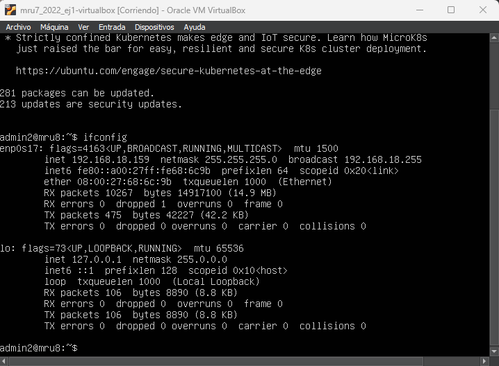
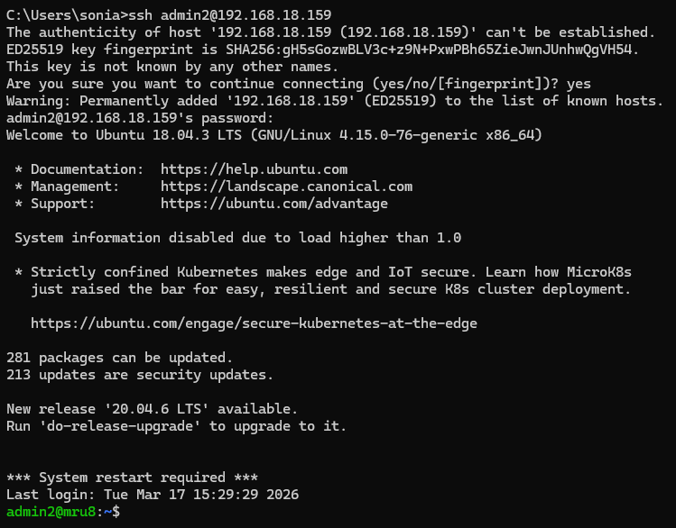

## Pasos generales a realizar
- Descargamos  la máquina virtual del ejercicio y la importamos en VirtualBox.

- Cambiamos el adaptador de red de la VM a Bridge.

- Iniciamos la máquina y accedemos por la consola de la VM con
  - Usuario: admin2
  - Password: 1234

- Ejecutamos ifconfig y anotamos la IP de la interfaz enp0s17.
  

  
# Primera conexión SSH con admin2
Iniciamos la máquina virtual y accedemos por la consola de la VM a través de ssh en modo verbose con:
  - Usuario: admin2
  - Password: 1234

Mostrar el resultado verbose de dicha ejecución resaltando la información de utilidad que se haya observado, así como una posible explicación de su significado.



```
admin2@mru8:~$ ssh -vvv admin2@192.168.18.159
OpenSSH_7.6p1 Ubuntu-4ubuntu0.5, OpenSSL 1.0.2n  7 Dec 2017
debug1: Reading configuration data /etc/ssh/ssh_config
debug1: /etc/ssh/ssh_config line 19: Applying options for *
debug2: resolving "192.168.18.159" port 22
debug2: ssh_connect_direct: needpriv 0
debug1: Connecting to 192.168.18.159 [192.168.18.159] port 22.
debug1: Connection established.
debug1: key_load_public: No such file or directory
debug1: identity file /home/admin2/.ssh/id_rsa type -1
debug1: key_load_public: No such file or directory
debug1: identity file /home/admin2/.ssh/id_rsa-cert type -1
debug1: key_load_public: No such file or directory
debug1: identity file /home/admin2/.ssh/id_dsa type -1
debug1: key_load_public: No such file or directory
debug1: identity file /home/admin2/.ssh/id_dsa-cert type -1
debug1: key_load_public: No such file or directory
debug1: identity file /home/admin2/.ssh/id_ecdsa type -1
debug1: key_load_public: No such file or directory
debug1: identity file /home/admin2/.ssh/id_ecdsa-cert type -1
debug1: key_load_public: No such file or directory
debug1: identity file /home/admin2/.ssh/id_ed25519 type -1
debug1: key_load_public: No such file or directory
debug1: identity file /home/admin2/.ssh/id_ed25519-cert type -1
debug1: Local version string SSH-2.0-OpenSSH_7.6p1 Ubuntu-4ubuntu0.5
debug1: Remote protocol version 2.0, remote software version OpenSSH_7.6p1 Ubuntu-4ubuntu0.5
debug1: match: OpenSSH_7.6p1 Ubuntu-4ubuntu0.5 pat OpenSSH* compat 0x04000000
debug2: fd 3 setting O_NONBLOCK
debug1: Authenticating to 192.168.18.159:22 as 'admin2'
debug3: hostkeys_foreach: reading file "/home/admin2/.ssh/known_hosts"
debug3: record_hostkey: found key type ECDSA in file /home/admin2/.ssh/known_hosts:1
debug3: load_hostkeys: loaded 1 keys from 192.168.18.159
debug3: order_hostkeyalgs: prefer hostkeyalgs: ecdsa-sha2-nistp256-cert-v01@openssh.com,ecdsa-sha2-nistp384-cert-v01@openssh.com,ecdsa-sha2-nistp521-cert-v01@openssh.com,ecdsa-sha2-nistp256,ecdsa-sha2-nistp384,ecdsa-sha2-nistp521
debug3: send packet: type 20
debug1: SSH2_MSG_KEXINIT sent
debug3: receive packet: type 20
debug1: SSH2_MSG_KEXINIT received
debug2: local client KEXINIT proposal
debug2: KEX algorithms: curve25519-sha256,curve25519-sha256@libssh.org,ecdh-sha2-nistp256,ecdh-sha2-nistp384,ecdh-sha2-nistp521,diffie-hellman-group-exchange-sha256,diffie-hellman-group16-sha512,diffie-hellman-group18-sha512,diffie-hellman-group-exchange-sha1,diffie-hellman-group14-sha256,diffie-hellman-group14-sha1,ext-info-c
debug2: host key algorithms: ecdsa-sha2-nistp256-cert-v01@openssh.com,ecdsa-sha2-nistp384-cert-v01@openssh.com,ecdsa-sha2-nistp521-cert-v01@openssh.com,ecdsa-sha2-nistp256,ecdsa-sha2-nistp384,ecdsa-sha2-nistp521,ssh-ed25519-cert-v01@openssh.com,ssh-rsa-cert-v01@openssh.com,ssh-ed25519,rsa-sha2-512,rsa-sha2-256,ssh-rsa
debug2: ciphers ctos: chacha20-poly1305@openssh.com,aes128-ctr,aes192-ctr,aes256-ctr,aes128-gcm@openssh.com,aes256-gcm@openssh.com
debug2: ciphers stoc: chacha20-poly1305@openssh.com,aes128-ctr,aes192-ctr,aes256-ctr,aes128-gcm@openssh.com,aes256-gcm@openssh.com
debug2: MACs ctos: umac-64-etm@openssh.com,umac-128-etm@openssh.com,hmac-sha2-256-etm@openssh.com,hmac-sha2-512-etm@openssh.com,hmac-sha1-etm@openssh.com,umac-64@openssh.com,umac-128@openssh.com,hmac-sha2-256,hmac-sha2-512,hmac-sha1
debug2: MACs stoc: umac-64-etm@openssh.com,umac-128-etm@openssh.com,hmac-sha2-256-etm@openssh.com,hmac-sha2-512-etm@openssh.com,hmac-sha1-etm@openssh.com,umac-64@openssh.com,umac-128@openssh.com,hmac-sha2-256,hmac-sha2-512,hmac-sha1
debug2: compression ctos: none,zlib@openssh.com,zlib
debug2: compression stoc: none,zlib@openssh.com,zlib
debug2: languages ctos:
debug2: languages stoc:
debug2: first_kex_follows 0
debug2: reserved 0
debug2: peer server KEXINIT proposal
debug2: KEX algorithms: curve25519-sha256,curve25519-sha256@libssh.org,ecdh-sha2-nistp256,ecdh-sha2-nistp384,ecdh-sha2-nistp521,diffie-hellman-group-exchange-sha256,diffie-hellman-group16-sha512,diffie-hellman-group18-sha512,diffie-hellman-group14-sha256,diffie-hellman-group14-sha1
debug2: host key algorithms: ssh-rsa,rsa-sha2-512,rsa-sha2-256,ecdsa-sha2-nistp256,ssh-ed25519
debug2: ciphers ctos: chacha20-poly1305@openssh.com,aes128-ctr,aes192-ctr,aes256-ctr,aes128-gcm@openssh.com,aes256-gcm@openssh.com
debug2: ciphers stoc: chacha20-poly1305@openssh.com,aes128-ctr,aes192-ctr,aes256-ctr,aes128-gcm@openssh.com,aes256-gcm@openssh.com
debug2: MACs ctos: umac-64-etm@openssh.com,umac-128-etm@openssh.com,hmac-sha2-256-etm@openssh.com,hmac-sha2-512-etm@openssh.com,hmac-sha1-etm@openssh.com,umac-64@openssh.com,umac-128@openssh.com,hmac-sha2-256,hmac-sha2-512,hmac-sha1
debug2: MACs stoc: umac-64-etm@openssh.com,umac-128-etm@openssh.com,hmac-sha2-256-etm@openssh.com,hmac-sha2-512-etm@openssh.com,hmac-sha1-etm@openssh.com,umac-64@openssh.com,umac-128@openssh.com,hmac-sha2-256,hmac-sha2-512,hmac-sha1
debug2: compression ctos: none,zlib@openssh.com
debug2: compression stoc: none,zlib@openssh.com
debug2: languages ctos:
debug2: languages stoc:
debug2: first_kex_follows 0
debug2: reserved 0
debug1: kex: algorithm: curve25519-sha256
debug1: kex: host key algorithm: ecdsa-sha2-nistp256
debug1: kex: server->client cipher: chacha20-poly1305@openssh.com MAC: <implicit> compression: none
debug1: kex: client->server cipher: chacha20-poly1305@openssh.com MAC: <implicit> compression: none
debug3: send packet: type 30
debug1: expecting SSH2_MSG_KEX_ECDH_REPLY
debug3: receive packet: type 31
debug1: Server host key: ecdsa-sha2-nistp256 SHA256:OwC8+VNNXiW4pns025jYh/3P9OIU7kzZ6P20s/2ZOao
debug3: hostkeys_foreach: reading file "/home/admin2/.ssh/known_hosts"
debug3: record_hostkey: found key type ECDSA in file /home/admin2/.ssh/known_hosts:1
debug3: load_hostkeys: loaded 1 keys from 192.168.18.159
debug1: Host '192.168.18.159' is known and matches the ECDSA host key.
debug1: Found key in /home/admin2/.ssh/known_hosts:1
debug3: send packet: type 21
debug2: set_newkeys: mode 1
debug1: rekey after 134217728 blocks
debug1: SSH2_MSG_NEWKEYS sent
debug1: expecting SSH2_MSG_NEWKEYS
debug3: receive packet: type 21
debug1: SSH2_MSG_NEWKEYS received
debug2: set_newkeys: mode 0
debug1: rekey after 134217728 blocks
debug2: key: /home/admin2/.ssh/id_rsa ((nil))
debug2: key: /home/admin2/.ssh/id_dsa ((nil))
debug2: key: /home/admin2/.ssh/id_ecdsa ((nil))
debug2: key: /home/admin2/.ssh/id_ed25519 ((nil))
debug3: send packet: type 5
debug3: receive packet: type 7
debug1: SSH2_MSG_EXT_INFO received
debug1: kex_input_ext_info: server-sig-algs=<ssh-ed25519,ssh-rsa,rsa-sha2-256,rsa-sha2-512,ssh-dss,ecdsa-sha2-nistp256,ecdsa-sha2-nistp384,ecdsa-sha2-nistp521>
debug3: receive packet: type 6
debug2: service_accept: ssh-userauth
debug1: SSH2_MSG_SERVICE_ACCEPT received
debug3: send packet: type 50
debug3: receive packet: type 51
debug1: Authentications that can continue: publickey,password
debug3: start over, passed a different list publickey,password
debug3: preferred gssapi-keyex,gssapi-with-mic,publickey,keyboard-interactive,password
debug3: authmethod_lookup publickey
debug3: remaining preferred: keyboard-interactive,password
debug3: authmethod_is_enabled publickey
debug1: Next authentication method: publickey
debug1: Trying private key: /home/admin2/.ssh/id_rsa
debug3: no such identity: /home/admin2/.ssh/id_rsa: No such file or directory
debug1: Trying private key: /home/admin2/.ssh/id_dsa
debug3: no such identity: /home/admin2/.ssh/id_dsa: No such file or directory
debug1: Trying private key: /home/admin2/.ssh/id_ecdsa
debug3: no such identity: /home/admin2/.ssh/id_ecdsa: No such file or directory
debug1: Trying private key: /home/admin2/.ssh/id_ed25519
debug3: no such identity: /home/admin2/.ssh/id_ed25519: No such file or directory
debug2: we did not send a packet, disable method
debug3: authmethod_lookup password
debug3: remaining preferred: ,password
debug3: authmethod_is_enabled password
debug1: Next authentication method: password
admin2@192.168.18.159's password:
debug3: send packet: type 50
debug2: we sent a password packet, wait for reply
debug3: receive packet: type 52
debug1: Authentication succeeded (password).
Authenticated to 192.168.18.159 ([192.168.18.159]:22).
debug1: channel 0: new [client-session]
debug3: ssh_session2_open: channel_new: 0
debug2: channel 0: send open
debug3: send packet: type 90
debug1: Requesting no-more-sessions@openssh.com
debug3: send packet: type 80
debug1: Entering interactive session.
debug1: pledge: network
debug3: receive packet: type 80
debug1: client_input_global_request: rtype hostkeys-00@openssh.com want_reply 0
debug3: receive packet: type 91
debug2: channel_input_open_confirmation: channel 0: callback start
debug2: fd 3 setting TCP_NODELAY
debug3: ssh_packet_set_tos: set IP_TOS 0x10
debug2: client_session2_setup: id 0
debug2: channel 0: request pty-req confirm 1
debug3: send packet: type 98
debug1: Sending environment.
debug3: Ignored env LS_COLORS
debug3: Ignored env SSH_CONNECTION
debug3: Ignored env LESSCLOSE
debug1: Sending env LANG = en_US.UTF-8
debug2: channel 0: request env confirm 0
debug3: send packet: type 98
debug3: Ignored env XDG_SESSION_ID
debug3: Ignored env USER
debug3: Ignored env PWD
debug3: Ignored env HOME
debug3: Ignored env SSH_CLIENT
debug3: Ignored env XDG_DATA_DIRS
debug3: Ignored env SSH_TTY
debug3: Ignored env MAIL
debug3: Ignored env TERM
debug3: Ignored env SHELL
debug3: Ignored env SHLVL
debug3: Ignored env LOGNAME
debug3: Ignored env XDG_RUNTIME_DIR
debug3: Ignored env PATH
debug3: Ignored env LESSOPEN
debug3: Ignored env _
debug2: channel 0: request shell confirm 1
debug3: send packet: type 98
debug2: channel_input_open_confirmation: channel 0: callback done
debug2: channel 0: open confirm rwindow 0 rmax 32768
debug3: receive packet: type 99
debug2: channel_input_status_confirm: type 99 id 0
debug2: PTY allocation request accepted on channel 0
debug2: channel 0: rcvd adjust 2097152
debug3: receive packet: type 99
debug2: channel_input_status_confirm: type 99 id 0
debug2: shell request accepted on channel 0
Welcome to Ubuntu 18.04.3 LTS (GNU/Linux 4.15.0-76-generic x86_64)

 * Documentation:  https://help.ubuntu.com
 * Management:     https://landscape.canonical.com
 * Support:        https://ubuntu.com/advantage

  System information as of Tue Mar 17 15:56:41 UTC 2026

  System load:  0.0                Processes:              154
  Usage of /:   21.0% of 19.56GB   Users logged in:        1
  Memory usage: 11%                IP address for enp0s17: 192.168.18.159
  Swap usage:   0%

 * Strictly confined Kubernetes makes edge and IoT secure. Learn how MicroK8s
   just raised the bar for easy, resilient and secure K8s cluster deployment.

   https://ubuntu.com/engage/secure-kubernetes-at-the-edge

281 packages can be updated.
213 updates are security updates.

New release '20.04.6 LTS' available.
Run 'do-release-upgrade' to upgrade to it.


*** System restart required ***
Last login: Tue Mar 17 15:40:41 2026 from 192.168.18.223
```
donde:
- Comprobamos que sí podemos acceder vía ssh a la máquina virtual.

# Segunda conexión SSH con admin1
Iniciamos la máquina virtual y accedemos por la consola de la VM a través de ssh en modo verbose con:
  - Usuario: admin1
  - Password: 1234

```
ssh -vvv admin1@192.168.18.159
OpenSSH_7.6p1 Ubuntu-4ubuntu0.5, OpenSSL 1.0.2n  7 Dec 2017
debug1: Reading configuration data /etc/ssh/ssh_config
debug1: /etc/ssh/ssh_config line 19: Applying options for *
debug2: resolving "192.168.18.159" port 22
debug2: ssh_connect_direct: needpriv 0
debug1: Connecting to 192.168.18.159 [192.168.18.159] port 22.
debug1: Connection established.
debug1: SELinux support disabled
debug1: key_load_public: No such file or directory
debug1: identity file /home/admin2/.ssh/id_rsa type -1
debug1: key_load_public: No such file or directory
debug1: identity file /home/admin2/.ssh/id_rsa-cert type -1
debug1: key_load_public: No such file or directory
debug1: identity file /home/admin2/.ssh/id_dsa type -1
debug1: key_load_public: No such file or directory
debug1: identity file /home/admin2/.ssh/id_dsa-cert type -1
debug1: key_load_public: No such file or directory
debug1: identity file /home/admin2/.ssh/id_ecdsa type -1
debug1: key_load_public: No such file or directory
debug1: identity file /home/admin2/.ssh/id_ecdsa-cert type -1
debug1: key_load_public: No such file or directory
debug1: identity file /home/admin2/.ssh/id_ed25519 type -1
debug1: key_load_public: No such file or directory
debug1: identity file /home/admin2/.ssh/id_ed25519-cert type -1
debug1: Local version string SSH-2.0-OpenSSH_7.6p1 Ubuntu-4ubuntu0.5
debug1: Remote protocol version 2.0, remote software version OpenSSH_7.6p1 Ubuntu-4ubuntu0.5
debug1: match: OpenSSH_7.6p1 Ubuntu-4ubuntu0.5 pat OpenSSH* compat 0x04000000
debug2: fd 3 setting O_NONBLOCK
debug1: Authenticating to 192.168.18.159:22 as 'admin1'
debug3: send packet: type 20
debug1: SSH2_MSG_KEXINIT sent
debug3: receive packet: type 20
debug1: SSH2_MSG_KEXINIT received
debug2: local client KEXINIT proposal
debug2: KEX algorithms: curve25519-sha256,curve25519-sha256@libssh.org,ecdh-sha2-nistp256,ecdh-sha2-nistp384,ecdh-sha2-nistp521,diffie-hellman-group-exchange-sha256,diffie-hellman-group16-sha512,diffie-hellman-group18-sha512,diffie-hellman-group-exchange-sha1,diffie-hellman-group14-sha256,diffie-hellman-group14-sha1,ext-info-c
debug2: host key algorithms: ecdsa-sha2-nistp256-cert-v01@openssh.com,ecdsa-sha2-nistp384-cert-v01@openssh.com,ecdsa-sha2-nistp521-cert-v01@openssh.com,ssh-ed25519-cert-v01@openssh.com,ssh-rsa-cert-v01@openssh.com,ecdsa-sha2-nistp256,ecdsa-sha2-nistp384,ecdsa-sha2-nistp521,ssh-ed25519,rsa-sha2-512,rsa-sha2-256,ssh-rsa
debug2: ciphers ctos: chacha20-poly1305@openssh.com,aes128-ctr,aes192-ctr,aes256-ctr,aes128-gcm@openssh.com,aes256-gcm@openssh.com
debug2: ciphers stoc: chacha20-poly1305@openssh.com,aes128-ctr,aes192-ctr,aes256-ctr,aes128-gcm@openssh.com,aes256-gcm@openssh.com
debug2: MACs ctos: umac-64-etm@openssh.com,umac-128-etm@openssh.com,hmac-sha2-256-etm@openssh.com,hmac-sha2-512-etm@openssh.com,hmac-sha1-etm@openssh.com,umac-64@openssh.com,umac-128@openssh.com,hmac-sha2-256,hmac-sha2-512,hmac-sha1
debug2: MACs stoc: umac-64-etm@openssh.com,umac-128-etm@openssh.com,hmac-sha2-256-etm@openssh.com,hmac-sha2-512-etm@openssh.com,hmac-sha1-etm@openssh.com,umac-64@openssh.com,umac-128@openssh.com,hmac-sha2-256,hmac-sha2-512,hmac-sha1
debug2: compression ctos: none,zlib@openssh.com,zlib
debug2: compression stoc: none,zlib@openssh.com,zlib
debug2: languages ctos:
debug2: languages stoc:
debug2: first_kex_follows 0
debug2: reserved 0
debug2: peer server KEXINIT proposal
debug2: KEX algorithms: curve25519-sha256,curve25519-sha256@libssh.org,ecdh-sha2-nistp256,ecdh-sha2-nistp384,ecdh-sha2-nistp521,diffie-hellman-group-exchange-sha256,diffie-hellman-group16-sha512,diffie-hellman-group18-sha512,diffie-hellman-group14-sha256,diffie-hellman-group14-sha1
debug2: host key algorithms: ssh-rsa,rsa-sha2-512,rsa-sha2-256,ecdsa-sha2-nistp256,ssh-ed25519
debug2: ciphers ctos: chacha20-poly1305@openssh.com,aes128-ctr,aes192-ctr,aes256-ctr,aes128-gcm@openssh.com,aes256-gcm@openssh.com
debug2: ciphers stoc: chacha20-poly1305@openssh.com,aes128-ctr,aes192-ctr,aes256-ctr,aes128-gcm@openssh.com,aes256-gcm@openssh.com
debug2: MACs ctos: umac-64-etm@openssh.com,umac-128-etm@openssh.com,hmac-sha2-256-etm@openssh.com,hmac-sha2-512-etm@openssh.com,hmac-sha1-etm@openssh.com,umac-64@openssh.com,umac-128@openssh.com,hmac-sha2-256,hmac-sha2-512,hmac-sha1
debug2: MACs stoc: umac-64-etm@openssh.com,umac-128-etm@openssh.com,hmac-sha2-256-etm@openssh.com,hmac-sha2-512-etm@openssh.com,hmac-sha1-etm@openssh.com,umac-64@openssh.com,umac-128@openssh.com,hmac-sha2-256,hmac-sha2-512,hmac-sha1
debug2: compression ctos: none,zlib@openssh.com
debug2: compression stoc: none,zlib@openssh.com
debug2: languages ctos:
debug2: languages stoc:
debug2: first_kex_follows 0
debug2: reserved 0
debug1: kex: algorithm: curve25519-sha256
debug1: kex: host key algorithm: ecdsa-sha2-nistp256
debug1: kex: server->client cipher: chacha20-poly1305@openssh.com MAC: <implicit> compression: none
debug1: kex: client->server cipher: chacha20-poly1305@openssh.com MAC: <implicit> compression: none
debug3: send packet: type 30
debug1: expecting SSH2_MSG_KEX_ECDH_REPLY
debug3: receive packet: type 31
debug1: Server host key: ecdsa-sha2-nistp256 SHA256:OwC8+VNNXiW4pns025jYh/3P9OIU7kzZ6P20s/2ZOao
The authenticity of host '192.168.18.159 (192.168.18.159)' can't be established.
ECDSA key fingerprint is SHA256:OwC8+VNNXiW4pns025jYh/3P9OIU7kzZ6P20s/2ZOao.
Are you sure you want to continue connecting (yes/no)? yes
Warning: Permanently added '192.168.18.159' (ECDSA) to the list of known hosts.
debug3: send packet: type 21
debug2: set_newkeys: mode 1
debug1: rekey after 134217728 blocks
debug1: SSH2_MSG_NEWKEYS sent
debug1: expecting SSH2_MSG_NEWKEYS
debug3: receive packet: type 21
debug1: SSH2_MSG_NEWKEYS received
debug2: set_newkeys: mode 0
debug1: rekey after 134217728 blocks
debug2: key: /home/admin2/.ssh/id_rsa ((nil))
debug2: key: /home/admin2/.ssh/id_dsa ((nil))
debug2: key: /home/admin2/.ssh/id_ecdsa ((nil))
debug2: key: /home/admin2/.ssh/id_ed25519 ((nil))
debug3: send packet: type 5
debug3: receive packet: type 7
debug1: SSH2_MSG_EXT_INFO received
debug1: kex_input_ext_info: server-sig-algs=<ssh-ed25519,ssh-rsa,rsa-sha2-256,rsa-sha2-512,ssh-dss,ecdsa-sha2-nistp256,ecdsa-sha2-nistp384,ecdsa-sha2-nistp521>
debug3: receive packet: type 6
debug2: service_accept: ssh-userauth
debug1: SSH2_MSG_SERVICE_ACCEPT received
debug3: send packet: type 50
debug3: receive packet: type 51
debug1: Authentications that can continue: publickey,password
debug3: start over, passed a different list publickey,password
debug3: preferred gssapi-keyex,gssapi-with-mic,publickey,keyboard-interactive,password
debug3: authmethod_lookup publickey
debug3: remaining preferred: keyboard-interactive,password
debug3: authmethod_is_enabled publickey
debug1: Next authentication method: publickey
debug1: Trying private key: /home/admin2/.ssh/id_rsa
debug3: no such identity: /home/admin2/.ssh/id_rsa: No such file or directory
debug1: Trying private key: /home/admin2/.ssh/id_dsa
debug3: no such identity: /home/admin2/.ssh/id_dsa: No such file or directory
debug1: Trying private key: /home/admin2/.ssh/id_ecdsa
debug3: no such identity: /home/admin2/.ssh/id_ecdsa: No such file or directory
debug1: Trying private key: /home/admin2/.ssh/id_ed25519
debug3: no such identity: /home/admin2/.ssh/id_ed25519: No such file or directory
debug2: we did not send a packet, disable method
debug3: authmethod_lookup password
debug3: remaining preferred: ,password
debug3: authmethod_is_enabled password
debug1: Next authentication method: password
admin1@192.168.18.159's password:
debug3: send packet: type 50
debug2: we sent a password packet, wait for reply
Connection closed by 192.168.18.159 port 22
```
donde:
- Vemos que el servidor acepta la conexión SSH. Recibe el intento de contraseña y luego corta la sesión. Eso apunta más a un problema del lado del servidor y del usuario `admin1` que a un problema de red o de IP.
- Vamos a aplicar los conocimientos aprendidos en las unidades 8.1, 8.2 y especialmente de 8.3 para elaborar una lista de comprobaciones de elementos del sistema como:
  - configuraciones,
  - permisos,
  - limitaciones, etc
  que puedan ayudar a resolver el problema.


# Comparando las salidas de la conexión SSH
## Convergencia
- Se resuelven  la IP correctamente.
- Se establecen las conexiones TCP al puerto 22.
- El servidor responde como OpenSSH_7.6p1.
- El intercambio criptográfico (KEXINIT, algoritmos, cifrados, MACs) se completa bien.
- El cliente llega a:
  - `SSH2_MSG_SERVICE_ACCEPT received`.
  - `Authentications that can continue: publickey,password`.
- Se intenta primero autenticación por clave pública y falla de forma normal porque no existen claves privadas locales.
- Después se pasa a autenticación por contraseña.

Esto significa que el problema no está en:
- la red,
- la IP,
- el puerto 22,
- la conectividad básica,
- ni en una caída general del servicio sshd.

**En otras palabras: SSH funciona, porque con admin2 llega hasta login interactivo completo.**

## Divergencia
- `known_hosts`:
  - En admin2 aparece: `Host '192.168.18.159' is known and matches the ECDSA host key`.
  - En admin1 aparece el aviso:
    ```
    The authenticity of host '192.168.18.159' can't be established
    ...
    Are you sure you want to continue connecting (yes/no)?
    ```
    Eso sólo indica que en ese intento era la primera vez que ese host se guardaba en known_hosts. No es una anomalía de acceso.

- `SELinux support disabled`: En una traza aparece y en la otra no, pero eso no explica el fallo de admin1. No cambia la secuencia real del login.

- Justo después de enviar la contraseña:
  - Con admin2 tras escribir la contraseña:
    ```
    debug3: send packet: type 50
    debug2: we sent a password packet, wait for reply
    debug3: receive packet: type 52
    debug1: Authentication succeeded (password).
    Authenticated to 192.168.18.159 ...
    ```
    Luego el servidor crea la sesión:
      - channel 0: new [client-session]
      - acepta PTY,
      - acepta shell,
      - muestra el banner de Ubuntu,
      - y deja entrar al usuario.

  - Con admin1 tras escribir la contraseña:
    ```
    debug3: send packet: type 50
    debug2: we sent a password packet, wait for reply
    Connection closed by 192.168.18.159 port 22
    ```
    Es decir:
      - el cliente sí envía la contraseña,
      - pero el servidor no devuelve ni:
        - type 52 (autenticación correcta),
        - ni type 51 (fallo normal de autenticación),
      - y en su lugar cierra la conexión.
      - Ese es el punto exacto donde se rompe el flujo.

## Conclusiones
- admin2 completa estas fases:
  - transporte SSH,
  - negociación criptográfica,
  - autenticación,
  - apertura de sesión,
  - asignación de terminal,
  - ejecución de shell interactiva.

- admin1 solo completa con seguridad:
  - transporte SSH,
  - negociación criptográfica,
  - inicio del proceso de autenticación por contraseña,
  - y falla antes de que el servidor confirme éxito y antes de abrir la sesión.

- El problema puede estar en el lado servidor, en una comprobación ligada al usuario admin1, probablemente en:
  - PAM auth o account,
  - estado de cuenta del usuario,
  - una política de acceso específica, 
  - una restricción aplicada antes de abrir sesión...
  - Restricción en SSHD solo para admin1.
  - Módulo PAM que deja autenticar o evaluar al usuario y luego corta el acceso.
  - Estado de la cuenta de admin1 (bloqueada, expirada, shell inválido, etc.).
  - Problema de sesión del usuario: home, shell, scripts de arranque, límites o permisos.

La comparación de ambas salidas `ssh -vvv` muestra que el servicio SSH funciona correctamente a nivel de red, negociación criptográfica y oferta de métodos de autenticación, ya que ambos intentos alcanzan la fase password. En el caso de `admin2`, tras enviar la contraseña el servidor responde con `type 52`, confirmando `Authentication succeeded`, y posteriormente abre la sesión interactiva, asigna `PTY` y lanza la `shell`. En cambio, en el caso de `admin1`, tras el envío de la contraseña el servidor no devuelve ni éxito ni rechazo normal de autenticación, sino que cierra directamente la conexión. Esto sugiere un problema localizado en el lado servidor, probablemente asociado al estado de la cuenta o a una restricción de acceso gestionada por `PAM` o por la configuración de SSH, más que a un problema de conectividad o de cliente.


# Lista de comprobaciones
Tras acceder con el usuario admin2, enumerar la lista de comprobaciones que se hayan ejecutado sobre el estado de la máquina, especialmente aquella información que se haya obtenido sobre el usuario admin1.


## Estado de la cuenta admin1

```
getent passwd admin1
admin1:x:1000:1000:MReversing U8:/home/admin1:/bin/bash
```
donde:
- admin1: el usuario existe en el sistema.
- x: la contraseña no está en /etc/passwd, sino en /etc/shadow, que es lo normal.
- 1000: UID del usuario.
- 1000: GID principal del usuario.
- MReversing U8: campo descriptivo/comentario.
- /home/admin1: directorio personal asignado. Pero sería necesario comprobar si:
  - el directorio existe,
  - tiene el propietario correcto,
  - y los permisos son válidos.
- /bin/bash: shell de login que es válida.


```
admin2@mru8:~$ sudo passwd -S admin1
admin1 P 02/09/2020 0 99999 7 -1
```
donde: 
- El formato del comando  passwd -S es `usuario  estado  última_modificación  mínimo  máximo  aviso  inactividad`, donde:
  - `admin1`: usuario analizado.
  - `P`: la cuenta tiene password válida.
  - `02/09/2020`: fecha del último cambio de contraseña.
  - `0`: puede cambiar la contraseña sin esperar días mínimos.
  - `99999`: la contraseña no caduca en la práctica.
  - `7`: avisaría 7 días antes de caducar.
  - `-1`: no hay periodo de inactividad configurado tras caducidad.
- La salida de este comando muestra que la cuenta dispone de una contraseña válida (P), no bloqueada, y que la política de envejecimiento de la contraseña no apunta a una expiración inmediata (99999 días de validez, 7 días de aviso y sin periodo de inactividad). Por tanto, se descarta como causa principal del fallo un bloqueo de contraseña o una caducidad normal de la misma.
- El problema puede deberse a
  - la expiración de cuenta,
  - a restricciones PAM/SSHD,
  - a permisos del entorno del usuario o
  - limitaciones adicionales del sistema.


```
admin2@mru8:~$ sudo chage -l admin1
Last password change                                    : Feb 09, 2020
Password expires                                        : never
Password inactive                                       : never
Account expires                                         : never
Minimum number of days between password change          : 0
Maximum number of days between password change          : 99999
Number of days of warning before password expires       : 7
```
donde:
- Se descarta casi por completo un problema de caducidad.
- admin1 existe.
- Tiene shell válida (/bin/bash).
- La contraseña no está bloqueada (passwd -S dio P).
- La contraseña no está caducada.
- La cuenta no está expirada.


```
admin2@mru8:~$ sudo faillog -u admin1
Login       Failures Maximum Latest                   On

admin1          0        0   01/01/70 00:00:00 +0000
```
donde:
- Se comprueba que admin1 no parece estar bloqueado por intentos fallidos.
- `Failures = 0`: No hay intentos fallidos registrados para admin1.
- `Maximum = 0`: No aparece un umbral de bloqueo efectivo para este usuario en faillog, o no se está aplicando desde aquí.
- `Latest = 01/01/70 00:00:00 +0000`: Esa fecha “epoch” suele indicar que nunca ha habido un fallo registrado para ese usuario en este mecanismo.


```
admin2@mru8:~$ sudo lastlog -u admin1
Username         Port     From             Latest
admin1           pts/0    172.16.60.1      Sun Feb  9 19:38:52 +0000 2020
```
donde:
- Se comprueba que `admin1` sí inició sesión correctamente alguna vez. Por tanto, la cuenta no nació mal configurada, sino que el problema actual parece deberse a una modificación posterior en la configuración, las restricciones de acceso o el entorno del usuario.
- La última vez registrada fue el 9 de febrero de 2020.
- Entró por `pts/0`, es decir, una sesión interactiva de terminal.
- El origen fue `172.16.60.1`, no la IP actual 192.168.18.223


```
admin2@mru8:~$ id admin1
uid=1000(admin1) gid=1000(admin1) groups=1000(admin1),4(adm),24(cdrom),27(sudo),30(dip),46(plugdev),108(lxd)
```
donde:
- `uid=1000(admin1)`: el usuario existe a nivel de cuenas y su `UID es 1000`.
- `gid=1000(admin1)`: su grupo principal también existe y es `admin1`.
- `groups=...`: además pertenece a varios grupos secundarios. No parece un problema de pertenencia a grupos.
- Pertenece al grupo `sudo`.
- No hay una restricción obvia por grupo principal. Su GID y grupos secundarios son normales para un usuario administrativo en Ubuntu.


```
admin2@mru8:~$ groups admin1
admin1 : admin1 adm cdrom sudo dip plugdev lxd
```
donde:
- `admin1`: grupo principal del usuario.
- `adm`: acceso a ciertos logs del sistema.
- `sudo`: permisos administrativos.
- La salida de este comandp confirma que el usuario pertenece a los grupos esperables, incluido `sudo`, por lo que no se aprecia una limitación evidente por pertenencia a grupos. Esto refuerza la hipótesis de que el fallo está relacionado con la configuración de SSH, PAM o el entorno del usuario, y no con una falta de membresía administrativa.


**Conclusiones:**
- La cuenta existe en el sistema.
- Tiene shell válida: `/bin/bash`.
- Tiene directorio personal asignado: `/home/admin1`.
- La contraseña está activa, no bloqueada.
- La contraseña no está caducada.
- La cuenta no está expirada.
- No hay bloqueo por intentos fallidos en faillog.
- `admin1` ya inició sesión correctamente en el pasado, así que no es una cuenta que haya estado siempre mal.
- La identidad del usuario es normal: tiene `UID/GID` válidos.
- La pertenencia a grupos también parece normal, incluido sudo.


## Configuración SSH

```
admin2@mru8:~$ sudo grep -nEi '^(UsePAM|PasswordAuthentication|PubkeyAuthentication|AllowUsers|DenyUsers|AllowGroups|DenyGroups|Match|ForceCommand)' /etc/ssh/sshd_config
84:UsePAM yes
123:PasswordAuthentication yes
```
donde: 
- `UsePAM yes`: SSH está usando PAM para gestionar parte del acceso. Esto es importante porque, aunque la conexión llegue hasta pedir contraseña, PAM puede seguir aceptando o rechazando al usuario en fases como `auth`, `account` o `session`.
- `PasswordAuthentication yes`: El acceso por contraseña está habilitado. Por tanto, el problema de admin1 no se debe a que SSH tenga desactivada la autenticación por password.
- Conclusiones del comando `grep`:
  - No aparece `AllowUsers`.
  - No aparece `DenyUsers`.
  - No aparece `AllowGroups`.
  - No aparece `DenyGroups`.
  - No aparece `Match`.
  - No aparece `ForceCommand`.
  - Lo que implica que en el archivo principal `/etc/ssh/sshd_config`, no hay una restricción explícita que bloquee solo a admin1 por usuario, grupo o una regla especial.
- El problema no parece estar en una denegación directa en la configuración principal de SSH, sino probablemente en PAM o en configuraciones adicionales.


```
admin2@mru8:~$ sudo sshd -T | egrep 'usepam|passwordauthentication|pubkeyauthentication|allowusers|denyusers|allowgroups|denygroups|forcecommand'
usepam yes
pubkeyauthentication yes
passwordauthentication yes
forcecommand none
```
donde: 
- `usepam yes`: SSH usa PAM en el proceso de acceso. Esto sigue siendo clave, porque aunque la autenticación por contraseña esté habilitada, PAM todavía puede rechazar o cerrar el acceso de admin1.
- `pubkeyauthentication yes`: La autenticación por clave pública está permitida, aunque en este caso no aplica mucho porque ya vimos que no había claves locales y luego SSH pasaba a contraseña.
- `passwordauthentication yes`: La autenticación por contraseña está realmente habilitada en la configuración efectiva, no sólo en el fichero. Esto descarta que el fallo de admin1 sea porque SSH no admita password.
- `forcecommand none`: No hay un comando forzado global que esté cerrando la sesión nada más entrar.


**Conclusiones:**
- La configuración efectiva de sshd obtenida confirma que el servicio tiene activado UsePAM, permite autenticación por clave pública y por contraseña, y no define ningún ForceCommand global. Además, no se observan restricciones efectivas por usuarios o grupos en los parámetros consultados. Por ello, se descarta que el fallo de admin1 provenga de una política global de SSH, ganando fuerza la hipótesis de un problema en PAM o en la apertura de sesión del usuario.


## PAM
PAM es el framework que decide si un usuario puede acceder a una operación concreta; sus logs y su configuración son especialmente útiles para analizar intentos de acceso por SSH. La configuración relevante está en `/etc/pam.conf` y, preferiblemente, en `/etc/pam.d/[servicio]`. PAM separa la lógica en interfaces `auth`, `account`, `password` y `session`, con banderas de control como `required`, `requisite`, `sufficient`, `optional` e `include`.

```
admin2@mru8:~$ sudo cat /etc/pam.d/sshd
# PAM configuration for the Secure Shell service

# Standard Un*x authentication.
@include common-auth

# Disallow non-root logins when /etc/nologin exists.
account    required     pam_nologin.so

# Uncomment and edit /etc/security/access.conf if you need to set complex
# access limits that are hard to express in sshd_config.
# account  required     pam_access.so

# Standard Un*x authorization.
@include common-account

# SELinux needs to be the first session rule.  This ensures that any
# lingering context has been cleared.  Without this it is possible that a
# module could execute code in the wrong domain.
session [success=ok ignore=ignore module_unknown=ignore default=bad]        pam_selinux.so close

# Set the loginuid process attribute.
session    required     pam_loginuid.so

# Create a new session keyring.
session    optional     pam_keyinit.so force revoke

# Standard Un*x session setup and teardown.
@include common-session

# Print the message of the day upon successful login.
# This includes a dynamically generated part from /run/motd.dynamic
# and a static (admin-editable) part from /etc/motd.
session    optional     pam_motd.so  motd=/run/motd.dynamic
session    optional     pam_motd.so noupdate

# Print the status of the user's mailbox upon successful login.
session    optional     pam_mail.so standard noenv # [1]

# Set up user limits from /etc/security/limits.conf.
session    required     pam_limits.so

# Read environment variables from /etc/environment and
# /etc/security/pam_env.conf.
session    required     pam_env.so # [1]
# In Debian 4.0 (etch), locale-related environment variables were moved to
# /etc/default/locale, so read that as well.
session    required     pam_env.so user_readenv=1 envfile=/etc/default/locale

# SELinux needs to intervene at login time to ensure that the process starts
# in the proper default security context.  Only sessions which are intended
# to run in the user's context should be run after this.
session [success=ok ignore=ignore module_unknown=ignore default=bad]        pam_selinux.so open

# Standard Un*x password updating.
@include common-password
```
donde:
- Se comprueba que el servicio SSH usa esta secuencia PAM:
  - `@include common-auth`: Se valida la autenticación del usuario.
  - `account required pam_nologin.so`: Bloquea accesos de usuarios `no root` si existe `/etc/nologin`.
  - `@include common-account`: Ae comprueba si la cuenta está autorizada a entrar.
- Varias reglas de `session`: Se ejecutan al abrir la sesión:
  - `pam_loginuid.so`.
  - `pam_keyinit.so`.
  - `@include common-session`.
  - `pam_motd.so`.
  - `pam_mail.so`.
  - `pam_limits.so`.
  - `pam_env.so`.
  - `pam_selinux.so open`.
- `@include common-password`: Relacionado con cambios de contraseña, no con el login normal.
- `pam_access.so` NO está activo aquí ya que tiene la línea está comentada: `# account  required     pam_access.so`. Eso significa que, en este fichero, NO se está aplicando una restricción tipo `access.conf` para SSH.
- No hay una reglas raras o específicas contra admin1 en este fichero. Por tanto, `/etc/pam.d/sshd` NO muestra una denegación explícita directa contra admin1.
- `pam_nologin.so` NO parece el problema principal. Esa regla bloquearía a usuarios normales si existiera `/etc/nologin`. Pero como admin2 sí puede entrar por SSH, lo normal es pensar que no existe `/etc/nologin` o no está afectando.
- Este fichero delega la lógica real en los ficheros comunes. Las líneas clave son:
  - `@include common-auth`: Si aquí fallara la autenticación, normalmente es mostraría un rechazo más clásico de credenciales. Como en este caso el servidor cierra la conexión tras enviar la contraseña, no es la hipótesis más fuerte, aunque sigue abierta.
  - `@include common-account`: Aquí pueden aparecer reglas como por ejemplo:
    - la cuenta no puede acceder en este contexto,
    - el usuario no cumple cierta política,
    - o PAM decide cortar el acceso antes de abrir la sesión.
  - `@include common-session`: También es muy sospechoso, porque el problema ocurre justo al pasar de autenticación a apertura de sesión. Si una regla `session required` falla, la conexión puede cerrarse.
- Conclusion: El fichero `/etc/pam.d/sshd` no muestra una denegación explícita para admin1 y no activa `pam_access.so` en este servicio. Además, como admin2 puede acceder, `pam_nologin.so` no parece la causa principal. La lógica relevante del acceso SSH está delegada en `common-auth`, `common-account` y `common-session`, por lo que el problema más probable se encuentra en uno de esos ficheros comunes o en un módulo de sesión obligatorio como `pam_limits` o `pam_env`.


```
admin2@mru8:~$ sudo cat /etc/pam.d/common-auth
#
# /etc/pam.d/common-auth - authentication settings common to all services
#
# This file is included from other service-specific PAM config files,
# and should contain a list of the authentication modules that define
# the central authentication scheme for use on the system
# (e.g., /etc/shadow, LDAP, Kerberos, etc.).  The default is to use the
# traditional Unix authentication mechanisms.
#
# As of pam 1.0.1-6, this file is managed by pam-auth-update by default.
# To take advantage of this, it is recommended that you configure any
# local modules either before or after the default block, and use
# pam-auth-update to manage selection of other modules.  See
# pam-auth-update(8) for details.

# here are the per-package modules (the "Primary" block)
auth    [success=1 default=ignore]      pam_unix.so nullok_secure
# here's the fallback if no module succeeds
auth    requisite                       pam_deny.so
# prime the stack with a positive return value if there isn't one already;
# this avoids us returning an error just because nothing sets a success code
# since the modules above will each just jump around
auth    required                        pam_permit.so
# and here are more per-package modules (the "Additional" block)
auth    optional                        pam_cap.so
# end of pam-auth-update config
admin2@mru8:~$
```
donde: 
- Esta salida sugiere que `common-auth` es el bloque PAM estándar y, por sí solo, no muestra ninguna restricción especial contra admin1.


```
admin2@mru8:~$ sudo cat /etc/pam.d/common-account
#
# /etc/pam.d/common-account - authorization settings common to all services
#
# This file is included from other service-specific PAM config files,
# and should contain a list of the authorization modules that define
# the central access policy for use on the system.  The default is to
# only deny service to users whose accounts are expired in /etc/shadow.
#
# As of pam 1.0.1-6, this file is managed by pam-auth-update by default.
# To take advantage of this, it is recommended that you configure any
# local modules either before or after the default block, and use
# pam-auth-update to manage selection of other modules.  See
# pam-auth-update(8) for details.
#

# here are the per-package modules (the "Primary" block)
account [success=1 new_authtok_reqd=done default=ignore]        pam_unix.so
# here's the fallback if no module succeeds
account requisite                       pam_deny.so
# prime the stack with a positive return value if there isn't one already;
# this avoids us returning an error just because nothing sets a success code
# since the modules above will each just jump around
account required                        pam_permit.so
# and here are more per-package modules (the "Additional" block)
# end of pam-auth-update config
```
donde:
- Esta salida indica que `common-account` TAMBIÉN es estándar y no apunta a una denegación en la fase `account`.
- El fichero `/etc/pam.d/common-account` contiene una configuración PAM estándar basada únicamente en `pam_unix.so`, sin módulos adicionales de restricción. Dado que la cuenta admin1 no está expirada y su contraseña tampoco, no hay indicios de que el rechazo se produzca en la fase account de PAM.


```
admin2@mru8:~$ sudo cat /etc/pam.d/common-session
#
# /etc/pam.d/common-session - session-related modules common to all services
#
# This file is included from other service-specific PAM config files,
# and should contain a list of modules that define tasks to be performed
# at the start and end of sessions of *any* kind (both interactive and
# non-interactive).
#
# As of pam 1.0.1-6, this file is managed by pam-auth-update by default.
# To take advantage of this, it is recommended that you configure any
# local modules either before or after the default block, and use
# pam-auth-update to manage selection of other modules.  See
# pam-auth-update(8) for details.

# here are the per-package modules (the "Primary" block)
session [default=1]                     pam_permit.so
# here's the fallback if no module succeeds
session requisite                       pam_deny.so
# prime the stack with a positive return value if there isn't one already;
# this avoids us returning an error just because nothing sets a success code
# since the modules above will each just jump around
session required                        pam_permit.so
# The pam_umask module will set the umask according to the system default in
# /etc/login.defs and user settings, solving the problem of different
# umask settings with different shells, display managers, remote sessions etc.
# See "man pam_umask".
session optional                        pam_umask.so
# and here are more per-package modules (the "Additional" block)
session required        pam_unix.so
session optional        pam_systemd.so
# end of pam-auth-update config
```
donde:
- Esta salida indica que common-session también es una configuración PAM estándar y TAMPOCO contiene ninguna regla específica que apunte contra admin1.
- El fichero `/etc/pam.d/common-session` presenta una configuración estándar y no contiene restricciones específicas para admin1. No se observan módulos adicionales capaces de denegar selectivamente el acceso. En consecuencia, NO hay indicios de que el problema resida en los bloques PAM comunes (`common-auth`, `common-account`, `common-session`).


**Vamos a centrarnos en los módulos propios de sshd, en el entorno del usuario y en los registros de autenticación.**


```
admin2@mru8:~$ sudo grep -i admin1 /var/log/auth.log | tail -n 30
Binary file /var/log/auth.log matches
```
donde:
- El comando `grep` sí ha encontrado coincidencias con admin1 en `/var/log/auth.log`.
- Pero el fichero contiene algún byte no imprimible, así que `grep` lo trata como binario y por eso no muestra las líneas.
- Vamos a forzar que se muestre el texto con la opcion `-a` del comando grep para forzar a que se procese el archivo binario como si fuera texto plano.


```
admin2@mru8:~$ sudo grep -a -i admin1 /var/log/auth.log | tail -n 30
Feb  9 19:39:55 mru8 CRON[959]: pam_unix(cron:session): session opened for user admin1 by (uid=0)
Mar 23 13:02:46 mru8 CRON[862]: pam_unix(cron:session): session opened for user admin1 by (uid=0)
Mar 23 15:27:09 mru8 CRON[804]: pam_unix(cron:session): session opened for user admin1 by (uid=0)
Mar 17 16:28:15 mru8 CRON[1165]: pam_unix(cron:session): session opened for user admin1 by (uid=0)
Mar 17 16:31:55 mru8 sudo:   admin2 : TTY=pts/1 ; PWD=/home/admin2 ; USER=root ; COMMAND=/usr/bin/passwd -S admin1
Mar 17 16:32:15 mru8 sudo:   admin2 : TTY=pts/1 ; PWD=/home/admin2 ; USER=root ; COMMAND=/usr/bin/chage -l admin1
Mar 17 16:32:33 mru8 sudo:   admin2 : TTY=pts/1 ; PWD=/home/admin2 ; USER=root ; COMMAND=/usr/bin/faillog -u admin1
Mar 17 16:32:52 mru8 sudo:   admin2 : TTY=pts/1 ; PWD=/home/admin2 ; USER=root ; COMMAND=/usr/bin/lastlog -u admin1
Mar 17 16:34:53 mru8 sudo:   admin2 : TTY=pts/1 ; PWD=/home/admin2 ; USER=root ; COMMAND=/bin/ls -ld /home/admin1
Mar 17 16:35:11 mru8 sudo:   admin2 : TTY=pts/1 ; PWD=/home/admin2 ; USER=root ; COMMAND=/usr/bin/namei -l /home/admin1
Mar 17 16:35:29 mru8 sudo:   admin2 : TTY=pts/1 ; PWD=/home/admin2 ; USER=root ; COMMAND=/bin/ls -la /home/admin1
Mar 17 16:35:45 mru8 sudo:   admin2 : TTY=pts/1 ; PWD=/home/admin2 ; USER=root ; COMMAND=/bin/ls -la /home/admin1/.ssh
Mar 17 16:36:01 mru8 sudo:   admin2 : TTY=pts/1 ; PWD=/home/admin2 ; USER=root ; COMMAND=/usr/bin/stat /home/admin1 /home/admin1/.ssh /home/admin1/.ssh/authorized_keys
Mar 17 16:38:56 mru8 sudo:   admin2 : TTY=pts/1 ; PWD=/home/admin2 ; USER=root ; COMMAND=/bin/grep -i admin1 /var/log/auth.log
Mar 17 16:40:24 mru8 sshd[28689]: Accepted password for admin1 from 192.168.18.223 port 56374 ssh2
Mar 17 16:40:24 mru8 sshd[28689]: pam_unix(sshd:session): session opened for user admin1 by (uid=0)
Mar 17 16:40:24 mru8 systemd: pam_unix(systemd-user:session): session opened for user admin1 by (uid=0)
Mar 17 16:40:24 mru8 systemd-logind[920]: New session 7 of user admin1.
Mar 17 16:40:31 mru8 sshd[28795]: Disconnected from user admin1 192.168.18.223 port 56374
Mar 17 16:40:31 mru8 sshd[28689]: pam_unix(sshd:session): session closed for user admin1
Mar 17 16:44:33 mru8 sudo:   admin2 : TTY=pts/1 ; PWD=/home/admin2 ; USER=root ; COMMAND=/bin/grep -RniE pam_access|pam_time|pam_nologin|pam_listfile|pam_succeed_if|pam_exec|pam_limits|pam_tally2|pam_faillock|admin1 /etc/pam.d /etc/security
Mar 18 12:01:36 mru8 CRON[949]: pam_unix(cron:session): session opened for user admin1 by (uid=0)
Mar 18 11:05:38 mru8 sudo:   admin2 : TTY=pts/0 ; PWD=/home/admin2 ; USER=root ; COMMAND=/usr/bin/passwd -S admin1
Mar 18 12:07:38 mru8 sudo:   admin2 : TTY=pts/0 ; PWD=/home/admin2 ; USER=root ; COMMAND=/bin/grep -i admin1 /var/log/auth.log
Mar 18 12:48:17 mru8 sudo:   admin2 : TTY=pts/0 ; PWD=/home/admin2 ; USER=root ; COMMAND=/bin/grep -i admin1 /var/log/auth.log
Mar 18 12:49:23 mru8 sudo:   admin2 : TTY=pts/0 ; PWD=/home/admin2 ; USER=root ; COMMAND=/usr/bin/namei -l /home/admin1
Mar 18 12:49:38 mru8 sudo:   admin2 : TTY=pts/0 ; PWD=/home/admin2 ; USER=root ; COMMAND=/bin/ls -ld /home/admin1
Mar 18 12:51:23 mru8 sudo:   admin2 : TTY=pts/0 ; PWD=/home/admin2 ; USER=root ; COMMAND=/bin/grep -a -i admin1 /var/log/auth.log
Mar 18 12:52:51 mru8 sudo:   admin2 : TTY=pts/0 ; PWD=/home/admin2 ; USER=root ; COMMAND=/bin/grep -a -i admin1 /var/log/auth.log
Mar 18 12:52:58 mru8 sudo:   admin2 : TTY=pts/0 ; PWD=/home/admin2 ; USER=root ; COMMAND=/bin/grep -a -i admin1 /var/log/auth.log
```
donde:
- 
- 


```
admin2@mru8:~$ ls -l /etc/nologin
ls: cannot access '/etc/nologin': No such file or directory
```
donde:
- 


```
admin2@mru8:~$ sudo ls -ld /home/admin1
drwxr-xr-x 5 admin1 admin1 4096 Mar 23  2022 /home/admin1
```
donde:
- 


```
admin2@mru8:~$ sudo namei -l /home/admin1
f: /home/admin1
drwxr-xr-x root   root   /
drwxr-xr-x root   root   home
drwxr-xr-x admin1 admin1 admin1
```
donde:
- 


```
admin2@mru8:~$ sudo grep -nH '' /etc/pam.d/common-auth /etc/pam.d/common-account /etc/pam.d/common-session /etc/pam.d/common-password
/etc/pam.d/common-auth:1:#
/etc/pam.d/common-auth:2:# /etc/pam.d/common-auth - authentication settings common to all services
/etc/pam.d/common-auth:3:#
/etc/pam.d/common-auth:4:# This file is included from other service-specific PAM config files,
/etc/pam.d/common-auth:5:# and should contain a list of the authentication modules that define
/etc/pam.d/common-auth:6:# the central authentication scheme for use on the system
/etc/pam.d/common-auth:7:# (e.g., /etc/shadow, LDAP, Kerberos, etc.).  The default is to use the
/etc/pam.d/common-auth:8:# traditional Unix authentication mechanisms.
/etc/pam.d/common-auth:9:#
/etc/pam.d/common-auth:10:# As of pam 1.0.1-6, this file is managed by pam-auth-update by default.
/etc/pam.d/common-auth:11:# To take advantage of this, it is recommended that you configure any
/etc/pam.d/common-auth:12:# local modules either before or after the default block, and use
/etc/pam.d/common-auth:13:# pam-auth-update to manage selection of other modules.  See
/etc/pam.d/common-auth:14:# pam-auth-update(8) for details.
/etc/pam.d/common-auth:15:
/etc/pam.d/common-auth:16:# here are the per-package modules (the "Primary" block)
/etc/pam.d/common-auth:17:auth  [success=1 default=ignore]      pam_unix.so nullok_secure
/etc/pam.d/common-auth:18:# here's the fallback if no module succeeds
/etc/pam.d/common-auth:19:auth  requisite                       pam_deny.so
/etc/pam.d/common-auth:20:# prime the stack with a positive return value if there isn't one already;
/etc/pam.d/common-auth:21:# this avoids us returning an error just because nothing sets a success code
/etc/pam.d/common-auth:22:# since the modules above will each just jump around
/etc/pam.d/common-auth:23:auth  required                        pam_permit.so
/etc/pam.d/common-auth:24:# and here are more per-package modules (the "Additional" block)
/etc/pam.d/common-auth:25:auth  optional                        pam_cap.so
/etc/pam.d/common-auth:26:# end of pam-auth-update config
/etc/pam.d/common-account:1:#
/etc/pam.d/common-account:2:# /etc/pam.d/common-account - authorization settings common to all services
/etc/pam.d/common-account:3:#
/etc/pam.d/common-account:4:# This file is included from other service-specific PAM config files,
/etc/pam.d/common-account:5:# and should contain a list of the authorization modules that define
/etc/pam.d/common-account:6:# the central access policy for use on the system.  The default is to
/etc/pam.d/common-account:7:# only deny service to users whose accounts are expired in /etc/shadow.
/etc/pam.d/common-account:8:#
/etc/pam.d/common-account:9:# As of pam 1.0.1-6, this file is managed by pam-auth-update by default.
/etc/pam.d/common-account:10:# To take advantage of this, it is recommended that you configure any
/etc/pam.d/common-account:11:# local modules either before or after the default block, and use
/etc/pam.d/common-account:12:# pam-auth-update to manage selection of other modules.  See
/etc/pam.d/common-account:13:# pam-auth-update(8) for details.
/etc/pam.d/common-account:14:#
/etc/pam.d/common-account:15:
/etc/pam.d/common-account:16:# here are the per-package modules (the "Primary" block)
/etc/pam.d/common-account:17:account    [success=1 new_authtok_reqd=done default=ignore]        pam_unix.so
/etc/pam.d/common-account:18:# here's the fallback if no module succeeds
/etc/pam.d/common-account:19:account    requisite                       pam_deny.so
/etc/pam.d/common-account:20:# prime the stack with a positive return value if there isn't one already;
/etc/pam.d/common-account:21:# this avoids us returning an error just because nothing sets a success code
/etc/pam.d/common-account:22:# since the modules above will each just jump around
/etc/pam.d/common-account:23:account    required                        pam_permit.so
/etc/pam.d/common-account:24:# and here are more per-package modules (the "Additional" block)
/etc/pam.d/common-account:25:# end of pam-auth-update config
/etc/pam.d/common-session:1:#
/etc/pam.d/common-session:2:# /etc/pam.d/common-session - session-related modules common to all services
/etc/pam.d/common-session:3:#
/etc/pam.d/common-session:4:# This file is included from other service-specific PAM config files,
/etc/pam.d/common-session:5:# and should contain a list of modules that define tasks to be performed
/etc/pam.d/common-session:6:# at the start and end of sessions of *any* kind (both interactive and
/etc/pam.d/common-session:7:# non-interactive).
/etc/pam.d/common-session:8:#
/etc/pam.d/common-session:9:# As of pam 1.0.1-6, this file is managed by pam-auth-update by default.
/etc/pam.d/common-session:10:# To take advantage of this, it is recommended that you configure any
/etc/pam.d/common-session:11:# local modules either before or after the default block, and use
/etc/pam.d/common-session:12:# pam-auth-update to manage selection of other modules.  See
/etc/pam.d/common-session:13:# pam-auth-update(8) for details.
/etc/pam.d/common-session:14:
/etc/pam.d/common-session:15:# here are the per-package modules (the "Primary" block)
/etc/pam.d/common-session:16:session    [default=1]                     pam_permit.so
/etc/pam.d/common-session:17:# here's the fallback if no module succeeds
/etc/pam.d/common-session:18:session    requisite                       pam_deny.so
/etc/pam.d/common-session:19:# prime the stack with a positive return value if there isn't one already;
/etc/pam.d/common-session:20:# this avoids us returning an error just because nothing sets a success code
/etc/pam.d/common-session:21:# since the modules above will each just jump around
/etc/pam.d/common-session:22:session    required                        pam_permit.so
/etc/pam.d/common-session:23:# The pam_umask module will set the umask according to the system default in
/etc/pam.d/common-session:24:# /etc/login.defs and user settings, solving the problem of different
/etc/pam.d/common-session:25:# umask settings with different shells, display managers, remote sessions etc.
/etc/pam.d/common-session:26:# See "man pam_umask".
/etc/pam.d/common-session:27:session optional                   pam_umask.so
/etc/pam.d/common-session:28:# and here are more per-package modules (the "Additional" block)
/etc/pam.d/common-session:29:session    required        pam_unix.so
/etc/pam.d/common-session:30:session    optional        pam_systemd.so
/etc/pam.d/common-session:31:# end of pam-auth-update config
/etc/pam.d/common-password:1:#
/etc/pam.d/common-password:2:# /etc/pam.d/common-password - password-related modules common to all services
/etc/pam.d/common-password:3:#
/etc/pam.d/common-password:4:# This file is included from other service-specific PAM config files,
/etc/pam.d/common-password:5:# and should contain a list of modules that define the services to be
/etc/pam.d/common-password:6:# used to change user passwords.  The default is pam_unix.
/etc/pam.d/common-password:7:
/etc/pam.d/common-password:8:# Explanation of pam_unix options:
/etc/pam.d/common-password:9:#
/etc/pam.d/common-password:10:# The "sha512" option enables salted SHA512 passwords.  Without this option,
/etc/pam.d/common-password:11:# the default is Unix crypt.  Prior releases used the option "md5".
/etc/pam.d/common-password:12:#
/etc/pam.d/common-password:13:# The "obscure" option replaces the old `OBSCURE_CHECKS_ENAB' option in
/etc/pam.d/common-password:14:# login.defs.
/etc/pam.d/common-password:15:#
/etc/pam.d/common-password:16:# See the pam_unix manpage for other options.
/etc/pam.d/common-password:17:
/etc/pam.d/common-password:18:# As of pam 1.0.1-6, this file is managed by pam-auth-update by default.
/etc/pam.d/common-password:19:# To take advantage of this, it is recommended that you configure any
/etc/pam.d/common-password:20:# local modules either before or after the default block, and use
/etc/pam.d/common-password:21:# pam-auth-update to manage selection of other modules.  See
/etc/pam.d/common-password:22:# pam-auth-update(8) for details.
/etc/pam.d/common-password:23:
/etc/pam.d/common-password:24:# here are the per-package modules (the "Primary" block)debug2: channel 0: window 999406 sent adjust 49170

/etc/pam.d/common-password:25:password  [success=1 default=ignore]      pam_unix.so obscure sha512
/etc/pam.d/common-password:26:# here's the fallback if no module succeeds
/etc/pam.d/common-password:27:password  requisite                       pam_deny.so
/etc/pam.d/common-password:28:# prime the stack with a positive return value if there isn't one already;
/etc/pam.d/common-password:29:# this avoids us returning an error just because nothing sets a success code
/etc/pam.d/common-password:30:# since the modules above will each just jump around
/etc/pam.d/common-password:31:password  required                        pam_permit.so
/etc/pam.d/common-password:32:# and here are more per-package modules (the "Additional" block)
/etc/pam.d/common-password:33:# end of pam-auth-update config
```


```
admin2@mru8:~$ sudo grep -RniE 'pam_access|pam_time|pam_nologin|pam_listfile|pam_succeed_if|pam_exec|pam_limits|pam_tally2|pam_faillock|admin1' /etc/pam.d /etc/security
/etc/pam.d/systemd-user:10:session  required pam_limits.so
/etc/pam.d/su:29:# account    requisite  pam_time.so
/etc/pam.d/su:52:session    required   pam_limits.so
/etc/pam.d/cron:20:session    required   pam_limits.so
/etc/pam.d/login:36:auth       requisite  pam_nologin.so
/etc/pam.d/login:78:# account    requisite  pam_time.so
/etc/pam.d/login:83:# account  required       pam_access.so
/etc/pam.d/login:87:session    required   pam_limits.so
/etc/pam.d/sshd:7:account    required     pam_nologin.so
/etc/pam.d/sshd:11:# account  required     pam_access.so
/etc/pam.d/sshd:40:session    required     pam_limits.so
/etc/pam.d/atd:9:session    required   pam_limits.so
/etc/pam.d/runuser:4:session            required        pam_limits.so
/etc/security/access.conf:15:# [Note, if you supply a 'fieldsep=|' argument to the pam_access.so
/etc/security/access.conf:18:# pam_access with X applications that provide PAM_TTY values that are
/etc/security/time.conf:1:# this is an example configuration file for the pam_time module. Its syntax
```


## Permisos y entorno del usuario

```
admin2@mru8:~$ sudo ls -ld /home/admin1
drwxr-xr-x 5 admin1 admin1 4096 Mar 23  2022 /home/admin1
```

```
admin2@mru8:~$ sudo namei -l /home/admin1
f: /home/admin1
drwxr-xr-x root   root   /
drwxr-xr-x root   root   home
drwxr-xr-x admin1 admin1 admin1
```

```
admin2@mru8:~$ sudo ls -la /home/admin1
total 36
drwxr-xr-x 5 admin1 admin1 4096 Mar 23  2022 .
drwxr-xr-x 4 root   root   4096 Feb  9  2020 ..
-rw-r--r-- 1 admin1 admin1  220 Apr  4  2018 .bash_logout
-rw-r--r-- 1 admin1 admin1 3771 Apr  4  2018 .bashrc
drwx------ 2 admin1 admin1 4096 Feb  9  2020 .cache
drwx------ 3 admin1 admin1 4096 Feb  9  2020 .gnupg
drwxrwxr-x 3 admin1 admin1 4096 Feb  9  2020 .local
-rw-r--r-- 1 admin1 admin1  807 Apr  4  2018 .profile
-rw-rw-r-- 1 admin1 admin1   66 Feb  9  2020 .selected_editor
-rw-r--r-- 1 admin1 admin1    0 Feb  9  2020 .sudo_as_admin_successful
```

```
admin2@mru8:~$ sudo ls -la /home/admin1/.ssh
ls: cannot access '/home/admin1/.ssh': No such file or directory
```

```
admin2@mru8:~$ sudo stat /home/admin1 /home/admin1/.ssh /home/admin1/.ssh/authorized_keys 2>/dev/null
  File: /home/admin1
  Size: 4096            Blocks: 8          IO Block: 4096   directory
Device: 802h/2050d      Inode: 393981      Links: 5
Access: (0755/drwxr-xr-x)  Uid: ( 1000/  admin1)   Gid: ( 1000/  admin1)
Access: 2026-03-17 15:33:33.447046183 +0000
Modify: 2022-03-23 12:33:24.679380439 +0000
Change: 2022-03-23 12:33:24.679380439 +0000
 Birth: -
```

## Limitaciones y restricciones del sistema

```
admin2@mru8:~$ sudo cat /etc/security/access.conf
# Login access control table.
#
# Comment line must start with "#", no space at front.
# Order of lines is important.
#
# When someone logs in, the table is scanned for the first entry that
# matches the (user, host) combination, or, in case of non-networked
# logins, the first entry that matches the (user, tty) combination.  The
# permissions field of that table entry determines whether the login will
# be accepted or refused.
#
# Format of the login access control table is three fields separated by a
# ":" character:
#
# [Note, if you supply a 'fieldsep=|' argument to the pam_access.so
# module, you can change the field separation character to be
# '|'. This is useful for configurations where you are trying to use
# pam_access with X applications that provide PAM_TTY values that are
# the display variable like "host:0".]
#
#       permission : users : origins
#
# The first field should be a "+" (access granted) or "-" (access denied)
# character.
#
# The second field should be a list of one or more login names, group
# names, or ALL (always matches). A pattern of the form user@host is
# matched when the login name matches the "user" part, and when the
# "host" part matches the local machine name.
#
# The third field should be a list of one or more tty names (for
# non-networked logins), host names, domain names (begin with "."), host
# addresses, internet network numbers (end with "."), ALL (always
# matches), NONE (matches no tty on non-networked logins) or
# LOCAL (matches any string that does not contain a "." character).
#
# You can use @netgroupname in host or user patterns; this even works
# for @usergroup@@hostgroup patterns.
#
# The EXCEPT operator makes it possible to write very compact rules.
#
# The group file is searched only when a name does not match that of the
# logged-in user. Both the user's primary group is matched, as well as
# groups in which users are explicitly listed.
# To avoid problems with accounts, which have the same name as a group,
# you can use brackets around group names '(group)' to differentiate.
# In this case, you should also set the "nodefgroup" option.
#
# TTY NAMES: Must be in the form returned by ttyname(3) less the initial
# "/dev" (e.g. tty1 or vc/1)
#
##############################################################################
#
# Disallow non-root logins on tty1
#
#-:ALL EXCEPT root:tty1
#
# Disallow console logins to all but a few accounts.
#
#-:ALL EXCEPT wheel shutdown sync:LOCAL
#
# Same, but make sure that really the group wheel and not the user
# wheel is used (use nodefgroup argument, too):
#
#-:ALL EXCEPT (wheel) shutdown sync:LOCAL
#
# Disallow non-local logins to privileged accounts (group wheel).
#
#-:wheel:ALL EXCEPT LOCAL .win.tue.nl
#
# Some accounts are not allowed to login from anywhere:
#
#-:wsbscaro wsbsecr wsbspac wsbsym wscosor wstaiwde:ALL
#
# All other accounts are allowed to login from anywhere.
#
##############################################################################
# All lines from here up to the end are building a more complex example.
##############################################################################
#
# User "root" should be allowed to get access via cron .. tty5 tty6.
#+ : root : cron crond :0 tty1 tty2 tty3 tty4 tty5 tty6
#
# User "root" should be allowed to get access from hosts with ip addresses.
#+ : root : 192.168.200.1 192.168.200.4 192.168.200.9
#+ : root : 127.0.0.1
#
# User "root" should get access from network 192.168.201.
# This term will be evaluated by string matching.
# comment: It might be better to use network/netmask instead.
#          The same is 192.168.201.0/24 or 192.168.201.0/255.255.255.0
#+ : root : 192.168.201.
#
# User "root" should be able to have access from domain.
# Uses string matching also.
#+ : root : .foo.bar.org
#
# User "root" should be denied to get access from all other sources.
#- : root : ALL
#
# User "foo" and members of netgroup "nis_group" should be
# allowed to get access from all sources.
# This will only work if netgroup service is available.
#+ : @nis_group foo : ALL
#
# User "john" should get access from ipv4 net/mask
#+ : john : 127.0.0.0/24
#
# User "john" should get access from ipv4 as ipv6 net/mask
#+ : john : ::ffff:127.0.0.0/127
#
# User "john" should get access from ipv6 host address
#+ : john : 2001:4ca0:0:101::1
#
# User "john" should get access from ipv6 host address (same as above)
#+ : john : 2001:4ca0:0:101:0:0:0:1
#
# User "john" should get access from ipv6 net/mask
#+ : john : 2001:4ca0:0:101::/64
#
# All other users should be denied to get access from all sources.
#- : ALL : ALL
```

```
admin2@mru8:~$ sudo cat /etc/security/time.conf
# this is an example configuration file for the pam_time module. Its syntax
# was initially based heavily on that of the shadow package (shadow-960129).
#
# the syntax of the lines is as follows:
#
#       services;ttys;users;times
#
# white space is ignored and lines maybe extended with '\\n' (escaped
# newlines). As should be clear from reading these comments,
# text following a '#' is ignored to the end of the line.
#
# the combination of individual users/terminals etc is a logic list
# namely individual tokens that are optionally prefixed with '!' (logical
# not) and separated with '&' (logical and) and '|' (logical or).
#
# services
#       is a logic list of PAM service names that the rule applies to.
#
# ttys
#       is a logic list of terminal names that this rule applies to.
#
# users
#       is a logic list of users or a netgroup of users to whom this
#       rule applies.
#
# NB. For these items the simple wildcard '*' may be used only once.
#
# times
#       the format here is a logic list of day/time-range
#       entries the days are specified by a sequence of two character
#       entries, MoTuSa for example is Monday Tuesday and Saturday. Note
#       that repeated days are unset MoMo = no day, and MoWk = all weekdays
#       bar Monday. The two character combinations accepted are
#
#               Mo Tu We Th Fr Sa Su Wk Wd Al
#
#       the last two being week-end days and all 7 days of the week
#       respectively. As a final example, AlFr means all days except Friday.
#
#       each day/time-range can be prefixed with a '!' to indicate "anything
#       but"
#
#       The time-range part is two 24-hour times HHMM separated by a hyphen
#       indicating the start and finish time (if the finish time is smaller
#       than the start time it is deemed to apply on the following day).
#
# for a rule to be active, ALL of service+ttys+users must be satisfied
# by the applying process.
#

#
# Here is a simple example: running blank on tty* (any ttyXXX device),
# the users 'you' and 'me' are denied service all of the time
#

#blank;tty* & !ttyp*;you|me;!Al0000-2400

# Another silly example, user 'root' is denied xsh access
# from pseudo terminals at the weekend and on mondays.

#xsh;ttyp*;root;!WdMo0000-2400

#
# End of example file.
#
```

```
admin2@mru8:~$ sudo grep -Rni . /etc/security/limits.conf /etc/security/limits.d 2>/dev/null
/etc/security/limits.conf:1:# /etc/security/limits.conf
/etc/security/limits.conf:2:#
/etc/security/limits.conf:3:#Each line describes a limit for a user in the form:
/etc/security/limits.conf:4:#
/etc/security/limits.conf:5:#<domain>        <type>  <item>  <value>
/etc/security/limits.conf:6:#
/etc/security/limits.conf:7:#Where:
/etc/security/limits.conf:8:#<domain> can be:
/etc/security/limits.conf:9:#        - a user name
/etc/security/limits.conf:10:#        - a group name, with @group syntax
/etc/security/limits.conf:11:#        - the wildcard *, for default entry
/etc/security/limits.conf:12:#        - the wildcard %, can be also used with %group syntax,
/etc/security/limits.conf:13:#                 for maxlogin limit
/etc/security/limits.conf:14:#        - NOTE: group and wildcard limits are not applied to root.
/etc/security/limits.conf:15:#          To apply a limit to the root user, <domain> must be
/etc/security/limits.conf:16:#          the literal username root.
/etc/security/limits.conf:17:#
/etc/security/limits.conf:18:#<type> can have the two values:
/etc/security/limits.conf:19:#        - "soft" for enforcing the soft limits
/etc/security/limits.conf:20:#        - "hard" for enforcing hard limits
/etc/security/limits.conf:21:#
/etc/security/limits.conf:22:#<item> can be one of the following:
/etc/security/limits.conf:23:#        - core - limits the core file size (KB)
/etc/security/limits.conf:24:#        - data - max data size (KB)
/etc/security/limits.conf:25:#        - fsize - maximum filesize (KB)
/etc/security/limits.conf:26:#        - memlock - max locked-in-memory address space (KB)
/etc/security/limits.conf:27:#        - nofile - max number of open files
/etc/security/limits.conf:28:#        - rss - max resident set size (KB)
/etc/security/limits.conf:29:#        - stack - max stack size (KB)
/etc/security/limits.conf:30:#        - cpu - max CPU time (MIN)
/etc/security/limits.conf:31:#        - nproc - max number of processes
/etc/security/limits.conf:32:#        - as - address space limit (KB)
/etc/security/limits.conf:33:#        - maxlogins - max number of logins for this user
/etc/security/limits.conf:34:#        - maxsyslogins - max number of logins on the system
/etc/security/limits.conf:35:#        - priority - the priority to run user process with
/etc/security/limits.conf:36:#        - locks - max number of file locks the user can hold
/etc/security/limits.conf:37:#        - sigpending - max number of pending signals
/etc/security/limits.conf:38:#        - msgqueue - max memory used by POSIX message queues (bytes)
/etc/security/limits.conf:39:#        - nice - max nice priority allowed to raise to values: [-20, 19]
/etc/security/limits.conf:40:#        - rtprio - max realtime priority
/etc/security/limits.conf:41:#        - chroot - change root to directory (Debian-specific)
/etc/security/limits.conf:42:#
/etc/security/limits.conf:43:#<domain>      <type>  <item>         <value>
/etc/security/limits.conf:44:#
/etc/security/limits.conf:46:#*               soft    core            0
/etc/security/limits.conf:47:#root            hard    core            100000
/etc/security/limits.conf:48:#*               hard    rss             10000
/etc/security/limits.conf:49:#@student        hard    nproc           20
/etc/security/limits.conf:50:#@faculty        soft    nproc           20
/etc/security/limits.conf:51:#@faculty        hard    nproc           50
/etc/security/limits.conf:52:#ftp             hard    nproc           0
/etc/security/limits.conf:53:#ftp             -       chroot          /ftp
/etc/security/limits.conf:54:#@student        -       maxlogins       4
/etc/security/limits.conf:56:# End of file
```

```
admin2@mru8:~$ ls -l /etc/nologin
ls: cannot access '/etc/nologin': No such file or directory
```

## Evidencia de logs

```
admin2@mru8:~$ sudo tail -n 50 /var/log/auth.log
Mar 17 15:56:40 mru8 systemd-logind[920]: New session 5 of user admin2.
Mar 17 16:17:01 mru8 CRON[28618]: pam_unix(cron:session): session opened for user root by (uid=0)
Mar 17 16:17:01 mru8 CRON[28618]: pam_unix(cron:session): session closed for user root
Mar 17 16:27:38 mru8 sudo:   admin2 : TTY=pts/1 ; PWD=/home/admin2 ; USER=root ; COMMAND=/usr/sbin/sshd -T
Mar 17 16:27:38 mru8 sudo: pam_unix(sudo:session): session opened for user root by admin2(uid=0)
Mar 17 16:27:38 mru8 sudo: pam_unix(sudo:session): session closed for user root
Mar 17 16:27:41 mru8 sudo:   admin2 : TTY=pts/1 ; PWD=/home/admin2 ; USER=root ; COMMAND=/usr/sbin/sshd -T
Mar 17 16:27:41 mru8 sudo: pam_unix(sudo:session): session opened for user root by admin2(uid=0)
Mar 17 16:27:41 mru8 sudo: pam_unix(sudo:session): session closed for user root
Mar 17 16:29:30 mru8 sudo:   admin2 : TTY=pts/1 ; PWD=/home/admin2 ; USER=root ; COMMAND=/usr/sbin/sshd -T
Mar 17 16:29:30 mru8 sudo: pam_unix(sudo:session): session opened for user root by admin2(uid=0)
Mar 17 16:29:30 mru8 sudo: pam_unix(sudo:session): session closed for user root
Mar 17 16:31:55 mru8 sudo:   admin2 : TTY=pts/1 ; PWD=/home/admin2 ; USER=root ; COMMAND=/usr/bin/passwd -S admin1
Mar 17 16:31:55 mru8 sudo: pam_unix(sudo:session): session opened for user root by admin2(uid=0)
Mar 17 16:31:55 mru8 sudo: pam_unix(sudo:session): session closed for user root
Mar 17 16:32:15 mru8 sudo:   admin2 : TTY=pts/1 ; PWD=/home/admin2 ; USER=root ; COMMAND=/usr/bin/chage -l admin1
Mar 17 16:32:15 mru8 sudo: pam_unix(sudo:session): session opened for user root by admin2(uid=0)
Mar 17 16:32:15 mru8 sudo: pam_unix(sudo:session): session closed for user root
Mar 17 16:32:33 mru8 sudo:   admin2 : TTY=pts/1 ; PWD=/home/admin2 ; USER=root ; COMMAND=/usr/bin/faillog -u admin1
Mar 17 16:32:33 mru8 sudo: pam_unix(sudo:session): session opened for user root by admin2(uid=0)
Mar 17 16:32:33 mru8 sudo: pam_unix(sudo:session): session closed for user root
Mar 17 16:32:52 mru8 sudo:   admin2 : TTY=pts/1 ; PWD=/home/admin2 ; USER=root ; COMMAND=/usr/bin/lastlog -u admin1
Mar 17 16:32:52 mru8 sudo: pam_unix(sudo:session): session opened for user root by admin2(uid=0)
Mar 17 16:32:52 mru8 sudo: pam_unix(sudo:session): session closed for user root
Mar 17 16:34:53 mru8 sudo:   admin2 : TTY=pts/1 ; PWD=/home/admin2 ; USER=root ; COMMAND=/bin/ls -ld /home/admin1
Mar 17 16:34:53 mru8 sudo: pam_unix(sudo:session): session opened for user root by admin2(uid=0)
Mar 17 16:34:53 mru8 sudo: pam_unix(sudo:session): session closed for user root
Mar 17 16:35:11 mru8 sudo:   admin2 : TTY=pts/1 ; PWD=/home/admin2 ; USER=root ; COMMAND=/usr/bin/namei -l /home/admin1
Mar 17 16:35:11 mru8 sudo: pam_unix(sudo:session): session opened for user root by admin2(uid=0)
Mar 17 16:35:11 mru8 sudo: pam_unix(sudo:session): session closed for user root
Mar 17 16:35:29 mru8 sudo:   admin2 : TTY=pts/1 ; PWD=/home/admin2 ; USER=root ; COMMAND=/bin/ls -la /home/admin1
Mar 17 16:35:29 mru8 sudo: pam_unix(sudo:session): session opened for user root by admin2(uid=0)
Mar 17 16:35:29 mru8 sudo: pam_unix(sudo:session): session closed for user root
Mar 17 16:35:45 mru8 sudo:   admin2 : TTY=pts/1 ; PWD=/home/admin2 ; USER=root ; COMMAND=/bin/ls -la /home/admin1/.ssh
Mar 17 16:35:45 mru8 sudo: pam_unix(sudo:session): session opened for user root by admin2(uid=0)
Mar 17 16:35:45 mru8 sudo: pam_unix(sudo:session): session closed for user root
Mar 17 16:36:01 mru8 sudo:   admin2 : TTY=pts/1 ; PWD=/home/admin2 ; USER=root ; COMMAND=/usr/bin/stat /home/admin1 /home/admin1/.ssh /home/admin1/.ssh/authorized_keys
Mar 17 16:36:01 mru8 sudo: pam_unix(sudo:session): session opened for user root by admin2(uid=0)
Mar 17 16:36:01 mru8 sudo: pam_unix(sudo:session): session closed for user root
Mar 17 16:36:31 mru8 sudo:   admin2 : TTY=pts/1 ; PWD=/home/admin2 ; USER=root ; COMMAND=/bin/cat /etc/security/access.conf
Mar 17 16:36:31 mru8 sudo: pam_unix(sudo:session): session opened for user root by admin2(uid=0)
Mar 17 16:36:31 mru8 sudo: pam_unix(sudo:session): session closed for user root
Mar 17 16:37:05 mru8 sudo:   admin2 : TTY=pts/1 ; PWD=/home/admin2 ; USER=root ; COMMAND=/bin/cat /etc/security/time.conf
Mar 17 16:37:05 mru8 sudo: pam_unix(sudo:session): session opened for user root by admin2(uid=0)
Mar 17 16:37:05 mru8 sudo: pam_unix(sudo:session): session closed for user root
Mar 17 16:37:47 mru8 sudo:   admin2 : TTY=pts/1 ; PWD=/home/admin2 ; USER=root ; COMMAND=/bin/grep -Rni . /etc/security/limits.conf /etc/security/limits.d
Mar 17 16:37:47 mru8 sudo: pam_unix(sudo:session): session opened for user root by admin2(uid=0)
Mar 17 16:37:47 mru8 sudo: pam_unix(sudo:session): session closed for user root
Mar 17 16:38:38 mru8 sudo:   admin2 : TTY=pts/1 ; PWD=/home/admin2 ; USER=root ; COMMAND=/usr/bin/tail -n 50 /var/log/auth.log
Mar 17 16:38:38 mru8 sudo: pam_unix(sudo:session): session opened for user root by admin2(uid=0)
```

```
admin2@mru8:~$ sudo grep -i admin1 /var/log/auth.log | tail -n 50
Binary file /var/log/auth.log matches
```

```
admin2@mru8:~$ sudo journalctl -u ssh --no-pager | tail -n 50
Feb 09 19:39:05 mru8 sshd[4870]: pam_unix(sshd:session): session opened for user admin2 by (uid=0)
Feb 09 19:39:16 mru8 systemd[1]: Stopping OpenBSD Secure Shell server...
Feb 09 19:39:16 mru8 systemd[1]: Stopped OpenBSD Secure Shell server.
-- Reboot --
Feb 09 19:39:55 mru8 systemd[1]: Starting OpenBSD Secure Shell server...
Feb 09 19:39:55 mru8 sshd[964]: Server listening on 0.0.0.0 port 22.
Feb 09 19:39:55 mru8 sshd[964]: Server listening on :: port 22.
Feb 09 19:39:55 mru8 systemd[1]: Started OpenBSD Secure Shell server.
Feb 09 19:40:06 mru8 sshd[964]: Received signal 15; terminating.
Feb 09 19:40:06 mru8 systemd[1]: Stopping OpenBSD Secure Shell server...
Feb 09 19:40:06 mru8 systemd[1]: Stopped OpenBSD Secure Shell server.
-- Reboot --
Mar 23 13:02:45 mru8 systemd[1]: Starting OpenBSD Secure Shell server...
Mar 23 13:02:46 mru8 sshd[883]: Server listening on 0.0.0.0 port 22.
Mar 23 13:02:46 mru8 sshd[883]: Server listening on :: port 22.
Mar 23 13:02:46 mru8 systemd[1]: Started OpenBSD Secure Shell server.
Mar 23 12:07:45 mru8 sshd[5593]: Accepted password for admin2 from 192.168.157.1 port 49794 ssh2
Mar 23 12:07:45 mru8 sshd[5593]: pam_unix(sshd:session): session opened for user admin2 by (uid=0)
Mar 23 12:33:53 mru8 sshd[5733]: Accepted password for admin2 from 192.168.157.1 port 50579 ssh2
Mar 23 12:33:53 mru8 sshd[5733]: pam_unix(sshd:session): session opened for user admin2 by (uid=0)
Mar 23 12:37:17 mru8 sshd[5849]: Accepted password for admin2 from 192.168.157.1 port 50776 ssh2
Mar 23 12:37:17 mru8 sshd[5849]: pam_unix(sshd:session): session opened for user admin2 by (uid=0)
Mar 23 12:37:42 mru8 sshd[5930]: Accepted password for admin2 from 192.168.157.1 port 50777 ssh2
Mar 23 12:37:42 mru8 sshd[5930]: pam_unix(sshd:session): session opened for user admin2 by (uid=0)
Mar 23 12:38:02 mru8 sshd[6018]: Accepted password for admin2 from 192.168.157.1 port 50779 ssh2
Mar 23 12:38:02 mru8 sshd[6018]: pam_unix(sshd:session): session opened for user admin2 by (uid=0)
Mar 23 12:46:34 mru8 sshd[883]: Received signal 15; terminating.
Mar 23 12:46:34 mru8 systemd[1]: Stopping OpenBSD Secure Shell server...
Mar 23 12:46:34 mru8 systemd[1]: Stopped OpenBSD Secure Shell server.
-- Reboot --
Mar 23 15:27:09 mru8 systemd[1]: Starting OpenBSD Secure Shell server...
Mar 23 15:27:09 mru8 sshd[796]: Server listening on 0.0.0.0 port 22.
Mar 23 15:27:09 mru8 sshd[796]: Server listening on :: port 22.
Mar 23 15:27:09 mru8 systemd[1]: Started OpenBSD Secure Shell server.
-- Reboot --
Mar 17 16:28:14 mru8 systemd[1]: Starting OpenBSD Secure Shell server...
Mar 17 16:28:15 mru8 sshd[1172]: Server listening on 0.0.0.0 port 22.
Mar 17 16:28:15 mru8 sshd[1172]: Server listening on :: port 22.
Mar 17 16:28:15 mru8 systemd[1]: Started OpenBSD Secure Shell server.
Mar 17 15:40:40 mru8 sshd[20325]: Accepted password for admin2 from 192.168.18.223 port 62280 ssh2
Mar 17 15:40:40 mru8 sshd[20325]: pam_unix(sshd:session): session opened for user admin2 by (uid=0)
Mar 17 15:42:19 mru8 sshd[1172]: Received signal 15; terminating.
Mar 17 15:42:19 mru8 systemd[1]: Stopping OpenBSD Secure Shell server...
Mar 17 15:42:19 mru8 systemd[1]: Stopped OpenBSD Secure Shell server.
Mar 17 15:42:19 mru8 systemd[1]: Starting OpenBSD Secure Shell server...
Mar 17 15:42:19 mru8 sshd[27118]: Server listening on 0.0.0.0 port 22.
Mar 17 15:42:19 mru8 sshd[27118]: Server listening on :: port 22.
Mar 17 15:42:19 mru8 systemd[1]: Started OpenBSD Secure Shell server.
Mar 17 15:56:40 mru8 sshd[28527]: Accepted password for admin2 from 192.168.18.159 port 55204 ssh2
Mar 17 15:56:40 mru8 sshd[28527]: pam_unix(sshd:session): session opened for user admin2 by (uid=0)
```

```
sudo tail -f /var/log/auth.log
Mar 17 16:38:38 mru8 sudo: pam_unix(sudo:session): session opened for user root by admin2(uid=0)
Mar 17 16:38:38 mru8 sudo: pam_unix(sudo:session): session closed for user root
Mar 17 16:38:56 mru8 sudo:   admin2 : TTY=pts/1 ; PWD=/home/admin2 ; USER=root ; COMMAND=/bin/grep -i admin1 /var/log/auth.log
Mar 17 16:38:56 mru8 sudo: pam_unix(sudo:session): session opened for user root by admin2(uid=0)
Mar 17 16:38:56 mru8 sudo: pam_unix(sudo:session): session closed for user root
Mar 17 16:39:11 mru8 sudo:   admin2 : TTY=pts/1 ; PWD=/home/admin2 ; USER=root ; COMMAND=/bin/journalctl -u ssh --no-pager
Mar 17 16:39:11 mru8 sudo: pam_unix(sudo:session): session opened for user root by admin2(uid=0)
Mar 17 16:39:11 mru8 sudo: pam_unix(sudo:session): session closed for user root
Mar 17 16:39:42 mru8 sudo:   admin2 : TTY=pts/1 ; PWD=/home/admin2 ; USER=root ; COMMAND=/usr/bin/tail -f /var/log/auth.log
Mar 17 16:39:42 mru8 sudo: pam_unix(sudo:session): session opened for user root by admin2(uid=0)
Mar 17 16:40:24 mru8 sshd[28689]: Accepted password for admin1 from 192.168.18.223 port 56374 ssh2
Mar 17 16:40:24 mru8 sshd[28689]: pam_unix(sshd:session): session opened for user admin1 by (uid=0)
Mar 17 16:40:24 mru8 systemd: pam_unix(systemd-user:session): session opened for user admin1 by (uid=0)
Mar 17 16:40:24 mru8 systemd-logind[920]: New session 7 of user admin1.
Mar 17 16:40:31 mru8 systemd-logind[920]: Removed session 7.
```


# Recuperación del problema
Una vez encontrado la raíz del problema, explicar de qué se trata y porqué ha afectado de esta forma a la máquina.

Si es posible, indicar posibles acciones a llevar a cabo para evitar que se reproduzca

Aplicar los cambios necesarios al sistema para recuperar el problema y, a ser posible incluir medidas de mitigación necesarias para que no vuelva a ocurrir

