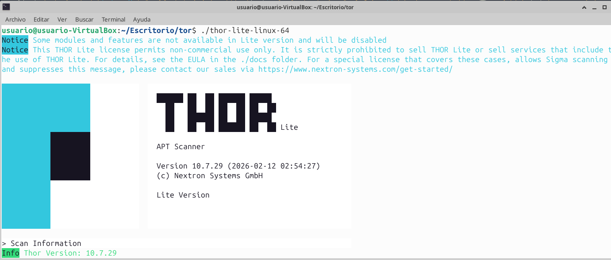

# **THOR Lite**

THOR Lite es la edición comunitaria y gratuita del escáner THOR de Nextron Systems. Está orientado a triage, compromiso inicial, threat hunting e incident response ligera, y funciona como un escáner IOC y YARA para Windows, Linux y macOS. A diferencia del THOR completo, THOR Lite tiene un conjunto de módulos y funcionalidades reducido, usa una base de firmas abierta y cifrada, y se distribuye como binario precompilado, no como proyecto open source del escáner en sí.


# **Principales funcionalidades**
- **Escaneo por IOCs y YARA:** THOR Lite aplica reglas YARA genéricas y específicas sobre archivos, memoria de procesos y, en determinados modos, bloques de datos leídos durante DeepDive. También soporta IOCs simples basados en hashes, nombres de archivo, keywords, C2, mutex/events y named pipes.

- **Análisis de sistema de ficheros y procesos:** La propia página de producto indica que THOR Lite incluye el módulo de `file system scan`, el módulo de `process scan` y un módulo que extrae información de `autoruns` en distintas plataformas. Esto lo hace útil para detectar tanto muestras maliciosas en disco como artefactos sospechosos en ejecución o persistencia básica.

- **Firmas personalizadas:** puede cargar IOCs y reglas YARA personalizadas desde la carpeta `custom-signatures`. El manual documenta expresamente soporte para ficheros IOC y reglas YARA, además de la posibilidad de cifrar firmas personalizadas para no dejarlas en claro en sistemas potencialmente comprometidos.

- **Control de recursos y ajuste del escaneo:** THOR admite límites de CPU, tamaño máximo de fichero, filtros de inicialización y distintos parámetros de ajuste. La documentación también explica que el producto intenta priorizar la estabilidad del sistema mediante control interno de recursos.

- **Múltiples formatos de salida:** frente a LOKI, THOR Lite añade más opciones de salida, incluyendo `SYSLOG` y `JSON` por fichero o por red, además de generar log de texto, informe HTML y CSV al final del análisis. Esto facilita su integración con flujos de auditoría o SIEM.


# **Ventajas**
- **Gratuito y muy útil para triage:** Nextron lo presenta como una edición gratuita orientada a triage, válida para revisiones rápidas y análisis iniciales en sistemas Linux, Windows y macOS.

- **Rápido y portable:** Está escrito en Go, viene precompilado para plataformas principales y la propia página de producto destaca su mejor rendimiento frente a LOKI.

- **Buenas capacidades de detección basadas en firmas e IOCs:** combina reglas YARA, hashes, nombres de archivo, palabras clave, indicadores de C2, mutex y pipes, lo que permite cubrir un rango de artefactos muy útil en investigación de incidentes.

- **Integrable en automatización y análisis centralizado:** la salida en `JSON/SYSLOG` y el soporte de configuración por plantillas YAML lo hacen cómodo para flujos repetibles y despliegues administrados.
  

# **Inconvenientes**
- **No es open source como escáner:** Aunque usa una base pública de firmas, el binario de THOR Lite no es open source, Nextron lo distribuye precompilado.

- **Cobertura limitada frente a THOR Enterprise:** THOR Lite tiene 5 módulos frente a los 31 del THOR completo, y no incluye, entre otras cosas, Sigma, eventlog, archive scanning ni registry scanning. Tampoco incorpora el conjunto privado de reglas y patrones de Nextron.

- **Sin soporte técnico ni gestión central en ASGARD:** La versión Lite no incluye soporte técnico ni administración centralizada mediante ASGARD.

- **Requiere licencia válida aunque sea gratuita:** La documentación oficial indica que THOR necesita un archivo de licencia válido para ejecutarse. En la práctica, THOR Lite es gratuito, pero no es “descargar y ejecutar sin más” en todos los casos.

- **No sustituye una plataforma EDR completa:** Por su enfoque y por las limitaciones de módulos, THOR Lite encaja mejor como escáner de triage y hunting que como solución integral de protección continua. Esta conclusión se deduce del propio posicionamiento oficial de la herramienta y de la comparación con THOR completo.


# **Distribuciones para las que está disponible**
Nextron ofrece THOR Lite en paquetes precompilados para Linux de 32 y 64 bits. La página específica de THOR Lite no publica una matriz detallada por distribución, pero la documentación general de THOR indica como mínimos en Linux RHEL/CentOS 6, SuSE SLES 11 SP1, Ubuntu 16 LTS y Debian 9, además de un kernel Linux 2.6.32 o superior. 


# **¿Son libres el código fuente y las bases de datos?**
No completamente.
- **Código fuente del escáner:** No. THOR Lite no es open source. Se distribuye como binario precompilado.

- **Base de firmas:** THOR Lite utiliza la `signature-base` pública asociada a LOKI y THOR Lite. Ese repositorio es accesible públicamente y contiene reglas YARA e IOCs, pero su licencia actual indicada en GitHub es Detection Rule License (DRL) 1.1, no una licencia tipo GPL, MIT o Apache para el binario del escáner. Por tanto, lo más preciso es decir que la base es pública y reutilizable bajo su licencia específica, mientras que el motor THOR Lite no es software libre.
  

# **Herramientas recomendadas con THOR Lite**
- **thor-util:** Es la utilidad recomendada para actualizar firmas (thor-util update) y actualizar binarios y firmas (thor-util upgrade).

- **signature-base:** Es la base pública de reglas YARA e IOCs para LOKI y THOR Lite. Resulta fundamental para entender qué detecta la herramienta y cómo ampliar cobertura.

- **yarGen:** El propio manual recomienda esta utilidad de los desarrolladores para generar reglas YARA a partir de directorios objetivo y acelerar la creación de firmas personalizadas.

- **Un receptor SYSLOG o un SIEM:** THOR Lite soporta salida SYSLOG y JSON, por lo que encaja bien con una recogida centralizada de resultados.


# Instalación

THOR Lite en Linux no se suele instalar con apt, yum o dnf. Lo normal es descargar el paquete oficial precompilado, descomprimirlo y ejecutarlo desde su carpeta. Nextron lo ofrece para Linux y lo clasifica como gratuito, pero con registro/licencia.

[Enlace para su descarga.](https://www.nextron-systems.com/thor-lite/). Una vez registrados recibimos un enlace con la licencia y un enlace para poder hacer la descarga.

Descomprimimos el fichero descargado:
```
tar -xf thor-lite-linux*.tar.gz -C ~/thor-lite
cd ~/thor-lite
```

Colocamos la licencia en la carpeta del programa. THOR necesita un archivo *.lic para ejecutarse:


Ejecutamos el binario:
```
./thor-linux-64
```

Comienza a instalarse y a analizar el equipo:




# **Ejemplo de su funcionamiento**
En Linux, el flujo básico descrito por Nextron es obtener una licencia válida, colocarla en la carpeta del programa, abrir una consola con privilegios de root, entrar en el directorio donde se extrajo THOR y ejecutar el binario thor-linux-64 en sistemas x86-64. El manual indica además que, por defecto, un escaneo puede tardar aproximadamente entre 20 y 180 minutos, y que al finalizar se deben revisar el log de texto y el informe HTML generados.

```
sudo ./thor-linux-64
sudo ./thor-linux-64 -p /opt
sudo ./thor-linux-64 -e /var/log/thor-lite
thor-util update
``` 
Donde:
- `./thor-linux-64`: Lanza un escaneo por defecto en Linux x86-64.
- `p /opt`: Permite escanear una ruta específica. Eel manual define `-p`, `--path` como parámetro para indicar uno o varios paths de análisis.
- `e /var/log/thor-lite`: Cambia el directorio de salida de los resultados.
- `thor-util update`: Actualiza firmas. `thor-util upgrade` actualiza binarios y firmas.


# **Amenazas que detecta**
THOR Lite no se limita a virus en sentido clásico. Su modelo de detección está basado en IOCs, reglas YARA, anomalías y análisis de archivos, memoria de procesos y persistencia/autorrun. Por tanto, detecta sobre todo artefactos de compromiso y malware/hack tools que dejen huellas observables mediante esos mecanismos.

De forma más concreta, puede detectar:
- **Malware en archivos:** Mediante YARA sobre ficheros, hashes conocidos, nombres de archivo sospechosos y palabras clave.
- **Artefactos maliciosos en memoria de procesos:** Las reglas YARA genéricas y específicas pueden aplicarse a memoria de procesos.
- **Indicadores de C2:** El manual contempla IOCs de tipo C2 para IPs y hostnames.
- **Persistencia básica y autoruns sospechosos:** La página de producto indica que THOR Lite incluye extracción y análisis de autoruns.
- **Mutex, events y named pipes maliciosos:** El manual soporta IOCs específicos para estos artefactos.
- **Web shells y anomalías:** La `signature-base` pública incluye ficheros como `gen_webshells_ext_vars.yar`, `generic_anomalies.yar` y otras reglas relacionadas con cloaking o explotación, lo que indica cobertura para web shells y patrones anómalos definidos en ese feed.

En consecuencia, THOR Lite resulta especialmente útil para detectar web shells, muestras de malware, herramientas de intrusión, persistencia sencilla, indicadores de C2 y rastros de compromiso en disco o memoria, siempre dentro del alcance de su base pública de firmas y de las reglas personalizadas que el analista añada.


# **Referencias y enlaces de interés**
- **[Página oficial de THOR Lite.](https://www.nextron-systems.com/thor-lite/)** visión general del producto, diferencias frente a LOKI y THOR, plataformas soportadas y limitaciones de la edición gratuita.
- **[THOR Scanner User Manual.](https://thor-manual.nextron-systems.com/en/latest/)** Manual principal de uso, requisitos, licenciamiento, parámetros y flujos operativos.
- **[Requirements.](https://thor-manual.nextron-systems.com/en/latest/usage/requirements.html)** Referencia útil para requisitos mínimos de sistema y compatibilidad en Linux.
- **[Scan.](https://thor-manual.nextron-systems.com/en/latest/usage/scan.html)** Guía de primer uso, parámetros frecuentes y ejemplos de ejecución.
- **[Output Options.](https://thor-manual.nextron-systems.com/en/latest/usage/output-options.html)** Documentación sobre logs, HTML, CSV, JSON y SYSLOG.
- **[Custom Signatures.](https://thor-manual.nextron-systems.com/en/latest/usage/custom-signatures.html)** Referencia clave para entender IOCs, YARA, C2, mutex, pipes y firmas personalizadas.
- **[Comparación oficial LOKI / THOR Lite / THOR.](https://www.nextron-systems.com/compare-our-scanners/)** Util para justificar diferencias de cobertura y licenciamiento.
- **[Repositorio signature-base.](https://github.com/neo23x0/signature-base)** Base pública de IOCs y reglas YARA usada por LOKI y THOR Lite.
- **[Repositorio oficial de THOR Lite en GitHub.](https://github.com/NextronSystems/thor-lite?utm_source=chatgpt.com)** Soporte auxiliar, helper scripts e incidencias.


# **Conclusión**

THOR Lite es una herramienta muy válida para triage de seguridad en Linux cuando se necesita un escáner rápido, portable y orientado a IOCs/YARA. Su principal fortaleza está en combinar escaneo de ficheros, memoria de procesos, autoruns y firmas personalizadas, todo ello con salidas útiles para análisis posterior. Su principal limitación es que la edición Lite ofrece cobertura reducida frente al THOR completo y no debe entenderse como sustituto directo de una plataforma EDR o de un framework de respuesta a incidentes más amplio.