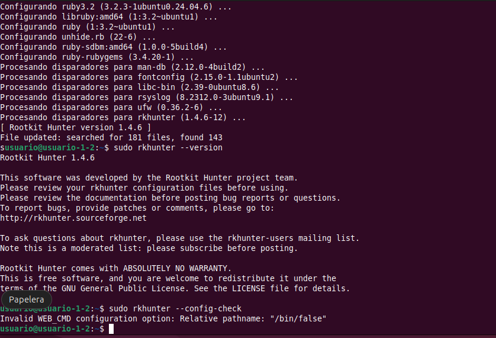
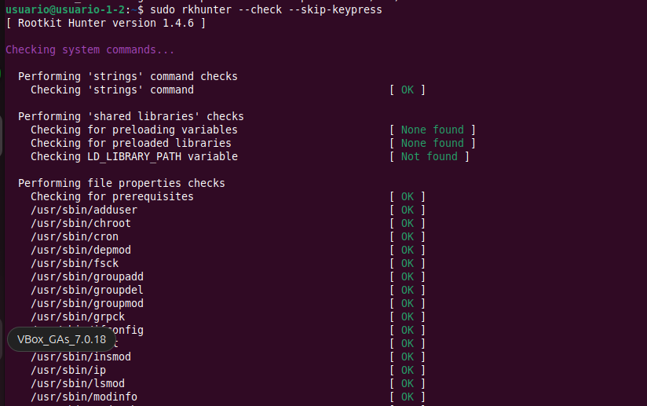
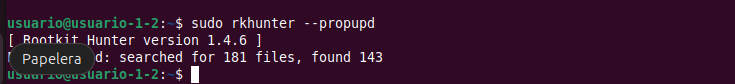

# Rkhunter (Rootkit Hunter)

Rkhunter es una herramienta de código abierto diseñada para la monitorización, análisis y seguridad de sistemas compatibles con POSIX (como clones de UNIX y Linux). Su propósito central es ayudar a detectar rootkits (tanto conocidos como desconocidos), puertas traseras (backdoors), sniffers, exploits y señalar malas prácticas generales de seguridad.

## Principales funcionalidades
Sus principales funcionalidades se desarrollan ampliamente en las siguientes áreas:
- **Detección de Rootkits y Malware:** Rkhunter escanea el sistema de forma exhaustiva en busca de malware, troyanos y archivos particulares que comúnmente son creados o utilizados por rootkits.

- **Verificación de Integridad de Archivos (Comprobación de Hashes):** Funciona con un mecanismo similar al de los comprobadores de integridad de archivos. Compara las propiedades actuales de los comandos y archivos del sistema con los valores que ha almacenado previamente en su base de datos de propiedades (`rkhunter.dat`). Analiza si ha habido cambios en los hashes de los archivos para identificar manipulaciones, utilizando SHA256 por defecto, aunque soporta MD5, SHA1 y otros algoritmos.

- **Integración con Gestores de Paquetes:** Para fortalecer la comprobación de integridad, Rkhunter puede conectarse con el gestor de paquetes del sistema operativo, como `RPM`, `DPKG`, `BSD` o `Solaris`, para obtener y validar los hashes y propiedades originales directamente de los archivos instalados oficialmente

- **Análisis de Procesos y Archivos Ocultos:** Revisa los directorios del sistema para detectar archivos ocultos sospechosos. Para mejorar su capacidad de detección en este ámbito, la herramienta puede apoyarse en aplicaciones externas de propósito específico si se encuentran instaladas, tales como `unhide`, `unhide-tcp` y `skdet`.

- **Supervisión de Comandos y Archivos de Inicio:** Verifica explícitamente si los comandos fundamentales del sistema o los archivos de inicio (`startup files`) han sufrido alguna modificación no autorizada que pudiera comprometer el arranque.

- **Monitoreo de Redes y Puertos:** Realiza comprobaciones clave sobre las interfaces de red. Esto incluye la detección de aplicaciones que están a la escucha, incluso en puertos ocultos, y la búsqueda de aplicaciones de captura de paquetes (`sniffers` o interfaces en modo promiscuo).

- **Análisis de Módulos del Kernel:** Inspecciona los módulos cargados en el núcleo del sistema (`kernel`) en busca de cadenas de texto (`strings`) que resulten sospechosas o maliciosas. 

- **Inspección Profunda de Contenido (Prueba `Suspscan`):** Cuenta con una prueba específica llamada `suspscan` que inspecciona el interior de los archivos en busca de contenidos dudosos, revisando principalmente directorios temporales (como `/tmp` o `/dev/shm`). Aunque es muy útil, suele consumir muchos recursos de CPU y disco (`E/S`), por lo que debe configurarse adecuadamente.

- **Revisión de Permisos Anómalos:** Examina los archivos ejecutables del sistema para detectar aquellos que posean permisos de archivo inusuales o potencialmente peligrosos.

- **Generación de Registros y Alertas:** Rkhunter no es una herramienta reactiva; es decir, no elimina las amenazas automáticamente, sino que las enumera. Durante sus escaneos, alerta sobre elementos sospechosos y genera un archivo de registro detallado, normalmente en `/var/log/rkhunter.log`, para que el administrador lo investigue. También permite configurar el envío de estas advertencias a través de correo electrónico.

- **Actualizaciones Autónomas:** Posee comandos integrados para actualizar constantemente sus archivos de datos de texto sobre firmas de amenazas (`--update`) y para comprobar directamente si existe una nueva versión del software disponible en sus repositorios (`--versioncheck`).


## Ventajas
- **Gratuito y de Código Abierto:** Rkhunter es un software totalmente gratuito y está liberado bajo la licencia GNU GPL v2.0, lo que permite a la comunidad auditar su código fuente y desarrollar mejoras de seguridad libremente.

- **Alta Compatibilidad y Ligereza:** Está diseñado mediante scripts de shell (`bash` o `ksh`) para ser una herramienta sumamente genérica, lo que asegura su funcionamiento en la inmensa mayoría de sistemas operativos clones de UNIX y distribuciones de Linux, compatibles con POSIX. Es una herramienta de línea de comandos (`CLI`) que consume pocos recursos en sus escaneos estándar y es muy fácil de configurar.

- **Independencia y Flexibilidad de Herramientas:** Aunque depende de ciertos comandos básicos (`cat`, `sed`, `head`, etc.), si el sistema carece de herramientas específicas para realizar tareas como calcular hashes (md5sum, sha1sum) o leer enlaces simbólicos (`readlink`), Rkhunter incluye scripts de respaldo en Perl que realizarán el trabajo automáticamente, evitando que las pruebas fallen por falta de dependencias.

- **Automatización Sencilla:** Está perfectamente preparado para ser integrado y ejecutado desatendidamente mediante tareas de cron, lo que facilita el escaneo periódico, así como la revisión constante de nuevas versiones y firmas de virus.

- **Verificación con Gestores de Paquetes:** Su integración nativa permite confrontar archivos sospechosos no solo con su propia base de datos, sino directamente con repositorios fiables mediante el uso de gestores como `RPM`, `DPKG`, `BSD` o `SOLARIS`.


## Inconvenientes
- **Es una Herramienta Pasiva, No Reactiva:** Rkhunter funciona únicamente como un detector y un enumerador de amenazas. No bloquea, detiene ni elimina el malware de manera automática. Deja recaer por completo la responsabilidad en el administrador, quien debe leer los registros (logs) y mitigar de forma manual cualquier actividad sospechosa.


- **ulnerabilidad de su Línea Base - Falso Sentimiento de Seguridad:** El comprobador de integridad de archivos asume que el estado inicial del sistema es legítimo. Para que sea verdaderamente efectivo, Rkhunter debe instalarse e inicializarse en un Sistema Operativo recién instalado (completamente limpio). Si Rkhunter se inicializa en un sistema que ya había sido comprometido o el administrador ejecuta una actualización de propiedades (`--propupd`) sobre un archivo alterado, la herramienta asumirá que el archivo infectado es genuino.

- **No es una Solución Definitiva:** El uso de Rkhunter por sí solo no garantiza absolutamente que un sistema no esté comprometido. Los propios desarrolladores recomiendan explícitamente ejecutar pruebas adicionales y utilizar otras herramientas en conjunto, como `chkrootkit`.

- **Rendimiento en Escaneos Profundos y Falsos Positivos:** La prueba específica `suspscan` que inspecciona el contenido interno de archivos, consume una gran cantidad de memoria, I/O de disco y procesador (CPU). Además, es propensa a generar repetidos falsos positivos, razón por la cual no está habilitada de manera predeterminada.

- **Conflictos de `Prelinking`:** En los sistemas que utilizan sistemas de enlazado previo (prelinking), las actualizaciones de software provocan errores de dependencias que Rkhunter detectará como alertas falsas de manipulación de hash, exigiendo que el administrador ejecute comandos manuales recurrentes de limpieza e ignore determinados archivos en la configuración.

- **Desigualdad en los Gestores de Paquetes:** Aunque es ventajoso que lea información de paquetes, gestores como `DPKG` (Debian) y `BSD` sólo devuelven una suma hash básica (MD5), que se considera débil. Por el contrario, un gestor como `RPM` devuelve entre 7 y 8 valores de integridad que son más exhaustivos. Ni siquiera con `RPM` el programa confía ciegamente, ya que un gestor no siempre es capaz de determinar si un binario ha sido sustituido por un script, forzando a Rkhunter a tener que recalcular propiedades locales de todos modos.


## Distribuciones para las que está disponible
Rkhunter está diseñado en scripts de shell `bash` o `ksh` para ser una herramienta sumamente genérica, por lo que es compatible y puede ejecutarse en la mayoría de los sistemas Linux y UNIX. De forma general, está disponible para cualquier sistema operativo compatible con POSIX, lo que abarca a la inmensa mayoría de distribuciones Linux, sistemas BSD y otros sistemas tipo UNIX.

Aunque puede descargarse e instalarse de forma manual en casi cualquier entorno compatible, las fuentes destacan su disponibilidad nativa, integración de gestores de paquetes y ejemplos de configuración para las siguientes distribuciones y sistemas:
- **Debian y derivados:** Está empaquetado de forma oficial en los repositorios de Debian. Además, se integra directamente con su gestor de paquetes `DPKG`.

- **Kali Linux:** Se encuentra disponible en los repositorios de esta distribución orientada a la seguridad y puede instalarse directamente utilizando el comando `sudo apt install rkhunter`.

- **Distribuciones basadas en `RPM` como RedHat, CentOS, Fedora, SUSE, etc.:** Rkhunter cuenta con una integración destacada con el gestor de paquetes `RPM`, lo que le permite verificar un mayor número de propiedades de los archivos instalados en comparación con otros sistemas

- **Sistemas de la familia BSD:** Es compatible con sistemas como NetBSD y cuenta con opciones de configuración diseñadas específicamente para esta familia de sistemas operativos, como la integración con los gestores de paquetes `BSD` y `BSDng`, o el soporte para la cuenta de superusuario `toor`.

- **Solaris:** Ofrece soporte y opciones de comprobación de hashes específicas para Solaris 9 y Solaris 10, así como integración con el gestor de paquetes de `SOLARIS`.

- **Otros sistemas Unix y Linux:** La documentación de la herramienta también brinda ejemplos de uso y soporte para el sistema operativo AIX (versiones superiores a 5.2) y para la clásica distribución de Linux Slackware.


## ¿Son libres el codigo fuente y las bases de datos?
Sí, tanto el código fuente como las bases de datos de Rkhunter son completamente libres y gratuitos.
- **El código fuente:** Rkhunter es un proyecto de código abierto (Open Source) dirigido por la comunidad y su código está alojado y disponible de forma pública. Está liberado bajo la licencia GNU GPL v2.0, lo que garantiza todas las libertades que definen al software libre, permitiendo a cualquier persona auditar, bifurcar o enviar correcciones al código. Además, tal como destacan sus desarrolladores, es un programa gratuito "como la cerveza gratis" (free as in 'free beer')

- **Las bases de datos:** En el ecosistema de Rkhunter existen dos tipos de bases de datos, y el acceso a ambas es totalmente libre, aunque tienen naturalezas distintas:
    - Bases de datos de firmas (Amenazas y Rootkits): Son archivos de datos de texto que contienen las definiciones estructuradas para detectar rootkits y malware. El proyecto ofrece estas bases de datos de manera gratuita y pueden mantenerse al día ejecutando simplemente el comando `--update`, el cual descargará las últimas versiones disponibles sin ningún coste.

    - Base de datos de propiedades de archivos (ej. rkhunter.dat): Esta base de datos no se descarga ni se compra, sino que es generada de forma local y autónoma por la propia herramienta en tu sistema. Se construye cuando el administrador ejecuta el comando `--propupd`, almacenando los valores hash (como SHA256 o MD5) y las propiedades de los archivos legítimos que ya están instalados en tu equipo.


En conclusión, no existen licencias privativas, suscripciones ni restricciones de pago para acceder al motor de la herramienta, auditar su código o recibir las actualizaciones contra nuevas amenazas.


## Herramientas recomendadas con Rkhunter
- **`chkrootkit`:** La herramienta chkrootkit se considera un complemento esencial y altamente recomendado para la seguridad del sistema. El motivo principal de esta recomendación es que el uso exclusivo de Rkhunter por sí solo no puede garantizar de manera absoluta que un equipo no haya sido comprometido. Al ser herramientas que buscan rastros de malware, rootkits y vulnerabilidades basándose en firmas y comportamientos específicos, es posible que una detecte lo que la otra omita. Esta ejecución combinada amplía el espectro de detección y ofrece al administrador una visión mucho más fiable y completa sobre el estado real y la integridad del sistema operativo.

- **`unhide` y `unhide-tcp`:** Son herramientas de un solo propósito diseñadas para descubrir procesos y puertos ocultos. Rkhunter no depende obligatoriamente de ellas, pero si detecta que están instaladas en el sistema, las utilizará de forma automática para potenciar significativamente sus capacidades de detección.

- **`skdet`:** Al igual que `unhide`, es otra utilidad externa y de propósito específico que asiste en la búsqueda e identificación de elementos ocultos.

- **`Tripwire`:** Es un robusto sistema de detección de intrusiones que monitoriza y alerta sobre cambios en los archivos del sistema. Aunque Rkhunter ofrece la opción de incluir el escaneo de Tripwire dentro de su propia ejecución, lo cual añade un tiempo considerable al análisis, la documentación sugiere como mejor práctica ejecutar Tripwire de manera independiente mediante su propia tarea programada diaria (cronjob).


## Ejemplo de su funcionamiento

**Comandos para su instalación y configuración:**
```
sudo apt upgrade
sudo apt install rkhunter wget
sudo rkhunter --version
sudo rkhunter --config-check
sudo rkhunter --update
sudo rkhunter --check --skip-keypress
sudo rkhunter --propupd
```
donde:
- `install rkhunter wget`: Se instala rkhunter y wget.
- `rkhunter --version`: Comprobamos la version de rkhunter.
- `rkhunter --config-check`: Para validar la configuración después de cambios.
- `rkhunter --update`: mantiene al día todos los ficheros de datos.
- `rkhunter --check --skip-keypress`: Realiza los chequeos del sistema y genera log automáticamente.
- `rkhunter --propupd`: Ejecutamos este comando sólo cuando estemos seguros de que los archivos actuales son legítimos, porque `--propupd` actualiza la base de propiedades usando el estado actual del sistema y, desde ese momento, lo tomará como bueno.









