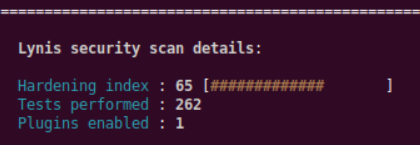

# Auditación con CalmAV

Vamos a instalar ClamAV que es un antivirus open-source:
```
sudo apt install clamav clamav-daemon
```


Iniciamos un  test. Encuentra que está instalado ClamAV, que está activo el demonio de ClamAV, que dispone de componente anti malware con un agente activo  →


Como detalle mostramos el hardening que obtiene la Maquina virtual:




