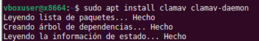
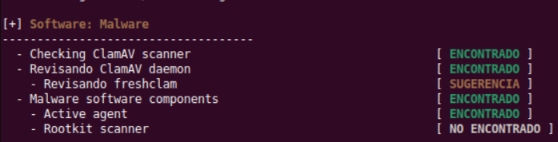

# **ClamAV**

ClamAV es un toolkit antimalware de código abierto bajo licencia GPLv2, diseñado especialmente para el escaneo de correo en pasarelas de mail, aunque también permite analizar ficheros y directorios en Linux. Sus componentes principales son clamscan, clamd, freshclam, clamdscan, clamonacc, clamdtop y clamconf. La documentación oficial subraya además que no debe confundirse con una suite completa de seguridad de endpoint.


# **Principales funcionalidades**

- **Detección de malware basada en firmas:** ClamAV detecta millones de virus, gusanos, troyanos y otras amenazas, y se apoya en un conjunto de firmas oficiales mantenido por Cisco Talos. También admite firmas en formatos propios de ClamAV y soporte YARA.

- **Escaneo bajo demanda:** `clamscan` permite analizar archivos o directorios concretos sin necesidad de que exista un daemon en ejecución. Cada vez que se invoca carga el motor y la base de firmas, genera el informe y termina.

- **Escaneo persistente y de mayor rendimiento:** `clamd` es un daemon multihilo que escucha por socket local Unix o por TCP y permite recibir peticiones de análisis de forma continua. `clamdscan` es el cliente sencillo para utilizar ese daemon. Esta arquitectura suele ser más adecuada para servidores, automatizaciones y pasarelas de correo que lanzar clamscan repetidamente.

- **Protección en tiempo real en Linux:** `clamonacc` proporciona escaneo on-access en Linux y puede funcionar en modo sólo aviso o en modo de prevención/bloqueo. Esta capacidad depende de clamd y requiere Linux con kernel 3.8 o superior.

- **Actualización automática de firmas:** `freshclam` descarga y mantiene al día las bases oficiales de ClamAV. Soporta actualizaciones diferenciales, consultas de versión por DNS, firmas digitales, uso mediante línea de comandos o como servicio en segundo plano.

- **Análisis de múltiples formatos:** el motor `libclamav` reconoce y analiza ejecutables, archivos comprimidos, correo, documentos Office, RTF, PDF, HTML, OneNote y otros formatos especiales. En el caso de Office, RTF y PDF, extrae sobre todo los objetos embebidos, mientras que la normalización de texto se realiza principalmente en HTML.

- **Detección de PUA/PUP:** ClamAV puede detectar aplicaciones potencialmente no deseadas mediante opciones específicas en clamscan o clamd, lo que resulta útil en algunos entornos administrados.


-----

<br>


# **Ventajas**

- **Gratuito y de código abierto:** el motor está licenciado bajo GPLv2, y el conjunto oficial de firmas se distribuye en contenedores CVD firmados digitalmente y mantenidos activamente por Cisco Talos.

- **Muy flexible en despliegue:** puede usarse como escáner manual (clamscan), como servicio permanente (clamd), como escáner on-access (clamonacc) o como biblioteca (libclamav) integrada dentro de otras aplicaciones. También dispone de clamav-milter para filtrado de correo con Sendmail.

- **Buena integración con automatización y operaciones:** clamd trabaja por sockets, freshclam puede ejecutarse como daemon o bajo demanda y clamconf facilita validar la configuración, lo que lo hace apropiado para entornos Linux administrados y para servidores.

- **Amplia disponibilidad en Linux:** muchas distribuciones lo empaquetan de forma nativa y el proyecto, además, ofrece paquetes DEB y RPM para Linux cuando el paquete de la distribución no es suficiente o no está actualizado.


# **Inconvenientes**

- **No es una suite completa de seguridad de endpoint:** La propia documentación insiste en que ClamAV es un toolkit antimalware, no una plataforma EDR/EPP completa con todas las funciones modernas de protección de endpoint.

- **clamscan es menos eficiente para uso repetitivo:** Como carga el motor y las firmas en cada ejecución, resulta menos adecuado que clamd cuando se hacen análisis frecuentes, continuos o integrados en servicios.

- **La protección on-access tiene costes y límites:** El modo de prevención de clamonacc puede afectar seriamente al rendimiento en directorios muy accedidos, sólo está disponible en Linux y requiere determinadas capacidades del kernel.

- **No desinfecta archivos:** ClamAV puede detectar y marcar ficheros sospechosos, e incluso mover o copiar hallazgos mediante opciones de escaneo, pero no está pensado para “limpiar” automáticamente archivos infectados.

- **Puede producir falsos positivos, sobre todo con PUA, y exige mantener el motor actualizado:** La documentación recomienda usar la última versión estable del motor, no sólo bases de datos recientes, para minimizar problemas de compatibilidad y falsos positivos.


# **Distribuciones para las que está disponible**

ClamAV está ampliamente disponible en Linux mediante paquetes de terceros mantenidos por las propias distribuciones. La documentación oficial indica que el equipo prueba regularmente ClamAV en GNU/Linux sobre Alpine, Ubuntu, Debian, AlmaLinux, Fedora y openSUSE, y además ofrece paquetes DEB y RPM oficiales para facilitar instalaciones en entornos basados en Debian/Ubuntu o RPM. Debe tenerse en cuenta que las rutas, usuarios de servicio y ficheros de configuración pueden variar entre los paquetes de la distribución y los paquetes ofrecidos por el proyecto.


# **¿Son libres el código fuente y las bases de datos?**

- **Código fuente:** Sí. El software ClamAV es de código abierto y está licenciado bajo GPLv2.

- **Bases de datos oficiales:** La documentación oficial consultada sí deja claro que las firmas oficiales se distribuyen gratuitamente para versiones soportadas, que se descargan con freshclam o CVDUpdate, que están contenidas en ficheros CVD firmados digitalmente y que son mantenidas por Cisco Talos. Sin embargo, en las fuentes revisadas no he verificado una licencia “libre” equivalente a GPL aplicada al contenido de esas firmas, por lo que la formulación más precisa es decir que son bases oficiales gratuitas y firmadas, no equipararlas sin más al código fuente libre.

- **Firmas personalizadas:** Además de las bases oficiales, ClamAV permite cargar firmas propias desde el directorio de bases de datos, lo que facilita adaptar la detección a necesidades locales o internas.


# **Herramientas recomendadas con ClamAV**

- **clamconf:** Útil para revisar la configuración efectiva, validar clamd.conf y freshclam.conf y recopilar información del entorno.

- **clamdtop:** Interfaz tipo `ncurses` para monitorizar instancias de clamd, ver trabajos en cola, uso de memoria e información de firmas cargadas.

- **clamav-milter:** Recomendable cuando ClamAV se usa como parte de un flujo de filtrado de correo con Sendmail, porque conecta el correo entrante con clamd para su análisis.

- **ClamTk:** Frontend gráfico comunitario orientado a facilitar el uso de ClamAV como escáner bajo demanda en escritorios Linux.


# **Ejemplo de su funcionamiento**

A modo de ejemplo, en sistemas Debian/Ubuntu los paquetes habituales separan el escáner de línea de comandos (clamav), el daemon (clamav-daemon) y el actualizador de firmas (clamav-freshclam). La documentación oficial también indica que en instalaciones con `apt` es habitual encontrar la configuración en `/etc/clamav`.

```
sudo apt update
sudo apt install clamav clamav-daemon clamav-freshclam

sudo freshclam
clamscan --version
clamconf

clamscan -r /ruta/a/analizar --log=/tmp/clamav-scan.log

clamd
clamdscan /ruta/a/analizar

sudo clamonacc
```
Donde:
- `apt install clamav clamav-daemon clamav-freshclam`: Instala el escáner en CLI, el daemon de análisis y la utilidad de actualización de firmas en sistemas tipo Debian/Ubuntu.
- `freshclam`: Descarga o actualiza las bases oficiales de firmas; antes de arrancar clamd o de usar escaneos útiles, ClamAV necesita contar con una base de datos CVD instalada.
- `clamconf`: Muestra y valida información de configuración relevante del sistema y de los ficheros de ClamAV.
- `clamscan -r /ruta/a/analizar --log=...`: Ejecuta un análisis recursivo bajo demanda y guarda un informe en un fichero de log.
- `clamd`: Inicia el daemon multihilo de ClamAV. En muchas instalaciones empaquetadas este proceso también puede estar gestionado como servicio del sistema.
- `clamdscan /ruta/a/analizar`: Lanza el análisis a través de clamd, lo que suele ser preferible a clamscan en usos repetitivos o integrados.
- `clamonacc`: Habilita el escaneo on-access en Linux, pero requiere que clamd esté ya configurado y en ejecución, y normalmente debe lanzarse con privilegios de administrador.


# Auditación con CalmAV

Instalación de ClamAV:
```
sudo apt install clamav clamav-daemon
```



Iniciamos un  test. Encuentra que está instalado ClamAV, que está activo el demonio de ClamAV, que dispone de componente anti malware con un agente activo  →



Donde:
- El sistema sí dispone de ClamAV y además tiene activo su demonio, lo que indica que el motor antimalware no solo está instalado, sino también preparado para funcionar como servicio.
- La mención a `freshclam` como “sugerencia” apunta a que la herramienta de actualización de firmas no está plenamente configurada, no está activa o Lynis recomienda revisarla. Esto es importante, porque sin firmas actualizadas la capacidad de detección baja bastante.
- El resultado `Active agent: ENCONTRADO` sugiere que hay un componente de protección o monitorización activo vinculado al software antimalware.
- `Rootkit scanner: NO ENCONTRADO` indica que no se detecta una herramienta específica para buscar rootkits, como rkhunter o chkrootkit.


# Conclusión
ClamAV es una herramienta muy sólida para detección antimalware en Linux cuando el objetivo principal es analizar archivos, buzones y flujos de correo, o incorporar un motor de escaneo a servidores y automatizaciones. Su valor está en la amplitud de formatos soportados, la disponibilidad de un daemon multihilo, las firmas oficiales firmadas y la protección on-access en Linux. Su límite principal es que no sustituye por sí solo a una suite completa de protección de endpoint ni a una estrategia global de hardening y monitorización.
