- [**1. Entendiendo qué pide la tarea**](#1-entendiendo-qué-pide-la-tarea)
- [**2. Entorno Android**](#2-entorno-android)
  - [**2.1 Instalación de Genymotion**](#21-instalación-de-genymotion)
  - [**2.2 Instalación de ADB**](#22-instalación-de-adb)
  - [**2.3 Probando una app**](#23-probando-una-app)
  - [**2.4 Instalación de MobSF**](#24-instalación-de-mobsf)
  - [**2.5 Instalación de Burp Suite**](#25-instalación-de-burp-suite)
  - [Diva Analisis Dinámico](#diva-analisis-dinámico)
  - [Instalación de Burpsuite](#instalación-de-burpsuite)
  - [Instalación de jadx](#instalación-de-jadx)
  - [Instalación de apktool en Kali](#instalación-de-apktool-en-kali)
  - [Instalación de Ghidra](#instalación-de-ghidra)
- [Entorno iOS](#entorno-ios)
  - [Herramientas instaladas](#herramientas-instaladas)


# **1. Entendiendo qué pide la tarea**
El objetivo de la práctica es **preparar un entorno controlado para el análisis de aplicaciones móviles Android e iOS, permitiendo realizar análisis estático y, en el caso de Android, también análisis dinámico mediante emulación.** Según el módulo:
- Android será la plataforma principal para análisis dinámico.
- Mientras que en iOS el trabajo se centrará en archivos `.ipa` ya descifrados y su análisis estático.


# **2. Entorno Android**
Usaremos la siguiente arquitectura de laboratorio: `Kali host: VirtualBox + Genymotion + ADB + MobSF + JADX + apktool + Ghidra`.

**En el sistema anfitrión Kali Linux real instalaremos:**
- `VirtualBox` para usar máquinas virtuales.
- `Genymotion` como emulador Android para ejecutar aplicaciones en entorno controlado.
- `ADB` para listar dispositivos, instalar APKs y comunicarse con el emulador desde consola.
- `MobSF` como framework central para análisis estático y apoyo al análisis de seguridad de APK e IPA.
- `jadx`, como xxxxxx.
- `apktool` como xxxxx.
- `Ghidra` para realizar análisis estático avanzado, especialmente en binarios iOS.
- `Wireshark` para captura y análisis de tráfico de red.
- `Burp Suite` como opción para interceptación.


En Android, el laboratorio que se propone permite ejecutar aplicaciones en `Genymotion`, conectarse a ellas mediante `ADB` e inspeccionar tanto su comportamiento como su contenido con herramientas como `MobSF`. El módulo pone como ejemplo instalar una APK `Diva Beta` en el emulador mediante `adb install` y después analizar permisos, actividades, strings, componentes exportados y código decompilado.


## **2.1 Instalación de Genymotion**
Instalamos `Genymotion Desktop` en un host Kali. Para ello **descargamos la aplicación:** https://www.genymotion.com/product-desktop/ y comprobamos que el fichero descargado sea legítimo:

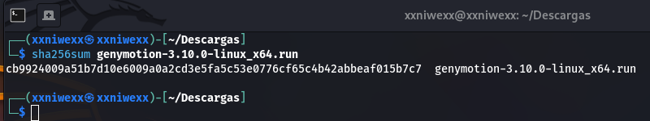


**Marcamos el fichero descargado como ejecutable:**
```
chmod +x genymotion-3.10.0-linux_x64.run
```


**Genymotion recomienda instalación local, no global:** La instalación global con `sudo` en `/opt/genymotion` no la recomiendan porque puede dar problemas de permisos. Para ello ejecutamos:
```
./genymotion-*-linux_x64.run -d "$HOME/genymotion"
```

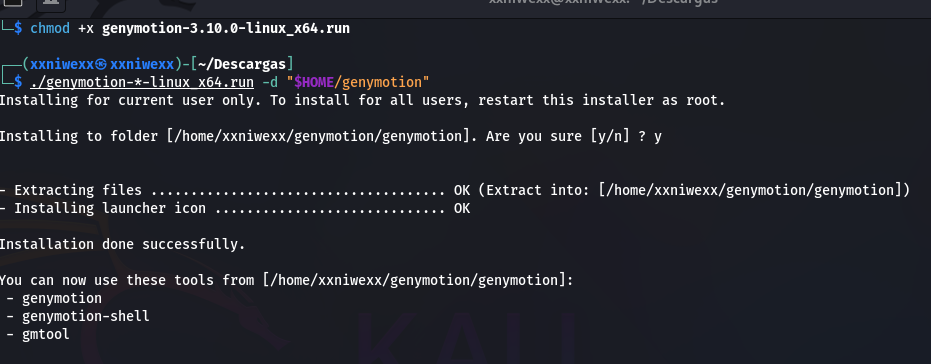


**Arrancamos Genymotion:**
```
~/genymotion/genymotion/genymotion
```


**Abrimos Genymotion e iniciamos  sesión:** Si no tenemos cuenta, la creamos desde la propia app, confirmando el correo y entrando con las credenciales. La edición `Personal Use - Free` se activa tras descargar, instalar, iniciar `Genymotion`, crear la cuenta, validar el email y elegir `personal use`:

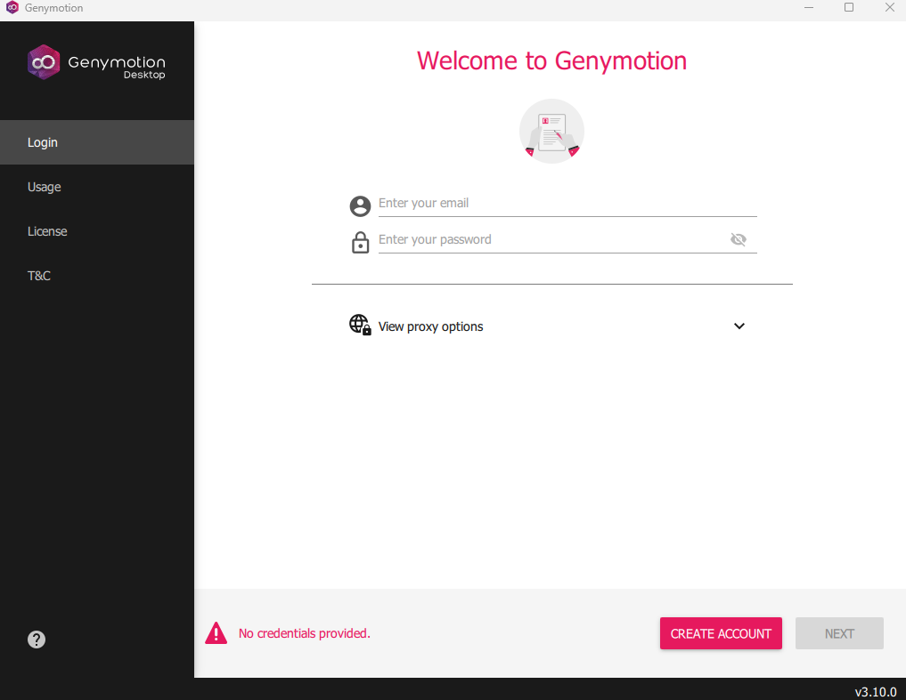

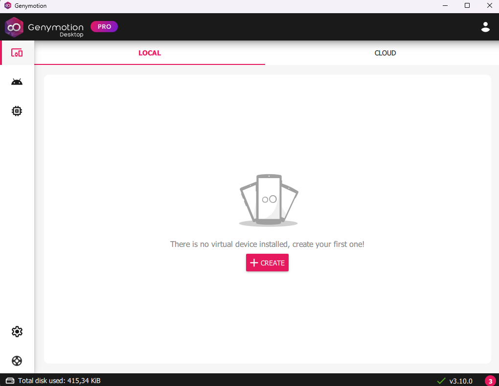


**Creamos un dispositivo virtual:** Ya dentro de Genymotion, pulsamos `Create`, elegimos una plantilla de Android y la arrancamos:

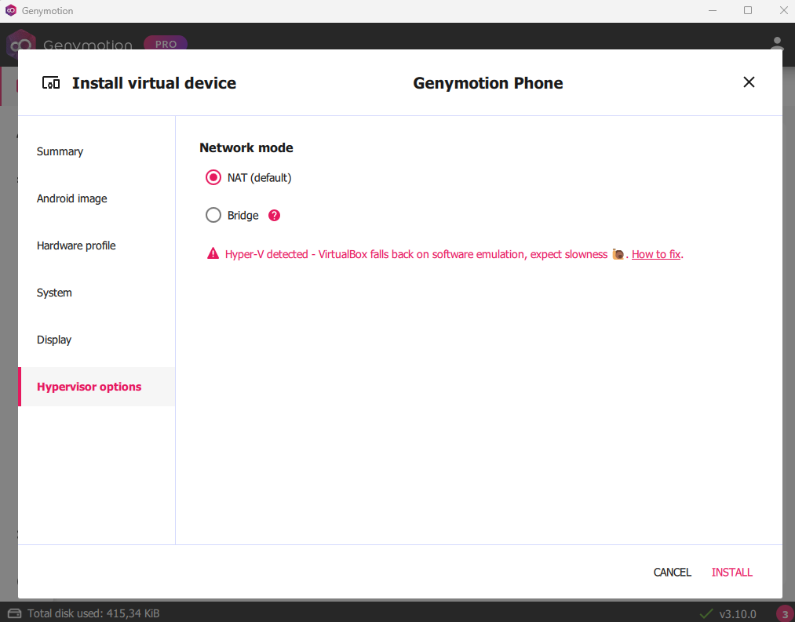
donde:
- Mantenemos `NAT (default)` seleccionado: Para esta práctica es la opción más sencilla.
- Pulsamos `INSTALL`: El aviso de Hyper-V detected no impide crear el dispositivo. Implica que irá más lento porque VirtualBox no está usando aceleración por hardware completa.

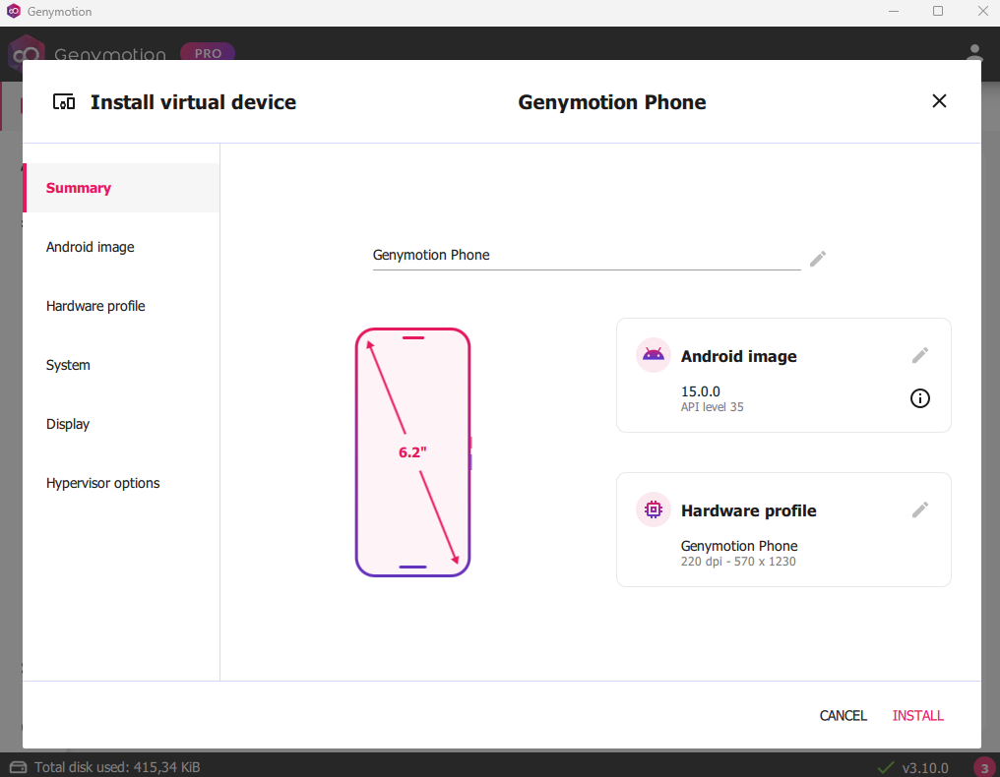

Finalización del proceso de creación de un dispositivo Android 15.0:   
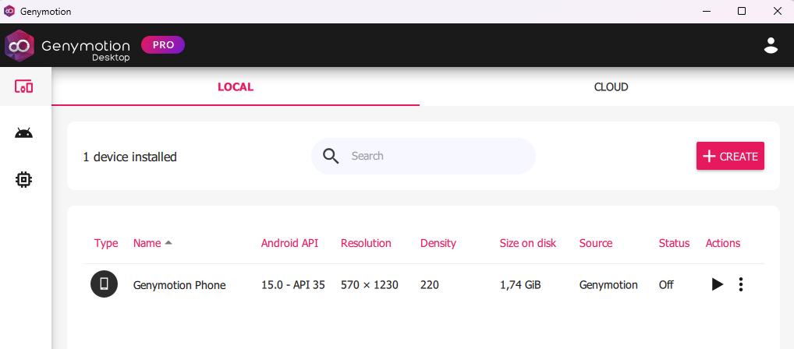

**Arrancamos el dispositivo creado, pulsando el botón de `play`:**  
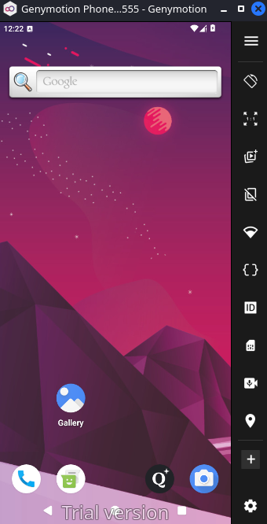


El siguiente paso es conectar este dispositivo con Kali usando ADB. Para ello, cuando el dispositivo android arranque, comprobaremos si ADB lo ve.


## **2.2 Instalación de ADB**
```
sudo apt install adb
Instalando:                              
  adb

Instalando dependencias:
  android-libbase  android-libboringssl  android-libcutils  android-liblog  android-libziparchive  android-udev-rules

Resumen:
  Actualizando: 0, Instalando 7, Eliminando: 0, no actualizando: 0
  Tamaño de la descarga: 1.198 kB
  Espacio necesario: 3.764 kB / 53,0 GB disponible

¿Continuar? [S/n] S
```

Comprobamos que adb ha sido instalado en el host: Mostramos la versión y los dispositivos que encuentra:

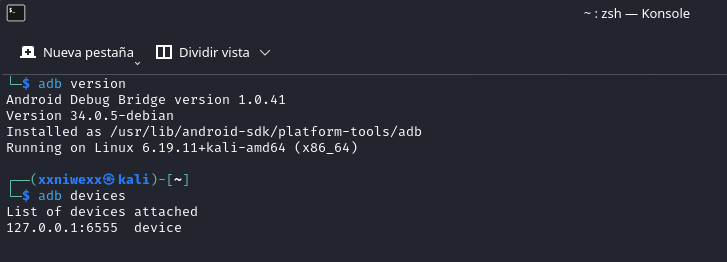  
donde:
- `127.0.0.1:6555 device`: Encuentra el dispositivo android que antes creamos.


## **2.3 Probando una app**
**Descargamos la aplicación que aporta el temario del módulo para hacer prácticas con ella.**
```
└─$ adb install diva-beta.apk                  
Performing Streamed Install
adb: failed to install diva-beta.apk: Failure [INSTALL_FAILED_DEPRECATED_SDK_VERSION: App package must target at least SDK version 24, but found 23]
```
donde:
- Comprobamos que necesitamos instalar un dispositivo android más antiguo para que esta aplicación pueda arrancar.


**Instalamos y arrancamos otro dispositivo Android 7.0:**  
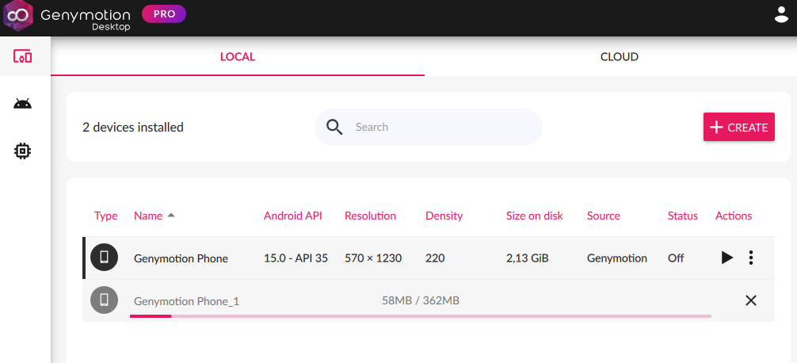  


**Instalamos con adb la aplicación `diva-beta.apk`.**  
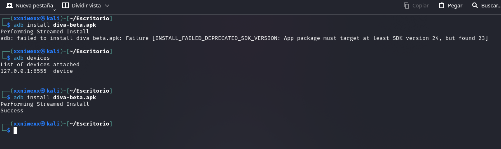  
donde:
- Comprobamos los dispositivos que adb encuentra conectados: `127.0.0.1:655 device`.


**Arrancamos el dispositivo android 7 y buscamos la aplicación `diva-beta.apk`:**  
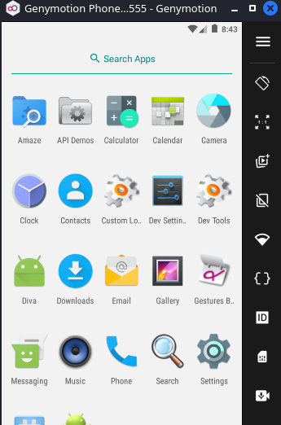

**Ejecutamos `diva-beta.apk`:**  
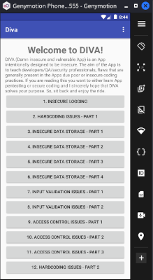


**Miramos los logs con `adb logcat`:** En una terminal de comandos ejecutamos `adb logcat`:  
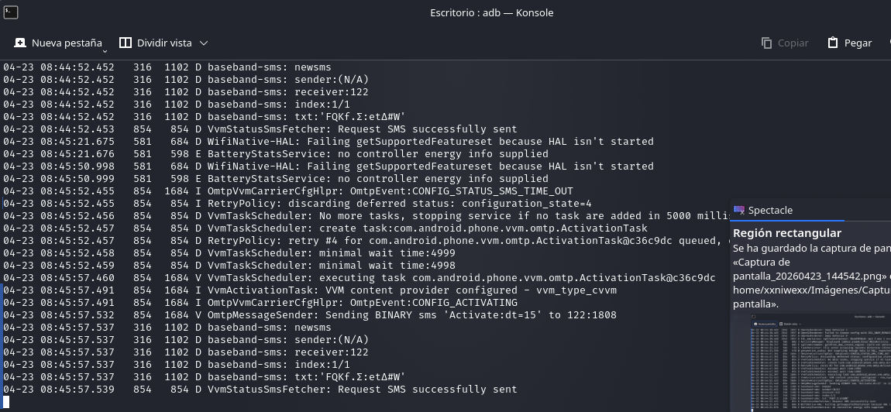
donde:
- `logcat` sirve para ver mensajes, errores y actividad de la app durante la ejecución.


## **2.4 Instalación de MobSF**

**Actualizamos el sistema e instalamos una serie de paquetes que son necesarios:**
```
sudo apt update
sudo apt install -y git python3 python3-venv python3-pip python3-dev build-essential \
  libffi-dev libssl-dev libxml2-dev libxslt1-dev libjpeg62-turbo-dev zlib1g-dev \
  openjdk-21-jdk
```

**Ahora descargamos MobSF:**
```
git clone https://github.com/MobSF/Mobile-Security-Framework-MobSF.git
cd Mobile-Security-Framework-MobSF
```

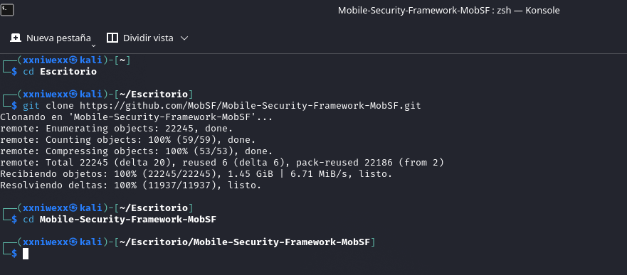

**Hacemos la instalación de MobileSF en un entorno virtual python:**
```
cd ~/Mobile-Security-Framework-MobSF

sudo apt install -y python3-full

python3 -m venv .venv
source .venv/bin/activate

python -m pip install --upgrade pip wheel

./setup.sh

...
...
...
  __  __       _    ____  _____       _  _    ____  
 |  \/  | ___ | |__/ ___||  ___|_   _| || |  | ___| 
 | |\/| |/ _ \| '_ \___ \| |_  \ \ / / || |_ |___ \ 
 | |  | | (_) | |_) |__) |  _|  \ V /|__   _| ___) |
 |_|  |_|\___/|_.__/____/|_|     \_/    |_|(_)____/ 

[INFO] 23/Apr/2026 17:46:46 - Author: Ajin Abraham | opensecurity.in
[INFO] 23/Apr/2026 17:46:46 - Mobile Security Framework v4.5.0
REST API Key: 30de80bb81566d17f50b8b7a3c421fd7066f864347bae0b6ebf60c2a9e81123d
Default Credentials: mobsf/mobsf
[INFO] 23/Apr/2026 17:46:46 - OS Environment: Linux (kali 2026.1 kali-rolling) Linux-6.18.12+kali-amd64-x86_64-with-glibc2.42
[INFO] 23/Apr/2026 17:46:46 - Python Version: 3.13.12
[INFO] 23/Apr/2026 17:46:46 - CPU Cores: 24, Threads: 32, RAM: 62.63 GB
[INFO] 23/Apr/2026 17:46:46 - MobSF Basic Environment Check
[WARNING] 23/Apr/2026 17:46:46 - Multiple ADB locations found. Set adb path, ADB_BINARY in /home/xxniwexx/.MobSF/config.py with same adb binary used by Genymotion VM/Emulator AVD.
[WARNING] 23/Apr/2026 17:46:46 - {'/usr/lib/android-sdk/platform-tools/adb', '/home/xxniwexx/genymotion/genymotion/tools/adb'}
Roles Created Successfully!
[INFO] 23/Apr/2026 17:46:46 - Checking for Update.
[INFO] 23/Apr/2026 17:46:46 - No updates available.
Download and Install wkhtmltopdf for PDF Report Generation - https://wkhtmltopdf.org/downloads.html
[INSTALL] Installation Complete

``` 

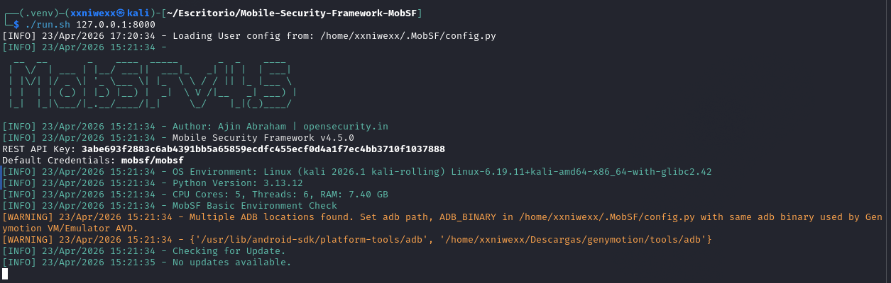
donde:
- Obtenemos una advertencia:
```
hay dos ADB distintos
/usr/lib/android-sdk/platform-tools/adb
/home/xxniwexx/Descargas/genymotion/tools/adb
```

**Para que MobSF y Genymotion usen el mismo ADB, conviene fijarlo en la configuración de MobSF:**  Buscamos dónde se encuentra el adb de Genymotion en este equipo:
```
└─$ find ~ /opt /usr -type f -name adb 2>/dev/null
/home/xxniwexx/genymotion/genymotion/tools/adb
/usr/share/lintian/overrides/adb
/usr/share/bash-completion/completions/adb
/usr/lib/android-sdk/platform-tools/adb
```
donde:
- El adb de Genymotion en este equipo es: `/home/xxniwexx/genymotion/genymotion/tools/adb`


**Editamos el archivo de configuración:**
```
nano /home/xxniwexx/.MobSF/config.py
```

**Y añadimos:**
```
ADB_BINARY = "/home/xxniwexx/Descargas/genymotion/tools/adb"
```

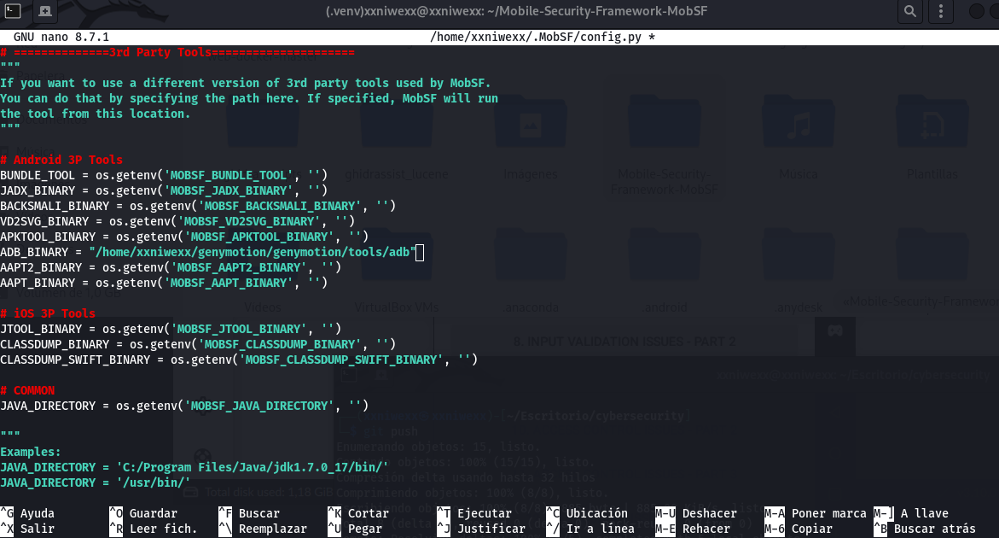


**Guardamos, cerramos y reiniciamos MobSF:**
```
└─$ ./run.sh 127.0.0.1:8000
```


**Abrimos un navegador y vamos a la url: `https://127.0.0.1:8000`**

**Las credenciales por defecto de MobSF son:**
```
usuario: mobsf
contraseña: mobsf
```


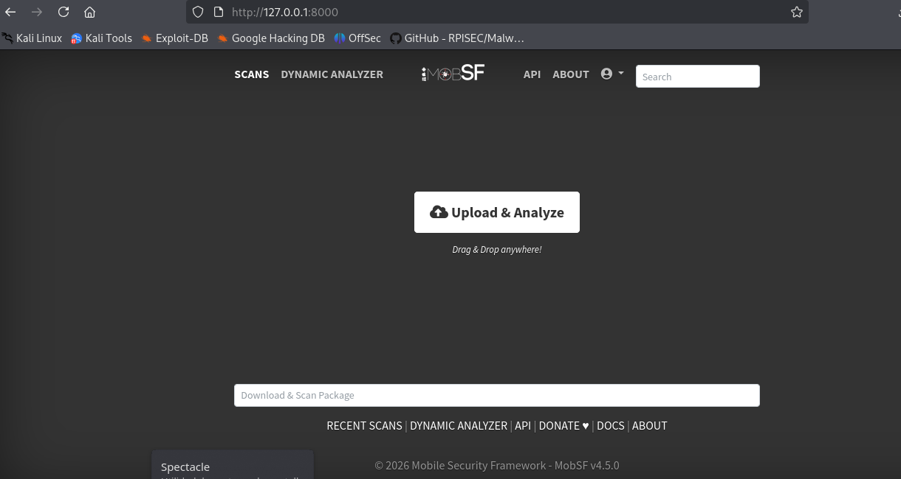


**Probamos a abrir el fichero de prueba que aporta el temario:**

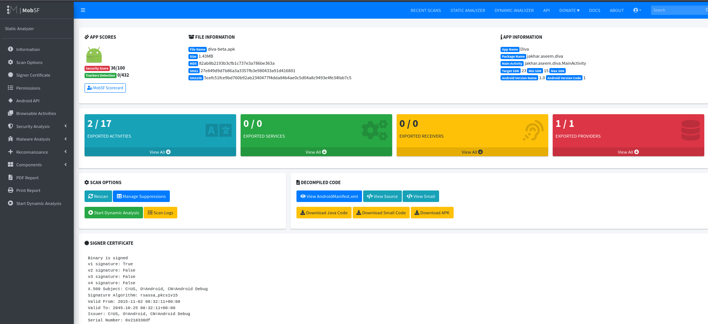
donde:
- Comprobamos el funcionamiento de MobSf en la aplicación `diva-beta.apk`.


## **2.5 Instalación de Burp Suite**


## Diva Analisis Dinámico
Pulsamos `Start Dynamic Analysis`:
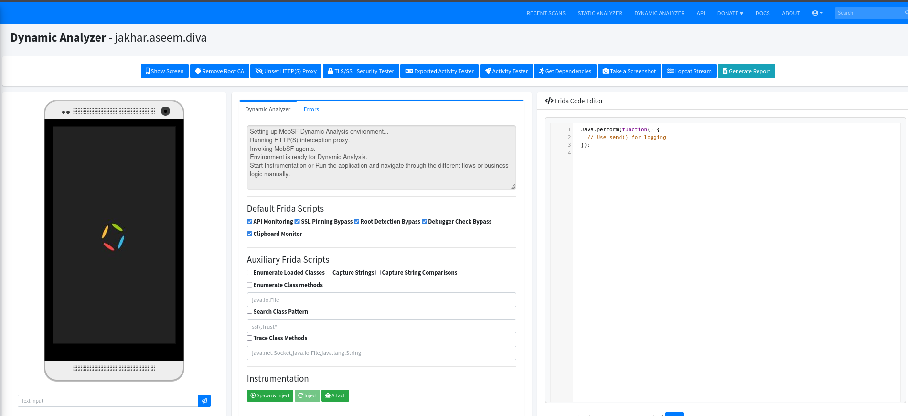

Ya nos aparecen las opciones que, según el temario del módulo, salen después de crear el entorno: Show Screen, Exported Activity Tester, Activity Tester, Take a Screenshot y Logcat Stream.

Pulsamos en `Show Screen`:
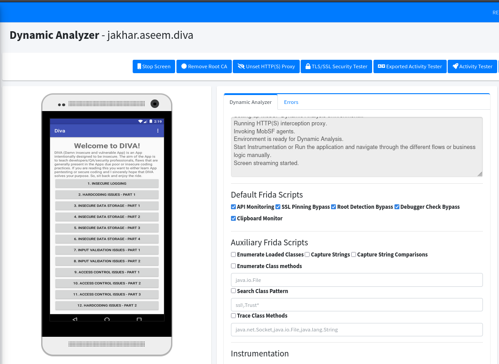


Abrimos DIVA en la pantalla virtual e enteractuamos con varios menús de la app:


dejar DIVA abierta en la pantalla virtual,

pulsar Logcat Stream en MobSF,

interactuar con la app,

sacar una captura con Take a Screenshot.

```
04-23 13:36:12.300 623 672 I PackageManager.DexOptimizer: Running dexopt (dex2oat) on: /data/app/vmdl1101823754.tmp/base.apk pkg=jakhar.aseem.diva isa=x86 vmSafeMode=false debuggable=true target-filter=interpret-only oatDir = /data/app/vmdl1101823754.tmp/oat sharedLibraries=null\n'
04-23 13:36:45.427 623 953 I ActivityManager: START u0 {act=android.intent.action.MAIN cat=[android.intent.category.LAUNCHER] flg=0x10200000 cmp=jakhar.aseem.diva/.MainActivity bnds=[12,514][121,704] (has extras)} from uid 10049 on display 0\n'
04-23 13:36:45.443 623 936 I ActivityManager: Start proc 1961:jakhar.aseem.diva/u0a65 for activity jakhar.aseem.diva/.MainActivity\n'
04-23 13:36:45.664 623 645 I ActivityManager: Displayed jakhar.aseem.diva/.MainActivity: +232ms\n'
04-23 14:14:16.387 623 638 I ActivityManager: Force stopping jakhar.aseem.diva appid=10065 user=-1: deletePackageX\n'
04-23 14:14:16.387 623 638 I ActivityManager: Killing 1961:jakhar.aseem.diva/u0a65 (adj 0): stop jakhar.aseem.diva\n'
04-23 14:14:16.387 623 638 W ActivityManager: Force removing ActivityRecord{6f822cb u0 jakhar.aseem.diva/.MainActivity t5}: app died, no saved state\n'
04-23 14:14:16.433 623 672 I ActivityManager: Force stopping jakhar.aseem.diva appid=10065 user=0: pkg removed\n'
04-23 14:14:16.453 1499 2320 D VoicemailCleanupService: Cleaning up data for package: jakhar.aseem.diva\n'
04-23 14:14:16.601 623 672 I PackageManager.DexOptimizer: Running dexopt (dex2oat) on: /data/app/vmdl114072063.tmp/base.apk pkg=jakhar.aseem.diva isa=x86 vmSafeMode=false debuggable=true target-filter=interpret-only oatDir = /data/app/vmdl114072063.tmp/oat sharedLibraries=null\n'
04-23 14:18:04.602 623 1351 I ActivityManager: START u0 {act=android.intent.action.MAIN cat=[android.intent.category.LAUNCHER] flg=0x10200000 cmp=jakhar.aseem.diva/.MainActivity bnds=[12,514][121,704] (has extras)} from uid 10049 on display 0\n'
04-23 14:18:04.618 623 936 I ActivityManager: Start proc 2453:jakhar.aseem.diva/u0a66 for activity jakhar.aseem.diva/.MainActivity\n'
04-23 14:18:04.797 623 645 I ActivityManager: Displayed jakhar.aseem.diva/.MainActivity: +190ms\n'
04-23 14:21:14.332 623 954 I ActivityManager: START u0 {cmp=jakhar.aseem.diva/.HardcodeActivity} from uid 10066 on display 0\n'
04-23 14:21:14.430 623 645 I ActivityManager: Displayed jakhar.aseem.diva/.HardcodeActivity: +93ms\n'
04-23 14:22:04.001 623 953 I ActivityManager: START u0 {cmp=jakhar.aseem.diva/.HardcodeActivity} from uid 10066 on display 0\n'
04-23 14:22:04.070 623 645 I ActivityManager: Displayed jakhar.aseem.diva/.HardcodeActivity: +67ms\n'
``` 


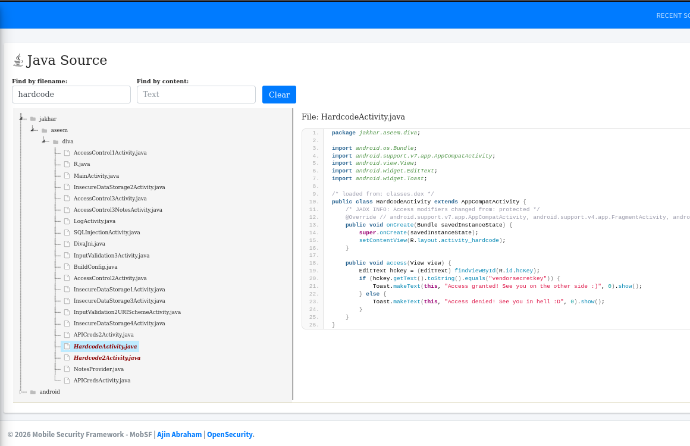


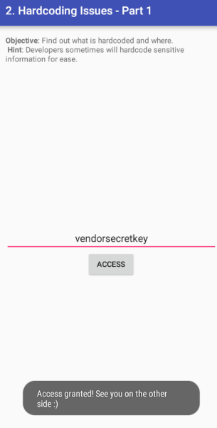


En HardcodeActivity.java se ve esta comparación:
```
if (hkey.getText().toString().equals("vendorsecretkey"))
```
donde:
- La key es: `vendorsecretkey`
- Hemos validado correctamente el análisis estático con MobSF, donde hemos abierto el código Java y hemos encontrado un secreto hardcodeado.


## Instalación de Burpsuite
Viene ya instalado en la distribución Kali.


## Instalación de jadx
El proyecto indica que el bundle de Linux usa el JRE del sistema y que Java 11+ es suficiente.
```
java -version
sudo apt update
sudo apt install -y unzip

cd ~/Descargas
wget https://github.com/skylot/jadx/releases/download/v1.5.5/jadx-1.5.5.zip

mkdir -p ~/tools/jadx
unzip jadx-1.5.5.zip -d ~/tools/jadx
``` 


Luego lo añadimos al PATH:
```
echo 'export PATH="$HOME/tools/jadx/bin:$PATH"' >> ~/.zshrc
source ~/.zshrc
```


``` 
─$ chmod +x ~/tools/jadx/bin/jadx
                                                                                                                                                      
┌──(xxniwexx㉿xxniwexx)-[~/tools/jadx/bin]
└─$ chmod +x ~/tools/jadx/bin/jadx-gui
                                                                                                                                                      
┌──(xxniwexx㉿xxniwexx)-[~/tools/jadx/bin]
└─$ ~/tools/jadx/bin/jadx --version
1.5.5
                                                                                                                                                      
┌──(xxniwexx㉿xxniwexx)-[~/tools/jadx/bin]
└─$ ~/tools/jadx/bin/jadx-gui --help

jadx - dex to java decompiler, version: 1.5.5

usage: jadx [command] [options] <input files> (.apk, .dex, .jar, .class, .smali, .zip, .aar, .arsc, .aab, .xapk, .apkm, .jadx.kts)
commands (use '<command> --help' for command options):
  plugins	  - manage jadx plugins

options:
  -sc, --select-class                           - GUI: Open the selected class and show the decompiled code
  -d, --output-dir                              - output directory
  -ds, --output-dir-src                         - output directory for sources
  -dr, --output-dir-res                         - output directory for resources
  -r, --no-res                                  - do not decode resources
  -s, --no-src                                  - do not decompile source code
  -j, --threads-count                           - processing threads count, default: 16
  --single-class                                - decompile a single class, full name, raw or alias
  --single-class-output                         - file or dir for write if decompile a single class
  --output-format                               - can be 'java' or 'json', default: java
  -e, --export-gradle                           - save as gradle project (set '--export-gradle-type' to 'auto')
  --export-gradle-type                          - Gradle project template for export:
                                                   'auto' - detect automatically
                                                   'android-app' - Android Application (apk)
                                                   'android-library' - Android Library (aar)
                                                   'simple-java' - simple Java
  -m, --decompilation-mode                      - code output mode:
                                                   'auto' - trying best options (default)
                                                   'restructure' - restore code structure (normal java code)
                                                   'simple' - simplified instructions (linear, with goto's)
                                                   'fallback' - raw instructions without modifications
  --show-bad-code                               - show inconsistent code (incorrectly decompiled)
  --no-xml-pretty-print                         - do not prettify XML
  --no-imports                                  - disable use of imports, always write entire package name
  --no-debug-info                               - disable debug info parsing and processing
  --add-debug-lines                             - add comments with debug line numbers if available
  --no-inline-anonymous                         - disable anonymous classes inline
  --no-inline-methods                           - disable methods inline
  --no-move-inner-classes                       - disable move inner classes into parent
  --no-inline-kotlin-lambda                     - disable inline for Kotlin lambdas
  --no-finally                                  - don't extract finally block
  --no-restore-switch-over-string               - don't restore switch over string
  --no-replace-consts                           - don't replace constant value with matching constant field
  --escape-unicode                              - escape non latin characters in strings (with \u)
  --respect-bytecode-access-modifiers           - don't change original access modifiers
  --mappings-path                               - deobfuscation mappings file or directory. Allowed formats: Tiny and Tiny v2 (both '.tiny'), Enigma (.mapping) or Enigma directory
  --mappings-mode                               - set mode for handling the deobfuscation mapping file:
                                                   'read' - just read, user can always save manually (default)
                                                   'read-and-autosave-every-change' - read and autosave after every change
                                                   'read-and-autosave-before-closing' - read and autosave before exiting the app or closing the project
                                                   'ignore' - don't read or save (can be used to skip loading mapping files referenced in the project file)
  --deobf                                       - activate deobfuscation
  --deobf-min                                   - min length of name, renamed if shorter, default: 3
  --deobf-max                                   - max length of name, renamed if longer, default: 64
  --deobf-whitelist                             - space separated list of classes (full name) and packages (ends with '.*') to exclude from deobfuscation, default: android.support.v4.* android.support.v7.* android.support.v4.os.* android.support.annotation.Px androidx.core.os.* androidx.annotation.Px
  --deobf-cfg-file                              - deobfuscation mappings file used for JADX auto-generated names (in the JOBF file format), default: same dir and name as input file with '.jobf' extension
  --deobf-cfg-file-mode                         - set mode for handling the JADX auto-generated names' deobfuscation map file:
                                                   'read' - read if found, don't save (default)
                                                   'read-or-save' - read if found, save otherwise (don't overwrite)
                                                   'overwrite' - don't read, always save
                                                   'ignore' - don't read and don't save
  --deobf-res-name-source                       - better name source for resources:
                                                   'auto' - automatically select best name (default)
                                                   'resources' - use resources names
                                                   'code' - use R class fields names
  --use-source-name-as-class-name-alias         - use source name as class name alias:
                                                   'always' - always use source name if it's available
                                                   'if-better' - use source name if it seems better than the current one
                                                   'never' - never use source name, even if it's available
  --source-name-repeat-limit                    - allow using source name if it appears less than a limit number, default: 10
  --use-kotlin-methods-for-var-names            - use kotlin intrinsic methods to rename variables, values: disable, apply, apply-and-hide, default: apply
  --use-headers-for-detect-resource-extensions  - Use headers for detect resource extensions if resource obfuscated
  --rename-flags                                - fix options (comma-separated list of):
                                                   'case' - fix case sensitivity issues (according to --fs-case-sensitive option),
                                                   'valid' - rename java identifiers to make them valid,
                                                   'printable' - remove non-printable chars from identifiers,
                                                  or single 'none' - to disable all renames
                                                  or single 'all' - to enable all (default)
  --integer-format                              - how integers are displayed:
                                                   'auto' - automatically select (default)
                                                   'decimal' - use decimal
                                                   'hexadecimal' - use hexadecimal
  --type-update-limit                           - type update limit count (per one instruction), default: 10
  --fs-case-sensitive                           - treat filesystem as case sensitive, false by default
  --cfg                                         - save methods control flow graph to dot file
  --raw-cfg                                     - save methods control flow graph (use raw instructions)
  -f, --fallback                                - set '--decompilation-mode' to 'fallback' (deprecated)
  --use-dx                                      - use dx/d8 to convert java bytecode
  --comments-level                              - set code comments level, values: error, warn, info, debug, user-only, none, default: info
  --log-level                                   - set log level, values: quiet, progress, error, warn, info, debug, default: info
  -v, --verbose                                 - verbose output (set --log-level to DEBUG)
  -q, --quiet                                   - turn off output (set --log-level to QUIET)
  --disable-plugins                             - comma separated list of plugin ids to disable
  --config <config-ref>                         - load configuration from file, <config-ref> can be:
                                                   path to '.json' file
                                                   short name - uses file with this name from config directory
                                                   'none' - to disable config loading
  --save-config <config-ref>                    - save current options into configuration file and exit, <config-ref> can be:
                                                   empty - for default config
                                                   path to '.json' file
                                                   short name - file will be saved in config directory
  --print-files                                 - print files and directories used by jadx (config, cache, temp)
  --version                                     - print jadx version
  -h, --help                                    - print this help

Plugin options (-P<name>=<value>):
  dex-input: Load .dex and .apk files
    - dex-input.verify-checksum                 - verify dex file checksum before load, values: [yes, no], default: yes
  java-convert: Convert .class, .jar and .aar files to dex
    - java-convert.mode                         - convert mode, values: [dx, d8, both], default: both
    - java-convert.d8-desugar                   - use desugar in d8, values: [yes, no], default: no
  kotlin-metadata: Use kotlin.Metadata annotation for code generation
    - kotlin-metadata.class-alias               - rename class alias, values: [yes, no], default: yes
    - kotlin-metadata.method-args               - rename function arguments, values: [yes, no], default: yes
    - kotlin-metadata.fields                    - rename fields, values: [yes, no], default: yes
    - kotlin-metadata.companion                 - rename companion object, values: [yes, no], default: yes
    - kotlin-metadata.data-class                - add data class modifier, values: [yes, no], default: yes
    - kotlin-metadata.to-string                 - rename fields using toString, values: [yes, no], default: yes
    - kotlin-metadata.getters                   - rename simple getters to field names, values: [yes, no], default: yes
  kotlin-smap: Use kotlin.SourceDebugExtension annotation for rename class alias
    - kotlin-smap.class-alias-source-dbg        - rename class alias from SourceDebugExtension, values: [yes, no], default: no
  rename-mappings: various mappings support
    - rename-mappings.format                    - mapping format, values: [AUTO, TINY_FILE, TINY_2_FILE, ENIGMA_FILE, ENIGMA_DIR, PROGUARD_FILE, SRG_FILE, XSRG_FILE, JAM_FILE, CSRG_FILE, TSRG_FILE, TSRG_2_FILE, INTELLIJ_MIGRATION_MAP_FILE, RECAF_SIMPLE_FILE, JOBF_FILE], default: AUTO
    - rename-mappings.invert                    - invert mapping on load, values: [yes, no], default: no
  smali-input: Load .smali files
    - smali-input.api-level                     - Android API level, default: 27

Environment variables:
  JADX_DISABLE_XML_SECURITY - set to 'true' to disable all security checks for XML files
  JADX_DISABLE_ZIP_SECURITY - set to 'true' to disable all security checks for zip files
  JADX_ZIP_MAX_ENTRIES_COUNT - maximum allowed number of entries in zip files (default: 100 000)
  JADX_CONFIG_DIR - custom config directory, using system by default
  JADX_CACHE_DIR - custom cache directory, using system by default
  JADX_TMP_DIR - custom temp directory, using system by default

Examples:
  jadx -d out classes.dex
  jadx --rename-flags "none" classes.dex
  jadx --rename-flags "valid, printable" classes.dex
  jadx --log-level ERROR app.apk
  jadx -Pdex-input.verify-checksum=no app.apk
    
```

Abrimos la GUI con DIVA:
```
~/tools/jadx/bin/jadx-gui ~/Escritorio/diva-beta.apk
```

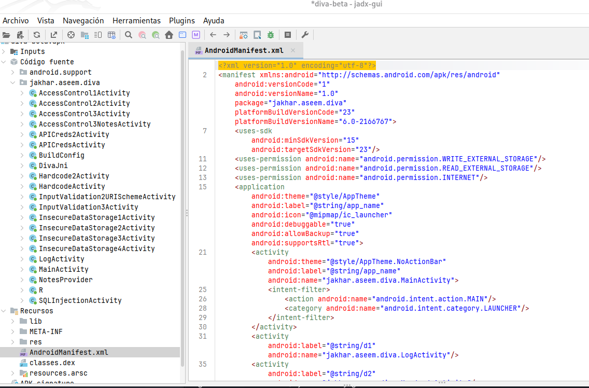

Esta herramienta sirve para decompilar APK/Dex a Java y decodificar AndroidManifest.xml y recursos.


## Instalación de apktool en Kali

```
sudo apt install -y apktool
```

Comprobamos que se instaló correctamente:
```
└─$ apktool --version
2.7.0-dirty
```

Probamos con DIVA:
```
└─$ apktool d ~/Escritorio/diva-beta.apk -o ~/diva-apktool
I: Using Apktool 2.7.0-dirty on diva-beta.apk
I: Loading resource table...
I: Decoding AndroidManifest.xml with resources...
I: Loading resource table from file: /home/xxniwexx/.local/share/apktool/framework/1.apk
I: Regular manifest package...
I: Decoding file-resources...
I: Decoding values */* XMLs...
I: Baksmaling classes.dex...
I: Copying assets and libs...
I: Copying unknown files...
I: Copying original files...
``` 

Mostramos el contenido generado por apktool:
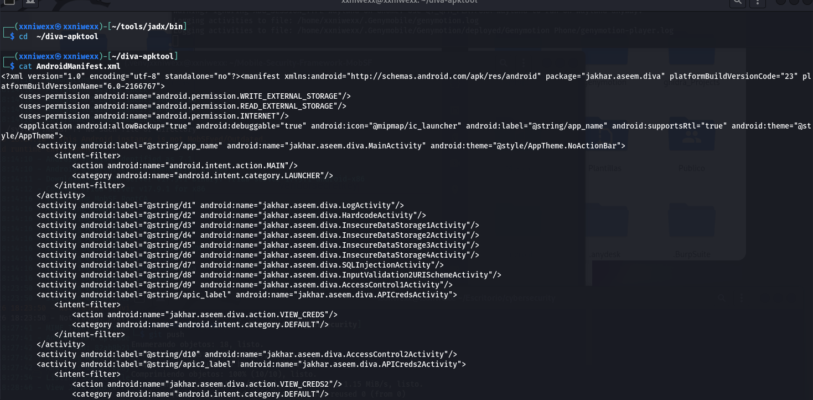

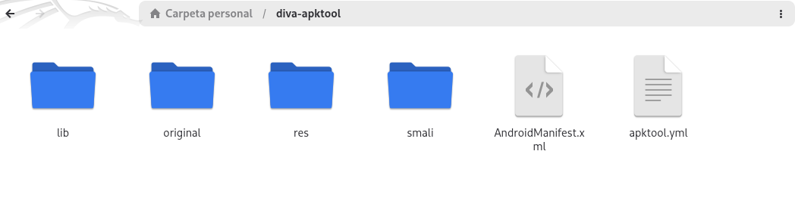


## Instalación de Ghidra

Con Ghidra podemos trabajar con partes del APK, sobre todo:
- classes.dex: para ver bytecode Dalvik/ART
- librerías nativas .so dentro de lib/: aquí Ghidra sí brilla mucho
- otros binarios embebidos si existen

Para probarlo, vamos a abrir una librería nativa: `lib/x86/*.so`: `libdivajni.so` que es una librería JNI propia de la app.


Se instaló y validó Ghidra como herramienta de análisis estático avanzado. Para comprobar su funcionamiento, se abrió la librería nativa lib/x86/libdivajni.so extraída del APK mediante apktool. Se verificó la carga correcta del binario ELF, el listado de símbolos, funciones JNI (JNI_OnLoad, Java_*) y el decompilado asociado.


# Entorno iOS
Para iOS no dispondremos de dispositivos móviles con jailbreak, así que nos centraremos en análisis estático. En ese contexto, usaremos MobSF como herramienta principal para analizar archivos `.ipa` y Ghidra para análisis estático avanzado del binario.

Las apps de App Store están protegidas con FairPlay DRM, así que para obtener una versión descifrada normalmente hace falta un dispositivo físico modificado, por lo que en el laboratorio académico se parte de ficheros .ipa ya descifrados.

En iOS, el laboratorio se orienta al análisis estático de archivos .ipa, extrayendo su contenido, revisando Info.plist, frameworks, cadenas, binario Mach-O y resultados automáticos de MobSF.

## Herramientas instaladas
- VirtualBox, para soportar máquinas virtuales y parte de la infraestructura del laboratorio.
- Kali Linux, como entorno de análisis con utilidades de reversing y red. Kali Linux 64 bits en máquina virtual, con al menos 4 GB de RAM y 2 CPU.
- MobSF para análisis estático del fichero .ipa.
- Ghidra para análisis estático avanzado del binario.
- El módulo remarca que, al no disponer de dispositivo móvil adecuado, en iOS se trabajará básicamente con análisis estático.

