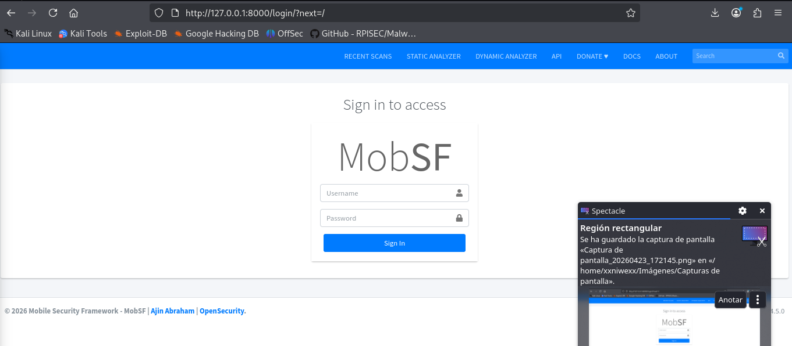
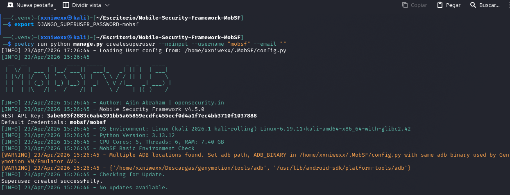

# Entendiendo qué pide la tarea
El objetivo de la práctica es **preparar un entorno controlado para el análisis de aplicaciones móviles Android e iOS, permitiendo realizar análisis estático y, en el caso de Android, también análisis dinámico mediante emulación.** Según el módulo, Android será la plataforma principal para análisis dinámico, mientras que en iOS el trabajo se centrará en archivos .ipa ya descifrados y su análisis estático.


# Objetivo de la práctica
El objetivo es desplegar un laboratorio básico de reversing móvil que permita:
- Analizar aplicaciones Android tanto de forma estática como dinámica.
- Analizar aplicaciones iOS de forma estática.
- Disponer de un entorno controlado con emulador, herramientas de inspección y framework de análisis.


# Entorno Android
Para Android usaremos las herramientas:
- Kali Linux como máquina de análisis.
- ADB para comunicar y controlar el dispositivo Android desde línea de comandos.
- Burp Suite o ZAP Proxy como opción para interceptación.
- Wireshark para sniffing de red.
- Genymotion como emulador Android.
- VirtualBox para las máquinas virtuales.
- MobSF como framework de análisis de aplicaciones.

También se mostrará un flujo práctico: abriremos un dispositivo en Genymotion, comprobaremos los dispositivos disponibles con `adb devices` e instalaremos la aplicación con `adb install`.

## Arquitectura
La idea práctica es usar la siguiente arquitectura de laboratorio: Kali host: VirtualBox + Genymotion + ADB + MobSF + JADX + apktool + Ghidra

En el sistema anfitrión Kali Linux real:
  - Instalamos VirtualBox.
  - Instalamos Genymotion.
  - Creamos ahí el dispositivo Android virtual
  - Verificamos ADB.
  - Instalamos MobSF.
  - Instalamos:
    - jadx.
    - apktool.
    - Ghidra


## Herramientas a instalar
- VirtualBox, para soportar máquinas virtuales y parte de la infraestructura del laboratorio.
- Kali Linux, como entorno de análisis con utilidades de reversing y red. Se actualizan la máquina virtual Kali.
- Genymotion, como emulador Android para ejecutar aplicaciones en entorno controlado.
- ADB, para listar dispositivos, instalar APKs y comunicarse con el emulador desde consola.
- MobSF, como framework central para análisis estático y apoyo al análisis de seguridad de APK e IPA.
- Burp Suite o OWASP ZAP, para interceptar tráfico cuando sea necesario.
- Wireshark, para captura y análisis de tráfico de red.
- Ghidra, para análisis estático avanzado, especialmente en binarios iOS.

En Android, el laboratorio permite ejecutar aplicaciones en Genymotion, conectarse a ellas mediante ADB e inspeccionar tanto su comportamiento como su contenido con herramientas como MobSF. El módulo pone como ejemplo instalar una APK en el emulador mediante adb install y después analizar permisos, actividades, strings, componentes exportados y código decompilado.

## Instalación de Genymotion
Instalamos Genymotion Desktop en un host Kali. 

Descargamos la aplicación: https://www.genymotion.com/product-desktop/. 


```
chmod +x genymotion-3.10.0-linux_x64.run
```

Abrimos Genymotion e iniciamos  sesión: Si no tenemos cuenta, la creamos desde la propia app, confirmando el correo y entrando con las credenciales. La edición `Personal Use - Free` se activa tras descargar, instalar, iniciar Genymotion, crear cuenta, validar el email y elegir “personal use”.


Creamos un dispositivo virtual: Ya dentro de Genymotion, pulsamos Create, eligimos una plantilla de teléfono o tablet Android y la arrancamos. La guía oficial de inicio rápido contempla precisamente ese flujo: iniciar sesión, crear un dispositivo y lanzarlo.


Deja NAT (default) seleccionado: Para esta práctica es la opción más sencilla.

Pulsa INSTALL: El aviso de Hyper-V detected no impide crear el dispositivo; significa que irá más lento porque VirtualBox no está usando aceleración por hardware completa.


Arrancamos el dispositivo creado:


Al final, lo conectamos con Kali usando ADB: Cuando el dispositivo arranque, en la MV de Kali comprobaremoss si ADB lo ve. Ese paso viene después de tener Genymotion funcionando en Windows. No hace falta tocar todavía nada dentro de Kali para instalar el emulador

------------------


```
└─$ uname -m                                                                                                               
x86_64
                                                                                                                                                           

└─$ groups | grep vboxusers                                                                                                
xxniwexx adm dialout cdrom floppy sudo audio dip video plugdev users netdev bluetooth lpadmin wireshark scanner kaboxer vboxusers
                                                                                                                
                                                                                                              └─$ chmod +x genymotion-3.10.0-linux_x64.run
                                                                                                               
└─$ ./genymotion-3.10.0-linux_x64.run 
Installing for current user only. To install for all users, restart this installer as root.

Installing to folder [/home/xxniwexx/Descargas/genymotion]. Are you sure [y/n] ? y


- Extracting files ..................................... OK (Extract into: [/home/xxniwexx/Descargas/genymotion])
- Installing launcher icon ............................. OK

Installation done successfully.

You can now use these tools from [/home/xxniwexx/Descargas/genymotion]:
 - genymotion
 - genymotion-shell
 - gmtool                                               
```


## Instalación de ADB
```
sudo apt install adb
[sudo] contraseña para xxniwexx: 
Instalando:                              
  adb

Instalando dependencias:
  android-libbase  android-libboringssl  android-libcutils  android-liblog  android-libziparchive  android-udev-rules

Resumen:
  Actualizando: 0, Instalando 7, Eliminando: 0, no actualizando: 0
  Tamaño de la descarga: 1.198 kB
  Espacio necesario: 3.764 kB / 53,0 GB disponible

¿Continuar? [S/n] S
```


donde:
- `127.0.0.1:6555 device`: 

-----------------

```
└─$ adb install diva-beta.apk                  
Performing Streamed Install
adb: failed to install diva-beta.apk: Failure [INSTALL_FAILED_DEPRECATED_SDK_VERSION: App package must target at least SDK version 24, but found 23]
```


## Instalar MobSF

```
sudo apt update
sudo apt install -y git python3 python3-venv python3-pip python3-dev build-essential \
  libffi-dev libssl-dev libxml2-dev libxslt1-dev libjpeg62-turbo-dev zlib1g-dev \
  openjdk-21-jdk
```


```
cd ~/Mobile-Security-Framework-MobSF

sudo apt install -y python3-full

python3 -m venv .venv
source .venv/bin/activate

python -m pip install --upgrade pip wheel

./setup.sh
```

------

```
└─$ poetry run python manage.py migrate
[INFO] 23/Apr/2026 17:19:40 - Downloading JADX from https://github.com/skylot/jadx/releases/download/v1.5.0/jadx-1.5.0.zip
[INFO] 23/Apr/2026 17:19:40 - Loading User config from: /home/xxniwexx/.MobSF/config.py
[###########---------------------------------------] 22.28%[INFO] 23/Apr/2026 15:19:43 - 
  __  __       _    ____  _____       _  _    ____  
 |  \/  | ___ | |__/ ___||  ___|_   _| || |  | ___| 
 | |\/| |/ _ \| '_ \___ \| |_  \ \ / / || |_ |___ \ 
 | |  | | (_) | |_) |__) |  _|  \ V /|__   _| ___) |
 |_|  |_|\___/|_.__/____/|_|     \_/    |_|(_)____/ 

[INFO] 23/Apr/2026 15:19:43 - Author: Ajin Abraham | opensecurity.in
[INFO] 23/Apr/2026 15:19:43 - Mobile Security Framework v4.5.0
REST API Key: 3abe693f2883c6ab4391bb5a65859ecdfc455ecf0d4a1f7ec4bb3710f1037888
Default Credentials: mobsf/mobsf
[###########---------------------------------------] 22.45%[INFO] 23/Apr/2026 15:19:43 - OS Environment: Linux (kali 2026.1 kali-rolling) Linux-6.19.11+kali-amd64-x86_64-with-glibc2.42
[###########---------------------------------------] 22.46%[INFO] 23/Apr/2026 15:19:43 - Python Version: 3.13.12
[###########---------------------------------------] 22.50%[INFO] 23/Apr/2026 15:19:43 - CPU Cores: 5, Threads: 6, RAM: 7.40 GB
[INFO] 23/Apr/2026 15:19:43 - MobSF Basic Environment Check
[###########---------------------------------------] 22.89%[WARNING] 23/Apr/2026 15:19:43 - Multiple ADB locations found. Set adb path, ADB_BINARY in /home/xxniwexx/.MobSF/config.py with same adb binary used by Genymotion VM/Emulator AVD.
[WARNING] 23/Apr/2026 15:19:43 - {'/home/xxniwexx/Descargas/genymotion/tools/adb', '/usr/lib/android-sdk/platform-tools/adb'}
[###########---------------------------------------] 24.00%Operations to perform:
  Apply all migrations: auth, contenttypes, django_q, sessions
Running migrations:
[############--------------------------------------] 24.37% OKpplying contenttypes.0001_initial...
[############--------------------------------------] 24.56% OK
[############--------------------------------------] 24.76% OK
[############--------------------------------------] 24.93% OK
[############--------------------------------------] 25.04% OK
[############--------------------------------------] 25.18% OK
[############--------------------------------------] 25.28% OK
[############--------------------------------------] 25.36% OK
[############--------------------------------------] 25.53% OK
[############--------------------------------------] 25.75% OK
[############--------------------------------------] 25.87% OK
[#############-------------------------------------] 26.04% OK
  Applying auth.0011_update_proxy_permissions... OK
  Applying auth.0012_alter_user_first_name_max_length... OK
  Applying django_q.0001_initial... OK
  Applying django_q.0002_auto_20150630_1624... OK
  Applying django_q.0003_auto_20150708_1326... OK
  Applying django_q.0004_auto_20150710_1043... OK
  Applying django_q.0005_auto_20150718_1506... OK
  Applying django_q.0006_auto_20150805_1817... OK
  Applying django_q.0007_ormq... OK
[#############-------------------------------------] 26.15% OK
[#############-------------------------------------] 26.25% OK
[#############-------------------------------------] 27.81% OK
[#############-------------------------------------] 27.88% OK
[#############-------------------------------------] 27.98% OK
[##############------------------------------------] 28.10% OK
[##############------------------------------------] 28.18% OK
[##############------------------------------------] 28.31% OK
[##############------------------------------------] 28.40% OK
[##############------------------------------------] 28.52% OK
[##############------------------------------------] 28.65% OK
[##############------------------------------------] 28.81% OK
[###############-----------------------------------] 30.27%[INFO] 23/Apr/2026 15:19:44 - Checking for Update.
[#################---------------------------------] 35.65%[INFO] 23/Apr/2026 15:19:44 - No updates available.
[##################################################] 100.00%[INFO] 23/Apr/2026 15:19:52 - JADX download complete. File size: 104967983 bytes
[INFO] 23/Apr/2026 15:19:52 - Extracting JADX to /home/xxniwexx/.MobSF/tools/jadx/jadx-1.5.0
[INFO] 23/Apr/2026 15:19:52 - Setting execute permission for JADX directory
[INFO] 23/Apr/2026 15:19:52 - JADX installed successfully
                                                                                                                                                           
┌──(.venv)─(xxniwexx㉿kali)-[~/Escritorio/Mobile-Security-Framework-MobSF]
└─$ ./run.sh 127.0.0.1:8000
[INFO] 23/Apr/2026 17:20:34 - Loading User config from: /home/xxniwexx/.MobSF/config.py

``` 





Las credenciales por defecto de MobSF son:

usuario: mobsf
contraseña: mobsf

-----
no funciona.


source .venv/bin/activate
export DJANGO_SUPERUSER_PASSWORD=mobsf
poetry run python manage.py createsuperuser --noinput --username "mobsf" --email ""




# Entorno iOS
Para iOS no dispondremos de dispositivos móviles con jailbreak, así que nos centraremos en análisis estático. En ese contexto, usaremos MobSF como herramienta principal para analizar archivos `.ipa` y Ghidra para análisis estático avanzado del binario.

Las apps de App Store están protegidas con FairPlay DRM, así que para obtener una versión descifrada normalmente hace falta un dispositivo físico modificado, por lo que en el laboratorio académico se parte de ficheros .ipa ya descifrados.

En iOS, el laboratorio se orienta al análisis estático de archivos .ipa, extrayendo su contenido, revisando Info.plist, frameworks, cadenas, binario Mach-O y resultados automáticos de MobSF.

## Herramientas instaladas
- VirtualBox, para soportar máquinas virtuales y parte de la infraestructura del laboratorio.
- Kali Linux, como entorno de análisis con utilidades de reversing y red. Kali Linux 64 bits en máquina virtual, con al menos 4 GB de RAM y 2 CPU.
- MobSF para análisis estático del fichero .ipa.
- Ghidra para análisis estático avanzado del binario.
- El módulo remarca que, al no disponer de dispositivo móvil adecuado, en iOS se trabajará básicamente con análisis estático.

