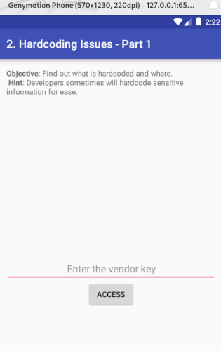

<div class="page"/>


- [**1. Entendiendo qué pide la tarea**](#1-entendiendo-qué-pide-la-tarea)
- [**2. Entorno Android**](#2-entorno-android)
  - [**2.1 Instalación de Genymotion**](#21-instalación-de-genymotion)
  - [**2.2 Instalación de ADB**](#22-instalación-de-adb)
  - [**2.3 Probando una app**](#23-probando-una-app)
  - [**2.4 Instalación de MobSF**](#24-instalación-de-mobsf)
  - [**2.5 Ejemplo de Analisis Dinámico con MobSF**](#25-ejemplo-de-analisis-dinámico-con-mobsf)
  - [**2.6 Conexión de BurpSuite con Genymotion**](#26-conexión-de-burpsuite-con-genymotion)
    - [**A) Crear un listener en el puerto 8080**](#a-crear-un-listener-en-el-puerto-8080)
    - [**B) Instalar el certificado CA en Android**](#b-instalar-el-certificado-ca-en-android)
    - [**C) Instalar el certificado de BurpSuite en el Android de Genymotion**](#c-instalar-el-certificado-de-burpsuite-en-el-android-de-genymotion)
    - [**D) Poner el proxy global del emulador apuntando a BurpSuite**](#d-poner-el-proxy-global-del-emulador-apuntando-a-burpsuite)
    - [**E) Probamos la interceptación del tráfico**](#e-probamos-la-interceptación-del-tráfico)
  - [**2.7 Instalación de jadx**](#27-instalación-de-jadx)
  - [**2.8 Instalación de apktool**](#28-instalación-de-apktool)
  - [**2.9 Instalación de Ghidra**](#29-instalación-de-ghidra)
- [**3. Entorno iOS**](#3-entorno-ios)
  - [**3.1 Esquema de análisis en IOS**](#31-esquema-de-análisis-en-ios)
  - [**3.2 Análisis estático inicial: MobSF**](#32-análisis-estático-inicial-mobsf)
    - [**Cosas relevantes a revisar**](#cosas-relevantes-a-revisar)
  - [**3.3 Análisis profundo: Ghidra**](#33-análisis-profundo-ghidra)
  - [**3.4 BurpSuite**](#34-burpsuite)
- [**4. Conclusiones**](#4-conclusiones)


<div class="page"/>


# **1. Entendiendo qué pide la tarea**
El objetivo de la práctica es **preparar un entorno controlado para el análisis de aplicaciones móviles Android e iOS, permitiendo realizar análisis estático y, en el caso de Android, también análisis dinámico mediante emulación.** Según el módulo:
- Android será la plataforma principal para análisis dinámico.
- Mientras que en iOS el trabajo se centrará en archivos `.ipa` ya descifrados y su análisis estático.

Es importante señalar que el objetivo de este ejercicio no es realizar un análisis de malware en sentido estricto, sino preparar y validar el entorno de trabajo necesario para poder llevar a cabo ese tipo de análisis posteriormente. El foco del laboratorio se sitúa en la instalación, configuración y comprobación de las herramientas y de la infraestructura de análisis para aplicaciones móviles Android e iOS, para disponer de un entorno funcional sobre el que realizar tareas de reversing, análisis estático, análisis dinámico y, en su caso, análisis de malware. 

<br>
<br>

# **2. Entorno Android**
Usaremos la siguiente arquitectura de laboratorio: `Kali host: VirtualBox + Genymotion + ADB + MobSF + JADX + apktool + Ghidra`.

**En el sistema anfitrión Kali Linux real instalaremos:**
- `VirtualBox` para usar máquinas virtuales.
- `Genymotion` como emulador Android para ejecutar aplicaciones en entorno controlado.
- `ADB` para listar dispositivos, instalar APKs y comunicarse con el emulador desde consola.
- `MobSF` como framework central para análisis estático y apoyo al análisis de seguridad de APK e IPA.
- `jadx`, como herramienta para decompilar `.apk` y `.dex` y mostrar su código en un formato cercano a Java.
- `apktool` como herramienta para desempaquetar y reconstruir aplicaciones Android `.apk`.
- `Ghidra` para realizar análisis estático avanzado, especialmente en binarios `iOS`.
- `Wireshark` para captura y análisis de tráfico de red.
- `Burp Suite` como opción para interceptación.


En Android, el laboratorio que se propone permite ejecutar aplicaciones en `Genymotion`, conectarse a ellas mediante `ADB` e inspeccionar tanto su comportamiento como su contenido con herramientas como `MobSF`. El módulo pone como ejemplo instalar una APK `Diva Beta` en el emulador mediante `adb install` y después se realizará un pequeño análisis de la misma.

<div class="page"/>

## **2.1 Instalación de Genymotion**
Instalamos `Genymotion Desktop` en un host Kali. Para ello **descargamos la aplicación:** https://www.genymotion.com/product-desktop/ y comprobamos que el fichero descargado sea legítimo:


**Marcamos el fichero descargado como ejecutable:**
```
chmod +x genymotion-3.10.0-linux_x64.run
```


**Genymotion recomienda instalación local, no global:** La instalación global con `sudo` en `/opt/genymotion` no la recomiendan porque puede dar problemas de permisos. Para ello ejecutamos:
```
./genymotion-*-linux_x64.run -d "$HOME/genymotion"
```


**Arrancamos Genymotion:**
```
~/genymotion/genymotion/genymotion
```


**Abrimos Genymotion e iniciamos  sesión:** Si no tenemos cuenta, la tenemos que crear desde la propia app, confirmando el correo y entrando con las credenciales. La edición `Personal Use - Free` se activa tras descargar, instalar, iniciar `Genymotion`, crear la cuenta, validar el email y elegir `personal use`:


**Creamos un dispositivo virtual:** Ya dentro de Genymotion, pulsamos `Create`, elegimos una plantilla de Android y la arrancamos:


donde:
- Mantenemos `NAT (default)` seleccionado porque:
  - Da salida a Internet al emulador sin tener que tocar apenas la red.
  - Aísla mejor el dispositivo virtual del resto de la red local.
  - Evita problemas de configuración que sí pueden aparecer con Bridge, como conflictos de IP, DHCP, adaptadores o visibilidad en la red.
- Pulsamos `INSTALL`: El aviso de Hyper-V detected no impide crear el dispositivo. Implica que irá más lento porque VirtualBox no está usando aceleración por hardware completa.


**Finaliza el proceso de creación de un dispositivo Android 15.0:**   


**Arrancamos el dispositivo creado, pulsando el botón de `play`:**  


El siguiente paso es conectar este dispositivo con el host Kali usando `ADB`. Para ello, cuando el dispositivo android arranque, comprobaremos si `ADB` lo ve.


<div class="page"/>

## **2.2 Instalación de ADB**
```
sudo apt install adb
Instalando:                              
  adb

Instalando dependencias:
  android-libbase  android-libboringssl  android-libcutils  android-liblog  android-libziparchive  android-udev-rules

Resumen:
  Actualizando: 0, Instalando 7, Eliminando: 0, no actualizando: 0
  Tamaño de la descarga: 1.198 kB
  Espacio necesario: 3.764 kB / 53,0 GB disponible

¿Continuar? [S/n] S
```

Comprobamos que adb ha sido instalado en el host kali: Mostramos la versión y los dispositivos que encuentra:

  
donde:
- `127.0.0.1:6555 device`: Encuentra el dispositivo android que antes creamos.


<div class="page"/>


## **2.3 Probando una app**
**Descargamos la aplicación que aporta el temario del módulo para hacer prácticas con ella.**
```
└─$ adb install diva-beta.apk                  
Performing Streamed Install
adb: failed to install diva-beta.apk: Failure [INSTALL_FAILED_DEPRECATED_SDK_VERSION: App package must target at least SDK version 24, but found 23]
```
donde:
- <mark>Comprobamos que necesitamos instalar un dispositivo android más antiguo para que esta aplicación pueda arrancar.</mark>


**Instalamos y arrancamos otro dispositivo Android 7.0:**  
  


**Instalamos con adb la aplicación `diva-beta.apk`.**  
  
donde:
- Comprobamos los dispositivos que `adb` encuentra conectados: `127.0.0.1:6555 device`.


**Arrancamos el dispositivo android 7 y buscamos la aplicación `diva-beta.apk`:**  


**Ejecutamos `diva-beta.apk`:**  


**Miramos los logs con `adb logcat`:** En una terminal de comandos ejecutamos `adb logcat`:  

donde:
- `logcat` sirve para ver mensajes, errores y actividad de la app durante la ejecución.

<br>
<br>

## **2.4 Instalación de MobSF**

**Actualizamos el sistema e instalamos una serie de paquetes que son necesarios:**
```
sudo apt update
sudo apt install -y git python3 python3-venv python3-pip python3-dev build-essential \
  libffi-dev libssl-dev libxml2-dev libxslt1-dev libjpeg62-turbo-dev zlib1g-dev \
  openjdk-21-jdk
```
donde instalamos:
- `git` → para clonar el repositorio de `MobSF` desde GitHub.
- `python3` → lenguaje principal en el que está desarrollado `MobSF`.
- `python3-venv` → para crear un entorno virtual y aislar las dependencias de Python.
- `python3-pip` → para instalar paquetes de Python necesarios durante la instalación.
- `python3-dev` → incluye cabeceras y archivos de desarrollo para compilar módulos Python nativos.
- `build-essential` → instala compiladores y herramientas básicas de compilación necesarias para algunas dependencias.
- `libffi-dev` → soporte de desarrollo para librerías que usan interfaces entre Python y código C.
- `libssl-dev` → librerías y cabeceras de OpenSSL para funciones de cifrado y comunicaciones seguras.
- `libxml2-dev` → soporte para procesar archivos XML.
- `libxslt1-dev` → soporte para transformaciones y manejo avanzado de `XML/XSLT`.
- `libjpeg62-turbo-dev` → librerías de desarrollo para tratamiento de imágenes `JPEG`.
- `zlib1g-dev` → soporte para compresión y descompresión de datos.
- `openjdk-21-jdk` → entorno Java necesario para componentes y herramientas del análisis Android en `MobSF`.

**Ahora descargamos MobSF:**
```
git clone https://github.com/MobSF/Mobile-Security-Framework-MobSF.git
cd Mobile-Security-Framework-MobSF
```


**Hacemos la instalación de MobileSF en un entorno virtual python:**
```
cd ~/Mobile-Security-Framework-MobSF

sudo apt install -y python3-full

python3 -m venv .venv
source .venv/bin/activate

python -m pip install --upgrade pip wheel

./setup.sh

...
...
...
...
  __  __       _    ____  _____       _  _    ____  
 |  \/  | ___ | |__/ ___||  ___|_   _| || |  | ___| 
 | |\/| |/ _ \| '_ \___ \| |_  \ \ / / || |_ |___ \ 
 | |  | | (_) | |_) |__) |  _|  \ V /|__   _| ___) |
 |_|  |_|\___/|_.__/____/|_|     \_/    |_|(_)____/ 

[INFO] 23/Apr/2026 17:46:46 - Author: Ajin Abraham | opensecurity.in
[INFO] 23/Apr/2026 17:46:46 - Mobile Security Framework v4.5.0
REST API Key: 30de80bb81566d17f50b8b7a3c421fd7066f864347bae0b6ebf60c2a9e81123d
Default Credentials: mobsf/mobsf
[INFO] 23/Apr/2026 17:46:46 - OS Environment: Linux (kali 2026.1 kali-rolling) Linux-6.18.12+kali-amd64-x86_64-with-glibc2.42
[INFO] 23/Apr/2026 17:46:46 - Python Version: 3.13.12
[INFO] 23/Apr/2026 17:46:46 - CPU Cores: 24, Threads: 32, RAM: 62.63 GB
[INFO] 23/Apr/2026 17:46:46 - MobSF Basic Environment Check
[WARNING] 23/Apr/2026 17:46:46 - Multiple ADB locations found. Set adb path, ADB_BINARY in /home/xxniwexx/.MobSF/config.py with same adb binary used by Genymotion VM/Emulator AVD.
[WARNING] 23/Apr/2026 17:46:46 - {'/usr/lib/android-sdk/platform-tools/adb', '/home/xxniwexx/Descargas/genymotion/tools/adb'}
Roles Created Successfully!
[INFO] 23/Apr/2026 17:46:46 - Checking for Update.
[INFO] 23/Apr/2026 17:46:46 - No updates available.
Download and Install wkhtmltopdf for PDF Report Generation - https://wkhtmltopdf.org/downloads.html
[INSTALL] Installation Complete

``` 


donde:
- Obtenemos una advertencia:
```
hay dos ADB distintos
/usr/lib/android-sdk/platform-tools/adb
/home/xxniwexx/Descargas/genymotion/tools/adb
```

**Para que MobSF y Genymotion usen el mismo `ADB`, conviene fijarlo en la configuración de `MobSF`:**  Como el `adb de Genymotion` se encuentra en: `/home/xxniwexx/Descargas/genymotion/tools/adb` vamos a fijar este `ADB` en la configuración de `MobSF`. Para ello editamos el archivo de configuración:
```
nano /home/xxniwexx/.MobSF/config.py
```

**Y añadimos:**
```
ADB_BINARY = "/home/xxniwexx/Descargas/genymotion/tools/adb"
```


**Guardamos, cerramos y reiniciamos MobSF:**
```
└─$ ./run.sh 127.0.0.1:8000
```
donde:
- Ya no obtenemos la advertencia de que encuentra dos `adb`.


**Abrimos un navegador y vamos a la url: `http://127.0.0.1:8000`** Las credenciales por defecto de MobSF son:
```
usuario: mobsf
contraseña: mobsf
```


## **2.5 Ejemplo de Analisis Dinámico con MobSF**

Instalado el Framework MobSF, ahora comprobaremos su funcionamiento con la aplicación `diva-beta.apk`.


**Pulsamos `Start Dynamic Analysis`:**  

donde:
- Ya nos aparecen las opciones que:
  - `Show Screen`.
  - `Exported Activity Tester`.
  - `Activity Tester`.
  - `Take a Screenshot`.
  - `Logcat Stream`.

**Pulsamos en `Show Screen`:**  


Teniendo la app DIVA en la pantalla virtual, pulsamos en el framework MobSF `Logcat Stream` e interactuamos con varios menús de la app:
```
04-23 13:36:12.300 623 672 I PackageManager.DexOptimizer: Running dexopt (dex2oat) on: /data/app/vmdl1101823754.tmp/base.apk pkg=jakhar.aseem.diva isa=x86 vmSafeMode=false debuggable=true target-filter=interpret-only oatDir = /data/app/vmdl1101823754.tmp/oat sharedLibraries=null\n'
04-23 13:36:45.427 623 953 I ActivityManager: START u0 {act=android.intent.action.MAIN cat=[android.intent.category.LAUNCHER] flg=0x10200000 cmp=jakhar.aseem.diva/.MainActivity bnds=[12,514][121,704] (has extras)} from uid 10049 on display 0\n'
04-23 13:36:45.443 623 936 I ActivityManager: Start proc 1961:jakhar.aseem.diva/u0a65 for activity jakhar.aseem.diva/.MainActivity\n'
04-23 13:36:45.664 623 645 I ActivityManager: Displayed jakhar.aseem.diva/.MainActivity: +232ms\n'
04-23 14:14:16.387 623 638 I ActivityManager: Force stopping jakhar.aseem.diva appid=10065 user=-1: deletePackageX\n'
04-23 14:14:16.387 623 638 I ActivityManager: Killing 1961:jakhar.aseem.diva/u0a65 (adj 0): stop jakhar.aseem.diva\n'
04-23 14:14:16.387 623 638 W ActivityManager: Force removing ActivityRecord{6f822cb u0 jakhar.aseem.diva/.MainActivity t5}: app died, no saved state\n'
04-23 14:14:16.433 623 672 I ActivityManager: Force stopping jakhar.aseem.diva appid=10065 user=0: pkg removed\n'
04-23 14:14:16.453 1499 2320 D VoicemailCleanupService: Cleaning up data for package: jakhar.aseem.diva\n'
04-23 14:14:16.601 623 672 I PackageManager.DexOptimizer: Running dexopt (dex2oat) on: /data/app/vmdl114072063.tmp/base.apk pkg=jakhar.aseem.diva isa=x86 vmSafeMode=false debuggable=true target-filter=interpret-only oatDir = /data/app/vmdl114072063.tmp/oat sharedLibraries=null\n'
04-23 14:18:04.602 623 1351 I ActivityManager: START u0 {act=android.intent.action.MAIN cat=[android.intent.category.LAUNCHER] flg=0x10200000 cmp=jakhar.aseem.diva/.MainActivity bnds=[12,514][121,704] (has extras)} from uid 10049 on display 0\n'
04-23 14:18:04.618 623 936 I ActivityManager: Start proc 2453:jakhar.aseem.diva/u0a66 for activity jakhar.aseem.diva/.MainActivity\n'
04-23 14:18:04.797 623 645 I ActivityManager: Displayed jakhar.aseem.diva/.MainActivity: +190ms\n'
04-23 14:21:14.332 623 954 I ActivityManager: START u0 {cmp=jakhar.aseem.diva/.HardcodeActivity} from uid 10066 on display 0\n'
04-23 14:21:14.430 623 645 I ActivityManager: Displayed jakhar.aseem.diva/.HardcodeActivity: +93ms\n'
04-23 14:22:04.001 623 953 I ActivityManager: START u0 {cmp=jakhar.aseem.diva/.HardcodeActivity} from uid 10066 on display 0\n'
04-23 14:22:04.070 623 645 I ActivityManager: Displayed jakhar.aseem.diva/.HardcodeActivity: +67ms\n'
```


donde vemos:
- Que el sistema realiza la optimización del APK (`dexopt / dex2oat`) durante la instalación o reinstalación de la aplicación DIVA.
- El arranque de la aplicación mediante la actividad principal `jakhar.aseem.diva/.MainActivity`, invocada con la acción `MAIN` y la categoría `LAUNCHER`.
- La creación del proceso de la app `(Start proc ... jakhar.aseem.diva)` cuando Android lanza DIVA.
- La actividad principal se muestra correctamente en pantalla `(Displayed ... MainActivity)`, lo que confirma que la app se ejecuta en el entorno virtual.
- Un evento de parada forzada y eliminación del paquete `(Force stopping, Killing, pkg removed)`, lo que indica que la aplicación fue desinstalada o reinstalada durante las pruebas. Cosa que es cierta ya que tuve algunos problemas en su instalación.
- La optimización e instalación del APK tras esa reinstalación.
- Un nuevo arranque de la actividad principal, confirmando que la aplicación vuelve a ejecutarse correctamente después de reinstalarla.
- La apertura de la actividad `jakhar.aseem.diva/.HardcodeActivity`, lo que demuestra que al interactuar con los menús de DIVA se accede a funcionalidades internas concretas.
- `HardcodeActivity` se abre en dos ocasiones, lo que confirma que la interacción del usuario queda reflejada en `Logcat` y que el entorno dinámico permite seguir la navegación entre actividades.

**Resumiendo, el registro confirma que el entorno preparado con `Genymotion + ADB + MobSF` permite observar en tiempo real la instalación, ejecución, navegación y eventos relevantes de una aplicación Android.**

**En MobSF, hacemos una búsqueda de los ficheros de la app que tengan el nombre `hardcode`:** Vemos el fichero `HardcodeActivity.java`, dentro del método access(View view):
  
En el fichero `HardcodeActivity.java` se ve esta comparación:
```
if (hkey.getText().toString().equals("vendorsecretkey"))
```
donde:
- Toma el texto introducido por el usuario en `EditText hkey`.
- Lo convierte a cadena.
- Lo compara directamente con un valor fijo: `vendorsecretkey`.
- <mark>Lo que implica que la clave válida está hardcodeada en el código fuente: `vendorsecretkey`.</mark>
- Si el valor coincide: muestra el mensaje `Access granted! See you on the other side :)`.
- Si no coincide: muestra `Access denied! See you in hell :D`.


  
donde:
- <mark>Esta captura demuestra que el entorno de análisis estático funciona correctamente y que ha permitido identificar una vulnerabilidad típica: credenciales o claves hardcodeadas en la aplicación. En este caso, la key embebida es `vendorsecretkey`, localizada en la clase `HardcodeActivity`.</mark>


<div class="page"/>


## **2.6 Conexión de BurpSuite con Genymotion**
Vamos a [conectar Burpsuite con Genymotion](https://www.genymotion.com/blog/tutorial/burp-suite-genymotion-desktop/) en el dispositivo `Android 15.0 - Api 35` que instalamos en el apartado anterior. La guía oficial de Genymotion recomienda:
- Crear un listener en BurpSuite para escuchar.
- Instalar el certificado CA en Android.
- Poner el proxy global del emulador apuntando a Burp.
- Además, recomiendan hacerlo por ADB en vez de tocar el proxy desde Ajustes de Android, porque es más fiable.
- También indican que podemos usar el ADB del SDK o el ADB integrado de Genymotion.


### **A) Crear un listener en el puerto 8080**
En BurpSuite:
- Vamos a `Proxy`.
- Entramos en `Proxy Settings`.
- Creamos un listener para que escuche en `puerto 8080`, en todas las interfaces:
  

<div class="page"/>

### **B) Instalar el certificado CA en Android**
BurpSuite actúa como intermediario en las conexiones HTTPS. Cuando una app o el navegador Android acceden a una web segura:
- El dispositivo espera recibir un certificado TLS válido del servidor,
- pero al interceptar Burp, quien presenta el certificado realmente es BurpSuite, no el servidor original,
- por eso Android, si no confía en la CA de BurpSuite, detecta ese certificado como no confiable y bloquea la conexión.

<mark>Es por ello que tenemos que instalar el certificado de usuario de BurpSuite en el dispositivo Android para que el sistema confíe en BurpSuite como autoridad certificadora y permita interceptar tráfico HTTPS sin errores de certificado.</mark>

**Para instalar el certificado CA en Android, en BurpSuite:**
- Vamos a `Proxy`.
- Entramos en `Proxy Settings`.
- Pulsamos el botón `Import/export CA certificate` y exportamos la `CA` en formato `DER`. La guía usa como ejemplo `Burp_cert.der`:
  

  ---

  

  ---


    

  ---


    


  ---

<div class="page"/>

### **C) Instalar el certificado de BurpSuite en el Android de Genymotion**
Con el dispositivo android arrancado:
- Arrastramos `Burp_cert.der` a la ventana del dispositivo.
- En Android, buscamos `Install a certificate`.
- Entramos en `Install certificates from SD Card`.
- Eligimos `CA certificate`.
- Abrimos `/sdcard/Download/Burp_cert.der` y lo instalamos.
- Después podemos comprobarlo en `Trusted credentials`, donde debería aparecer en la pestaña `USER`.
    

  ----

  

  ----

  
  
  ----

  

  ----
  
  

  ----
  
    

<div class="page"/>


### **D) Poner el proxy global del emulador apuntando a BurpSuite**
**El comando general es:**
```
adb shell settings put global http_proxy <IP_DEL_HOST>:8080
```
donde:
- Genymotion explica que `<IP_DEL_HOST>` es la IP de la máquina donde corre Burp y `8080` es el puerto del listener.
- `<IP_DEL_HOST>` es la dirección que el Android virtual debe usar para llegar a la máquina donde corre Burp. Pero esa dirección no siempre es la IP LAN del host, cambia según el backend de Genymotion. Genymotion lo documenta así:
  - Con VirtualBox, el dispositivo puede usar 10.0.3.2, que es un alias de VirtualBox al loopback del host (127.0.0.1), así que un proxy local en el host se alcanza como 10.0.3.2:8080.
  - Con QEMU, no existe ese loopback alias, así que Genymotion recomienda poner el proxy global en localhost:3333 dentro del dispositivo y hacer adb reverse tcp:3333 tcp:8080 hacia el host.
- Desde ese momento, el tráfico de Internet del dispositivo debería redirigirse a BurpSuite.

<mark>Resumiendo: La dirección usada por el dispositivo Android para alcanzar BurpSuite depende del hipervisor empleado por Genymotion. Con VirtualBox puede usarse 10.0.3.2:8080, mientras que con QEMU es necesario configurar el proxy a localhost:3333 y redirigir el tráfico con adb reverse tcp:3333 tcp:8080.</mark>

**Verificamos la regla de redirección activa y el serial real del dispositivo:**
  
donde:
- `adb reverse --list` muestra la regla `host-14 tcp:3333 tcp:8080`, lo que indica que la redirección hacia BurpSuite está configurada.
- `adb devices -l` muestra que el identificador válido del dispositivo para usar con `adb -s` es `127.0.0.1:6555`.


**Verificamos el hipervisor que usa el dispositivo android 15:**
 
donde:
- Comprobamos que el dispositvo android usa en el hipervisor: `QEMU`.
- Como usa QEMU debemos seguir el esquema: proxy del dispositivo a `localhost:3333` y `adb reverse tcp:3333 tcp:8080`.
 
**Volvemos a configurar el acceso al proxy mediante comandos ADB:**
```
/home/xxniwexx/Descargas/genymotion/tools/adb -s 127.0.0.1:6555 shell settings put global http_proxy :0
/home/xxniwexx/Descargas/genymotion/tools/adb -s 127.0.0.1:6555 reverse --remove-all

/home/xxniwexx/Descargas/genymotion/tools/adb -s 127.0.0.1:6555 shell settings put global http_proxy localhost:3333
/home/xxniwexx/Descargas/genymotion/tools/adb -s 127.0.0.1:6555 reverse tcp:3333 tcp:8080

/home/xxniwexx/Descargas/genymotion/tools/adb -s 127.0.0.1:6555 shell settings get global http_proxy
/home/xxniwexx/Descargas/genymotion/tools/adb -s 127.0.0.1:6555 reverse --list
```
  
donde:
- `adb -s 127.0.0.1:6555 shell settings put global http_proxy :0`: Elimina cualquier configuración previa de proxy global en el dispositivo Android virtual.
- `adb -s 127.0.0.1:6555 reverse --remove-all`: Borra todas las reglas de redirección adb reverse que estuvieran activas.
- `adb -s 127.0.0.1:6555 shell settings put global http_proxy localhost:3333`: Configura el dispositivo para que use como proxy la dirección localhost en el puerto 3333.
- `adb -s 127.0.0.1:6555 reverse tcp:3333 tcp:8080`: Crea una redirección entre el puerto 3333 del dispositivo virtual y el puerto 8080 del host, donde está escuchando BurpSuite.
- `adb -s 127.0.0.1:6555 shell settings get global http_proxy`: Muestra la configuración actual del proxy global del dispositivo, para verificar que se ha aplicado correctamente.
- `adb -s 127.0.0.1:6555 reverse --list`: Lista las reglas adb reverse activas, para comprobar que la redirección hacia BurpSuite está configurada.


<div class="page"/>

### **E) Probamos la interceptación del tráfico**
Intentamos acceder a una web como por ejemplo: `http://neverssl.com`, pero obtenemos un error de proxy server:  
  

<mark>Después de seguir distintas vías pero no conseguir solventar el error del Proxy Server, vamos a instalar un nuevo Browser.</mark> Las pruebas para acceder a una web las hemos realizado en una aplicacion que estaba instalada en el dispositivo android llamada `Buscador`. Por ello instalaremos un navegador gratuito:  
 

  


Abrimos el navegador instalado y probamos a navegar por alguna web: Ya se empieza a interceptar el tráfico BurpSuite:
  

---

  


**Resumiendo:**
Para validar la interceptación de tráfico, se configuró el proxy global del dispositivo virtual para redirigir las conexiones hacia BurpSuite. Además, se revisó el hipervisor utilizado por el dispositivo Android en Genymotion, comprobándose que estaba configurado con QEMU. A partir de ello, se reconfiguró el acceso al proxy mediante comandos `ADB`, estableciendo el proxy global en `localhost:3333` y creando una redirección con `adb reverse tcp:3333 tcp:8080`, de forma que el tráfico del emulador se reenviara correctamente al puerto `8080` de BurpSuite en el host. Tras varias pruebas, se comprobó que el navegador por defecto del emulador no gestionaba correctamente la navegación a través del proxy, mostrando el error `Proxy Server Refused Connection`. Se instaló un navegador alternativo mediante `APK` y, con él, BurpSuite comenzó a interceptar correctamente la petición GET a neverssl.com. Esto confirma que la integración `Genymotion + proxy + BurpSuite` es correcta y que la incidencia estaba asociada al navegador integrado de la imagen Android utilizada.

<div class="page"/>

## **2.7 Instalación de jadx**
El proyecto indica que el bundle de Linux usa el JRE del sistema y que Java 11+ es suficiente.

**Descargamos jadx:**
```
java -version
sudo apt update
sudo apt install -y unzip

cd ~/Descargas
wget https://github.com/skylot/jadx/releases/download/v1.5.5/jadx-1.5.5.zip

mkdir -p ~/tools/jadx
unzip jadx-1.5.5.zip -d ~/tools/jadx
``` 


**Lo añadimos al PATH:**
```
echo 'export PATH="$HOME/tools/jadx/bin:$PATH"' >> ~/.zshrc
source ~/.zshrc
```

**Marcamos el fichero como ejecutable:**
``` 
─$ chmod +x ~/tools/jadx/bin/jadx
                                                                                                                                                      

└─$ chmod +x ~/tools/jadx/bin/jadx-gui
```

                                                                                                                                                      
**Mostramos la versión de jadx:**
```
└─$ ~/tools/jadx/bin/jadx --version
1.5.5
```

                                                                                                                                                      
**Mostramos la ayuda de `jadx-gui`:**
```
└─$ ~/tools/jadx/bin/jadx-gui --help

jadx - dex to java decompiler, version: 1.5.5

usage: jadx [command] [options] <input files> (.apk, .dex, .jar, .class, .smali, .zip, .aar, .arsc, .aab, .xapk, .apkm, .jadx.kts)
commands (use '<command> --help' for command options):
  plugins	  - manage jadx plugins

options:
  -sc, --select-class                           - GUI: Open the selected class and show the decompiled code
  -d, --output-dir                              - output directory
  -ds, --output-dir-src                         - output directory for sources
  -dr, --output-dir-res                         - output directory for resources
  -r, --no-res                                  - do not decode resources
...
    
```

**Abrimos jadx-gui con la app de DIVA:**
```
~/tools/jadx/bin/jadx-gui ~/Escritorio/diva-beta.apk
```


<mark>Vemos como esta herramienta sirve para decompilar APK/Dex a Java y decodificar AndroidManifest.xml y recursos.</mark>

<div class="page"/>

## **2.8 Instalación de apktool**

**Instalamos apktool:**
```
sudo apt install -y apktool
```

**Comprobamos que se instaló correctamente:**
```
└─$ apktool --version
2.7.0-dirty
```

**Probamos apktool con la app de DIVA:**
```
└─$ apktool d ~/Escritorio/diva-beta.apk -o ~/diva-apktool
I: Using Apktool 2.7.0-dirty on diva-beta.apk
I: Loading resource table...
I: Decoding AndroidManifest.xml with resources...
I: Loading resource table from file: /home/xxniwexx/.local/share/apktool/framework/1.apk
I: Regular manifest package...
I: Decoding file-resources...
I: Decoding values */* XMLs...
I: Baksmaling classes.dex...
I: Copying assets and libs...
I: Copying unknown files...
I: Copying original files...
``` 

**Mostramos el contenido generado por apktool:**


<mark>Comprobamos cómo esta herramienta desempaqueta y reconstruye esta app.</mark>

<br> 
<br>

## **2.9 Instalación de Ghidra**
Usamos Ghidra como herramienta de análisis estático avanzado. Con Ghidra podemos trabajar con partes del APK, como por ejemplo `classes.dex` para ver bytecode Dalvik/ART, librerías nativas `.so` dentro de lib y otros binarios embebidos.

**Instalamos Ghidra:** Requiere tener Java JDK instalado.  
```
sudo apt update && sudo apt upgrade -y
sudo apt install default-jdk -y
flatpak install flathub org.ghidra_sre.Ghidra
./ghidraRun
```

Para probar en acción ghidra, vamos a abrir la librería nativa: `lib/x86/*.so`: `libdivajni.so` que es una librería JNI propia de la app y que fue anteriormente generada por la herramienta `apktool`:


Abrimos esta librería con Ghidra:

donde:
- Vemos la librería nativa `lib/x86/libdivajni.so` extraída del APK mediante `apktool`.
- Se verifica:
  - La carga correcta del binario ELF.
  - El listado de símbolos, funciones JNI (JNI_OnLoad, Java_*) y el decompilado asociado.

<div class="page"/>

# **3. Entorno iOS**
Para iOS no dispondremos de dispositivos móviles con `jailbreak`, así que nos centraremos en análisis estático. En ese contexto, usaremos MobSF como herramienta principal para analizar archivos `.ipa` y Ghidra para análisis estático avanzado del binario.

Las apps de App Store están protegidas con FairPlay DRM, así que para obtener una versión descifrada normalmente hace falta un dispositivo físico modificado, por lo que en el laboratorio académico se parte de ficheros `.ipa` ya descifrados. Así que nos centraremos en extraer su contenido, revisar `Info.plist`, frameworks, cadenas, binario `Mach-O` y resultados automáticos de MobSF.

## **3.1 Esquema de análisis en IOS**
Partiendo el host kali linux que ya tenemos preparado, usaremos:
- Con MobSF → analizamos el `.ipa` completo. Nos aportará visión una general de:
	- Info.plist.
	- Permisos.
	- Strings.
	- Frameworks.
	- Configuración.
- Ghidra → analizamos el `Mach-O`. Nos aportará visión una general de:
	- Funciones.
	- Strings en contexto.
	- Referencias.
	- Imports/Exports.
	- Decompilado.

## **3.2 Análisis estático inicial: MobSF**
Para este apartado vamos a escoger para hacer prácticas: [OWASP iGoat-Swift](https://github.com/OWASP/iGoat-Swift?utm_source=chatgpt.com) ya que es una app iOS vulnerable orientada a aprendizaje y su repositorio público incluye un archivo `iGoat-Swift.ipa`.

**Descargamos el fichero y lo cargamos en MobSF:**
- Activamos el entorno virtual python y abrimos MobSF.


- Pulsamos el botón `Upload&Analize` para cargar `iGoat-Swift.ipa`.


### **Cosas relevantes a revisar**
- Info.plist:
```
Info.plist
<?xml version="1.0" encoding="UTF-8"?>
<!DOCTYPE plist PUBLIC "-//Apple//DTD PLIST 1.0//EN" "http://www.apple.com/DTDs/PropertyList-1.0.dtd">
<plist version="1.0">
<dict>
	<key>BuildMachineOSBuild</key>
	<string>19B2093</string>
	<key>CFBundleDevelopmentRegion</key>
	<string>en</string>
	<key>CFBundleExecutable</key>
	<string>iGoat-Swift</string>
	<key>CFBundleIcons</key>
	<dict>
		<key>CFBundlePrimaryIcon</key>
		<dict>
			<key>CFBundleIconFiles</key>
			<array>
				<string>AppIcon29x29</string>
				<string>AppIcon60x60</string>
			</array>
			<key>CFBundleIconName</key>
			<string>AppIcon</string>
		</dict>
	</dict>
	<key>CFBundleIdentifier</key>
	<string>OWASP.iGoat-Swift</string>
	<key>CFBundleInfoDictionaryVersion</key>
	<string>6.0</string>
	<key>CFBundleName</key>
	<string>iGoat-Swift</string>
	<key>CFBundlePackageType</key>
	<string>APPL</string>
	<key>CFBundleShortVersionString</key>
	<string>1.0</string>
	<key>CFBundleSupportedPlatforms</key>
	<array>
		<string>iPhoneOS</string>
	</array>
	<key>CFBundleURLTypes</key>
	<array>
		<dict>
			<key>CFBundleTypeRole</key>
			<string>Editor</string>
			<key>CFBundleURLName</key>
			<string>com.iGoat.myCompany</string>
			<key>CFBundleURLSchemes</key>
			<array>
...
...
</dict>
</plist>
```

- Strings.
- Frameworks.
- Permisos/configuración.
- Binario principal.
- Análisis estático profundo: Ghidra.

[Informe del Análisis estatico realizado por MobSF](https://github.com/soniasalido/cybersecurity/blob/main/Documentation/Malware/Master-ENIIT-Analisis-Malware-Reversing/modulo-8-reversing-sistemas-operativos-moviles/1-M8T1-preparacion-del-entorno-de-trabajo/mobSF-report-iGoat-Swift.pdf)


<div class="page"/>

## **3.3 Análisis profundo: Ghidra**
**En iOS:**
- El fichero `.ipa` es un contenedor parecido a un ZIP.
- Dentro de este contenedor va la app.
- Y dentro de la app está el ejecutable `Mach-O`, que es el binario que realmente se ejecuta en iPhone.

**Vamos a descomprimir la aplicación:**
```
cp iGoat-Sift.ipa iGoat-Sift.zip
unzip -q iGoat-Sift.zip -d iGoat-Swift
```

**Obtenemos los siguientes ficheros:**  


**Encontrar `Mach-O`:** En iOS, el ejecutable real suele estar dentro de `Payload/NombreApp.app/` y normalmente no tiene extensión. Para saber dónde se encuentra realmente el ejecutable principal, necesitamos encontrar `Mach-O`:

Sabemos por `Info.plist` que el `Mach-O` principal está en:
```
Payload/iGoat-Swift.app/iGoat-Swift
```
donde:
- <key>CFBundleExecutable</key>.
- <string>iGoat-Swift</string>.
- En iOS, `CFBundleExecutable` indica el nombre del ejecutable principal de la app.

<mark>Así obtenemos que el ejecutable principal de esta app está en: `Payload/iGoat-Swift.app/iGoat-Swift`.</mark>


**Hacemos la siguiente comprobación:**
```
└─$ file Payload/iGoat-Swift.app/iGoat-Swift 
Payload/iGoat-Swift.app/iGoat-Swift: Mach-O universal binary with 2 architectures: [armv7:\012- Mach-O armv7 executable, flags:<NOUNDEFS|DYLDLINK|TWOLEVEL|WEAK_DEFINES|BINDS_TO_WEAK|PIE>] [\012- arm64:\012- Mach-O 64-bit arm64 executable, flags:<NOUNDEFS|DYLDLINK|TWOLEVEL|WEAK_DEFINES|BINDS_TO_WEAK|PIE>]
```
donde destacamos:
- `Payload/iGoat-Swift.app/iGoat-Swift` es efectivamente el binario ejecutable de la aplicación iOS.
- `Mach-O universal binary with 2 architectures`: Implica que el mismo fichero contiene dos versiones del ejecutable, una para cada arquitectura:
	- armv7 → 32 bits.
	- arm64 → 64 bits.
   Esto parece habitual para dar compatibilidad con distintos dispositivos iPhone/iPad.
- `PIE` → el binario es `Position Independent Executable`, lo que significa que soporta `ASLR`. Esto indica que el binario fue compilado como position independent executable, lo que permite `ASLR` y mejora la protección frente a ciertos ataques de corrupción de memoria.


**Abrimos este ejecutable principal con Ghidra:**
Marcamos que para este proyecto con Ghidra lo vamos a importar como un único fichero:


<div class="page"/>

Especificamos el lenguaje: El ejecutable `iGoat-Swift` es un binario `Mach-O` universal con dos arquitecturas `armv7` y `arm64`. Para su análisis en Ghidra vamos a seleccionar el lenguaje `ARM:LE:32:v8:default`, correspondiente a la arquitectura `arm` y la variante de 32 bits:


------


-----


-----


La captura muestra el binario principal `iGoat-Swift` abierto en Ghidra. En el panel izquierdo se observa el árbol de símbolos con las funciones detectadas, incluyendo el punto de entrada entry. En el panel central aparece el desensamblado de la función de entrada, mientras que en el panel derecho se muestra su decompilado, donde se aprecian llamadas típicas del arranque de una aplicación iOS como `UIApplicationMain` y referencias a clases `Objective-C`. Esto confirma que el ejecutable `Mach-O` ha sido cargado y analizado correctamente en Ghidra, permitiendo inspeccionar su flujo de ejecución y sus funciones internas.

<div class="page"/>

## **3.4 BurpSuite**
En la parte correspondiente a iOS no vamos a configurar BurpSuite, ya que el entorno preparado en este ejercicio está orientado exclusivamente a análisis estático sobre archivos `.ipa`. Para utilizar BurpSuite sería necesario disponer de un escenario de análisis dinámico, es decir, poder ejecutar la aplicación en un dispositivo físico o en un entorno iOS adecuadamente preparado, con capacidad para redirigir el tráfico a través de un proxy e instalar el certificado correspondiente. Dado que en este laboratorio no se cuenta con dispositivos con `jailbreak` ni con un entorno de ejecución iOS completo, nos hemos limitado a la revisión estática del paquete `.ipa`.

<br>
<br>

# **4. Conclusiones**
Como conclusión, en este ejercicio se ha preparado y validado un entorno funcional de análisis para aplicaciones móviles Android e iOS. En la parte Android se configuraron correctamente herramientas como Genymotion, ADB, MobSF, JADX, apktool, Ghidra y BurpSuite, comprobando su funcionamiento mediante análisis estático, dinámico e interceptación de tráfico. En la parte iOS se dejó preparado un entorno orientado a análisis estático, utilizando MobSF para revisar el contenido del `.ipa` y Ghidra para el análisis del binario `Mach-O`.

El ejercicio ha permitido verificar que la infraestructura necesaria para las fases posteriores de reversing y análisis de seguridad se encuentra operativa, y que servirá como base para los análisis que se llevarán a cabo en los siguientes ejercicios.