# **Entendiendo qué pide el ejercicio**

"...Contiene tanto los binarios para su análisis como una guía de su realización: [How to crack the challenges of DIVA – forensic blog (spreitzenbarth.de)](https://forensics.spreitzenbarth.de/2018/07/08/how-to-crack-the-challenges-of-diva/)"

El autor es **[mspreitz](https://github.com/mspreitz)**, que publica el 08/07/2018 una guía en donde se explica cómo resolver los 13 retos de DIVA, una app Android vulnerable diseñada para aprender análisis de seguridad móvil. La guía indica que DIVA contiene 13 retos orientados a enseñar fallos de seguridad habituales en apps Android.

Así que en esta práctica se analizará la aplicación **Android vulnerable DIVA — Damn Insecure and Vulnerable App**. El objetivo es identificar y explotar vulnerabilidades comunes en aplicaciones móviles Android.


# **2. Desarrollo de los retos**

## **2.1 Insecure Logging**
**Insecure Logging consiste en demostrar que DIVA escribe información sensible en los logs de Android.** En este reto se analiza la información que la aplicación escribe en los `logs` del sistema. La guía muestra que la app registra información sensible, como un número de tarjeta, mediante una línea de `log`. El problema se encuentra en la clase `LogActivity`, donde se utiliza `Log.e()` para imprimir el valor introducido.


**Resolvemos el reto con `adb logcat`:** Al introducir un valor en la app y revisar `logcat`, aparece el dato introducido por el usuario.
```
adb logcat
```


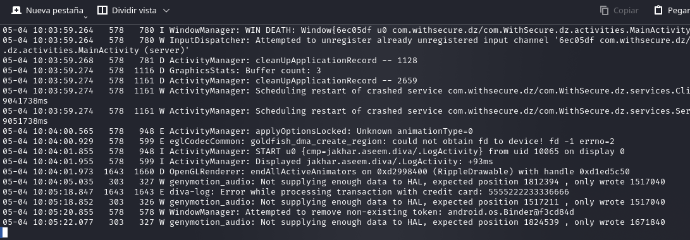


**Vulnerabilidad:** Exposición de datos sensibles en logs.

**Mitigación:** Nunca registrar contraseñas, tarjetas, tokens, claves ni datos personales en logs.


## **2.2 Hardcoding Issues**
Resolveremos el Reto 2 Hardcoding Issues con Objection. **El objetivo de este resto es descubrir la clave hardcodeada que la app compara internamente.** En DIVA, el reto está en la clase `jakhar.aseem.diva.HardcodeActivity`, y el código compara el texto introducido con el valor `vendorsecretkey`.

**En MobSF, hacemos una búsqueda de los ficheros de la app que tengan el nombre `hardcode`:** Vemos el fichero `HardcodeActivity.java`, dentro del método `access(View view)`:
  
En el fichero `HardcodeActivity.java` se ve esta comparación:
```
if (hkey.getText().toString().equals("vendorsecretkey"))
```
donde:
- Toma el texto introducido por el usuario en `EditText hkey`.
- Lo convierte a cadena.
- Lo compara directamente con un valor fijo: `vendorsecretkey`.
- <mark>Lo que implica que la clave válida está hardcodeada en el código fuente: `vendorsecretkey`.</mark>
- Si el valor coincide: muestra el mensaje `Access granted! See you on the other side :)`.
- Si no coincide: muestra `Access denied! See you in hell :D`.

**En Objection vamos a listar las actividades de la app:** Intentamos localizar la `Activity` del reto.
```
android hooking list activities
```
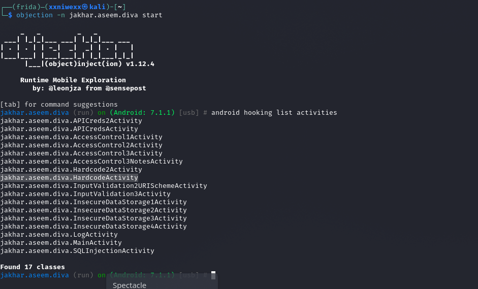
donde:
- Vemos que Objection encontró 17 activities dentro de la aplicación DIVA.
- La Activity más importante de este reto es: `jakhar.aseem.diva.HardcodeActivity`.
- Esta Activity es seleccionada como objetivo de análisis, ya que contiene la lógica encargada de validar la clave introducida por el usuario.


**Lanzamos la Activity HardcodeActivity:**
```
android intent launch_activity jakhar.aseem.diva.HardcodeActivity
```
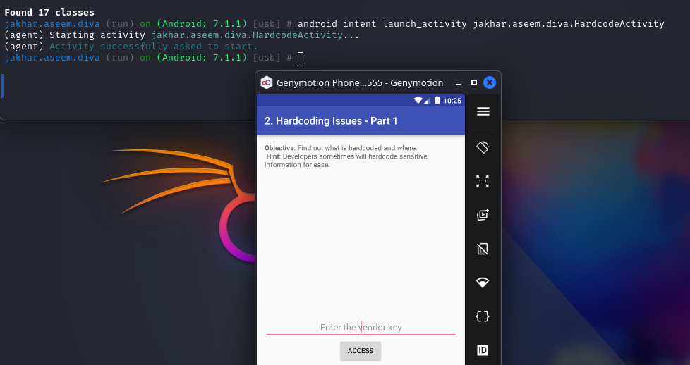


**Enumeramos los métodos de la clase vulnerable `HardcodeActivity`:**
```
android hooking list class_methods jakhar.aseem.diva.HardcodeActivity
```
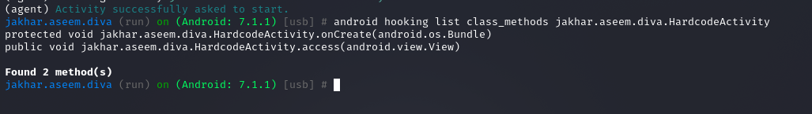
donde vemos los métodos:
  - `onCreate(android.os.Bundle)`: Este método se ejecuta cuando se abre la pantalla del reto. Normalmente se encarga de cargar la interfaz gráfica, inicializar botones, campos de texto y preparar la Activity.
  - `public void jakhar.aseem.diva.HardcodeActivity.access(android.view.View)`: Recibe un parámetro `android.view.View`. Esto indica que probablemente está asociado al botón de la interfaz. Es decir, cuando el usuario introduce una clave y pulsa el botón, Android ejecuta este método.


**Observamos la comparación con `String.equals`.** Con Objection vamos hacer un hook (enganche) al método `equals` de Java, porque la app compara el texto introducido con la clave hardcodeada. Cuando hacemos un hook al método `equals` de java, lo que hacemos es interceptar dinámicamente las llamadas que la aplicación hace a ese método mientras se está ejecutando. A partir de ese momento, cada vez que la app llame a `String.equals()`, Objection intercepta la llamada y puede mostrar:
- Los argumentos recibidos.
- El valor devuelto.
- Opcionalmente, el backtrace.

<mark>Es decir, Objection no está leyendo el código fuente directamente. Está observando lo que ocurre en tiempo de ejecución.</mark>
```
android hooking watch java.lang.String!equals --dump-args --dump-backtrace --dump-return
```
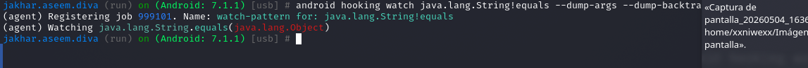

**Introducimos valores cualquiera:** Ahora en la app introducimos valores y cuando pulsamos el botón `Access`. A continuación, Android ejecuta el método `access()` de la `Activity`: 

```
....
....

(agent) [197709] Arguments java.lang.String.equals(vendorsecretkey)
(agent) [197709] Return Value: (none)
(agent) [197709] Called java.lang.String.equals(java.lang.Object)
(agent) [197709] Backtrace:
        java.lang.String.equals(Native Method)
        android.support.v4.app.FragmentManagerImpl.onCreateView(FragmentManager.java:2246)
        android.support.v4.app.FragmentController.onCreateView(FragmentController.java:111)
        android.support.v4.app.FragmentActivity.dispatchFragmentsOnCreateView(FragmentActivity.java:314)
        android.support.v4.app.BaseFragmentActivityHoneycomb.onCreateView(BaseFragmentActivityHoneycomb.java:31)
        android.support.v4.app.FragmentActivity.onCreateView(FragmentActivity.java:79)
        android.view.LayoutInflater.createViewFromTag(LayoutInflater.java:777)
        android.view.LayoutInflater.createViewFromTag(LayoutInflater.java:727)
        android.view.LayoutInflater.inflate(LayoutInflater.java:495)
        android.view.LayoutInflater.inflate(LayoutInflater.java:426)
        android.view.LayoutInflater.inflate(LayoutInflater.java:377)
        android.widget.Toast.makeText(Toast.java:266)
        jakhar.aseem.diva.HardcodeActivity.access(HardcodeActivity.java:23)
        java.lang.reflect.Method.invoke(Native Method)
        android.support.v7.internal.app.AppCompatViewInflater$DeclaredOnClickListener.onClick(AppCompatViewInflater.java:273)
        android.view.View.performClick(View.java:5637)
        android.view.View$PerformClick.run(View.java:22429)
        android.os.Handler.handleCallback(Handler.java:751)
        android.os.Handler.dispatchMessage(Handler.java:95)
        android.os.Looper.loop(Looper.java:154)
        android.app.ActivityThread.main(ActivityThread.java:6119)
        java.lang.reflect.Method.invoke(Native Method)
        com.android.internal.os.ZygoteInit$MethodAndArgsCaller.run(ZygoteInit.java:886)
        com.android.internal.os.ZygoteInit.main(ZygoteInit.java:776)

...
...
```
donde:
- Esto indica que la aplicación está llamando a `String.equals()` y está comparando el valor introducido por el usuario contra la cadena: `vendorsecretkey`, que es la clave hardcodeada.
- La traza `jakhar.aseem.diva.HardcodeActivity.access(HardcodeActivity.java:23)` es muy importante porque muestra desde dónde se hizo la llamada a `equals()`. Esto confirma que la comparación se produce dentro del método: `jakhar.aseem.diva.HardcodeActivity.access()`.
- Aunque el usuario introduzca un valor cualquiera, la aplicación internamente hace la comparación. Y gracias al hook, Objection muestra el argumento usado en la comparación.

**Escribimos la clave hardcodeada `vendorsecretkey` en la app Diva y obtenemos el pase:**


Resumiendo: En el Reto 2 se analiza la clase `jakhar.aseem.diva.HardcodeActivity` usando Objection. Primero se listaron las actividades de la aplicación y se lanzó la activity correspondiente al reto. Después se inspeccionaron sus métodos y se observó que el método principal era `access(android.view.View)`. Para identificar la clave hardcodeada, se enganchó dinámicamente el método `java.lang.String.equals` con Objection usando `--dump-args`, `--dump-backtrace` y `--dump-return`. Al introducir un valor cualquiera en la aplicación y pulsar el botón, Objection mostró que la aplicación comparaba la entrada del usuario con la cadena `vendorsecretkey`. Descubierta la clave e introducirla en la aplicación, el acceso fue concedido.


**Vulnerabilidad:** Secreto hardcodeado en el código fuente. Al descompilar la APK y revisar la clase `HardcodeActivity`, se encuentra una comparación directa contra una cadena fija: `.equals("vendorsecretkey")`. La guía identifica este valor como el secreto hardcodeado usado para conceder el acceso.

**Mitigación:** No se deben guardar contraseñas, claves API, tokens ni secretos dentro del código fuente o del binario de la aplicación. Estos valores deben gestionarse del lado del servidor o mediante mecanismos seguros de gestión de secretos.


## **2.3 Insecure Data Storage — Shared Preferences**
La guía de DIVA indica que este bloque de retos trata sobre almacenamiento inseguro: Shared Preferences, SQLite, archivo temporal y SD Card. Concretamente en este reto, la aplicación guarda datos de credenciales en un archivo XML dentro de: `/data/data/jakhar.aseem.diva/shared_prefs/`.
```
putString("user", ...)
putString("password", ...)
````

**En el dispositivo android, abrimos la app `Drozer Agent` en el emulador y pulsamos en el botón `ON`. A continuación creamos el forward:**
```
adb forward tcp:31415 tcp:31415
```

**Conectamos con la consola y vemos si encuentra diva:** Usaremos Drozer para identificar el paquete/superficie y a continuación, confirmaremos el hallazgo desde shell.
```
drozer console connect
run app.package.list -f diva
```
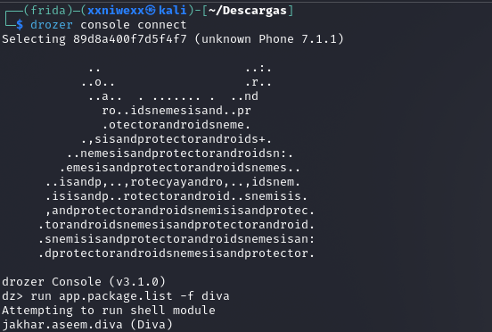


**Revisamos la información del paquete:**
```
run app.package.info -a jakhar.aseem.diva
```
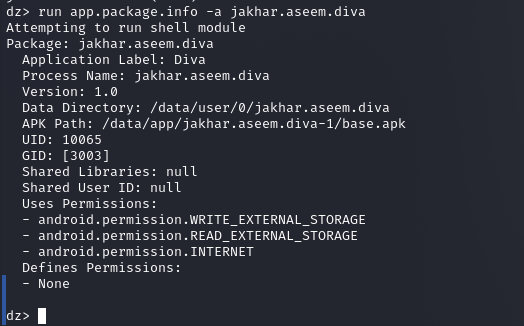


**Enumeramos la superficie de ataque:**
```
run app.package.attacksurface jakhar.aseem.diva
```
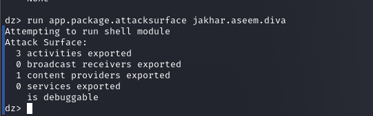
donde:
- Se identifican tres activities exportadas: `MainActivity`, `APICredsActivity` y `APICreds2Activity`.
- La activity del Reto 3, `InsecureDataStorage1Activity`, no aparece porque no está exportada.

**Listamos las `Activities`:**
```
run app.activity.info -a jakhar.aseem.diva
```
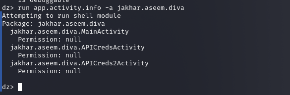


**Lanzamos el Reto 3 desde Drozer:**
```
run app.activity.start --component jakhar.aseem.diva jakhar.aseem.diva.InsecureDataStorage1Activity
```
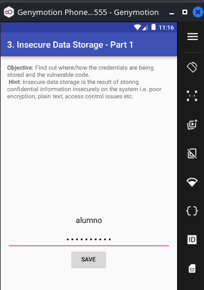  
donde:
- Vemos cómo se abre la pantalla de Insecure Data Storage — Part 1.

**Introducimos unas credenciales de prueba, por ejemplo:**
```
Usuario: alumno
Password: password123
```

**Leemos el archivo con root o ADB:** Como el reto consiste en demostrar que la app guarda datos sensibles en texto plano, la comprobación final se hace leyendo el archivo `XML`. En un emulador rooteado:
```
adb shell run-as jakhar.aseem.diva cat shared_prefs/jakhar.aseem.diva_preferences.xml
```
  
donde:
- Concluimos que el archivo contiene el usuario y la contraseña en texto plano, demostrando una vulnerabilidad de almacenamiento inseguro mediante Shared Preferences.


**Vulnerabilidad:** Almacenamiento de credenciales en texto plano usando Shared Preferences.

**Mitigación:** Debemos usar cifrado, Android Keystore o EncryptedSharedPreferences, y evitar guardar contraseñas reutilizables en el dispositivo.


## **2.4 Insecure Data Storage — Part 2**

La guía indica que la app guarda credenciales en una base de datos SQLite local llamada `ids2`, en una tabla llamada `myuser`. Este reto pertenece al bloque de almacenamiento inseguro y que la app guarda información sensible en texto plano.

**Abrimos el reto en la app Diva:**

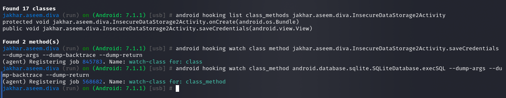  

**Verificamos que la base existe:**
```
adb shell run-as jakhar.aseem.diva ls -la databases
```
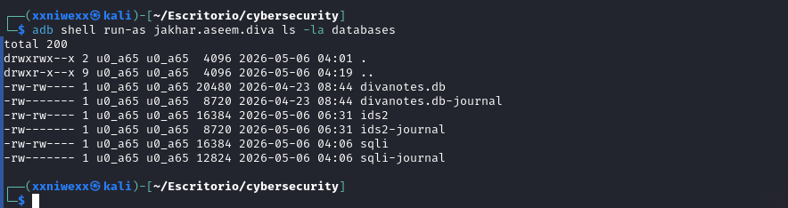  
donde:
- Observamos la base de datos SQLite local llamada `ids2`.

**Comprobamos las tablas de la BD `ids2`:**
```
adb shell 'run-as jakhar.aseem.diva sqlite3 databases/ids2 ".tables"'
```
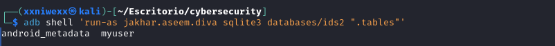  
donde:
- Encontramos una tabla llamada `myuser`.

**Mostramos el contenido de la tabla `myuser`:**
```
adb shell 'run-as jakhar.aseem.diva sqlite3 databases/ids2 "SELECT * FROM myuser;"'
```
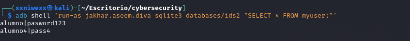  
donde:
- Se comprueba que la aplicación DIVA almacena credenciales en una base de datos SQLite local sin aplicar ningún tipo de cifrado.


**Vulnerabilidad:** Almacenamiento inseguro en base de datos SQLite. La app crea una base de datos llamada ids2 y una tabla myuser con campos user y password. La guía muestra que los datos se insertan directamente en la tabla.


**Mitigación:** La aplicación no debería guardar contraseñas en texto plano. Si necesitamos almacenamiento local, deberíamos usar cifrado seguro, Android Keystore, bases de datos cifradas y evitar almacenar credenciales reutilizables en el dispositivo.


## **2.5 Insecure Data Storage — Part 3**
En este reto DIVA guarda las credenciales en un archivo temporal dentro del directorio privado de la app. La guía muestra que la app crea un archivo temporal con prefijo `uinfo`, sufijo `tmp`, lo marca como legible/escribible y escribe las credenciales en formato `usuario:contraseña`. Tenemos que demostrar que la aplicación almacena credenciales en texto plano dentro de un archivo temporal.

**Abrimos el reto en la app:**  
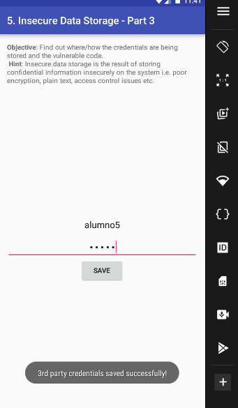
donde:
- La aplicación genera un archivo temporal dentro de su directorio privado, con nombre uinfo1044941255tmp.
- El nombre variará: Sabemos el prefijo: `uinfo`. Y sabemos el prefijo: `tmp`.


**Usaremos ADB con `run-as` (ya que DIVA es una app debuggable) para mostra el contenido:**
```
adb shell run-as jakhar.aseem.diva ls -la
```
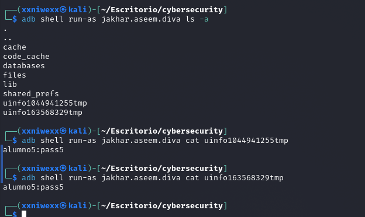  
donde:
- Se abre una shell dentro del dispositivo Android/emulador.
- Ejecuta el siguiente comando como si fuera la propia app DIVA, es decir, con el usuario Linux asignado al paquete `jakhar.aseem.diva`.
- Normalmente no podemos entrar libremente al directorio privado de la app, pero si la app es `debuggable`, `run-as` permite ejecutar comandos con su contexto.
- Listamos todos los archivos del directorio actual, incluyendo archivos ocultos, permisos, propietario, tamaño, fecha y nombre.


**Desde Objection, accedemos al archivo `uinfo...tmp` y lo mostramos en pantalla:**
```
cd /data/data/jakhar.aseem.diva
filesystem cat /data/user/0/jakhar.aseem.diva/uinfo1044941255tmp
```
 


**Vulnerabilidad:** Aunque el archivo está dentro del directorio privado de la aplicación, el problema es que contiene información sensible en texto plano. En un dispositivo rooteado, mediante copia de seguridad, depuración, análisis forense o acceso con el contexto de la app, un atacante podría recuperar esas credenciales.

**Mitigación:** No almacenar credenciales en archivos temporales, cifrar cualquier dato sensible y eliminar archivos temporales cuando ya no sean necesarios.


## **2.6 Insecure Data Storage — Part 4**

La guía explica que el archivo `.uinfo.txt` contiene las credenciales en texto plano, normalmente en: `/sdcard/.uinfo.txt`.


**Desde la app Diva, accedemos al reto 6 y escribimos unas credenciales de prueba. Pulsamos el botón de guardar:**
```
Usuario: alumno6
Password: pass6
```
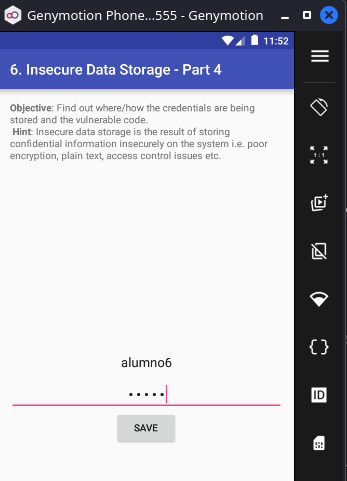 


**Buscamos el archivo en la SD Card:**
```
adb shell ls -la /sdcard/ | grep uinfo
```
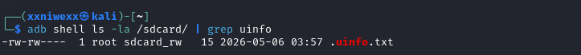 


**Mostramos el contenido de ese fichero:**
```
adb shell cat /sdcard/.uinfo.txt
```
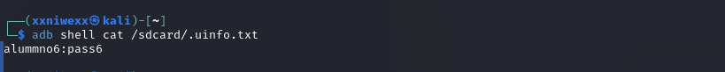 


**Vulnerabilidad:** Almacenamiento de datos sensibles en almacenamiento externo. La aplicación guarda las credenciales en: `/sdcard/.uinfo.txt`.

**Mitigación:** El almacenamiento externo no debe usarse para información sensible, ya que otras aplicaciones o usuarios podrían acceder a ella.


## **2.7 Input Validation Issues — Part 1**
Este reto corresponde a una inyección SQL. El objetivo es demostrar que DIVA construye una consulta SQL usando directamente el texto introducido por el usuario, sin validarlo ni parametrizarlo.

**Desde la app Diva, accedemos al reto 7 y escribimos `admin`. Pulsamos el botón de `search`:**
```
admin
```
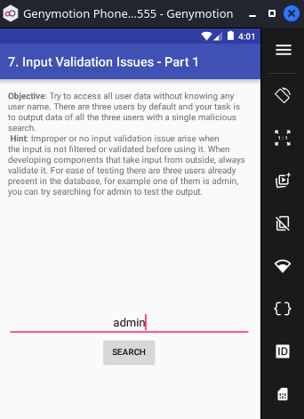  
donde:
- La app intentará buscar ese usuario en su base de datos interna.

**Para el usuario admin, obtenemos:**
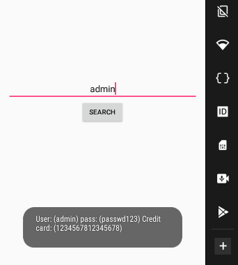  

**Probamos si hay inyección SQL:** Ahora introducimos una comilla simple:
```
,
```
  
donde:
- La app muestra un error. Esto es una señal de que la entrada se está insertando directamente en una consulta SQL.


**Probamos hacer una inyección SQL con el payload:**
```
' OR '1'='1
```
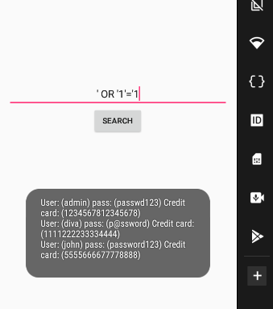  
donde:
- La app muestra los usuarios almacenados en la base de datos, porque la condición SQL queda siempre verdadera: Lla consulta vulnerable queda parecida a: `SELECT * FROM sqliuser WHERE user = '1' or '1'='1'`. Condición que siempre es verdadera, por lo que la consulta devuelve registros aunque no conozcamos un usuario válido.


**Vulnerabilidad:** SQL Injection.

**Mitigación:** Debemos usar consultas parametrizadas, por ejemplo `SQLiteDatabase.query()` con argumentos o `rawQuery()` con placeholders `?`, y validar la entrada del usuario.

## Reto 12

```
└─$ strings diva_apk/lib/x86/libdivajni.so
__cxa_finalize
__cxa_atexit
__stack_chk_fail
Java_jakhar_aseem_diva_DivaJni_access
Java_jakhar_aseem_diva_DivaJni_initiateLaunchSequence
strcpy
JNI_OnLoad
_edata
__bss_start
_end
libstdc++.so
libm.so
libc.so
libdl.so
libdivajni.so
d$0[
olsdfgad;lh
.dotdot
;*2$"
GCC: (GNU) 4.8
gold 1.11
.shstrtab
.dynsym
.dynstr
.hash
.rel.dyn
.rel.plt
.text
.rodata
.eh_frame
.eh_frame_hdr
.fini_array
.init_array
.dynamic
.got
.got.plt
.data
.bss
.comment
.note.gnu.gold-version
```
