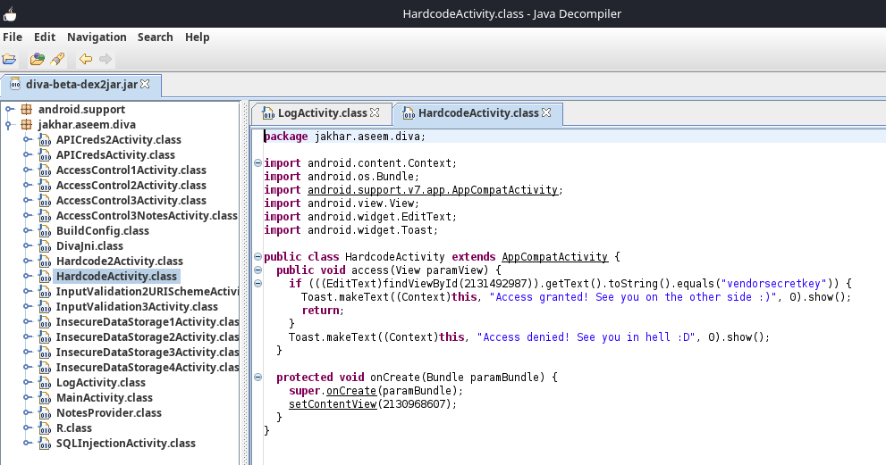
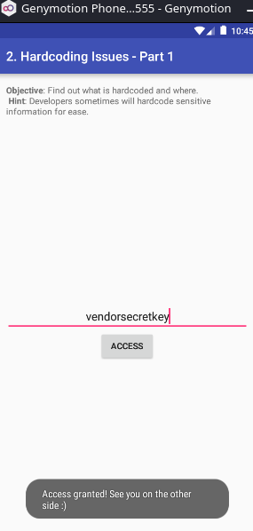
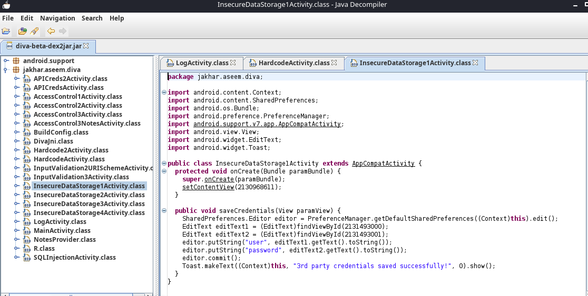
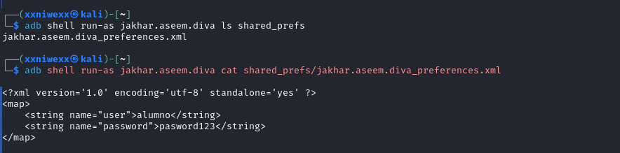
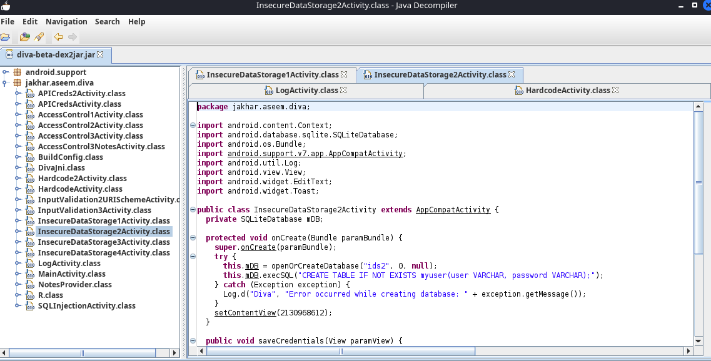
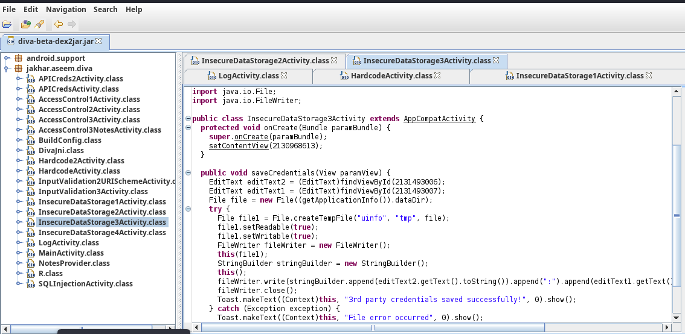
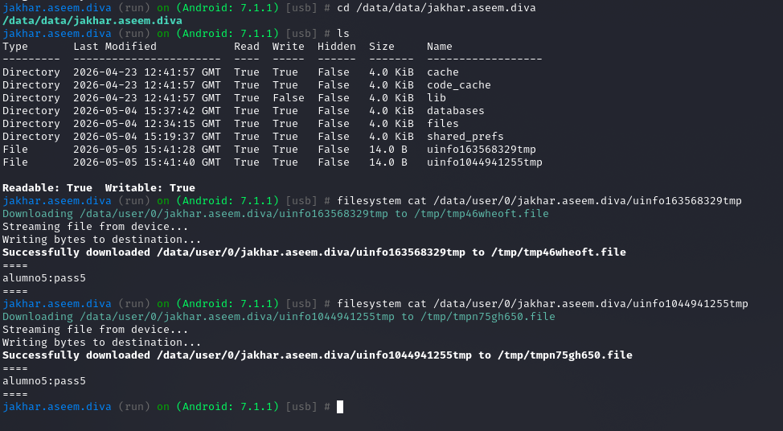
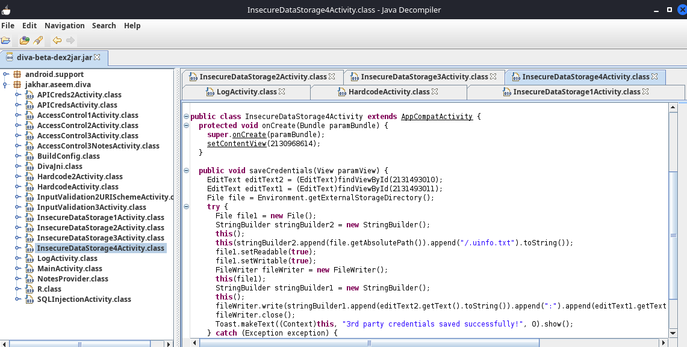
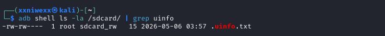
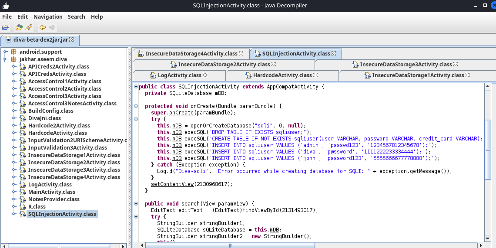

# **1. Entendiendo que pide el ejercicio**

En el siguiente enlace puedes acceder al ejercicio que tienes que realizar.

Contiene tanto los binarios para su análisis como una guía de su realización:

[Análisis de vulnerabilidades en aplicaciones Android (1) - Jaymon security](https://jaymonsecurity.com/analisis-vulnerabilidades-app-android/)

----

En este ejercicio vamos a identificar en el código Java decompilado dónde está cada vulnerabilidad de la app DIVA y documentarla. Los retos de la app DIVA ya han sido resueltos y explicados en el [Ejercicio 2: How to crack the challenges of DIVA](https://github.com/soniasalido/cybersecurity/blob/main/Documentation/Malware/Master-ENIIT-Analisis-Malware-Reversing/modulo-8-reversing-sistemas-operativos-moviles/2-M8T2-how-to-crack-the-challenges-of-DIVA/M8T2.md). Ahora trataremos de localizar las vulnerabilidades dentro del código Java decompilado y explicar por qué son vulnerables.

El objetivo de este análisis no es únicamente resolver los retos de DIVA, sino identificar en el código de la aplicación dónde se encuentra cada vulnerabilidad, explicar por qué el patrón de programación es inseguro y proponer una mitigación.


## **1.1 Descargamos APK de Diva**
Descargamos la app [DIVA](https://github.com/soniasalido/cybersecurity/blob/main/Documentation/Malware/Master-ENIIT-Analisis-Malware-Reversing/modulo-8-reversing-sistemas-operativos-moviles/3-M8T3-analisis-en-aplicaciones-android-I/apk/diva-beta.apk) y seguiremos los pasos de `jaymonsecurity` para extraer e instalar en el emulador.

Como ya tenemos la aplicación instalada en un dispositivo android 7 de las prácticas anteriores, nos saltamos el paso de la instalación.

## **1.2 Extraemos el código fuente de la app**
La guía usa la herramienta `dex2jar` para para convertir el APK de DIVA en un `.jar`.

**Instalamos esta herramienta:**
```
sudo apt install dex2jar
```

**Comprobamos que funciona:**
```
d2j-dex2jar -h
```


**Convertimos el APK:**
```
d2j-dex2jar -f diva-beta.apk
```


**Abrimos el resultado con JD-GUI:**
```
jd-gui diva-beta-dex2jar.jar
```


**Extraemos el `AndroidManifest.xml` de DIVA con `apktool`:**
```
apktool d diva-beta.apk
```


AndroidManifest.xml es clave para analizar vulnerabilidades como por ejemplo, Access Control o identificar Activities o Providers accesibles desde fuera de la app.

# **2. Análisis estático los retos**

## **2.1 Insecure Logging**

Vamos a demostrar dónde está el fallo en el código Java y por qué es vulnerable.

DIVA lista este reto como el primer challenge, `Insecure Logging`, y el código vulnerable está en `LogActivity.java`. En esa clase, el método `checkout()` lee el número introducido en el campo de tarjeta y, cuando se produce una excepción, lo escribe en el log con la etiqueta `diva-log`.

**Objetivo del reto:** El objetivo es identificar si la aplicación registra información sensible en los logs del sistema Android. En este caso, el dato sensible es el número de tarjeta de crédito introducido por el usuario. Como ya analizamos en la Práctica 2, la vulnerabilidad consiste en que ese dato acaba visible en `Logcat`, que es la herramienta de Android para mostrar mensajes del sistema y mensajes escritos por las apps mediante la clase `Log`.


**Localizamos la clase vulnerable:** Abrimos el `.jar` generado con `dex2jar` con la herramienta `jd-gui`:


**Buscamos dentro del paquete `jakhar.aseem.diva` la clase `LogActivity`:**
  


**Buscamos el método `checkout(View paramView)`:**
   
donde:
- En este método se encuentra la llamada vulnerable a `Log.e()` que registra el número de tarjeta introducido por el usuario.

**El código vulnerable:** El fallo está en el método:
```
checkout(View paramView)
```

La parte importante es:
```
EditText cctxt = (EditText) findViewById(R.id.ccText);

try {
    processCC(cctxt.getText().toString());
} catch (RuntimeException re) {
    Log.e("diva-log", "Error while processing transaction with credit card: " 
        + cctxt.getText().toString());

    Toast.makeText(this, "An error occured. Please try again later", 
        Toast.LENGTH_SHORT).show();
}
```

El repositorio oficial muestra que `checkout()` obtiene el texto del campo `ccText`, llama a `processCC()`, captura una `RuntimeException` y después registra el número de tarjeta con `Log.e("diva-log", ...)`.

**El fallo explicado:** El código:
```
Log.e("diva-log", "Error while processing transaction with credit card: " 
    + cctxt.getText().toString());
```
donde:
- La aplicación está concatenando directamente el valor introducido por el usuario: `cctxt.getText().toString()` con un mensaje de error que se envía a `Logcat`.

El patrón vulnerable es: `Dato sensible del usuario → concatenación en string → Log.e()`.

**Comprobamos en el dispositivo android:**

```
adb logcat
```


**Tabla resumen del reto 1:**
| Campo                  | Resultado                                                                             |
| ---------------------- | ------------------------------------------------------------------------------------- |
| Reto                   | Insecure Logging                                                                      |
| Clase vulnerable       | `LogActivity.java`                                                                    |
| Método vulnerable      | `checkout(View view)`                                                                 |
| Campo leído            | `R.id.ccText`                                                                         |
| Dato sensible expuesto | Número de tarjeta de crédito                                                          |
| API problemática       | `Log.e()`                                                                             |
| Etiqueta de log        | `diva-log`                                                                            |
| Tipo de fallo          | Exposición de información sensible en logs                                            |
| Causa raíz             | Se concatena la entrada del usuario en un mensaje de log                              |
| Fragmento vulnerable   | `Log.e("diva-log", "... credit card: " + cctxt.getText().toString())`                 |
| Cómo se comprueba      | Ejecutando `adb logcat -s diva-log` e introduciendo una tarjeta en la app             |
| Impacto                | Un atacante con acceso a logs podría leer información sensible                        |
| Mitigación             | No registrar datos sensibles. Eliminar logs en producción o enmascarar la información |


-----------------------------------------


## **2.2 Hardcoding Issues**
Aquí la vulnerabilidad consiste en que la aplicación contiene una clave escrita directamente en el código Java. Identificaremos una clave secreta hardcodeada dentro del código de la aplicación.

**Buscamos la clase `HardcodeActivity`:** Dentro del paquete `jakhar.aseem.diva`, vamos a localizar la clase `HardcodeActivity`, que implementa la lógica de este reto.
  


**Buscamos el método vulnerable `access(View view)`:** En el código oficial de DIVA, esta clase obtiene el texto introducido por el usuario desde el campo `hcKey` y lo compara directamente con una cadena fija. El código vulnerable:
```
public void access(View view) {
    EditText hckey = (EditText) findViewById(R.id.hcKey);

    if (hckey.getText().toString().equals("vendorsecretkey")) {
        Toast.makeText(this, "Access granted! See you on the other side :)", 
            Toast.LENGTH_SHORT).show();
    } else {
        Toast.makeText(this, "Access denied! See you in hell :D", 
            Toast.LENGTH_SHORT).show();
    }
}
```
donde:
- Se obtiene el texto introducido en el campo `hcKey`.
- Se convierte ese texto a String.
- Se compara con la cadena fija `vendorsecretkey`.
- Si coincide, muestra el mensaje de acceso concedido.

El fallo de seguridad es que la clave de acceso está almacenada dentro del propio APK. Aunque el usuario normal no la vea en la interfaz, cualquier persona que decompile la aplicación con herramientas como `dex2jar`, `JD-GUI` o `JADX` puede leerla.


**Comprobamos en el dispositivo android:**  


La causa de esta vulnerabilidad es confiar en un secreto almacenado en el cliente. En una aplicación real, este patrón permitiría extraer claves API, tokens, contraseñas internas o secretos de cifrado. La mitigación consiste en no guardar secretos dentro del APK y trasladar la validación a un servidor o a un mecanismo seguro que no exponga la clave en el código cliente.

**Tabla resumen del reto 2:**
| Campo             | Resultado                                             |
| ----------------- | ----------------------------------------------------- |
| Reto              | Hardcoding Issues - Part 1                            |
| Clase vulnerable  | `HardcodeActivity.java`                               |
| Método vulnerable | `access(View view)`                                   |
| Campo leído       | `R.id.hcKey`                                          |
| Secreto expuesto  | `vendorsecretkey`                                     |
| Tipo de fallo     | Secreto hardcodeado                                   |
| Causa raíz        | Clave escrita directamente en código Java             |
| Impacto           | Extracción del secreto mediante decompilación         |
| Mitigación        | No almacenar secretos en cliente. Validar en servidor |


## **2.3 Insecure Data Storage — Shared Preferences**

El objetivo es identificar dónde guarda la aplicación las credenciales introducidas por el usuario y comprobar si se almacenan de forma segura. En este caso, la app guarda:
```
Usuario
Contraseña
```
en un fichero XML de `SharedPreferences`.

Android explica que `SharedPreferences` se usa para guardar pares `clave-valor` en un fichero gestionado por el framework. Es decir, no es una base de datos ni un almacén seguro de credenciales por sí mismo.

**Dentro del paquete `jakhar.aseem.diva`, vamos a localizar la clase `InsecureDataStorage1Activity`, asociada a este reto:**


**El método vulnerable `saveCredentials(View paramView)`:** Este método obtiene el usuario y la contraseña desde dos campos de texto y los guarda directamente en `SharedPreferences` usando las claves `user` y `password`.
```
public void saveCredentials(View view) {
    SharedPreferences spref = PreferenceManager.getDefaultSharedPreferences(this);
    SharedPreferences.Editor spedit = spref.edit();

    EditText usr = (EditText) findViewById(R.id.ids1Usr);
    EditText pwd = (EditText) findViewById(R.id.ids1Pwd);

    spedit.putString("user", usr.getText().toString());
    spedit.putString("password", pwd.getText().toString());
    spedit.commit();

    Toast.makeText(this, "3rd party credentials saved successfully!", Toast.LENGTH_SHORT).show();
}
```
donde:
- `PreferenceManager.getDefaultSharedPreferences(this);`: Obtiene una referencia a las preferencias por defecto.
- Lee el usuario desde el campo: `R.id.ids1Usr`.
- Lee la contraseña desde el campo: `R.id.ids1Pwd`.
- `spedit.putString("user", usr.getText().toString());`: Guarda el nombre de usuario introducido en el campo de texto dentro de `SharedPreferences`, usando la clave `user`.
- `spedit.putString("password", pwd.getText().toString());`: Guarda la contraseña introducida por el usuario dentro de `SharedPreferences`, usando la clave `password`.
- Guarda los cambios con: `commit()`.


**Dónde se guarda realmente:** Al usar: `PreferenceManager.getDefaultSharedPreferences(this)`, android crea un fichero XML de preferencias asociado al paquete de la aplicación. En DIVA, normalmente estará en: `/data/data/jakhar.aseem.diva/shared_prefs/jakhar.aseem.diva_preferences.xml`.


**Comprobamos en el dispositivo android:**  
  

La causa raíz es utilizar SharedPreferences como almacén de información sensible sin cifrado. Aunque este mecanismo puede ser adecuado para preferencias simples de usuario, no debe utilizarse para guardar contraseñas o secretos. La mitigación consiste en no almacenar contraseñas en el cliente y, si es necesario persistir tokens u otra información sensible, protegerlos mediante mecanismos de almacenamiento cifrado y claves gestionadas de forma segura.

**Tabla resumen del reto 3:**
| Campo               | Resultado                                                        |
| ------------------- | ---------------------------------------------------------------- |
| Reto                | Insecure Data Storage - Part 1                                   |
| Clase vulnerable    | `InsecureDataStorage1Activity.java`                              |
| Método vulnerable   | `saveCredentials(View view)`                                     |
| Campos leídos       | `R.id.ids1Usr`, `R.id.ids1Pwd`                                   |
| API problemática    | `SharedPreferences`                                              |
| Método de escritura | `spedit.putString()`                                             |
| Claves usadas       | `"user"`, `"password"`                                           |
| Fichero generado    | `jakhar.aseem.diva_preferences.xml`                              |
| Ruta habitual       | `/data/data/jakhar.aseem.diva/shared_prefs/`                     |
| Tipo de fallo       | Almacenamiento inseguro de credenciales                          |
| Causa raíz          | Usuario y contraseña guardados en texto claro                    |
| Cómo se comprueba   | Leyendo el XML de `shared_prefs` con `adb shell`                 |
| Impacto             | Exposición de credenciales locales                               |
| Mitigación          | No guardar contraseñas. Usar almacenamiento cifrado/token seguro |


-----------------------------------------

## **2.4 Insecure Data Storage — Part 2**

El objetivo es identificar dónde guarda la aplicación las credenciales introducidas por el usuario y comprobar si se almacenan de forma segura. En este caso, la app guarda:
```
Usuario
Contraseña
```
dentro de una base de datos SQLite llamada: `ids2`.

La tabla usada se llama: `myuser`.

**Dentro del paquete `jakhar.aseem.diva`, localizamos la clase `InsecureDataStorage2Activity`, asociada a este reto:**


**Métodos relevantes:** En esta clase hay dos partes importantes:
- `onCreate(Bundle savedInstanceState)`: Donde aparece la creación de la base de datos SQLite:
  ```
  mDB = openOrCreateDatabase("ids2", MODE_PRIVATE, null);
  mDB.execSQL("CREATE TABLE IF NOT EXISTS myuser(user VARCHAR, password VARCHAR);");
  ```
- `saveCredentials(View paramView)`: Donde se inserta las credenciales introducidas por el usuario:
  ```
  EditText usr = (EditText) findViewById(R.id.ids2Usr);
  EditText pwd = (EditText) findViewById(R.id.ids2Pwd);

  mDB.execSQL("INSERT INTO myuser VALUES ('"
    + usr.getText().toString()
    + "', '"
    + pwd.getText().toString()
    + "');");
  ```

El código oficial de DIVA muestra que `InsecureDataStorage2Activity` crea la base de datos `ids2`, crea la tabla `myuser(user VARCHAR, password VARCHAR)` e inserta directamente el usuario y la contraseña mediante una sentencia `INSERT` construida por concatenación.

**La vulnerabilidad:** El problema principal es que las credenciales se guardan en texto claro dentro de una base de datos local. Además, hay un segundo problema de diseño: la sentencia SQL se construye concatenando directamente la entrada del usuario. En este reto el foco es el almacenamiento inseguro, pero ese patrón también es peligroso porque puede derivar en inyección SQL.

**Dónde se guarda la base de datos SQLite:**
- Se guarda en el directorio privado de la app: `/data/data/jakhar.aseem.diva/databases/`.
- El fichero de base de datos será normalmente: `/data/data/jakhar.aseem.diva/databases/ids2`.
- Dentro estará la tabla: `myuser`.
- Con columnas:
    - `user`.
    - `passwor`.


**Comprobamos en el dispositivo android:**  
  

La causa raíz es utilizar una base de datos local como almacén de credenciales sin aplicar cifrado ni protección adicional. Aunque el fichero se encuentre dentro del sandbox de la aplicación, un atacante con acceso al sistema de archivos, un dispositivo rooteado o un análisis forense podrían recuperar la base de datos y leer las credenciales. La mitigación consiste en no almacenar contraseñas en el cliente, usar tokens temporales cuando sea necesario y proteger cualquier dato sensible persistente mediante cifrado y claves gestionadas de forma segura.

**Tabla resumen del Reto 4:**
| Campo                | Resultado                                                                                      |
| -------------------- | ---------------------------------------------------------------------------------------------- |
| Reto                 | Insecure Data Storage - Part 2                                                                 |
| Clase vulnerable     | `InsecureDataStorage2Activity.java`                                                            |
| Métodos relevantes   | `onCreate()`, `saveCredentials(View view)`                                                     |
| Campos leídos        | `R.id.ids2Usr`, `R.id.ids2Pwd`                                                                 |
| API problemática     | SQLite / `openOrCreateDatabase()` / `execSQL()`                                                |
| Base de datos        | `ids2`                                                                                         |
| Tabla                | `myuser`                                                                                       |
| Columnas             | `user`, `password`                                                                             |
| Ruta habitual        | `/data/data/jakhar.aseem.diva/databases/ids2`                                                  |
| Tipo de fallo        | Almacenamiento inseguro de credenciales                                                        |
| Causa raíz           | Usuario y contraseña guardados en SQLite en texto claro                                        |
| Fragmento vulnerable | `INSERT INTO myuser VALUES ('" + user + "', '" + password + "');`                              |
| Cómo se comprueba    | Consultando la tabla `myuser` con `sqlite3`                                                    |
| Impacto              | Exposición de credenciales locales                                                             |
| Mitigación           | No guardar contraseñas. Cifrar datos sensibles. Usar tokens seguros y consultas parametrizadas |


-----------------------------------------

## **2.5 Insecure Data Storage — Part 3**

El objetivo es identificar que la aplicación almacena credenciales en un fichero temporal local sin aplicar cifrado ni protección adecuada. En este caso, la app guarda: 
```
Usuario
Contraseña
```
dentro de un fichero temporal cuyo nombre empieza por: `uinfo` y termina en: `tmp`.

Dentro del paquete `jakhar.aseem.diva`, se localiza la clase `InsecureDataStorage3Activity`, asociada a este reto:



**El método vulnerable:** En esta clase `insecureDataStotage3Activity`, el método `saveCredentials()` obtiene el usuario y la contraseña desde los campos `ids3Usr` e `ids3Pwd`, crea un fichero temporal en el directorio de datos de la aplicación y escribe las credenciales en texto claro.
```
public void saveCredentials(View view) {
    EditText usr = (EditText) findViewById(R.id.ids3Usr);
    EditText pwd = (EditText) findViewById(R.id.ids3Pwd);

    File ddir = new File(getApplicationInfo().dataDir);

    try {
        File uinfo = File.createTempFile("uinfo", "tmp", ddir);
        uinfo.setReadable(true);
        uinfo.setWritable(true);

        FileWriter fw = new FileWriter(uinfo);
        fw.write(usr.getText().toString() + ":" + pwd.getText().toString() + "\n");
        fw.close();

        Toast.makeText(this, "3rd party credentials saved successfully!", Toast.LENGTH_SHORT).show();
    } catch (Exception e) {
        Toast.makeText(this, "File error occurred", Toast.LENGTH_SHORT).show();
        Log.d("Diva", "File error: " + e.getMessage());
    }
}
```
donde:
- `File ddir = new File(getApplicationInfo().dataDir);`: Esta línea obtiene el directorio privado de datos de la aplicación y lo representa como un objeto `File`, para poder crear o manejar ficheros dentro de esa ubicación.
- `File uinfo = File.createTempFile("uinfo", "tmp", ddir);`: Esta línea crea un fichero temporal dentro del directorio privado de la aplicación, con un nombre que empieza por `uinfo` y termina en `tmp`.
- `fw.write(usr.getText().toString() + ":" + pwd.getText().toString() + "\n");`: Esta línea escribe el usuario y la contraseña en texto claro dentro del fichero temporal, separados por dos puntos.

El problema principal es que se están almacenando credenciales en un fichero local sin cifrado. Aunque el fichero esté dentro del directorio privado de la aplicación, sigue siendo una mala práctica guardar secretos en claro.


**Dónde se guarda realmente:** El fichero se crea dentro del directorio privado de la aplicación: `/data/data/jakhar.aseem.diva/`. Como se usa: `File.createTempFile("uinfo", "tmp", ddir);`, el nombre del fichero será aleatorio, pero tendrá una forma parecida a: `uinfo123456789tmp`. Por tanto, para localizarlo, hay que buscar ficheros que empiecen por: `uinfo`.


**Comprobamos en el dispositivo android:**  
  

La causa raíz es usar un fichero temporal como almacén de credenciales sin cifrado ni eliminación segura posterior. Aunque el fichero se cree dentro del directorio privado de la aplicación, en un dispositivo rooteado, en un análisis forense o en un entorno comprometido, el contenido podría recuperarse. La mitigación consiste en no almacenar contraseñas en disco, evitar persistir secretos innecesarios y utilizar mecanismos de almacenamiento cifrado cuando sea imprescindible guardar información sensible.

**Tabla resumen del Reto 5:**
| Campo                 | Resultado                                                                                                 |
| --------------------- | --------------------------------------------------------------------------------------------------------- |
| Reto                  | Insecure Data Storage - Part 3                                                                            |
| Clase vulnerable      | `InsecureDataStorage3Activity.java`                                                                       |
| Método vulnerable     | `saveCredentials(View view)`                                                                              |
| Campos leídos         | `R.id.ids3Usr`, `R.id.ids3Pwd`                                                                            |
| API problemática      | `File.createTempFile()`, `FileWriter`                                                                     |
| Directorio usado      | `getApplicationInfo().dataDir`                                                                            |
| Ruta habitual         | `/data/data/jakhar.aseem.diva/`                                                                           |
| Nombre del fichero    | `uinfo*tmp`                                                                                               |
| Formato del contenido | `usuario:contraseña`                                                                                      |
| Tipo de fallo         | Almacenamiento inseguro de credenciales                                                                   |
| Causa raíz            | Usuario y contraseña escritos en texto claro en un fichero temporal                                       |
| Fragmento vulnerable  | `fw.write(usr.getText().toString() + ":" + pwd.getText().toString() + "\n")`                              |
| Cómo se comprueba     | Leyendo el fichero `uinfo*tmp` desde `/data/data/jakhar.aseem.diva/`                                      |
| Impacto               | Exposición de credenciales locales                                                                        |
| Mitigación            | No guardar contraseñas. Evitar ficheros temporales con datos sensibles. Usar cifrado si es imprescindible |


-----------------------------------------

## **2.6 Insecure Data Storage — Part 4**

El objetivo es identificar que la aplicación almacena credenciales en un fichero situado fuera del directorio privado interno de la app. En este caso, la app guarda:
```
Usuario
Contraseña
````
en un fichero ubicado en el almacenamiento externo del dispositivo.

**Dentro del paquete `jakhar.aseem.diva`, localizamos la clase `InsecureDataStorage4Activity`, asociada a este reto:**


**El método vulnerable `saveCredentials(View paramView)`:** El método `saveCredentials(View paramView)` obtiene el usuario y la contraseña desde los campos `ids4Usr` e `ids4Pwd`, localiza el almacenamiento externo mediante `Environment.getExternalStorageDirectory()` y escribe las credenciales en el fichero `.uinfo.txt`.
```
public void saveCredentials(View view) {
    EditText usr = (EditText) findViewById(R.id.ids4Usr);
    EditText pwd = (EditText) findViewById(R.id.ids4Pwd);

    File sdir = Environment.getExternalStorageDirectory();

    try {
        File uinfo = new File(sdir.getAbsolutePath() + "/.uinfo.txt");
        uinfo.setReadable(true);
        uinfo.setWritable(true);

        FileWriter fw = new FileWriter(uinfo);
        fw.write(usr.getText().toString() + ":" + pwd.getText().toString() + "\n");
        fw.close();

        Toast.makeText(this, "3rd party credentials saved successfully!", Toast.LENGTH_SHORT).show();
    } catch (Exception e) {
        Toast.makeText(this, "File error occurred", Toast.LENGTH_SHORT).show();
        Log.d("Diva", "File error: " + e.getMessage());
    }
}
```
donde:
- `File sdir = Environment.getExternalStorageDirectory();`: Esta línea obtiene el directorio del almacenamiento externo del dispositivo para poder guardar archivos en esa ubicación.
- `File uinfo = new File(sdir.getAbsolutePath() + "/.uinfo.txt");`: Esta línea crea una referencia al fichero `.uinfo.txt` dentro del almacenamiento externo del dispositivo. El punto inicial del nombre: `.uinfo.txt`, hace que el fichero sea “oculto” en sistemas tipo Unix/Linux, pero no lo protege.
- `fw.write(usr.getText().toString() + ":" + pwd.getText().toString() + "\n");`: Esta línea escribe el usuario y la contraseña en texto claro dentro del fichero, separados por dos puntos.


El fallo principal es que la app guarda credenciales sensibles en un fichero externo sin cifrado. Android recomienda usar almacenamiento interno para datos que no deban ser accesibles por otras apps, y distingue entre almacenamiento interno, almacenamiento externo específico de app y almacenamiento compartido.

**Dónde se guarda realmente:** En un emulador o dispositivo Android, el almacenamiento externo suele estar montado en la: `/sdcard/`, o `/storage/emulated/0/`. En nuestro caso el fichero está en: `/sdcard/.uinfo.txt`.


**Comprobamos en el dispositivo android:**  
  

  

La causa raíz es usar almacenamiento externo para guardar información sensible sin cifrado. Aunque el fichero tenga un nombre oculto, esto no proporciona seguridad. En un dispositivo comprometido, rooteado, en un entorno de análisis o en versiones antiguas de Android con permisos de almacenamiento más amplios, el contenido podría ser leído por terceros. La mitigación consiste en no almacenar contraseñas en el dispositivo y, si es imprescindible persistir información sensible, utilizar almacenamiento interno cifrado y claves gestionadas mediante Android Keystore.

**Tabla resumen del Reto 6:**
| Campo                 | Resultado                                                                                                   |
| --------------------- | ----------------------------------------------------------------------------------------------------------- |
| Reto                  | Insecure Data Storage - Part 4                                                                              |
| Clase vulnerable      | `InsecureDataStorage4Activity.java`                                                                         |
| Método vulnerable     | `saveCredentials(View view)`                                                                                |
| Campos leídos         | `R.id.ids4Usr`, `R.id.ids4Pwd`                                                                              |
| API problemática      | `Environment.getExternalStorageDirectory()`, `FileWriter`                                                   |
| Directorio usado      | Almacenamiento externo                                                                                      |
| Ruta habitual         | `/sdcard/.uinfo.txt` o `/storage/emulated/0/.uinfo.txt`                                                     |
| Nombre del fichero    | `.uinfo.txt`                                                                                                |
| Formato del contenido | `usuario:contraseña`                                                                                        |
| Tipo de fallo         | Almacenamiento inseguro de credenciales                                                                     |
| Causa raíz            | Usuario y contraseña escritos en texto claro en almacenamiento externo                                      |
| Fragmento vulnerable  | `fw.write(usr.getText().toString() + ":" + pwd.getText().toString() + "\n")`                                |
| Cómo se comprueba     | Leyendo `/sdcard/.uinfo.txt` con `adb shell`                                                                |
| Impacto               | Exposición de credenciales a través del almacenamiento externo                                              |
| Mitigación            | No guardar credenciales en almacenamiento externo. Usar almacenamiento interno cifrado si es imprescindible |


-----------------------------------------

## **2.7 Input Validation Issues — Part 1**

El objetivo es identificar una falta de validación de entrada que permite modificar la consulta SQL ejecutada por la aplicación. En este caso, la app tiene una base de datos SQLite local con una tabla llamada: `sqliuser`, que contiene:
```
usuario
contraseña
tarjeta de crédito
```
El reto consiste en conseguir que la consulta devuelva más información de la que debería.

**Dentro del paquete `jakhar.aseem.diva`, vamos a localizar la clase `SQLInjectionActivity`, asociada a este reto:**



**Métodos relevantes:** En esta clase hay dos métodos importantes:
- `onCreate(Bundle savedInstanceState)`: Crea la base de datos y carga usuarios de prueba.
  ```
  mDB = openOrCreateDatabase("sqli", MODE_PRIVATE, null);
  mDB.execSQL("DROP TABLE IF EXISTS sqliuser;");
  mDB.execSQL("CREATE TABLE IF NOT EXISTS sqliuser(user VARCHAR, password VARCHAR, credit_card VARCHAR);");

  mDB.execSQL("INSERT INTO sqliuser VALUES ('admin', 'passwd123', '1234567812345678');");
  mDB.execSQL("INSERT INTO sqliuser VALUES ('diva', 'p@ssword', '1111222233334444');");
  mDB.execSQL("INSERT INTO sqliuser VALUES ('john', 'password123', '5555666677778888');");
  ```
- `search(View view)`: Recoge la entrada del usuario y ejecuta la consulta vulnerable. En el código oficial, `onCreate()` crea la base `sqli`, la tabla `sqliuser` y añade usuarios como `admin`, `diva` y `john`. Después, `search()` ejecuta una consulta con `rawQuery()` que concatena la entrada del campo `ivi1search`.
  ```
  EditText srchtxt = (EditText) findViewById(R.id.ivi1search);

  cr = mDB.rawQuery(
    "SELECT * FROM sqliuser WHERE user = '" 
    + srchtxt.getText().toString() 
    + "'", 
    null
  );
  ```

**El código problemático es:**
```
"SELECT * FROM sqliuser WHERE user = '" + srchtxt.getText().toString() + "'"
```


Como el texto se concatena directamente dentro de la consulta SQL, el usuario puede introducir una cadena que altere la lógica del `WHERE`, como por ejemplo:
```
' OR '1'='1
```

La consulta resultante sería:
```
SELECT * FROM sqliuser WHERE user = '' OR '1'='1'
```

Como '1'='1' siempre es verdadero, la consulta devuelve todos los registros.


**Comprobamos en el dispositivo android:**  
 

La causa raíz es tratar la entrada del usuario como parte de la sentencia SQL. Esto permite introducir payloads como
```
' OR '1'='1
```
consiguiendo que la condición del `WHERE` sea siempre verdadera y que la consulta devuelva todos los registros de la tabla, incluyendo usuarios, contraseñas y tarjetas de crédito. La mitigación consiste en usar consultas parametrizadas mediante `?` y pasar los valores del usuario como argumentos separados, evitando que sean interpretados como código SQL.


**Tabla resumen del Reto 7:**
| Campo                | Resultado                                                                      |
| -------------------- | ------------------------------------------------------------------------------ |
| Reto                 | Input Validation Issues - Part 1                                               |
| Clase vulnerable     | `SQLInjectionActivity.java`                                                    |
| Métodos relevantes   | `onCreate()`, `search(View view)`                                              |
| Campo leído          | `R.id.ivi1search`                                                              |
| API problemática     | `SQLiteDatabase.rawQuery()`                                                    |
| Base de datos        | `sqli`                                                                         |
| Tabla                | `sqliuser`                                                                     |
| Columnas             | `user`, `password`, `credit_card`                                              |
| Tipo de fallo        | SQL Injection                                                                  |
| Causa raíz           | Concatenación directa de entrada del usuario en una consulta SQL               |
| Fragmento vulnerable | `"SELECT * FROM sqliuser WHERE user = '" + srchtxt.getText().toString() + "'"` |
| Payload de prueba    | `' OR '1'='1`                                                                  |
| Resultado            | Se muestran todos los registros de la tabla                                    |
| Impacto              | Exposición de usuarios, contraseñas y tarjetas de crédito                      |
| Mitigación           | Usar consultas parametrizadas con `?` y argumentos separados                   |


-----------------------------------------

## **2.8 Input Validation Issues — Part 2**


-----------------------------------------

## **2.9: Access Control Issues — Part 1**


-----------------------------------------

## **2.10 Access Control Issues — Part 2**


-----------------------------------------


## **2.11 Access Control Issues — Part 3**


-----------------------------------------

## **2.12 Hardcoding Issues — Part 2**


## **2.13 Input Validation Issues — Part 3**
