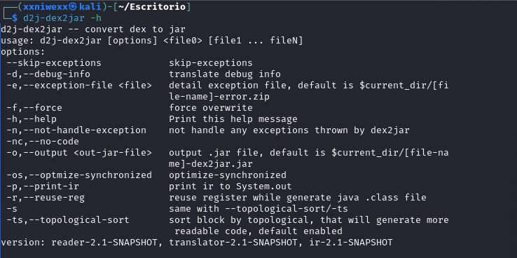
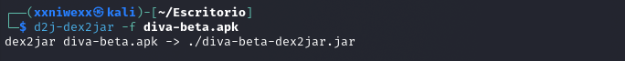
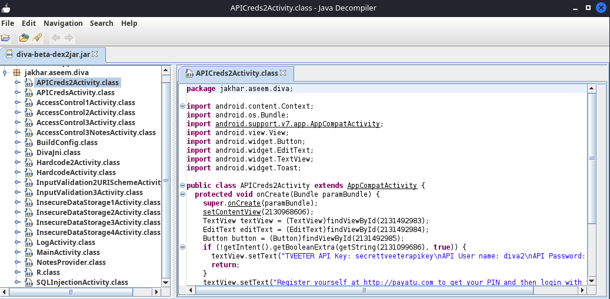
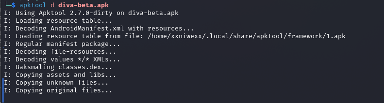
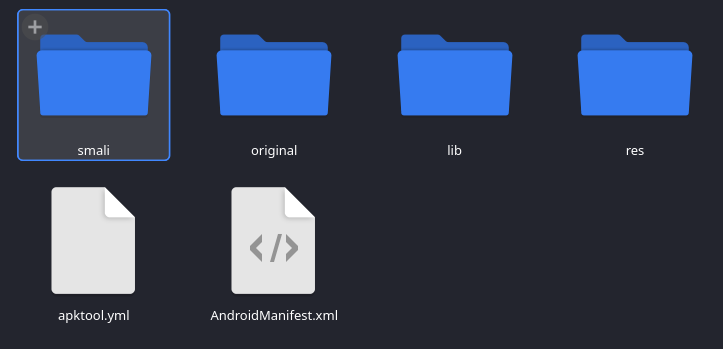
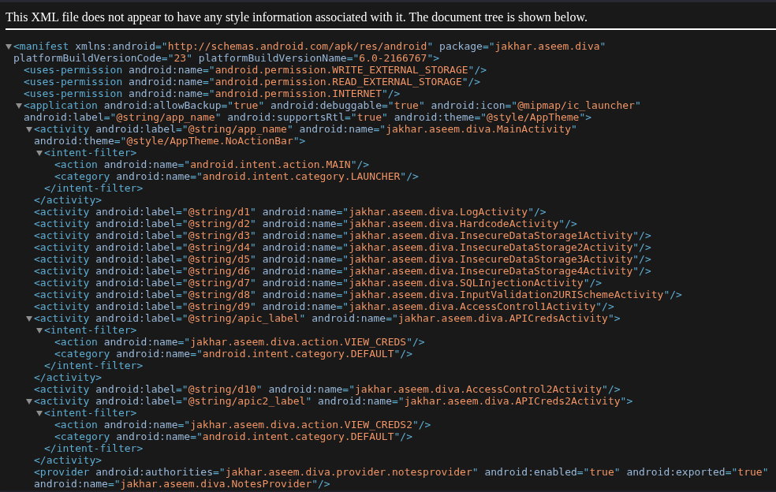
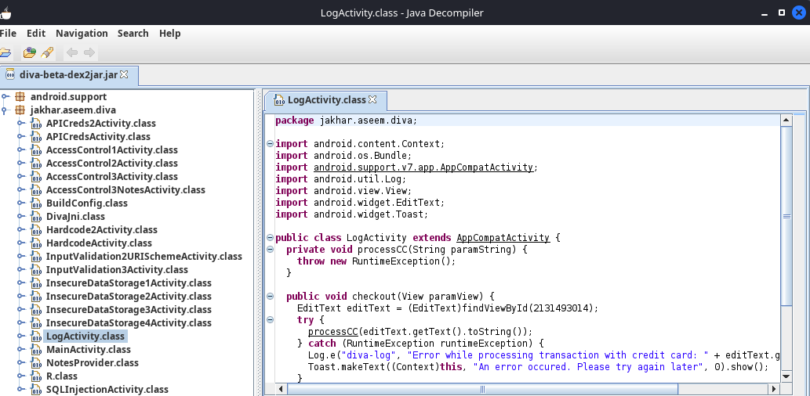
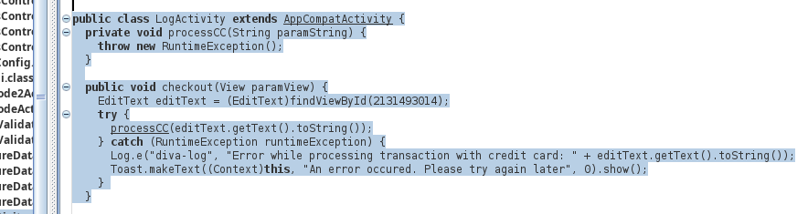
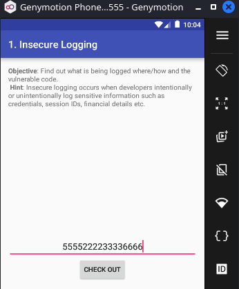

# **1. Entendiendo que pide el ejercicio**

En el siguiente enlace puedes acceder al ejercicio que tienes que realizar.

Contiene tanto los binarios para su análisis como una guía de su realización:

[Análisis de vulnerabilidades en aplicaciones Android (1) - Jaymon security](https://jaymonsecurity.com/analisis-vulnerabilidades-app-android/)

----

En este ejercicio vamos a identificar en el código Java decompilado dónde está cada vulnerabilidad de la app DIVA y documentarla. Los retos de la app DIVA ya han sido resueltos y explicados en el [Ejercicio 2: How to crack the challenges of DIVA](https://github.com/soniasalido/cybersecurity/blob/main/Documentation/Malware/Master-ENIIT-Analisis-Malware-Reversing/modulo-8-reversing-sistemas-operativos-moviles/2-M8T2-how-to-crack-the-challenges-of-DIVA/M8T2.md). Ahora trataremos de localizar las vulnerabilidades dentro del código Java decompilado y explicar por qué son vulnerables.

El objetivo de este análisis no es únicamente resolver los retos de DIVA, sino identificar en el código de la aplicación dónde se encuentra cada vulnerabilidad, explicar por qué el patrón de programación es inseguro y proponer una mitigación.


## **1.1 Descargamos APK de Diva**
Descargamos la app [DIVA](https://github.com/soniasalido/cybersecurity/blob/main/Documentation/Malware/Master-ENIIT-Analisis-Malware-Reversing/modulo-8-reversing-sistemas-operativos-moviles/3-M8T3-analisis-en-aplicaciones-android-I/apk/diva-beta.apk) y seguiremos los pasos de `jaymonsecurity` para extraer e instalar en el emulador.

Como ya tenemos la aplicación instalada en un dispositivo android 7 de las prácticas anteriores, nos saltamos el paso de la instalación.

## **1.2 Extraemos el código fuente de la app**
La guía usa la herramienta `dex2jar` para para convertir el APK de DIVA en un `.jar`.

**Instalamos esta herramienta:**
```
sudo apt install dex2jar
```

**Comprobamos que funciona:**
```
d2j-dex2jar -h
```



**Convertimos el APK:**
```
d2j-dex2jar -f diva-beta.apk
```


**Abrimos el resultado con JD-GUI:**
```
jd-gui diva-beta-dex2jar.jar
```



**Extraemos el `AndroidManifest.xml` de DIVA con `apktool`:**
```
apktool d diva-beta.apk
```






AndroidManifest.xml es clave para analizar vulnerabilidades como por ejemplo, Access Control o identificar Activities o Providers accesibles desde fuera de la app.

# **2. Análisis estático los retos**

## **2.1 Insecure Logging**

Vamos a demostrar dónde está el fallo en el código Java y por qué es vulnerable.

DIVA lista este reto como el primer challenge, `Insecure Logging`, y el código vulnerable está en `LogActivity.java`. En esa clase, el método `checkout()` lee el número introducido en el campo de tarjeta y, cuando se produce una excepción, lo escribe en el log con la etiqueta `diva-log`.

**Objetivo del reto:** El objetivo es identificar si la aplicación registra información sensible en los logs del sistema Android. En este caso, el dato sensible es el número de tarjeta de crédito introducido por el usuario. Como ya analizamos en la Práctica 2, la vulnerabilidad consiste en que ese dato acaba visible en `Logcat`, que es la herramienta de Android para mostrar mensajes del sistema y mensajes escritos por las apps mediante la clase `Log`.


**Localizamos la clase vulnerable:** Abrimos el `.jar` generado con `dex2jar` con la herramienta `jd-gui`:


**Buscamos dentro del paquete `jakhar.aseem.diva` la clase `LogActivity`:**
  


**Buscamos el método `checkout(View paramView)`:**
   
donde:
- En este método se encuentra la llamada vulnerable a `Log.e()` que registra el número de tarjeta introducido por el usuario.

**El código vulnerable:** El fallo está en el método:
```
checkout(View paramView)
```

La parte importante es:
```
EditText cctxt = (EditText) findViewById(R.id.ccText);

try {
    processCC(cctxt.getText().toString());
} catch (RuntimeException re) {
    Log.e("diva-log", "Error while processing transaction with credit card: " 
        + cctxt.getText().toString());

    Toast.makeText(this, "An error occured. Please try again later", 
        Toast.LENGTH_SHORT).show();
}
```

El repositorio oficial muestra que `checkout()` obtiene el texto del campo `ccText`, llama a `processCC()`, captura una `RuntimeException` y después registra el número de tarjeta con `Log.e("diva-log", ...)`.

**El fallo explicado:** El código:
```
Log.e("diva-log", "Error while processing transaction with credit card: " 
    + cctxt.getText().toString());
```
donde:
- La aplicación está concatenando directamente el valor introducido por el usuario: `cctxt.getText().toString()` con un mensaje de error que se envía a `Logcat`.

El patrón vulnerable es: `Dato sensible del usuario → concatenación en string → Log.e()`.

**Comprobamos en el dispositivo android:**

```
adb logcat
```



-----------------------------------------
Nombre de la vulnerabilidad:
Clase / fichero afectado:
Fragmento o patrón vulnerable:
Explicación del fallo:
Impacto:
Cómo se comprueba:
Mitigación recomendada:

## **2.2 Hardcoding Issues**


## **2.3 Insecure Data Storage — Shared Preferences**


## **2.4 Insecure Data Storage — Part 2**


## **2.5 Insecure Data Storage — Part 3**


## **2.6 Insecure Data Storage — Part 4**


## **2.7 Input Validation Issues — Part 1**


## **2.8 Input Validation Issues — Part 2**


## **2.9: Access Control Issues — Part 1**


## **2.10 Access Control Issues — Part 2**

## **2.11 Access Control Issues — Part 3**


## **2.12 Hardcoding Issues — Part 2**


## **2.13 Input Validation Issues — Part 3**
