<div class="page"/>

<br>
<br>
<br>

- [**1. Entendiendo que pide el ejercicio**](#1-entendiendo-que-pide-el-ejercicio)
- [**2. Preparación del entorno y obtención del APK**](#2-preparación-del-entorno-y-obtención-del-apk)
- [**Ya podemos hacer login sin hacer bypass**](#ya-podemos-hacer-login-sin-hacer-bypass)
- [**Bypass por Activities exportadas:**](#bypass-por-activities-exportadas)
- [**Probamos el backdoor devadmin**](#probamos-el-backdoor-devadmin)
- [**Capturamos el tráfico en claro**](#capturamos-el-tráfico-en-claro)
- [**Revisamos almacenamiento local**](#revisamos-almacenamiento-local)
- [**Probamos el ContentProvider exportado**](#probamos-el-contentprovider-exportado)
- [**Instalación de Mara Framework**](#instalación-de-mara-framework)
- [**Primer análisis de la app con Mara**](#primer-análisis-de-la-app-con-mara)
  - [**Improper Platform Usage**](#improper-platform-usage)
  - [**Insecure Data Storage**](#insecure-data-storage)
  - [**Insecure Communication**](#insecure-communication)
  - [**Insufficient Cryptography**](#insufficient-cryptography)
  - [**Hardcoded sensitive information**](#hardcoded-sensitive-information)
  - [**Insecure application permissions**](#insecure-application-permissions)
  - [**Private IP Disclosure**](#private-ip-disclosure)
  - [**Cuidado con la lista de dominios**](#cuidado-con-la-lista-de-dominios)
  - [**Buscamos en los resultados generados por MARA**](#buscamos-en-los-resultados-generados-por-mara)
- [**Análisis de los ficheros decompilados**](#análisis-de-los-ficheros-decompilados)
  - [**BuildConfig.java.jadx**](#buildconfigjavajadx)
  - [**CryptoClass.java.jadx**](#cryptoclassjavajadx)
    - [**Encontramos una clave criptográfica hardcodeada**](#encontramos-una-clave-criptográfica-hardcodeada)
    - [**IV estático en AES-CBC**](#iv-estático-en-aes-cbc)
    - [**Uso de AES/CBC/PKCS5Padding sin protección de integridad**](#uso-de-aescbcpkcs5padding-sin-protección-de-integridad)
  - [**DoLogin.java.jadx**](#dologinjavajadx)
    - [**Comunicaciones HTTP en claro para login**](#comunicaciones-http-en-claro-para-login)
    - [**Endpoint de desarrollo /devlogin activado por usuario devadmin**](#endpoint-de-desarrollo-devlogin-activado-por-usuario-devadmin)
    - [**Almacenamiento local de credenciales en SharedPreferences**](#almacenamiento-local-de-credenciales-en-sharedpreferences)
    - [**Logging de credenciales**](#logging-de-credenciales)
    - [**Registro de usuarios en ContentProvider**](#registro-de-usuarios-en-contentprovider)
    - [**Flujo de navegación inseguro y frágil**](#flujo-de-navegación-inseguro-y-frágil)
  - [**ChangePassword.java.jadx**](#changepasswordjavajadx)
      - [**Cambio de contraseña por HTTP en claro**](#cambio-de-contraseña-por-http-en-claro)
    - [**Cambio de contraseña basado solo en username y newpassword**](#cambio-de-contraseña-basado-solo-en-username-y-newpassword)
    - [**Validación de complejidad solo en cliente**](#validación-de-complejidad-solo-en-cliente)
    - [**Envío de nueva contraseña por Broadcast implícito**](#envío-de-nueva-contraseña-por-broadcast-implícito)
    - [**Lectura y logging del número de teléfono**](#lectura-y-logging-del-número-de-teléfono)
  - [**DoTransfer.java.jadx**](#dotransferjavajadx)
    - [**Hallazgo F-16 — Transferencias por HTTP en claro**](#hallazgo-f-16--transferencias-por-http-en-claro)
    - [**Hallazgo F-17 — Reutilización de credenciales almacenadas para operar transferencias**](#hallazgo-f-17--reutilización-de-credenciales-almacenadas-para-operar-transferencias)
    - [**Hallazgo F-18 — Parámetros de transferencia controlados desde UI sin validación local robusta**](#hallazgo-f-18--parámetros-de-transferencia-controlados-desde-ui-sin-validación-local-robusta)
    - [**Hallazgo F-19 — Escritura de extractos en almacenamiento externo**](#hallazgo-f-19--escritura-de-extractos-en-almacenamiento-externo)
    - [**Hallazgo F-20 — Logging de datos financieros**](#hallazgo-f-20--logging-de-datos-financieros)
    - [**Hallazgo F-21 — Validación de éxito basada en substring**](#hallazgo-f-21--validación-de-éxito-basada-en-substring)
  - [**FilePrefActivity.java.jadx**](#fileprefactivityjavajadx)
    - [**Hallazgo F-22 — Configuración manual del servidor sin protección**](#hallazgo-f-22--configuración-manual-del-servidor-sin-protección)
    - [**Hallazgo F-23 — Validación insuficiente del endpoint**](#hallazgo-f-23--validación-insuficiente-del-endpoint)
    - [**Hallazgo F-24 — Activity de configuración potencialmente abusiva si está exportada**](#hallazgo-f-24--activity-de-configuración-potencialmente-abusiva-si-está-exportada)
  - [**LoginActivity.java.jadx**](#loginactivityjavajadx)
    - [**Hallazgo F-25 — Función de autocompletado recupera credenciales en claro**](#hallazgo-f-25--función-de-autocompletado-recupera-credenciales-en-claro)
    - [**Hallazgo F-26 — Credenciales transmitidas entre Activities mediante extras**](#hallazgo-f-26--credenciales-transmitidas-entre-activities-mediante-extras)
    - [**Hallazgo F-27 — Flujo de login dependiente del cliente**](#hallazgo-f-27--flujo-de-login-dependiente-del-cliente)
  - [**MyBroadCastReceiver.java.jadx**](#mybroadcastreceiverjavajadx)
      - [**Hallazgo F-28 — Receiver acepta datos sensibles desde Intent extras**](#hallazgo-f-28--receiver-acepta-datos-sensibles-desde-intent-extras)
    - [**Hallazgo F-29 — Uso de MODE\_WORLD\_READABLE en SharedPreferences**](#hallazgo-f-29--uso-de-mode_world_readable-en-sharedpreferences)
    - [**allazgo F-30 — Descifrado de contraseña almacenada dentro del receiver**](#allazgo-f-30--descifrado-de-contraseña-almacenada-dentro-del-receiver)
    - [**Hallazgo F-31 — Envío de contraseña antigua y nueva por SMS**](#hallazgo-f-31--envío-de-contraseña-antigua-y-nueva-por-sms)
    - [**Hallazgo F-32 — Logging de contraseñas y número de teléfono**](#hallazgo-f-32--logging-de-contraseñas-y-número-de-teléfono)
    - [**Hallazgo F-33 — Manejo inseguro de errores**](#hallazgo-f-33--manejo-inseguro-de-errores)
- [**Resumen de hallazgos**](#resumen-de-hallazgos)


# **1. Entendiendo que pide el ejercicio**

Tenemos que hacer un análisis estático de la app: [Android-InsecureBankv2](https://github.com/dineshshetty/Android-InsecureBankv2), que es una app Android deliberadamente vulnerable usada para practicar análisis estático/dinámico. Tomaremos como base el post de [jaymonsecurity: Vulnerability Analysis in Android Applications (2)](https://jaymonsecurity.com/analisis-vulnerabilidades-app-android2/), que se centra en bypass de login por actividades exportadas, análisis con MobSF/Genymotion y tráfico HTTP sin cifrar.


# **2. Preparación del entorno y obtención del APK**
**Clonamos el repositorio:**
```
git clone https://github.com/dineshshetty/Android-InsecureBankv2.git
cd Android-InsecureBankv2
cd AndroLabServer
python2 -m pip install -r requirements.txt
```

**Obtenemos un error:**  
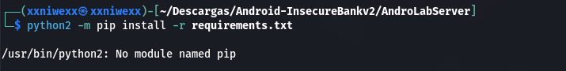
donde:
- El problema es normal en Kali moderno que usamos actualmente. Tenemos python2, pero no `pip` para Python 2. El backend de `InsecureBankv2` es antiguo y su README pide instalar `flask`, `sqlalchemy`, `simplejsonp`, `web.py` y `cherrypy`, ya sea con `easy_install` o con `pip install -r requirements.txt`.


**Verificamos version de `pip`:**
```
└─$ python2 -m pip --version
pip 20.3.4 from /home/xxniwexx/.local/lib/python2.7/site-packages/pip (python 2.7)
                                                                                                                                                      

└─$ python2 - << 'EOF'
heredoc> import setuptools
print(setuptools.__version__)
EOF
44.1.1
```

**Instalamos `virtualenv` legacy:**
```
└─$ python2 -m pip install --user 'virtualenv==16.7.12'
DEPRECATION: Python 2.7 reached the end of its life on January 1st, 2020. Please upgrade your Python as Python 2.7 is no longer maintained. pip 21.0 will drop support for Python 2.7 in January 2021. More details about Python 2 support in pip can be found at https://pip.pypa.io/en/latest/development/release-process/#python-2-support pip 21.0 will remove support for this functionality.
Collecting virtualenv==16.7.12
  Downloading virtualenv-16.7.12-py2.py3-none-any.whl (7.2 MB)
     |████████████████████████████████| 7.2 MB 2.6 MB/s 
Installing collected packages: virtualenv
Successfully installed virtualenv-16.7.12
```

**Añadimos el path de binarios de usuario:**
```
└─$ export PATH="$HOME/.local/bin:$PATH"
```

**Comprobamos:**
```
└─$ virtualenv --version
16.7.12
```

**Creamos el entorno virtual con Python 2 y lo activamos:**
```
└─$ virtualenv -p /usr/bin/python2 venv-py2
Already using interpreter /usr/bin/python2
New python executable in /home/xxniwexx/Descargas/Android-InsecureBankv2/AndroLabServer/venv-py2/bin/python2
Also creating executable in /home/xxniwexx/Descargas/Android-InsecureBankv2/AndroLabServer/venv-py2/bin/python
Installing setuptools<=44.1.1, pip<=20.3.4, wheel...
done.
                                                                                                                                                      

└─$ source venv-py2/bin/activate
         
```

**Verificamos que estamos dentro del entorno:**
```
└─$ which python
/home/xxniwexx/Descargas/Android-InsecureBankv2/AndroLabServer/venv-py2/bin/python
                                                                                                                                                      

└─$ python --version
Python 2.7.18
                                                                                                                                                      

└─$ which pip
/home/xxniwexx/Descargas/Android-InsecureBankv2/AndroLabServer/venv-py2/bin/pip
                                                                                                                                                      

└─$ pip --version
pip 20.3.4 from /home/xxniwexx/Descargas/Android-InsecureBankv2/AndroLabServer/venv-py2/local/lib/python2.7/site-packages/pip (python 2.7)
       
```

**Actualizamos las herramientas dentro del venv:**
```
└─$ pip install --upgrade 'pip==20.3.4' 'setuptools==44.1.1' 'wheel==0.37.1'
DEPRECATION: Python 2.7 reached the end of its life on January 1st, 2020. Please upgrade your Python as Python 2.7 is no longer maintained. pip 21.0 will drop support for Python 2.7 in January 2021. More details about Python 2 support in pip can be found at https://pip.pypa.io/en/latest/development/release-process/#python-2-support pip 21.0 will remove support for this functionality.
Requirement already up-to-date: pip==20.3.4 in ./venv-py2/lib/python2.7/site-packages (20.3.4)
Requirement already up-to-date: setuptools==44.1.1 in ./venv-py2/lib/python2.7/site-packages (44.1.1)
Requirement already up-to-date: wheel==0.37.1 in ./venv-py2/lib/python2.7/site-packages (0.37.1)
```

**Instalamos dependencias del servidor:**
```
└─$ pip install \
  'Werkzeug==1.0.1' \
  'Jinja2==2.11.3' \
  'MarkupSafe==1.1.1' \
  'itsdangerous==1.1.0' \
  'click==7.1.2' \
  'Flask==0.12.5' \
  'SQLAlchemy==1.3.24' \
  'simplejson==3.17.6' \
  'CherryPy==3.2.6' \
  'web.py==0.39'
DEPRECATION: Python 2.7 reached the end of its life on January 1st, 2020. Please upgrade your Python as Python 2.7 is no longer maintained. pip 21.0 will drop support for Python 2.7 in January 2021. More details about Python 2 support in pip can be found at https://pip.pypa.io/en/latest/development/release-process/#python-2-support pip 21.0 will remove support for this functionality.
Collecting Werkzeug==1.0.1
  Downloading Werkzeug-1.0.1-py2.py3-none-any.whl (298 kB)
     |████████████████████████████████| 298 kB 2.7 MB/s 
Collecting Jinja2==2.11.3
....
....
```

**Verificamos los imports:**
```
└─$ python - << 'EOF'
import flask
import werkzeug
import sqlalchemy
import simplejson
import cherrypy
import web

print("Flask:", flask.__version__)
print("Werkzeug:", werkzeug.__version__)
print("SQLAlchemy:", sqlalchemy.__version__)
print("OK dependencias cargadas")
EOF
('Flask:', '0.12.5')
('Werkzeug:', '1.0.1')
('SQLAlchemy:', '1.3.24')
OK dependencias cargadas
```


**Corregimos Werkzeug dentro del mismo entorno:** Tenemos `Werkzeug: 1.0.1` y para `Flask 0.12.5`, parece que debemos dejarlo en `Werkzeug==0.16.1`.
``` 
└─$ python -m pip uninstall -y Werkzeug
DEPRECATION: Python 2.7 reached the end of its life on January 1st, 2020. Please upgrade your Python as Python 2.7 is no longer maintained. pip 21.0 will drop support for Python 2.7 in January 2021. More details about Python 2 support in pip can be found at https://pip.pypa.io/en/latest/development/release-process/#python-2-support pip 21.0 will remove support for this functionality.
Found existing installation: Werkzeug 1.0.1
Uninstalling Werkzeug-1.0.1:
  Successfully uninstalled Werkzeug-1.0.1
                                                                                                                                                      

└─$ python -m pip install 'Werkzeug==0.16.1'
DEPRECATION: Python 2.7 reached the end of its life on January 1st, 2020. Please upgrade your Python as Python 2.7 is no longer maintained. pip 21.0 will drop support for Python 2.7 in January 2021. More details about Python 2 support in pip can be found at https://pip.pypa.io/en/latest/development/release-process/#python-2-support pip 21.0 will remove support for this functionality.
Collecting Werkzeug==0.16.1
  Downloading Werkzeug-0.16.1-py2.py3-none-any.whl (327 kB)
     |████████████████████████████████| 327 kB 2.9 MB/s 
Installing collected packages: Werkzeug
Successfully installed Werkzeug-0.16.1
```


**Arrancamos el servidor:**
```
┌──(venv-py2)─(xxniwexx㉿xxniwexx)-[~/Descargas/Android-InsecureBankv2/AndroLabServer]
└─$ python app.py
Traceback (most recent call last):
  File "app.py", line 6, in <module>
    from cheroot import wsgi # This replaces the 2 above
ImportError: No module named cheroot
```
donde:
- El servidor ya está entrando en `app.py`. Pero ahora el bloqueo es que falta una dependencia: `cheroot`. Eso no venía en el documento `requirements.txt`, así que hay que añadirla al `venv`.


**Instalamos la version correcta de `cheroot`:**
```
└─$ python -m pip install 'cheroot==6.5.8' 'more-itertools==5.0.0'
DEPRECATION: Python 2.7 reached the end of its life on January 1st, 2020. Please upgrade your Python as Python 2.7 is no longer maintained. pip 21.0 will drop support for Python 2.7 in January 2021. More details about Python 2 support in pip can be found at https://pip.pypa.io/en/latest/development/release-process/#python-2-support pip 21.0 will remove support for this functionality.
Collecting cheroot==6.5.8
  Downloading cheroot-6.5.8-py2.py3-none-any.whl (76 kB)
     |████████████████████████████████| 76 kB 2.8 MB/s 
Collecting more-itertools==5.0.0
  Downloading more_itertools-5.0.0-py2-none-any.whl (52 kB)
     |████████████████████████████████| 52 kB 1.9 MB/s 
Collecting backports.functools-lru-cache
  Downloading backports.functools_lru_cache-1.6.6-py2.py3-none-any.whl (5.9 kB)
Collecting six>=1.11.0
  Using cached six-1.17.0-py2.py3-none-any.whl (11 kB)
Installing collected packages: backports.functools-lru-cache, six, more-itertools, cheroot
Successfully installed backports.functools-lru-cache-1.6.6 cheroot-6.5.8 more-itertools-5.0.0 six-1.17.0
``` 


**Volvemos a arrancar el servidor:**
```
└─$ python app.py
The server is hosted on port: 8888
```
donde:
- No cerramos esta terminal para que el servidor se mantenga activo.


**Probamos el backend desde otra terminal en el host Kali:**
```
└─$ curl -i http://127.0.0.1:8888/
HTTP/1.1 404 NOT FOUND
Content-Type: text/html
Content-Length: 232
Date: Fri, 08 May 2026 10:58:12 GMT
Server: localhost

<!DOCTYPE HTML PUBLIC "-//W3C//DTD HTML 3.2 Final//EN">
<title>404 Not Found</title>
<h1>Not Found</h1>
<p>The requested URL was not found on the server. If you entered the URL manually please check your spelling and try again.</p>

```
donde:
- Obtenemos un `404 NOT FOUND` en `/`, que signigica que el servidor sí está levantado, pero `app.py` no tiene una ruta definida para la raíz `/`.


**Probamos rutas reales del backend:** Probamos `/login`:
```
└─$ curl -i -X POST http://127.0.0.1:8888/login \
  -d 'username=dinesh&password=Dinesh@123$'
HTTP/1.1 200 OK
Content-Type: text/html; charset=utf-8
Content-Length: 52
Date: Fri, 08 May 2026 11:00:36 GMT
Server: localhost

{"message": "Correct Credentials", "user": "dinesh"}                                                                                                          
``` 
donde:
- Ya hemos conseguido que el backend funcione y vemos que las credenciales son válidas.


Resumiendo: El backend escucha por defecto en el puerto `8888`. El propio repositorio indica que el servidor es Python2 y que se arranca con python app.py.


**Instalamos la APK:**
```
└─$ cd ~/Descargas/Android-InsecureBankv2
                                                                                                                                                      

└─$ adb devices                          
List of devices attached
127.0.0.1:6555	device

                                                                                                                                                      
└─$ adb install InsecureBankv2.apk       
Performing Streamed Install
Success

```


**Accedemos en la app:** Abrimos `InsecureBankv2` en el dispositivo con los siguientes credenciales de prueba:
``` 
dinesh / Dinesh@123$
jack   / Jack@123$
```
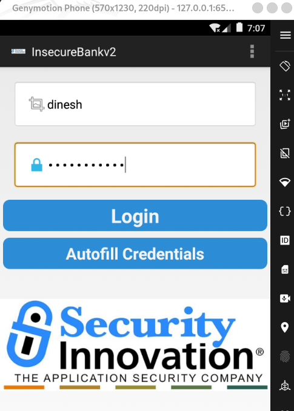


**Comprobamos que el servidor autenticó correctamente:**
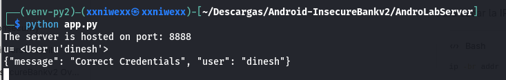


**Configuramos la app para apuntar al backend:**  Tenemos que poner estos valores:
```
Android Studio Emulator:
Server IP: 10.0.2.2
Server Port: 8888

```
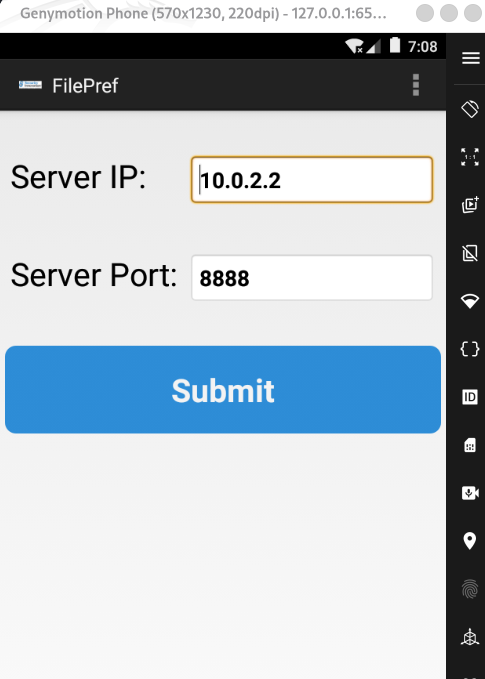


**<mark>Cuando pulsamos el botón de Submit, se produce un error, la app se cierra y vuelve al login:</mark>**
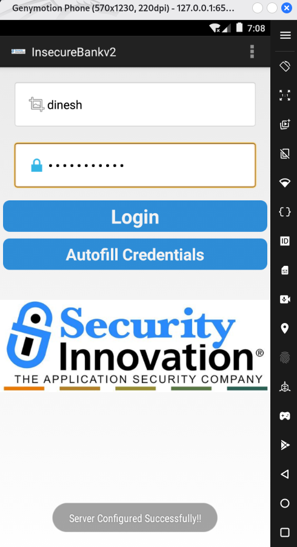


**Analizamos con logcat porqué se sale al inicio y no entra en la app :**
```
└─$ adb logcat -c
                                                                                                                                                      

└─$ adb logcat | grep -iE "insecurebank|DoLogin|PostLogin|AndroidRuntime|FATAL|ActivityTaskManager|Background"
05-08 07:19:19.708   616  1147 I ActivityManager: START u0 {cmp=com.android.insecurebankv2/.DoLogin (has extras)} from uid 10067 on display 0
05-08 07:19:19.723  1876  1992 W System.err: 	at com.android.insecurebankv2.DoLogin$RequestTask.postData(DoLogin.java:134)
05-08 07:19:19.723  1876  1992 W System.err: 	at com.android.insecurebankv2.DoLogin$RequestTask.doInBackground(DoLogin.java:95)
05-08 07:19:19.723  1876  1992 W System.err: 	at com.android.insecurebankv2.DoLogin$RequestTask.doInBackground(DoLogin.java:90)
```
donde:
- Se confirma que el servidor responde bien, pero la app lanza una excepción dentro de `DoLogin.postData()` y por eso nunca llega a abrir `PostLogin`.


**Buscamos el tipo de excepción que se genera:** Limpiamos los logs de `logcat`, pulsamos en el diposotivo android el botón de `Login` y después ejecutamos el siguiente comando:
```
└─$ adb logcat -c                                             
                                                                                                                                                      

└─$ adb logcat -d -v time | grep -B 8 -A 12 "DoLogin.java:134"
05-08 07:28:18.795 W/System.err( 1876): org.apache.http.conn.HttpHostConnectException: Connection to http://127.0.0.1:1337 refused
05-08 07:28:18.795 W/System.err( 1876): 	at org.apache.http.impl.conn.DefaultClientConnectionOperator.openConnection(DefaultClientConnectionOperator.java:193)
....
....
```
donde:
- Observamos `Connection to http://127.0.0.1:1337 refused`.
- La app Android no está conectando a el servidor en `8888`. Está intentando conectar a: `127.0.0.1:1337`.


**Corregimos esto:**
```
└─$ adb devices
adb reverse --list
List of devices attached
127.0.0.1:6555	device

0.0.0.015021 tcp:1337 tcp:8888

                                                                                                                                                      
└─$ adb -s 127.0.0.1:6555 reverse --remove-all
                                                                                                                                                      

└─$ adb -s 127.0.0.1:6555 reverse tcp:1337 tcp:8888
                                                                                                                                                      

└─$ adb -s 127.0.0.1:6555 reverse --list
0.0.0.015021 tcp:1337 tcp:8888

                                                                                                                                                      

└─$ adb -s 127.0.0.1:6555 shell am start -a android.intent.action.VIEW -d http://127.0.0.1:1337/
Starting: Intent { act=android.intent.action.VIEW dat=http://127.0.0.1:1337/... }
 
```
donde:
- Abre en el dispositivo una web , lo que significa que Genymotion sí está llegando al backend por: `http://127.0.0.1:1337/`.
- ADB lo está redirigiendo correctamente a: `http://127.0.0.1:8888/`.


**Dejamos el reverse activo:**
```
└─$ adb -s 127.0.0.1:6555 reverse --list
0.0.0.015021 tcp:1337 tcp:8888
```


**Configuramos la app para usar el reverse:** En `InsecureBankv2` → `Preferences`, ponemos:
```
Server IP:   127.0.0.1
Server Port: 1337
```
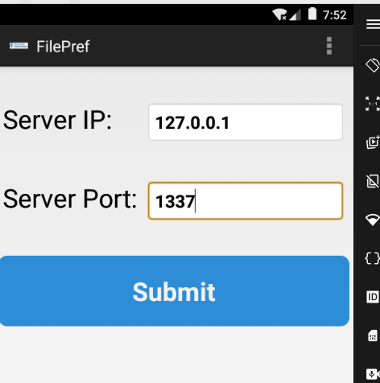


# **Ya podemos hacer login sin hacer bypass**

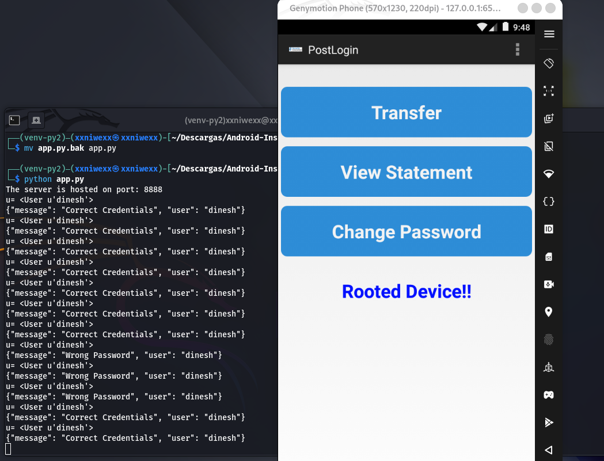

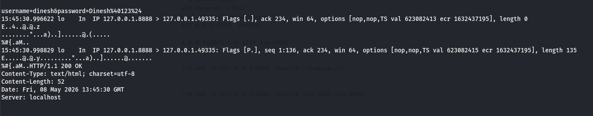


# **Bypass por Activities exportadas:**
```
└─$ adb -s 127.0.0.1:6555 shell am start \
  -n com.android.insecurebankv2/.PostLogin \
  --es uname dinesh
Starting: Intent { cmp=com.android.insecurebankv2/.PostLogin (has extras) }
       
```
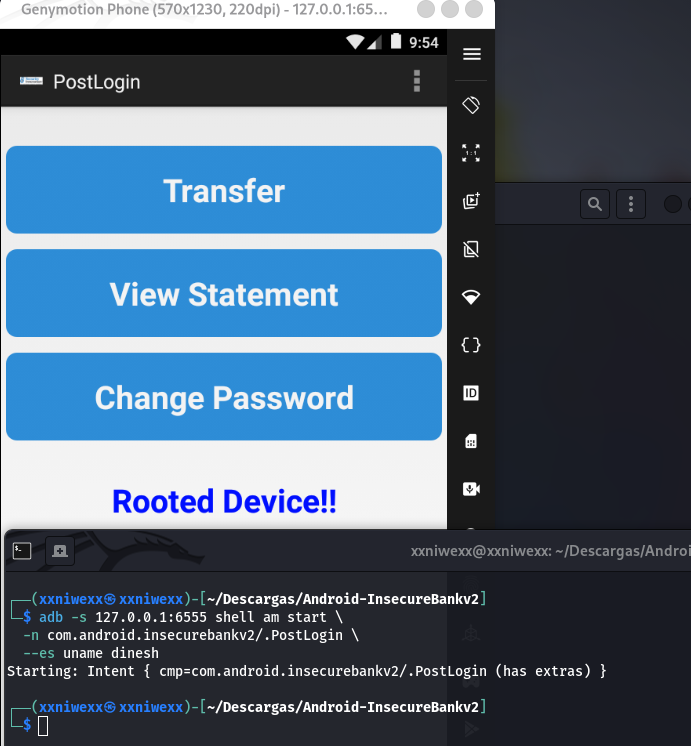  
donde:
- Vemos que xxxxx.


Despues:
```
└─$ adb -s 127.0.0.1:6555 shell am start \
  -n com.android.insecurebankv2/.DoTransfer \
  --es uname dinesh
Starting: Intent { cmp=com.android.insecurebankv2/.DoTransfer (has extras) }
```
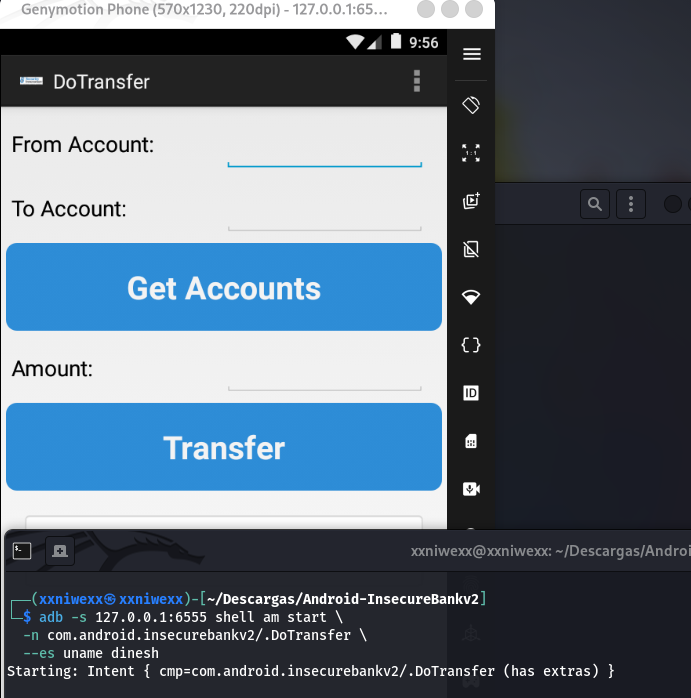  
donde:
- Vemos que xxxxx.


Otro:
```
└─$ adb -s 127.0.0.1:6555 shell am start \
  -n com.android.insecurebankv2/.ViewStatement \
  --es uname dinesh

Starting: Intent { cmp=com.android.insecurebankv2/.ViewStatement (has extras) }
```
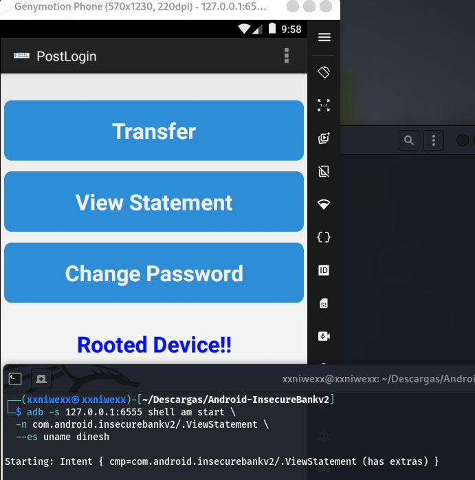   
donde:
- Vemos que xxxxx.


Otro:
```
└─$ adb -s 127.0.0.1:6555 shell am start \
  -n com.android.insecurebankv2/.ChangePassword \
  --es uname dinesh
Starting: Intent { cmp=com.android.insecurebankv2/.ChangePassword (has extras) }
```
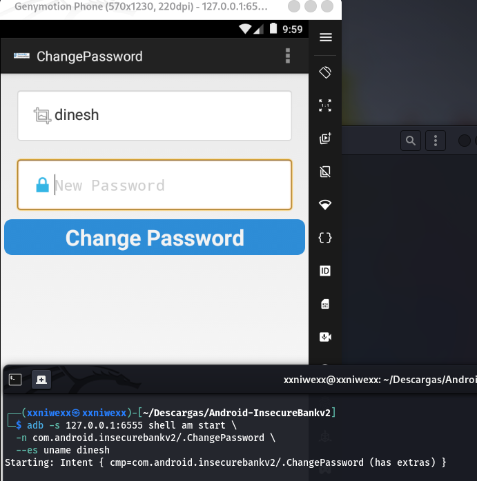   
donde:
- Vemos que xxxxx.


Comprobamos que podemos abrir las Activities desde consola.

Vulnerabilidad: Activities exportadas indebidamente.

Impacto: acceso a pantallas internas sin pasar por autenticación.

Evidencia: adb shell am start permite abrir PostLogin, DoTransfer, ViewStatement y ChangePassword.

Mitigación: android:exported="false" y validación de sesión/autorización en cada componente.


# **Probamos el backdoor devadmin**

**Por adb:**
```
└─$ adb -s 127.0.0.1:6555 shell am start \
  -n com.android.insecurebankv2/.DoLogin \
  --es passed_username devadmin \
  --es passed_password test
Starting: Intent { cmp=com.android.insecurebankv2/.DoLogin (has extras) }
```
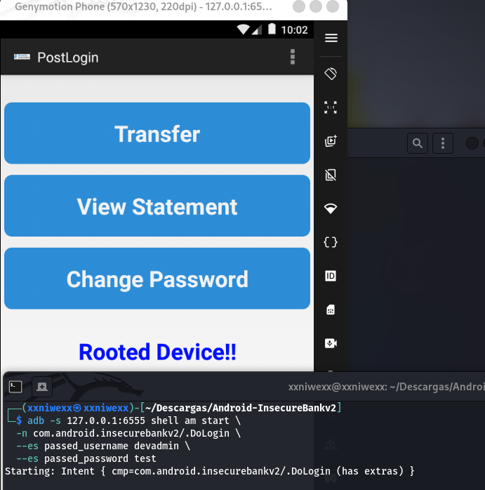  
donde:
- Ese usuario activa /devlogin, que es un endpoint inseguro de desarrollo.


# **Capturamos el tráfico en claro**
```
└─$ sudo tcpdump -i any -nn -A 'tcp port 8888'
tcpdump: WARNING: any: That device doesn't support promiscuous mode
(Promiscuous mode not supported on the "any" device)
tcpdump: verbose output suppressed, use -v[v]... for full protocol decode
listening on any, link-type LINUX_SLL2 (Linux cooked v2), snapshot length 262144 bytes
16:04:20.772349 lo    In  IP 127.0.0.1.45393 > 127.0.0.1.8888: Flags [S], seq 4110116392, win 65495, options [mss 65495,sackOK,TS val 3497590203 ecr 0,nop,wscale 10], length 0
E..<.>@.@..{.........Q"...f(.........0.........
.x.........

16:04:20.772360 lo    In  IP 127.0.0.1.8888 > 127.0.0.1.45393: Flags [S.], seq 740344880, ack 4110116393, win 65483, options [mss 65495,sackOK,TS val 3191979559 ecr 3497590203,nop,wscale 10], length 0
E..<..@.@.<........."..Q, .0..f).....0.........
.A.'.x.....

16:04:20.772369 lo    In  IP 127.0.0.1.45393 > 127.0.0.1.8888: Flags [.], ack 1, win 64, options [nop,nop,TS val 3497590203 ecr 3191979559], length 0
E..4.?@.@............Q"...f), .1...@.(.....
.x...A.'
16:04:20.773764 lo    In  IP 127.0.0.1.45393 > 127.0.0.1.8888: Flags [P.], seq 1:234, ack 1, win 64, options [nop,nop,TS val 3497590204 ecr 3191979559], length 233
E....@@.@............Q"...f), .1...@.......
.x...A.'POST /login HTTP/1.1
Content-Length: 40
Content-Type: application/x-www-form-urlencoded
Host: 127.0.0.1:1337
Connection: Keep-Alive
User-Agent: Apache-HttpClient/UNAVAILABLE (java 1.4)

username=dinesh&password=Dinesh%40123%24
16:04:20.773774 lo    In  IP 127.0.0.1.8888 > 127.0.0.1.45393: Flags [.], ack 234, win 64, options [nop,nop,TS val 3191979560 ecr 3497590204], length 0
E..4>J@.@..w........"..Q, .1..g....@.(.....
.A.(.x..
16:04:20.775334 lo    In  IP 127.0.0.1.8888 > 127.0.0.1.45393: Flags [P.], seq 1:136, ack 234, win 64, options [nop,nop,TS val 3191979562 ecr 3497590204], length 135
E...>K@.@..........."..Q, .1..g....@.......
.A.*.x..HTTP/1.1 200 OK
Content-Type: text/html; charset=utf-8
Content-Length: 52
Date: Fri, 08 May 2026 14:04:20 GMT
Server: localhost
....
....
```
donde:
- Vemos los credenciales en claro: `username=dinesh&password=Dinesh%40123%24`.


Vulnerabilidad: comunicación HTTP sin cifrado

Impacto: exposición de credenciales y datos financieros ante MITM

Mitigación: HTTPS/TLS obligatorio, bloqueo de cleartext traffic, validación de certificados


# **Revisamos almacenamiento local**

Después de hacer login:
```
└─$ adb -s 127.0.0.1:6555 shell run-as com.android.insecurebankv2 ls
app_textures
app_webview
cache
code_cache
databases
shared_prefs
                                                                                                                                                      

└─$ adb -s 127.0.0.1:6555 shell run-as com.android.insecurebankv2 ls shared_prefs
WebViewChromiumPrefs.xml
com.android.insecurebankv2_preferences.xml
mySharedPreferences.xml
                                                                                                                                                      

└─$ adb -s 127.0.0.1:6555 shell run-as com.android.insecurebankv2 cat shared_prefs/mySharedPreferences.xml
<?xml version='1.0' encoding='utf-8' standalone='yes' ?>
<map>
    <string name="EncryptedUsername">ZGluZXNo&#13;&#10;    </string>
    <string name="superSecurePassword">DTrW2VXjSoFdg0e61fHxJg==&#10;    </string>
</map>
```
donde:
- Obtenemos una evidencia clara de almacenamiento inseguro de credenciales.

El fichero contiene:
```
<string name="EncryptedUsername">ZGluZXNo</string>
<string name="superSecurePassword">DTrW2VXjSoFdg0e61fHxJg==</string>
```

Los caracteres:
```
&#13;&#10;
&#10;
```
Son saltos de línea/retornos de carro serializados en XML. Para analizar los valores, usaremos el contenido limpio.


**Decodificar el usuario:**
```
└─$ echo 'ZGluZXNo' | base64 -d
dinesh
```
donde:
- Demostramos que `EncryptedUsername` no está cifrado, sólo está codificado en Base64.


**Descifrar la contraseña:** En el código fuente, la app usa una clave hardcodeada en `CryptoClass.java:`
```
This is the super secret key 123
```
y `AES/CBC/PKCS5Padding` con IV estático. Puodemos descifralo con python:
```
python3 - << 'EOF'
from base64 import b64decode
from cryptography.hazmat.primitives.ciphers import Cipher, algorithms, modes
from cryptography.hazmat.primitives import padding

key = b"This is the super secret key 123"
iv = b"\x00" * 16
ciphertext = b64decode("DTrW2VXjSoFdg0e61fHxJg==")

cipher = Cipher(algorithms.AES(key), modes.CBC(iv))
decryptor = cipher.decryptor()
padded_plaintext = decryptor.update(ciphertext) + decryptor.finalize()

unpadder = padding.PKCS7(128).unpadder()
plaintext = unpadder.update(padded_plaintext) + unpadder.finalize()

print(plaintext.decode())
EOF
``` 
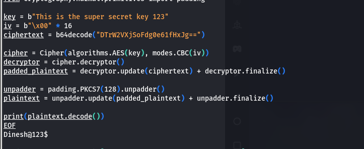  


```
Hallazgo: Almacenamiento inseguro de credenciales en SharedPreferences

Evidencia:
El archivo /data/data/com.android.insecurebankv2/shared_prefs/mySharedPreferences.xml contiene:
- EncryptedUsername = ZGluZXNo
- superSecurePassword = DTrW2VXjSoFdg0e61fHxJg==

El valor EncryptedUsername se decodifica directamente con Base64 y revela el usuario dinesh.
El valor superSecurePassword puede descifrarse porque la app contiene una clave AES hardcodeada en CryptoClass.java:
"This is the super secret key 123".

Impacto:
Un atacante con acceso al dispositivo, backup, root, run-as en build debuggable o extracción de datos locales puede recuperar usuario y contraseña en claro.

Mitigación:
No almacenar contraseñas reutilizables en el cliente. Usar tokens de sesión de vida corta, Android Keystore, EncryptedSharedPreferences y claves no hardcodeadas. Además, evitar IVs estáticos y no usar Base64 como mecanismo de protección.
``` 

-------

# **Probamos el ContentProvider exportado**

```
└─$ adb -s 127.0.0.1:6555 shell content query \
  --uri content://com.android.insecurebankv2.TrackUserContentProvider/trackerusers
Row: 0 id=10, name=devadmin
Row: 1 id=1, name=dinesh
Row: 2 id=2, name=dinesh
Row: 3 id=3, name=dinesh
Row: 4 id=4, name=dinesh
Row: 5 id=5, name=dinesh
Row: 6 id=6, name=dinesh
Row: 7 id=7, name=dinesh
Row: 8 id=8, name=dinesh
Row: 9 id=9, name=dinesh
Row: 10 id=11, name=dinesh
```

```
Vulnerabilidad: ContentProvider exportado sin permisos
Impacto: lectura de datos internos por apps externas
Mitigación: android:exported="false", permisos read/write y control de autorización
```


---- 

# **Instalación de Mara Framework**

**Instalamos Docker en Kali:**
```
└─$ sudo apt update

└─$ sudo apt install -y docker.io

└─$ sudo systemctl enable docker --now
```

**Configuramos para usar docker sin sudo:**
```
└─$ sudo usermod -aG docker $USER
                                                                                                                      

└─$ newgrp docker
```

**Descargamos la imagen de MARA:**
```
└─$ docker pull xyphex/mara-framework
```

**Creamos una carpeta para los APK:**
```
└─$ mkdir -p ~/Escritorio/Mara-Framework/apps

└─$ cp ~/Escritorio/diva-beta.apk ~/Escritorio/Mara-Framework/apps
```

**Arrancamos el contenedor para usar Mara Framework:**
```
└─$ docker run -it --rm \
  -v ~/Escritorio/Mara-Framework/apps:/apps \
  --name mara-framework \
  xyphex/mara-framework

```

# **Primer análisis de la app con Mara**
**Ya dentro del contenedor:**
```
root@1bbbb94acba8:/opt/MARA_Framework# ./mara.sh -s /apps/InsecureBankv2.apk 
 
===========================================================================
___  ___  ___  ______  ___  
|  \/  | / _ \ | ___ \/ _ \ 
| .  . |/ /_\ \| |_/ / /_\ \
| |\/| ||  _  ||    /|  _  |
| |  | || | | || |\ \| | | |
\_|  |_/\_| |_/\_| \_\_| |_/
                            
                            
______                                           _    
|  ___|                                         | |   
| |_ _ __ __ _ _ __ ___   _____      _____  _ __| | __
|  _| '__/ _` | '_ ` _ \ / _ \ \ /\ / / _ \| '__| |/ /
| | | | | (_| | | | | | |  __/\ V  V / (_) | |  |   < 
\_| |_|  \__,_|_| |_| |_|\___| \_/\_/ \___/|_|  |_|\_\
                                                      
                                                      
[M]obile [A]pplication [R]everse Engineering & [A]nalysis Framework

version: 0.2.2 beta
Developed by: Christian Kisutsa and Chrispus Kamau
URL: https://github.com/xtiankisutsa/MARA_Framework

==========================================================================
 
==============
 APK analysis 
==============
[+] Initializing...
[+] Setting up playground...
[+] Assembling minions...
[+] Preparing InsecureBankv2.apk
[INFO] - Done 
 
=====================
 Reverse Engineering 
=====================
[+] Disassembling Dalvik bytecode to smali bytecode
[+] Disassembling Dalvik bytecode to java bytecode
[+] Decompiling InsecureBankv2.apk to java source code
[+] Decoding Manifest file and resources
[+] Deobfuscate InsecureBankv2.apk? (yes/no)
    [NOTE] Deobfuscating InsecureBankv2.apk may take upto 10 minutes. This will run in the background!!
    [NOTE] No maximum file size limit...
yes
[INFO] - Done 
 
==============================
 Performing Manifest Analysis 
==============================
[+] Extracting activities
[+] Extracting exported activties
[+] Extract receivers
[+] Extracting exported receivers
[+] Extracting services
[+] Extracting exported services
[+] Checking if apk is debuggable
[+] Checking if apk can be backed up
[+] Checking if apk can run secret codes into the dialer
[+] Checking if apk can receive binary SMS
[INFO] Done
 
=================================
 Performing Preliminary Analysis 
=================================
[+] Parsing smali files for analysis
[+] Dumping apk assets,libraries and resources
[+] Extracting certificate data
    [-] Loading...
    [-] Extracting and dumping certificate
[+] Extracting permissions
./mara.sh: line 219: ./aapt: No such file or directory
[+] Dumping apk strings
./mara.sh: line 223: ./aapt: No such file or directory
[+] Dumping configurations
./mara.sh: line 227: ./aapt: No such file or directory
[+] Dumping dex bytecode
./mara.sh: line 261: ./dexdump: No such file or directory
./mara.sh: line 262: ./dexdump: No such file or directory
[+] Dumping methods and classes
[+] Analyzing apk for potential bugs
[+] Analyzing apk for potential malicious behaviour
[+] Generate smali control flow graphs? (yes/no)
    [NOTE] Generating CFGs may take upto 20 minutes. This will run in the background!!
yes
[+] Identifying compiler/packer
[+] Dumping execution paths
[+] Dumping IP addresses
[+] Dumping URL
[+] Dumping URI
[+] Dumping emails
[+] Dumping additonal strings
[INFO] Done 
 
==========================================
 Performing OWASP Top 10 mobile Analysis 
==========================================
[+] M1-Improper Platform Usage
   [-] Checking for dexguard root detection code
   [-] Checking for capability to request for root/superuser privileges
   [-] Checking for root detection capabilities
   [-] Checking for dynamic class loading
   [-] Checking for Dex file loading and manipulation
   [-] Checking for system commands execution
 
[+] M2-Insecure Data Storage
   [-] Checking for app logging
   [NOTE] Sensitive information should never be logged
   [-] Checking for SQLite Database usage
   [NOTE] Sensitive information should be encrypted
   [-] Checking for content providers
   [-] Checking for world readable objects
   [-] Checking for world writeable objects
   [-] Checking for own directory writing capability
   [NOTE] Sensitive information should be encrypted
 
[+] M3-Insecure Communication
   [-] Checking for capability to connect to http/https/ftp/jar
   [-] Checking for capability to connect to JAR url
   [-] Checking for capability to initiate HTTP network_communications
   [-] Checking for capability to initiate HTTPS network_communications
   [-] Checking for capability to initialize HTTP Requests, network_communications and Sessions
   [-] Checking for webkit Implementation
   [-] Checking for webView load HTML/JavaScript capability
   [-] Checking for insecure webView implementation (Javascript_interface)
   [NOTE] Execution of user controlled code in WebView is a critical Security Hole
   [-] Checking for remote WebView debugging
   [-] Checking for webView POST request capability
 
[+] M5-Insufficient Cryptography
   [-] Checking for crypto usage
   [-] Checking for SSL pinning libraries
   [NOTE] SSL pinning helps prevent MITM attacks over secure communication (https)
 
[+] M8-Code Tampering
   [-] Checking for Java reflection
   [-] Checking for dexguard tamper detection code
   [-] Checking for dexguard signer certificate tamper detection code
 
[+] M9-Reverse Engineering
   [-] Checking for dexguard tamper detection code
   [-] Checking for dexguard signer certificate tamper detection code
   [-] Checking for dexguard debugger detection code
   [NOTE] This code is used to detect whether the app is attached to a debugger
   [-] Checking for dexguard emulator detection code
   [NOTE] This code is used to detect whether the app is running in an emulator
   [-] Checking for dexguard debug key code
   [NOTE] This code to detect whether the app is signed with a debug key
 
=============================================
 Performing OWASP mobile Analysis - stage 2 
=============================================
[+] Lack of Code Protection
   [-] Checking for native java code
   [-] Checking for native java code
 
[+] Hard coded sensitive information in Application Code (including Crypto)
 
[+] Application makes use of Weak Cryptography
   [-] Checking capability to use message digest
   [-] Checking for insecure random number generator usage
 
[+] SSL implementation
   [-] Checking for insecure SSL implementation
   [NOTE] Trusting all the certificates or accepting self signed certificates is a critical security hole
   [-] Checking for insecure webview implementation (Certificate errors)
   [-] Preparing domain SSL scan
   [-] Extracting domains from source files
       http://";
       http://goo.gl
       http://host
       http://plus.google.com
       http://schema.org
       http://schemas.a
       http://www.google-a
       http://www.google.com";
       https://accou
       https://csi.gstatic.com
       https://googleads.g.doubleclick.
       https://logi
       https://ssl.google-a
       https://twitter.com";
       https://www.facebook.com";
       https://www.google-a
       https://www.googleapis.com
       https://www.googletagma
       https://www.li
       https://www.paypal.com";
   [-] Scan domain? (yes/no)
   [NOTE] Domain scanning may take upto 3 minutes. This will run in the background!!
no
   [NOTE] Skipped domain scanning!!
 
[+] Insecure application permissions
   [-] Checking for capability to query databases
   [-] Checking for capability to request for system services
   [-] Checking capability to perform local file I/O operations
   [-] Checking for Device info request
   [-] Checking for SIM info request
   [-] Checking for telephony access
   [-] Checking for capability to send SMS/MMS
   [-] Checking for notification capability
   [-] Checking for cell information request
   [-] Checking for cell location request
   [-] Checking for GPS location request
 
[+] Private IP Disclosure
 
[+] Checking for dexguard debug detection code
   [NOTE] This code is used to detect whether the app is debuggable
 
[+] Service Hijacking
   [-] Checking for Inter Process Communication(IPC)
 
[+] Checking for capability to send broadcasts
 
[+] Malicious Activity/Service Launch
   [-] Checking for capability to starts activties
   [-] Checking if the app starts services
 
[+] Insecure use of network sockets
   [-] Checking for capability to open TCP Server Sockets
   [-] Checking for capability to open UDP Datagram Sockets
 
[+] Application makes use of encoding/decoding
   [-] Checking for Base64 encoding/decoding
   [-] Checking for Base64 decoding
 
=====================
 Finalizing Analysis 
=====================
[+] Dispersing minions...
[INFO] Done
 
[+] That was easy wasnt it? :D
```


## **Improper Platform Usage**

MARA ejecutó:
```
[+] M1-Improper Platform Usage
```
Aquí encaja el hallazgo principal de la guía: Activities exportadas:
- PostLogin
- DoTransfer
- ViewStatement
- ChangePassword

Receiver exportado:
- MyBroadCastReceiver

ContentProvider exportado:
- TrackUserContentProvider

Este es el bypass que ya hemos validando con:
```
adb -s 127.0.0.1:6555 shell am start \
  -n com.android.insecurebankv2/.PostLogin \
  --es uname dinesh
```

**Impacto:** Un atacante puede abrir pantallas internas sin pasar por el login.


MARA ejecutó análisis de componentes exportados. Este punto se confirma manualmente en `AndroidManifest.xml` y dinámicamente mediante `adb shell am start`, permitiendo acceder a Activities internas sin autenticación.


## **Insecure Data Storage**

MARA revisó:
```
[+] M2-Insecure Data Storage
[-] Checking for app logging
[-] Checking for SQLite Database usage
[-] Checking for content providers
[-] Checking for world readable objects
[-] Checking for world writeable objects
[-] Checking for own directory writing capability
```
Este hallazgo lo confirmamos dinámicamente:
```
<map>
    <string name="EncryptedUsername">ZGluZXNo</string>
    <string name="superSecurePassword">DTrW2VXjSoFdg0e61fHxJg==</string>
</map>
```

**Interpretación:**
- EncryptedUsername = Base64("dinesh")
- superSecurePassword = contraseña cifrada con clave hardcodeada en la APK

Este punto combina:
- Evidencia dinámica: `shared_prefs/mySharedPreferences.xml`.
- Evidencia estática: `CryptoClass.java` con clave AES hardcodeada.

**Conclusión:** La aplicación almacena credenciales localmente en `SharedPreferences`. El usuario está codificado en Base64 y la contraseña se cifra con una clave hardcodeada, por lo que puede recuperarse mediante análisis estático de la APK.


## **Insecure Communication**

MARA ejecutó:
```
[+] M3-Insecure Communication
[-] Checking for capability to connect to http/https/ftp/jar
[-] Checking for capability to initiate HTTP network_communications
[-] Checking for capability to initialize HTTP Requests, network_communications and Sessions
```

Esto coincide con lo que ya observamos:
```
POST /login HTTP/1.1
username=dinesh&password=Dinesh@123$
```

**Impacto:** Las credenciales viajan por HTTP sin TLS.

MARA detectó capacidades de comunicación HTTP. La revisión dinámica con `tcpdump` confirma que el login se realiza mediante HTTP en claro, exponiendo usuario y contraseña.


## **Insufficient Cryptography**

MARA ejecutó:
```
[+] M5-Insufficient Cryptography
[-] Checking for crypto usage
```

Y en Stage 2:
```
[+] Application makes use of Weak Cryptography
[+] Application makes use of encoding/decoding
[-] Checking for Base64 encoding/decoding
[-] Checking for Base64 decoding
```

Esto coincide con:
```
Base64 para usuario
AES/CBC/PKCS5Padding para contraseña
clave hardcodeada
IV estático
```

**Conclusión:** La aplicación usa criptografía reversible con clave embebida en el binario. La protección de `superSecurePassword` es insuficiente, ya que el atacante puede extraer la clave de `CryptoClass.java` y descifrar el valor almacenado.

## **Hardcoded sensitive information**

MARA marcó:
```
[+] Hard coded sensitive information in Application Code (including Crypto)
```

Este es uno de los hallazgos más importantes. En InsecureBankv2 aplica a:
```
Clave AES hardcodeada:
"This is the super secret key 123"

Endpoint lógico de desarrollo:
devadmin → /devlogin

URLs HTTP construidas en cliente
``` 

**Conclusión:** MARA identifica patrones compatibles con secretos embebidos en código. La revisión manual confirma una clave criptográfica hardcodeada usada para cifrar credenciales locales.


## **Insecure application permissions**

MARA ejecutó:
```
[+] Insecure application permissions
[-] Checking for capability to send SMS/MMS
[-] Checking for telephony access
[-] Checking capability to perform local file I/O operations
```

Aunque la extracción con `aapt` falló, este punto debe validarse manualmente en `AndroidManifest.xml`.

En esta app son relevantes:
```
android.permission.INTERNET
android.permission.WRITE_EXTERNAL_STORAGE
android.permission.READ_EXTERNAL_STORAGE
android.permission.SEND_SMS
```

**Impacto:** La `app` puede comunicarse por red, escribir datos en almacenamiento externo y enviar SMS. Esto agrava los hallazgos de fuga de datos, almacenamiento inseguro y BroadcastReceiver exportado.


## **Private IP Disclosure**

MARA marcó:
```
[+] Private IP Disclosure
```

Esto probablemente viene de valores como:
``` 
127.0.0.1
10.0.2.2
10.0.3.2
host
```
donde:
- Se observan direcciones internas o de laboratorio asociadas a la configuración del servidor. El impacto es bajo en este entorno, aunque en una app real podría revelar infraestructura interna o endpoints de desarrollo.


## **Cuidado con la lista de dominios**

MARA extrajo:
```
http://";
http://goo.gl
http://host
http://plus.google.com
http://schema.org
http://schemas.a
http://www.google-a
http://www.google.com";
https://accou
https://csi.gstatic.com
...
https://www.paypal.com";
```

MARA extrajo múltiples cadenas con formato URL. Sin embargo, varias parecen proceder de recursos o librerías y presentan truncamiento, por lo que no se consideran endpoints funcionales sin validación manual. El endpoint relevante confirmado es el servidor HTTP configurado por la app para `/login`, `/devlogin`, `/dotransfer` y `/changepassword`.


## **Buscamos en los resultados generados por MARA**

```
=====================================================================
root@1bbbb94acba8:/opt/MARA_Framework# find /opt/MARA_Framework -iname "*InsecureBank*" -o -iname "*report*" -o -iname "*manifest*"
/opt/MARA_Framework/tools/androguard/examples/android/TestsAndroguard/AndroidManifest.xml
/opt/MARA_Framework/tools/androguard/examples/android/TCDiff/AndroidManifest.xml
/opt/MARA_Framework/tools/androguard/examples/android/TC/AndroidManifest.xml
/opt/MARA_Framework/tools/androguard/examples/axml/AndroidManifest-xmlns.xml
/opt/MARA_Framework/tools/androguard/examples/axml/AndroidManifest-Chinese.xml
/opt/MARA_Framework/tools/androguard/examples/axml/AndroidManifest.xml
/opt/MARA_Framework/tools/AndroBugs/AndroBugs_ReportByVectorKey.py
/opt/MARA_Framework/tools/AndroBugs/AndroBugs_ReportSummary.py
/opt/MARA_Framework/tools/AndroBugs/Reports
/opt/MARA_Framework/tools/AndroBugs/Reports/com.android.insecurebankv2_e91eec623beab84f5ed0ca3419197ba5383e266efa8550e5208a0785c9fef965b76e95fc1995c9d58665461b08e2a83a9f0ced3ddec1c8fd384a2408b08b9647.txt
/opt/MARA_Framework/tools/qark/MANIFEST.in
/opt/MARA_Framework/tools/qark/qark/modules/report.py
/opt/MARA_Framework/tools/qark/qark/exploitAPKs/qark/app/src/main/AndroidManifest.xml
/opt/MARA_Framework/tools/androwarn/search/manifest
/opt/MARA_Framework/tools/androwarn/Report
/opt/MARA_Framework/tools/androwarn/androwarn/search/manifest
/opt/MARA_Framework/tools/androwarn/androwarn/search/manifest/manifest.py
/opt/MARA_Framework/tools/androwarn/androwarn/search/manifest/manifest.pyc
/opt/MARA_Framework/tools/androwarn/androwarn/report
/opt/MARA_Framework/tools/androwarn/androwarn/report/report.py
/opt/MARA_Framework/tools/androwarn/androwarn/report/report.pyc
/opt/MARA_Framework/tools/androwarn/SampleApplication/AndroidManifest.xml
/opt/MARA_Framework/tools/compilers/jack-jacoco-reporter.jar
/opt/MARA_Framework/tools/yara-python/MANIFEST.in
/opt/MARA_Framework/data/diva-beta.apk/unzipped/META-INF/MANIFEST.MF
/opt/MARA_Framework/data/diva-beta.apk/unzipped/AndroidManifest.xml
/opt/MARA_Framework/data/diva-beta.apk/analysis/static/vulnerabilities/vulnerability_report.html
/opt/MARA_Framework/data/diva-beta.apk/analysis/static/malicious_activity/Report
/opt/MARA_Framework/data/diva-beta.apk/certificate/META-INF/MANIFEST.MF
/opt/MARA_Framework/data/diva-beta.apk/source/java/AndroidManifest.xml
/opt/MARA_Framework/data/diva-beta.apk/source/jadx/AndroidManifest.xml
/opt/MARA_Framework/data/diva-beta.apk/AndroidManifest.xml
/opt/MARA_Framework/data/InsecureBankv2.apk
/opt/MARA_Framework/data/InsecureBankv2.apk/unzipped/META-INF/MANIFEST.MF
/opt/MARA_Framework/data/InsecureBankv2.apk/unzipped/AndroidManifest.xml
/opt/MARA_Framework/data/InsecureBankv2.apk/smali/apktool_cfg/com/android/insecurebankv2
/opt/MARA_Framework/data/InsecureBankv2.apk/smali/baksmali/com/android/insecurebankv2
/opt/MARA_Framework/data/InsecureBankv2.apk/smali/baksmali/com/google/android/gms/analytics/ExceptionReporter.smali
/opt/MARA_Framework/data/InsecureBankv2.apk/smali/baksmali/com/google/android/gms/location/places/PlaceReport.smali
/opt/MARA_Framework/data/InsecureBankv2.apk/smali/baksmali/com/google/android/gms/common/api/GoogleApiClient$ConnectionProgressReportCallbacks.smali
/opt/MARA_Framework/data/InsecureBankv2.apk/smali/baksmali_cfg/com/android/insecurebankv2
/opt/MARA_Framework/data/InsecureBankv2.apk/smali/apktool/com/android/insecurebankv2
/opt/MARA_Framework/data/InsecureBankv2.apk/smali/apktool/com/google/android/gms/analytics/ExceptionReporter.smali
/opt/MARA_Framework/data/InsecureBankv2.apk/smali/apktool/com/google/android/gms/location/places/PlaceReport.smali
/opt/MARA_Framework/data/InsecureBankv2.apk/smali/apktool/com/google/android/gms/common/api/GoogleApiClient$ConnectionProgressReportCallbacks.smali
/opt/MARA_Framework/data/InsecureBankv2.apk/analysis/static/vulnerabilities/vulnerability_report.html
/opt/MARA_Framework/data/InsecureBankv2.apk/analysis/static/malicious_activity/Report
/opt/MARA_Framework/data/InsecureBankv2.apk/certificate/META-INF/MANIFEST.MF
/opt/MARA_Framework/data/InsecureBankv2.apk/source/java/com/android/insecurebankv2
/opt/MARA_Framework/data/InsecureBankv2.apk/source/java/com/google/android/gms/analytics/ExceptionReporter.java
/opt/MARA_Framework/data/InsecureBankv2.apk/source/java/com/google/android/gms/location/places/PlaceReport.java
/opt/MARA_Framework/data/InsecureBankv2.apk/source/java/AndroidManifest.xml
/opt/MARA_Framework/data/InsecureBankv2.apk/source/jadx/com/android/insecurebankv2
/opt/MARA_Framework/data/InsecureBankv2.apk/source/jadx/com/google/android/gms/analytics/ExceptionReporter.java.jadx
/opt/MARA_Framework/data/InsecureBankv2.apk/source/jadx/com/google/android/gms/location/places/PlaceReport.java.jadx
/opt/MARA_Framework/data/InsecureBankv2.apk/source/jadx/AndroidManifest.xml
/opt/MARA_Framework/data/InsecureBankv2.apk/source/deobfuscated/InsecureBankv2.apk
/opt/MARA_Framework/data/InsecureBankv2.apk/InsecureBankv2.apk.jar
/opt/MARA_Framework/data/InsecureBankv2.apk/AndroidManifest.xml
/opt/MARA_Framework/data/InsecureBankv2.apk/InsecureBankv2.apk
```
donde destacamos:
- `/opt/MARA_Framework/data/InsecureBankv2.apk/analysis/static/vulnerabilities/vulnerability_report.html`
- `/opt/MARA_Framework/tools/AndroBugs/Reports/com.android.insecurebankv2_e91eec623beab84f5ed0ca3419197ba5383e266efa8550e5208a0785c9fef965b76e95fc1995c9d58665461b08e2a83a9f0ced3ddec1c8fd384a2408b08b9647.txt`
- Tenemos el código decompilado en:
  - `/opt/MARA_Framework/data/InsecureBankv2.apk/source/jadx/com/android/insecurebankv2`.
  - `/opt/MARA_Framework/data/InsecureBankv2.apk/source/java/com/android/insecurebankv2`.
  - `/opt/MARA_Framework/data/InsecureBankv2.apk/AndroidManifest.xml`.


**Copiamos el reporte generado por Mara al host fuera del contenedor:**
```
mkdir -p /apps/mara_results

cp /opt/MARA_Framework/data/InsecureBankv2.apk/analysis/static/vulnerabilities/vulnerability_report.html \
   /apps/mara_results/vulnerability_report_InsecureBankv2.html

cp /opt/MARA_Framework/tools/AndroBugs/Reports/com.android.insecurebankv2_e91eec623beab84f5ed0ca3419197ba5383e266efa8550e5208a0785c9fef965b76e95fc1995c9d58665461b08e2a83a9f0ced3ddec1c8fd384a2408b08b9647.txt \
   /apps/mara_results/AndroBugs_InsecureBankv2.txt


cp /opt/MARA_Framework/data/InsecureBankv2.apk/source/jadx/AndroidManifest.xml \
   /apps/mara_results/AndroidManifest_InsecureBankv2.xml
```

**Obtenemos los ficheros:**
- [AndroBugs_InsecureBankv2.txt](https://github.com/soniasalido/cybersecurity/blob/main/Documentation/Malware/Master-ENIIT-Analisis-Malware-Reversing/modulo-8-reversing-sistemas-operativos-moviles/4-M8T4-analisis-en-aplicaciones-android-II/mara_results/AndroBugs_InsecureBankv2.txt)
- [AndroidManifest_InsecureBankv2.xml](https://github.com/soniasalido/cybersecurity/blob/main/Documentation/Malware/Master-ENIIT-Analisis-Malware-Reversing/modulo-8-reversing-sistemas-operativos-moviles/4-M8T4-analisis-en-aplicaciones-android-II/mara_results/AndroidManifest_InsecureBankv2.xml)
- [vulnerability_report_InsecureBankv2.html](https://github.com/soniasalido/cybersecurity/blob/main/Documentation/Malware/Master-ENIIT-Analisis-Malware-Reversing/modulo-8-reversing-sistemas-operativos-moviles/4-M8T4-analisis-en-aplicaciones-android-II/mara_results/vulnerability_report_InsecureBankv2.html)


**Vemos el informe html generado por Mara en `vulnerability_report_InsecureBankv2.html`:**
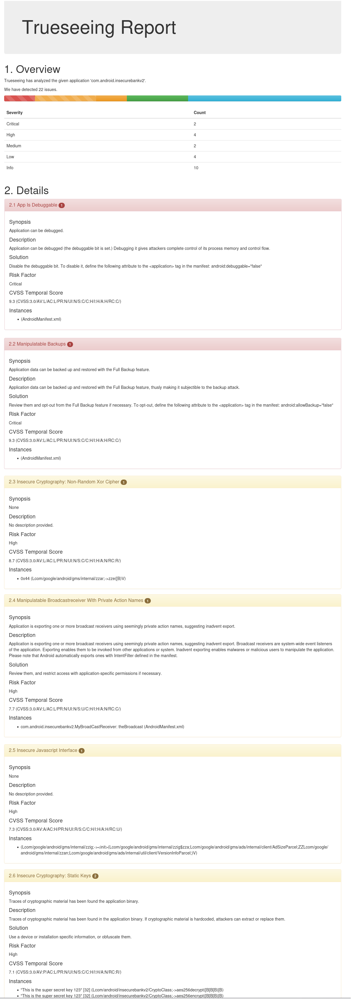


**Copiamos los ficheros que mara decompila fuera del contenedor:** Dentro del contenedor docker, ejecutamos:
```
mkdir -p /apps/mara_results/decompiled/jadx
mkdir -p /apps/mara_results/decompiled/java

cp -r /opt/MARA_Framework/data/InsecureBankv2.apk/source/jadx/com/android/insecurebankv2 \
  /apps/mara_results/decompiled/jadx/

cp -r /opt/MARA_Framework/data/InsecureBankv2.apk/source/java/com/android/insecurebankv2 \
  /apps/mara_results/decompiled/java/

cp /opt/MARA_Framework/data/InsecureBankv2.apk/AndroidManifest.xml \
  /apps/mara_results/AndroidManifest.xml
```

**Obtenemos los ficheros decompilados:**
- [jadx](https://github.com/soniasalido/cybersecurity/tree/main/Documentation/Malware/Master-ENIIT-Analisis-Malware-Reversing/modulo-8-reversing-sistemas-operativos-moviles/4-M8T4-analisis-en-aplicaciones-android-II/mara_results/decompiled/jadx/insecurebankv2)

- [java](https://github.com/soniasalido/cybersecurity/tree/main/Documentation/Malware/Master-ENIIT-Analisis-Malware-Reversing/modulo-8-reversing-sistemas-operativos-moviles/4-M8T4-analisis-en-aplicaciones-android-II/mara_results/decompiled/java/insecurebankv2)


# **Análisis de los ficheros decompilados**

## **BuildConfig.java.jadx**

En [BuildConfig.java.jadx](https://github.com/soniasalido/cybersecurity/blob/main/Documentation/Malware/Master-ENIIT-Analisis-Malware-Reversing/modulo-8-reversing-sistemas-operativos-moviles/4-M8T4-analisis-en-aplicaciones-android-II/mara_results/decompiled/jadx/insecurebankv2/BuildConfig.java.jadx) aparece:

```
public static final java.lang.String BUILD_TYPE = "debug";
```
donde:
- Una APK de tipo debug suele facilitar análisis, logging, inspección y extracción de datos. En un entorno real, esto sería un problema de hardening.

**Severidad:** Media.

**Mitigación:** Compilar releases con:
```
debuggable false
minifyEnabled true
shrinkResources true
```
y firmar con certificado de release.

----

## **CryptoClass.java.jadx**

En el fichero [CryptoClass.java.jadx](https://github.com/soniasalido/cybersecurity/blob/main/Documentation/Malware/Master-ENIIT-Analisis-Malware-Reversing/modulo-8-reversing-sistemas-operativos-moviles/4-M8T4-analisis-en-aplicaciones-android-II/mara_results/decompiled/jadx/insecurebankv2/CryptoClass.java.jadx)


### **Encontramos una clave criptográfica hardcodeada**
```
r0 = "This is the super secret key 123";
r1.key = r0;
```
donde:
- En `CryptoClass.java.jadx:14-15` se declara una clave fija dentro de la APK.

**Impacto:** Cualquier persona que decompile la app puede recuperar la clave y descifrar los datos protegidos con ella. Esto invalida el cifrado local.

**Severidad:** Alta

### **IV estático en AES-CBC**
```
r0 = new byte[16];
r0 = {0, 0, 0, 0, 0, 0, 0, 0, 0, 0, 0, 0, 0, 0, 0, 0};
r1.ivBytes = r0;
```
donde:
- En `CryptoClass.java.jadx:16-19` se define un IV de 16 bytes todos a cero.
- Impacto: AES-CBC con IV fijo produce cifrados repetibles para el mismo plaintext. Esto rompe una propiedad básica esperada del cifrado simétrico: que dos mensajes iguales no generen el mismo ciphertext.

**Severidad:** Alta

### **Uso de AES/CBC/PKCS5Padding sin protección de integridad**
```
r3 = "AES/CBC/PKCS5Padding";
r0 = javax.crypto.Cipher.getInstance(r3);
```
donde:
- Está presente en `CryptoClass.java.jadx:29-30` y `CryptoClass.java.jadx:44-45`.

**Impacto:** AES-CBC no proporciona autenticidad ni integridad. Aunque el contenido esté cifrado, no hay protección contra manipulación del ciphertext. Además, en esta app el problema se agrava por la clave hardcodeada y el IV estático.

**Severidad:** Alta

**Mitigación:** Usar Android Keystore y cifrado autenticado, por ejemplo AES-GCM, con claves no exportables: Android Keystore + AES/GCM/NoPadding + IV aleatorio por operación.


----

## **DoLogin.java.jadx**
En [DoLogin.java.jadx](https://github.com/soniasalido/cybersecurity/blob/main/Documentation/Malware/Master-ENIIT-Analisis-Malware-Reversing/modulo-8-reversing-sistemas-operativos-moviles/4-M8T4-analisis-en-aplicaciones-android-II/mara_results/decompiled/jadx/insecurebankv2/DoLogin.java.jadx) encontramos:


### **Comunicaciones HTTP en claro para login**
```
r0 = "http://";
r1.protocol = r0;
```
donde:
- En `DoLogin.java.jadx:340-341` se define el protocolo HTTP.

El endpoint /login se construye dinámicamente:
```
protocol + serverip + ":" + serverport + "/login"
```
donde:
- Está visible en `DoLogin.java.jadx:194-211`.

**Impacto:** Usuario y contraseña viajan sin cifrado. Esto permite captura de credenciales mediante MITM, tcpdump, Burp, Wireshark o cualquier proxy de red.

**Severidad:** Alta

Aquí tenems una evidencia dinámica que ya confirmamos:
```
POST /login
username=dinesh&password=Dinesh@123$
```

**Mitigación:** Usar HTTPS obligatorio, bloquear cleartext traffic y validar certificados.

### **Endpoint de desarrollo /devlogin activado por usuario devadmin**
La app construye también un endpoint /devlogin:
```
protocol + serverip + ":" + serverport + "/devlogin"
``` 
donde:
- Se encuentra en `DoLogin.java.jadx:212-229`.

Luego compara el usuario con devadmin:
```
r9 = "devadmin";
r8 = r8.equals(r9);
```
donde:
- Se encuentra en `DoLogin.java.jadx:245-248`.

Si coincide, ejecuta la petición contra /devlogin:
```
r2.setEntity(r8);
r6 = r0.execute(r2);
```
donde:
- Se encuentra en `DoLogin.java.jadx:251-254`.

**Impacto:** La lógica de autenticación contiene una ruta especial de desarrollo. Si el backend acepta /devlogin sin validación robusta, se obtiene bypass de autenticación.

**Severidad:** Crítica

**Mitigación:** Eliminar endpoints y usuarios de desarrollo en builds no controlados. La lógica de autenticación especial no debe residir en cliente.


### **Almacenamiento local de credenciales en SharedPreferences**

La app usa el fichero: `mySharedPreferences`. Lo podemos en contrar en `DoLogin.java.jadx:96`.

Guarda dos claves:
```
"EncryptedUsername"
"superSecurePassword"
```
donde:
- Se encuentra en `DoLogin.java.jadx:118-123`.

El usuario se codifica con Base64:
```
android.util.Base64.encodeToString(...)
```
donde:
- Se encuentra en `DoLogin.java.jadx:104-110`.

La contraseña se cifra con CryptoClass:
```
r1 = new com.android.insecurebankv2.CryptoClass;
r5 = r1.aesEncryptedString(r5);
```
donde:
- Se encuentra en `DoLogin.java.jadx:111-117`.

**Impacto:** La app guarda usuario y contraseña reutilizables en el dispositivo. El usuario solo está en Base64 y la contraseña puede descifrarse porque la clave AES está dentro de la APK.

**Severidad:** Alta

**Evidencia dinámica que ya obtuvimos:**
```
<string name="EncryptedUsername">ZGluZXNo</string>
<string name="superSecurePassword">DTrW2VXjSoFdg0e61fHxJg==</string>
```
donde:
 - `ZGluZXNo` decodifica a: `dinesh`.
- `superSecurePassword` puede descifrarse con la clave de [CryptoClass.java.jadx](https://github.com/soniasalido/cybersecurity/blob/main/Documentation/Malware/Master-ENIIT-Analisis-Malware-Reversing/modulo-8-reversing-sistemas-operativos-moviles/4-M8T4-analisis-en-aplicaciones-android-II/mara_results/decompiled/jadx/insecurebankv2/CryptoClass.java.jadx).

**Mitigación:** No guardar contraseñas en cliente. Usar tokens de sesión de vida corta, Android Keystore y EncryptedSharedPreferences si hay que persistir secretos.


### **Logging de credenciales**
Después de una autenticación correcta, la app registra usuario y contraseña:
```
r8 = "Successful Login:";
...
r10 = r12.this$0;
r10 = r10.username;
...
r10 = r12.this$0;
r10 = r10.password;
...
android.util.Log.d(r8, r9);
```
donde:
- Se encuentra en `DoLogin.java.jadx:279-293`.

**Impacto:** Credenciales expuestas en logcat. En dispositivos antiguos, entornos debug o dispositivos rooteados, otras apps o un operador local pueden acceder a esos logs.

**Severidad:** Alta

**Mitigación:** Eliminar logs de credenciales, tokens, PII y datos financieros. Implementar redacción de logs y desactivar logging sensible en release.


### **Registro de usuarios en ContentProvider**
Al hacer login, la app inserta el usuario en un ContentProvider:
```
r2 = r4.this$1.this$0.getContentResolver();
r3 = com.android.insecurebankv2.TrackUserContentProvider.CONTENT_URI;
r0 = r2.insert(r3, r1);
```
donde:
- Se encuentra en `DoLogin.java.jadx:40-44`.

**Impacto:** Por sí solo, esto registra usuarios localmente. Si el `TrackUserContentProvider` está exportado en el Manifest, como vimos en el análisis anterior, otra app puede consultar o manipular esos datos.

**Severidad:** Alta si el provider está exportado; media si es interno.

**Mitigación:** No exportar el provider, aplicar permisos `readPermission/writePermission` y evitar almacenar datos sensibles innecesarios.


### **Flujo de navegación inseguro y frágil**

`DoLogin.onCreate()` llama a:
```
r6.finish();
```
donde:
- Se encuentra en `DoLogin.java.jadx:361`
 
Pero después el `AsyncTask` intenta abrir `PostLogin`:
```
r5 = new android.content.Intent(... PostLogin.class);
...
r8.startActivity(r5);
```
donde:
- Se encuentra en `DoLogin.java.jadx:300-310`.

**Impacto:** Esto explica parte de los comportamientos raros que viste en logcat, como: `startActivity called from finishing ActivityRecord`. No es la vulnerabilidad principal, pero demuestra mala gestión del ciclo de vida Android. Puede generar fallos o navegación inconsistente en versiones modernas.

**Severidad:** Baja-Media.

**Mitigación:** No llamar `finish()` antes de terminar el flujo. Mover la navegación a `onPostExecute()` o usar `runOnUiThread()` de forma controlada.


----

## **ChangePassword.java.jadx**
En [ChangePassword.java.jadx](https://github.com/soniasalido/cybersecurity/blob/main/Documentation/Malware/Master-ENIIT-Analisis-Malware-Reversing/modulo-8-reversing-sistemas-operativos-moviles/4-M8T4-analisis-en-aplicaciones-android-II/mara_results/decompiled/jadx/insecurebankv2/ChangePassword.java.jadx) encontramos:

#### **Cambio de contraseña por HTTP en claro**
La clase inicializa:
```
r0 = "http://";
r1.protocol = r0;
```
donde:
- Se encuentra en `ChangePassword.java.jadx:338-339`.

Construye el endpoint:
```
protocol + serverip + ":" + serverport + "/changepassword"
```
donde:
- Se encuentra en `ChangePassword.java.jadx:247-264`.

**Impacto:** La nueva contraseña viaja por HTTP sin cifrado.

**Severidad:** Alta.

### **Cambio de contraseña basado solo en username y newpassword**
La petición envía únicamente:
```
"username"
"newpassword"
```
donde:
- Se encuentra en `ChangePassword.java.jadx:268-280`.
- No se observa envío de contraseña actual, token de sesión, cookie, JWT ni cabecera de autorización.

**Impacto:** Si el backend no aplica autenticación fuerte, un atacante solo necesita conocer el usuario para intentar cambiar su contraseña.

**Severidad:** Alta

**Mitigación:** El cambio de contraseña debe exigir sesión válida server-side, contraseña actual o reautenticación, CSRF protection si aplica y controles de autorización en backend.


### **Validación de complejidad solo en cliente**
La política de contraseña se define en cliente:
```
private static final java.lang.String PASSWORD_PATTERN =
"((?=.*\\d)(?=.*[a-z])(?=.*[A-Z])(?=.*[@#$%]).{6,20})";
```
donde:
- Se encuentra en `ChangePassword.java.jadx:4`.

Luego se valida antes de enviar:
```
Pattern.compile(...)
matcher(...)
matches()
```
donde:
- Se encuentra en `ChangePassword.java.jadx:285-301`.

**Impacto:** Cualquier validación solo en cliente puede ser omitida con Burp, curl, modificación de APK o llamada directa al endpoint. El backend debe repetir la validación.

**Severidad:** Media-Alta

### **Envío de nueva contraseña por Broadcast implícito**
Tras cambiar la contraseña, la app crea un intent sin clase ni paquete explícito:
```
r0 = new android.content.Intent;
r0.<init>();
r1 = "theBroadcast";
r0.setAction(r1);
```
donde:
- Se encuentra en `ChangePassword.java.jadx:381-384`.

Añade datos sensibles:
```
r0.putExtra("phonenumber", r4);
r0.putExtra("newpass", r5);
```
donde:
- Se encuentra en `ChangePassword.java.jadx:385-388`.

Y lo envía:
```
r3.sendBroadcast(r0);
```
donde:
- Se encuentra en `ChangePassword.java.jadx:389`.

**Impacto:** La nueva contraseña se introduce en un broadcast implícito. Si hay receivers capaces de escuchar esa acción, o si el receiver propio está exportado, puede producirse exposición o manipulación del flujo.

**Severidad:** Alta

**Mitigación:** Usar broadcasts explícitos internos, LocalBroadcastManager en apps antiguas o comunicación directa entre componentes no exportados. No enviar contraseñas en extras de intents.


### **Lectura y logging del número de teléfono**
La app obtiene el número de línea:
```
r3 = (android.telephony.TelephonyManager) r3;
r4 = r3.getLine1Number();
```
donde:
- Se encuentra en `ChangePassword.java.jadx:95-97`.

Y lo imprime:
```
r7 = "phonno:";
...
r5.println(r6);
```
donde:
- Se encuentra en `ChangePassword.java.jadx:98-105`.

**Impacto:** Exposición de número de teléfono en logs. Además, `getLine1Number()` implica tratamiento de dato personal.

**Severidad:** Media

**Mitigación:** No registrar números de teléfono. Solicitar permisos solo si son estrictamente necesarios y justificar su uso.


----

## **DoTransfer.java.jadx**

### **Hallazgo F-16 — Transferencias por HTTP en claro**

En `DoTransfer.java.jadx:861-862` se inicializa el protocolo:
```
r0 = "http://";
r1.protocol = r0;
```

La clase construye endpoints HTTP dinámicos para:
```
/getaccounts
/dotransfer
```

Evidencia:
```
"/getaccounts"   // DoTransfer.java.jadx:180
"/dotransfer"    // DoTransfer.java.jadx:664
```

También usa `DefaultHttpClient` y `HttpPost`:
```
new org.apache.http.impl.client.DefaultHttpClient;   // líneas 164 y 648
new org.apache.http.client.methods.HttpPost;         // líneas 166 y 650
```

**Impacto:** Las operaciones bancarias viajan sin TLS. Esto expone credenciales, cuentas origen/destino e importes ante interceptación de red.

**Severidad:** Alta

**Mitigación:** Usar HTTPS obligatorio, bloquear tráfico cleartext y aplicar validación de certificado/certificate pinning si el modelo de amenaza lo requiere.

### **Hallazgo F-17 — Reutilización de credenciales almacenadas para operar transferencias**
En `DoTransfer.java.jadx` lee credenciales desde `mySharedPreferences`:
```
"mySharedPreferences"       // DoTransfer.java.jadx:185 y 669
"EncryptedUsername"         // líneas 188 y 671
"superSecurePassword"       // líneas 199 y 680
```

Luego decodifica el usuario en Base64:
```
android.util.Base64.decode(...)   // línea 192 y 673
```

Y descifra la contraseña mediante CryptoClass:
```
com.android.insecurebankv2.DoTransfer.access$000(...)   // líneas 202-205 y 682-685
```

Después envía ambos valores en la petición:
``` 
"username"   // línea 211 y 691
"password"   // línea 217 y 697
```

**Impacto:** La app no usa un token de sesión de vida corta. Recupera la contraseña guardada localmente, la descifra y la reenvía al backend. Si un atacante extrae `SharedPreferences` y la clave de `CryptoClass`, puede recuperar credenciales y operar contra el backend.

**Severidad:** Alta.

**Mitigación:** No almacenar ni reutilizar contraseñas. Usar sesiones/token server-side con expiración, refresh controlado y almacenamiento seguro mediante Android Keystore cuando aplique.


### **Hallazgo F-18 — Parámetros de transferencia controlados desde UI sin validación local robusta**
La app toma directamente los valores de los campos:
```
"from_acc"   // DoTransfer.java.jadx:721
"to_acc"     // DoTransfer.java.jadx:729
"amount"     // DoTransfer.java.jadx:737
```

En `DoTransfer.java.jadx:720-742` los valores se leen con:
```
from.getText().toString()
to.getText().toString()
amount.getText().toString()
```


**Impacto:** El cliente permite construir peticiones con cuenta origen, cuenta destino e importe arbitrarios. La seguridad no puede depender del cliente: el backend debe validar titularidad de cuenta, saldo, límites, formato, autorización y antifraude.

**Severidad:** Alta si el backend no valida correctamente; Media si el backend valida.

**Mitigación:** Validación server-side obligatoria para cuenta origen, cuenta destino, importe, usuario autenticado y estado de sesión.


### **Hallazgo F-19 — Escritura de extractos en almacenamiento externo**
Cuando la transferencia tiene éxito o falla, la app escribe un fichero HTML en almacenamiento externo:
```
android.os.Environment.getExternalStorageDirectory();   // líneas 496 y 595
"/Statements_"                                         // líneas 498 y 597
".html"                                                // líneas 504 y 603
new java.io.FileWriter(..., true)                      // líneas 508-510 y 606-609
```

El nombre del fichero incluye el usuario:
```
usernameBase64ByteString   // líneas 502 y 601
```

En `DoTransfer.java.jadx:426-492` y `533-591`. el contenido incluye:
```
Message
From
To
Amount
```

**Impacto:** Los extractos quedan en almacenamiento externo, que en Android antiguo o mal configurado puede ser accesible por otras apps o por el usuario mediante filesystem. Además, el fichero es HTML y se construye con datos no escapados.

**Severidad:** Alta.

**Mitigación:** Guardar extractos sensibles en almacenamiento interno privado, cifrar en reposo si hay necesidad real de persistencia y evitar almacenamiento compartido para datos financieros.


### **Hallazgo F-20 — Logging de datos financieros**
La app imprime detalles de la transferencia con System.out.println:
```
java.lang.System.out   // DoTransfer.java.jadx:426 y 533
```

Construye mensajes en `DoTransfer.java.jadx:426-462` para éxito y `533-561` para fallo:
```
Message
From
To
Amount
```

**Impacto:** Datos financieros quedan expuestos en logs. Esto puede revelar cuentas origen/destino e importes.

**Severidad:** Media-Alta.

**Mitigación:** Eliminar logs sensibles. Usar logging mínimo, redacción de datos y desactivar logs de debug en producción.


### **Hallazgo F-21 — Validación de éxito basada en substring**
Para /getaccounts, se comprueba si la respuesta contiene:
```
"Correct"   // DoTransfer.java.jadx:257
```

Para /dotransfer, se comprueba si contiene:
```
"Success"   // DoTransfer.java.jadx:391
```

**Impacto:** El cliente decide éxito/fallo mediante búsqueda de texto en la respuesta. Esto es frágil y manipulable si el tráfico puede interceptarse, más aún porque la comunicación es HTTP.

**Severidad:** Media.

**Mitigación:** Usar respuestas estructuradas firmadas/validadas, HTTPS y controles server-side. El cliente no debe ser fuente de verdad para operaciones financieras.

----

## **FilePrefActivity.java.jadx**
En [FilePrefActivity.java.jadx](https://github.com/soniasalido/cybersecurity/blob/main/Documentation/Malware/Master-ENIIT-Analisis-Malware-Reversing/modulo-8-reversing-sistemas-operativos-moviles/4-M8T4-analisis-en-aplicaciones-android-II/mara_results/decompiled/jadx/insecurebankv2/FilePrefActivity.java.jadx), encontramos:

### **Hallazgo F-22 — Configuración manual del servidor sin protección**
`FilePrefActivity` permite configurar IP y puerto del servidor:
```
edit_serverip      // FilePrefActivity.java.jadx:4, 52-55
edit_serverport    // líneas 5, 56-59
```

Guarda los valores en DefaultSharedPreferences:
```
PreferenceManager.getDefaultSharedPreferences(...)   // línea 60
"serverip"                                           // línea 134
"serverport"                                         // línea 137
commit()                                             // línea 140
```

**Impacto:** El endpoint de backend queda bajo control de la configuración local. Si un atacante con acceso al dispositivo, a la UI, a datos de la app o a una Activity exportada puede modificar estos valores, puede redirigir la app a un servidor controlado. Dado que la app envía credenciales por HTTP, esto facilita captura de usuario/contraseña.

**Severidad:** Alta en combinación con HTTP.


**Mitigación:** No permitir configuración libre del backend en builds productivos. Fijar endpoints seguros, usar HTTPS y certificate pinning si corresponde.


### **Hallazgo F-23 — Validación insuficiente del endpoint**
La IP se valida solo con regex IPv4:
```
"^([01]?\\d\\d?|2[0-4]\\d|25[0-5])\\...."   // FilePrefActivity.java.jadx:117
```

El puerto se valida con regex de rango:
```
"(6553[0-5]|655[0-2]\\d|65[0-4]\\d{2}|...)"   // línea 125
```

**Impacto:** La validación sólo comprueba formato, no seguridad del destino. Acepta IPs privadas, loopback y cualquier host controlado por el usuario. No hay restricción de dominio, TLS ni pinning.

**Severidad:** Media.

**Mitigación:** Separar configuración de laboratorio de builds productivos. Validar dominios permitidos, usar HTTPS y bloquear cleartext traffic.


### **Hallazgo F-24 — Activity de configuración potencialmente abusiva si está exportada**
FilePrefActivity permite guardar configuración crítica sin autenticación adicional:
```
setPreferences()   // FilePrefActivity.java.jadx:108
```

**Impacto:** Si esta Activity está exportada en el `AndroidManifest.xml`, otra app podría abrirla o inducir al usuario a cambiar el backend. Aunque el fichero por sí solo no confirma exported, el riesgo debe cruzarse con el manifest.

**Severidad:** Media-Alta si está exportada.

**Mitigación:** Marcar la Activity como no exportada y no permitir que una pantalla no autenticada modifique parámetros críticos de seguridad.

xxxxxxx

----

## **LoginActivity.java.jadx**
En [LoginActivity.java.jadx](https://github.com/soniasalido/cybersecurity/blob/main/Documentation/Malware/Master-ENIIT-Analisis-Malware-Reversing/modulo-8-reversing-sistemas-operativos-moviles/4-M8T4-analisis-en-aplicaciones-android-II/mara_results/decompiled/jadx/insecurebankv2/LoginActivity.java.jadx) encontramos:

### **Hallazgo F-25 — Función de autocompletado recupera credenciales en claro**
`fillData()` lee de `mySharedPreferences`:
```
"mySharedPreferences"       // LoginActivity.java.jadx:119
"EncryptedUsername"         // línea 121
"superSecurePassword"       // línea 123
```

Decodifica el usuario:
```
android.util.Base64.decode(...)   // línea 129
```

Descifra la contraseña:
```
new com.android.insecurebankv2.CryptoClass;   // línea 146
aesDeccryptedString(...)                      // línea 148
```

Y rellena los campos de login:
```
Username_Text.setText(...)   // líneas 143-145
Password_Text.setText(...)   // líneas 148-150
```

**Impacto:** Cualquier persona con acceso a la app desbloqueada puede pulsar el botón de autocompletar y revelar credenciales en pantalla. Esto confirma que la contraseña se almacena de forma reversible.

**Severidad:** Alta

**Mitigación:** Eliminar autocompletado de contraseña. No almacenar contraseñas; usar tokens de sesión y reautenticación.


### **Hallazgo F-26 — Credenciales transmitidas entre Activities mediante extras**
`performlogin()` crea un Intent hacia DoLogin:
```
new Intent(... DoLogin.class)   // LoginActivity.java.jadx:262-264
```

Añade usuario y contraseña como extras:
```
"passed_username"   // línea 265
"passed_password"   // línea 270
putExtra(...)       // líneas 269 y 274
```

**Impacto:** Aunque es un Intent explícito interno, las credenciales viajan por el ciclo de vida de Android como extras. Si DoLogin está exportada, otra app podría invocarla con credenciales arbitrarias. Además, pasar contraseñas entre componentes refuerza el diseño inseguro: la autenticación se gestiona como flujo de UI, no como sesión segura.

**Severidad:** Media.

**Mitigación:** Evitar pasar contraseñas entre Activities. Centralizar autenticación en un repositorio seguro y manejar sesiones/token.


### **Hallazgo F-27 — Flujo de login dependiente del cliente**
`LoginActivity` sólo recoge campos y lanza DoLogin:
```
performlogin()   // LoginActivity.java.jadx:252
startActivity(r0) // línea 275
```

**Impacto:** El diseño separa la captura de credenciales y la lógica de autenticación en Activities exportables o invocables. Esto facilita pruebas como:
```
adb shell am start -n com.android.insecurebankv2/.DoLogin \
  --es passed_username dinesh \
  --es passed_password 'Dinesh@123$'
```

**Severidad:** Media, pero alta en combinación con Activities exportadas.

**Mitigación:** No exportar Activities internas y validar sesión/autorización en cada componente sensible.

----

## **MyBroadCastReceiver.java.jadx**
En [MyBroadCastReceiver.java.jadx](https://github.com/soniasalido/cybersecurity/blob/main/Documentation/Malware/Master-ENIIT-Analisis-Malware-Reversing/modulo-8-reversing-sistemas-operativos-moviles/4-M8T4-analisis-en-aplicaciones-android-II/mara_results/decompiled/jadx/insecurebankv2/MyBroadCastReceiver.java.jadx) encontramos:

#### **Hallazgo F-28 — Receiver acepta datos sensibles desde Intent extras**
El receiver lee directamente:
```
"phonenumber"   // MyBroadCastReceiver.java.jadx:15-17
"newpass"       // líneas 18-20
```
donde:
- No se observa validación de origen, permiso, paquete emisor ni action esperada.

**Impacto:** Si el receiver está exportado, otra app puede enviar un broadcast con número de teléfono y nueva contraseña. Esto permite abusar del flujo de notificación/cambio de contraseña.

**Severidad:** Alta si el receiver está exportado.

**Mitigación:** Marcar el receiver como android:exported="false" o protegerlo con permisos signature. Validar action, origen y contenido.


### **Hallazgo F-29 — Uso de MODE_WORLD_READABLE en SharedPreferences**
El receiver abre `SharedPreferences` con modo 1:
```
getSharedPreferences("mySharedPreferences", 1)   // MyBroadCastReceiver.java.jadx:23-26
```

Históricamente, 1 corresponde a `MODE_WORLD_READABLE`, un modo inseguro y obsoleto.

**Impacto:** En versiones antiguas de Android, esto podía permitir que otras apps leyeran preferencias. En versiones modernas puede fallar o ser ignorado, pero sigue siendo un patrón inseguro claro.

**Severidad:** Alta en un Android antiguo.

**Mitigación:** Usar `MODE_PRIVATE` y no almacenar secretos en `SharedPreferences`.


### **allazgo F-30 — Descifrado de contraseña almacenada dentro del receiver**
El receiver lee y descifra la contraseña guardada:
```
"superSecurePassword"               // MyBroadCastReceiver.java.jadx:37
new com.android.insecurebankv2.CryptoClass   // línea 40
aesDeccryptedString(...)            // línea 42
```

También decodifica el usuario:
```
"EncryptedUsername"                 // línea 27
android.util.Base64.decode(...)     // línea 31
```

**Impacto:** El componente tiene acceso directo a las credenciales persistidas. Si el receiver es invocable por terceros, puede convertirse en un canal indirecto para extraer o exfiltrar la contraseña.

**Severidad:** Alta.

**Mitigación:** No descifrar ni manejar contraseñas en BroadcastReceivers. Eliminar almacenamiento reversible de contraseñas.


### **Hallazgo F-31 — Envío de contraseña antigua y nueva por SMS**
El SMS se construye así:
```
"Updated Password from: "   // MyBroadCastReceiver.java.jadx:46
append(r8)                 // contraseña antigua, línea 48
" to: "                    // línea 49
append(r10)                // nueva contraseña, línea 51
```

Luego se envía con:
```
SmsManager.getDefault()     // línea 53
sendTextMessage(...)        // línea 68
```

**Impacto:** La app envía por SMS la contraseña antigua y la nueva. Esto expone credenciales a la red móvil, al historial de SMS, a logs, a apps SMS y al destinatario configurado. Si un atacante controla el extra phonenumber, puede hacer que la app envíe credenciales a un número elegido.

**Severidad:** Crítica.

**Mitigación:** Nunca enviar contraseñas por SMS. Usar notificaciones genéricas sin secretos. Para recuperación/cambio de contraseña, usar tokens de un solo uso y expiración corta.


### **Hallazgo F-32 — Logging de contraseñas y número de teléfono**
El receiver imprime:
```
"For the changepassword - phonenumber: "   // línea 57
" password is: "                           // línea 60
System.out.println(...)                    // líneas 54-64
```
donde:
- El mensaje contiene número de teléfono, contraseña antigua y nueva.

**Impacto:** Las credenciales quedan expuestas en logs. Esto es especialmente grave en builds debug, dispositivos rooteados o entornos de análisis.

**Severidad:** Alta.

**Mitigación:** Eliminar todos los logs que contengan credenciales, PII, números de teléfono o tokens.


### **Hallazgo F-33 — Manejo inseguro de errores**
El receiver captura Exception genérico e imprime el stacktrace:
```
catch Exception
printStackTrace()   // MyBroadCastReceiver.java.jadx:71-73
```

**Impacto:** Los errores pueden revelar detalles internos de ejecución, rutas, clases o fallos de descifrado. Además, el flujo no diferencia errores esperados de situaciones de abuso.

**Severidad:** Baja-Media.

**Mitigación:** Manejo explícito de errores, sin exponer detalles sensibles en logs.


----


# **Resumen de hallazgos**
| ID   | Archivo        | Hallazgo                                         | Severidad  |
| ---- | -------------- | ------------------------------------------------ | ---------- |
| F-01 | BuildConfig    | Build debug / bajo hardening                     | Media      |
| F-02 | CryptoClass    | Clave AES hardcodeada                            | Alta       |
| F-03 | CryptoClass    | IV AES-CBC estático                              | Alta       |
| F-04 | CryptoClass    | AES-CBC sin integridad                           | Alta       |
| F-05 | DoLogin        | Login por HTTP en claro                          | Alta       |
| F-06 | DoLogin        | Backdoor lógico `devadmin` → `/devlogin`         | Crítica    |
| F-07 | DoLogin        | Credenciales en SharedPreferences                | Alta       |
| F-08 | DoLogin        | Logs con usuario y contraseña                    | Alta       |
| F-09 | DoLogin        | Inserción de usuario en ContentProvider          | Media-Alta |
| F-10 | DoLogin        | Flujo frágil por `finish()` antes de navegación  | Baja-Media |
| F-11 | ChangePassword | Cambio de contraseña por HTTP                    | Alta       |
| F-12 | ChangePassword | Cambio basado solo en usuario y nueva contraseña | Alta       |
| F-13 | ChangePassword | Validación de password solo en cliente           | Media-Alta |
| F-14 | ChangePassword | Broadcast implícito con nueva contraseña         | Alta       |
| F-15 | ChangePassword | Lectura/logging de número telefónico             | Media      |
| F-16 | DoTransfer          | Transferencias y consulta de cuentas por HTTP        | Alta                      |
| F-17 | DoTransfer          | Reutilización de contraseña almacenada para operar   | Alta                      |
| F-18 | DoTransfer          | Parámetros de transferencia controlados desde UI     | Alta si backend no valida |
| F-19 | DoTransfer          | Extractos en almacenamiento externo                  | Alta                      |
| F-20 | DoTransfer          | Logs con datos financieros                           | Media-Alta                |
| F-21 | DoTransfer          | Éxito/fallo basado en substring                      | Media                     |
| F-22 | FilePrefActivity    | Configuración libre del backend                      | Alta combinada con HTTP   |
| F-23 | FilePrefActivity    | Validación insuficiente del endpoint                 | Media                     |
| F-24 | FilePrefActivity    | Pantalla de configuración sensible si está exportada | Media-Alta                |
| F-25 | LoginActivity       | Autocompletado revela credenciales almacenadas       | Alta                      |
| F-26 | LoginActivity       | Credenciales en extras de Intent                     | Media                     |
| F-27 | LoginActivity       | Flujo de login dependiente del cliente               | Media-Alta combinada      |
| F-28 | MyBroadCastReceiver | Receiver acepta extras sensibles                     | Alta                      |
| F-29 | MyBroadCastReceiver | Uso de modo `1`/`MODE_WORLD_READABLE`                | Media-Alta                |
| F-30 | MyBroadCastReceiver | Descifra contraseña dentro del receiver              | Alta                      |
| F-31 | MyBroadCastReceiver | Envía contraseña antigua y nueva por SMS             | Crítica                   |
| F-32 | MyBroadCastReceiver | Logs con contraseña y teléfono                       | Alta                      |
| F-33 | MyBroadCastReceiver | `printStackTrace()` y manejo genérico de errores     | Baja-Media                |
