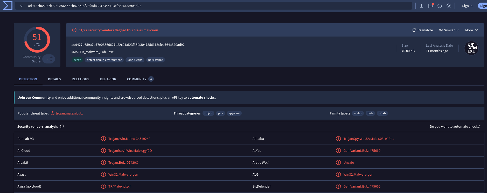
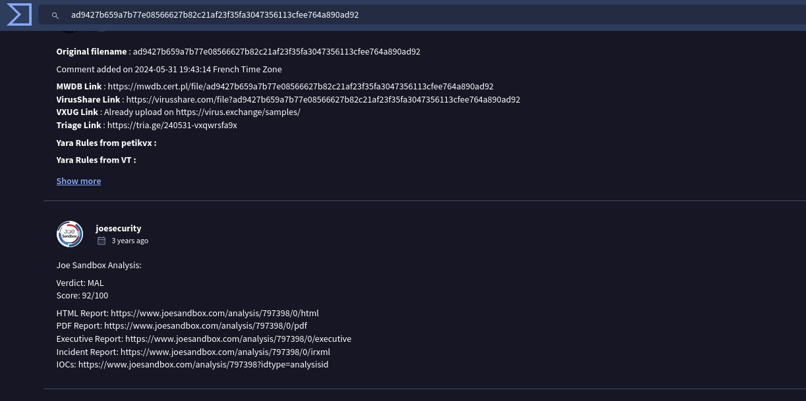
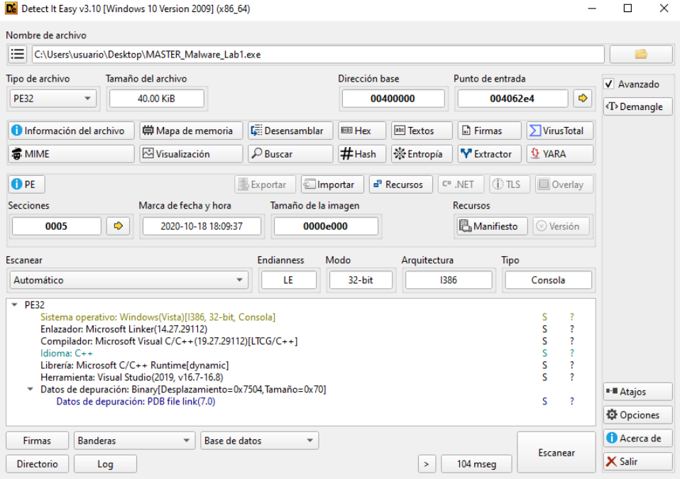
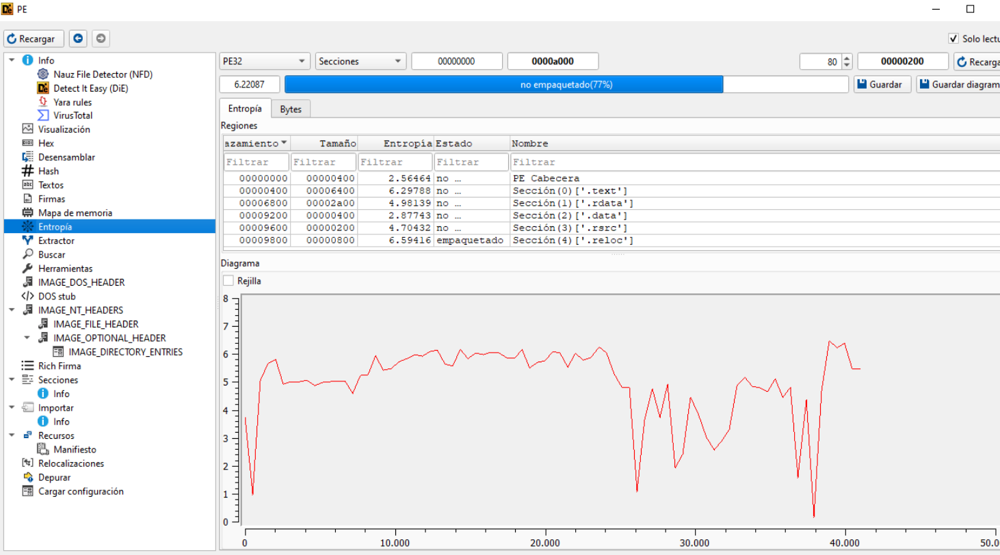
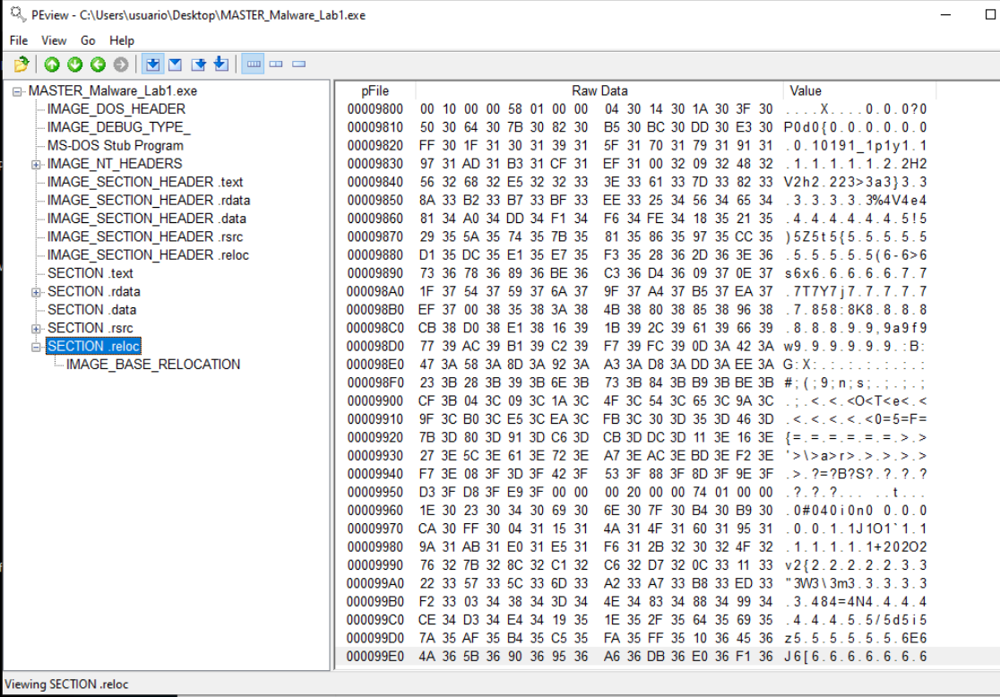
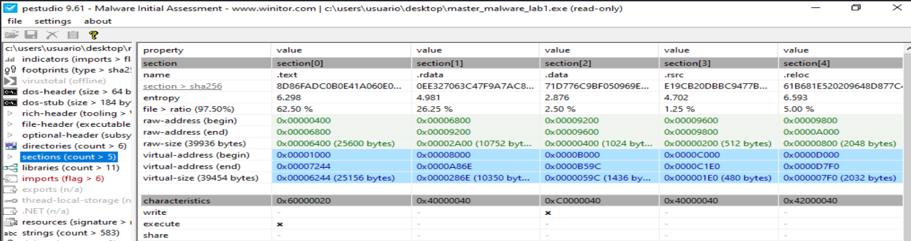
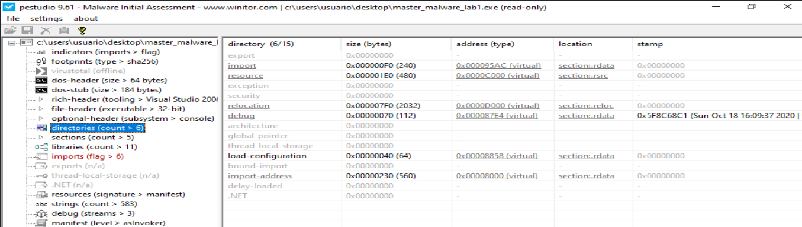
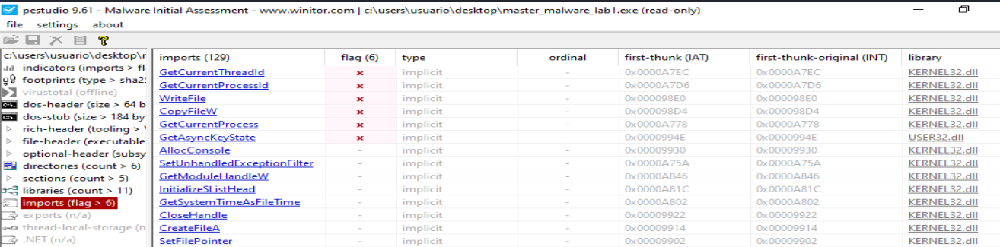

# Información encontrada con la herramienta pestudio


## Información general:

| Sección     | Campo                 | Valor                                                                                           |
| ----------- | --------------------- | ----------------------------------------------------------------------------------------------- |
| file        | SHA256                | AD9427B659A7B77E08566627B82C21AF23F35FA3047356113CFEE764A890AD92                                |
| file        | First 32 bytes — hex  | 4D 5A 90 00 03 00 00 00 04 00 00 00 FF FF 00 00 B8 00 00 00 00 00 00 00 40 00 00 00 00 00 00 00 |
| file        | First 32 bytes — text | MZ............................................@..............                                   |
| file        | Info                  | Size: 40960 bytes; Entropy: 6.221                                                               |
| file        | Type                  | Executable, 32-bit, console                                                                     |
| file        | Version               | n/a                                                                                             |
| file        | Description           | n/a                                                                                             |
| entry-point | First 32 bytes — hex  | E8 01 04 00 00 E9 74 FE FF FF 55 8B EC 8B 45 08 56 8B 48 3C 03 C8 0F B7 41 14 8D 51 18 03 D0 0F |
| entry-point | Location              | 0x000062E4 — section[.text]                                                                     |
| file        | Signature             | Microsoft Linker 14.27 | Visual Studio 2008                                                     |
| stamps      | Compiler              | Sun Oct 18 16:09:37 2020 UTC                                                                    |
| stamps      | Debug                 | Sun Oct 18 16:09:37 2020 UTC                                                                    |
| stamps      | Resource              | n/a                                                                                             |
| stamps      | Import                | n/a                                                                                             |
| stamps      | Export                | n/a                                                                                             |
| names       | File name             | c:\users\usuario\desktop\master_malware_lab1.exe                                                |
| debug       | File                  | C:\Users\Admin\Desktop\MALWARE Labs\MASTER_Malware_Lab1\Release\MASTER_Malware_Lab1.pdb         |


------------------------------------


## INDICATORS

| Sección     | Campo     | Valor                                                                                              |
| ----------- | --------- | -------------------------------------------------------------------------------------------------- |
| file        | name      | c:\users\usuario\desktop\master_malware_lab1.exe                                                   |
| file        | signature | Microsoft Linker 14.27 | Visual Studio 2008                                                        |
| file        | sha256    | AD9427B659A7B77E08566627B82C21AF23F35FA3047356113CFEE764A890AD92                                   |
| file        | info      | size: 40960 bytes; entropy: 6.221                                                                  |
| file        | type      | executable, 32-bit, console                                                                        |
| virustotal  | score     | No se pudo resolver el nombre de servidor o su dirección                                           |
| stamp       | compiler  | Sun Oct 18 16:09:37 2020                                                                           |
| languages   | names     | English-US                                                                                         |
| resources   | info      | count: 1; size: 381 bytes; file-ratio: 0.93%                                                       |
| manifest    | general   | name: n/a; description: n/a; severity: asInvoker                                                   |
| file        | version   | n/a                                                                                                |
| entry-point | location  | 0x000062E4 — section: .text                                                                        |
| certificate | —         | n/a                                                                                                |
| imports     | flag      | CopyFileW; GetAsyncKeyState; GetCurrentProcess; GetCurrentProcessId; GetCurrentThreadId; WriteFile |
| imphash     | md5       | 962E2DBBC5BB67A0F87FCD14DE36453F                                                                   |
| exports     | —         | n/a                                                                                                |
| overlay     | —         | n/a                                                                                                |


--------------------------------------------------------------------------

## FOOTPRINTING - Huellas Dactilares

| Sección     | Campo              | Valor                                                            |
| ----------- | ------------------ | ---------------------------------------------------------------- |
| file        | sha256             | AD9427B659A7B77E08566627B82C21AF23F35FA3047356113CFEE764A890AD92 |
| dos-stub    | sha256             | EBFBB9BC5FA6B4B4E8B64C3EA3D97EDFEB11B3EBDE005FE63FD58D074F81F86D |
| dos-header  | sha256             | 9A032ADF039736A7CC5306E76BB5CB8C9426CF0E4613647E488C0CB3E44A7BD6 |
| rich-header | sha256             | 0314F0F21BEA0FF87373BFB0D0A96FBF254320CB37FE159B4873F14C0E00ECE6 |
| section     | .text > sha256     | 8D86FADC0B0E41A060E00FE9206F962DE5A9FF4B67A960DE02862F928561DFD6 |
| section     | .rdata > sha256    | 0EE327063C47F9A7AC8D6BB96B60C5C97231CD2C6F28E3FE8CAEC811E3F369B4 |
| section     | .data > sha256     | 71D776C9BF050969EBB2BFF994E3F32E45345E585F75E8AC76F8D6B99B4DE6A7 |
| section     | .rsrc > sha256     | E19CB20DBBC9477BB9D5F4675629F3BFA179975001EDA72616F048D46702F466 |
| section     | .reloc > sha256    | 61B681E520209648D877C46172BA575DD96CFA4E679FA0A99530F554C4B95E18 |
| manifest    | sha256             | 4BB79DCEA0A901F7D9EAC5AA05728AE92ACB42E0CB22E5DD14134F4421A3D8DF |
| debug       | RSDS > sha256      | 93DE24C020C461809D04BF055839CEA0BAA5DC305D443CC4706C7870F43C9A54 |
| debug       | vcFeature > sha256 | EF06E0DC71B1AFE4607EBF3EA5C8943D16D324A32C71C17ABBD2F0E2C82820A8 |
| debug       | PGO > sha256       | BA2DF318794DD7B1215FC206795BC82B6B91DF85DB82A1A2152091C5C57F4E95 |
| special     | imphash > md5      | 962E2DBBC5BB67A0F87FCD14DE36453F                                 |


-------------------------------------------------------------------------------------------

## DOS-HEADER

| Sección    | Campo    | Valor                                                            |
| ---------- | -------- | ---------------------------------------------------------------- |
| dos-header | sha256   | 9A032ADF039736A7CC5306E76BB5CB8C9426CF0E4613647E488C0CB3E44A7BD6 |
| dos-header | size     | 0x40 — 64 bytes                                                  |
| dos-header | location | 0x00000000 - 0x00000040                                          |
| dos-header | entropy  | 4.624                                                            |
| file       | ratio    | 0.00 %                                                           |
| exe-header | offset   | 0x000000F8 — e_lfanew                                            |


-----------------------------------------------

## DOS-STUB

| Sección  | Campo                 | Valor                                                                                           |
| -------- | --------------------- | ----------------------------------------------------------------------------------------------- |
| dos-stub | sha256                | EBFBB9BC5FA6B4B4E8B64C3EA3D97EDFEB11B3EBDE005FE63FD58D074F81F86D                                |
| dos-stub | location              | 0x00000040 - 0x000000F8                                                                         |
| dos-stub | size                  | 0xB8 — 184 bytes                                                                                |
| dos-stub | entropy               | 5.123                                                                                           |
| file     | ratio                 | 0.45 %                                                                                          |
| dos-stub | first 32 bytes — hex  | 0E 1F BA 0E 00 B4 09 CD 21 B8 01 4C CD 21 54 68 69 73 20 70 72 6F 67 72 61 6D 20 63 61 6E 6E 6F |
| dos-stub | first 32 bytes — text | ................!....L..!This program canno                                                     |
| dos-stub | message               | !This program cannot be run in DOS mode.                                                        |


----------------------------------------------------------------------


## RICH HEADER

| Componente       | Herramienta / Firma       |
| ---------------- | ------------------------- |
| Implib900        | Visual Studio 2008 - 9.0  |
| Utc1900_C        | Visual Studio 2015 - 14.0 |
| Masm1400         | Visual Studio 2015 - 14.0 |
| Utc1900_CPP      | Visual Studio 2015 - 14.0 |
| Implib1400       | Visual Studio 2015 - 14.0 |
| Implib1400       | Visual Studio 2015 - 14.0 |
| Import           | Visual Studio -           |
| Utc1900_LTCG_CPP | Visual Studio 2015 - 14.0 |
| Cvtres1400       | Visual Studio 2015 - 14.0 |
| Linker1400       | Visual Studio 2015 - 14.0 |


| Sección     | Campo            | Valor                                                            |
| ----------- | ---------------- | ---------------------------------------------------------------- |
| rich-header | location         | 0x00000080 - 0x000000F8                                          |
| rich-header | size             | 0x00000078 — 120 bytes                                           |
| rich-header | checksum-builtin | 0x61E35C71                                                       |
| rich-header | checksum-real    | 0x61E35C71                                                       |
| rich-header | sha256           | 0314F0F21BEA0FF87373BFB0D0A96FBF254320CB37FE159B4873F14C0E00ECE6 |


-------------------------------------------------


FILE HEADER

| Sección         | Campo                               | Valor hexadecimal | Valor interpretado |
| --------------- | ----------------------------------- | ----------------: | ------------------ |
| characteristics | characteristics                     |            0x0102 | —                  |
| characteristics | dynamic-link-library                |            0x0000 | false              |
| characteristics | 32-bit words support                |            0x0100 | true               |
| characteristics | file-can-be-executed                |            0x0002 | true               |
| characteristics | system-image                        |            0x0000 | false              |
| characteristics | large-address-aware                 |            0x0000 | false              |
| characteristics | debug-stripped                      |            0x0000 | false              |
| characteristics | line-stripped-from-file             |            0x0000 | false              |
| characteristics | local-symbols-stripped-from-file    |            0x0000 | false              |
| characteristics | relocation-stripped                 |            0x0000 | false              |
| characteristics | uniprocessor                        |            0x0000 | false              |
| characteristics | bytes-of-machine-words-reversed-Low |            0x0000 | false              |
| characteristics | bytes-of-machine-words-reversed-Hi  |            0x0000 | false              |
| characteristics | media-run-from-swap                 |            0x0000 | false              |
| characteristics | network-run-from-swap               |            0x0000 | false              |


# **Primer análisis de la muestra**

## **El tipo de fichero**

El fichero corresponde a un ejecutable PE de Windows de 32 bits, compilado como aplicación de consola.

**Entre la información que aporta la herramienta pestudio, destacamos:**
| Atributo            | Análisis                  |
| ------------------- | ------------------------- |
| Tipo de fichero     | Ejecutable Windows PE     |
| Arquitectura        | 32 bits                   |
| Plataforma objetivo | Windows                   |
| Subsistema probable | Consola                   |
| Formato             | PE32                      |
| Cabecera inicial    | `MZ`                      |
| Firma PE            | `PE00`                    |
| Máquina             | `Intel-386` / `0x014C`    |
| Extensión observada | `.exe`                    |
| Nombre del fichero  | `master_malware_lab1.exe` |
| Tamaño              | 40960 bytes               |
| Entropía global     | 6.221                     |
| Secciones           | 5                         |
| Sección de entrada  | `.text`                   |
| Entry point         | `0x000062E4`              |
| DLL                 | No                        |
| Ejecutable          | Sí                        |
| Certificado digital | No presente               |
| Overlay             | No presente               |


## **Clasificación técnica**
| Categoría            | Resultado                                            |
| -------------------- | ---------------------------------------------------- |
| Tipo general         | Binario ejecutable nativo                            |
| Familia de formato   | Portable Executable — PE                             |
| Compatibilidad       | Windows x86                                          |
| Modo de ejecución    | Aplicación de usuario                                |
| Tipo de interfaz     | Consola                                              |
| Empaquetado aparente | No hay indicios claros de packer por los datos dados |
| Compilador / linker  | Microsoft Linker 14.27 / Visual Studio               |
| Fecha de compilación | Sun Oct 18 16:09:37 2020 UTC                         |


## **Evidencias principales**
El fichero empieza con la firma `MZ`, típica de ejecutables DOS/Windows `PE`:
| Indicador          | Valor            |
| ------------------ | ---------------- |
| Primeros bytes     | `4D 5A 90 00...` |
| Texto interpretado | `MZ...`          |


`MZ` es la firma mágica de los archivos ejecutables en DOS/Windows (archivos .exe). Llamada así por **Mark Zbikowski**, ingeniero de Microsoft. Indica que el archivo es un ejecutable `PE` (Portable Executable) o que al menos comienza con una cabecera compatible con DOS.


## Mensaje DOS stub habitual**
| Campo            | Valor                                     |
| ---------------- | ----------------------------------------- |
| DOS stub message | `This program cannot be run in DOS mode.` |

Esto confirma que se trata de un ejecutable PE estándar de Windows.


## **La cabecera PE**
| Campo                |        Valor | Interpretación                      |
| -------------------- | -----------: | ----------------------------------- |
| `e_lfanew`           | `0x000000F8` | Offset donde empieza la cabecera PE |
| Signature            | `0x00004550` | Firma `PE00`                        |
| Machine              |     `0x014C` | Intel 386 / x86                     |
| Sections count       |     `0x0005` | 5 secciones                         |
| Characteristics      |     `0x0102` | Ejecutable de 32 bits               |
| File can be executed |       `true` | Es ejecutable                       |
| 32-bit words support |       `true` | Binario de 32 bits                  |
| Dynamic-link-library |      `false` | No es una DLL                       |


## **Secciones detectadas**
| Sección  | Interpretación                                       |
| -------- | ---------------------------------------------------- |
| `.text`  | Código ejecutable                                    |
| `.rdata` | Datos de solo lectura, imports, strings o constantes |
| `.data`  | Datos modificables                                   |
| `.rsrc`  | Recursos del ejecutable                              |
| `.reloc` | Información de relocalización                        |


La presencia de .text, .rdata, .data, .rsrc y .reloc es típica de un ejecutable PE compilado con Visual Studio.


## Conclusión

La muestra analizada corresponde a un fichero ejecutable Portable Executable de Windows en formato PE32, orientado a arquitectura Intel x86. El binario está compilado como aplicación de consola, no presenta firma digital, no contiene `overlay` y posee cinco secciones estándar: `.text`, `.rdata`, `.data`, `.rsrc` y `.reloc`. El punto de entrada se encuentra en la sección `.text`, lo que sugiere una estructura `PE` convencional sin indicios evidentes de empaquetado a partir de los metadatos observados.


# Analizamos la muestra en VirusTotal

[Informe en Virus Total](https://www.virustotal.com/gui/file/ad9427b659a7b77e08566627b82c21af23f35fa3047356113cfee764a890ad92/detection)







# JoeSandBox - Windows Analysis Report 

[MASTER_Malware_Lab1.exe](https://www.joesandbox.com/analysis/797398/0/html)


# Tria.Ge
[Informe en tria.ge](https://tria.ge/240531-vxqwrsfa9x)


# Analizamos si la muestra está empaquetada
No hay indicios fuertes de empaquetado clásico:

| Evidencia de la muestra |                                         Valor | Interpretación                                                       |
| ----------------------- | --------------------------------------------: | -------------------------------------------------------------------- |
| Tipo                    |                            PE32, consola, x86 | Estructura normal de ejecutable Windows                              |
| Entropía global         |                                       `6.221` | Moderada; no es típica de un packer fuertemente comprimido           |
| Entry point             |                 `0x000062E4`, sección `.text` | Normal; muchos packers usan secciones no estándar o EP anómalo       |
| Secciones               | `.text`, `.rdata`, `.data`, `.rsrc`, `.reloc` | Nombres estándar de Visual Studio                                    |
| Overlay                 |                                         `n/a` | No hay datos añadidos al final del fichero                           |
| Rich Header             |              Visual Studio 2015 / linker MSVC | Compatible con binario compilado normalmente                         |
| Imports sospechosos     |  `CopyFileW`, `GetAsyncKeyState`, `WriteFile` | Sugieren comportamiento malicioso, pero no empaquetado por sí mismos |


La entropía 6.221 puede indicar que el binario contiene código compilado normal, recursos o datos algo densos, pero no prueba empaquetado. En muchos ejecutables empaquetados la entropía suele ser más alta, especialmente en secciones completas.


**Cosas que conviene analizar para determinar si está empaquetado:**
| Pestaña / campo | Qué buscar                                                               |
| --------------- | ------------------------------------------------------------------------ |
| `sections`      | Entropía por sección, permisos, tamaños raw/virtual                      |
| `indicators`    | Alertas de packer, entropy, suspicious imports                           |
| `imports`       | Si importa muchas APIs normales o solo unas pocas APIs de carga dinámica |
| `strings`       | Cantidad y calidad de cadenas legibles                                   |
| `resources`     | Recursos grandes o con entropía elevada                                  |
| `overlay`       | Presencia de datos añadidos                                              |
| `debug`         | Rutas PDB, información de compilación                                    |
| `rich-header`   | Coherencia con compilador normal                                         |


Una muestra no empaquetada suele tener muchas imports claras, secciones estándar y strings legibles. Una muestra empaquetada suele mostrar pocas imports, strings pobres y una sección de alta entropía que actúa como contenedor.


**Herramientas interesantes para usar en la muestra:**
| Herramienta          | Uso                                                    |
| -------------------- | ------------------------------------------------------ |
| Detect It Easy / DIE | Detección rápida de packers y compiladores             |
| PEStudio             | Revisión de indicadores PE                             |
| PE-bear              | Inspección manual de cabeceras y secciones             |
| CFF Explorer         | Análisis de estructura PE                              |
| capa                 | Identificación de capacidades del malware              |
| FLOSS                | Extracción de strings ofuscadas                        |
| strings / floss      | Comparar strings normales frente a strings recuperadas |
| Ghidra / IDA Free    | Revisión del código desensamblado                      |
| x32dbg / x64dbg      | Ver si se desempaqueta en memoria                      |
| Process Monitor      | Observar actividad en ejecución controlada             |
| ProcDump / Scylla    | Volcado de memoria de un binario desempaquetado        |


Para determinar si la muestra se encuentra empaquetada u ofuscada, se revisaron los indicadores estructurales del formato PE, incluyendo entropía, secciones, punto de entrada, imports, overlay y metadatos de compilación. La muestra presenta secciones estándar de Visual Studio, punto de entrada ubicado en .text, ausencia de overlay y una entropía global moderada de 6.221, por lo que no se observan indicios fuertes de empaquetado clásico. No obstante, la presencia de un conjunto reducido de imports y funciones como GetAsyncKeyState, CopyFileW y WriteFile requiere análisis dinámico para confirmar si existe resolución de APIs en tiempo de ejecución, desempaquetado en memoria u ofuscación de strings.


No parece empaquetada de forma evidente, pero conviene confirmar con Detect It Easy, entropía por sección, FLOSS y análisis dinámico en x32dbg o sandbox.


# Detect It Easy



La muestra no parece empaquetada ni protegida con un packer conocido según Detect It Easy. DIE identifica el binario como un PE32 compilado con Microsoft Visual C/C++ y enlazado con Microsoft Linker, sin detectar firmas de packers como UPX, Themida, VMProtect, ASPack u otros protectores.

Evidencias que confirma Detect It Easy:
| Indicador           | Valor observado                              | Interpretación                                                                |
| ------------------- | -------------------------------------------- | ----------------------------------------------------------------------------- |
| Tipo de fichero     | `PE32`                                       | Ejecutable Windows de 32 bits                                                 |
| Arquitectura        | `I386`                                       | Binario x86                                                                   |
| Modo                | `32-bit`                                     | Compatible con Windows 32-bit                                                 |
| Tipo                | `Consola`                                    | Aplicación de consola                                                         |
| Tamaño              | `40.00 KiB`                                  | Tamaño pequeño, pero no implica packing por sí solo                           |
| Secciones           | `0005`                                       | Número normal para un ejecutable PE compilado                                 |
| Punto de entrada    | `004062E4`                                   | Punto de entrada normal dentro del rango del PE                               |
| Enlazador           | `Microsoft Linker 14.27.29112`               | Indica compilación con toolchain de Microsoft                                 |
| Compilador          | `Microsoft Visual C/C++ 19.27... [LTCG/C++]` | Código C/C++ compilado normalmente                                            |
| Librería            | `Microsoft C/C++ Runtime [dynamic]`          | Uso de runtime dinámico estándar                                              |
| Herramienta         | `Visual Studio 2019, v16.7-16.8`             | Toolchain legítimo/normal                                                     |
| Datos de depuración | `PDB file link`                              | Presencia de información de depuración, poco habitual en malware muy ofuscado |
| Overlay             | Botón deshabilitado / sin overlay visible    | No se observa overlay añadido                                                 |

DIE no muestra ninguna firma de packer/protector. En su lugar, detecta `toolchain` de compilación normal de Microsoft.




| Región / sección |     Offset |     Tamaño |  Entropía | Estado según DIE | Interpretación                                                   |
| ---------------- | ---------: | ---------: | --------: | ---------------- | ---------------------------------------------------------------- |
| PE Cabecera      | `00000000` | `00000400` | `2.56464` | no empaquetado   | Normal. Las cabeceras PE suelen tener baja entropía.             |
| `.text`          | `00000400` | `00006400` | `6.29788` | no empaquetado   | Normal/moderada para código compilado.                           |
| `.rdata`         | `00006800` | `00002A00` | `4.98139` | no empaquetado   | Normal para datos de solo lectura, imports, strings, constantes. |
| `.data`          | `00009200` | `00000400` | `2.87743` | no empaquetado   | Baja entropía, compatible con datos inicializados.               |
| `.rsrc`          | `00009600` | `00000200` | `4.70432` | no empaquetado   | Normal para recursos pequeños.                                   |
| `.reloc`         | `00009800` | `00000800` | `6.59416` | empaquetado      | Sospechoso de forma aislada, pero no concluyente.                |

La sección .reloc contiene información de relocalización del PE. Puede tener una entropía relativamente elevada dependiendo de cómo estén distribuidos los datos, y además es una sección pequeña. En secciones pequeñas, las heurísticas de entropía pueden producir falsos positivos.


El análisis de entropía realizado con Detect It Easy muestra una entropía global de 6.22087, clasificando la muestra como “no empaquetada” con una confianza del 77%. La mayoría de las secciones presentan valores de entropía compatibles con un ejecutable PE32 compilado normalmente. La sección .reloc aparece marcada como “empaquetado” con una entropía de 6.59416, aunque por su pequeño tamaño y función dentro del formato PE, este indicador aislado no permite concluir la presencia de un packer. No se observan secciones con entropía extremadamente alta ni patrones típicos de empaquetadores conocidos.

Conclusión final: La muestra no presenta evidencias claras de empaquetado. La marca sobre `.reloc` debe tratarse como un indicador débil o posible falso positivo, no como prueba de packing.


**Investigamos `.reloc` con la herramienta PEview:**
  

La sección .reloc fue revisada con PEview. Aunque Detect It Easy marcó esta sección como “empaquetada” por su entropía, PEview identifica correctamente la estructura IMAGE_BASE_RELOCATION. Los datos iniciales corresponden a bloques de relocalización válidos, con campos VirtualAddress y SizeOfBlock coherentes y entradas compatibles con relocalizaciones PE32 tipo HIGHLOW. Por tanto, la alerta de entropía sobre `.reloc` se considera un falso positivo local y no una evidencia de empaquetado.


# Las secciones



# Los directorios



# Los imports y las capacidades


| API importada         | Posible significado                                |
| --------------------- | -------------------------------------------------- |
| `GetAsyncKeyState`    | Captura o monitorización de pulsaciones de teclado |
| `WriteFile`           | Escritura de datos en fichero                      |
| `CopyFileW`           | Copia de ficheros                                  |
| `GetCurrentProcess`   | Obtención del proceso actual                       |
| `GetCurrentProcessId` | Identificación del proceso                         |
| `GetCurrentThreadId`  | Identificación del hilo actual                     |


**La combinación más relevante:**
| Combinación                               | Hipótesis                                                           |
| ----------------------------------------- | ------------------------------------------------------------------- |
| `GetAsyncKeyState` + `WriteFile`          | Posible keylogger básico                                            |
| `CopyFileW` + rutas o nombres sospechosos | Posible autorreplicación, copia de la muestra o persistencia simple |
| `WriteFile` + strings de rutas            | Posible creación de log o archivo de salida                         |


# Los strings
```
strings -a MASTER_Malware_Lab1.exe > MASTER_Malware_Lab1-Strings.txt
```
donde:
- `-a`:	Escanea todo el fichero.
- `-n 6`: Sólo muestra strings de 6 o más caracteres. Reduce mucho  ruido.
- `-t x`: Muestra el offset en hexadecimal. Muy útil para saltar a esa zona en Ghidra, IDA, x64dbg o PE-bear

[Los strings de la muestra](https://github.com/soniasalido/cybersecurity/blob/main/Documentation/Malware/Master-ENIIT-Analisis-Malware-Reversing/modulo-9-tecnicas-de-analisis-de-malware/1-M9T1/MASTER_Malware_Lab1-Strings-offsets.txt)


Analizando los strings parece que esta muestra:
- Implementa un keylogging local.
- Hace captura de pantalla.
- Se copia a sí mismo.
- Persistencia por clave Run de usuario.

## **Hallazgos principales de los strings**
| Capacidad probable               | Evidencia en strings                                                                                                                                                      |      Confianza |
| -------------------------------- | ------------------------------------------------------------------------------------------------------------------------------------------------------------------------- | -------------: |
| Keylogger                        | Ruta `C:\Users\Public\Public\keylogs.txt` y etiquetas de teclas como `**ENTER**`, `**SPACE**`, `**BACKSPACE**`, `**F1**`-`**F12**`, `**LEFT_SHIFT**`, `**RIGHT_CONTROL**` |           Alta |
| Captura de pantalla              | Rutas `C:\Users\Public\Public\Screens\screenshot`, `.bmp`, `screenshot.bmp`                                                                                               |           Alta |
| Persistencia                     | Comando `REG ADD "HKCU\SOFTWARE\Microsoft\Windows\CurrentVersion\Run"`                                                                                                    |           Alta |
| Copia o instalación local        | Ruta `C:\Users\Public\Public\svchost.exe`                                                                                                                                 |           Alta |
| Ocultación de ventana de consola | String `ConsoleWindowClass` junto con imports `FindWindowA` y `ShowWindow`                                                                                                |     Media-alta |
| Antianálisis básico              | Import `IsDebuggerPresent`                                                                                                                                                |     Media-baja |
| Comunicación de red              | No se observan URLs, dominios, IPs ni imports de red claros                                                                                                               | No evidenciado |


La parte más importante es la cadena `C:\Users\Public\Public\keylogs.txt`, seguida de una lista extensa de teclas especiales (`ENTER`, `SPACE`, `BACKSPACE`, flechas, `F1-F12`, `WIN`, `SHIFT`, `CONTROL`, etc.). Esto encaja directamente con un keylogger que traduce códigos de tecla a texto legible antes de escribirlos en un fichero.

También aparecen rutas para screenshots en `C:\Users\Public\Public\Screens` y un fichero `screenshot.bmp`, lo que sugiere funcionalidad de captura de pantalla. Esa hipótesis se refuerza con imports gráficos como `GetSystemMetricsp`, `GetDC`, `CreateCompatibleDC`, `CreateCompatibleBitmap`, `BitBlt` y `GetDIBits`.

La persistencia parece implementarse mediante una clave Run de usuario: aparece `REG ADD "HKCU\SOFTWARE\Microsoft\Windows\CurrentVersion\Run" /V`, junto con el nombre Firewall y la ruta `C:\Users\Public\Public\svchost.exe`. Eso sugiere que el malware podría copiarse como `svchost.exe` en una ruta pública y registrar una entrada de inicio automático llamada Firewall.


## **Imports relevantes**
| Import                                         | Interpretación                                                     |
| ---------------------------------------------- | ------------------------------------------------------------------ |
| `GetAsyncKeyState`                             | Captura estado de teclas; API típica en keyloggers simples         |
| `WriteFile` / `CreateFileA` / `SetFilePointer` | Escritura o modificación de ficheros, probablemente `keylogs.txt`  |
| `CopyFileW` / `GetModuleFileNameW`             | Posible copia del ejecutable actual a otra ruta                    |
| `_mkdir`                                       | Creación de directorios como `C:\Users\Public\Public\Screens`      |
| `system`                                       | Ejecución de comandos del sistema, probablemente para el `REG ADD` |
| `FindWindowA` / `ShowWindow`                   | Localización y ocultación de ventana                               |
| `BitBlt` / `GetDIBits`                         | Captura de pantalla                                                |
| `IsDebuggerPresent`                            | Posible chequeo básico de depurador                                |


Las APIs importadas coinciden muy bien con las cadenas encontradas: `GetAsyncKeyState` para capturar teclas, `WriteFile` para registrar datos, `CopyFileW` para copiar el binario, y las APIs de GDI para capturar pantalla.

## Conclusión del análisis de strings
El análisis de strings revela múltiples indicadores funcionales asociados a comportamiento de keylogger. La muestra contiene una ruta explícita para el almacenamiento de pulsaciones en `C:\Users\Public\Public\keylogs.txt`, junto con etiquetas de teclas especiales como `ENTER`, `SPACE`, `BACKSPACE`, teclas de función, modificadores y flechas. Además, se identifican rutas relacionadas con capturas de pantalla en formato BMP, así como una posible rutina de persistencia mediante `REG ADD` sobre `HKCU\SOFTWARE\Microsoft\Windows\CurrentVersion\Run`, usando el nombre Firewall y una copia del binario como `svchost.exe`. Estos hallazgos, combinados con imports como `GetAsyncKeyState`, `WriteFile`, `CopyFileW`, `BitBlt` y `GetDIBits`, permiten inferir con alta confianza capacidades de keylogging, screenshotting y persistencia de usuario.


# los recursos

# El código desensamblado.